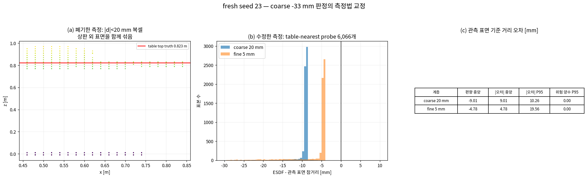
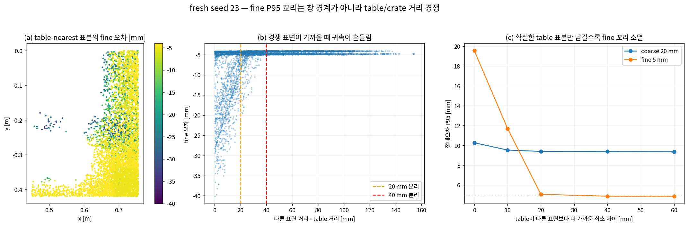

# AG3S + cuRobo 실제 씬 테스트 계획

## 목표

기존 `run_0004`, `run_0005` 또는 저장된 attention 파일을 입력으로 재생하지 않고, 테스트를
시작한 시점에 만든 MuJoCo 씬과 센서 관측으로 AG3S와 cuRobo의 기능을 직접 확인한다.

테스트는 다음 질문에 답해야 한다.

1. AG3S가 현재 RGB-D, 카메라 보정, 로봇 자세와 attention으로 올바른 3차원 안전 씬을
   만드는가?
2. cuRobo `Mapper`가 AG3S가 마스킹한 현재 depth를 적분하여 올바른 TSDF와 ESDF를 만드는가?
3. cuRobo 거리장이 로봇 구와 SQP 최적화기에 같은 좌표와 부호로 전달되는가?
4. 수정된 청크가 실제 MuJoCo 기하에서 안전하며, 작업 목적을 불필요하게 훼손하지 않는가?
5. 이 전체 과정이 청크 시간 예산 안에서 동작하는가?

이 문서는 실행 계획과 판정 기준을 정의한다. 확정된 구현 및 검증 결과는 정본인
[`AG3S_REVIEW_LOG.md`](AG3S_REVIEW_LOG.md)에 이어 쓴다.

## 범위

현재 통합에서 cuRobo의 대상 기능은 `Mapper`의 다중 카메라 TSDF 적분, 표면 추출과 ESDF
생성이다. 최종 궤적 수정은 cuRobo `MotionGen`이 아니라 이 저장소의 SQP/OSQP 구현이다.
`MotionGen`, IK와 전체 cuRobo motion planning은 이 계획의 직접 대상이 아니며, 필요하면 별도
비교 실험으로 추가한다.

현재 라이브 AG3S 경로의 `pipeline.py::_build_esdf`는 내부 `EsdfBuilder`를 사용한다. cuRobo
필드 생성과 `CuroboEsdfField` 소비는 오프라인 경로에만 있다. 따라서 실제 결합 시험의 첫 번째
게이트는 새 센서 프레임이 cuRobo `Mapper`를 실제로 통과했음을 런타임에서 증명하는 것이다.

## 입력과 증거 규약

### 입력

- 테스트 입력으로 `run_XXXX`, 기존 `.npz`, 기존 attention dump를 사용하지 않는다.
- 각 시나리오는 MuJoCo 모델을 새로 초기화하고 현재 RGB-D와 로봇 상태를 다시 캡처한다.
- 물체 배치, 센서 누락, 로봇 자세와 obstacle 조건은 실행 명령의 seed와 설정으로 만든다.
- 정책 attention을 시험할 때는 현재 정책 호출에서 나온 값만 사용한다. 합성 attention을 쓰는
  단위 시험은 결과에 `synthetic_attention: true`를 명시하고 실제 attention 시험과 분리한다.

### 저장

- 테스트 후 저장한 프레임은 실패 분석의 증거이며 최초 판정의 입력이 아니다.
- 실패를 고친 뒤의 최종 판정은 저장 프레임 재생이 아니라 다른 seed의 새 씬에서 다시 수행한다.
- 원시 산출물은 `outputs/live_test/<session>/<scenario>/`에 둔다.
- 문서용 그림은 `benchmark/ag3s/docs/figures/live-test/`에 둔다.
- 저장 디렉터리는 `run_XXXX` 대신 시각과 시나리오 이름을 사용하여 기존 replay와 구분한다.

## 전체 실행 경로

```text
새 MuJoCo 씬
  -> 현재 RGB-D + K + T_base_cam + robot_state
  -> AG3S 로봇 마스크 / attention lifting / target grounding
  -> 마스킹된 depth
  -> cuRobo Mapper: TSDF 적분 -> coarse/fine ESDF
  -> CuroboEsdfField: 거리와 기울기
  -> SQP: reference chunk -> refined chunk
  -> MuJoCo 실행
  -> MuJoCo 원래 충돌 기하로 독립 판정
```

MuJoCo 원래 기하를 참값으로 사용한다. 시험 대상인 ESDF의 출력으로 다시 ESDF를 채점하지 않는다.

## 실행 단계

### T0. 환경과 배선 사전 점검

확인할 것:

- `.venv-ag3s`: MuJoCo, NumPy, SciPy, CasADi와 OSQP
- `.venv-curobo`: PyTorch, CUDA, Warp와 cuRobo
- 동일 RB-Y1 모델, 관절 순서, base 좌표계와 미터 단위
- 테스트 중 실제로 선택된 ESDF backend와 cuRobo 호출 횟수
- 시작 시 TSDF, AG3S 추적, target latch와 SQP warm start 초기화

합격 조건:

- 두 환경의 필수 import와 CUDA 초기화가 성공한다.
- 라이브 결합 테스트에서 legacy `EsdfBuilder`가 호출되면 실패한다.
- 실행 메타데이터에 Python, NumPy, PyTorch, cuRobo commit, GPU, 모델 경로와 설정을 남긴다.

### T1. 새 단일 프레임의 AG3S 기능

씬은 테이블, target 하나, 유사한 크기의 방해 물체 하나와 RB-Y1으로 만든다. 물체 위치는 기존
기록에서 읽지 않고 seed로 새로 정한다.

확인할 기능:

1. 세 카메라 depth 역투영과 base 좌표 변환
2. 다중 시점 점군 정렬과 provenance 유지
3. 로봇 self-filter와 ESDF 입력용 로봇 마스크
4. attention의 2D 픽셀에서 3D 점으로의 lifting
5. target grounding과 target/obstacle 분리
6. 지지면, 미관측 영역과 정적 기하 상태

합격 조건:

- target 중심 오차, 지지면 높이 오차와 카메라 간 표면 정렬 오차를 수치로 낸다.
- 마스크 후 로봇 표면이 장애물로 남아 만든 위반이 없어야 한다.
- attention이 낮은 실제 장애물도 충돌 기하에서 사라지지 않아야 한다.
- 입력 부족은 `degraded`, `no_target` 또는 명시적 실패가 되어야 하며 조용히 정상으로 바뀌면
  안 된다.

### T2. 새 다중 프레임의 AG3S 상태 기능

접근, 파지, 운반과 놓기의 짧은 MuJoCo 동작을 현재 실행에서 만든다.

확인할 기능:

- 후보와 target의 프레임 간 추적
- 파지 전 target과 파지 후 조작 대상의 분리
- latch, `attach`, 목적지 전환과 `detach`
- 쥔 물체 query point와 허용 접촉 링크
- 누적 TSDF의 잔상과 감쇠

합격 조건:

- attention이 목적지로 옮겨가도 조작 대상 ID가 임의로 바뀌지 않는다.
- 쥔 물체는 로봇 충돌 기하에 포함되고 자기 표면은 장애물 필드에서 제거된다.
- 놓은 뒤에는 대상과 목적지 상태가 다음 과제에 남지 않는다.

### T3. 같은 새 관측의 cuRobo 기능

T1에서 캡처한 마스킹 depth를 저장된 데이터셋으로 취급하지 않고 같은 테스트 실행의 다음 단계로
즉시 cuRobo 프로세스에 전달한다.

확인할 기능:

1. 세 카메라의 TSDF 누적 적분
2. 표면 복셀과 mesh 추출
3. 20 mm coarse ESDF와 5 mm fine ESDF 생성
4. ESDF 좌표 원점, 부호, 거리와 기울기
5. 연속 `compute_esdf()` 호출의 버퍼 독립성
6. `reset`, 재적분과 영역 삭제

합격 조건:

- 물체 안쪽은 음수, 자유공간은 양수다.
- 자유공간의 $$|\nabla d|$$ 중앙값이 `0.9`에서 `1.1` 사이다.
- coarse와 fine 격자의 좌표가 반 복셀 이상 잘못 이동하지 않는다.
- fine 영역의 거리 오차가 coarse보다 작아야 한다.
- 두 번째 `compute_esdf()`가 첫 번째 계층의 값을 덮어쓰지 않는다.

### T4. AG3S에서 cuRobo, 거리장 어댑터까지의 결합

다음 짝을 같은 현재 프레임에서 비교한다.

| 비교 | 확인하려는 문제 |
|---|---|
| raw depth / robot-masked depth | 자기 몸을 장애물로 보는 오류와 과도한 마스킹 |
| coarse / coarse+fine | 미세 계층의 실제 정확도 이득과 ROI 경계 불연속 |
| 단일 프레임 / 누적 프레임 | 가림 보완과 옛 표면 잔상 |
| ESDF 거리 / MuJoCo 참 거리 | 위험한 양의 오차, 즉 실제보다 멀다고 답하는 오류 |
| ESDF 기울기 / 유한차분 | SQP가 사용하는 회피 방향의 일치 |

합격 조건:

- `CuroboEsdfField`가 거리를 고른 계층과 같은 계층의 기울기를 사용한다.
- 전체 계획 지평의 로봇 구와 attached point가 coarse coverage 안에 있다.
- field 밖 또는 미관측 질의는 정상 안전 거리로 조용히 처리되지 않는다.
- 실제보다 멀다고 답하는 오차는 coarse 영역에서 한 coarse voxel, fine 영역에서 한 fine voxel을
  넘으면 실패 후보로 기록하고 원인을 확인한다.

### T5. Shadow closed loop

정책 청크를 현재 씬에서 생성하고 AG3S, cuRobo와 SQP를 전부 실행하되 수정 청크는 로봇에 보내지
않는다. 이를 shadow mode라고 한다.

확인할 것:

- reference와 refined 청크의 최소 MuJoCo 여유거리
- AG3S 상태, 기하 인증, SQP 상태와 hold 판정의 일치
- 관절별 수정량, 속도·가속 한계와 청크 이음부
- 카메라 캡처, AG3S, cuRobo 적분, ESDF, SQP와 전체 지연

합격 조건:

- MuJoCo 참값에서 refined 청크의 안전 여유가 reference보다 나빠지지 않는다.
- 인증되지 않은 기하, stale 응답, timeout과 예외는 모두 hold로 이어진다.
- clear 씬에서는 불필요한 수정량과 태스크 말단 자세 변화가 작아야 한다.

### T6. 실행 closed loop

T5를 통과한 뒤 속도를 낮춰 수정 청크를 실제 MuJoCo 제어기에 보낸다. 난도는 다음 순서로 높인다.

1. clear scene
2. 한 팔의 경로 옆 정적 장애물
3. 원래 정책 경로를 가로막는 장애물
4. 한 카메라에서 가려지는 장애물
5. 카메라 한 대 누락 또는 오래된 자세
6. target 파지, 운반과 목적지 놓기

각 조건은 최소 세 개의 새 seed에서 반복한다.

합격 조건:

- MuJoCo 접촉 기준의 금지 충돌이 없다.
- 전체 계획 지평에서 최종 여유거리가 0 이상이다.
- clear 조건의 태스크 성공을 훼손하지 않는다.
- 불확실한 조건에서는 움직임보다 hold를 선택한다.
- 청크 예산 533 ms에 대해 전체 지연의 P50, P95와 최댓값을 보고한다. P95가 예산을 넘으면
  기능 통과와 별도로 실시간 실패로 기록한다.

## 시각화 계약

각 테스트는 다음 세 종류를 모두 만든다.

### 실제 씬

- MuJoCo RGB와 depth
- 로봇 마스크 적용 전과 후
- 카메라별 attention heatmap과 선택된 target
- 실제 물체 mesh, 재구성 표면, 로봇 구와 attached point를 같은 3D 좌표에 중첩
- reference와 refined swept path
- ESDF 단면과 그 단면의 위치 및 시선 방향을 보여주는 배치도

### 그래프

- 프레임별 target 중심과 ID
- 실제 거리, ESDF 거리와 오차
- 계획 스텝별 최소 여유거리 before/after
- 단계별 지연과 청크 전체 지연
- 수정량, 속도·가속 한계와 hold 사유

### 표

- 설정과 환경 버전
- 시나리오별 합격/실패 및 최초 실패 단계
- coarse/fine, raw/masked와 reference/refined의 짝 비교
- AG3S, 기하 인증, SQP와 실행 게이트의 상태

## 문제 수정 절차

1. 실패한 새 실행의 원시 입력과 중간 산출물을 보존한다.
2. MuJoCo 참값과 단계별 그림에서 처음 어긋난 모듈을 찾는다.
3. 원인을 하나의 작은 재현으로 줄이고 관련 회귀 테스트를 추가한다.
4. 최소 범위로 구현을 수정한다.
5. 고정 실패 프레임으로 회귀를 확인한다.
6. 다른 seed의 새 씬에서 실제 경로를 다시 실행한다.
7. 새 실행도 통과했을 때만 정본 로그에 발견과 수정 결과를 기록한다.

## 실행 상태

| 항목 | 상태 | 근거 |
|---|---|---|
| `.venv-ag3s` import | 통과 | Python 3.11.16, MuJoCo 3.11.0, NumPy 2.4.6 |
| `.venv-curobo` import | 통과 | Python 3.10.12, PyTorch 2.5.0a0, CUDA 사용 가능 |
| cuRobo 소스 | 통과 | `/mnt/dev/work/curobo_src/curobo`에서 import |
| fresh one-shot AG3S→cuRobo | 통과 | seed 17·23, 기존 기록 입력 0건 |
| 실제 cuRobo closed-loop 배선 | 미착수 | 현재 production AG3S는 legacy `EsdfBuilder` 사용 |
| T1 새 단일 프레임 | 조건부 통과 | grounding 정상, overflow 2점 때문에 `degraded` |
| T3 cuRobo 단일 프레임 | 통과 | CUDA Mapper, eikonal coarse 0.999 / fine 1.000 |
| T4 결합 진단 | 진행 중 | target·잔여 위반·오차 귀속 완료, 범위 밖 검사 대기 |

## 첫 실행 단위

첫 구현 및 실행은 다음 범위로 제한한다.

1. 저장 기록을 읽지 않고 MuJoCo transport 씬을 새로 초기화한다.
2. 현재 자세에서 세 카메라 RGB-D와 카메라 보정을 캡처한다.
3. AG3S 로봇 마스크와 단일 프레임 중간 결과를 만든다.
4. 같은 실행에서 생성한 마스킹 depth를 cuRobo `Mapper`에 전달한다.
5. coarse/fine ESDF를 만들고 MuJoCo 참 거리와 비교한다.
6. 실제 씬, ESDF 단면, 거리 오차 그래프와 판정표를 저장한다.

이 단위가 통과하기 전에는 정책 체크포인트나 closed-loop 동작을 시작하지 않는다.

## 1차 실행 결과 — 2026-09-18, seed 17

기존 기록을 읽지 않고 새 MuJoCo transport 씬을 초기화했다. target의 평면 위치를 seed로
이동한 뒤 현재 시뮬레이션 시각의 세 카메라를 캡처했다. 이 실행의 attention은 정책 검증과
분리된 합성 Gaussian이다.


| 항목 | 실측 | 1차 판정 |
|---|---:|---|
| 기존 `run_XXXX` 입력 | 0건 | 통과 |
| AG3S 상태 | `degraded`, grounding `ok` | 원인 분해 필요 |
| MuJoCo target 원점과 AG3S 관측 중심 차이 | 44.23 mm | 표면 중심 차이인지 오검출인지 확인 |
| head robot mask | 70,728 / 307,200 px, 23.02 % | 수치 확보 |
| left/right wrist robot mask | 각각 4,686 px, 1.53 % | 수치 확보 |
| cuRobo coarse eikonal 중앙값 | 0.999 | 통과 (`0.9`–`1.1`) |
| cuRobo fine eikonal 중앙값 | 1.000 | 통과 (`0.9`–`1.1`) |
| 어댑터 복셀 중심 왕복 오차 | 두 계층 모두 0.000 µm | 통과 |
| 테이블 표면 z 오차, coarse 20 mm | -33.0 mm | 폐기된 측정 — 아래 교정 절 참고 |
| 테이블 표면 z 오차, fine 5 mm | -0.7 mm | 폐기된 측정 — 아래 교정 절 참고 |
| raw depth의 위반 로봇 구 | 109 / 120 | 예상한 자기 관측 문제 재현 |
| robot-masked depth의 위반 로봇 구 | 10 / 120 | 개선, 남은 위반 귀속 필요 |
| masked 최악 여유거리 | -27.5 mm | 실행 금지, 원인 분해 필요 |

현재 단계에서 확정할 수 있는 것은 세 가지다.

1. 새 씬의 AG3S 출력이 같은 테스트 세션에서 실제 CUDA cuRobo `Mapper`까지 도달했다.
2. 로봇 마스크가 자기 관측에 의한 위반을 크게 줄였지만 모든 위반을 없애지는 않았다.
3. `|d| < voxel_size` 복셀의 z 중앙값은 표면 정확도 판정으로 불충분하며, 아래에서 관측
   표면까지의 직접 거리 비교로 교체한다.

다음 실행에서는 남은 10개 위반 구를 링크와 최근접 MuJoCo geom에 귀속한다. 또한 target 중심
44.23 mm 차이를 body 원점, 보이는 표면 중심과 잘못 선택한 클러스터의 세 경우로 나누어
확인한다. 이 두 항목이 닫히기 전에는 T5 shadow closed loop로 넘어가지 않는다.

## 2차 실행 결과 — 2026-09-18, seed 23

두 번째 새 씬에는 카메라별 MuJoCo body/geom segmentation truth를 함께 저장했다. 이를 이용해
target 중심과 모든 위반 구의 최근접 body를 귀속했다.


### target 중심

| 비교 | 거리 |
|---|---:|
| MuJoCo body 원점 → 보이는 사과 표면 중심 | 23.12 mm |
| AG3S target 중심 → 보이는 사과 표면 중심 | 6.25 mm |
| AG3S target 중심 → MuJoCo body 원점 | 20.38 mm |

body 원점과 관측 표면 중심은 같은 값이 아니다. AG3S는 보이는 depth 점을 grounding하므로 두
번째 비교가 기능에 맞는 판정이다. seed 23의 6.25 mm 차이는 target 오검출이 아니라 같은 사과의
표면 표본화 차이로 판정한다. seed 17의 44.23 mm도 body 원점만 기준으로 한 수치이므로 실패
판정에서 제외하고, 이후 seed에는 보이는 표면 중심 기준을 사용한다.

### robot-masked ESDF의 잔여 위반

마스크 후 여유거리 위반 구는 9/120개였다. 최근접 segmentation body는 9개 모두 `crate`였다.
구성은 `link_right_arm_5` 1개, `link_left_arm_5` 1개, 오른손 손가락 5개와 왼손 손가락 2개다.
최악 여유거리는 -26.65 mm였다.

따라서 이 위반은 로봇 self-filter 잔여물이 아니다. 현재 teleop 자세가 상자에 대해 50 mm
안전 마진을 확보하지 못한 실제 근접 상태다. raw depth의 109개 위반과 구분해야 한다.

### `degraded` 원인

두 번째 seed에서도 grounding은 `ok`였고 카메라 skew와 stale pose는 0이었다. `degraded`는
클러스터 한도를 넘은 점 2개가 보수적 aggregate 2개로 접혀 보고된 것이다. target 실패나 카메라
정합 실패가 아니다. 다만 두 점 때문에 전체 기하 인증이 내려가는 정책이 적절한지는 T4에서
별도 판정한다.

이 결과로 target 중심과 마스크 후 위반의 귀속은 닫혔다. 다음은 coarse 계층의 -33 mm 표면
오차가 좌표 오류인지, 표면 선택 기준의 오류인지, 실제 coarse 이산화 결과인지 분리하는 것이다.

## coarse -33 mm 판정 교정



기존 `verify_adapter`의 테이블 정확도는 작업 영역에서 `|d| < voxel_size`인 모든 복셀의 z
중앙값을 테이블 상판 0.823 m와 비교했다. 이 선택은 테이블 상판뿐 아니라 하판과 주변의 수직
표면을 함께 포함한다. 따라서 -33 mm는 coarse ESDF의 상판 위치 오차로 해석할 수 없다.

교정된 측정은 다음 순서를 쓴다.

1. 마스크가 적용된 세 카메라의 원해상도 depth를 base 좌표로 역투영한다.
2. MuJoCo segmentation에서 최근접 body가 `table`인 probe만 선택한다.
3. probe와 최근접 관측 표면의 거리를 참값으로 둔다.
4. 같은 probe에 대한 coarse와 fine ESDF 값을 비교한다.

이 방법은 완전한 MuJoCo mesh 거리 대신 필드와 동일한 관측 표면을 사용하므로 카메라가 못 본
면의 차이를 섞지 않고 복셀화와 TSDF 적분 오차를 본다.

| 계층 | 편향 중앙 | 절대오차 중앙 | 절대오차 P95 | 위험한 양의 오차 P95 |
|---|---:|---:|---:|---:|
| coarse 20 mm | -9.01 mm | 9.01 mm | 10.26 mm | 0.00 mm |
| fine 5 mm | -4.78 mm | 4.78 mm | 19.56 mm | 0.00 mm |

표본은 table-nearest probe 6,066개다. 두 계층 모두 이 표본에서는 실제보다 멀다고 답하는 위험한
양의 오차가 없었고, 모두 더 가깝다고 답하는 안전 방향이었다. coarse의 편향 중앙 -9.01 mm는
20 mm 복셀 반 칸 이내다. 따라서 -33 mm 실패 판정은 취소하고 측정법 결함으로 확정한다.

fine은 중앙 오차는 줄였지만 P95가 19.56 mm로 coarse보다 크다. 미세 계층이 모든 위치에서 더
정확하다는 주장은 아직 통과하지 못했다. 다음 T4에서는 fine 창 경계, 가림 영역과 TSDF 표면
증거 밀도별로 이 꼬리를 나눈다.

## fine 오차 꼬리의 귀속



fine 절대오차 P95 19.56 mm인 표본은 미세 창 경계에 모이지 않았다. table과 crate의 거리가
비슷한 영역에 모였다. 점군 참값은 table 점이 아주 조금 가까우면 `table`로 귀속하지만, 익명
ESDF는 복셀화 뒤 crate가 더 가까워져도 어느 물체가 거리를 만들었는지 알려주지 않는다. 이때
crate 거리를 table 오차로 세면 fine의 정확도 꼬리처럼 보인다.

table 표면이 다른 모든 관측 표면보다 확실히 가까운 정도를 단계적으로 키워 다시 측정했다.

| 최소 거리 차이 | 표본 | coarse 절대오차 P95 | fine 절대오차 P95 |
|---:|---:|---:|---:|
| 0 mm | 6,066 | 10.26 mm | 19.56 mm |
| 10 mm | 5,015 | 9.52 mm | 11.70 mm |
| 20 mm | 4,088 | 9.39 mm | 5.06 mm |
| 40 mm | 2,584 | 9.38 mm | 4.87 mm |
| 60 mm | 1,495 | 9.36 mm | 4.86 mm |

40 mm 이상 분리된 표본에서 coarse P95는 약 반 복셀인 9.38 mm, fine P95는 약 한 복셀인
4.87 mm다. 따라서 fine 해상도 자체는 기대한 정확도 이득을 보인다. 19.56 mm 꼬리는 미세 창
경계나 필드 파손이 아니라 경쟁 표면의 정체를 익명 ESDF에서 귀속하려 한 측정 문제로 판정한다.

이 결과는 object-aware 거리장의 필요성도 다시 보여준다. 현재 제약은 가장 가까운 표면까지의
거리로 안전하게 동작할 수 있지만, “어느 물체 때문에 거리값이 나왔는가”를 사후 분석하거나
물체별 마진을 적용하려면 최근접 표면 라벨이 필요하다. T4의 남은 항목은 field 범위 밖과
미관측 질의의 fail-closed 동작, 그리고 production closed-loop에서 실제 cuRobo를 호출하는
배선이다.
