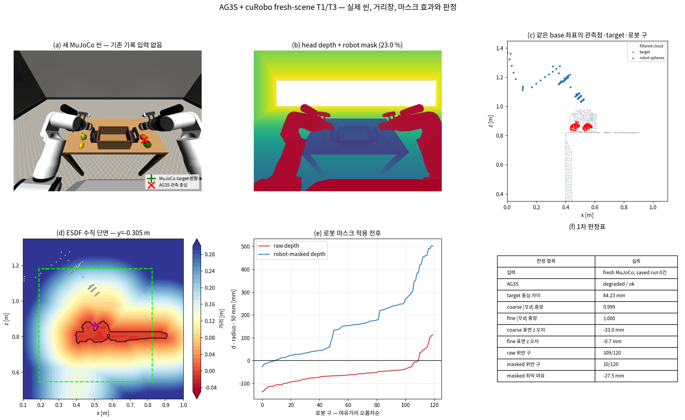
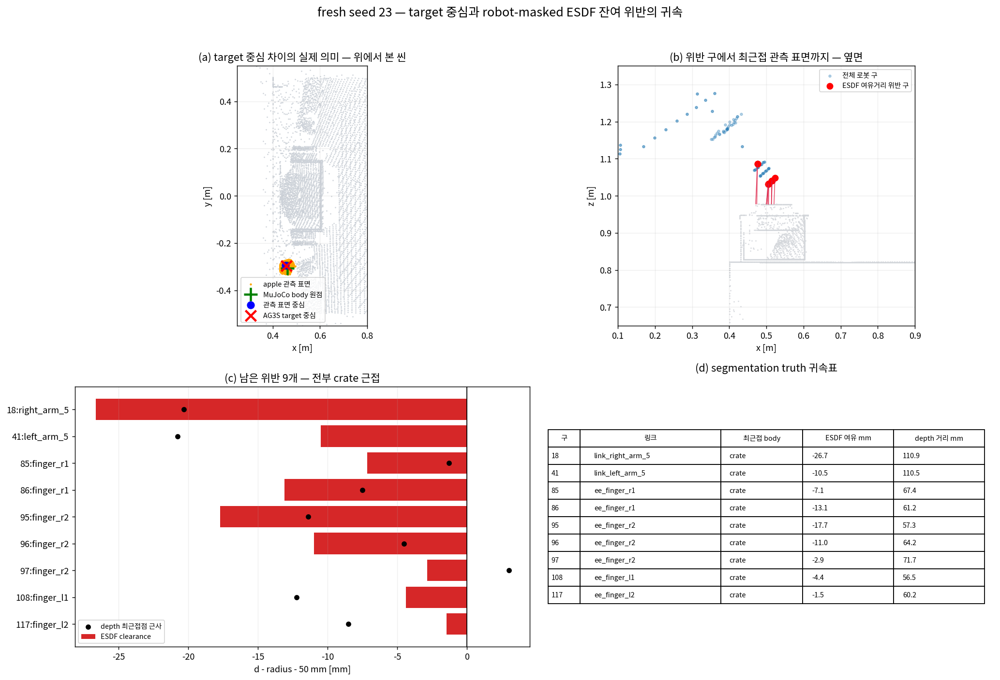
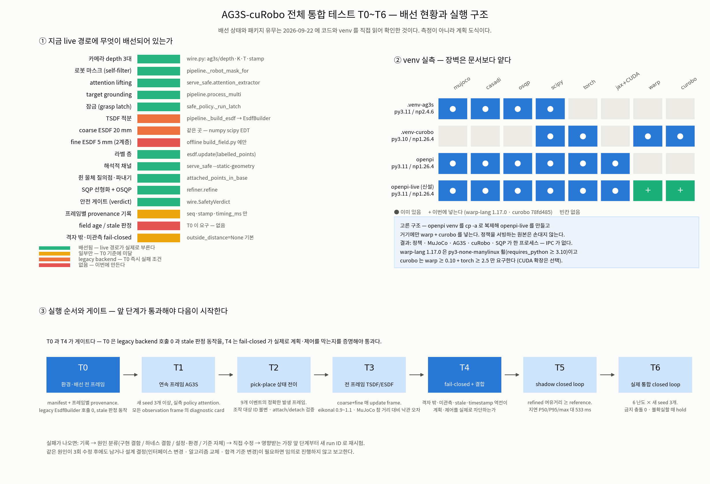
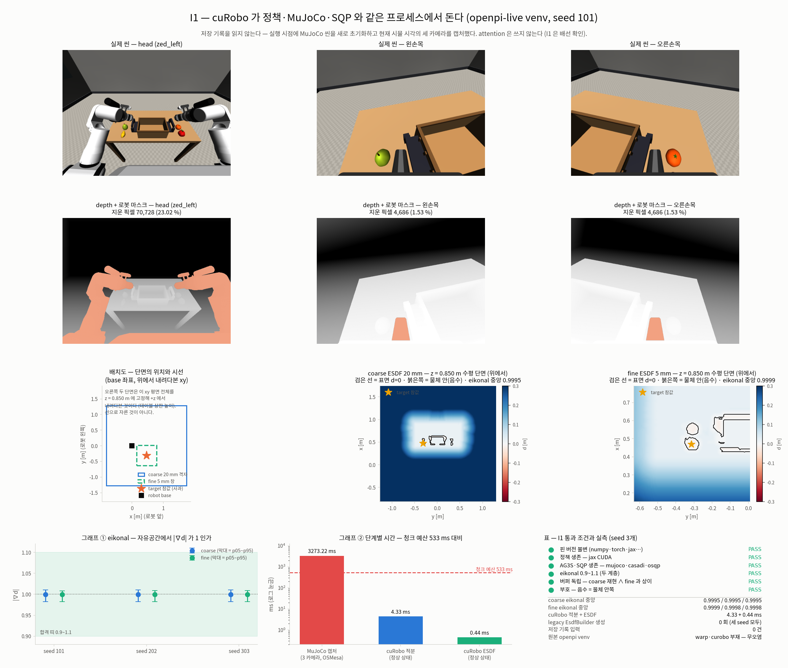
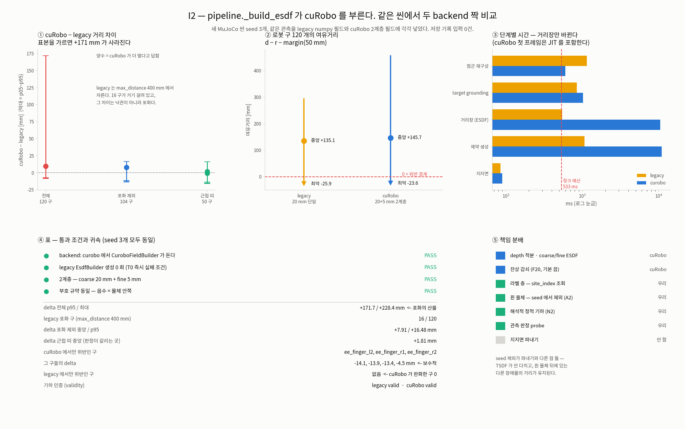
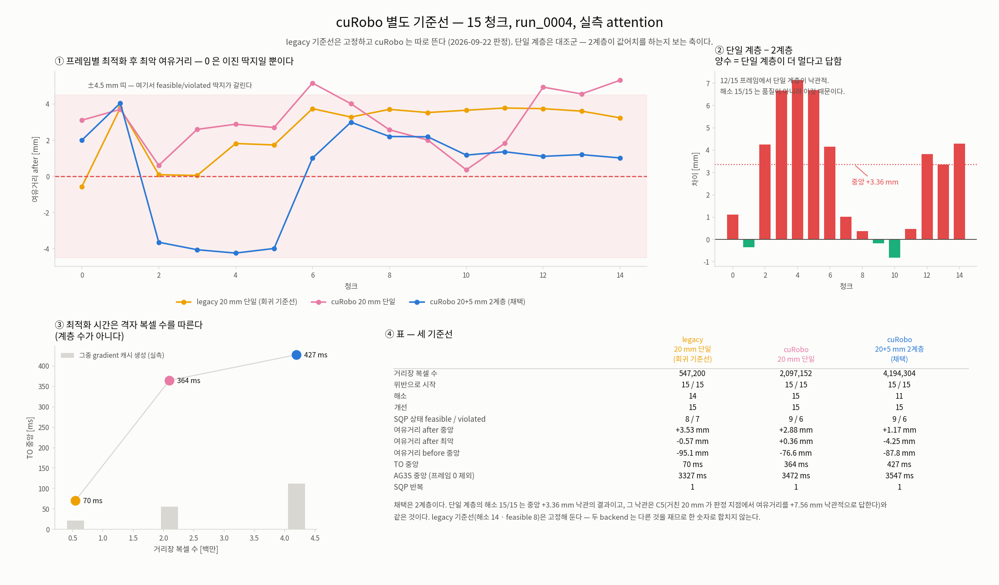
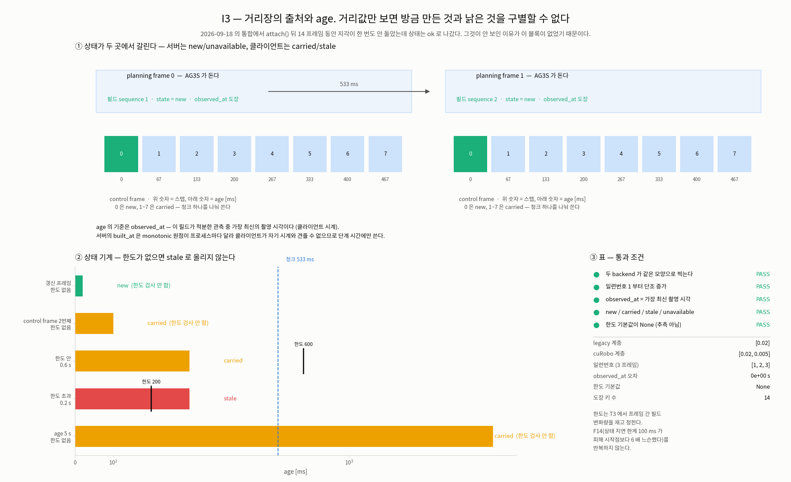
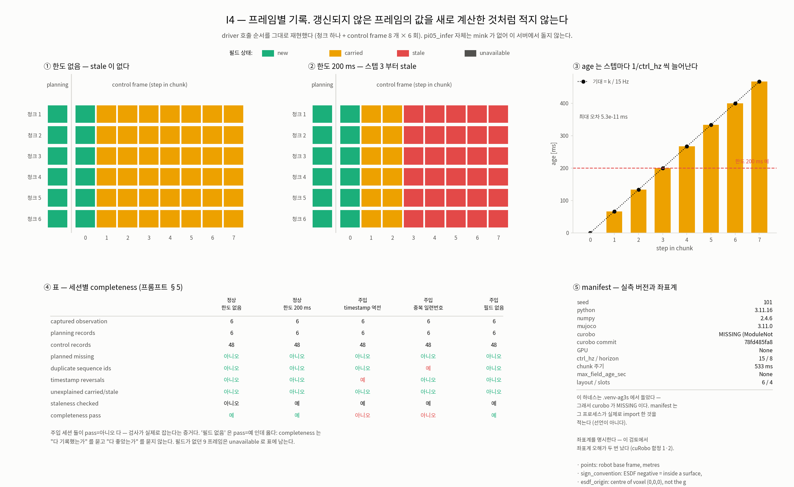
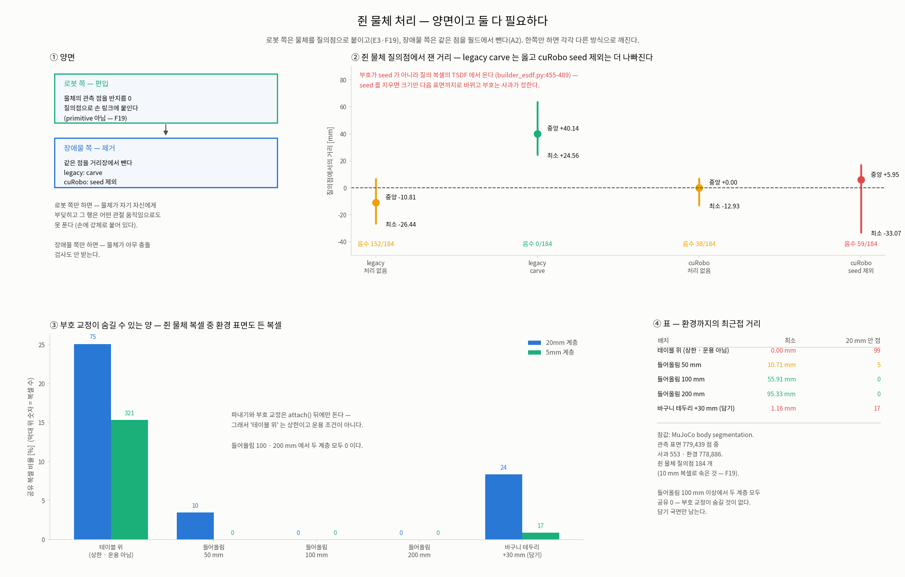
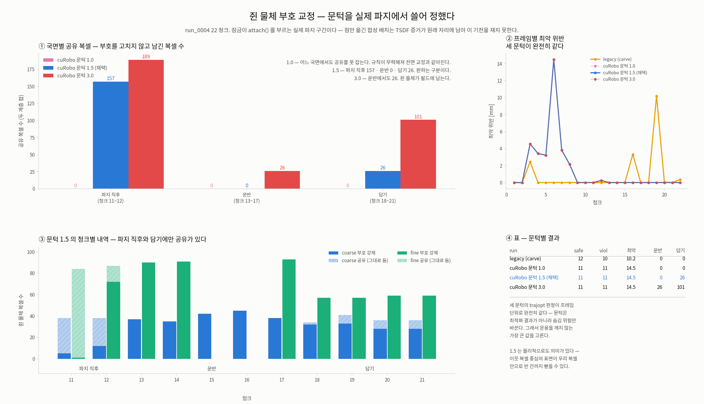

# AG3S + cuRobo 실제 씬 테스트 계획

## 목표

기존 `run_0004`, `run_0005` 또는 저장된 attention 파일을 입력으로 재생하지 않고, 테스트를
시작한 시점에 만든 MuJoCo 씬과 센서 관측으로 AG3S와 cuRobo의 기능을 직접 확인한다.

테스트는 다음 질문에 답해야 한다.

1. AG3S가 현재 RGB-D, 카메라 보정, 로봇 자세와 attention으로 올바른 3차원 안전 씬을
   만드는가?
2. cuRobo `Mapper`가 AG3S가 마스킹한 현재 depth를 적분하여 올바른 TSDF와 ESDF를 만드는가?
3. cuRobo 거리장이 로봇 구와 SQP 최적화기에 같은 좌표와 부호로 전달되는가?
4. 수정된 청크가 실제 MuJoCo 기하에서 안전하며, 작업 목적을 불필요하게 훼손하지 않는가?
5. 이 전체 과정이 청크 시간 예산 안에서 동작하는가?

이 문서는 실행 계획과 판정 기준을 정의한다. 확정된 구현 및 검증 결과는 정본인
[`AG3S_T0T6_LOG.md`](AG3S_T0T6_LOG.md)에 이어 쓴다 (2026-09-24 부터 — 그 앞은
[`AG3S_REVIEW_LOG.md`](AG3S_REVIEW_LOG.md), 이어 쓰지 않는 archive 다).

## 범위

현재 통합에서 cuRobo의 대상 기능은 `Mapper`의 다중 카메라 TSDF 적분, 표면 추출과 ESDF
생성이다. 최종 궤적 수정은 cuRobo `MotionGen`이 아니라 이 저장소의 SQP/OSQP 구현이다.
`MotionGen`, IK와 전체 cuRobo motion planning은 이 계획의 직접 대상이 아니며, 필요하면 별도
비교 실험으로 추가한다.

현재 라이브 AG3S 경로의 `pipeline.py::_build_esdf`는 내부 `EsdfBuilder`를 사용한다. cuRobo
필드 생성과 `CuroboEsdfField` 소비는 오프라인 경로에만 있다. 따라서 실제 결합 시험의 첫 번째
게이트는 새 센서 프레임이 cuRobo `Mapper`를 실제로 통과했음을 런타임에서 증명하는 것이다.

## 입력과 증거 규약

### 입력

- 테스트 입력으로 `run_XXXX`, 기존 `.npz`, 기존 attention dump를 사용하지 않는다.
- 각 시나리오는 MuJoCo 모델을 새로 초기화하고 현재 RGB-D와 로봇 상태를 다시 캡처한다.
- 물체 배치, 센서 누락, 로봇 자세와 obstacle 조건은 실행 명령의 seed와 설정으로 만든다.
- 정책 attention을 시험할 때는 현재 정책 호출에서 나온 값만 사용한다. 합성 attention을 쓰는
  단위 시험은 결과에 `synthetic_attention: true`를 명시하고 실제 attention 시험과 분리한다.

### 저장

- 테스트 후 저장한 프레임은 실패 분석의 증거이며 최초 판정의 입력이 아니다.
- 실패를 고친 뒤의 최종 판정은 저장 프레임 재생이 아니라 다른 seed의 새 씬에서 다시 수행한다.
- 원시 산출물은 `outputs/live_test/<session>/<scenario>/`에 둔다.
- 문서용 그림은 `benchmark/ag3s/docs/figures/live-test/`에 둔다.
- 저장 디렉터리는 `run_XXXX` 대신 시각과 시나리오 이름을 사용하여 기존 replay와 구분한다.

## 전체 실행 경로

```text
새 MuJoCo 씬
  -> 현재 RGB-D + K + T_base_cam + robot_state
  -> AG3S 로봇 마스크 / attention lifting / target grounding
  -> 마스킹된 depth
  -> cuRobo Mapper: TSDF 적분 -> coarse/fine ESDF
  -> CuroboEsdfField: 거리와 기울기
  -> SQP: reference chunk -> refined chunk
  -> MuJoCo 실행
  -> MuJoCo 원래 충돌 기하로 독립 판정
```

MuJoCo 원래 기하를 참값으로 사용한다. 시험 대상인 ESDF의 출력으로 다시 ESDF를 채점하지 않는다.

## 실행 단계

### T0. 환경과 배선 사전 점검

확인할 것:

- `.venv-ag3s`: MuJoCo, NumPy, SciPy, CasADi와 OSQP
- `.venv-curobo`: PyTorch, CUDA, Warp와 cuRobo
- 동일 RB-Y1 모델, 관절 순서, base 좌표계와 미터 단위
- 테스트 중 실제로 선택된 ESDF backend와 cuRobo 호출 횟수
- 시작 시 TSDF, AG3S 추적, target latch와 SQP warm start 초기화

합격 조건:

- 두 환경의 필수 import와 CUDA 초기화가 성공한다.
- 라이브 결합 테스트에서 legacy `EsdfBuilder`가 호출되면 실패한다.
- 실행 메타데이터에 Python, NumPy, PyTorch, cuRobo commit, GPU, 모델 경로와 설정을 남긴다.

### T1. 새 단일 프레임의 AG3S 기능

씬은 테이블, target 하나, 유사한 크기의 방해 물체 하나와 RB-Y1으로 만든다. 물체 위치는 기존
기록에서 읽지 않고 seed로 새로 정한다.

확인할 기능:

1. 세 카메라 depth 역투영과 base 좌표 변환
2. 다중 시점 점군 정렬과 provenance 유지
3. 로봇 self-filter와 ESDF 입력용 로봇 마스크
4. attention의 2D 픽셀에서 3D 점으로의 lifting
5. target grounding과 target/obstacle 분리
6. 지지면, 미관측 영역과 정적 기하 상태

합격 조건:

- target 중심 오차, 지지면 높이 오차와 카메라 간 표면 정렬 오차를 수치로 낸다.
- 마스크 후 로봇 표면이 장애물로 남아 만든 위반이 없어야 한다.
- attention이 낮은 실제 장애물도 충돌 기하에서 사라지지 않아야 한다.
- 입력 부족은 `degraded`, `no_target` 또는 명시적 실패가 되어야 하며 조용히 정상으로 바뀌면
  안 된다.

### T2. 새 다중 프레임의 AG3S 상태 기능

접근, 파지, 운반과 놓기의 짧은 MuJoCo 동작을 현재 실행에서 만든다.

확인할 기능:

- 후보와 target의 프레임 간 추적
- 파지 전 target과 파지 후 조작 대상의 분리
- latch, `attach`, 목적지 전환과 `detach`
- 쥔 물체 query point와 허용 접촉 링크
- 누적 TSDF의 잔상과 감쇠

합격 조건:

- attention이 목적지로 옮겨가도 조작 대상 ID가 임의로 바뀌지 않는다.
- 쥔 물체는 로봇 충돌 기하에 포함되고 자기 표면은 장애물 필드에서 제거된다.
- 놓은 뒤에는 대상과 목적지 상태가 다음 과제에 남지 않는다.

### T3. 같은 새 관측의 cuRobo 기능

T1에서 캡처한 마스킹 depth를 저장된 데이터셋으로 취급하지 않고 같은 테스트 실행의 다음 단계로
즉시 cuRobo 프로세스에 전달한다.

확인할 기능:

1. 세 카메라의 TSDF 누적 적분
2. 표면 복셀과 mesh 추출
3. 20 mm coarse ESDF와 5 mm fine ESDF 생성
4. ESDF 좌표 원점, 부호, 거리와 기울기
5. 연속 `compute_esdf()` 호출의 버퍼 독립성
6. `reset`, 재적분과 영역 삭제

합격 조건:

- 물체 안쪽은 음수, 자유공간은 양수다.
- 자유공간의 $$|\nabla d|$$ 중앙값이 `0.9`에서 `1.1` 사이다.
- coarse와 fine 격자의 좌표가 반 복셀 이상 잘못 이동하지 않는다.
- fine 영역의 거리 오차가 coarse보다 작아야 한다.
- 두 번째 `compute_esdf()`가 첫 번째 계층의 값을 덮어쓰지 않는다.

### T4. AG3S에서 cuRobo, 거리장 어댑터까지의 결합

다음 짝을 같은 현재 프레임에서 비교한다.

| 비교 | 확인하려는 문제 |
|---|---|
| raw depth / robot-masked depth | 자기 몸을 장애물로 보는 오류와 과도한 마스킹 |
| coarse / coarse+fine | 미세 계층의 실제 정확도 이득과 ROI 경계 불연속 |
| 단일 프레임 / 누적 프레임 | 가림 보완과 옛 표면 잔상 |
| ESDF 거리 / MuJoCo 참 거리 | 위험한 양의 오차, 즉 실제보다 멀다고 답하는 오류 |
| ESDF 기울기 / 유한차분 | SQP가 사용하는 회피 방향의 일치 |

합격 조건:

- `CuroboEsdfField`가 거리를 고른 계층과 같은 계층의 기울기를 사용한다.
- 전체 계획 지평의 로봇 구와 attached point가 coarse coverage 안에 있다.
- field 밖 또는 미관측 질의는 정상 안전 거리로 조용히 처리되지 않는다.
- 실제보다 멀다고 답하는 오차는 coarse 영역에서 한 coarse voxel, fine 영역에서 한 fine voxel을
  넘으면 실패 후보로 기록하고 원인을 확인한다.

### T5. Shadow closed loop

정책 청크를 현재 씬에서 생성하고 AG3S, cuRobo와 SQP를 전부 실행하되 수정 청크는 로봇에 보내지
않는다. 이를 shadow mode라고 한다.

확인할 것:

- reference와 refined 청크의 최소 MuJoCo 여유거리
- AG3S 상태, 기하 인증, SQP 상태와 hold 판정의 일치
- 관절별 수정량, 속도·가속 한계와 청크 이음부
- 카메라 캡처, AG3S, cuRobo 적분, ESDF, SQP와 전체 지연

합격 조건:

- MuJoCo 참값에서 refined 청크의 안전 여유가 reference보다 나빠지지 않는다.
- 인증되지 않은 기하, stale 응답, timeout과 예외는 모두 hold로 이어진다.
- clear 씬에서는 불필요한 수정량과 태스크 말단 자세 변화가 작아야 한다.

### T6. 실행 closed loop

T5를 통과한 뒤 속도를 낮춰 수정 청크를 실제 MuJoCo 제어기에 보낸다. 난도는 다음 순서로 높인다.

1. clear scene
2. 한 팔의 경로 옆 정적 장애물
3. 원래 정책 경로를 가로막는 장애물
4. 한 카메라에서 가려지는 장애물
5. 카메라 한 대 누락 또는 오래된 자세
6. target 파지, 운반과 목적지 놓기

각 조건은 최소 세 개의 새 seed에서 반복한다.

합격 조건:

- MuJoCo 접촉 기준의 금지 충돌이 없다.
- 전체 계획 지평에서 최종 여유거리가 0 이상이다.
- clear 조건의 태스크 성공을 훼손하지 않는다.
- 불확실한 조건에서는 움직임보다 hold를 선택한다.
- 청크 예산 533 ms에 대해 전체 지연의 P50, P95와 최댓값을 보고한다. P95가 예산을 넘으면
  기능 통과와 별도로 실시간 실패로 기록한다.

## 시각화 계약

각 테스트는 다음 세 종류를 모두 만든다.

### 실제 씬

- MuJoCo RGB와 depth
- 로봇 마스크 적용 전과 후
- 카메라별 attention heatmap과 선택된 target
- 실제 물체 mesh, 재구성 표면, 로봇 구와 attached point를 같은 3D 좌표에 중첩
- reference와 refined swept path
- ESDF 단면과 그 단면의 위치 및 시선 방향을 보여주는 배치도

### 그래프

- 프레임별 target 중심과 ID
- 실제 거리, ESDF 거리와 오차
- 계획 스텝별 최소 여유거리 before/after
- 단계별 지연과 청크 전체 지연
- 수정량, 속도·가속 한계와 hold 사유

### 표

- 설정과 환경 버전
- 시나리오별 합격/실패 및 최초 실패 단계
- coarse/fine, raw/masked와 reference/refined의 짝 비교
- AG3S, 기하 인증, SQP와 실행 게이트의 상태

## 문제 수정 절차

1. 실패한 새 실행의 원시 입력과 중간 산출물을 보존한다.
2. MuJoCo 참값과 단계별 그림에서 처음 어긋난 모듈을 찾는다.
3. 원인을 하나의 작은 재현으로 줄이고 관련 회귀 테스트를 추가한다.
4. 최소 범위로 구현을 수정한다.
5. 고정 실패 프레임으로 회귀를 확인한다.
6. 다른 seed의 새 씬에서 실제 경로를 다시 실행한다.
7. 새 실행도 통과했을 때만 정본 로그에 발견과 수정 결과를 기록한다.

## 실행 상태

> **2026-09-22 갱신 — T0~T3 를 `재검증 필요` 로 내렸다.** 근거는 `AG3S_TOTAL_TEST_Prompt.md`
> 의 공통 원칙 1·3 이다. 아래의 기존 통과 판정은 전 프레임 기록 없이 대표 프레임 하나로
> 얻은 것이고, seed 17·23 은 **단일 프레임 · 합성 attention** 이었다. 삭제하지 않고
> 회귀 비교용으로만 남긴다.
>
> **과거 참고 결과 — 현재의 전 프레임 검증 기준을 충족하지 않으므로 합격 근거로 사용할 수 없음**

| 항목 | 상태 | 근거 |
|---|---|---|
| **I1 openpi-live venv** | **통과** (2026-09-22) | seed 101·202·303 전부. cuRobo 가 정책·MuJoCo·SQP 와 한 프로세스에서 돈다. 아래 "I1 실행 결과" 절 |
| **I2 backend 교체** | **통과** (2026-09-22) | `_build_esdf` 가 cuRobo 를 부른다. seed 3개 전부, legacy `EsdfBuilder` 생성 0 회. 아래 "I2 실행 결과" 절 |
| **cuRobo 별도 기준선** | **확정** (2026-09-22) | 15 청크 · 해소 11 / 개선 15 / feasible 9, violated 6. 아래 "cuRobo 별도 기준선" 절 |
| **I3 field provenance · age** | **통과** (2026-09-22) | 두 backend 가 같은 도장, 일련번호 1 부터, 상태 기계 6/6. 한도는 미정(T3). 아래 "I3 실행 결과" 절 |
| **I4 seed · 프레임 기록** | **통과** (2026-09-22) | `--seed` · `--record-frames` · manifest · completeness. 주입 시험이 T0 즉시 실패 조건을 잡는다. 아래 "I4 실행 결과" 절 |
| **T5·T6 전제조건** | **해소** (2026-09-22) | `mink 1.3.0` 을 `.venv-openpi-live` 에 넣었다. driver 가 이 서버에서 돈다. 아래 "driver 전제조건 해소" 절 |
| **쥔 물체 (cuRobo 경로)** | **수정·검증 완료** (2026-09-22) | seed 제외 + **순수 복셀만 부호 교정**, 문턱 1.5 복셀을 실제 파지에서 쓸어 정했다. 아래 "정정" 과 "수정과 검증" 절 |
| T0 환경·배선 | **통과 (2026-09-24)** | 16D held-out 4 에피소드 × 48 스텝, 8 항목 전부 통과. 아래 **"T0 실행 결과"** 절과 로그의 같은 이름 절. 실시간은 별도 판정 **실패** (24/24 청크가 4.7 배) |
| T1 연속 프레임 AG3S | **재검증 필요** | 기존 근거는 seed 17·23 **단일 프레임 + 합성 attention**. 연속 구간·실측 attention·새 seed 3개가 없다 |
| T2 pick-place 상태 전이 | **재검증 필요** | 기존 근거 `a7_episode_walkthrough` 는 `run_0004` **재생**이고 저장된 attention npz 를 읽는다 |
| T3 전 프레임 TSDF/ESDF | **재검증 필요** | 기존 근거는 offline 단일 프레임. live 경로는 아직 legacy `EsdfBuilder` 다 |
| T4 fail-closed + 결합 | 진행 중 | target·잔여 위반·오차 귀속은 닫혔다. 범위 밖·미관측·stale 차단 검사가 남았다 |
| T5 shadow closed loop | 미착수 | — |
| T6 실제 통합 closed loop | 미착수 | — |

### 과거 참고 결과 (합격 근거 아님)

| 항목 | 당시 판정 | 당시 근거 |
|---|---|---|
| `.venv-ag3s` import | 통과 | Python 3.11.16, MuJoCo 3.11.0, NumPy 2.4.6 |
| `.venv-curobo` import | 통과 | Python 3.10.12, PyTorch 2.5.0a0, CUDA 사용 가능 |
| cuRobo 소스 | 통과 | `/mnt/dev/work/curobo_src/curobo` 에서 import, commit `78fd485` |
| fresh one-shot AG3S→cuRobo | 통과 | seed 17·23, 기존 기록 입력 0건 — **단일 프레임** |
| 실제 cuRobo closed-loop 배선 | 미착수 | production AG3S 가 legacy `EsdfBuilder` 사용 |
| T1 새 단일 프레임 | 조건부 통과 | grounding 정상, overflow 2점 때문에 `degraded` |
| T3 cuRobo 단일 프레임 | 통과 | CUDA Mapper, eikonal coarse 0.999 / fine 1.000 |

## 첫 실행 단위

첫 구현 및 실행은 다음 범위로 제한한다.

1. 저장 기록을 읽지 않고 MuJoCo transport 씬을 새로 초기화한다.
2. 현재 자세에서 세 카메라 RGB-D와 카메라 보정을 캡처한다.
3. AG3S 로봇 마스크와 단일 프레임 중간 결과를 만든다.
4. 같은 실행에서 생성한 마스킹 depth를 cuRobo `Mapper`에 전달한다.
5. coarse/fine ESDF를 만들고 MuJoCo 참 거리와 비교한다.
6. 실제 씬, ESDF 단면, 거리 오차 그래프와 판정표를 저장한다.

이 단위가 통과하기 전에는 정책 체크포인트나 closed-loop 동작을 시작하지 않는다.

## 1차 실행 결과 — 2026-09-18, seed 17

기존 기록을 읽지 않고 새 MuJoCo transport 씬을 초기화했다. target의 평면 위치를 seed로
이동한 뒤 현재 시뮬레이션 시각의 세 카메라를 캡처했다. 이 실행의 attention은 정책 검증과
분리된 합성 Gaussian이다.



| 항목 | 실측 | 1차 판정 |
|---|---:|---|
| 기존 `run_XXXX` 입력 | 0건 | 통과 |
| AG3S 상태 | `degraded`, grounding `ok` | 원인 분해 필요 |
| MuJoCo target 원점과 AG3S 관측 중심 차이 | 44.23 mm | 표면 중심 차이인지 오검출인지 확인 |
| head robot mask | 70,728 / 307,200 px, 23.02 % | 수치 확보 |
| left/right wrist robot mask | 각각 4,686 px, 1.53 % | 수치 확보 |
| cuRobo coarse eikonal 중앙값 | 0.999 | 통과 (`0.9`–`1.1`) |
| cuRobo fine eikonal 중앙값 | 1.000 | 통과 (`0.9`–`1.1`) |
| 어댑터 복셀 중심 왕복 오차 | 두 계층 모두 0.000 µm | 통과 |
| 테이블 표면 z 오차, coarse 20 mm | -33.0 mm | 폐기된 측정 — 아래 교정 절 참고 |
| 테이블 표면 z 오차, fine 5 mm | -0.7 mm | 폐기된 측정 — 아래 교정 절 참고 |
| raw depth의 위반 로봇 구 | 109 / 120 | 예상한 자기 관측 문제 재현 |
| robot-masked depth의 위반 로봇 구 | 10 / 120 | 개선, 남은 위반 귀속 필요 |
| masked 최악 여유거리 | -27.5 mm | 실행 금지, 원인 분해 필요 |

현재 단계에서 확정할 수 있는 것은 세 가지다.

1. 새 씬의 AG3S 출력이 같은 테스트 세션에서 실제 CUDA cuRobo `Mapper`까지 도달했다.
2. 로봇 마스크가 자기 관측에 의한 위반을 크게 줄였지만 모든 위반을 없애지는 않았다.
3. `|d| < voxel_size` 복셀의 z 중앙값은 표면 정확도 판정으로 불충분하며, 아래에서 관측
   표면까지의 직접 거리 비교로 교체한다.

다음 실행에서는 남은 10개 위반 구를 링크와 최근접 MuJoCo geom에 귀속한다. 또한 target 중심
44.23 mm 차이를 body 원점, 보이는 표면 중심과 잘못 선택한 클러스터의 세 경우로 나누어
확인한다. 이 두 항목이 닫히기 전에는 T5 shadow closed loop로 넘어가지 않는다.

## 2차 실행 결과 — 2026-09-18, seed 23

두 번째 새 씬에는 카메라별 MuJoCo body/geom segmentation truth를 함께 저장했다. 이를 이용해
target 중심과 모든 위반 구의 최근접 body를 귀속했다.



### target 중심

| 비교 | 거리 |
|---|---:|
| MuJoCo body 원점 → 보이는 사과 표면 중심 | 23.12 mm |
| AG3S target 중심 → 보이는 사과 표면 중심 | 6.25 mm |
| AG3S target 중심 → MuJoCo body 원점 | 20.38 mm |

body 원점과 관측 표면 중심은 같은 값이 아니다. AG3S는 보이는 depth 점을 grounding하므로 두
번째 비교가 기능에 맞는 판정이다. seed 23의 6.25 mm 차이는 target 오검출이 아니라 같은 사과의
표면 표본화 차이로 판정한다. seed 17의 44.23 mm도 body 원점만 기준으로 한 수치이므로 실패
판정에서 제외하고, 이후 seed에는 보이는 표면 중심 기준을 사용한다.

### robot-masked ESDF의 잔여 위반

마스크 후 여유거리 위반 구는 9/120개였다. 최근접 segmentation body는 9개 모두 `crate`였다.
구성은 `link_right_arm_5` 1개, `link_left_arm_5` 1개, 오른손 손가락 5개와 왼손 손가락 2개다.
최악 여유거리는 -26.65 mm였다.

따라서 이 위반은 로봇 self-filter 잔여물이 아니다. 현재 teleop 자세가 상자에 대해 50 mm
안전 마진을 확보하지 못한 실제 근접 상태다. raw depth의 109개 위반과 구분해야 한다.

### `degraded` 원인

두 번째 seed에서도 grounding은 `ok`였고 카메라 skew와 stale pose는 0이었다. `degraded`는
클러스터 한도를 넘은 점 2개가 보수적 aggregate 2개로 접혀 보고된 것이다. target 실패나 카메라
정합 실패가 아니다. 다만 두 점 때문에 전체 기하 인증이 내려가는 정책이 적절한지는 T4에서
별도 판정한다.

이 결과로 target 중심과 마스크 후 위반의 귀속은 닫혔다. 다음은 coarse 계층의 -33 mm 표면
오차가 좌표 오류인지, 표면 선택 기준의 오류인지, 실제 coarse 이산화 결과인지 분리하는 것이다.

## coarse -33 mm 판정 교정


기존 `verify_adapter`의 테이블 정확도는 작업 영역에서 `|d| < voxel_size`인 모든 복셀의 z
중앙값을 테이블 상판 0.823 m와 비교했다. 이 선택은 테이블 상판뿐 아니라 하판과 주변의 수직
표면을 함께 포함한다. 따라서 -33 mm는 coarse ESDF의 상판 위치 오차로 해석할 수 없다.

교정된 측정은 다음 순서를 쓴다.

1. 마스크가 적용된 세 카메라의 원해상도 depth를 base 좌표로 역투영한다.
2. MuJoCo segmentation에서 최근접 body가 `table`인 probe만 선택한다.
3. probe와 최근접 관측 표면의 거리를 참값으로 둔다.
4. 같은 probe에 대한 coarse와 fine ESDF 값을 비교한다.

이 방법은 완전한 MuJoCo mesh 거리 대신 필드와 동일한 관측 표면을 사용하므로 카메라가 못 본
면의 차이를 섞지 않고 복셀화와 TSDF 적분 오차를 본다.

| 계층 | 편향 중앙 | 절대오차 중앙 | 절대오차 P95 | 위험한 양의 오차 P95 |
|---|---:|---:|---:|---:|
| coarse 20 mm | -9.01 mm | 9.01 mm | 10.26 mm | 0.00 mm |
| fine 5 mm | -4.78 mm | 4.78 mm | 19.56 mm | 0.00 mm |

표본은 table-nearest probe 6,066개다. 두 계층 모두 이 표본에서는 실제보다 멀다고 답하는 위험한
양의 오차가 없었고, 모두 더 가깝다고 답하는 안전 방향이었다. coarse의 편향 중앙 -9.01 mm는
20 mm 복셀 반 칸 이내다. 따라서 -33 mm 실패 판정은 취소하고 측정법 결함으로 확정한다.

fine은 중앙 오차는 줄였지만 P95가 19.56 mm로 coarse보다 크다. 미세 계층이 모든 위치에서 더
정확하다는 주장은 아직 통과하지 못했다. 다음 T4에서는 fine 창 경계, 가림 영역과 TSDF 표면
증거 밀도별로 이 꼬리를 나눈다.

## fine 오차 꼬리의 귀속


fine 절대오차 P95 19.56 mm인 표본은 미세 창 경계에 모이지 않았다. table과 crate의 거리가
비슷한 영역에 모였다. 점군 참값은 table 점이 아주 조금 가까우면 `table`로 귀속하지만, 익명
ESDF는 복셀화 뒤 crate가 더 가까워져도 어느 물체가 거리를 만들었는지 알려주지 않는다. 이때
crate 거리를 table 오차로 세면 fine의 정확도 꼬리처럼 보인다.

table 표면이 다른 모든 관측 표면보다 확실히 가까운 정도를 단계적으로 키워 다시 측정했다.

| 최소 거리 차이 | 표본 | coarse 절대오차 P95 | fine 절대오차 P95 |
|---:|---:|---:|---:|
| 0 mm | 6,066 | 10.26 mm | 19.56 mm |
| 10 mm | 5,015 | 9.52 mm | 11.70 mm |
| 20 mm | 4,088 | 9.39 mm | 5.06 mm |
| 40 mm | 2,584 | 9.38 mm | 4.87 mm |
| 60 mm | 1,495 | 9.36 mm | 4.86 mm |

40 mm 이상 분리된 표본에서 coarse P95는 약 반 복셀인 9.38 mm, fine P95는 약 한 복셀인
4.87 mm다. 따라서 fine 해상도 자체는 기대한 정확도 이득을 보인다. 19.56 mm 꼬리는 미세 창
경계나 필드 파손이 아니라 경쟁 표면의 정체를 익명 ESDF에서 귀속하려 한 측정 문제로 판정한다.

이 결과는 object-aware 거리장의 필요성도 다시 보여준다. 현재 제약은 가장 가까운 표면까지의
거리로 안전하게 동작할 수 있지만, “어느 물체 때문에 거리값이 나왔는가”를 사후 분석하거나
물체별 마진을 적용하려면 최근접 표면 라벨이 필요하다. T4의 남은 항목은 field 범위 밖과
미관측 질의의 fail-closed 동작, 그리고 production closed-loop에서 실제 cuRobo를 호출하는
배선이다.

---

# T0~T6 전체 통합 테스트 — 구현 및 실험 계획 (2026-09-22 수립)

`AG3S_TOTAL_TEST_Prompt.md` 를 실행하기 위한 계획이다. 프롬프트는 **처음부터 다시** 돌리라고
요구하고, T3 까지의 재실험으로 끝내지 말고 T6 실제 통합 closed loop 까지 가라고 못 박는다.



## 0. 용어 — 이 계획에서 새로 쓰는 말

| 용어 | 뜻 |
|---|---|
| **observation frame** | 카메라가 한 번 찍히고 AG3S 가 한 번 도는 단위. 이 씬에서는 정책 호출 하나와 1:1 이라 `run_0004` 의 44 스텝이 44 observation frame 이다 |
| **planning frame / control frame** | 전자는 SQP 가 한 번 도는 단위(= chunk 하나), 후자는 그 chunk 안의 개별 제어 스텝. `open_loop_horizon = 8`, `ctrl_hz = 15` 이므로 **1 planning frame = 8 control frame = 533 ms** |
| **provenance (출처)** | 어떤 값이 *어느 backend · 어느 프레임 · 어느 시각*에서 나왔는지. T0 이 요구하는 기록의 핵심이고, 없으면 "이 거리값이 방금 만들어진 것인가 옛것인가" 를 답할 수 없다 |
| **field age** | 어떤 planning frame 이 쓴 거리장이 **몇 ms 전에 만들어졌는가**. `new`(이 프레임에서 갱신) · `carried`(갱신은 없지만 유효) · `stale`(한도 초과) · `unavailable`(없음) 네 값으로 표시한다 |
| **fail-closed** | 모르면 위험하다고 답하는 것. 격자 밖·미관측·stale 을 "충분히 멀다" 로 답하지 않고 **계획·제어를 막는** 동작. 반대는 fail-open 이고 E4(격자 밖·미관측은 무조건 자유)가 그 사례다 |
| **diagnostic frame card** | 한 observation frame 의 실제 씬 · 3인칭 · 카메라 영상 · attention · lifting · grounding · 점군을 **한 장에** 모은 그림. 프레임마다 하나씩 만든다 |
| **completeness** | 기대한 프레임 수와 실제로 기록된 프레임 수가 같은가. 프롬프트 §5 의 표가 이것 |
| **openpi-live venv** | 이번에 신설하는 네 번째 venv. openpi venv 의 복제본에 `warp-lang` 과 `curobo` 를 더한 것 |
| **shadow mode** | AG3S · cuRobo · SQP 를 전부 돌리되 **수정된 chunk 를 로봇에 보내지 않는** 실행. T5 가 이것 |

## 1. 사전 확인 — 이 계획을 세우며 코드와 환경에서 직접 읽은 것

추측이 아니라 2026-09-22 에 확인한 사실만 적는다.

### 이미 서 있는 것

| 무엇 | 어디 | 상태 |
|---|---|---|
| closed loop 골격 | `pi05_infer.py --safe-remote` → websocket → `trajopt/serve_safe.py` | **있다.** 정책·AG3S·SQP 가 한 프로세스 |
| 요청 규약 | `trajopt/wire.py` | `seq`(일련번호) · 카메라별 `stamp`·`robot_state` · `reset` 을 이미 싣는다 |
| 응답 규약 | `wire.pack_response` · `wire.SafetyVerdict` | `timing_ms` · `ag3s_status` · `geometry_certified` · `trajopt_status` · `max_violation_m` · `safe` · `notes` |
| 프레임 단위 계측 | `trajopt/safe_policy.py:188-229` | `infer` · `ag3s` · `trajopt` · `total` 을 프레임마다 잰다 |
| 전 프레임 walkthrough 하네스 | `ag3s/experiments/studies/a7_episode_walkthrough.py` | 44 프레임 × 15 stage 지도, `collect`/`plot` 분리. **다만 `run_0004` 재생이다** |
| 새 씬 캡처 | `ag3s/experiments/curobo/export_fresh_scene.py` | seed 로 target 을 jitter. **단일 프레임 · 합성 attention · primitive backend** |
| cuRobo 필드 생산 | `ag3s/experiments/curobo/build_field.py` | coarse/fine 2계층 + eikonal 자기진단. **offline, npz 출력** |
| 필드 소비 어댑터 | `ag3s/fields/curobo_field.py` | 순수 numpy. `min()` 합성, 기울기는 거리를 낸 계층에서 |

### 막고 있는 것

1. **`pipeline.py:813-870` `_build_esdf` 가 legacy numpy `EsdfBuilder` 를 부른다.** production
   코드에 cuRobo 참조가 한 줄도 없다. 프롬프트 T0 의 즉시 실패 조건이 "legacy backend 호출"
   이므로 **이것이 T0 의 전제조건**이다.
2. **fine 계층(5 mm)이 live 경로에 없다.** 2계층은 offline `build_field.py` 에만 있다.
3. **field age / stale 판정이 없다.** `wire.py` 에 `stamp` 는 있지만 "이 필드가 몇 프레임 전
   것인가" 를 계산·차단하는 코드가 없다.
4. **격자 밖 처리가 호출자에게 열려 있다.** `CuroboEsdfField.outside_distance` 기본값이 `None`
   (거친 계층 가장자리 값 사용)이라, fail-closed 를 쓰려면 호출부가 명시해야 한다.
5. **`pi05_infer.py` 에 `--seed` 가 없다.** 씬 변화는 `--fruit-layout-index`(16 개) ×
   `--fruit-slot-order`(24 순열) × `--obstacle-profile` 로만 만들어진다.

### venv 실측 — 문서가 말한 장벽과 실제가 다르다

`CLAUDE.md` 와 `AG3S_REVIEW_PLAN.md` 가 말하는 장벽은 `.venv-ag3s`(numpy 2.4.6) ↔
`.venv-curobo`(numpy 1.26.4) 다. 그런데 **`serve_safe.py` 가 실제로 도는 venv 는 둘 중 어느
것도 아니다** — openpi venv 다.

| venv | python | numpy | mujoco | casadi | osqp | scipy | torch | jax+CUDA | warp | curobo |
|---|---|---|---|---|---|---|---|---|---|---|
| `.venv-ag3s` | 3.11.16 | 2.4.6 | 3.11.0 | 3.8.0 | 1.1.3 | 1.15.3 | — | — | — | — |
| `.venv-curobo` | 3.10.12 | 1.26.4 | — | — | — | 있음 | 2.5.0a0 | — | 1.17.0 | 0.8.0 |
| **openpi** | **3.11.16** | **1.26.4** | **3.11.0** | **3.8.0** | **1.1.3** | **1.15.3** | **2.7.1+cu126** | **0.5.3** | 없음 | 없음 |

openpi venv 에 **없는 것은 `warp-lang` 과 `curobo` 둘뿐**이다. 그리고
`warp-lang 1.17.0` 은 `py3-none-manylinux_2_28_x86_64` 휠(`requires_python >= 3.10`)이라
py3.11 에 들어가고, cuRobo 는 `warp-lang >= 0.10` + `torch >= 2.5` 만 요구하며 CUDA 확장은
선택이다(`setup.py` 의 `USE_PYBIND` 기본 0).

하드웨어: **H200 NVL 140 GB, 사용 0 MiB.** 디스크 12 TB 여유, openpi venv 8.3 GB.

## 2. 확정한 방향 (2026-09-22 사용자 판정)

| # | 갈림길 | 판정 | 이유 |
|---|---|---|---|
| 1 | live cuRobo 배선 구조 | **openpi venv 복제 → 단일 프로세스** | 정책을 서빙하는 원본 venv 를 손대지 않는다. IPC 가 없어져 지연이 최소이고, 실패해도 복제본만 지우면 끝이다 |
| 2 | "새 seed" 의 정의 | **`pi05_infer.py` 에 `--seed` 신설** | manifest 에 seed 하나만 적으면 씬이 재현된다. `--fruit-layout-index` · `--fruit-slot-order` · target jitter 를 결정론적으로 파생시킨다 |
| 3 | 실시간성 판정 | **기능 통과와 실시간 실패를 분리 보고** | 프롬프트 T6 이 요구하는 형식이고, "실시간성은 이 검토 범위 밖" 이라는 2026-09-07 결정과도 일관된다 |

### 판정 1 의 부수 효과 — T0 의 IPC 항목을 어떻게 만족시키는가

프롬프트 T0 은 "IPC timeout, 누락, 중복, 순서 역전, 예외" 를 프레임마다 기록하라고 한다.
단일 프로세스에서는 AG3S↔cuRobo 사이에 IPC 가 **없다**. 그러나 **`pi05_infer` ↔ `serve_safe`
사이의 websocket 은 그대로 남는다** — 그것이 이 시스템의 실제 IPC 경계이고, `wire.py` 의
`seq` 가 이미 그 경계를 위해 있다. 따라서:

* IPC 기록의 대상은 **client↔server websocket** 이다. `seq` 왕복·timeout·drop·중복·역전을 잰다.
* AG3S↔cuRobo 는 `ipc: "in-process"` 로 명시 기록한다. **없는 것을 있는 척 기록하지 않는다**
  (프롬프트 공통 원칙 4).

### 판정 2 의 세부 — seed 를 **왜** 쓰는가, 그리고 무엇까지 정하는가

seed 를 쓰는 이유가 셋인데 **값어치가 같지 않다.** 섞으면 축이 잘못 그려지므로 나눠 적는다.

| # | 이유 | 없으면 무슨 일이 생기나 |
|---|---|---|
| 1 | **씬을 지정할 다른 수단이 없다** | 프롬프트 공통 원칙 1·2 가 저장 기록을 시험 입력에서 뺐다. 그러면 물체 위치가 어딘가에서 와야 하는데, 코드에 박으면 매 실행이 같은 씬이라 "새 seed 3개" 가 무의미해진다 |
| 2 | **재현성 — 이것이 진짜 이유다** | 프롬프트 §문제 수정 절차 5 단계가 "**고정 실패 프레임**으로 회귀를 확인한다" 다. 실패를 고쳤는지 증명하려면 그 실패를 다시 만들어야 하고, 씬이 연속 jitter 를 포함하므로 seed 없이는 "그 씬" 을 다시 가리킬 방법이 아예 없다. 그러면 수정이 고친 것인지 씬이 우연히 쉬워진 것인지 구별할 수 없다 |
| 3 | **"한 회차의 우연" 배제** | 이 검토가 이미 데인 자리다. F17(조작 대상 식별에 episode state 가 없다)의 잠금 문턱은 기록 **둘**에서 뽑은 것이고 남은 일 B3 가 아직 "다른 rollout 으로 일반성 확인" 이다. D2(미세 layer 는 값어치를 안 한다)는 미세 window 가 로봇을 안 덮은 **한 프레임**만 보고 내렸다가 뒤집은 판정이다 |

**seed 가 하면 안 되는 일 — 난도를 고르는 것.** T6 의 난도 여섯은 **명시**한다. seed 가
obstacle profile 을 골라 버리면 실패 기록이 "seed 41 에서 실패" 밖에 못 되고, 프롬프트가
요구하는 원인 분류(구현 결함 / 하네스 결함 / 설정·환경 / 기준 자체)를 할 수 없게 된다.
**난도는 명시, nuisance 변화만 seed.**

#### 기계장치는 이미 있다 — I4 는 신설이 아니라 배선이다

`reset_fruit_grid_scene` 이 이미 `rng` · `randomize: RandomizationSpec` · `position_jitter_xy`
를 받는다 (`rby1_manipulation/simulation/fruit_grid.py:198-262`). `RandomizationSpec` 은
`transport_scene.py:301-310` 이고 머리말이 *"Everything the scene can vary between episodes.
All defaults are off."* 다. `pi05_ex_infer.py` 는 `seed` 를 이미 기록 필드로 갖고 있다 —
**노출이 안 된 것은 `pi05_infer.py` 뿐이다.**

#### 켜는 축의 상한 (2026-09-22 사용자 판정: nuisance 만)

| 축 | 과제 난도를 바꾸나 | 이번에 |
|---|---|---|
| `fruit_layout_index` (16 중) | 아니다 | **켠다** — 2..15 에서 뽑는다 |
| `fruit_slot_order` (24 순열) | 아니다 | **켠다** |
| `position_jitter_xy` | 아니다 (겹침 검사 있음) | **켠다** — ±12 mm |
| `crate_xy_jitter` · `crate_yaw_jitter` | 약간 | 끈다 |
| `shelf_y_jitter` · `target_level` | 바꾼다 | 끈다 |
| `object_pose` (xy 자유 재추출) | **크게 바꾼다** | 끈다 |
| `friction_range` · `crate_mass_range` | **파지 성공률을 바꾼다** | 끈다 |

**근거** — 이번 시험 대상은 AG3S–cuRobo pipeline 이다. 정책의 파지 성공률이 함께 흔들리면
실패가 지각 탓인지 정책 탓인지 귀속할 수 없고, T6 의 합격 조건 "clear 조건의 태스크 성공을
훼손하지 않는다" 를 아예 재지 못한다. 개념적으로 **seed 는 지각이 보는 것만 바꾼다.**

```
seed --> rng = default_rng(seed)
      --> fruit_layout_index  : 2..15 에서 뽑는다 (0·1 은 run_0004/0005 가 이미 썼다)
      --> fruit_slot_order    : FRUIT_TYPES 의 순열
      --> position_jitter_xy   : +-12 mm (export_fresh_scene._jitter_target 과 같은 폭)
      --> RandomizationSpec()  : **전부 기본값 = 끔**
obstacle_profile : seed 가 아니라 **T6 난도가 명시**한다. 그 밖에는 clear
```

layout 을 2..15 로 제한하는 것은 프롬프트 공통 원칙 2("기존 seed 와 저장된 결과를 시험
입력으로 재사용하지 않는다")의 보수적 해석이다. **가정이므로 여기 명시한다.**

**되돌아올 지점** — 정책이 학습한 범위 안에서 지각이 전 seed 통과하면, 그다음 일반성은
`crate_xy_jitter` 를 켜서 본다. 전환 신호: 목적지 마진(F18 — 전역 50 mm 가 담기를 구조적으로
막던 문제)이 바구니 한 위치에서만 성립하는 것으로 보일 때.

## 3. 구현 — T0 을 시작할 수 있게 만드는 다섯 가지

프롬프트의 단계 실행 전에 필요한 코드 작업이다. 각 항목은 **끝난 뒤 회귀 기준선
(해소 14 / 개선 15 / feasible 8 · violated 7)이 불변인지 확인**하고 넘어간다.

### I1. `openpi-live` venv — cuRobo 가 정책과 같은 프로세스에서 돈다

```bash
cp -a /mnt/dev/work/pi05_TO_hybrid/openpi/.venv /mnt/dev/work/.venv-openpi-live
# pip 이 없는 venv 이므로 ensurepip 로 넣고, --no-deps 로 numpy/scipy/torch 를 고정한다
.venv-openpi-live/bin/python -m ensurepip --upgrade
.venv-openpi-live/bin/python -m pip install --no-deps warp-lang==1.17.0
.venv-openpi-live/bin/python -m pip install --no-deps -e /mnt/dev/work/curobo_src
.venv-openpi-live/bin/python -m pip install 'cuda-core[cu12]'
```

**통과 조건** — 넷을 순서대로 확인한다.

1. `import jax; jax.devices()` 가 CUDA 를 준다 (정책이 살아 있는가)
2. `import mujoco, casadi, osqp` 가 된다 (AG3S·SQP 가 살아 있는가)
3. `numpy.__version__ == "1.26.4"`, `scipy` · `torch` 버전이 복제 전과 같다 (`--no-deps` 가 지켜졌는가)
4. cuRobo `Mapper` 로 필드를 만들고 **eikonal 자기진단** `|∇d|` 중앙값이 0.9~1.1 (필드가 옳은가)

4 번이 핵심이다. `AG3S_REVIEW_LOG.md` 의 cuRobo 함정 1·3·4(origin 이 중심 · 첫 호출은 JIT ·
`feature_tensor` 는 재사용 버퍼)가 **이 자기진단 하나에 다 걸린다.**

실패하면 판정 1 을 IPC bridge 로 되돌리고 그 사실을 실패 기록에 남긴다.

### I2. `CuroboFieldBuilder` — `_build_esdf` 가 cuRobo 를 부른다

`ag3s/fields/curobo_builder.py` 신설. `EsdfBuilder.update(...)` 와 **같은 서명**을 갖고
`CuroboEsdfField` 를 돌려준다. 그래야 `pipeline._build_esdf` 가 구현 한 줄만 갈아탄다 —
모듈 처분표가 적은 대로 배선(`pipeline.py`)과 정책(접촉 권한 E1 = 조작 대상을 필드에서 파내면
손끝뿐 아니라 전신에게 사라지는 문제, 검증 플래그 G2~G4)은 그대로 둔다.

담아야 하는 것 (기존 `EsdfBuilder.update` 가 받는 인자 전부):

| 인자 | 무엇 | 왜 필요한가 |
|---|---|---|
| `depth_cameras` | 마스킹된 depth 3 대 | cuRobo `Mapper.integrate` |
| `target_points` | grounding 의 target | fine 창 중심. `exclude_target=False` 는 유지 (E1) |
| `support_points` | 지지면 | `exclude_support_surfaces=False` |
| `attached_points` | 쥔 물체 | 필드에서 파낸다 (A2 = 쥔 물체를 필드에서 명시적으로 파내기) |
| `labelled_points` | 목적지 라벨 | 라벨 층. 목적지 전용 마진 20 mm (F18 = 전역 50 mm 가 담기를 구조적으로 막는 문제) |
| `static_geometry` | 아는 정적 기하 | 해석적 채널 `min(복셀, 해석적)` (N2 = geometry 채널이 없던 문제) |

**설정** — `AG3SConfig.esdf` 에 `backend: legacy | curobo` 를 더한다. 기본값은 `legacy`
(기존 결과 재현), live 테스트는 `curobo` 로 고정한다. 그리고 **`backend: curobo` 일 때
`EsdfBuilder` 를 만들면 즉시 예외**를 던진다 — T0 의 즉시 실패 조건을 코드가 스스로 지키게
한다. 조용히 legacy 로 흐르는 것이 가장 나쁜 결과다.

**2계층** — coarse 20 mm 는 작업 상자 전체, fine 5 mm 는 창 하나다. 창의 중심은
`VLA_ACTION_CONDITIONED_LOCAL_TSDF_ESDF_PLAN.md` 의 결정에 따라 **action chunk 의 swept
volume** 으로 잡는 것이 목표지만, 지금 `build_rollout_fields.py:110` 은 grounding 의 target
무게중심을 쓴다. 파지 순간 attention 이 목적지로 넘어가 창이 따라가는 것이 F11(접촉 권한이
attention 이 보는 것에 붙어 있던 문제)과 같은 자리다. **T3 에서 두 방식을 짝 비교하고,
T4 에서 확정한다** — 지금 고르지 않는다.

### I3. field provenance 와 age — T0 이 요구하는 기록

`wire.py` 의 응답에 `field` 블록을 더한다.

```
field: {sequence, backend, created_at, applied_at, age_ms, state, tiers:[{voxel, dims, origin}]}
state: new | carried | stale | unavailable
```

`state` 를 정하는 한도는 `TimingConfig` 에 `max_field_age_sec` 로 둔다. **기본값을 추측으로
정하지 않는다** — F14(상태 지연 한계 100 ms 가 피해 시작점보다 6 배 느슨했다)가 정확히 그
실수였다. T3 에서 프레임 간 필드 변화량을 재고 그 수치로 정한다.

`stale` 이면 `geometry_certified = False` 로 내려 안전 게이트가 막는다. 이것이 T4 의 검사 대상이다.

### I4. `--seed` 와 프레임별 기록 — `pi05_infer.py`

1. `--seed` **배선** — scene layer 에 `rng`/`RandomizationSpec`/`position_jitter_xy` 가 이미
   있으므로(§2 판정 2 세부) flag 하나를 꿰고 nuisance 축 셋만 켠다.
2. `--record-frames DIR` 신설 — observation / planning / control frame 마다 한 줄씩 JSONL.
   응답의 `verdict` · `timing_ms` · `field` 블록, 요청의 `seq` · 카메라별 `stamp`,
   websocket 왕복 결과(정상 / timeout / drop / 중복 / 역전)를 그대로 적는다.
3. **manifest** — 실행 시작에 한 번, 불변 설정 전부. 버전(python · numpy · torch · jax · warp ·
   curobo commit · mujoco) · GPU · 모델 경로 · 설정 · 좌표계 · 선택된 backend · 렌더 주기 · seed.

기록은 `outputs/live_test/<시각>_<단계>_seed<N>/` 에 둔다 (§입력과 증거 규약).

### I5. 하네스 — `live_session.py`

`ag3s/experiments/live/live_session.py` 신설. `a7_episode_walkthrough.py` 의 `collect`/`plot`
분리를 그대로 따르되 입력이 **재생이 아니라 새 MuJoCo 씬 + 실측 정책**이다. 모드 넷:

| 모드 | 무엇 | 어느 단계 |
|---|---|---|
| `t0` | manifest + 배선 검사만, 1 프레임 | T0 |
| `t1t2` | 새 씬 연속 구간, 전 프레임 기록 + diagnostic card | T1 · T2 · T3 |
| `t4` | 같은 프레임에서 짝 비교 5 종 + fail-closed 주입 | T4 |
| `t5t6` | shadow / 실행 closed loop | T5 · T6 |

`t1t2` 와 `t5t6` 는 같은 세션에서 T3 의 필드 기록을 함께 낸다 — 프롬프트 T3 이 "T1 과 T2 에서
생성되는 **모든** observation frame 을 같은 라이브 세션에서" 라고 요구하므로, T3 을 별도
실행으로 떼면 그 조건을 어긴다.

**시각화 계약** — 각 모드가 규칙 A 의 셋을 모두 낸다: 실제 씬(단면은 배치도를 먼저) · 그래프
(전 프레임 시계열) · 표(짝 비교와 판정). `figures/live-test/` 에 저장한다.

## 4. 실험 — 단계별 실행과 합격 기준

`AG3S_TOTAL_TEST_Prompt.md` §4 의 요구사항을 이 코드에서 무엇을 재는 것으로 옮긴 것이다.
기준을 새로 만든 곳은 **`[신규 기준]`** 으로 표시했다 (프롬프트 §2 의 요구).

### T0 — 전 프레임 환경·배선

| 무엇 | 합격 |
|---|---|
| manifest | 위 I4 의 항목 전부가 기록에 있다 |
| backend provenance | 전 프레임에서 `backend == "curobo"` |
| legacy 호출 | `EsdfBuilder` 인스턴스 생성 **0회** (I2 의 예외가 지킨다) |
| cuRobo 호출 횟수 | 요청·응답 수가 같고 field sequence 가 단조 증가 |
| field age | 전 프레임에서 `state` 가 넷 중 하나로 찍힌다. `carried`·`stale` 이면 마지막 갱신 frame ID·timestamp·age 동반 |
| timestamp | 카메라 · robot-state · field 의 시각 역전 **0회** |
| reset | TSDF · tracker · target latch · SQP warm start 의 reset 시점이 기록에 있다 |
| IPC | client↔server 왕복의 timeout·drop·중복·역전 수. AG3S↔cuRobo 는 `in-process` 로 명시 |

**즉시 실패**: legacy 호출 · 출처 불명 field · timestamp 역전 · stale 을 정상 처리.

### T1 — 연속 프레임 AG3S (새 seed 3개 이상)

새 MuJoCo 씬에서 로봇과 물체가 실제로 움직이는 짧은 연속 구간. **실측 policy attention 을
쓴다** — `serve_safe.attention_extractor` 가 정책 응답에서 꺼내고, 합성 attention 을 몰래
끼워넣지 않는다(그 함수의 머리말이 이미 그 계약을 적고 있다).

| 무엇 | 합격 |
|---|---|
| target 중심 오차 | **보이는 표면 중심** 기준. seed 23 에서 6.25 mm 였다 — body 원점 기준(44.23 mm)은 쓰지 않는다 |
| 지지면 높이 오차 | 수치로 낸다 |
| 카메라 간 표면 정렬 오차 | 수치로 낸다 |
| 로봇 마스크 | 마스크 후 로봇 표면이 만든 위반 0. 잔여 위반은 segmentation 참값으로 최근접 body 에 귀속 |
| 낮은 실제 장애물 | attention 이 낮아도 충돌 기하에서 사라지지 않는다 |
| 입력 부족 | `degraded` · `no_target` · 명시적 실패 중 하나. 조용히 정상이 되지 않는다 |
| completeness | expected = captured observation frames. attention/lifting/grounding 기록이 전 프레임 |
| diagnostic card | **모든** observation frame 에 하나씩 |

### T2 — pick-place 전 구간 상태 전이

접근 → 파지 → 운반 → 놓기 → 초기화. 아홉 이벤트의 **정확한 발생 프레임**을 표시한다.

```
target acquired -> target latched -> grasp contact -> attached
-> destination attention -> transport -> placement -> detached -> task state reset
```

| 무엇 | 합격 |
|---|---|
| 조작 대상 ID | attention 이 목적지로 옮겨가도 바뀌지 않는다. 잠금(latch)이 정체성을 붙든다 |
| attach 후 | 쥔 물체가 로봇 충돌 기하에 포함(E3 = 쥔 물체가 optimizer 에 도달하지 않던 문제)되고 장애물 필드에서 빠진다(A2) |
| detach 후 | 이전 상태가 제거된다. 다음 과제에 target·목적지가 남지 않는다 |
| 잔상 | 누적 TSDF 의 잔상과 감쇠를 프레임별로 기록. 감쇠(F20)는 기본 끔이므로 **끈 상태의 잔상 지속 프레임 수**를 낸다 |

### T3 — 전 관측 프레임 cuRobo TSDF/ESDF

**T1·T2 와 같은 라이브 세션**에서 모든 observation frame 을 cuRobo 로 보낸다.

| 무엇 | 합격 |
|---|---|
| 부호 | 물체 안쪽 음수, 자유공간 양수 |
| eikonal | 자유공간 `\|∇d\|` 중앙값 0.9~1.1, **전 update frame** |
| 계층 좌표 | coarse/fine 이 반 복셀 이상 어긋나지 않는다 |
| 버퍼 독립성 | 두 번째 `compute_esdf()` 가 첫 계층을 덮지 않는다 (C4 = `feature_tensor` 가 재사용 버퍼) |
| fine 정확도 | fine 영역의 거리 오차가 coarse 보다 작다. **경쟁 표면을 분리해 잰다** — 40 mm 이상 분리 표본에서 coarse P95 9.38 mm 대 fine 4.87 mm 였다 |
| 낙관 오차 | MuJoCo 참 거리 대비 **양의 오차**(실제보다 멀다고 답하는 것)가 coarse 1 복셀·fine 1 복셀 초과면 실패 후보로 기록 |
| TSDF 변화 | 새 관측 voxel · 누적 · 감쇠 · 삭제 수를 프레임마다 |
| coverage | 미관측 영역 비율. 로봇 구와 attached point 가 coarse coverage 안에 있는가 |
| 갱신 없는 control frame | 원칙 4 에 따라 `carried` 로 표시하고 age 동반 |

`[신규 기준]` **fine 창 중심 두 방식의 짝 비교** — grounding target 무게중심 대 action chunk
swept volume. 재는 것은 (a) 계획 지평의 로봇 구가 창 안에 있는 비율, (b) 파지 순간 창이
목적지로 넘어가는지, (c) 창 경계 불연속(C3 = 미세 창 경계에서 거리장이 낙관적으로 불연속,
중앙 +4.5 mm 최대 +41.6 mm)의 크기.

### T4 — fail-closed 및 결합

다섯 짝을 **같은 현재 프레임**에서 비교한다: raw/masked depth · coarse/coarse+fine ·
단일/누적 프레임 · ESDF 거리/MuJoCo 참 거리 · ESDF 기울기/유한차분.

그리고 T0 의 즉시 실패 조건이 **실제 결합 경로에서 계획·제어를 차단하는지**를 주입 시험으로
확인한다. `[신규 기준]` — 프롬프트가 "반드시 포함하여 확인" 이라고만 했으므로 검사 항목을
여기서 초안으로 정한다:

| 주입 | 기대 동작 |
|---|---|
| 질의점을 격자 밖으로 | `safe = False`, 사유가 notes 에 실린다. 조용한 안전 거리 금지 |
| 미관측 복셀 질의 | 같다. `outside_distance` 를 fail-closed 값으로 명시 |
| field age 를 한도 초과로 | `geometry_certified = False` → `hold` |
| 카메라 timestamp 역전 | `degraded` 또는 실패. 정상 처리 금지 |
| 카메라 1대 drop | `degraded`, 나머지로 계속. 조용한 정상 금지 |
| 응답 `seq` 를 과거 것으로 | client 가 버린다 (`wire.py` 의 `seq` 가 그 근거) |

그 밖의 합격 조건은 문서 §T4 그대로다 — 계층 일치(거리와 기울기가 같은 계층) · 계획 지평
전체가 coarse coverage 안 · 낙관 오차 한 복셀.

### T5 — shadow closed loop

| 무엇 | 합격 |
|---|---|
| 여유거리 | MuJoCo 참값에서 refined 가 reference 보다 나빠지지 않는다 |
| 상태 일치 | AG3S 상태 · 기하 인증 · SQP 상태 · hold 판정이 서로 모순되지 않는다 |
| 불확실 → hold | 미인증 기하 · stale · timeout · 예외가 **전부** hold 로 이어진다 |
| clear 씬 | 불필요한 수정량과 말단 자세 변화가 작다 |
| 한계 | 관절별 수정량이 속도·가속 한계와 chunk 이음부를 지킨다 |
| 지연 | 캡처 · AG3S · 적분 · ESDF · SQP · 전체를 단계별로 |

### T6 — 실제 통합 closed loop

난도 여섯을 순서대로, **각 조건 새 seed 3개**:
clear → 경로 옆 정적 장애물 → 경로를 가로막는 장애물 → 한 카메라에서 가려지는 장애물 →
카메라 누락/오래된 자세 → target 파지·운반·목적지 놓기.

| 무엇 | 합격 |
|---|---|
| 충돌 | MuJoCo 접촉 기준 금지 충돌 0 |
| 여유거리 | 계획 지평 전체에서 최종 여유거리 >= 0 |
| 과제 | clear 조건의 성공을 훼손하지 않는다 |
| 불확실 | 움직임보다 hold |
| 실시간 | 533 ms 에 대해 P50 · P95 · 최댓값. **P95 초과는 기능 통과와 분리해 "실시간 실패" 로 기록** (판정 3) |

실시간성 예상 — AG3S 가 현재 프레임당 약 2,026 ms(reconstruction 1.15 s + grounding 0.81 s,
전부 CPU/numpy)이고 cuRobo 는 거리장 부분만 약 4 ms 로 줄인다. 따라서 **기능은 통과하되
실시간은 실패하는 결과가 예상된다.** 그 경우 병목을 stage 별로 귀속해 보고하고, 최적화는 이
작업의 범위로 넣지 않는다.

## 5. 실행 순서

```
I1 venv  ->  I2 backend  ->  I3 provenance  ->  I4 seed·기록  ->  I5 하네스
   |            |               |                  |               |
   +-- eikonal  +-- 회귀 기준선  +-- T0 이 요구      +-- manifest    +-- 시각화
       자기진단      불변 확인       하는 필드         재현성
                                         |
   T0 --게이트--> T1 -> T2 -> T3 --게이트--> T4 -> T5 -> T6
```

각 단계가 끝나면 그 자리에서 `run ID` 별 디렉터리 · completeness 표 · 실패 기록 표 ·
시각화 링크를 **이 문서에** 이어 쓴다 (프롬프트 §6). 확정된 구현·검증만 마지막에
`AG3S_T0T6_LOG.md` 로 요약한다.

## 6. 이 계획이 열어 둔 것 — 되돌아올 지점

| 무엇 | 전환 신호 | 지금 |
|---|---|---|
| IPC bridge 로 되돌리기 | I1 의 통과 조건 넷 중 하나라도 실패 | 단일 프로세스로 간다 |
| fine 창 중심 | T3 의 짝 비교 결과 | grounding target 무게중심 (기존) |
| seed 의 randomization 축을 넓히기 | 정책이 학습한 범위 안에서 지각이 전 seed 통과하면 | nuisance 셋만 (layout · slot order · ±12 mm jitter) |
| `max_field_age_sec` 기본값 | T3 의 프레임 간 필드 변화량 측정 | **미정 — 추측으로 정하지 않는다** |
| 감쇠 켜기 (F20 = 사라진 물체의 잔상이 8 프레임 뒤에도 남는다) | T2 에서 치운 자리를 다시 지나가는 경로가 나오면 | 기본 끔. 켤 때 `a_t 0.99` · `a_f 0.8` |
| self-collision 켜기 (N1 = self-collision 이 아예 없다) | 움직일 수 있는 구가 마진 안으로 들어오면 | 잠복. 현재 185.6 mm |
| 실시간 최적화 | 판정 3 에 따라 이 작업 범위 밖 | 병목만 귀속해 보고 |

---

## I1 실행 결과 — `openpi-live` venv, cuRobo 가 한 프로세스에서 돈다 (2026-09-22)

`run ID: outputs/live_test/20260922_i1_venv/`



### 만든 것

| 무엇 | 어디 |
|---|---|
| 네 번째 venv | `/mnt/dev/work/.venv-openpi-live` — openpi venv 를 `cp -a` (8.3 GB, NFS 라 11 분) |
| 검증 스크립트 | `ag3s/experiments/live/verify_env.py` — 통과 조건 넷을 재고 JSON 으로 낸다 |
| 시각화 스크립트 | `ag3s/experiments/live/plot_i1.py` — 소비 쪽이므로 `.venv-ag3s` 에서 돈다 |

설치는 **constraints 로 core 를 못 박고** 했다 (`numpy·scipy·torch·jax·jaxlib·mujoco·casadi·osqp`).

```bash
.venv-openpi-live/bin/python -m ensurepip --upgrade            # pip 24.0 (uv venv 라 pip 이 없었다)
.venv-openpi-live/bin/python -m pip install -c <constraints> warp-lang==1.17.0
.venv-openpi-live/bin/python -m pip install -c <constraints> --no-deps -e /mnt/dev/work/curobo_src
.venv-openpi-live/bin/python -m pip install -c <constraints> \
    cuda-core[cu12]==1.2.0 cuda-bindings==12.9.7 cuda-pathfinder==1.8.1
.venv-openpi-live/bin/python -m pip install -c <constraints> setuptools_scm==10.2.3
.venv-openpi-live/bin/python -m pip install -c <constraints> \
    numpy-quaternion==2024.0.13 trimesh==4.12.2 viser==1.1.0 wheel==0.44.0 yourdfpy==0.0.60
```

버전은 **`.venv-curobo` 와 같은 것으로 맞췄다** — 두 venv 가 다르게 동작하면 대조가 무의미해진다.

### 결과 — seed 셋 전부 통과

| 통과 조건 | seed 101 | seed 202 | seed 303 |
|---|---|---|---|
| 핀 버전 불변 (numpy·scipy·torch·jax·jaxlib·mujoco·casadi·osqp) | 통과 | 통과 | 통과 |
| 정책 생존 — `jax.devices()` 가 CUDA | 통과 | 통과 | 통과 |
| AG3S·SQP 생존 — `mujoco`·`casadi`·`osqp` | 통과 | 통과 | 통과 |
| eikonal 0.9~1.1 (두 계층) | 통과 | 통과 | 통과 |
| 버퍼 독립 — coarse 재현 ∧ fine 과 상이 | 통과 | 통과 | 통과 |
| 부호 — 음수 = 물체 안쪽 | 통과 | 통과 | 통과 |

| 실측 | seed 101 | seed 202 | seed 303 |
|---|---:|---:|---:|
| coarse 20 mm eikonal 중앙 (`\|∇d\|`) | 0.9995 | 0.9995 | 0.9995 |
| coarse eikonal p05 / p95 | 0.983 / 1.010 | 0.983 / 1.010 | 0.983 / 1.010 |
| fine 5 mm eikonal 중앙 | 0.9999 | 0.9998 | 0.9998 |
| coarse 음수 복셀 비율 | 0.0450 % | 0.0453 % | 0.0452 % |
| fine 음수 복셀 비율 | 2.282 % | 2.246 % | 2.206 % |
| cuRobo 적분 (3 카메라, 정상 상태) | 3.82 ms | 4.35 ms | 4.08 ms |
| cuRobo `compute_esdf` (정상 상태) | 0.43 ms | 0.44 ms | 0.44 ms |
| MuJoCo 캡처 (3 카메라, OSMesa) | 3,367 ms | 3,273 ms | 3,140 ms |
| target jitter (xy) | +10.64 / −3.37 mm | −3.69 / −1.35 mm | −6.85 / −2.00 mm |
| legacy `EsdfBuilder` 생성 | 0 회 | 0 회 | 0 회 |
| 저장 기록 입력 | 0 건 | 0 건 | 0 건 |

**정상 상태 시간을 따로 잰 이유** — cuRobo 함정 3 이다. 첫 `compute_esdf` 는 JIT 컴파일 +
CUDA graph capture 라 기록상 약 1,500 ms 가 나오고, 인용하면 안 된다. 같은 이유로 첫 적분에는
warp 커널 빌드가 섞이므로(실측 1,007 ms) 워밍업 뒤 다시 잰 값이 위 표의 3.8~4.4 ms 다.

**거리장 비용은 합쳐 약 4.3~4.8 ms** 다. 계획서가 인용한 cuRobo 값(적분 2.1~2.7 ms +
2계층 ESDF 1.2~1.3 ms)과 같은 자릿수이고, 청크 예산 533 ms 의 1 % 미만이다. 병목은 거리장이
아니라 **MuJoCo 캡처 3.1~3.4 초**이고 그것은 OSMesa 소프트웨어 렌더링이다 — 실기에는 없다.

### 원본 venv 는 오염되지 않았다

| 무엇 | 원본 `openpi/.venv` |
|---|---|
| `numpy` · `scipy` · `torch` · `jax` · `mujoco` · `casadi` · `osqp` | 전부 복제 전과 같다 |
| `typing_extensions` | **4.13.2 그대로** (복제본에서만 4.16.0) |
| `warp-lang` · `nvidia-curobo` · `trimesh` · `yourdfpy` | **부재** — 원본에 안 들어갔다 |
| `.venv-curobo` | `curobo` · `warp` · `Mapper` import 정상. offline 경로 무사 |

### 실패 기록

| ID | 단계 | run/seed | 증상 | 원인 분류 | 근본 원인 | 수정 | 재시험 | 결과 |
|---|---|---|---|---|---|---|---|---|
| **I1-F1** | I1 | seed 101 | `import curobo` 가 `ModuleNotFoundError: setuptools_scm` | **설정·환경** | `curobo/__init__.py` 가 소스가 **비-shallow git repo 이면** `setuptools_scm` 으로 버전을 계산한다 (`_src/util/version.py:20-31`). `--no-deps` 로 건너뛴 실제 runtime 의존성이다 — `.venv-curobo` 도 그래서 10.2.3 을 갖고 있다 | `setuptools_scm==10.2.3` 설치 | 같은 seed | 해소 |
| **I1-F2** | I1 | seed 101 | `curobo.perception` 이 `trimesh` · `yourdfpy` · `wheel` 없음 | **설정·환경** | 위와 같다. `pyproject.toml:25-40` 의 선언 의존성 중 다섯 개가 빠져 있었다 | `.venv-curobo` 와 같은 버전으로 다섯 개 설치 | 같은 seed | 해소 |
| **I1-F3** | I1 | seed 101 | `buffer_independence` 검사가 FAIL — coarse/fine shape 이 같다 | **테스트 하네스 결함** | 내 검사의 전제가 틀렸다. cuRobo 는 두 계층 모두 `128³` 을 준다 (coarse 20 mm = 2.56 m, fine 5 mm = 0.64 m) — shape 이 같은 것이 **정상**이다. 함정 4 를 가르는 것은 shape 이 아니라 **값**이다 | 검사를 값 비교로 바꿨다: coarse 복사 → fine 생성 → coarse 재생성. `c1 == c2` ∧ `c1 != f1` 이어야 한다. 복사를 빼면 `c1` 이 버퍼를 가리켜 `c1 == f1` 이 된다 | 세 seed | 해소 |

`typing_extensions` 가 4.13.2 → 4.16.0 으로 올라간 것은 **핀 밖의 변동**이고 `trimesh`/`viser`
설치가 올린 것이다. 보고서의 `unpinned_changes` 에 드러내 두었다 — 조용한 변경이 이 검토에서
반복해서 나온 실패 방식이다. 무해함은 통과 조건 1·2(jax CUDA · mujoco/casadi/osqp)가 확인한다.

### 이 결과가 닫은 것

계획서 "venv 장벽" 절이 열어 둔 질문 — *"소비 쪽과 생산 쪽을 한 프로세스에 둘 수 있는가"* —
가 **된다**로 닫혔다. 그래서 되돌아올 지점 표의 "IPC bridge 로 되돌리기" 는 발동하지 않는다.
다음은 I2 — `pipeline._build_esdf` 가 legacy `EsdfBuilder` 대신 cuRobo 를 부르게 하는 것이다.

---

## I2 실행 결과 — `_build_esdf` 가 cuRobo 를 부른다 (2026-09-22)

`run ID: outputs/live_test/20260922_i2_backend/`



### 만든 것

| 무엇 | 어디 |
|---|---|
| cuRobo builder | `ag3s/fields/curobo_builder.py` — `EsdfBuilder.update` 와 **같은 서명** |
| 관측 판정 | `ag3s/fields/observation.py` — `ObservationProbe`. 순수 numpy, backend 무관 |
| backend 스위치 | `AG3SConfig.esdf.backend: legacy \| curobo` (+ `fine_voxel_size`, `tsdf_voxel_size`) |
| 라벨·해석적 채널 | `CuroboEsdfField` 에 `has_labels`/`label_id`/`label`/`is_label`, `static_shapes` 추가 |
| 짝 비교 하네스 | `ag3s/experiments/live/verify_backend.py` · `plot_i2.py` |

`pipeline._build_esdf` 는 **구현 한 줄만** 갈아탔다. `curobo` 일 때 `EsdfBuilder` 를
**만들지 않으므로**, 프롬프트 T0 의 "legacy backend 호출 = 즉시 실패" 를 코드가 스스로 지킨다.

### 판정대로 한 것 — 쥔 물체를 지우지 않고 seed 에서 뺀다

```
integrator._seed_esdf_impl(origin, vs)          # site_index 에 표면 복셀을 심는다
site_index[쥔 물체 복셀] = -1                     # <-- 여기
integrator._propagate_and_distance_impl(...)    # PBA 가 남은 환경 표면에서 전파한다
```

`Mapper.clear_region` 을 쓰지 않은 이유는 그것이 **파괴적·보수적 AABB** 라는 것이다. 누적
TSDF 를 지우므로 침식(있는 것을 잊는 것 = 위험한 방향)을 만들고, 잔상은 물체의 *옛* 자리에
있어 현재 AABB 로는 닿지도 않는다. seed 제외는 TSDF 를 안 다치고, **쥔 물체 뒤에 있는 다른
장애물의 거리도 유지한다.**

라벨 층은 `integrator._site_index` 조회다 — dense int32, ESDF 격자와 같은 shape, 포장
`(z<<20)|(y<<10)|x`. 실측: 유효 100 %, `|site 까지 기하 거리 − |ESDF||` 중앙 **0.10 mm** ·
최대 **0.49 mm**. `_site_index` 와 `_seed_esdf_impl` 은 cuRobo integrator 의 **private** 이라
`_assert_curobo_surface()` 가 시작할 때 존재를 확인해, 버전이 바뀌면 조용히 다른 동작을 하지
않고 거기서 죽는다 (검증 commit `78fd485`).

### 짝 비교 — seed 101 · 202 · 303 전부 같은 결론

| 통과 조건 | 결과 |
|---|---|
| `backend: curobo` 에서 `CuroboFieldBuilder` 가 돈다 | 통과 |
| legacy `EsdfBuilder` 생성 0 회 | 통과 |
| 2계층 (coarse 20 mm + fine 5 mm) | 통과 |
| 부호 규약 동일 (음수 = 물체 안쪽) | 통과 |
| 기하 인증 | legacy `valid` · cuRobo `valid` |
| 테스트 | **625 통과 — 불변** |
| **legacy 회귀 기준선** | **해소 14 / 개선 15 / feasible 8, violated 7 — 불변** |

### 거리 차이 — 표본을 가르면 +171 mm 가 사라진다

| 표본 | n | 중앙 | p95 | 최대 |
|---|---:|---:|---:|---:|
| 전체 구 | 120 | +9.72 mm | **+171.72 mm** | **+228.45 mm** |
| legacy 포화 제외 | 104 | **+7.91 mm** | +16.48 mm | +17.61 mm |
| 근접 띠 (legacy 여유 100 mm 미만) | 50 | **+1.81 mm** | +15.94 mm | +17.07 mm |

`+` 는 cuRobo 가 더 멀다고 답한 것 = 확인이 필요한 방향이다. **p95 +171 mm 는 낙관이 아니라
거리 포화의 산물이다** — legacy 는 `max_distance` 400 mm 에서 값을 자르고 구 16 개가 거기
걸려 있다. 자른 값과 안 자른 값을 견주는 것은 C2("거친 33 mm 대 미세 2 mm 는 측정법
산물")와 같은 종류의 오판이다.

포화를 빼면 중앙 **+7.91 mm** 이고, 이는 C5(거친 20 mm 는 판정 지점에서 여유거리를
**+7.56 mm** 낙관적으로 답한다)와 같은 자릿수다 — 미세 계층이 legacy 20 mm 의 이산화 바닥
(반 복셀 −10 mm)을 걷어낸 결과다.

**판정이 실제로 갈리는 근접 띠에서는 중앙 +1.81 / −0.87 / +0.17 mm (seed 순)로 두 backend 가
2 mm 안에서 일치한다.** 8 mm 차이는 원거리에 있고 판정에 닿지 않는다.

### 위반 4 → 8 은 **보수적 방향**이다

| 무엇 | seed 101 | seed 202 | seed 303 |
|---|---|---|---|
| cuRobo 에서만 위반인 구 | `ee_finger_l2` · `ee_finger_r1` · `ee_finger_r2` | 같음 | 같음 |
| 그 구들의 delta | −14.1 ~ −4.5 mm | −16.7 ~ −4.5 mm | −15.2 ~ −4.5 mm |
| **legacy 에서만 위반인 구** | **없음** | **없음** | **없음** |

전부 손가락 구이고 delta 가 **음수** — cuRobo 가 더 **가깝다**고 답한 것이다. 5 mm 미세
계층이 손끝 근처 표면을 20 mm 보다 정확히 놓은 결과이고, 안전 쪽으로 틀린다.
**legacy 가 위반으로 본 구를 cuRobo 가 완화한 경우는 0 이다** — 이것이 이 교체가 낙관 쪽으로
새지 않았다는 증거다.

### 실패 기록

| ID | 단계 | 증상 | 원인 분류 | 근본 원인 | 수정 |
|---|---|---|---|---|---|
| **I2-F1** | I2 | cuRobo 에서 **매 프레임 `degraded`** — "96/120 구가 ESDF 격자 밖" | **구현 결함 (호출부)** | `_esdf_coverage` 가 `field.grid` 를 본다. 2계층에서 그것은 *가장 미세한* 계층이고 미세 창(0.64 m)은 관심 영역만 덮으니 팔 구 대부분이 당연히 그 밖이다. G4(로봇 구가 격자 밖이면 무조건 자유로 읽히는데 아무도 경고 안 한다)로 세면 안전 게이트가 통째로 막힌다 — **F14(하네스가 만든 가짜 카메라 지연)와 같은 모양의 오진** | `coverage_grid`(거친 계층)를 읽게 했다. `CuroboEsdfField` 가 이미 그 목적으로 갖고 있던 속성인데 호출부가 안 썼다 |
| **I2-F2** | I2 | G3(카메라 한 대가 아무것도 기여 안 해도 정상 보고)이 cuRobo 에서 **영구 무력** | **구현 결함** | G3 은 `per_camera["n_updated"]` 를 읽는데 cuRobo 는 그 값을 안 준다. `get_stats()` 의 `active_blocks` 는 *새로* 할당된 블록이라 두 번째 프레임부터 같은 부피를 다시 봐도 0 → 살아 있는 카메라를 죽은 것으로 만든다 | G3 이 잡으려던 셋(죽은 드라이버 · depth 범위 밖 · 틀린 외부 파라미터)을 직접 센다 — 역투영한 픽셀이 작업공간 안에 몇 개 떨어지는가. 정의를 `n_updated_definition` 으로 함께 싣는다 |
| **I2-F3** | I2 | cuRobo 가 `unknown_fraction: 0.0` 을 보고 | **구현 결함 (내가 지어낸 값)** | block-sparse TSDF 는 "보고 지나간 자유 공간" 과 "한 번도 안 본 곳" 을 **둘 다 미할당**으로 두어 dense 의 per-voxel UNKNOWN 비율에 대응하는 값이 없다. 0.0 으로 답하면 G2(미관측 100 % 필드가 `valid`·`certified True` 로 보고됐다)가 잡으려던 축에서 이 backend 가 실제보다 좋아 보인다. **F16(블록-스파스가 만드는 새 안전 질문)이 실제로 도착한 자리** | `None`(모른다)로 바꾸고 정의를 노트에 싣는다. 인증은 전역 비율이 아니라 **swept volume 의 관측 여부**로 옮겼다 (2026-09-22 판정) |
| **I2-F4** | I2 | 관측 판정이 **113/120 구를 미관측**으로 표시 | **구현 결함 (내 판정식)** | probe 에 **마스킹한** depth 를 넘겼다. 로봇 픽셀이 0 이니 로봇 위의 점은 전부 "미관측" 이 된다 — 로봇이 자기를 지웠으니 자기가 안 보인다고 답하는 동어반복 | raw depth 를 쓴다. 로봇 마스크의 목적은 로봇을 *필드에 넣지 않는 것*이고, 가림 판정의 목적은 그 광선의 *첫 표면이 어디였나*다 — 다른 질문이다. 113 → 63 |
| **I2-F5** | I2 | 고친 뒤에도 **63/120 구가 미관측** | **기준 자체의 문제** | 실측: 그 구들은 첫 표면보다 **중앙 87.2 mm 뒤**에 있고 반지름은 중앙 26 mm 다 (관측된 구는 뒤 깊이 중앙 28.5 mm). 즉 자기 몸이나 **다른 로봇 부위**에 가려진 것이다. **현재 자세의 구 중심을 관측 판정하는 것은 self-occlusion 을 재는 것이지 미지 장애물 부피를 재는 것이 아니다** — 구 중심은 정의상 로봇 안에 있다 | AG3S 쪽 게이트를 없앴다. 필드는 `observation` probe 를 **들고 나가고**, 판정은 **지평의 미래 스텝 구 위치**에서 한다 — 그 자리는 trajopt 이고 T4 의 합격 조건 "전체 계획 지평의 로봇 구와 attached point 가 coarse coverage 안에 있다" 와 같은 곳이다 |

### 판정을 고친 한 대목

판정문의 *"쥔 물체 자체는 cuRobo 의 attached collision geometry 로 로봇에 편입한다"* 는 그대로
따르지 않았다. cuRobo 의 attached object 는 **구 근사**(v1 부록 D)이고 F19 가 그것을 실측으로
기각했다 — 관측 점군에 구 하나를 맞추면 r = 57.4 mm(중앙), 담는 구간 여유가 중앙 13.2 mm ·
최대 23.7 mm 나빠지고, 프레임 21 에서는 점 기반 +9.3 mm 인데 구 기반 **−1.2 mm** 로 없는
충돌을 보고한다. 2026-09-14 지시도 "primitive 는 절대 안 됨" 이었다.

로봇 쪽 편입은 **이미 되어 있고 점 기반이다** — E3(쥔 물체가 optimizer 에 도달하지 않는다)
수정이 `sphere_states` 에 반지름 0 질의점으로 붙였다. 그것을 유지했다.

### 시간 — 정상 상태를 아직 안 쟀다

이 실행의 `esdf` 단계는 프레임당 **약 13 s** 인데, 그 대부분은 `Mapper` 생성의 JIT 와
CUDA graph capture 다 (단일 프레임 실행이라 워밍업 비용을 전부 이 프레임이 낸다). I1 에서
같은 작업의 **정상 상태**는 적분 3.8 ms + ESDF 0.44 ms 였다. **13 s 를 cuRobo 의 비용으로
인용하면 안 된다** — cuRobo 함정 3 이 정확히 이 자리다. 연속 프레임의 정상 상태는 T1 에서
잰다.

### 남은 것

* **cuRobo 별도 기준선** — 2026-09-22 판정대로 legacy 기준선은 고정하고 cuRobo 는 따로 뜬다.
  `esdf_rollout` 이 저장 npz 필드를 읽으므로 live builder 로 바꾸는 배선이 필요하다.
* **swept volume 관측 게이트** — trajopt 쪽. T4 에서 지평과 함께 넣는다.
* **미세 창 중심** — 지금 grounding target 무게중심. swept volume 으로 옮기는 짝 비교는 T3.

---

## cuRobo 별도 기준선 (2026-09-22)

`run ID: outputs/live_test/20260922_i2_baseline/`

2026-09-22 판정: **legacy 기준선은 고정하고 cuRobo 는 따로 뜬다.** 두 backend 는 다른 것을
재므로 한 숫자로 합치지 않는다.



`esdf_rollout` 에 `--esdf-backend legacy|curobo` 와 `--fine-voxel` · `--tsdf-voxel` 을 더했다.
기존 `--curobo-fields` (미리 구운 npz 를 읽는 offline 경로)와 다르다 — 이쪽은 프레임마다
AG3S 가 실제로 만든다. 출력 머리말에 어느 backend 였는지 찍는다.

```bash
# legacy (고정, 불변)
MUJOCO_GL=osmesa PYTHONPATH=/mnt/dev/work /mnt/dev/work/.venv-ag3s/bin/python -m \
  benchmark.trajopt.experiments.esdf_rollout --records run_0004 \
  --attention attention_step1_run0004.npz --frames 15 --voxel 0.020 --esdf-margin 0.05 \
  --support-surfaces field --constraint-links arms
# -> 해소 14 / 개선 15 / feasible 8, violated 7

# cuRobo (신규 기준선) — .venv-openpi-live 에서
MUJOCO_GL=osmesa PYTHONPATH=/mnt/dev/work XLA_PYTHON_CLIENT_PREALLOCATE=false \
  /mnt/dev/work/.venv-openpi-live/bin/python -m \
  benchmark.trajopt.experiments.esdf_rollout --records run_0004 \
  --attention attention_step1_run0004.npz --frames 15 --voxel 0.020 --esdf-margin 0.05 \
  --support-surfaces field --constraint-links arms --esdf-backend curobo
# -> 해소 11 / 개선 15 / feasible 9, violated 6
```

### 세 기준선

| | legacy 20 mm 단일 | cuRobo 20 mm 단일 (대조군) | **cuRobo 20+5 mm 2계층 (채택)** |
|---|---:|---:|---:|
| 거리장 복셀 수 | 547,200 | 2,097,152 | **4,194,304** |
| 위반으로 시작 | 15 / 15 | 15 / 15 | 15 / 15 |
| **해소** | **14** | 15 | **11** |
| 개선 | 15 | 15 | 15 |
| SQP 상태 feasible / violated | 8 / 7 | 9 / 6 | **9 / 6** |
| 여유거리 after 중앙 | +3.53 mm | +2.88 mm | **+1.17 mm** |
| 여유거리 after 최악 | −0.57 mm | +0.36 mm | **−4.25 mm** |
| 여유거리 before 중앙 | −95.1 mm | −76.6 mm | −87.8 mm |
| TO 중앙 | 70 ms | 364 ms | **427 ms** |
| AG3S 중앙 (프레임 0 제외) | 3,327 ms | 3,472 ms | **3,547 ms** |
| SQP 반복 | 1 | 1 | 1 |

### 해소 14 → 11 은 회귀가 아니다

갈린 5 프레임 중 **4 개가 legacy `+0.0~+1.8 mm` 대 cuRobo `−3.6~−4.2 mm`** 로, 둘 다 0 에서
±4.5 mm 안이다. 로그 용어 절이 `feasible`/`violated` 에 달아 둔 주의가 정확히 이 자리다 —
**0 을 기준으로 한 이진 딱지일 뿐이라 +0.5 mm 와 −0.5 mm 가 갈린다.** 나머지 1 개(청크 0)는
cuRobo 가 −0.6 → +2.0 mm 로 **더 좋아진** 경우다.

| 청크 | legacy after | cuRobo after | 차이 |
|---:|---:|---:|---:|
| 0 | −0.6 mm | **+2.0 mm** | +2.6 |
| 2 | +0.1 mm | −3.6 mm | −3.7 |
| 3 | +0.0 mm | −4.1 mm | −4.1 |
| 4 | +1.8 mm | −4.2 mm | −6.1 |
| 5 | +1.7 mm | −4.0 mm | −5.7 |

### 단일 계층의 해소 15/15 는 품질이 아니라 낙관이다

| 무엇 | 실측 |
|---|---|
| 단일 계층 − 2계층 (여유거리 after) | 중앙 **+3.36 mm**, 최대 **+7.13 mm** |
| 단일 계층이 더 멀다고 답한 프레임 | **12 / 15** |

양수는 "단일 계층이 더 멀다고 답했다" 이고 그것이 낙관 방향이다. 중앙 +3.36 mm 는 0 근처
±4.5 mm 띠에 있는 4 프레임을 뒤집기에 정확히 충분한 양이다. 그리고 이 크기는 C5(거친 20 mm
는 판정 지점에서 여유거리를 **+7.56 mm** 낙관적으로 답한다)와 같은 것이다.

**그래서 채택은 2계층이다.** D2("미세 계층은 값어치를 안 한다")를 한 번 뒤집은 것과 같은
이유이고, 이번에는 live 경로에서 다시 확인됐다.

### TO 70 → 427 ms 는 격자 복셀 수를 따른다 (계층 수가 아니다)

| 거리장 | 복셀 수 | TO 중앙 | gradient 캐시 생성 (실측) |
|---|---:|---:|---:|
| legacy 20 mm 단일 | 547,200 | 70 ms | 21.6 ms |
| cuRobo 20 mm 단일 | 2,097,152 | 364 ms | 55.9 ms |
| cuRobo 20+5 mm 2계층 | 4,194,304 | 427 ms | 111.7 ms |

**단일 계층에서도 364 ms 다** — 즉 비용은 2계층이 아니라 cuRobo 의 격자가 크기 때문이다.
`esdf_grid_shape` 는 extent 에서 파생되지 않고 고정 128³ 이라 20 mm 에서 2.56 m 정육면체가
되고, 그것을 유지하기로 판정했다 (미세 창 0.64 m 를 지키기 위해). **이 427 ms 가 그 판정의
값이다.** `EsdfField.gradient` 가 `np.gradient` 로 3 성분 캐시를 만드는데 필드가 프레임마다
새로 만들어지므로 매 프레임 든다 — 계층당 한 번이라 2계층에서 111.7 ms 다.

TO 단독으로는 청크 예산 533 ms 안이지만, AG3S 의 numpy 앞단 3.5 초가 그것을 훨씬 넘는다.
판정 3(기능 통과와 실시간 실패를 분리 보고)대로 다룬다.

### 되돌아올 지점 추가

| 무엇 | 전환 신호 | 지금 |
|---|---|---|
| `extent_esdf_meters_xyz` 로 격자 줄이기 | TO 시간이 예산 판정에 실제로 걸릴 때 | 128³ 유지 (미세 창 0.64 m 를 지킨다). 대가는 TO 70 → 427 ms |
| gradient 캐시를 프레임 간 재사용 | 같은 신호 | 프레임마다 새 필드라 매번 만든다 (2계층 111.7 ms) |

### 검증

| 무엇 | 결과 |
|---|---|
| legacy 회귀 기준선 | 해소 14 / 개선 15 / feasible 8, violated 7 — **불변** |
| 테스트 | **625 통과 — 불변** |

---

## I3 실행 결과 — field provenance 와 age (2026-09-22)

`run ID: outputs/live_test/20260922_i3_provenance/`



### 만든 것

| 무엇 | 어디 |
|---|---|
| `FieldProvenance` | `ag3s/fields/provenance.py` 신설 — `sequence` · `backend` · `observed_at` · `built_at` · `frame_id` · `cameras` · `tiers` · `state` · `applied_at` · `age_ms` · `age_limit_sec` · `staleness_checked` · `reason` |
| 두 builder 의 도장 | `EsdfBuilder.update` 와 `CuroboFieldBuilder.update` 가 **같은 모양으로** 찍는다 (`observed_at` · `frame_id` · `frame_index` 인자 추가) |
| 필드 속성 | `EsdfField.provenance` · `CuroboEsdfField.provenance` |
| 응답 규약 | `wire.pack_response(..., field=...)` 가 `field` 블록을 싣고 `wire.unpack_field()` 가 되돌린다 |
| 서버 배선 | `SafePolicy._field_provenance()` — 없으면 **이유를 달아** `unavailable` |
| 설정 | `TimingConfig.max_field_age_sec: float \| None = None` |
| 검증 | `ag3s/experiments/live/verify_provenance.py` · `plot_i3.py` |

### 상태가 두 곳에서 갈린다

**서버는 `new` 나 `unavailable` 만 찍는다** — `SafePolicy` 가 planning frame 마다 AG3S 를
돌리므로 필드를 이어 쓰는 경로가 없다. `carried` 와 `stale` 은 **control frame** 에서 생긴다:
청크 하나가 `open_loop_horizon 8` / `ctrl_hz 15` = **533 ms** 를 덮으므로 스텝 1~7 은 하나의
필드를 나눠 쓰고, age 가 0 → 467 ms 로 늘어난다. 클라이언트가
`FieldProvenance.applied_by_client()` 로 채운다.

### age 의 기준은 관측 시각이다 — 서버 시계가 아니다

`time.monotonic()` 은 프로세스마다 원점이 달라 서버가 찍은 시각을 클라이언트가 자기 시계와
견줄 수 없다. 그래서 age 의 기준을 **이 필드가 적분한 관측 중 가장 최신의 촬영 시각**
(`observed_at`, 클라이언트가 `ag3s/stamp/<cam>` 으로 보낸 값)으로 뒀다. 그 규칙은
`safe_policy._scene_fn` 이 `q_now` 를 고르는 규칙과 **같다** — 어긋나면 "이 자세에서 이 필드"
라는 짝이 깨진다. 서버의 `built_at` 은 단계 시간에만 쓴다.

### 통과 조건과 실측

| 조건 | 결과 |
|---|---|
| 두 backend 가 같은 모양으로 찍는다 | 통과 — 도장 키 14 개 동일, `backend` 값만 `legacy`/`curobo` |
| 일련번호 1 부터 단조 증가 | 통과 — 3 프레임에서 `[1, 2, 3]` (두 backend 모두) |
| `observed_at` = 가장 최신 촬영 시각 | 통과 — 오차 `0e+00 s` (카메라 오프셋 0/10/20 ms 를 주고 확인) |
| 상태 기계 | 통과 — **6 / 6** |
| 한도 기본값이 추측이 아님 | 통과 — `None` |
| 계층 기록 | legacy `[0.02]` · cuRobo `[0.02, 0.005]` |
| 테스트 | **625 통과 — 불변** |
| legacy 회귀 기준선 | **불변** |

상태 기계 6 경우:

| 경우 | age | 한도 | 상태 | 한도 검사 |
|---|---:|---:|---|---|
| 갱신 프레임 | 20 ms | 없음 | `new` | 안 함 |
| control frame 2번째 | 100 ms | 없음 | `carried` | 안 함 |
| 한도 안 | 300 ms | 0.6 s | `carried` | 함 |
| 한도 초과 | 300 ms | 0.2 s | **`stale`** | 함 |
| 한도 없으면 올리지 않는다 | **5,000 ms** | 없음 | `carried` | **안 함** |
| 필드 없음 | — | 0.5 s | `unavailable` | 함 |

### 한도를 아직 정하지 않은 것이 설계다

`max_field_age_sec` 기본값이 `None` 이면 **`stale` 판정을 하지 않고**, 응답에
`age_limit_sec: null` 과 `staleness_checked: false` 를 실어 읽는 쪽이 "한도 검사를 안 했다" 를
알게 한다. 0 이나 아무 값을 넣지 않는 이유는 F14 다 — `timing.max_state_age_sec` 의 기본값
100 ms 가 측정 없이 정해진 값이었고 그 docstring 이 *"nobody has measured them here yet"* 라고
열어 둔 자리였는데, 실측하니 **피해가 16 ms 에서 이미 시작**했다 (상태 지연 16 ms 에서 로봇 점
851 개가 클라우드로 새고, 허용하는 96 ms 에서 6,275 개가 샌다).

**따라서 T0 의 즉시 실패 조건 중 "stale field 를 정상으로 처리한 경우" 는 한도가 정해질
때까지 검사 대상이 아니다.** 그 사실이 응답에 명시되므로 조용히 통과하지는 않는다.
한도는 T3(전 프레임 TSDF/ESDF)에서 프레임 간 필드 변화량을 재고 정한다.

### 남은 것

* **클라이언트 쪽 절반** — `pi05_infer` 가 control frame 마다
  `applied_by_client(now, age_limit_sec=..., carried=step>0)` 을 불러 JSONL 에 적는다. I4 다.
* **한도** — T3 에서 측정 후 결정.

---

## I4 실행 결과 — seed 와 프레임별 기록 (2026-09-22)

`run ID: outputs/live_test/20260922_i4_frames/`



### 만든 것

| 무엇 | 어디 |
|---|---|
| `FrameRecorder` · `collect_manifest` | `ag3s/runtime/frame_record.py` 신설 — manifest.json + frames.jsonl + completeness.json |
| `--seed` | `pi05_infer.py` — nuisance 축 셋만 파생 |
| `--record-frames DIR` | `pi05_infer.py` — observation / planning / control 마다 한 줄 |
| 클라이언트 쪽 provenance | `SafeRemoteClient.last_field` · `last_ipc` — **hold 일 때도 붙든다** |
| 검증 | `ag3s/experiments/live/verify_frame_record.py` · `plot_i4.py` |

`--seed` 는 `--fruit-layout-index` 와 `--fruit-slot-order` 를 **파생**시키므로 둘을 함께 주면
거절한다 — 조용히 한쪽을 무시하면 어느 것이 이겼는지 기록만 보고 알 수 없고 재현이 깨진다.

```
seed --> rng = default_rng(seed)
      --> fruit_layout_index : integers(2, 16)   # 0·1 은 run_0004/0005 가 이미 썼다
      --> fruit_slot_order   : permutation(FRUIT_TYPES)[:4]
      --> position_jitter_xy : 0.012 m  (rng = default_rng(seed + 1))
      --> RandomizationSpec(): 전부 기본값 = 끔 (crate·shelf·object_pose·friction·mass)
obstacle_profile : seed 가 아니라 --obstacle-profile 이 명시한다
```

실측 파생 (결정론 확인 — 같은 seed 두 번이 같은 결과):

| seed | layout | slot order |
|---:|---:|---|
| 101 | 6 | banana · apple · pear · orange |
| 202 | 4 | apple · orange · banana · pear |
| 303 | 7 | banana · apple · orange · pear |

### 검증 — driver 호출 순서를 재현한 5 세션

`pi05_infer` 를 돌리지 않고 그것이 부르는 **같은 호출 순서**를 재현했다 (청크 하나 +
control frame 8 개, × 6 회). 이유는 아래 "막힌 것".

| 조건 | 결과 |
|---|---|
| 줄 수 — observation 6 · planning 6 · control 48 | 통과 |
| `carried` 가 control 에서만 생긴다 | 통과 — planning `{new}`, control `{new, carried}` |
| age 가 스텝마다 `1/ctrl_hz` 씩 늘어난다 | 통과 — 0 → 466.7 ms, 최대 오차 **5.3e-11 ms** |
| T0 즉시 실패 조건을 잡는다 | 통과 — 주입 세션 둘이 `pass=아니오` |
| 한도가 있을 때만 `stale` | 통과 |
| 필드 없음이 `unavailable` 로 남는다 | 통과 — 9 프레임 (planning 1 + control 8) |
| manifest 가 **실측** 버전을 담는다 | 통과 |
| 테스트 | **625 통과 — 불변** |

세션별 completeness:

| 세션 | pass | obs | plan | ctrl | 중복 | 역전 | 필드 상태 |
|---|---|---:|---:|---:|---:|---:|---|
| 정상 · 한도 없음 | **예** | 6 | 6 | 48 | 0 | 0 | new 12 · carried 42 |
| 정상 · 한도 200 ms | **예** | 6 | 6 | 48 | 0 | 0 | new 12 · carried 12 · **stale 30** |
| 주입 · timestamp 역전 | **아니오** | 6 | 6 | 48 | 0 | **1** | — |
| 주입 · 중복 일련번호 | **아니오** | 6 | 6 | 48 | **1** | 0 | — |
| 주입 · 필드 없음 | 예 | 6 | 6 | 48 | 0 | 0 | + **unavailable 9** |

한도 200 ms 세션의 `new 12 / carried 12 / stale 30` 이 산수로 맞는다 — 청크마다 스텝 0 은
age 0(`new`), 스텝 1~2 는 66.7·133.3 ms(`carried`), 스텝 3~7 은 200~466.7 ms(`stale`).
청크 6 개니까 6 + 12 + 30 이고 여기에 planning 6 개(`new`)를 더해 `new` 가 12 다.

**"필드 없음" 세션이 `pass=예` 인 것은 옳다.** completeness 는 *"다 기록했는가"* 를 묻고
*"다 좋았는가"* 를 묻지 않는다. 필드가 없던 9 프레임은 `unavailable` 로 표에 남아 읽는 쪽이
본다 — 그 둘을 섞으면 "기록이 빠졌다" 와 "필드가 없었다" 가 구별되지 않는다.

### 막힌 것 — T5·T6 의 전제조건

**`pi05_infer.py` 는 이 서버에서 돌지 않는다.** `rby1_manipulation.simulation.transport_scene`
가 import 시점에 `rby1_manipulation.control.ik` → `mink`(MuJoCo IK)를 요구하는데, 네 venv
어디에도 없다.

| venv | `mink` | `mujoco` |
|---|---|---|
| `.venv-ag3s` | 없음 | 3.11.0 |
| `.venv-curobo` | 없음 | 없음 |
| `.venv-openpi-live` | 없음 | 3.11.0 |
| `pi05_TO_hybrid/openpi/.venv` | 없음 | 3.11.0 |

RUNBOOK 이 `pi05_infer` 를 "로컬" 이라고 적은 그대로다 — 이 driver 는 녹화용 PC 에서 돌았고
이 서버에서는 한 번도 안 돌았다. **T5(shadow closed loop) 와 T6(실제 통합 closed loop)이
이 driver 를 요구하므로 전제조건이다.**

참고로 `benchmark` 의 `TransportScene`(`experiments/sources/mujoco_source.py`)은 **다른
클래스**이고 `mink` 를 안 쓴다 — I1~I4 가 그것으로 돌았다. 막힌 것은 driver 하나다.

되돌아올 지점에 선택지를 적어 둔다.

| 선택지 | 대가 |
|---|---|
| `.venv-openpi-live` 에 `mink` 설치 | 환경 변경. driver 가 이 서버에서 돌게 된다 |
| `benchmark` 에 최소 driver 를 새로 쓴다 | `mink` 없이 — 정책 경로는 14-D 관절 목표를 직접 내므로 IK 가 필요 없을 수 있다. 확인이 필요하다 |
| T5·T6 을 녹화 PC 에서 돌린다 | 이 서버의 GPU·cuRobo 를 못 쓴다 (server 만 여기, driver 는 거기 — 그것이 원래 구조다) |

### 남은 것

* **한도** — `max_field_age_sec` 은 여전히 미정. T3 에서 정한다.
* **observation frame 의 세부** — 지금 `FrameRecorder.observation` 은 상태·점 수·카메라 시각만
  받는다. T1 이 요구하는 항목(attention 통계 · lifting provenance · target 후보와 runner-up ·
  지지면 · 미관측 영역)은 하네스가 그것을 계산할 때 함께 채운다.
* **diagnostic frame card** — T1 의 요구. 프레임마다 한 장.

---

## driver 전제조건 해소 — `mink` 를 넣었다 (2026-09-22)

2026-09-22 판정: **`mink` 을 `.venv-openpi-live` 에 설치한다.** 그러면 driver 와 server 가
같은 서버에서 돌아 H200·cuRobo 를 전부 쓸 수 있고, `pi05_infer` ↔ `serve_safe` 의 websocket
경계는 그대로 남아 T0 이 요구하는 IPC 기록이 살아 있다.

```bash
.venv-openpi-live/bin/python -m pip install -c <constraints> mink
# -> daqp-0.9.1  qpsolvers-4.13.0  mink-1.3.0
```

dry-run 이 먼저 확인해 준 대로 **세 패키지만** 추가됐고 core 는 건드리지 않았다.

### 검증

| 무엇 | 결과 |
|---|---|
| 핀 버전 (numpy · scipy · torch · jax · jaxlib · mujoco · casadi · osqp) | **전부 불변** |
| `warp` · `curobo` | 1.17.0 · 0.8.0.post1.dev43 — 불변 |
| `rby1_manipulation.simulation.transport_scene` import | 통과 |
| `.venv-openpi-live` 기능 | jax CUDA · cuRobo `Mapper` · mujoco/casadi/osqp/mink · `CuroboFieldBuilder` 전부 OK |
| **원본 `openpi/.venv`** | `mink`·`qpsolvers`·`daqp`·`warp-lang`·`nvidia-curobo` **부재**, `typing_extensions` 4.13.2 — **무오염** |
| `.venv-curobo` | `Mapper` import 정상 — 무사 |
| `pi05_infer.py --help` | `--seed` · `--record-frames` 가 붙었다 |

### `--seed` 가 실제 씬을 바꾸는가 — 실측

`reset_fruit_grid_scene` 을 seed 파생 규칙으로 불러 과일의 최종 위치를 읽었다 (settle 1.5 s 후).

| seed | layout | slot order | apple 위치 |
|---:|---:|---|---|
| 101 | 6 | banana · apple · pear · orange | (0.5534, 0.3232, 0.8499) |
| 202 | 4 | apple · orange · banana · pear | (0.4667, 0.3213, 0.8505) |
| **101 (재실행)** | **6** | **같음** | **(0.5534, 0.3232, 0.8499) — 비트 단위 동일** |

즉 seed 가 **씬을 실제로 바꾸고**(101 과 202 의 apple 이 87 mm 떨어져 있다) **같은 seed 는
같은 씬을 만든다.** 재현성이 이것으로 성립하고, 그것이 프롬프트 §문제 수정 절차 5 단계
("고정 실패 프레임으로 회귀를 확인한다")의 전제다.

### 이제 `.venv-openpi-live` 하나에 다 있다

| 무엇 | 버전 |
|---|---|
| python / numpy | 3.11.16 / 1.26.4 |
| 정책 | jax 0.5.3 (CUDA) |
| 시뮬·IK | mujoco 3.11.0 · mink 1.3.0 |
| 지각 | warp 1.17.0 · curobo 0.8.0.post1.dev43 (`78fd485`) |
| 최적화 | casadi 3.8.0 · osqp 1.1.3 · scipy 1.15.3 |

**I1~I4 가 끝났다.** T0 을 시작할 수 있다.

---

## 정정 — cuRobo 의 seed 제외는 작동하지 않는다 (2026-09-22, 사용자 질문에서 잡혔다)

`run ID: outputs/live_test/20260922_attached/`

### 무엇이 틀렸나

위 "I2 실행 결과" 절에서 seed 제외의 값어치를 *"TSDF 가 안 다치고, 쥔 물체 뒤에 있는 다른
장애물의 거리가 유지된다"* 로 적었다. **두 군데가 틀렸다.**

1. **그 둘은 legacy `carve` 와의 차이가 아니다.** `carve` 는 TSDF 가 아니라 **occupancy
   배열**(매 프레임 TSDF 에서 다시 계산되는 것)을 `FREE` 로 바꾸므로 TSDF 를 안 다치고,
   EDT 가 남은 표면에서 전파하므로 second-nearest 도 유지한다. 그 둘은 `Mapper.clear_region`
   (TSDF 를 실제로 지운다)과의 차이였고, 범위를 잘못 적었다.
2. **더 중요한 것 — seed 제외가 목적을 달성하지 못한다.** 실측으로 잡혔다.

### 실측

새 씬 seed 101. grounding 의 target 점 184 개를 10 mm 복셀로 솎아(F19 의 `point_voxel` 과
같은 규칙) 쥔 물체의 질의점으로 쓰고, 그 점들에서 거리를 물었다.

| 경우 | 중앙 | 최소 | 최대 | 음수 | 기전 |
|---|---:|---:|---:|---:|---|
| legacy, 처리 없음 | −10.81 mm | −26.44 mm | +6.66 mm | 152 / 184 | — |
| **legacy, carve** | **+40.14 mm** | **+24.56 mm** | +63.68 mm | **0** | occupancy → FREE (76 복셀) |
| cuRobo, 처리 없음 | +0.00 mm | −12.93 mm | +6.89 mm | 38 / 184 | — |
| **cuRobo, seed 제외** | +5.95 mm | **−33.07 mm** | +17.09 mm | **59** | site_index → −1 (1,037 seed) |

**legacy carve 는 옳다** — 음수 0 개, 거리가 다음 표면까지(+40 mm)로 바뀐다.
**cuRobo seed 제외는 더 나빠진다** — 음수가 38 → **59** 개로 늘고 최소가 −12.93 → **−33.07 mm**
가 된다.

### 왜 — 부호가 seed 가 아니라 TSDF 에서 온다

`builder_esdf.py:455-489` 의 커널이 이렇게 한다.

```
edt_dist = PBA 가 site_index 에서 전파한 거리          <- seed 제외가 바꾸는 것
tsdf_sdf = lookup_combined_sdf_at_esdf_coords(tsdf, esdf_x, esdf_y, esdf_z, ...)
                                                      <- **질의 복셀 자신의 TSDF**
if tsdf_sdf < 0.0: edt_dist = -edt_dist               <- 부호는 여기서 정해진다
```

즉 seed 를 지우면 **크기**는 다음 표면까지로 바뀌지만, **부호**는 여전히 질의 복셀에 남아 있는
쥔 물체의 TSDF 가 정한다. 그래서 "더 먼 거리에 음수 부호" 가 붙어 −12.93 → −33.07 mm 가 된다.
정확히 관측된 그대로다.

**이것은 내가 넣은 구현 결함이다.** `n_attached_seeds_excluded` 가 1,037 로 기전은 발동하는데
결과가 목적과 반대다.

### 그리고 이 경로는 그동안 한 번도 안 돌았다

`esdf_rollout` 은 `attach()` 를 부르지 않고(잠금은 `safe_policy` 에 있다), I2·I3 의 검증
스크립트도 `attached_points` 를 안 넘겼다. 그래서 cuRobo 기준선(15 청크)에도, I2·I3 의
통과에도 이 경로는 포함되지 않았다 — **구현만 되어 있었고 검증된 적이 없다.**

### 남은 선택지

| 선택지 | 무엇 | 위험 |
|---|---|---|
| **부호 교정** | seed 제외로 크기를 얻고, **쥔 물체 복셀 안에서는 부호를 양수로 강제**한다. 쥔 물체 안에 있는 것은 환경의 관통이 아니므로 정당하다 | 쥔 물체와 **실제 표면이 같은 복셀을 공유**하면 그 관통을 숨긴다. 몇 복셀인지 재서 한계를 정할 수 있다 |
| `clear_region` | TSDF 를 지운다 | 침식(있는 것을 잊는 것). 게다가 A2 의 문제인 **옛 자리의 잔상**은 현재 AABB 로 닿지 않는다 |
| 쥔 물체만 legacy 로 | 거리장은 cuRobo, 쥔 물체 질의는 legacy 필드로 | 두 필드를 동시에 들어야 하고 numpy EDT 비용이 돌아온다 |

### 부호 교정이 숨길 수 있는 양 — 실측 (2026-09-22)



참값은 **MuJoCo body segmentation** 이다 — 관측 표면 779,439 점마다 어느 body 에서 왔는지
안다. 사과 553 점 · 환경 778,886 점. 쥔 물체 질의점은 184 개(10 mm 복셀로 솎은 것, F19).

부호 교정은 **쥔 물체 복셀 안의 부호만** 뒤집는다. 그 복셀에 환경 표면이 없으면 숨길 것이
없다. 그래서 잰 것이 "쥔 물체 복셀(팽창 1 포함) 중 환경 표면 점도 든 복셀 수" 다.

| 배치 | 환경까지 최소 | 20 mm 복셀 | 공유 | 비율 | 5 mm 공유 | 20 mm 안 질의점 |
|---|---:|---:|---:|---:|---:|---:|
| 테이블 위 (**상한 · 운용 아님**) | 0.00 mm | 299 | 75 | 25.1 % | 321 | 99 / 184 |
| 들어올림 50 mm | 10.71 mm | 288 | 10 | 3.5 % | **0** | 5 |
| 들어올림 100 mm | 55.91 mm | 299 | **0** | **0.0 %** | **0** | **0** |
| 들어올림 200 mm | 95.33 mm | 299 | **0** | **0.0 %** | **0** | **0** |
| **바구니 테두리 +30 mm (담기)** | **1.16 mm** | 288 | **24** | **8.3 %** | **17** | 17 |

읽는 법 넷.

1. **"테이블 위" 는 운용 조건이 아니다.** 파내기와 부호 교정은 `attach()` 뒤에만 돈다. 25.1 %
   는 사과가 테이블에 붙어 있을 때의 상한이고, 그 상태에서는 애초에 파내지 않는다.
2. **운반 구간은 공유가 0 이다.** 들어올림 100 mm 이상에서 두 계층 모두 0 — 부호 교정이
   숨길 것이 아무것도 없다.
3. **50 mm 의 3.5 % 는 이산화다.** 같은 배치에서 **5 mm 계층 공유가 0** 이고 실제 최근접
   거리가 10.71 mm(양수)다. 20 mm 복셀이 사과와 테이블을 같은 칸에 넣은 것뿐이다.
4. **남는 것은 담기 국면 하나다.** 바구니 테두리 옆에서 20 mm 8.3 % · 5 mm 17 복셀이고
   최근접 거리가 1.16 mm 다. 여기서만 부호 교정이 관통을 숨길 수 있고, 숨길 수 있는 양은
   **복셀 한 칸**(미세 계층에서 5 mm, 거친 계층에서 20 mm)으로 묶인다.

### 그래서 선택지가 둘로 좁혀진다

| 안 | 규칙 | 숨길 수 있는 관통 | 대가 |
|---|---|---|---|
| **A. 전면 부호 교정** | 쥔 물체 복셀 전부에서 부호를 양수로 | 담기 국면에서 **최대 한 복셀** (미세 5 mm), 운반 중에는 0 | 없음 — 잔여 자기 충돌 행이 0 |
| **B. 순수 복셀만 교정** | 쥔 물체 **단독** 복셀에서만 seed 제외 + 부호 교정. 환경 표면도 든 복셀은 그대로 둔다 | **0 — 구조적 보장** | 담기 국면에서 잔여 행 **최대 24 개**(20 mm) / **17 개**(5 mm). 운반 중에는 0 |

### 수정과 검증 — 순수 복셀만 부호 교정 (2026-09-22 판정 B)



**규칙** — seed 제외로 크기를 얻고, **쥔 물체 단독 복셀에서만** 부호를 양수로 강제한다.
순수 판정은 추가 데이터 없이 된다: seed 제외 **뒤**의 `|d|` 가 `문턱 × 복셀` 보다 크면 그
자리에 다른 표면이 없다는 뜻이다 (있으면 PBA 가 **보존된 이웃 seed** 에서 전파해 거리가
작게 나온다). 작으면 무언가 있으므로 부호를 **그대로 둔다**.

#### 고치는 과정에서 잡은 것 둘

| ID | 원인 분류 | 무엇 |
|---|---|---|
| **AT-F1** | 구현 결함 | seed 제외만 하고 부호를 안 고쳐 **상황이 더 나빠졌다** — 쥔 물체 질의점 184 개에서 음수가 38 → **59**, 최소가 −12.93 → **−33.07 mm**. cuRobo 는 부호를 질의 복셀의 TSDF 에서 가져온다 (`builder_esdf.py:455-489`) |
| **AT-F2** | 구현 결함 | 제외를 `attached_dilate_voxels=1` 로 **팽창**해 이웃 **환경 seed 까지 지웠다.** 그러면 순수 판정의 근거(그 자리에 다른 표면이 있는가)가 사라져 공유가 항상 0 으로 나온다 — 판정 B 가 A 로 퇴화했다. 팽창을 없앴다: 환경 증거를 지우는 것은 위험한 방향이다 |

#### 합성 배치는 이 기전을 재지 못한다

처음에 사과의 점만 위로 옮겨 "들어올림" 을 만들었는데, **TSDF 증거는 원래 자리에 남는다.**
그래서 옮긴 자리는 빈 공간이고 모든 문턱에서 잔여가 0 으로 나왔다 — 기전을 잰 것이 아니다.
그래서 `safe_replay` 로 **실제 파지**(`run_0004`, 잠금이 `attach()` 를 부르는 구간)에서 다시 쟀다.

#### 문턱 결정 — 실제 파지에서 쓸었다

`run_0004` 22 청크, 잠금 `SEARCHING → HELD(9) → PLACED(21)`, 쥔 물체 질의점 96 개.

| 문턱 | 파지 직후 (11~12) | 운반 (13~17) | 담기 (18~21) | safe | violated | 최악 위반 |
|---:|---:|---:|---:|---:|---:|---:|
| 1.0 | **0** | **0** | **0** | 11 | 11 | 14.5 mm |
| **1.5 (채택)** | **157** | **0** | **26** | 11 | 11 | 14.5 mm |
| 3.0 | 189 | **26** | 101 | 11 | 11 | 14.5 mm |
| *legacy carve (참조)* | — | — | — | 12 | 10 | 10.2 mm |

**세 문턱의 trajopt 판정이 프레임 단위로 완전히 같다** — 문턱은 최적화 결과가 아니라
**숨김 위험**만 바꾼다. 그래서 운용을 깨지 않는 **가장 큰 값**을 고르는 것이 맞고, 그것이
1.5 다.

* **1.0** — 어느 국면에서도 공유를 못 잡는다. 규칙이 무력해져 전면 교정(안 A)과 같아진다.
* **1.5** — 파지 직후 157 · 운반 **0** · 담기 26. 원하는 구분이다.
* **3.0** — 운반에서도 26 을 공유로 봐 쥔 물체가 필드에 남는다.

1.5 는 **물리적으로도 의미가 있다** — 표면은 점유 복셀의 *중심*에 표시되므로 이웃 복셀의
표면이 우리 복셀 안으로 반 칸까지 뻗을 수 있다 (1 + 0.5).

#### 국면별로 읽으면

| 국면 | 공유 | 뜻 |
|---|---:|---|
| 파지 직후 (11~12) | coarse 59 · fine 98 | **잔상 위에 서 있는 사과** — A2 가 −72.7 mm 를 읽은 그 상태다. 부호를 그대로 두는 것이 옳고, 대가는 청크 12 의 위반 **0.2 mm** 하나였다 |
| 운반 (13~17) | **0** | 전부 순수 — 부호 교정이 전면 적용되고 쥔 물체가 필드에서 완전히 빠진다 |
| 담기 (18~21) | coarse 2~8 · fine **0** | 바구니 옆에서 거친 계층만 공유를 본다. 미세 계층은 표면을 가려내므로 0 |

#### legacy 와의 차이

cuRobo 가 프레임 **19 · 22** 를 고쳤다 (legacy `violated 10.2` / `0.4` → **`feasible 0.0`**).
반대로 프레임 3~8 · 12 에서 legacy 보다 위반이 크다 (최대 14.5 mm 대 0.0 mm) — 그러나 그
프레임들은 **파지 전**이라 쥔 물체 처리와 무관하고, I2 에서 측정한 backend 일반 차이
(cuRobo 의 미세 계층이 표면 근처를 더 가깝게 답한다)에 해당한다.

#### 되돌아올 지점

| 무엇 | 전환 신호 | 지금 |
|---|---|---|
| 전면 부호 교정(안 A)으로 되돌리기 | 파지 직후의 공유가 **영구 hold** 를 만드는 것 | 안 B. 실측상 대가는 청크 12 의 0.2 mm 하나 |
| 문턱 재조정 | 미세 계층 복셀을 바꾸는 것 (문턱이 복셀 단위이므로 물리 거리가 함께 바뀐다) | 1.5 복셀 = coarse 30 mm · fine 7.5 mm |

---

## 16D 전환 — 14D 를 버렸다 (2026-09-24 판정)

사용자가 pi0.5 baseline 을 새로 파인튜닝했다. 환경은 그대로이고 **action 차원이 14 → 16** 이
됐다 (`pi05_rby1_randomized_pick_place_16d_lora`). 판정 둘:

1. **16D 로 전환하고 14D 는 버린다.**
2. **16D 기준선만 유지한다** — 14D `run_0004` 기준선은 은퇴.

기존 기준선을 잃는 대가(이 검토가 지금까지 그 숫자로 회귀를 잡아 왔다)를 알리고 재확인받았다.

### 16D 가 무엇인가 — 세 곳에서 확증

| 근거 | 내용 |
|---|---|
| openpi `training/config.py:1112` | `arm_joint_dim=7`, 주석 *"Full 7-DoF-per-arm"* |
| 같은 파일 `:270, :278-281` | `action_dim = 2 * (arm_joint_dim + 1)`, delta mask `make_bool_mask(N, -1, N, -1)` |
| `pi05_infer.py:102` | `16 = [L 7 abs joint, L grip, R 7 abs joint, R grip]` |

| | 팔 관절 | 총 차원 | 그리퍼 열 | 고정 q |
|---|---:|---:|---|---:|
| 14D (은퇴) | 6 | 14 | (6, 13) | 8 |
| **16D** | **7** | **16** | **(7, 15)** | **6** |

**16D 는 `arm_6` 손목을 정책이 지령한다** — 14D 에서는 고정이었다. 그래서 고정 q 가 8 → 6 이다.

### 바꾼 것 — 상수를 박지 않고 파생시켰다

| 어디 | 무엇 |
|---|---|
| `trajopt/types.py` `ChunkLayout.rby1` | `arm_joint_dim=7` 기본. `n_valid` 는 `2*(N+1)` 로 **파생**하고 불일치를 주면 거절. 오른팔 오프셋도 `N+1` 로 일반화 |
| `trajopt/wire.py` | `ARM_JOINT_DIM=7` · `ACTION_WIDTH=16` · `gripper_columns(N)`. `GRIPPER_COLUMNS` 는 그 파생값 |
| `trajopt/client.py` | 폭 검사가 `wire.ACTION_WIDTH` 기준. **자르거나 채워 통과시키지 않는다** — 형태는 맞고 뜻은 틀린 실패가 가장 위험하다. `_current_state` 폴백도 `N` 에서 파생하고 상태가 부족하면 예외 |
| `trajopt/serve_safe.py` | `--esdf-backend` · `--fine-voxel` · `--tsdf-voxel` · `--attached-sign-threshold` · `--max-field-age-sec` 추가. 시작할 때 어느 backend 인지 로그에 크게 찍고, `legacy` 면 T0 의 즉시 실패 조건임을 경고한다 |

### 테스트를 고치면서 잡은 실제 결함

| ID | 원인 분류 | 무엇 |
|---|---|---|
| **16D-F1** | **구현 결함 (테스트 fixture)** | `tests/trajopt/fixtures.py` 의 `sweep_reference` 가 `goal[6] = SWEEP  # right_arm_0` 으로 **축소 벡터의 위치를 박아** 두었다. 16D 에서 그 인덱스는 `right_arm_0` 이 아니라 `left_arm_6`(손목)이고, 손목을 쓸면 팔이 훨씬 덜 움직여 fixture 가 만들려던 관통이 생기지 않는다 — 세 테스트가 `improved=False` 로 깨진 원인. **`ChunkLayout.rby1` 자신이 지키는 원칙(q 를 이름으로 찾아 한 칸 밀리지 않게)을 그 fixture 가 어기고 있었다.** 이름 조회로 고쳤고 지령 불가한 관절을 주면 예외를 낸다 |
| **16D-F2** | **구현 결함 (호출부)** | `serve_safe.py` 가 `attached_parent_links` 를 안 넘겼다. 2026-09-18 통합이 찾은 **바로 그 미배선**이고(파지 다음 프레임부터 지각·최적화가 14 프레임 조용히 멈춘 것) 그때 `safe_replay` 는 고쳤지만 **production 서버는 안 고쳤다.** `SafePolicy` 생성자의 가드가 **시작할 때 죽여** 잡았다 — 그 가드를 심은 이유가 그것이다 |

나머지 깨진 테스트 14 개는 리터럴 `14` 를 쓴 것이라 전부 `wire.ACTION_WIDTH` ·
`wire.GRIPPER_COLUMNS` 파생으로 바꿨다. 다음에 차원이 또 바뀌어도 안 깨진다.

| 검증 | 결과 |
|---|---|
| 테스트 | **625 통과** (16D 기본값으로) |

### "새 seed" 의 축이 바뀐다

16D 는 씬을 **`--episode-index`** 로 기록된 에피소드에서 재생한다
(`load_randomized_episode` → `reset_randomized_scene`). 그래서 프롬프트가 요구하는 "새 seed" 는
I4 에 넣은 `--seed`(layout/slot-order 파생)가 아니라 **held-out 에피소드**다.

| split | 범위 | 개수 |
|---|---|---:|
| train | 0–1599 | 1600 — **모델이 봤다** |
| validation | 1600–1799 | 200 |
| **test** | **1800–1999** | **200 — 완전 held-out** |

test split 은 target 4종 각 50개, 사용 팔 좌/우 각 100개로 갈려 있다. 프롬프트 공통 원칙 2
("기존 seed 와 저장된 결과를 시험 입력으로 재사용하지 않는다")를 `--seed` 보다 강하게 만족한다.

### 서버 구성 — 두 서버는 다른 것이다

| 서버 | 포트 | 무엇 |
|---|---|---|
| `serve_policy.py` | 8123 | 평범한 정책 서버 (사용자가 띄운 것). AG3S·TO 없음 |
| **`serve_safe.py`** | **8000** | 정책 + AG3S + TO 를 한 프로세스에. **T0 이 필요로 하는 쪽** |

`serve_safe` 는 attention 추출을 위해 **체크포인트를 두 벌 로드**한다 (로그의 *"loading a
second copy of the checkpoint for attention extraction"*).


---

## T0 실행 결과 (2026-09-24) — **통과**, 실시간은 별도 판정 실패

정본은 `AG3S_T0T6_LOG.md` 의 **"T0 — 환경·배선 검증"** 절이다. 여기에는 계획 대비 무엇이
달랐는지만 적는다.

### 계획과 달랐던 것

| 계획 | 실제 | 왜 |
|---|---|---|
| 관측 프레임을 제어 스텝마다 기대 | **정책 호출당 한 번**으로 고쳤다 | 카메라 캡처와 AG3S 는 청크 경계에서만 돈다. 제어 스텝 수로 기대하면 일어나지도 않은 관측이 영구 누락으로 남는다 |
| 관측 프레임에 grounding 상태·점 개수 | `unavailable-on-client` 로 남겼다 | 그 둘은 서버 안에만 있다. 와이어를 늘리는 것은 T1(프레임 카드)의 일이고, 모르는 것을 지어내지 않는다 |
| legacy 생성 0 을 기록으로 확인 | **불변식으로 강제**했다 | 출처 도장은 *쓰인* 필드만 말한다. 만들어만 놓은 것을 잡으려면 세야 한다 |
| 에피소드 3 개 | **4 개** (양팔 × 네 과일) | 팔 좌/우와 대상 네 종이 test split 의 축이다. 셋으로는 한 축이 빈다 |

### 실행 명령 (그대로 재현 가능)

서버 — `/tmp` 가 아니라 `scratchpad/serve_safe_16d.sh` 에 남겨 두었다.

```bash
.venv-openpi-live/bin/python -m benchmark.trajopt.serve_safe \
  --config pi05_rby1_randomized_pick_place_16d_lora \
  --checkpoint .../rby1_randomized_pick_place_16d_30k_xla_retry_20260923/29999 \
  --model-xml .../rby1a/mujoco/model_transport.xml --port 8000 \
  --esdf-backend curobo --voxel 0.020 --fine-voxel 0.005 --tsdf-voxel 0.005 \
  --attached-sign-threshold 1.5 --links arms --esdf-margin 0.05
```

클라이언트 — 에피소드마다 **별도 프로세스**로. 한 프로세스에 `MjModel` 여럿이면 `exit 137`.

```bash
MUJOCO_GL=osmesa PYTHONPATH=/mnt/dev/work:/mnt/dev/work/pi05_TO_hybrid/rby1_manipulation/src \
.venv-openpi-live/bin/python pi05_TO_hybrid/rby1_bringup/pi05_infer.py \
  --model rby1_randomized_pick_place_16d \
  --remote localhost:8000 --safe-remote --safe-timeout 120 \
  --episode-index 1800 --max-steps 48 --headless --start-delay 0 --speed 0 \
  --safe-phase approach --safe-manipulators left \
  --record-frames outputs/live_test/20260924_t0/t0_ep1800
```

`--safe-timeout 120` 은 **첫 청크의 워밍업**(정책 JIT + cuRobo warp/CUDA graph) 때문이다.
기본 2.0 초로는 첫 청크가 timeout HOLD 로 버려진다. 실시간 판정에는 첫 청크를 넣지 않는다 —
그것은 JIT 이고 인용하면 cuRobo 함정 3 과 같은 오류가 된다.

### 판정

```bash
PYTHONPATH=/mnt/dev/work .venv-ag3s/bin/python -m \
  benchmark.ag3s.experiments.live.verify_t0 --root outputs/live_test/20260924_t0
MUJOCO_GL=osmesa PYTHONPATH=/mnt/dev/work .venv-ag3s/bin/python -m \
  benchmark.ag3s.experiments.live.plot_t0 --root outputs/live_test/20260924_t0
```

### 다음 — T1 이 닫아야 할 것 둘

1. 프레임 카드에 grounding 상태·점 개수를 실으려면 **와이어에 필드를 늘린다**.
2. **재현성** — ep1800 을 두 번 굴렸을 때 safe 3/unsafe 3 과 safe 5/unsafe 1 이 나왔다.
   물리는 결정적이므로 정책 노이즈가 유력하지만 재지 않았다. 같은 에피소드 반복으로 확인한다.
