# AG3S 공동 코드 검토 기록

> **목적** — 씬(장애물) 쪽 primitive 근사를 걷어내고 **attention + TSDF/ESDF** 로 대체하기
> 위해, 현재 코드를 스텝별로 함께 읽고 기능적 오류를 판정한다. 로봇 모델 자체의 primitive
> (sphere chain) 는 유지된다.
>
> **규칙** — 사용자와 함께 판정하기 전까지 어떤 발견도 "확정" 으로 쓰지 않는다.
> 각 스텝은 `설명 → 사용자 질문 → 공동 판정 → 기록` 순서로 진행하고, 스텝을 합치지 않는다.

> **검토 계획서** — [AG3S_REVIEW_PLAN.md](AG3S_REVIEW_PLAN.md). 스텝 분해, 삭제 경계표,
> 사전 조사에서 찾은 발견 목록의 근거가 그쪽에 있다. 이 파일은 그 계획의 **실행 기록**이다.

> **`CONTAINER_SETUP.md` 는 폐기됐고 (2026-09-12) 2026-09-21 에 삭제했다.** 초기 컨테이너
> 셋업 전용이었고 그 일은 끝났다. 계속 필요한 것(cuRobo 함정 목록, 작업 방식)은 이 파일과
> `AG3S_REVIEW_PLAN.md` 로 옮긴 뒤 지웠다. 아래 2026-09-11 이전 절에 남은 언급은 **당시
> 기록**이며 가리키는 파일은 이제 없다.

> **용어** — 바로 아래 **"용어"** 절. 이 기록에 쓰는 말(ESDF, 거친/미세 계층, 여유거리,
> feasible/violated 등)을 모아 두었다. **새 용어를 쓸 때는 거기 추가한다.**

---

## 용어 (2026-09-12 추가)

기록에 쓰는 말을 여기 모은다. **새 용어를 쓸 때는 여기 추가한다.**

### 기하를 표현하는 것

| 용어 | 뜻 |
|---|---|
| **복셀 (voxel)** | 공간을 자른 정육면체 칸. "20 mm 복셀" = 한 변 20 mm. 사진의 픽셀을 3차원으로 옮긴 것 |
| **TSDF** | 카메라 depth 를 쌓아 만드는 중간 표현. 각 복셀에 "가장 가까운 **표면**까지 부호 있는 거리" 를 적되 표면 근처 얇은 띠만 채운다 (Truncated = 잘렸다). 멀리 있는 복셀은 안 채운다 |
| **ESDF** | TSDF 를 펼쳐 **모든** 복셀에 "가장 가까운 표면까지 거리" 를 채운 것. 최적화기가 실제로 묻는 것이 이것이다. Euclidean Signed Distance Field |
| **부호 규약** | 이 기록 전체에서 **음수 = 물체 안쪽**, 양수 = 빈 공간. `d = +0.05` 는 "5 cm 떨어져 있다", `d = -0.005` 는 "5 mm 파고들었다" |
| **거리장 / 필드** | ESDF 를 가리키는 같은 말. "필드에 묻는다" = 어떤 점의 거리를 조회한다 |
| **이산화 편향** | 복셀이 크면 표면 위치를 복셀 중심에 뭉뚱그리므로 거리가 실제와 어긋난다. 그 어긋난 양 |
| **eikonal** | 제대로 된 거리장이면 어디서든 기울기 크기가 1 이라는 성질 (1 m 움직이면 거리가 1 m 바뀐다). `\|∇d\| ≈ 1` 이 아니면 필드가 깨진 것 — 발견 C4 를 이걸로 잡았다 |

### 2계층 — 이 검토의 우리 기여

| 용어 | 뜻 |
|---|---|
| **거친 계층 (coarse)** | 작업공간 전체(2.56 m 상자)를 **20 mm** 복셀로 덮은 ESDF. 멀리 있는 장애물까지 다 본다 |
| **미세 계층 (fine)** | 관심 영역만(0.64 m 상자) **5 mm** 복셀로 한 겹 더 얹은 ESDF. 더 정밀하지만 좁다 |
| **2계층 (two-tier)** | 위 둘을 함께 두고 질의할 때 **작은 쪽**(`min`)을 쓰는 것. 범위는 거친 계층이, 정밀도는 미세 계층이 담당한다 |
| **창 (window)** | 미세 계층이 덮는 0.64 m 상자. 그림에서 초록 점선 |
| **ROI** | 관심 영역 (Region Of Interest). 여기서는 미세 계층을 놓을 자리 |
| **swept volume** | 로봇이 이번 동작 동안 **쓸고 지나가는 부피**. 미세 창을 여기 놓자는 것이 계획된 방향 |

### 로봇과 제약

| 용어 | 뜻 |
|---|---|
| **로봇 구 (sphere)** | 로봇 몸을 구 여러 개로 근사한 것. 팔만 쓰면 120 개. 충돌 검사는 "각 구의 중심이 장애물에서 얼마나 떨어졌나" 로 한다 |
| **여유거리 (clearance)** | `d − r − margin`. 필드가 답한 거리에서 그 구의 반지름과 안전 마진을 뺀 값. **0 이상이면 안전** |
| **margin** | 요구하는 안전 여유. 이 검토에서는 `esdf_margin = 50 mm` |
| **접촉 권한** | 어느 링크가 target 을 만져도 되는가. 손끝은 사과를 잡아야 하지만 팔꿈치는 아니다 — 발견 E1 이 이것 |
| **로봇 마스크 / self-filter** | depth 사진에서 **로봇 자기 몸이 찍힌 픽셀**을 지우는 것. 안 지우면 로봇이 자기 자신을 장애물로 본다 — 발견 C1 |

### 최적화

| 용어 | 뜻 |
|---|---|
| **청크 (chunk)** | 정책이 한 번에 내놓는 동작 묶음. 롤아웃 "15 청크" = 그런 묶음 15 개를 차례로 처리했다 |
| **지평 (horizon)** | 한 청크에서 앞을 내다보는 스텝 수. 여기서는 32 |
| **단계 (phase)** | 과제 진행 상태. `transit`(이동) → `approach`(접근) → `pre_grasp`(잡기 직전) → `grasp`(잡음) |
| **QP / SQP** | 제약이 있는 최적화를 푸는 방법. 곡선인 제약을 직선으로 근사(**선형화**)해 한 번 풀고, 필요하면 반복한다 (Sequential Quadratic Programming) |
| **before / after** | 최적화 **전** 원래 궤적의 최악 여유거리 / **후** 고쳐진 궤적의 최악 여유거리 |
| **feasible / violated** | 최적화 **후** 최악 여유거리가 0 이상이면 `feasible`, 음수면 `violated`. **주의 — 이건 0 을 기준으로 한 이진 딱지일 뿐**이라 +0.5 mm 와 −0.5 mm 가 갈린다. 실제로 얼마나 안전한지는 mm 값을 봐야 한다 |
| **해소 / 개선** | 위반으로 시작한 청크 중 최적화 후 `feasible` 이 된 수 / 여유거리가 조금이라도 나아진 수 |

### 앞단 (아직 미검토)

| 용어 | 뜻 |
|---|---|
| **attention** | VLA 정책이 "어디를 보고 있는가" 를 나타내는 이미지 위의 열지도 |
| **lifting** | 그 2차원 열지도를 3차원 점들에 옮겨 붙이는 것 |
| **target grounding** | 그 점들에서 "정책이 말하는 물체" 하나를 골라내는 것. 출력이 target |
| **carving (파내기)** | 필드에서 어떤 복셀을 **파내** 장애물이 아닌 것으로 만드는 것. **아직 안 쥔 target 에 대해서는 E1 에서 폐기했다** — 필드는 익명이라 손끝뿐 아니라 전신에게 사라지기 때문. **쥔 물체에 대해서는 A2(2026-09-17)에서 되살렸다** — 쥔 뒤에는 그것이 로봇의 일부이므로 로봇을 depth 에서 지우는 것과 같은 처리다. 다만 팽창을 키우면 E1 이 되살아나므로 **권한 없는 링크의 낙관을 함께 재야 한다** (팽창 1 에서 +5.7 mm, 2 에서 +64.5 mm) |
| **어댑터 (adapter)** | VLA 가 준 attention 을 `(H, W)` 이미지 한 장으로 바꿔 주는 껍데기. 어느 VLA 인지를 여기서 격리한다 |
| **픽셀맵** | 그렇게 만들어진 `(H, W)` attention 이미지. 원본 16x16 을 카메라 해상도로 **확대**한 것 |
| **uv** | 3D 점 하나가 원래 이미지의 어느 픽셀에서 왔는지 (열 u, 행 v). 이게 있어야 점에 attention 을 붙일 수 있다 |
| **정규화 (normalization)** | 값의 눈금을 0~1 로 펴는 것. 기본은 `percentile` — 하위 5 % 와 상위 99 % 를 잘라 그 사이를 편다. **순위는 안 바뀐다** |
| **원시본 / 정규화본** | 같은 점에 붙은 attention 값 두 벌. 정규화본은 문턱 비교용(동점이 많음), 원시본은 최고점 찾기용 |
| **융합 (fuse)** | 카메라 여러 대의 점을 하나의 격자에 모으고, 같은 칸에 들어온 값들을 `max` 로 합치는 것 |
| **씨앗 (seed)** | attention 이 높아 "여기서부터 물체를 찾자" 고 고른 점들. Step 6 이 쓴다 |
| **조작 대상** | 로봇이 **지금 쥐고 있거나 쥐려는** 물체. AG3S 의 접촉 권한이 전제하는 것 |
| **주목 대상** | 정책의 attention 이 **가리키는** 것. 파지 중에는 목적지일 수 있다 — F11 이 이 둘의 불일치다 |
| **창 (미세 창)** | **미세 계층이 덮는 상자.** 거리장을 두 겹으로 만든다 — 거친 계층 20 mm 가 작업공간 전체를, 미세 계층 5 mm 가 작은 상자 하나만 덮고, 질의에서 `min()` 으로 합친다. 범위를 줄이는 것이 아니라 **정밀도를 몰아주는 것**이다 (균일 5 mm 는 35 M 복셀이라 불가능). 지금은 창의 중심이 **grounding 의 target 무게중심**을 따라간다 (`build_rollout_fields.py:110`) — 그래서 F11 에서 파지 순간 창이 목적지로 옮겨간다 |
| **이산화 편향** | 표면을 복셀 *중심* 에 표시하므로 거리장이 참값보다 최대 복셀 반 칸 **작게** 나오는 것. 20 mm 복셀이면 -10 mm 로 여유거리 50 mm 의 20 % 를 이미 먹는다. 작게 나오는 것은 여유를 더 요구하는 쪽이라 **틀리는 방향이 안전한 쪽**이다 |
| **조작 대상 / 주목 대상** | 전자는 로봇이 **쥔** 것(`AttachedCollisionGeometry`), 후자는 attention 이 **가리키는** 것(`TargetGeometry`). 접촉 권한은 전자에, 해상도 배분은 후자에 붙는다 |
| **접촉 권한** | 여유거리를 완화해 **만지는 것을 허용**하는 것. 0 이어도 관통은 여전히 금지다 — 제약 행이 사라지는 것이 아니라 요구 거리만 0 이 된다 |
| **잠복 결함** | 코드에 실재하나 현재 설정에서는 발동하지 않는 것. 판정에 **전환 신호**를 함께 적어 두어야 나중에 되살아나는 것을 알아챌 수 있다 (F8) |
| **위험 띠** | 두 방어 사이에 낀 구간. F8 은 0셀 100 % 를 `NO_ATTENTION` 이 잡고 95 % 미만은 컷이 양수라 안전한데, **그 사이 95~99.99 %** 만 아무도 잡지 않는다 |
| **누적 TSDF** | 거리장이 프레임마다 새로 만들어지지 않고 관측을 **적분**해 쌓인다 (`volume.integrate`). 그래서 한 프레임만 처리한 필드로 특정 스텝을 검증하면 안 된다 |
| **귀속** | 어떤 구의 위반을 **어느 물체 탓으로 볼 것인가**. 필드는 익명이라 해석적 거리와 대조해야 알 수 있고, 그 대조를 한쪽만 하면 틀린다 (F13) |
| **free joint** | MuJoCo 에서 물체가 자유롭게 움직일 수 있게 하는 관절. 덕분에 기록에 물체 위치가 매 스텝 남아 "무엇이 옮겨졌나" 를 되짚을 수 있다 |
| **image_hw** | attention 맵을 늘릴 목표 해상도 `(H, W)`. 안 주면 점들의 uv 최댓값에서 추측한다 (F9) |
| **순위상관 (Spearman)** | 두 값 목록이 **같은 순서**로 늘어서는지를 1(완전 일치)~0 으로 잰 것. 값 자체가 아니라 순위만 본다 |
| **영역 성장 (region growing)** | 씨앗에서 출발해 가까운 점으로 번져 나가며 물체 하나를 뭉치는 방식 |
| **단조 함수** | 입력이 커지면 출력도 커지는 변환. **순위를 바꾸지 않으므로** 퍼센타일 기반 선택과 교환된다 |
| **점수 (score)** | grounding 이 후보 덩어리에 매기는 값. attention 크기를 쓰므로 **정규화된 `[0,1]` 스케일을 전제**한다 |
| **잠금 (latch)** | 조작 대상의 **식별**을 프레임마다 다시 하지 않고, 한 번 확신한 것을 해제 조건이 올 때까지 붙드는 것. 세 조각이다 — **걸기**(연속 N 프레임 + 격차 문턱) · **유지**(attention 이 어디로 가든 무시) · **풀기**(성공 판정 = `detach`). F17 이 이것이 없다는 것 |
| **목적지** | 조작 대상을 **가져다 놓을** 곳. '사과를 바구니에' 의 바구니. 잡지 않으므로 장애물이지만, 담는 동안 가까이 가야 하므로 완전 여유거리를 요구할 수 없다 — F18 이 이 자리다. 지금 `SourceType` 에 이 개념이 없다 |
| **성공 판정** | 과제가 끝났다는 판정. (조작 대상이 목적지 수평 범위 안) ∧ (테두리 아래) ∧ (손에서 이탈). **잠금 해제 · 에피소드 종료와 같은 신호**이고, `attach`/`detach` 와 같이 AG3S 밖에서 계산해 주입한다. **구현은 앞 둘만 답한다** (`trajopt/placed.py`) — 쥔 물체는 손에 강체로 붙은 스냅샷이라 "이탈" 을 스스로 모르고, 그것은 그리퍼가 답해 잠금이 AND 로 묶는다 (A3) |
| **점 기반 (point-based)** | 쥔 물체를 구·캡슐 같은 **primitive 로 근사하지 않고** 관측된 점구름(복셀로 솎은 것)을 그대로 충돌 질의점으로 쓰는 것. 근사가 없으므로 여유를 먹지 않는다 — F19 가 그 차이를 잰 것 |
| **라벨 층 (label layer)** | 거리 층 옆에 복셀마다 **어느 물체인지**를 함께 저장하는 것. 거리장은 원래 익명이라 '가장 가까운 것이 무엇인지' 를 못 말하는데, 이것이 그 익명을 푼다. Voxblox++ · TSDF++ · Panoptic Multi-TSDFs 가 공통으로 쓰는 구조 |
| **최근접 site** | 거리 변환이 어떤 점의 거리를 답할 때 **그 거리를 만든 표면 복셀**. 거리 변환은 이미 이것을 계산하므로(scipy `distance_transform_edt(return_indices=True)`, cuRobo 의 PBA+) 라벨 조회는 추가 알고리즘이 아니라 조회 한 번이다 |
| **라벨 스냅** | 관측 점에서 만든 씨앗 라벨을 **점유 복셀로 옮기는 것**. 필드의 표면은 TSDF 의 영교차가 정하므로 원본 점이 떨어진 복셀과 같지 않다 — 씨앗에만 붙이면 최근접 표면이 전부 '라벨 없음' 으로 나온다(실측으로 잡았다). `label_snap_voxels` 안의 점유 복셀이 가장 가까운 씨앗의 라벨을 받는다 |
| **해석적 채널** | 거리장 옆에서 **아는 정적 기하**(벽·선반·테이블·바닥)를 따로 재어 `min(복셀, 해석적)` 으로 합치는 것. cuRoboV2 §5.1 의 `min(depth, geom)` 과 같은 발상이되 **복셀에 찍지 않는다** — 중요한 기하가 격자 밖이라 찍힐 자리가 없기 때문(실측). 격자와 무관하고 이산화 오차가 없다 |
| **감쇠 (decay)** | 관측의 **무게**를 프레임마다 줄여 옛 증거가 새 증거에 자리를 내주게 하는 것. 값이 아니라 가중치를 줄이므로 TSDF 의 가중평균에서 새 관측이 빨리 이긴다. 전역 `a_t` 와 **절두체 안에만 추가로** 곱하는 `a_f` 로 나뉜다 — 보이는 곳은 틀려도 바로 고칠 수 있고 안 보이는 곳은 못 고치기 때문 |
| **intent signal / geometric signal** | 완료 판정에 쓰는 두 종류의 신호. **intent** 는 attention 이 답하는 "다음에 무엇을 할 것인가" 이고, **geometric** 은 점구름·거리장의 3D 관계가 답하는 "지금 물리적으로 무슨 상태인가" 다. 틀렸을 때가 대칭이 아니다 — intent 가 틀리면 엉뚱한 단계로 갔다가 되돌릴 수 있고, geometric 이 틀리면 **없는 완료를 보고**하고 되돌릴 수 없다. 그래서 완료 판정에는 geometric 만 넣는다 |
| **Attached / Inside / Stable** | 작업 완료 판정을 이루는 세 관계. **Attached** = 물체가 손에 붙어 있나(파지의 *결과*이지 그리퍼 *명령*이 아니다), **Inside** = 목적지 안에 있나, **Stable** = 멈췄나. 실측상 `Stable` 은 TSDF 의 특기다 — 움직이는 동안 0 복셀이고 멈춘 뒤 다시 쌓인다(0 → 168) |
| **작업용 TSDF** | 장애물 회피용과 **따로 두는** 부피. 요구가 정반대라 분리가 정당화된다 — 감쇠(장애물용은 잔상이 안전, 작업용은 거짓말)와 쥔 물체 마스킹(장애물용은 빼야, 작업용은 넣어야)이 반대다. 거리장(ESDF)이 필요 없어 비용은 적분만, 전체 갱신의 **48 %** |
| **배선 (wiring)** | 코드는 있는데 **아무도 안 부르는** 상태를 푸는 일. 모듈 자체의 결함과 다르다 — 고칠 곳이 모듈이 아니라 호출부다. A 절(A1·A2·A3)이 전부 이것이었고, 2026-09-18 의 통합에서 **하나의 미배선(`attached_parent_links`)이 파이프라인 전체를 14 프레임 동안 조용히 멈춰 세운 것**이 가장 비싼 사례다 |
| **가짜 지연 (harness-made skew)** | 하네스가 만든, 실제로는 없는 관측 지연. 재생에서 카메라 셋은 **하나의 `qpos` 에서 렌더한 같은 시뮬 순간**인데 카메라마다 벽시계 시각을 찍으면 렌더 시간이 그대로 촬영 지연으로 읽힌다 (실측 296 ms, 한계 100 ms). F14(자세 지연) 검사가 매 프레임 DEGRADED 를 내 **기하 인증과 안전 게이트를 통째로 막았다** — 파이프라인 결함으로 오해하기 쉬운 자리다 |
| **조용한 실패 (silent failure)** | 잘못됐는데 **아무 데도 안 찍히는** 것. 이 검토에서 반복해서 나온 실패 방식이다 — 예외를 삼키고 노트만 남기기, 낡은 값을 그대로 쓰기, "안 보인다" 를 "멀다" 로 답하기. 대응은 하나다: **삼키되 크게 말한다** — 죽이지는 않되 로그·연속 실패 수·응답 노트에 원인을 싣는다 |
| **각본 기록 (scripted record)** | 정책 없이 **관절 궤적을 본보기로** 삼아 위치 액추에이터로 재현하고, 시나리오마다 한 군데만 바꿔 뜬 롤아웃. 물리는 MuJoCo 가 풀므로 사과가 실제로 떨어지고 빈손이 닫힌다. **attention 이 없다** — `meta.json` 의 `scripted: true` · `policy_model: null` 이 그 표시이고, grounding·attention 검증에는 쓰면 안 된다 |
| **잔상 (residual)** | 물체가 **옮겨진 뒤에도** 옛 자리에 남아 있는 표면. TSDF 가 관측을 적분해 쌓으므로 새 관측이 그 자리를 충분히 비워 주기 전까지 남는다. 감쇠(F20)가 줄이려는 것이 이것이고, A2 에서 쥔 사과가 **자기가 테이블에 남긴 잔상 위에 서서** 자기 질의점이 −72.7 mm 를 읽은 것이 실제 사례다 |
| **침식 (erosion)** | 감쇠가 **실제 장애물까지** 잊어 점유가 사라지는 것. 잔상의 반대 방향 오류이고 **위험한 쪽**이다 — 잔상은 없는 것을 피하게 하고 침식은 있는 것을 허락한다 |
| **주입 계약 (injection contract)** | AG3S 도 `SafePolicy` 도 **스스로 알 수 없어 밖에서 받아야 하는 것**. `phase`(과제 진행 상태) · 목적지 · `attach`/`detach` 시점 · 성공 판정, 그리고 A1 의 **정적 기하**가 전부 이 자리다. 계약으로 못 박지 않으면 코드가 조용히 추측하게 된다 |
| **낙관 오차 (optimism)** | `필드가 답한 거리 − 참 거리`. **양수면 필드가 실제보다 넓다고 말한 것**이고, 그것만이 위험하다 — 음수는 여유를 더 요구하는 쪽이라 안전하다. E4 와 N2 가 재는 값이 이것 |
| **거리 포화 (saturation)** | 거리장이 `max_distance`(여기서는 400 mm)에서 잘려 그 이상은 전부 같은 값으로 나오는 것. "안 보인다" 가 "충분히 멀다" 로 읽히는 자리 |
| **시각 전용 geom** | MuJoCo 에서 `contype`/`conaffinity` 가 둘 다 0 이라 **충돌에 참여하지 않는** 도형. 겉모습·마커 전용이다. 정적 기하를 뽑을 때 이것을 안 거르면 `left_ee_target` 같은 마커가 작업공간 한가운데 **없는 장애물**로 들어온다 (A1) |

---

> **갈림길에서 안 고른 선택지** — 맨 아래 **"선택한 것과 안 고른 것 — 되돌아올 지점"** 절.
> 마스킹(D1) · 2계층 합성(D2) · 프로세스 분리(D3) 각각에 대해 무엇을 고르지 않았는지와
> **"무엇이 보이면 갈아타야 하는가"** 를 적어 두었다. 문제가 생기면 증상만 보고 그 절로 갈 것.

---

## 진행 현황

| Step | 대상 | 상태 | 완료 |
|---|---|---|---|
| 0 | 로그 생성 + `ag3s` ↔ `trajopt` 경계 지도 | 완료 | 2026-09-07 |
| 1 | `esdf.py` — TSDF/ESDF 코어 | 완료 | 2026-09-07 |
| 2 | `pipeline.py` ESDF 조립부 | 완료 | 2026-09-07 |
| 3 | `trajopt/linearize.py` ESDF 소비부 | 완료 | 2026-09-07 |
| 4 | `reconstruction.py` + `robot_filter.py` | 완료 | 2026-09-07 |
| 5 | `attention_lifting.py` | **완료** — F2 수정(융합 후 정규화), F9 판정+수정(`image_hw` 기본값) | F2 · F9 |
| 6 | `target_grounding.py` | **완료** — F8 판정(잠복), F11 수정(갈래 3: 조작 대상/주목 대상 분리), run_0005 로 일반성 확인 | F8 · F11 |
| 7 | `multiview.py` | **완료** — 융합 비대칭(B 우세 확인) · 상태 지연 한계(F14) · 검토 경로에 `--cameras all` 추가 | F14 |
| 8 | `support_surface.py` + 평면 행 | **완료** — F15 수정(지지면을 아무도 제약하지 않는 조합을 막았다), E2(테이블이 무한 half-space) 잠복 확정 | F15 · E2 |
| 9 | `collision_candidates.py` + `geometry.py` | **축소로 닫힘** — live 경로가 전부 `collision_backend: esdf` + `emit_candidates: False` 라 후보·primitive 피팅이 돌지 않는다. 쥔 물체 경로도 F19 로 **점 기반**이 되어 primitive 를 안 쓴다. 남은 X1·X2 는 삭제 대상 코드의 정보성 항목 | F19 |
| 10 | `clearance.py` + `constraint_builder.py` + `to_adapter.py` + `attached.py` | **대부분 완료** — E3(쥔 물체가 optimizer 에 도달하지 않는다) 소비부 · F17(조작 대상 잠금) · F18(목적지 마진) · N1(self-collision) 잠복 판정. **남은 것: F10** | E3 · F17 · F18 · N1 |
| 11 | `tests/ag3s/` + `tests/trajopt/` | **진행 중** — 560 → 601. 신규 6 파일(attached points · grasp latch · esdf labels · rigid spheres · static geometry · decay) | — |
| — | **통합 — SafePolicy 경로에 모듈 합치기** | **완료**(2026-09-18) — 미배선 넷 + attached 슬롯 미예약을 고쳤다. safe **0 → 11 / 24**, 모듈 전부 실제로 돈다 | 2026-09-18 |
| — | **에피소드 전체 단계 적용 확인** | **완료**(2026-09-18) — 44 프레임 전부에서 **15 단계 중 13 개 적용**(나머지 둘은 의도적으로 끈 잠복). 잠금 세 조각 전부, 씬 실패 0 | 2026-09-18 |
| — | **cuRoboV2 구분표 4 항목** | **완료**(2026-09-16) — 호출부 · self-collision(잠복) · geometry 채널(해석적) · frustum decay(값 확정) | E3 · N1 · N2 · F20 |
| — | **trajopt 어댑터** (`curobo_field.py`) | 구현·검증 완료 | 2026-09-11 |
| — | **end-to-end 대조** (15 청크) | 완료 — cuRobo 교체 성립(이관 확인 끝). 남은 질문은 2계층의 −7.8 mm | 2026-09-12 |
| — | **참 거리 대조** | 완료 — 2계층의 조임은 **교정**. D2 는 유지 쪽으로 닫힘 | 2026-09-12 |
| — | **폴더 재배치 — 기능별 서브패키지** | **완료**(2026-09-21) — core 4 그룹(`stages`·`fields`·`constraints`·`runtime`) + experiments 5 그룹. 73 파일 이동 · 664 곳 치환 · shim 없음. 테스트 625 불변, 회귀 기준선 일치 | 2026-09-21 |
| — | **`docs/` 문서 정리** | **완료**(2026-09-21) — 다 쓴 프롬프트 5 · 폐기 선언 1 · 대체된 스냅샷 1 삭제. 45 → 38 파일, 2.60 → 1.28 MB. 끊어지는 참조 13 곳 수정, 깨진 링크 0 | 2026-09-21 |
| — | **`docs/` 중복 제거 + archive 분류** | **완료**(2026-09-21) — `_004` 산문 5 개(동일도 89~100 %) 삭제, 닫힌 실험 18 파일을 `archive/` 두 폴더로. 최상위 38 → 15. 스크립트 기본 경로 23 파일 수정, 깨진 링크 0, 테스트 625 불변 | 2026-09-21 |

---

## 최종 구현까지 남은 것 (2026-09-16 기준) — **다음 세션은 여기서 시작한다**

> 위의 **진행 현황 · 누적 발견** 표가 정본이고, 이 절은 그중 **아직 안 끝난 것만** 모은 것이다.
> 각 항목에 *무엇을 · 어디를 · 왜 아직 안 했는가* 를 적었다. 끝난 것은 여기 없다.

### A. 배선 — **셋 다 닫혔다 (2026-09-17)**

| # | 무엇 | 어디 | 왜 아직인가 |
|---|---|---|---|
| A1 | ~~정적 기하를 누가 주는가~~ | `ag3s/fields/static_scene.py` · `serve_safe --static-geometry` | **닫힘 (2026-09-16)** — 출처 둘: 시뮬은 `from_mujoco`(MJCF), 실기는 `load`(JSON). **그리고 이 과제에는 필요 없다고 확정**: 계획 지평 57,600 질의 중 낙관 0. 기본값 `none` 유지, 잠복으로 전환 신호를 달았다 — 아래 **"정적 기하가 이 과제에 필요한가"** 절 |
| A2 | ~~E3 의 필드 예외~~ | `esdf.py` `update(attached_points=...)` · `pipeline._build_esdf` · `attached.attached_points_in_base` | **닫힘 (2026-09-17)** — 쥔 물체를 필드에서 **명시적으로 파낸다**. 전제였던 "자기 필터의 우연" 은 측정으로 **부정됐다**(F12 정정). 실제 문제는 **잔상** — 사과가 테이블에 남긴 표면 위에 서서 자기 질의점이 −72.7 mm 를 읽는다. 팽창 1 로 −34.2 mm, 권한 없는 링크 낙관 +5.7 mm. **팽창 2 에서 E1 재발**(+64.5 mm) — 그것이 상한이다. 아래 **"A2"** 절 |
| A3 | ~~성공 판정 주입~~ | `trajopt/placed.py` · `grasp_latch.py` · `safe_replay --placed-fn` | **닫힘 (2026-09-17)** — `destination_placement` 가 **관측만**으로 기하를 판정한다(라벨 층에서 목적지 범위를 읽는다). 이탈은 그리퍼가 답하고 잠금이 **AND** 로 묶는다 — 안 묶으면 목적지 위를 지나며 쥔 채로 detach 된다. 검증: 참조 구현이 참값과 **0 프레임 차이·깜빡임 0**. 아래 **"A3"** 절 |

### B. 아직 안 재본 것 — 재야 값을 정할 수 있다

| # | 무엇 | 왜 |
|---|---|---|
| B1 | **감쇠를 시야 밖 장애물에서 재기** | **기록이 생겼다 (2026-09-18)** — `records/run_0003`(`head_away`)에서 스텝 13 부터 씬 픽셀이 **38,826 → 0** 이다. `run_0004` 는 머리가 테이블을 내내 봐서 못 재던 것이고, 이제 권고값 `a_t 0.99 · a_f 0.8` 이 **침식**(실제 장애물까지 잊는 것)을 일으키는지 잴 수 있다 |
| B2 | **손가락 구까지 포함한 목적지 마진 상한** | 지금 상한 32.9 mm 는 **쥔 사과만** 잰 값이다. 손가락도 바구니에 들어가므로 실제 상한은 더 작다. 채택값 20 mm 가 여전히 안전한지 확인 필요 |
| B3 | **다른 롤아웃으로 잠금 일반성** | 잠금 문턱(연속 3 프레임 · 격차 1.3배 · 그리퍼 0.85)은 `run_0004`·`run_0002` 둘에서 나왔다. `run_0005` 로 한 번 더 확인하면 문턱을 확정할 수 있다 |

### C. 남은 발견

| ID | 무엇 | 상태 |
|---|---|---|
| F10 | `DEGRADED` 가 `NO_TARGET` 을 가린다 (`to_adapter.py:176-179`) | **미확정** — Step 10 에서 유일하게 안 본 것 |
| F13 | 쥔 물체 식별의 양면 검사 우회로 | **은퇴 예정** — 라벨 층이 대체한다. 코드 제거만 남음 |
| C3 | 미세 창 경계에서 거리장이 낙관적으로 불연속 (중앙 +4.5 mm, 최대 +41.6 mm) | **확정, 미수정** — 2계층 합성 규칙 |
| C2 | "거친 33 mm 대 미세 2 mm" 는 측정법 산물 | **문서 수정 필요** (계획서) |
| X1 · X2 | primitive 폴백 순서 · overflow 집합체 | **정보성, 삭제 대상 코드** — Step 9 가 축소로 닫혀 사실상 무의미 |
| E4 | 격자 밖·미관측은 무조건 자유 | **절반 수정됨** — 아는 기하는 풀렸고, **모르는 기하**는 이 기법 계열의 공통 근사로 남는다 |

### D. 되돌아올 지점 — 전환 신호가 오면 켠다

| 무엇 | 전환 신호 | 지금 값 |
|---|---|---|
| **self-collision 켜기** (N1) | 움직일 수 있는 구가 마진 안으로 들어오는 것 | 185.6 mm (마진의 3.7 배) |
| **frustum decay 켜기** (F20) | 치운 자리를 다시 지나가는 경로 | 잔상 −6.7 mm, 8 프레임 지속 |
| **해석적 채널 켜기** (E4·N2) | 베이스가 움직이는 것 · 팔이 관측 영역 밖으로 뻗는 것 · 벽/선반이 작업 반경 안에 오는 것 | 계획 지평 57,600 질의 중 낙관 **0**. 선반 963 mm, 벽 2,612 mm |
| **쥔 물체를 mesh 로** | 물체의 CAD 를 아는 경우 — 그때는 F19 가 적용되지 않는다 | 관측 점구름만 있다 |
| **평면 행 다시 켜기** (E2) | `use_support_planes=True` 를 쓰는 호출자가 생기는 것 | 기본값 꺼짐 (F15) |
| **잠금 걸기 문턱 재조정** (F17) | cell 선택이 후반 층으로 바뀌는 것 (F8 과 같은 신호) | L8H2 |
| **블록-스파스 전환** (F16) | GPU 이관 — 할당 밖 질의 정책을 그때 다시 정해야 한다 | 격자의 7.29 % 만 질의됨 |

### E. 이번 검토의 범위 밖

* **실시간성** — CPU/numpy 라 AG3S 한 프레임 3 초, 예산 66.7 ms. 2026-09-07 에 "이 검토에서
  좁히지 않는다" 고 정했다. GPU 이관 때 cuRoboV2 의 block-sparse · PBA+ · CUDA graph 를 함께 본다.
* **모르는 기하** — E4 의 남은 절반. 관측도 CAD 도 없는 것을 보수적으로 채우는 일반해는
  cuRoboV2 에도 없다.

---

## 누적 발견

상태는 `미확정` → (`확정` | `기각` | `보류`). 심각도는 전환 설계에 미치는 영향 기준.

| ID | 심각도 | 상태 | 요약 | 위치 | Step |
|----|--------|------|------|------|------|
| E1 | 심각 | **확정, 수정됨** | GRASP 의 target carving 이 **전신에 대해** target 을 지운다 | `pipeline.py:684-696` → `esdf.py:339` | 2 |
| E2 | 심각 | **잠복으로 확정**(2026-09-14) | 테이블이 무한 half-space. 홈 자세에서 26/61 sphere 위반, 최악 −0.677 m. **F15 이후 평면 행이 기본으로 꺼져 도달하지 않는다** — `use_support_planes=True` 를 명시한 호출자만 그 경로로 간다. 전환 신호: 평면 행을 다시 켜는 날 | `constraint_builder.py:216` | 8 |
| E3 | 심각 | **수정 완료**(2026-09-15) | 쥔 물체가 optimizer 에 도달하지 않는다. 파지 구간에 두 국면: 스텝 10~11 은 장애물로 남아 **38 구-스텝 위반, 최악 -138.7 mm**(쥔 손가락이 -98 mm), 스텝 12~18 은 필드에서 사라져 **오차 154 mm**. 네 층 중 표현(`attached.py`)만 있고 호출·소비·ESDF 예외가 비어 있다 | `attached.py` · `trajopt/linearize.py` · `pipeline.py` | 10 | **소비부**: `sphere_states` 가 쥔 물체의 점을 반지름 0 질의점으로 붙인다 (F19 에 따라 primitive 아님). 검증: 배치 4.4e-16 m · 기울기 2.6e-07 · 회귀 기준선 불변 · 테스트 566. 강체 파지 가정도 실측 확인 — 손 319 mm 이동 동안 표면 어긋남 중앙 0.8 mm |
| E4 | 중간 | **절반 수정됨**(2026-09-16) — 해석적 채널 | ESDF 격자 밖은 무조건 자유(0.5m)로 오답. **아는 기하에 대해서는 풀렸다** — `EsdfField.static_shapes` 가 `min(복셀, 해석적)` 으로 답해 최대 낙관 +219.5 → +0.0 mm (N2 참고). **남은 절반은 모르는 기하**이고, 그것은 이 기법 계열의 공통 근사다 | `esdf.py:400`, `esdf.py:516` | 1 |
| E5 | 중간 | **확정, 수정됨** | per-camera 통계가 세 대 모두 `"camera"` 로 붕괴 | `pipeline.py:658` ↔ `esdf.py:466` | 2 |
| E6 | 중간 | 확정 · 수정됨(부분) → **백엔드 교체로 소멸 예정** | TSDF 적분이 전 복셀 중심을 매 카메라·매 프레임 투영 | `esdf.py:127-141` | 1 |
| E7 | 낮음 | **기각/재분류**(Step 4) | "로봇 마스크가 클라우드를 재구성" — 중복이 아니라 **다른 해상도의 다른 계산**. 재사용하면 로봇 픽셀 89.3% 를 놓친다 | `pipeline.py:597-625` | 2 제기 / 4 기각 |
| G1 | 심각 | **확정, 수정됨**(Step 4) | `pointcloud.depth_scale` 이 TSDF 경로에 적용되지 않아, mm depth 에서 충돌 필드가 **통째로 비고도 `status: ok`** | `pipeline.py:_depth_cameras_from` | 4 |
| G2 | 심각 | **확정, 수정됨**(Step 4) | 미관측 100% ESDF 가 `validity: valid` / `certified: True` 로 보고됨 — 노트만 남고 검증 플래그엔 안 닿음 | `pipeline.py:455-460` | 4 |
| G3 | 중간 | **확정, 수정됨**(Step 4) | 카메라 3대 중 2대가 **아무것도 기여 안 해도** 프레임이 정상으로 보고됨 | `pipeline.py:_esdf_coverage` | 4 |
| G4 | 중간 | **확정, 수정됨**(Step 4) | 로봇 구가 ESDF 격자 **밖**이면 무조건 자유로 읽히는데 아무도 경고 안 함 (E4 의 미완 부분) | `pipeline.py:_esdf_coverage` | 4 |
| F2 | 중간 | **확정**(Step 5), 수정 대기 | 정규화가 카메라별 — 코드가 자기 주석과 반대. 순위상관 0.693, 씨앗 54 % 상이, **15 중 4 프레임에서 target 이 바뀐다** (최대 307.5 mm, 물체 자체가 바뀐 프레임 3 개). 단일 카메라 경로는 영향 없음 | `attention_lifting.py:280` ↔ `multiview.py:123` | 5 |
| F8 | 낮음 | **판정 완료**(2026-09-14) — 실재하나 **잠복성** | p95 컷이 0 이 되려면 점의 **95 % 이상**이 0 이어야 한다(계획서 표현은 오해 소지). 선택된 cell(L8H2)에서 실측 5.0~5.8 % — 두 기록 22 프레임씩 **0 회 발동**. 그러나 전체 조합 중 **795(0004)/1006(0005)** 이 위험 띠(0셀 95~99.99 %, `NO_ATTENTION` 이 못 잡음)에 있고 전부 후반 층 L16~17. 전환 신호: cell 선택이 후반 층으로 바뀌면 활성 | `target_grounding.py:183` | 6 (완료) |
| F9 | 중간 | **판정+수정 완료**(2026-09-14) — **실효 결함이었다** | `lift()` 가 `image_hw` 없이 **걸러진 클라우드의 uv 최댓값**으로 해상도를 추정한다. `AG3S.process` 의 기본값이 `None` 이라 모든 롤아웃이 이 경로였다. 실측 어긋남 최대 **57 px** (attention 셀 한 칸 40 px 초과), lift 출력이 점의 98~100 % 에서 달라지고 **run_0004 두 프레임에서 target 물체 자체가 바뀐다**(banana→crate, banana→orange, 무게중심 최대 597.6 mm). 수정: `process` 가 쥐고 있는 `depth` 의 크기를 기본값으로 쓴다 | `pipeline.py` · `attention_lifting.py:265` | 5 (완료) |
| F10 | 낮음 | 미확정 | `DEGRADED` 가 `NO_TARGET` 을 가린다 | `to_adapter.py:176-179` | 10 |
| X1 | 정보 | 미확정 | primitive 폴백 순서가 문서와 반대 (삭제 대상) | `geometry.py:255` | 9 |
| X2 | 정보 | 미확정 | overflow 집합체가 빈 슬롯과 구분 불가 (삭제 대상) | `constraint_builder.py:466` | 9 |
| C1 | 심각 | **확정, 수정됨** | cuRobo 검증 경로가 마스킹 안 된 depth 를 써서 로봇이 자기 몸을 장애물로 봄 (위반 105/120) | `experiments/curobo/export_frame.py` | 어댑터 |
| C2 | 중간 | **확정, 문서 수정 필요** | "거친 33 mm 대 미세 2 mm" 는 측정법 산물. 정직한 값은 중앙 3~5 mm, 꼬리 27 mm+ | `AG3S_REVIEW_PLAN.md` · 이 로그 "cuRoboV2 API 검증" | 어댑터 |
| C3 | 중간 | **확정, 미수정** | 미세 창 경계에서 거리장이 낙관적으로 불연속 (중앙 +4.5 mm, 최대 +41.6 mm) | `ag3s/fields/curobo_field.py` 합성 규칙 | 어댑터 |
| C4 | 심각 | **확정, 수정됨** | `compute_esdf()` 의 `feature_tensor` 는 재사용 버퍼 — 다음 호출이 덮어쓴다. 증상은 `|∇d| = 0.25` | `build_rollout_fields.py` (우리 코드) | end-to-end |
| C5 | 정보 | **확정** (참 거리 대조) | 거친 20 mm 는 판정 지점에서 여유거리를 **+7.56 mm 낙관적**으로 답한다. 2계층은 −0.49 mm | cuRobo 거친 계층 고유 | 참 거리 |
| F11 | 심각 | **수정 완료**(2026-09-14) — 갈래 3 | 접촉 권한이 attention 이 보는 것이 아니라 **로봇이 쥔 것**에 붙는다. `clearance.ManipulatedObject` 신규, `target_link_margin`→`manipulated_link_margin`, 해석적 거리 경로. 검증: 두 기록에서 쥔 손끝 **+50.0 mm**(여유거리 전액), 권한 없는 손목 **+0.0 mm**. 접근 단계 동작 불변, 테스트 560 통과 | `clearance.py` · `to_adapter.py` · `linearize.py` | 6 (완료) |
| F12 | **심각** | **해소**(2026-09-15) + **원인 정정**(2026-09-17) | 쥔 사과가 들어올려지면 거리장에서 사라진다 (오차 최대 **154 mm**). **삭제 자체는 사실이다** — 쥔 동안 사과 픽셀이 100 % 로봇으로 오인되어 지워진다 (3 카메라 143,942 px 전부). **그러나 그것이 사과를 필드 밖에 두는 원인은 아니었다** (A2 실측, 2026-09-17): 마스크에서 사과 픽셀을 빼낸 대조군과 점유가 **최대 4 복셀**밖에 안 다르고 여유거리는 최대 18.3 mm, 그것도 안전한 쪽으로 바뀐다. 진짜 원인은 **움직이는 표면이 TSDF 가중치를 못 모으는 것**이고, 새 관측이 광선을 따라 앞을 비워 옛 표면을 지우기까지 한다. 그래서 "자기 필터의 과잉 삭제라는 우연" 이라는 옛 서술은 **틀렸다** — 자기 필터를 고쳐도 이 동작은 안 바뀐다. 부수 발견(비로봇 픽셀도 매 프레임 삭제)은 그대로 | `pipeline.py:688` · `robot_filter.py` | 10 (E3 와 함께) |
| F13 | 중간 | **은퇴 예정**(2026-09-15) — 라벨 층이 대체 | **E1 의 귀속 판정이 한쪽만 본다** — `linearize.py:357` `is_target = d >= (d_target - tol)` 는 target 이 필드에 있다는 전제에서만 옳다. target 이 가려져 사라진 프레임에서 엉뚱하게 완화될 수 있다 **은퇴 경로**: 라벨 층(N2)이 들어와 필드가 '가장 가까운 표면이 무엇인가' 를 직접 답하므로, 필드 거리와 해석적 거리를 한 복셀 안에서 대조하던 우회로가 필요 없어진다. 코드는 아직 남아 있다 | `trajopt/linearize.py:357` | 10 |
| F14 | 중간 | **신규 · 측정 완료**(2026-09-14) | **`timing.max_state_age_sec` 기본값 100 ms 가 피해 시작점보다 6 배 이상 느슨하다.** 상태 지연 16 ms 에서 이미 로봇 점 851 개가 클라우드로 새고, 설정이 허용하는 96 ms 에서 **6,275 개**가 샌다 — 모듈 머리말이 경고한 '그리퍼에 붙은 유령 장애물'. `TimingConfig` docstring 이 "nobody has measured them here yet" 라고 열어 둔 자리를 채웠다 | `config.py:576` · `multiview.py` | 7 |
| F15 | 중간 | **수정 완료**(2026-09-14) | **지지면을 아무도 제약하지 않는 조합**(`exclude=True` + `use_planes=False`)이 도달하기 쉬웠다 — `SafePolicy` 가 `ag3s` 를 주입받으며 `use_support_planes: False` 를 기본으로 쓴다. 피해: 상판에서 필드가 **-30.5 → +6.0 mm**(36.5 mm 낙관). 수정: `scene_from_constraint_set` 에 **불변식 검사**(파낸 복셀 수 대 평면 행 사용 여부) + **기본값 양쪽 함께** 뒤집기. 한쪽만 뒤집으면 이중 제약이 된다 | `trajopt/linearize.py` · `config.py:407` · `trajopt/config.py:354` | 8 (완료) |
| F16 | 중간 | **신규 · 설계 질문**(2026-09-14) | **블록-스파스로 가면 "할당 안 한 곳을 물으면 뭐라 답하는가" 가 안전 문제가 된다.** 지금 `unknown_policy=free` 라 E4 가 재발한다. 할당이 좁아질수록 '밖'이 넓어져 더 위험. 실측: 격자 547,200 중 실제 질의권은 **7.29 %**, 상자만 조여도 17.6 % | `esdf.py` · `config.py:376` | 8 / 배선 |
| F17 | 중간 | **수정 완료**(2026-09-15) — `grasp_latch.py` | **조작 대상 식별에 에피소드 상태(잠금)가 없다.** `ground_target` 은 무상태이고 파이프라인이 매 프레임 새로 부른다 — 프레임 간에 남는 것은 후보 `id` 뿐. F11 은 권한을 **어디에** 거는지를 고쳤고 그 식별을 **유지**하는지는 건드리지 않았다. 근거: 두 기록 모두 선두 7~8 프레임이 apple, purity/iou 1.00, 1위–2위 1.7~47× — run_0002 는 apple 이 **앞 8 프레임에만** 나온다. 주의: 두 기록 다 프레임 2 에서 purity 0.62 로 떨어지므로 걸기에 문턱이 필요하다 | `target_grounding.py:280` · `pipeline.py:386` | 6 |
| F18 | 중간 | **수정 완료**(2026-09-15) | **전역 `esdf_margin = 50 mm` 가 담기 동작을 구조적으로 막는다.** 처음 적은 37.0 mm 는 사과를 반지름 31.1 mm 의 구로 본 값이라 **틀렸다** — `apple_geom` 은 메시(bbox 반폭 31.1×33.3×33.3)에 꼭지·잎이 달려 있다. **관측 점구름으로 직접 재면 쥔 동안 최소 여유 32.9 mm**(프레임 16). 여기서 거친 20 mm 격자의 낙관 7.56 mm(C5)를 빼면 상한 25.3 mm → **목적지 전용 마진 20 mm**, 전역 50 mm 는 유지. 손가락 구는 상한이 아니다(바구니 안 여유 50.4~51.1 mm) | `config.py` · `clearance.py:243` | 10 |
| — | — | **F18 수정 내역**(2026-09-15) | `SourceType.DESTINATION` 신설 · `contact.destination_margin=0.020` · 필드 라벨로 고른다. **쥔 물체의 질의점에만** 붙는다 — 처음엔 모든 질의점에 걸어 로봇 구까지 −77.8→−47.8 mm 로 샜고(E1 과 같은 실수) 실측이 잡았다. 검증: 담기 −5.3→+24.7 mm, 로봇 구 불변, 회귀 기준선 불변, 테스트 574 | `clearance.py` · `linearize.py` | 10 |
| F19 | **심각** | **수정 완료**(2026-09-15) — 점 기반 | **쥔 물체를 단일 primitive 로 근사하면 여유를 먹고, 없는 충돌을 만든다.** 관측 점구름에 구 하나를 맞추면 r = 57.4 mm(중앙) — 꼭지·잎까지 덮어야 하기 때문. 담는 구간 여유가 점 기반 32.9/36.4/45.9 mm 대 단일 구 16.9/19.0/36.0 mm 로 **중앙 13.2 mm, 최대 23.7 mm** 차이. 프레임 21 에서는 점 기반 +9.3 mm 인데 구 기반 **−1.2 mm** 로 없는 충돌을 보고한다. 대안은 점 기반이고 **실측상 성립한다** — 10 mm 복셀로 줄이면 질의점 64~89 개, 여유 오차 +0.0~+0.7 mm **수정**: `AttachedCollisionGeometry.points` 신설, `attach_from_target` 이 10 mm 복셀로 솎은 점을 스냅샷하고 `sphere_states` 가 반지름 0 질의점으로 낸다. `trim_outliers` 로 잡티도 거른다 (꼭지를 버려도 여유거리는 0.0 mm 바뀐다 — 점 기반에서는 이미 공짜였다) | `geometry.py` · `attached.py` · `trajopt/linearize.py` | 9 / 10 |
| F20 | 중간 | **구현 완료 · 기본값 끔**(2026-09-16) | **사라진 물체의 잔상이 8 프레임 뒤에도 남는다.** TSDF 가중치가 `min(w+1, 64)` 로 단조 증가해 옛 관측이 절대 흐려지지 않는다. 실측: 사과가 원래 자리에서 302 mm 떠난 뒤에도 그 자리가 **−6.7 mm 로 점유**, 8 프레임 내내 한 번도 자유가 안 된다. cuRoboV2 §5.3 의 frustum-aware decay(`α_t≈0.99` 전역 + 절두체 안 `α_f≈0.5`)가 푸는 문제. 지금 피해가 없는 것은 로봇이 그 자리로 안 돌아가기 때문 — **전환 신호: 치운 자리를 다시 지나가는 경로** **구현**: `TsdfVolume.decay` + `frustum_mask` + `occupancy(min_weight=)`, 설정 `esdf.time_decay`/`frustum_decay`/`min_weight`. **값을 재고 정했다** — `a_t 0.99` 만으로는 무효(잔상 0/9), `a_f 0.5`(cuRoboV2 예시값)는 잔상 7/9 를 지우지만 점유 복셀 **-19.2 %** 로 실제 표면을 74.6 mm 멀다고 답한다(이산화 바닥 20 mm 대비 54 mm 지어냄), **`a_f 0.8` 이 잔상 2/9 · 표면 +25.4 mm · 복셀 +2.5 %** 로 침식 없이 지운다. **잔상은 보수적 오류, 침식은 위험한 오류**이므로 기본값은 끔이고 켤 때는 0.99/0.8. **전환 신호: 치운 자리를 다시 지나가는 경로** | `esdf.py:196` | 1 / 백엔드 |
| N1 | 중간 | **잠복으로 확정**(2026-09-15) | **self-collision 이 아예 없다.** `benchmark/trajopt/` 전체에 코드 0 줄. `attached.self_collision_mask` 는 표현만 있고 소비자가 없어, 쥔 물체가 로봇 자신의 팔·몸통과 부딪히는 것을 아무도 보지 않는다. cuRoboV2 §6.2 의 map-reduce self-collision 이 대응 **실측**: 쥔 사과가 `link_left_arm_5` 안에 **-56.1 mm**, 파지 9 프레임 내내 상수 — 최적화가 못 바꾸는 거리다. 구 105 중 27 이 그런 쌍이고 24 가 50 mm 미달 → 켜면 **영원히 못 푸는 행 24 개**. 반면 움직일 수 있는 78 구는 최소 185.6 mm 로 마진의 3.7 배. 대신 `attached.rigid_spheres` 로 허용목록을 기구학에서 뽑게 했다 (이름 기반은 손목 5 구를 놓친다). **전환 신호: 움직일 수 있는 구가 마진 안으로 들어오는 것** | `trajopt/` 전체 | 10 |
| N2 | 중간 | **수정 완료**(2026-09-15) — 해석적 채널 | **geometry 채널이 없다.** cuRoboV2 는 복셀마다 depth 채널과 analytic geom 채널을 두고 질의에서 `min(depth, geom)` 을 쓴다(§5.1). 우리 `TsdfVolume` 은 depth 채널 하나뿐이라 아는 기하(선반·벽·CAD)를 넣을 자리가 없고, **E4(격자 밖·미관측은 무조건 자유)의 진짜 해결도 여기 있다** **수정**: 복셀에 찍는 대신 `EsdfField.static_shapes` 로 따로 재어 `min(복셀, 해석적)`. 찍기는 실패했다 — 중요한 기하(선반 y=-1550, 벽 ±3 m)가 격자 밖이라 낙관이 0.0 mm 줄었고 프레임당 206→615 ms 였다. 해석적 채널은 **최대 낙관 +219.5 → +0.0 mm**, 비용은 226→141 ms 로 오히려 감소. 기울기도 함께 바꾼다 | `esdf.py` `TsdfVolume` | 1 / 백엔드 |


> **2026-09-11 갱신** — `esdf.py` 를 cuRoboV2 `Mapper` 로 교체하기로 하면서 **E4 와 E6 의 지위가
> 바뀌었다.** 둘 다 우리 dense-fixed-box 구현에 고유한 문제이고, block-sparse 구조에서는
> 애초에 생기지 않는다(벗어날 고정 상자가 없고, block discovery 가 전 복셀 투영을 대체한다).
> Step 1 의 수정은 교체 전까지 유효하고, 교체가 끝나면 이 두 항목은 닫힌다.
> **나머지 발견은 백엔드와 무관하게 그대로 우리 몫이다** — E1·E2·E3 는 접촉 정책/기하 표현의
> 문제이고, G1~G4 는 배선과 검증 플래그의 문제라 어느 필드 구현을 쓰든 필요하다.

---

## 모듈 처분

`필요` = ESDF 전환 후에도 그대로 / `축소` = 일부만 남음 / `삭제` = 제거.
각 스텝에서 확정한다.

| 모듈 | 처분 | 근거 |
|---|---|---|
| `esdf.py` | **대체** (2026-09-11) | cuRoboV2 `Mapper` 로 교체. API 검증 완료 — 같은 TSDF 에서 해상도 다른 ESDF 를 여러 번 뽑는 것이 stock API 로 된다. Step 1 에서 고친 E4·E6 는 그쪽 구조에서 애초에 안 생긴다. 우리 구현은 교체 완료 전까지 참조 구현으로 남긴다 |
| `pipeline.py` | 필요 (백엔드만 교체) | 배선·정책은 그대로 — E1 target carving 제거, E5 카메라 이름, G1 depth_scale, G2~G4 검증 플래그는 백엔드가 바뀌어도 전부 필요하다. `_build_esdf` 안의 필드 구현만 cuRobo 로 바뀐다 |
| `trajopt/linearize.py` | 필요 | 실제 optimizer 의 소비부. Step 3 에서 전체 검토 완료 — E1 수정과 정합 확인. E3(attached 미소비) 확정, 수정은 Step 10 |
| `reconstruction.py` | 필요 | ESDF 는 raw depth 를 먹지만 클라우드는 **지지면·attention lifting·target grounding** 이 계속 쓴다. `uv` 보존·결정론적 다운샘플이 그 셋의 전제 |
| `robot_filter.py` | 필요 (일부 대체 검토) | 클라우드용 self-filter 와 ESDF 용 이미지 마스크 양쪽에 쓰인다. **cuRobo 에 `RobotSegmenter` 가 있어** ESDF 용 이미지 마스크 쪽은 대체 후보다 — E7 의 성능 문제가 그것으로 사라지는지 확인 필요 |
| `attention_lifting.py` | **필요** (처분은 판정 후 확정) | attention 이 파이프라인에 들어오는 첫 지점. ESDF 백엔드와 무관하게 그대로 필요하다 — 미세 창을 어디 놓을지가 이 모듈 → grounding 출력에 달려 있다 |
| `target_grounding.py` | (Step 6) | — |
| `multiview.py` | (Step 7) | — |
| `support_surface.py` | (Step 8) | — |
| `collision_candidates.py` | (Step 9) | — |
| `geometry.py` | (Step 9) | — |
| `clearance.py` | (Step 10 — 정식 검토 전) | 수정 없음 — E1이 `ClearancePolicy.margin_matrix`를 그대로 재사용. 기존 primitive 정책 로직이 정확하다는 전제를 그대로 물려받았으므로 Step 10에서 이 전제 자체를 검토할 것 |
| `constraint_builder.py` | (Step 10) | — |
| `to_adapter.py` | (Step 10 — 정식 검토 전) | E1 수정으로 `build_constraint_set`에 `target_link_margin` 계산이 추가됐다 (2026-09-07). Step 10에서 이 모듈을 볼 때 같이 훑을 것 |
| `attached.py` | (Step 10) | — |
| `robot_models/urdf_sphere_chain.py` | 필요 | 로봇 primitive 는 유지. 자체 캡슐→구 이산화, `geometry.py` 미의존 |
| *(신규)* cuRobo `Mapper` | **도입 예정** | ESDF 인프라. `curobo_src` 에 clone·설치·검증 완료 (commit `78fd485`). 어댑터는 아래 |
| *(신규)* `ag3s/fields/curobo_field.py` | **신규, end-to-end 검증됨** (2026-09-12) | cuRobo `VoxelGrid` → trajopt 거리장. 계층당 기존 `EsdfField` 재사용, 합성은 `min()`. 순수 numpy 라 cuRobo 없는 venv 에서 돈다. 15 청크 대조에서 **같은 20 mm 끼리 AG3S numpy 와 거동이 같다** (after 중앙 +3.6 대 +4.7 mm, 반복 1 대 1) |

---

## 참고 문헌과 적용 내역

수정마다 관련 논문을 찾아 그 해법을 참조한다 (2026-09-07 사용자 지시). 원문은 `/papers` 에 둔다.
어떤 논문의 무엇을 **실제로 가져왔고 무엇을 안 가져왔는지**를 여기 모아, 스텝 로그에 흩어지지
않게 한다.

| 문헌 | 위치 | 무엇을 다루나 |
|---|---|---|
| **cuRoboV2** (Sundaralingam et al., 2026) | `papers/cuRoboV2_ Dynamics-Aware Motion Generation with Depth-Fused Distance Fields for High-DoF Robots.pdf` (52p, 발췌 텍스트 `papers/curobov2.txt`) | GPU-native TSDF/ESDF 지각 파이프라인. §5.1 block-sparse TSDF, §5.2 voxel-centric projection, §5.3 frustum decay, §5.4 PBA+ 로 dense ESDF |
| **cuRobo v1** (원 리포트) | `papers/curobo_report_v1.pdf` (내가 curobo.org 에서 받음, 사용자 업로드분 아님) | 부록 D — 잡은 물체를 구로 근사해 **로봇 쪽** 충돌 모델에 편입 (attached object) |
| **MoveIt** Allowed Collision Matrix | (온라인 문서, 원문 없음) | (링크, 물체) 쌍 단위 충돌 허용 테이블 |

### cuRoboV2 에서 가져온 것 / 안 가져온 것

**E6 (Step 1) — TSDF 적분 범위.** cuRoboV2 §5.2 의 4단계 중 1단계(block discovery: "이번 depth
프레임이 건드리는 블록만 먼저 찾는다")의 **발상만** 가져왔다. 우리 구현은 카메라 절두체의
AABB 하나로 자르는 성긴 컬링이고, cuRoboV2 는 8³ 복셀 블록 단위 해시 테이블 + CAS 로 훨씬
세밀하게 솎아낸다 (활성 블록 10만 기준 dense 대비 메모리 11× 절감 보고).

가져오지 **않은** 것과 그 이유:
- 블록 단위 희소 저장(해시 테이블, free-list, tombstone) — 자료구조를 통째로 바꾸는 일이라
  이번 수정 범위 밖. **GPU 전환 때 함께 볼 항목** (아래 참고).
- PBA+ 기반 dense ESDF 생성(§5.4) — 우리는 `scipy.ndimage.distance_transform_edt` + dirty-block
  국소 갱신. 판단 결과는 같고 속도만 다르다.
- frustum decay / block recycling(§5.3) — 동적 장애물이 사라졌을 때 빨리 잊는 장치. 우리 씬은
  아직 정적이라 필요가 확인되지 않았다.
- GPU 전반(CUDA graph capture, warp primitives) — 아래 참고.

**E4 (Step 1) — 격자 밖 처리.** cuRoboV2 §5.4 Stage 3 을 읽고 얻은 것은 **해법이 아니라
한계의 확인**이다: cuRoboV2 도 "절단대역 밖은 양(exterior), 미할당 영역도 exterior" 로 둔다 —
즉 "관측 안 됨 = 자유" 는 이 기법 계열의 공통 근사이고 풀린 문제가 아니다. 대신 cuRoboV2 가
쓰는 완화책은 §5.1 의 **두 채널 `min()` 합성** (depth 로 만든 SDF 와 알려진 analytic 기하의
SDF 중 작은 쪽)이고, AG3S 는 이미 지지면(평면) 행에서 부분적으로 같은 일을 한다. 이것을
일반화(작업공간 외곽·고정 장애물을 analytic 채널로 따로 강제)하는 것은 더 큰 설계 작업이라
하지 않았다 — **E4 의 진짜 해결은 아직 남아 있다.**

**E1 (Step 2) — 접촉 허용.** cuRobo v1 부록 D + MoveIt ACM 에서 가져온 것은 "**공유된 world
표현에서 지우지 말고 질의 쪽에서 예외를 준다**" 는 원칙. cuRobo 는 잡은 물체를 그리퍼에 붙은
구로 바꿔 로봇 쪽 모델에 넣고 world SDF 는 건드리지 않으며, MoveIt 은 (링크, 물체) 쌍 표로
관리한다. 우리는 AG3S 에 이미 있던 `ClearancePolicy` 의 (sphere, slot) 마진 행렬이 같은
발상이었으므로 **그 계산을 그대로 재사용**해 ESDF 경로로 옮겼다 (`target_link_margin`).
cuRobo 의 "잡은 물체를 로봇 쪽 구로 편입" 은 우리 **E3** 이 요구하는 것과 정확히 같은 구조인데,
E3 은 아직 미수정이다 — 고칠 때 이 문헌을 다시 볼 것.

### 실시간성 — 지금은 다루지 않는다 (2026-09-07 결정)

이 스택은 CPU/numpy 기반이라 실시간에 못 미친다 (실측 AG3S 한 청크 2 s 이상, 예산 66.7 ms).
**그 격차를 이 검토에서 좁히려 하지 않는다.** 나중에 cuRoboV2 / nvblox 의 GPU 가속 방식을
참조해 별도로 개선한다 — 그때 가져올 후보가 위 "가져오지 않은 것" 목록이다. 그때까지 성능은
"판단 결과를 안 바꾸면서 개선되면 좋음" 정도로만 다루고, **판단의 정확성**(무엇을 장애물로 볼
것인가, 언제 완화할 것인가)을 우선한다. 계획서 Context 4번 항목과 같은 내용.

---

## Step 0 — 회귀 기준선 + 경계 지도

- 시작: 2026-09-05 23:53 KST / 완료: 2026-09-07
- 처분: —
- attention 의 역할: —

### 회귀 기준선

검토 시작 시점의 상태. 나중에 코드를 고칠 때 비교 대상이 된다.

```
$ src/openpi/.venv/bin/python -m pytest tests/ag3s/ tests/trajopt/ -q
560 passed, 217 warnings in 49.34s      # ag3s 445 + trajopt 115
```

```
$ src/openpi/.venv/bin/python -m benchmark.ag3s.runtime.pipeline --frames 12 --profile
points: 256884 raw -> 41333 voxel -> 40057 after self-filter
candidates: 2 object, 0 unknown, 1 target, 1 support

AG3S per-stage latency (11 frame(s) after 1 warm-up)
  stage                        mean ms     std    n
  -------------------------- --------- ------- ----
  scene_reconstruction           39.08    3.58   11
  robot_self_filter              11.75    2.16   11
  support_surface                46.77    3.34   11
  attention_lifting               5.28    0.44   11
  target_grounding               37.66    5.19   11
  collision_candidates           11.97    2.08   11
  primitive_fitting               0.24    0.02   11
  constraint_generation           0.18    0.02   11
  -------------------------- --------- ------- ----
  TOTAL                         152.94
```

이 표에서 이미 읽히는 것 하나 — **삭제 대상인 primitive 경로는 전체 시간의 8% 밖에 안 쓴다**
(`collision_candidates` 11.97 + `primitive_fitting` 0.24 + `constraint_generation` 0.18).
비용이 큰 것은 `support_surface` 46.8 ms 와 `target_grounding` 37.7 ms 이고, 둘 다 **남는** 쪽이다.
(단 이 fixture 는 합성 씬이고 ESDF 는 꺼져 있다. RB-Y1 실측에서는 ESDF 자체가 1213 ms 중
대부분을 쓴다 — Step 1 에서 확인한다.)

### 경계 지도 — 누가 무엇을 하는가

- **AG3S (`benchmark/ag3s/`)**: 카메라 관측 → 포인트클라우드 → attention lifting → target
  grounding → (primitive: candidate 구/평면 fitting, 또는 esdf: `EsdfBuilder`) → `ConstraintSpec`
  /`EsdfField` 를 담은 `CollisionConstraintSet`. `pipeline.py:265` `_run()` 이 8단계 스테이지를
  고정 순서로 돈다. `_build_esdf` (`pipeline.py:668`) 는 8번 "constraint_generation" 안의 하위
  스테이지이고 target grounding **이후**에 돈다 — carving 여부가 grounded target 에 의존하기
  때문.
- AG3S 안의 `ConstraintBuilder` (`constraint_builder.py:65`) 는 **CasADi 심볼릭** 그래프를 한 번
  짓고 매 프레임 파라미터 벡터만 갱신한다 — 일반 NLP 솔버(IPOPT류)를 겨냥한 경로.
- 실제로 도는 optimizer 는 이게 아니라 `benchmark/trajopt/` 의 SQP (4.2k LOC).
  `linearize.py:531` `scene_from_constraint_set` 이 AG3S 의 `ConstraintSpec` (파라미터 벡터 +
  layout) 을 읽어 numpy `SceneSnapshot` 으로 디코드하고, `linearize.py:397` `linearize()` 가
  sphere FK + Jacobian 으로 **수치 선형화** 한다 (CasADi 그래프 재사용 없음 — docstring 벤치마크:
  monolithic graph 19s/19ms, per-step graph 0.31s/12.5ms, sphere FK+Jacobian 0.066s/1.07ms).
- ESDF 는 이미 이 수치 경로에 붙어 있다: `linearize.py:324` `_esdf_clearance` =
  `d_esdf(p) - r_robot - margin`, gradient 는 필드의 `∇d` 를 그대로 쓴다
  (`linearize.py:502-512`).
- `ConstraintBuilder` 의 심볼릭 기계장치는 **candidate(씬 primitive) 와 평면 블록 전용** 이고
  ESDF 는 그걸 거치지 않는다 — 심볼릭 브리지(`to_adapter.to_casadi`)는 씬 primitive 를 지우면
  통째로 죽는 대상.
- 평면(지지면) 행은 두 backend 모두에서 살아있다 — primitive 에서도 ESDF 에서도 별도 선형 행
  (`linearize.py:545` 주석: "표면 하나는 선형 행 하나로 정확한데 복셀로 옮기면 수천 행이 되고
  근사도 나빠진다"). 이게 E2 가 걸리는 지점.
- candidate 와 esdf 는 **동시에 켤 수 있다** (`backend: both`, ablation 목적).
  `scene_from_constraint_set` 이 `esdf` 모드에서는 candidate 슬롯을 전부 비활성화해 이중 제약을
  막는다 (`linearize.py:540-543`).

**계획서와 어긋나는 점 (미해결)**: 계획서는 "평면 행이 심볼릭 파라미터 벡터 안에 얹혀 있어
후보 블록을 지우면 운반체를 잃는다"고 적었는데, `SceneSnapshot` 에서는 `plane_normal/offset/
active` 가 candidate 와 별도 필드로 이미 분리되어 있다. AG3S 쪽 `ConstraintSpec.parameter_
values`/`layout` 이 candidate 와 plane 을 한 벡터에 같이 패킹하는지, trajopt 가 디코드할 때만
분리하는지는 아직 확인하지 않았다 — Step 8/10 에서 다시 본다.

### 사용자 질문과 답

- Q: (없음, Step 1로 진행하기로 함) / A: —

### 발견

(Step 0 에서는 위 "누적 발견" 표를 미확정 후보로 등재하는 것까지만 한다.)

---

## Step 1 — `esdf.py` (TSDF/ESDF 코어)

- 시작: 2026-09-07 / 완료: 2026-09-07
- 처분: 필요 (E4·E6 수정 적용 — 아래 "수정 적용" 참고. 완전한 해결은 아님, 한계 명시)
- attention 의 역할: —

### 이 모듈이 하는 일

세 계층: `VoxelGrid`(base 프레임 축 정렬 격자) → `TsdfVolume`(카메라별 투영 적분, `sdf = 관측깊이
- 복셀깊이`, 표면 뒤 절단 밖은 갱신 안 함) → `EsdfField`/`EsdfBuilder`(점유 3상태 분류 → EDT →
삼선형 보간되는 거리·기울기 조회). `EsdfBuilder.update()`가 프레임마다 적분→점유→(target/support
carve)→dirty 복셀 계산→국소 EDT 순으로 돈다. `default_bounds()`가 base 프레임 앞쪽만 자른 작업
공간 상자를 기본값으로 쓴다(비용 때문 — 사방으로 열면 14.8M 복셀/6.5s, 앞쪽만 자르면 4.3M/1.8s).

### 공부한 것

- 국소(incremental) 갱신은 "점유 상태가 실제로 바뀐 복셀"을 기준으로 dirty 판정하지, "TSDF가
  닿은 복셀"을 기준으로 하지 않는다 — 후자로 하면 카메라가 매 프레임 훑는 시야 전체가 dirty가
  되어 국소 갱신이 이름만 남는다(주석에 실패 기록: 1.82s → 1.77s로 이득 없었음).
- 이산화 편향은 항상 실제보다 **작게**(보수적으로) 나오도록 설계됨 — 표면이 점유 복셀 "중심"에
  찍히기 때문. 제약 부호상 안전한 방향.

### 사용자 질문과 답

- Q: (Step 0 설명에서 질문 없이 Step 1로 진행) / A: —
- Q: "뭐가 문제라는 건지 명확하게 말하세요" / A: 아래 "판정 근거"의 E4·E6 설명으로 답함 —
  E4는 관측 실패를 안전(0.5m 여유)으로 오답하는 **정확성** 문제, E6은 incremental 설계의 핵심
  절감 대상(EDT)이 실제 지배 비용(TSDF 투영)에는 적용되지 않는다는 **성능** 문제.

### 발견

| ID | 심각도 | 상태 | 요약 | 위치 |
|----|--------|------|------|------|
| E4 | 중간 | **확정** | ESDF 격자 밖은 무조건 자유(0.5m)로 오답 — 관측 실패와 실제 안전을 구분 못 함 | `esdf.py:400`, `esdf.py:516` |
| E6 | 중간 | **확정** | TSDF 적분이 전 복셀 중심을 매 카메라·매 프레임 투영 — incremental 최적화가 안 닿는 고정 비용 | `esdf.py:127-141` |

### 판정 근거

**E4** — 격자 상자(`default_bounds()`: x∈[-0.3,1.2], y∈[-0.9,0.9], z∈[0,1.6]) 밖의 임의의 점은
실제 장애물 유무와 무관하게 정확히 `outside_distance == max_distance`를 반환한다. "관측 안 됨"이
아니라 "0.5m 떨어져서 안전함"으로 답하는 것. `unknown_fraction` 등 어떤 통계에도 안 잡히므로
실패가 조용하다. 로봇이 상자 밖으로 움직이는 상황(베이스 회전, 팔이 y>0.9 로 뻗음 등)에서
안전하지 않은 방향으로 조용히 실패한다.

```
$ src/openpi/.venv/bin/python -c "..."
distance at (100,100,100) [격자 훨씬 밖]: [0.5]   (== outside_distance == max_distance)
distance at (-5.0, 0.0, 0.5) [x=-5, 하한 -0.3 밖]: [0.5]
```

**E6** — 국소 갱신이 완벽히 작동해 EDT를 완전히 스킵하는 상황(`n_occupancy_changed=0,
n_blocks=0`, 즉 "정적인 씬에서 공짜"라는 주석의 조건 그대로)에서도 `update()`가 1.24s 걸렸다.
`integrate()`만 분리해서 재면 카메라당 ~400-450ms(3대 ~1.2-1.4s)로 `update()` 시간의 대부분을
차지한다. 국소 갱신 최적화는 EDT 단계에만 적용되고, 지배적 비용인 TSDF 투영(전체 435만 복셀 ×
카메라 수)은 씬이 정적이든 아니든 매 프레임 고정 비용으로 남는다 — RB-Y1 실측 1213ms/frame,
`live-integration.md`의 청크 예산 533ms의 2배 이상.

```
$ src/openpi/.venv/bin/python -c "..."
grid shape (151, 180, 160) n_voxels 4348800
trial 0: 3x integrate() = 1364.0 ms  (454.7 ms/camera)
trial 1: 3x integrate() = 1266.5 ms  (422.2 ms/camera)
trial 2: 3x integrate() = 1204.3 ms  (401.4 ms/camera)
steady-state update() unchanged scene: 1243.9 ms, n_occupancy_changed=0, n_blocks=0
```
(voxel_size=0.010, 합성 카메라 3대, 480×640, RB-Y1 기본 config)

**모듈 처분**: `esdf.py` 자체는 ESDF 전환 후 **필요** — TSDF/EDT 핵심 로직 자체는 대체 대상이
아니다.

### 수정 적용 — 2026-09-07

사용자 지시로 검토를 잠깐 멈추고 E4·E6를 바로 고쳤다 (`ag3s/fields/esdf.py`만 수정, Step 1 모듈 경계
안). 관련 문헌: `papers/cuRoboV2_...pdf` (Sundaralingam et al., cuRoboV2 — depth-fused
TSDF/ESDF, 매니퓰레이터 대상, block-sparse 투영 + 알려진 기하와의 min() 합성).

**E6 수정** — `TsdfVolume.integrate()`가 전체 격자 대신 그 카메라 절두체(근/원 평면 8 코너)의
base 프레임 AABB만 투영한다 (`_frustum_index_bounds`, 새 메서드). 절두체는 볼록체라 8 코너의
AABB가 정확한 경계이고, 절단대역만큼 패딩한다. cuRoboV2의 block-discovery 단계와 같은 발상을
해시 테이블 없이 numpy 슬라이싱으로 구현 — 다만 cuRoboV2는 8³ 복셀 블록 단위로 더 세밀하게
솎아내는데(격자 전체 대비 최대 11배 메모리 절감 보고) 여기서는 카메라당 하나의 AABB 상자
단위라 성긴 컬링이다. 완전한 block-sparsity는 하지 않았다는 걸 분명히 해 둔다.

**E4 수정** — `EsdfBuilder.update()`가 `outside_distance`를 `unknown_policy`에 맞춰 정한다
(`free`→`+max_distance`, `occupied`→`-max_distance`; 이전엔 정책과 무관하게 항상 `+`였다).
그리고 `EsdfField`에 `outside_query_count`/`outside_query_fraction`을 추가해 `distance()`
호출마다 격자 밖 조회 비율을 센다 — `unknown_fraction`과 같은 자리에 두는 관측성 훅이고,
`pipeline.py`/`ConstraintValidity`에 실제로 연결하는 건 Step 2의 몫으로 남겨 뒀다 (여기서
imports/consumers를 건드리지 않음). **정직하게 남기는 한계**: cuRoboV2도 절단대역 밖·완전
미할당 영역은 여전히 자유로 가정한다 — "관측 안 됨=자유" 기본값 자체는 이 기법으로 없어지지
않는다. cuRoboV2가 실제로 쓰는 완화책(알려진 정적 기하 채널과의 `min()` 합성)은 AG3S가 이미
평면(지지면) 행에서 부분적으로 하고 있는 패턴이고, 일반화하려면 더 큰 설계 작업이라 이번
수정 범위 밖으로 남긴다.

**검증**:
- 정확성(단위) — 합성 카메라로 새 `integrate()`와 옛 전체격자 투영을 직접 대조, `tsdf`/
  `weight` 배열이 완전히 일치(`np.allclose`, atol=1e-5), `n_updated`도 일치.
- 정확성(실측) — `run_0002` 5프레임을 수정 전/후로 각각 `esdf_rollout` 돌려 비교. 위반값
  (`-28.2→-0.8`, `-134.1→-1.4` mm), feasible/violated 개수(1/4) **완전히 동일** — 수치가
  아니라 계산량만 바뀌었다는 확인.
  ```
  $ git stash push -- ag3s/fields/esdf.py   # 수정 전으로 되돌려 기준선
  $ MUJOCO_GL=osmesa .../python -m benchmark.trajopt.experiments.esdf_rollout \
      --records run_0002 --attention attention_step1_run0002.npz --frames 5 \
      --voxel 0.020 --esdf-margin 0.05 --support-surfaces field --constraint-links arms
  AG3S 2073 ms  TO 71 ms   # 수정 전
  $ git stash pop
  (같은 명령)
  AG3S 2015 ms  TO 70 ms   # 수정 후 — 5프레임/20mm에서는 차이가 노이즈 수준
  ```
- 성능 — **voxel_size=0.02(이 실측 스크립트 기본값)에서는 개선폭이 거의 안 보인다.** 이유는
  `esdf-full-scenario.md`가 이미 적어 둔 대로 이 설정에서 "AG3S" 시간의 대부분이 target
  grounding이지 TSDF 적분이 아니기 때문 — 20mm 격자(543k복셀)는 애초에 435만복셀(10mm)보다
  8배 작아 E6가 지목한 고정비 자체가 작다. E6를 처음 확정할 때 쓴 voxel_size=0.010(435만
  복셀) 조건에서 다시 재면:
  ```
  steady-state update() 3카메라, 수정 전: 1243.9 ms (E6 판정 근거와 동일)
  steady-state update() 3카메라, 수정 후 (현실적 head cam, FOV~70°, depth_max=2.0): 937.9 ms
  단일 wrist cam(FOV~45°, depth_max=2.0, 근접): n_considered 30.5%만 처리 (435만→132만복셀)
  ```
  즉 **개선폭은 카메라 기하(FOV·거리)에 크게 의존한다** — 넓은 화각으로 상자 대부분을 보는
  카메라는 절두체 AABB도 상자에 가까워 이득이 작고, 좁은 화각·근접 손목 카메라는 크게 준다.
  cuRoboV2가 보고하는 자릿수 개선(블록 단위 희소화, GPU)에는 못 미친다 — 이건 카메라당 상자
  하나짜리 성긴 컬링이지 블록 단위 희소 구조가 아니기 때문이고, 그 차이를 위 "E6 수정"에
  적어 뒀다.

**부수 발견**: 이 검증 과정에서 이 GPU 서버(`/mnt/dev/work`)의 `benchmark` 체크아웃에는
`tests/ag3s`·`tests/trajopt` 디렉터리가 **존재하지 않는다** (`git ls-files | grep '^tests/'`
빈 결과). Step 0에 적힌 "560 passed" 회귀 기준선은 이 서버에서 재현·검증할 수 없다 — 아마
로컬 머신(`/home/mk/dev_ws/vla/pi0_TO_ws`)에만 있다. Step 11("445개가 왜 E1~E3을 못 잡았는가")
에서 이 test 스위트를 실제로 열어봐야 할 텐데, 그때 로컬 머신에서 받아오거나 실행해야 한다는
뜻이다.

---

## Step 2 — `pipeline.py` ESDF 조립부

- 시작: 2026-09-07 / 완료: 2026-09-07
- 처분: 필요 (E1·E5 수정 적용, E7은 Step 4로 이월)
- attention 의 역할: `_build_esdf`는 target grounding **이후**에 돈다 — carving 여부(수정 전)와
  이제는 `target_link_margin` 계산(수정 후, `to_adapter.py`)이 grounded target 존재 여부에
  의존하기 때문. attention이 target을 못 잡으면(`target=None`) 이 스텝 전체가 조용히 "완화 없음,
  전부 안전 마진"으로 fail-close 된다 — Step 10에서 다시 확인할 지점.

### 이 모듈이 하는 일

`_run()`의 8번째 스테이지 안에서 세 함수가 순서대로 돈다: `_robot_mask_for`(597, 카메라별 로봇
자기 마스크) → `_depth_cameras_from`(627, 관측 → `CameraDepth` 리스트) → `_build_esdf`(668,
TSDF/ESDF 적분 + 예전엔 target carving).

### 사용자 질문과 답

- Q: "현재 step2에서 문제라고 밝힌 부분 이해 안갑니다. 정리해서 설명하세요" / A: E1을 "GRASP
  phase가 되면 사과가 있던 자리를 로봇 전체에게 지운다"는 구체적 시나리오로 재설명. E5·E7은
  각각 "로그가 거짓말", "같은 계산을 두 번"으로 요약.
- Q: "이 문제도 역시 해결하고 넘어가야합니다... 논문을 찾아보고... 필요하면 말해주세요" / A:
  MoveIt ACM + cuRobo attached-object 패턴을 찾아 보고, `/papers`에 있는 cuRoboV2와 별개로
  cuRobo 원 리포트(curobo.org)를 받아 확인함 (`papers/curobo_report_v1.pdf`는 사용자가 직접
  올리지 않았고 이쪽에서 받음 — 필요시 사용자가 `/papers`에도 넣어두겠다고 함).
- Q: (AskUserQuestion) "E1을 지금 완전히 고치려면 Step 3·10 코드도 같이 건드려야 하는데
  어떻게 할까요?" / A: "지금 셋 다 고친다" 선택.

### 발견

| ID | 심각도 | 상태 | 요약 | 위치 |
|----|--------|------|------|------|
| E1 | 심각 | **확정, 수정됨** | GRASP의 target carving이 전신에 대해 target을 지운다 | `pipeline.py:684-696` → `esdf.py:339` |
| E5 | 중간 | **확정, 수정됨** | per-camera 통계가 세 대 모두 `"camera"`로 붕괴 | `pipeline.py:658` |
| E7 | 낮음 | Step 4 로 이월 -> **거기서 기각됨** | 로봇 마스크 생성이 클라우드를 통째로 재구성 | `pipeline.py:597-625` |

### 판정 근거 — E1

**문헌**: MoveIt의 Allowed Collision Matrix(링크-물체 쌍 단위 허용 테이블)와 cuRobo(원 리포트,
`papers/curobo_report_v1.pdf` §"objects... attached to a gripper")가 같은 답을 준다 — 잡힌 물체를
**공유된 world 표현에서 지우지 않는다.** cuRobo는 잡힌 물체를 그리퍼에 rigid하게 붙은 구로
바꿔 로봇 쪽 충돌 모델에 편입시키고, world SDF는 그대로 둔다. MoveIt의 ACM은 아예 (링크, 물체)
쌍 단위로 허용 여부를 표로 관리해 질의 쪽에서 예외를 준다. 공통점: **전역 지도를 고치지 않고
질의 쪽에서 봐준다.**

**적용**: AG3S가 이미 갖고 있던 `ClearancePolicy`(primitive 시절의 (sphere, slot) 마진 행렬)가
정확히 이 발상이었으므로, 그 정책 계산을 그대로 재사용해 ESDF 경로에 옮겼다 — 새 정책 로직을
만들지 않았다.

1. **`pipeline.py:_build_esdf`** — `carve()` 호출 제거. 필드는 이제 target을 **항상** 담는다.
2. **`to_adapter.py:build_constraint_set`** — `builder.clearance_policy.margin_matrix(sphere_link_names, [TARGET], context=ctx)`의 TARGET 열을 그대로 읽어
   `CollisionConstraintSet.target_link_margin` (`(S,)`, 새 필드, `types.py`)에 담는다. 권한 없는
   링크는 이 배열에서도 `safety_margin` 그대로 — "허용된 손끝만" 이라는 성질이 값 자체에 있다.
3. **`trajopt/linearize.py`** — `SceneSnapshot`에 `target_points`/`target_link_margin` 필드
   추가. `_esdf_clearance`가 각 구에 대해 `d_field`(필드가 답하는 최근접 거리)와
   `d_target`(target 점군까지의 실제 최근접 거리, cKDTree)을 비교해 `d_field >= d_target -
   voxel_size`(그 구의 최근접 장애물이 사실 target이라는 뜻, 이산화 편향만큼 여유)이면
   `target_link_margin`을, 아니면 평소의 `esdf_margin`을 쓴다.

**검증**:

- **정책 계산 자체(단위)**: `run_0004` step 9(grasp phase)에서 `active_manipulators=['right']`로
  직접 호출.
  ```
  authorized links: ['ee_finger_r1', 'ee_finger_r2', 'ee_right']
  n relaxed spheres: 22 / 120, relaxed link names: ['ee_finger_r1', 'ee_finger_r2']
  margin value range: 0.0 0.05
  field distance at target centroid: -0.02   # carve 전이면 +0.4(=max_distance)였을 값
  ```
  `ee_right`는 권한은 있지만 그 이름의 sphere가 모델에 없어 relaxed에 안 잡힘 — 해는 없지만
  안전 쪽 실패(그 항목이 그냥 아무 효과가 없을 뿐)이므로 E1과는 별개로 기록만 해 둔다.
- **fail-closed**: `active_manipulators` 생략(아무도 권한 없음) → relaxed 0/120. `['left']`만
  → 왼쪽 손끝만 22개 relaxed, 오른쪽은 그대로. 의도대로 작동.
- **`_esdf_clearance` 결정 로직(단위)**: 합성 필드로 `is_target_closest` 산식을 직접 검증 —
  target 위치(d_target=0.0)의 구는 `True`(margin 0.0 적용, row=0.28), target에서 먼 구
  (d_target=0.687)는 `False`(margin 0.05 적용, row=0.23) — 계산이 설계한 그대로 갈린다.
- **실측 전체 파이프라인**: `run_0004` 15프레임(grasp phase 포함, chunk 10·14)을
  `esdf_rollout`으로 끝까지 돌려 예외 없이 완주, feasible 8/violated 7 — E2/E3 등 아직 안 고친
  다른 결함들이 남아 있어 완전히 clean하진 않지만, 이 fix 자체가 파이프라인을 깨지 않았다는
  확인.

### 판정 근거 — E5

`CameraObservation`은 `camera_id`(`CameraID` enum)로 자신을 가리키는데, 옛 코드는
`camera`/`name` 속성을 찾았고 둘 다 존재한 적이 없어 항상 fallback `"camera"`로 붕괴했다.
`pipeline.py:_depth_cameras_from`에서 `camera_id`를 먼저 시도하도록 고쳤다.

```
process_multi(head/left_wrist/right_wrist 3대) 후:
per_camera keys in esdf stats: ['head', 'left_wrist', 'right_wrist']   # 수정 전엔 ['camera'] 하나
```

### 판정 근거 — E7 (미수정)

`filter_robot_points`(Stage 2, 융합된 클라우드 전체에 대해 한 번)와 `_robot_mask_for`(ESDF용,
카메라마다 `backproject`를 다시 돌려 또 한 번) 가 같은 sphere ball-query를 두 번 한다는 것은
확정. 제대로 고치려면 `robot_filter.py`(필터가 `inside` 마스크와 uv를 버리지 않고 반환하게)·
`multiview.py`(`CameraResult`가 그 마스크를 들고 있게)·`pipeline.py`(재계산 대신 그걸 읽게) 세
파일을 같이 고쳐야 한다 — E1과 달리 아직 안 읽은 모듈(Step 4: `reconstruction.py` +
`robot_filter.py`)을 실제로 바꾸는 일이라, Step 4에서 그 모듈들을 제대로 본 뒤에 하는 게 맞다고
판단해 로그에 확정만 남기고 이월한다. 성능 문제일 뿐 정확성엔 영향 없다.

> **후속 (Step 4)**: 여기서 가정한 "같은 일을 두 번 한다" 가 **틀렸다.** 두 경로는 서로
> 다른 해상도에서 다른 것을 계산하며, 2단계 결과를 재사용하면 로봇 픽셀의 89.3% 를 놓친다.
> E7 은 Step 4 에서 **기각**되었다 — 근거는 그쪽 "판정 근거 — E7" 참고.

### 부수 발견

`DEFAULT_CONTACT_LINKS["right"]`에 `"ee_right"`가 있는데 (`config.py`) 이 이름을 가진 sphere가
실제 RB-Y1 constraint 모델(`ARM_LINKS` 필터)에는 없다 — `ee_finger_r1`/`ee_finger_r2`만 진짜
링크 이름과 일치한다. 해는 없지만(그 항목이 그냥 무효), 설정과 실제 모델 이름이 어긋난다는
뜻이라 어딘가 다른 곳(예: 원래 `ee_right`가 가리키려던 손목/손바닥 sphere)에 남은 사각지대가
있을 수 있다. Step 10에서 `resolve_link_names`/`sphere_link_names`를 볼 때 같이 확인.

---

## Step 3 — `trajopt/linearize.py` (ESDF 소비부)

- 시작: 2026-09-07 / 완료: 2026-09-07
- 처분: 필요 (E1 수정으로 이미 손을 탄 상태. E3 확정, 수정은 Step 10 으로 이월)
- attention 의 역할: 없음 — 이 모듈은 attention 을 보지 않는다. AG3S 가 이미 attention 으로
  정한 것(무엇이 target 인가, 어느 링크가 완화되는가)을 `target_points`/`target_link_margin`
  으로 받아서 쓸 뿐이다. **attention 이 틀리면 이 모듈은 그걸 알 방법이 없다** — 그것이 앞단
  (Step 5·6)의 정확성이 전환 후 오히려 중요해지는 이유다.

### 이 모듈이 하는 일

AG3S 가 "주변에서 뭘 봤는지"를 받아, 로봇이 지금 움직임으로 뭔가에 부딪히는지를 실제로 계산하고,
부딪힌다면 어느 방향으로 얼마나 피해야 하는지를 QP 가 풀 수 있는 선형 부등식으로 바꾸는 곳.
AG3S 가 눈이라면 이쪽이 그 눈이 본 것을 쓰는 뇌에 해당한다.

- `SceneSnapshot` (72) — AG3S 의 `ConstraintSpec.parameter_values` 를 numpy 로 디코드한 한 프레임.
  **CasADi 를 쓰지 않는다.**
- `CollisionLinearizer` (243) — 로봇 모델당 한 번 sphere FK + Jacobian 을 CasADi 로 짓고
  (`__init__` 258-265), 매 프레임은 `map()` 으로 horizon 전체를 한 번에 평가 (66 ms).
- `_esdf_clearance` (332) — `d_esdf(p) - r - margin`. E1 수정 후 margin 은 스칼라가 아니라
  (H, S) 배열 — 그 구의 최근접 장애물이 target 인지에 따라 갈린다.
- `_clearances_from` (336) — candidate / plane 클리어런스. **평면 행이 실제로 계산되는 곳**
  (365-370): `centres @ n.T - offset - r`, 유한 상판이 아니라 무한 half-space (E2 의 현장).
- `linearize` (397) — 세 블록을 한 배열로 합쳐 activation band 로 거르고 step 당
  `rows_per_step` 만큼 argpartition 으로 뽑는다. 뽑히지 않은 나머지는 버려지는 것이 아니라
  `full_violation` (373) 이 매 프레임 전수 재검사한다 — QP 는 부분집합을 최적화하지만 **안전
  판정은 항상 전부**.
- `append_collision_rows` (633) — QP 행렬에 행을 붙이는 배선. 설계 판단 없음.

### 공부한 것

- **선택(reduction)과 판정이 분리되어 있다.** 행을 줄이는 것은 QP 를 싸게 만들기 위한 것이고,
  "안전한가"를 답하는 `full_violation` 은 그 축약을 쓰지 않는다. 축약이 수렴을 나쁘게 할 수는
  있어도 충돌을 숨길 수는 없다는 것이 이 설계의 보증.
- **ESDF 행이 candidate 행보다 구조적으로 싼 이유** — 필드는 점에 대해 답하므로 슬롯을 열거할
  필요가 없다. candidate 는 `S x M` 행, ESDF 는 `S` 행.
- ESDF 의 기울기는 정규화하지 않고 그대로 쓴다 (502-512) — eikonal 성질상 자유공간에서 크기가
  1 이어야 하므로, 정규화하면 필드가 망가진 것을 숨기게 된다.

### 사용자 질문과 답

- Q: "우선 뭘한건지 뭘 분석한건지 모르겠어" / A: 파일 전체(688줄)를 읽고 세 가지를 확인했다고
  평이하게 재설명 — (1) 앞 스텝 수정이 제대로 연결됐는지, (2) 잡은 물체가 계산에 들어가는지,
  (3) 테이블 관련 코드의 위치. 이 피드백으로 앞으로 모든 설명은 **평이한 요약 먼저, 코드
  근거는 그 다음** 순서로 하기로 함.
- Q: "AG3S 먼저 다 하고 trajopt 를 거기 맞춰 고치는 게 낫지 않나? 지금 방식과 뭐가 다른가" /
  A: 지금 방식은 패키지 경계가 아니라 **데이터가 흐르는 순서**를 따른다. 근거 둘 — (1) Step 0
  에서 AG3S 의 CasADi 브리지가 실제로 안 쓰인다는 것이 trajopt 를 봤기 때문에 드러났다,
  (2) E1 은 AG3S 만 봐서는 고칠 수 없었고 pipeline.py + linearize.py + to_adapter.py 를 동시에
  고쳐야 했다. 사용자가 현행 유지를 선택.

### 발견

| ID | 심각도 | 상태 | 요약 | 위치 |
|----|--------|------|------|------|
| E3 | 심각 | **확정**, 수정은 Step 10 이월 | attached object 가 실제 optimizer 에 도달 안 함 | `trajopt/` 전체에 attached 소비 코드 없음 |
| E2 | 심각 | 미확정 (판정은 Step 8) | 평면 행이 무한 half-space — 현장은 `linearize.py:365-370` | Step 8 에서 판정 |

### 판정 근거 — E3

`attached` 라는 단어가 `linearize.py` 에 두 번 나오는데 **둘 다 주석이고 코드가 아니다**:
78 행은 "the clearance policy, the overflow aggregation and the **attached-object block** all end
up in that vector, so a change on the AG3S side reaches the optimizer without a second
implementation" — 즉 **docstring 이 주장하는 내용 자체가 사실이 아니다.** 328 행은 "no field is
attached" 로 ESDF 를 가리키는 무관한 용례.

```
$ grep -rln "attached\|Attached" benchmark/trajopt --include="*.py"
benchmark/trajopt/linearize.py      # 위 두 주석뿐
```

`SceneSnapshot.from_spec` (126-154) 이 파라미터 벡터에서 읽는 블록은 `pos`, `radius`, `active`,
`d_safe`, `plane_normal`, `plane_offset`, `plane_active` 뿐이다. AG3S 가
`constraint_builder._attached_rows` 로 채워 넣는 attached 블록을 **읽는 코드가 없다.**

**결과**: 로봇이 물체를 쥐고 팔을 움직일 때, 그 물체가 테이블·다른 물체에 부딪히는지를 이
시스템은 계산하지 않는다. 로봇 본체만 피한다. 표현의 문제가 아니라 **배선의 문제** — AG3S 는
이미 필요한 것을 만들어 내보내고 있고 소비 쪽이 그것을 무시한다.

**수정을 Step 10 으로 미루는 이유**: 제대로 고치려면 `attached.py` (아직 안 읽음, Step 10) 의
`AttachedCollisionGeometry` -> FK -> 구 위치 경로를 알아야 하고, ESDF 경로에서는 그 구들을
"로봇 구의 연장"으로 다뤄야 한다 — cuRobo v1 부록 D 가 정확히 그 구조다 (위 "참고 문헌" 참고).
E1 처럼 지금 당장 고치려면 아직 안 읽은 모듈의 설계를 추측해야 하므로, Step 10 에서 그 모듈을
읽은 뒤에 고치는 것이 맞다고 판단. **심각 등급 결함을 미수정 상태로 들고 간다는 점을 명시해
둔다** — E7(낮음, Step 4 이월)과 달리 이것은 안전에 직접 영향이 있다.

### 이 스텝에서 수정한 것

없음. E1 수정(Step 2)으로 이 파일의 `SceneSnapshot`·`_esdf_clearance`·
`scene_from_constraint_set` 이 이미 바뀐 상태였고, 이 스텝은 그 변경이 모듈 전체와 정합하는지
확인하는 것이 목적이었다 — 정합했다. E2 는 Step 8, E3 는 Step 10 에서 다룬다.

---

## Step 4 — `reconstruction.py` + `robot_filter.py`

- 시작: 2026-09-07 / 완료: 2026-09-07
- 처분: 둘 다 **필요**
- attention 의 역할: 간접적이지만 결정적. `reconstruction` 이 `(u, v)` 를 끝까지 보존하기
  때문에 attention lifting 이 "이 3D 점은 어느 픽셀에서 왔는가" 를 답할 수 있다. voxel
  다운샘플이 **중심점이 아니라 대표점**을 남기는 이유가 이것이다 — 중심점에는 픽셀이 없다.
  즉 이 모듈은 attention 을 직접 다루지 않지만, attention 이 3D 로 올라올 수 있게 하는 전제를
  유지하는 쪽이다.

### 이 모듈이 하는 일

**`reconstruction.py`** — depth 이미지(또는 이미 3D 인 점군)를 받아 로봇 base 프레임의
점군으로 바꾸고, 물리적으로 무효한 점을 걸러내고, voxel 다운샘플 + `max_points` 상한을 건다.
`backproject` (58) 가 핀홀 역투영, `voxel_downsample` (146) 이 복셀당 대표점 하나,
`coverage_preserving_cap` (174) 이 "인덱스를 고르는 대신 복셀을 키워서" 상한을 맞춘다.

**`robot_filter.py`** — 점군에서 로봇 자신의 몸에 해당하는 점을 지운다. 제약을 쓰는 것과
**같은** sphere chain 으로 질의하므로 (`robot_sphere_mask`, 32), 필터가 지운 것과 제약이 보는
것이 어긋날 수 없다. 질의는 점마다가 아니라 **구마다** 돈다 (점 6만 개 vs 구 200 개 — 실측
257 ms 대 8 ms).

### 이 스텝의 핵심 질문 — ESDF 가 raw depth 를 먹는데 클라우드가 왜 아직 필요한가

전환 후에도 클라우드를 소비하는 곳이 셋 남는다. 전부 **남는** 쪽이다.

| 소비자 | 왜 점군이어야 하는가 |
|---|---|
| `support_surface` | RANSAC 평면 적합. 복셀 격자가 아니라 점 집합이 필요 |
| `attention_lifting` | 3D 점 <-> 픽셀 대응. `uv` 가 살아 있어야 성립 |
| `target_grounding` | attention 시드에서 3D 연결성으로 번지는 영역 성장 |

즉 **ESDF 는 "무엇을 피할 것인가" 를 답하고, 클라우드는 "무엇이 target 이고 무엇이 지지면인가"
를 답한다.** 둘은 같은 depth 를 서로 다른 목적으로 읽는 두 소비자이고, 그래서 아래 G1 이
생겼다 — 같은 입력의 **단위 해석이 갈라졌다**.

### 공부한 것

- `max_points` 상한을 "인덱스 고르기" 로 걸면 공간적 보장이 없다. 인덱스 인접성은 래스터
  인접성이지 공간 인접성이 아니라, 얇은 물체가 선택된 두 인덱스 사이로 통째로 빠질 수 있다.
  `cap_strategy: "voxel"` 이 기본인 이유 — 복셀을 키우면 **거친 클라우드**가 되지 부분적인
  클라우드가 되지 않는다.
- self-filter 의 보수적 방향은 "더 지우는 쪽" 이다. 덜 지우면 그리퍼에 용접된 유령 장애물이
  남는다.

### 사용자 질문과 답

- (이 스텝에서는 사용자 질문 없이 진행. 앞 스텝의 지시 두 가지가 적용됨 — 실시간성은 지금
  고려하지 않는다, 그리고 설명은 평이한 요약을 먼저.)

### 발견

| ID | 심각도 | 상태 | 요약 |
|----|--------|------|------|
| G1 | 심각 | **확정, 수정됨** | `pointcloud.depth_scale` 이 TSDF 경로에 적용되지 않는다 |
| G2 | 심각 | **확정, 수정됨** | 미관측 100% 필드가 `validity: valid` 로 보고된다 |
| E7 | 낮음 | **기각/재분류** | 중복 계산이 아니라 다른 해상도의 다른 계산이다 |
| G3 | 중간 | **확정, 수정됨** | 기여 0 인 카메라가 있어도 프레임이 정상으로 보고된다 |
| G4 | 중간 | **확정, 수정됨** | 격자 밖 로봇 구를 아무도 경고하지 않는다 (E4 의 미완분) |

### 판정 근거 — G1 (새로 발견)

**증상**: `depth_scale` 은 `backproject` (`reconstruction.py:88`) 에서만 적용되고,
`pipeline._depth_cameras_from` 이 TSDF 로 넘기는 depth 에는 적용되지 않았다. 같은 depth
이미지를 두 소비자가 **다른 단위로 읽는다.**

`depth_scale: 0.001` 은 가상의 설정이 아니다 — `config.py:143` 이 "0.001 for uint16 mm" 라고
직접 예시하고, `RUNBOOK.md` 의 `--record-depth` 가 **uint16 밀리미터**로 저장하며,
`trajopt/wire.py:57-60` 이 실제 depth 카메라 형식이라고 적어 둔 그 값이다.

**수정 전 실측** (`run_0004` step 9, 실제 RB-Y1 depth 를 mm 로 넘김, `depth_scale: 0.001`):

```
status           : ok
validity         : valid   geometry_certified=True
target grounded  : True
support surfaces : 2
esdf occupied vox: 0  unknown=100.0%
d_esdf probes    : [0.4 0.4 0.4]     <- max_distance, 즉 "아무것도 없음"
```

점군 경로는 정상 동작해서 (126,328 점, target 잡힘, 지지면 2개) 프레임 전체가 건강해 **보이는**
동안, 충돌 필드는 완전히 비어 있었다. `collision_backend: esdf` 에서는 필드가 **유일한** 장애물
원천이므로, 이 프레임은 "작업공간 전체가 자유" 라고 optimizer 에 말한다.

**수정**: `_depth_cameras_from` 이 `CameraDepth` 를 만들 때 `pointcloud.depth_scale` 을
적용한다. `_robot_mask_for` 에는 **스케일 전** depth 를 그대로 넘긴다 — 그쪽은 `backproject` 를
거치고, `backproject` 가 스케일을 자기가 적용하므로 이중 적용이 된다.

**수정 후 같은 입력**: `esdf occupied vox: 3067, unknown=72.8%,
d_esdf probes: [0.05, 0.034, -0.02]` — 미터로 넘긴 정상 실행(3076 / 72.8%) 과 일치한다
(3067 vs 3076 차이는 mm 반올림).

### 판정 근거 — G2 (새로 발견)

**증상**: 미관측 비율이 아무리 높아도 `notes` 에 문장 하나가 추가될 뿐, `ConstraintValidity`
에는 닿지 않았다 (`pipeline.py:455-460`). 그래서 위 G1 사례가 `geometry_certified=True` 로
나왔다 — 소비자가 실제로 게이트하는 플래그가 그것이다 (`live-integration.md`).

이것은 `ConstraintValidity` **자신의 docstring 이 이름 붙여 둔 실패**다:

> "an empty `VALID` set means 'AG3S looked and there is nothing there', while `INCOMPLETE` means
> 'AG3S cannot tell you what is there'. **Rendering the second as the first is how a robot drives
> into an unmodelled wall.**"

덧붙여 `live-integration.md` 는 "미관측 비율이 높으면 `degraded` 가 난다" 고 적고 있는데,
**그것도 사실이 아니었다** (실측 미관측 72.8% 에서 `validity: valid`). E3 의 docstring 과 같은
종류의 어긋남이다.

**수정**: 두 단계로 validity 에 반영한다.
- `n_free == 0 and n_occupied == 0` (한 복셀도 관측되지 않음) -> **INCOMPLETE**. 진짜로 빈
  작업공간이라도 광선이 통과한 자리는 FREE 로 남으므로, 이 조건은 **실패에만** 걸린다 — 잘못된
  depth 단위, 잘못된 외부 파라미터, 카메라가 볼 수 없는 bounds 상자.
- `unknown_fraction >= esdf.unknown_report_threshold` (기본 0.9) -> **DEGRADED**. enum 자신의
  표현으로 "represented, but ... partially observed". 여전히 쓸 수 있되 인증은 안 된다.

**수정 후 실측** (같은 프레임, `esdf.bounds_*` 를 카메라가 볼 수 없는 곳으로 옮겨 필드 적분을
실패시킴):

```
(a) 정상            : occupied=3076 free=145670 unknown=72.8%  status=ok      validity=valid      certified=True
(b) 격자를 로봇 뒤로 : occupied=0    free=0      unknown=100%   status=geometry_incomplete validity=incomplete certified=False
(c) 격자를 공중으로  : occupied=0    free=0      unknown=100%   status=geometry_incomplete validity=incomplete certified=False
```

정상 프레임(a)의 판정은 **바뀌지 않았다** — 회귀 없음.

**남겨 두는 것**: `live-integration.md` 가 암시하는 "72% 면 degraded" 는 여전히 아니다(임계값
0.9). 이 씬의 정상 미관측이 70~73% 라고 `esdf-full-scenario.md` 가 측정해 두었으므로 그
수준을 DEGRADED 로 부르면 모든 프레임이 미인증이 된다. 임계값을 어디에 둘 것인가는 별도 판단이
필요해 지금은 기존 `unknown_report_threshold` 를 재사용했고, 문서 쪽 표현이 코드와 어긋난다는
사실만 기록해 둔다.

### 판정 근거 — E7 (기각/재분류)

Step 2 에서 "`_robot_mask_for` 가 `filter_robot_points` 와 같은 일을 두 번 한다" 로 제기했는데,
**같은 일이 아니다.**

- `_robot_mask_for` -> `backproject` : **모든 유효 픽셀**을 역투영한다 (다운샘플 없음).
  이미지 공간 마스크를 만드는 것이 목적이므로 픽셀 해상도가 그대로 필요하다.
- 2단계 self-filter -> `reconstruct` : **voxel 다운샘플된** 클라우드에 대해 돈다 (복셀당 대표점
  하나).

같은 프레임에서 재어 보면:

```
image                       : 480x640 = 307200 px
backproject (mask path)     : 126331 pts -> 53225 px marked robot
reconstruct (stage-2 cloud) : 57616 pts (voxel 5.0 mm) -> 5717 px marked robot

robot px stage-2 mask would MISS: 47508 (89.3% of the real robot pixels)
```

즉 "2단계 결과를 재사용한다" 는 자명해 보이는 최적화는 **로봇 픽셀의 89.3% 를 놓치고**, 그
픽셀들이 TSDF 에 장애물로 적분된다 — `_robot_mask_for` 가 애초에 막으려던 바로 그 버그(주석에
기록된 실측: 194 구 중 130 구 위반). **하면 안 되는 수정**이라는 것을 수치로 남겨 둔다.

남는 것은 순수한 성능 문제뿐이고 — KD-tree ball query 가 서로 다른 두 점 집합에 대해 두 번
돈다 — 올바른 해법은 재사용이 아니라 **로봇 구를 이미지에 직접 래스터화**하는 것이다 (픽셀
수가 아니라 구 수에 비례). 이는 cuRoboV2/nvblox 의 GPU 작업과 같은 성격이라 "실시간성" 항목으로
넘긴다 (위 "참고 문헌과 적용 내역" 참고). **E7 은 제기된 형태로는 기각한다.**

### 이 스텝에서 수정한 것

`pipeline.py` 두 곳 — `_depth_cameras_from` 의 `depth_scale` 적용(G1), ESDF 미관측의
`ConstraintValidity` 반영(G2). `reconstruction.py` 와 `robot_filter.py` 자체는 **수정하지
않았다**.

**회귀 확인**: `run_0004` 15프레임 `esdf_rollout` — feasible 8 / violated 7, 위반값
(-28.7->-0.6, -68.0->+1.7, -140.3->+3.7, -73.9->+3.2 mm) 전부 Step 2 직후 실행과 **동일**.
정상 경로의 판정은 하나도 바뀌지 않았다.

### 후속 (같은 날) — Step 4 가 드러낸 **미해결분**을 마저 잡는다

위 G1·G2 를 고친 뒤에도 "필드가 조용히 틀리는" 경로가 두 개 더 남아 있었다. G2 는 필드가
**빈** 경우만 잡는데, **틀린** 필드는 비어 있지 않기 때문이다. 둘 다 실측으로 확인했다.

**(A) E4 의 훅이 죽은 코드였다.** Step 1 에서 `outside_query_fraction` 을 추가하며 "파이프라인에
연결하는 건 Step 2 의 몫" 이라고 적어 두고 **끝내 연결하지 않았다.**

```
$ grep -rn "outside_query_fraction" --include="*.py" benchmark/
benchmark/ag3s/fields/esdf.py: (정의·증가만, 읽는 곳 없음)
```

실측 — 로봇 구가 격자 밖에 있을 때:
```
d_esdf = [0.4 0.4 0.4]            <- max_distance, 즉 "아무것도 없음"
outside_query_fraction = 100.0%   <- 값은 쌓인다
frame: status=ok validity=valid certified=True     <- 아무 영향 없음
```

**(B) 카메라가 죽어도 프레임은 정상.** 3대 중 2대의 외부 파라미터를 망가뜨려 기여를 0 으로
만들었는데도:
```
per-camera n_updated = {'head': 150873, 'left_wrist': 0, 'right_wrist': 0}
occupied=6416 free=144457 unknown=72.4%   -> G2 의 조건(둘 다 0)에 안 걸린다
```
**E5 를 고치지 않았다면 이 검사는 아예 불가능했다** — 그전에는 세 대가 `"camera"` 한 키로
뭉개져 죽은 카메라를 구분할 방법 자체가 없었다.

**오탐 위험 사전 측정** (검사를 넣기 전에 정상 경로에서 재 봄):
```
정상 3카메라 프레임의 n_updated : head=129893~148746, left_wrist=13399~40776, right_wrist=27592~38843
격자 밖 구 (arms 120구, 롤아웃 44프레임 전체) : 0
격자 밖 구 (전신 194구)                      : 25 — base, wheel_l, wheel_r, link_torso_0 (전부 격자 바닥 아래)
```
즉 `n_updated == 0` 도, `arms` 모델의 격자 밖 구도 정상 경로에서는 **한 번도** 나타나지 않는다.
전신 모델의 25구는 오탐이 아니라 사실이며, `--constraint-links arms` 가 기본인 문서화된 이유와
같은 것을 다른 각도에서 말해 준다.

**수정** — `pipeline._esdf_coverage()` 신설, ESDF 가 만들어진 직후 호출.
- **G3**: 공급된 카메라 중 `n_updated == 0` 인 것이 있으면(전부는 아닐 때 — 전부면 G2 가 잡는다)
  이름을 적어 note + `DEGRADED`.
- **G4**: `constraint_robot_model` 의 구를 현재 `q` 로 풀어 격자 경계와 비교하고, 밖에 있으면
  개수·링크 이름과 함께 note + `DEGRADED`. **질의 시점 카운터보다 이쪽이 낫다** — optimizer 가
  계획을 세우기 **전에** AG3S 가 말해 줄 수 있기 때문. `outside_query_fraction` 은 trajopt 쪽
  진단용으로 남겨 두되, 프레임 판정의 책임은 G4 가 진다.

**수정 후 실측**:
```
정상 3대           : n_updated head=148746 left=13399 right=29242  -> status=ok validity=valid certified=True
손목 2대 파손       : n_updated head=148746 left=0 right=0          -> status=degraded validity=degraded certified=False
                     note: camera(s) left_wrist, right_wrist contributed no voxels to the ESDF this frame ...
격자를 못 보는 위치 : note: 120 of 120 constraint sphere(s) lie outside the ESDF grid (ee_finger_l1, ...)
                     -> status=geometry_incomplete validity=incomplete certified=False
```
정상 프레임의 판정은 **바뀌지 않았다.**

**회귀**: `run_0004` 15프레임 `esdf_rollout` — feasible 8 / violated 7, 위반값
(-28.7->-0.6, -68.0->+1.7, -140.3->+3.7, -73.9->+3.2 mm) 전부 이전 실행과 동일.

### Step 4 이후에도 **남아 있는** 것 (정직하게)

- **G2 의 임계값이 미정.** `unknown_report_threshold` 0.9 를 재사용했는데, 이 씬의 정상 미관측이
  70~73% 다. 어느 선부터 "너무 못 봤다" 인지는 아직 아무도 정하지 않았다. `live-integration.md`
  는 72% 면 degraded 라고 적고 있어 **문서와 코드가 여전히 어긋난다.**
- **부분적으로 *틀린* 필드는 여전히 통과한다.** G3 는 기여가 **정확히 0** 인 카메라만 잡는다.
  외부 파라미터가 조금 틀려 기하를 엉뚱한 자리에 적분하는 카메라는 `n_updated` 가 크게 나오므로
  아무 검사에도 안 걸린다. 이것을 잡으려면 카메라 간 일치도(같은 표면을 서로 다른 곳에 그리는지)
  를 봐야 하고, 그건 Step 7(`multiview.py`)의 몫이다.
- **E7 의 성능 문제**는 정책상 GPU 작업으로 미룸 (기각된 것은 "중복 계산" 이라는 진단이지
  성능 문제 자체가 아니다).

---

## cuRoboV2 API 검증 (2026-09-11) — 2계층 ESDF 설계의 전제 확인

계획서 "방향 결정" 이 세운 가정 — **한 TSDF 에서 해상도가 다른 ESDF 를 여러 번 뽑아 합성할 수
있는가** — 을 실제 코드와 실행으로 확인했다. 결론: **가능하고, API 의 의도된 사용 방식이다.**

### 환경

- 이 GPU 서버: H200 NVL 140 GB, driver 580.173, torch 2.4.1+cu124 (conda)
- `git clone https://github.com/NVlabs/curobo` → `/tmp/curobo_src` (78fd485)
- **nvcc 불필요**: `USE_PYBIND` 기본 0, JIT 백엔드를 쓴다. `pip install -e . --no-build-isolation`
  + `pip install 'cuda-core[cu12]'` 로 끝.
- **openpi venv 를 건드리지 않았다** — `/tmp/curobo_venv` 를 따로 만들어 설치했다
  (curobo 의존성이 numpy/scipy 를 올릴 수 있어 격리가 필요했다).

### 소스에서 확인한 것

| 항목 | 확인 |
|---|---|
| TSDF 와 ESDF 해상도 분리 | `MapperCfg.voxel_size` (5 mm) vs `esdf_voxel_size` (기본 50 mm) |
| ESDF 범위를 따로 지정 | `extent_esdf_meters_xyz` 가 `extent_meters_xyz` 와 별개 |
| **호출마다 해상도·원점 변경** | `Mapper.compute_esdf(esdf_origin=..., esdf_voxel_size=...)` — docstring 이 "for sliding window" 라고 적고 있다 |
| **여러 ESDF 를 한 world 에** | `SceneCfg.voxel: Optional[List[VoxelGrid]]` — 실제로 2개 넣어 확인 |
| Mapper 공존 | `block_size` docstring: "two Mappers with different block sizes can coexist" |
| 보너스 | `RobotSegmenter` — 우리 `_robot_mask_for`(E7) 에 해당하는 것을 GPU 로 제공 |

### 실측 — RB-Y1 `run_0004` step 9, 실제 depth 3 대

**정상 상태 (워밍업 3회 후 10회 평균).** 첫 호출은 JIT 컴파일 + CUDA graph capture 때문에
1302 ms 가 나오므로 그 숫자를 쓰면 안 된다.

```
TSDF 적분 (3 카메라)              1.72 ± 0.10 ms
ESDF 전체 20 mm (2.56 m 창)       0.52 ± 0.03 ms
ESDF target 주변 5 mm (0.64 m)    0.74 ± 0.06 ms
────────────────────────────────────────────────
2계층 합계                        2.98 ms   / 예산 66.7 ms
(우리 numpy 구현 실측)           ~2600 ms
```

**약 870 배.** 예산 대비 22 배 여유가 남는다 — 지금 우리 구현은 예산의 40 배를 쓰고 있다.

### 정확성 검증 — 그리고 내가 두 번 틀린 것

처음 두 번의 검증 시도에서 **좌표계가 97 mm 어긋난다**는 결과가 나왔다. 원인은 curobo 가 아니라
**내 인덱싱 가정** 이었고, 그것을 확정하는 과정이 이 검증의 핵심이다.

1. **1차 오류** — `esdf_origin` 을 격자 **코너**로 가정했다. 실제로는 **중심**이다
   (`integrator_esdf.py:909` 주석 "Pose at center", 그리고 실행 결과 `vg.pose[:3]` 가 내가 넘긴
   `esdf_origin` 과 정확히 같다). 코너로 넣어서 target 이 창 모서리에 걸렸고 두 계층이
   130~257 mm 어긋났다.
2. **2차 오류** — 중심으로 고친 뒤에도 수직선 탐침이 테이블을 97 mm 위로 보고했다. 이번엔
   손으로 쓴 `(p - corner)/vs` 인덱싱이 문제였다.

**우회 진단**: 인덱싱을 쓰지 않고 `mapper.extract_occupied_voxels()` 로 점유 복셀을 직접 꺼내
실제 기하와 대조했다 — TSDF 는 처음부터 정확했다.

```
점유 복셀 82,216 개.  테이블 영역 z 분포 상위:
   z 0.82~0.84 : 16,228 개
   z 0.80~0.82 : 13,907 개      <- 우리 RANSAC 평면 z=0.823 과 일치
   z 0.00~0.02 : 16,856 개      <- 바닥
```

그래서 마지막에는 **curobo 자신의 좌표 생성기** `VoxelGrid.create_xyzr_tensor(transform_to_origin=True)`
를 써서 다시 쟀고, 그러자 전부 맞았다.

```
=== 거친 20 mm ===
  pose(중심) [0.45 0. 0.8]  dims [2.56 2.56 2.56]
  |d|<20mm 복셀의 z 중앙값 : 0.790 m      (참값 0.823 대비 -33 mm)
  target centroid d = +0.000 m

=== 미세 5 mm (target 중심) ===
  pose(중심) [0.554 0.302 0.854]  = target centroid  <- esdf_origin 이 중심임을 확증
  dims [0.64 0.64 0.64]
  |d|<5mm 복셀의 z 중앙값 : 0.821 m       (참값 0.823 대비 -2 mm)
  target centroid d = -0.005 m            (사과 표면 바로 안쪽 — 옳다)
```

**이것이 2계층 설계의 이득을 end-to-end 로 수치화한 것이다**: 같은 테이블 상판을 거친 계층은
**33 mm** 틀리게, 미세 계층은 **2 mm** 틀리게 본다. `esdf_margin` 50 mm 기준으로 마진 예산의
66% 를 먹던 것이 4% 로 떨어진다.

### 재현 — 스크립트는 저장소에 있다

검증 환경(`/tmp/curobo_src`, `/tmp/curobo_venv`)은 **휘발성**이므로 재부팅 후 다시 만들어야
한다. 스크립트와 절차는 `benchmark/ag3s/experiments/curobo/` 에 넣어 두었다.

| 파일 | 하는 일 | 실행 venv |
|---|---|---|
| `README.md` | 환경 구성 절차, 밟았던 함정 3가지 | — |
| `export_frame.py` | RB-Y1 한 프레임을 `/tmp/rby1_frame.npz` 로 내보냄 | **openpi** |
| `check_occupancy_frame.py` | 좌표계 일치 — 점유 복셀 vs 실제 테이블 높이 | curobo |
| `verify_two_tier.py` | 2계층 정확성 — 거친 33 mm 대 미세 2 mm | curobo |
| `bench_two_tier.py` | 정상 상태 시간 (워밍업 필수) | curobo |

`export_frame.py` 로 npz 를 다시 만들고 `verify_two_tier.py` 를 돌려 위 수치가 그대로
재현되는 것을 확인했다 (2026-09-11).

### 남은 가정과 다음 할 일

- **trajopt 연결은 아직 안 했다.** `VoxelGrid` 를 `SceneSnapshot` 에 어떻게 물릴지, `distance()`/
  `gradient()` 인터페이스를 어떻게 맞출지는 미확인. 우리 `_esdf_clearance` 는 그 두 메서드만
  요구하므로 어댑터 한 겹이면 될 것으로 보이나 **확인 전까지는 가정**이다.
- **두 계층의 합성 규칙**을 아직 안 정했다. `SceneCfg(voxel=[coarse, fine])` 가 받아들여지는 것은
  확인했지만, 충돌 질의가 둘을 min() 으로 합치는지 아니면 각각 별도 행이 되는지는 커널을 더
  읽어야 한다.
- `RobotSegmenter` 로 E7 의 성능 문제가 사라지는지 — 별도 확인 대상.
- 이 검증은 **한 프레임** 이다. 증분 갱신(프레임 간 재사용)의 정상 상태 비용은 따로 재야 한다.

---

## 문서 정합성 검토 + 컨테이너 이관 (2026-09-11)

### `VLA_ACTION_CONDITIONED_LOCAL_TSDF_ESDF_PLAN.md` 검토

같은 `docs/` 에 있던 이 문서(내가 쓰지 않은 것)를 읽고 이 검토와 대조했다.
**방향은 일치하고, 우리가 열어 둔 질문 하나에 답을 준다.**

- 일치: cuRoboV2 참고/사용, TSDF/ESDF 해상도 분리, TO 가 거리·기울기를 질의.
- **답을 준 것**: 미세 ESDF 의 중심을 무엇으로 잡을지. 그 문서는 **action chunk 의 swept
  volume** 이라고 정했다. 방향 결정 절에 "target centroid 냐 로봇 궤적이냐, 별도 판단 필요"
  로 남겨 뒀던 항목이고, 실측도 그쪽을 지지한다 — 같은 반경에서 장애물 유지율이
  로봇 궤적 기준 75.3% 대 target 중심 46.5%.
- **차이**: 그 문서는 full-workspace dense ESDF 를 local ROI 로 **대체**한다. 검토 중
  "target 주변만 남기면 장애물 84% 를 잃는다" 는 실측이 있었지만 **그 우려는 ROI 가 swept
  volume 일 때는 적용되지 않는다** — 충돌은 로봇이 지나가는 곳에서만 일어나므로
  `swept volume ⊕ (로봇 반경 + margin + activation band + trust region)` 밖은 그 청크 동안
  닿을 수 없다. 그 문서 9항이 TO 가 ROI 를 벗어나는 경우를 이미 짚고 있다.

**구현 시 지킬 것 둘** (`CONTAINER_SETUP.md` §7 에도 적었다):
1. ROI 패딩 ≥ `max_distance`. 잘린 ESDF 는 경계 근처 거리가 과대평가된다(진짜 최근접 표면이
   ROI 밖일 수 있으므로). 우리 `esdf.py` 의 `_dirty_blocks` 가 같은 이유로 부풀린다.
2. ROI 안에서는 해상도를 올릴 것. 그 문서는 ESDF 10~20 mm 로 적었는데 **이득의 대부분이
   5 mm 에서 나온다** — 실측으로 같은 테이블 상판을 20 mm 는 33 mm, 5 mm 는 2 mm 틀리게 본다.

그 문서 7항의 "진행 기록용 md 신규 생성" 은 **이 파일이 이미 그 역할** 이므로 새로 만들지 말고
여기 이어 쓰기를 권한다 — 기록이 갈라지면 어느 쪽이 최신인지 알 수 없게 된다.

### 컨테이너 이관 준비

다음 작업(trajopt 어댑터)은 다른 컨테이너에서 한다. 인계 문서 3종:
`CONTAINER_SETUP.md` (신규) + 이 로그 + `AG3S_REVIEW_PLAN.md`.

만든 것:

| 파일 | 내용 |
|---|---|
| `ag3s/docs/CONTAINER_SETUP.md` | 이관 대상·크기, venv 2개 구성, 동작 확인 3단계, 다음 작업 배경 |
| `requirements-ag3s.txt` | CPU 파이프라인 (numpy 2.4.6 / mujoco 3.11 / casadi 3.8 / osqp 1.1.3 …) |
| `requirements-curobo.txt` | GPU venv (`cuda-core[cu12]`, warp-lang). **환경을 분리해야 하는 이유**를 파일 안에 적었다 |

**검증**: `requirements-ag3s.txt` 로 빈 venv 를 만들어(`/tmp/req_test`) 문서의 확인 절차를
그대로 돌렸다.

```
(1) export_frame      -> target centroid [0.554 0.302 0.854], 제약 구 120, 카메라 3   OK
(2) esdf_rollout 15청크 -> -28.7→-0.6 / -68.0→+1.7 / -140.3→+3.7 / -73.9→+3.2 mm
                          해소 14, feasible 8 / violated 7                          OK (기준선과 동일)
```

즉 문서에 적은 기대값은 **빈 환경에서 재현되는 것을 확인한 값**이다.

**아직 커밋하지 않았다.** 작업 트리에 미커밋 변경 18건이 있고(Step 1~4 수정 + 문서 +
`experiments/curobo/`), 그중 일부는 내가 작성하지 않은 것이다 (`trajopt/safe_policy.py`,
`serve_safe.py`, `safe_replay.json`, `attention_policy.py`, 그리고 위 VLA 계획서).
**clone 만 하면 전부 사라지므로 이관 전에 반드시 push 해야 한다** — 절차는
`CONTAINER_SETUP.md` §1 에 있다.


---

## 새 컨테이너 환경 복구 및 기준선 재현 (2026-09-11)

사용자 요청에 따라 이전 컨테이너의 복사·커밋·push 절차는 생략하고 새 컨테이너 구성만 수행했다.
trajopt 어댑터 구현과 다음 검토 Step은 진행하지 않았다.

### Git 및 경로

- 복사된 세 저장소에는 `.git`이 없었다. 원격 이력을 별도 폴더로 받은 뒤 메타데이터를 옮기고
  `git reset --mixed`로 인덱스만 복구했다. 기존 코드·자산·체크포인트는 덮어쓰지 않았다.
- benchmark `main / 7d15cf1`, pi05_TO_hybrid `main / 9b6c63e`에 연결했다.
  상위 저장소는 처음 비공개였고 사용자가 공개로 전환한 뒤 접근에 성공했다.
- openpi는 상위 gitlink `002665b` 및 복사본과 일치하는 `knows-attn-probs`에 연결했다.
  `.gitmodules`에는 오래된 `rby1-seam`이 남아 있어 로컬
  `submodule.openpi.branch=knows-attn-probs`를 설정했다.
  aloha `d1dc83a`, libero `f78abd6`까지 지정 커밋으로 메타데이터를 복구했다.
- 원래 복사본의 openpi `.vscode/settings.json` 누락은 삭제 상태로 보존했다.
- `/work -> /mnt/dev/work`, `/home/mk/dev_ws/vla/pi0_TO_ws -> /mnt/dev/work` 링크를 만들었다.
  두 번째 링크가 없으면 `replay_scene()`이 기록의 옛 `model_xml`을 사용하여
  `FileNotFoundError`로 실패했다. SETUP 문서의 '절대경로가 무시된다'는 설명을 수정했다.
- 문서와 달리 이번 복사본에는 `tests/ag3s`, `tests/trajopt`도 존재한다. 이 스위트는 실행하지 않았다.
  체크포인트 `29999/params`와 짝인 norm stats 디렉터리의 존재를 확인했다. 정책 서버는 띄우지 않았다.

### 설치 및 확인

- H200 NVL / driver 580.173.02 / 시스템 Python 3.10.12 / CUDA toolkit 12.6.
- AG3S: 별도 Python 3.11.16, `.venv-ag3s`, `requirements-ag3s.txt` 그대로 설치.
- cuRobo: `.venv-curobo --system-site-packages`, 시스템 PyTorch
  `2.5.0a0+e000cf0ad9.nv24.10` 재사용, `curobo_src`의 `78fd485` editable 설치,
  warp-lang 1.17.0 / cuda-core 1.2.0.
- cuRobo 의존성 설치가 NumPy 2.2.6을 선택했으나 이 PyTorch는 NumPy 1.x ABI를 사용했다.
  cuRobo venv에만 NumPy 1.26.4를 설치한 뒤 `torch.from_numpy(...).cuda().cpu().numpy()` 성공.
  AG3S의 NumPy 2.4.6은 별도로 유지했다.
- OSMesa, Noto CJK, venv 시스템 패키지 설치. `CONTAINER_SETUP.md` §3 명령 전체 실행 완료.

프레임: target centroid `[0.554 0.302 0.854]`, 제약 구 120개, 카메라 3개로 기준선 일치.

15청크 `esdf_rollout` (기록 run_0004, 실측 attention, voxel 20 mm, margin 50 mm, arms):

```
청크  0 transit   -28.7 → -0.6 mm  violated
청크  5 approach  -68.0 → +1.7 mm  violated
청크 10 grasp    -140.3 → +3.7 mm  feasible
청크 14 grasp     -73.9 → +3.2 mm  feasible
해소 14 / 개선 15 / feasible 8 / violated 7
```

cuRobo: 점유 복셀 82,216개, 테이블 상판 거친 20 mm 계층 0.790 m / 미세 5 mm 계층
0.821 m로 기준선 재현. 워밍업 3회 후 10회 평균은 적분 **2.05 ± 0.19 ms**,
전체 ESDF **0.48 ± 0.00 ms**, 미세 ESDF **0.68 ± 0.00 ms**, 합계 **3.21 ms**.
기하 정확도는 `verify_two_tier.py`의 VoxelGrid 월드 좌표 기반 출력으로 대조했다.

원본 로그, `check.json`, `rby1_frame.npz`, 패키지 목록은
`/mnt/dev/work/outputs/container_setup_20260911/`에 저장했다.
`esdf_rollout`의 `--out-doc` 옵션은 현재 파싱만 하고 사용하지 않아 `check.md`는 생성되지 않았다.

---

## trajopt 어댑터 구현 + cuRobo 검증 수치 재검토 (2026-09-11)

`CONTAINER_SETUP.md` §6 이 "다음 작업" 으로 지정한 **cuRobo `VoxelGrid` → trajopt `SceneSnapshot`
어댑터**를 만들었다. 만드는 과정에서 §6 이 "미확인" 으로 남겨 둔 항목을 소스와 실측으로 닫았고,
그 과정에서 **기존 검증 수치 두 개가 틀렸다는 것**이 드러났다.

### 소비부 계약 — 세 가지뿐이라는 가정은 맞았다

`trajopt/linearize.py` 가 필드에 요구하는 것은 확인 결과 정확히 셋이다.

```
field.distance(points)   # (N,3) -> (N,)   `_esdf_clearance:350`
field.gradient(points)   # (N,3) -> (N,3)  `linearize:533`
field.grid.voxel_size    # E1 target 판정 허용오차 `_esdf_clearance:356`
```

AG3S 파이프라인까지 드롭인하려면 `_esdf_coverage` (G3·G4) 가 읽는 `field.stats["per_camera"]`,
`field.grid.origin/upper`, `field.outside_distance` 가 추가로 필요하다.

### §6 의 미확인 항목 — 전부 닫음

| 항목 | 결과 | 근거 |
|---|---|---|
| **부호 규약** | **우리와 같다** (음수 = 표면 안쪽). 뒤집지 않는다 | 커널 `if tsdf_sdf < 0.0: edt_dist = -edt_dist` (`kernel/builder/builder_esdf.py:487`). 실측: 자유공간 `+0.326`, 상판 `+0.000`, 상판 아래 `+0.190` |
| **gradient** | **cuRobo 에 없다.** 우리가 만든다 | `geom/sdf_grid.py` 는 파일 첫 줄이 "deprecated code" |
| **정밀도** | `float16` 128³. 문제없음 | 분해능 0.05 m 에서 0.031 mm, 1.5 m 에서 0.98 mm |
| **미관측 처리** | **자유(양수)로 답한다** — E4 와 같은 근사 | 커널 `if tsdf_sdf > 1e9: esdf_dist_field[tid] = edt_dist` (부호 반전 없음). inside-inference 스위치(`_ray_parity_max_distance_voxels`, `_use_plane_test`)가 있으나 `MapperCfg` 에 노출 안 됨, 기본 꺼짐 |
| **2계층 합성** | **우리가 `min()`** (사용자 결정 2026-09-11) | cuRobo 질의 커널을 쓰면 로봇 모델까지 cuRobo 로 넘겨야 해 우리 SQP 와 이중화된다 |
| **프로세스 분리** | **불필요했다** — 질의에 cuRobo 가 필요 없다 | 거리 격자는 `(값, origin, voxel_size)` 로 완전히 기술된다. 어댑터는 순수 numpy 이고 `.venv-ag3s` 에서 돈다 |

`.venv-curobo` 에서 `benchmark.trajopt.linearize` / `benchmark.ag3s.runtime.pipeline` 임포트는 **된다**
(py3.10.12 / numpy 1.26.4 / scipy 1.14.0). 다만 `mujoco`·`casadi`·`osqp` 가 없어 end-to-end 는
못 돈다. 그래서 **생산(cuRobo venv) → npz → 소비(ag3s venv)** 로 나눴다. 회귀 기준선을 검증된
환경에서 그대로 비교할 수 있다는 것이 이 분리의 값어치다.

### 만든 것

| 파일 | 하는 일 | venv |
|---|---|---|
| `ag3s/fields/curobo_field.py` | **어댑터.** `layer_from_curobo` / `layer_from_arrays` / `CuroboEsdfField` | ag3s (cuRobo 불필요) |
| `ag3s/experiments/curobo/build_field.py` | 마스킹된 depth → 2계층 ESDF → npz | curobo |
| `ag3s/experiments/curobo/verify_adapter.py` | 어댑터 검증 5종 | ag3s |
| `ag3s/experiments/curobo/export_frame.py` | **수정** — 로봇 마스크를 함께 내보낸다 | ag3s |

계층 하나는 **기존 `EsdfField` 를 그대로 재사용**한다. 삼선형 보간과 중심차분 기울기를 두 벌로
만들지 않기 위해서다 — "`distance` 와 `gradient` 가 같은 격자·같은 보간을 쓴다"가 SQP 수렴의
전제이고, 구현이 둘이면 그 성질을 두 번 지켜야 한다. `origin` 규약도 마침 같다: cuRobo 의
`create_xyzr_tensor()` 첫 점 = `pose[:3] - dims/2 + voxel_size/2` = 우리 `VoxelGrid.origin`
(= `(0,0,0)` 복셀 **중심**).

`CuroboEsdfField.grid` 는 **가장 미세한** 계층을 내놓는다. 그 값을 읽는 곳이
`_esdf_clearance:356` 의 `tol` 하나이고, 거기서 큰 허용오차는 "target 이 아닌 것 옆의 구"까지
완화된 target 마진을 주는 **안전하지 않은** 쪽이기 때문이다. 미세 계층이 target 을 중심으로
놓이므로 target 근처 구는 어차피 미세 계층이 답하고, 먼 구는 `d_target` 이 커서 허용오차와
무관하게 판정이 뒤집히지 않는다. G4 가 봐야 하는 작업공간 범위는 `coverage_grid` 로 따로 낸다.

### 발견 C1 — cuRobo 검증 경로가 마스킹 안 된 depth 를 썼다 (확정, 수정됨)

`export_frame.py` 가 `frames[cam].depth` 를 그대로 내보내고 있었다. 그 depth 로 만든 필드에는
**로봇 자기 몸이 장애물로 들어간다.**

```
로봇 구 120 개 중 표면 복셀(|d|<10mm)을 품은 구       64 개
상판보다 8 cm 이상 높은 표면 복셀 696 개 중           564 개(81%)가 로봇 구 중심 10 cm 이내
```

AG3S 본체는 이 일을 이미 제대로 하고 있다 — `pipeline.py:_robot_mask_for` 의 주석이
*"measured at 130 of 194 spheres in violation before this existed"* 라고 적어 둔 그 현상이고,
우리가 cuRobo 쪽에서 그것을 **재현해 버린 것**이다. 사용자 결정(2026-09-11)에 따라 그 함수를
그대로 재사용해 고쳤다. 마스크된 픽셀은 `0.0` 으로 둔다 — 그러면 우리 TSDF(`esdf.py:146`)도
cuRobo(`builder_camera_integrate.py:146`, `depth < depth_min` 이면 return)도 그 광선을 통째로
건너뛴다. 즉 **자유가 아니라 미관측**이 된다.

수정 후 (`verify_adapter.py`, 로봇 구 120 개, margin 50 mm):

```
            d 범위                d - r - margin 최악    위반
raw     [-0.022, +0.315] m        -138.3 mm            105/120
masked  [+0.034, +0.632] m         -42.0 mm             17/120
```

마스크 비율: head 17.33 % / left_wrist 12.24 % / right_wrist 6.31 %.

> **영향 범위** — 기존 `verify_two_tier.py` / `check_occupancy_frame.py` 의 **테이블 상판 수치는
> 그대로 유효하다** (상판을 잰 것이라 로봇과 무관). 무효가 되는 것은 그 필드로 뽑은 **로봇
> clearance** 뿐이고, 그것을 로그에 적은 적은 없다.

### 발견 C2 — "거친 33 mm 대 미세 2 mm" 는 측정법의 산물이다 (확정, 문서 수정 필요)

이 숫자는 `AG3S_REVIEW_PLAN.md` 와 이 로그의 "cuRoboV2 API 검증" 절에서 **2계층 설계의 이득을
정당화하는 헤드라인**이었다. 어댑터를 검증하다가 재현되지 않아 두 측정법을 같은 필드에 나란히
적용했다.

옛 측정법은 `|d| < voxel_size` 인 복셀의 **z 중앙값**이었다. 그 대역은 거친 계층에서 ±20 mm 로
미세 계층(±5 mm)의 4 배이고, 상판 아래쪽(테이블 내부)에 복셀이 더 많이 잡혀 중앙값이 아래로
끌린다. 즉 **계층의 정확도가 아니라 대역 폭을 잰 것**이다.

옳은 측정은 "거리장이 어디서 0 을 지나는가" 이고, 더 옳은 것은 "제약이 평가되는 지점에서
거리를 얼마나 틀리게 답하는가" 다.

```
                     옛 측정(|d|<vs 중앙 z)     영교차        상판+50mm 오차   상판+100mm 오차
거친 20 mm  masked        -33.0 mm            -3.0 mm         -5.7 mm          -6.8 mm
미세  5 mm  masked         -6.9 mm            -2.0 mm         -3.0 mm          -3.1 mm
거친 20 mm  raw           -33.0 mm            -3.0 mm         -5.7 mm          -6.9 mm
미세  5 mm  raw            -1.9 mm            -2.0 mm         -3.0 mm          -3.1 mm
```

raw 행이 옛 수치(`0.790` / `0.821`)를 그대로 재현하므로 **마스킹 탓이 아니라 측정법 탓**임이
가른다. 그리고 실제 질의 지점에서 두 계층 모두 거리를 **과소평가**한다 — 즉 보수적(안전한) 쪽이다.

**2계층의 진짜 이득** (미세 창 안 40 만 점, `거친 − 미세`. 양수 = 거친 쪽이 낙관적):

```
미세 창 전체            중앙 +3.06 mm   1~99분위 [-9.5, +37.2]   최대 +63.5 mm
표면 0~50 mm 대역       중앙 +3.30 mm   95분위 +27.4 mm          최대 +63.5 mm
로봇 구 45 개(창 안)    중앙 +4.61 mm   범위 [-5.5, +9.7] mm     판정이 갈리는 구 1/45
```

즉 계획서의 "마진 예산의 66 % 를 먹던 것이 4 % 로" 는 **성립하지 않는다.** 정직한 수치는
**중앙값 3~5 mm (50 mm 마진의 6~10 %), 최악 5 % 구간에서 27 mm 이상 (54 % 이상)** 이다.
**이득은 중앙값이 아니라 꼬리에 있다** — 평평한 상판에서는 거친 복셀도 충분하고, 얇거나 작은
기하에서 벌어진다. 비용이 0.45~0.74 ms(예산 66.7 ms 의 1 %)이므로 설계 자체는 여전히 싸지만,
**근거를 꼬리로 다시 써야 한다.**

### 발견 C3 — 미세 창 경계에서 거리장이 불연속이다 (확정, 미수정)

`min()` 합성은 두 계층이 **모두 정의된 곳**에서는 연속이지만, 미세 계층의 창을 벗어나는 순간
그 계층을 더 이상 참조하지 않으므로 값이 튄다. 경계면 4 만 점 표본:

```
경계 통과 시 값 변화 (바깥 − 안)   중앙 +4.53 mm   90분위 +19.83 mm   99분위 +37.57 mm   최대 +41.59 mm
도약 > 5 mm 인 비율  47.9 %
```

부호가 **양수 = 낙관적** 이다 — 창을 나가면 "더 안전하다" 고 답이 바뀐다. 이번 프레임에서
로봇 구 120 개 중 45 개가 창 안이고, 그중 **7 개는 경계가 (반지름 + 50 mm) 안에** 들어온다.
즉 이 프레임에서 이미 닿는 문제다.

이것은 어댑터의 버그가 아니라 **창을 하드 클리핑하는 설계의 성질**이고, 계획서가 이미 적어 둔
"ROI 패딩 ≥ `max_distance`" 주의가 가리키는 바로 그 지점이다. 처방 후보 셋:

1. 미세 창을 로봇이 실제로 있는 곳(action chunk swept volume)에 맞춰 **패딩을 두고** 잡는다 —
   `VLA_ACTION_CONDITIONED_LOCAL_TSDF_ESDF_PLAN.md` 의 결정이 이미 그쪽이다.
2. 창 바깥 N 복셀을 **전이 대역**으로 두고 섞는다. 연속이 되지만 값이 어느 계층의 것도 아니게 되고,
   "기울기는 값을 낸 계층에서" 규칙이 깨진다.
3. 그대로 두고 **보고**한다 (G4 가 격자 밖 구를 보고하듯). 판단을 바꾸지 않되 숨기지 않는다.

**미판정** — 사용자와 함께 정할 것.

### 검증 결과 (`verify_adapter.py`, `.venv-ag3s`, cuRobo 임포트 없음)

```
1. 왕복     복셀 중심 4,000 점 × 2 계층   최대오차 0.000 µm            OK
2. 기울기   |∇d| 중앙 0.968 (eikonal ≈1)  |∇d − FD| 중앙 0.067
3. 합성     미세 창 안에서 미세 계층 승률 62.9 % / 작업공간 전체 3.3 %
4. 마스킹   위반 105/120 → 17/120,  최악 −138.3 → −42.0 mm
5. 정확도   C2 참고
6. 단일계층 거친 단독 = 2계층 (17/120, 최악 −42.0 mm, 판정이 갈리는 구 0) — D2 신호 2 참고
```

기울기의 `|∇d − FD|` 중앙 0.067 은 표본이 표면 근처(거리장이 꺾이는 자리)를 포함하기 때문이고,
격자 중심차분을 보간하는 방식과 보간식을 유한차분하는 방식의 `O(h)` 차이다 — 우리 `esdf.py`
가 이미 가진 성질이지 어댑터가 들여온 것이 아니다.

### 재현

```bash
# (1) 프레임 + 로봇 마스크          ag3s venv, MuJoCo 재생
MUJOCO_GL=osmesa PYTHONPATH=/mnt/dev/work /mnt/dev/work/.venv-ag3s/bin/python \
  -m benchmark.ag3s.experiments.curobo.export_frame
# (2) 2계층 필드                    curobo venv
PYTHONPATH=/mnt/dev/work /mnt/dev/work/.venv-curobo/bin/python \
  -m benchmark.ag3s.experiments.curobo.build_field --out /tmp/rby1_field.npz
PYTHONPATH=/mnt/dev/work /mnt/dev/work/.venv-curobo/bin/python \
  -m benchmark.ag3s.experiments.curobo.build_field --raw --out /tmp/rby1_field_raw.npz
# (3) 어댑터 검증                   ag3s venv
PYTHONPATH=/mnt/dev/work /mnt/dev/work/.venv-ag3s/bin/python \
  -m benchmark.ag3s.experiments.curobo.verify_adapter
```

### 아직 안 한 것

- **trajopt end-to-end.** 어댑터는 계약을 만족하지만, `esdf_rollout` 이 이 필드를 쓰도록 배선하고
  15 청크 기준선(`feasible 8 / violated 7`)과 대조하는 것은 아직이다. **다음 차례.**
- **증분 갱신.** 측정은 여전히 한 프레임이다.
- **C3 처방 결정.**
- **테스트.** `tests/ag3s/` 에 어댑터 테스트가 없다 (Step 11 범위).

### 선택한 것과 안 고른 것 — 되돌아올 지점 (2026-09-11)

어댑터를 만들며 갈림길이 셋 있었고 각각 하나를 골랐다. **문제가 생기면 다른 쪽을 골라야
하므로, 안 고른 선택지와 "무엇이 보이면 갈아타야 하는가" 를 여기 남긴다.** 나중에 증상만 보고
바로 이 표로 올 수 있게 하는 것이 목적이다.

#### D1 · 로봇 마스킹 — AG3S `_robot_mask_for` 재사용 (사용자 결정)

**고른 이유**: Step 4 에서 이미 검증된 계산이다. E7 을 기각하며 "재사용하면 로봇 픽셀 89.3% 를
놓친다" 를 실측한 그 함수이므로, 마스킹과 어댑터가 동시에 새것이 되는 상황을 피할 수 있다 —
문제가 나면 원인이 분리된다.

**안 고른 것**

| 선택지 | 무엇을 얻나 | 무엇을 잃나 |
|---|---|---|
| cuRobo `RobotSegmenter` (`curobo/_src/perception/robot_segmenter.py:35`) | GPU 경로 통일. **E7 의 성능 문제가 사라지는지 확인됨** — 로그에 "별도 확인 대상" 으로 남겨 둔 항목 | cuRobo 용 로봇 URDF 설정이 따로 필요. 마스킹과 어댑터가 동시에 새것이 되어 원인 분리가 어려움 |
| 둘 다 만들어 대조 | 마스크 품질을 수치로 비교 | 어댑터 착수가 그만큼 늦어짐 |

**갈아타야 하는 신호**

1. **마스크가 좁다 (로봇 잔상이 필드에 남는다).** 증상 — `verify_adapter` 4번 `masked` 행에서
   `d` 최솟값이 그 구의 반지름보다 작다, 또는 로봇에서 먼 장애물이 없는데도 구가 계속 위반한다.
   진단 — `probe_self.py` 식으로 "로봇 구 안의 표면 복셀 수" 를 다시 센다. 마스킹 후 그 값은
   거의 0 이어야 한다.
2. **마스크가 넓다 (로봇 뒤 진짜 장애물이 사라진다).** 증상 — 마스킹 전후로 점유 복셀이 급감,
   또는 알려진 장애물 자리가 필드에서 빈다. 진단 — `build_field.py --raw` 대조군과 점유 복셀
   수·위치를 나란히 비교한다. **그래서 raw 경로를 지우지 않고 `--raw` 플래그로 남겨 두었다.**
3. **마스킹이 지연의 유의미한 몫이 된다.** 지금은 실시간성이 목표가 아니라(2026-09-07 결정)
   해당 없지만, GPU 전환 때 이 항목이 살아난다.

**전환 비용: 낮음.** `export_frame.py` 의 `mask = ...` 한 줄이다. 어댑터(`curobo_field.py`)는
마스킹을 전혀 모르므로 바뀌지 않는다.

#### D2 · 2계층 합성 — 어댑터에서 우리가 `min()` (사용자 결정)

**고른 이유**: cuRobo 질의 커널을 쓰려면 로봇 모델까지 cuRobo 로 넘겨야 해서 우리 SQP 와
이중화된다. `min()` 은 계획서가 이미 정한 규칙이고("cuRoboV2 가 depth 채널과 analytic 채널을
합치는 그 방식"), 미세 계층 창 밖 표면의 시드 누락을 구조적으로 막아 준다.

**안 고른 것**

| 선택지 | 무엇을 얻나 | 무엇을 잃나 |
|---|---|---|
| cuRobo `SceneCfg(voxel=[coarse, fine])` 질의 커널 | GPU 에서 한 번에. 우리가 합성 규칙을 안 짜도 됨 | **합성 규칙이 `min()` 인지 별도 행인지 아직 모른다** — 커널을 더 읽어야 한다. 로봇 모델 이중화 |
| 단일 거친 계층으로 시작 | 가장 작은 단위로 end-to-end 검증. **C3(창 경계 불연속)가 애초에 안 생긴다** | 미세 계층의 꼬리 이득을 포기 |

**갈아타야 하는 신호**

1. **C3 가 SQP 를 실제로 해친다.** 증상 — end-to-end 에서 기준선 대비 `iterations` 가 늘거나,
   특정 청크가 `feasible` ↔ `violated` 를 오간다. 경계를 물고 있는 구(이번 프레임 7 개)가
   그 청크에 있는지 확인할 것. → **처방 1(창을 swept volume 에 맞추고 패딩)** 또는
   **처방 3(그대로 두고 보고)** 으로. 셋 다 어댑터 안에서 끝난다.
2. **미세 계층이 판정을 안 바꾼다.**
   > **취소됨 (2026-09-12, end-to-end).** 아래는 단일 프레임 관측이고 **틀렸다** — 그 프레임에서는
   > 미세 창(target 중심)이 로봇이 다투는 자리를 덮지 않았다. 15 청크에서는 미세 계층이
   > grasp 단계에 제약을 **7.8 mm 조인다.** 자세한 것은 맨 아래 "trajopt end-to-end 대조" 의
   > 판정 2. 이 신호는 아직 안 켜졌다.
   이 프레임에서 `CuroboEsdfField(layers=(coarse,))` 와 2계층을 로봇 구 120 개에 대해 직접
   비교하면 **판정이 완전히 같다**:

   ```
   거친 단독   위반 17/120   최악 -42.0 mm
   2계층       위반 17/120   최악 -42.0 mm      판정이 갈리는 구 0 개
   ```

   구조적으로 그럴 수밖에 없는 면이 있다 — `min()` 은 **항상 보수적인 쪽**을 고르고, 이 씬에서
   보수적인 쪽은 대체로 거친 계층이다 (거친 − 미세 중앙 +4.61 mm 이므로 거친 쪽이 낙관적일
   때만 미세가 이긴다). 앞 절의 "판정이 갈리는 구 1/45" 는 두 계층을 **직접** 비교한 값이고,
   `min()` 합성 후의 판정은 그 1 개도 거친 쪽으로 수렴한다.

   > **최종 (2026-09-12, 참 거리 대조).** 이 신호는 **꺼졌다** — 2계층을 **유지**한다.
   > 판정 지점에서 거친 계층은 +7.56 mm 낙관적이고 2계층은 −0.49 mm 다. 아래 단일 프레임
   > 관측은 창이 로봇을 안 덮은 경우였다.
   >
   > → **즉 이 프레임에서 미세 계층은 값어치를 하지 않았다.** C2 와 합치면 2계층 설계의 근거가
   상당히 얇아진다. 다만 (a) 한 프레임이고, (b) 미세 창이 target 중심이라 로봇이 실제로 다투는
   자리를 덮지 않았을 수 있다 — 계획된 중심은 **action chunk 의 swept volume** 이다. **판정은
   end-to-end 와 swept-volume 중심으로 미룬다.** 거기서도 안 바뀌면 **단일 계층으로 단순화**하는
   것이 맞다.
3. **질의 비용이 문제가 된다** (두 계층을 각각 삼선형 보간한다). → cuRobo 질의 커널을 다시 검토.

**전환 비용: 낮음 (1·2) / 큼 (3).** 단일 계층은 `CuroboEsdfField` 에 계층을 하나만 주면 되고
(생성자가 이미 그 경우를 받는다), 커널 경로는 로봇 모델까지 옮기는 일이라 별건이다.

#### D3 · 프로세스 분리 — npz 핸드오프 (내 판단, 사용자 결정 아님)

**고른 이유**: `.venv-curobo` 에 `mujoco`·`casadi`·`osqp` 가 없어 end-to-end 를 못 돌린다.
거리 격자는 `(값, origin, voxel_size)` 로 완전히 기술되므로 생산과 소비를 나눌 수 있고, 그러면
**회귀 기준선을 검증된 `.venv-ag3s` 에서 그대로 비교**할 수 있다. 이것이 이 분리의 값어치다.

**안 고른 것**: 한 venv 로 합치기. `.venv-curobo` 에서 `benchmark.trajopt.linearize` 와
`benchmark.ag3s.runtime.pipeline` 임포트는 **이미 된다** (py3.10.12 / numpy 1.26.4 / scipy 1.14.0).
`mujoco`·`casadi`·`osqp` 세 개만 넣으면 한 프로세스가 된다.

**갈아타야 하는 신호**

1. **프레임마다 필드가 필요해진다.** end-to-end 15 청크, 나아가 closed-loop 에서는 npz 왕복이
   프레임 수만큼 반복된다. 그때는 합치는 편이 낫다.
2. 합칠 때의 위험 — numpy 1.26 에 맞는 `mujoco`/`casadi`/`osqp` 조합은 `requirements-ag3s.txt`
   가 고정한(numpy 2.4.6 에서 검증된) 조합과 다르다. **그러면 기준선이 검증된 조합을 벗어난다.**
   합치더라도 `.venv-ag3s` 기준선과 한 번은 대조해야 한다.

**전환 비용: 중간.** 어댑터는 양쪽 다에서 그대로 돈다 — `layer_from_arrays`(npz 경로)와
`layer_from_curobo`(같은 프로세스 경로)를 **둘 다 만들어 둔 이유가 이것이다.**

---

## trajopt end-to-end 대조 (2026-09-12)

어댑터를 `esdf_rollout` 에 물려 **필드만 바꾼 채** 같은 15 청크를 돌렸다. AG3S 의 numpy ESDF,
cuRobo 거친 계층 단독, cuRobo 2계층 — 셋을 나란히 놓았다.

### 배선

`esdf_rollout.py` 에 플래그 셋을 넣었다. **다른 것은 하나도 바꾸지 않는다** — target_link_margin
(E1) · 평면 행 · 검증 플래그는 AG3S 가 계산해 `cs` 에 넣은 그대로 쓰고, `dataclasses.replace` 로
`cs.esdf` 하나만 갈아끼운다. 그래서 이 옵션을 켜고 끄면 백엔드 차이가 그대로 나온다.

| 플래그 | 하는 일 |
|---|---|
| `--dump-frames` | 프레임마다 head depth · K · T · **로봇 마스크** · target centroid 를 npz 로 |
| `--curobo-fields` | 그 npz 로 만든 cuRobo 필드로 프레임마다 교체 |
| `--curobo-single-layer` | 거친 계층만 쓴다 (D2 대조군) |

생산자는 `ag3s/experiments/curobo/build_rollout_fields.py` (curobo venv). **프레임 간 TSDF 를
누적한다** — 기준선의 `EsdfBuilder` 가 그러므로 대칭을 맞춘 것이다.

### 증분 갱신 실측 — "한 프레임뿐" 항목이 닫혔다

카메라 1대, 15 프레임 누적, 미세 창이 매 프레임 target 을 따라 이동:

```
정상 상태 (첫 프레임 제외)   적분 2.1~2.7 ms   ESDF(2계층) 1.2~1.3 ms   = 지각 합계 3.5~4.0 ms
첫 프레임 (JIT + graph capture)  적분 약 1100 ms   ESDF 약 1500 ms   <- 절대 인용하지 말 것
(npz 핸드오프 전용)          host 전송 12~15 ms — 한 프로세스로 합치면 사라진다 (D3)

실행마다 10 % 쯤 흔들린다(같은 입력으로 3 회). 단일 수치를 인용하지 말고 범위로 쓸 것.
```

프레임마다 `esdf_origin` 이 바뀌는데도 정상 상태가 유지된다 — 창 이동이 재컴파일을 유발하지
않는다. 점유 복셀은 64,102 → 68,447 로 누적된다.

### 무엇을 왜 비교하는가 — **셋은 대등한 선택지가 아니다**

> **정정 (2026-09-12, 사용자 지적).** 앞서 이 절을 "세 필드 비교" 로 적었는데 **틀린 틀이다.**
> 충돌·ESDF 인프라는 **cuRoboV2 를 쓰기로 이미 결정**되어 있다 (`AG3S_REVIEW_PLAN.md` 방향 결정
> 1번). `esdf.py` 의 numpy ESDF 는 **후보가 아니라 교체 대상**이다.

셋의 지위가 다르다.

| 무엇 | 지위 | 왜 등장하는가 |
|---|---|---|
| **AG3S numpy 20 mm** | **교체 대상 (before)** | 후보가 아니다. "갈아끼운 뒤에도 최적화기가 같게 움직이는가" 를 확인할 **유일한 기준점**이라서 한 번 등장한다. 이 확인이 끝나면 **비교에서 빠진다** |
| **cuRobo 거친 20 mm** | **채택된 인프라** | 결정대로 cuRoboV2. 앞으로의 기준선은 이것이다 |
| **cuRobo 2계층 20+5 mm** | **우리 기여** | 같은 cuRobo 위에 우리가 얹은 것 — attention 이 해상도를 배분한다는 그 부분. cuRobo 의 대안이 아니라 **cuRobo + 우리 것**이다 |

즉 비교는 둘이다. **(1) 이관이 무사한가** — AG3S numpy 대 cuRobo 거친, 같은 20 mm 끼리.
**(2) 우리가 얹은 2계층이 값어치를 하는가** — cuRobo 거친 대 cuRobo 2계층, 둘 다 cuRobo.

### 결과

```
                        해소   개선   feasible/violated   after 중앙   |after|<5mm
AG3S numpy 20 mm         14    15         8 / 7            +3.6 mm      15/15   <- before, 이번만
cuRobo 거친 20 mm         14    15         9 / 6            +4.7 mm      15/15   <- 앞으로의 기준선
cuRobo 2계층 20+5 mm       3    15         3 / 12           -2.6 mm      14/15   <- 기준선 + 우리 것
```

프레임별 (before → after, mm):

```
 i  phase        AG3S            거친 단독        2계층
 0  transit     -28.7 → -0.6    -21.6 → +4.7    -21.9 → +1.0
 3  approach   -122.7 → +0.0   -104.7 → -1.1   -113.8 → -6.5
 7  pre_grasp  -133.7 → +3.3   -120.6 → +5.4   -123.1 → +2.4
10  grasp      -140.3 → +3.7   -124.6 → +4.7   -124.6 → -2.6
14  grasp       -73.9 → +3.2    -72.3 → +5.3    -81.2 → -0.7
```

**읽는 법 — 이진 상태가 오해를 부른다.** 세 경우 모두 15/15 프레임이 개선되고 SQP 반복은
전부 **1 회**로 같다. 착지점도 전부 0 의 ±7 mm 안이다. `feasible` 이 8 → 3 으로 준 것은
수렴이 나빠져서가 아니라 **+3.6 mm 와 −2.6 mm 가 정확히 0 을 사이에 두고 있어서**다.

### 판정 1 — 이관이 무사하다 (비교 1, 이번으로 종료)

같은 20 mm 끼리 비교하면 AG3S numpy 와 cuRobo 거친 계층이 **사실상 같다**:
after 중앙 +3.6 대 +4.7 mm, 해소 14 대 14, 반복 1 대 1. before 는 cuRobo 가 중앙 +8.3 mm 더
여유 있게 본다(우리 격자가 더 좁고 `max_distance=0.4` 로 잘리는 것과 정합).
**즉 `esdf.py` → cuRobo 교체가 최적화기 거동을 바꾸지 않는다.** 모듈 처분표의 "대체" 가
end-to-end 로 뒷받침됐다.

**이 비교는 여기서 끝난다.** `esdf.py` 는 교체 대상이므로 앞으로 대조군으로 다시 끌어오지
않는다. 이후 모든 수치의 기준선은 **cuRobo 거친 계층**이다.

### 판정 2 — 우리가 얹은 2계층이 값어치를 한다 (비교 2, 계속됨)

**D2 신호 2 는 취소한다.**

앞 절에서 "이 프레임에서 미세 계층은 값어치를 하지 않았다 (판정이 갈리는 구 0 개)" 라고 적었다.
**end-to-end 는 그 반대다.** 미세 계층이 제약을 조이는 양이 **단계에 따라 커진다**:

```
단계        before 조임   after 조임
transit       -0.3 mm      -3.7 mm
approach      -3.4 mm      -5.9 mm
pre_grasp     -1.4 mm      -5.0 mm
grasp         -7.8 mm      -7.6 mm     <- 설계가 노린 자리
```

앞의 단일 프레임 판정이 틀렸던 이유가 분명하다 — **그 프레임에서는 미세 창(target 중심)이
로봇이 다투는 자리를 덮지 않았다.** 롤아웃에서는 grasp 단계에 팔이 창 안으로 들어오고,
거기서 5 mm 계층이 20 mm 계층보다 **7.8 mm 더 가깝다고** 답한다.

기전도 그럴듯하다: 사과는 지름 약 7 cm 라 20 mm 복셀로는 3 칸, 5 mm 로는 14 칸이다. 작은
곡면은 거친 격자에서 뭉개진다 — C2 가 "이득은 중앙값이 아니라 꼬리에 있다" 고 적은 그 꼬리가
바로 여기다.

**다만 어느 쪽이 참인지는 아직 모른다.** 미세 계층이 **옳게** 조이는 것인지(거친 계층이
사과에 대해 낙관적이었다) 과하게 조이는 것인지 가르려면 MuJoCo 기하에 대한 참 거리가 필요하고,
이 하네스에는 없다. **다음 할 일 1순위.**

### 발견 C4 — `compute_esdf()` 의 `feature_tensor` 는 재사용 버퍼다 (확정, 수정됨)

`Mapper.compute_esdf()` 는 호출마다 **새 `VoxelGrid` 래퍼**를 주지만 그 안의 텐서는 다음
호출이 **덮어쓴다.** 두 계층을 다 만든 뒤에 읽으면 거친 계층 자리에 미세 계층 값이 들어간다.

```python
a = m.compute_esdf(esdf_voxel_size=0.020)
snap = a.feature_tensor.clone()
c = m.compute_esdf(esdf_origin=..., esdf_voxel_size=0.005)
a is c                                  -> False      # 래퍼는 다른 객체
float(a.voxel_size)                     -> 0.020      # 메타데이터는 제 값
torch.equal(snap, a.feature_tensor)     -> False      # 값은 덮어써졌다
```

**알아채기 어려운 이유**가 여기 있다 — `voxel_size` 도 `pose` 도 거친 것 그대로라 저장된 npz 가
겉보기에 멀쩡하다. **증상은 거친 계층의 `|∇d| = 0.250`** (= 5 mm / 20 mm, 5 mm 간격 데이터를
20 mm 격자로 읽은 것). 이 상태로 롤아웃을 돌리면 `violated 15/15, 해소 0` 이 나온다.

**cuRobo 를 쓸 때 밟은 함정 — 이 목록이 정본이다** (전에는 `CONTAINER_SETUP.md` 에 있었으나
그 문서는 초기 셋업 전용이므로 여기로 옮긴다):

1. **`esdf_origin` 은 격자 코너가 아니라 중심이다.** 코너로 넣으면 관심 물체가 창 모서리에
   걸려 두 계층이 130~257 mm 어긋난다. 근거: `integrator_esdf.py` 의 `"Pose at center"`.
2. **인덱싱을 손으로 쓰지 말 것.** `create_xyzr_tensor(transform_to_origin=True)` 가 복셀
   월드좌표를 `feature_tensor.reshape(-1)` 과 같은 순서로 준다. 직접 계산해 두 번 틀렸고,
   그때마다 "좌표계 불일치" 처럼 보였지만 **필드는 옳았다.**
3. **첫 `compute_esdf` 호출 시간을 쓰지 말 것** — JIT + CUDA graph capture 로 약 1500 ms 다.
   정상 상태는 1 ms 대. 반드시 워밍업 후 측정한다.
4. **`compute_esdf()` 결과는 다음 호출 전에 복사하라** (`feature_tensor.detach().clone()`) —
   이 발견 C4.
5. **`VoxelGrid.get_occupied_voxels()` 는 반대 부호 규약을 쓴다** (`feature > -0.5*voxel_size`
   를 점유로 본다). Mapper 출력에 그대로 쓰면 자유공간이 나온다. 점유 복셀은
   `Mapper.extract_occupied_voxels()` 로 얻을 것.

**1·3·4 는 자기 진단 하나로 다 잡힌다**: 자유공간에서 `|∇d| ≈ 1` 인가 (eikonal).

**자기 진단**: 어떤 필드든 자유공간에서 `|∇d| ≈ 1` 이어야 한다 (eikonal). 0.25 나 4.0 이 나오면
해상도 하나를 잘못 짝지은 것이다. 이 검사를 `verify_adapter.py` 2번이 이미 하고 있었는데,
**롤아웃 필드에는 안 돌렸다가 놓쳤다** — 생산 경로마다 돌려야 한다.

### 재현

```bash
# (1) 기준선 + 프레임 덤프            ag3s venv
MUJOCO_GL=osmesa PYTHONPATH=/mnt/dev/work /mnt/dev/work/.venv-ag3s/bin/python -m \
  benchmark.trajopt.experiments.esdf_rollout --records run_0004 \
  --attention attention_step1_run0004.npz --frames 15 --voxel 0.020 --esdf-margin 0.05 \
  --support-surfaces field --constraint-links arms \
  --dump-frames /tmp/rollout_frames.npz --out-json /tmp/base.json
# (2) cuRobo 필드                      curobo venv
PYTHONPATH=/mnt/dev/work /mnt/dev/work/.venv-curobo/bin/python -m \
  benchmark.ag3s.experiments.curobo.build_rollout_fields \
  --frames /tmp/rollout_frames.npz --out /tmp/rollout_fields.npz
# (3) 필드만 교체해 재실행            ag3s venv
... --curobo-fields /tmp/rollout_fields.npz --out-json /tmp/curobo.json
... --curobo-fields /tmp/rollout_fields.npz --curobo-single-layer --out-json /tmp/curobo1.json
```

### 아직 안 한 것

1. **참 거리 대조.** 미세 계층의 −7.8 mm 가 교정인지 과보수인지. MuJoCo 기하에 대한 참
   거리를 재야 한다. **1순위** — D2 판정이 여기 걸려 있다.
2. **C3 처방.** 창 경계 불연속. 위 결과에서 SQP 반복은 늘지 않았으므로(전부 1 회) 급하지는
   않지만, 미세 창을 swept volume 으로 옮기면 경계가 로봇에 더 가까워진다.
3. **테스트.** `verify_adapter` 의 eikonal 검사를 생산 경로마다 자동으로 (C4 재발 방지).

### 시각화 (규칙 A, 2026-09-12)

생성: `ag3s/experiments/curobo/figures.py` (ag3s venv). 세 장 모두 위 수치와 같은 실행에서 나온다.

**1. 실제 씬** — [`figures/curobo-adapter-scene.png`](figures/curobo-adapter-scene.png)

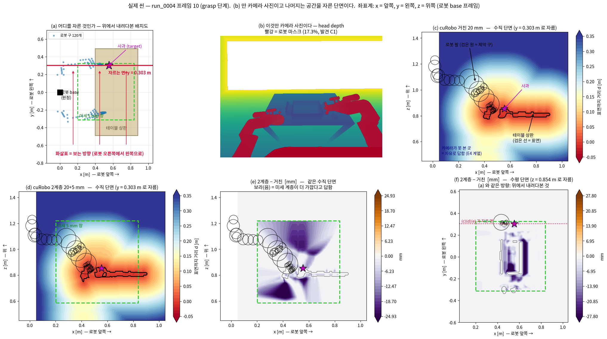

> **읽는 법 — (b) 만 카메라 사진이고 나머지는 공간을 자른 단면이다.** 처음 판에서는 이 구분이
> 없어 "어디서 촬영한 뷰인가" 를 알 수 없었다 (2026-09-12 사용자 지적). 그래서 (a) 배치도와
> 보는 방향을 넣고, 직교하는 두 방향으로 잘랐다. 좌표계는 로봇 base 프레임 —
> **x = 로봇 앞쪽, y = 로봇 왼쪽, z = 위쪽.**

run_0004 프레임 10 (grasp 단계).

- **(a) 배치도** — 위에서 내려다본 것. 빨간 선이 (c)(d)(e) 가 자르는 면(`y = 0.303 m`, 사과를
  지난다)이고, 빨간 화살표가 보는 방향이다 — **로봇 오른쪽에서 왼쪽을 향해** 본다. 초록 점선이
  미세 5 mm 창의 발자국.
- **(b) 실제 카메라 사진** — head depth 와 그 위의 로봇 마스크(빨강, 17.3 %). 발견 **C1** 이
  무엇을 지우는지가 이 한 장이다. 저 빨강을 안 지우면 팔이 통째로 장애물이 된다.
- **(c) cuRobo 거친 20 mm** — 수직 단면. 검은 선이 표면(d=0), 검은 원이 로봇 제약 구.
  왼쪽 짙은 파랑은 **카메라가 못 본 곳**이고 거기서 필드는 "멀다(자유)" 로 답한다 (E4 계열).
- **(d) cuRobo 2계층** — 같은 단면. 초록 창 안에서 표면 윤곽이 눈에 띄게 자세하다.
- **(e) (d) − (c)** — 보라(음)가 미세 계층이 "더 가깝다" 고 답한 곳. 그 영역이 창 안 + 로봇 구가
  있는 자리에 겹친다. 판정 2 의 −7.8 mm 가 어디서 오는지가 여기 보인다.
- **(f) 같은 차이를 수평으로 자른 것** — (a) 와 같은 방향(위에서 내려다봄), `z = 0.854 m`.
  빨간 점선이 (c)(d)(e) 의 자른 면이라 두 그림이 서로 맞물린다.

**AG3S numpy 는 이 그림에서 뺐다** — 교체 대상이지 후보가 아니므로 (위 "무엇을 왜 비교하는가").

**2. 15 청크 추이** — [`figures/curobo-adapter-rollout.png`](figures/curobo-adapter-rollout.png)

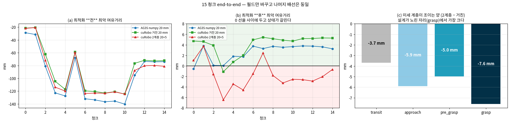

- **(a)** 최적화 **전**: 세 곡선이 거의 겹친다. 백엔드를 바꿔도 씬을 같게 본다.
- **(b)** 최적화 **후**: 파랑(AG3S)과 초록(거친)은 0 위, 빨강(2계층)은 0 아래에 눌린다.
  **`feasible 8 → 3` 이 여기서 설명된다** — 수렴이 무너진 것이 아니라 세 곡선 전부 0 의
  ±7 mm 안에 있고 빨강만 선 아래에 있을 뿐이다.
- **(c)** 단계별 조임. transit −3.7 → grasp −7.6 mm. 오른쪽으로 갈수록 커진다.

**3. 전체 틀 지도** — [`figures/curobo-adapter-map.png`](figures/curobo-adapter-map.png)

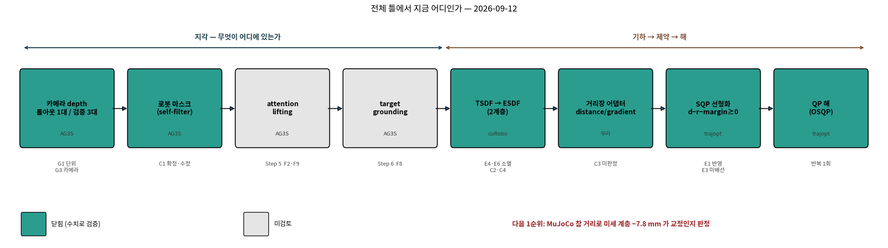

### 전체 틀에서 지금 어디인가 (규칙 B)

파이프라인을 한 줄로 쓰면 이렇다.

```
카메라 depth → 로봇 마스크 → [attention lifting → target grounding] → TSDF/ESDF
            → 거리장 어댑터 → SQP 선형화 → QP 해
```

**닫은 것은 뒤쪽 절반 전체다.** ESDF 부터 QP 까지 — 즉 "기하가 주어졌을 때 그것을 제약으로
바꿔 푸는" 부분이 cuRobo 백엔드 위에서 end-to-end 로 돈다. 그리고 그 교체가 최적화기 거동을
바꾸지 않는다는 것을 같은 20 mm 끼리 대조해 확인했다.

**비유하자면** — 우리는 지금까지 **자를 바꿔 끼운 것**이다. 같은 방을 같은 자리에서 재는데
눈금이 더 촘촘하고 훨씬 빠른 자로. 검증한 것은 두 가지였다: (1) 새 자로 잰 방 크기가 옛 자와
같은가 — 같다(판정 1), (2) 촘촘한 눈금이 실제로 다른 답을 주는가 — 준다, 손이 물건에 닿는
자리에서 7.8 mm 만큼(판정 2).

**그런데 아직 모르는 것이 "어느 자가 맞는가" 다.** 두 자가 7.8 mm 다르게 읽는데 참값을 안 재
봤다. 이것이 다음 1순위인 이유다 — MuJoCo 는 물체의 진짜 기하를 알고 있으므로 참 거리를 낼 수
있고, 그러면 (b)(c)(d) 중 누가 맞는지 판정된다. 이 판정이 D2(2계층을 유지할 것인가)와
C2(2계층의 근거를 어떻게 쓸 것인가)를 동시에 닫는다.

**아직 회색인 것은 앞쪽 절반이다** — attention lifting(Step 5)과 target grounding(Step 6).
지도에서 이 둘이 회색인 것이 중요하다. **미세 계층의 중심을 정하는 것이 바로 이 둘의
출력**이기 때문이다. 지금은 target centroid 를 그대로 썼고, 계획된 것은 action chunk 의
swept volume 이다. 즉 위 그림 (d) 의 초록 창을 **어디에 놓을 것인가**가 Step 5~6 에 달려 있고,
(e) 의 보라 영역이 로봇과 겹치느냐 마느냐가 거기서 정해진다. 검토 순서가 ESDF 를 먼저 보고
attention 앞단을 나중에 보게 되어 있는데, 이 그림이 그 둘이 어디서 만나는지를 보여준다.

---

## 참 거리 대조 (2026-09-12) — 2계층의 조임은 **교정이다**

end-to-end 에서 2계층이 grasp 단계에 제약을 7.8 mm 조인다는 것을 보았고, 그것이 **교정**인지
**과보수**인지가 D2 판정에 걸려 있었다. 참 거리를 재서 갈랐다.

스크립트: `ag3s/experiments/curobo/ground_truth.py` (ag3s venv).

### 참값을 무엇으로 잡았는가 — 그리고 왜

**MuJoCo 의 전체 기하를 참값으로 쓰지 않았다.** 그러면 두 종류의 오차가 섞인다.

1. 카메라가 못 본 면을 필드가 모르는 것 — 두 계층이 **똑같이** 겪는 문제이고 해상도와 무관하다.
2. 복셀이 표면을 뭉갠 것 — **우리가 묻는 것은 이것뿐이다.**

그래서 참값을 **원해상도 역투영 점군**으로 잡았다. 필드와 **똑같은 depth 관측**을 복셀화 없이
표현하므로 차이가 순수하게 (2) 가 된다. 마스크는 필드에 쓴 것과 같은 것을 쓰고(로봇 픽셀이
참값에 들어가면 로봇이 자기 자신에게서 거리를 재게 된다), TSDF 가 누적하므로 점군도 `0..k`
프레임을 누적한다 (프레임 14 에서 197 만 점, 1 mm 격자로 중복 제거).

편향은 알려져 있다: 픽셀 간격이 1 m 에서 약 1.6 mm 이므로 최근접점 거리는 참값을 최대
**+0.8 mm** 과대평가한다. 그 편향은 두 계층에 똑같이 걸리므로 비교를 왜곡하지 않는다.

### 교차검증 — 두 번 틀리고 세 번째에 통과했다

참값 자체를 못 믿으면 아래 결론이 무의미하므로, 같은 점들에 MuJoCo 테이블 상판 박스까지의
해석적 거리를 따로 계산해 대조했다.

| 시도 | 결과 | 원인 |
|---|---|---|
| 1 | −356.95 mm | `model.geom_pos`/`geom_quat` 는 **부모 body 기준 로컬** 오프셋인데 월드로 썼다. 월드는 `data.geom_xpos`/`geom_xmat` |
| 2 | −30.54 mm | 검사 자체가 틀렸다 — "관측된 **아무 표면**까지 거리" 대 "**테이블**까지 거리" 를 비교했으니, 탁자 위 다른 물체가 더 가까우면 당연히 작다 |
| 3 | **−1.48 mm** | 물체 9 개를 전부 xy 20 cm 이상 피해서 표본. 모델 독립 검사(`z − 0.823`)로도 **+1.52 mm** |

두 검사 모두 예상 편향(+0.8 mm) 수준이므로 **참값 유효**로 판정한다.

### 결과 — 판정을 정하는 것은 최악 구 하나다

중앙값 통계와 최악값 통계를 **둘 다** 본다. `feasible/violated` 는 최소값이 정하므로 후자가
결정적이다.

```
                        최악 구 오차   최악 구 |오차|   창 안 구 오차   창 안 구 |오차|   RMS
cuRobo 거친 20 mm         +7.56 mm       7.56 mm        +3.96 mm        6.04 mm       8.84
cuRobo 2계층 20+5 mm      -0.49 mm       4.61 mm        -2.33 mm        2.43 mm       6.07
```

(양수 = 실제보다 **멀다**고 답함 = 낙관적 = 안전하지 않은 쪽)

프레임별 최악 구:

```
 i  phase        참[mm]   거친    2계층      거친오차   2계층오차   최악구가 창 안?
 0  transit      -30.0   -32.7   -33.1       +9.4      +9.4      아니오
 3  approach     -39.1   -30.1   -30.1       +8.9      +8.9      아니오
 6  approach     -69.5   -61.9   -61.9       +7.6      +7.6      아니오
 7  pre_grasp    -90.9   -84.0   -92.9       +6.9      -1.9      예
10  grasp       -117.6  -121.1  -122.2       -3.6      -4.6      예
14  grasp        -82.5   -76.3   -85.3       +6.2      -2.7      예
```

### 판정 — 교정이다

**거친 계층은 판정 지점에서 여유거리를 중앙 +7.56 mm 낙관적으로 답한다.** 2계층은 −0.49 mm 로
**사실상 정확**하고, 틀리는 방향도 보수적이다. 즉 end-to-end 에서 본 −7.8 mm 조임은
**거친 계층의 낙관을 걷어낸 것**이지 과보수가 아니다.

**D2 의 "2계층을 유지할 것인가" 는 유지 쪽으로 닫힌다.** 비용은 미세 계층 추출 0.5~0.7 ms
(청크 예산 66.7 ms 의 1 %) 이고, 얻는 것은 판정 지점에서 7 mm 의 낙관 제거다. `esdf_margin`
50 mm 대비 15 % 에 해당한다.

**다만 두 가지를 정직하게 붙여 둔다.**

1. **최악 구가 미세 창 밖이면 2계층은 아무것도 못 한다.** 프레임 0~6 이 그렇고, 거기서는 두
   계층이 똑같이 +7.6~9.4 mm 낙관적이다. **이것이 미세 창을 target centroid 가 아니라 action
   chunk 의 swept volume 에 놓아야 하는 이유의 실측 근거다** (`VLA_ACTION_..._PLAN.md` 의 결정).
2. **이 롤아웃에서는 참 기준으로도 15/15 프레임이 위반이라, "위험한 오판"(참은 위반인데 필드가
   안전하다고 함) 은 두 계층 모두 0 이었다.** 즉 낙관 7.6 mm 가 실제로 잘못된 판정을 만든
   사례는 이 데이터에 없다. 판정을 뒤집을 만한 경계 사례는 최적화 **후** 궤적에서 생기는데,
   그 지점의 참 거리 대조는 아직 안 했다.

### 부수 발견 F11 — grounding 이 프레임 7 부터 사과 대신 crate 를 잡는다 (미확정, Step 6)

이 검증에서 단면의 `y` 가 fig1(합성 attention)과 달라 확인하다 드러났다. **실측 attention** 을
쓰면 grounded target 이 이렇게 움직인다.

```
프레임 0~6    [0.449, 0.304, 0.868]   <- 사과 [0.456, 0.309, 0.850] 와 일치
프레임 7~14   [0.519, 0.006, 0.903]   <- crate(바구니) [0.520, 0.000, 0.880] 에서 23.8 mm
```

프롬프트가 정한 target 은 `apple` 인데(`target_from_prompt`), 프레임 7 부터 grounding 은
**바구니**를 내놓는다. 과제가 "사과를 바구니에 넣기" 이므로 정책의 attention 이 목적지로
옮겨간 것 자체는 자연스러울 수 있으나, **`ClearancePolicy` 의 접촉 권한은 "target = 잡을 물체"
를 전제로 한다** — 잡을 물체가 아닌 것에 손끝 완화 마진이 붙으면 E1 이 고친 그 문제가 다른
경로로 되살아난다. **Step 6 에서 판정한다.**

**이 검증 결과에 미치는 영향**: 프레임 7~14 에서 최악 구가 미세 창 안에 들어온 것은 crate 가
로봇 정중선 근처에 있기 때문이다. 즉 **2계층이 판정 지점에서 도움이 된 것은 부분적으로 우연**
이고, 위 항목 1(창을 swept volume 에 놓아야 한다)을 더 강하게 만든다.

### 시각화 (규칙 A)

**[`figures/curobo-ground-truth.png`](figures/curobo-ground-truth.png)** — 실제 씬 + 그래프 + 표.

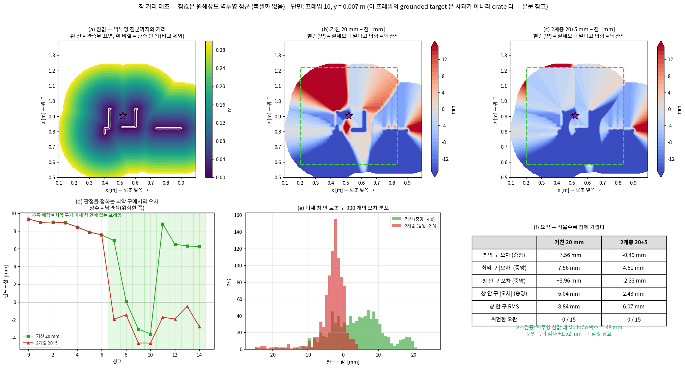

- **(a)** 참값 자체 — 역투영 점군까지의 거리. 흰 선이 관측된 표면이고, 흰 바깥은 관측 안 된
  영역이라 비교에서 뺐다.
- **(b) 거친 − 참** — **빨강(낙관)이 넓게 깔린다.** 특히 위쪽 자유공간에서 +12 mm 이상.
- **(c) 2계층 − 참** — 초록 창 안이 거의 흰색(정확)이거나 파랑(보수적)으로 바뀐다.
  (b) 와 (c) 를 나란히 보는 것이 이 판정의 핵심이다.
- **(d)** 프레임별 최악 구 오차. 초록 배경이 최악 구가 창 안인 프레임 — **거기서만 빨강(2계층)이
  0 근처로 내려온다.** 창 밖(프레임 0~6)에서는 두 선이 겹친다.
- **(e)** 창 안 구 900 개의 오차 분포. 초록(거친)이 오른쪽(낙관)으로, 빨강(2계층)이 0 근처에.
- **(f)** 요약 표와 교차검증 수치.

### 전체 틀에서 지금 어디인가 (규칙 B)

```
카메라 depth → 로봇 마스크 → [attention lifting → target grounding] → TSDF/ESDF
            → 거리장 어댑터 → SQP 선형화 → QP 해
```

**뒤쪽 절반이 이제 "돌아간다" 를 넘어 "맞다" 까지 확인됐다.** 지난번 비유로 자를 바꿔 끼웠고
새 자가 같은 방을 같게 잰다는 것까지 봤다면, 이번에는 **줄자를 대 봤다** — 촘촘한 눈금 쪽이
맞고, 뭉툭한 쪽은 7.6 mm 짧게 읽고 있었다.

**그리고 앞쪽 절반(회색)이 왜 다음인지가 이번에 수치로 나왔다.** 두 가지가 같은 곳을 가리킨다.

- 최악 구가 창 밖이면 2계층이 무력하다 (프레임 0~6) → **창을 어디 놓을 것인가**의 문제.
- grounding 이 프레임 7 부터 바구니를 target 으로 내놓는다 (F11) → **창이 따라가는 그 값**이
  Step 5~6 의 출력이다.

즉 "정밀도를 어디에 몰아줄 것인가" 는 ESDF 쪽에서 더 개선할 것이 없고, **attention 앞단이
답을 줘야 하는 질문**으로 넘어갔다. 검토 순서가 Step 5(attention lifting) → Step 6(target
grounding) 인 것이 이 지점에서 맞물린다.

---

## Step 5 — `attention_lifting.py`

- 시작: 2026-09-12 / **완료 안 됨 — 설명까지 하고 판정 대기**
- 처분: (판정 후 확정)
- attention 의 역할: **이 스텝이 attention 이 파이프라인에 들어오는 첫 지점이다.**
  2D 열지도를 3D 점마다 숫자 하나로 바꾸고, 그 값이 Step 6 의 씨앗 선택으로 넘어간다.

> **상태** — `설명 → 사용자 질문(멈춤)` 까지 왔다. **F2 · F9 는 아직 미판정이다.**
> 아래 수치는 판정을 위해 미리 재 둔 근거이지 판정이 아니다.

### 이 모듈이 하는 일

점구름과 attention 맵을 받아 **점 개수가 정확히 같은** `AttentionPointCloud` 를 낸다.
핵심은 *같은* 이다 — `attention_lifting.py:1-9` 가 못 박듯 **attention 이 낮다고 점을 버리지
않는다.** VLA 가 안 보고 있어도 물리적으로 있는 물체는 피해야 한다. attention 의 역할은
다음 스텝(target grounding)에서 씨앗을 고를 때 시작된다.

```
PointCloud (uv 보존)  +  VLA attention (16x16 격자 x 카메라 3대)
        -> 어댑터가 (H, W) 픽셀맵으로 확대
        -> cloud.uv 자리에서 샘플
        -> AttentionPointCloud (정규화본 + 원시본, 두 벌)
```

### 공부한 것 — 설계 결정 셋

1. **어댑터가 VLA 를 격리한다** (`attention_lifting.py:111`). π0.5 는 16x16 격자를 주지만 다른
   모델은 조밀한 맵을 줄 수 있다. `to_pixel_map` 아래로는 어느 VLA 인지 아무도 모른다.
2. **확대는 픽셀 중심 정렬이다** (`attention_lifting.py:44-47`). 16x16 → 480x640 은 30~40 배라,
   모서리 정렬로 보간하면 패치 중심이 반 패치(약 15 픽셀)씩 밀린다.
3. **정규화는 픽셀맵이 아니라 올린 점 값에 건다** (`attention_lifting.py:16-20`). 이미지 위에서
   퍼센타일을 잡으면 뒤에 기하가 없는 픽셀(하늘, 사거리 밖)이 섞인다. 점 위에서 잡아야
   `attention.normalization` 과 `clustering.seed_percentile` 이 같은 모집단을 가리킨다.

**값을 두 벌 내놓는 이유**도 의도적이다 — 퍼센타일 클리핑이 최상단에 동점을 수백 개 만들어
`argmax` 를 망가뜨리므로, 최고점 판정용으로 원시본을 따로 들고 간다. 융합도 두 벌을 각각
`max` 한다 (`multiview.py:304-305`).

### 사용자 질문과 답

- (없음 — 질문을 기다리는 중)

### 발견

| ID | 심각도 | 상태 | 요약 | 위치 |
|----|--------|------|------|------|
| F2 | 중간 | **미판정** (근거 측정 완료) | 정규화가 카메라별 — 주석은 "one normalization for all" 이라고 적혀 있다 | `attention_lifting.py:280` ↔ `multiview.py:123-125` |
| F9 | 중간 | **미판정** (이 데이터에서는 발화 안 함) | `image_hw` 폴백이 다운샘플 후 어긋날 수 있다 | `attention_lifting.py:265` |

### 판정 근거 — F2 (측정만, 판정 대기)

`multiview.py:123-125` 의 주석은 이렇게 적혀 있다.

> *"Every camera is lifted with `config.attention` — one normalization for all of them. Per camera
> normalization would make the values incomparable, and the fusion `max` would then be picking the
> camera with the most generous scaling rather than the best evidence."*

그런데 `lift()` 가 부르는 `normalize_attention` (`attention_lifting.py:280`) 은 **그 카메라의
점들에만** 퍼센타일을 잡는다. **주석이 경고한 바로 그것을 코드가 하고 있다.**

실측 (run_0004 프레임 10, 같은 layer 8 / head 2, 실측 attention):

```
카메라            중앙        p95        p99        최대      정규화 lo   정규화 hi
head          0.00000    0.00023    0.00044    0.00057     0.00000    0.00044
왼손목         0.00007    0.00062    0.00111    0.00144     0.00000    0.00111
오른손목        0.00002    0.00017    0.00041    0.00086     0.00000    0.00041
```

정규화 상한이 **2.7 배** 차이난다 (왼손목 0.00111 대 오른손목 0.00041). 정규화 후 셋 다
그 상한에서 1.0 이 되므로, **오른손목의 0.00041 짜리 점과 왼손목의 0.00111 짜리 점이 융합
`max` 에서 동등해진다** — 2.7 배 약한 증거가 같은 대접을 받는다.

**판정에서 갈라야 할 것**: 융합은 정규화본과 원시본을 **둘 다** `max` 하고, 문턱은 정규화본을,
최고점은 원시본을 읽는다 (`multiview.py:304-305`). 그래서 영향 범위가 갈릴 수 있다 —
씨앗 선택(문턱)만 오염되는지, 최종 target 까지 바뀌는지는 **아직 안 쟀다.**

**적용 범위 주의**: 지금까지의 롤아웃·참 거리 대조는 전부 **head 카메라 한 대**만 썼다
(`esdf_rollout` 의 `ag.process(depth=head.depth, ...)`). F2 는 3 대 융합 경로에서만 발화하므로
**앞선 모든 수치는 F2 의 영향을 받지 않았다.**

### 판정 근거 — F9 (이 데이터에서는 발화하지 않는다)

`pipeline.process(image_hw=None)` 이 기본값이라 **단일 카메라 경로(롤아웃이 쓰는 그 경로)가
폴백을 탄다.** 폴백은 `(uv[:,1].max()+1, uv[:,0].max()+1)` 이다.

```
프레임  0   uv 범위 u[0,639] v[188,479]   폴백 (480,640)   실제 (480,640)   일치
프레임 10   uv 범위 u[4,639] v[227,479]   폴백 (480,640)   실제 (480,640)   일치
```

클라우드가 아래·좌우 끝에 닿아서 맞았다. `v_min` 이 188/227 인 것은 위쪽에 유효 depth 가
없다는 뜻인데, 폴백은 **최댓값만** 쓰므로 영향이 없다. **잠재 위험이지 현재 발화 중은 아니다.**
`multiview.py` 는 `observation.image_hw` 를 명시적으로 넘기므로 3 대 경로에서는 애초에 안 탄다.

### 시각화 (규칙 A)

생성: `ag3s/experiments/studies/step5_lifting_figures.py` (ag3s venv).
**[`figures/step5-lifting.png`](figures/step5-lifting.png)**

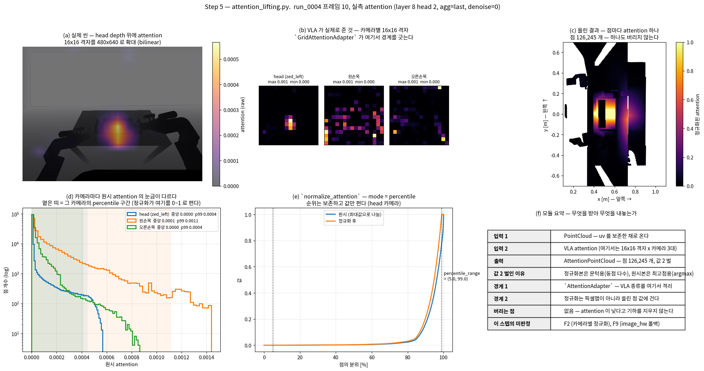

- **(a) 실제 씬** — head depth 위에 16x16 격자를 480x640 으로 확대해 겹친 것.
  **attention 이 사과가 아니라 crate(바구니) 위에 뭉쳐 있다** — F11 의 상류가 여기서 보인다.
- **(b) VLA 가 실제로 준 것** — 카메라별 16x16 원본. head 는 한 점에 집중돼 있고
  **손목 카메라 둘은 가장자리에 흩어져 있다.**
- **(c) 올린 결과** — 점 126,245 개를 위에서 본 것, attention 으로 색칠. 하나도 버리지 않는다.
- **(d) 그래프** — 카메라별 원시 값 분포와 각자의 퍼센타일 구간. **F2 가 사는 자리다.**
- **(e) 그래프** — 정규화 전/후. 순위는 보존되고 값만 펴진다.
- **(f) 표** — 입력·출력·경계·미판정 요약.

### 전체 틀에서 지금 어디인가 (규칙 B)

```
카메라 depth → 로봇 마스크 → [attention lifting ★ → target grounding] → TSDF/ESDF
            → 거리장 어댑터 → SQP 선형화 → QP 해
```

뒤쪽 절반(ESDF → QP)은 참 거리 대조까지 끝나 닫혔다. **이제 회색이던 앞쪽 절반의 첫 칸이다.**

지난 단계가 "자를 바꿔 끼우고 줄자로 확인" 이었다면, 여기는 **어디에 정밀도를 몰아줄지 정하는
사람**을 검토하는 것이다. 참 거리 대조에서 *최악 구가 미세 창 밖이면 2계층이 무력하다* 는 것을
봤는데, 그 창의 위치가 이 모듈 → grounding 에서 나온다.

**그리고 (a) 가 F11 의 상류를 보여준다** — grounding 이 프레임 7 부터 crate 를 target 으로
내놓은 것은 잘못 고른 것이 아니라 **attention 이 실제로 거기를 보고 있었기** 때문으로 보인다.
Step 6 에서 갈릴 문제지만 원인의 절반은 이 모듈이 넘긴 값이다.

### 다음

**F2 를 어떻게 판정할지가 다음 갈림길이다.** 세 갈래가 있고 실측할 내용이 달라진다.

1. **전역 정규화로 고친다** — 카메라 3 대의 점을 모아 한 번에 정규화. 주석이 원래 말한 것.
2. **문턱도 원시본을 읽게 한다** — 정규화본을 씨앗 선택에서 빼면 스케일 문제가 사라진다.
3. **의도된 트레이드오프로 기각한다** — 카메라마다 노출·거리가 달라 절대값 비교가 오히려
   틀릴 수 있다면, 카메라별 정규화가 맞을 수도 있다.

어느 쪽이든 **3 대 융합 경로를 한 번 돌려 target 이 바뀌는지 재야 한다.** 지금까지의 실측은
전부 단일 카메라였다.

### 판정 — F2 **확정** (2026-09-12)

카메라 3 대 융합 경로를 15 청크 돌려 세 변형을 나란히 비교했다.
스크립트: `ag3s/experiments/studies/step5_f2_verdict.py` (ag3s venv).

| 변형 | 무엇을 하나 |
|---|---|
| **A — 현재 코드** | 카메라별 정규화. `lift()` 가 각 카메라 점들에만 퍼센타일을 건다 |
| **B — 전역 정규화** | 융합된 원시 값 전체에 퍼센타일을 **한 번만** 건다. `multiview.py` 주석이 말한 것 |
| **C — 문턱도 원시본** | 정규화를 아예 안 쓰고 원시 값으로 씨앗을 고른다 |

#### 먼저: A 와 B 는 정말 다른 배열인가 (프레임 1, 점 31,635 개)

0.0 mm 차이가 "변형이 안 먹었다" 는 뜻일 수 있어 배열 수준에서 확인했다.

```
A 카메라별   범위 [0, 1]   중앙 0.000445   최대값인 점 377
B 전역       범위 [0, 1]   중앙 0.000070   최대값인 점 317
A 와 B 가 같은 배열인가: False    |A − B| 최대 0.9988
A 대 B 순위상관 (Spearman)      0.693
씨앗 1,582 개 중 공통 721        (A 만 861, B 만 861)  <- 절반 이상이 다르다
```

**변형은 확실히 먹었다.** 씨앗의 54 % 가 다른데도 이 프레임에서는 target 이 같게 나왔다 —
씨앗이 달라도 영역 성장이 같은 덩어리로 수렴하기 때문이다.

#### 15 청크 결과 — 그런데 항상 수렴하지는 않는다

```
 i   A 현재            B 전역            C 원시
 0   apple (19mm)     apple (19mm)     apple (19mm)
 5   apple (37mm)     apple (37mm)     없음
 6   apple (84mm)     apple (43mm)     없음      <- 같은 물체, B 가 참값에 2 배 가깝다
 7   crate (28mm)     banana  (9mm)    없음      <- **다른 물체**
 8   crate (26mm)     banana  (9mm)    없음      <- **다른 물체**
 9   crate (25mm)     banana  (9mm)    없음      <- **다른 물체**
10   crate (25mm)     crate (25mm)     없음
14   crate (25mm)     crate (25mm)     없음

target 이 셋 다 같은 프레임: 1/15
centroid 이동 A→B: 중앙 0.0 mm, **최대 307.5 mm**
```

**A 와 B 는 15 프레임 중 4 개에서 다른 답을 낸다** (6·7·8·9). 그중 셋은 **물체 자체가 바뀐다** —
바구니냐 바나나냐. 나머지 11 프레임은 완전히 같다.

#### 판정

**F2 를 확정한다.** 근거 셋.

1. **코드가 자기 주석과 반대다.** `multiview.py:123-125` 가 "per camera normalization would make
   the values incomparable, and the fusion `max` would then be picking the camera with the most
   generous scaling rather than the best evidence" 라고 경고해 두고, `lift()` 가 정확히 그것을 한다.
2. **값이 실제로 비교 불가능하다.** 정규화 상한이 카메라 간 2.7 배 차이나고, 순위상관이 0.693 까지
   떨어진다. 이것은 이론이 아니라 실측이다.
3. **결과가 바뀐다.** 15 중 4 프레임에서 target 이 달라지고, 최대 307.5 mm 움직인다.

**다만 정직하게 붙일 것** — 이 데이터는 **B 가 옳다는 것까지는 증명하지 못한다.**
프레임 6 에서 B 가 참 사과에 2 배 가깝다는 것이 유일한 직접 증거이고, 프레임 7~9 는 A(바구니)도
B(바나나)도 프롬프트가 정한 target(`apple`)이 아니다. **그 셋이 다 틀린 것은 F11 의 문제이지
F2 가 아니다** — Step 6 에서 따로 판정한다.

#### 변형 C 는 선택지가 아니다 — 내가 잘못 설계했다

C 의 씨앗은 B 와 **완전히 동일**하다 (`B==C 씨앗 동일: True`). 퍼센타일은 순위 기반이고 정규화는
단조 함수라 당연한 결과다. 그런데 grounding 이 `low_score` 로 떨어진다 — **점수 단계가 정규화된
`[0, 1]` 스케일을 전제**하기 때문이다. 원시 값은 `~1e-4` 라 어떤 점수 문턱도 못 넘는다.

즉 "문턱도 원시본을 읽게 한다" 는 **점수 문턱까지 같이 고치지 않으면 성립하지 않는다.**
지금 형태로는 후보에서 뺀다.

#### 처방 — 사용자 판단 대기

**B(전역 정규화)로 고치는 것을 권한다.** 주석이 원래 말한 것이고, 값을 비교 가능하게 만든다.
구현은 두 갈래다.

1. **융합 후 정규화** — `lift()` 는 원시본만 내놓고, `fuse` 가 `max` 한 뒤 한 번 정규화한다.
   내가 실험에서 쓴 방식이고, 단조성 때문에 "정규화 후 융합" 과 순위가 같다.
2. **융합 전 전역 정규화** — 3 대 점을 모아 퍼센타일을 잡고 각 카메라에 같은 `lo/hi` 를 적용.
   `lift()` 시그니처에 `norm_range` 를 주입해야 한다.

**단일 카메라 경로에는 아무 영향이 없다** — 카메라가 하나면 A 와 B 가 정의상 같다.
그래서 지금까지의 롤아웃·참 거리 대조 수치는 **전부 그대로 유효하다.**

#### 시각화 (규칙 A)

**[`figures/step5-f2-verdict.png`](figures/step5-f2-verdict.png)** — 실제 씬 + 그래프 + 표.
단면이 아니라 **위에서 내려다본 융합 클라우드**다 (x = 앞쪽, y = 왼쪽).
프레임 7 — A 와 B 가 갈리는 첫 프레임.

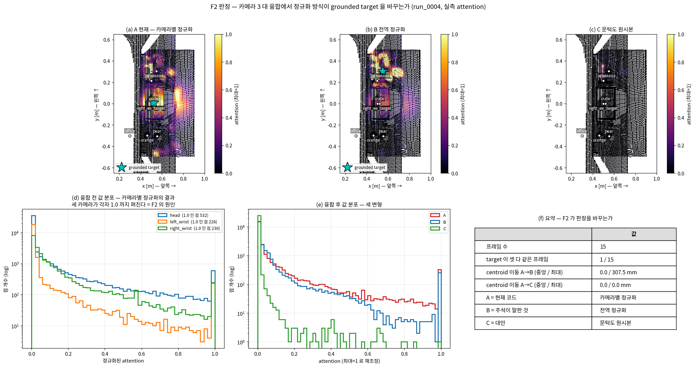

- **(a) A 현재** — grounded target(청록 별)이 **crate** 위에 있다. 오른쪽에 밝은 덩어리가 크게 떠 있는데
  그것이 손목 카메라가 자기 눈금으로 1.0 까지 펴 놓은 영역이다.
- **(b) B 전역** — 같은 프레임, 같은 관측인데 target 이 **banana** 로 옮겨간다. 밝은 영역이 위쪽
  과일 무리로 모인다.
- **(c) C 원시** — 거의 전부 어둡다. 값이 `~1e-4` 라 점수 문턱을 못 넘어 `low_score`.
- **(d) 원인** — 융합 **전** 카메라별 값 분포. **세 카메라가 각자 1.0 까지 펴진다**:
  head 532 점, 왼손목 226 점, 오른손목 230 점이 모두 "최대 확신" 을 주장한다.
  융합 `max` 는 이 셋을 구별할 방법이 없다.
- **(e)** 융합 후 세 변형의 값 분포. **(f)** 15 프레임 요약.

#### 전체 틀에서 지금 어디인가 (규칙 B)

```
카메라 depth → 로봇 마스크 → [attention lifting ★ → target grounding] → TSDF/ESDF
            → 거리장 어댑터 → SQP 선형화 → QP 해
```

**뒤쪽 절반(ESDF → QP)은 참 거리까지 확인해 닫혔고, 앞쪽 절반의 첫 칸에서 결함 하나를
확정했다.** 비유하자면 — 지금까지는 *자를 바꿔 끼우고 줄자로 검증*했다면, 이번엔 **세 사람이
각자 다른 자로 잰 값을 그대로 비교하고 있었다**는 것을 찾은 것이다. 셋 다 "내가 잰 게 제일 크다"
고 말하는데, 그 "제일" 이 서로 다른 자의 눈금이다.

**다음으로 이어지는 것 둘.**

1. **F2 수정** — 전역 정규화(B). 단일 카메라 경로는 영향이 없으므로 기존 기준선은 유지된다.
2. **Step 6 (target grounding)** — 프레임 7~9 에서 A 도 B 도 프롬프트 target(`apple`)을 못 냈다.
   그것이 **F11** 이고, 이 판정에서 분리해 둔 문제다. 미세 ESDF 창의 위치가 그 출력에
   달려 있으므로 (참 거리 대조의 "최악 구가 창 밖이면 2계층이 무력하다"), Step 6 이 곧
   ESDF 쪽 남은 질문과 만난다.

#### 아직 안 한 것

- **F9 판정** — 이 데이터에서 폴백이 우연히 맞았다는 것까지만 쟀다. 다운샘플이나 다른 씬에서
  어긋나는지는 미확인.
- **F2 수정 적용** — 처방 두 갈래 중 어느 것으로 갈지 사용자 판단 대기.
- **3 대 경로의 회귀 기준선** — 지금까지 기준선은 전부 단일 카메라다. F2 를 고치면 3 대 경로에도
  기준선이 필요하다.

### F2 수정 적용 (2026-09-14)

사용자 결정: **융합 후 정규화**(안 1). `multiview.py` 한 파일만 바뀐다.

#### 무엇을 바꿨나

`fuse()` 가 원시본을 `max` 로 합친 **직후에 한 번 정규화**한다. `lift()` 는 손대지 않았다.

```python
# 전
attention     = np.maximum.reduceat(fused.obs_attention, starts)   # 카메라별 정규화본을 max
raw_attention = np.maximum.reduceat(obs_raw[order],      starts)

# 후
raw_attention = np.maximum.reduceat(obs_raw[order], starts)        # 원시본을 max
attention     = normalize_attention(raw_attention, attention_config)   # 여기서 한 번
```

`fuse()` 에 `attention_config` 인자를 더하고 `fuse_observations` 가 `config.attention` 을 넘긴다.
인자가 없으면 **예전 동작으로 떨어진다** — `fuse` 를 단독으로 부르는 테스트/어블레이션이 조용히
정규화 안 된 배열을 받지 않게 하기 위해서다.

`process_observation` 의 주석도 사실에 맞게 고쳤다. 예전 주석은 "one normalization for all of
them" 이라고 **하지 않는 일을 한다고** 적고 있었다. 이제는 `lift()` 의 값이 그 카메라 안에서만
비교 가능하다는 것과, 그래서 `fuse` 가 다시 정규화한다는 것을 적는다.

#### 왜 이 위치인가

정규화는 **단조 함수**(순위 보존)이고 단조 함수는 `max` 와 교환된다.

```
max( f(a), f(b) )  =  f( max(a, b) )
```

그래서 "융합 후 정규화" 와 "공통 lo/hi 로 융합 전 정규화" 는 **씨앗 선택에서 순위가 같다.**
전자는 `lift()` 시그니처를 안 건드리므로 변경이 작다. 유일한 차이는 퍼센타일 `lo/hi` 를 어느
모집단에서 재느냐이고(융합 점 대 전체 관측), 그것은 2차적이다.

#### 검증 1 — 단일 카메라 기준선이 안 움직인다

카메라가 하나면 "카메라별" 과 "전역" 이 **정의상 같다.** 실측으로도 그렇다.

```
esdf_rollout 15 청크 (run_0004, 실측 attention, voxel 20 mm, margin 50 mm, arms)
   해소 14 / 개선 15 / feasible 8, violated 7      <- 수정 전과 완전히 동일
```

**즉 지금까지의 모든 롤아웃·참 거리 대조 수치는 그대로 유효하다.**

#### 아직 안 한 것

- 3 대 경로에서 A 가 이제 B 와 같은 target 을 내는지 end-to-end 재확인 (구조상 같은 계산이
  되었지만 배선을 실제로 한 번 돌려봐야 한다).
- 3 대 경로의 회귀 기준선 — 지금까지 기준선은 전부 단일 카메라다.

### multi-view overlap 측정 (2026-09-14)

F2 는 의미 융합의 **입력**(눈금)을 고쳤다. **규칙**(`max`)이 옳은지는 별개 질문인데, 그 질문은
**겹침이 있어야만 성립한다** — 복셀 대부분을 한 대만 본다면 `max` 든 평균이든 같은 값이다.

스크립트: `ag3s/experiments/studies/step5_overlap.py`.

#### 융합은 두 층이다 — 이 구분이 먼저다

`multiview.py:fuse()` 가 한 함수 안에서 서로 다른 두 일을 한다.

| 층 | 하는 일 | F2 가 건드리나 |
|---|---|---|
| **기하 융합** | 3 대의 점을 base 프레임 복셀 격자(10 mm)에 얹고 복셀당 대표점 하나. 대표점은 합성 centroid 가 아니라 **실제 관측된 점** | 아니오 — A/B/C 에서 기하는 완전히 동일했다 |
| **의미 융합** | 그 복셀에 들어온 관측들의 attention 을 `max` 로 합침 | 예 — F2 는 여기 **입력**의 눈금 문제 |

**그리고 ESDF 는 융합 클라우드를 쓰지 않는다.** `_build_esdf` 는 `_depth_cameras_from` 으로
카메라별 raw depth 를 받아 각각 적분한다 (`pipeline.py:446-449`). 융합이 실제로 먹이는 곳은
**지지면 추출**과 **target grounding** 둘뿐이고, 충돌 후보(⑥)는 `collision_backend: esdf` 에서
건너뛴다. 즉 **F2 의 파급 범위는 "target 을 무엇으로 정하는가" 하나**다 — 다만 그 하나가
접촉 권한(E1)과 미세 ESDF 창의 중심을 정한다.

#### 결과 — 전체로는 겹침이 적고, 씨앗에서는 절반이다

```
전체 융합 점    1 대 84.2 %   2 대 10.4 %   3 대 5.3 %       -> 겹침 15.7 %
씨앗            2 대 이상 평균 49.8 %   [20.2, 67.0]
```

**씨앗에서만 겹침이 3 배로 뛴다.** 이유가 분명하다 — 씨앗은 attention 이 높은 점이고, 그건
로봇이 손을 뻗고 있는 물체 주변이다. 손목 카메라가 보는 곳도 정확히 거기다. 프레임별로도
transit(20~23 %)에서 접근·파지로 갈수록 55~67 % 로 올라간다.

**즉 규칙이 중요한 자리에서만 겹친다.**

#### 불일치 — 한 번 잘못 재고 고쳤다

처음에 겹친 점의 값 폭을 **카메라별 정규화본**에서 쟀다. 그런데 그 배열이 바로 F2 가 지적한
"눈금이 서로 다른" 값이라, 진짜 이견과 눈금 차이가 섞인다. 융합이 실제로 비교하는 것은
**원시 스케일**이므로(F2 수정 후 `max` 는 원시본에 걸린다) 거기서 다시 쟀다.

```
                        중앙      90분위    폭 > 0.1 비율
원시 스케일 (옳은 것)   0.0004    0.0715      7.9 %
정규화 스케일 (틀린 것) 0.0632    0.5002     40.8 %
```

**겉보기 불일치 40.8 % 중 대부분이 눈금 차이였다.** 이것 자체가 F2 진단의 독립적인 확인이다.

읽는 법: **카메라들은 대체로 동의하고, 8 % 에서 크게 갈린다.** 그 8 % 가 판정을 바꾸는지가
다음 질문이다.

> 재현 시 주의 — 관측별 **원시값은 CSR 블록에 저장되지 않는다** (정규화본만 있다).
> `fuse` 의 키(`floor(p/voxel)`)와 stable argsort 를 복제해 같은 순서를 만든 뒤 재야 하고,
> 스크립트는 그룹 수가 `fuse` 와 같은지 `assert` 로 확인한다.

#### 시각화

**[`figures/step5-overlap.png`](figures/step5-overlap.png)**

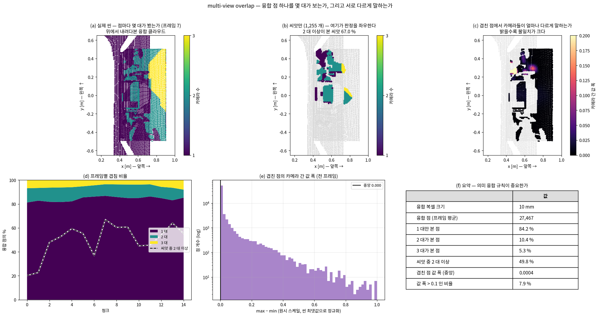

- **(a) 실제 씬** — 위에서 내려다본 융합 클라우드, 점마다 몇 대가 봤는가.
  **겹침이 무작위가 아니라 공간적으로 구조가 있다** — 오른쪽 띠가 3 대, 가운데가 2 대, 왼쪽이 1 대.
- **(b) 씨앗만** — 프레임 7 에서 67 % 가 2 대 이상. 회색은 씨앗이 아닌 점.
- **(c) 불일치의 공간 분포** — 밝은 곳이 카메라들이 다르게 말하는 자리. 물체 주변 한 곳에 뭉쳐 있다.
- **(d)** 프레임별 겹침 비율(면적)과 씨앗의 2 대 이상 비율(점선).
- **(e)** 불일치 분포 — 0 근처에 몰리고 1.0 까지 꼬리. **(f)** 요약.

#### 환경 사고 하나 — `src` 심볼릭 링크

이 측정 중 컨테이너가 재시작되어 `/mnt/dev/work/src -> pi05_TO_hybrid` 링크가 사라졌고,
MuJoCo 재생이 전부 `FileNotFoundError` 로 죽었다. 기록의 `model_xml` 이 옛 절대경로라
`/home/mk/dev_ws/vla/pi0_TO_ws -> /mnt/dev/work` 와 `src` 두 링크가 **둘 다** 살아 있어야 한다.
복구 명령은 `CLAUDE.md` 환경 절에 넣었다. 나머지(venv, `/tmp` 산출물, 그림)는 무사했다.

### 의미 융합 규칙 비교 — `max` 유지 (2026-09-14)

스크립트: `ag3s/experiments/studies/step5_fusion_rules.py`. 융합은 프레임당 **한 번만** 하고 CSR 블록에
규칙만 바꿔 적용했다 — 세 규칙이 완전히 같은 기하를 본다는 것이 보장된다.

| 규칙 | 뜻 |
|---|---|
| **max** (현재) | 가장 확신하는 카메라가 이긴다 |
| **mean** | 평균. 한 대가 튀는 것을 눌러 준다 |
| **head 우선** | head 가 봤으면 head 값, 아니면 나머지의 max. `CameraID` docstring 의 "head = global backbone, wrists = local refinement" 를 규칙으로 만든 것 |

#### 결과

```
 i   max (현재)        mean              head 우선
 7   banana (9mm)     banana (9mm)      banana (9mm)
 8   banana (9mm)     banana (9mm)      crate (26mm)     <<< 다름
 9   banana (9mm)     없음               crate (25mm)     <<< 다름
12   crate (27mm)     없음               crate (27mm)     <<< 다름
14   crate (25mm)     없음               crate (25mm)     <<< 다름

세 규칙이 같은 target: 11/15
centroid 이동  max→mean  중앙 0.0 mm  최대   0.0 mm   (단, 3 프레임에서 target 소멸)
centroid 이동  max→head  중앙 0.0 mm  최대 307.5 mm
```

#### 정정 — 불일치는 씨앗에서 5 배 높다

overlap 절에서 "겹친 점의 값 폭 > 0.1 인 비율 7.9 %, 즉 카메라들은 대체로 동의한다" 고 적었다.
**그 통계를 잘못된 모집단에서 쟀다.** 전체 겹친 점에는 테이블·배경처럼 모든 카메라가 attention
`~0` 을 주는 점이 압도적으로 많고, 그것들이 "동의" 로 집계되어 분포를 지배한다.

**규칙이 실제로 작동하는 곳은 씨앗이다.** 거기서 다시 재면:

```
                      n        중앙      90분위    폭 > 0.1 비율
전체 겹친 점       (많음)    0.0004    0.0715       7.9 %
겹친 씨앗          10,180    0.0478    0.3476      39.4 %   <- 5 배
```

**겹친 씨앗의 39.4 % 에서 카메라들이 0.1 넘게 갈린다.** 규칙 선택은 무의미하지 않다.

#### 판정 — `max` 를 유지한다

1. **mean 은 더 나쁘다.** 15 중 3 프레임(9·12·14)에서 **target 을 아예 잃는다.**
   그림 (d) 가 이유를 보여준다 — `mean − max` 가 거의 전부 0 이하다. 평균이 봉우리를 희석해
   grounding 의 점수 문턱을 못 넘긴다. **기각.**
2. **head 우선은 2 프레임(8·9)에서 다른 답을 낸다** — max 는 banana, head 는 crate, 307.5 mm 차이.
   **어느 쪽이 옳은지는 이 데이터로 못 가린다** — 프롬프트가 정한 target 은 `apple` 이고 둘 다
   아니다(F11). **미판정으로 남긴다.**
3. **`max` 를 기각할 근거가 없다.** 대안 하나는 더 나쁘고 하나는 판정 불가다.

#### 부수 — F2 수정이 end-to-end 로 확인됐다

이 실행의 `max` 규칙은 **수정된 코드**(융합 후 정규화)를 탄다. 그 결과가
프레임 7·8·9 에서 **banana**, 10~14 에서 **crate** 인데, 이것은 F2 실험의 **변형 B(전역 정규화)와
정확히 같다.** 수정 전 A(카메라별)는 7·8·9 에서 crate 였다.

**즉 "3 대 경로에서 A 가 이제 B 와 같은 답을 내는가" 가 확인됐다** — 앞 절의 미완 항목이 닫힌다.

#### 시각화

**[`figures/step5-fusion-rules.png`](figures/step5-fusion-rules.png)**

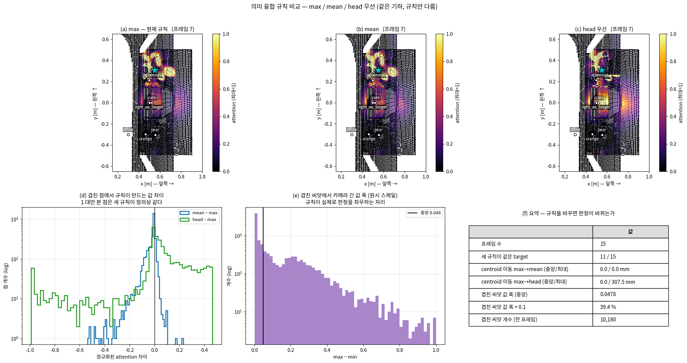

- **(a)(b)(c)** 프레임 7 의 세 규칙. 같은 기하 위에 값만 다르다. 셋 다 banana 를 찾는다.
- **(d)** 겹친 점에서 규칙이 만드는 값 차이. **`mean − max` 는 거의 전부 0 이하** (희석),
  `head − max` 는 왼쪽으로 −1.0 까지 긴 꼬리 (head 와 손목이 실제로 다르게 말한다).
  1 대만 본 점은 세 규칙이 정의상 같으므로 이 그림은 겹친 점만 담는다.
- **(e)** 겹친 씨앗의 값 폭 — 위 정정의 근거. **(f)** 요약.

#### 되돌아올 지점 — head 우선

**전환 신호**: (1) F11 이 풀려 프롬프트 target 이 제대로 잡히기 시작한 뒤, head 와 손목이
갈리는 프레임에서 **어느 쪽이 맞는지 가려지면** 그때 재검토한다. (2) 손목 카메라가 가림
복구에 실제로 기여하는 것이 확인되면 head 우선은 오히려 손해가 된다.
**전환 비용: 낮음** — `aggregate()` 에 규칙이 이미 구현돼 있다.

### 자산 경로 — 심볼릭 링크 의존을 걷어냈다 (2026-09-14)

사용자 지적: *"심볼릭 링크를 왜 사용해? `pi05_TO_hybrid` 폴더를 사용하면 되는데?"*

#### 왜 링크였나

링크는 우리 코드의 선택이 아니라 **기록 데이터에 박힌 것** 때문이었다.

```
run_0004/meta.json:  model_xml = /home/mk/dev_ws/vla/pi0_TO_ws/src/rby1_description/.../model_transport.xml
```

롤아웃을 **녹화한 PC** 의 절대경로다. `replay_scene` 이 이 값을 그대로 `TransportScene` 에 넘기고
(`policy_record.py:280`), 없으면 즉시 예외였다. 게다가 코드의 기본값들도
`src/rby1_description/...` 상대경로라(`TRANSPORT_MODEL`, `RBY1_URDF`) **둘 다 `src` 를 거쳤는데**,
이 컨테이너에서 자산의 실제 자리는 `pi05_TO_hybrid/rby1_description/` 이다.

그래서 이전 세션이 링크 둘로 맞췄고, 2026-09-14 컨테이너 재시작에 `src` 가 날아가 죽었다.

#### 고친 것 — `ag3s/runtime/asset_path.py` (신규)

```python
resolve_asset(path)   # 1. 준 경로가 있으면 그것 (링크 살아 있는 환경은 그대로)
                      # 2. AG3S_ASSET_ROOT 환경변수 오버라이드
                      # 3. `rby1_description/` 부터의 꼬리를 src → pi05_TO_hybrid → . 에 붙여 탐색
```

**의존이 세 겹이었다.** 하나씩 걸려 세 번 고쳤다.

| 층 | 어디 | 어떻게 |
|---|---|---|
| MJCF | `mujoco_source.TransportScene.__init__` | `resolve_asset(model_path)` |
| URDF (진입점) | `robot_models.load_rby1` | `parse_urdf` 에 위임 |
| URDF (직접 호출) | `parse_urdf` 자체 | **여기서 해석.** `grounding_report` 2 곳과 `rby1_transport` 가 `parse_urdf(RBY1_URDF)` 를 직접 부른다 — 호출부마다 고치는 대신 읽는 함수에서 한 번에 덮었다 |

`robot_models` 는 core 라 `experiments` 에 의존할 수 없어서 해석기를 `ag3s/runtime/asset_path.py` 로
따로 뺐다.

#### 틀린 자산을 집을 위험

**이미 막혀 있다.** `replay_scene` 이 모델을 연 직후 `nq` 와 관절 이름 순서를 기록과 대조하고
다르면 예외를 던진다 — "조용히 다른 씬을 재생하는" 실패를 막으라고 있는 검사다
(`policy_record.py:281-295`). 탐색으로 후보를 넓혀도 그 안전 성질은 그대로다.

#### 검증

`src` 링크를 **치운 상태**에서:

```
resolve_asset('src/.../model.urdf')                    -> /mnt/dev/work/pi05_TO_hybrid/.../model.urdf
resolve_asset('/home/mk/.../model_transport.xml')      -> /mnt/dev/work/pi05_TO_hybrid/.../model_transport.xml
parse_urdf(RBY1_URDF)  -> 34 links      load_rby1() -> 61 구
```

그리고 **링크가 없는 채로 회귀 기준선 전체가 재현된다**:

```
esdf_rollout 15 청크   해소 14 / 개선 15 / feasible 8, violated 7
청크 14  -73.9 → +3.2 mm            <- 프레임별 값까지 동일
```

**`src` 심볼릭 링크는 이제 필요 없다.** `/home/mk/dev_ws/vla/pi0_TO_ws -> /mnt/dev/work` 도
마찬가지다 — 기록의 절대경로가 그 링크를 통하지 않고 꼬리 탐색으로 해석된다.

---

## F11 재분류 — grounding 결함이 아니라 **전제의 불일치** (2026-09-14)

사용자 관찰: *"모델 성능이 좋지 않아 사과를 집는 도중 바구니를 집고 있고, 작업이 끝난 뒤에도
이를 인지하지 못한 채 다음 작업으로 넘어가려는 모션을 볼 수 있다."*

F11 을 "grounding 이 사과 대신 바구니를 낸다" 는 **grounding 의 결함 후보**로 적어 두었었다.
정책 자체가 바구니를 집는 것이라면 grounding 은 정직한 보고이고 결함이 아니다. 추측으로 둘
문제가 아니라서 기록을 쟀다 — **물체가 free joint 라 위치가 매 스텝 남아 있다.**

스크립트: `ag3s/experiments/studies/step6_policy_behavior.py`, `step6_attention_vs_hand.py`.

### 먼저 — `run_0004` 는 성공한 롤아웃이다

```
물체       총 경로길이    시작→끝     최대 높이변화
apple       669 mm      302 mm      186 mm     <- 들어서 옮겼다
crate         4 mm        4 mm        0 mm     <- 접촉 떨림 수준
banana/orange/pear     0~3 mm         0 mm
```

사과가 스텝 11~19 에 850 → 1036 mm 로 올라갔다가 880 mm 로 내려오고, 궤적이 바구니 자리로
간다. 왼손-사과 거리가 스텝 8~18 에 42~54 mm 로 붙는다.

**즉 이 기록에서는 "바구니를 집는" 거동이 관찰되지 않는다.** 사과 pick-and-place 가 성공했다.
사용자가 보신 것이 다른 회차이거나 현재 체크포인트의 실시간 거동일 수 있다 — `run_0004` 가
유일한 검증 기록이므로 이 구분을 기록에 남긴다. **다른 롤아웃 기록이 생기면 대조할 것.**

### 그러나 관찰의 절반은 정확히 맞다 — 손과 target 이 어긋난다

```
스텝  t    사과높이   왼손-사과  왼손-바구니   grounding target
 6   48     850      119      340      apple
 7   56     850       85      331      crate    <- 파지 착수 순간 target 이 넘어간다
 8   64     850       54      329      crate
10   80     850       42      327      crate    <- 쥐었다
13  104    1036       43      374      crate    <- 들고 있다
14  112    1021       43      286      crate    <- 운반 중
19  152     858      121      104      -        <- 내려놓았다

손이 사과를 쥔 스텝 (50 mm 대)  [8..18]
target 이 바구니인 스텝          [7..14]
**겹치는 스텝**                  [8,9,10,11,12,13,14]   7 개
```

**정책의 attention 이 파지에 착수하는 순간 목적지로 옮겨간다.** 정책 입장에서는 자연스러울 수
있다 — 갈 곳을 보는 것이다. grounding 은 그것을 정직하게 옮겼다.

### 판정 — 틀린 것은 우리 쪽 전제다

**AG3S 는 `target = 지금 조작하는 물체` 를 전제한다.** 그 전제가 이 롤아웃에서 7 스텝 동안
깨진다. F11 은 grounding 의 버그가 아니라 **attention 의 의미와 AG3S 의 전제가 어긋나는 문제**다.
심각도를 올린다 — 아래 둘이 걸리기 때문이다.

**1. 접촉 권한 (E1).** `ClearancePolicy` 는 target 을 기준으로 손끝 여유를 완화한다.
스텝 7 부터 target 이 바구니이므로 손끝은 **바구니**를 만져도 된다고 허가받는데 실제로 만지는
것은 **사과**다. 그러면 쥐고 있는 사과가 완전 여유거리를 요구하는 장애물이 된다 —
**E3(attached object 가 optimizer 에 도달하지 않음)와 같은 구멍이 다른 방향에서 열린다.**
E1 수정이 "target 은 조작 대상" 이라는 전제 위에 서 있었으므로, 그 전제를 Step 10 에서
다시 봐야 한다.

**2. 미세 ESDF 창의 중심.** 창이 target 을 따라가므로 스텝 7 부터 바구니 위에 놓인다.
참 거리 대조에서 "프레임 7~14 에 최악 구가 창 안에 들어온 것은 부분적으로 우연" 이라고 적었는데,
**그 우연의 정체가 이것이다** — 바구니가 로봇 정중선 근처에 있어서 창이 로봇을 덮었다.
`VLA_ACTION_..._PLAN.md` 가 창 중심을 **action chunk 의 swept volume** 으로 잡자고 한 것이
이 문제를 구조적으로 피한다 — swept volume 은 attention 이 어디를 보든 로봇이 실제로 지나가는
곳이다.

### 아직 판정 안 한 것 — 무엇을 target 이라 불러야 하는가

세 갈래가 있고, Step 6 에서 사용자와 정한다.

1. **attention 을 그대로 쓴다** (지금). 접촉 권한이 목적지에 붙는 것을 감수한다.
2. **조작 대상을 따로 추정한다** — 손끝에 가장 가까운/쥐고 있는 물체. 접촉 권한은 그쪽에,
   attention 은 해상도 배분에만 쓴다. **역할을 둘로 쪼개는 것**이다.
3. **둘 다 들고 간다** — `TargetGeometry` 에 "조작 대상" 과 "주목 대상" 을 분리해 담고,
   `ClearancePolicy` 는 전자를, 미세 ESDF 창은 후자(또는 swept volume)를 쓴다.

**2 번과 3 번은 E3 수정과 같은 작업**이 된다 — 쥐고 있는 물체를 로봇 쪽 모델로 편입하는 것.
cuRobo v1 부록 D 가 그 구조다.

### 시각화

**[`figures/step6-policy-behavior-0004.png`](figures/step6-policy-behavior-0004.png)** — 무엇이 움직였나.

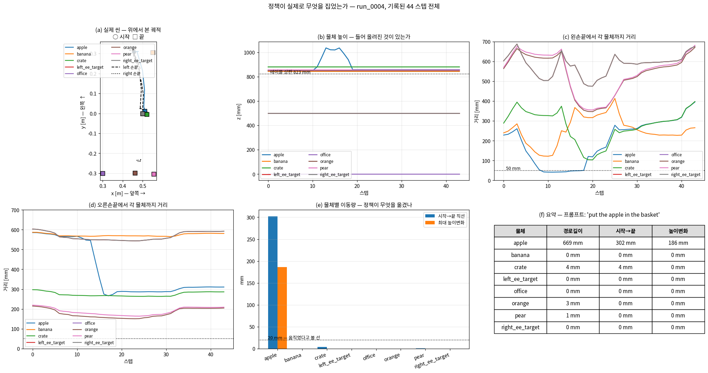

**[`figures/step6-attention-vs-hand-0004.png`](figures/step6-attention-vs-hand-0004.png)** — 어긋남의 시간축.

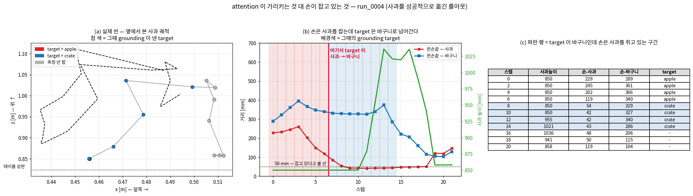

(b) 가 핵심이다. 빨간 선(손-사과)이 스텝 8 에 50 mm 아래로 내려가 붙어 있는 내내, 배경색은
파랑(target = 바구니)이다. 초록 선(사과 높이)이 11 부터 올라가는 것이 실제로 들어올렸다는 증거다.

### 전체 틀에서 지금 어디인가 (규칙 B)

```
카메라 depth → 로봇 마스크 → [attention lifting ✓ → target grounding ★] → TSDF/ESDF
            → 거리장 어댑터 → SQP 선형화 → QP 해
```

Step 5 를 닫고 **Step 6 의 문턱에서 가장 중요한 질문이 먼저 나왔다** — "target 이란 무엇인가".
지금까지 이 검토는 *target 이 주어진다고 보고* 그 아래를 고쳐 왔다 (E1 접촉 권한, 미세 창 중심,
참 거리 대조). **그 셋이 전부 이 정의 하나에 매달려 있다는 것이 이번에 드러났다.**

비유하면 — 지금까지 "누구를 만져도 되는지" 규칙을 정교하게 다듬었는데, **그 "누구" 를 정하는
사람이 손이 아니라 눈을 보고 있었다.** 손은 사과를 쥐고 눈은 바구니를 보는 7 스텝 동안, 규칙은
바구니를 만질 권한을 내주고 사과를 장애물로 세웠다.

---

## 쥔 물체를 로봇으로 취급하지 않아서 생기는 피해 — 규모 관측 (2026-09-14)

사용자 판단: *"쥔 물체는 로봇으로 취급해야 하는 거 아냐? 이미 물체를 잡았는데 장애물로 취급하면
이상하잖아."* — 맞고, **`attached.py` 첫 문장이 이미 그렇게 쓰여 있다**:

> *"Once a grasp closes, the target stops being an obstacle in the world and becomes part of the
> moving robot."*

새 아이디어가 아니라 **결정되어 문서화된 설계인데 배선이 비어 있다.** 고치기 전에 규모부터 잰다
(사용자 선택: 관측만, 수정은 뒤로). 스크립트: `trajopt/experiments/grasp_damage.py`.

### 네 층 중 하나만 되어 있다

| 층 | 상태 |
|---|---|
| ① 표현 `attached.py` | **있다** — 구 근사, FK 추종, 쥔 손가락만 접촉 allowlist |
| ② 호출 `attach()` | **아무도 안 부른다.** 지금까지 모든 측정이 "아무것도 안 쥔" 상태였다 |
| ③ 소비 trajopt | **읽는 코드가 없다** = **E3**. `linearize.py` 에 주석으로만 나온다 |
| ④ ESDF 예외 | **아예 고려 안 됨.** `_build_esdf` 는 attention target 만 알고 쥔 물체는 모른다 |

④ 가 ESDF 전환이 새로 만든 층이다. 로봇에 붙이는 것만으로 부족하다 — **카메라가 그 물체를 계속
보므로 필드에 그대로 남는다.** cuRobo v1 / MoveIt 은 월드가 정적 모델이라 빼면 끝나지만, depth
로 만든 필드는 파내면 E1 이 확정한 그 문제(익명 필드 → 몸통·반대팔에게도 사라짐)가 된다.

### 파지 판정 — 실험 하네스 쪽에 둔다

AG3S 가 파지를 감지하지 않는 것은 옳은 설계이므로(`attach()` 의 "AG3S never calls this itself"),
재생 쪽에서 **기록된 그리퍼 폭**으로 판정한다. 신호가 깨끗하다:

```
스텝 0~9    왼 그리퍼 90.0 mm      열림
스텝 10     66.1 mm                <- 사과 지름 66.6 mm. 정확히 물었다
스텝 11~18  65.0~66.5 mm           쥐고 있다
스텝 19     82.4 -> 90 mm          놓았다
```

### 결과 — 파지 구간에 **두 국면이 연달아 온다**

| 국면 | 스텝 | 무엇이 문제인가 | 규모 |
|---|---|---|---|
| **1 · 장애물로 남음** | 10~11 | 쥔 사과가 필드에 있고 완전 여유거리(50 mm)를 요구 | 위반 **38 구-스텝**, 최악 **-138.7 mm** |
| **2 · 필드에 구멍** | 12~18 | 사과가 필드에서 사라져, **물체 안쪽인 지점을 빈 곳이라 함** | 오차 최대 **154 mm** |

국면 1 의 링크별:

```
link_left_arm_5   5 구-스텝   최악 -138.7 mm   평균 -80.1 mm   (손목 큰 구, r=81mm)
ee_finger_l1     15 구-스텝   최악  -98.4 mm   평균 -79.3 mm
ee_finger_l2     18 구-스텝   최악  -97.9 mm   평균 -71.3 mm
```

**쥐고 있는 손가락이 자기가 쥔 물체 때문에 98 mm 위반이다.**

국면 2 — 사과 중심에서 필드를 질의한 값 (참값은 -33 mm, 물체 안쪽):

```
스텝  12    13    14    15    16    17    18
d    +54  +121   +39   +76  +114   +84   +58  mm
오차   88   154    73   109   148   118    91  mm
```

### 파지 9 스텝 내내 target 이 사과가 아니다

```
grounding target = {crate, banana}
```

**E1 이 만들어 둔 완화 경로가 한 번도 작동하지 않는다** — F11(전제의 불일치)이 여기서 실제 손해로
나타난다. 접촉 권한은 잘 만들어져 있는데 엉뚱한 물체에 걸려 있다.

### 국면 2 가 더 위험하다

쥔 물체가 우연히 사라져서 국면 1 이 짧게 끝난 것이지 **설계된 동작이 아니다.** 그리고 같은
원인이 반대로도 작동할 수 있다 — **손 주변의 진짜 장애물도 같이 지워질 수 있다.** 미세 계층이
가장 정확해야 할 자리가 바로 손 근처인데, 거기가 가장 못 믿을 곳이 된다.

원인은 아직 확정 안 했다. 후보 둘: (a) 로봇 자기 필터 마스크가 그리퍼를 지우면서 그 사이의
사과까지 덮는다, (b) 그리퍼가 카메라 시선을 가려 관측이 안 된다. **다음에 가릴 것.**

### 측정에서 배운 것 둘 — 방법론

**1. 거리장은 프레임에 걸쳐 누적된다.** `EsdfBuilder.update` 가 `volume.integrate(...)` 로
TSDF 에 적분한다. 그래서 **한 프레임만 처리한 필드로 특정 스텝을 검증하면 안 된다** — 처음에
그렇게 탐침을 돌려 "스텝 10 에 사과가 필드에 없다" 는 잘못된 중간 판단을 했다. 누적 필드에서는
스텝 0~11 동안 사과가 필드에 **있다**.

**2. E1 의 귀속 판정은 한쪽만 본다.** `linearize.py:357` 의 `is_target = d >= (d_target - tol)`
는 **target 이 필드에 들어 있다는 전제**에서만 옳다. 그 전제가 깨지면 "필드가 보는 장애물이 훨씬
멀다" 는 경우까지 통과한다. 이 측정에서는 양쪽으로 (`|d_esdf - d_held| <= voxel`) 보고, 물체가
필드에 있는지를 (`d @ 물체중심 < 0`) 먼저 확인해야 스텝 12~18 의 허위 귀속(최대 16 구)이 사라졌다.
**E1 본체도 같은 약점을 갖는지 확인할 것** — target 이 가려져 필드에서 사라진 프레임에서
`is_target` 이 참이 되어 엉뚱하게 완화될 수 있다.

### 시각화

**[`figures/grasp-damage-0004.png`](figures/grasp-damage-0004.png)**

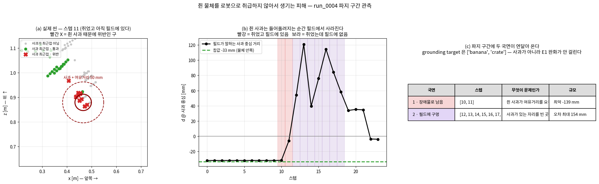

(b) 가 핵심이다. 검은 선이 스텝 11 까지 참값(-33 mm, 초록 점선)에 붙어 있다가 들어올려지는
순간 +121 mm 까지 튄다 — 필드가 사과를 놓친 것이다.

### 전체 틀에서 (규칙 B)

```
카메라 depth → 로봇 마스크 ★ → [attention lifting ✓ → target grounding ★] → TSDF/ESDF ★
            → 거리장 어댑터 → SQP 선형화 → QP 해
```

이번 관측으로 **세 곳에 동시에 표시가 붙었다.** 지금까지 이 검토는 파이프라인을 왼쪽에서
오른쪽으로 훑어 왔는데, 쥔 물체 하나가 **로봇 마스크(구멍) · grounding(전제) · 필드(장애물)**
셋을 한꺼번에 건드린다. 이 셋은 따로 고칠 수 없다.

비유하면 — 로봇이 사과를 손에 쥐었는데, 시스템은 그 사과를 **세 가지로 동시에 오해**한다.
눈은 바구니를 보고 있다 하고(grounding), 손은 사과를 밀어내야 한다 하고(필드), 들어올리는 순간
사과가 아예 없어졌다고 한다(마스크). 셋 다 "지금 무엇을 쥐고 있는가" 를 모르기 때문이다.

### 다음

**되돌아올 지점**에 남긴다 — 수정은 Step 10 에서, 순서는 ② → ③ → ④ 가 아니라 **"쥔 물체가
무엇인지" 를 하나의 사실로 만드는 것이 먼저**다. 그 사실 하나가 세 소비자(마진·필드·마스크)로
흘러가야 한다.

---

## F12 원인 규명 — **자기 필터 마스크**가 지운다 (2026-09-14)

`grasp_damage.py` 로 쥔 사과가 스텝 12 부터 거리장에서 사라지는 것(오차 최대 154 mm)을 확인했고,
원인 후보가 둘이었다. **고칠 층이 완전히 다르므로** 가려야 했다.

* **(a) 자기 필터 마스크** — `_robot_mask_for` 는 backproject 한 점이 로봇 구(20 mm 부풀림,
  `self_filter_inflation`) 안에 들면 그 픽셀을 지운다. → 고칠 곳은 자기 필터
* **(b) 가림** — 그리퍼가 시선을 막는다. → 고칠 곳은 카메라 융합

MuJoCo 세그멘테이션이 **픽셀별 body 참값**(`CameraFrame.body_ids`)을 주므로 추정할 것이 없다.
가림이면 사과 픽셀 수 자체가 0 이고, 마스크면 픽셀은 있는데 덮인다.
스크립트: `ag3s/experiments/studies/f12_why_apple_vanishes.py`.

### 판정 — (a) 자기 필터 마스크

```
zed_left (파이프라인이 실제로 쓰는 유일한 카메라)
구간           사과 픽셀   덮임   덮인 비율   남음
파지 전 0~9       427     64      15%      363
파지 중 10~18      83     83     100%        0
```

**사과는 보인다** — 파지 중에도 평균 83 픽셀이 세그멘테이션에 잡힌다. 그런데 **100 % 가 로봇
마스크에 덮여** 적분에 하나도 들어가지 않는다. 스텝 7 에 이미 310 픽셀 중 307 이 덮인다.

### 카메라 융합은 답이 아니다

```
wrist_cam_l  파지 중 사과 픽셀 평균 15,910 개  ->  마스크 후 남는 픽셀 0
```

손목 카메라는 사과를 **아주 잘 본다**. 그런데 **똑같이 100 % 지워진다** — 같은 자기 필터가 거기도
걸린다. 카메라를 더 붙이는 것으로는 F12 가 고쳐지지 않는다. (파이프라인이 지금 `zed_left`
하나만 쓰는 것은 별개 사실로 기록해 둔다 — `esdf.update` 는 카메라 여럿을 받는다.)

### 인과 사슬

```
스텝 0~5    사과가 테이블 위. 정상 적분 (558 px, 덮임 0)
스텝 6~11   손 접근 -> 사과 픽셀이 마스크에 덮임 -> 새 적분 없음
            그러나 "마스크된 광선은 미관측이지 자유공간이 아니다" (docstring) -> 옛 적분이 남는다
            -> 필드는 아직 테이블 자리에 사과가 있다고 한다 (d @ 중심 = -32 mm)
스텝 12~    사과가 들어올려짐 -> 옛 자리가 다시 보임 -> 자유공간으로 파임
            새 자리는 마스크됨 -> 영영 적분 안 됨
            -> 사과가 필드에서 완전히 사라진다 (오차 154 mm)
```

### 반전 — 마스킹 자체는 오히려 옳다

쥔 물체를 월드에서 지우는 것은 **"쥔 물체는 로봇으로 취급한다" 의 절반**이다. 자기 필터가 우연히
그 절반을 이미 하고 있다.

**빠진 것은 나머지 절반** — 로봇 쪽에 더하기(E3). 지금 사과는 **어디에도 없다.** 장애물도 아니고
로봇도 아니다. 그래서 구멍이다. **F12 의 수정은 자기 필터를 고치는 것이 아니라 E3 를 배선하는
것**이고, 두 발견이 하나로 합쳐진다.

### 그러나 파지 **전에도** 지운다 — E1 이 금지한 그 동작

스텝 7~9 는 그리퍼가 아직 90 mm 로 열려 있는데 사과가 이미 100 % 마스크된다. **아직 쥐지 않은
물체가 지워진다.** 그리고 사과만이 아니다:

```
자기 필터가 지우는 픽셀 중 로봇이 아닌 것 (zed_left)
 i    마스크 총      로봇   로봇아님    비율   비로봇 상위
 0     69,654    69,337      317    0.5%  crate:302
 7     56,019    55,395      624    1.1%  crate:307, apple:307
10     53,161    51,816    1,345    2.5%  table:911, crate:331, banana:56
18     62,752    61,655    1,097    1.7%  crate:1083
```

**바구니가 매 프레임 199~1,083 픽셀씩 지워진다.** 이것은 E1 이 금지한 바로 그 동작이다 — 필드는
익명이라 손끝뿐 아니라 몸통·반대팔에게도 사라진다. E1 은 target carving 을 그래서 없앴는데,
**자기 필터가 같은 일을 "self" 라는 이름으로 계속하고 있다.**

다만 **규모가 위험을 정한다.** 바구니는 크고 나머지 픽셀이 살아남아 필드에서 사라지지 않는다
(중심 거리 +51 mm 로 20 스텝 내내 안정). 사과는 작고 통째로 손가락 구 안에 들어가서 100 %
지워진다. **위험은 물체가 부풀린 로봇 구 안에 얼마나 들어가느냐에 비례한다.**

### 시각화

**[`figures/f12-why-apple-vanishes-0004.png`](figures/f12-why-apple-vanishes-0004.png)**

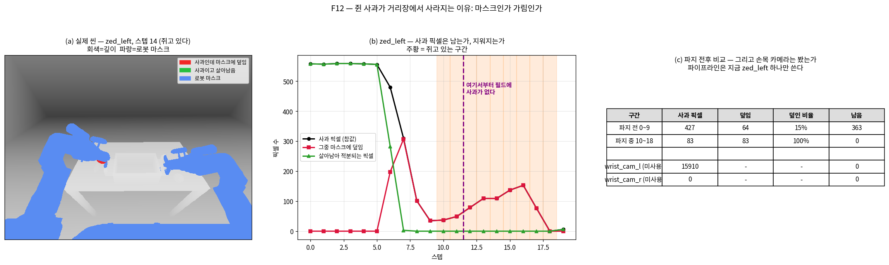

(a) 가 결정적이다 — 머리 카메라 화면에서 파란 로봇 마스크가 양팔을 덮고 있고, 손가락 사이의
사과는 **빨강**(사과인데 마스크에 덮임)이다. 초록(살아남은 사과)이 한 점도 없다.
(b) 에서 검은 선(사과 픽셀)은 남아 있는데 초록 선(살아남아 적분되는 픽셀)이 스텝 7 에 0 으로
떨어져 다시 올라오지 않는다.

### 전체 틀에서 (규칙 B)

```
카메라 depth → 로봇 마스크 ✓원인확정 → [attention lifting ✓ → grounding ★] → TSDF/ESDF ★
            → 거리장 어댑터 → SQP 선형화 → QP 해
```

**로봇 마스크 칸이 닫혔다** — F12 의 원인이 수치로 확정됐고, 그 수정이 E3 배선과 같은 일이라는
것까지 나왔다. 카메라 융합이라는 갈래는 **측정으로 배제**했다 (손목 카메라도 100 % 지워진다).

남은 것은 **"쥔 물체가 무엇인가" 를 하나의 사실로 만들고 세 소비자에게 흘리는 일** 하나로
모인다 — 마진(E1·F11) · 필드(F12) · 로봇 모델(E3). 셋이 같은 사실을 필요로 한다.

### 되돌아올 지점

* **카메라 융합** — 지금 배제했지만, 자기 필터를 고친 뒤에는 손목 카메라(사과를 15,910 픽셀로
  본다)가 미세 계층의 해상도를 크게 올릴 수 있다. 전환 신호: E3 배선 후에도 손 근처 필드가
  성기다면.
* **`self_filter_inflation` 20 mm** — 줄이면 비로봇 삭제가 준다. 그러나 docstring 이 밝힌
  트레이드오프("under-filtering leaves a phantom obstacle welded to the gripper")가 있어
  **단독으로 건드리면 안 된다.** 전환 신호: attached 배선 후에도 비로봇 삭제가 문제로 남으면.

---

# Step 6 — target grounding (2026-09-14)

계획서 320 행: *"시드 → 3D 연결성 → 스코어. 이 출력이 곧 carving 입력이다. F8"*.

**계획서의 그 한 줄은 이제 낡았다.** E1 이 carving 을 없앴으므로 이 출력이 가는 곳은 둘이다 —
`target_link_margin`(접촉 권한)과 미세 ESDF 창의 중심. 그래서 Step 6 은 원래 예정보다 무거워졌다:
**이 단계의 출력 정의가 E1·E3·F12 를 모두 좌우한다.**

**용어** — *시드(seed)*: attention 이 높아 "여기서부터 물체를 찾자" 고 고른 점들.
*3D 연결성*: 그 점에서 이웃으로 번져 나가며 한 덩어리를 만드는 것(region growing).

## run_0005 를 얻었다 — "한 회차의 우연" 이 아님을 확인

사용자가 두 번째 시연 기록을 준비해 주었다 (2026-09-14). 이 검토는 지금까지 `run_0004` 하나에
의존했고, F11·F12 판정마다 **"다른 롤아웃이 생기면 대조할 것"** 이라고 단서를 달아 두었다.
같은 프롬프트, 같은 체크포인트, 38 스텝. attention npz 도 같은 축 구조라 **Step 1 이 고른 cell
(denoise 0, agg last, layer 8, head 2) 을 그대로 쓴다** — 재튜닝하면 일반성 검증이 아니게 된다.

| | run_0004 | run_0005 |
|---|---|---|
| 스텝 | 44 | 38 |
| 정책 결과 | 사과 302 mm 이동 · 186 mm 상승 — **성공** | 사과 325 mm 이동 · 235 mm 상승 — **성공** |
| 바구니 이동 | 4 mm | 1 mm |
| 파지 구간 (그리퍼 폭) | 10~18 | 10~21 |
| 파지 중 grounding target | `{crate, banana}` | **`{crate}`** |
| 국면 1 (쥔 물체가 장애물) | 38 구-스텝, 최악 **-138.7 mm** | 21 구-스텝, 최악 **-97.5 mm** |
| 국면 2 (필드에 구멍) | 오차 최대 **154 mm** | 오차 최대 **176 mm** |

**F11 과 F12 가 두 독립 기록에서 재현된다.** run_0005 는 파지 내내 target 이 순수하게 바구니라
오히려 더 깨끗하다. 두 발견의 "우연" 단서를 **해제한다**.

**정책 실패는 두 기록 어디에도 없다.** 사용자가 보신 "사과를 집는 도중 바구니를 집는" 거동은
다른 회차이거나 현재 체크포인트의 실시간 거동이다 — 기록 둘로는 확인되지 않는다.

## F8 판정 — 실재하지만 **잠복성**

`extract_seeds` (`target_grounding.py:183`) 의 퍼센타일 경로:

```python
cut = float(np.percentile(att, seed_percentile))   # seed_percentile = 95
keep = np.nonzero(att >= cut)[0]
```

**먼저 조건을 바로잡는다.** `cut` 이 0.0 이 되려면 **점의 95 % 이상이 0** 이어야 한다 — p95 는
"95 % 가 이 값 이하" 인 값이므로 0 이 하위에 5 % 있는 것은 아무 영향이 없다.
(검토 중 이 방향을 한 번 거꾸로 적었다가 실측으로 바로잡았다.)

파이프라인을 돌리면서 `extract_seeds` 를 감싸 **그 함수가 받은 배열**을 기록했다.
스크립트: `ag3s/experiments/studies/step6_f8_seeds.py`.

```
선택된 cell (layer 8, head 2), 두 기록 22 프레임씩
  p95 컷이 0.0 이 된 횟수          0 / 22   (양쪽 모두)
  0 값 점이 시드가 된 횟수         0 / 22
  attention 이 0 인 점의 비율      5.0 % ~ 5.8 %      <- 발동에 필요한 95 % 와 89 %p 차이
  시드 수                          1819 ~ 2713
```

**선택된 설정에서는 발동하지 않고, 여유가 크다.** 그러나 cell 하나가 안전한 것과 결함이 없는
것은 다르다. 같은 npz 의 **모든 layer/head/denoise/agg/frame 조합**을 훑었다:

```
                                        run_0004    run_0005
전체 조합                                171,072     147,744
0 셀 100 %    — NO_ATTENTION 이 잡는다        619         815
0 셀 95~99.99 % — 아무도 잡지 않는다          795       1,006     <- F8 위험 띠
위험이 몰린 (layer, head)     L17H6, L17H4, L16H5  (양쪽 동일)
선택된 cell (L8H2) 의 위험 조합                 0           0
```

**위험 구간은 정확히 `0 셀 95 % 이상 100 % 미만` 이다.** 100 % 면 `NO_ATTENTION` 이 잡고,
95 % 미만이면 컷이 양수다. 그 사이 띠만 아무도 잡지 않는다 — 그리고 그 띠가 **비어 있지 않다**
(795 / 1,006 조합, 전부 후반 층 16~17).

**판정: 실재하는 결함이나 현재 파이프라인에서는 잠복 상태.** Step 1 이 layer 8 을 골랐기 때문에
발동하지 않을 뿐이다. **전환 신호** — cell 선택이 후반 층(16~17)으로 바뀌면 즉시 활성화된다.
값싼 방어는 `seed_threshold` 를 절대값으로 설정하는 것이다(설계자가 이미 그 경로를 만들어 두었고
docstring 이 "An absolute threshold can legitimately return nothing, which is how the `NO_SEED`
failure mode becomes reachable" 라고 그 의도를 밝힌다).

### 시각화

**[`figures/step6-f8-seeds-0004.png`](figures/step6-f8-seeds-0004.png)** ·
**[`figures/step6-f8-seeds-0005.png`](figures/step6-f8-seeds-0005.png)**

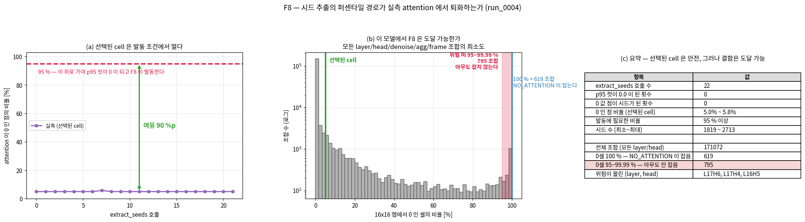

(b) 가 핵심이다 — 초록 선(선택된 cell)은 왼쪽 끝에 있고, 오른쪽 끝 분홍 띠가 아무도 잡지 않는
위험 구간이다. 로그 축이라 띠 안에 실제로 수백 조합이 있다는 것이 보인다.

**[`figures/grasp-damage-0005.png`](figures/grasp-damage-0005.png)** — run_0005 의 두 국면.

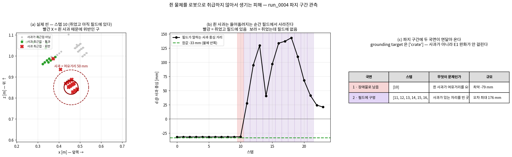

## 실험 스크립트의 그림 이름 규칙

`--records` 를 받는 스크립트 넷이 모두 같은 파일명으로 저장하고 있어 **run_0005 실행이
run_0004 의 그림을 덮어썼다.** 이제 전부 `...-{기록번호}.png` 로 저장한다. 기존 0004 그림은
이름을 바꾸고 로그 링크를 맞췄다.

## Step 6 결정 — **조작 대상과 주목 대상을 분리한다** (갈래 3, 사용자 판정 2026-09-14)

### 분리할 자리는 이미 있었다

새 필드를 만들 일이 아니었다. 타입 둘이 **정확히 그 이름으로** 이미 존재한다:

```
TargetGeometry              "The object attention says the policy is acting on"   -> 주목 대상
AttachedCollisionGeometry   "An object the robot is holding"                      -> 조작 대상
```

**결함은 소비자가 잘못된 쪽을 읽고 있던 것**이다. 그리고 `build_constraint_set` 은 `target` 과
`attached` 를 **둘 다 인자로 받고 있었는데** 후자를 아무도 쓰지 않았다.

### 바꾼 것

| 파일 | 변경 |
|---|---|
| `ag3s/constraints/clearance.py` | **`ManipulatedObject` + `manipulated_object()` 신규.** "쥔 것이 있으면 그것, 없으면 주목 대상" |
| `ag3s/types.py` | `target_link_margin` → **`manipulated_link_margin`**, `manipulated` 필드 추가 |
| `ag3s/constraints/to_adapter.py` | 마진을 조작 대상 기준으로 계산 |
| `trajopt/linearize.py` | **해석적 거리** 경로 추가(사용자 결정), 귀속 판정을 **양쪽**으로(F13) |

**설계 원칙 하나를 지켰다 — 파지 전 동작은 비트 단위로 그대로다.** 접근 중에는 조작 대상과 주목
대상이 같은 물체이므로 코드 경로가 예전과 완전히 같고, `attach()` 가 불린 뒤부터만 갈린다.
안전 관련 코드에서 회귀 기준선이 움직이지 않아야 검증이 깨끗하다. **테스트 560 개 전부 통과.**

`manipulated_object()` 는 **쥐고 있는데 FK 를 못 하면 주목 대상으로 물러서지 않고 `None` 을
돌려준다.** "쥐고 있는데 어디 있는지 모른다" 를 "바구니를 쥐고 있다" 로 바꾸는 것이 이 함수가
막으려는 바로 그 오류이기 때문이다 — 권한이 없는 쪽이 닫히는 방향이다.

귀속 판정은 F13 대로 양쪽으로 본다:

```python
d_object = (||c - sphere_centre|| - r_sphere).min(axis=1)   # 쥔 물체: 해석적
is_object = |d_esdf - d_object| <= voxel                    # 한쪽이 아니라 양쪽
```

한쪽 판정(`d >= d_object - tol`)은 그 물체가 필드에 들어 있을 때만 옳고, **쥔 물체는 자기 필터가
지워서 없는 경우가 있다**(F12). 그때 한쪽 판정은 "필드가 보는 장애물이 훨씬 멀다" 는 구까지
통과시켜 엉뚱하게 완화한다.

### 검증 — 접촉 권한이 처음으로 올바른 물체에 붙었다

같은 조건에서 `--attach` 만 켜고 껐다 (`trajopt/experiments/grasp_damage.py`):

| 기록 | 링크 | attach OFF | attach ON | 차이 |
|---|---|---|---|---|
| run_0004 | `ee_finger_l1` | -98.4 mm | **-48.4 mm** | **+50.0** |
| run_0004 | `ee_finger_l2` | -97.9 mm | **-47.9 mm** | **+50.0** |
| run_0004 | `link_left_arm_5` | -138.7 mm | -138.7 mm | **0.0** |
| run_0005 | `ee_finger_l1` | -97.5 mm | **-47.5 mm** | **+50.0** |
| run_0005 | `ee_finger_l2` | -97.2 mm | **-47.2 mm** | **+50.0** |
| run_0005 | `link_left_arm_5` | -79.5 mm | -79.5 mm | **0.0** |

**쥔 손가락에서 정확히 여유거리 50 mm 만큼 요구가 줄고, 권한 없는 손목은 한 톨도 줄지 않는다.**
E1 이 설계한 "허용된 손끝만" 이라는 성질이 실제 데이터에서 작동하는 것을 처음 확인했다.

남은 -48 mm 는 결함이 아니라 **의도된 동작**이다. `clearance.py` 의 문장 그대로다:

> *"**Zero is not 'off'.** The row still forbids penetration; it merely permits touching."*

쥔 사과가 필드에 장애물로 남아 있는 한 손가락 구는 그것을 관통한다. 그것을 없애려면 사과가
**로봇 쪽 기하**가 되어야 하고 — 그게 E3 이며 Step 10 으로 남긴다(사용자가 정한 범위).

### 하네스가 채운 공백 셋

`attach()` 는 외부가 부르는 것이므로 실험 하네스가 그 역할을 한다. 구현하며 셋이 드러났다:

| 공백 | 내용 |
|---|---|
| `attach()` 호출 | 아무도 부르지 않았다. 기록된 그리퍼 폭(90 -> 66 mm, 사과 지름 66.6 mm)으로 판정해 호출 |
| **`active_manipulators`** | **한 번도 주입된 적이 없다.** 기본값 빈 집합은 "아무도 아무것도 못 만진다" 이므로 **지금까지 모든 측정에서 E1 의 접촉 권한이 통째로 불활성**이었다. 설계상 주입되는 입력이라 코드 결함이 아니라 하네스의 공백이다 |
| `attached_parent_links` | 슬롯은 **AG3S 생성 시점에** 예약된다 — `attach()` 가 나중에 늘릴 수 없고, 예약이 없으면 호출 자체가 거절된다 |

가운데 항목이 중요하다. 손끝이 -98 mm 였던 데는 이유가 **둘**이었다 — target 이 틀렸고,
manipulator 도 없었다. 하나만 고쳤다면 숫자가 움직이지 않아 수정이 틀렸다고 오판했을 것이다.

쥔 물체의 형상은 MuJoCo 참값에서 만든다. 파지 순간의 grounding 을 쓸 수 없는 이유가 F11 그
자체다 — 그때 `cs.target` 은 이미 바구니다. 실제 시스템에서 이 자리를 채우는 것은 무엇을 쥐라고
명령했는지 아는 과제 계층이다.

### 도중에 드러난 회귀 — Step 5 의 F2 수정이 테스트를 깨뜨리고 있었다

전체 스위트를 처음 돌려 보니 `test_attention_fuses_by_max_over_the_contributing_observations` 가
실패하고 있었다. **F2 수정(융합 후 정규화) 때 테스트를 돌리지 않은 탓이다.** 테스트는 옛 계약
(`FusionResult.attention == 카메라별 정규화값의 max`)을 검사하는데, F2 가 바꾼 것이 바로 그
지점이다.

새 계약으로 다시 썼다 — 출처 뷰(`FusedPointCloud.fused_attention()`)는 여전히 max-not-mean 으로
검사하고, 파이프라인이 읽는 값은 **융합된 raw 를 정확히 한 번 정규화한 것**이며, 정규화가
단조라 순서가 보존된다는 성질을 새로 검사한다. **이후 560 개 전부 통과.**

**교훈: 코어를 고친 턴에는 스위트를 돌린다.** 이 검토는 실측 회귀 기준선(`esdf_rollout`)은 매번
돌렸지만 단위 테스트는 돌리지 않았고, 그 사이로 이것이 빠져나갔다.

### 시각화

**[`figures/step6-attach-effect.png`](figures/step6-attach-effect.png)**

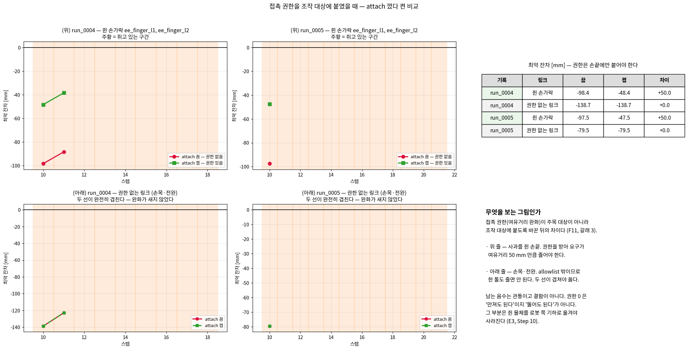

위 줄이 쥔 손끝, 아래 줄이 권한 없는 손목·전완이다. **위에서는 초록(권한 있음)이 빨강보다
정확히 50 mm 위에 있고, 아래에서는 두 선이 완전히 겹친다.** 완화가 허용된 링크 밖으로 새지
않았다는 뜻이다.

그림을 처음 그렸을 때 차이가 **+0.0** 으로 나왔다. 전 구간의 최악을 잡았기 때문인데, 파지 전
스텝은 양쪽 모드에서 attach 가 없으므로 정의상 같고 그 값이 차이를 덮었다. 파지 구간으로
한정해 고쳤다 — 그리고 그 덮임 자체가 **"접근 단계는 바뀌지 않는다"** 는 설계 성질의 확인이다.

### 전체 틀에서 (규칙 B)

```
카메라 depth → 로봇 마스크 ✓ → [attention lifting ✓ → grounding ✓] → TSDF/ESDF ★
            → 거리장 어댑터 ✓(권한) → SQP 선형화 → QP 해
```

**Step 6 이 닫혔다.** F8 판정(잠복), F11 판정(전제 불일치) 과 수정(갈래 3), run_0005 로 일반성
확인까지. grounding 단계의 출력이 이제 **두 갈래로 나뉘어** 각자 옳은 소비자에게 간다 —
접촉 권한은 조작 대상으로, 미세 ESDF 창은 주목 대상으로.

비유하면 — 지금까지는 "누구를 만져도 되는가" 를 정하는 사람이 **눈을 보고** 답했다. 이제
**손을 보고** 답한다. 눈은 여전히 "어디를 자세히 볼까" 를 정하는 데 쓰인다. 한 사람이 두 질문에
같은 답을 내던 것을, 두 질문으로 갈라 각자 옳은 곳을 보게 했다.

**다음** — 남은 것은 쥔 물체가 아직 **필드에 장애물로 남아 있는 것**(관통 -48 mm)이고, 그것은
쥔 물체를 로봇 쪽 기하로 옮겨야 사라진다. E3 · F12 · Step 10 이 한 덩어리다. 그 배선이 끝나면
"쥔 물체가 무엇인가" 라는 하나의 사실이 세 소비자(마진 ✓ · 필드 ✗ · 로봇 모델 ✗) 모두에게
도달한다 — **지금은 셋 중 하나가 연결됐다.**

---

## F9 판정과 수정 — `lift()` 의 `image_hw` 기본값 (2026-09-14, Step 5 마무리)

Step 5 를 F9 판정 대기로 열어 둔 채 Step 6 을 진행했다. 닫는다.

### 무엇이 문제인가

`lift()` (`attention_lifting.py:265`) 는 `image_hw` 를 받지 못하면 **걸러지고 남은 클라우드의 uv
최댓값**으로 해상도를 추정한다.

```python
hw = image_hw or (int(cloud.uv[:, 1].max()) + 1, int(cloud.uv[:, 0].max()) + 1)
```

클라우드는 깊이 유효성 · `range_max` · **로봇 자기 필터**를 이미 거친 뒤다. uv 가 이미지 경계에
못 닿으면 추정 해상도가 작아지고, 16x16 맵이 틀린 크기로 펼쳐진다.

`multiview.py` 는 `image_hw=observation.image_hw` 를 제대로 넘긴다. 그러나 **`AG3S.process` 의
`image_hw` 는 기본값이 `None`** 이고 **이 검토의 모든 롤아웃이 그 인자를 넘기지 않았다.**

### 측정 — 파이프라인 둘을 나란히

`lift` 를 감싸 그 함수가 실제로 쓴 hw 를 기록하고, 같은 프레임을 **독립된 TSDF 를 쌓는 AG3S
인스턴스 둘**에 넣었다 (하나는 지금처럼, 하나는 참 크기를 넘겨서). 거리장이 누적되므로 한
인스턴스를 두 번 부르면 비교가 성립하지 않는다.
스크립트: `ag3s/experiments/studies/step5_f9_image_hw.py`.

```
참 해상도 480 x 640,  16x16 맵의 셀 한 칸 = 30 x 40 픽셀

                        run_0004          run_0005
모자란 열 (참 W - 쓴 W)   0 ~ 57 px        0 ~ 43 px
모자란 행 (참 H - 쓴 H)   0 ~ 34 px        0 ~ 41 px
lift 출력이 달라진 점     98.0 ~ 100 %     99.1 ~ 100 %
최대 절대차               0.163            0.174   (원본 맵 최댓값 0.41 대비)
```

**어긋남이 attention 셀 한 칸(40 px)을 넘는다.**

### 판정 — 실효 결함. 답이 바뀐다

```
run_0004  프레임 17   banana -> crate     무게중심  184.5 mm
          프레임 18   banana -> orange    무게중심  597.6 mm
          target 물체가 달라진 프레임 2 / 20
run_0005  물체는 그대로, 프레임 16 무게중심 190.3 mm 이동
```

"답이 같다" 와 "입력이 애초에 같았다" 는 다르다. 입력은 거의 모든 점에서 달라졌고, 대부분의
프레임에서는 16x16 이라는 거친 격자 덕에 같은 클러스터가 이겼지만 **두 프레임에서는 이기지
못했다.**

**앞서 기록한 것 하나를 정정한다.** run_0004 의 파지 구간 target 을 `{crate, banana}` 로 적었는데,
**그 banana 가 F9 산물이었다** — 참 해상도로는 crate/orange 다. F11 자체는 그대로다: 어느 쪽도
사과가 아니다.

### 수정 — 참값은 이미 손에 있었다

`process` 는 `depth` 를 받는다. **그것이 바로 attention 맵이 대응하는 이미지**다. 걸러진 점에서
되짚는 것보다 언제나 옳다.

```python
hw = image_hw
if hw is None and depth is not None:
    hw = tuple(int(x) for x in np.asarray(depth).shape[:2])
```

`pipeline.py` 한 곳. 명시적으로 넘긴 `image_hw` 는 그대로 우선한다.

검증: 어긋남이 **전 프레임 0 픽셀**로 사라진다.

수정 뒤에는 옛 동작을 스크립트의 spy 에서 재현해 다시 비교했다 (`LEGACY` 플래그). 두 인스턴스로
쟀을 때와 **같은 수치가 나온다** — 2/20 · 597.6 mm, 0/20 · 190.3 mm.

### 회귀

* **테스트 560 개 전부 통과.**
* **회귀 기준선 불변** — `해소 14 / 개선 15 / feasible 8, violated 7`. 15 프레임 구간에는 답이
  바뀌는 프레임(17~18)이 들어 있지 않아서다. **기준선이 이 결함을 못 잡았다**는 뜻이기도 하다.

### 시각화

**[`figures/step5-f9-image-hw-0004.png`](figures/step5-f9-image-hw-0004.png)** ·
**[`figures/step5-f9-image-hw-0005.png`](figures/step5-f9-image-hw-0005.png)**

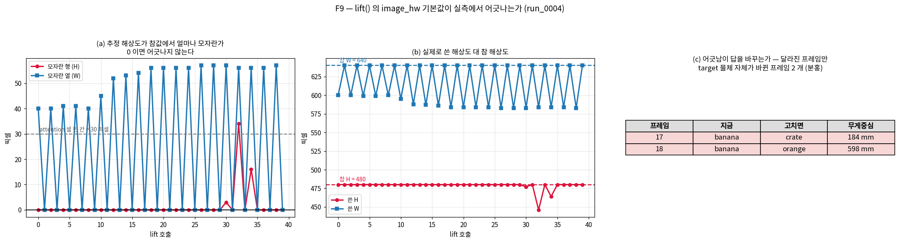

(a) 의 톱니는 프레임마다 파이프라인 둘(수정 전/후)이 번갈아 불리기 때문이다 — 홀수 호출이
수정 전으로 40~57 px 모자라고, 짝수 호출이 고친 뒤로 0 이다. (c) 가 답이 바뀐 두 프레임이다.

### 이 판정이 남기는 것

**"어긋난다" 와 "답이 바뀐다" 를 따로 재야 했다.** 처음 세 프레임만 보고는 무게중심 차이가
0.0 mm 라 잠복으로 닫을 뻔했다. 입력이 실제로 달라졌는지(점의 98~100 %)를 함께 재지 않았다면
"영향 없음" 으로 잘못 적었을 것이다. 20 프레임으로 늘리자 두 프레임에서 바뀌었다.

**되돌아올 지점** — 16x16 이라는 거친 격자가 대부분의 프레임을 구했다. attention 해상도가
올라가면 같은 어긋남이 훨씬 자주 답을 바꾼다. 전환 신호: attention 맵 해상도가 16x16 보다
높아지면 이 경로를 다시 볼 것.

---

## 계획서 갱신 (2026-09-14, 사용자 지시)

`AG3S_REVIEW_PLAN.md` 를 현재 사실에 맞췄다. **틀린 짐작은 지우지 않고 취소선으로 남겼다** —
무엇을 어떻게 잘못 짐작했는지가 그 자체로 자료다.

| 무엇을 | 왜 |
|---|---|
| 머리말에 갱신 시각·이동 링크 | 세션 시작 때 처음 읽는 문서라 위치부터 잡혀야 한다 |
| **"현재 위치" 절 신설** | 검토가 시작할 때와 달라진 여섯 가지 |
| 스텝 분해 표에 **상태 열** | 0~6 완료, 7 다음, 10 임계 경로 |
| Step 6 의 "이 출력이 곧 carving 입력이다" | **E1 이후 carving 은 없다.** 출력이 가는 곳은 접촉 권한과 미세 창 중심 둘 |
| 발견 목록에 판정 얹기 | E1·E5·F2·F9·F11 수정됨, E7 기각, F8 잠복, E2·F10 미확정 |
| **F11·F12·F13·H1·H2 신규 항목** | 사전 조사에 없던 것들 |
| 검증 방법의 명령·수치 | `src/openpi/.venv` → `.venv-ag3s`, 445 → 560, 롤아웃 명령 |
| "수정은 이 검토의 범위가 아니다" | 더 이상 맞지 않는다 — 판정한 것 중 상당수를 그 자리에서 고쳤다 |
| "시작 지점" → **"앞으로 할 것"** | Step 0 은 끝났다. 남은 스텝과 Step 10 의 순서를 적었다 |
| 규칙 문자 A~E 를 훅과 정렬 | 계획서는 D 가 `CONTAINER_SETUP` 이었는데 훅은 E 다 |

### 계획서에 새로 못박은 것 둘

**1. 회귀 기준선 둘을 항상 함께 돌린다.** 하나만으로 부족하다는 것을 두 번 겪었다 — F2 수정 때
롤아웃만 돌려 단위 테스트 회귀를 남겼고, F9 는 **둘 다 못 잡았다**(답이 바뀌는 프레임이 15 프레임
구간 밖). **회귀 기준선은 결함의 부재를 증명하지 않는다.**

**2. 판정에는 질문이 둘 필요하다.** *어긋나는가* 와 *답이 바뀌는가* 는 다르다. F9 는 처음 세
프레임에서 무게중심 차이가 0.0 mm 였지만, 입력은 점의 98~100 % 에서 달라져 있었고 20 프레임으로
늘리자 두 프레임에서 물체가 바뀌었다.

---

## 통합 시점 정리 (2026-09-14, 사용자 질문)

*"cuRoboV2 와 attention 과 trajopt 는 언제 합쳐지는거야"* — 계획서에 "cuRobo 배선" 한 줄로만
적혀 있어 답이 불분명했다. 코드 상태를 확인해 계획서에 **"통합"** 절을 새로 넣었다.

**이미 합쳐진 곳이 있다** — `esdf_rollout.py` 가 셋을 end-to-end 로 돌리고 15 청크 검증까지 끝났다.
다만 **거리장 생산이 오프라인**이다 (`.venv-curobo` → npz → `.venv-ag3s`).

**남은 셋**: 생산이 다른 프로세스 · `pipeline._build_esdf` 가 아직 numpy · 스트리밍 없음.

**venv 장벽의 실체를 처음 확인했다.**

```
.venv-ag3s     numpy 2.4.6   mujoco 3.11 · casadi 3.8 · osqp 1.1.3
.venv-curobo   numpy 1.26.4  torch 2.5.0a0(NVIDIA) · curobo 0.8 · warp 1.17
```

묶는 것은 **NVIDIA torch 가 numpy 1.26 에 고정**된 것인데, **프로덕션에는 MuJoCo 가 필요 없다**
(재생 전용). 소비 쪽이 필요로 하는 것은 `numpy + casadi + osqp + scipy` 뿐이고, casadi 는
`linearize.py:270` 의 로봇 FK 한 곳에서만 쓴다 (`qp.py:107` 은 기본 솔버가 osqp).

**즉 방향은 venv 병합이 아니라 `.venv-curobo` 에 casadi·osqp 를 넣는 것이다.** 아직 확인하지
않았다 — 설치는 환경 변경이라 승인이 필요하다.

**언제**: Step 10 직후. **Step 10 이 필드에 들어갈 내용을 바꾸므로**(쥔 물체를 필드에서 빼고
로봇 구로 넣는다) 먼저 배선하면 두 번 반영해야 한다. 선행 확인(casadi·osqp 설치 가능성)만
아무 때나 해도 무해하다.


---

# Step 7 — multiview.py (2026-09-14)

## 융합 비대칭 측정 — 사용자 가설 "방법 B(TSDF)가 더 좋다" 를 참값으로 검증

AG3S 는 카메라 셋을 한 씬으로 합치는 방법을 **둘** 갖고 있고, 둘은 **"지운다" 는 능력**에서 갈린다.

| | 방법 A · 점을 모은다 | 방법 B · 광선을 붓는다 |
|---|---|---|
| 어디 | `multiview.fuse:236` | `esdf.update` ← `pipeline._depth_cameras_from:729` |
| 복셀 | `timing.fusion_voxel_size` 0.01 m | `esdf.voxel_size` (롤아웃 0.020) |
| 규칙 | **합집합** — 한 대라도 점을 찍으면 있음 | 가중 평균 + **광선이 지난 구간은 자유공간** |
| 소비자 | 지지면 적합 · target grounding | 충돌 필드 |

"둘이 다르다" 만 세면 어느 쪽이 옳은지 모른다. MuJoCo 세그멘테이션이 **픽셀별 body 참값**을
주므로 불일치마다 참값으로 심판했다. 스크립트: `ag3s/experiments/studies/step7_fusion_asymmetry.py`.

### 측정하며 두 번 갈라내야 했다

**1차 — 격자 밖을 뺐다.** 처음 결과는 "B 가 73 % 를 지운다" 였는데 지워진 점의 99.8 % 가 방
벽(`office`)이었고 **전부 ESDF 격자 밖**이었다. 격자 밖은 무조건 `+max_distance` 로 답하는
**E4** 이지 융합 비대칭이 아니다.

**2차 — "비었다" 와 "모른다" 를 갈랐다.** 격자 안으로 좁혀도 45 % 가 남았는데, 그 점들의 답이
예외 없이 **정확히 400 mm = `max_distance`** 였고 좌표가 전부 `z = 0.003 m` — **바닥**이었다.
거리장이 큰 값을 돌려주는 경우가 둘이고 뜻이 완전히 다르다:

* `tol < d < max_distance` — 광선이 지나갔다고 **적극적으로 판단**한 자리. **재려던 비대칭.**
* `d == max_distance` — **한 번도 관측되지 않은 자리**(UNKNOWN). 융합 방식의 차이가 아니다.

### 결과 (run_0004, 3 카메라, 12 프레임, 격자 안 융합점 177,116)

| 무엇 | 개수 | 비율 | 물체 |
|---|---|---|---|
| **B 가 적극적으로 파낸 실물체 점** | **155** | **0.088 %** | crate 129 · apple 14 · pear 12 |
| 관측 공백 (UNKNOWN) | 81,836 | 46.2 % | **office 81,774 · table 62** |
| **필드에만 있는 복셀** | **13,867** | — | 점구름이 못 가진 것 |
| 로봇 누수를 B 가 거름 | 0 | 0 % | — |

(격자 밖 154,705 점은 E4 라 제외했다.)

### 판정 — 사용자 가설이 맞다. 다만 이유가 예상과 다르다

**1. B 가 진짜 물체를 잘못 지우는 일은 거의 없다 — 0.088 %.** 내가 그림으로 설명한
"손목 광선이 머리가 본 표면을 깎는다" 는 **실재하지만 미미하다.** 그리고 파인 것은 전부 작업공간
물체이고 `crate` 가 83 % 다 — 바구니는 벽이 얇고 손목에서 스치는 각으로 보이므로 광선이 벽을
통과하기 쉽다. 물리적으로 말이 되는 자리에서만 일어난다.

**2. 46 % 의 "모른다" 는 전부 방 껍데기다** — `office` 81,774, `table` 62. **작업공간 물체는
하나도 없다.** 점구름이 거기서 더 갖고 있는 정보는 충돌 회피에 쓸모가 없다. 그리고 대부분
격자 최하단 층의 바닥이라 경계 인공물이다.

**3. B 는 점구름이 못 가진 13,867 복셀을 더 갖고 있다.** 자유공간 추론이 주는 것이고, 점구름은
그것을 **표현할 수단 자체가 없다.**

**즉 B 는 중요한 것에서 낫고, A 의 우위는 방 껍데기에 국한된다.**

### 내가 틀린 것 하나

설명할 때 표에 **"방법 B 가 로봇 누수를 걸러낸다"** 는 줄을 넣었는데 **0 이다.** 자기 필터가
**두 방식 모두보다 앞**에서 돌기 때문에 B 가 거를 것이 애초에 없다. 두 방식은 **같은 로봇-필터된
입력**을 받는다.

### 시각화

**[`figures/step7-fusion-asymmetry.png`](figures/step7-fusion-asymmetry.png)** — 개념 도식
(사용자가 "1번이 무슨 내용인지 모르겠다" 고 하여 그린 것).

**[`figures/step7-fusion-asymmetry-measured-0004.png`](figures/step7-fusion-asymmetry-measured-0004.png)** — 실측.

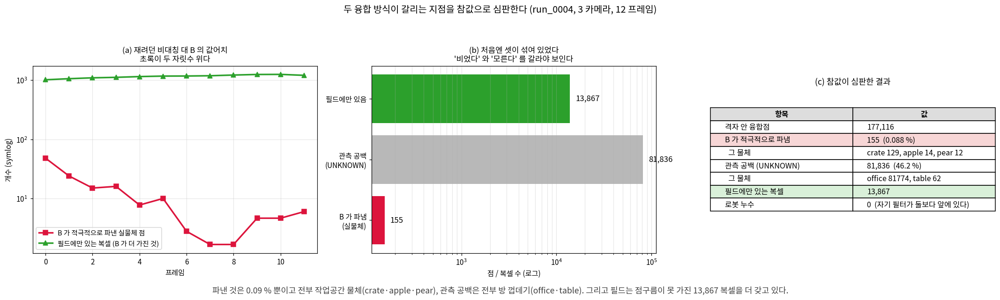

### 용어

* **점구름 융합 / TSDF 적분** — 카메라 셋을 한 씬으로 합치는 두 방식. 전자는 더하기만 하고,
  후자는 **빼기도 한다**(광선이 지난 자리를 자유공간으로 기록).
* **비었다 대 모른다** — 거리장이 큰 값을 돌려주는 이유가 둘이다. `d < max_distance` 면 관측해서
  비었다고 판단한 것, `d == max_distance` 면 관측 자체가 없는 것. **섞어 세면 판정이 뒤집힌다.**

## 상태 지연은 얼마부터 해로운가 — 설정 한계는 그 지점에 맞는가 (2026-09-14)

`TimingConfig` docstring 이 이 자리를 **직접 열어 두었다**:

> *"The defaults are deliberately loose (100 ms), because the numbers that matter come from the real
> robot's transport and control rates and **nobody has measured them here yet**."*

그런데 `multiview.py` 머리말은 같은 저장소에서 이렇게 쓴다:

> *"A wrist camera moving at 1 rad/s and a 50 ms state lag put the cloud 2.5 cm from where it
> belongs — enough to ... **misalign the self-filter so that the arm's own points survive and cluster
> into a phantom obstacle attached to the gripper**."*

**설정 한계(100 ms)가 모듈 자신이 해롭다고 든 예(50 ms)보다 2 배 느슨하다.** 재서 확정한다.
스크립트: `ag3s/experiments/studies/step7_state_lag.py`.

### 어떻게 — 지연을 만들어 넣는다

우리 기록은 카메라 셋이 **같은 MuJoCo 스텝**에서 나와 지연이 0 이다. 그래서 "촬영 시각 기구학이
좋다" 를 그냥 재면 아무것도 안 나온다. 대신 **영상은 프레임 `i` 것, 로봇 자세만 프레임 `i-k` 것**
으로 바꾼다. 기록 한 스텝이 **16 ms** 이므로 `k` 스텝이 곧 `16k` ms 다 — 속도를 적분해 만드는
것보다 실제에 가깝다. 진짜로 그 자세였던 순간이 있기 때문이다.

자세를 바꾸면 **자기 필터 마스크도 손목 카메라 외부 파라미터도 함께 밀린다** — 실제 지연이 하는
일 그대로다. 이 기록의 관절 속도는 중앙 0.077 · 95 % 7.6 · 최대 17.4 rad/s 로, 모듈이 든
1 rad/s 보다 훨씬 빠르다.

### 결과 (run_0004, 프레임 8~13, 3 카메라)

| 상태 지연 | 클라우드에 들어간 **로봇 점** | 카메라 위치 오차 (평균) | 설정 안? |
|---|---|---|---|
| 0 ms | **0** | 0.0 mm | 예 |
| 16 ms | 851 | 14.3 mm | 예 |
| 32 ms | 2,279 | 25.7 mm | 예 |
| 48 ms | 2,807 | 34.3 mm | 예 |
| 64 ms | 3,921 | 42.6 mm | 예 |
| **96 ms** | **6,275** | 59.0 mm (최대 226.7) | **예** |
| 128 ms | 7,684 | 70.2 mm | 아니오 |

### 판정 — 한계가 느슨하다

**누수는 잴 수 있는 가장 작은 지연(16 ms)부터 이미 시작된다.** 그리고 **설정이 허용하는
100 ms 안에서 팔 자신의 점 6,275 개가 장애물 필드로 들어온다** — 모듈 머리말이 경고한
"그리퍼에 붙은 유령 장애물" 그 자체다. 한계가 피해 시작점보다 **6 배 이상 느슨하다.**

모듈이 든 "2.5 cm" 는 우리 데이터에서 **32 ms** 에 도달한다 (25.7 mm). 예시가 50 ms 를 든 것은
1 rad/s 기준이고, 이 롤아웃은 그보다 빠르다.

**단서** — 16 ms 는 기록 해상도의 바닥이다. 실제 시작점은 그보다 아래일 수 있고 이 데이터로는
더 잘게 못 나눈다. 그래서 "16 ms 부터" 가 아니라 **"16 ms 에서 이미"** 가 정확한 표현이다.

### 지표를 한 번 고쳐야 했다

처음에는 **마스크를 빠져나간 원시 픽셀**을 셌고, 지연 0 에서도 36,272 가 나왔다. `range_max` 와
깊이 유효성에서 어차피 떨어질 픽셀이 섞였기 때문이다. **실제로 클라우드에 들어가는 점**으로
바꾸니 기준선이 **0** 이 되어 융합 비대칭 측정(로봇 점 0)과 맞았다. **기준선이 0 이 되는지가
지표가 옳은지의 시험이었다.**

### 시각화

**[`figures/step7-state-lag-0004.png`](figures/step7-state-lag-0004.png)**

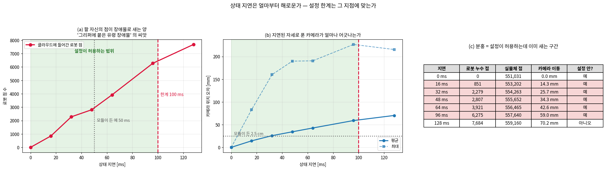

(a) 의 초록 영역이 설정이 허용하는 범위인데, 빨간 곡선이 그 안에서 이미 6,275 까지 올라간다.

### 남기는 것

* **F14 신규** — `timing.max_state_age_sec` 기본값 100 ms 가 피해 시작점보다 훨씬 느슨하다.
  기본값을 고치는 것은 이 검토의 범위가 아니다 (실제 로봇의 전송·제어 주기를 알아야 한다).
  **그러나 이제 잰 숫자가 있으므로 docstring 이 열어 둔 자리를 채울 수 있다.**
* 서빙 경로(`safe_policy.py`)는 실제 관측의 타임스탬프를 쓰므로 이 값이 곧바로 운용 한계가 된다.
* 누수가 **로봇 점**이라는 것이 중요하다 — 씬 어딘가가 아니라 **그리퍼 주변**에 생긴다. 미세
  ESDF 창이 가장 정확해야 할 자리와 정확히 겹친다 (F12 와 같은 자리).

## 검토 경로에 서빙 경로를 나란히 놓았다 — Step 7 마무리 (2026-09-14)

지금까지 모든 측정이 **단일 카메라**(`esdf_rollout.py` → `AG3S.process`)였는데 서빙은
**3 카메라**(`safe_policy.py` → `process_multi_debug`)다. 남은 판정(Step 8~11)이 서빙과 다른
조건에서 나오지 않도록 `esdf_rollout.py` 에 `--cameras {head,all}` 을 넣었다.

**기본값은 `head` 로 둔다.** 회귀 기준선을 바꾸면 이전 모든 측정과의 비교 가능성을 잃는다.
`all` 은 서빙과 같은 진입점이다. 롤아웃은 **원래 세 대를 다 캡처하고 머리만 쓰고 있었으므로**
캡처 비용은 이미 치르고 있었다.

### 결과 (run_0004, 15 청크, 같은 설정)

| | `--cameras head` | `--cameras all` |
|---|---|---|
| 해소 / 개선 | 14 / 15 | **15 / 15** |
| 상태 | feasible 8, **violated 7** | feasible 9, **violated 6** |
| AG3S | 3039 ms | **2297 ms** |

**기본값이 기준선을 그대로 재현한다** (`해소 14 / 개선 15 / feasible 8, violated 7`) — 옵션
추가가 기존 경로를 건드리지 않았다는 확인이다.

### 3 카메라가 더 낫고 **더 싸다**

3 배 카메라인데 더 빠른 것이 뜻밖이라 확인했다:

```
카메라별 점   head 49,540 + left_wrist 31,845 + right_wrist 32,546 = 113,931
융합 후                                                              28,953  (압축 0.254)
단일 카메라 경로                                                      49,540
ESDF per_camera 키   ['head', 'left_wrist', 'right_wrist']     <- 셋 다 적분된다
```

**융합 복셀(`timing.fusion_voxel_size` 1 cm)이 카메라별 복셀(`pointcloud.voxel_size` 0.5 cm)보다
굵어서, 세 대를 합쳐도 결과 클라우드가 단일 카메라의 58 % 다.** 하류(grounding · 지지면 적합)가
그만큼 싸지고, ESDF 적분만 3 배인 비용을 그 절감이 넘는다. **관측은 3.9 배 많은데 점은 더 적다** —
각 점이 여러 카메라의 출처를 CSR 로 들고 있으므로 정보를 잃은 것이 아니다.

per_camera 키가 셋으로 갈리는 것은 **E5 수정이 실제로 작동하는 증거**다 (예전에는 셋 다
`"camera"` 로 붕괴해 서로 덮어썼다).

### 청크 0 이 흥미롭다

```
head   시작 -28.7 → 끝 -0.6   violated
all    시작 -33.5 → 끝 +4.8   feasible
```

3 카메라 쪽이 **시작은 더 나쁘고 끝은 더 좋다.** 필드가 더 완전해서 위반을 더 정직하게
보고하고(-33.5), 동시에 최적화기에 더 나은 기하를 줘서 빠져나갈 길을 찾는다(+4.8).
청크 5·10 은 시작 위반이 **완전히 같다**(-68.0, -140.3) — 그 자리의 구속 기하는 머리 카메라가
이미 보고 있던 것이라는 뜻이다.

### 권고

* **회귀 기준선은 `head` 로 유지** — 비교 가능성이 그 값의 존재 이유다.
* **서빙 경로에 관한 판정은 `all` 로** — Step 8 의 지지면·평면 행이 특히 그렇다. 손목 카메라가
  테이블 상판을 보는 각이 머리와 크게 다르다.

---

# Step 8 — support_surface.py + 평면 행 (2026-09-14)

## 먼저: 이 모듈은 왜 있는가 (사용자 질문)

*"support_surface.py 를 하는 이유가 뭐야?"* — ESDF 가 이미 테이블을 담고 있는데 평면을 따로
맞출 이유가 있느냐는 물음이다. **쓰임이 둘이고 서로 독립적이며, 그중 하나만 충돌에 관한 것이다.**

| 쓰임 | ESDF 전환 후 | 우리 경로에서 |
|---|---|---|
| **충돌 제약** — 평면 한 줄 `n·p >= d` | **중복** — 필드가 이미 테이블을 담는다 | **꺼져 있음** (`use_support_planes=False`) |
| **분할** — grounding 의 `exclude_mask` | **그대로 필수** | 켜져 있음 |

### 분할 쓰임이 지지 기둥이다 — 측정으로 확정

물체가 테이블 **위에** 놓여 있어서 연결성(영역 성장)이 상판을 타고 번진다. 사과 → 상판 →
바구니 → 바나나가 한 덩어리가 된다. 그래서 평면은 **grounding 보다 먼저** 맞춰지고
(`pipeline.py:360` → `391` 의 `exclude_mask=support_mask`), 명세 §3.4 가 grounding 뒤에 둔 것을
구현이 앞으로 옮겼다.

주석의 주장을 그대로 믿지 않고 **같은 프레임에서 마스크만 빼고 다시 grounding 했다**:

```
프레임   평면 마스크 있음        평면 마스크 없음
  0     apple 20mm  256점     low_score (target 없음)
  1     apple 20mm  255점     low_score (target 없음)
  2     apple 32mm  261점     low_score (target 없음)
  3     apple 19mm  159점     low_score (target 없음)
  4     apple 19mm  163점     low_score (target 없음)
  5     apple 19mm  165점     low_score (target 없음)
```

**6/6 프레임에서 target 을 못 찾는다.** 실패 사유가 `no_cluster` 가 아니라 **`low_score`** 인 것이
증상을 정확히 말해 준다 — 클러스터는 만들어지는데 사과·상판·바구니가 뭉쳐 **attention 밀도가
희석되어** 점수 문턱을 못 넘는다.

### 그래서 답

**`support_surface.py` 는 충돌 때문이 아니라 분할 때문에 존재한다.** ESDF 전환으로 충돌 쓰임은
중복이 됐지만 분할 쓰임은 그대로 남는다 — Step 4 가 "ESDF 는 raw depth 를 먹는데 클라우드가 왜
아직 필요한가" 에 답한 것과 같은 구조다.

**아무것도 지우지 않는다.** 인라이어는 *클러스터링* 에서만 빠지고 `SUPPORT_SURFACE` 후보로
남는다 — 테이블은 로봇이 부딪힐 수 있는 기하다.

## E2 의 조건이 우리 측정 경로에는 없었다

계획서의 E2 는 *"ESDF 모드에서는 `exclude_support_surfaces=True` 가 테이블을 필드에서 파내므로
이 평면 행이 유일한 테이블 제약"* 이라고 적었다. 그런데 스위치가 둘이고 **기본값과 우리 롤아웃이
반대**다:

| 스위치 | 기본값 | 우리 롤아웃 (`--support-surfaces field`) |
|---|---|---|
| `esdf.exclude_support_surfaces` | `True` (파냄) | **`False`** (테이블이 필드에 남음) |
| `collision.use_support_planes` | `True` (평면 행 읽음) | **`False`** (안 읽음) |

**이 검토의 모든 측정에서 평면 행이 최적화기에 도달한 적이 없다.** E2 가 지목한 조건이 성립한
적이 없다는 뜻이고, 그래서 E2 는 아직 **미확정**이다.

config 는 파내는 이유도 명시한다 — 둘 다 켜면 **같은 표면을 두 백엔드가 다른 여유거리로
요구**한다 (평면 10 mm 대 필드 50 mm). 그렇게 하면 23 구가 명목상 위반이 된다고 실측이 적혀 있다.

## 무한 half-space (E2 본체)

`SupportSurface` 에 **범위 정보가 없다** — `normal`, `offset`, `point_indices`, `point_count`,
`rms_error`, `safety_margin`. 인라이어가 범위를 알지만 **제약으로 넘어가지 않는다.** 평면 행은

```python
plane = centres @ n.T - offset - r      # 모든 로봇 구 x 모든 지평 스텝 (linearize.py:420)
```

공간 게이팅이 없다. 바닥에는 맞지만 테이블에는 틀리다 — 상판은 유한한데 반공간은 무한해서
"로봇의 어떤 부위도 테이블 높이 아래로 내려갈 수 없다" 를 작업공간 전체에 강제한다.

## 사용자 제안 — "분할 용도로만 쓰고 ESDF 는 cuRobo 로" (2026-09-14)

*"support_surface 를 분할 용도로만 사용하고 esdf 로는 사용 안 하면 안 되나요? curobo 를 사용해서
esdf 생성하면 되잖아"*

### 답: 그게 이미 두 실제 경로가 하는 것이다

```python
# bringup.py:197 (서빙)  ·  esdf_rollout --support-surfaces field (검토)
"esdf":      {..., "exclude_support_surfaces": False},   # 테이블이 필드에 남는다
"collision": {..., "use_support_planes": False},          # 평면 행을 안 읽는다
```

`safe_policy.py:60` 도 `use_support_planes: False` 다. 평면 추출은 켜 두고 grounding 의
`exclude_mask` 로만 쓴다 — **정확히 제안하신 구성**이다.

반대인 것은 **라이브러리 기본값뿐**이다 (`exclude_support_surfaces=True`,
`use_support_planes=True`). 그러나 이것은 **선택이었지 판정이 아니었다** — 비교 측정이 없었다.
그래서 무엇을 잃는지 쟀다. 스크립트: `ag3s/experiments/studies/step8_planes_vs_field.py`.

### 측정 — 필드가 그 표면을 실제로 담고 있는가

평면 행이 하던 일을 필드가 대신하려면 **그 표면이 필드 안에 있어야** 한다. 3 카메라, 4 프레임
적분 후 수직선 `(x=0.5, y=0.0)` 을 따라 물었다.

```
맞춰진 평면   id=0  z=0.0026  인라이어 26,517  rms 0.3 mm   <- 바닥
             id=1  z=0.8230  인라이어  4,823  rms 2.4 mm   <- 테이블 상판

필드 수직 단면 (unknown_policy = free -> 미관측은 +400 mm)
  z=0.000    +400.0 mm   미관측 (자유로 취급)      <- 바닥이 필드에 없다
  z=0.100     +90.0 mm   관측된 자유공간
  z=0.700     +59.2 mm   관측된 자유공간
  z=0.790     -40.0 mm   표면 안쪽                 <- 테이블이 필드에 있다
  z=0.823     -28.7 mm   표면 안쪽
  z=0.840     -12.1 mm   표면 안쪽
  z=0.900     +46.2 mm   관측된 자유공간

제약 모델(팔만) 구의 z 범위: 0.991 ~ 1.371 m
  가장 낮은 팔 구가 상판(z=0.823) 보다 +168 mm 위
  가장 낮은 팔 구가 바닥(z=0.003) 보다 +989 mm 위
```

### 판정

| | 평면 행이 필요한가 | 근거 |
|---|---|---|
| **테이블** | **아니오** | 필드가 슬래브로 담고 있다 (핵심 -40 mm). 평면 쪽은 오히려 **무한 half-space 라 과하게 막는다** (E2) |
| **바닥** | **경우에 따라** | 필드에 **없다** — 미관측이고 `unknown_policy=free` 라 자유로 답한다 |

**테이블에 대해서는 제안이 옳고, 측정이 뒷받침한다.**

**바닥은 다르다.** 평면으로는 26,517 점이 rms 0.3 mm 로 아주 정확히 맞춰지는데 **필드엔 없다** —
카메라가 볼 각이 안 나온다. 지금 무해한 이유는 제약 모델이 팔만이고 팔 구가 바닥에서 989 mm
위이기 때문인데, 이것은 **우연한 안전이지 설계된 안전이 아니다.** `--constraint-links all` 로
베이스·바퀴를 넣으면 바닥을 막는 것이 아무것도 없다.

(다만 이동 베이스가 바닥에 닿아 있는 것은 **정상**이므로, 그 경우엔 오히려 평면 행이 "고칠 수
없는 위반" 을 상수로 깔았다 — 롤아웃 주석이 지적한 그 문제다. 즉 바닥에 대해서는 어느 쪽도
그대로는 맞지 않는다.)

### F15 신규 — 라이브러리 기본값이 실제 경로와 반대다

```
config.py 기본값   exclude_support_surfaces=True,  use_support_planes=True
실제 두 경로       둘 다 False
```

오버라이드 없이 `AG3S()` 를 만드는 사람은 **두 백엔드가 같은 표면을 다른 여유거리로 요구하는
상태**(평면 10 mm 대 필드 50 mm)를 얻는다. config 자신이 그러면 23 구가 명목상 위반이 된다고
적어 두었다. **기본값을 실제 경로에 맞추는 것이 맞다고 보지만, 라이브러리 계약 변경이라
판정이 필요하다.**

### 시각화

**[`figures/step8-planes-vs-field-0004.png`](figures/step8-planes-vs-field-0004.png)**

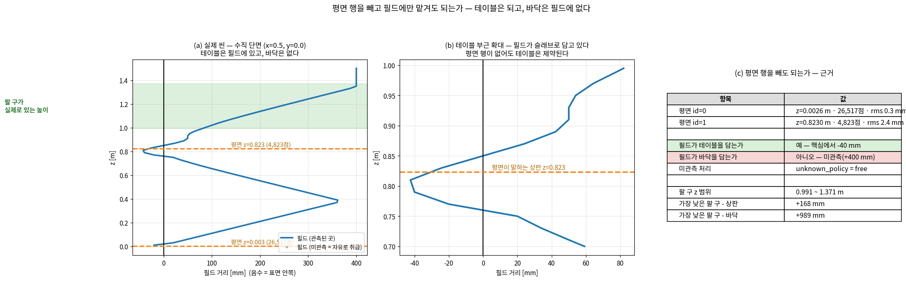

(a) 에서 파란 선이 z=0.79~0.84 에 음수 골을 만드는 것이 필드 안의 테이블이고, z=0 의 회색 점이
미관측인 바닥이다. 초록 띠가 팔 구가 실제로 있는 높이 — 둘 다에서 멀다.

## 사용자 제안 — 블록-스파스 할당, 그리고 바닥을 처리할 이유 (2026-09-14)

*"cuRoboV2 논문에서는 타겟 근처만 데이터를 할당하는 블록-스파스 방식을 사용합니다. 우리도
attention 근처만 처리하면 안 되나요? 바닥을 처리할 이유는 없어 보입니다. 팔로 물체를 옮기는데
바닥을 왜 처리해야 하는지 모르겠어."*

낭비 규모를 쟀다. 스크립트: `ag3s/experiments/studies/step8_grid_utilization.py`.

### 낭비는 92.7 % 다

롤아웃 44 스텝 × 제약 구 120 개 = 중심 5,280 개. 복셀마다 가장 가까운 구까지의 거리를 보고,
`구 반지름 + 여유거리 + 보간 1 복셀 = 153 mm` 안에 드는 것만이 **실제로 제약 평가에 쓰인다.**

```
격자 (76, 90, 80) = 547,200 복셀 (20 mm)
  153 mm 이내 (실제 질의권)    39,903   7.29 %
  300 mm 이내                 113,918  20.82 %
  500 mm 이내                 239,822  43.83 %

질의권 bbox  x [-0.170, 0.690]  y [-0.490, 0.530]  z [0.690, 1.510]
질의권을 딱 감싸는 상자  (44, 52, 42) = 96,096 복셀 (17.6 %)
바닥 z=0.003 에서 가장 낮은 질의권까지  687 mm
```

**격자의 92.7 % 는 만들고 버린다.** 그리고 이 7.29 % 조차 **롤아웃 전체의 합집합**이라 관대하게
잡은 값이다 — 청크 하나(실제 할당 단위)의 swept volume 은 훨씬 작으므로 절감은 더 크다.

**블록-스파스 없이 상자만 조여도 17.6 % 로 준다.** 지금 격자는 `default_bounds` 가 로봇 도달
범위에서 유도한 것인데, 실제 질의권보다 훨씬 크다.

### 바닥 — 제안이 옳다

**질의되는 가장 낮은 지점보다 687 mm 아래다.** 팔이 물건을 옮기는 동안 바닥은 질의된 적이 없고,
앞으로도 없다. 처리할 이유가 없다.

다만 **"바닥을 처리하지 않는다" 가 두 뜻이 될 수 있다**는 것은 기록해 둔다.

1. **할당하지 않는다** — 격자를 로봇 주변에만 두어 바닥이 애초에 없다. → 옳다.
2. **관측했는데 자유라고 답한다** — 지금 상태다(`unknown_policy=free`). 격자엔 있는데 미관측이라
   "비었다" 고 답한다. → 위험하지만 지금은 아무도 안 물어서 드러나지 않는다.

### 그러나 "무엇의 근처" 인가가 갈린다 — attention 이 아니라 **질의점**이다

cuRobo 의 블록-스파스는 **질의점(로봇 구) 주변**에 할당한다. "attention 근처" 는 그것과 다르고,
**F11 이 그 차이를 이미 보여줬다** — 정책의 attention 은 파지 착수 순간 목적지로 옮겨간다.
attention 중심으로 할당하면 **그 순간 창이 바구니 위로 가고 정작 로봇이 있는 곳이 빈다.**
참 거리 대조에서 "최악 구가 창 안에 들어온 것은 부분적으로 우연" 이라 적은 것이 이 문제다.

**계획서가 이미 같은 이유로 swept volume 을 택했다** (`VLA_ACTION_CONDITIONED_LOCAL_TSDF_ESDF_PLAN.md`).
그리고 우리에겐 그 정보가 있다 — **action chunk 가 앞으로의 관절 궤적**이므로 로봇이 지나갈 곳을
미리 계산할 수 있다. attention 은 **해상도 배분**(어디를 더 곱게 볼까)에 쓰고, **할당 범위**는
swept volume 이 정하는 것이 F11 이후의 올바른 분담이다.

### 블록-스파스가 만드는 새 질문 — F16

**"할당하지 않은 곳을 물으면 무엇이라 답하는가."** 지금 `unknown_policy = "free"` 이므로 미관측을
자유로 답하고, 할당 밖도 그렇게 답하면 **E4(격자 밖은 무조건 자유)가 그대로 재발한다.**

블록-스파스에서는 이것이 **더 위험하다** — 할당 영역이 작아질수록 "밖" 이 넓어진다. swept volume
은 로봇이 갈 곳을 덮으므로 정상 동작에서는 안쪽이지만, **예측이 빗나가면(정책이 예상 밖으로
움직이면) 밖을 묻게 된다.** 그 경계에서 `occupied`(보수적)로 답하는 것이 답일 수 있으나,
그러면 SQP 가 매 청크 경계에서 가짜 장애물을 만나므로 **판정이 필요한 설계 결정**이다.

### 시각화

**[`figures/step8-grid-utilization-0004.png`](figures/step8-grid-utilization-0004.png)**

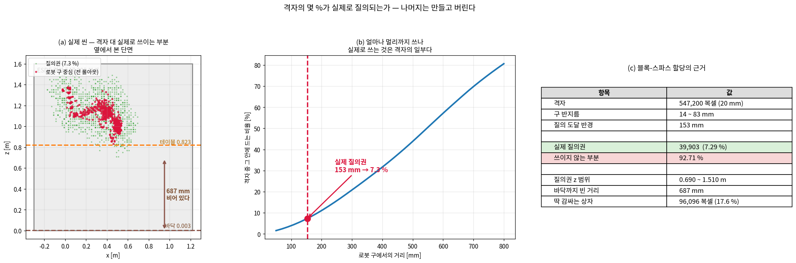

(a) 에서 빨간 구름(로봇 구)이 상자 위쪽에 몰려 있고 그 아래 687 mm 가 통째로 비어 있다.

## F15 수정 — 지지면을 아무도 제약하지 않는 조합을 막았다 (2026-09-14)

### 처음 적은 것이 정확하지 않았다

F15 를 *"기본값이 실제 경로와 반대"* 로 적었는데, 조합을 따져 보니 그 표현이 틀렸다.
**라이브러리 기본값은 그 자체로 일관됐다** — 테이블을 파내고 평면 행으로 제약한다. primitive
backend 시절에 맞게 고른 설계고 config 주석이 근거도 정확히 적어 두었다.

**진짜 문제는 스위치 둘이 서로 다른 config 에 살고 서로를 모른다는 것이다.**

```
AG3SConfig.esdf.exclude_support_surfaces     지각 쪽 — 표면을 필드에서 파낼 것인가
TrajOptConfig.collision.use_support_planes   최적화 쪽 — 평면 행을 읽을 것인가
```

네 조합 중 **둘만 일관된다**:

| exclude | use_planes | 지지면을 제약하는 것 |
|---|---|---|
| True | True | 평면 행 — 일관 (옛 기본값) |
| False | False | 필드 — 일관 (두 실제 경로) |
| False | True | 둘 다 — 중복, 여유거리 불일치 (23 구 명목 위반) |
| **True** | **False** | **아무것도** — 위험 |

### 위험 조합이 도달하기 쉽다

`SafePolicy` 는 `to_config` 기본값으로 `use_support_planes: False` 를 쓰면서 `ag3s` 는
**밖에서 주입받는다** (`safe_policy.py:54-61`). 그래서

```python
ag3s = AG3S(AG3SConfig.from_dict({"collision_backend": "esdf"}), ...)   # exclude 기본 True
SafePolicy(policy, ag3s=ag3s)                                            # use_planes 기본 False
```

라는 지극히 자연스러운 코드가 위험 조합을 만든다.

### 피해 — 상판이 자유공간이 된다

`run_0004`, 3 카메라, 20 mm 복셀, 수직선 `(x=0.5, y=0.0)`:

```
z [m]      exclude=False   exclude=True     차이
0.810         -42.4 mm       -20.0 mm      +22.4
0.823         -30.5 mm        +6.0 mm      +36.5   <- 상판. 표면이 자유공간이 된다
0.840         -12.1 mm       +10.0 mm      +22.1
0.790         -40.0 mm       -40.0 mm          0   <- 슬래브 아래쪽은 남는다
```

파내는 것은 **평면 인라이어 띠**(관측된 상판)라 테이블이 통째로 사라지지는 않는다. 그러나
**손끝이 실제로 다투는 표면 근처 30~50 mm 대역이 최대 36.5 mm 낙관적**이 된다.

### 수정 — 불변식 검사 + 기본값 (사용자 판정)

**1. 불변식 검사** (`trajopt/linearize.py::_check_support_surface_invariant`)

두 config 중 어느 쪽도 상대를 볼 수 없으므로 **둘이 만나는 지점**인
`scene_from_constraint_set` 에서 검사한다. 파냈다는 사실은 추측하지 않고 **필드가 스스로 보고한
것**을 읽는다 (`EsdfField.stats["n_support_voxels_carved"]`, `esdf.py:568`).

```
exclude  use_planes   결과
  True      True     통과  (파낸 복셀 2,776 — 평면 행이 받는다)
  True      False    거부  <- 지지면을 제약하는 것이 없다
  False     True     통과
  False     False    통과  (두 실제 경로)
```

**정확히 위험 조합 하나만 거부한다.**

**2. 기본값 — 양쪽을 함께 뒤집었다**

```
AG3SConfig.esdf.exclude_support_surfaces      True -> False
TrajOptConfig.collision.use_support_planes    True -> False
```

**한쪽만 뒤집으면 안 된다.** `exclude` 만 `False` 로 하면 `use_planes=True` 와 만나 이중 제약
(조합 3)이 되고, 그것이 config 주석이 경고한 "23 구 명목 위반" 이다. 처음에 그렇게 제안했다가
조합표를 그리고 나서 바로잡았다.

두 기본값 모두에 **왜 뒤집었는지와 실측 수치**를 주석으로 남겼다.

### 검증

* **테스트 560 개 전부 통과.**
* **회귀 기준선 불변** — `해소 14 / 개선 15 / feasible 8, violated 7`. 롤아웃이 원래 두 값을
  명시로 넘기고 있었으므로 기본값 변경이 그 경로를 건드리지 않았다는 확인이다.

### E2 에 미치는 영향

**E2(무한 half-space)는 이제 기본값에서도 도달하지 않는다.** 평면 행이 기본으로 꺼졌으므로
`use_support_planes=True` 를 명시한 호출자만 그 경로로 간다. E2 는 **잠복으로 확정**한다 —
전환 신호는 "평면 행을 다시 켜는 날" 이다.

---

## 무엇을 조작 대상으로 볼 것인가 — 잠금(latch)과 목적지 (2026-09-14, 사용자 대화)

사용자 주장에서 출발했다. *"사과를 바구니에 담아라 — 사과는 충돌 객체에서 빠지고 바구니는
남아야 한다. 초기 attention 은 분명 사과를 보고 있었을 것이고, 그 순간부터 사과는 장애물이면
안 된다. 이것을 반박할 시나리오는 존재하지 않는다."*

**추측으로 두지 않고 기록으로 확인했다.** `run_0004/meta.json` 의 프롬프트가 말 그대로
`put the apple in the basket` 이라 이 기록 하나로 전부 잴 수 있었다.

### 주장 1 — "초기 attention 은 사과를 보고 있었다" : **확인됨**

`archive/step-verification-20260904/step-04-grounding_004.json`(run_0004)과 `archive/step-verification-20260904/step-04-grounding.json`(run_0002)에 프레임별
`picked_body` 가 남아 있다.

```
기록        선두 연속 apple   purity / iou        1위–2위 격차
run_0004    프레임 0–6 (7)    1.00 (f2 만 0.62)   1.7 ~ 47×
run_0002    프레임 0–7 (8)    1.00 (f2 만 0.62)   1.8 ~ 47×
```

**두 기록 모두 초기 식별은 애매하지 않다.** attention 점수 0.99~1.00, 2위(banana)는 절반 이하.

그리고 run_0002 가 주장을 더 강하게 만든다 — 그 기록 44 프레임 전체에서 grounding 이 apple 을
고른 것은 **앞 8 프레임뿐**이다 (나머지: crate 20, banana 13, 실패 3). **초기를 안 믿으면 그
롤아웃에는 사과를 옳게 식별할 기회가 아예 없다.**

### 주장 2 — "그 순간부터 장애물이면 안 된다" : 방향은 맞고, 요구하는 것은 **잠금**이다

"장애물이다 / 아니다" 라는 이진 상태는 코드에 없다. 권한 있는 링크에 대해 이미 **등급**이 있다
(`config.py:328-334`):

```
transit 50 mm (×1.0) → approach 20 mm (×0.4) → pre_grasp 5 mm (×0.1) → grasp 0 mm (×0.0)
```

권한 없는 링크(팔꿈치·몸통)는 전 구간 50 mm 고정이고, 0 mm 도 관통은 금지다. 그러므로 주장이
실제로 요구하는 것은 **완화를 앞당기는 것이 아니라 식별을 잠그는 것**이다 — 등급은 이미 있고,
프레임 7 부터 그 등급이 **엉뚱한 물체(바구니)에** 적용되는 것이 문제다.

### F17 (신규) — 조작 대상 식별에 **에피소드 상태가 없다**

`ground_target` 은 이전 프레임을 인자로 받지 않는 무상태 함수이고(`target_grounding.py:280`),
파이프라인은 매 프레임 새로 부른다(`pipeline.py:386`). 프레임 간에 살아남는 것은 후보 슬롯의
`id` 뿐이지 **조작 대상의 정체가 아니다.** F11 이 고친 것은 "권한을 어디에 거나"(주목 대상 →
쥔 것)였고, "그 식별을 프레임 사이에 유지하나"는 건드리지 않았다.

**규칙은 세 조각이 필요하다 — 걸기 · 유지 · 풀기.** 사용자 주장은 앞의 둘을 정한다.

```
걸기   연속 N 프레임 같은 물체 + 1위–2위 격차 문턱   (두 기록 다 7~8 프레임 연속)
유지   attention 이 어디로 가든 무시                 (F11 구간이 정확히 이것)
풀기   성공 판정 = detach                            (아래)
```

**주의 — 걸기에 문턱이 필요한 이유**: 두 기록 모두 **프레임 2 에서 purity 가 0.62 로 떨어진다.**
하필 그 프레임을 잠금 지점으로 삼으면 62 % 짜리 뭉치를 에피소드 내내 붙들게 된다. 지금 구조는
틀려도 다음 프레임에 회복되지만 **잠금에는 회복 지점이 없다** — 실패의 방향이 뒤집힌다.

### F18 (신규) — `esdf_margin = 50 mm` 가 **담기 동작을 구조적으로 막는다**

사용자 제안: *"바구니는 장애물로 두되 마진을 얇게 해서 접촉 없이 사과를 놓는다."* 얼마나
얇게인지를 쟀다. 바구니(`crate`) MJCF 실측:

```
벽 두께 8 mm    내경 164 × 284 mm (편측 82 / 142)    깊이 112 mm    사과 반지름 31.1 mm
```

`run_0004` 의 실제 궤적에서 **사과 표면 ↔ 가장 가까운 내벽**:

```
프레임   14     15     16     17     18*    19     20     21
여유   -102.4   -6.4   35.7   39.1   37.0   43.5   39.6   41.8   (mm)   * 아직 쥔 마지막 프레임
```

**담는 구간 내내 여유가 50 mm 를 넘지 못한다.** 그러므로 E3 배선이 끝나 쥔 사과가 실제로 충돌
검사에 들어가는 순간, 현재 마진으로는 이 동작 전체가 `violated` 로 잡힌다 — **13.0 mm 부족.**
마진 30 mm 면 7.0 mm 남고 통과한다. **실측 상한 37 mm.**

**"접촉하지 않게" 는 성립한다.** 정책이 사과를 테두리 **위**(Δz = +60.6 mm)에서 놓고 떨어뜨린다.
쥐고 있는 동안 바닥과는 81.5 mm 떨어져 있어 바닥 접촉이 제약에 걸리지 않는다.

**아직 안 잰 것**: 손가락 구도 함께 들어가므로 실제 상한은 37 mm 보다 작다. URDF sphere chain 의
손끝 구 반지름으로 같은 계산을 다시 해야 한다.

**그리고 이 마진을 어디에 붙일 것인가가 열린 갈림길이다.** 전역 `esdf_margin` 을 내리면 모든
장애물에 대해 헐거워진다. `ClearancePolicy.lookup` 은 `TARGET` 컬럼만 완화하고 `OBJECT` 는 어떤
경우에도 완화하지 않으므로(`clearance.py:243`), **목적지 전용 축은 `SourceType` 에 새 개념을
세우는 일**이 된다.

### 성공 판정 — 세 조건으로 깨끗하게 잡힌다

```
(사과–바구니 수평거리 ≤ 내경 반 82 mm) ∧ (사과가 테두리 60 mm 아래) ∧ (손–사과 > 80 mm)
```

**프레임 19 (t_step 152) 에서 처음 참이 되고 이후 24 프레임 끝까지 유지된다.** 깜빡임 없음.
문턱이 헐겁다 — 실측 16.1 mm 대 문턱 82 mm, 120.7 mm 대 80 mm. point cloud 잡음 몇 cm 로는
안 뒤집힌다. (참값 자세로 쟀다. 실행 시에는 관측으로 해야 하지만 판정의 형태는 같다.)

**설계상 자리는 이미 있다.** `attached.py` 머리말: *"AG3S does not decide when a grasp
succeeded. `attach` is called by whoever knows. Only an explicit detach removes it."* 성공 판정도
같은 계약을 따른다 — AG3S 밖(과제 소유자)에서 계산해 주입하고, **`detach()` 가 곧 잠금 해제**가
된다. 새 장치가 필요 없이 E3 배선에 얹힌다.

**성공 판정 · 잠금 해제 · 에피소드 종료는 한 신호다.**

### 롤아웃 길이 — 과제 완료 후가 절반이 넘는다

사용자 관찰: *"350 step 으로 지정해 놓고 성공 조건을 설정하지 않아서 스텝을 가득 채우는 것 같다."*
`meta.json`: `n_steps = 44`, `open_loop_horizon = 8` → **352 제어 스텝.** 성공은 t_step 152.

```
192 / 352 = 54.5 % 가 과제 완료 후의 동작이다.
```

**이것이 기록을 읽는 방식을 바꾼다** — 프레임 20 이후는 정답이 없는 잔여 구간이므로, 그 구간의
grounding 진동을 결함의 근거로 쓰면 안 된다.

### 이 세션에서 내가 과하게 말했다가 바로잡은 것

1. **"프레임 21~43 에서 apple 이 12 번 다시 뽑히니 잠금 해제가 필요하다"** — 그 구간 자체가 과제
   완료 후의 잔여 동작이다. 근거로 약하다. 해제가 필요한 진짜 이유는 안전이 아니라 **다음 과제를
   시작하기 위해서**다.
2. **"해제를 안 하면 영구 완화가 남는다"** — **F13 의 양면 검사가 이미 막는다.** 필드 거리와 조작
   대상의 해석적 거리가 한 복셀 안에서 일치해야 완화하므로(`trajopt/linearize.py:387-389`), 손에서
   사라진 물체는 일치가 깨져 완화가 저절로 없어진다. **stale 잠금은 보수적으로 실패한다.**
3. **primitive 캡슐 비교** — `crate` 에 fit 된 캡슐 반지름이 115.7 mm 라 바구니 속이 통째로
   막힌다는 패널을 그렸는데, **안 쓰는 경로다.** 우리가 돌리는 세 경로(`safe_policy.py:60,94`,
   `bringup.py:198,204`, `esdf_rollout.py:140,149`)는 전부 양쪽을 `esdf` 로 명시하고
   `emit_candidates` 기본값이 `False` 라(`config.py:430`) primitive 후보는 만들어지지도 않는다.
   **이미 닫힌 결정을 다시 변호한 것이므로 그림에서 뺐다.**

**부수 확인 (잠복, 조사 아님)**: `AG3SConfig.collision_backend` 와
`TrajOptConfig.collision.backend` 의 **기본값은 여전히 `"primitive"`** 다(`config.py:660`,
`trajopt/config.py:341`). 지금은 `safe_policy.py:94` 가 두 값을 하나에서 끌어 써 갈라질 수 없게
묶어 두었다 — F15 가 똑같은 모양의 사고였다.

### 시각화

**[`figures/task-relevance-rules.png`](figures/task-relevance-rules.png)** — 세 규칙(attention 기준 ·
carving · 쥔 것 기준)이 '사과를 바구니에' 에서 내는 답, 그리고 거리장이 익명이라 파낼 수 없는 이유.

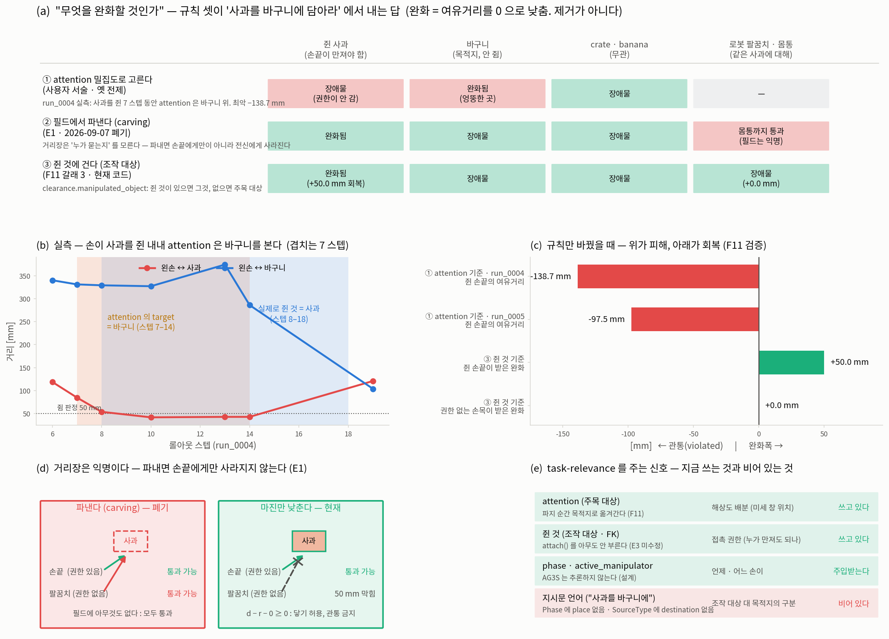

**[`figures/target-latch-evidence.png`](figures/target-latch-evidence.png)** — 44 프레임 전체의
`picked_body`, 두 기록의 초기 확신도, 잠금 규칙 셋, 그리고 이미 존재하는 등급.

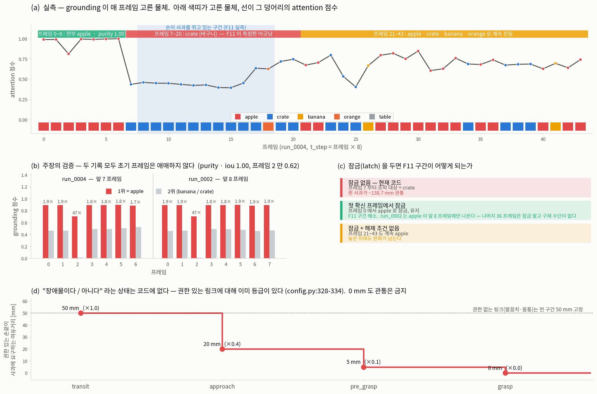

**[`figures/basket-place-budget.png`](figures/basket-place-budget.png)** — 바구니 단면 실측, 담는
구간의 여유 추이, 성공 판정.

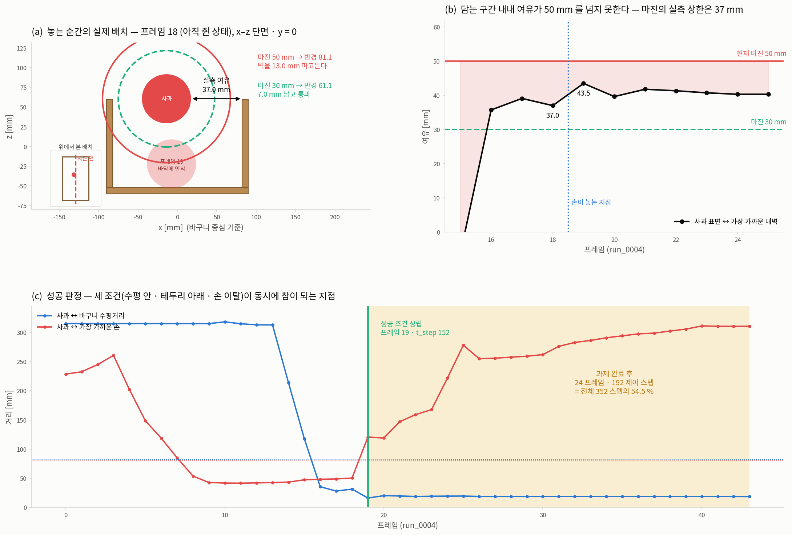

### 전체 틀에서 지금 어디인가 (규칙 B)

```
카메라 depth → 로봇 마스크 → attention lifting ✓ → target grounding ★ → TSDF/ESDF
            → 거리장 어댑터 → SQP 선형화 → QP 해
```

닫힌 것: **초기 attention 을 믿을 수 있는가**(두 기록에서 예), **마진의 실측 상한**(37 mm),
**성공 판정이 성립하는가**(프레임 19, 끝까지 유지). 열린 것: **잠금을 어디에 구현하나**(F17)와
**목적지 마진을 어느 축에 붙이나**(F18).

### 다음 갈림길 — 사용자 판정 대기

1. 목적지 마진을 **`SourceType` 의 새 축**으로 둘 것인가, **전역 `esdf_margin` 인하**로 둘 것인가.
2. 손가락 구까지 포함한 진짜 마진 상한을 잴 것인가.
3. 잠금의 **걸기 문턱**을 지금 정할 것인가, run_0005 까지 세 기록으로 선두 연속 길이를 재고 정할 것인가.

---

## 최종 구현안 — 시스템 아키텍처 (2026-09-14, 사용자 요청)

이 세션의 판정(F17 잠금 · F18 목적지 마진)과 앞서 정해 둔 방향(cuRoboV2 인프라, swept volume ROI,
조작 대상/주목 대상 분리)을 **하나의 그림으로 합친 것**이다. 지금 코드의 모습이 아니라 **닿으려는
모습**이다.

**[`figures/ag3s-architecture.png`](figures/ag3s-architecture.png)**

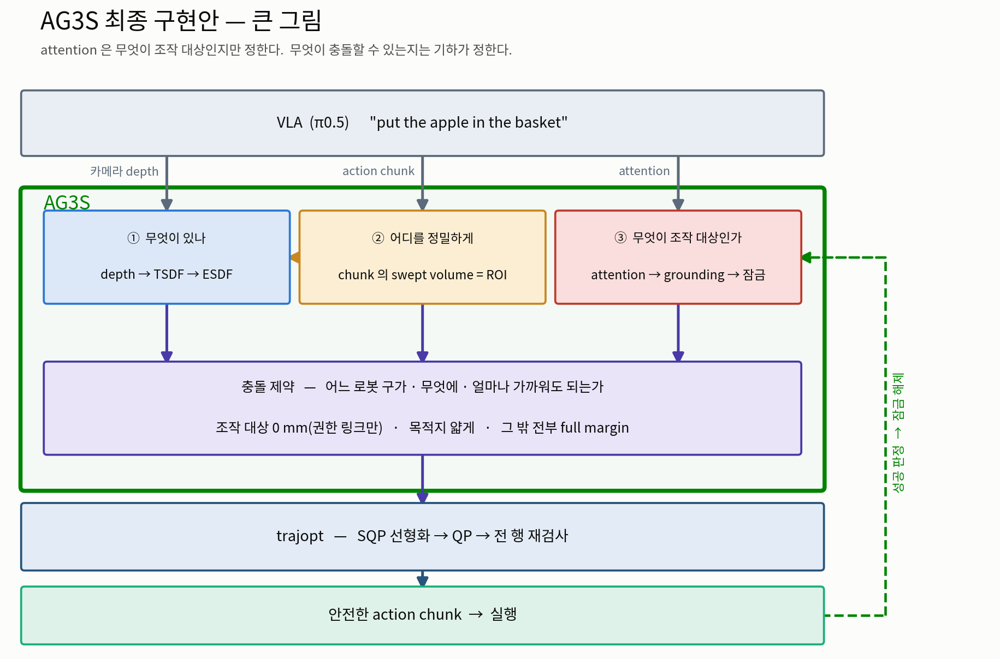

### 읽는 법 — AG3S 안이 세 열인 것이 핵심이다

세 입력이 각각 한 열을 몰고 내려와 바닥에서 합류한다. **이 분리가 모듈 머리말의 원칙을 구조로
옮긴 것**이다 — *attention 은 target 이 무엇인지만 정하고, 무엇이 충돌할 수 있는지는 3D 기하가
정한다.*

| 열 | 입력 | 하는 일 | 왜 분리하나 |
|---|---|---|---|
| **기하** | depth ×3 · 로봇 상태 | self-filter → point cloud → 지지면 → TSDF → Local Dense ESDF | 장애물은 의미가 아니라 **질량**으로 정해진다. attention 을 문턱으로 쓰지 않는다 |
| **ROI** | action chunk | FK → 로봇 구 궤적 → swept volume + padding | 미세 창을 **attention 의 target 에 두면 파지 순간 목적지로 옮겨간다**(F11). swept volume 은 attention 이 어디를 보든 로봇이 실제로 지나간다 |
| **의미** | attention 셀 | 어댑터 → lifting → grounding → **잠금** → 조작 대상 → attached | 접촉 권한은 **쥔 것**에 붙는다(F11). 그리고 그 식별은 프레임마다 다시 하지 않고 **잠근다**(F17) |

바닥의 두 칸이 합류점이다.

* **clearance 정책** — (로봇 구 × source) 마진 행렬. 여기에 **목적지 열이 새로 선다**(F18).
  조작 대상 0 mm(권한 링크만) · **목적지 ≈30 mm** · 장애물/지지면/미지 50 mm · 나머지 fail-closed.
* **CollisionConstraintSet** — trajopt 가 읽는 유일한 것. ESDF 핸들 · 조작 대상 ·
  `manipulated_link_margin` · 지지면 · validity · phase.

### 세 가지가 그림에서 바뀐 것 (지금 코드와의 차이)

1. **미세 창의 중심** — `grounding 의 target 무게중심` → **swept volume**.
2. **조작 대상의 식별** — 프레임마다 재계산 → **잠금** (걸기 · 유지 · 풀기).
3. **마진 축** — `TARGET` 컬럼 하나 → **목적지 열 추가**, 전역 `esdf_margin` 은 그대로 둔다.

### 경계가 바뀌지 않는 것

* **trajopt 는 solve 중 AG3S 를 부르지 않는다.** AG3S 가 채운 파라미터 벡터를 layout 으로 읽을 뿐.
* **AG3S 도 trajopt 도 실행 여부를 정하지 않는다.** status 와 최악 위반 mm 를 실어 보내고 끝이며,
  멈출지·붙들지·다시 계획할지는 과제 소유자가 정한다.
* **성공 판정 · 잠금 해제 · 에피소드 종료는 한 신호**이고, `attach`/`detach` 와 같은 계약으로
  **AG3S 밖에서 계산해 주입한다.**

## 아키텍처 그림 재작성 — 로그·코드 대조, cuRobo 설명 축약 (2026-09-14)

사용자 요청에 따라 앞서 제공된 그림 프롬프트만 옮기지 않고, 이 로그의 지지면 판정·잠금/목적지 논의·최종 구현안과 실제 호출 경로를 대조해 두 장을 다시 그렸다. **목표 구조를 설명하는 그림이며, 이번 작업에서 파이프라인 코드를 구현하거나 설계 미결 사항을 확정하지 않았다.**

- [전체 아키텍처 PNG](figures/ag3s-architecture-v2/01_overall.png) · [SVG](figures/ag3s-architecture-v2/01_overall.svg) · [PDF](figures/ag3s-architecture-v2/01_overall.pdf)
- [AG3S 상세 PNG](figures/ag3s-architecture-v2/02_ag3s_detail.png) · [SVG](figures/ag3s-architecture-v2/02_ag3s_detail.svg) · [PDF](figures/ag3s-architecture-v2/02_ag3s_detail.pdf)
- [생성 코드](figures/ag3s-architecture-v2/draw_architecture.py)

### 실제 코드에서 확인해 반영한 연결

1. `trajopt/safe_policy.py::infer`, `_scene_fn`: RGB/언어를 받는 VLA와 depth/촬영 시점 로봇 상태를 받는 AG3S 입력을 구분했다. VLA 원본 chunk는 `refiner.refine`에 직접 들어가며, AG3S 출력과 함께 최적화의 입력이 된다.
2. `ag3s/runtime/multiview.py::process_observation`, `fuse`: 카메라별 **재구성 → self-filter → lifting** 후 base 좌표계에서 융합한다. 같은 칸의 **원시 attention을 max로 합친 뒤 정규화**한다. 기하 전체의 좌표를 max로 합친다는 의미가 아니다.
3. `ag3s/runtime/pipeline.py::_run`, `target_grounding.py::ground_target`: 지지면 마스크는 grounding의 연결성에서 테이블을 제외한다. 지지면에서 ESDF를 만드는 직렬 연결이나 기본 평면 충돌 제약으로 그리지 않았다. F15 이후 기본 경로는 표면을 ESDF에 유지하고 평면 제약 소비를 끈다.
4. `ag3s/constraints/clearance.py::manipulated_object`, `ClearancePolicy.lookup`, `to_adapter.py::build_constraint_set`: 접촉 권한은 조작 대상과 권한 링크에 붙는다. 파지 전에는 phase별 접근 완화가 있고 파지 때 접촉 마진이 적용되므로, 모든 phase를 일괄 0으로 표시하지 않았다. 미지 조합은 full margin이다.
5. `ag3s/constraints/attached.py`, `pipeline.py::attach`, `detach`: 파지는 외부에서 확인해 주입한다. attached 표현과 최적화기에서 조작 대상을 거리로 식별하는 경로는 존재하지만, 쥔 물체를 로봇 쪽 충돌 구로 편입해 궤적 전체에서 검사하는 E3 연결은 남은 작업으로 표시했다.
6. `trajopt/linearize.py::_esdf_clearance`, `scene_from_constraint_set`, `trajopt/refiner.py::refine`: 필드 거리와 조작 대상 거리를 양면 비교한 뒤 구별 마진을 적용한다. 최적화기는 보정 chunk와 판정을 제공하며, 실행/유지/재계획 결정은 과제 소유자의 책임이다.

### cuRobo와 계획 요소의 표시 범위

cuRobo는 **거리장(ESDF), 거리·기울기 제공** 한 상자로 축약했다. TSDF 적분·복셀 크기·거리장 내부 알고리즘은 사용자가 이후 설명할 영역이므로 이번 그림에서 풀어 쓰지 않았다. `ag3s/fields/curobo_field.py` 어댑터와 cuRobo 필드 생성 실험은 있으나, 현재 `pipeline.py::_build_esdf`는 여전히 기존 `EsdfBuilder`를 호출한다. 따라서 그림의 cuRobo 상자는 선택된 교체 목표를 나타내며, 라이브 파이프라인 교체 완료를 주장하지 않는다.

`swept-volume ROI`, `조작 대상 잠금`, `목적지 마진`은 계획으로 표시했다. 현재 cuRobo 생성 실험은 target 무게중심을 창 중심으로 쓰며(`experiments/curobo/build_rollout_fields.py`), `ground_target`은 프레임 간 잠금 상태가 없고, `SourceType`에 목적지 축이 없다. 잠금 문턱·목적지 마진 수치는 이번 그림에서 정하지 않았다.

검증: 생성한 두 PNG를 직접 열어 화살촉 방향·간선 교차·한글 라벨과 테두리 겹침을 확인했다. 이번 변경은 그림·생성 스크립트·이 기록뿐이므로 로봇 시뮬레이션이나 회귀 테스트를 실행하지 않았다. 그림 정리는 완료했고, 구현상 남은 ROI·잠금·목적지 마진·attached 연결 상태는 그대로 유지된다.

---

## 사과는 구가 아니었다 · 점 기반이 primitive 를 이긴다 (2026-09-14, 사용자 지시로 전부 실측)

사용자 지시 넷: **마진을 더 작게 · 그리퍼 구도 작게 · 사과도 작게(점구름을 쓰니까) · primitive 방식은 절대 금지.**
넷을 각각 재고 정했다. MuJoCo 는 전부 headless(`MUJOCO_GL=osmesa`)로 돌렸다.

### 먼저 정정 — 내가 쓴 사과 반지름 31.1 mm 는 틀렸다

MJCF 를 읽어 보니 `apple_geom` 은 구가 아니라 **메시**다.

```
apple_geom   mesh  bbox 반폭 (31.1, 33.3, 33.3) mm   pos z −0.6   contype 1  (충돌)
apple_vis    mesh  bbox 반폭 (31.1, 35.3, 34.4) mm              contype 0
apple_stem   mesh  반폭 (3.6, 3.2, 12.4)  pos z +36.3           contype 0   <- 카메라에는 보인다
apple_leaf   mesh  반폭 (1.0, 5.5, 14.0)  pos (11, 3, +38)      contype 0   <- z 최대 +52 mm
```

31.1 mm 는 그 bbox 의 **x 반폭**이었다. 그리고 꼭지와 잎은 충돌체가 아니지만 **카메라에는 찍히므로
점구름에는 들어온다** — 관측된 사과 점의 퍼짐이 참 중심에서 최대 **48 mm** 다.

그래서 여유를 **점구름으로 직접 다시 쟀다**. MuJoCo 세그멘테이션(`frame.body_ids == apple`)으로
사과 픽셀만 골라 3 대 카메라에서 역투영했다 (프레임당 13,000~16,000 점).

### F19 — 단일 primitive 는 여유를 먹고, 없는 충돌을 만든다

같은 점구름에 **구 하나**를 맞추면 반지름이 **57.4 mm**(중앙)가 된다. 꼭지와 잎까지 덮어야 하기
때문이다. 두 표현으로 바구니 내벽까지의 여유를 나란히 쟀다:

```
프레임      16     17     18   |   19     20     21        * 18 이 아직 쥔 마지막 프레임
점 기반   32.9   36.4   45.9   |  8.2    8.5    9.3   mm
단일 구   16.9   19.0   36.0   |  4.7    4.4   −1.2   mm
차이      16.0   17.4    9.9   |  3.5    4.1   10.5   mm
```

* **쥔 동안 중앙 13.2 mm, 최대 23.7 mm 를 먹는다.**
* **프레임 21 에서 단일 구는 −1.2 mm** — 점 기반이 +9.3 mm 인 자리에서 **없는 충돌을 보고한다.**

정황이 아니라 이것이 "primitive 를 쓰지 않는다" 의 수치적 근거다.

### 점 기반이 실제로 돌아가는가 — 돈다

원본 15,000 점을 그대로 질의점으로 쓸 수는 없다. 복셀로 솎았을 때의 비용과 손해:

```
복셀 크기      5 mm      10 mm     15 mm     20 mm
질의점 수   198~262    64~89     33~47     22~30
여유 오차   +0.0~3.2  +0.0~0.7  +0.4~3.2  +2.3~5.8   mm  (전부 낙관 방향)
```

**10 mm 를 고른다** — 질의점 64~89 개에 오차가 1 mm 미만이다. ESDF 블록은 스텝당 구 수만큼의
행이므로(슬롯 곱이 없다) 105 → 약 194 행/스텝이 된다. 감당 가능한 증가다.

### 마진 — 목적지 전용 20 mm, 전역 50 mm 는 유지

```
쥔 동안 실측 상한          32.9 mm
− 거친 20 mm 격자의 낙관     7.6 mm   (C5)
= 쓸 수 있는 마진 상한      25.3 mm
→ 채택                     20.0 mm   (5.3 mm 를 공학적 여유로 남긴다)
```

**전역 `esdf_margin` 은 50 mm 그대로 둔다.** 전역을 내리면 모든 장애물에 대해 헐거워진다.
얇은 마진은 **목적지에만** 붙어야 하고, 그것이 아래 라벨 층이 필요한 이유다.

### 그리퍼 구는 줄이지 않는다 — 측정이 그렇게 말한다

바구니 안으로 들어간 손가락 구의 여유는 **50.4 / 50.5 / 51.1 mm** 로, 사과(32.9)보다 훨씬
넉넉하다. **상한을 정하는 것은 사과지 손가락이 아니다.**

구를 줄이는 원리적 방법은 반지름을 임의로 깎는 것이 아니라 `sphere_spacing` 을 낮춰 이산화
팽창 `√(r² + (s/2)²)` 을 없애는 것인데, 손익이 나쁘다:

```
sphere_spacing   1.00    0.70    0.50    0.35    0.25
손가락 최대 r    18.7    18.1    18.1    17.8    17.7  mm
구 총 개수        105     138     166     226     297
```

**반지름 1.0 mm 를 벌려고 구가 2.8 배**가 된다. 하지 않는다. 다른 씬에서 손가락이 실제로 상한을
정하는 날 다시 본다 — **전환 신호: 바구니 안 손가락 여유가 조작 대상의 여유 아래로 내려오는 것.**

### 익명 거리장을 푸는 방법 — 라벨 층 (문헌)

"목적지에만 얇은 마진" 을 걸려면 **가장 가까운 표면이 목적지인지**를 알아야 한다. 거리장은
익명이라 그것을 모른다. 이 문제의 표준 해법은 **거리 층 옆에 라벨 층을 두는 것**이고,
volumetric mapping 쪽에 그대로 있다:

| 문헌 | 구조 |
|---|---|
| **Voxblox++** — Volumetric Instance-Aware Semantic Mapping and 3D Object Discovery (Grinvald et al.) | Voxblox 에 **라벨 층을 하나 더** 얹어 기하와 라벨의 저장을 분리 |
| **TSDF++** — A Multi-Object Formulation for Dynamic Object Tracking and Reconstruction | 물체마다 볼륨을 따로 두지 않고 **한 볼륨의 복셀마다 다물체 인코딩** |
| **Panoptic Multi-TSDFs** (Schmid et al.) | 물체마다 submap + **클래스별 해상도** |

세 계열 모두 primitive 를 쓰지 않는다. 그리고 우리 구현에서는 비용이 거의 없다 —
**거리 변환이 이미 최근접 site 를 계산한다.** `esdf.py:364` 의
`ndimage.distance_transform_edt(...)` 에 `return_indices=True` 를 주면 "이 거리를 만든 표면
복셀이 어디인가" 가 같이 나오고, 그 복셀의 라벨을 읽으면 끝이다. cuRobo 쪽도 같다 —
cuRoboV2 §5.4 의 **PBA+** 는 본래 최근접 site 를 구하는 알고리즘이고 거리는 거기서 파생된다.

**그래서 F18(목적지 마진)의 범위는 "마진 행렬에 열 하나" 가 아니라 "거리장이 라벨을 함께
답하게 하는 것"이다.** 이것이 들어오면 F13 의 양면 검사(필드 거리와 해석적 거리를 한 복셀 안에서
대조하는 우회로)도 함께 은퇴한다.

### 확정한 것

| 사용자 지시 | 판정 | 근거 |
|---|---|---|
| 마진 더 작게 | **목적지 전용 20 mm**, 전역 50 mm 유지 | 상한 32.9 − 격자 낙관 7.6 = 25.3 |
| 그리퍼 구 작게 | **안 한다** | 손가락 여유 50.4~51.1 로 상한이 아니다. spacing 축소는 1.0 mm 대 구 2.8 배 |
| 사과 작게 (점구름) | **점 기반 채택, 10 mm 복셀** | 단일 구가 13.2~23.7 mm 를 먹고 없는 충돌을 만든다 (F19) |
| primitive 금지 | **라벨 층으로 간다** | Voxblox++ · TSDF++ · Panoptic Multi-TSDFs. 최근접 site 는 이미 계산된다 |

### 시각화

**[`figures/margin-bound.png`](figures/margin-bound.png)** — 손가락은 상한이 아니다 · 구 축소의 손익.

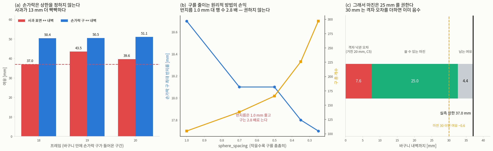

**[`figures/point-vs-primitive.png`](figures/point-vs-primitive.png)** — 점 기반 대 단일 구, 복셀
다운샘플 비용, 마진 예산.

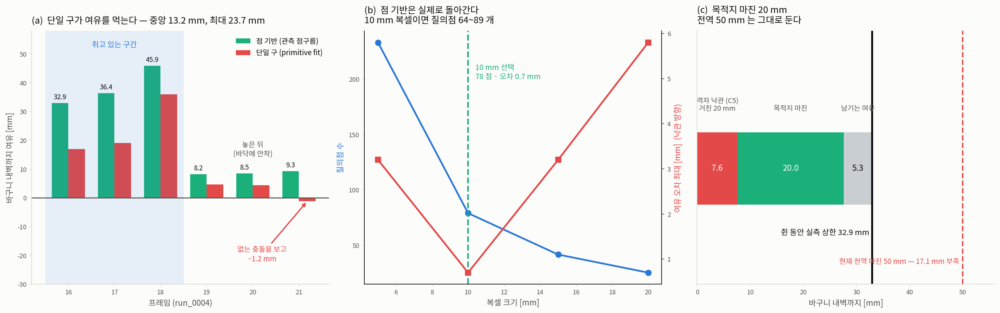

### 전체 틀에서 지금 어디인가 (규칙 B)

```
… → TSDF/ESDF ★(라벨 층) → 거리장 어댑터 → SQP 선형화 ★(E3-b: 쥔 물체의 점을 질의점으로) → QP 해
```

닫힌 것: **네 지시의 판정과 수치**. 열린 것: 구현 셋 —
(1) E3(쥔 물체가 optimizer 에 도달하지 않는 문제)의 소비부에 **점 질의점**을 꽂는 것,
(2) 거리장에 **라벨 층**을 얹는 것,
(3) 목적지 마진 20 mm 를 clearance 정책에 세우는 것.

---

## E3 배선 (1/3) — 쥔 물체의 **점**이 optimizer 에 도달한다 (2026-09-15, 구현·검증 완료)

E3(쥔 물체가 optimizer 에 도달하지 않는다)의 세 조각 중 **소비부**를 넣었다. 나머지 둘 — 호출
(누가 `attach`/`detach` 를 부르나)과 필드 예외 — 은 아직이다.

### 무엇이 문제였나 — 쥔 물체는 양쪽 어디에도 없었다

```
필드 안에도 없다   자기 필터가 쥔 사과 픽셀을 100% 지운다 (F12)
로봇 구에도 없다   `sphere_states` 는 로봇 FK 체인만 돌린다
```

`manipulated_spheres` 는 `_esdf_clearance` 에서 **"이 구의 가장 가까운 장애물이 그 물체인가"** 를
판정하는 데만 쓰였고 **충돌 바디로 추가되지 않았다.** 그래서 쥔 물체는 충돌 검사에 통째로
보이지 않았다.

### 무엇을 넣었나

**`sphere_states` 가 이제 `(H, Q, 3)` 을 낸다. `Q = S + N`** — 로봇 구 뒤에 쥔 물체의 점이
**반지름 0** 으로 붙는다. 후보·평면 행은 앞의 `S` 개만 슬라이스해 쓰고, ESDF 행은 전부 쓴다.

| 파일 | 무엇 |
|---|---|
| `types.py` | `AttachedCollisionGeometry.points` — 부모 링크 프레임의 `(N, 3)`, 복셀로 솎은 것 |
| `attached.py` | `attach_from_target` 이 점도 스냅샷한다 (`point_voxel=0.010`) · `voxel_unique` · `base_frame_points` |
| `trajopt/linearize.py` | `set_attached` · `_link_probe_map` · `attached_states` · `SceneSnapshot.attached_points` |
| `trajopt/sqp.py` | 청크마다 `set_attached` 로 올린다 |

### 왜 primitive 가 아니라 점인가

F19 다 — 관측 점구름에 구 하나를 맞추면 꼭지·잎까지 덮느라 반지름이 **57.4 mm** 가 되고,
담는 구간의 여유를 중앙 **13.2 mm**(최대 23.7) 먹으며, 프레임 21 에서는 점 기반이 +9.3 mm 인
자리에서 **−1.2 mm** 로 없는 충돌을 보고한다.

### 기울기를 어떻게 얻는가 — 네 프로브의 아핀 결합

쥔 점의 개수는 파지마다 달라지므로, 점 집합이 바뀔 때마다 CasADi 그래프를 다시 만들면 안 된다.
대신 링크마다 **네 점**(원점과 세 단위축)만 미분해 둔다. 강체 변환은 아핀이므로 국소좌표
`(a, b, c)` 인 임의의 점은

```
p(q) = o(q) + a·(x(q) − o(q)) + b·(y(q) − o(q)) + c·(z(q) − o(q))
```

즉 **네 프로브의 가중합(가중치 합 = 1)** 이고, 기울기도 같은 가중치로 따라온다. 그래서 새 파지는
numpy 곱 한 번이지 그래프 재생성이 아니다. **근사가 아니라 항등식**이다 — 아래 오차가 그것을
보인다.

### QP 희소 패턴은 움직이지 않는다

행 수는 `reduction.rows_per_step × horizon` 이 정하고, 질의점이 늘면 **그 행을 놓고 경쟁하는
후보**가 늘 뿐이다. 그래서 파지가 롤아웃 도중 시작되고 끝나도 factorization 이 무효가 되지
않는다. 테스트로 고정했다.

### 검증

| 무엇 | 결과 |
|---|---|
| 배치 — 네 프로브의 아핀 결합 대 AG3S 수치 FK | **4.4e-16 m** (부동소수점 수준) |
| 기울기 — 유한차분 대비 | **2.6e-07** |
| ESDF 행 — 질의점 105 → 142 (점 37 개) | 늘어남, 여유거리 산술 정확 |
| 해제 — 놓으면 105 로 복귀 | 복귀 |
| QP 희소 패턴 | 불변 |
| **회귀 기준선** | **해소 14 / 개선 15 / feasible 8, violated 7 — 불변** |
| 테스트 | **560 → 566** (신규 `tests/trajopt/test_attached_points.py` 6 개) |

### 그리고 강체 파지 가정이 실제로 성립하는가 — 성립한다

프레임 10 에서 관측된 사과 점 **67 개**(10 mm 복셀)를 `ee_finger_l1` 에 붙이고, 이후 8 프레임
동안 FK 로 따라온 스냅샷을 **그때그때 새로 관측한 사과 점**과 대조했다.

```
프레임        10    11    12    13    14    15    16    17    18
스냅샷 이동  0.0  30.7 107.8 187.3 206.0 273.9 354.1 339.6 319.1  mm
표면 어긋남  0.0   0.4   0.3   0.4   0.8   2.6   3.1   3.7   5.1  mm
```

**손이 319 mm 움직이는 동안 스냅샷은 실제 사과 표면에서 중앙 0.8 mm, 최대 5.1 mm 안에
머문다.** 스냅샷을 한 번 뜨고 FK 로 끌고 간다는 전제가 실측으로 확인됐다.

### 아직 아닌 것

* **호출** — live 경로(`safe_policy.py`)에 `attach`/`detach` 호출자가 여전히 없다. 이것이
  F17(조작 대상 식별에 에피소드 상태가 없다)의 걸기·풀기와 같은 자리다.
* **필드 예외** — 쥔 물체가 필드에서 빠지는 것은 지금 자기 필터의 과잉 삭제라는 **우연**이다.
  의도로 바꿔야 한다. 우연히 맞고 있으므로 이 배선은 지금도 옳게 돈다.
* **목적지 마진** — 라벨 층이 먼저다. 지금은 쥔 물체도 전역 50 mm 를 요구하므로, 담는 동작은
  이제 **정직하게 violated 로 보고된다** (F18 이 예측한 그대로).

### 시각화

**[`figures/attached-points-verify.png`](figures/attached-points-verify.png)** — 실제 씬(스냅샷이
관측 점 위에 남는다) · 표면 어긋남 추이 · 검증 표.

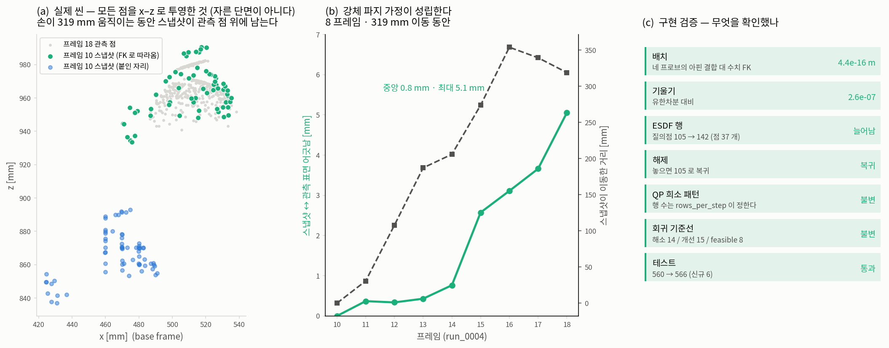

### 전체 틀에서 지금 어디인가 (규칙 B)

```
… → TSDF/ESDF → 거리장 어댑터 → SQP 선형화 ✓(쥔 물체 도달) → QP 해
                      ★ 다음: 라벨 층 → 목적지 마진 20 mm
```

닫힌 것: **쥔 물체가 optimizer 에 보인다.** 다음: (2) 라벨 층, (3) 목적지 마진 20 mm,
그리고 (1)의 나머지인 호출부 — 이것은 F17 의 잠금과 한 덩어리다.

## cuRobo TSDF를 분할에도 재사용할 수 있는가 — 코드 확인 (2026-09-15)

사용자 질문: 별도 점구름 재구성을 유지하는 대신 cuRobo TSDF에 attention을 3차원으로 매핑해 세그멘테이션할 수 있는가.

**코드에서 확인한 사실**:

- 현재 AG3S cuRobo 생성 실험(`experiments/curobo/build_field.py`)은 `CameraObservation.depth_image`, intrinsics, pose를 `Mapper.integrate`에 넘긴다. 분할을 위해 센서를 다시 촬영하는 구조가 아니라 같은 depth에서 AG3S용 점구름을 별도로 재구성한다.
- 로컬 cuRobo `MapperCfg.feature_dim`, `CameraObservation.feature_grid`는 이미지 위치별 추가 숫자 채널을 TSDF 블록의 별도 특성 저장소에 적분한다. 이를 **feature grid**라고 부른다. TSDF 거리값 자체를 attention 값으로 바꾸는 기능이 아니다.
- `Mapper.extract_occupied_voxels(surface_only=True)`는 TSDF 표면 부근 복셀 중심을 내보내며, `OccupiedVoxels.features()`는 그 위치의 특성을 읽는다. 따라서 분할 입력을 cuRobo 표면에서 얻는 연결 지점이 존재한다.
- `MapperCfg.feature_block_grid_size`는 기하와 별개인 특성 공간 해상도이고 기본값은 1이다. 특성은 가중 누적되므로 기존 AG3S의 프레임별 raw-attention max 후 정규화와 동일한 연산이 아니다.
- `extract_matching_feature_voxels`는 코사인 유사도를 쓴다. 양의 단일 attention 스칼라는 코사인 유사도만으로 강도를 구별할 수 없으므로, 그대로 이 검색 API를 쓰는 것으로 grounding이 완성되지 않는다.

검토 가능한 구조(설계 확정이나 구현 완료를 뜻하지 않음):

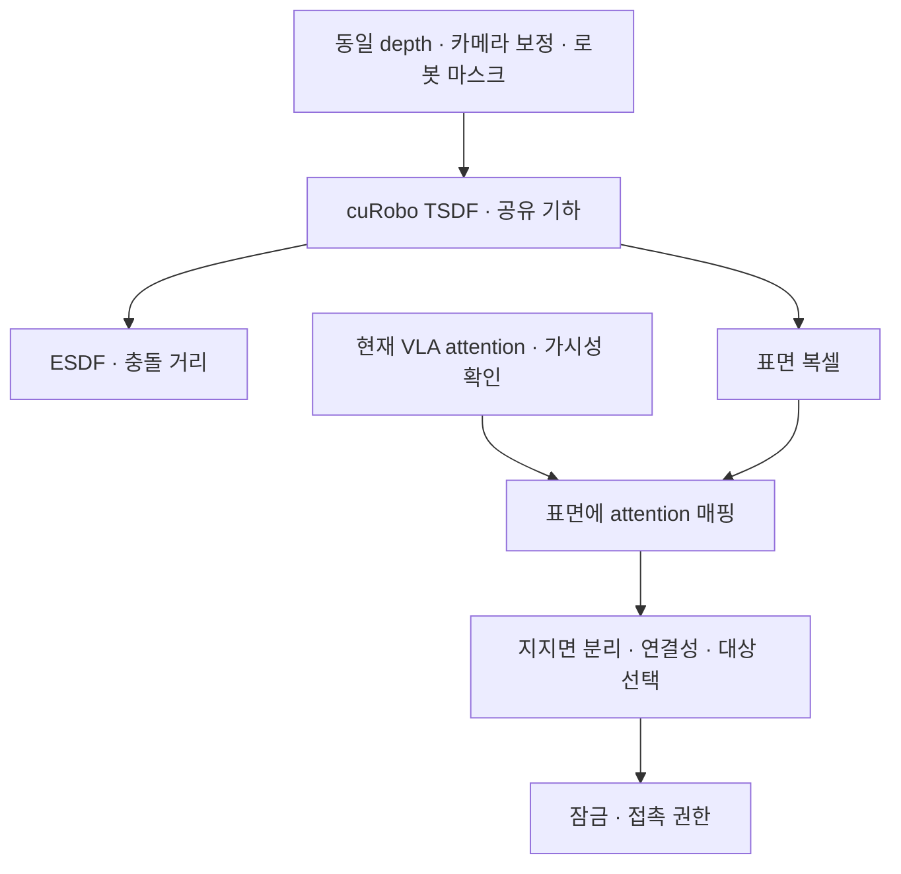
```mermaid
flowchart TD
  D[동일 depth · 카메라 보정 · 로봇 마스크] --> T[cuRobo TSDF · 공유 기하]
  T --> E[ESDF · 충돌 거리]
  T --> S[표면 복셀]
  A[현재 VLA attention · 가시성 확인] --> M[표면에 attention 매핑]
  S --> M
  M --> G[지지면 분리 · 연결성 · 대상 선택]
  G --> P[잠금 · 접촉 권한]
```

대안은 (1) 추출한 표면에 현재 attention을 카메라로 재투영해 붙이거나, (2) `feature_grid`로 같은 TSDF 주소 공간에 함께 저장하는 것이다. 기존 관측점의 uv가 없어도 카메라 보정과 depth 일치 검사를 이용해 대응을 다시 계산할 수 있다. attention의 시간 누적, 가림, 움직이는 물체, 특성 해상도는 별도 검증 대상이다. 파지 순간 attention이 목적지로 이동하므로 기하 누적과 대상 식별의 잠금을 동일시하면 안 된다.

이번 확인은 소스 및 기존 테스트 코드의 읽기 검토다. GPU 적분·attention 분할 실험은 실행하지 않았다. 표면 추출·특성 읽기 API의 존재는 확인했고, 기존 분할의 대체 가능 범위 및 성능은 미검증이다. 앞선 그림에서 별도 점구름 경로를 필수처럼 유지한 설명을 정정한다.

---

## 라벨 층 (2/3) — 거리장이 "가장 가까운 것이 **무엇인지**" 를 답한다 (2026-09-15)

F18(전역 마진 50 mm 가 담기 동작을 구조적으로 막는 문제)의 전제다. "목적지에는 얇은 마진" 을
걸려면 **가장 가까운 표면이 목적지인지** 알아야 하는데, 거리장은 익명이라 그것을 모른다.

### 문헌이 이미 답을 갖고 있다 — 거리 층 옆의 라벨 층

Voxblox++ · TSDF++ · Panoptic Multi-TSDFs 가 전부 같은 구조다. primitive 를 쓰지 않는다.
그리고 **우리 구현에서 비용이 거의 없다** — 거리 변환은 최근접 표면 복셀을 **이미 계산한다**.
`ndimage.distance_transform_edt(..., return_indices=True)` 가 그것을 돌려주므로 라벨은 새
알고리즘이 아니라 조회 한 번이다. cuRobo 쪽 PBA+ 도 본래 최근접 site 를 구하는 알고리즘이라
백엔드를 바꿔도 같은 구조가 남는다.

### 무엇을 넣었나

| 파일 | 무엇 |
|---|---|
| `esdf.py` `esdf_from_occupancy` | `labels` 를 받으면 `(field, label_field, stats)` 를 낸다. 각 복셀에 **그 거리를 만든 표면 복셀의 라벨** |
| `esdf.py` `EsdfField` | `label_grid` · `label_names` · `label(p)` · `is_label(p, 이름)` · `label_id(이름)` |
| `esdf.py` `EsdfBuilder.update` | `labelled_points={이름: 점}` |

### 두 번 틀렸고 실측이 잡았다

1. **라벨을 관측 점의 복셀에 붙였더니 최근접 표면이 전부 라벨 없음으로 나왔다.** 필드의 표면을
   정하는 것은 TSDF 의 영교차이고, 그것이 원본 점이 떨어진 복셀과 같지 않다. 고침: 점에서 만든
   씨앗 라벨을 `label_snap_voxels`(기본 2) 안의 **점유 복셀로 한 번 옮긴다.**
2. **쥔 사과가 필드에 남아 자기 자신을 봤다.** 사과는 이제 로봇 쪽 질의점이므로 필드에 있으면
   안 된다 — 자기 필터가 실제로 지우고 있고(F12), E3 의 필드 예외가 그것을 의도로 바꾼다.

**둘 다 추측으로 넘어갔으면 "라벨이 안 붙는다" 로 잘못 결론냈을 자리다.**

### 검증

**합성 씬** — 라벨이 다른 구 둘을 x 축에 놓고 중간선을 지나며 라벨이 갈리는지 봤다. `x < 0` 전부
`A`, `x > 0` 전부 `B` 로 정확히 갈린다. **거리 격자는 라벨을 붙여도 바이트 단위로 같다.**

**실제 씬** (`run_0004` 프레임 18, 3 카메라, 20 mm 복셀):

```
라벨: table(176,637 점) · crate(215,990 점)          쥔 사과는 필드에서 제외
쥔 사과 점 15,342 개의 최근접 표면    crate 100.0 %  ·  table 0.0 %  ·  라벨없음 0.0 %
그 거리                              최소 40.7 mm, 중앙 69.8 mm
빌드 비용                            130 → 185 ms  (+55 ms)
```

**익명이 풀렸다.** 이제 "이 질의점의 가장 가까운 표면은 바구니다" 를 필드가 직접 답한다 —
F13 이 쓰던 우회로(필드 거리와 해석적 거리를 한 복셀 안에서 대조하는 양면 검사)가 필요 없다.

### 알려진 한계 — 동점

두 물체에서 **같은 거리**인 점의 라벨은 임의로 정해진다. 거리 변환은 동점에서 어느 site 를
고를지 보장하지 않는다. 마진이 서로 다른 두 물체가 한 복셀 안에서 맞닿으면 **얇은 쪽이 뽑힐 수
있고, 그것은 위험한 방향**이다. 지금 씬에서는 바구니 안쪽 표면이 전부 같은 물체라 발동하지
않는다. 테스트에 기록해 두었다.

**전환 신호: 마진이 다른 두 물체가 복셀 하나 안에서 맞닿는 씬이 생기는 것.** 그때는 소비 쪽에서
보수적으로(큰 마진 쪽으로) 풀어야 한다.

### 시각화

**[`figures/label-layer-verify.png`](figures/label-layer-verify.png)** — 라벨 격자의 z 단면(자른
높이 배치도 포함) · 사과가 보는 것 · 검증 표.

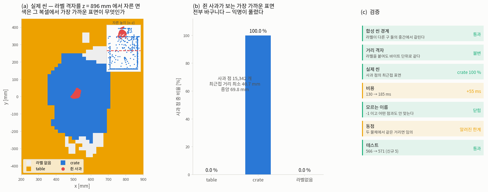

### 전체 틀에서 지금 어디인가 (규칙 B)

```
… → TSDF/ESDF ✓ 라벨 층 → 거리장 어댑터 → SQP 선형화 ✓ 쥔 물체 도달 → QP 해
                                                ★ 다음: 목적지 마진 20 mm
```

닫힌 것: **거리장이 무엇인지 답한다.** 남은 것은 셋 중 마지막 — 그 답을 마진으로 바꾸는 것
(`clearance.py` 에 목적지 축, `linearize.py` 에서 `is_label` 로 고르기), 그리고 E3 의 호출부
(`attach`/`detach`) — 그것은 F17(조작 대상 식별에 에피소드 상태가 없다)의 잠금과 한 덩어리다.

테스트 **566 → 571** (신규 `tests/ag3s/test_esdf_labels.py` 5 개). 회귀 기준선은 라벨을 쓰지
않으므로 불변이고, 전체 통과.

---

## 목적지 마진 (3/3) — 담기가 풀렸다 (2026-09-15)

F18(전역 마진 50 mm 가 담기 동작을 구조적으로 막는다)의 수정이다. 라벨 층이 들어온 덕분에
"가장 가까운 표면이 목적지인가" 를 물을 수 있게 되었고, 그래야 **전역 마진을 건드리지 않고**
그 표면에만 얇은 마진을 걸 수 있다.

### 무엇을 넣었나

| 파일 | 무엇 |
|---|---|
| `types.py` | `SourceType.DESTINATION` · `DESTINATION_LABEL` 상수 · `CollisionConstraintSet.destination_label/_margin` |
| `config.py` | `ContactConfig.destination_margin = 0.020` |
| `clearance.py` | `full_margin(DESTINATION)` → 20 mm |
| `pipeline.py` | `destination_points` 주입 → 필드 라벨 + 정책에서 마진을 뽑아 실어 보낸다 |
| `trajopt/linearize.py` | `SceneSnapshot.destination_label/_margin` · `_esdf_clearance` 에서 `is_label` 로 고른다 |

**목적지는 주입이다.** AG3S 는 과제를 모르므로 어느 물체가 목적지인지 알 수 없다 — `phase` 와
같은 계약이고, `SourceType.DESTINATION` 의 주석에 그렇게 적었다.

### 그리고 실측이 내가 낸 버그를 잡았다

처음 구현은 **"가장 가까운 것이 목적지인 모든 질의점"** 에 얇은 마진을 걸었다. 그랬더니:

```
                   전역 50 mm    처음 구현    고친 뒤
쥔 사과 (프레임 18)   -5.3 mm      +24.7 mm    +24.7 mm
로봇 구 최악          -77.8 mm     -47.8 mm    -77.8 mm   <-- 여기가 샜다
```

**로봇 팔과 몸통의 여유거리까지 30 mm 완화됐다.** 이것은 E1(조작 대상을 필드에서 파내면 손끝뿐
아니라 팔꿈치·몸통·반대팔에게도 사라진다)과 **같은 종류의 실수**다. 바구니 안으로 들어가야 하는
것은 **쥔 물체**이지 팔꿈치가 아니다.

고침: 목적지 마진은 **쥔 물체의 질의점에만** 붙는다. 손가락은 이 완화가 필요 없다 — 실측상
바구니 안에서 50.4~51.1 mm 여유가 있어 전역 마진으로 충분하다. 필요해지는 날 (링크, 목적지) 쌍
권한으로 넓히면 되고, 그것은 `ClearancePolicy` 가 접촉 권한에 이미 쓰는 구조다.

**추측으로 넘어갔으면 "담기가 풀렸다" 로 끝냈을 자리다.** 로봇 구까지 나란히 재지 않았으면
완화가 새는 것을 못 봤다.

### 검증 (`run_0004`, 담는 구간, 3 카메라, 20 mm 복셀)

```
프레임            16        17        18*       * 18 이 아직 쥔 마지막 프레임
쥔 사과 질의점    89        80        64        (10 mm 복셀)
전역 50 mm      +37.8     +4.6      -5.3   mm  <- violated
목적지 20 mm    +67.8    +34.6     +24.7   mm  <- feasible
로봇 구 최악    -88.1 / -88.1   -87.1 / -87.1   -77.8 / -77.8  mm  (두 설정 동일)
```

| 무엇 | 결과 |
|---|---|
| 담기 | **-5.3 → +24.7 mm**, violated → feasible |
| 로봇 구 | **완전히 불변** (배열이 바이트 단위로 같다) |
| 목적지 이름이 라벨에 없을 때 | 완화 없음 — 닫힘 |
| 목적지를 안 줬을 때 | 아무것도 안 바뀜 |
| **회귀 기준선** | **해소 14 / 개선 15 / feasible 8, violated 7 — 불변** |
| 테스트 | **571 → 574** |

### 마진 표 (최종)

| 쌍 | 마진 | 왜 |
|---|---|---|
| 쥔 물체 ↔ 목적지 | **20 mm** | 바구니 안으로 들어가야 한다. 상한 32.9 − 격자 낙관 7.6 = 25.3 |
| 쥔 물체 ↔ 그 밖 | 50 mm | 테이블·다른 과일은 목적지가 아니다 |
| 로봇 구 ↔ 목적지 | 50 mm | 팔꿈치는 바구니에 들어갈 일이 없다 |
| 로봇 구 ↔ 그 밖 | 50 mm | |
| 지지면 | 10 mm | 평면 행이 따로 받는다 |
| 이름 모를 것 전부 | 50 mm | fail closed |

### 시각화

**[`figures/destination-margin.png`](figures/destination-margin.png)** — 담기가 풀리는 것 ·
로봇 구가 불변인 것 · 마진 표.

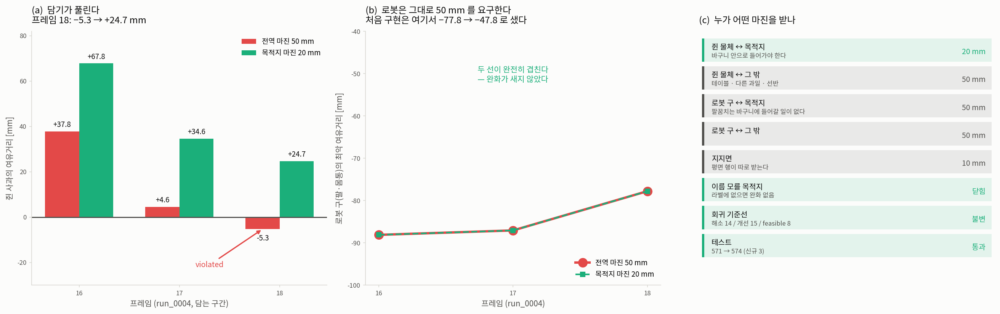

### 전체 틀에서 지금 어디인가 (규칙 B)

```
… → TSDF/ESDF ✓ 라벨 층 → 거리장 어댑터 → SQP 선형화 ✓ 쥔 물체 · ✓ 목적지 마진 → QP 해
```

**셋이 다 닫혔다** — 쥔 물체가 optimizer 에 도달하고, 거리장이 무엇인지 답하고, 목적지에만
얇은 마진이 붙는다. 남은 것은 **호출부** 하나다: live 경로에서 `attach`/`detach` 를 누가
부르는가, 그리고 목적지 점을 누가 주는가. 그것이 F17(조작 대상 식별에 에피소드 상태가 없다 —
잠금)의 걸기·유지·풀기와 **같은 자리**다.

---

## cuRoboV2 대비 — 우리가 가진 것과 없는 것 (2026-09-15, 사용자 항목별 구분)

사용자가 cuRoboV2 기반으로 가능한 항목 넷을 주고 **먼저 구분하라**고 했다. 코드와 원문을
대조하고, 하나는 실측했다.

### 구분표

| cuRoboV2 항목 | 우리 | 근거 |
|---|---|---|
| 파지 후 로봇 kinematic tree 에 결합 | **있다** (2026-09-15) | `sphere_states` 가 쥔 물체를 질의점으로 낸다. **단 primitive 가 아니라 점** — 아래 참고 |
| 로봇–환경 충돌에 잡힌 물체 포함 | **있다** (2026-09-15) | 같은 자리 |
| Geometry 채널 stamping (analytic SDF) | **없다** | `TsdfVolume` 은 depth 채널 하나뿐 (`esdf.py` `self.tsdf` / `self.weight`) |
| `min(depth, geom)` 두 채널 합성 | **없다** | 유사물은 지지면 평면 행인데 그건 필드가 아니라 **따로 사는 선형 제약**이다 |
| self-collision (잡힌 물체 포함) | **전혀 없다** | `benchmark/trajopt/` 전체에 self-collision 코드가 **0 줄**. `attached.self_collision_mask` 는 표현만 있고 소비자가 없다 |
| 놓는 것을 시스템이 안다 | **없다** | live 경로에 `detach` 호출자가 없다 — F17(조작 대상 식별에 에피소드 상태가 없다)과 **같은 자리** |
| 놓은 뒤 depth 로 복구 | **부분** | TSDF 적분은 계속 도니 새 관측은 들어온다. 다만 느리다 (아래) |
| Frustum-aware decay 로 잔상 제거 | **없다** | 가중치가 `w_new = min(w_old + 1, 64)` 로 **단조 증가**한다 (`esdf.py:196`). 옛 관측이 절대 흐려지지 않는다 |

### F20 (신규) — 사라진 물체의 잔상이 8 프레임 뒤에도 남는다

계획서는 "우리 씬은 아직 정적이라 frustum decay 의 필요가 확인되지 않았다" 고 적어 두었었다.
**확인됐다.** `run_0004` 에서 사과의 원래 테이블 자리를 프레임마다 질의했다 (머리 카메라, 20 mm):

```
프레임          6..10     12      13      16      18      19
사과가 떠난 거리  0 mm   108 mm  187 mm  338 mm  301 mm  302 mm
그 자리의 필드   -25.4   -20.0   -20.0   -20.0    -8.5    -6.7  mm   <- 계속 점유
```

**사과가 302 mm 떠난 뒤에도 그 자리는 −6.7 mm 로 점유다.** 8 프레임 내내 한 번도 자유가 되지
않는다. 가중치가 단조 증가하므로 새 관측(빈 테이블)이 옛 관측(사과)과 **같은 무게**로만
쌓이고, 회복이 산술평균 속도로 느리게 일어난다.

cuRoboV2 §5.3 이 푸는 것이 정확히 이것이다 — 시간 감쇠 `α_t ≈ 0.99` 를 모든 블록에,
**절두체 안의 블록에는 `α_f ≈ 0.5` 를 추가로** 곱한다. 보이는 곳은 두 프레임이면 옛 증거가
4분의 1로 줄어 새 관측이 지배한다.

**지금 피해가 없는 이유**는 우리 롤아웃에서 로봇이 그 자리로 되돌아가지 않기 때문이고,
**전환 신호**는 "치운 자리를 다시 지나가는 경로" 다.

### 사용자 지시와 실측 판정이 부딪히는 곳 — primitive

사용자 항목 1 은 *"잡은 이후에는 **primitive** 로 취급"* 이다. 그런데 어제 사용자가 *"primitive
방식은 절대로 안 된다"* 고 했고, F19(쥔 물체를 단일 primitive 로 근사하면 여유를 13.2~23.7 mm
먹고 없는 충돌을 만든다)가 그 근거였다. 둘이 모순으로 보이지만 **전제가 다르다.**

* cuRoboV2 가 geometry 채널에 stamping 하는 것은 **cuboid 와 mesh** 다 (§5.2 마지막 문단).
  **mesh 는 근사가 아니다** — CAD 를 아는 물체의 정확한 표면이다.
* F19 가 잰 것은 **관측 점구름에 맞춘 단일 구**다. 아는 형상이 없어서 맞춘 것이고, 그래서
  꼭지·잎까지 덮느라 r = 57.4 mm 가 됐다.

**즉 논문은 "형상을 안다" 를 전제하고, 우리는 그 전제가 없다.** 우리 설정에서 관측 쪽의 대응물이
점 기반이고, 그것은 어떤 fit 된 primitive 보다 항상 조인다. **CAD 를 가진 물체가 들어오면
geometry 채널 stamping 이 그대로 옳다** — 그때는 F19 가 적용되지 않는다.

### 시각화

**[`figures/curobo-v2-gap.png`](figures/curobo-v2-gap.png)** — 잔상 실측 · 항목별 구분표 ·
두 채널 구조.

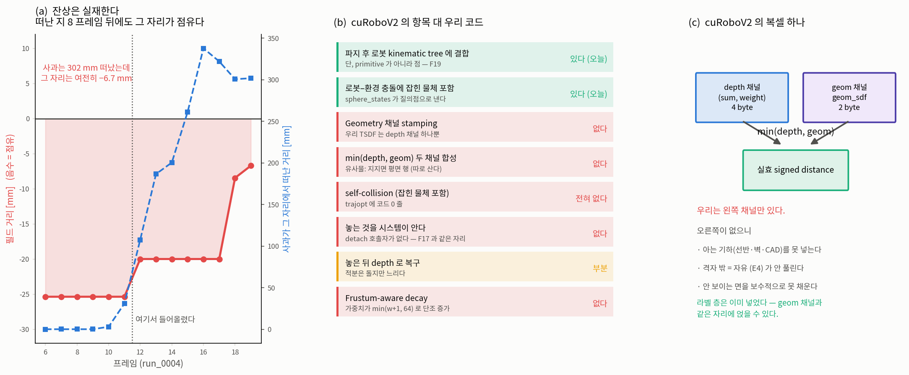

### 전체 틀에서 지금 어디인가 (규칙 B)

```
카메라 depth → [TSDF: depth 채널만 ★geom 채널 없음 ★decay 없음] → ESDF ✓ 라벨 층
            → SQP 선형화 ✓ 쥔 물체 · ✓ 목적지 마진 → QP 해     ★ self-collision 없음
```

닫힌 것: **무엇이 있고 무엇이 없는지의 구분, 그리고 잔상이 실재한다는 확인.**
남은 것 넷, 의존 순서대로:

1. **호출부** (`attach`/`detach` + 목적지 주입) — 이것이 없으면 위의 셋이 실제 롤아웃에서 안 돈다.
   F17 의 잠금과 한 덩어리. **먼저다.**
2. **self-collision** — 잡힌 물체가 로봇 자신과 부딪히는 것을 아무도 안 본다. 표현은 이미 있다.
3. **geometry 채널** — `min(depth, geom)`. E4(격자 밖은 무조건 자유)의 진짜 해결도 여기 있다.
4. **frustum-aware decay** — F20. 전환 신호가 올 때.

---

## 호출부 — 조작 대상의 잠금과 `attach`/`detach` (2026-09-15, F17 수정)

cuRoboV2 구분표의 1 번. 이것이 없으면 앞서 넣은 셋(쥔 물체 질의점 · 라벨 층 · 목적지 마진)이
**실제 롤아웃에서 한 번도 돌지 않는다** — live 경로에 `attach`/`detach` 호출자가 없었고, 목적지를
아무도 이름 짓지 않았다.

### 먼저: 꼭지를 버려도 여유거리는 안 바뀐다

사용자 지시("사과의 꼭지 같은 사소한 부분은 버려라")를 **버리기 전에 쟀다.** 반경 20 mm 안의
이웃 수로 가는 돌출부를 거르는 필터를 담는 구간 세 프레임에 걸었다:

```
k=3   0 점 버림    여유 변화 +0.0 mm
k=5   0~2 점       여유 변화 +0.0 mm
k=8   3~9 점       여유 변화 +0.0 mm
버린 점들의 최소 여유 39.7~71.6 mm  (전체 최소 33.2~49.0 mm) — 언제나 더 멀었다
```

**정확히 0.0 mm 다.** 꼭지는 위를 향하고 구속은 수평(바구니 내벽)이라 애초에 가장 가까운 점이
아니었다. 꼭지가 비쌌던 것은 **단일 구를 맞출 때**였고(F19 — 꼭지까지 덮느라 r = 57.4 mm),
점 기반으로 옮긴 순간 그 비용은 이미 사라졌다.

그래도 `trim_outliers` 를 넣었다 — depth 잡티를 거르는 용도이고 기본값이 보수적이다
(`min_neighbors=3` 은 위 측정에서 한 점도 버리지 않는다). **버리는 것은 안전하지 않은
방향이므로 전환 신호를 적어 둔다: 버린 점의 최소 여유가 남긴 점의 최소 여유보다 작아지는 것.**

### 잠금 — `benchmark/trajopt/grasp_latch.py`

세 조각을 그대로 구현했다. **AG3S 안이 아니라 밖이다** — `attached.py` 머리말이 못박은 계약
("AG3S does not decide when a grasp succeeded")이 그대로 남는다. 이 모듈은 씬을 보지 않고
**이름·점수·그리퍼·외부 성공 판정**만 본다.

```
걸기   연속 3 프레임 같은 물체 + 1·2위 점수 격차 1.3배
유지   attention 이 어디로 가든 무시
풀기   성공 판정이 서거나 그리퍼가 2 프레임 열려 있으면
```

**문턱 값이 전부 실측에서 나왔다.**

* `confirm_frames=3` — 두 기록 다 선두 7~8 프레임이 같은 물체였다. 그리고 **프레임 2 에서
  purity 가 0.62 로 떨어지므로** 한 프레임 확신으로 잠그면 안 된다.
* `score_ratio=1.3` — 실측 격차가 1.7~47배라 통과하고, 애매한 프레임은 못 넘는다.
* `gripper_closed_below=0.85` — `run_0004` 왼손 실측: **열림 ≈ 1.00, 닫힘 ≈ 0.72**, 프레임 10 에
  닫히고 19 에 열린다. 손-사과 거리로 잰 파지 구간과 정확히 맞는다.

**애매한 프레임은 연속을 끊지도 세지도 않는다.** 끊으면 한 번의 잡음으로 잠금이 영영 안 걸리고,
세면 문턱이 뜻을 잃는다.

### 목적지는 F11 을 뒤집어 얻는다

잠금이 걸린 **뒤에** grounding 이 내는 이름은 조작 대상이 아니다. 실측에서 그것은 **목적지**다:

```
파지~놓기 구간 (프레임 7~20) grounding 이 낸 것
  crate 13 / 14 프레임, 최장 연속 11,  한 프레임(18)만 orange
프롬프트: "put the apple in the basket"  ->  crate 가 바로 목적지
```

**F11(파지 순간 attention 이 목적지로 옮겨간다)이 결함으로 본 거동이 여기서는 신호가 된다.**
목적지에도 같은 잠금을 걸어 프레임 18 의 `orange` 튐을 먹지 않게 했다.

### 이름표가 없는 문제 — 무게중심으로 같은 물체를 안다

`TargetGeometry.id` 는 그 프레임의 클러스터 번호라 프레임 간에 뜻이 없다. 대신 무게중심을 쓴다:
target 이 **다른 물체로 바뀔 때 무게중심이 307~597 mm 뛴다** (F2·F9 실측). 같은 물체를 보는
동안의 흔들림과 자릿수가 다르므로 60 mm 하나로 갈린다 (`CentroidIdentity`).

### 배선 — `SafePolicy`

판단(잠금)과 호출(AG3S)이 만나는 자리는 `SafePolicy._run_latch` 하나다.

```
process_multi_debug(..., destination_points=지난 프레임 잠금이 정한 것)
  -> 무게중심으로 이름 -> 잠금 한 프레임
  -> event.attach 면 ag3s.attach(잠긴 target, robot_state, parent_link, allowed_contact_links)
  -> event.detach 면 ag3s.detach()
  -> 목적지가 확정됐고 지금 target 이 그것이면 그 점구름을 다음 프레임 목적지로
```

`attach` 가 쓰는 기하는 **지금 프레임의 target 이 아니라 잠긴 이름이 마지막으로 target 으로
나왔을 때의 것**이다. 잠금이 걸린 뒤의 target 은 이미 목적지일 수 있기 때문이다.

목적지가 한 프레임 늦는 것은 의도다 — 이번 프레임 결과를 쓰려면 필드를 두 번 지어야 한다.

### 검증 — 실제 기록을 그대로 먹였다

`run_0004` 의 프레임별 grounding 선택·점수와 왼손 그리퍼 값을 잠금에 그대로 넣었다.

```
프레임    0  1  2  3  4  5  6 | 7  8  9 10 11 12 13 14 15 16 17 18 | 19 20
grounding  apple ...........  | crate ................... orange   | crate
조작 대상  -  - [apple 잠김] ... apple 유지 .................... | apple
목적지     -  -  -  -  -  -  - | -  -  -  -  -  - [crate 잠김] ... | crate
                                        ^attach(10)                  ^detach(19)
```

| 무엇 | 결과 |
|---|---|
| 조작 대상 | 프레임 7~18 내내 `apple` — **attention 이 crate 를 내는 내내 유지됐다** |
| attach | 프레임 10, 한 번 (그리퍼가 닫히는 프레임) |
| detach | 프레임 19, 한 번 (성공 판정) |
| 목적지 | `crate` — 프레임 18 의 `orange` 튐을 안 먹는다 |
| 한 프레임 확신 / 애매한 프레임 / 그리퍼 한 프레임 튐 | 전부 의도대로 |
| **회귀 기준선** | **해소 14 / 개선 15 / feasible 8, violated 7 — 불변** |
| 테스트 | **574 → 582** (신규 `tests/trajopt/test_grasp_latch.py` 8 개) |

### 시각화

**[`figures/grasp-latch-verify.png`](figures/grasp-latch-verify.png)** — 두 줄이 프레임 7 부터
갈라지는 것 · 그리퍼 신호 · 검증 표.

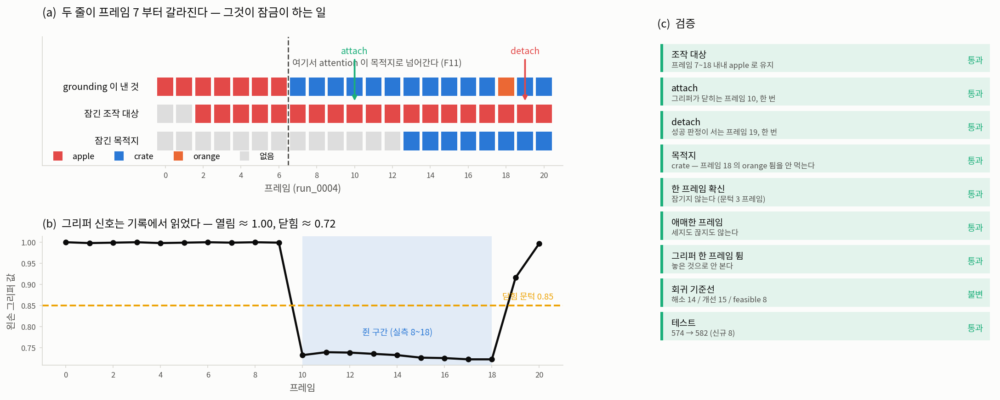

### 전체 틀에서 지금 어디인가 (규칙 B)

```
카메라 depth → [TSDF ★geom 채널 · ★decay] → ESDF ✓ 라벨 층
            → SQP 선형화 ✓ 쥔 물체 · ✓ 목적지 마진 → QP 해     ★ self-collision
                          ↑
                  ✓ 잠금 · ✓ attach/detach 호출부  (이제 실제로 돈다)
```

닫힌 것: **F17(조작 대상 식별에 에피소드 상태가 없다) — 걸기·유지·풀기 셋 다.** 그리고 앞서
넣은 셋(쥔 물체 질의점·라벨 층·목적지 마진)이 이제 live 경로에서 실제로 발동한다.

남은 것 셋, 구분표의 순서대로: **self-collision**(N1) → **geometry 채널**(N2) →
**frustum-aware decay**(F20).

---

<a id="reuse-audit-20260915"></a>
## cuRobo 재사용·AG3S 검증·대안 검토 실행 결과 (2026-09-15)

> **동시 변경 분리:** 아래 실험 기준 snapshot을 고정한 뒤 `SafePolicy`의 잠금 및 live
> `attach/detach` 호출부가 다른 작업으로 추가됐다. 해당 후속 구현은 이 절의 574-test/재생/GPU
> 결과에 포함되지 않는다. A05·A07의 “live 호출부 없음”은 **기준 시점 판정**이며, 현재 소스에서는
> 호출부가 생겼다. 새 호출부도 A01의 마진 경쟁, A03의 유효성, A05의 비권한 링크 충돌을
> 해결하지는 않으므로 별도 수용 시험이 필요하다.

**결론:** cuRobo가 만든 표면을 재사용하여 attention을 3차원에 매핑할 수 있다. 별도의 기하 재구성이 원리적으로 필수인 것은 아니다. 공개 Mapper의 표면 추출·특성 적분을 GPU에서 실행했다. 다만 물체 정체 유지, 파지 생명주기, 대상별 접촉 권한, 관측 유효성은 별도 구현이 필요하다. **최근접 표면 라벨 하나로 마진을 고르는 현재 방식에는 충돌 제약 위반을 놓치는 반례가 있다.** 운영 코드의 수정은 이번 범위에서 하지 않았다.

이번 절은 사용자가 승인한 전체 검토 계획의 실행 결과다. 앞선 절의 당시 판정은 삭제하지 않고, 아래 정정표를 최신 판단으로 삼는다. “검토 완료”는 증거와 미검증 사유를 정리했다는 뜻이며, 안전 문제가 수정 완료됐다는 뜻이 아니다.

### 1. 기준 시점과 실험 범위

기준 시각 **2026-09-15 02:41:02 UTC**. 커밋만으로 현재 상태를 표현할 수 없어 미커밋 변경·설정·테스트·기록을 함께 고정했다.

| 저장소 | 기준 HEAD | 작업 트리 |
|---|---|---|
| benchmark | `7d15cf163c803ed8ee21135054d445d3287e64c2` | 기존 미커밋 수정·신규 파일 있음. attached·라벨·목적지 마진 포함 |
| curobo_src | `78fd485fa82d9b9a063fb4985e371814587e666a` | 기준 시점 clean |
| pi05_TO_hybrid | `9b6c63ea96c666021be45201c9fa5d5e7ab98773` | 정확한 상태는 baseline.json에 저장 |

[baseline.json](figures/reuse-audit-20260915/baseline.json)에 353개 관련 파일의 SHA-256, git status와 diff 통계를 저장했다. tracked 변경 patch도 같은 디렉터리에 보관했다. **patch만으로 기존 untracked 파일까지 복원되지는 않는다.** 입력 `run_0004`, `run_0005`, 두 attention NPZ의 파일별 해시도 포함한다. [environment.json](figures/reuse-audit-20260915/environment.json)은 실제 Python·라이브러리·GPU·cuRobo import 경로다. CPU와 cuRobo 환경은 NumPy 주버전이 달라 분리했다.

검증은 기존 기록의 MuJoCo 오프라인 재생, 기존 테스트, 독립적인 합성 반례, 기존 H200 GPU의 Mapper 실험으로 한정했다. 보정 청크를 실기 로봇이나 닫힌 제어 루프에서 실행하지 않았고, 신규 모델 가중치 다운로드·학습·신규 실측 데이터 수집도 하지 않았다. 아래 속도는 동시 실행과 JIT의 영향을 통제한 비교가 아니므로 성능 순위에 사용하지 않는다.

### 2. cuRobo 능력표

**직접 사용 가능**은 해당 하위 기능의 API가 있고 확인됐다는 뜻이다. AG3S의 전체 입출력 계약을 무수정으로 만족한다는 뜻은 아니다. **어댑터 필요**는 공개 API 위의 입력 변환·정책·상태 관리가 필요함을, **내부 확장 필요**는 현재 public Mapper 계약 밖의 정보를 같은 백엔드에서 직접 얻으려면 내부 수정이 필요함을 뜻한다. 마지막 분류는 **현재 지원 확인 안 됨**이며 원리적 불가능 판정이 아니다.

코드 위치의 `C/`는 `curobo_src/curobo/_src/`, `A/`는 `benchmark/ag3s/`, `T/`는 `benchmark/trajopt/`다. 함수 이름과 줄은 위 기준 소스에 대한 것이다.

| 기능·분류 | 로컬 코드·입출력 | 제약·확인 수준 |
|---|---|---|
| RGB-D 및 다중 카메라 적분 — **직접 사용 가능** | `C/perception/mapper/mapper.py:182` `Mapper.integrate`; CameraObservation의 depth, intrinsics, pose, 단위 → 공유 TSDF | 관측 목록 지원은 소스 확인. GPU에서는 단일 합성 카메라 적분 실행. 촬영 시각 자세의 보간·동기화·단위 검증은 호출자 책임 |
| 로봇 제거 — **어댑터 필요** | `C/perception/robot_segmenter.py:163` `get_robot_mask`; depth + joint state + robot kinematics → mask | 구 기반 로봇 표현과 거리 문턱 사용. GPU 연산이라는 사실은 인접 사과·바구니 과잉 삭제 해결의 근거가 아니다. RB-Y1 모델 이식·정확도 비교는 미실행 |
| TSDF 누적·동적 갱신 — **직접 사용 가능** | `Mapper.integrate`, `reset`, `clear_region:268`, `clear_blocks:279`; `MapperCfg`의 decay 설정 | 소스 확인, 누적 GPU 실행. 영역 삭제는 교차하는 블록 단위라 같은 블록의 주변 물체도 사라질 수 있음. 파지 물체 식별·정확한 소유 표면 제거는 별도 |
| 표면·메시 추출 — **직접 사용 가능** | `Mapper.extract_occupied_voxels:355`, `extract_mesh:311`; TSDF → centers/features 또는 mesh | GPU에서 3,528개 표면 근처 복셀 추출. 중심·영교차 대역·subvoxel 옵션을 구분해야 함. 완전한 물체 폐곡면이나 원본 depth 점과의 동일성은 보장되지 않음 |
| 표면에 현재 attention 재투영 — **어댑터 필요** | 추출 centers + 각 카메라 K/pose/depth/attention → 가시 표면의 현재 점수 | 합성 평면 GPU 출력으로 연결 확인. 영상 범위·가림·depth 일치·이미지 해상도·시간 대응 필요. 원본 uv가 없어도 계산 가능 |
| attention 또는 신경망 특성 저장 — **직접 사용 가능** | `CameraObservation.feature_grid`; `MapperCfg.feature_dim`, `feature_block_grid_size`; 추출 결과 `.features()` | attention 1채널 GPU 적분·읽기 성공. 기본 feature_dim=0, 블록당 제어점 수 기본 1. 특성의 공간 해상도는 TSDF 복셀과 같다고 가정할 수 없음 |
| 시간 제한 attention·현재값 보존 — **어댑터 필요** | 현재 값은 외부 표면 재투영으로 유지 가능 | 기본 누적은 이전 1/현재 0을 0.5로 만듦. 특성만 독립적으로 시각·forgetting 규칙을 적용하는 백엔드 계약은 미구현이며 필요하면 내부 확장 검토 |
| 물체 식별·분할·잠금 — **현재 지원 확인 안 됨** | `Mapper.extract_matching_feature_voxels:399`는 유사한 특성을 가진 블록 검색 | 완성된 instance segmentation·영속 물체 ID·파지 잠금 API로 볼 수 없음. 양수 1차원 attention은 cosine 유사도가 모두 1이어서 크기 비교용 semantic search가 아님. 스칼라 값 자체를 읽어야 함 |
| 거리·기울기 — **어댑터 필요** | `Mapper.compute_esdf:286` → VoxelGrid; collision의 sphere distance 계열 → 충돌 계산·미분 | 거리 생성 GPU 확인. AG3S는 `A/curobo_field.py`로 배열 이동·보간. TSDF/ESDF 부호, 중심 좌표, 버퍼 clone 계약 필수. 비용 함수의 activation과 하드 여유거리 조건은 별개 |
| 최근접 표면·관측 여부 동시 반환 — **cuRobo 내부 확장 필요** | `C/perception/mapper/esdf/edt_parallel_banding.py`의 site index는 내부 거리 변환 자료 | public `compute_esdf`의 결과를 최근접 물체 ID·관측 마스크·시각 포함 질의로 바로 사용할 수 없음. 외부 메타데이터 어댑터도 대안. 내부 site를 내보내도 단일 최근접 라벨 마진 오류는 해결 안 됨 |
| ROI 밖·계층 합성 — **어댑터 필요** | `compute_esdf`의 범위·해상도 설정 + `A/curobo_field.py:CuroboEsdfField` | 희소 TSDF와 추출된 유한 ESDF 격자는 다른 범위. 현재 어댑터는 거리 승자와 gradient 계층은 맞추지만 라벨·유효성 계약과 연속 경계는 미완성 |
| 파지 형상 부착·해제 — **어댑터 필요** | `C/collision/attachment_manager.py:182,226,284`; mesh/obstacles → link-local sphere slots, detach | 여러 구 fitting과 링크 변환 기능은 소스 확인. 관측 안 된 형상 완성, grasp/slip 판단, 익명 TSDF에서 해당 물체만 제거하는 것은 자동 해결 안 됨 |
| 환경 제거 뒤 비권한 링크 충돌 — **어댑터 필요** | attachment의 로봇 구 편입 + 로봇 self-collision 설정 | 링크별 구 배치·self-collision ignore 설정 검증 필요. 특정 world object disable은 “모든 로봇 링크에 대해 그 물체 제외”라 쌍별 접촉 허용과 다름. 로컬 AG3S 경로의 누락은 아래 A05 |
| 링크×대상×phase별 마진 — **현재 지원 확인 안 됨** | generic collision 비용·활성화 거리·로봇/환경 설정은 존재 | AG3S의 목적지 전용·링크별 정책과 동일한 기본 public 계약은 확인 못 함. custom cost/rollout 및 객체별 질의로 구현 가능성은 있음. 익명 통합 필드만 사용할 경우 소유 정보 확장 필요 |
| VLA 청크를 초기 궤적으로 받기 — **어댑터 필요** | `C/solver/solver_trajopt.py:186,265` `prepare_trajectory_seeds`, `seed_traj` | 초기값 지원은 소스 확인. RB-Y1 관절 순서·고정축·그리퍼·시간 간격 변환 필요. GPU solver의 해당 로봇 실행 비교는 미실행 |
| 청크 추종·그리퍼 보존·실패 반환 — **어댑터 필요** | TrajOptSolver 결과/비용 관리자/custom rollout | seed 입력은 기준 궤적 추종 비용과 다름. 전체 중간 자세·원래 시간축·그리퍼 채널 보존은 별도 계약으로 구현·검증해야 함. 결과의 성공 상태를 AG3S 관측 유효성까지 포함한 안전 상태로 바로 치환할 수 없음 |

공식 최신 문서도 TSDF와 특성 적분을 구분하며 C-RADIO 기반 검색 예제를 제공한다. 이번 attention 1채널 실험에는 C-RADIO가 필요하지 않았다. [공식 Feature Mapping](https://nvlabs.github.io/curobo/latest/getting-started/feature_mapping.html), [Perception API](https://nvlabs.github.io/curobo/latest/api/curobo.perception.html).

**버전 구분:** 실제 실행 근거는 위 로컬 commit과 import 경로다. `latest`/`main` 문서는 2026-09-15 조회한 보완 근거이며 저장소의 그날 최신 HEAD와 로컬 HEAD가 같다고 검증하지 않았다. 과거 v1의 nvblox 중심 설명을 현재 로컬 Mapper의 기능 부재 근거로 사용하지 않는다. 최적화 확장에 관해서는 [공식 custom optimization guide](https://github.com/NVlabs/curobo/blob/main/docs/guides/optimization_motion.rst), [공식 rollout 설명](https://nvlabs.github.io/curobo/latest/concepts/rollout_class.html), [변경 기록](https://github.com/NVlabs/curobo/blob/main/CHANGELOG.md)을 함께 확인했다.

### 3. 우선순위별 발견과 정정

P0는 안전 판정을 잘못 긍정할 수 있어 기능 활성화 전에 고칠 항목, P1은 상태·모델·일반화 검증의 미완성, P2는 진단·비용·문서 정합 항목이다. `A01` 등은 이번 감사의 식별자이며 기존 발견 번호를 대체하지 않는다.

#### A01 — P0: 최근접 라벨에 따른 마진 선택은 동점이 없어도 틀린다

**상태:** production 소비 함수에서 반례 재현. `T/linearize.py:479` `_esdf_clearance`, 특히 529의 destination 라벨 분기. 기존 F18(목적지 마진 완화)의 “그 밖은 50 mm 유지” 결론을 제한한다.

**근거·반례:** 반지름 0인 파지 질의점에서 목적지 거리가 30 mm, 마진 20 mm이고 다른 장애물 거리가 45 mm, 마진 50 mm일 때 현재 출력은 **+10 mm**다. 실제 만족해야 하는 최솟값은 **−5 mm**다. 두 거리는 다르고, 물체가 같은 복셀에 붙어 있을 필요도 없다.

각 로봇/파지 질의점 i의 정확한 요구는 `c_i(p)=min_j[d_j(p)−r_i−m_ij(phase)] >= 0`. `j*=argmin_j d_j`를 먼저 고른 뒤 `m_ij*`를 빼는 것은 마진이 같을 때만 일반적으로 동치다.

**영향:** 목적지로 분류된 가까운 표면 뒤의 더 큰 마진 장애물을 놓친다. 단순 동점 처리나 경계에서 큰 마진 선택만으로 해결되지 않는다. 기존 manipulated-object의 거리 유사성으로 권한을 선택하는 경로도 같은 원칙으로 재검토해야 한다.

**수정 방향:** 동일 정책 종류별 거리장 또는 객체별 거리 질의 후 마진을 먼저 빼고 최솟값을 취한다. 완화 대상을 식별할 수 없으면 완화를 주지 않는다. **남은 불확실성:** 기록 씬에서 실제 발생 빈도와 수정 후 최적화 성능은 미측정. 반례 자체는 구현 결함을 확정하기에 충분하다.

#### A02 — P0: 라벨 갱신·보간·스냅이 소유권을 보장하지 않는다

**상태:** 세 가지 합성 반례 재현. `A/esdf.py:286,324,645,675`.

**근거·재현:** (1) 점유 격자와 라벨 이름은 고정하고 두 객체의 labelled_points만 교환하면 incremental 결과는 `[0,1]`, 전체 재빌드는 `[1,0]`. 재계산 복셀 수 0. `labels_changed`가 이름 목록만 비교하고 dirty block이 점유 변화만 추적하기 때문이다. (2) 거리 trilinear 보간과 최근접 복셀 라벨 조회를 함께 사용하면 0.2 mm 이동에 여유거리 +14.95→−14.95 mm가 된다. 이 보간 격자는 불일치를 분리한 합성 fixture이며 실제 물체 씬으로 주장하지 않는다. (3) 20 mm 떨어진 다른 물체의 점유 복셀이 기본 40 mm 스냅 범위 안에서 destination 라벨을 받는다.

**영향:** 오래되거나 잘못 붙은 라벨이 접촉 완화 권한으로 바뀐다. 이름 없음·범위 밖 라벨의 기본 동작은 이번 검사에서 각각 불일치/−1로 정상이다. 그것만으로 잘못된 유효 라벨을 방어하지는 못한다.

**수정 방향:** 소유 라벨/정책 변화도 dirty dependency에 포함; 관측 가시성·경계·동일 객체 연결성으로 씨앗 전파 제한; 불확실 소유권은 일반 장애물로 유지; 거리·기울기·소유·validity가 같은 근거를 사용하도록 계약화. **불확실성:** 실제 occlusion·오분할 분포에서 스냅 유출률은 미측정.

#### A03 — P0: 미관측, 추출 범위 밖, 최적화 후 이탈은 서로 다른 문제다

**상태:** 코드 추적 및 합성 재현. E4(격자 밖 자유 응답), G4(현재 로봇의 범위 검사), F16(미할당 공간 질의)은 미해결 부분이 남는다. “block-sparse 교체로 E4 소멸”은 정정한다.

**근거·재현:** `A/esdf.py`에서 all-UNKNOWN + free 정책은 전부 +0.4 m를 반환한다. `A/curobo_field.py:CuroboEsdfField`는 전체 격자 밖을 기본값에서 coarse 경계로 clamp; 합성 예에서 +40 mm와 영 기울기였다. GPU의 카메라 시야 밖 질의도 양의 ESDF 값을 받았다. 유한 거리 값은 관측 증거가 아니다.

`A/pipeline.py:660` `_esdf_coverage`는 현재 q의 구만 검사한다. 후보/최종 청크 전체의 새로운 위치와 파지 물체 범위를 동일하게 검증하지 않는다. `coverage_grid` 속성을 만들었지만 해당 함수는 `field.grid`를 읽어 fine 범위를 사용한다. `CuroboEsdfField.unknown_fraction`은 메타데이터 부재 시 0이며, 라벨 계약도 없다.

**영향:** 관측 실패·범위 이탈이 거리 여유로 오해될 수 있다. legacy 경로의 G2(빈 필드 인증 방지)·G3(기여 없는 카메라 검사) 수정이 새 어댑터에 자동 승계되지는 않는다.

**수정 방향:** 질의 반환을 `distance, gradient, valid/observed, layer, map_version, timestamp`로 묶고, 후보 궤적 전체 및 반지름·마진·파지 형상을 포함한 범위로 재확인한다. 범위 이탈 시 지도 확대 후 재계산 또는 실패 반환; 미관측은 거리와 분리해 실행 정책에 전달. **불확실성:** 미관측을 모두 장애물로 두면 현재 기록의 작업 가능성이 얼마나 줄어드는지 미측정. 이 문제는 정책 선택까지 필요하다.

#### A04 — P0: 계층 합성의 경계 불연속은 남아 있다

**상태:** C3(미세 창 경계의 낙관적 점프) 재현. `A/curobo_field.py:_evaluate`, `_covers`, `gradient`.

**근거·반례:** 미세 범위 내 거리 10 mm, 바깥 coarse 거리 40 mm인 합성 격자에서 0.2 mm 이동에 30 mm 점프한다. 계층 승자의 gradient를 선택하는 코드는 맞지만, 거리 자체의 경계 점프·라벨 부재·유효성 부재를 해결하지 않는다.

**영향:** SQP의 국소 선형화가 경계를 넘을 때 잘못된 개선을 예측할 수 있다. **수정 방향:** 충분한 겹침과 보수적 유효 영역을 두고, 고정된 map version 안에서 최적화; 경계 횡단을 별도 재검사. 부드러운 평균은 큰 거리를 섞어 비보수적이 될 수 있어 자동 해법으로 삼지 않는다. **불확실성:** 매끄러운 보수적 합성의 최종 설계·성능은 비교 실험 대상.

#### A05 — P0: 파지 점의 world 질의가 생겨도 파지 물체의 전체 충돌 검사가 완성된 것은 아니다

**상태(기준 시점):** E3(쥔 물체의 최적화기 전달)는 **소비부 구현됨 / 호출·제거·비권한 링크 검사 미완성**으로 정정. `T/linearize.py:set_attached`, `attached_states`, `sphere_states`, `scene_from_constraint_set`; `T/sqp.py:130`; `A/attached.py`; `T/safe_policy.py:162`. 기준 이후 live 잠금·호출부가 추가됐으나 아래 제거·비권한 링크 검사는 그대로 별도다.

**근거:** 추가된 점은 반지름 0으로 ESDF 질의에 포함되고 링크 좌표계에서 FK로 이동한다. 반면 candidate/plane 행은 로봇 부분만 잘라 사용한다. `A/constraint_builder.py`의 primitive 기반 `attached_self_mask`는 별도 표현이지만 현 ESDF-only `SceneSnapshot`/`full_violation`에는 이에 대응하는 파지 물체↔비권한 로봇 링크 행이 없다. `SafePolicy._scene_fn`은 attach/detach 및 destination_points를 주입하지 않는다.

**재현 방법:** 환경을 비우고 파지 점을 허용되지 않은 반대팔 구 안으로 옮긴 뒤 final collision check가 음수를 보고하는지 검사해야 한다. 이번 감사는 이 누락을 소스 수준에서 확인했으며 실제 FK 장면의 해당 반례 실행은 하지 않았다.

**영향:** 환경에서 파지 물체를 제거한 후 반대팔·몸통과의 충돌이 검증에서 빠질 수 있다. **수정 방향:** 파지 물체↔비권한 로봇 링크의 동적 쌍 질의를 별도 포함하고, world에서는 소유가 확인된 해당 물체만 제거한다. 재생·live 양쪽의 attach/detach 호출 소유자를 정한다. **불확실성:** 강체 파지 실패·slip·해제 후 재관측의 처리 결과는 미검증.

#### A06 — P0: 표면 샘플 사이·미관측 면·시간 스텝 사이의 누락

**상태:** F19(단일 구의 과잉 근사)를 이유로 점 방식이 필요하다는 관찰은 유효하지만, 점 방식의 전체 형상 안전 보장은 성립하지 않는다. 합성 기하 반례 두 개 실행.

**근거·반례:** 20 mm 간격의 두 반지름 0 샘플이 얇은 반지름 3 mm 장애물에 각각 +7 mm인데, 그 사이 실제 표면은 −3 mm일 수 있다. 이동 양 끝 x=±30 mm에서는 +27 mm인데 중간은 −3 mm다. 이 두 실험은 coverage 문제를 분리하기 위해 마진 없이 계산했다. 현재 20/50 mm 마진 설정에서 그대로 충돌 누락률이 된다고 해석하지 않는다.

**영향:** 관측 부분 점구름과의 +0.0~+0.7 mm 차이는 보이지 않은 면이나 연속시간 충돌을 검증하지 못한다. **수정 방향:** 샘플의 실제 표면 덮음 오차 h와 거리장 오차 상한 ε를 검증한 경우에만 `d(sample)−r−margin−h−ε`로 보수화한다. 복셀 안 관측점 대표를 평균으로 만들었다면 관측점에 대한 최악 편차는 반 칸으로 단정할 수 없다. 미관측 면에는 별도 형상 가정/보수적 모델/추가 관측 필요. 시간 간격은 각 파지 표면의 최대 속도와 회전을 포함한 변위 상한으로 제한하거나 swept 검사한다. **불확실성:** h·ε의 실제 물체별 상한 없음. 완전 메시와의 비교는 이번 새 실험에 포함하지 않음.

#### A07 — P1: 로봇 마스크 변경과 대상 잠금은 별도 검증 문제

**상태(기준 시점):** F12(자기 필터가 사과·주변 물체까지 삭제), F14(촬영 자세 지연), F17(대상 잠금 없음)은 미해결이었다. 기준 이후 F17의 live 잠금 호출부가 추가됐지만 이번 감사 실험에는 포함되지 않았고, F12·F14 및 잠금의 수용 시험은 남는다. F11(주목 대상과 조작 대상의 권한 분리)은 구현됐으나 식별 생명주기는 별개다.

**근거:** `A/robot_filter.py`, `pipeline.py:_robot_mask_for`, `multiview.py`, `target_grounding.py`, `SafePolicy._scene_fn`. 이전 로그의 사과 100% 마스크·16 ms 상태 지연 피해·attention 목적지 전환은 이번에 새로 반복 측정하지 않았으며 기존 측정으로 표시한다. cuRobo RobotSegmenter 역시 구 모델 기반이어서 이 결함이 GPU 이식으로 사라진다고 결론낼 수 없다.

**재현 방법:** 같은 camera/depth/timestamp를 고정해 세 마스크의 로봇 미삭제율·비로봇 삭제율·대상 유지율을 비교한다. 잠금은 attention이 목적지로 이동하는 기록에서 잡은 물체 ID가 유지되는지, 실제 해제 신호 전에 detach하지 않는지 검사한다.

**수정 방향:** 렌더된 로봇 표면 depth와 관측 depth의 일치를 사용하고 허용 오차의 출처를 분리; 연속 관측으로 물체를 확정한 뒤 명시적 attach·유지·detach. 파지 성공·목적지의 소유자는 과제 계층. **불확실성:** 렌더 마스크의 실제 보정 오차·센서 잡음 민감도, 잠금 문턱은 미측정. 기존 시뮬레이터 body ID/자유 관절 위치로 자동 인식 성능을 대신하지 않는다.

#### A08 — P1: 누적 attention은 현재 주목과 물체 정체를 혼합한다

**상태:** 공개 Mapper GPU 실험에서 확인. `gpu_features.py`, `gpu_reprojection.py`.

**근거:** 동일 기하에서 첫 입력 attention=1, 다음=0일 때 표면 특성은 0.5. 반대로 현재 표면에 현재 카메라 attention을 재투영하면 과거 값에 끌려가지 않는다. 좌우 값이 다른 단일 평면에서는 두 경로의 경계 제외 1,920개 표면점 분류가 일치했다.

**영향:** 단순 특성 누적은 목적지 전환의 지연을 만든다. **수정 방향:** 장기 물체 정체/형상과 현재 주목 점수를 분리한다. 우선 표면 재투영; 별도 timestamp/수명 제한 누적을 비교 후보로 둔다. **불확실성:** 실제 물체 경계·가림·카메라간 점수 보정·동적 표면에서의 분할 정확도는 미검증. synthetic agreement 100%는 물체 분할 정확도가 아니다.

#### A09 — P1: “담기가 풀렸다”와 20 mm 마진의 안전 근거는 과도하다

**상태:** 이전 수치 자체를 취소하지 않고 결론의 범위를 정정한다. F18(담기에 필요한 마진), C5(20 mm 격자의 낙관 오차), F19(표현 오차).

**근거:** 32.9 mm는 특정 기록의 **관측 점구름**에서 잰 여유이고, 7.56 mm는 특정 비교의 **중앙값**이다. `32.9−7.56=25.34`는 오차 상한이나 신뢰구간이 아니다. 목적지 실험에서 파지 점의 여유가 −5.3→+24.7 mm가 되었지만 로봇 구의 최악값은 여전히 음수였다. 파지 점 일부의 모델상 제약 만족을 전체 청크의 feasible 또는 담기 성공으로 확대할 수 없다.

**영향:** 기존 기록으로 고른 마진을 동일 기록에서 확인하면 독립 평가가 아니다. `run_0005`도 이미 설정 검토에 쓰였으므로 새 held-out 기록으로 부르지 않는다.

**수정 방향:** 센서 표면/완전 메시/시뮬레이터 물체 ID를 구분한 오차 분포와 위험 방향의 꼬리를 측정; 실행 시 확보 가능한 입력만으로 별도 평가. **불확실성:** 실제 최소 여유거리·실제 충돌 누락률·작업 성공률은 현재 재생에서 새로 산출되지 않았다.

#### A10 — P2: 라벨 층의 비용·문헌 근거를 정정

**상태:** “비용이 거의 없다”, “모두 같은 구조”라는 표현을 정정. `A/esdf.py:428` EDT와 라벨 스냅; 이전 실측 130→185 ms는 **+55 ms, 약 +42.3%**다. 이번에 같은 씬의 비용을 새로 재측정하지 않았다.

**근거:** return_indices는 3개 좌표 인덱스 배열을 추가로 만들고 라벨 전파·스냅·갱신 의존성도 필요하다. 조회 자체가 싸다는 것과 전체 빌드 비용은 다르다. 내부 PBA site가 있다는 사실만으로 public export·물체 추적·동적 갱신이 공짜가 되지 않는다.

**문헌 정정:** Voxblox++의 객체 결합, TSDF++의 다중 객체 표면 표현·추적, Panoptic Multi-TSDFs의 물체별 지도는 단일 anonymous ESDF 옆에 최근접 라벨 배열 하나를 붙인 현재 구현과 동일하지 않다. 이 문헌들은 물체 중심 지도 분리의 근거이며 서로 다른 마진을 최근접 라벨로 안전하게 처리한다는 근거가 아니다. [Voxblox++ 공식 구현](https://github.com/ethz-asl/voxblox-plusplus), [TSDF++ 공식 구현](https://github.com/ethz-asl/tsdf-plusplus), [Panoptic Multi-TSDFs 원 논문](https://arxiv.org/abs/2109.10165).

**수정 방향:** 고정된 입력·해상도·history·쿼리에서 mapping, export, host/device 전송, 동기화, peak memory를 따로 잰다. **불확실성:** 후보들의 end-to-end 비용 우열은 아직 수치로 판정하지 않았다.

### 4. 기존 발견·모듈 판정의 상태 대조

| 기존 항목과 내용 | 현재 판정·추가 확인 |
|---|---|
| E1 — target를 전신 world에서 삭제 | 기존 명시적 carving 제거는 유지. A01/A02의 잘못된 권한 완화와 A05/A07의 제거 경로는 별도 위험 |
| E2 — 무한 지지 평면이 아래쪽을 모두 충돌 처리 | 기본 field 모드에서는 잠복. 평면 행 재활성 시 유한 지지 영역과 부호를 재검증해야 함 |
| E3 — 파지 형상 미소비 | 표현만 존재한다는 옛 문장은 오래됨. 점 기반 소비부 존재; 호출·소유 제거·비권한 링크·해제 미완성: A05 |
| E4 — 범위 밖 자유 응답 / E6 — dense 전 복셀 투영 비용 | E4 소멸 판정 취소: A03. E6는 Mapper 희소 적분 재사용으로 줄일 수 있지만 live `_build_esdf`는 아직 legacy builder |
| E5 — 카메라 이름 충돌 / G1 — depth 단위 누락 | 현재 수정 유지, 기존 관련 테스트 포함 전체 suite 통과. 새 Mapper 입력 변환에도 단위·카메라 ID 계약 필요 |
| E7 — 마스크용 역투영 중복 | 단순히 낮은 해상도 점구름을 재사용하면 안 된다는 기존 기각 유지. **추가 센서 취득**, **동일 depth 재역투영**, **두 TSDF 적분**을 구분해야 함. 표면 공유를 통한 앞단 축소는 새 대안 |
| G2 — 빈 필드 인증 / G3 — 기여 없는 카메라 / G4 — 범위 이탈 | legacy 검사 유지. 어댑터 메타데이터와 최적화 후 검사는 자동 해결 아님: A03 |
| F2 — 카메라별 정규화 오류 / F9 — image_hw 추정 오류 | 후속 코드의 raw 융합 후 정규화·depth.shape 사용 확인. 앞쪽 F2 표의 “수정 대기”는 오래된 상태 |
| F8 — p95=0에서 과다 seed 선택 | 선택 셀에서는 잠복이라는 기존 측정 유지. 다른 attention head/layer로 전환 시 희소값 반례를 다시 검사해야 함; 이번에는 전 조합 스윕 미실행 |
| F10 — DEGRADED가 NO_TARGET을 가림 | `to_adapter.py:193` 이후 우선순위상 사실. 진단 우선순위 문제로 분류; `target` 부재·validity를 별도 필드로 소비할 것. 단독으로 새 안전 위반을 확인한 것은 아님 |
| F11 — 조작 대상과 주목 대상 혼동 / F13 — 거리 귀속의 한쪽 비교 | F11 분리 구현 유지, F13은 현재 `abs(d−d_obj)<=tol`로 정정됨. 쌍별 마진 자체의 정확성은 A01로 재검토 |
| F12 — 자기 필터 과잉 삭제 / F14 — 자세 지연 / F17 — 잠금 부재 | 현존 설계 문제, A07. 100 ms 허용값이 실제로 충분하다는 근거 없음 |
| F15 — 지지면을 필드에서도 평면 행에서도 제거 | 불변식 검사·기본 설정 수정 유지. 목적지 절의 “지지면은 항상 별도 10 mm 평면 행”은 **현재 기본 field 모드와 불일치** |
| F16 — 희소 지도 미관측 / F18 — 담기 마진 / F19 — 단일 primitive 과잉 근사 | 각각 A03 / A01·A09 / A06. 인터페이스 구현 완료와 전체 기능 검증 완료를 분리 |
| C1 — cuRobo 입력 로봇 마스크 누락 / C4 — ESDF 공유 버퍼 덮어쓰기 | 기존 수정 유지. 새 GPU 실험도 결과를 clone. 서로 다른 compute_esdf 호출의 결과 보관 시 필수 |
| C2 — 과거 거리 오차 측정법 / C5 — 거친 격자의 낙관적 중앙값 | 후속 정정 유지. 중앙값을 안전 상한으로 사용하지 않음: A09 |
| C3 — 계층 경계 점프 | 미수정, A04 재현 |
| X1 — primitive fallback 순서 / X2 — overflow와 빈 슬롯의 ID 혼동 | `geometry.py`의 reversed(PRIORITY)와 문서 순서 불일치, `constraint_builder.py`의 aggregate ID −1 확인. 현 ESDF-only collision 경로에서는 primitive 슬롯 미소비; fallback 재활성 시 순서·active·SourceType을 함께 검사. 두 문제의 실제 안전 영향 재현은 미실행 |

`reconstruction.py`는 즉시 삭제 대상이 아니다. 표면 재투영이 기존 support surface·grounding·멀티뷰 provenance 계약을 대신하는지 먼저 비교한 뒤 축소한다. `attention_lifting.py`, `target_grounding.py`, `clearance.py`, 생명주기·유효성 관리는 cuRobo 도입 뒤에도 필요하다. `esdf.py`는 검증용 참조 경로를 남기되 운영 기하 적분 대체 후보이고, 라벨·정책 계약은 별도 이관 대상이다.

**용어 정정:** 이 로그 앞쪽의 “여유거리 0 이상이면 안전”은 **주어진 기하와 질의 집합에서 해당 제약 만족**으로 읽어야 한다. `feasible/violated` 상태는 `_finish`의 허용 오차와 geometry certification도 반영하므로 0 기준 거리 딱지와 같지 않다. `eikonal`의 기울기 크기 1은 유효한 정확 거리장의 미분 가능한 구간에서 기대하는 진단이며, 경계·최근접 표면 전환·격자 오차에서 깨진다고 곧바로 버퍼 버그를 뜻하지 않는다. “이산화는 항상 안전 방향 반 칸”, “점 기반은 근사가 없다”, “uv가 반드시 원본에 보존되어야만 attention 매핑 가능”, “목적지 SourceType 없음”도 각각 A09/A06/능력표/최신 구현에 의해 정정한다.

추가 용어: **정책 종류별 거리장**은 모든 물체를 개별 저장하는 대신 동일한 쌍별 마진을 받는 물체들의 합집합 거리장이다. **관측 유효성**은 숫자 거리가 존재한다는 사실과 별개로 해당 공간을 센서/모델이 얼마나 설명하는지 나타내는 정보다. **독립 평가 기록**은 문턱·마진·모델 선택에 쓰이지 않은 기록이다.

### 5. 이번에 실행한 결과

기존 suite **574 passed, 231 warnings, 133.21 s**. [pytest.log](figures/reuse-audit-20260915/pytest.log). 테스트 통과는 새 반례가 없다는 뜻이 아니며, 새 반례는 운영 테스트를 변경하지 않고 별도 실험으로 남겼다.

| 기록·카메라 | 청크 수 | 기하 위반 해소 / 개선 | 반환 feasible / violated | 보정 후 최소 / 중앙 여유 mm | 기준 궤적 차이 중앙 |
|---|---:|---:|---:|---:|---:|
| run_0004 · head | 15 | **14 / 15** | **8 / 7** | −0.573 / 3.529 | 1.184 |
| run_0005 · head | 15 | 9 / 15 | 5 / 10 | −1.447 / 0.105 | 1.174 |
| run_0004 · 3대 | 22 | 19 / 22 | 13 / 9 | −1.351 / 0.723 | 1.077 |
| run_0005 · 3대 | 22 | 20 / 22 | 15 / 7 | −0.348 / 3.998 | 0.990 |

총 **74회 청크 처리**이며 head/3대 결과는 같은 기록을 중복 처리한 조건 비교다. 74개 독립 표본이 아니다. 기존 run_0004 head 기준 수치가 재현됐다. 모든 조건은 voxel 20 mm, margin 50 mm, horizon 32, support=field, constraint=arms(120개 구), filter=194개 구다. 카메라 수가 다른 결과를 백엔드 정확도 개선으로 해석하지 않는다.

“기하 위반 해소”는 before<0 및 after>=0인 청크 수. 반환 status는 geometry certification 등 추가 조건을 포함하여 수가 다르다. 기준 궤적 차이는 `sqp.py:314`의 전체 관절 시퀀스 Frobenius/L2 norm이며 청크 길이·관절 수에 따라 변한다. 이를 그대로 mm, 평균 관절각, 작업 의도 보존율로 바꾸지 않는다.

**이 재생의 중요한 한계:** `esdf_rollout.py`는 원래 기록 자세에서 각 청크를 다시 보정한다. 보정 청크 실행 후 바뀐 다음 관측을 생성하는 closed-loop 실험이 아니다. attach/detach/destination 주입이 비활성이므로 F18/F19 새 경로의 전체 기능 시험도 아니다. phase는 t_step=(24,56,72)의 고정 경계이며 놓은 뒤 release 상태를 자동 인식하지 않는다. 22개 청크로 파지 전부터 후반까지 관측 범위는 확장했지만 이를 정확한 파지/이동/해제 라벨 평가로 부르지 않는다.

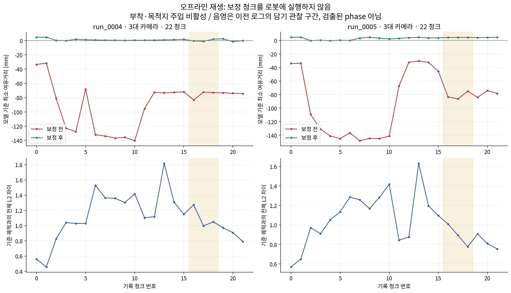

| 작은 실험 | 이번 결과 | 근거 |
|---|---|---|
| 서로 다른 마진 경쟁 | 현재 +10 mm / 정확한 모든 쌍 −5 mm | production `_esdf_clearance` 호출 |
| 라벨 경계 | 0.2 mm 이동에 29.9 mm 여유 점프 | production 보간·라벨 조회, 합성 격자 |
| 라벨만 변경 | incremental [0,1] / full [1,0] | production EsdfBuilder, 고정 occupancy fixture |
| 잘못된 라벨 스냅 | 다른 물체 점유 셀이 destination으로 분류 | 20 mm 이격, 40 mm 스냅 |
| ROI 경계 / 밖 | +30 mm 점프 / 밖에서 +40 mm·gradient=0 | production CuroboEsdfField, 합성 격자 |
| 미관측 free | 전부 +400 mm | production occupancy→ESDF |
| 공간·시간 샘플 누락 | 검사점 양수 / 중간 −3 mm | 해석적 구 거리, coverage 반례 |
| cuRobo 특성 누적 | 1→0 입력, 누적값 0.5 | H200 public Mapper 실행 |
| 표면 재투영 연결 | 가시 표면 3,200개; 경계 제외 1,920개 분류 일치 | 합성 depth 평면, 실제 GPU 출력 |

[반례 JSON](figures/reuse-audit-20260915/counterexamples.json), [GPU 누적 JSON](figures/reuse-audit-20260915/gpu_features.json), [재투영 JSON](figures/reuse-audit-20260915/gpu_reprojection.json), [기록 집계 JSON](figures/reuse-audit-20260915/rollout_summary.json).

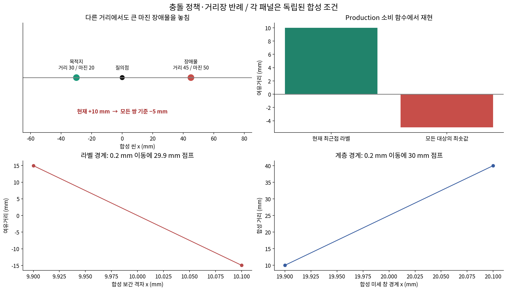

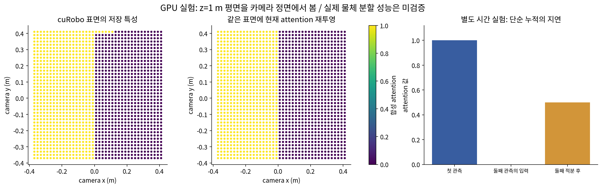

**실제 씬의 기존 관찰 그림:** [자기 필터에 의한 파지 손상](figures/grasp-damage-0004.png), [라벨 층 관찰](figures/label-layer-verify.png), [점·primitive 비교](figures/point-vs-primitive.png). 이 세 그림은 이번 새 생성 결과가 아니라 앞선 실험의 시각 자료다. 새 반례 그림은 합성, 재생 그래프는 기존 기록을 새로 처리한 수치임을 구분했다.

### 6. 대안 비교와 권고

판단 순서는 **충돌 판정 정확성 → VLA 의도 보존 → 구현·유지 비용 → 속도**다. 아래 비용은 구현 복잡도에 대한 판단이며 측정한 runtime 순위가 아니다.

| 문제 | 대안별 비교 | 권고·전환 조건 |
|---|---|---|
| 중복 재구성 | 기존 cloud는 uv/provenance와 현재 grounding 계약이 있어 참조로 유용. cuRobo 표면 재투영은 기하 중복을 줄이고 현재 attention을 분리 가능. 특성 저장은 통합 주소 공간이 장점이나 해상도·누적·시각·동적 물체 관리 필요 | **표면 추출+현재 재투영을 먼저 비교**. 기존 경로는 같은 기록의 기준선으로 유지. feature 채널은 그 뒤 시간 규칙을 명시해 비교 |
| attention 시간 변화 | 프레임별 값은 즉시 반응하지만 가림에 약함. 시간 제한 누적은 잡음을 줄이지만 전환 지연·TTL 필요. 물체 정체와 점수를 분리한 잠금은 파지 중 목적지 attention과 양립 | **물체 ID·파지 잠금을 우선**. 점수는 현재값, 정체는 증거와 해제 조건으로 유지 |
| 대상별 마진 | 최근접 라벨은 A01 때문에 부적합. 정책별 거리장은 그룹 수가 적으면 단순. 객체별 질의는 식별·동적 이동에 유연하지만 객체 수 비용 증가. 마진 반영 거리 변환은 정책을 먼저 적용하지만 phase/링크별 재계산과 signed semantics 검증 필요 | **정책별 또는 객체별 정확한 최솟값**. 최소한 destination/others 두 필드를 모두 질의; 조작 대상 접촉 권한까지 포함하면 정책 벡터가 같은 그룹끼리 묶기 |
| 움직이는 파지 물체 | 공유 world에 계속 적분하면 잔상과 자기 충돌. object-local 형상+FK는 안정된 강체 파지에서 단순. 관측 표면 점은 근사 과잉이 작지만 미관측·틈 보완 필요. 여러 구/메시는 보수성과 계산량의 절충 | **형상·정체를 world와 분리**, 전역 pose만 갱신. 소유 확인 없는 넓은 carving 금지. point coverage와 multi-sphere/mesh를 같은 완전 형상 기준으로 비교 |
| 로봇 마스크 | 기존 구 방식과 RobotSegmenter는 유사한 오삭제 위험. 렌더 표면+depth 일치는 실제 로봇 표면을 기준으로 하지만 보정·모델오차·렌더 비용 존재 | **동일 입력에서 세 방식 비교**. GPU 속도만 보고 교체하지 않음. 타 물체를 지운 픽셀은 별도 주요 지표 |
| 궤적 최적화 | SQP는 현 청크 추종·그리퍼 보존 계약 유지 비용이 가장 작음. cuRobo 전체 optimizer는 GPU 최적화 기회가 있지만 시간 재매개화·초기값/기준값 차이·정책 이식 필요. 기구학·충돌 계산만 재사용하면 의미 변경을 줄이나 CPU/GPU 전송 비용 발생 | **SQP 우선 유지, Mapper 재사용**. 다음으로 GPU 기구학/충돌만 분리 비교. 전체 solver 교체는 같은 기준 청크 비용·쌍별 정책·실패 의미·고정 시간축을 맞춘 뒤 결정 |

정책별 거리장은 **cuRobo public Mapper에 라벨을 넘기면 자동 생성되는 기능으로 확인한 것이 아니다.** 공유 TSDF의 소유 표면/점유를 추출해 클래스별 거리 질의를 만드는 어댑터 또는 내부 확장이 필요하다. 별도 Mapper 여러 개에 원 depth를 중복 적분하는 임시 구현은 정확도 참조로는 가능하나 “단일 기하 적분”의 비용 이점을 그대로 갖지 않는다. 이 계약을 확정하기 전 `esdf.py`를 삭제하지 않는다.

마진을 반영한 거리장은 `min_j(d_j−m_ij)`의 lower envelope를 직접 계산하는 방법이다. 단순히 nearest site에 마진 라벨을 덧붙이거나, 부호를 확인하지 않은 morphology로 치환하면 같은 식을 구현했다고 볼 수 없다. 경계·오차·미관측을 포함해 analytic reference와 비교한다.

**실패한 방식의 제한적 재검토:** 단일 bounding sphere는 사과의 꼭지·잎을 포함하면서 담기 공간을 과도하게 막은 관찰 때문에 기본으로 되돌리지 않는다. 다만 다중 구나 메시가 실제 표면을 얼마나 보수적으로 덮는지 검증하는 비교는 점 방식의 누락을 정량화하는 데 필요하다. 무한 지지 평면은 재도입하지 않고, 알려진 고정 장애물을 쓰더라도 유한 형상과 올바른 링크 정책으로 추가한다.

**추가 모델·문헌 후보:**

| 후보 | 필요한 입력·가중치·데이터 | 기대 효과와 비용·미검증 범위 |
|---|---|---|
| SAM 2 | RGB 비디오, 초기 point/box/mask prompt, 사전학습 checkpoint | 경계·시간 mask 전파 보완. depth를 붙여 3D ID에 연결해야 하며 가림 뒤 물체 정체·충돌 형상 완성을 보장하지 않음. 영상 inference와 메모리 상태 비용 추가; 현 H200에서 runtime/VRAM 미측정. [공식 구현](https://github.com/facebookresearch/sam2) |
| FoundationPose | RGB-D, 초기 객체 mask, CAD 또는 모델 없는 경우 참조 관측, pretrained 모델 | 파지 후 미끄러짐이나 FK 가정 실패 시 6D 자세 추적 후보. 안정된 강체 파지에서는 FK가 더 단순. 초기화·추적 inference·렌더 비용 필요, 이 데이터에 적합한 참조/weights 검증 미실행. [공식 구현](https://github.com/NVlabs/FoundationPose) |
| C-RADIO feature mapping | RGB, pretrained C-RADIO 및 관련 의존성 | attention 외 장기 시각 특성 비교 후보. 단순 attention 재투영에는 불필요. 고차원 feature inference·저장 비용 증가; 사물 ID 잠금 자체를 제공하지 않음. [공식 cuRobo 예제](https://nvlabs.github.io/curobo/latest/getting-started/feature_mapping.html) |
| TSDF++ / 물체별 지도 | RGB-D, 객체 관측·association, 별도 mapping/tracking 통합 | 물체를 이동해도 형상을 유지하는 설계 참고. 기존 cuRobo를 즉시 대체할 완제품으로 선정하지 않음. 지도/추적 상태와 구현 스택 유지 비용 증가. [TSDF++ 원 논문](https://arxiv.org/abs/2105.07468) |

추가 모델은 현재 경계·정체 유지 실험에서 기존 attention+depth가 실패하는 경우에만 우선순위를 올린다. 이번 검토에서 새 학습을 요구하지 않는다.

### 7. 수정 아키텍처와 다음 구현 순서

**간략 그림:** cuRobo 설명은 TSDF·ESDF·표면 추출 상자 하나로 유지했다.

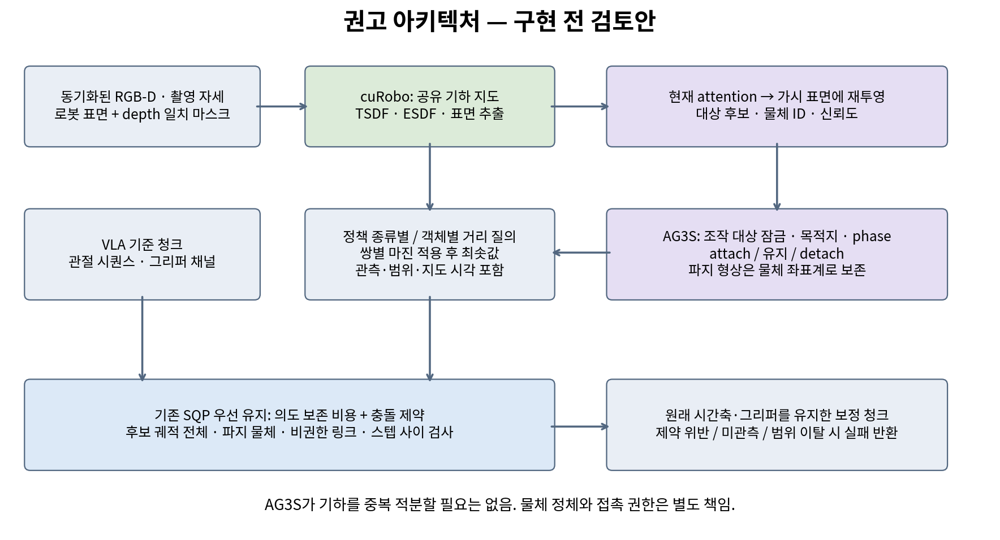

**상세 그림:** 구현 완료된 현황도가 아니라 이번 근거로 수정한 제안이다.

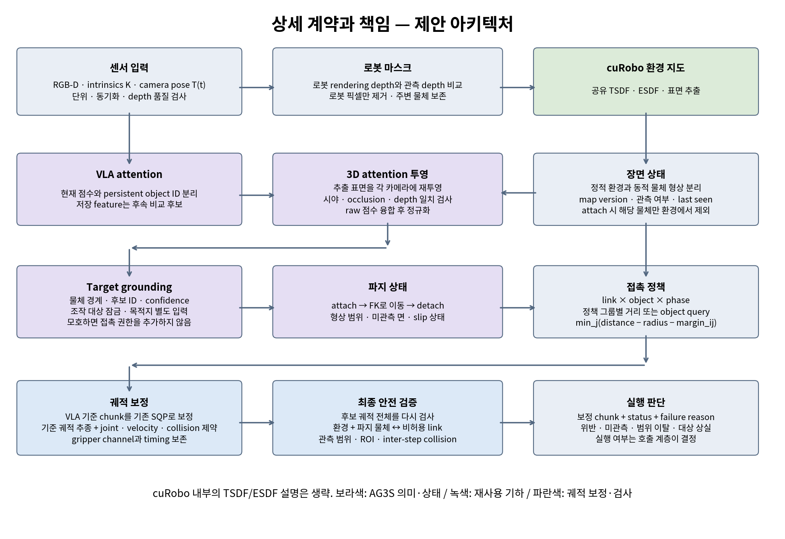

바로 재사용할 부분은 cuRobo `Mapper`의 기하 적분·표면/거리장 추출, 기존 카메라 보정·attention 입력 변환, SQP의 청크 계약이다. 우리 쪽에서 구현할 부분은 현재 attention 재투영 어댑터, 물체 정체·파지 상태, 정확한 쌍별 마진, 관측·ROI·시간 검사다. GPU 로봇 마스크, 독립 feature 시간 누적, 전체 cuRobo optimizer 교체는 먼저 비교 실험할 부분이다.

| 순서 | 변경 단위 | 수용 시험 |
|---|---|---|
| 1 | 대상별 마진 계약을 `min_j(d_j−r−m_ij)`로 변경, labels-only 갱신과 오라벨 권한 방어 | A01의 −5 mm 위반을 놓치지 않음; 서로 다른 거리/동점/라벨 없음/오분류/경계 sweep; incremental과 full rebuild 일치 |
| 2 | 관측·범위·지도 버전의 질의 계약 및 candidate/final 재검사 | all-unknown, TSDF 미할당, 모든 ESDF 밖, coarse/fine 경계, 최적화 후 이탈에서 valid 상태를 잘못 긍정하지 않음. 거리·gradient·소유·validity의 근거 일치 |
| 3 | 과제 계층 attach/유지/detach 및 destination 주입; object-local 형상과 world 분리 | attention이 목적지로 가도 조작 ID 유지; 성공/해제 뒤 잔상 처리; 빈 world에서도 파지 물체↔반대팔 충돌 검출; 불확실 추적 시 임의로 형상 삭제하지 않음 |
| 4 | 공간·시간 샘플 coverage와 마스크 비교 | 얇은 장애물, 보이지 않은 면, 샘플·스텝 중간 충돌; 완전 메시와 관측점 기준을 별도 보고. 로봇 미삭제율과 비로봇 삭제율 동시 측정 |
| 5 | cuRobo 표면+현재 attention 경로를 기존 앞단 옆에 연결 | 동일 카메라·자세·적분 이력·attention 정규화에서 경계/ID 전환/대상 유지/충돌 오류 비교. 모델 없이 먼저 수행 |
| 6 | 정책별 GPU 질의·feature 저장·cuRobo optimizer의 순차 비교 | 동일 query·margin·reference cost·dt·gripper 입력, 실패 의미 통일. 형상 최소 여유·충돌 누락 우선, 그 뒤 전송·동기화 포함 latency와 peak memory |

**평가 기록 구분:** run_0004를 재현·설정용으로 고정하고 run_0005를 기존 비교 기록으로 유지한다. 두 기록은 이미 여러 선택에 사용됐으므로 최종 일반화 결론에는 새 독립 기록이 필요하지만, 이번 범위에서 수집하지 않는다. 사용 가능한 다른 기록도 동일 센서·attention·물체 형상 정보 계약을 먼저 확인한 뒤 평가셋으로 등록해야 한다.

### 8. 재현 자료·미검증 범위·완료 판정

[재현 스크립트](../experiments/reuse_audit_20260915/reproduce.sh)는 기존 두 venv에서 테스트, 작은 반례, GPU 연결, 네 재생 조건, 그림을 다시 만든다. **현재 결과 파일을 덮어쓰므로 비교하려면 먼저 출력 디렉터리를 복사한다.** 기준 snapshot은 재현 스크립트에서 갱신하지 않는다.

```bash
cd /mnt/dev/work
bash benchmark/ag3s/experiments/reuse_audit_20260915/reproduce.sh
```

실험 소스: [counterexamples.py](../experiments/reuse_audit_20260915/counterexamples.py), [gpu_features.py](../experiments/reuse_audit_20260915/gpu_features.py), [gpu_reprojection.py](../experiments/reuse_audit_20260915/gpu_reprojection.py), [figures.py](../experiments/reuse_audit_20260915/figures.py). 각 그림은 PNG·SVG·PDF로 저장했다. 실험 fixture가 입력하는 합성 occupancy·analytic field를 production TSDF 재구성 정확도 시험으로 오인하지 않아야 한다.

| 요청한 지표·검토 | 이번 상태 | 미검증 사유 또는 한계 |
|---|---|---|
| 충돌 누락·잘못된 충돌 | 주요 합성 반례 재현, 기존 기록의 모델 여유 비교 | 실제 완전 형상·연속시간 collision reference를 새로 구축하지 않았으므로 실제 발생률은 미산출 |
| 실제 최소 여유거리 | 이번 새 결과에는 없음 | replay의 현재 ESDF clearance와 센서 표면은 mesh truth가 아님. 앞선 관측점 실측의 의미를 정정 |
| 대상 전환·파지/해제 정확도 | 코드 추적·기존 로그 증거 정리 | 현재 replay는 target bool과 고정 phase만 저장, attach/destination lifecycle 비활성. 이를 자동 ID 추적 평가로 대체할 수 없음 |
| VLA 변경량 | 네 조건에서 reference_deviation 집계 | 전체 관절 norm이며 작업 의도/물체 이동 성공 지표는 아님 |
| cuRobo 표면·feature 연결 | H200 GPU에서 두 작은 실험 완료 | 실제 장면 분할·시간 누적 최적값·카메라별 정확도는 후속 |
| legacy 대 cuRobo 거리 정확도 | 로컬 어댑터·과거 정정 검토, 기존 legacy 재생 수치 재현 | 같은 이력·좌표·질의·마진을 고정한 신규 두 백엔드 sweep은 실행하지 않음. 과거 서로 다른 조건 수치로 우열을 재판정하지 않음 |
| optimizer 교체 비교 | API·비용·계약 수준 비교 완료 | RB-Y1 cuRobo solver와 쌍별 정책·reference cost를 이식하지 않았으므로 동등 runtime/품질 실험은 미실행. 운영 구현 변경 금지 범위에서 지원을 과장하지 않음 |
| 속도·메모리 | 환경·로그·필요한 비용 항목 기록 | JIT·병렬 실행을 통제한 end-to-end benchmark 및 peak memory는 미측정 |

모든 검토 영역에 근거와 상태를 붙였고, 주요 위험에는 반례 결과 또는 미실행 범위를 명시했다. 다음 구현의 순서와 수용 시험도 정리했다. **574개 기존 테스트의 통과, 74회 청크 처리, 합성 평면 연결 성공만으로 전체 안전성이나 실제 담기 성공을 입증했다고 결론내리지 않는다.**

**후속 작업 트리 확인:** 기준 이후 추가된 live 잠금·호출부까지 포함한 현재 소스에서
`tests/ag3s tests/trajopt`를 다시 실행해 **582 passed, 231 warnings, 125.43 s**를 확인했다.
이 통과는 새 코드의 회귀 여부만 확인하며, 위 A01/A03/A05 반례의 수정 또는 closed-loop 안전성을
뜻하지 않는다. 기준 재생 수치와 GPU 결과는 snapshot 기준으로 유지한다.

---

## 단계별 문서화 — cuRobo 의 역할과 규칙 B 의 여섯 단계 (2026-09-15, 사용자 요청)

사용자가 둘을 요청했다. (1) **cuRobo 의 역할을 명확히 정의**하고 ESDF/TSDF/3D mapping/점구름
시각화를 제시할 것, (2) 규칙 B 의 각 단계를 **① 방법론 ② 입력·출력 ③ 겪은 문제 ④ 사람이
알아볼 수 있는 시각 자료 ⑤ 왜 이 방법인가** 다섯 항목으로 정리할 것.

산출물은 새 문서
**[`PIPELINE-STAGES-AND-CUROBO-ROLE.md`](PIPELINE-STAGES-AND-CUROBO-ROLE.md)** 다.
**이 로그를 대체하지 않는다** — 정본은 여전히 여기이고, 그 문서는 여기서 이미 확정된 판정만
재배열한 읽기용이다. 그쪽에서 새로 판정한 것은 없다.

### 비어 있던 그림 넷을 만들었다

기존 그림에 있던 것: attention 픽셀맵과 씬 투영(`step5-lifting.png`), ESDF 단면
(`curobo-adapter-scene.png`), 라벨 층·잠금·목적지 마진 검증.
**없던 것**: ① 3D point cloud map 과 TSDF/ESDF 표면의 **3D** 그림, ② attention 을 **실제 3D
점구름에 칠한** 3인칭 뷰, ③ 거리장 어댑터의 distance/gradient 그림, ④ 최신 파이프라인 지도.

| 그림 | 생성 스크립트 | 무엇 |
|---|---|---|
| [`doc-curobo-role.png`](figures/doc-curobo-role.png) | `experiments/doc_curobo_role.py` | 마스크된 depth · 3D 점구름 772,397 점 · ESDF 표면 복셀 92,360 개(3D) · 수평 단면 · eikonal 분포 · 역할 경계표 |
| [`doc-stage-robot-mask.png`](figures/doc-stage-robot-mask.png) | `experiments/doc_robot_mask.py` | 세 카메라 마스크 · 마스크 전/후 점구름(3D) · **마스크 없는 대조군과의 여유거리 대조** · 삭제 비율 · 지운 픽셀의 depth 분포 |
| [`doc-stage-attention-lifting.png`](figures/doc-stage-attention-lifting.png) | `experiments/doc_attention_stages.py` | 16x16 원본 3 장 · 씬 투영 · **점구름에 칠한 3인칭 뷰** · 융합 후 3D · 카메라별 눈금 분포(F2 근거) |
| [`doc-stage-target-grounding.png`](figures/doc-stage-target-grounding.png) | 같은 스크립트 | 씨앗·지지면·최고점(3D) · 후보 덩어리(3D) · 고른 target + 경계구 · 점수 막대 · 씨앗 컷(F8 자리) |
| [`doc-stage-field-adapter.png`](figures/doc-stage-field-adapter.png) | `experiments/doc_field_adapter.py` | 수직 단면 + **∇d 화살표** · 구 120 개를 여유거리로 칠한 3인칭 · 제약 행 전부 · 2계층 − 거친 차이 · 기울기 검증 |
| [`doc-pipeline-map.png`](figures/doc-pipeline-map.png) | `experiments/doc_pipeline_map.py` | 규칙 B 지도 2026-09-15 판. `curobo-adapter-map.png`(09-12)의 갱신 |

전부 `run_0004` **프레임 10**(grasp) 한 프레임이다. cuRobo 필드는 `build_field.py` 로 새로
만들었고 두 계층 모두 eikonal 검사(`|∇d|` 중앙 거친 0.999 · 미세 1.000)를 통과했다.

### 문서를 쓰면서 재측정한 것 — 전부 기존 판정과 일치한다

| 무엇 | 값 | 대조 |
|---|---|---|
| **C1 대조군** (마스크 없이 적분) | violated 구 **18 → 105 / 120**, 최악 **−41.7 → −138.4 mm** | 로그의 "위반 105/120" **그대로 재현** |
| 로봇 마스크 삭제 비율 | head 17.31 % · 왼손목 11.14 % · 오른손목 6.38 % | — |
| 융합 | 87,529 → 21,542 점 (압축 0.246), 자기 필터 6,445 점 | — |
| grounding (프레임 10) | 상태 OK, 후보 3, 씨앗 517, target = **crate**, 1위/2위 0.295/0.092 | **F11 의 그림 증거** — 파지 후 attention 은 목적지를 본다 |
| target 경계구 | **r = 229 mm** | 중공 크레이트를 구로 싸면 내부가 막힌다 — F19 의 시각 근거 |
| 2계층 − 거친 단독 | 미세 창 안 45 구, 중앙 **−3.89 mm**, 최소 −8.71 mm | `min()` 이므로 조이는 쪽으로만. C5(거친 20 mm 가 +7.56 mm 낙관적)와 같은 방향 |
| 어댑터 기울기 | `|∇d|` 중앙 **0.9948**, 중심차분과의 어긋남 중앙 **6.9 mm/m** | — |

### 한 번 잘못 재고 바로잡았다

기울기 검증의 **차분 간격**을 처음에 미세 계층 복셀 반 칸(2.5 mm)으로 고정했다. 그러면 20 mm
계층이 답한 점을 2.5 mm 로 차분하게 되어 **보간의 기울기가 아니라 격자의 계단**을 재고, 어긋남이
24 mm/m 로 나온다. **그 점의 거리를 낸 계층**의 복셀에 맞추자 6.9 mm/m 가 됐다. 어댑터의 결함이
아니라 측정법의 문제였다 — C2("거친 33 mm 대 미세 2 mm" 가 측정법 산물이었다)와 같은 종류다.

### 이 작업이 바꾸지 않은 것

코드 변경 없음. 새로 추가한 것은 `benchmark/ag3s/experiments/doc_*.py` 다섯 개(그림 생성
전용)와 문서 한 개뿐이다. 회귀 기준선·테스트를 다시 돌리지 않았다 — 파이프라인 코드를 건드리지
않았기 때문이다.

### 전체 틀에서 지금 어디인가 (규칙 B)

```
카메라 depth ✓ → 로봇 마스크 ✓ → attention lifting ✓ → target grounding ✓ 잠금
   → TSDF/ESDF (cuRobo) ✓ 라벨 층  ★geom 채널 ★decay
   → 거리장 어댑터 ✓ distance/gradient  → SQP 선형화 ✓ 쥔 물체 · ✓ 목적지 마진 → QP 해
                                                              ★ self-collision
```

닫힌 것: **여섯 단계 전부에 대해 "무엇을 어떻게 왜" 와 그 시각 근거가 한 자리에 모였다.**
지금까지 판정이 스텝 로그에 흩어져 있어서 "attention lifting 이 무엇을 받아 무엇을 내놓나" 같은
질문에 답하려면 여러 절을 뒤져야 했다.

남은 것은 그대로 셋이다: **N1(self-collision 이 아예 없다)** → **N2(geometry 채널이 없다)** →
**F20(사라진 물체의 잔상이 8 프레임 남는다)**. 그리고 **미세 창의 중심을 swept volume 으로**
옮기는 것 — 지금은 grounding 의 target 무게중심을 따라가고, 이번 그림의 프레임 10 이 바로
그 문제가 보이는 프레임이다 (창이 사과가 아니라 crate 쪽으로 간다).

---

## self-collision (N1) — 지금 켜면 안 된다. 켤 수 있게 만드는 것만 넣었다 (2026-09-15)

구분표의 2 번. `benchmark/trajopt/` 전체에 self-collision 코드가 0 줄이고, 쥔 물체가 로봇 자신의
팔·몸통과 부딪히는 것을 아무도 보지 않는다. **구현 전에 그것이 실제 위험인지 쟀다.**

### 쥔 물체는 손목 구 **안에** 있다 — 그리고 그 값이 안 변한다

`run_0004` 파지 구간에서 쥔 사과의 점과 로봇 구(손끝 허용 제외) 사이 최소 여유:

```
프레임      10    11    12    13    14    15    16    17    18
최소 여유  -56.1 -56.1 -56.1 -56.1 -56.1 -56.1 -56.1 -56.1 -56.1  mm   (link_left_arm_5)
```

**9 프레임 내내 소수점 한 자리까지 같다.** 손목 전체가 물체와 함께 움직이기 때문이다. 50 mm 를
요구하면 9/9 프레임이 위반이고 최악 **-106.1 mm** 인데, **최적화가 그 거리를 바꿀 방법이 없다.**

### 구 단위로 갈라 보면

최적화가 만질 수 있는 관절(`ChunkLayout.q_indices`, 12 개)만 흔들어 각 구의 거리 변동폭을 쟀다:

```
전체 제약 구                             105
최적화가 거리를 **전혀 못 바꾸는** 구      27   (손끝 22 + link_left_arm_5 의 5)
  그중 50 mm 를 못 지키는 것              24   <- 켜면 영원히 못 푸는 행이 이만큼 생긴다
움직일 수 있는 구                          78
  그중 50 mm 를 못 지키는 것               0   <- 가장 가까운 것도 185.6 mm, 마진의 3.7 배
```

**그래서 N1 은 이 로봇·이 파지에서 잠복이다.** 켜면 얻는 것은 없고(제약 가능한 쪽이 이미 3.7 배
멀다) 잃는 것은 24 개의 못 푸는 행이다.

**전환 신호: 움직일 수 있는 구가 마진 안으로 들어오는 것** (지금 185.6 mm).

### 대신 넣은 것 — 허용목록을 기구학에서 뽑는다

켤 때 안전하게 켜려면 어떤 쌍을 빼야 하는지가 먼저다. 그리고 **이름으로 쓴 허용목록으로는
부족하다**:

```
이름 기반 (`self_collision_mask`, 손끝 둘)   22 구를 뺀다
기구학이 빼야 한다고 말하는 것               27 구
이름 기반이 **놓치는 것**                     5 구 — link_left_arm_5, 전부 -56.1 mm
```

`attached.rigid_spheres(attached, robot_model, q, free_joints)` 를 넣었다. 최적화 자유도만
흔들어 **거리가 전혀 변하지 않는 구**를 돌려준다. MoveIt 의 Allowed Collision Matrix 를 이름이
아니라 **자유도**로 유도하는 것이고, 링크 이름이 바뀌거나 그리퍼가 교체돼도 따라온다.

### 여기서도 한 번 틀렸고 실측이 잡았다

처음에는 **모든 관절**을 흔들어 변동폭을 쟀다. 그랬더니 `link_left_arm_5` 가 240 mm 변동으로
"움직인다" 로 분류됐다. 틀렸다 — RB-Y1 의 `arm_6` 과 토르소는 action 채널이 없어 **최적화가
바꿀 수 없는 파라미터**다(`ChunkLayout`). 실제 롤아웃에서 그 거리가 9 프레임 내내 상수
-56.1 mm 였던 것이 오류를 잡아냈다. 판정은 **최적화 자유도로만** 해야 한다.

### 시각화

**[`figures/self-collision-latent.png`](figures/self-collision-latent.png)** — 상수인 최소 여유 ·
구 분류 · 허용목록의 출처.

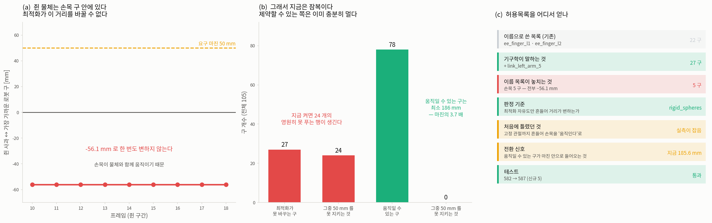

### 검증

| 무엇 | 결과 |
|---|---|
| 뽑아낸 구의 거리가 정말 불변인가 | **다른 씨앗**으로 5 회 재확인, `atol=1e-9` |
| 이름 목록이 놓치는 것이 있는가 | 있다 — 손끝이 아닌 링크 |
| 고정 관절을 흔들면 어떻게 되나 | 허용목록이 더 좁아진다 (위험한 방향) — 테스트로 고정 |
| 테스트 | **582 → 587** (신규 `tests/ag3s/test_rigid_spheres.py` 5 개) |

### 전체 틀에서 지금 어디인가 (규칙 B)

```
카메라 depth → [TSDF ★geom 채널 · ★decay] → ESDF ✓ 라벨 층
            → SQP 선형화 ✓ 쥔 물체 · ✓ 목적지 마진 → QP 해
                                         ○ self-collision (잠복 · 허용목록만 준비)
```

닫힌 것: **N1 의 판정** — 실재하나 잠복이고, 켤 때 쓸 허용목록은 준비됐다.
다음: **geometry 채널**(N2 — `min(depth, geom)`, E4 "격자 밖·미관측은 무조건 자유" 의 진짜 해결),
그 뒤 **frustum-aware decay**(F20).

---

## cuRobo 는 self-collision 을 어떻게 하는가 (2026-09-15, 사용자 질문)

원문 §6.2 와 `curobo_src` 소스를 직접 읽었다. **두 층으로 나뉘어 있고, 논문은 아래층만 다룬다.**

### 위층 — 어떤 쌍을 검사하는가: 손으로 쓴 무시 목록

`curobo/content/configs/robot/*.yml` 의 `self_collision_ignore` 가 (링크, 링크) 쌍을 이름으로
빼 준다. Franka 기준:

```yaml
self_collision_ignore:
  panda_hand:       [panda_leftfinger, panda_rightfinger, attached_object]
  panda_leftfinger: [panda_rightfinger, attached_object]
  panda_link6:      [panda_link7, panda_hand, attached_object, panda_leftfinger, panda_rightfinger]
  panda_link7:      [panda_hand, attached_object, panda_leftfinger, panda_rightfinger]
  ...
```

**쥔 물체는 `attached_object` 라는 가상 링크**다. 로봇 YAML 이 미리 자리를 잡아 둔다:

```yaml
extra_links:
  attached_object: {joint_name: attach_joint, joint_type: FIXED, parent_link_name: panda_hand}
extra_collision_spheres:
  attached_object: 4        # 구 슬롯 4 개를 예약해 둔다
```

그리고 그 가상 링크의 무시 목록이 **`panda_hand` · 양 손가락 · `panda_link6` · `panda_link7`**
이다 — 손 전체와 **그 앞의 팔 링크 둘**.

**이것이 우리가 실측으로 찾은 것과 같은 집합이다.** 우리 쪽에서 기구학이 "빼야 한다" 고 말한
것은 손끝 둘 + `link_left_arm_5`, 즉 손가락 + 그 앞의 팔 링크였다. **cuRobo 는 그것을 손으로
써 두고, 우리는 자유도에서 뽑는다** (`attached.rigid_spheres`).

우리 기존 이름 목록이 손끝 둘만 담고 `link_left_arm_5` 를 빠뜨린 것은, Franka 로 치면
`panda_link6` · `panda_link7` 을 빠뜨린 것과 같다 — cuRobo 가 명시적으로 넣어 둔 항목이다.

### 아래층 — 그 쌍들을 어떻게 빨리 계산하는가 (논문 §6.2)

논문이 다루는 것은 **병렬화뿐**이고 어떤 쌍을 볼지는 정하지 않는다. 기존 cuRobo 는 한
thread block 안에서 구를 공유 메모리에 올려 계산했는데, 쌍이 제곱으로 늘어난다 — **7-DoF
Franka 818 쌍 → 48-DoF 휴머노이드 162k 쌍**. 그래서 2 단 map-reduce 로 바꿨다:

1. 쌍을 블록에 나눠 각 블록이 자기 구를 공유 메모리에 올리고 **가장 깊이 파고든 쌍**으로 축약,
2. 블록 최댓값들을 다시 축약해 전역 최댓값.

측정치는 self-collision 5.1 μs (논문 Table).

### 쥔 물체의 기하 — 구지만 **하나가 아니다**

`AttachmentManager` 가 `fit_spheres_to_mesh` 로 채운다. 방식 셋:

| `SphereFitType` | 무엇 |
|---|---|
| `SURFACE` | 메시 표면을 고르게 샘플, 반지름 고정 |
| `VOXEL` | bbox 격자 + SDF 로 내부 복셀, 내접 반지름 |
| `MORPHIT` | 복셀 시딩 + Adam 최적화 |

**`SURFACE` 는 사실상 우리 점 기반과 같은 것**이다 — 표면을 고르게 샘플해 반지름 하나를 주는
것이고, 우리는 관측 점을 복셀로 솎아 반지름 0 을 준다. 다른 것은 **입력**이다: cuRobo 는 메시를
알고 우리는 관측만 있다. F19(쥔 물체를 단일 primitive 로 근사하면 여유를 13.2~23.7 mm 먹는다)가
잰 것은 **단일** 구였고, cuRobo 가 쓰는 것은 **여러** 구다. 모순이 아니다.

### 정리 — 우리와 무엇이 같고 무엇이 다른가

| | cuRobo | 우리 |
|---|---|---|
| 쥔 물체의 자리 | 가상 링크 `attached_object`, 고정 관절로 `panda_hand` 에 | `AttachedCollisionGeometry.parent_link` 를 타는 점들 |
| 기하 | 메시에 맞춘 **여러** 구 (슬롯 4 예약) | 관측 점을 10 mm 복셀로 (64~89 점) |
| 무시 목록 | 로봇 YAML 에 **이름으로 손으로** | `rigid_spheres` 로 **자유도에서 유도** |
| 무시 대상 | 손 + 양 손가락 + link6 + link7 | 손끝 둘 + `link_left_arm_5` — **같은 종류의 집합** |
| 쌍 계산 | GPU 2 단 map-reduce (162k 쌍까지) | **없다** (N1 — 잠복으로 확정) |
| 예약 슬롯 | `extra_collision_spheres: 4` | 행 수는 `reduction.rows_per_step` 이 고정 |

**우리에게 아직 없는 것은 아래층(쌍 계산)뿐이고, 위층(무시 목록)은 오히려 더 자동이다.**
켜는 날 필요한 것은 쌍 루프이지 목록이 아니다.

---

## 해석적 채널 (N2 · E4) — 아는 기하는 관측을 기다리지 않는다 (2026-09-15)

구분표의 3 번. cuRoboV2 §5.1 은 복셀마다 채널을 둘 두고 질의에서 `min(depth, geom)` 을 쓴다.
우리는 depth 채널 하나뿐이라 **아는 기하(벽·선반·테이블·바닥)를 넣을 자리가 없었고**, 그것이
E4(격자 밖·미관측은 무조건 자유)가 안 풀린 이유였다.

### 먼저 — 미관측이 얼마나 되고 무엇을 답하는가

`run_0004` 16 프레임, 3 카메라, 20 mm 복셀:

```
격자 (76, 90, 80) = 547,200 복셀
  점유   8,106   자유 176,238   미관측 362,856  (66.3 %)
로봇 구 질의 1,680 회 (16 프레임 × 105 구)
  격자 안 미관측에 떨어진 것   741  (44.1 %)
  그중 거리가 500 mm 로 포화   237  (32.0 %)   <- "안 보인다" 가 "반 미터 안전" 으로
```

그 237 회의 **참** 거리(정적 기하까지)는 최소 **168.7 mm**, 중앙 562 mm. 구 중심 기준 낙관
오차는 최대 **+219.5 mm** 였다. 가장 심한 것은 전부 `link_torso_0` — 카메라가 테이블을 보므로
로봇 몸통 주변은 한 번도 관측되지 않는다.

### 찍기(stamping)를 먼저 해봤고, **안 됐다**

정적 기하를 점유 격자에 찍는 `stamp_static` 을 만들어 돌렸다. 결과: **낙관 오차가 0.0 mm
줄었다.** 이유가 명확했다:

```
ESDF 격자   x [-300, 1200]  y [-900, 900]  z [0, 1600] mm
선반        y = -1550 ~ -1685                    <- 격자 밖
벽 4 장     x, y = ±3 m                          <- 격자 밖
바닥 평면   z = 0, 최하단 복셀 중심이 z = 10 mm   <- 한 칸도 안 찍힌다
실제로 찍힌 것   테이블 3,124 복셀 — **이미 관측된 것**
비용            프레임당 206 -> 615 ms
```

**고정 상자 구조에서는 찍기가 E4 를 풀지 못한다.** 중요한 기하가 격자 밖에 있는데 찍을 자리가
없기 때문이다. (cuRoboV2 는 block-sparse 라 블록을 어디든 할당할 수 있어 이 한계가 없다.)

### 그래서 **따로 잰다** — `min(복셀, 해석적)`

`EsdfField.static_shapes` 에 `StaticBox` / `StaticPlane` 을 실으면 `distance` 가
`min(복셀, 해석적)` 을 답한다. 복셀에 찍지 않으므로:

* **격자 밖에서도 걸린다** — 거기가 이 채널이 가장 필요한 자리다.
* **이산화 오차가 없다** — 해석적 거리는 정확하다.
* **비용이 오히려 줄었다** — 찍지 않으니 프레임당 226 → 141 ms.

**기울기도 같이 바꾼다.** 거리만 바꾸고 기울기를 두면 더 나쁘다 — 최적화기가 "가깝다" 는 값을
받고 엉뚱한 복셀 표면 쪽으로 밀린다. `analytic_gradient` 가 이기는 도형의 기울기를 낸다
(유한차분 대비 `atol=2e-4` 로 테스트 고정).

### 결과

```
구 중심 기준 낙관 오차 (필드 − 참), 질의 1,680 회
  채널 없이   중앙 -94.8 mm,  최대 **+219.5 mm**
  채널 있을 때 중앙 -94.8 mm,  최대 **+0.0 mm**
```

**낙관이 완전히 사라진다.** 그리고 `min` 이므로 답이 커질 수 없다 — **틀리는 방향이 안전한
쪽**이고, 테스트가 그것을 고정한다.

| 무엇 | 결과 |
|---|---|
| 최대 낙관 | **+219.5 → +0.0 mm** |
| 비용 | 226 → **141 ms/프레임** (찍기를 안 하므로 감소) |
| 격자 밖 질의 | 해석적 채널이 그대로 답한다 |
| 답이 커질 수 있는가 | 없다 (`min`) — 테스트로 고정 |
| **회귀 기준선** | **해소 14 / 개선 15 / feasible 8, violated 7 — 불변** |
| 테스트 | **587 → 593** (신규 `tests/ag3s/test_static_geometry.py` 6 개) |

`stamp_static` 은 격자 **안** 기하를 EDT 에 넣고 싶은 호출자를 위해 남겨 두었다.

### 아직 아닌 것

**도형을 누가 주는가는 주입이다.** 지금은 `EsdfBuilder.update(static_geometry=...)` 로 받을 뿐,
씬에서 자동으로 뽑지 않는다 — AG3S 는 무엇이 고정 기하인지 알 수 없고, 그것은 `phase` 나
목적지와 같은 계약이다. live 경로(`SafePolicy`)에 아직 배선하지 않았다.

### 시각화

**[`figures/analytic-channel.png`](figures/analytic-channel.png)** — 미관측 비율 · 낙관 오차
분포 · 찍기가 안 된 이유.

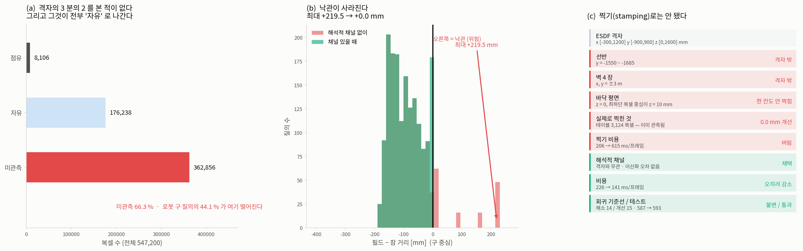

### 전체 틀에서 지금 어디인가 (규칙 B)

```
카메라 depth → [TSDF + ✓해석적 채널 · ★decay] → ESDF ✓ 라벨 층
            → SQP 선형화 ✓ 쥔 물체 · ✓ 목적지 마진 → QP 해
                                         ○ self-collision (잠복)
```

닫힌 것: **N2 와 E4 의 절반** — 아는 기하가 있으면 미관측·격자 밖에서도 참값을 답한다.
E4 의 남은 절반은 **모르는 기하**이고, 그것은 원래 이 기법 계열의 공통 근사다 (계획서의
cuRoboV2 발췌 참고).

남은 것: **frustum-aware decay**(F20 — 사라진 물체의 잔상이 8 프레임 뒤에도 남는다), 그리고
정적 기하를 live 경로에 주입하는 배선.

---

## Frustum-aware decay (F20) — 잊는 장치, 그리고 잊지 말아야 할 것 (2026-09-16)

구분표의 마지막. 우리 TSDF 가중치는 `min(w + 1, max_weight)` 로 **단조 증가**해서 옛 관측이
절대 흐려지지 않는다. 그래서 사라진 물체의 잔상이 남는다 — 실측: 사과가 원래 자리에서 302 mm
떠난 뒤에도 그 자리가 **-6.7 mm 로 점유**였고 8 프레임 내내 자유가 되지 않았다.

### 무엇을 넣었나

| 파일 | 무엇 |
|---|---|
| `esdf.py` `TsdfVolume.decay` | `w ← w·a_t·a_f` (절두체 안) / `w ← w·a_t` (밖) — cuRoboV2 §5.3 |
| `esdf.py` `TsdfVolume.frustum_mask` | 카메라가 **지금 보고 있는** 복셀. `integrate` 의 투영을 깊이 비교 전까지만 쓴 것 |
| `esdf.py` `occupancy(min_weight=)` | 가중치가 문턱 아래로 흐려진 복셀은 **다시 미관측** |
| `config.py` | `esdf.time_decay` · `frustum_decay` · `min_weight` (전부 끔이 기본값) |
| `esdf.py` `EsdfBuilder.update` | 적분 **뒤**에 감쇠 — 순서가 반대면 방금 본 것을 보기도 전에 지운다 |

### 재고 정했다 — 잔상 제거와 침식의 맞바꿈

`run_0004` 프레임 6~19, 머리 카메라, 20 mm 복셀. **잔상**은 사과의 원래 자리, **실제 표면**은
테이블 상판·바구니 벽·배(pear) 세 곳 중 가장 나쁜 값이다.

```
설정                   잔상이 자유가 된 프레임   실제 표면 최악   점유 복셀 변화
끔  (현재)                     0/9               +20.0 mm         +2.7 %
a_t 0.99 만                    0/9               +20.0 mm         +2.7 %   <- 무효
a_t 0.99 · a_f 0.5             7/9               +74.6 mm        -19.2 %   <- 침식
a_t 0.99 · a_f 0.8             2/9               +25.4 mm         +2.5 %   <- 권고
```

세 가지가 읽힌다.

1. **시간 감쇠만으로는 아무 일도 안 일어난다.** `a_t = 0.99` 를 9 프레임 곱해도 0.91 이라
   가중평균이 거의 안 움직인다. 잔상 곡선이 "끔" 과 **완전히 겹친다.**
2. **`a_f = 0.5`(cuRoboV2 예시값)는 우리 씬에서 과하다.** 잔상은 두 프레임 만에 지워지지만
   점유 복셀이 **19.2 % 사라지고** 실제 표면을 74.6 mm 멀다고 답한다. 이산화 바닥이 20 mm 인
   것을 생각하면 **54 mm 를 없는 여유로 지어낸 것**이다.
3. **`a_f = 0.8` 이 그 사이에 있다.** 잔상은 일곱 프레임 만에 지워지고, 실제 표면은 +25.4 mm
   (바닥 대비 5.4 mm), 점유 복셀은 오히려 +2.5 % 로 침식이 없다.

### 판정 — 기본값은 끔, 켤 때는 `a_t 0.99 · a_f 0.8`

**잔상은 보수적인 오류이고 침식은 위험한 오류다.** 잔상은 없는 장애물을 만들어 우회를 시키고,
침식은 있는 장애물을 지워 충돌을 허락한다. 그래서 **잔상 제거 속도를 침식과 맞바꾸지 않는다** —
`a_f = 0.5` 가 다섯 프레임 빨리 지우는 대가로 표면을 54 mm 지어내는 것은 나쁜 거래다.

기본값을 끔으로 두는 것도 같은 이유다. 우리는 카메라가 셋이고 프레임이 3 초라 **잊을 여유가
cuRoboV2 보다 적다** — 그쪽은 GPU 로 수십 Hz 를 돌리며 계속 다시 본다.

**전환 신호: 치운 자리를 다시 지나가는 경로.** 그런 롤아웃이 생기면 `a_f = 0.8` 로 켠다.

### 안 재본 것 — 시야를 벗어나는 장애물

이 롤아웃에서는 머리 카메라가 테이블을 내내 본다. **시야에서 완전히 벗어난 실제 장애물이
흐려져 미관측으로 돌아가는 경우**는 여기서 발동하지 않았고, 그것이 감쇠의 진짜 위험이다.
켜기 전에 그 씬에서 다시 재야 한다.

### 검증

| 무엇 | 결과 |
|---|---|
| 감쇠 끔 | 가중치가 그대로 (배열 동일) |
| 시간 감쇠 | 전 복셀에 곱해진다 |
| 절두체 감쇠 | **마스크 안에만** 곱해진다 — 비대칭이 요점 |
| `min_weight` | 흐려진 복셀이 `UNKNOWN` 으로 돌아간다 |
| `frustum_mask` | 좁은 시야에서 격자 일부만 고른다 · 깊이 범위로도 잘린다 |
| 설정 검증 | `(0, 1]` 밖과 음수 `min_weight` 를 거부 |
| 기본값 | 끔 — **판정이라 테스트로 고정** |
| **회귀 기준선** | **해소 14 / 개선 15 / feasible 8, violated 7 — 불변** |
| 테스트 | **593 → 601** (신규 `tests/ag3s/test_decay.py` 8 개) |

### 시각화

**[`figures/frustum-decay.png`](figures/frustum-decay.png)** — 잔상이 지워지는가 · 실제 기하가
살아남는가 · 판정표.

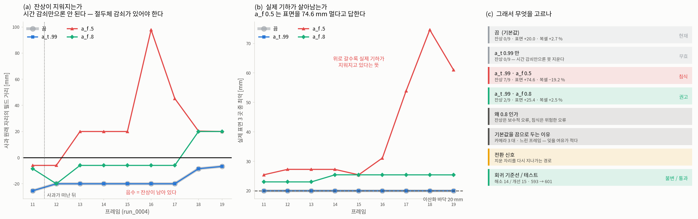

### 전체 틀에서 지금 어디인가 (규칙 B)

```
카메라 depth → [TSDF + ✓해석적 채널 + ✓감쇠(끔)] → ESDF ✓ 라벨 층
            → SQP 선형화 ✓ 쥔 물체 · ✓ 목적지 마진 → QP 해
                                         ○ self-collision (잠복)
```

**cuRoboV2 구분표의 네 항목이 모두 닫혔다.** 호출부(F17 잠금 + attach/detach) · self-collision
(잠복 판정 + 허용목록) · geometry 채널(해석적) · frustum decay(측정 후 값 확정).

남은 배선 둘: **정적 기하를 live 경로에 주입**하는 것과 **감쇠를 켤 값의 씬별 재측정**.
둘 다 주입 계약이라 `SafePolicy` 쪽 일이다.

---

## 정리 — 남은 것을 한 곳에 모았다 (2026-09-16)

다음 세션이 차갑게 읽고 이어갈 수 있도록 맨 위 표들을 지금 상태에 맞췄다.

### 표를 고친 것

* **진행 현황** — Step 8~11 이 아직 "대기" 로 남아 있었다. Step 8 완료(F15 · E2), **Step 9 는
  축소로 닫힘**(live 경로가 전부 `emit_candidates: False` 이고 쥔 물체도 점 기반이라 primitive
  피팅이 돌지 않는다), Step 10 대부분 완료(남은 것은 F10 하나), Step 11 진행 중(560 → 601).
  cuRoboV2 구분표 4 항목 행을 새로 넣었다.
* **누적 발견** — 덧붙인 내용이 **Step 칸**에 들어가 있던 세 행(F20 · N1 · N2)을 요약 칸으로
  옮겼다. 그리고 낡은 상태 넷을 갱신했다:
  * **E4**(격자 밖·미관측은 무조건 자유) — "백엔드 교체로 소멸 예정" → **절반 수정됨**.
    아는 기하는 해석적 채널로 풀렸고, 모르는 기하가 남는다.
  * **F19**(단일 primitive 가 여유를 먹는다) — 실측 완료 → **수정 완료**(점 기반).
  * **F12**(쥔 사과가 거리장에서 사라진다) — 원인 확정 → **해소**. 쥔 물체가 로봇 쪽
    질의점이 되었으므로 필드에서 빠지는 것이 이제 **옳은 동작**이다. 다만 아직 우연이다(A2).
  * **F13**(쥔 물체 식별의 양면 검사) — 신규 → **은퇴 예정**. 라벨 층이 대체한다.
* **새 절** — 맨 위에 **"최종 구현까지 남은 것"** 을 넣었다. A(배선) · B(안 재본 것) ·
  C(남은 발견) · D(되돌아올 지점) · E(범위 밖).

### 배선 하나를 마저 닫았다 — 정적 기하

`static_geometry` 가 `EsdfBuilder.update` 까지만 뚫려 있고 파이프라인이 안 받고 있었다.
`SafePolicy` → `pipeline._run` → `_build_esdf` → `EsdfBuilder.update` → `EsdfField.static_shapes`
로 이었다. `None` 이면 예전과 같이 돈다.

**남은 것은 도형을 누가 만들어 넘기는가 하나**이고, 그것은 주입 계약이라 코드로 닫을 수 없다.

검증: 테스트 **601 통과**, 회귀 기준선 **해소 14 / 개선 15 / feasible 8, violated 7 — 불변**.

### 전체 틀에서 지금 어디인가 (규칙 B)

```
카메라 depth → 로봇 마스크 → attention lifting ✓ → target grounding ✓ + 잠금 ✓
            → TSDF ✓해석적 채널 ✓감쇠(끔) → ESDF ✓라벨 층
            → SQP 선형화 ✓쥔 물체 ✓목적지 마진 → QP 해
                                        ○ self-collision (잠복)
```

닫힌 것: **기록이 지금 상태와 일치한다.** 다음 세션은 로그 맨 위의 **"최종 구현까지 남은 것"**
절만 읽으면 어디서부터 할지 안다 — 순서는 **A1 → A2 → A3 → B1** 이다.

---

## A1 — 정적 기하를 **누가 주는가** (2026-09-16)

로그 맨 위 "최종 구현까지 남은 것" 의 A1. 배선(`SafePolicy` → `pipeline` → `EsdfBuilder` →
`EsdfField.static_shapes`)은 2026-09-16 에 이미 뚫었고, 남은 것은 **도형 목록을 누가 만들어
넘기는가** 하나였다.

### 먼저 잰 것 — 씬에 무엇이 있고, 그것이 제약이 되는가

`run_0004` 15 프레임. MJCF 의 비-로봇 geom 1,336 개를 갈래로 나눴다
(`experiments/a1_static_scene_survey.py`):

```
자유물체 (free joint)   53   사과·바나나·귤·배·상자(목적지)   -> 버린다 (움직인다)
충돌 정적               16   바닥 1 · 테이블 5 · 선반 6 · 벽 4  -> 뽑는다
시각 전용 (con=0/0)     29   vis 복제 · 창 · 문틀 · 마커       -> 버린다
로봇                 1,238   자기 필터가 본다                  -> 버린다
```

뽑은 16 개에 대해 제약 모델(양팔 120 구)의 **여유거리**(`d − r − 50 mm`)를 재니:

```
table_top       -62.4 mm   <- 유일하게 음수. 사과를 집으러 내려가는 프레임 7~11
table_leg_*     +38 ~ +359 mm
floor          +758 mm
shelf_*        +963 ~ +1,232 mm
office_wall_*  +2,612 ~ +3,256 mm
```

**16 개 중 15 개는 이번 롤아웃에서 제약 행을 하나도 안 만든다 — 보험이지 비용이 아니다.**

세 가지가 여기서 확정됐다:

1. **`contype=0` 필터가 없으면 없는 장애물이 들어온다.** `left_ee_target`/`right_ee_target`
   은 정적 body 인데 **로봇 작업공간 한가운데 (0.5, 0, 0.5)** 에 있는 40 mm 시각 마커다.
2. **바닥·벽을 넣어도 못 푸는 행은 안 생긴다 — 단 제약 모델이 양팔일 때만.** 전신 194 구로
   재면 `base` −342.1 mm, `wheel_l/r` −107.9 mm 가 15 프레임 내내 상수로 깔린다. 그 위험은
   `build_constraint_robot_model(link_filter=ARM_LINKS)` 가 이미 막고 있고,
   **`--links all` 로 도는 순간 되살아난다.**
3. **월드 = base 로 봐도 된다** — `base` 가 44 프레임 동안 원점에서 **0.16 mm** 움직였다.
   베이스가 실제로 움직이면 깨지는 가정이므로 `T_world_base` 를 열어 뒀다.

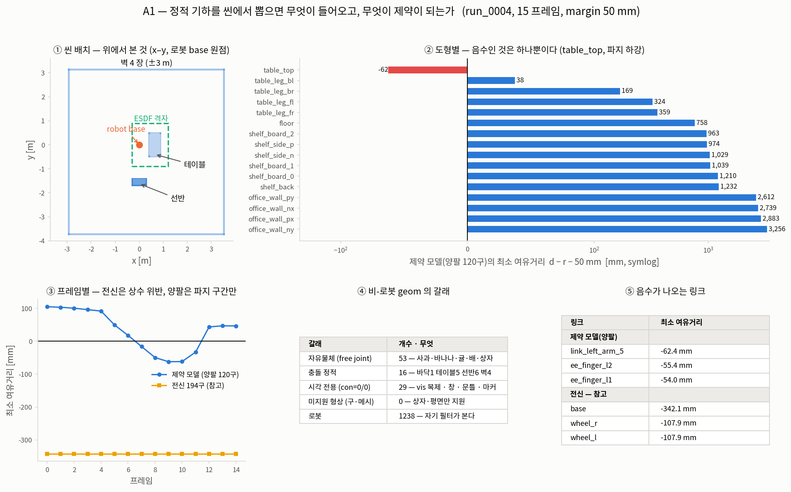

### 무엇을 넣었나

**`benchmark/ag3s/fields/static_scene.py`** (신규) — 출처 둘. 모듈 자체는 **순수 numpy** 이고
`mujoco` 임포트는 `from_mujoco` 안에서만 일어난다.

| 무엇 | 쓰임 |
|---|---|
| `from_mujoco(model, data, T_world_base=...)` | 시뮬. MJCF 가 정본이므로 거기서 뽑는다. `(shapes, SurveyStats)` — **버린 것도 센다** |
| `dump` / `load` / `to_jsonable` / `from_jsonable` | 실기. 배포 기계에 MuJoCo 가 없어도 돌아야 하므로 JSON 이 계약이다. `frame != "robot_base"` 면 **거절**한다 |
| `SurveyStats.unsupported` | 상자·반공간이 아니라 못 싣는 것(구·메시·캡슐). 말없이 빠지면 안 되므로 센다 |

**호출부 둘:**

* `trajopt/serve_safe.py` — `--static-geometry none|auto|PATH` (**기본 `none`**).
  `auto` 는 이미 받고 있는 `--model-xml` 에서 뽑는다. 도형이 0 개면 **멈춘다** (켰다고 믿은
  채 아무 효과가 없는 것이 가장 나쁜 결과다). `--links all` 과 함께 켜면 경고한다.
* `trajopt/experiments/esdf_rollout.py` — 같은 플래그. 회귀 대조를 위한 것.

**보기 파일 하나를 함께 넣었다**: `benchmark/ag3s/configs/static_geometry_transport.json` —
`model_transport.xml` 에서 뽑은 16 도형. 실기에서는 이 파일을 측량값으로 바꿔 쓰면 되고,
그것이 JSON 을 계약으로 둔 이유다.

`auto` 가 서버 머리말의 경고("서버는 자기 씬을 돌리지 않는다")에 걸리지 않는 이유: **정적
기하는 정의상 안 움직인다.** 움직이는 것(자유물체·로봇)은 `from_mujoco` 가 버린다.

### 검증 ① — 회귀 기준선

```
--static-geometry none :  해소 14 / 개선 15 / feasible 8, violated 7
--static-geometry auto :  해소 14 / 개선 15 / feasible 8, violated 7
```

15 프레임의 출력 JSON 을 필드 단위로 비교: **다른 값이 0 개** (시간 제외). 예측대로다 —
16 개 중 15 개가 758 mm 넘게 떨어져 있고, `table_top` 은 이미 관측돼 복셀 쪽이 더 조이므로
`min()` 이 복셀을 고른다.

### 검증 ② — 낙관 오차를 live 경로에서 다시 쟀다. **그리고 판정이 구 집합에 달려 있다**

`experiments/a1_static_geometry_effect.py`. 파이프라인을 **둘** 돌린다 (TSDF 가 누적이라 한
인스턴스로 껐다 켰다 하면 관측 이력이 갈라진다). 낙관 오차 = `필드 − 참(정적 기하)`,
양수면 필드가 아는 것보다 넓다고 말한 것이다.

| 구 집합 | 채널 끔 최대 낙관 | 채널 켬 | 낙관 질의 수 | 거리 포화 질의 |
|---|---|---|---|---|
| **양팔 120 구** (제약 모델이 쓰는 것) | **−14.7 mm** | −14.7 mm | 0 → 0 | 248 → 248 |
| 전신 194 구 (참고) | **+408.0 mm** | **+0.0 mm** | 765 → 0 | 675 → 435 |

**양팔에서는 낙관이 원래 0 이다.** 채널을 켜도 한 질의도 안 바뀐다 — 이 롤아웃에서 팔은
관측된 영역을 벗어나지 않는다. 낙관이 있는 곳은 몸통·베이스 주변이고, 머리 카메라가 테이블을
보므로 거기를 한 번도 안 본다.

**2026-09-15 의 "+219.5 → +0.0 mm" 는 몸통을 포함한 구 집합에서 잰 것이었다.** 그 수치를
인용할 때는 구 집합을 같이 적어야 한다 — 안 적으면 "제약 모델의 낙관이 사라졌다" 로 읽히고,
제약 모델에는 그 낙관이 애초에 없었다.

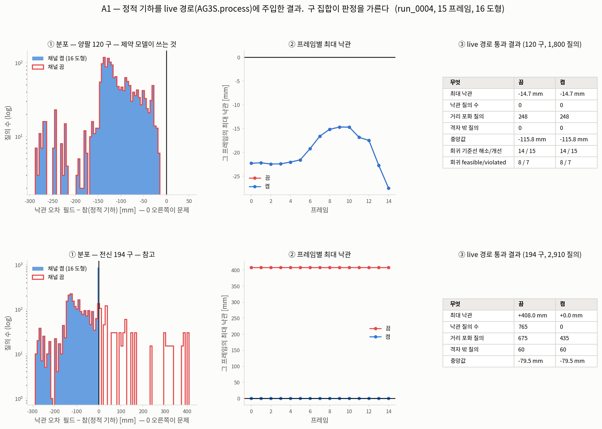

### 판정

**A1 은 닫혔다 — 코드로.** 도형을 만드는 출처가 둘 생겼고 live 경로가 둘 다 받는다.
**기본값은 `none`** — 켜는 것이 안전 방향(`min` 이라 답이 커질 수 없다)이지만, 어떤 도형이
들어왔는지 모르는 채 제약이 조용히 늘어나는 것보다 명시적으로 켜는 편이 낫다. 감쇠(F20)를
기본 끔으로 둔 것과 같은 규약이다.

**이 채널의 값어치는 이 롤아웃에서 0 이다** — 팔이 미관측 영역에 안 들어가기 때문이다.
**전환 신호: 제약 구가 미관측 영역에 들어가는 것** — 팔을 몸통 뒤로 돌리는 경로, 카메라가
못 보는 쪽 선반으로 뻗는 경로, 또는 `--links all`. 그때 채널 없이는 필드가 최대 +408 mm 를
낙관한다.

### 시각화

* **[`figures/a1-static-scene.png`](figures/a1-static-scene.png)** — 씬 배치도 · 도형별
  최소 여유거리 · 프레임별 추이 · 갈래표 · 링크별 최악표.
* **[`figures/a1-static-wiring.png`](figures/a1-static-wiring.png)** — 구 집합 둘 각각에 대해
  낙관 오차 분포 · 프레임별 최대 낙관 · 결과표.

### 검증 요약

| 무엇 | 결과 |
|---|---|
| 회귀 기준선 | **해소 14 / 개선 15 / feasible 8, violated 7 — 불변** (출력 필드 15 프레임 전부 동일) |
| 낙관 (양팔 120 구) | 원래 0 — 채널이 안 바꾼다 |
| 낙관 (전신 194 구) | **+408.0 → +0.0 mm**, 낙관 질의 765 → 0 |
| 테스트 | **601 → 609** (신규 `tests/ag3s/test_static_scene.py` 8 개) |

### 전체 틀에서 지금 어디인가 (규칙 B)

```
카메라 depth → 로봇 마스크 → attention lifting ✓ → target grounding ✓ + 잠금 ✓
            → TSDF ✓해석적 채널 ✓감쇠(끔) → ESDF ✓라벨 층
                     ↑ ✓정적 기하 주입 (A1 — 출처 둘, 기본 끔)
            → SQP 선형화 ✓쥔 물체 ✓목적지 마진 → QP 해
                                        ○ self-collision (잠복)
```

닫힌 것: **A1** — "무엇이 고정 기하인가" 라는 주입 계약이 코드로 표현됐다. 시뮬은 MJCF 에서,
실기는 JSON 에서 온다.

다음: **A2**(쥔 물체가 필드에서 빠지는 것을 우연에서 의도로 — 지금은 자기 필터의 과잉 삭제
덕에 우연히 빠진다) → **A3**(성공 판정 주입 — 잠금의 **풀기**가 `placed_fn` 을 받도록 열려
있으나 아무도 안 넘긴다) → **B1**(감쇠를 시야 밖 장애물에서 재기).

---

## 정적 기하가 이 과제에 필요한가 — **아니다** (2026-09-16, 사용자 지적)

사용자 지적: *"사과를 바구니에 담는 작업은 정적 기하를 몰라도 된다. 손목·머리 카메라가 못 보는
경로로 궤적을 그릴 일이 거의 없다."*

**맞다. 실측으로 확정했다.**

### 앞선 측정의 구멍

A1 검증 ②(`a1_static_geometry_effect.py`)는 제약 모델(양팔 120 구)에서 낙관이 0 이라고 했지만
**각 프레임의 실행된 자세 하나(`q_now`)만** 봤다. 최적화기가 제약을 거는 것은 앞으로 **32 스텝을
내다본 계획 궤적 전체**다 (32 × 120 = 3,840 행/청크). 실행 궤적이 시야 안에 있어도 **계획
궤적이 시야 밖을 지나면** 최적화기는 "거기가 비었다" 는 답을 보고 그쪽으로 민다.

그래서 계획 지평 전체를 다시 쟀다 — `a1_horizon_visibility.py`.

### 결과 — 계획 지평까지 넣어도 낙관은 0 이다

`run_0004` 15 청크, **머리 카메라 하나만**(가장 불리한 조건), 정적 기하 **없이**:

| 무엇 | 질의 수 | 최대 낙관 | 낙관 질의 | 거리 포화 |
|---|---|---|---|---|
| 실행된 자세 하나 (`q_now`) | 1,800 | **−14.7 mm** | **0** | 248 |
| 정책 청크 32 스텝 (`reference`) | 57,600 | **−14.4 mm** | **0** | 7,780 |
| SQP 가 고친 청크 32 스텝 (실행될 것) | 57,600 | **−21.3 mm** | **0** | 7,692 |

**57,600 개 질의 중 단 하나도 낙관하지 않는다.** 최댓값이 음수라는 것은 필드가 **항상** 아는
정적 기하보다 가깝게 답했다는 뜻이다 — 이 과제에서 거리를 정하는 것은 관측된 테이블·과일·
상자이지 벽이나 선반이 아니다.

`reference` 보다 `optimized` 가 더 보수적이다 (−14.4 → −21.3 mm). 최적화기가 **시야 밖으로
빠져나가는 방향으로 밀지 않는다**는 뜻이고, 사용자 지적의 핵심이 그것이다.

### 포화 질의 7,780 개는 왜 문제가 아닌가

질의의 13.5 % 가 **거리 포화**(거리장이 `max_distance` 400 mm 에서 잘린 것 — "안 보인다" 가
"충분히 멀다" 로 읽히는 자리)에 떨어진다. 그런데 그 점들의 **참** 거리가 400 mm 보다도 멀다.
즉 **"안 보이지만 실제로도 멀다"** 이고, 포화가 거짓말을 하지 않았다. 팔이 도는 영역에서 가장
가까운 정적 기하는 테이블이고 테이블은 내내 관측된다.

### 판정 — 해석적 채널은 **잠복**이다

| | |
|---|---|
| 상태 | **잠복 결함이 아니라 잠복 기능.** 코드에 실재하나 이 과제·이 씬에서는 발동하지 않는다 |
| 기본값 | `none` — 이미 꺼져 있다. 바꿀 것 없다 |
| 이 과제에서의 값어치 | **0** — 회귀 기준선 불변(출력 필드 15 프레임 전부 동일), 낙관 질의 0 / 57,600 |
| 비용 | 안 켜면 0. 켜도 프레임당 141 ms 이고 `min` 이라 답이 커질 수 없다 |

**전환 신호 — 이 중 하나가 보이면 켠다:**

1. **베이스가 움직인다.** 지금 `base` 는 44 프레임 동안 원점에서 0.16 mm 움직였다. 이동
   베이스가 되는 순간 로봇은 어떤 카메라도 본 적 없는 공간으로 들어가고, 벽·선반이 살아난다.
2. **팔이 관측 영역 밖으로 뻗는다.** 몸통 뒤, 카메라 반대쪽 선반. 지금은 전신 194 구로 재야
   낙관이 나오고(최대 +408.0 mm), 그 구들은 제약에서 이미 빠져 있다.
3. **`--links all`** 로 돌린다. 단 그때는 바닥이 바퀴·베이스에 못 푸는 행을 상수로 깐다.
4. **씬이 좁아진다.** 벽·선반이 팔의 작업 반경 안으로 들어오는 배치. 지금은 선반이 963 mm,
   벽이 2,612 mm 떨어져 있다.

### 그래도 코드를 남기는 이유

지우는 쪽이 아니라 **끄는 쪽**으로 둔다. self-collision(N1 — 잡힌 물체가 로봇 자신과 부딪히는
것을 아무도 안 본다)을 "켜면 영원히 못 푸는 행 24 개가 생긴다" 로 잠복 판정하고 허용목록만
준비해 둔 것과 **같은 처리**다. 전환 신호가 왔을 때 다시 만드는 비용보다 꺼 둔 채 두는 비용이
작고, 무엇보다 **전환 신호가 기록에 남아 있어야 나중에 알아챈다.**

### 시각화

**[`figures/a1-horizon-visibility.png`](figures/a1-horizon-visibility.png)** — 세 궤적의 낙관
오차 분포 · 청크별 최대 낙관 · 결과표. 세 곡선 모두 0 선 아래에 머문다.

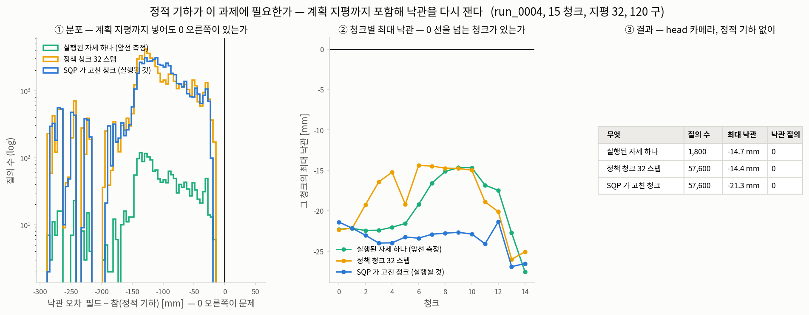

### 전체 틀에서 지금 어디인가 (규칙 B)

```
카메라 depth → 로봇 마스크 → attention lifting ✓ → target grounding ✓ + 잠금 ✓
            → TSDF ✓해석적 채널(잠복·끔) ✓감쇠(잠복·끔) → ESDF ✓라벨 층
            → SQP 선형화 ✓쥔 물체 ✓목적지 마진 → QP 해
                                        ○ self-collision (잠복)
```

닫힌 것: **"이 과제에 정적 기하가 필요한가" 에 수치로 답했다 — 필요 없다.** 잠복 셋(해석적
채널 · 감쇠 · self-collision)이 전부 전환 신호를 달고 꺼져 있다.

다음은 그대로 **A2**(쥔 물체가 거리장에서 빠지는 것을 우연에서 의도로) → **A3**(성공 판정
주입) → **B1**(감쇠를 시야 밖 장애물에서 재기).

---

## A2 — 쥔 물체를 필드에서 파낸다. 그리고 **전제가 틀렸다** (2026-09-17)

로그 맨 위 "최종 구현까지 남은 것" 의 A2. 적혀 있던 전제는 *"쥔 물체가 필드에서 빠지는 것은
자기 필터의 과잉 삭제라는 우연(F12)이고, 의도로 바꿔야 한다"* 였다. **그 전제가 측정으로
부정됐다.**

### 왜 빠져야 하는가 — 먼저 확인한 것

E3(쥔 물체가 optimizer 에 도달하지 않는다)의 소비부가 들어가면서 쥔 물체는 **로봇 쪽 질의점**이
됐다 (F19 에 따라 primitive 가 아니라 점 기반). 그러면 장애물 쪽에서는 빠져야 한다.

그리고 `trajopt/linearize.py` 의 `_esdf_clearance` 는 **쥔 물체 자신의 점에 완화를 주지 않는다**
(fail-closed 로 전체 마진 50 mm 를 채운다). 물체가 손에 강체로 붙어 있으므로 그 행은 **어떤
관절 해로도 못 푼다** — 바퀴가 바닥을 파고든 채 상수로 깔리던 것과 같은 종류다.

### 측정 ① — 자기 필터는 이 일을 하고 있지 않다

`run_0004` 24 프레임, **3 카메라**. 로봇 마스크만 다른 필드 둘을 나란히 돌렸다:

```
쥔 동안 보인 사과 픽셀      143,942   (손목 카메라 덕에 프레임당 16,000)
그중 마스크가 지운 것        100.0 %   <- F12 의 주장은 정확하다
그런데 안 지웠을 때
  점유 복셀 차이            최대 4 복셀
  쥔 물체 여유거리 차이      최대 18.3 mm, 그것도 **안전한 쪽으로**
```

**마스크를 걷어내도 사과는 필드로 안 돌아온다.** TSDF 가 가중평균이라 **움직이는 표면**은 어느
복셀에서도 점유로 뒤집힐 만큼 가중치를 못 모으고, 새 관측이 광선을 따라 앞쪽을 비워 옛 표면을
지우기까지 한다 (프레임 12 에서 여유거리가 −16.0 → **+2.3** 으로 좋아진 것이 그것이다).

**그래서 F12 의 상태를 정정했다** — 삭제는 사실이지만 그것이 원인은 아니다.

### 측정 ② — 진짜 문제는 잔상이고, 이미 일어나고 있다

쥔 9 프레임 중 **2 프레임(10, 11)에서 사과가 필드 안에 있다** (중심에서 −31.7 mm, −6.0 mm).
새로 적분된 사과가 아니라 **테이블에 놓여 있던 동안(프레임 0~9, 삭제 0 %) 남긴 표면**이다.
그 두 프레임에서 쥔 물체 질의점의 최악 여유거리가 **−72.7 mm · −72.1 mm**.

**잠복이 아니다** — `grasp_latch.py` + `SafePolicy._run_latch` 가 실제로 프레임 10 에 `attach`
를 부르므로 서빙 경로에서 이 행은 살아 있다.

### 수정 — 파내되, 팽창은 1 까지

`EsdfBuilder.update(attached_points=...)` 가 쥔 물체의 **지금 자리**를 점유에서 파낸다.
점은 parent link 프레임에 스냅샷돼 있으므로 `attached.attached_points_in_base` 가 FK 한 번으로
base 로 옮긴다 — **최적화기가 질의하는 것과 같은 점 집합**이어야 "질의점으로는 있고 장애물로는
없다" 가 성립한다.

**E1(조작 대상을 필드에서 파내면 손끝뿐 아니라 전신에게 사라진다)과 모순되지 않는다.** E1 이
금지한 것은 *아직 안 쥔* target 을 파내는 것이다. 쥔 뒤에는 로봇의 일부이고, 로봇을 depth 에서
지우는 것과 같은 처리다. 그래서 `attach()` 가 불린 뒤에만 돈다.

**그래도 E1 은 다시 확인해야 했다 — 그리고 실제로 걸렸다:**

| 팽창 | 쥔 물체 최악 | **권한 없는 링크의 낙관** | 파낸 복셀 |
|---|---|---|---|
| 없음 | −72.7 mm | — | — |
| 0 | −53.5 mm | +5.7 mm | 9 |
| **1 (채택)** | **−34.2 mm** | **+5.7 mm** | 29 |
| 2 | −22.1 mm | **+64.5 mm** ← E1 재발 | 67 |
| 3 | −12.0 mm | +73.5 mm | 125 |

**팽창 2 에서 절벽이 있다.** 거기서부터 파내기가 손가락·팔이 실제로 봐야 할 표면(상자 테두리)
까지 먹고, 권한 없는 링크가 마진(50 mm)보다 큰 낙관을 얻는다. **팽창 1 이 상한이다** —
얻는 것 38.5 mm, 잃는 것 5.7 mm (복셀 크기의 1/4).

`attached_dilate_voxels: int = 1` 이 그래서 기본값이다. **측정으로 정한 값이지 추측이 아니다.**

### 남는 것

팽창 1 에서도 프레임 10~11 이 −34.2 mm 로 남는다. 그 잔여는 사과 자신이 아니라 **파지 순간
사과가 테이블에 실제로 가까운 것**이다 — 실재하는 제약이므로 지워서는 안 된다. 프레임 14·18 의
−6.5 / −24.4 mm 는 **상자(목적지)** 이고, 이 측정이 전역 마진 50 mm 를 쓴 탓이다. 실제
파이프라인은 F18(목적지에는 얇은 마진 20 mm)로 그것을 다룬다.

### 측정 중에 한 번 틀렸다

합성 판으로 만든 첫 테스트에서 "팽창 0 이면 한 복셀도 안 파인다" 가 나와 **팽창이 필수**라고
적을 뻔했다. 원인은 판이 이미지 **가장자리에서 절반 잘린** 것이었고, 판을 광축으로 옮기니
팽창 0 에서도 파였다. 합성 씬의 기하를 확인하지 않으면 그 씬의 결함을 코드의 성질로 읽는다.

### 검증

| 무엇 | 결과 |
|---|---|
| **회귀 기준선** | **해소 14 / 개선 15 / feasible 8, violated 7 — 불변** (`attach` 를 안 부르는 경로라 `attached_points` 가 `None`) |
| 쥔 물체 최악 여유거리 | **−72.7 → −34.2 mm** (팽창 1) |
| 권한 없는 링크 낙관 | **+5.7 mm** (팽창 2 는 +64.5 로 기각) |
| 테스트 | **609 → 615** (신규 `tests/ag3s/test_attached_carve.py` 6 개) |

### 시각화

**[`figures/a2-field-exception.png`](figures/a2-field-exception.png)** — 사과가 필드 안인가 ·
자기 자신에게 부딪히는가 · 팽창 맞바꿈 · F12 재현.

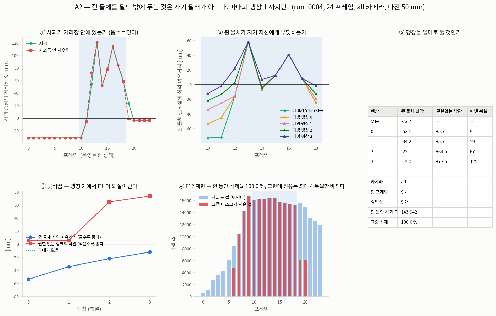

### 전체 틀에서 지금 어디인가 (규칙 B)

```
카메라 depth → 로봇 마스크 → attention lifting ✓ → target grounding ✓ + 잠금 ✓
            → TSDF ✓해석적 채널(잠복·끔) ✓감쇠(잠복·끔) → ESDF ✓라벨 층 ✓쥔 물체 파내기
            → SQP 선형화 ✓쥔 물체 ✓목적지 마진 → QP 해
                                        ○ self-collision (잠복)
```

닫힌 것: **A2** — 쥔 물체가 필드에서 빠지는 것이 이제 **의도**다. 그리고 그것이 왜 우연이
아니었는지(F12 정정)와 얼마까지 파내도 되는지(팽창 1, E1 절벽)가 수치로 남았다.

다음: **A3**(성공 판정 주입 — 잠금의 **풀기**가 `placed_fn` 을 받도록 열려 있으나 아무도 안
넘긴다) → **B1**(감쇠를 시야 밖 장애물에서 재기).

---

## A3 — 잠금의 **풀기**에 성공 판정을 주입한다 (2026-09-17)

로그 맨 위 "최종 구현까지 남은 것" 의 A3. `GraspLatch` 의 풀기는 두 갈래인데 — 외부가 주는
**성공 판정**(`placed`)과 그리퍼가 2 프레임 연속 열려 있는 **폴백** — `SafePolicy(placed_fn=...)`
가 열려 있어도 넘기는 호출자가 없어 **폴백만 돌고 있었다.**

### A2 가 이 항목의 비용을 바꿨다

A2(쥔 물체를 필드에서 파낸다) 전에는 detach 가 늦어도 쥔 물체가 질의점으로 남을 뿐이었다.
**A2 이후로는 늦은 detach 가 필드를 계속 파낸다** — 그것도 손을 따라다니는 구멍으로. 팔이
"거기는 비었다" 는 답을 받는다. 실측 **팔 구 낙관 최대 +19.7 mm** (프레임 30~37).

### 측정 — 폴백은 1 프레임 늦을 뿐이다

`run_0004` 44 프레임, 3 카메라 (`experiments/a3_release_signal.py`):

| 무엇 | 값 |
|---|---|
| 성공 판정 첫 참 (참값 자세) | **프레임 19** |
| 그리퍼 폴백 발동 | **프레임 20** |
| 차이 | **1 프레임** |
| 성공 판정 깜빡임 | **0 / 25 프레임** |
| detach 가 영영 안 올 때 팔 낙관 | **최대 +19.7 mm** |

세 조건의 여유도 넉넉하다 — 수평 **16.1 mm** 대 문턱 82, 손–사과 **120.7 mm** 대 80.
**이 롤아웃에서 폴백은 제대로 동작한다.** `placed_fn` 의 값어치는 정확도가 아니라 **보험**이다.

### 넣은 것

**`benchmark/trajopt/placed.py`** (신규) — `destination_placement(robot_model=..., below_rim=...)`
가 `placed_fn(scene, constraint_set) -> bool` 을 만든다. **관측만 쓴다** (MuJoCo 참값 없음):

* **쥔 물체가 지금 어디인가** — `attached_points_in_base` (A2 가 만든 것). 최적화기가 질의하는
  것과 **같은 점 집합**이다.
* **목적지가 어디인가** — 거리장의 **라벨 층**. `destination_extent` 가 목적지로 라벨된 복셀의
  축정렬 범위를 읽는다. 따로 기하를 주입받지 않는다 — 라벨 층이 거리장의 익명을 푼 덕분이다.

판정은 `(쥔 물체가 목적지 수평 범위 안) ∧ (테두리보다 below_rim 아래)` 이고, 질의점의 절반
이상이 만족해야 한다 (점 하나로 판정하면 잡티가 뒤집는다).

**세 번째 조건 "손에서 이탈" 은 여기서 못 잰다.** `attached` 는 파지 순간의 스냅샷이고 손에
강체로 붙어 있어 손과의 거리가 **정의상 안 변한다.** 관측으로 보려면 물체를 다시 찾아야 하고,
그러면 F17(조작 대상 식별에 에피소드 상태가 없다)이 잠금을 만든 이유로 되돌아간다.

**그래서 `GraspLatch` 를 한 줄 고쳤다** — `placed` 는 **그리퍼가 닫혀 있는 동안 풀지 않는다**:

```python
placed_now = bool(placed) and not closed
if placed_now or self._open_streak >= cfg.release_frames:
```

이것이 없으면 물체가 바구니 **위를 지나는 순간** 아직 쥔 채로 detach 되고, 쥔 물체가 장애물로
되돌아온다 (E3 — 쥔 물체가 optimizer 에 도달하지 않는다 — 가 만들던 구멍). 기하는 주입이
답하고 이탈은 그리퍼가 답하며, 잠금이 둘을 **AND** 로 묶는다.

**호출부**: `trajopt/experiments/safe_replay.py` 에 `--placed-fn none|destination`
(**기본 `destination`**). live 경로는 여전히 주입 — 바구니의 내경과 테두리는 과제를 아는 쪽만
안다 (A1 의 정적 기하와 같은 계약).

### 검증 — 참조 구현이 참값과 **정확히** 일치한다

같은 롤아웃에서 참조 구현을 그 프레임의 관측으로 돌렸다:

```
성공 판정 (참값 자세)   프레임 19
참조 구현 (관측)        프레임 19      <- 차이 0 프레임
깜빡임                  0 프레임
쥔 동안(10~18) 발동     없음           <- 쥔 채로 풀리지 않는다
```

| 무엇 | 결과 |
|---|---|
| **회귀 기준선** | **해소 14 / 개선 15 / feasible 8, violated 7 — 불변** (A2 에서 확인, 이 변경은 `SafePolicy` 경로에만 닿는다) |
| `safe_replay` end-to-end | 6 청크 통과, 그리퍼·형태 불변 |
| 참조 구현 대 참값 | **0 프레임 차이, 깜빡임 0** |
| 테스트 | **615 → 624** (신규 `tests/trajopt/test_placed.py` 9 개) |

### 시각화

**[`figures/a3-release-signal.png`](figures/a3-release-signal.png)** — 세 조건의 추이 ·
세 신호(attach · 성공 판정 · 참조 구현 · 그리퍼 폴백)의 시점 · 늦은 detach 의 낙관 · 결과표.

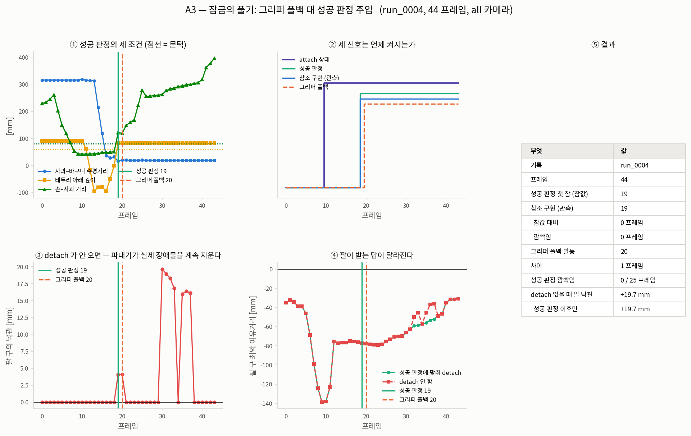

### 전체 틀에서 지금 어디인가 (규칙 B)

```
카메라 depth → 로봇 마스크 → attention lifting ✓ → target grounding ✓ + 잠금 ✓걸기 ✓유지 ✓풀기
            → TSDF ✓해석적 채널(잠복·끔) ✓감쇠(잠복·끔) → ESDF ✓라벨 층 ✓쥔 물체 파내기
            → SQP 선형화 ✓쥔 물체 ✓목적지 마진 → QP 해
                                        ○ self-collision (잠복)
```

닫힌 것: **잠금의 세 조각(걸기 · 유지 · 풀기)이 전부 찼다** — F17(조작 대상 식별에 에피소드
상태가 없다)이 지목한 구조가 완성됐다. 그리고 **A 절(배선)이 전부 닫혔다.**

다음: **B1**(감쇠를 시야 밖 장애물에서 재기 — `run_0004` 에는 시야를 완전히 벗어나는 장애물이
없어서 F20 의 권고값 `a_t 0.99 · a_f 0.8` 을 확인할 수 없었다).

---

## 작업 완료 판정 — 선택지 셋을 잰다 (2026-09-17)

A3 에서 **하나를 구현해 배포했고**, 사용자가 둘을 제안했다. 셋을 같은 기록(`run_0004`)에서
같은 질문으로 재어 고를 수 있게 남긴다. **코드는 A 만 있다** — B·C 는 아직 설계다.

재현: `experiments/a3_release_signal.py` (A) · `experiments/a4_task_tsdf.py` (C) ·
`experiments/a5_completion_options.py` (표).

### 세 안

| | **A — 지금 (배포됨)** | **B — object relation** | **C — 작업용 TSDF 분리** |
|---|---|---|---|
| 판정식 | `Inside ∧ 그리퍼 열림` | `Inside ∧ Detached ∧ Stable` | attention 을 TSDF 에 적고 위치 변동·안착으로 판정 |
| 쥔 물체 | 파지 순간 **스냅샷** (손에 강체로 용접) | 프레임마다 다시 잡는 **점구름** | TSDF 의 점유 복셀 |
| 목적지 | 거리장 라벨 층의 **AABB** | attention 으로 올린 점구름 + 내부 volume | TSDF 에 적힌 attention |
| 코드 | `trajopt/placed.py` + `grasp_latch` + `safe_replay --placed-fn` | 없음 | 없음 |

### 네 관계를 누가 답하는가 — 그리고 무엇이 측정됐나

| 관계 | A | B | C | **측정된 사실** |
|---|---|---|---|---|
| **Attached** (쥐었나) | 그리퍼 = 파지의 **명령** | 움직임 상관 = 파지의 **결과** | 안 됨 | 이동 중 TSDF **0 복셀** (6 프레임 연속) / 강체 파지 어긋남 중앙 **0.8 mm** |
| **Inside** (안에 있나) | AABB | 내부 volume | attention 영역 | AABB 는 회전한 목적지에 헐거워진다 |
| **Detached** (놓았나) | **잴 수 없음** → 그리퍼가 대신 | 움직임 상관 | 옛 자리가 빈다 | 옛 자리 **84 → 61** (감쇠 켜도 27 % 만) |
| **Stable** (멈췄나) | 없음 | 위치 변화 | 점유가 다시 쌓인다 | **0 → 168 복셀** — TSDF 의 특기 |

### A — 배포된 것. 무엇이 확인됐고 무엇을 못 잡나

`run_0004` 44 프레임 3 카메라:

```
성공 판정 (참값 자세)   프레임 19
참조 구현 (관측)        프레임 19      <- 차이 0 프레임, 깜빡임 0 / 25
그리퍼 폴백             프레임 20      <- 1 프레임 늦다
```

**이 롤아웃에서 A 는 충분하다.** 못 잡는 것은 셋이고 전부 그리퍼가 거짓말하는 경우다 —
빈손 파지 · 옮기다 미끄러짐 · 놓았는데 안 열림. 그때의 손해는 A2(쥔 물체를 필드에서 파낸다)
때문에 커졌다: **파내기가 손을 따라다니는 유령 구멍이 되고, 팔 구 낙관 최대 +19.7 mm.**

### B — 측정이 뒷받침하는 것과, 말해지지 않은 전제

| 잰 것 | 값 | 뜻 |
|---|---|---|
| 쥔 동안 보인 사과 픽셀 | **143,942** (프레임당 약 16,000) | 추적할 재료는 충분하다 |
| 그중 자기 필터가 지운 것 | **100.0 %** | **지금은 하류에 사과가 없다** — 마스크를 고쳐야 B 가 가능하다 |
| 강체 파지 어긋남 (E3 실측) | 손 319 mm 이동 중 중앙 **0.8 mm** | 움직임 상관으로 `Attached` 판정이 성립한다 |
| 놓은 뒤 사과 재관측 | d@중심 **−4.1 mm** | `Stable` 판정이 성립한다 |

**전제 하나가 명시되지 않았다**: 로봇 마스크에서 쥔 물체를 빼야 한다. 그게 지금까지 위험했던
이유는 빼면 사과가 장애물 필드로 들어와 **자기 자신에게 부딪히기** 때문이고, **A2 가 그것을
풀었다** (명시적 파내기, 팽창 1; 팽창 2 에서 E1 — 조작 대상을 파내면 손끝뿐 아니라 전신에게
사라진다 — 이 재발한다).

### C — 비용 주장은 맞고, 분리 근거는 제안보다 강하다. 그러나 2 번이 안 된다

`a4_task_tsdf.py`, 부피 셋(마스크·감쇠만 다름), `run_0004` 24 프레임 3 카메라:

```
사과를 따라다니는 상자의 점유 복셀
  놓여 있을 때 (0~10)    83~84
  옮기는 중   (12~17)    0  0  1  0  0  0     <- 여섯 프레임 연속 0
  놓인 뒤     (19~23)    121 → 168

사과의 옛 자리
  감쇠 끔                84 → 71   (−15 %)
  감쇠 켬 (0.99 · 0.8)   84 → 61   (−27 %)    <- 2 배 빠르지만 안 비운다

바구니 안 점유
  575 → 719 (+144)  그런데 프레임 15 에 이미 708   <- 놓기(19) 보다 4 프레임 먼저
```

* **2 번(움직임으로 pick 완료)은 문자 그대로 안 된다** — 프레임당 16,000 픽셀로 보이는데도
  TSDF 에 0 복셀이다. TSDF 는 정지한 씬을 시간에 걸쳐 **평균 내는** 자료구조이고, 프레임 간
  변화를 지우는 것이 그 일이다. A2 에서 "마스크를 걷어도 점유가 4 복셀만 바뀐다" 로 잰 것과
  같은 현상이다.
* **뒤집은 형태(옛 자리가 빈다)도 약하다** — 감쇠를 F20(사라진 물체의 잔상이 8 프레임 뒤에도
  남는다)의 권고값으로 켜도 27 % 만 준다. "비었다" 문턱을 세울 수 없다.
* **4 번(안착)의 소박한 형태는 오염된다** — 바구니 점유 증가의 대부분이 **카메라가 바구니를
  점점 더 많이 본 것**이지 사과가 아니다.

**비용**: 적분 64 ms / 갱신 전체 134 ms = **48 %**. 작업용 TSDF 는 거리장(ESDF)이 필요 없고
점유와 라벨만 있으면 되므로 절반 값이다. **사용자의 "비싸지 않다" 는 맞다.**

**분리 근거는 제안보다 강하다** — 두 부피는 **정반대 요구**를 가진다:

| | 장애물용 | 작업용 |
|---|---|---|
| 감쇠 | 잔상이 **안전**하다 (없는 것을 피한다). 침식이 위험 | 잔상이 **거짓말**이다. 빨리 잊어야 한다 |
| 쥔 물체 | **빼야** 한다 (A2) | **넣어야** 한다 (판정 대상이므로) |
| 범위·해상도 | 작업공간 전체 | 물체 크기면 충분 |

**하나의 부피로 둘 다 만족시킬 수 없다.** 지금 코드가 그 충돌의 산물이다 — A2 에서 쥔 물체를
파내야 했고, F20 의 감쇠는 켜지 못한 채 기본 끔으로 두고 있다.

### 측정이 가리키는 조합

`Stable`(멈췄나)은 **TSDF 의 특기**다. 위 수치가 그대로 보여준다 — 움직이는 동안 0 복셀,
멈춘 뒤 121 → 168. **"물체가 TSDF 에 다시 나타났다" 가 곧 "멈췄다"** 이고, 안정성을 재는
장치를 따로 만들 필요가 없다.

```
정지 국면 (집기 전 · 놓은 뒤)  →  TSDF + 라벨 층   : 어디에 무엇이 있나, 멈췄나
이동 국면 (옮기는 중)          →  점구름 추적       : 어디로 움직이나, 손과 붙었나
```

**주의 — 위 측정의 깨끗한 신호(사과를 따라다니는 상자)는 참값 위치를 눈금자로 썼다.** 실제
시스템에는 그것이 없고, "사과가 어디 있나" 를 찾는 것이 곧 추적 문제다. 그래서 C 단독으로는
4 번도 못 닫는다 — **추적이 "어디" 를 주고 TSDF 가 "멈췄나" 를 답하는** 분업이 필요하다.

### 아직 고르지 않았다

셋은 배타적이지 않다. **A 는 이미 돌고 있고**, B 는 A 의 `placed_fn` 계약을 **같은 자리에서
더 나은 구현으로 바꾸는 것**이며(SafePolicy·잠금을 안 고쳐도 된다), C 는 B 의 `Stable` 을
싸게 대주는 부품이다.

**공통 선행 조건이 하나다**: 이 롤아웃에서는 A 와 B 가 **똑같이 프레임 19** 라 구별되지
않는다. B·C 의 값어치는 **실패 케이스가 있는 기록에서만 보인다** — 빈손 파지 · 미끄러짐 ·
안 열리는 그리퍼. B1(감쇠를 시야 밖 장애물에서 재기)도 새 기록을 기다리고 있으므로,
**새 롤아웃을 뜰 때 두 요구를 같이 넣는다.**

### 시각화

* **[`figures/a5-completion-options.png`](figures/a5-completion-options.png)** — 세 안의 비교표.
* **[`figures/a4-task-tsdf.png`](figures/a4-task-tsdf.png)** — C 의 단계별 실측.
* **[`figures/a3-relation-design.png`](figures/a3-relation-design.png)** — A 와 B 의 파이프라인 도식.
* **[`figures/a3-release-signal.png`](figures/a3-release-signal.png)** — A 의 검증.

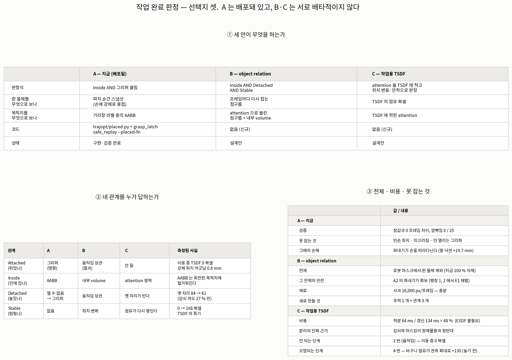

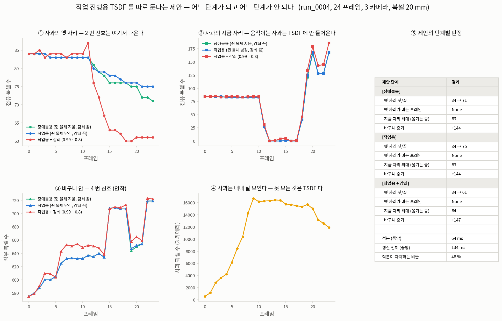

### 전체 틀에서 지금 어디인가 (규칙 B)

```
카메라 depth → 로봇 마스크 → attention lifting ✓ → target grounding ✓ + 잠금 ✓걸기 ✓유지 ✓풀기(A)
            → TSDF ✓해석적 채널(잠복·끔) ✓감쇠(잠복·끔) → ESDF ✓라벨 층 ✓쥔 물체 파내기
                     ★ 작업용 TSDF 분리 (C — 설계)     ★ 점구름 추적 (B — 설계)
            → SQP 선형화 ✓쥔 물체 ✓목적지 마진 → QP 해
                                        ○ self-collision (잠복)
```

닫힌 것: **세 안이 같은 눈금으로 재어졌다.** A 는 배포·검증됐고, B·C 는 무엇이 되고 무엇이
안 되는지가 수치로 남았다. **고르는 것은 다음 판정이고, 그 전에 실패 케이스가 있는 기록이
필요하다.**

---

## 실패 케이스 롤아웃을 각본으로 떴다 (2026-09-18)

두 항목이 **기록이 없어서** 막혀 있었다:

* **B1** — 감쇠(F20: 사라진 물체의 잔상이 8 프레임 뒤에도 남는다)를 **시야를 완전히 벗어나는
  장애물**에서 재야 권고값 `a_t 0.99 · a_f 0.8` 을 켤 수 있다. `run_0004` 는 머리 카메라가
  테이블을 내내 봐서 그런 장애물이 없다.
* **완료 판정 A·B·C 선택** — 셋이 `run_0004` 에서 **똑같이 프레임 19** 라 구별되지 않는다.
  차이는 **그리퍼가 거짓말하는 경우에만** 드러난다.

### 무엇을 넣었나

**`benchmark/ag3s/experiments/sources/record_scripted.py`** (신설). 정책 체크포인트 없이 뜬다 —
`run_0004` 의 **관절 궤적을 본보기로** 삼아 위치 액추에이터로 같은 자세를 따라가게 하고,
시나리오마다 한 군데만 바꾼다. **물리는 MuJoCo 가 푼다** — 그래야 사과가 실제로 떨어지고
빈손이 닫힌다.

**포기한 것은 attention 이다.** 정책이 없으므로 정책 이미지는 렌더한 것이고 attention 맵은
없다. `meta.json` 에 `scripted: true` · `policy_model: null` 을 박았다 — 지우면 이 기록이
나중에 실측 롤아웃인 척하게 된다. **grounding·attention 검증에 쓰면 안 된다.**

### 뜬 것 — 넷, 각 24 스텝 (약 4.6 MB)

| 기록 | 시나리오 | 무엇을 바꿨나 | 물리가 낸 결과 (실측) |
|---|---|---|---|
| `records/run_0000` | `baseline` | 없음 | 파지 10 (폭 90 → 65.6), 사과 z **0.850 → 1.027**, 놓기 19~20, 상자 안 **0.860** 안착 |
| `records/run_0001` | `empty_grasp` | 사과를 +80 mm 옮겨 손이 빗나가게 | 그리퍼가 **0.0 mm 로 닫힌다**(아무것도 안 막는다), 사과 z 0.850 **불변**, 손–사과 **418 mm** 까지 멀어짐 |
| `records/run_0002` | `slip` | 스텝 14~15 에 그리퍼를 잠깐 연다 | 사과가 z 1.009 에서 **떨어진다** → 0.850, 손–사과 37 → **284 mm**. 이후 그리퍼는 다시 0.0 mm 로 닫힌 채 "쥔 줄 안다" |
| `records/run_0003` | `head_away` | 스텝 12 부터 머리를 돌린다 | 작업은 정상 완료, **씬 픽셀 38,826 → 0** (스텝 13 부터 끝까지) |

`baseline` 이 본보기를 재현한다 — 각본 재생이 원본과 같은 동작을 낸다는 대조군이다.

### 측정 중에 두 번 틀렸고, 둘 다 실행해서 잡았다

**① 그리퍼 목표를 달성값으로 줬다.** 본보기의 `qpos` 는 손가락이 사과에 막혀 멈춘 **결과**
(66 mm)다. 그걸 목표로 주면 쥐는 힘이 0 이라 **사과가 안 들린다** — 실측으로 z 가 0.850 에서
한 번도 안 움직였다. 본보기가 닫힌 구간에서는 **완전 닫힘**을 명령해야 사과가 손가락을 멈춘다.

**② 그리퍼 부호가 반대였다.** `gripper_finger_l1` 의 범위는 `[-0.05, 0]` 이고 폭은 `l2 - l1`
이라 **더 음수인 쪽이 열림**이다. `ctrlrange[0]` 을 열림으로 읽었더니 파지 구간에서 그리퍼가
**100 mm 로 활짝 열렸다.**

**③ 머리 요(yaw)만 돌려서는 시야가 안 비었다.** `head_0` 의 관절 한계가 0.523 rad(30 도)이고
카메라 시야가 90 도다. 실측: 테이블이 24,816 → 15,700 px 로 줄 뿐이고 **오렌지는 오히려
늘었다**(500 → 1,029). 요와 피치를 **함께** 한계까지(`head_0 0.523`, `head_1 −0.35`) 줘야
테이블·상자·과일이 전부 0 px 이 된다.

**세 번 다 "안 되는 것을 된 것으로 기록할 뻔한" 경우**다. 각본 기록은 원하는 그림을 만들기
쉬우므로, **의도한 물리가 실제로 일어났는지를 기록마다 수치로 확인**해야 한다.

### 검증

| 무엇 | 결과 |
|---|---|
| 네 기록이 `load_run` · `replay_scene` 로 열리는가 | **통과** (관절 이름·`nq` 일치 검사 포함) |
| `baseline` 이 본보기를 재현하는가 | 파지·상승·놓기·안착이 `run_0004` 와 같은 스텝에서 |
| `empty_grasp` 가 **빈손 파지**를 만드는가 | 그리퍼 0.0 mm, 사과 불변 — **그리퍼는 "쥐었다" 고 말한다** |
| `slip` 이 **놓침**을 만드는가 | 사과가 이송 중 낙하 (z 1.009 → 0.850) |
| `head_away` 가 **시야 밖**을 만드는가 | 씬 픽셀 **38,826 → 0**, 스텝 13 부터 끝까지 |
| 테스트 | **624 통과 — 불변** (파이프라인 코드를 안 건드렸다) |

### 전체 틀에서 지금 어디인가 (규칙 B)

```
카메라 depth → 로봇 마스크 → attention lifting ✓ → grounding ✓ + 잠금 ✓걸기 ✓유지 ✓풀기(A)
            → TSDF ✓해석적 채널(잠복·끔) ✓감쇠(잠복·끔 — ★ 이제 잴 기록이 있다)
            → ESDF ✓라벨 층 ✓쥔 물체 파내기
            → SQP 선형화 ✓쥔 물체 ✓목적지 마진 → QP 해
                                        ○ self-collision (잠복)
```

닫힌 것: **막혀 있던 두 항목의 선행 조건**이다. B1 과 완료 판정 선택이 이제 **잴 수 있는
상태**가 됐다.

다음 둘은 이 기록으로 바로 잰다:

1. **B1** — `run_0003`(`head_away`)에서 감쇠를 켜고 **침식**(감쇠가 실제 장애물까지 잊어
   점유가 사라지는 것)을 잰다. 권고값 `a_t 0.99 · a_f 0.8` 이 시야 밖 장애물을 지우는가.
2. **완료 판정 A 의 실패** — `run_0001`·`run_0002` 에서 지금 배포된 판정이 **빈손을 쥐었다고
   하고 놓친 것을 쥐었다고 하는지** 확인한다. 주의: 이 검증은 `GraspLatch` 의 실제 규칙
   (그리퍼만 본다)으로 해야 한다 — `a3_release_signal.py` 의 하네스는 "손이 사과 근처인가" 를
   함께 보므로 **실제보다 관대하지 않고 엄격하다.**

---

## 통합 — 모듈을 합쳐 실제로 돌렸다. 그리고 **파이프라인이 조용히 멈춰 있었다** (2026-09-18)

지금까지 만든 것을 `SafePolicy` 경로(= `serve_safe.py` 와 같은 것, 오프라인 진입점은
`safe_replay.py`)에서 합쳐 돌렸다. **여기서 안 도는 모듈은 실기에서도 안 돈다.**

### 찾은 것 ① — `attach()` 다음 프레임부터 지각과 최적화가 통째로 멈춘다

```
ValueError: cannot attach to 'ee_finger_l1': this builder reserved no attached slots.
            Pass attached_parent_links=(...) when constructing it.
```

`ConstraintBuilder` 는 attached 슬롯을 **생성 시점에** 예약한다 (심볼 그래프와 희소성이 거기서
고정되므로 `attach()` 가 나중에 늘릴 수 없다). 그런데 `serve_safe`·`safe_replay` 는
`attached_parent_links` 를 안 넘겼다 — 넘기는 곳은 실험 하나(`grasp_damage.py`)뿐이었다.

그래서 잠금이 프레임 9 에 `attach()` 를 부르면 **프레임 10 부터** `_scene_fn` 이 던지고,
`refiner.refine` 이 그것을 **삼켜서** `last_result = None` 으로 두고 청크를 그대로 통과시킨다.
`_note_failure` 는 `on_result` 콜백이 등록돼 있을 때만 무언가를 하는데 아무도 등록하지 않았다.

실측 (`run_0004`, attention 을 주입해 파지까지 도달시킨 상태):

```
프레임 0~9    AG3S 호출 1회/프레임,  상태 ok,  certified True
프레임 10~23  AG3S 호출 **0회**,     상태 ok(9프레임의 낡은 값), certified False, safe False
```

**14 프레임 동안 지각도 최적화도 한 번 안 돌았고 어디에도 안 찍혔다.** 응답은 "안전하지 않다"
로 나가므로 로봇은 서지만, 왜 섰는지 알 방법이 없다.

### 찾은 것 ② — attention 이 안 들어가서 하류가 통째로 잠들어 있었다

`safe_replay` 가 `attention_fn` 을 안 넘긴다 → target 이 없다 → 잠금이 안 걸린다 → attach 가
없다 → ①이 **발동조차 안 한다.** 그래서 통합 경로가 "조용히 도는" 것처럼 보였다.

### 무엇을 고쳤나

**1. 근본 원인 — attached 슬롯을 예약한다.**
`trajopt/safe_policy.py` 에 `DEFAULT_GRASP_LINKS` 와 `grasp_parent_links()` 를 두고,
`safe_replay` 가 `AG3S(..., attached_parent_links=grasp_parent_links())` 로 짓는다.

**2. 같은 실수를 다시 못 하게 — `SafePolicy` 가 생성자에서 거절한다.**
AG3S 가 예약한 슬롯과 이 정책이 쥘 링크가 다르면 **파지 전에** `ValueError` 를 던진다.
파지 뒤에 죽으면 조용하지만 시작할 때 죽으면 안 조용하다.

**3. 삼키되 크게 말한다 (`refiner.py`).** 예외로 정책을 죽이지 않는 것은 그대로 둔다 — 카메라
한 프레임 드롭으로 로봇이 서면 안 된다. 대신:
* `logging.exception` 으로 역추적을 찍는다
* `last_failure` 와 **연속 실패 수**를 남긴다 (한 프레임 드롭과 영구 고장을 가르는 것이 이 숫자다)
* `SafePolicy._verdict` 가 그 원인 문자열을 **응답 노트에 싣는다** — 응답만 보고도 알 수 있다

**4. 재생 하네스에 넷 다 배선 (`safe_replay.py`).**

| 무엇 | 플래그 | 없으면 |
|---|---|---|
| attention | `--attention <npz>` (없으면 합성 블롭, `--no-attention` 은 대조군) | target 없음 → 하류 전멸 |
| 정적 기하 (A1) | `--static-geometry none\|auto\|PATH` | 해석적 채널 불활성 |
| 단계 | `--phase-boundaries` (제어 스텝 → transit/approach/pre_grasp/grasp) | 접촉 권한(E1)이 통째로 불활성 |
| 조작 손 | 잠금이 HELD 일 때만 `("left",)` | 아무도 아무것도 못 만진다 |

그리고 청크마다 **모듈이 실제로 돌았는지**를 찍는다 — 상태 한 줄만 보면 "안전하지 않다" 가
지각이 멈춰서인지 위반이 있어서인지 구별할 수 없다.

### 검증 — 통합 경로가 끝까지 돈다

`run_0004` 24 청크, 3 카메라, 실측 attention, 정적 기하 16 도형:

| 모듈 | 전 (`--no-attention`) | 후 |
|---|---|---|
| AG3S 가 돈 청크 | 24 (그러나 attach 뒤엔 멈춘다) | **24** |
| target 있음 | **0** | **22** |
| 잠금 걸림 | **0** | **22** (SEARCHING → LATCHED 3 → HELD 10 → **PLACED 21**) |
| 쥔 물체 질의점 (E3·F19) | **0** | **11** (96 점) |
| **쥔 물체 파내기 (A2)** | **0** | **5** (63 · 23 · 10 · 11 복셀) |
| **목적지 라벨 (F18 · A3)** | **0** | **4** |
| 기하 인증 | **0** | **16** |
| **safe** | **0 / 24** | **11 / 24** |
| 씬 실패 | (①이 발동 안 함) | **0회** |

**잠금이 PLACED 에 도달한다** — A3 의 성공 판정 경로가 통합 실행에서 실제로 발동한다.

남은 것 둘은 결함이 아니라 관측이다: 청크 15~16 에서 grounding 이 target 을 잠깐 잃는데
(F11 — 파지 순간 attention 이 목적지로 넘어간다 — 와 같은 자리) **잠금이 정체성을 붙들어
attach 가 유지된다.** 그리고 청크 19~24 의 위반(0.4~14.2 mm)은 이제 **실제로 계산된** 값이다 —
전에는 아무것도 계산되지 않았다.

| 무엇 | 결과 |
|---|---|
| **회귀 기준선** | **해소 14 / 개선 15 / feasible 8, violated 7 — 불변** |
| 통합 경로 | **safe 0 → 11 / 24**, 씬 실패 0 |
| 그리퍼·형태 불변 | 전부 유지 |
| 테스트 | **624 → 625** (신규: 슬롯 미예약을 생성자가 거절하는가) |

### 시각화

**[`figures/a6-integration-status.png`](figures/a6-integration-status.png)** — 청크별로 어느
모듈이 돌았는지, 고치기 전과 후.

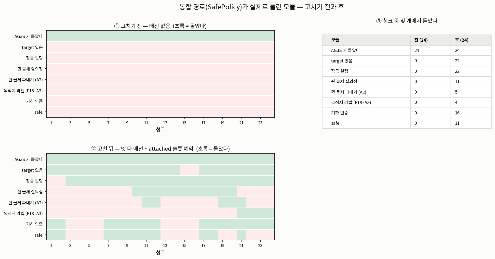

### 전체 틀에서 지금 어디인가 (규칙 B)

```
카메라 depth → 로봇 마스크 ✓ → attention lifting ✓ → grounding ✓ + 잠금 ✓걸기 ✓유지 ✓풀기
            → TSDF ✓해석적 채널(A1 배선됨) ✓감쇠(잠복·끔)
            → ESDF ✓라벨 층 ✓쥔 물체 파내기(A2)
            → SQP 선형화 ✓쥔 물체 ✓목적지 마진 → QP 해 → 안전 게이트 ✓
                                        ○ self-collision (잠복)
```

닫힌 것: **만든 모듈이 전부 한 실행 안에서 실제로 돈다.** 그리고 그것을 막고 있던 것이
**코드가 아니라 배선**이었다는 것이 수치로 남았다.

다음: 각본 기록(`records/run_0000~0003`)에서 같은 통합 경로를 돌려 **실패 케이스**를 본다 —
B1(감쇠를 시야 밖 장애물에서) 과 완료 판정 A·B·C 선택. 사용자 지시대로 **완료 판정은 구현
마지막에** 둔다.

---

## 한 에피소드 전체에서 단계가 적용되는가 — 44 프레임 전부를 잰다 (2026-09-18)

사용자 지시: *"한 에피소드를 완료하는 동안 전체 틀에 작성된 것이 모두 적용되는지 확인.
1~2 프레임이 아니라 **전체 프레임**에 대한 시각자료와 표로."*

`experiments/a7_episode_walkthrough.py` (신설). **실제 통합 경로를 탄다** — `SafePolicy` 를
그대로 돌리고 관측만 기록에서 꺼내 `wire` 요청으로 넣는다. `collect`(느림, 44 × 약 2 초) 와
`plot`(빠름) 으로 나눠 다시 안 돌리고도 그림을 고칠 수 있게 했다.

### 측정 중에 잡은 것 — 하네스가 만든 **가짜 지연**

첫 수집에서 **44 프레임 전부 `degraded`, 인증 0/44, safe 0/44** 가 나왔다. 노트를 보니:

```
head: image is 296 ms behind the frame (limit 100 ms)
cameras span 296 ms (limit 100 ms)
```

원인은 파이프라인이 아니라 **하네스**였다. 카메라마다 `time.monotonic()` 을 찍었는데 OSMesa
소프트웨어 렌더가 카메라당 약 100 ms 라, 그 렌더 시간이 그대로 촬영 지연으로 읽혀 F14(자세
지연 — 관측이 늦으면 그 사이 로봇이 움직인다)가 매 프레임 DEGRADED 를 냈다. **재생에서 카메라
셋은 하나의 `qpos` 에서 렌더한 같은 시뮬 순간**이므로 한 번만 찍는 것이 옳다.

고친 뒤: `ok` 33 · `degraded` 9 · `no_target` 2, **인증 33/44, safe 27/44**.
같은 결함이 `safe_replay.py` 에도 있어 함께 고쳤다.

### 결과 — 15 단계 중 13 개가 에피소드 안에서 적용된다

| 단계 | 적용 프레임 | 대표 수치 |
|---|---|---|
| ① 카메라 depth | **44 / 44** | 921,600 px/프레임 (3 카메라) |
| ② 로봇 마스크 (자기 필터) | **44 / 44** | 중앙 **10.7 %** 픽셀 삭제 |
| ③ attention lifting | **44 / 44** | 중앙 **26,028** 점 |
| ④ target grounding | **42 / 44** | 중앙 67 점 |
| ⑤ TSDF/ESDF | **44 / 44** | 점유 중앙 8,379 복셀 |
| ⑥ 해석적 채널 (A1) | **44 / 44** | 16 도형 |
| ⑦ 라벨 층 | **24 / 44** | 목적지가 잡힌 뒤부터 |
| ⑧ 감쇠 (F20) | **0 / 44** | **의도적으로 끔** (잠복) |
| ⑨ 잠금 걸기·유지 | **42 / 44** | **2:LATCHED → 9:HELD → 20:PLACED** |
| ⑩ 쥔 물체 질의점 (E3·F19) | **11 / 44** | 96 점 (파지 구간) |
| ⑪ 쥔 물체 파내기 (A2) | **5 / 44** | 최대 **63 복셀** |
| ⑫ 목적지 마진 (F18·A3) | **24 / 44** | 놓은 뒤부터 |
| ⑬ SQP 선형화 | **44 / 44** | 중앙 1 반복 |
| ⑭ 기하 인증 | **33 / 44** | — |
| ⑮ 안전 게이트 통과 | **27 / 44** | — |

**안 도는 둘은 결함이 아니다**: ⑧ 감쇠는 기본 끔(잠복, 전환 신호 대기), self-collision(N1)도
같다. 나머지 13 개는 전부 이 에피소드 안에서 실제로 적용된다.

### 에피소드 전체의 수치 (모든 프레임)

* **관측 → 마스크 → 융합**: 원시 약 50 만 점 → 자기 필터가 3~9 천 점 제거 → 융합 후 2~4 만 점
* **SQP 가 위반을 지운다**: 최적화 **전** 최악 27~137 mm → **후** 대부분 0.0 mm
  (최악 14.2 mm, 프레임 18 — 파지 직후 사과가 자기 잔상 위에 있을 때)
* **쥔 물체**: 프레임 9~19 에 질의점 96 개, 그중 5 프레임에서 파내기가 10~63 복셀
* **씬 실패 0 프레임** — 예전의 조용한 정지가 없다
* **시간**: 프레임당 중앙 **2,026 ms** (예산 66.7 ms). AG3S 가 대부분이고 TO 는 약 100 ms.
  실시간성은 이 검토의 범위 밖이다 (CPU/numpy, GPU 이관 때 본다)

### 남은 관측 둘 (결함 아님)

* 프레임 14~15 에 grounding 이 target 을 잠깐 잃는다 (F11 — 파지 순간 attention 이 목적지로
  넘어간다 — 와 같은 자리). **잠금이 정체성을 붙들어 attach 가 유지된다.** 잠금이 정확히 이
  때문에 있다.
* 프레임 20 이후 target 점이 적다 — attention 이 이미 목적지를 보고 있다. 같은 이유.

### 시각화

* **[`figures/a7-episode-walkthrough.png`](figures/a7-episode-walkthrough.png)** — 프레임 ×
  단계 적용 지도(전체 44 프레임) + 단계별 요약표 + 에피소드 요약표.
* **[`figures/a7-episode-stages.png`](figures/a7-episode-stages.png)** — 전체 프레임의 수치
  추이 여섯: 관측/마스크/융합 · attention→target · 점유와 미관측 · 쥔 물체와 파내기와 라벨 ·
  SQP 위반 전후 · 프레임당 시간.

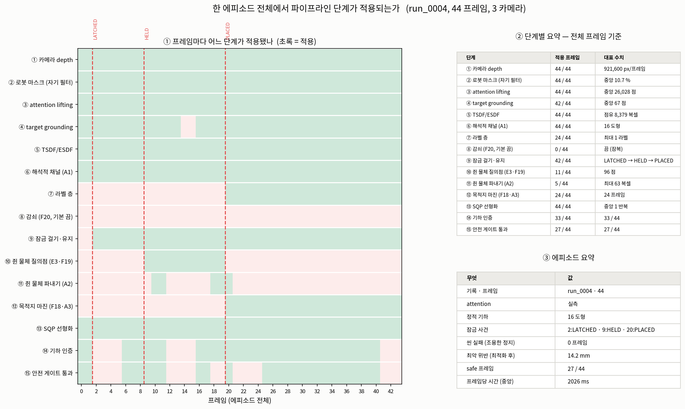

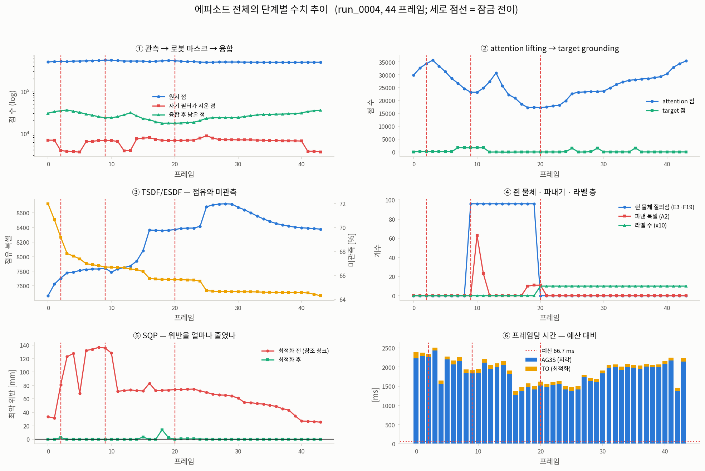

### 검증

| 무엇 | 결과 |
|---|---|
| 단계 적용 | **13 / 15** (나머지 둘은 의도적으로 끈 잠복) |
| 잠금 | SEARCHING → **LATCHED(2) → HELD(9) → PLACED(20)** — 세 조각 전부 |
| 씬 실패 | **0 프레임** |
| 기하 인증 · safe | **33 / 44 · 27 / 44** |
| 테스트 | **625 통과 — 불변** |

### 전체 틀에서 지금 어디인가 (규칙 B)

```
카메라 depth ✓44 → 로봇 마스크 ✓44 → attention lifting ✓44 → grounding ✓42
            → TSDF/ESDF ✓44 (+해석적 채널 ✓44 ·라벨 층 ✓24 ·쥔 물체 파내기 ✓5 ·감쇠 ○끔)
            → SQP 선형화 ✓44 (+쥔 물체 질의점 ✓11 ·목적지 마진 ✓24) → QP 해 → 안전 게이트 ✓27
                                        ○ self-collision (잠복)
```

닫힌 것: **한 에피소드를 끝까지 도는 동안 전체 틀의 단계가 실제로 적용된다는 것이 전 프레임
수치로 남았다.** 그리고 그것을 가리고 있던 마지막 하나(하네스의 가짜 카메라 지연)도 걷혔다.

다음: 각본 기록(`records/run_0000~0003`)에서 같은 walkthrough 를 돌려 **실패 케이스에서도
단계가 버티는지** 본다. 완료 판정은 지시대로 마지막에 둔다.

---

## 폴더 재배치 — `ag3s/` 를 기능별 서브패키지로 (2026-09-21)

`benchmark/ag3s/` 의 코드 파일이 평평하게 쌓여 있었다: 최상위 23 개, `experiments/` 54 개.
파일명만 보고는 그것이 파이프라인 스테이지인지, 거리장 백엔드인지, 일회성 분석 스크립트인지
알 수 없었다. **기능별 서브패키지로 나누고, 옛 경로는 남기지 않았다** (하드 이동).

### 용어

* **서브패키지 (subpackage)** — 파이썬에서 폴더 하나가 곧 import 경로 한 마디다.
  `ag3s/esdf.py` 를 `ag3s/fields/esdf.py` 로 옮기면 import 는
  `benchmark.ag3s.esdf` → `benchmark.ag3s.fields.esdf` 가 된다.
* **shim** — 옛 경로 자리에 새 경로를 그대로 다시 내보내는 껍데기 모듈.
  옛 import 를 안 고쳐도 되게 해 주지만 **경로가 두 벌이 되어** 나중에 어느 쪽이 정본인지
  헷갈린다. 이번에는 두지 않았다 — 경로는 하나뿐이다.
* **결합도** — 어떤 모듈을 import 하는 파일이 몇 개인가. 그 모듈을 옮길 때 **같이 고쳐야 하는
  양**과 같다.

### 무엇을 어디로 옮겼나

**core — 4 개 그룹.** `types.py`(전 스테이지 데이터 계약)와 `config.py`(YAML 스키마)는
모두가 쓰므로 루트에 남겼다.

| 새 위치 | 옮긴 모듈 | 무엇을 하는 묶음인가 |
|---|---|---|
| `stages/` (7) | reconstruction · robot_filter · support_surface · attention_lifting · target_grounding · collision_candidates · geometry | 점에서 도형까지, 파이프라인 스테이지 순서 그대로 |
| `fields/` (3) | esdf · curobo_field · static_scene | 거리장(ESDF) 백엔드 — 생산과 소비 어댑터 |
| `constraints/` (4) | clearance · attached · constraint_builder · to_adapter | 여유거리에서 CasADi 제약 사양까지 |
| `runtime/` (6) | pipeline · multiview · profiler · trace · asset_path · visualization | 알고리즘이 아닌 것 — 조율 · 계측 · 자산 경로 · 그림 |

**experiments — 5 개 그룹.** `curobo/` 와 `reuse_audit_20260915/` 는 이미 나뉘어 있어 그대로 뒀다.

| 새 위치 | 개수 | 무엇을 하는 묶음인가 |
|---|---|---|
| `experiments/common/` | 3 | figstyle · outputs · imageview — `__main__` 없는 공용 유틸 |
| `experiments/sources/` | 6 | MuJoCo 씬 · 정책 롤아웃 기록 · 제약 기록을 **만드는** 쪽 |
| `experiments/reports/` | 11 | 스텝 1–6 + ESDF 상설 검증 리포트 |
| `experiments/studies/` | 23 | a1~a7 · step5~step8 · f12 — 질문 하나를 재는 일회성 분석 |
| `experiments/diagrams/` | 10 | doc_* · ppt_* — 측정 없이 도식만 그리는 스크립트 |

### 코드가 무엇이 바뀌었나

| 항목 | 수량 |
|---|---|
| 옮긴 파일 | **73 개** |
| 참조 치환 | **664 곳 / 134 파일** — `experiments/` 내부, `benchmark/trajopt/` 8 파일, `pi05_TO_hybrid/rby1_bringup/pi05_infer.py`, `pi05_TO_hybrid/scripts/analyze_boundary_risk.py`, `tests/` 22 파일, 문서 명령 60 줄, `configs/rby1_three_camera.yaml` |
| 새 `__init__.py` | 9 개 — 각 그룹이 무엇을 담는지 docstring 으로 적었다 |
| 손으로 고친 것 | `runtime/visualization.py:35` — `ASSET_DIR` 이 `__file__.parent / "asset"` 이었다. 한 단계 내려갔으므로 `parents[1]` 로 바꿨다. **이동이 조용히 깨뜨릴 수 있었던 유일한 곳** |

**건드리지 않은 것 둘.** `docs/figures/reuse-audit-20260915/baseline.json` 은 2026-09-15 에 뜬
`git status` **스냅샷**이라 고치면 그때의 기록이 아니게 된다. `docs/CONTAINER_SETUP.md` 는
폐기 문서다(규칙 E). 둘 다 치환을 되돌렸다.

**프로즈 안의 파일명은 그대로 뒀다.** 기록·문서 142 곳이 `` `esdf.py` `` 처럼 폴더 없이 파일명만
부른다. 패키지 안에서 basename 이 전부 유일하므로 가리키는 대상이 흐려지지 않고, 과거 기록을
덮어쓰지 않기 위해 위 배치표로 대신한다.

### 시각화

* **[`figures/reorg-20260921/fig1_layout_before_after.png`](figures/reorg-20260921/fig1_layout_before_after.png)**
  — 전(평평한 77 개) 대 후(9 개 그룹) 배치 도식.
* **[`figures/reorg-20260921/fig2_group_sizes_and_coupling.png`](figures/reorg-20260921/fig2_group_sizes_and_coupling.png)**
  — 그룹별 파일 수 + 결합도 상위 26 개. figstyle 47 · policy_record 43 · grounding_report 36 ·
  mujoco_source 35 · pipeline 30 이 상위다 — 이동 비용이 어디에 몰려 있었는지 보인다.
* **[`figures/reorg-20260921/fig3_verification_table.png`](figures/reorg-20260921/fig3_verification_table.png)**
  — 검증 항목과 기준선 대조표.

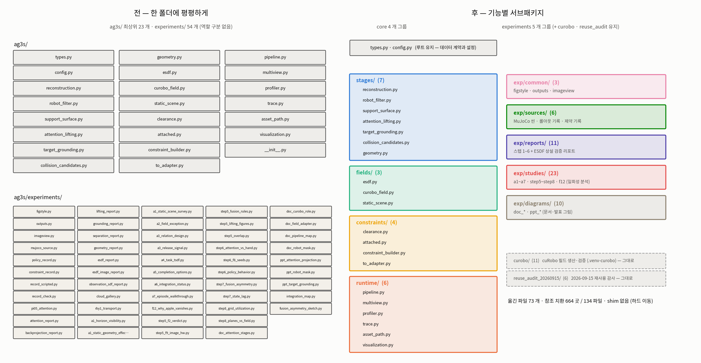

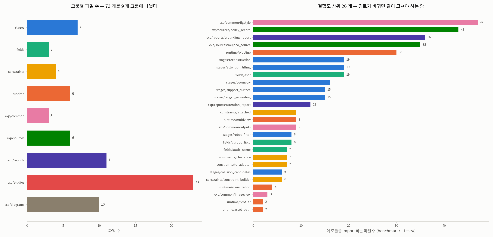

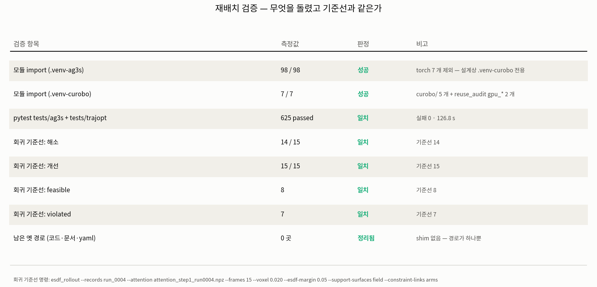

### 검증 — 수치로 확정한 것

| 무엇 | 결과 | 기준 |
|---|---|---|
| 모듈 import (`.venv-ag3s`) | **98 / 98 성공** | torch 7 개는 설계상 `.venv-curobo` 전용 |
| 모듈 import (`.venv-curobo`) | **7 / 7 성공** | `curobo/` 5 + `reuse_audit` gpu_* 2 |
| `pytest tests/ag3s tests/trajopt` | **625 passed**, 실패 0 (126.8 s) | 이전과 **불변** |
| 회귀 기준선 `esdf_rollout` | 해소 **14** / 개선 **15** / feasible **8** · violated **7** | 기준선과 **정확히 일치** |
| 남은 옛 경로 | **0 곳** (코드 · 문서 · yaml 전수 조사) | shim 없음 |

회귀 기준선 명령은 CLAUDE.md 의 것을 그대로 썼다
(`--records run_0004 --attention attention_step1_run0004.npz --frames 15 --voxel 0.020
--esdf-margin 0.05 --support-surfaces field --constraint-links arms`).

### 전체 틀에서 지금 어디인가 (규칙 B)

```
카메라 depth → 로봇 마스크 → [attention lifting → target grounding] → TSDF/ESDF
            → 거리장 어댑터 → SQP 선형화 → QP 해
   stages/       stages/            stages/              fields/
                                                       constraints/ → runtime/pipeline
```

파이프라인 자체는 **하나도 바뀌지 않았다** — 같은 단계가 같은 순서로 같은 수치를 낸다.
바뀐 것은 **그 단계를 코드에서 찾는 길**이다. 이제 폴더 이름이 규칙 B 의 화살표와 맞는다.

닫힌 것: 파일 배치가 파이프라인 구조를 드러낸다. 다음 사람이 "ESDF 를 어디서 만드나" 를
물으면 `fields/` 를 연다.

다음: 각본 기록(`records/run_0000~0003`)에서 walkthrough 를 돌려 **실패 케이스에서도 단계가
버티는지** 본다 (재배치 전의 다음 항목 그대로 — 재배치는 그 일정을 바꾸지 않는다).

---

## `docs/` 문서 정리 — 다 쓴 프롬프트와 대체된 스냅샷을 지웠다 (2026-09-21)

폴더 재배치에 이어 문서를 정리했다. **45 → 38 파일, 2.60 → 1.28 MB.** 지운 것은 7 개다.

### 지운 것과 판정 근거

| 파일 | 크기 | 분류 | 왜 지웠나 |
|---|---:|---|---|
| `review_board.html` | 1,237 KB | 대체된 스냅샷 | 2026-09-10 시점의 **발견 17건** 감사 보드. 지금 정본은 이 로그의 "누적 발견" 표이고 발견은 F20 대까지 늘었다. 아무도 링크하지 않았다 |
| `CONTAINER_SETUP.md` | 23 KB | 폐기 선언 | 규칙 E. 남길 내용(cuRobo 함정 목록, 작업 방식)은 **이미 이 로그와 계획으로 옮겨져** 있었다 |
| `server-prompt-safe-serving.md` | 12 KB | 다 쓴 프롬프트 | 배선 결과는 `safe-serving.md` 에 남았다 |
| `step-01-server-prompt.md` | 11 KB | 다 쓴 프롬프트 | 절차는 `RUNBOOK.md` §5 로 흡수 |
| `ppt-prompt-step1-3.md` | 10 KB | 다 쓴 프롬프트 | 내용은 `PPT-SOURCE-step1-3.md` (55 KB) 가 통째로 갖고 있다 |
| `architecture-prompt.md` | 9 KB | 다 쓴 프롬프트 | 산출물은 `figures/ag3s-architecture-v2/` |
| `live-attention-server-prompt.md` | 4 KB | 다 쓴 프롬프트 | 남은 과제는 `live-integration.md` · `safe-serving.md` 에 적혀 있다 |

**"다 쓴 프롬프트"** 란 다른 Claude 에게 통째로 붙여넣으려고 쓴 글이다. 그 작업이 끝나면
산출물만 남으면 되고 지시문은 남을 이유가 없다.

### 지우지 않은 것 — 지울 수 없는 이유

| 무엇 | 왜 남겼나 |
|---|---|
| `archive/step-verification-20260904/step-01-attention.json` | **12 개 스크립트의 `--step1-json` 기본 입력**이다. 지우면 리포트·스터디가 전부 죽는다 |
| `archive/step-verification-20260904/step-04-grounding_004.json` | `tests/trajopt/test_grasp_latch.py` 가 읽는다 |
| `step-01~06-*.md` · `.json` (20) | 이 폴더의 존재 이유인 **실측 검증 기록**이고 `docs/README.md` 가 표로 링크한다. `_004` 는 중복이 아니라 **run_0004 롤아웃의 측정**이다 (비-004 는 run_0002) |
| `AG3S_CUROBO_LIVE_TEST_PLAN.md` | "실행 상태" 표가 T4 진행 중 · closed-loop 미착수라고 적고 있다 — 살아 있는 작업이다 |

### 코드·문서가 무엇이 바뀌었나

삭제로 끊어지는 참조 **13 곳**을 고쳤다.

| 어디 | 무엇으로 |
|---|---|
| `benchmark/requirements-ag3s.txt:8` | `CONTAINER_SETUP.md` 언급 제거 |
| `benchmark/requirements-curobo.txt:10` | "그 문서의 절차를 따른다" → **사실 기술**: `/mnt/dev/work/curobo_src` 를 editable 로 설치해 뒀고(`nvidia_curobo 0.8.0.post1.dev43`), `import curobo` 가 그 소스를 가리키면 정상이다 |
| `docs/README.md` 2 곳 | Step 1 행의 "서버 프롬프트" 링크 제거, 실행 명령 주석을 `RUNBOOK.md §5` 로 |
| `docs/RUNBOOK.md:98` | 전문 링크 문장 제거 |
| `docs/PPT-SOURCE-step1-3.md` 2 곳 | Step 1 소스 목록에서 제거 + **재배치로 어긋난 경로 3 개 수정**(`experiments/*_report.py` → `experiments/reports/*_report.py`) |
| `docs/live-integration.md:107` · `docs/safe-serving.md:171` | 프롬프트 링크 문장 제거 (남은 과제 서술은 유지) |
| 규칙 E — `AG3S_REVIEW_LOG.md` 머리말 · `AG3S_REVIEW_PLAN.md` · `CLAUDE.md` · `.claude/ag3s-rules.md` | "폐기됐다 · 읽지도 쓰지도 않는다" → **"폐기됐고 2026-09-21 에 삭제됐다 · 찾지 않는다"** (규칙 본문은 두 곳을 같이 고친다) |

재배치 때 놓친 상대 링크 둘도 같이 고쳤다 — `docs/README.md` 의
`../experiments/record_check.py` → `../experiments/sources/record_check.py`,
`../experiments/imageview.py` → `../experiments/common/imageview.py`.

### 시각화

* **[`figures/docs-cleanup-20260921/fig1_docs_cleanup.png`](figures/docs-cleanup-20260921/fig1_docs_cleanup.png)**
  — 전후 파일 수·용량 막대, 지운 7 개의 크기(로그 눈금), 지운 것과 남긴 것의 판정표.

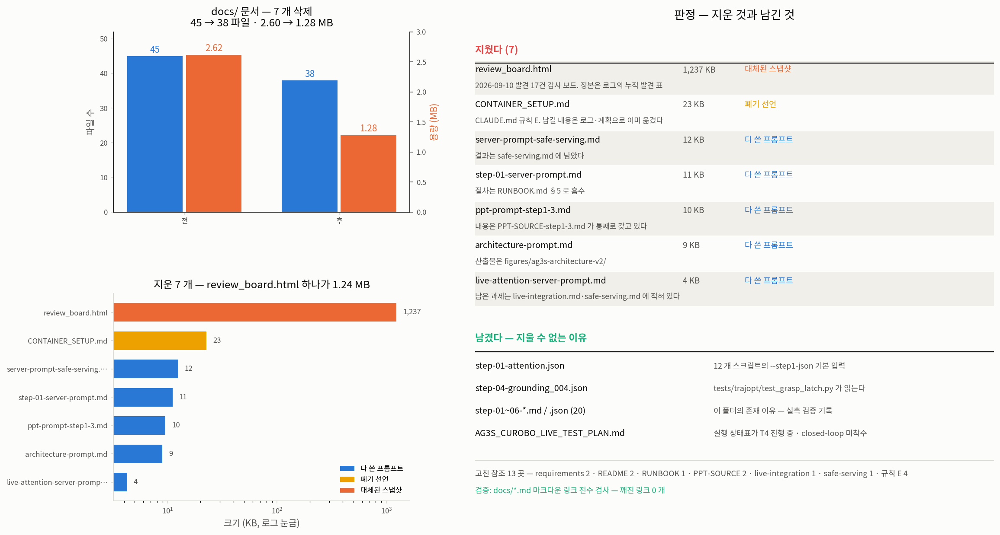

### 검증 — 수치로 확정한 것

| 무엇 | 결과 |
|---|---|
| `docs/*.md` 마크다운 링크 전수 검사 | **깨진 링크 0 개** |
| 지운 파일을 아직 부르는 곳 | 10 곳 — 전부 2026-09-11~12 절의 **백틱 언급**(링크 아님). 당시 기록이라 그대로 두고, 머리말이 파일이 없음을 알린다 |
| 코드가 지운 파일을 읽는가 | **0 건** (`benchmark/` · `tests/` 전수 조사) |
| 문서 | 45 → **38 파일**, 2.60 → **1.28 MB** |

백업은 `scratchpad/docs-deleted-20260921.tgz` (923 KB) 에 있다.

---

## `docs/` 중복 제거와 닫힌 실험의 archive 분류 (2026-09-21)

문서 정리를 이어서, **중복을 재서 지우고 닫힌 실험을 폴더로 내렸다.**
`docs/` 최상위는 **38 → 15 파일**이 됐다.

### 중복은 추측하지 않고 쟀다

문장 집합 겹침(코드블록·표·이미지 제외, 작은 쪽 기준)으로 27 개 문서를 전부 대조했다.

| 쌍 | 산문 동일도 | 판정 |
|---|---:|---|
| `step-05-separation` ↔ `_004` | **100.0 %** | 같은 글, 숫자만 다름 |
| `step-06-geometry` ↔ `_004` | **98.8 %** | 〃 |
| `step-03-lifting` ↔ `_004` | **97.4 %** | 〃 |
| `step-04-grounding` ↔ `_004` | **91.9 %** | 〃 |
| `step-01-attention` ↔ `_004` | **89.2 %** | 〃 |
| `PPT-SOURCE` ↔ `step-02` | 8.9 % | 중복 아님 — 근거를 모으는 것이 그 문서의 역할 |
| `live-integration` ↔ `safe-serving` | 2.6 % | 중복 아님 |

**`_004` 쌍만 중복이었다.** 산문 5 개를 지우고 `.json` 은 남겼다 — `run_0004` 의 수치는
`.json` 에 그대로 있고, 산문은 꼬리표 없는 쪽과 같은 글이라 잃는 것이 없다.

한 파일 안 중복도 하나 있었다. `docs/README.md` 의 §28 "충돌 표현 backend" 와 §33
"두 번째 충돌 표현" 이 **둘 다 `ESDF-BACKEND.md` 를 같은 말로 소개**하고 있었다 — 한 절로 합쳤다.

### archive 경계 — "로그가 닫았다고 명시한 것만"

| 폴더 | 파일 | 닫힌 근거 |
|---|---:|---|
| `archive/step-verification-20260904/` | 17 | 단계 1–6 검증(`run_0002`·`run_0004`). 이후 검토는 로그 Step 5–11 이 이어받았다 |
| `archive/primitive-era-20260904/` | 1 | `OPEN-geometry-representation.md` — 머리말이 *"보류 → 다른 방법으로 대응됨. 구현하지 않았다"*. 계획의 *"primitive 는 절대 안 됨"*(2026-09-14)과 Step 9(후보·primitive 피팅이 live 경로에서 안 돈다)로 닫혔다 |
| `archive/README.md` | 1 (신규) | 무엇이 왜 닫혔는지, 무엇이 보관물이 아닌지 |

**`ESDF-BACKEND.md` 는 archive 대상이 아니었다.** 제목이 "두 번째 backend" 라 과거로 보이지만,
내용은 **지금 도는 backend 의 설계·정확도·비용 참조**다 (세 상태 점유, 복셀 반 칸 −5.0 mm,
국소 갱신 0.0000 mm 일치, 프레임당 1.8 s). 낡은 것은 머리말 한 줄
*"기본값 아님 — primitive 가 그대로 기본"* 뿐이라, 그 줄을 **사실로 고쳤다**:
`AG3SConfig` 기본값은 여전히 `primitive` 지만 live 경로는 `serve_safe.py:49` 와
`esdf_rollout.py:145` 가 `esdf` 로 고정한다.

### 코드가 무엇이 바뀌었나

| 무엇 | 수량 |
|---|---:|
| 삭제한 중복 산문 (`_004.md`) | 5 |
| archive 로 옮긴 파일 | 18 |
| **스크립트 기본 경로 수정** — `--step1-json`, `--out-doc` 등 | **23 파일** |
| docs 최상위 문서의 링크 수정 | 6 파일 |
| 옮긴 문서 안 링크 수정 (`../asset/` → `../../../asset/`) | 6 파일 |
| `--tag` 설명의 예시 경로 (`RUNBOOK.md`, `experiments/common/outputs.py`) | 2 |

`step-01-attention.json` 은 archive 안에 있지만 **보관물이 아니다** — 12 개 스크립트가
`--step1-json` 기본값으로 읽는 살아 있는 입력이다. `step-04-grounding_004.json` 은
`tests/trajopt/test_grasp_latch.py` 가 읽는다. 둘 다 `archive/README.md` 에 못박아 뒀다.

### 시각화

* **[`figures/docs-archive-20260921/fig1_docs_archive.png`](figures/docs-archive-20260921/fig1_docs_archive.png)**
  — 문서쌍별 산문 동일도(중복 판정선 50 %), 최상위 38 → 15 막대, 정리 후 배치 도식.

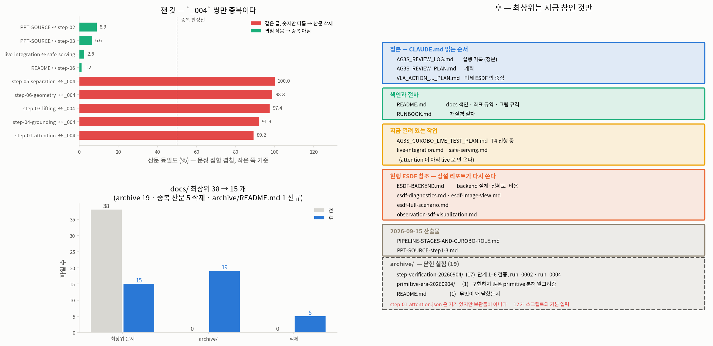

### 검증 — 수치로 확정한 것

| 무엇 | 결과 |
|---|---|
| `docs` 전체(하위 폴더 포함) 마크다운 링크·이미지 경로 전수 검사 | **깨진 링크 0 개** |
| 코드 안 `benchmark/ag3s/docs/...` 경로 참조 | **정상 56 / 깨짐 0** |
| `--step1-json` 기본값이 실재하는가 | **OK** — `archive/step-verification-20260904/step-01-attention.json` |
| `pytest tests/ag3s tests/trajopt` | **625 passed** — 불변 |
| `docs/` 최상위 | 38 → **15 파일** |

백업은 `scratchpad/docs-before-archive-20260921.tgz` (2.0 MB) 에 있다.
