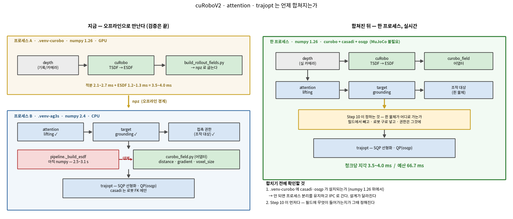

# AG3S 공동 코드 검토 — attention + TSDF/ESDF 전환 전제

> **최종 갱신 2026-09-14 — Step 0~6 완료, 다음은 Step 7.**
>
> * 지금 어디인지와 검토가 시작할 때와 무엇이 달라졌는지 → **[현재 위치](#현재-위치-2026-09-14)**
> * 남은 작업 → **[앞으로 할 것](#앞으로-할-것)**
> * 발견별 판정 → **[발견 목록](#발견-목록--판정-현황-2026-09-14-갱신)**
> * cuRobo · attention · trajopt 통합 시점 → **[통합](#통합--curobov2--attention--trajopt-는-언제-합쳐지는가)**
>
> **실행 기록의 정본은 [AG3S_REVIEW_LOG.md](AG3S_REVIEW_LOG.md)** 다 — 스텝별 진행 현황, 누적
> 발견 표, 모듈 처분 표, 용어는 그쪽에서 갱신된다. 이 파일은 **계획**이므로 사실이 바뀌면
> 고쳐 쓴다. 다만 **틀린 짐작은 지우지 않고 취소선으로 남긴다** — 무엇을 어떻게 잘못
> 짐작했는지가 그 자체로 자료다.

## Context

사용자의 결정 세 가지.

1. **씬(장애물) 쪽 primitive 근사는 쓰지 않는다.** 포인트 클러스터에 구를 씌우는 경로를 걷어내고
   TSDF/ESDF로 대체한다.
2. **로봇 모델 자체는 primitive를 계속 쓴다.** sphere chain, `robot_radii`, 캡슐→구 이산화,
   잡은 물체의 구 표현은 전부 유지된다. 제약은 `d_esdf(p_robot(q)) − r_robot − margin ≥ 0`
   형태이므로 로봇 쪽 구는 오히려 **필수**다.
3. **attention과 TSDF/ESDF를 제대로 결합한다.** 이것이 이 검토의 목표다 — 지금 결합 방식이
   틀려 있다는 것이 사전 조사의 가장 큰 발견이다.
4. **지금 단계에서 실시간성(지연)은 최적화 대상이 아니다** (2026-09-07 결정). 이 스택은 어차피
   지금 CPU/numpy 기반이라 실시간에 못 미친다 — 그 사실 자체는 이미 알려진 것이고 이 검토가
   풀 문제가 아니다. **나중에** cuRoboV2/nvblox 류의 GPU 가속 패턴(block-sparse voxel hashing,
   voxel-centric projection, PBA+ 등 — Step 1 E6 판정 근거, `papers/curobo_report_v1.pdf`,
   `papers/cuRoboV2_...pdf` 참고)을 참조해 별도로 개선한다. 그동안 이 검토·수정에서 성능은
   "판단 결과를 안 바꾸면서 자릿수 개선이 되면 좋음" 정도로만 다루고, 판단(무엇을 장애물로 볼
   것인가, 언제 완화할 것인가)의 정확성을 우선한다.

그 전제로 다시 조사한 결과, 코드의 실제 구조가 문서가 말하는 것과 다르다는 것이 드러났다.

- 실제 최적화기는 AG3S 안의 CasADi `ConstraintBuilder` 가 **아니다.** `benchmark/trajopt/`
  (4.2k LOC) 의 SQP이고, `linearize.py:531 scene_from_constraint_set` 이 AG3S 출력을 받아
  `SceneSnapshot` 으로 바꾼 뒤 수치 선형화한다. ESDF는 이미 이 경로로 end-to-end 연결되어 있다
  (`linearize.py:324 _esdf_clearance` — `d_esdf(p) − r − margin`, 기울기는 `∇d·J`).
- 즉 ESDF는 CasADi 심볼릭 브리지가 필요 없다. AG3S 의 `constraint_builder.py` 심볼릭 기계장치는
  **씬 primitive 전용**이고, 그것이 삭제 대상이다.
- 그런데 삭제하면 딸려 나가는 것이 있다. 평면(지지면) 행과 (sphere, slot) 마진 행렬이 그 심볼릭
  파라미터 벡터 안에 얹혀 있다.

사전 조사에서 **검증된 결함 7건 + 잔존 의심 4건**을 찾았다. 셋은 전환 설계 자체를 바꿔야 한다.

> **E1** GRASP에서 ESDF는 target 복셀을 파낸다 — 손끝뿐 아니라 **몸통·전완·반대팔에 대해서도**.
> 이것은 `clearance.py:1-27` 이 "AG3S가 하던 가장 위험한 일"이라며 고쳤다고 선언한 바로 그 동작이다.
> **attention과 ESDF를 결합하는 현재 방식이 정확히 여기서 틀려 있다.**
>
> **E2** 테이블이 무한 half-space다. 실측: 홈 자세 61 sphere 중 **26개가 최대 0.677 m 위반**.
> 그리고 ESDF 모드에서는 테이블이 필드에서 파내지므로 이 평면 행이 **유일한** 테이블 제약이다.
>
> **E3** 잡은 물체(attached)는 지금 실제 optimizer에 **전혀 도달하지 않는다.** trajopt에
> attached 블록을 읽는 코드가 없다.

산출물은 두 가지다. (1) 사용자가 ESDF 경로를 스텝별로 파악한 상태, (2) 그 과정과 판단의 기록.

**계획 변경 (2026-09-07): 확정된 결함은 그 스텝 안에서 바로 고친다.** 원래는 "수정은 검토가
끝난 뒤"였는데, Step 1(E4·E6)·Step 2(E1·E5)에서 사용자가 그때그때 "고치고 넘어가자"고 지시해
방식이 바뀌었다. 지금부터 각 스텝은 `설명 → 질문 → 공동 판정(확정/기각) → (확정된 것은 그
자리에서 수정 + 검증) → 기록` 순서다. 수정이 아직 검토 안 한 스텝의 모듈까지 건드려야 할 때는
(E1이 Step 3·10을 건드렸듯) 사용자에게 범위를 먼저 확인한다 — 계획서의 "스텝을 합치지 않는다"
원칙은 **설명/판정 순서**에 대한 것이지 수정 타이밍에 대한 것이 아니게 됐다.

---

## 방향 결정 (2026-09-07) — cuRoboV2 를 인프라로 쓰고, attention 은 해상도를 배분한다

검토 중에 드러난 사실 때문에 전환의 목표 자체를 다시 잡았다.

**사실 1 — 우리가 직접 만들고 있던 ESDF 기계장치는 이미 오픈소스로 존재한다.**
cuRoboV2 (`papers/cuRoboV2_...pdf`, 코드 `https://github.com/NVlabs/curobo`) 가 매니퓰레이터용
GPU-native TSDF/ESDF 를 제공하고, nvblox 대비 10배 빠르고 메모리 8배 적다고 보고한다. 우리
발견 중 **E4(고정 상자 밖 = 자유)와 E6(전 복셀 매 프레임 투영)은 그쪽 구조에서는 애초에
생기지 않는다** — block-sparse 할당이라 벗어날 고정 상자가 없고, block discovery 가 전 복셀
투영을 대체한다.

**사실 2 — 우리 발견의 대부분은 cuRoboV2 에 대응물이 없는 영역에서 나왔다.**
cuRoboV2 에는 attention 이 없다. target grounding 도, phase x manipulator 별 접촉 권한도,
`ClearancePolicy` 도 없다. E1 · E2 · E3 · F2 · F8 · F9 · F10 이 전부 그 영역이다.

### 결정

1. **ESDF 인프라는 cuRoboV2 를 최대한 가져다 쓴다.** block-sparse TSDF, voxel-centric 적분,
   PBA+ dense ESDF, GPU 실행. 우리가 다시 만들지 않는다.
2. **우리 기여는 attention 쪽에 둔다.** 무엇이 target 인가, 어느 링크가 그것을 만져도 되는가,
   그리고 아래 3번.
3. **attention 이 ESDF 의 해상도 예산을 배분한다 (2계층 ESDF).** cuRoboV2 는 TSDF 와 ESDF 의
   해상도를 분리해 두었지만(§5.4), ESDF 자체는 단일 해상도다. 거기에 "관심 영역만 미세하게"를
   얹는다.

### 2계층 ESDF — 무엇을 하고 무엇을 하지 않는가

**하지 않는 것: 범위를 줄이지 않는다.** 초안에서 "target 주변만 ESDF 로 만들자" 를 검토했다가
실측으로 기각했다 — 장애물은 target 이 아니라 **target 이 아닌 것들**이고, 실제로 장애물의
절반이 target 에서 0.54 m 넘게 떨어져 있다. 반경 0.20 m 로 자르면 연산은 99% 줄지만 장애물의
84% 가 사라진다.

```
장애물(OCCUPIED) 의 target 까지 거리:  50% 분위 0.54 m,  75% 0.84 m,  90% 0.99 m,  최대 1.47 m

반경   | target 주변 남는 장애물 | 로봇 궤적 주변 남는 장애물
0.20 m |        15.5%          |        31.6%
0.30 m |        26.8%          |        54.4%
0.50 m |        46.5%          |        75.3%
```

**하는 것: 정밀도를 몰아준다.** 작업공간 전체를 거친 복셀로 **그대로 유지**하고(먼 장애물도
계속 회피된다), attention 이 가리킨 target 주변만 미세 복셀로 한 겹 더 얹어 질의에서
`min()` 으로 합친다 — cuRoboV2 가 depth 채널과 analytic 채널을 합치는 그 방식과 같다.

```
균일 20 mm         547,200 복셀   이산화 편향 -10.0 mm  (50 mm 마진의 20% 소모)
균일  5 mm      34,675,200 복셀   이산화 편향  -2.5 mm  <- 이상적이지만 35 M, 불가능
2계층 R=0.15 m     763,200 복셀   균일 5 mm 대비 45.4x 절감,  target 주변 장애물 9% 가 5 mm
2계층 R=0.20 m   1,059,200 복셀   균일 5 mm 대비 32.7x 절감,  target 주변 장애물 15% 가 5 mm
2계층 R=0.30 m   2,275,200 복셀   균일 5 mm 대비 15.2x 절감,  target 주변 장애물 27% 가 5 mm
```

**이득의 성격**: 지금 20 mm 복셀의 편향 -10 mm 가 `esdf_margin` 50 mm 의 20% 를 먹고 있고,
그래서 `esdf-full-scenario.md` 가 "잔여 -5.1 mm 가 복셀 노이즈인지 진짜 관통인지 구분되지
않는다" 고 적었다. 손끝이 실제로 다투는 자리에서만 그 편향이 -2.5 mm(5%)로 떨어진다.
**잃는 것은 없다** — 범위가 아니라 해상도를 바꾸는 것이므로.

> **정정 (2026-09-11) — 이득의 크기는 위 표보다 작고, 있는 곳이 다르다.** 실측(미세 창 안 40 만
> 점, `거친 − 미세`, 양수 = 거친 쪽이 낙관적):
>
> ```
> 미세 창 전체        중앙 +3.06 mm   1~99분위 [-9.5, +37.2]   최대 +63.5 mm
> 표면 0~50 mm 대역   중앙 +3.30 mm   95분위 +27.4 mm
> 로봇 구 45 개(창 안) 중앙 +4.61 mm   판정이 갈리는 구 1/45
> ```
>
> 즉 "마진 예산의 66 % → 4 %" 가 아니라 **중앙값 3~5 mm (50 mm 의 6~10 %)** 이고, **이득은
> 중앙값이 아니라 꼬리에 있다** — 평평한 상판에서는 거친 복셀도 충분하고, 얇거나 작은 기하에서
> 벌어진다(최악 5 % 구간 27 mm 이상). 비용이 예산의 1 % 이므로 설계는 여전히 값싸지만 **근거를
> 꼬리로 다시 써야 한다.** `AG3S_REVIEW_LOG.md` 발견 C2·C3.

### API 검증 완료 (2026-09-11, 실제 H200 에서 실행)

`https://github.com/NVlabs/curobo` (commit `78fd485`) 를 받아 이 장비에서 직접 돌렸다.
**2계층 ESDF 는 stock API 로 그대로 된다 — 포크도 개조도 필요 없다.**

확인한 것:

1. **nvcc 없이 설치·실행된다.** `setup.py` 의 `USE_PYBIND` 기본값이 `0` 이라 CUDA 확장 컴파일은
   선택이고, 기본은 Warp/cuda.core JIT 백엔드다. 이 서버에 CUDA toolkit 이 없는데도 `pip install
   -e .` 만으로 동작했다. (openpi venv 를 건드리지 않으려고 `--system-site-packages` 로 별도
   venv 를 만들어 설치했다 — `numpy`/`scipy` 가 업그레이드되면 openpi 가 깨진다.)
2. **`MapperCfg` 가 TSDF 와 ESDF 의 해상도·범위를 처음부터 분리해 둔다.**
   `voxel_size`(TSDF, 기본 5 mm) 대 `esdf_voxel_size`(기본 50 mm),
   `extent_meters_xyz` 대 `extent_esdf_meters_xyz`.
3. **같은 TSDF 에서 ESDF 를 해상도·원점을 바꿔 여러 번 뽑을 수 있다.**
   `Mapper.compute_esdf(esdf_origin=..., esdf_voxel_size=...)` 가 호출마다 오버라이드를 받고,
   docstring 이 그 용도를 "sliding window" 라고 적고 있다. **적분은 한 번, 추출은 여러 번**이다.
4. **두 ESDF 가 한 씬에 장애물로 공존한다.** `SceneCfg.voxel: Optional[List[VoxelGrid]]` 이고
   `VoxelGrid` 는 `Obstacle` 서브클래스라 각자 pose·dims·voxel_size 를 갖는다.
5. **ESDF 버퍼는 고정 128³ 이고 물리적 범위는 `voxel_size` 가 정한다.** 20 mm 면 2.56 m 상자,
   5 mm 면 0.64 m 상자. 우리 작업공간(1.5 x 1.8 x 1.6 m)이 거친 계층에 그대로 들어가고, 미세
   계층 0.64 m 는 target 반경 0.32 m 에 해당한다 — 앞서 계산한 R=0.30 m 와 거의 일치한다.

실측 시간 (카메라 1대, JIT 워밍업 후 10회 평균, H200 NVL):

```
TSDF 적분              0.61 ms
ESDF 거친 20 mm        0.40 ms
ESDF 미세  5 mm        0.45 ms      <- 2계층의 추가 비용은 이것뿐
2계층 합계             1.46 ms      메모리 191.8 MB
```

비교) 우리 numpy 구현은 카메라 3대·10 mm 에서 정상 상태 약 940 ms 다. 카메라 수가 달라 그대로
비교할 수는 없지만(cuRobo 쪽은 1대), **자릿수가 세 개 차이**라는 것은 분명하다. 청크 예산
66.7 ms 대비 1.46 ms 는 **예산의 2%** 이고, 지금 우리가 40배 초과인 상태에서 예산 안으로 들어온다.

즉 "2계층은 비용이 든다" 는 걱정이 실측으로 기각됐다 — 미세 계층 추가 비용이 **0.45 ms** 다.

> **측정 두 벌이 있다 — 카메라 수가 다르다.** 위 표는 **카메라 1대** 기준이고,
> `AG3S_REVIEW_LOG.md` 의 "cuRoboV2 API 검증" 절에는 **실제 RB-Y1 3대**(head + 손목 둘) 기준
> 측정이 있다: TSDF 적분 1.72 ms, ESDF 거친 0.52 ms, 미세 0.74 ms, **합계 2.98 ms**.
> 결론은 같다(예산 66.7 ms 의 4%) — 두 숫자를 섞어 인용하지 말 것.
> 로그 쪽에는 **정확성 검증**(좌표계 일치, 2계층 오차 33 mm 대 2 mm)도 함께 있고, 그것이
> 이 설계의 이득을 실제로 뒷받침하는 부분이다.
>
> **정정 (2026-09-11, 어댑터 구현 중) — "33 mm 대 2 mm" 는 틀렸다.** 그 측정법(`|d| < voxel_size`
> 인 복셀의 z 중앙값)은 계층의 정확도가 아니라 **대역 폭**을 잰다. 옳은 측정(영교차, 그리고
> 제약이 평가되는 지점에서의 오차)으로는 거친 계층 −3.0 mm / 미세 −2.0 mm 이고, 상판 +100 mm
> 에서 −6.8 mm 대 −3.1 mm 다. 두 계층 다 거리를 **과소평가**하므로 방향은 보수적이다.
> 자세한 것은 `AG3S_REVIEW_LOG.md` 의 **발견 C2**.

### 아직 확인하지 않은 것
- 미세 계층의 중심을 target centroid 로 둘지, 로봇 손끝 궤적으로 둘지. 실측상 로봇 궤적 기준이
  장애물을 더 많이 담지만(0.50 m 에서 75.3% 대 46.5%), **해상도 배분에서는 범위 손실이 없으므로
  이 비교가 그대로 적용되지 않는다.** 별도 판단이 필요하다.
  → **F11 이 이 질문에 무게를 실었다.** 창 중심이 target 을 따라가면 파지 순간 **목적지 위로
  옮겨간다** — 정작 로봇이 있는 곳이 아니라. 참 거리 대조에서 "최악 구가 창 안에 들어온 것은
  부분적으로 우연" 이라 적었던 그 우연의 정체다. swept volume 기준이 이 문제를 구조적으로 피한다.
- 기존 검토(Step 5~11)는 계속 진행한다. cuRoboV2 를 쓰더라도 attention 앞단(Step 5~7)과 접촉
  정책(Step 10)은 그대로 우리 것이고, 거기 있는 미판정 발견들이 이 방향에서 오히려 더 중요해진다.

---

## 현재 위치 (2026-09-14)

```
카메라 depth → 로봇 마스크 ✓ → [attention lifting ✓ → target grounding ✓] → TSDF/ESDF ★
            → 거리장 어댑터 ✓ → SQP 선형화 → QP 해
```

**Step 0~6 완료. 다음은 Step 7 (`multiview.py`).**

### 검토가 시작할 때와 달라진 것

**1. "판정만 한다" 에서 "판정하고 고친다" 로 바뀌었다.** 원래 계획의 마지막 줄은 *"수정은 이
검토의 범위가 아니다"* 였다. 실제로는 사용자가 항목마다 수정을 지시했고 E1 · E5 · F2 · F9 · F11 ·
C1 · C4 가 고쳐졌다. 수정할 때마다 **테스트 스위트 + 회귀 기준선**을 함께 돌린다.

**2. 발견 넷이 사실 한 문제였다.** E1(접촉 권한) · E3(쥔 물체가 optimizer 에 없음) ·
F11(권한이 엉뚱한 물체에) · F12(쥔 물체가 필드에서 사라짐) 은 따로 고칠 수 없다. 전부
**"로봇이 지금 무엇을 쥐고 있는가"** 라는 사실 하나를 필요로 하고, 그 사실이 가야 할 소비자가
셋이다:

| 소비자 | 무엇을 위해 | 상태 |
|---|---|---|
| 접촉 권한 (마진) | 어느 링크가 그것을 만져도 되는가 | ✅ 연결됨 (F11, Step 6) |
| 거리장 | 그것을 장애물로 세우지 않기 | ✗ (F12) |
| 로봇 충돌 모델 | 그것이 **다른 것**과 부딪히지 않기 | ✗ (E3) |

그래서 **Step 10 이 후반 단계가 아니라 임계 경로**가 됐다.

**3. 검증 기록이 둘이 됐다.** `run_0005` (2026-09-14, 사용자 제공)로 F11 · F12 의 일반성을
확인했다. 그 전까지 모든 판정에 "다른 롤아웃이 생기면 대조할 것" 이라는 단서를 달아야 했다.
같은 프롬프트 · 같은 체크포인트 · 38 스텝이고, **Step 1 이 고른 cell 을 그대로 쓴다** — 재튜닝하면
일반성 검증이 아니게 된다.

**4. 두 기록 모두 정책이 성공한다.** 사과 302 mm / 325 mm 이동, 바구니는 4 mm / 1 mm.
사용자가 관찰한 "사과를 집는 도중 바구니를 집는" 거동은 **두 기록 어디에도 없다** — 다른
회차이거나 현재 체크포인트의 실시간 거동이다. 확인하려면 그 회차의 기록이 필요하다.

**5. 성능 목표가 아직 배선되지 않았다.** cuRobo 어댑터는 구현·검증이 끝났지만
`pipeline._build_esdf` 는 여전히 numpy 구현을 부른다. 현재 **AG3S 2.5~3.1 s / 청크 예산 66.7 ms**
로 40 배 초과다. 이것은 결함이 아니라 **남은 작업**이다.

**6. 자산 경로에 심볼릭 링크가 필요 없어졌다.** `ag3s/runtime/asset_path.py` 가 해석한다. 자세한 것은
`CLAUDE.md`.

---

## 진행 방식

**속도**: 천천히, 꼼꼼하게. 스텝을 합치지 않는다.
**순서**: 흐름의 종점이 ESDF이므로 `ESDF 코어 → 그 앞단(attention 포함) → 삭제 대상과 그 여파`.
**기록 파일**: `benchmark/ag3s/docs/AG3S_REVIEW_LOG.md` — 한국어.

각 스텝은 항상 같은 4단계.

1. **내가 설명** — 그 모듈이 무엇을 받아 무엇을 내놓는지, 어떤 설계 결정이 들어 있는지.
   코드는 `파일:줄` 로 짚어 사용자가 직접 열어볼 수 있게 한다.
2. **사용자 질문** — 사용자가 묻는다. **여기서 멈춘다.** 답이 끝나기 전에 다음 스텝으로 가지 않는다.
3. **문제 확정** — 후보를 제시하고 실제 문제인지 / 의도된 트레이드오프인지 **같이** 판정한다.
   추측으로 남기지 않는다. 가능하면 그 자리에서 실행해 수치로 확정한다 (E2가 그 방식이었다).
4. **로그 기록** — 확정 내용과 그 스텝의 완료 시각을 남긴다.

각 스텝마다 답해야 하는 질문이 둘 더 있다.

- **"ESDF 전환 후 이 모듈은 필요 / 축소 / 삭제 중 무엇인가."** 검토가 끝나면 이것이 삭제 계획이 된다.
- **"여기서 attention은 무엇을 하고 있고, 무엇을 해야 하는가."** 목표 3번이 이 질문의 누적이다.

### 규칙 추가 (2026-09-12, 사용자 지시)

> 문자는 `CLAUDE.md` 및 `.claude/ag3s-rules.md` 훅과 같다 — **A 시각화 · B 위치 · C 용어 ·
> D 정리 · E `CONTAINER_SETUP` 폐기.** 세 곳을 같이 고친다.

**규칙 A — 모든 스텝은 시각화 자료를 남긴다.** 구현이든 검증이든 예외가 없다.
**가장 좋은 것은 셋을 다 만드는 것이다** (2026-09-12 사용자 보완) — 서로 다른 것을 보여주므로
하나로 대체되지 않는다.

1. **실제 씬** — MuJoCo 장면, depth, ESDF 단면, 로봇 구를 실제 좌표에 겹쳐 그린 것.
   *무엇이 어디서 일어나는가* 를 보여준다.
2. **그래프** — 프레임별 추이, 분포, 계층 간 차이. *얼마나, 어떤 추세로* 를 보여준다.
3. **표·수식·도식** — 숫자를 나란히 놓은 표, 제약 식, 파이프라인 지도.
   *무엇과 무엇을 비교하는 것인지* 를 못박는다.

하나만 가능한 상황이면 위 순서로 우선하되, **되는 데까지 다 만든다.** 숫자를 문장 안에
흩어 놓는 것은 시각화가 아니다. 그림 파일은 `ag3s/docs/figures/` 에 두고 로그에서 링크한다.

*왜* — 이 검토에서 판정을 두 번 뒤집었다. C2("33 mm 대 2 mm")는 옛 측정법이 대역 폭을 잰
것이었고, D2("미세 계층은 값어치를 안 한다")는 미세 창이 로봇을 안 덮은 한 프레임만 본 것이었다.
**둘 다 그림을 한 장 그렸으면 즉시 보였을 오류다.**

**규칙 C — 용어를 설명한다** (2026-09-12). 기록에 쓰는 말은 `AG3S_REVIEW_LOG.md` 의 **"용어"**
절에 모으고, 새 말을 쓸 때 거기 추가한다. 설명 없이 쓰던 말들(`violated`, `거친 계층`, `2계층`,
`여유거리` …)이 읽는 쪽에 전달되지 않았다.

**규칙 E — `CONTAINER_SETUP.md` 는 폐기됐다** (2026-09-12) **— 2026-09-21 에 삭제했다.**
초기 컨테이너 셋업 전용 문서이고 그 일은 끝났다. 거기 있던 내용 중 계속 필요한 것(cuRobo
함정 목록, 작업 방식)은 `AG3S_REVIEW_LOG.md` 와 이 문서로 옮긴 뒤 파일을 지웠다.

**규칙 D — 모든 Step 을 수행하거나 종료되면 위 규칙에 맞춰 정리한다** (2026-09-14).

**규칙 B — 전체 틀에서 지금 어디인지 말한다.** 스텝을 끝낼 때마다 (1) 전체 파이프라인에서
무엇이 닫혔는지, (2) 그것이 다음 무엇으로 이어지는지 설명한다. 예시나 비유를 써도 좋다.
기록이 길어질수록 "이 수치가 왜 중요한가" 가 흐려지므로, 매번 지도 위에 점을 찍는다.

---

## 삭제 경계 — 무엇이 남고 무엇이 가는가

"primitive를 안 쓴다"가 `geometry.py` 전체 삭제를 뜻하지 않는다. 확인한 경계는 이렇다.

| 남는다 (로봇 쪽) | 간다 (씬 쪽) |
|---|---|
| `robot_models/urdf_sphere_chain.py` — 자체적으로 캡슐→구 이산화. `geometry.py` 를 임포트하지 않음 | `fit_sphere` / `fit_box` / `fit_ellipsoid` — 포인트 클러스터에 도형 씌우기 |
| `geometry.to_spheres` — 잡은 물체 구 표현 (`attached.py:113`) 과 로봇 캡슐 | `inflate` / `containment_report` / `contains` — 씬 근사의 보수성 검증용 |
| `geometry.fit_capsule` — MuJoCo에서 로봇 캡슐 생성 (`mujoco_source.py:378`) | `collision_candidates.py` 전체 — 클러스터링 · 트래커 · overflow |
| `robot_radii`, `SceneSnapshot.robot_radii` | `constraint_builder.py` 의 후보 슬롯 블록 |

경계선이 애매한 것 하나: **평면(지지면) 행**. 지금 심볼릭 파라미터 벡터 안에 얹혀 있어서
후보 블록을 지우면 운반체를 잃는다. Step 8과 10에서 새 운반체를 정해야 한다.

**갱신 (2026-09-07, 방향 결정 이후)** — 위 표는 "씬 primitive 대 우리 ESDF" 구도로 그린 것이고,
cuRoboV2 를 인프라로 쓰기로 하면서 한 줄이 더 움직인다.

| 모듈 | 이전 처분 | 방향 결정 후 |
|---|---|---|
| `ag3s/fields/esdf.py` (TSDF/ESDF 코어, 588줄) | 필요 (Step 1) | **대체 후보** — cuRoboV2 가 같은 일을 GPU 에서 한다. Step 1 에서 고친 E4·E6 도 그쪽에서는 구조적으로 안 생기는 문제였다 |
| `ag3s/runtime/pipeline.py` 의 ESDF 조립부 | 필요 (Step 2) | **유지하되 백엔드 교체** — `_depth_cameras_from`·`_esdf_coverage`·`target_link_margin` 배선은 그대로 쓰고, 그 안에서 부르는 필드 구현만 바뀐다 |
| `trajopt/linearize.py` 의 `_esdf_clearance` | 필요 (Step 3) | **유지** — `distance()`/`gradient()` 인터페이스만 맞으면 백엔드는 무관하다 |

즉 **우리가 유지하는 것은 배선과 정책이고, 교체되는 것은 필드 구현 하나**다. Step 1~4 의 수정이
헛되지 않은 이유이기도 하다 — E1(접촉 권한), G1(단위), G2~G4(검증 플래그)는 전부 백엔드가
바뀌어도 그대로 필요한 것들이다. 반대로 E4·E6 는 백엔드와 함께 사라진다.

---

## 기록 파일 구조

```markdown
## Step N — <모듈>
- 시작: 2026-09-05 14:20 KST / 완료: 2026-09-05 15:05 KST
- 처분: 필요 | 축소 | 삭제
- attention의 역할: <이 스텝에서 attention이 하는 일, 또는 "없음">

### 이 모듈이 하는 일
<입력 → 출력, 3~5줄>

### 공부한 것
<사용자가 새로 이해한 개념>

### 사용자 질문과 답
- Q: ... / A: ...

### 발견
| ID | 심각도 | 상태 | 요약 | 위치 |
|----|--------|------|------|------|

### 판정 근거
<확정/기각 이유. 수치를 찍었다면 그 명령과 출력>
```

파일 맨 위에 누적 발견 표 · 스텝 진행 현황 · **모듈 처분 표**를 두어 중간에 들어와도 위치를 알 수 있게 한다.

---

## 스텝 분해

### A. ESDF 경로가 실제로 무엇인가

| Step | 대상 | 초점 | 상태 |
|---|---|---|---|
| 0 | 로그 생성 + 경계 지도 | `ag3s` ↔ `trajopt` 분업. 무엇이 심볼릭이고 무엇이 수치 선형화인가. 위 삭제 경계표 확정 | **완료** |
| 1 | `esdf.py` (527) | `TsdfVolume` 투영 적분 · 세 상태 점유 · `EsdfField` 삼선형 보간/기울기 · `EsdfBuilder` 국소 갱신. **E4 · E6** | **완료** |
| 2 | `pipeline.py` ESDF 조립부 | `_robot_mask_for:597` · `_depth_cameras_from:627` · `_build_esdf:668`. **E1 · E5 · E7** | **완료** |
| 3 | `trajopt/linearize.py` ESDF 소비부 | `SceneSnapshot:73` · `_esdf_clearance:324` · `scene_from_constraint_set:531`. 로봇 구가 여기서 어떻게 쓰이는지. **E2 · E3** | **완료** (E2·E3 는 8·10 으로 이월) |

### B. attention 앞단 — ESDF와 결합되는 지점

| Step | 대상 | 초점 | 상태 |
|---|---|---|---|
| 4 | `reconstruction.py` + `robot_filter.py` | ESDF는 raw depth를 먹는데 클라우드가 왜 아직 필요한가 (평면 · grounding) | **완료** |
| 5 | `attention_lifting.py` | 어댑터 경계 · 정규화 위치 · `image_hw` 기본값. **F2 · F9** | **완료** — 둘 다 수정됨 |
| 6 | `target_grounding.py` | 시드 → 3D 연결성 → 스코어. ~~이 출력이 곧 carving 입력이다~~ → **E1 이후 carving 은 없다.** 이 출력이 가는 곳은 접촉 권한과 미세 창 중심 둘이다. **F8 · F11** | **완료** |
| 7 | `multiview.py` | 3-카메라 융합 · capture-time FK · 카메라별 적분의 비대칭. **융합 비대칭(B 우세) · 상태 지연 한계(F14) · `--cameras all` 추가** | **완료** |
| 8 | `support_surface.py` + 평면 행 | **E2**. RANSAC 결정론, half-space의 무한성, 평면 행의 운반체 | 대기 |

### C. 삭제 대상과 그 여파

| Step | 대상 | 초점 | 상태 |
|---|---|---|---|
| 9 | `collision_candidates.py` + `geometry.py` | 삭제 범위 확정. 함께 잃는 것: 트래커 id 안정성 · overflow 보존 · unknown geometry. `to_spheres`/`fit_capsule` 은 남긴다 | 대기 |
| 10 | `clearance.py` + `constraint_builder.py` + `to_adapter.py` + `attached.py` | **E3 · F10 · F12 · F13.** E1 은 Step 2 에서, F11 은 Step 6 에서 이미 수정됐다. 여기 남은 것은 **쥔 물체를 로봇 쪽 기하로 옮기는 배선** 하나로 모인다 | 대기 — **임계 경로** |
| 11 | `tests/ag3s/` + `tests/trajopt/` | 무엇이 삭제되고 무엇이 새로 필요한가. **560 개가 왜 E1~E3·F9·F11 을 못 잡았는가** | 대기 |

Step 11을 별도로 두는 것이 중요하다. 이 결함들이 전부 통과하는 스위트를 뚫고 남아 있다는 사실
자체가, 앞으로 코드를 고칠 때 무엇을 믿으면 안 되는지를 알려준다.

---

## 발견 목록 — 판정 현황 (2026-09-14 갱신)

Step 0에서 로그에 "미확정 후보"로 먼저 적고, 해당 스텝에서 하나씩 판정한다. **사용자와 함께
판정하기 전까지는 어느 것도 "확정"으로 쓰지 않는다.**

**정본은 `AG3S_REVIEW_LOG.md` 의 "누적 발견" 표다.** 아래는 사전 조사 시점의 서술을 남겨 두고
그 위에 현재 판정을 얹은 것이다 — 무엇을 어떻게 잘못 짐작했는지가 그 자체로 자료라서 지우지
않는다.

| | 확정·수정 | 판정만 | 미확정 |
|---|---|---|---|
| 개수 | E1 · E5 · F2 · F9 · F11 · C1 · C4 | E4 · E6 · E7 · F8 · C2 · C3 · C5 · E3 · F12 · F13 | E2 · F10 |

### 전환 설계를 바꿔야 하는 것

- **E1 · target carving이 전신에 대해 target을 지운다 (심각) — Step 2** — ✅ **수정됨**
  대안 설계는 "지우지 말고 질의 쪽에서 봐준다" 였다. 필드는 target 을 그대로 담고,
  `CollisionConstraintSet.manipulated_link_margin` 이 **구별 마진**을 실어 보낸다. 권한 없는 구의
  값은 `safety_margin` 그대로라 "허용된 손끝만" 이 값 자체에 인코딩된다.
  파생 결함 둘이 여기서 나왔다 — **F13**(귀속 판정이 한쪽만 본다), 그리고 이 마진이 붙는 대상이
  틀렸다는 **F11**.
  `pipeline.py:684-696` 이 `rule.contact_permission` 을 보고 `esdf.py:339 carve()` 를 호출해
  target 복셀을 `OCCUPIED → FREE` 로 만든다. 필드는 **누가 묻는지를 모른다.** GRASP에서 그 물체는
  손끝뿐 아니라 몸통·전완·반대팔에게도 사라진다.
  `clearance.py:1-27` 은 이것을 "AG3S가 하던 가장 위험한 일"로 규정하고 (sphere, slot) 마진
  행렬로 고쳤다고 선언한다. 씬 primitive를 지우면 그 마진 행렬도 함께 사라지므로,
  **ESDF에는 링크별 접촉 권한을 표현할 수단이 하나도 남지 않는다.**
  목표 3번("attention + ESDF를 잘 쓰기")이 정면으로 걸리는 지점이고, 대안 설계가 필요하다.

- **E2 · 테이블이 무한 half-space, 그리고 ESDF에서는 그것이 유일한 테이블 제약 (심각) — Step 8** — ⏳ **미확정, Step 8 에서**
  평면 행은 `n·c − offset − r` 이고 **모든 로봇 sphere × 모든 horizon step** 에 걸린다
  (`constraint_builder.py:216`, trajopt의 plane 블록도 같은 형태). 바닥에는 맞지만 테이블에는
  틀리다 — 상판은 유한한데 half-space는 무한해서 "로봇의 어떤 부위도 테이블 높이 아래로 내려갈
  수 없다"를 작업공간 전체에 강제한다.
  **실측** (`load_rby1()`, 홈 자세, 테이블 d=0.8353, margin 0.01): 61 sphere 중 **26개 위반,
  최악 −0.677 m**. 바닥(d=0.0128)은 0개.
  ESDF 모드에서는 `EsdfConfig.exclude_support_surfaces=True` (기본, `config.py:401`) 가 테이블을
  필드에서 파내므로 이 평면 행이 유일한 테이블 제약이다. 더구나 `linearize.py:551-565` 의
  spec=None 경로는 평면 행을 **빈 배열**로 만든다.

- **E3 · attached object가 실제 optimizer에 도달하지 않는다 (심각) — Step 10**
  `constraint_builder._attached_rows:220` 는 CasADi 표현식인데, trajopt는
  `SceneSnapshot.from_spec:126` 에서 pos / radius / d_safe / active / plane 블록만 읽는다.
  `benchmark/trajopt/` 전체에 attached 블록을 읽는 코드가 없다. 잡은 물체는 지금 최적화기에 없다.
  (로봇 쪽 primitive는 유지되므로 이건 표현의 문제가 아니라 **배선의 문제**다.)
  → **규모 관측 완료 (2026-09-14).** 파지 구간에 두 국면이 온다: 쥔 물체가 아직 필드에 있는
  동안 **최악 -138.7 mm**(0004) / -97.5 mm(0005), 그다음 필드에서 사라져 **오차 154~176 mm**.
  네 층 중 표현(`attached.py`)만 있고 **호출 · 소비 · ESDF 예외**가 비어 있다.
  `_attached_rows` 는 primitive backend 에 이미 완비돼 있으므로, **없는 것은 ESDF 쪽 뿐**이다.

### ESDF 코어 자체

- **E4 · 격자 밖은 무조건 자유 (중간) — Step 1** — ✅ 부분 수정 → **cuRobo 백엔드 교체로 소멸 예정**
  `outside_distance = cfg.max_distance` (`esdf.py:516`), `default_bounds` 는 x ∈ [−0.3, +1.2],
  y ∈ ±0.9 로 앞쪽만 자른다 (`esdf.py:400`). 상자 밖은 전부 "0.5 m 떨어짐"으로 답한다.
  씬 primitive는 클러스터가 어디에 있든 후보를 만들었으므로, 이 구멍은 전환으로 **새로 생긴다.**
- **E5 · ESDF per-camera 통계가 세 대 모두 `"camera"` 로 붕괴 (중간) — Step 2** — ✅ **수정됨**
  `pipeline.py:658` 이 `getattr(obs, "camera", getattr(obs, "name", "camera"))` 로 읽는데
  `CameraObservation` 에는 `camera_id` 만 있다 (`types.py:365`). 세 대가 같은 키가 되어
  `esdf.py:466` 의 `per_camera[cam.name]` 에서 서로 덮어쓴다.
- **E6 · TSDF 적분이 전 복셀 중심을 매 카메라·매 프레임 투영 (중간) — Step 1** — ✅ 부분 수정 → **백엔드 교체로 소멸 예정**
  `esdf.py:127-141`. 4.3 M 복셀 × 3 카메라. 측정된 1213 ms/frame 의 주범.
- **E7 · 로봇 마스크를 만들려고 매 카메라마다 클라우드를 재구성 (낮음) — Step 2** — ❌ **기각/재분류** (Step 4)
  중복이 아니라 **다른 해상도의 다른 계산**이었다. 재사용하면 로봇 픽셀을 89.3 % 놓친다.
  `pipeline.py:597-625` 가 `backproject` 를 통째로 다시 돈다. self-filter가 이미 같은 일을 했다.

### attention 앞단 — 전환 후 오히려 중요도가 오른다

~~grounding 출력이 곧 carving 입력이므로, 목표 지정이 틀리면 필드에서 엉뚱한 물체가 파인다.~~
**E1 이후 carving 은 없다.** 그러나 중요도는 오히려 더 올랐다 — grounding 출력이 이제
**접촉 권한**(어느 링크가 무엇을 만져도 되는가)과 **미세 ESDF 창의 중심**을 정한다. 목표 지정이
틀리면 파이는 것이 아니라 **엉뚱한 물체를 만질 권한이 나간다.**

- **F2 · attention 정규화가 카메라별 (중간) — Step 5** — ✅ **확정 후 수정됨**
  실측: 순위상관 0.693, 씨앗 54 % 상이, **15 중 4 프레임에서 target 물체가 달라졌다.**
  수정은 "융합한 뒤 한 번 정규화" — `FusionResult.raw_attention` 이 융합된 원신호,
  `attention` 이 그것을 한 번 정규화한 값이다. 융합 규칙 `max` 자체는 실측으로 재확인했고
  `mean` 은 기각했다.
  `multiview.py:124-126` 주석은 "one normalization for all of them" 이라고 하지만, `lift()` 는
  `normalize_attention` 을 그 카메라의 점들에만 적용한다 (`attention_lifting.py:280`).
  percentile lo/hi가 카메라마다 달라져, 융합 `max` 는 "가장 강한 증거"가 아니라 **가장 관대하게
  스케일된 카메라**를 고른다. README가 정직하게 적어둔 "max가 right_wrist의 orange를 골랐다"의
  원인일 수 있다.
- **F8 · `extract_seeds` 퍼센타일 경로 (`target_grounding.py:183`) — Step 6** — ⚠️ **실재하나 잠복**
  ~~attention이 희소하면~~ — **조건을 위 서술이 오해하게 적었다.** p95 컷이 0 이 되려면
  **점의 95 % 이상**이 0 이어야 한다. 실측(선택된 cell L8H2)은 5.0~5.8 % 로 두 기록 22 프레임씩
  **0 회 발동**. 그러나 전체 layer/head 조합 중 **795(0004) / 1006(0005)** 이 위험 띠
  (0셀 95~99.99 %, `NO_ATTENTION` 이 못 잡는 구간)에 있고 전부 후반 층 L16~17 이다.
  **전환 신호**: cell 선택이 후반 층으로 바뀌면 활성화된다. 값싼 방어는 `seed_threshold` 를
  절대값으로 두는 것(설계자가 이미 그 경로를 만들어 두었다).
- **F9 · `lift()` 의 `image_hw` 기본값 (`attention_lifting.py:265`) — Step 5** — ✅ **실효 결함, 수정됨**
  ~~다운샘플 후~~ — 실제 원인은 다운샘플이 아니라 **깊이 유효성 · `range_max` · 로봇 자기 필터**를
  거친 클라우드의 uv 가 경계에 못 닿는 것이다. `AG3S.process` 의 `image_hw` 기본값이 `None` 이라
  **이 검토의 모든 롤아웃이 그 경로였다.**
  실측: 어긋남 최대 **57 px**(attention 셀 한 칸 40 px 초과), lift 출력이 점의 98~100 % 에서
  달라지고, run_0004 의 **두 프레임에서 target 물체 자체가 바뀐다** (banana→crate,
  banana→orange, 무게중심 최대 597.6 mm).
  수정: `process` 가 이미 쥐고 있는 `depth` 의 크기를 기본값으로 쓴다.
  **회귀 기준선(15 프레임)은 이 결함을 못 잡았다** — 답이 바뀌는 프레임이 그 구간 밖이다.
- **F10 · status 우선순위 (`to_adapter.py:176-179`) — Step 10** — ⏳ **미확정, Step 10 에서**
  `DEGRADED` 가 `NO_TARGET` 보다 먼저라 타깃 없는 degraded 프레임이 `NO_TARGET` 을 가린다.

### 검토 중 새로 나온 것 (사전 조사에 없던 것)

- **F11 · 접촉 권한이 "쥔 것" 이 아니라 "보는 것" 에 붙는다 (심각) — Step 6** — ✅ **수정됨**
  정책의 attention 은 **파지에 착수하는 순간 목적지로 옮겨간다.** 두 기록 모두 손이 사과를 쥔
  내내 grounding target 은 바구니였다. AG3S 는 `target = 조작 대상` 을 전제했으므로 쥔 물체가
  완전 여유거리를 요구하는 장애물로 남았다.
  분리할 타입은 **이미 있었다** (`TargetGeometry` = 주목 대상, `AttachedCollisionGeometry` =
  조작 대상). 결함은 소비자가 잘못된 쪽을 읽던 것. `clearance.ManipulatedObject` 로 "쥔 것이
  있으면 그것, 없으면 주목 대상" 을 한 자리에 두고 마진을 그쪽으로 돌렸다.
  검증: 쥔 손끝 **+50.0 mm**(여유거리 전액), 권한 없는 손목 **+0.0 mm**, 두 기록 동일.

- **F12 · 쥔 물체가 거리장에서 사라진다 (심각) — Step 7/10** — ⚠️ **원인 확정, 미수정**
  들어올려지는 순간 필드에서 사라져 **오차 154~176 mm**. 원인은 가림이 아니라 **자기 필터
  마스크** — 사과 픽셀은 보이는데(평균 83 px) **100 % 가 로봇으로 오인되어 삭제**된다.
  손목 카메라는 15,910 px 로 보지만 **똑같이 100 % 삭제**되므로 **카메라 융합은 답이 아니다.**
  마스킹 자체는 "쥔 물체는 로봇" 의 절반으로 옳고, **빠진 절반이 E3 배선**이다.
  부수: 비로봇 픽셀도 매 프레임 삭제된다 (crate 199~1083 px) — E1 이 금지한 익명 삭제와 같은
  동작이 "self" 라는 이름으로 남아 있다. 위험은 물체가 부풀린 로봇 구 안에 얼마나 들어가느냐에
  비례한다.

- **F13 · E1 의 귀속 판정이 한쪽만 본다 (중간) — Step 10** — ⚠️ **확인됨, 어댑터 쪽은 수정**
  `linearize.py` 의 `is_target = d >= (d_target - tol)` 는 **target 이 필드에 있다는 전제**에서만
  옳다. 그 전제가 깨지면(F12 가 정확히 그 경우) "필드가 보는 장애물이 훨씬 멀다" 는 구까지
  통과시켜 엉뚱하게 완화한다. 조작 대상 경로는 양쪽 판정(`|d - d_obj| <= voxel`)으로 고쳤고,
  **primitive backend 쪽에 같은 약점이 남았는지 Step 10 에서 볼 것.**

- **H1 · `active_manipulators` 가 한 번도 주입된 적이 없다 (하네스 공백)**
  기본값 빈 집합은 "아무도 아무것도 만질 수 없다" 이므로, **이 검토의 모든 측정에서 E1 의 접촉
  권한이 통째로 불활성**이었다. 설계상 주입되는 입력이라 코드 결함이 아니다. 그러나 이 공백
  때문에 F11 수정의 효과가 한동안 보이지 않았다 — **원인이 둘이면 하나만 고쳐서는 숫자가
  움직이지 않는다.**

- **H2 · `attached_parent_links` 는 AG3S 생성 시점에 예약해야 한다**
  `attach()` 가 나중에 슬롯을 늘릴 수 없고, 예약이 없으면 호출 자체가 거절된다.

### 삭제와 함께 소멸하므로 기록만 하고 넘길 것

`geometry.py:255` 의 폴백 순서가 문서와 반대인 것, `constraint_builder.py:466` 의 overflow
집합체가 빈 슬롯과 구분되지 않는 것. 둘 다 씬 primitive 전용이다.

---

## 검증 방법

이 작업은 코드를 고치는 것이 아니라 **판정**하는 것이므로, 검증은 발견마다 다르다.

- **수치 확정** — 의심 단계의 발견은 가능한 한 실행으로 확정한다. E2를 확정한 방식이 표준이다:
  로봇 모델을 로드하고, 문제의 제약 행을 직접 평가하고, 위반 개수와 최악값을 찍는다.
  ```bash
  MUJOCO_GL=osmesa PYTHONPATH=/mnt/dev/work /mnt/dev/work/.venv-ag3s/bin/python -c "<재현 스니펫>"
  ```
  확정된 스니펫과 그 출력은 로그의 "판정 근거"에 남긴다.
- **회귀 기준선** — 코드를 고칠 때마다 **둘 다** 돌린다. 하나만으로는 부족하다는 것을 두 번 겪었다.
  ```bash
  # 1. 단위 테스트 — 현재 560 passed
  MUJOCO_GL=osmesa PYTHONPATH=/mnt/dev/work /mnt/dev/work/.venv-ag3s/bin/python -m pytest tests/ -q

  # 2. 실측 롤아웃 — 해소 14 / 개선 15 / feasible 8, violated 7
  MUJOCO_GL=osmesa PYTHONPATH=/mnt/dev/work /mnt/dev/work/.venv-ag3s/bin/python -m \
    benchmark.trajopt.experiments.esdf_rollout --records run_0004 \
    --attention attention_step1_run0004.npz --frames 15 --voxel 0.020 --esdf-margin 0.05 \
    --support-surfaces field --constraint-links arms --out-json /tmp/base.json
  ```
  **둘이 서로 다른 것을 잡는다.**
  - F2 수정 때 **롤아웃만 돌리고 단위 테스트를 빼먹어** 회귀를 며칠 남겼다
    (`test_attention_fuses_by_max_over_the_contributing_observations`).
  - F9 는 반대로 **단위 테스트도 롤아웃도 못 잡았다** — 답이 바뀌는 프레임(17~18)이 15 프레임
    구간 밖이라서다. 회귀 기준선이 결함의 부재를 증명하지 않는다.
  - venv 경로는 `.venv-ag3s` 다. 계획서 초안의 `src/openpi/.venv` 는 더 이상 없다.
- **ESDF 경로 실측** — Step 1~3 에서는 실제로 필드를 만들어 확인한다.
  `benchmark/trajopt/experiments/esdf_rollout.py` 와 `tests/trajopt/test_esdf_backend.py` 가
  이미 그 배선을 하고 있으므로, 새 하네스를 쓰기 전에 이 둘을 먼저 읽고 재사용한다.
- **스텝 완료 조건** — 그 스텝의 발견이 전부 "확정" 또는 "기각"으로 판정되었고, 모듈 처분과
  attention의 역할이 정해졌고, 사용자의 질문이 소진되었고, 로그에 시각이 기록되었을 때만
  다음 스텝으로 넘어간다.

수정은 사용자가 "이건 고치자" 라고 지시한 항목만, 지시한 시점에 다룬다. **초안의 "수정은 이
검토의 범위가 아니다" 는 더 이상 맞지 않는다** — 실제로는 판정한 것 중 상당수를 그 자리에서
고쳤다. 고칠 때는 위 두 기준선을 함께 돌리고, 접근 단계처럼 **바뀌면 안 되는 경로의 동작이
비트 단위로 같은지**를 검증 항목에 넣는다 (F11 수정이 그 방식이었다).

- **판정에는 두 질문이 따로 필요하다** (F9 에서 배웠다).
  1. *어긋나는가* — 입력이 실제로 달라지는가.
  2. *답이 바뀌는가* — 그 어긋남이 결과를 바꾸는가.
  둘을 함께 재지 않으면 "차이 0" 을 보고 잠복으로 잘못 닫는다. F9 는 처음 세 프레임에서
  무게중심 차이가 0.0 mm 였지만 20 프레임으로 늘리자 두 프레임에서 물체가 바뀌었다.

---

## 앞으로 할 것

### 남은 스텝

| Step | 대상 | 무엇을 판정/결정하나 |
|---|---|---|
| **7** | `multiview.py` | **다음.** 3-카메라 융합 · capture-time FK. F12 가 재료를 남겼다 — 손목 카메라는 쥔 물체를 15,910 px 로 보는데 파이프라인은 머리 하나만 쓴다. "ESDF 는 카메라별로 따로 적분한다" 는 비대칭이 여기 있다 |
| 8 | `support_surface.py` + 평면 행 | **E2** — 테이블 무한 half-space. 26/61 sphere 위반, 최악 −0.677 m |
| 9 | `collision_candidates.py` + `geometry.py` | 삭제 범위 확정. `to_spheres`/`fit_capsule` 은 남는다 |
| **10** | `clearance.py` · `constraint_builder.py` · `to_adapter.py` · `attached.py` | **임계 경로.** E3 배선 · F12 · F13 · F10 |
| 11 | `tests/` | 560 개가 왜 E1~E3 · F9 · F11 을 못 잡았는가 |

### Step 10 이 실제로 해야 하는 일

"쥔 물체가 무엇인가" 를 **세 소비자에게 흘려보내는** 일 하나다. 순서가 있다.

1. **호출** — 누가 `attach()` 를 부르는가. 실험 하네스는 기록된 그리퍼 폭으로 이미 부른다
   (`trajopt/experiments/grasp_damage.py --attach`). 실제 시스템에서는 과제 계층이다.
2. **로봇 모델** (E3) — attached 구가 optimizer 의 로봇 쪽으로 들어간다. primitive backend 의
   `_attached_rows` 는 이미 완비돼 있으므로 **ESDF 경로만** 만들면 된다.
3. **거리장** (F12) — 자기 필터가 쥔 물체를 지우는 것은 절반은 옳다. 2 번이 채워지면 나머지
   절반이 닫히고, 지금 남아 있는 관통 -48 mm 가 사라져야 한다. **그것이 이 단계의 검증 조건이다.**
4. **F13** — primitive backend 에도 한쪽 판정이 남았는지 확인.
5. **F10** — status 우선순위.

### 그 밖에 열려 있는 것

- **cuRobo 배선** → 아래 **"통합 — 셋은 언제 합쳐지는가"** 절로 옮겼다.
- **미세 창 중심** — target centroid 대 swept volume. F11 이 전자의 위험을 보였다.
- **F8 전환 신호** — cell 선택이 후반 층(L16~17)으로 바뀌면 활성화된다.
- **F9 전환 신호** — attention 해상도가 16x16 보다 높아지면 같은 어긋남이 더 자주 답을 바꾼다.
- **자기 필터의 비로봇 삭제** — crate 199~1083 px/frame. `self_filter_inflation` 20 mm 를 줄이면
  주는데, docstring 이 밝힌 트레이드오프가 있어 **attached 배선 전에는 건드리지 않는다.**
- **정책 실패 회차** — 사용자가 관찰한 거동이 기록에 없다. 그 회차 기록이 생기면 대조.


---

## 통합 — cuRoboV2 · attention · trajopt 는 언제 합쳐지는가

(2026-09-14, 사용자 질문에 답하며 정리. 그전까지 "cuRobo 배선" 한 줄로만 적혀 있었다.)

### 이미 한 곳에서 합쳐져 있다 — 오프라인으로

`trajopt/experiments/esdf_rollout.py` 가 **attention → grounding → cuRobo 거리장 → trajopt** 를
end-to-end 로 돌린다. 15 청크로 검증했고 판정은 "cuRobo 교체 성립" 이었다 (2026-09-11~12).

```python
# esdf_rollout.py:224 — 백엔드만 교체한다
cs = dataclasses.replace(cs, esdf=fields.field_for(i))
```

`manipulated_link_margin`(접촉 권한) · 평면 행 · 검증 플래그는 AG3S 가 계산한 그대로 두고
**거리장 구현 하나만** 바뀐다. 어댑터가 그렇게 설계돼 있다 — trajopt 가 필드에 요구하는 것은
`distance()` · `gradient()` · `grid.voxel_size` **셋뿐**이다 (`ag3s/fields/curobo_field.py` 머리말).

### 아직 합쳐지지 않은 것 셋

| # | 무엇 | 현재 |
|---|---|---|
| 1 | 필드 생산이 다른 프로세스 | `build_rollout_fields.py` 가 `.venv-curobo` 에서 npz 로 굽고, 소비는 `.venv-ag3s` |
| 2 | `pipeline._build_esdf` 가 아직 numpy | **프로덕션 코드에 cuRobo 참조가 하나도 없다** |
| 3 | 스트리밍 인터페이스 없음 | 프레임별로 미리 계산된 npz 를 읽는다 |

### venv 장벽의 실체 — 생각보다 얕다

```
.venv-ag3s     numpy 2.4.6   mujoco 3.11 · casadi 3.8 · osqp 1.1.3 · scipy
.venv-curobo   numpy 1.26.4  torch 2.5.0a0(NVIDIA) · curobo 0.8 · warp 1.17
```

묶고 있는 것은 **NVIDIA torch 빌드가 numpy 1.26 에 고정**된 것이다. 그런데 **프로덕션에는
MuJoCo 가 필요 없다** — 재생 전용이고 실제 로봇은 진짜 depth 를 준다.

소비 쪽이 실제로 필요로 하는 것은 `numpy + casadi + osqp + scipy` 다.
`qp.py:107` 은 기본 솔버가 osqp 라 casadi 를 부르지 않고, casadi 를 쓰는 곳은
`linearize.py:270` 의 `CollisionLinearizer` 하나다 (로봇 FK 를 심볼릭으로 한 번 만들어 지평에
map — 그래프 구성 19 s 를 66 ms 로 줄인 그 최적화).

**따라서 합치는 방향은 venv 병합이 아니라 `.venv-curobo` 에 casadi · osqp 를 넣는 것이다.**
셋 다 numpy 1.26 을 오래 지원해 왔으므로 될 가능성이 높지만 **아직 확인하지 않았다** —
설치는 환경을 바꾸는 일이라 사용자 승인이 필요하다.

### 성능 동기

```
numpy 경로   AG3S 2.5~3.1 s / 청크        (esdf_rollout 실측)
cuRobo       적분 2.1~2.7 ms + ESDF(2계층) 1.2~1.3 ms = 3.5~4.0 ms
예산         66.7 ms
```

**700 배 차이**이고, 예산을 만나려면 이 배선이 유일한 길이다.

### 언제 — Step 10 직후

**Step 10 이 필드에 들어갈 내용을 바꾼다.** 쥔 물체를 로봇 쪽으로 옮기면(E3) 필드가 담아야 할
것과 자기 필터가 지워야 할 것이 달라진다(F12). 지금 실시간 배선을 하면 그 변경을 **두 번**
반영해야 한다.

다만 **선행 확인 하나는 지금 해도 무해하다** — `.venv-curobo` 에 casadi · osqp 가 설치되는가.
안 되면 배선 설계 자체가 달라지므로(프로세스 분리 유지 + IPC), 일찍 아는 편이 낫다.

### 순서

1. **[선행, 아무 때나]** `.venv-curobo` 에 casadi · osqp 설치 가능성 확인 — 사용자 승인 필요
2. Step 7 · 8 · 9 (검토 계속)
3. **Step 10** — 쥔 물체가 필드/로봇 모델 중 어디로 가는지 확정
4. **배선** — `pipeline._build_esdf` 가 cuRobo 를 부르게. 회귀 기준선 둘로 검증
5. 스트리밍 — 프레임마다 실시간 갱신




---

## Step 7 중간 판정 — 융합 비대칭은 방법 B(TSDF) 손을 들어준다 (2026-09-14)

사용자 가설: *"방법 B — 광선을 붓는다(TSDF 적분)가 더 좋다"*. **참값으로 확인했다.**

`run_0004`, 3 카메라, 12 프레임, 격자 안 융합점 177,116:

| 무엇 | 개수 | 물체 |
|---|---|---|
| B 가 **적극적으로 파낸** 실물체 점 | **155 (0.088 %)** | crate 129 · apple 14 · pear 12 |
| 관측 공백 (UNKNOWN) | 81,836 (46.2 %) | **office 81,774 · table 62** |
| **필드에만 있는 복셀** | **13,867** | 점구름이 못 가진 것 |
| 로봇 누수를 B 가 거름 | 0 | 자기 필터가 둘보다 앞에 있다 |

**B 는 중요한 것에서 낫고, A 의 우위는 방 껍데기에 국한된다.** 파인 것은 0.088 % 이고 전부
작업공간 물체(83 % 가 `crate` — 벽이 얇고 손목에서 스치는 각이라 광선이 통과하기 쉽다).
관측 공백 46 % 는 **작업공간 물체가 하나도 없고** 전부 방 껍데기이며 대부분 격자 최하단 층의
바닥이다. 그리고 B 는 점구름이 표현할 수단조차 없는 자유공간 정보를 13,867 복셀 더 갖고 있다.

**측정하며 두 번 갈라내야 했다** — 격자 밖(E4)을 빼고, **"비었다" 와 "모른다" 를 갈랐다.**
섞어 세면 "B 가 73 % 를 지운다" 는 정반대 결론이 나온다. 이것은 판정 방법으로 기억할 것:
거리장이 큰 값을 돌려주는 이유가 둘이고, `d == max_distance` 는 관측 자체가 없다는 뜻이다.

**설명 중 내가 틀린 것** — "B 가 로봇 누수를 걸러낸다" 는 0 이다. 자기 필터가 두 방식보다
앞에서 돌므로 둘은 **같은 로봇-필터된 입력**을 받는다.

### 이 판정이 남기는 것

* 삭제 경계표에 근거가 하나 더 붙었다 — **충돌 기하는 필드로 간다.** 점구름이 남는 이유는
  여전히 평면 적합과 grounding 이지 충돌이 아니다.
* `crate` 가 파이는 129 점은 **Step 8**(지지면·평면 행)과 겹친다. 바구니 벽을 필드가 얇게
  보는 것이 평면 처리와 어떻게 만나는지 거기서 볼 것.
* 관측 공백이 격자 최하단 층에 몰린 것은 **E4**(격자 밖은 무조건 자유)의 경계면 형태다.
  백엔드 교체로 소멸 예정이지만, 교체 후 같은 자리를 다시 확인할 것.


### Step 7 두 번째 판정 — 상태 지연 한계가 느슨하다 (F14)

`TimingConfig` docstring 이 *"nobody has measured them here yet"* 라고 열어 둔 자리를 채웠다.

영상은 프레임 `i` 것, **로봇 자세만** 프레임 `i-k` 것으로 바꿔 지연을 만들어 넣었다 (기록 한
스텝 = 16 ms). 자세를 바꾸면 자기 필터 마스크도 손목 카메라 외부 파라미터도 함께 밀린다.

| 상태 지연 | 클라우드에 들어간 **로봇 점** | 카메라 오차 | 설정(100 ms) 안? |
|---|---|---|---|
| 0 ms | **0** | 0.0 mm | 예 |
| 16 ms | 851 | 14.3 mm | 예 |
| 32 ms | 2,279 | 25.7 mm | 예 |
| **96 ms** | **6,275** | 59.0 mm (최대 226.7) | **예** |
| 128 ms | 7,684 | 70.2 mm | 아니오 |

**설정이 허용하는 100 ms 안에서 팔 자신의 점 6,275 개가 장애물 필드로 들어온다** — `multiview.py`
머리말이 경고한 "그리퍼에 붙은 유령 장애물" 그대로다. 누수는 잴 수 있는 가장 작은 지연
(16 ms) 에서 **이미** 시작된다.

기본값을 고치는 것은 이 검토의 범위가 아니다 — 실제 로봇의 전송·제어 주기를 알아야 한다.
**그러나 이제 잰 숫자가 있다.**

### Step 7 세 번째 판정 — 검토 경로와 서빙 경로를 나란히 놓았다

`esdf_rollout.py` 에 `--cameras {head,all}` 을 넣었다. **기본값 `head` 는 회귀 기준선을 그대로
재현하고**, `all` 이 서빙과 같은 진입점이다. 롤아웃은 원래 세 대를 다 캡처하고 머리만 쓰고
있었으므로 캡처 비용은 이미 치르고 있었다.

| | `--cameras head` | `--cameras all` |
|---|---|---|
| 해소 / 개선 | 14 / 15 | **15 / 15** |
| 상태 | feasible 8, violated 7 | **feasible 9, violated 6** |
| AG3S | 3039 ms | **2297 ms** |

**3 카메라가 더 낫고 더 싸다.** 융합 복셀(1 cm)이 카메라별 복셀(0.5 cm)보다 굵어서 세 대를
합쳐도 결과 클라우드가 단일 카메라의 58 % 다 (113,931 관측 → 28,953 점, 압축 0.254). 하류가
그만큼 싸지고 ESDF 적분 3 배 비용을 넘는다. 관측은 3.9 배 많은데 점은 더 적다 — 각 점이
CSR 로 여러 출처를 들고 있으므로 정보를 잃은 것이 아니다.

**권고**: 회귀 기준선은 `head` 로 유지(비교 가능성이 그 값의 존재 이유다), **서빙 경로에 관한
판정은 `all` 로.** Step 8 이 특히 그렇다 — 손목 카메라가 테이블 상판을 보는 각이 머리와 크게
다르다.


---

## Step 8 중간 판정 — 평면은 분할용으로 남고, 충돌은 필드가 맡는다 (2026-09-14)

사용자 질문 둘이 이 단계를 열었다: *"support_surface.py 를 하는 이유가 뭐야?"* 와
*"분할 용도로만 쓰고 ESDF 는 cuRobo 로 하면 안 되나?"*

### 이 모듈이 있는 이유는 충돌이 아니라 **분할**이다

| 쓰임 | ESDF 전환 후 | 실제 경로 |
|---|---|---|
| 충돌 제약 (평면 한 줄) | **중복** — 필드가 테이블을 담는다 | 꺼져 있음 |
| **분할** (grounding `exclude_mask`) | **필수** | 켜져 있음 |

**측정으로 확정**: 같은 프레임에서 마스크만 빼고 grounding 을 다시 돌리면 **6/6 프레임에서
target 실패**(`low_score`). 물체가 테이블 위에 있어 연결성이 상판을 타고 번지고, 사과·상판·
바구니가 뭉쳐 attention 밀도가 희석된다. 실패 사유가 `no_cluster` 가 아니라 `low_score` 인 것이
증상을 정확히 말해 준다.

### 제안대로 해도 되는가 — 테이블은 예, 바닥은 단서 있음

3 카메라 적분 후 수직선을 따라 필드에 물었다:

| | 평면 행이 필요한가 | 근거 |
|---|---|---|
| 테이블 (z=0.823, 인라이어 4,823) | **아니오** | 필드가 슬래브로 담는다 (핵심 -40 mm). 평면 쪽은 무한 half-space 라 오히려 과하다 (E2) |
| 바닥 (z=0.003, 인라이어 26,517) | **경우에 따라** | 필드에 **없다** — 미관측이고 `unknown_policy=free` 라 자유로 답한다 |

지금 무해한 이유는 제약 모델이 팔만이고 팔 구가 바닥에서 **989 mm** 위이기 때문 —
**우연한 안전이지 설계된 안전이 아니다.**

### F15 신규 — 기본값이 실제 경로와 반대

`config.py` 기본값은 `exclude_support_surfaces=True` · `use_support_planes=True` 인데
`bringup.py` 와 `esdf_rollout` 은 둘 다 `False` 다. 오버라이드 없이 `AG3S()` 를 만들면
같은 표면을 평면 행이 10 mm, 필드가 50 mm 로 요구한다.

### Step 8 에 남은 것

* ~~**E2 판정**~~ → **잠복으로 확정** (2026-09-14). F15 로 평면 행이 기본에서 꺼졌으므로
  `use_support_planes=True` 를 명시한 호출자만 그 경로로 간다. 전환 신호: 평면 행을 다시 켜는 날.
* ~~**기본값 변경 판정**~~ → **완료** (2026-09-14). 아래 F15 절.
* **바닥 처리** — 필드에 없고 평면 행도 끄면 무엇이 막는가. 베이스를 제약에 넣는 날 답이 필요하다.
  → **사용자 판단(2026-09-14): 팔로 물체를 옮기는 동안 바닥을 처리할 이유가 없다.** 실측이
  뒷받침한다 — 질의되는 가장 낮은 지점보다 **687 mm 아래**다.


---

## 블록-스파스 할당 — 사용자 제안과 실측 (2026-09-14)

*"cuRoboV2 논문은 타겟 근처만 할당하는 블록-스파스를 쓴다. 우리도 attention 근처만 처리하면
안 되나? 바닥을 처리할 이유는 없어 보인다."*

### 낭비는 92.7 % 다

```
격자 (76, 90, 80) = 547,200 복셀 (20 mm)
  실제 질의권 (구 반지름 + 여유거리 + 보간 1 복셀 = 153 mm)   39,903   7.29 %
  질의권을 딱 감싸는 상자                                     96,096  17.6  %
  바닥에서 가장 낮은 질의권까지                                        687 mm
```

7.29 % 조차 **롤아웃 전체의 합집합**이다 — 청크 하나의 swept volume 은 훨씬 작다.
**블록-스파스 없이 상자만 조여도 17.6 %** 로 준다. `default_bounds` 가 로봇 도달 범위에서
유도한 것인데 실제 질의권보다 훨씬 크다.

### 다만 "무엇의 근처" 인가 — attention 이 아니라 질의점이다

cuRobo 의 블록-스파스는 **질의점(로봇 구) 주변**에 할당한다. attention 중심으로 하면 **F11 이
보여준 그대로** — 파지 착수 순간 창이 목적지로 옮겨가고 로봇이 있는 곳이 빈다.

**계획서가 이미 swept volume 을 택한 이유가 이것이고, 이제 F11 이라는 실측 근거가 붙었다.**
분담을 명확히 한다:

| | 무엇이 정하나 | 왜 |
|---|---|---|
| **할당 범위** (어디를 담을까) | **swept volume** (action chunk) | 로봇이 실제로 지나갈 곳. attention 이 어디를 보든 무관 |
| **해상도 배분** (어디를 곱게 볼까) | **attention** | 원래 이 검토의 목표 3번 |

### F16 — 블록-스파스가 만드는 새 안전 질문

**"할당하지 않은 곳을 물으면 무엇이라 답하는가."** `unknown_policy = "free"` 이면 E4 가 그대로
재발하고, 할당이 좁아질수록 "밖" 이 넓어져 **더 위험하다.** 경계에서 `occupied` 로 답하면
SQP 가 매 청크 경계에서 가짜 장애물을 만난다. **배선 전에 판정이 필요하다.**


### F15 수정 완료 (2026-09-14)

처음 적은 *"기본값이 실제 경로와 반대"* 는 정확하지 않았다. **기본값 자체는 일관됐고**, 문제는
**스위치 둘이 다른 config 에 살며 서로를 모른다**는 것이었다. 네 조합 중 둘만 일관되고,
`exclude=True + use_planes=False` 는 **지지면을 아무도 제약하지 않는다.**

그 조합이 도달하기 쉽다 — `SafePolicy` 가 `ag3s` 를 주입받으면서 `use_support_planes: False` 를
자기 기본값으로 쓴다. 피해는 상판에서 필드가 **-30.5 → +6.0 mm** (36.5 mm 낙관).

**수정 둘** (사용자 판정 "불변식 검사 + 기본값 둘 다"):

1. `scene_from_constraint_set` 에 **불변식 검사** — 두 config 가 만나는 유일한 지점이다.
   파냈다는 사실은 필드가 스스로 보고한 `n_support_voxels_carved` 로 읽는다. 네 조합을 돌려
   **정확히 위험 조합 하나만 거부**하는 것을 확인했다.
2. **기본값을 양쪽 함께** 뒤집었다. 한쪽만 뒤집으면 이중 제약(조합 3)이 된다 — 처음에 그렇게
   제안했다가 조합표를 그리고 바로잡았다.

검증: 테스트 560 통과, 회귀 기준선 불변.

---

## 조작 대상의 잠금과 목적지 마진 — 계획 추가 (2026-09-14)

사용자 대화에서 두 발견이 섰다. 실행 기록과 수치는 `AG3S_REVIEW_LOG.md` 의
**"무엇을 조작 대상으로 볼 것인가 — 잠금(latch)과 목적지"** 절에 있다. 여기에는 **계획에 미치는
영향**만 적는다.

### F17 — 조작 대상 식별에 에피소드 상태가 없다 (Step 6 재개)

Step 6 은 F11 갈래 3 으로 닫혔었다. 그때 고친 것은 **권한을 어디에 거는가**(주목 대상 → 쥔 것)
였고, **그 식별을 프레임 사이에 유지하는가**는 손대지 않았다. `ground_target` 은 무상태이고
파이프라인이 매 프레임 새로 부른다.

실측이 잠금을 정당화한다 — 두 기록 모두 선두 7~8 프레임이 apple, purity/iou 1.00, 1위–2위
1.7~47×. run_0002 는 apple 이 **앞 8 프레임에만** 나온다.

**해야 할 일**: 걸기 · 유지 · 풀기 세 조각. 풀기는 `detach` 이므로 **E3 배선(Step 10)에 얹힌다** —
따로 만들지 않는다. 걸기 문턱은 프레임 2 의 purity 0.62 때문에 필요하다.

### F18 — `esdf_margin = 50 mm` 가 담기 동작을 막는다 (Step 10)

바구니 내경 편측 82 mm, 사과 반지름 31.1 mm, 담는 구간의 실측 여유 35.7~43.5 mm. E3 배선 후
**13.0 mm 부족으로 violated**. 실측 상한 37 mm.

**갈림길**: 목적지 전용 마진을 `SourceType` 의 새 축으로 세울 것인가, 전역 `esdf_margin` 을
내릴 것인가. 후자는 모든 장애물에 대해 헐거워지므로 전자를 권한다 — 다만 `SourceType` 에 개념을
하나 더 세우는 일이라 **Step 10 의 범위가 늘어난다.**

**아직 안 잰 것**: 손가락 구까지 포함한 진짜 상한 (37 mm 보다 작다).

### 스텝 표에 미치는 영향

| Step | 기존 | 바뀌는 것 |
|---|---|---|
| 6 `target_grounding.py` | 완료 | **F17 로 재개** — 잠금. 단 구현은 Step 10 의 E3 배선과 함께 |
| 10 `clearance.py` 외 | 대기 | E3 + F11 정합에 **F18(목적지 축)과 F17(잠금 해제 = detach)이 합류** |

### 최종 구현안 아키텍처

이 계획의 방향(cuRoboV2 인프라 · swept volume ROI · 조작 대상/주목 대상 분리)과 위 두 발견을
한 장으로 합친 그림을 로그에 남겼다 —
[`figures/ag3s-architecture.png`](figures/ag3s-architecture.png).

---

## 점 기반으로 간다 — 계획 갱신 (2026-09-14, 사용자 지시 "primitive 는 절대 안 됨")

실측과 근거는 `AG3S_REVIEW_LOG.md` 의 **"사과는 구가 아니었다 · 점 기반이 primitive 를 이긴다"**
절에 있다. 여기에는 **계획에 미치는 영향**만 적는다.

### 삭제 경계가 바뀐다

`geometry.py` 의 primitive 피팅은 지금까지 "esdf 백엔드에서는 안 쓰인다" 는 이유로 축소 대상이었다.
이제 **쥔 물체 경로에서도 쓰지 않는다** — F19(단일 구가 여유를 13.2~23.7 mm 먹고 프레임 21 에서
없는 충돌을 만든다)가 그 근거다. `attached.py` 가 `to_spheres` 로 primitive 를 구로 쪼개는 경로가
**점 기반 스냅샷으로 대체된다.**

남는 것: `to_spheres` 는 `clearance.ManipulatedObject` 의 해석적 거리 경로가 계속 쓸 수 있으나,
라벨 층이 들어오면 그 경로(F13 의 양면 검사)도 은퇴 대상이다.

### 새로 서는 일 셋

| | 무엇 | 어디 | 의존 |
|---|---|---|---|
| 1 | **쥔 물체의 점을 질의점으로** — 10 mm 복셀로 솎은 64~89 점이 parent_link 를 타고 다니며 ESDF 에 질의한다 | `attached.py` · `trajopt/linearize.py` (`sphere_states`) | E3(쥔 물체가 optimizer 에 도달하지 않음)의 소비부 |
| 2 | **라벨 층** — 거리 층 옆에 복셀별 물체 라벨. `distance_transform_edt(return_indices=True)` 로 최근접 site 를 받아 그 라벨을 읽는다 | `esdf.py` · `curobo_field.py` | F18(목적지 마진) 의 전제 |
| 3 | **목적지 마진 20 mm** — 전역 50 mm 는 유지하고 목적지에만 얇게 | `clearance.py` · `config.py` | 2 번이 먼저 |

### 하지 않기로 한 것

* **그리퍼 구 축소** — 손가락은 상한이 아니다(바구니 안 여유 50.4~51.1 mm 대 사과 32.9 mm).
  `sphere_spacing` 축소는 반지름 1.0 mm 를 벌고 구를 2.8 배로 늘린다.
  **전환 신호**: 바구니 안 손가락 여유가 조작 대상의 여유 아래로 내려오는 것.
* **전역 `esdf_margin` 인하** — 모든 장애물에 대해 헐거워진다. 얇은 마진은 목적지에만 붙인다.

### 참고 문헌 추가

| 문헌 | 무엇을 가져오나 |
|---|---|
| **Voxblox++** — Volumetric Instance-Aware Semantic Mapping and 3D Object Discovery | TSDF 층 + **라벨 층** 분리 |
| **TSDF++** — A Multi-Object Formulation for Dynamic Object Tracking and Reconstruction | 물체마다 볼륨을 나누지 않고 **복셀마다 다물체 인코딩** |
| **Panoptic Multi-TSDFs** (Schmid et al.) | 물체별 submap + 클래스별 해상도 |

### 새로 서는 일 셋 — 진행 (2026-09-15)

| | 무엇 | 상태 |
|---|---|---|
| 1 | 쥔 물체의 점을 질의점으로 | **소비부 완료.** `sphere_states` 가 `(H, S+N, 3)` 을 낸다. 검증: 배치 4.4e-16 m · 기울기 2.6e-07 · 회귀 기준선 불변 · 테스트 566. **남은 것: 호출부**(`attach`/`detach`) — F17 의 잠금과 한 덩어리 |
| 2 | 라벨 층 | 대기 |
| 3 | 목적지 마진 20 mm | 대기 — 2 번이 먼저 |

구현 기록은 `AG3S_REVIEW_LOG.md` 의 **"E3 배선 (1/3)"** 절.

**기울기를 얻는 방법이 정해졌다** — 링크마다 네 점(원점 + 세 단위축)만 미분해 두고, 쥔 점은 그
넷의 아핀 결합으로 놓는다. 강체 변환이 아핀이므로 항등식이고, 점 집합이 바뀌어도 CasADi 그래프를
다시 만들지 않는다. 라벨 층이 들어온 뒤에도 이 구조는 그대로 쓴다.

### 라벨 층 완료 (2026-09-15)

| | 무엇 | 상태 |
|---|---|---|
| 1 | 쥔 물체의 점을 질의점으로 | **소비부 완료.** 남은 것: 호출부 — F17 의 잠금과 한 덩어리 |
| 2 | 라벨 층 | **완료.** 실제 씬에서 쥔 사과 점의 최근접 표면이 **crate 100 %**. 비용 +55 ms. 거리 격자 불변 |
| 3 | 목적지 마진 20 mm | **다음** — `clearance.py` 에 목적지 축, `linearize.py` 에서 `is_label` 로 고르기 |

구현 기록은 `AG3S_REVIEW_LOG.md` 의 **"라벨 층 (2/3)"** 절. 알려진 한계(동점)와 전환 신호도 거기.

### 셋이 다 닫혔다 (2026-09-15)

| | 무엇 | 상태 |
|---|---|---|
| 1 | 쥔 물체의 점을 질의점으로 | **소비부 완료** |
| 2 | 라벨 층 | **완료** |
| 3 | 목적지 마진 20 mm | **완료** — 담기 −5.3 → +24.7 mm, 로봇 구 불변 |

**남은 것은 호출부 하나다.** live 경로에서 `attach`/`detach` 를 누가 부르고 목적지 점을 누가
주는가 — 그것이 F17(조작 대상 식별에 에피소드 상태가 없다 — 잠금)의 걸기·유지·풀기와 같은
자리다. 그 하나로 셋이 실제 롤아웃에서 동작하기 시작한다.

**되돌아올 지점**: 목적지 마진을 (링크, 목적지) 쌍 권한으로 넓히는 것. 지금은 쥔 물체에만
붙는다. **전환 신호**: 손가락이 바구니 안에서 전역 50 mm 를 못 지키는 씬 (지금은 50.4~51.1 mm
로 여유가 있다).

---

## cuRoboV2 항목별 구분과 다음 순서 (2026-09-15, 사용자 지시)

실행 기록과 실측은 `AG3S_REVIEW_LOG.md` 의 **"cuRoboV2 대비 — 우리가 가진 것과 없는 것"** 절.
여기에는 **무엇을 어떤 순서로 할 것인가**만 적는다.

### 가진 것

* 파지 후 로봇 kinematic tree 에 결합 · 로봇–환경 충돌에 잡힌 물체 포함 (2026-09-15 완료).
  **점 기반**이고 primitive 가 아니다 — 논문이 stamping 하는 것은 CAD mesh 이고 우리는 관측만
  있다. 전제가 다르므로 모순이 아니다.

### 없는 것 — 의존 순서

| 순서 | 무엇 | 왜 이 순서인가 |
|---|---|---|
| 1 | **호출부** — `attach`/`detach` + 목적지 주입 | 이것이 없으면 이미 넣은 셋(쥔 물체 질의점·라벨 층·목적지 마진)이 **실제 롤아웃에서 한 번도 안 돈다.** F17(조작 대상 식별에 에피소드 상태가 없다)의 걸기·유지·풀기와 한 덩어리 |
| 2 | **self-collision** (N1) | 잡힌 물체가 로봇 자신과 부딪히는 것을 아무도 안 본다. `attached.self_collision_mask` 로 표현은 이미 있다 |
| 3 | **geometry 채널** `min(depth, geom)` (N2) | E4(격자 밖·미관측은 무조건 자유)의 진짜 해결이 여기 있다. 라벨 층과 같은 자리에 얹힌다 |
| 4 | **frustum-aware decay** (F20) | 잔상은 실재하나 지금 롤아웃에서는 피해가 없다. **전환 신호: 치운 자리를 다시 지나가는 경로** |

### 안 하기로 한 것

* **쥔 물체를 fit 된 primitive 로 바꾸기** — F19 가 잰 손해(여유 13.2~23.7 mm, 없는 충돌)
  때문. **되돌아올 조건: 물체의 CAD/mesh 를 아는 경우.** 그때는 geometry 채널 stamping 이
  그대로 옳고 F19 가 적용되지 않는다.

### 호출부 완료 — 구분표 1 번 (2026-09-15)

| 순서 | 무엇 | 상태 |
|---|---|---|
| 1 | 호출부 — `attach`/`detach` + 목적지 주입 | **완료.** `trajopt/grasp_latch.py` 신설 + `SafePolicy._run_latch` 배선. 검증: 실제 기록에서 조작 대상 `apple` 유지(프레임 7~18), attach@10, detach@19, 목적지 `crate` |
| 2 | self-collision (N1) | **다음** |
| 3 | geometry 채널 (N2) | 대기 |
| 4 | frustum-aware decay (F20) | 전환 신호 대기 |

**꼭지 버리기**: `attached.trim_outliers` 로 넣었으나 **여유거리는 0.0 mm 바뀐다** — 점 기반으로
옮긴 순간 이미 해결된 문제였다. depth 잡티 제거 용도로만 남기고 기본값을 보수적으로 뒀다.
**전환 신호: 버린 점의 최소 여유가 남긴 점의 최소 여유보다 작아지는 것.**

---

## 단계별 문서 추가 (2026-09-15, 사용자 요청)

규칙 B 의 여섯 단계를 **① 방법론 ② 입력·출력 ③ 겪은 문제 ④ 시각 자료 ⑤ 왜 이 방법인가** 로
정리한 읽기용 문서를 추가했다:
**[`PIPELINE-STAGES-AND-CUROBO-ROLE.md`](PIPELINE-STAGES-AND-CUROBO-ROLE.md)**.
cuRobo 의 역할 경계(하는 것 / 안 하는 것)도 그 문서 §1 에 못 박았다.

**계획에 영향 없음** — 코드를 바꾸지 않았고 새 판정도 없다. 그림 생성 스크립트
`benchmark/ag3s/experiments/doc_*.py` 다섯 개가 추가됐고, 실행 기록은
`AG3S_REVIEW_LOG.md` 의 "단계별 문서화" 절에 있다.

문서화 과정에서 **C1(검증 경로가 마스킹 안 된 depth 를 썼다)의 대조군을 다시 만들어 재현을
확인했다** — 마스크 없이 적분하면 violated 구가 18 → 105 / 120 이 된다. 로그에 적힌 수치와 같다.

**남은 순서는 그대로다**: 2 self-collision(N1) → 3 geometry 채널(N2) → 4 frustum-aware
decay(F20). 그리고 미세 창의 중심을 swept volume 으로 옮기는 것.

### self-collision 판정 — 구분표 2 번 (2026-09-15)

| 순서 | 무엇 | 상태 |
|---|---|---|
| 2 | self-collision (N1) | **잠복으로 확정.** 켜면 영원히 못 푸는 행 24 개가 생기고 얻는 것은 없다(제약 가능한 쪽이 185.6 mm, 마진의 3.7 배). 허용목록만 준비 — `attached.rigid_spheres` |
| 3 | geometry 채널 (N2) | **다음** |
| 4 | frustum-aware decay (F20) | 전환 신호 대기 |

**되돌아올 지점**: self-collision 을 실제로 켜는 것. **전환 신호 — 움직일 수 있는 구가 마진
안으로 들어오는 것** (지금 185.6 mm). 켤 때는 허용목록을 이름이 아니라 `rigid_spheres` 로
뽑아야 한다 — 이름 목록은 손목 5 구를 놓치고, 그 5 구가 전부 -56.1 mm 다.

### cuRobo 의 self-collision — 참고 (2026-09-15)

원문 §6.2 와 `curobo_src` 를 읽어 로그의 **"cuRobo 는 self-collision 을 어떻게 하는가"** 절에
정리했다. 계획에 미치는 영향은 하나다: **켤 때 필요한 것은 쌍 루프이지 무시 목록이 아니다.**
cuRobo 는 목록을 로봇 YAML 에 손으로 쓰고(Franka: 손 + 양 손가락 + link6 + link7), 우리는
`rigid_spheres` 로 자유도에서 뽑는다 — 같은 집합이고 우리 쪽이 더 자동이다.

### 해석적 채널 완료 — 구분표 3 번 (2026-09-15)

| 순서 | 무엇 | 상태 |
|---|---|---|
| 3 | geometry 채널 (N2 · E4) | **완료.** 찍기가 아니라 **해석적 채널** — 최대 낙관 +219.5 → +0.0 mm, 비용 226 → 141 ms |
| 4 | frustum-aware decay (F20) | **다음** (전환 신호는 "치운 자리를 다시 지나가는 경로") |
| — | 정적 기하를 live 경로에 주입 | 배선 남음 — `SafePolicy` 가 `static_geometry` 를 넘겨야 한다 |

**왜 찍기가 아니라 따로 재는가**: 우리 ESDF 는 고정 상자이고 선반(y=-1550)·벽(±3 m)이 그 밖에
있다. 찍으면 닿지 않는다. cuRoboV2 는 block-sparse 라 이 한계가 없다 — **GPU 전환 때 다시 볼
항목**이고, 그때는 두 방식이 같아진다.

---

## 발표 자료 제작 — 8 모듈 (2026-09-15, 사용자 지시)

AG3S 다섯(robot mask · 3D attention projection · target grounding · scene state registry ·
scene geometry contract) + cuRobo 셋(TSDF mapping · object-aware field adapter · ESDF set).
**모듈마다 2 장**, 네 항목(① in/output ② 적용 전·후 ③ 방법론 ④ 왜)을 만족한다.
대상은 연구실 내부/지도교수.

| # | 모듈 | 상태 |
|---|---|---|
| 1 | **robot mask** | **완료** — 슬라이드 명세는 `PIPELINE-STAGES-AND-CUROBO-ROLE.md` §3 ⑥, 그림 넷은 `figures/ppt/`, 생성은 `experiments/ppt_robot_mask.py` |
| 2 | **3D attention projection** | **완료** — `PIPELINE-STAGES-AND-CUROBO-ROLE.md` §4 ⑥, 그림 넷 `figures/ppt/ppt-ap-*`, 생성 `experiments/ppt_attention_projection.py`. 적용 전/후는 F9·F2 를 **호출만 바꿔** 되돌려 15 프레임 재실행 |
| 3 | target grounding | **다음** |
| 4 | scene state registry | 대기 — 코드상 대응은 `grasp_latch.py`(잠금) + `attach`/`detach` 호출부 |
| 5 | scene geometry contract | 대기 — 코드상 대응은 `CollisionConstraintSet` + 라벨 층 + 마진 축 |
| 6 | cuRobo TSDF mapping | 대기 |
| 7 | object-aware field adapter | 대기 — `ag3s/fields/curobo_field.py` + 라벨 |
| 8 | ESDF set | 대기 — 2계층 + `min()` 합성 |

**규약**: 슬라이드용 그림은 `figures/ppt/` 에 따로 두고 문서용(`figures/`)과 섞지 않는다.
16:9 · 그림당 패널 1~3 개 · 글씨 13 pt 이상. 생성 스크립트도 `doc_*.py` 와 `ppt_*.py` 로 나눈다.

**검토 계획 자체는 영향 없다** — 파이프라인 코드를 바꾸지 않는다. 남은 순서는 그대로
2 self-collision(N1) → 3 geometry 채널(N2) → 4 frustum-aware decay(F20).

### 발표 자료 형식 확정 (2026-09-15)

모듈 하나당 산출물 넷으로 고정한다. 1 번 robot mask 에서 이 형식을 세웠다.

1. **슬라이드 2 장 명세** — 1 장 Why + I/O, 2 장 How + 적용 전후 (+ 한계)
2. **슬라이드별 대본** — 3 분 기준, `[ ]` 동작 지시 포함. **설명을 담는다** (요점만 적지 않는다)
3. **예상 질문과 답** — 5 개 내외. 답에는 **기록의 전환 신호**를 함께 적는다
4. **그림 해설** — 패널별로 축·색·"어디를 보라"

전부 `PIPELINE-STAGES-AND-CUROBO-ROLE.md` 의 해당 단계 절에 `⑥` 로 붙인다. 새 문서를 만들지
않는다.

**그림 규약 하나 추가** — 판정을 그림에 칠할 때는 **저장된 실제 마스크/필드를 읽는다.**
다시 계산하면 구 집합(전신 194 vs 제약 120)이 달라져 파이프라인과 다른 그림이 나온다.
1 번에서 이걸 두 번 틀렸고 둘 다 그림을 열어 보고서야 잡았다.

**그림 규약 하나 더 (모듈 2 에서 추가)** — **지표를 억지로 한 축으로 맞추지 않는다.**
F9 는 target 을 잃고 F2 는 엉뚱한 물체로 옮겨가는데, 둘을 "무게중심 이동 mm" 한 축으로 재면
F9 가 `0 mm` 로 나와 피해가 없는 것처럼 보인다. 피해의 종류가 다르면 지표도 따로 둔다.

**측정 규약 하나 더** — 어떤 축에서 어긋나는지 모를 때는 **가로·세로·대상 전부**를 잰다.
모듈 2 에서 머리 카메라의 세로만 재서 "F9 영향 없음" 이 나왔는데, 실제 어긋남은 **가로**였다.

### 구분표 네 항목 전부 닫힘 (2026-09-16)

| 순서 | 무엇 | 상태 |
|---|---|---|
| 1 | 호출부 — `attach`/`detach` + 목적지 주입 | **완료** (`grasp_latch.py` + `SafePolicy`) |
| 2 | self-collision (N1) | **잠복 판정** + 허용목록 준비 (`rigid_spheres`) |
| 3 | geometry 채널 (N2 · E4) | **완료** — 해석적 채널, 최대 낙관 +219.5 → +0.0 mm |
| 4 | frustum-aware decay (F20) | **완료, 기본값 끔** — 켤 값은 `a_t 0.99 · a_f 0.8` (측정) |

### 남은 배선 둘

* **정적 기하를 live 경로에 주입** — `SafePolicy` 가 `static_geometry` 를 넘겨야 한다. 무엇이
  고정 기하인지는 AG3S 가 알 수 없으므로 `phase` · 목적지와 같은 주입 계약이다.
* **감쇠를 켤 값의 씬별 재측정** — 이 롤아웃에서는 **시야를 완전히 벗어나는 장애물**이 없었다.
  그것이 감쇠의 진짜 위험이므로 그런 씬에서 다시 재야 한다.

### 되돌아올 지점

* **self-collision 켜기** — 전환 신호: 움직일 수 있는 구가 마진 안으로 들어오는 것 (지금 185.6 mm).
* **감쇠 켜기** — 전환 신호: 치운 자리를 다시 지나가는 경로.
* **쥔 물체를 mesh 로** — 전환 신호: 물체의 CAD 를 아는 경우. 그때는 F19 가 적용되지 않는다.

---

## 남은 것의 정본은 로그다 (2026-09-16)

`AG3S_REVIEW_LOG.md` 맨 위에 **"최종 구현까지 남은 것"** 절을 두었다. A(배선) · B(안 재본 것) ·
C(남은 발견) · D(되돌아올 지점) · E(범위 밖)으로 나뉘고, **다음 세션은 그것만 읽으면 된다.**

권장 순서: **A1**(정적 기하를 누가 주는가) → **A2**(E3 의 필드 예외를 우연에서 의도로) →
**A3**(성공 판정 주입) → **B1**(감쇠를 시야 밖 장애물에서 재기).

이 계획서는 *무엇을 왜* 의 기록으로 남고, *무엇이 남았는가* 는 로그가 정본이다 — 두 곳에 같은
목록을 두면 갈라진다.

---

## A1 닫힘 — 정적 기하의 출처를 정했다 (2026-09-16)

로그의 "최종 구현까지 남은 것" A(배선) 첫 항목. **실행 기록과 실측은 `AG3S_REVIEW_LOG.md` 의
"A1 — 정적 기하를 누가 주는가" 절.** 여기에는 *무엇을 왜 그렇게 정했는가*만 적는다.

### 결정 — 출처를 둘 둔다

"무엇이 벽이고 무엇이 선반인가" 는 **주입 계약**이다 (AG3S 도 `SafePolicy` 도 스스로 알 수
없다 — `phase`·목적지와 같은 자리). 계약이라고 해서 사람이 매번 손으로 써야 한다는 뜻은
아니다. **시뮬에서는 MJCF 가 정본이고, 실기에서는 측량한 JSON 이 정본이다** — 그래서 둘 다
만들고, `dump(from_mujoco(...))` 로 앞엣것을 뒤엣것으로 굳힐 수 있게 했다.

| | 출처 | 왜 |
|---|---|---|
| 시뮬 | `static_scene.from_mujoco` | MJCF 가 씬의 정본이다. 손으로 옮겨 적으면 씬이 바뀔 때 갈라진다 |
| 실기 | `static_scene.load` (JSON) | 배포 기계에 MuJoCo 가 없다. JSON 이면 계약이 코드 밖에 남는다 |

`static_scene.py` 는 **순수 numpy** 로 두고 `mujoco` 임포트를 `from_mujoco` 안에 가뒀다 —
라이브러리가 실험 코드를 임포트하면 실기 배포에 mujoco·matplotlib 이 딸려온다.

### 기본값은 끔

`serve_safe --static-geometry` 의 기본은 `none`. 켜는 것이 안전 방향(`min` 이라 답이 커질
수 없다)이지만, **어떤 도형이 들어왔는지 모르는 채 제약이 조용히 늘어나는 것**보다 명시적으로
켜는 편이 낫다. 감쇠(F20)를 기본 끔으로 둔 것과 같은 규약이다.

### 안 한 것과 그 이유

* **`contype=0` 인 geom 을 넣기** — 실제 씬의 `left_ee_target` 마커가 **로봇 작업공간 한가운데
  (0.5, 0, 0.5)** 에 있다. 넣으면 없는 장애물을 만든다. `require_collidable=False` 로 열어는
  뒀고 테스트가 그 차이를 고정한다.
* **구·메시·캡슐 지원** — 해석적 채널이 상자와 반공간만 안다. 말없이 빠지지 않게
  `SurveyStats.unsupported` 로 센다. **되돌아올 조건: 씬에 원기둥 기둥 같은 정적 기하가
  생기는 것.**
* **정적 기하를 복셀에 찍기** — 2026-09-15 에 이미 실패로 닫혔다 (중요한 기하가 격자 밖).

### 측정이 바꾼 것 하나 — 인용할 때 구 집합을 같이 적는다

2026-09-15 의 **"+219.5 → +0.0 mm"** 는 **몸통을 포함한 구 집합**에서 잰 값이다. 제약 모델이
실제로 쓰는 **양팔 120 구**에서는 이 롤아웃의 낙관이 **원래 0** 이고, 채널을 켜도 한 질의도
안 바뀐다 (회귀 기준선 출력이 15 프레임 전부 동일). 전신 194 구로 재면 **+408.0 → +0.0 mm**.

**규약 하나 추가** — 낙관 오차를 인용할 때는 **어느 구 집합에서 잰 것인지 같이 적는다.**
안 적으면 "제약 모델의 낙관이 사라졌다" 로 읽히는데, 제약 모델에는 그 낙관이 애초에 없었다.
(모듈 2 에서 얻은 "지표를 억지로 한 축으로 맞추지 않는다" 와 같은 종류의 실수다.)

### 되돌아올 지점

* **채널을 기본으로 켜기** — **전환 신호: 제약 구가 미관측 영역에 들어가는 것.** 팔을 몸통
  뒤로 돌리는 경로, 카메라가 못 보는 쪽 선반으로 뻗는 경로, 또는 `--links all`. 지금 양팔의
  최대 낙관은 **−14.7 mm** (즉 낙관이 없다).
* **`--links all` 과 정적 기하를 함께 켜기** — 바닥 평면이 `base` −342.1 mm ·
  `wheel_l/r` −107.9 mm 를 상수로 깐다. 그 행은 **참이지만 어떤 해로도 못 푼다** (결정 변수가
  양팔 12 관절뿐이라서). `serve_safe` 가 이 조합에 경고한다. **전환 신호: 베이스가 결정
  변수가 되는 것.**

### 남은 순서

**A2**(E3 의 필드 예외를 우연에서 의도로) → **A3**(성공 판정 주입) → **B1**(감쇠를 시야 밖
장애물에서 재기). 정본은 로그의 "최종 구현까지 남은 것" 절이다.

---

## 정적 기하는 이 과제에 필요 없다 — 잠복으로 내린다 (2026-09-16, 사용자 지적)

실측은 `AG3S_REVIEW_LOG.md` 의 **"정적 기하가 이 과제에 필요한가 — 아니다"** 절.
여기에는 *계획이 어떻게 바뀌는가*만 적는다.

### 지적과 판정

사용자: *"사과를 바구니에 담는 작업은 정적 기하를 몰라도 된다. 손목·머리 카메라가 못 보는
경로로 궤적을 그릴 일이 거의 없다."* → **맞다.** 계획 지평 32 스텝 전체를 포함해
**57,600 질의 중 낙관이 0** 이다 (머리 카메라 하나, 정적 기하 없이).

### 계획에 미치는 영향

* **A1 은 그대로 닫혀 있다** — 코드는 남고 기본값은 `none` 이다. 바꿀 것이 없다.
* **해석적 채널이 "되돌아올 지점" 표로 내려간다.** self-collision(N1) · 감쇠(F20) 와 같은
  자리다. 잠복 셋이 전부 전환 신호를 달고 꺼져 있는 상태가 됐다.
* **남은 순서는 그대로다**: A2 → A3 → B1.

### 방법론 하나 — 제약은 자세 하나가 아니라 **지평 전체**에 걸린다

앞선 측정이 `q_now` 하나만 보고 "낙관 0" 이라고 했는데, 제약 행은 **32 × 120 = 3,840 개/청크**
다. 다행히 결론은 같았지만 **같지 않을 수도 있었다.**

**규약 추가** — 필드의 답을 평가할 때는 **최적화기가 실제로 질의하는 점 집합**에서 잰다.
실행된 자세 하나가 아니라 계획 지평 전체이고, 가능하면 **SQP 가 고친 뒤**의 궤적이다
(그것이 실행될 것이므로). 모듈 2 의 "지표를 억지로 한 축으로 맞추지 않는다", A1 의 "낙관을
인용할 때 구 집합을 같이 적는다" 와 같은 계열의 규약이다.

### 이 과제가 정적 기하를 필요로 하지 않는 이유 (기록용)

1. **팔이 도는 영역에서 가장 가까운 정적 기하가 테이블이고, 테이블은 내내 관측된다.**
   선반 963 mm · 벽 2,612 mm 는 애초에 마진 50 mm 와 두 자릿수 차이다.
2. **낙관이 있는 곳(몸통·베이스 주변)의 구는 제약에서 이미 빠져 있다** — 결정 변수가 양팔
   12 관절뿐이라 `link_filter=ARM_LINKS` 가 그것을 뺀다.
3. **포화 질의 13.5 % 는 거짓말이 아니었다** — "안 보이지만 실제로도 400 mm 보다 멀다".

**즉 이것은 과제·씬·로봇 구성이 함께 만든 결론이고, 셋 중 하나가 바뀌면 다시 재야 한다.**

---

## A2 닫힘 — 쥔 물체를 파낸다, 팽창 1 까지 (2026-09-17)

실측은 `AG3S_REVIEW_LOG.md` 의 **"A2 — 쥔 물체를 필드에서 파낸다"** 절.

### 전제가 틀렸다 — 계획서에도 이 자국을 남긴다

A2 는 *"자기 필터의 과잉 삭제라는 우연을 의도로 바꾼다"* 로 적혀 있었다. 측정 결과 **자기
필터는 그 일을 하고 있지 않았다** — 쥔 동안 사과 픽셀을 100 % 지우는데도(3 카메라 143,942 px)
마스크를 걷어낸 대조군과 점유가 최대 4 복셀밖에 안 다르다. 원인은 **움직이는 표면이 TSDF
가중치를 못 모으는 것**이었고, 실제 문제는 **잔상**(사과가 테이블에 남긴 표면 위에 서 있다)
이었다. F12 행을 그에 맞게 고쳤다.

**교훈 — 원인을 고쳐 쓸 때는 대조군을 만든다.** "A 때문에 B 가 일어난다" 는 A 를 껐을 때
B 가 사라지는 것을 보여야 성립한다. F12 는 A(삭제)를 정확히 관찰했지만 A 를 끄는 대조군이
없었고, 그래서 원인 서술이 이틀(2026-09-15 → 09-17) 동안 틀린 채 남았다.

### 결정 — 파내되 팽창 1

| 팽창 | 쥔 물체 최악 | 권한 없는 링크의 낙관 |
|---|---|---|
| 없음 | −72.7 mm | — |
| **1 (채택)** | **−34.2 mm** | **+5.7 mm** |
| 2 | −22.1 mm | **+64.5 mm** ← E1 재발 |

**팽창 2 가 상한선이고 그 앞에서 멈춘다.** 더 파내면 손가락·팔이 실제로 봐야 할 표면까지
먹어 E1(조작 대상을 파내면 손끝뿐 아니라 전신에게 사라진다)을 다시 저지른다.

### 규약 추가 — 파내기를 넣을 때는 **권한 없는 링크의 낙관**을 함께 잰다

E1 은 한 번 당한 실수다. 파내기를 다시 도입할 때마다 "권한 있는 링크에만 효과가 있는가" 를
수치로 보여야 한다. 그냥 "쥔 물체니까 파내도 된다" 는 E1 때의 논리와 같다.

### 되돌아올 지점

* **팽창을 2 이상으로 올리기** — **전환 신호: 쥔 물체의 잔여 −34.2 mm 가 실제로 해를 끼치는
  것**(지금은 파지 순간 테이블에 가까운 실재 제약이라 지우면 안 된다). 올릴 때는 팽창이 아니라
  **라벨 층으로 자기 표면만 골라 지우는 것**이 옳은 방향이다 — 그러면 E1 절벽이 없다.
* **잔상 자체를 줄이기** — 감쇠(F20)가 그 자리다. 지금은 기본 끔이고, 켜면 파내기가 할 일이
  줄어든다. **전환 신호: 치운 자리를 다시 지나가는 경로** (F20 의 신호와 같다).

### 남은 순서

**A3**(성공 판정 주입) → **B1**(감쇠를 시야 밖 장애물에서 재기). 정본은 로그의
"최종 구현까지 남은 것" 절이다.

---

## A3 닫힘 — 성공 판정 주입. **A 절(배선)이 전부 닫혔다** (2026-09-17)

실측은 `AG3S_REVIEW_LOG.md` 의 **"A3 — 잠금의 풀기에 성공 판정을 주입한다"** 절.

### 결정 — 기하는 주입이 답하고, 이탈은 그리퍼가 답한다

성공 판정식은 셋이었다: (목적지 수평 범위 안) ∧ (테두리 아래) ∧ (손에서 이탈).
**앞 둘만 주입이 답할 수 있다.** 쥔 물체는 파지 순간의 **스냅샷**이고 손에 강체로 붙어 있어
손과의 거리가 정의상 변하지 않는다 — 관측으로 이탈을 보려면 물체를 다시 찾아야 하고, 그러면
F17(조작 대상 식별에 에피소드 상태가 없다)이 잠금을 만든 이유로 되돌아간다.

그래서 **`GraspLatch` 가 둘을 AND 로 묶는다** — 주입된 기하 판정은 그리퍼가 닫혀 있는 동안
절대 풀지 않는다. 안 묶으면 물체가 목적지 **위를 지나는 순간** 쥔 채로 detach 되고, 쥔 물체가
장애물로 되돌아온다.

### 목적지 기하를 따로 안 받는다 — 라벨 층이 답한다

`destination_extent` 가 목적지로 라벨된 복셀의 범위를 필드에서 직접 읽는다. 거리장은 원래
익명이라 못 하던 일이고, 라벨 층(N2)이 그 익명을 푼 덕분이다. **A1 과 다른 점이 여기다** —
정적 기하는 관측이 없어 밖에서 받아야 했지만, 목적지는 관측되고 라벨이 붙어 있다.

### A 절이 전부 닫혔다

| # | 무엇 | 결말 |
|---|---|---|
| A1 | 정적 기하를 누가 주는가 | 출처 둘(MJCF·JSON). **이 과제에는 필요 없다**고 확정 — 잠복 |
| A2 | 쥔 물체의 필드 예외 | 명시적 파내기. **전제였던 "자기 필터의 우연" 은 부정됐다** (F12 정정) |
| A3 | 성공 판정 주입 | 참조 구현 + 재생 배선. 참값과 **0 프레임 차이** |

**셋 다 같은 모양이었다** — 코드는 있는데 아무도 안 부르는 자리. 그리고 **셋 중 둘에서 기록에
적힌 전제가 측정과 달랐다** (A1: 낙관이 제약 모델에는 없었다 / A2: 원인이 자기 필터가 아니었다).

**규약 추가 — 배선을 닫을 때는 그 배선이 지금 무엇을 하고 있는지 먼저 잰다.** "아무도 안 부른다"
는 사실이어도 "그래서 X 가 일어난다" 는 별도의 주장이고, 대조군 없이는 확인되지 않는다.

### 남은 것

**B1**(감쇠를 시야 밖 장애물에서 재기) 이 다음이다. `run_0004` 에는 시야를 완전히 벗어나는
장애물이 없어 F20(사라진 물체의 잔상이 8 프레임 뒤에도 남는다)의 권고값
`a_t 0.99 · a_f 0.8` 을 확인할 수 없었다. **그런 씬의 기록이 필요하다** — 지금 있는 기록으로는
못 재는 항목이므로, 새 기록을 뜨는 것이 선행 조건이다.

---

## 작업 완료 판정 — 선택지 셋을 열어 둔다 (2026-09-17)

실측과 비교표는 `AG3S_REVIEW_LOG.md` 의 **"작업 완료 판정 — 선택지 셋을 잰다"** 절.
여기에는 *무엇을 왜 열어 두는가*만 적는다.

### 셋은 배타적이지 않다

| | 무엇 | 지금 상태 |
|---|---|---|
| **A** | `Inside ∧ 그리퍼 열림` — 스냅샷 + 라벨 층 AABB | **배포·검증 완료** (A3) |
| **B** | `Inside ∧ Detached ∧ Stable` — 쥔 물체를 점구름으로 **추적** | 설계 |
| **C** | 작업용 TSDF 를 장애물용과 **분리** | 설계 |

**B 는 A 를 갈아엎지 않는다** — `SafePolicy(placed_fn=...)` 계약과 잠금의 AND 규칙은 그대로
두고 `placed_fn` 의 **구현만** 바꾼다. **C 는 B 의 `Stable` 을 싸게 대주는 부품**이다.
그래서 "셋 중 하나" 가 아니라 **A → A+B → A+B+C** 로 쌓을 수 있다.

### 고르기 전에 필요한 것 — 실패 케이스가 있는 기록

이 롤아웃(`run_0004`)에서 A 와 B 는 **똑같이 프레임 19** 라 구별되지 않는다. B·C 의 값어치는
**그리퍼가 거짓말하는 경우에만** 드러난다:

* 빈손으로 그리퍼가 닫힌다 (파지 실패)
* 옮기다 물체가 미끄러진다
* 놓았는데 그리퍼가 안 열린다

**B1(감쇠를 시야 밖 장애물에서 재기)도 새 기록을 기다리고 있다.** 새 롤아웃을 뜰 때
**두 요구를 같이 넣는다** — 시야를 완전히 벗어나는 장애물 + 위 세 파지 실패.

### 이행 순서 (B 를 고를 경우)

| 순서 | 무엇 | 왜 이 순서 | 검증 |
|---|---|---|---|
| 1 | 로봇 마스크에서 **쥔 물체 제외** | 추적할 재료를 만든다. 지금은 100 % 삭제라 하류에 물체가 없다. **A2 의 파내기가 이것을 안전하게 만들었다** | 회귀 기준선 불변 · 쥔 물체 자기 여유거리 불변 |
| 2 | 점구름 추적 | 나머지의 전제 | 추적 중심 대 참값 위치 오차 |
| 3 | `Attached` 움직임 상관 | `attach` 를 그리퍼에서 떼어낸다 | 빈손 파지에서 attach 가 안 되는가 |
| 4 | `Inside` 내부 volume + `Stable` | AABB 를 대체 | 프레임 19 재현 · 깜빡임 0 유지 |
| 5 | 그리퍼 AND 를 **폴백으로 강등** | 3 이 검증된 뒤에만 | 두 신호 불일치 프레임 수 |

**5 를 마지막에 두는 것이 중요하다.** 지금 잠금의 그리퍼 AND 는 "기하만으로 쥔 채 detach
되는 것" 을 막는 안전장치다. `Detached` 가 실측으로 믿을 만해지기 전에 빼면 그 보호가 사라진다.

### C 를 고를 경우 — 2 번은 빼고 간다

작업용 TSDF 를 분리하되, **"물체가 움직였다" 를 TSDF 로 읽으려 하지 않는다** (실측 이동 중
0 복셀). TSDF 가 맡는 것은 **`Stable`** 하나이고, "어디를 볼 것인가" 는 추적이나 attention 이
준다. 분리 자체의 이득은 따로다 — **감쇠와 마스킹 정책을 장애물용과 독립으로 가질 수 있다.**

### 안 하기로 한 것

* **TSDF 로 움직임 추적** — 정지한 씬을 평균 내는 자료구조이고 프레임 간 변화를 지우는 것이
  그 일이다. **되돌아올 조건: 없음** (자료구조의 성질이라 값 조정으로 안 바뀐다).
* **바구니 점유 증가만으로 안착 판정** — 증가의 대부분이 관측 확대다 (놓기 4 프레임 전에 이미
  +130). **되돌아올 조건: 라벨 층으로 새 점유를 귀속시킬 수 있을 때.**

---

## 실패 케이스 기록을 떴다 — 막혀 있던 둘이 풀렸다 (2026-09-18)

실행 기록과 실측은 `AG3S_REVIEW_LOG.md` 의 **"실패 케이스 롤아웃을 각본으로 떴다"** 절.

### 결정 — 정책 없이 각본으로 뜬다

체크포인트가 없어도 재려는 것(감쇠의 침식 · 파지 실패 판정)은 **attention 을 안 쓴다.**
그래서 `run_0004` 의 관절 궤적을 본보기로 삼아 위치 액추에이터로 재현하고, 시나리오마다 한
군데만 바꿨다. 물리는 MuJoCo 가 푼다.

**포기한 것을 기록에 박았다** — `meta.json` 의 `scripted: true` · `policy_model: null`.
이 표시가 없으면 나중에 이 기록이 실측 롤아웃인 척한다.

### 규약 추가 — 각본 기록은 **의도한 물리가 일어났는지 수치로 확인한다**

각본은 원하는 그림을 만들기 쉽다. 실제로 세 번 틀렸고 셋 다 실행해서 잡았다:

1. 그리퍼 목표에 **달성값**(66 mm)을 줬더니 쥐는 힘이 0 이라 사과가 안 들렸다 → 닫힘 구간에는
   **완전 닫힘**을 명령해야 한다.
2. 그리퍼 **부호가 반대**였다 (`ctrlrange` 의 음수가 열림) → 파지 구간에서 활짝 열렸다.
3. 머리 **요만** 돌려서는 시야가 안 비었다 (관절 한계 30 도, 카메라 시야 90 도) → 요와 피치를
   함께 한계까지 줘야 0 px 이 된다.

**"시나리오를 만들었다" 와 "그 시나리오가 실제로 일어났다" 는 다른 주장이다.** 후자는 기록마다
수치로 보여야 한다 (그리퍼 폭 · 물체 높이 · 씬 픽셀 수).

### 막혀 있던 둘이 이제 잴 수 있다

| # | 무엇 | 쓸 기록 | 재는 것 |
|---|---|---|---|
| B1 | 감쇠를 시야 밖 장애물에서 | `records/run_0003` (`head_away`) | 권고값 `a_t 0.99 · a_f 0.8` 이 **침식**(실제 장애물까지 잊는 것)을 일으키는가 |
| 완료 판정 선택 | A 가 실패하는가 | `records/run_0001` (`empty_grasp`) · `run_0002` (`slip`) | 지금 배포된 판정이 **빈손을 쥐었다고** 하고 **놓친 것을 쥐었다고** 하는가 |

**주의 — 완료 판정 검증은 `GraspLatch` 의 실제 규칙으로 해야 한다.** 잠금은 **그리퍼만**
본다. `a3_release_signal.py` 의 하네스는 "손이 사과 근처인가" 를 함께 보므로 **실제보다
엄격하고**, 그대로 쓰면 빈손 파지가 걸러져 A 의 결함이 안 보인다.

### 남은 순서

1. B1 — `head_away` 에서 감쇠 침식 측정 → 감쇠를 켤지 판정
2. A 의 실패 재현 → 그 결과로 B(또는 B+C) 채택 여부 판정
3. 채택하면 계획서의 이행 순서 5 단계 (마스크 → 추적 → Attached → Inside·Stable → 폴백 강등)

---

## 통합을 먼저 한다 — 완료 판정은 마지막 (2026-09-18, 사용자 지시)

사용자 지시: *"작업 성공/실패 판정은 구현 마지막에. 지금은 여태 만든 모듈을 합쳐 실제로
돌려보는 과정을 먼저."* 순서를 그렇게 바꿨다.

실행 기록과 실측은 `AG3S_REVIEW_LOG.md` 의 **"통합 — 모듈을 합쳐 실제로 돌렸다"** 절.

### 통합이 드러낸 것 — 문제는 모듈이 아니라 **배선**이었다

`SafePolicy` 경로에서 합쳐 돌려 보니, 만든 모듈의 대부분이 **한 번도 안 돌고 있었다.**
그리고 그것을 막은 것 중 하나는 **파이프라인 전체를 조용히 멈춰 세우고 있었다** —
`attached_parent_links` 미예약으로 파지 다음 프레임부터 14 프레임 동안 지각도 최적화도
안 돌았는데 어디에도 안 찍혔다.

**규약 추가 — "모듈을 만들었다" 와 "통합 경로가 그것을 부른다" 는 다른 주장이다.**
후자는 **청크마다 그 모듈이 실제로 돌았는지 찍어서** 보여야 한다. 상태 한 줄(`safe=False`)만
보면 지각이 멈춰서인지 위반이 있어서인지 구별되지 않는다. `safe_replay` 가 이제 모듈별 열을
찍는다.

**규약 추가 — 예외는 삼키되 크게 말한다.** 지각 결함으로 정책을 죽이지 않는 것은 옳다.
그러나 조용히 삼키면 고장이 무한히 지속된다. 최소 셋을 남긴다: **로그(역추적) · 연속 실패
수 · 응답 노트의 원인 문자열.**

### 남은 순서 (완료 판정은 마지막)

| # | 무엇 | 쓸 기록 |
|---|---|---|
| 1 | **각본 기록에서 통합 경로 돌리기** — 실패 케이스에서 배선이 버티는가 | `records/run_0000~0003` |
| 2 | **B1** — 감쇠를 시야 밖 장애물에서 재고 켤지 판정 | `records/run_0003` (`head_away`) |
| 3 | 남은 발견 — F10(`DEGRADED` 가 `NO_TARGET` 을 가린다) | `run_0004` |
| 4 | **완료 판정 A·B·C 선택** ← **마지막** | `records/run_0001`·`run_0002` |

4 를 마지막에 두는 이유는 사용자 지시이기도 하고, 앞의 셋이 **그 판정이 읽을 입력을 만드는
일**이기 때문이다 — 통합이 안 돌면 어떤 완료 판정도 돌 자리가 없다.

---

## 에피소드 전체 확인이 끝났다 (2026-09-18)

실측은 `AG3S_REVIEW_LOG.md` 의 **"한 에피소드 전체에서 단계가 적용되는가"** 절.

`run_0004` 44 프레임 전부에서 **15 단계 중 13 개가 적용된다.** 안 도는 둘(감쇠 F20,
self-collision N1)은 **의도적으로 끈 잠복**이고 전환 신호가 이미 적혀 있다.

### 규약 추가 — 검증 하네스가 만든 인공물을 먼저 의심한다

첫 수집에서 44 프레임 전부 인증 0 / safe 0 이 나왔는데, 원인은 파이프라인이 아니라 **하네스가
카메라마다 벽시계 시각을 찍은 것**이었다 (OSMesa 렌더 시간 약 100 ms × 3 → 296 ms 지연으로
읽힘 → F14 가 매 프레임 DEGRADED). 재생에서 카메라 셋은 같은 시뮬 순간이다.

**"파이프라인이 전부 실패한다" 는 결과가 나오면 먼저 하네스를 의심한다.** 진짜 결함은
보통 전부가 아니라 일부에서 나타난다. 이번 것을 포함해 이 검토에서 세 번 있었다 —
합성 판이 이미지 밖으로 잘린 것(A2), 머리 요만 돌려 시야가 안 빈 것(각본 기록), 이번 가짜 지연.

### 남은 순서

| # | 무엇 | 쓸 기록 |
|---|---|---|
| 1 | **각본 기록에서 같은 walkthrough** — 실패 케이스에서도 단계가 버티는가 | `records/run_0000~0003` |
| 2 | **B1** — 감쇠를 시야 밖 장애물에서 재고 켤지 판정 | `records/run_0003` |
| 3 | 남은 발견 — F10(`DEGRADED` 가 `NO_TARGET` 을 가린다) | `run_0004` |
| 4 | **완료 판정 A·B·C 선택** ← 마지막 (사용자 지시) | `records/run_0001`·`run_0002` |

---

## 폴더 배치를 파이프라인 구조에 맞췄다 (2026-09-21, 사용자 지시)

지시: *"benchmark/ag3s/ 내부가 정리되어있지 않다. 코드파일을 각각 기능에 맞게 정리하라."*

계획 문서의 나머지는 **무엇을 할 것인가**를 적지만, 이 항목은 **어디에 있는가**를 바꾼 것이다.
검토가 `esdf.py` · `pipeline.py` · `attention_lifting.py` 를 스텝 번호로 부르는 동안 파일은
한 폴더에 평평하게 쌓여 있었고, 새로 들어온 사람은 파일명만으로 그것이 스테이지인지 백엔드인지
일회성 분석인지 알 수 없었다.

**결정: 기능별 서브패키지로 나누고 옛 경로는 남기지 않는다** (shim 없음 — 경로가 두 벌이면
어느 쪽이 정본인지 다시 헷갈린다. 이 검토가 이미 기록 갈라짐으로 겪은 문제다).

```
core         types.py · config.py        (루트 — 전 스테이지가 쓰는 계약과 설정)
             stages/       점 → 도형, 파이프라인 스테이지 7 개
             fields/       거리장 백엔드 3 개
             constraints/  여유거리 → CasADi 제약 4 개
             runtime/      조율 · 계측 · 자산 경로 · 그림 6 개
experiments  common/ sources/ reports/ studies/ diagrams/  (+ curobo/ · reuse_audit_20260915/ 유지)
```

폴더 이름이 이제 **규칙 B 의 화살표와 맞는다**:
`stages/` → `fields/` → `constraints/` → `runtime/pipeline`.

수치와 검증은 로그의 **"폴더 재배치 — `ag3s/` 를 기능별 서브패키지로 (2026-09-21)"** 절에 있다
(73 파일 이동 · 664 곳 치환 · 테스트 625 불변 · 회귀 기준선 일치).

**남은 순서는 바뀌지 않는다** — 재배치는 일정을 건드리지 않는다. 위의 "남은 순서" 표 1~4 를
그대로 이어서 한다. 다만 그 작업의 경로는 새 것을 쓴다:

| 예전 | 지금 |
|---|---|
| `benchmark.ag3s.experiments.a7_episode_walkthrough` | `benchmark.ag3s.experiments.studies.a7_episode_walkthrough` |
| `benchmark.ag3s.experiments.policy_record` | `benchmark.ag3s.experiments.sources.policy_record` |
| `benchmark.ag3s.experiments.grounding_report` | `benchmark.ag3s.experiments.reports.grounding_report` |
| `benchmark.ag3s.esdf` · `pipeline` | `benchmark.ag3s.fields.esdf` · `benchmark.ag3s.runtime.pipeline` |

---

## `docs/` 를 정리했다 (2026-09-21, 사용자 지시)

지시: *"docs 에서 필요 없는 문서를 제거하자."*

폴더에 45 개가 쌓여 있었다. 무엇이 살아 있는 문서이고 무엇이 한 번 쓰고 끝난 것인지
파일명으로는 구분이 안 됐다. **참조 관계로 갈라 7 개를 지웠다** — 다 쓴 프롬프트 5,
폐기 선언된 문서 1, 대체된 스냅샷 1.

지우는 판정에 쓴 기준은 셋이다.

1. **누가 가리키는가** — 코드·테스트·다른 문서 중 하나라도 읽거나 링크하면 남긴다.
   (`archive/step-verification-20260904/step-01-attention.json` 은 12 개 스크립트의 기본 입력이라 절대 못 지운다.)
2. **산출물이 따로 남았는가** — 프롬프트는 그것이 만들어 낸 그림·문서가 남아 있으면 역할이 끝났다.
3. **정본이 다른 데 있는가** — `review_board.html` 의 발견 표는 이제 로그의 "누적 발견" 이 정본이다.

**규칙 E 를 갱신했다.** `CONTAINER_SETUP.md` 는 이제 폐기가 아니라 **삭제**다.
`AG3S_REVIEW_LOG.md` 머리말 · 이 문서 · `CLAUDE.md` · `.claude/ag3s-rules.md` 네 곳을 같이 고쳤다.

수치와 고친 참조 목록은 로그의 **"`docs/` 문서 정리 — 다 쓴 프롬프트와 대체된 스냅샷을 지웠다
(2026-09-21)"** 절에 있다.

**남은 순서는 바뀌지 않는다** — 위의 "남은 순서" 표 1~4 를 그대로 이어서 한다.

---

## `docs/` 의 중복을 재고 닫힌 실험을 내렸다 (2026-09-21, 사용자 지시)

지시: *"중복으로 설명중인 문서를 제거하고, 과거 실험에서 작성되었던 문서는 폴더로 분류하자."*

**중복은 눈으로 고르지 않고 쟀다.** 27 개 문서를 문장 집합 겹침으로 전부 대조하니
`_004` 쌍만 89~100 % 였고 나머지는 최대 8.9 % 였다. 이 검토에서 판정을 두 번 뒤집은 경험
(C2·D2)이 말하는 것과 같다 — **재기 전에는 무엇이 중복인지 모른다.**

**archive 경계는 "로그가 닫았다고 명시한 것" 하나로 잡았다.** 이 기준이 실제로 한 건을
막았다: `ESDF-BACKEND.md` 는 제목("두 번째 backend")과 머리말("기본값 아님")이 과거처럼
읽히지만, 내용은 **지금 도는 backend 의 설계 참조**였다. 제목이 아니라 로그의 판정을 본
덕에 잘못 내리지 않았다. 대신 낡은 머리말을 사실로 고쳤다.

```
docs/
├── AG3S_REVIEW_LOG.md · AG3S_REVIEW_PLAN.md · VLA_ACTION_..._PLAN.md   정본 (CLAUDE.md 읽는 순서)
├── README.md · RUNBOOK.md                                             색인과 절차
├── AG3S_CUROBO_LIVE_TEST_PLAN.md · live-integration.md · safe-serving.md   열려 있는 작업
├── ESDF-BACKEND.md · esdf-*.md · observation-sdf-visualization.md      현행 ESDF 참조
├── PIPELINE-STAGES-AND-CUROBO-ROLE.md · PPT-SOURCE-step1-3.md          2026-09-15 산출물
├── archive/                                                           닫힌 실험 (19)
└── figures/
```

수치와 고친 경로 목록은 로그의 **"`docs/` 중복 제거와 닫힌 실험의 archive 분류 (2026-09-21)"**
절에 있다.

**남은 순서는 바뀌지 않는다** — 위의 "남은 순서" 표 1~4 를 그대로 이어서 한다.
다만 단계별 검증 문서를 볼 일이 생기면 `docs/archive/step-verification-20260904/` 에 있다.
