# AG3S T0~T6 — 16D 모델 전체 통합 테스트 기록

> **정본이다.** 2026-09-24 부터 이 파일에 이어 쓴다. 새 기록 파일을 또 만들지 않는다.
>
> 그 앞의 **모듈 검토**(Step 0~11 · 통합 · cuRobo 이관 · I1~I4)는
> [`AG3S_REVIEW_LOG.md`](AG3S_REVIEW_LOG.md) 에 있고 **거기에는 더 이상 이어 쓰지 않는다.**
> 그 파일은 514 KB · 74 절이고, 끝난 국면의 기록이다.

> **계획서** — [`AG3S_REVIEW_PLAN.md`](AG3S_REVIEW_PLAN.md) (무엇을 왜 하는가),
> [`AG3S_CUROBO_LIVE_TEST_PLAN.md`](AG3S_CUROBO_LIVE_TEST_PLAN.md) (T0~T6 실행 계획).
> 프롬프트 §6 이 새 통합 실험 계획 MD 를 금지하므로 계획은 그 두 곳에서 끝낸다.

> **용어** — 아래 **"용어"** 절. **새 용어를 쓸 때는 거기 추가한다** (규칙 C).

---

## 왜 파일을 나눴나 (2026-09-24, 사용자 판정)

옛 로그는 **모듈을 하나씩 판정하던 국면**의 기록이다 — `esdf.py` 를 읽고, `attention_lifting.py`
를 읽고, 발견마다 번호를 붙여 확정하거나 기각했다. 74 절 · 514 KB 가 그것이다.

지금은 다른 국면이다. **모듈은 다 판정됐고, 사용자가 새로 파인튜닝한 16D 모델 위에서
T0→T6 을 처음부터 다시 달린다.** 입력이 바뀌었고(저장된 기록 재생 → 새 씬 · held-out
에피소드), 판정 기준이 바뀌었고(모듈별 결함 → 프레임별 증거의 완결성), 목표가 바뀌었다
(모듈이 옳은가 → 실기 닫힌 루프가 서는가).

**나누는 것이 규칙 D("새 기록 파일을 만들지 않는다")와 부딪힌다.** 그 규칙이 막으려던 것은
*"기록이 갈라져 어느 쪽이 최신인지 모르게 되는 것"* 이다. 그래서 파일만 새로 만들지 않고
셋을 같이 했다:

1. 옛 로그 머리에 **"더 이상 이어 쓰지 않는다 → 이 파일"** 표지를 박았다. 최신이 어느
   쪽인지 묻는 일이 생기지 않는다.
2. **용어 표를 이쪽으로 옮겼다.** 규칙 C 가 "새 용어는 로그의 용어 절에 추가한다" 고 하므로,
   용어가 옛 파일에 남아 있으면 이어 쓰지 않기로 한 파일에 계속 쓰게 된다.
3. CLAUDE.md 의 **읽는 순서**와 **규칙 D**, 그리고 같은 규칙의 사본
   `.claude/ag3s-rules.md` 를 같이 갱신했다 (규칙 본문은 이중 관리다).

옛 로그로 가야 할 때: 발견 번호(`E3`·`F19`·`C5`·`N2` …)의 **원 측정과 근거**, 모듈별 판정,
cuRobo 이관 과정, I1~I4. 아래 **"물려받은 결정"** 표가 그 자리를 가리킨다.

**프롬프트의 문구 하나를 여기로 돌려 읽는다.** `AG3S_TOTAL_TEST_Prompt.md` §7 은
*"실제 구현과 검증이 최종 확인된 내용만 `AG3S_REVIEW_LOG.md` 에 요약한다"* 라고 쓰여 있다.
프롬프트는 입력 문서이므로 고치지 않았고, 그 문구가 가리키는 대상은 **사용자 판정
(2026-09-24)에 따라 이 파일**이다.

### 문서 지도 (2026-09-24 이후)

| 파일 | 무엇 | 이어 쓰나 |
|---|---|---|
| **`AG3S_T0T6_LOG.md`** (이 파일) | 16D T0→T6 실행 기록 | **예 — 정본** |
| `AG3S_CUROBO_LIVE_TEST_PLAN.md` | T0~T6 실행 계획, 게이트별 판정 항목 | 예 (계획 쪽) |
| `AG3S_REVIEW_PLAN.md` | 무엇을 왜 하는가, 방향 결정 | 예 (계획 쪽) |
| `AG3S_REVIEW_LOG.md` | 모듈 검토 국면 (Step 0~11 · 통합 · cuRobo 이관 · I1~I4) | **아니오 — archive** |

---

## 용어 (2026-09-12 추가)

기록에 쓰는 말을 여기 모은다. **새 용어를 쓸 때는 여기 추가한다.**

### 기하를 표현하는 것

| 용어 | 뜻 |
|---|---|
| **복셀 (voxel)** | 공간을 자른 정육면체 칸. "20 mm 복셀" = 한 변 20 mm. 사진의 픽셀을 3차원으로 옮긴 것 |
| **TSDF** | 카메라 depth 를 쌓아 만드는 중간 표현. 각 복셀에 "가장 가까운 **표면**까지 부호 있는 거리" 를 적되 표면 근처 얇은 띠만 채운다 (Truncated = 잘렸다). 멀리 있는 복셀은 안 채운다 |
| **ESDF** | TSDF 를 펼쳐 **모든** 복셀에 "가장 가까운 표면까지 거리" 를 채운 것. 최적화기가 실제로 묻는 것이 이것이다. Euclidean Signed Distance Field |
| **부호 규약** | 이 기록 전체에서 **음수 = 물체 안쪽**, 양수 = 빈 공간. `d = +0.05` 는 "5 cm 떨어져 있다", `d = -0.005` 는 "5 mm 파고들었다" |
| **거리장 / 필드** | ESDF 를 가리키는 같은 말. "필드에 묻는다" = 어떤 점의 거리를 조회한다 |
| **이산화 편향** | 복셀이 크면 표면 위치를 복셀 중심에 뭉뚱그리므로 거리가 실제와 어긋난다. 그 어긋난 양 |
| **eikonal** | 제대로 된 거리장이면 어디서든 기울기 크기가 1 이라는 성질 (1 m 움직이면 거리가 1 m 바뀐다). `\|∇d\| ≈ 1` 이 아니면 필드가 깨진 것 — 발견 C4 를 이걸로 잡았다 |

### 2계층 — 이 검토의 우리 기여

| 용어 | 뜻 |
|---|---|
| **거친 계층 (coarse)** | 작업공간 전체(2.56 m 상자)를 **20 mm** 복셀로 덮은 ESDF. 멀리 있는 장애물까지 다 본다 |
| **미세 계층 (fine)** | 관심 영역만(0.64 m 상자) **5 mm** 복셀로 한 겹 더 얹은 ESDF. 더 정밀하지만 좁다 |
| **2계층 (two-tier)** | 위 둘을 함께 두고 질의할 때 **작은 쪽**(`min`)을 쓰는 것. 범위는 거친 계층이, 정밀도는 미세 계층이 담당한다 |
| **창 (window)** | 미세 계층이 덮는 0.64 m 상자. 그림에서 초록 점선 |
| **ROI** | 관심 영역 (Region Of Interest). 여기서는 미세 계층을 놓을 자리 |
| **swept volume** | 로봇이 이번 동작 동안 **쓸고 지나가는 부피**. 미세 창을 여기 놓자는 것이 계획된 방향 |

### 로봇과 제약

| 용어 | 뜻 |
|---|---|
| **로봇 구 (sphere)** | 로봇 몸을 구 여러 개로 근사한 것. 팔만 쓰면 120 개. 충돌 검사는 "각 구의 중심이 장애물에서 얼마나 떨어졌나" 로 한다 |
| **고정 구 / 움직일 수 있는 구 (rigid / movable sphere)** | 로봇 구를 둘로 가른 것. **고정 구**는 지금 최적화가 **움직일 수 없는** 구(쥔 물체에 강체로 붙은 것, 자유도 아래가 아닌 링크의 것)이고 나머지가 움직일 수 있는 구다. 갈라야 하는 이유는 N1 — 고정 구의 위반은 **어떤 해로도 못 푸는 제약 행**이 되므로 켜면 영원히 안 풀리고, 판정해야 할 것은 *움직일 수 있는* 구가 마진 안으로 들어오는가다. `rigid_spheres()` 가 이름이 아니라 **기구학에서** 가른다 — 이름 기반은 손목 구를 놓친다. **이 분할이 틀리면 그 위에서 도는 모든 여유거리 계산이 틀린다** (X1) |
| **여유거리 (clearance)** | `d − r − margin`. 필드가 답한 거리에서 그 구의 반지름과 안전 마진을 뺀 값. **0 이상이면 안전** |
| **margin** | 요구하는 안전 여유. 이 검토에서는 `esdf_margin = 50 mm` |
| **접촉 권한** | 어느 링크가 target 을 만져도 되는가. 손끝은 사과를 잡아야 하지만 팔꿈치는 아니다 — 발견 E1 이 이것 |
| **로봇 마스크 / self-filter** | depth 사진에서 **로봇 자기 몸이 찍힌 픽셀**을 지우는 것. 안 지우면 로봇이 자기 자신을 장애물로 본다 — 발견 C1 |
| **attached collision geometry** | `attach()` 가 쥔 물체를 로봇에 강체로 편입할 때 만드는 구(`AttachedCollisionGeometry`) — 쥔 물체의 관측 점을 근사한 sphere 를 특정 링크(파지한 손가락)에 매달아, 로봇 몸의 일부처럼 자기충돌·여유거리 계산에 들어가게 한다. `detach()` 가 부르면 사라진다. **field 쪽에서 같은 자리를 carve 하는 것과는 별개 경로**라, attach 프레임에 carve 가 아직 안 돌면 그 프레임만 로봇 기하와 field 양쪽에 동시에 존재한다(T2-b) |
| **탐침 구 (probe sphere)** | 잔상(residual)을 재려고 **특정 좌표에 임의로 띄운** 질의용 구 — 로봇도 장애물도 아니고, 그 자리의 ESDF/occupancy 를 읽기만 하는 측정 도구다. 구를 위·아래 반구로 나눠 보는 이유는 아래쪽이 테이블 같은 실재하는 표면을 항상 포함해 "원래 있는 것"과 "잔상"을 가리기 때문이다 (T2-b) |

### 최적화

| 용어 | 뜻 |
|---|---|
| **청크 (chunk)** | 정책이 한 번에 내놓는 동작 묶음. 롤아웃 "15 청크" = 그런 묶음 15 개를 차례로 처리했다 |
| **지평 (horizon)** | 한 청크에서 앞을 내다보는 스텝 수. 여기서는 32 |
| **단계 (phase)** | 과제 진행 상태. `transit`(이동) → `approach`(접근) → `pre_grasp`(잡기 직전) → `grasp`(잡음) |
| **QP / SQP** | 제약이 있는 최적화를 푸는 방법. 곡선인 제약을 직선으로 근사(**선형화**)해 한 번 풀고, 필요하면 반복한다 (Sequential Quadratic Programming) |
| **before / after** | 최적화 **전** 원래 궤적의 최악 여유거리 / **후** 고쳐진 궤적의 최악 여유거리 |
| **feasible / violated** | 최적화 **후** 최악 여유거리가 0 이상이면 `feasible`, 음수면 `violated`. **주의 — 이건 0 을 기준으로 한 이진 딱지일 뿐**이라 +0.5 mm 와 −0.5 mm 가 갈린다. 실제로 얼마나 안전한지는 mm 값을 봐야 한다 |
| **해소 / 개선** | 위반으로 시작한 청크 중 최적화 후 `feasible` 이 된 수 / 여유거리가 조금이라도 나아진 수 |

### 앞단 — 카메라·지각

| 용어 | 뜻 |
|---|---|
| **target_score** | 목표 위치 신뢰도. grounding 이 attention 지도에서 점수 상위 후보를 찾을 때 매기는 확률점수 (0~1). 점수 높을수록 찾은 위치를 믿는다 |
| **`runner_up_score`** | 1 등 후보의 점수와 2 등 후보의 점수 차로 grounding 의 확신을 재려는 값. `_Confirm.update()` 의 `confident = score >= score_ratio(1.3) * max(runner_up, 1e-9)` 가 이것을 문턱에 쓴다. **`target_grounding.py:394-402` 의 metrics dict 에 이 키 자체가 없어** 지금은 항상 0.0 으로 읽힌다 — `runner_up=0.0` 이면 문턱이 `1.3e-9` 로 사실상 무력화되고 `score>0` 이면 항상 통과한다 (T2) |
| **destination attention lock** | 물체를 쥔(HELD) 뒤 attention 이 목적지로 옮겨갔다고 **`confirm_frames` 연속 같은 label** 로 확정하는 절차. `ep1807` 기록에서는 HELD 구간 75 프레임 동안 연속 2 가 최대라 한 번도 확정되지 않았다 — 그런데도 놓기(`placement`)는 성공했다 (T2) |
| **`placed_ground_truth`** | MuJoCo 시뮬레이터의 참값(물체·바구니 실좌표)으로만 판정한 "놓였다" — crate 로컬 좌표계의 벽 안쪽 + rim 아래. AG3S/production 이 쓰는 ESDF 라벨층 기반 `placed_fn` 과는 다른, 대조용 참값이다 (T2) |
| **frame card** | 한 프레임의 결과를 시각화한 카드. 원 사진·지각 출력·충돌 체크를 한 그림에 나란히 띄운다. 전체 동작 시퀀스를 여러 카드로 만들어 한눈에 본다 |
| **leakage** | self-filter 에서 로봇 마스크가 완전하지 못해 빠져나가는 로봇 픽셀. 단위 px (픽셀). 구 근사와 실제 메시 사이의 간격에서 나온다 |
| **self_filter_inflation** | self-filter 마스크의 마진. 미터 단위로 로봇 구 바깥쪽으로 더 확대해 마스킹하는 거리. 현재 **0.05 m(50 mm)** — cuRobo 기본값과 같다 (2026-09-25 에 0.02 m 에서 올렸다, T1) |
| **gap-filling capsule** | 로봇 구 모델에 구가 아예 없는 링크(예: `EE_BODY_L/R`)를 self-filter 가 덮을 수 있도록 대신 만들어 끼워 넣는 캡슐. `UNCOVERED_LINKS` 목록에 있는 링크마다 MJCF 메시 정점에서 치수를 뽑아(`bounding_capsules`) 만든다. 이름이 목록에 없으면 `gap_filling_capsules` 가 `except KeyError: continue` 로 조용히 캡슐 0 개를 낸다 (T1) |
| **`MJCF_BODY_ALIASES`** | 캡슐 치수를 **재는 이름**(MJCF, 예: `EE_BODY_L`)과 로봇 모델에 **붙이는 이름**(URDF, 예: `ee_left`)이 다를 때 그 둘을 잇는 번역표. 같은 부품을 두 파일이 다르게 부르는 데서 생기는 함정을 막는다 (`mujoco_source.py:450-453`, T1) |
| **attention** | VLA 정책이 "어디를 보고 있는가" 를 나타내는 이미지 위의 열지도 |
| **attention 셀 (cell)** | attention 을 **어디서 꺼내는가**의 한 조합 — `layer × head × denoise step × aggregation`. 16D npz 에서 18 × 8 × 3 × 3 = **1296 개**다. `denoise step` 은 π0.5 가 동작을 여러 번 걸쳐 다듬는 그 몇 번째 단계인가, `aggregation` 은 여러 suffix token 의 attention 을 어떻게 합치는가. **어느 셀을 고르냐에 따라 grounding 이 서기도 하고 안 서기도 한다** — 14D 에서 고른 `L8H2` 가 16D 에서도 서는지가 `T1-a` 의 물음이다 |
| **lifting** | 그 2차원 열지도를 3차원 점들에 옮겨 붙이는 것 |
| **target grounding** | 그 점들에서 "정책이 말하는 물체" 하나를 골라내는 것. 출력이 target |
| **`has_target` — "지었다" 이지 "맞다" 가 아니다** | grounding 이 **후보 덩어리 하나를 골랐다**는 뜻일 뿐, 그것이 **조작 대상이라는 뜻이 아니다.** 점수가 문턱을 넘으면 참이 되고, *무엇을* 골랐는지는 묻지 않는다. 이 구분이 T1-a 의 핵심이다 — 긴 기록에서 `has_target` 31/50 인데 **사과를 고른 프레임은 0** 이었다. 그래서 성공률을 볼 때는 반드시 아래 `on_apple` 을 함께 본다 |
| **`peak_on_target`** | attention 의 **최대 칸이 대상 위에 떨어진** 프레임 수. grounding 을 부르기 전에 16×16 격자에서만 세는 값이라 싸다 — 1296 조합 전수를 이것으로 먼저 거른다 (`ground_target` 한 번이 4.82 초, 전수로 돌리면 npz 당 26 시간) |
| **`target_mass_mean`** | attention **질량 중 대상 칸이 가진 몫**의 평균. `peak_on_target` 이 최댓값 한 칸만 보는 데 비해 이쪽은 분포 전체를 본다. 둘 다 0 이면 *"빗나갔다"* 가 아니라 **"그 영상에 대상이 아예 없다"** 는 뜻이다 |
| **`on_apple`** | grounding 이 고른 중심이 **참 대상에서 0.10 m 안**인 프레임 수. `has_target` 이 세는 *골랐나* 와 달리 **맞게 골랐나**를 센다. 이 검토에서 이름이 `apple` 인 것은 이 씬의 대상이 사과이기 때문이고, 일반적으로는 *`on_target`* 이다 |
| **carving (파내기)** | 필드에서 어떤 복셀을 **파내** 장애물이 아닌 것으로 만드는 것. **아직 안 쥔 target 에 대해서는 E1 에서 폐기했다** — 필드는 익명이라 손끝뿐 아니라 전신에게 사라지기 때문. **쥔 물체에 대해서는 A2(2026-09-17)에서 되살렸다** — 쥔 뒤에는 그것이 로봇의 일부이므로 로봇을 depth 에서 지우는 것과 같은 처리다. 다만 팽창을 키우면 E1 이 되살아나므로 **권한 없는 링크의 낙관을 함께 재야 한다** (팽창 1 에서 +5.7 mm, 2 에서 +64.5 mm) |
| **어댑터 (adapter)** | VLA 가 준 attention 을 `(H, W)` 이미지 한 장으로 바꿔 주는 껍데기. 어느 VLA 인지를 여기서 격리한다 |
| **픽셀맵** | 그렇게 만들어진 `(H, W)` attention 이미지. 원본 16x16 을 카메라 해상도로 **확대**한 것 |
| **uv** | 3D 점 하나가 원래 이미지의 어느 픽셀에서 왔는지 (열 u, 행 v). 이게 있어야 점에 attention 을 붙일 수 있다 |
| **정규화 (normalization)** | 값의 눈금을 0~1 로 펴는 것. 기본은 `percentile` — 하위 5 % 와 상위 99 % 를 잘라 그 사이를 편다. **순위는 안 바뀐다** |
| **원시본 / 정규화본** | 같은 점에 붙은 attention 값 두 벌. 정규화본은 문턱 비교용(동점이 많음), 원시본은 최고점 찾기용 |
| **융합 (fuse)** | 카메라 여러 대의 점을 하나의 격자에 모으고, 같은 칸에 들어온 값들을 `max` 로 합치는 것 |
| **씨앗 (seed)** | attention 이 높아 "여기서부터 물체를 찾자" 고 고른 점들. Step 6 이 쓴다 |
| **조작 대상** | 로봇이 **지금 쥐고 있거나 쥐려는** 물체. AG3S 의 접촉 권한이 전제하는 것 |
| **주목 대상** | 정책의 attention 이 **가리키는** 것. 파지 중에는 목적지일 수 있다 — F11 이 이 둘의 불일치다 |
| **창 (미세 창)** | **미세 계층이 덮는 상자.** 거리장을 두 겹으로 만든다 — 거친 계층 20 mm 가 작업공간 전체를, 미세 계층 5 mm 가 작은 상자 하나만 덮고, 질의에서 `min()` 으로 합친다. 범위를 줄이는 것이 아니라 **정밀도를 몰아주는 것**이다 (균일 5 mm 는 35 M 복셀이라 불가능). 지금은 창의 중심이 **grounding 의 target 무게중심**을 따라간다 (`build_rollout_fields.py:110`) — 그래서 F11 에서 파지 순간 창이 목적지로 옮겨간다 |
| **이산화 편향** | 표면을 복셀 *중심* 에 표시하므로 거리장이 참값보다 최대 복셀 반 칸 **작게** 나오는 것. 20 mm 복셀이면 -10 mm 로 여유거리 50 mm 의 20 % 를 이미 먹는다. 작게 나오는 것은 여유를 더 요구하는 쪽이라 **틀리는 방향이 안전한 쪽**이다 |
| **조작 대상 / 주목 대상** | 전자는 로봇이 **쥔** 것(`AttachedCollisionGeometry`), 후자는 attention 이 **가리키는** 것(`TargetGeometry`). 접촉 권한은 전자에, 해상도 배분은 후자에 붙는다 |
| **접촉 권한** | 여유거리를 완화해 **만지는 것을 허용**하는 것. 0 이어도 관통은 여전히 금지다 — 제약 행이 사라지는 것이 아니라 요구 거리만 0 이 된다 |
| **잠복 결함** | 코드에 실재하나 현재 설정에서는 발동하지 않는 것. 판정에 **전환 신호**를 함께 적어 두어야 나중에 되살아나는 것을 알아챌 수 있다 (F8) |
| **위험 띠** | 두 방어 사이에 낀 구간. F8 은 0셀 100 % 를 `NO_ATTENTION` 이 잡고 95 % 미만은 컷이 양수라 안전한데, **그 사이 95~99.99 %** 만 아무도 잡지 않는다 |
| **누적 TSDF** | 거리장이 프레임마다 새로 만들어지지 않고 관측을 **적분**해 쌓인다 (`volume.integrate`). 그래서 한 프레임만 처리한 필드로 특정 스텝을 검증하면 안 된다 |
| **귀속** | 어떤 구의 위반을 **어느 물체 탓으로 볼 것인가**. 필드는 익명이라 해석적 거리와 대조해야 알 수 있고, 그 대조를 한쪽만 하면 틀린다 (F13) |
| **free joint** | MuJoCo 에서 물체가 자유롭게 움직일 수 있게 하는 관절. 덕분에 기록에 물체 위치가 매 스텝 남아 "무엇이 옮겨졌나" 를 되짚을 수 있다 |
| **image_hw** | attention 맵을 늘릴 목표 해상도 `(H, W)`. 안 주면 점들의 uv 최댓값에서 추측한다 (F9) |
| **순위상관 (Spearman)** | 두 값 목록이 **같은 순서**로 늘어서는지를 1(완전 일치)~0 으로 잰 것. 값 자체가 아니라 순위만 본다 |
| **영역 성장 (region growing)** | 씨앗에서 출발해 가까운 점으로 번져 나가며 물체 하나를 뭉치는 방식 |
| **단조 함수** | 입력이 커지면 출력도 커지는 변환. **순위를 바꾸지 않으므로** 퍼센타일 기반 선택과 교환된다 |
| **점수 (score)** | grounding 이 후보 덩어리에 매기는 값. attention 크기를 쓰므로 **정규화된 `[0,1]` 스케일을 전제**한다 |
| **잠금 (latch)** | 조작 대상의 **식별**을 프레임마다 다시 하지 않고, 한 번 확신한 것을 해제 조건이 올 때까지 붙드는 것. 세 조각이다 — **걸기**(연속 N 프레임 + 격차 문턱) · **유지**(attention 이 어디로 가든 무시) · **풀기**(성공 판정 = `detach`). F17 이 이것이 없다는 것 |
| **목적지** | 조작 대상을 **가져다 놓을** 곳. '사과를 바구니에' 의 바구니. 잡지 않으므로 장애물이지만, 담는 동안 가까이 가야 하므로 완전 여유거리를 요구할 수 없다 — F18 이 이 자리다. 지금 `SourceType` 에 이 개념이 없다 |
| **성공 판정** | 과제가 끝났다는 판정. (조작 대상이 목적지 수평 범위 안) ∧ (테두리 아래) ∧ (손에서 이탈). **잠금 해제 · 에피소드 종료와 같은 신호**이고, `attach`/`detach` 와 같이 AG3S 밖에서 계산해 주입한다. **구현은 앞 둘만 답한다** (`trajopt/placed.py`) — 쥔 물체는 손에 강체로 붙은 스냅샷이라 "이탈" 을 스스로 모르고, 그것은 그리퍼가 답해 잠금이 AND 로 묶는다 (A3) |
| **점 기반 (point-based)** | 쥔 물체를 구·캡슐 같은 **primitive 로 근사하지 않고** 관측된 점구름(복셀로 솎은 것)을 그대로 충돌 질의점으로 쓰는 것. 근사가 없으므로 여유를 먹지 않는다 — F19 가 그 차이를 잰 것 |
| **라벨 층 (label layer)** | 거리 층 옆에 복셀마다 **어느 물체인지**를 함께 저장하는 것. 거리장은 원래 익명이라 '가장 가까운 것이 무엇인지' 를 못 말하는데, 이것이 그 익명을 푼다. Voxblox++ · TSDF++ · Panoptic Multi-TSDFs 가 공통으로 쓰는 구조 |
| **최근접 site** | 거리 변환이 어떤 점의 거리를 답할 때 **그 거리를 만든 표면 복셀**. 거리 변환은 이미 이것을 계산하므로(scipy `distance_transform_edt(return_indices=True)`, cuRobo 의 PBA+) 라벨 조회는 추가 알고리즘이 아니라 조회 한 번이다 |
| **라벨 스냅** | 관측 점에서 만든 씨앗 라벨을 **점유 복셀로 옮기는 것**. 필드의 표면은 TSDF 의 영교차가 정하므로 원본 점이 떨어진 복셀과 같지 않다 — 씨앗에만 붙이면 최근접 표면이 전부 '라벨 없음' 으로 나온다(실측으로 잡았다). `label_snap_voxels` 안의 점유 복셀이 가장 가까운 씨앗의 라벨을 받는다 |
| **해석적 채널** | 거리장 옆에서 **아는 정적 기하**(벽·선반·테이블·바닥)를 따로 재어 `min(복셀, 해석적)` 으로 합치는 것. cuRoboV2 §5.1 의 `min(depth, geom)` 과 같은 발상이되 **복셀에 찍지 않는다** — 중요한 기하가 격자 밖이라 찍힐 자리가 없기 때문(실측). 격자와 무관하고 이산화 오차가 없다 |
| **감쇠 (decay)** | 관측의 **무게**를 프레임마다 줄여 옛 증거가 새 증거에 자리를 내주게 하는 것. 값이 아니라 가중치를 줄이므로 TSDF 의 가중평균에서 새 관측이 빨리 이긴다. 전역 `a_t` 와 **절두체 안에만 추가로** 곱하는 `a_f` 로 나뉜다 — 보이는 곳은 틀려도 바로 고칠 수 있고 안 보이는 곳은 못 고치기 때문 |
| **intent signal / geometric signal** | 완료 판정에 쓰는 두 종류의 신호. **intent** 는 attention 이 답하는 "다음에 무엇을 할 것인가" 이고, **geometric** 은 점구름·거리장의 3D 관계가 답하는 "지금 물리적으로 무슨 상태인가" 다. 틀렸을 때가 대칭이 아니다 — intent 가 틀리면 엉뚱한 단계로 갔다가 되돌릴 수 있고, geometric 이 틀리면 **없는 완료를 보고**하고 되돌릴 수 없다. 그래서 완료 판정에는 geometric 만 넣는다 |
| **Attached / Inside / Stable** | 작업 완료 판정을 이루는 세 관계. **Attached** = 물체가 손에 붙어 있나(파지의 *결과*이지 그리퍼 *명령*이 아니다), **Inside** = 목적지 안에 있나, **Stable** = 멈췄나. 실측상 `Stable` 은 TSDF 의 특기다 — 움직이는 동안 0 복셀이고 멈춘 뒤 다시 쌓인다(0 → 168) |
| **작업용 TSDF** | 장애물 회피용과 **따로 두는** 부피. 요구가 정반대라 분리가 정당화된다 — 감쇠(장애물용은 잔상이 안전, 작업용은 거짓말)와 쥔 물체 마스킹(장애물용은 빼야, 작업용은 넣어야)이 반대다. 거리장(ESDF)이 필요 없어 비용은 적분만, 전체 갱신의 **48 %** |
| **배선 (wiring)** | 코드는 있는데 **아무도 안 부르는** 상태를 푸는 일. 모듈 자체의 결함과 다르다 — 고칠 곳이 모듈이 아니라 호출부다. A 절(A1·A2·A3)이 전부 이것이었고, 2026-09-18 의 통합에서 **하나의 미배선(`attached_parent_links`)이 파이프라인 전체를 14 프레임 동안 조용히 멈춰 세운 것**이 가장 비싼 사례다 |
| **가짜 지연 (harness-made skew)** | 하네스가 만든, 실제로는 없는 관측 지연. 재생에서 카메라 셋은 **하나의 `qpos` 에서 렌더한 같은 시뮬 순간**인데 카메라마다 벽시계 시각을 찍으면 렌더 시간이 그대로 촬영 지연으로 읽힌다 (실측 296 ms, 한계 100 ms). F14(자세 지연) 검사가 매 프레임 DEGRADED 를 내 **기하 인증과 안전 게이트를 통째로 막았다** — 파이프라인 결함으로 오해하기 쉬운 자리다 |
| **조용한 실패 (silent failure)** | 잘못됐는데 **아무 데도 안 찍히는** 것. 이 검토에서 반복해서 나온 실패 방식이다 — 예외를 삼키고 노트만 남기기, 낡은 값을 그대로 쓰기, "안 보인다" 를 "멀다" 로 답하기. 대응은 하나다: **삼키되 크게 말한다** — 죽이지는 않되 로그·연속 실패 수·응답 노트에 원인을 싣는다. **가장 최근 사례(T1-a, 2026-09-25)**: `ground_target` 이 긴 기록 50 프레임 중 **31 에서 `has_target` 참**을 보고하는데 지목한 중심이 사과에서 **0.36~3.59 m** 떨어져 있다 — 실패했다고 말하지 않고 **성공했다고 말한다.** `LOW_SCORE` 가 19 프레임에 찍혔는데도 `has_target` 은 참이다 |
| **각본 기록 (scripted record)** | 정책 없이 **관절 궤적을 본보기로** 삼아 위치 액추에이터로 재현하고, 시나리오마다 한 군데만 바꿔 뜬 롤아웃. 물리는 MuJoCo 가 풀므로 사과가 실제로 떨어지고 빈손이 닫힌다. **attention 이 없다** — `meta.json` 의 `scripted: true` · `policy_model: null` 이 그 표시이고, grounding·attention 검증에는 쓰면 안 된다 |
| **잔상 (residual)** | 물체가 **옮겨진 뒤에도** 옛 자리에 남아 있는 표면. TSDF 가 관측을 적분해 쌓으므로 새 관측이 그 자리를 충분히 비워 주기 전까지 남는다. 감쇠(F20)가 줄이려는 것이 이것이고, A2 에서 쥔 사과가 **자기가 테이블에 남긴 잔상 위에 서서** 자기 질의점이 −72.7 mm 를 읽은 것이 실제 사례다 |
| **침식 (erosion)** | 감쇠가 **실제 장애물까지** 잊어 점유가 사라지는 것. 잔상의 반대 방향 오류이고 **위험한 쪽**이다 — 잔상은 없는 것을 피하게 하고 침식은 있는 것을 허락한다 |
| **주입 계약 (injection contract)** | AG3S 도 `SafePolicy` 도 **스스로 알 수 없어 밖에서 받아야 하는 것**. `phase`(과제 진행 상태) · 목적지 · `attach`/`detach` 시점 · 성공 판정, 그리고 A1 의 **정적 기하**가 전부 이 자리다. 계약으로 못 박지 않으면 코드가 조용히 추측하게 된다 |
| **낙관 오차 (optimism)** | `필드가 답한 거리 − 참 거리`. **양수면 필드가 실제보다 넓다고 말한 것**이고, 그것만이 위험하다 — 음수는 여유를 더 요구하는 쪽이라 안전하다. E4 와 N2 가 재는 값이 이것 |
| **거리 포화 (saturation)** | 거리장이 `max_distance`(여기서는 400 mm)에서 잘려 그 이상은 전부 같은 값으로 나오는 것. "안 보인다" 가 "충분히 멀다" 로 읽히는 자리 |
| **시각 전용 geom** | MuJoCo 에서 `contype`/`conaffinity` 가 둘 다 0 이라 **충돌에 참여하지 않는** 도형. 겉모습·마커 전용이다. 정적 기하를 뽑을 때 이것을 안 거르면 `left_ee_target` 같은 마커가 작업공간 한가운데 **없는 장애물**로 들어온다 (A1) |

### 통합 테스트 (T0~T6, 2026-09-22 추가)

| 용어 | 뜻 |
|---|---|
| **observation frame** | 카메라가 한 번 찍히고 AG3S 가 한 번 도는 단위. 이 씬에서는 정책 호출 하나와 1:1 이라 `run_0004` 의 44 스텝이 44 observation frame 이다 |
| **planning frame / control frame** | 전자는 SQP 가 한 번 도는 단위(= 청크 하나), 후자는 그 청크 안의 개별 제어 스텝. `open_loop_horizon = 8` · `ctrl_hz = 15` 이므로 **1 planning frame = 8 control frame = 533 ms** — 그 533 ms 가 청크 시간 예산이다 |
| **provenance (출처)** | 어떤 값이 *어느 backend · 어느 프레임 · 어느 시각*에서 나왔는지. 없으면 "이 거리값이 방금 만들어진 것인가 옛것인가" 를 답할 수 없다. 2026-09-18 의 조용한 정지(14 프레임 동안 지각이 한 번도 안 돌았는데 상태는 `ok`)가 정확히 이것이 없어서 안 보였다 |
| **field age / new · carried · stale · unavailable** | 어떤 planning frame 이 쓴 거리장이 **몇 ms 전에 만들어졌는가**, 그리고 그 상태. `new` = 이 프레임에서 갱신, `carried` = 갱신은 없지만 아직 유효, `stale` = 한도 초과, `unavailable` = 없음. **갱신되지 않은 프레임의 값을 새로 계산한 것처럼 기록하지 않기 위한 표시**다 |
| **fail-closed** | 모르면 위험하다고 답하는 것. 격자 밖·미관측·`stale` 을 "충분히 멀다" 로 답하지 않고 **계획·제어를 막는** 동작. 반대는 fail-open 이고 E4(격자 밖·미관측은 무조건 자유로 오답)가 그 사례다. 거리 포화와 짝을 이루는 말 |
| **diagnostic frame card** | 한 observation frame 의 실제 씬 · 3인칭 · 카메라 영상 · attention · lifting · grounding · 점군을 **한 장에** 모은 그림. 대표 프레임 하나가 아니라 **프레임마다 하나씩** 만든다 |
| **completeness** | 기대한 프레임 수와 실제로 기록된 프레임 수가 같은가. 누락 0 · 중복 일련번호 0 · timestamp 역전 0 · 설명 안 되는 `carried`/`stale` 0 을 함께 센다 |
| **shadow mode** | AG3S · cuRobo · SQP 를 전부 돌리되 **수정된 청크를 로봇에 보내지 않는** 실행. T5 가 이것이고, 실제로 보내는 T6 앞에 두는 이유는 수정이 여유거리를 나쁘게 만드는지를 로봇을 움직이기 전에 보기 위해서다 |
| **`openpi-live` venv** | openpi venv 의 복제본에 `warp-lang` 과 `curobo` 를 더한 네 번째 venv. 정책 · MuJoCo · AG3S · cuRobo · SQP 가 **한 프로세스**에서 돌게 하려고 만든다. 원본을 건드리지 않는 것이 요점 |
| **site (최근접 site)** | 거리 변환이 어떤 복셀의 거리를 답할 때 **그 거리를 만든 표면 복셀**. cuRobo 는 이것을 `site_index` 에 dense int32 로 남긴다 (포장 `(z<<20)` \| `(y<<10)` \| `x`). 그래서 "가장 가까운 표면이 무엇인가" 는 추가 알고리즘이 아니라 **조회 한 번**이다 — 실측 오차 중앙 0.10 mm |
| **seed 제외 (seed exclusion)** | 거리장을 만들기 **전에** 특정 표면 복셀을 씨앗에서 빼는 것. 파내기(carve)와 둘이 다르다 — TSDF 를 안 다치므로 물체를 놓으면 그 표면이 살아 있고, 뺀 물체 **뒤에** 있는 다른 장애물의 거리가 유지된다 (second-nearest). 쥔 물체를 cuRobo 경로에서 이렇게 다룬다 |
| **거리 포화 비교의 함정** | 값을 `max_distance` 에서 **자르는** 필드와 안 자르는 필드를 견주면, 자른 지점의 차이가 낙관처럼 보인다. 실측: 전체 구의 delta p95 +171.7 mm 가 포화 구 16 개를 빼면 **+16.5 mm** 가 된다. C2("거친 33 mm 대 미세 2 mm 는 측정법 산물")와 같은 종류의 오판 |
| **근접 띠 (near band)** | 여유거리가 작아 **판정이 실제로 갈리는** 구들만 고른 표본. 원거리의 큰 차이가 판정에 닿지 않으므로, backend 를 견줄 때 봐야 하는 것은 이쪽이다. 실측 여기서 두 backend 가 2 mm 안에서 일치 |
| **순수 복셀 (pure voxel)** | 쥔 물체 **말고는 아무것도 없는** 복셀. cuRobo 경로에서 부호를 양수로 고쳐도 되는 자리다. 판정은 추가 데이터 없이 된다 — seed 제외 **뒤**의 `\|d\|` 가 `문턱 × 복셀` 보다 크면 그 자리에 다른 표면이 없다는 뜻이다(있으면 PBA 가 보존된 이웃 seed 에서 전파해 거리가 작게 나온다). 문턱 1.5 복셀은 실측으로 정했다 |
| **공유 복셀 (shared voxel)** | 쥔 물체와 **환경 표면이 같은 복셀**을 쓰는 자리. 부호를 고치면 실제 관통을 숨기므로 **그대로 둔다**. 익명 필드로는 한 복셀 안의 두 표면을 가를 수 없으므로(F13 의 교훈) 보수적 쪽으로 닫는 것이 유일한 옳은 선택이다 |
| **출처 도장 (provenance stamp)** | 거리장에 **언제 · 무엇으로 · 몇 번째로** 만들어졌는지를 붙여 함께 내보내는 것. 거리값만 보면 방금 만든 것과 낡은 것을 구별할 수 없고, 2026-09-18 의 조용한 정지(14 프레임 동안 지각이 안 돌았는데 상태는 `ok`)가 안 보인 이유가 이것이 없어서였다 |
| **`observed_at` 대 `built_at`** | age 를 재는 기준과 단계 시간을 재는 기준. `observed_at` 은 그 필드가 적분한 관측 중 **가장 최신의 촬영 시각**(클라이언트 시계)이고 age 의 기준이다. `built_at` 은 서버 monotonic 이라 **프로세스마다 원점이 달라** 클라이언트가 자기 시계와 견줄 수 없다 — 단계 시간에만 쓴다 |
| **한도 미정 (limit unset)** | `max_field_age_sec` 이 `None` 이면 `stale` 판정을 **하지 않고** 그 사실을 `staleness_checked: false` 로 싣는다. 0 이나 아무 값을 넣지 않는 이유는 F14 — `max_state_age_sec` 의 기본값 100 ms 가 측정 없이 정해졌고 실측하니 피해가 16 ms 에서 이미 시작했다. **근거 없는 판정을 기록에 남기지 않는다** |
| **self-occlusion 과 미지 장애물 부피** | 다른 질문이다. 현재 자세의 로봇 구 중심은 **정의상 로봇 안에** 있으므로 "관측됐는가" 를 물으면 self-occlusion 을 잰다 (실측 63/120 미관측, 첫 표면 뒤 중앙 87.2 mm · 반지름 중앙 26 mm). 안전이 묻는 것은 로봇이 **앞으로 지나갈** 부피가 관측됐는가이고, 그것은 지평이 있는 곳에서만 물을 수 있다 |

| **카메라 시차 (camera skew)** | 한 관측 프레임 안에서 **세 카메라의 촬영 시각이 벌어진 폭**. 순차 렌더의 비용이다 (이 서버 OSMesa 로 중앙값 78~99 ms). 시뮬레이션이 캡처 중 멈춰 있으면 기하 번짐이 없지만, 실제 로봇에서는 그만큼 손목 클라우드가 번지고 자기 필터가 어긋나 로봇 점이 씬에 남는다. 그래서 요청은 카메라마다 자기 `robot_state` 를 따로 싣는다 |
| **teleop 키프레임** | 조작 시뮬레이션에서 재현할 초기 자세. MuJoCo `mj_resetDataKeyframe` 가 이를 적용한다. 문제가 생기면 `qpos` 와 `ctrl` 이 어긋나 위치 actuator 가 원하는 자세와 반대로 움직일 수 있다 (발견 X2) |
| **position actuator** | 관절을 목표 위치로 끌어가는 구동기. 현재 위치와 목표(`qpos`)가 어긋하면 settle time 동안 그 목표로 수렴한다 (X2 에서 `head_1_act` 가 이것) |
| **`hold_keyframe_pose(m, d)`** | joint transmission actuator 전부를 리셋 직후에 키프레임 `qpos` 로 다시 맞춰 주는 함수. 키프레임에서 설정한 목표와 현재 위치의 어긋남을 구조적으로 막는다 (X2) |
| **기대 쪽이 틀린 경우** | completeness 는 *기대*와 *실제*를 나란히 센다. 둘이 다를 때 **실제가 빠진 것일 수도, 기대가 잘못 세워진 것일 수도** 있다. T0 에서 관측 기대치를 제어 스텝 수로 잡아 10 을 기대했는데 관측은 정책 호출당 한 번이라 실제는 2 였다 — 기대를 실제에 맞춰 *낮춘* 것이 아니라 파이프라인이 실제로 하는 일에 맞춘 것이고, 이 둘을 구별하지 못하면 통과 기준을 낮추는 것과 같아진다 |
| **smoke 분류 (`runs` · `broken` · `needs-arg` · `needs-outpath`)** | 옛 스크립트를 새 기록에 겨눌 때 **수치보다 먼저 세는 것**. `runs` = 그대로 돌았다, `broken` = 죽었다(에러 원문과 `파일:줄` 을 적어 구현 쪽으로 넘긴다), `needs-arg` = 인자·경로만 바꾸면 된다, `needs-outpath` = 돌기는 하는데 **출력 경로가 박혀 있어 남의 파일을 덮어쓴다**(R 에서 실제로 archive 그림 하나를 덮어써서 생긴 분류다). 분류를 먼저 하지 않으면 **이식 비용을 측정 결과로 착각**한다. **다만 `runs` 는 *프로세스가 0 으로 끝났다* 는 뜻이지 *새 기록을 쟀다* 는 뜻이 아니다** — R 1 차에서 `runs` 4 건 중 셋이 새 씬을 만들거나 옛 `/tmp` npz 를 먹고 있었다 |
| **`geometry_certified` (기하 인증)** | AG3S 가 그 프레임의 씬을 **빠짐없이 설명했다고 스스로 보증하는가** (`types.py:917`). `False` 는 "장애물이 있다" 가 아니라 "내가 못 본 자리가 있다" 다. `sqp.py:287-293` 은 이것이 `False` 면 trajectory 가 모든 clearance 를 만족해도 `status` 를 `VIOLATED` 로 내린다 — *안 본 씬에 대해서는 안전을 주장할 수 없다*. `require_certified_geometry` (`configs/rby1.yaml:87`, 기본 `true`)가 켠다 |
| **`status` 대 `clearance_after`** | **같은 것을 재지 않는다.** `status` 는 `optimizer.solve()` 의 판정이고 clearance 말고도 기하 인증·반복 한도·예산을 함께 본다. `clearance_after` 는 나온 trajectory 를 `full_violation` 으로 **다시 평가한 mm** 하나다. 그래서 clearance 가 양수인데 `violated` 가 나올 수 있다 — 회귀 기준선의 `feasible` 개수가 둘 중 무엇을 세는지는 X3 가 정한다 |

---

> **갈림길에서 안 고른 선택지** — 맨 아래 **"선택한 것과 안 고른 것 — 되돌아올 지점"** 절.
> 마스킹(D1) · 2계층 합성(D2) · 프로세스 분리(D3) 각각에 대해 무엇을 고르지 않았는지와
> **"무엇이 보이면 갈아타야 하는가"** 를 적어 두었다. 문제가 생기면 증상만 보고 그 절로 갈 것.

---

---

## 진행 현황 — T0~T6

프롬프트 `AG3S_TOTAL_TEST_Prompt.md` 의 게이트다. **통과 기준을 낮추지 않는다.**

| 게이트 | 무엇을 묻나 | 상태 |
|---|---|---|
| **T0** 환경·배선 | 이 배선 그림이 프레임마다 사실인가 | **통과**(2026-09-24) — 8 항목 × held-out 4 에피소드 |
| **R** 재측정 | **16D 에서 이 수치들은 얼마인가** (판정 6 으로 14D 비교를 뗐다) | **배선 정렬 대기**(2026-09-25) — 1 차(분류) 끝, `R-port` 이식 끝(P5 제외). R4·R5 는 미세 계층을 요구하는데 그것이 안 붙고, `T1-a` 가 원인을 **배선**으로 좁혔다 |
| **T1** 연속 프레임 AG3S | 실측 정책 attention 으로 지각이 쓸 만한가 | **항목 2·3·5·6·7·8 통과**(2026-09-25). 항목 1(target 위치): 점수 문턱이 제 일을 한다(에피소드 간 보정은 안 됨). 항목 4(self-filter): `self_filter_inflation` 0.02→0.05 m 적용 — `base` 누수 5,758→0 px, `EE_BODY_L/R` 은 구가 없어 불변. `UNCOVERED_LINKS` 에 gap-filling capsule `ee_left`/`ee_right` 추가 — 자기 필터 구 194→218. **판정 완료(2026-09-25)**: 조용한 삼킴(`except KeyError`) → **소리를 내게 만든다**(코드는 이미 그렇게 되어 있다) · 손바닥을 제약 모델에 → **넣지 않는다, 기존 동작 유지** |
| **X1** 로봇 구 분할 | 고정 구 / 움직일 수 있는 구를 가르는 규칙이 16D 에서 옳은가 | **해결 — 분할은 옳다**(2026-09-25). 고정 구 **42 / 120**, 기구학 파생(`attached.py:241-292`). 14D 의 27 은 구 105 개 모델이라 비교 불가. 회귀 기준선 영향 없음 |
| **X2** head cam 이 벽을 본다 | teleop keyframe 의 `head_1` 이 기록에서 0 이 되는가 | **해결**(2026-09-25). 수정 + 가드 4 개 + 재촬영. `zed_left` 가 사과를 보는 프레임 **0/15 → 15/15**(중앙 544 px). 단 **재촬영 rollout 의 raw 가 안 남았다** — X3 측정 1 이 되살린다 |
| **X3** `status` ↔ `clearance_after` | 둘이 같은 것을 재나, 다른 질문의 답인가 | **원인 확정 — 다른 질문의 답이다**(2026-09-25). `violated` 13 개와 `geometry_certified == False` 13 개가 **완전히 같은 집합**이고 `validity` 는 `degraded`(점군이 `max_points=60000` 상한에 걸린다). `states` 인자 차이는 0.0 mm — 탈락. `max_points` 를 200000 으로 올리면 **`valid` 15/15 · `feasible` 15**, clearance 차는 최대 0.320 mm, AG3S 시간은 +0.4 ms. **사용자 판정으로 `max_points` 를 200000 으로 올렸다** — 회귀 기준선은 13/2 그대로, 수정 후 기록은 `feasible` 15/15. `DEGRADED` 의 취급은 여전히 열려 있다 |
| **T2** pick-place 상태 전이 | 9 개 사건이 정확히 어느 프레임에 있나 | **부분 통과로 닫는다(`ep1807`, 2026-09-25, 사용자 판정 2 차).** 통과: 조작 대상 ID 가 latch 로 유지된다 · attach/detach 로 held object 기하 편입·제거가 frame 19/32 로 정확(단 attach 프레임 자체는 carve 가 1 프레임 늦어 field 와 double counting — 결함으로 기록, T5·T6 에서 봄). 불합격: `destination_attention_locked`·`task_state_reset` 이 한 번도 안 됨(`None`) — detach 후 `latch.phase` 가 `'placed'` 로 고착. TSDF residual(위쪽 반구 기준) 26/54 프레임 지속, frame 47 에 영구 소거 — `T3` 의 `max_field_age_sec` 근거로 이어 붙인다. **변경 후 회귀 기준선(`T2-c`) — 동일**: 위반 시작 14/15·`has_target` 9/15·frame0 `clearance_before` +0.157 mm, 15 프레임 `clearance_before` 가 변경 전 run 과 한 프레임도 다르지 않다. `runner_up_score` 를 latch 에 실제로 먹여도 75 프레임 0 불일치 — 단 `confident` 가 갈리는 다섯 프레임이 전부 `held`/`placed` 구간이라 latch 가 잠긴 뒤라 영향이 없고, 효과가 있을 `SEARCHING` 구간은 이 기록으로 시험되지 않았다 |
| **T3** 전 관측 프레임 TSDF/ESDF | 모든 프레임에서 필드가 서나. `max_field_age_sec` 를 정한다 | 대기 — T0 이 근거 수치를 냈다 (필드 나이 P50 2637 ms) |
| **T4** fail-closed 주입 | 고장을 넣으면 정말 닫히나 | 대기 |
| **T5** shadow 루프 | 판정만 하고 실행은 안 하는 루프가 서나 | 대기 — 여기서 AG3S 를 클라이언트 in-process 로 옮긴다 |
| **T6** 실기 닫힌 루프 | 예산 안에서 실제로 도나 | 대기 |
| — **실시간성** | 청크 예산 533 ms 안에 드나 | **별도 판정 실패** — P50 2519 ms, 24/24 청크가 4.7 배 |

### 이 국면에서 쓰는 자산

| 무엇 | 어디 | 무엇에 |
|---|---|---|
| 16D 정책 | `pi05_rby1_randomized_pick_place_16d_lora` / `...30k_xla_retry_20260923/29999` | 전부 |
| held-out 씬 | 에피소드 **1800–1999** (test split, 200 개) | T0~T6 의 새 씬 |
| 회귀 기준선 기록 | `run_16d_ep1800/` (ep1800, 정책 호출 15) | 회귀 기준선 |
| 회귀 기준선 attention | `benchmark/ag3s/asset/data/attention_16d_ep1800.npz` | 회귀 기준선 |
| **파지 포함 긴 기록** | `outputs/live_test/20260924_long16d/run_0000/` (정책 호출 50, 제어 392 스텝) | 쥔 물체·T2·재측정 |
| 서버 | `serve_safe.py` 포트 8000 (정책 + AG3S + TO) | T0~T4 |

파지는 정책 호출 **36 에서 시작**한다 (왼 그리퍼 1.0 → 0.44, 호출 45 까지 유지). 오른 그리퍼는
움직이지 않는다 — ep1800 은 왼팔 에피소드다.

---

## 물려받은 결정 — 아직 유효한 판정과 그 출처

**여기 있는 것은 다시 판정하지 않는다.** 근거와 원 측정은 옛 로그에 있고, 링크가 그 자리를
가리킨다. `모델` 열은 **그 값이 어느 모델의 기록에서 나왔는가**다 — 14D 인 것은 아래
"재측정 대기" 표에 다시 나온다.

| 결정 | 무엇 | 모델 |
|---|---|---|
| E1 — 조작 대상을 필드에서 파내지 않는다 | 파내면 손끝뿐 아니라 전신에게 사라진다. 대신 질의 쪽에서 구별 마진으로 봐준다 | 14D |
| E3 · F19 — 쥔 물체는 **점 기반**으로 로봇에 편입한다 | 단일 primitive 로 근사하면 여유를 먹고 없는 충돌을 만든다 (중앙 13.2 mm 차이) | 14D |
| A2 — 쥔 물체는 장애물 쪽에서 빠진다 | 양쪽에 동시에 있으면 자기 자신에게 부딪히고 그 행은 어떤 해로도 못 푼다 | 14D |
| F17 — 조작 대상을 에피소드 상태로 잠근다 | grounding 은 무상태라 파지 순간 대상이 바뀔 수 있다 | 14D |
| F18 — 목적지 전용 마진 20 mm | 전역 50 mm 가 담기를 구조적으로 막는다. 쥔 물체의 질의점에만 붙인다 | 14D |
| F15 — 지지면 기본값 양쪽 함께 뒤집는다 | 한쪽만 뒤집으면 이중 제약이 된다 | 14D |
| N2 · E4 — 아는 기하는 **해석적 채널**로 답한다 | 복셀에 찍으면 격자 밖 기하를 못 담는다. `min(복셀, 해석적)` | 14D |
| F16 — 블록-스파스에서 "모른다" 를 0 으로 읽지 않는다 | `unknown_fraction` 이 `None` 이면 검사 안 한 것으로 싣는다 | 16D 경로 |
| I3 — 거리장에 출처 도장을 찍는다 (14 키) | 두 backend 가 같은 모양으로 찍고 응답에 실린다 | 16D 경로 |
| I3 — `max_field_age_sec` 를 비워 둔다 | 근거 없는 판정을 기록에 남기지 않는다. T3 에서 정한다 | — |
| 쥔 물체 — seed 제외 + **순수 복셀 부호 교정** | cuRobo 는 부호를 질의 복셀의 TSDF 에서 가져오므로 seed 만 지우면 더 나빠진다 | 14D |
| T0 — legacy 생성 0 을 **불변식**으로 | 출처 도장은 *쓰인* 필드만 말한다 | 16D |
| 아키텍처 — T1~T4 는 서버 쪽 AG3S 유지 | T0~T4 가 프레임별 IPC 기록을 요구하고, 한 프로세스 안에서는 IPC 가 없어진다. T5·T6 에서 옮긴다 | — |

원 측정: [`AG3S_REVIEW_LOG.md`](AG3S_REVIEW_LOG.md) 의 **"누적 발견"** 표와 각 발견의 절.

### 물려받은 수치의 모델 출처 — **재측정 대기** (사용자 판정 2026-09-24: 일곱 개 전부)

사용자가 *"이제부터 모든 테스트는 새롭게 파인튜닝된 모델로"* 로 정했다. 아래 값은 **결정은
유효하지만 수치가 14D 기록(`run_0004`/`run_0005`)에서 나온 것**이다. 파지를 포함한 16D 긴
기록이 확보됐으므로 전부 다시 잰다.

| # | 무엇 | 14D 값 | 상태 |
|---|---|---|---|
| 1 | I2 — legacy 대 cuRobo 대조 | 근접 띠 2 mm 안 일치, 완화 0 건 | 재측정 대기 |
| 2 | cuRobo 별도 기준선 | 15 청크: 해소 11 / 개선 15 / feasible 9, violated 6 | 재측정 대기 |
| 3 | 쥔 물체 부호 교정 문턱 | **1.5 복셀** (실제 파지 sweep) | 재측정 대기 |
| 4 | C5 — 거친 20 mm 계층의 낙관 | 판정 지점에서 **+7.56 mm**, 2계층은 −0.49 mm | 재측정 대기 |
| 5 | C3 — 미세 창 경계 불연속 | 중앙 +4.5 mm, 최대 +41.6 mm | 재측정 대기 |
| 6 | N1 · N2 · F20 잠복 값 | self-collision 여유 185.6 mm · 해석적 채널 낙관 0 · decay 잔상 −6.7 mm | **N2 는 16D 로 새로 쟀다**(2026-09-25 — 아래 R 절). N1·F20 은 재측정 대기 |
| 7 | F14 — 상태 지연 피해 시작점 | **16 ms** 에서 로봇 점 851 개가 샌다 | 재측정 대기 |

~~재측정이 끝나면 이 표의 `상태` 를 값과 함께 갱신하고, 값이 달라진 것은 **왜 달라졌는지**를
같은 자리에 적는다. 값이 같으면 그것도 적는다 — "모델을 바꿔도 안 바뀌었다" 는 결과다.~~
**(2026-09-25 사용자 판정 6 으로 폐기 — 비교하지 않는다. 아래 주의를 볼 것. 틀린 짐작을
지우지 않고 취소선으로 남긴다.)**

**재측정은 아래 [`R — 재측정 7건을 16D 로`](#r--재측정-7건을-16d-로-2026-09-25) 절에서
진행한다** (2026-09-25 착수, 1 차 끝 · `R-port` / `R-measure` 로 쪼갬).

> **주의 — 이 표의 `14D 값` 열은 비교 대상이 아니다** (사용자 판정 6, 2026-09-25).
> *"14D 랑은 비교하지 마"* 로 R 의 성격이 **16D 단독 측정**으로 바뀌었다. 이 열이 답하는 것은
> *"그 수치가 어디서 왔나"* 이고, 다시 잰 값을 견줄 상대가 아니다. R 절의 값 표에는
> `14D 값` 열이 **없다**. 16D 값이 나오는 대로 이 표의 `상태` 만 닫는다.

---

## 실행 기록

## T0 — 환경·배선 검증 (2026-09-24, 16D held-out 4 에피소드) — **통과**

`AG3S_TOTAL_TEST_Prompt.md` 의 T0 이다. **"이 배선 그림이 프레임마다 사실인가"** 만 묻는다.
지각의 품질도, 실시간성도 여기서 묻지 않는다 — 앞의 것은 T1~T3, 뒤의 것은 아래 별도 판정.

실행한 것: 16D 정책(`pi05_rby1_randomized_pick_place_16d_lora`, 체크포인트 29999)을 서버
(`serve_safe.py`, 포트 8000, AG3S backend = cuRobo)에 얹고, held-out test split 에서
**양팔 × 네 과일**로 에피소드 4 개를 48 제어 스텝(= 청크 6 개)씩 새로 굴렸다. 저장된 기록을
재생한 것이 아니다.

| 에피소드 | 팔 | 대상 | 배치 | 프롬프트 |
|---|---|---|---|---|
| 1800 | 왼 | apple | 8 | Place the apple into the basket. |
| 1801 | 오른 | orange | — | (에피소드의 것) |
| 1803 | 오른 | banana | — | (에피소드의 것) |
| 1805 | 왼 | pear | — | (에피소드의 것) |

### 판정 — 8 항목 × 4 에피소드, 전부 통과

| 항목 | 무엇을 보았나 | 결과 |
|---|---|---|
| `held_out_scene` | 에피소드가 test split(1800–1999)인가 | 4/4 `test` |
| `action_dim_16` | 설정 문자열과 **실제로 온 청크의 폭** | `rby1_16d` · 폭 `(50, 16)` |
| `backend_curobo_every_frame` | 모든 planning·control 프레임의 출처 도장 | 에피소드마다 `{curobo: 54}` |
| `legacy_builder_invariant` | legacy `EsdfBuilder` 생성 0 | 불변식이 프레임마다 검사, 끝까지 감 |
| `completeness_pass` | 기대 관측 = 실제, 누락·중복·역전·설명 안 된 carried | 전부 0 |
| `ipc_recorded_every_frame` | 프레임별 왕복 결과, 클라이언트 집계와 일치 | 일치 |
| `reset_recorded` | 에피소드 리셋과 좌표계가 manifest 에 | 있음 |
| `no_fabricated_staleness` | 한도 미정이면 `staleness_checked: false` | `None` / `false` |

검사기 `experiments/live/verify_t0.py` 는 **기록만 읽는다.** 통과 여부를 다시 측정해서 얻지
않는다 — 실행이 남긴 줄을 세는 것이 T0 의 근거다.

### 고친 것 넷 (전부 "기록이 사실을 덜 말하던" 자리다)

1. **`frame_recorder.observation()` 이 한 번도 안 불렸다.** planning 과 control 만 꿰어 놓아
   `captured_observation_frames: 0` 이었다. 관측 프레임에 실을 값은 클라이언트가 실제로 가진
   것(카메라별 촬영 시각)과 응답이 돌려준 것(AG3S 상태·인증 여부)뿐이므로, grounding 상태와
   점 개수는 지어내지 않고 `unavailable-on-client` 로 적는다 — 그 둘을 프레임 카드에 실으려면
   와이어에 필드를 늘려야 하고 그것은 T1 의 일이다.
2. **기대 관측 수가 내 쪽에서 틀렸다.** `expected_observation_frames` 를 `max_steps` 로 잡아
   10 을 기대했는데, 관측은 **정책 호출당 한 번**(청크 경계)이라 실제로는 2 였다. 일어나지도
   않은 관측 8 개가 영구히 "누락" 으로 남는다. `ceil(max_steps / open_loop_horizon)` 으로
   고쳤다. **기대와 실제를 비교하는 표에서 기대 쪽이 틀린 경우**이고, 이것을 실제 쪽에 맞춰
   낮춘 것이 아니라 파이프라인이 실제로 하는 일에 맞춘 것이다.
3. **카메라 촬영 시각이 호출부에 도달하지 않았다.** 캡처는 `SafeRemoteClient._pack` 안에서
   일어나고 응답의 `observed_at` 은 서버가 고른 **가장 최근 한 개**뿐이라 카메라 간 시차를
   복원할 수 없다. `client.last_stamps` 를 추가해 요청을 보내기 전에 채운다 — timeout 이어도
   촬영 시각은 남는다.
4. **실제 청크 폭과 에피소드 배치가 기록에 없었다.** planning 프레임에 `chunk_shape` 를,
   manifest 에 `episode_layout_index`/`episode_slot_order`/`episode_non_target_fruits` 를
   넣었다. 앞의 것은 14D→16D 에서 바뀐 값이라 설정 문자열이 아니라 온 것의 폭을 봐야 하고,
   뒤의 것이 없으면 "새 씬이었다" 를 기록만으로 되짚을 수 없다.

### legacy 생성 0 을 추론에서 불변식으로

`EsdfBuilder.instances_created` (클래스 카운터)를 더하고, `pipeline._build_esdf` 가
**프레임마다** `cfg.backend == "curobo"` 인데 그 값이 0 이 아니면 죽게 했다.

*왜 프레임마다인가* — backend 갈림길은 첫 프레임에 한 번만 지나가므로 거기서만 확인하면
그 뒤에 다른 경로가 legacy 를 만들어도 모른다. *왜 출처 도장만으로는 부족한가* — 도장은
**쓰인** 필드가 무엇인지 말해 주지만 만들어만 놓고 안 쓴 것은 안 잡는다. T0 이 요구한 것은
후자까지다.

### 처음 측정한 것 — 카메라 시차

| 에피소드 | 세 카메라 촬영 시각의 최대 차이 (중앙값 / 최대) |
|---|---|
| 1800 | 93.2 / 96.1 ms |
| 1801 | 97.6 / 102.5 ms |
| 1803 | 78.3 / 82.0 ms |
| 1805 | 99.1 / 108.9 ms |

세 대를 순차로 OSMesa 소프트웨어 렌더링하는 비용이다. **이 씬에서는 기하 번짐이 없다** —
캡처 중 시뮬레이션이 멈춰 있어 세 대가 같은 자세를 본다. 실제 로봇에서는 이 값이 그대로
손목 클라우드의 번짐이 되고, 자기 필터가 어긋나 로봇 점이 씬에 남는 쪽이 더 나쁘다.
그래서 요청은 이미 **카메라마다 자기 `robot_state`** 를 따로 싣는다 (`client._pack`).

### 실시간성 — **별도 판정, 실패** (기능 통과와 분리해 보고)

24 청크 · 192 control 프레임.

| 단계 | P50 | P95 | max |
|---|---|---|---|
| 정책 infer (클라이언트가 잰 왕복 전체) | 2725 | 3576 | 3588 ms |
| AG3S (지각 한 바퀴) | **1943** | 2122 | 2137 ms |
| TO (SQP + QP) | 279 | 310 | 322 ms |
| 서버 total | 2519 | 2706 | 2711 ms |
| control 프레임이 쓴 필드의 나이 | **2637** | 2839 | 2862 ms |

청크 예산은 `open_loop_horizon 8 / ctrl_hz 15 = 533 ms` 다.
**24/24 청크가 초과했고 중앙값이 예산의 4.7 배다.** 지배 항은 AG3S 로 서버 시간의 77 % 다.

control 프레임이 쓰는 필드가 **2.6 초 낡았다**는 것이 이 표의 핵심이다. `carried` 는 설계대로
동작하고 있고(그래서 `unexplained_carried_or_stale: 0`) 나이도 정직하게 실려 있지만,
2.6 초 전의 기하로 지금의 청크를 승인하고 있다. `timing.max_field_age_sec` 가 아직 `None`
이라 **stale 판정을 하지 않는다** — 한도를 정하는 것이 T3 의 일이고, 이 수치가 그 근거다.

### 아직 모르는 것 (추측을 기록하지 않기 위해 남긴다)

* **같은 에피소드를 두 번 굴렸을 때 판정 수가 달랐다.** ep1800 이 한 실행에서 safe 3/unsafe 3,
  다른 실행에서 safe 5/unsafe 1. 물리는 결정적이므로 정책의 노이즈가 호출마다 다른 쪽이
  유력하지만 **재지 않았다.** T1 에서 같은 에피소드 반복으로 확인한다.
* **AG3S 1943 ms 의 내역.** self-filter · attention lifting · grounding · TSDF/ESDF 중
  어디인지 프레임 기록에는 합계만 있다. T3 에서 단계별로 쪼갠다.

### 시각화

* **[`figures/live-test/t0-wiring-frames.png`](figures/live-test/t0-wiring-frames.png)** —
  배선 지도(실측 버전 포함), ep1800 프레임 타임라인(거리장 상태 + 필드 나이),
  카메라 시차 분포, 에피소드별 completeness 표.

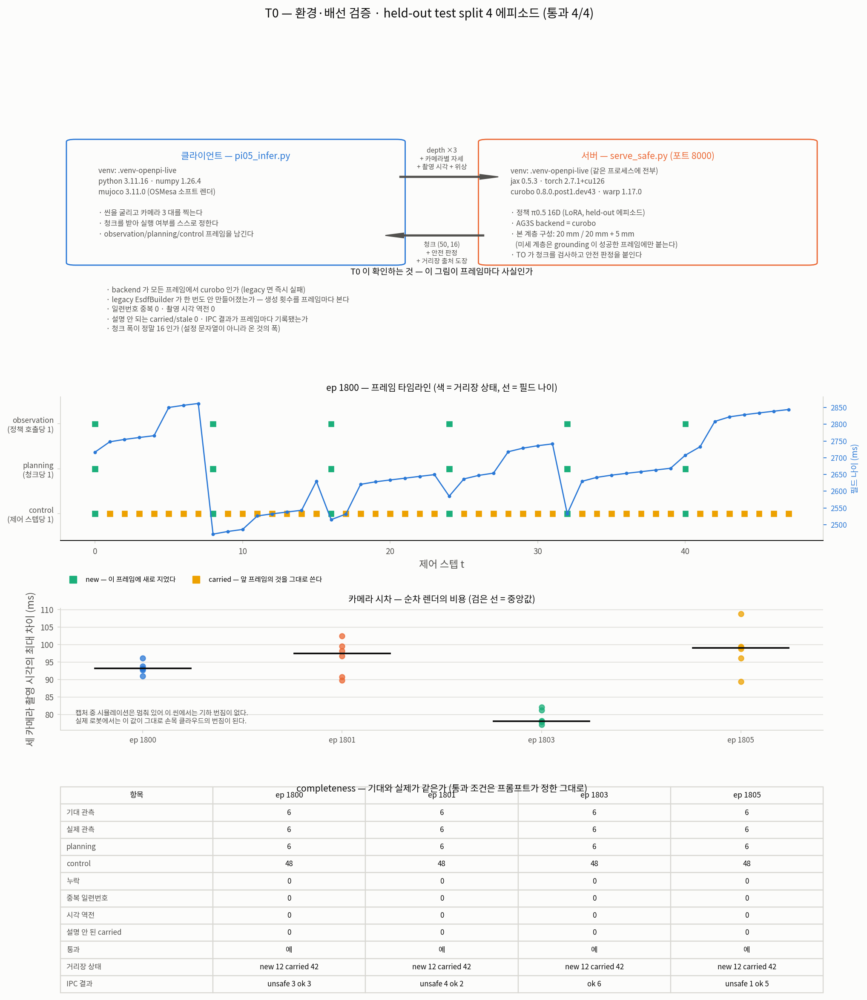

### 검증

| 무엇 | 결과 |
|---|---|
| 테스트 | **625 통과 — 불변** (`EsdfBuilder` 카운터 추가 후 재실행) |
| T0 판정 | `verify_t0.py` 8 항목 × 4 에피소드 **전부 통과** |
| 기록 완결성 | 관측 6/6 · planning 6 · control 48 · 누락 0 · 중복 0 · 역전 0 · 설명 안 된 carried 0 (4 에피소드 동일) |
| 실시간성 | **실패 — 24/24 청크가 533 ms 예산 초과, 중앙값 4.7 배** |

### 전체 틀에서 지금 어디인가 (규칙 B)

```
카메라 depth ✓ → 로봇 마스크 ✓ → attention lifting ✓ → grounding ✓ + 잠금 ✓
   → TSDF/ESDF ✓cuRobo 2계층 ✓라벨 층 ✓해석적 채널 ✓출처 도장 ✓쥔 물체 양면
   → 거리장 어댑터 ✓ → SQP 선형화 ✓ → QP 해 ✓ → 안전 게이트 ✓
   → 프레임 기록 ✓ observation ✓ planning ✓ control ✓ completeness
   → T0 ✓ 배선이 프레임마다 사실이다 / ✗ 실시간 예산은 4.7 배 초과
```

닫힌 것: **16D 모델 위에서 파이프라인 전체가 새 씬에서 끝까지 돌고, 프레임마다 무엇이
새 값이고 무엇이 물려받은 값인지 기록이 말한다.** 그리고 legacy 가 조용히 도는 경로가
불변식으로 막혔다.

다음: **T1 — 연속 프레임에서 실제 정책 attention 으로 지각을 재는 것.** T0 이 "배선이 있다"
까지만 말하므로, 이제 그 배선을 타고 온 것이 쓸 만한지 프레임 카드로 본다. 같은 에피소드
반복으로 위의 재현성 물음도 같이 닫는다.

---

## 회귀 기준선을 16D 로 갈았다 (2026-09-24) — 14D 기준선은 **실행 불가**가 됐다

T0 뒤 `esdf.py`·`pipeline.py` 를 건드렸으니 회귀 기준선을 돌렸는데 **죽었다.**

```
ValueError: chunk has 14 columns but the layout needs at least 16
```

내가 넣은 카운터 때문이 아니다. `run_0004` 의 저장된 청크는 14 열이고 `wire.ACTION_WIDTH` 는
16D 전환으로 16 이 됐다. 즉 **사용자 판정("16D 로 전환 — 14D 는 버린다")의 결과로 CLAUDE.md
의 기준선이 실행 불가가 된 것**이고, 전환 작업에서 이것을 같이 갈지 않은 것이 빠진 자리였다.

기준선은 "이 숫자가 다르면 코드를 고치기 전에 원인부터 찾는다" 는 안전망이다. 없는 채로
T1 을 시작하면 그다음의 모든 변경이 무방비다. 그래서 먼저 세웠다.

### 세운 사슬

| 단계 | 무엇 | 결과 |
|---|---|---|
| 1 | held-out ep1800 을 **평범한 정책 서버**(8123)로 120 제어 스텝 굴려 기록 | `run_16d_ep1800/` 15 관측 (`state (16,)`, `actions (50,16)`) |
| 2 | 같은 체크포인트로 attention 추출 (`sources/pi05_attention`) | `asset/data/attention_16d_ep1800.npz` — `(15,3,3,18,8,3,16,16)` fp16 21.6 MB |
| 3 | `esdf_rollout` 로 기준선 | **위반으로 시작 15/15 · 해소 13 / 개선 15 / feasible 13, violated 2** |

**덤으로 얻은 수치**: 평범한 정책 infer 가 **0.09 초**다. serve_safe 경로의 2725 ms 와 비교하면
정책 자체는 거의 공짜이고 **2.7 초 전부가 AG3S+TO** 라는 것이 독립적으로 확인된다.

### 첫 시도가 기준선 구실을 못 했다 — `--cameras head` 의 전제가 씬에 묶여 있었다

옛 기준선 명령 그대로(head 한 대) 돌리자 후보 0, 시작 위반 **0/15**, 여유거리가 전부
+166~+220 mm 였다. **고칠 것이 없는 판을 기준선으로 삼으면 안 된다.** 해소 0 / 개선 13 은
좋아 보이지만 아무 제약도 걸리지 않은 결과이고, 그 상태에서는 충돌 처리의 어떤 회귀도 안
잡힌다. 통과 기준을 낮추는 것과 같다.

세 카메라로 바꾸면 시작 위반 15/15 로 **고칠 것이 생긴다.** 옛 head-only 관례는 `run_0004`
씬에 묶여 있던 것이고, 에피소드 기반 씬에서는 성립하지 않는다. 세 대는 서빙 경로와 같은
진입점이라는 점에서도 낫다.

**여기서 처음에 원인을 잘못 짚었다 — 그림이 잡았다.** head 실행의 `target: false` 를 보고
"head 한 대로는 grounding 이 안 된다" 고 적었는데, 그림에 두 구성을 나란히 그리자 **세
카메라에서도 grounding 성공 0/15** 였다. `has_target`(`ag3s/types.py:913`)은 *조작 대상이
grounding 됐는가*이고 두 구성 모두 실패한다. 세 카메라가 바꾼 것은 grounding 이 아니라
**필드에 담긴 관측 기하의 양**이다 — 손목 카메라가 테이블·과일·바구니를 보므로 로봇 구가
마진 안으로 들어오고, head 한 대로는 필드가 비어 아무것도 가깝지 않다.

규칙 A 가 말하는 바로 그 경우다: 숫자를 문장에 흩어 놓았을 때는 놓쳤고, 두 계열을 한 축에
그리자 즉시 보였다.

### 기준선으로 인용할 수준 — 개수까지다

같은 입력으로 네 번 돌려 **개수는 전부 같았다.** 프레임별 값은 아니었다:
프레임 13·14 의 `clearance_after` 가 4.19 ↔ 4.97 mm, SQP 반복이 2 ↔ 3.

원인은 설계다. `sqp.time_budget_ms` 가 **벽시계 마감**이고(`trajopt/sqp.py:8,159` — *"The budget
is a deadline, not a suggestion"*) 1 회 이상 돈 뒤 예산을 넘으면 끊는다. 기계 부하가 반복 수를
바꾸고, 반복이 하나 더 돌면 여유거리가 조금 더 좋아진다. **딱지(해소/개선/feasible)는 제약이
풀렸는지로 정해지므로 흔들리지 않는다** — CLAUDE.md 가 예전부터 개수만 인용해 온 이유가
여기서 처음 설명됐다.

CLAUDE.md 의 기준선 블록을 갈고, 위의 세 가지(개수만 인용 · 14D 은퇴 사유 · `--cameras all`
이 필요한 이유)를 그 자리에 적었다. `.claude/ag3s-rules.md` 에는 기준선 블록이 없어 한 곳만
고쳤다 (규칙 본문은 이중이지만 기준선은 CLAUDE.md 에만 있다).

`run_0004` 와 `attention_step1_run0004.npz` 는 **지우지 않는다** — 14D 기록을 읽는 과거 실험
스크립트들이 그대로 쓴다. 은퇴한 것은 *기준선으로서의 역할*뿐이다.

### 이 기준선이 **재지 못하는 것** — 그리고 T1 이 먼저 닫아야 할 것

새 기준선은 **depth → 자기 필터 → 필드 → 거리장 어댑터 → SQP → QP** 를 재고,
**attention → target grounding 은 재지 않는다.** 15/15 프레임에서 `has_target: false` 이기
때문이다. 기준선으로 쓸 수는 있지만(회귀는 충돌 처리 쪽에서 잡힌다) **전 구간 기준선이라고
불러서는 안 된다.**

그리고 이것이 T1 의 첫 과제를 정한다. **오프라인에서는 grounding 이 15/15 실패하는데 live
경로는 같은 에피소드에서 성공한다** (T0 에서 AG3S `ok` + 미세 계층이 붙었고, 미세 계층은
grounding 된 대상이 있어야 붙는다). 차이는 오프라인이 **저장된 attention npz + 고정된 셀
선택**(층·헤드·agg·denoise)을 쓰고 live 는 서버가 자기 1단계에서 셀을 정한다는 것이다.
그 셀 선택은 14D 모델에서 정해진 것이므로(L8H2), 16D 모델에서 그대로 성립하는지가 열린
물음이다 — 사용자가 "이전 테스트도 새 모델로 다시 해보라" 고 한 것이 정확히 이 지점이다.

**추측으로 닫지 않는다.** T1 에서 같은 기록에 셀을 쓸어 grounding 성공률을 재고, live 서버가
실제로 고른 셀과 맞춰 본다.

> **닫혔다 — 그리고 위 짐작은 기각됐다** (`T1-a`, 2026-09-25). 셀을 **1296 조합 전수**로
> 쓸었고 `peak_on_target` 이 **어느 조합에서도 0** 이었다. `L8H2` 가 16D 에서 안 맞는 것이
> 아니라 **셀 축에 답이 없다.** 오프라인과 live 의 진짜 차이는 **attention 을 어느 카메라에
> 붙이느냐**였다 — 오프라인은 `zed_left` 한 대에만 붙이는데(`esdf_rollout.py:266`)
> **사과가 그 카메라에 한 프레임도 안 찍힌다**(0/15 · 0/50). live 는 세 대에 각각 붙인다.
> **짐작을 지우지 않고 남긴다** — 무엇을 어떻게 잘못 짚었는지가 그 자체로 자료다.
> 측정은 아래 **"T1-a"** 절.

### 검증

| 무엇 | 결과 |
|---|---|
| 새 기준선 4 회 반복 | 해소 13 / 개선 15 / feasible 13, violated 2 — **전부 동일** |
| 새 기준선이 재는 범위 | depth → 자기 필터 → 필드 → SQP → QP. **attention → grounding 은 안 잰다** (`has_target` 15/15 false) |
| 테스트 | **625 통과 — 불변** |
| 옛 기준선 | **실행 불가** (14 열 기록 대 16 열 layout) — 은퇴 확정 |

### 시각화

* **[`figures/live-test/baseline-16d.png`](figures/live-test/baseline-16d.png)** —
  head 한 대 대 세 대의 프레임별 여유거리(head 는 시작부터 전부 양수), 같은 입력 5 회의
  프레임별 값 흔들림과 실행 간 폭, 옛/새 기준선 비교 표.

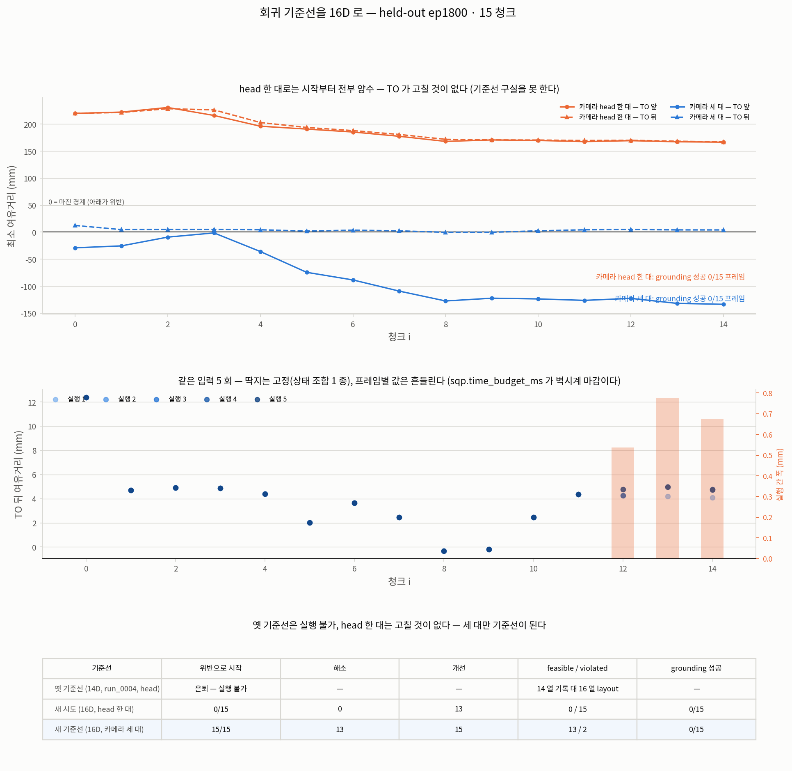

---

## 왜 8000 인가 — 두 서버는 다른 프로그램이다 (2026-09-24, 사용자 질문)

사용자가 띄운 서버는 **8123 `serve_policy.py`** 이고 나는 T0 을 **8000 `serve_safe.py`** 로
돌렸다. 같은 모델인데 포트를 옮긴 것처럼 보이지만, 옮긴 것이 아니라 **다른 프로그램**이다.

### 토대는 같다

두 프로세스의 명령줄에서 읽은 것(추정이 아니다):

| | 8123 `serve_policy.py` | 8000 `serve_safe.py` |
|---|---|---|
| config | `pi05_rby1_randomized_pick_place_16d_lora` | **같다** |
| checkpoint | `rby1_randomized_pick_place_16d_30k_xla_retry_20260923/29999` | **같다** |

그래서 T0 은 **사용자의 새 모델을 시험한 것**이다. 다른 체크포인트를 쓴 것이 아니다.

### 다른 것은 그 위에 얹힌 것이다

와이어 계약의 정의는 `benchmark/trajopt/wire.py` 한 곳이다.

| 와이어 키 | 8123 | 8000 | T0 에서 무엇에 쓰이나 |
|---|---|---|---|
| `actions` | 있다 | 있다 | — |
| `ag3s/depth` · `K` · `T_base_cam` | **받지 않는다** | 받는다 | ESDF 를 지을 재료 |
| `ag3s/robot_state` (카메라마다 따로) | **받지 않는다** | 받는다 | 손목 클라우드 번짐·자기 필터 어긋남 방지 |
| `ag3s/stamp` | **받지 않는다** | 받는다 | 카메라 시차, 필드 나이 |
| `ag3s/seq` (일련번호 왕복) | **돌려주지 않는다** | 돌려준다 | 오래된 응답 버리기, 중복 검사 |
| `ag3s_status` · `geometry_certified` | **없다** | 있다 | 프레임별 인증 여부 |
| `trajopt_status` · `max_violation_m` · `safe` | **없다** | 있다 | 안전 게이트가 실제로 걸리는가, IPC 결과 |
| `field` (거리장 출처 도장 14 키) | **없다** | 있다 | **T0 의 핵심** |

**T0 이 프레임마다 요구한 것이 전부 아래 칸에만 있다.** T0 은 "이 배선 그림이 프레임마다
사실인가" 를 묻는 게이트이고, 그 물음의 대상 — 출처 도장, 안전 판정, IPC 결과 — 은 정책
서버가 내놓는 것이 아니다.

**더 구체적으로**: `--safe-remote` 를 8123 에 물리면 `client.infer` 가 `result.get("seq", -1)`
을 보고(`trajopt/client.py:112`) 요청 일련번호와 다르므로 **모든 청크를 `stale` 로 hold** 한다.
기록에는 hold 만 남고 필드도 판정도 없다. 실행이 죽지는 않지만 T0 은 아무것도 재지 못한다.

### 8123 도 실제로 썼다

| 이번 작업의 단계 | 쓴 서버 | 왜 |
|---|---|---|
| T0 (4 에피소드 × 48 스텝) | **8000** | 프레임마다 출처 도장·안전 판정·IPC 가 필요하다 |
| 16D 회귀 기준선의 기록 만들기 (ep1800, 120 스텝) | **8123 (사용자 서버)** | AG3S 는 오프라인에서 적용한다 — `run_0004` 를 만든 방식과 같다 |
| attention 추출 | 서버 없음 (체크포인트 직접 로드) | `return_attn_probs` 는 서버 프로토콜로 못 뽑는다 |

**그리고 8123 에서 얻은 수치가 하나 있다**: 평범한 정책 infer 가 **0.09 초**다. 8000 왕복
2.5 초와 견주면 2.4 초가 전부 AG3S+TO 라는 것이 독립적으로 확인된다 — 이 비교가 가능했던
것은 두 서버를 나란히 썼기 때문이다.

### 포트는 8123 을 피한 것이지 고른 것이 아니다

`serve_safe` 의 기본 포트는 8000 이다(`serve_safe.py:175`). 8123 은 사용자 서버가 잡고 있어
(내 첫 시도가 `OSError: [Errno 98] address already in use` 로 죽었다) **사용자의 프로세스를
건드리지 않기 위해** 기본값을 그대로 뒀다.

### 되돌아올 지점 — 8123 을 T1 이후에 쓰는 구성이 실제로 있다

지금은 AG3S·TO 가 **서버 쪽**에 있다(`--safe-remote`). 대안은 **정책만 원격**으로 두고
AG3S·TO 를 클라이언트 프로세스에서 돌리는 것이다 — `pi05_infer --trajopt --remote
localhost:8123`. `.venv-openpi-live` 에 warp·curobo·mink 를 다 넣었으므로 기술적으로 가능하다.

| | `--safe-remote` (지금) | `--trajopt` + 8123 |
|---|---|---|
| 정책 | 서버 | 서버 (사용자 것 그대로) |
| AG3S·TO | 서버 | **클라이언트** |
| depth 가 네트워크를 건너나 | 건넌다 (3 대 × uint16) | 안 건넌다 |
| 실기 배치에 가까운가 | 지각까지 원격 | **지각이 로봇 쪽 — 이쪽이 가깝다** |
| T0 의 출처 도장·IPC 기록 | 와이어로 온다 | 프로세스 안이라 IPC 가 없다 |

**전환 신호**: (1) depth 전송이 실시간 예산에서 유의미한 몫을 차지하는 것이 측정되면,
(2) 실기 배치에서 지각을 로봇 쪽에 두기로 정해지면. 지금 안 옮기는 이유는 T0~T4 가
**프레임별 IPC 기록**을 판정 항목으로 요구하고, 한 프로세스 안에서는 IPC 가 아예 없어져
그 항목이 "해당 없음" 이 되기 때문이다. 옮기는 것은 T5·T6(실기 닫힌 루프)에서 다시 본다.

### 시각화

* **[`figures/live-test/two-servers.png`](figures/live-test/two-servers.png)** —
  같은 토대 위의 두 계약 도식, 와이어 키 대조표, 이번 작업에서 각 서버를 쓴 자리.

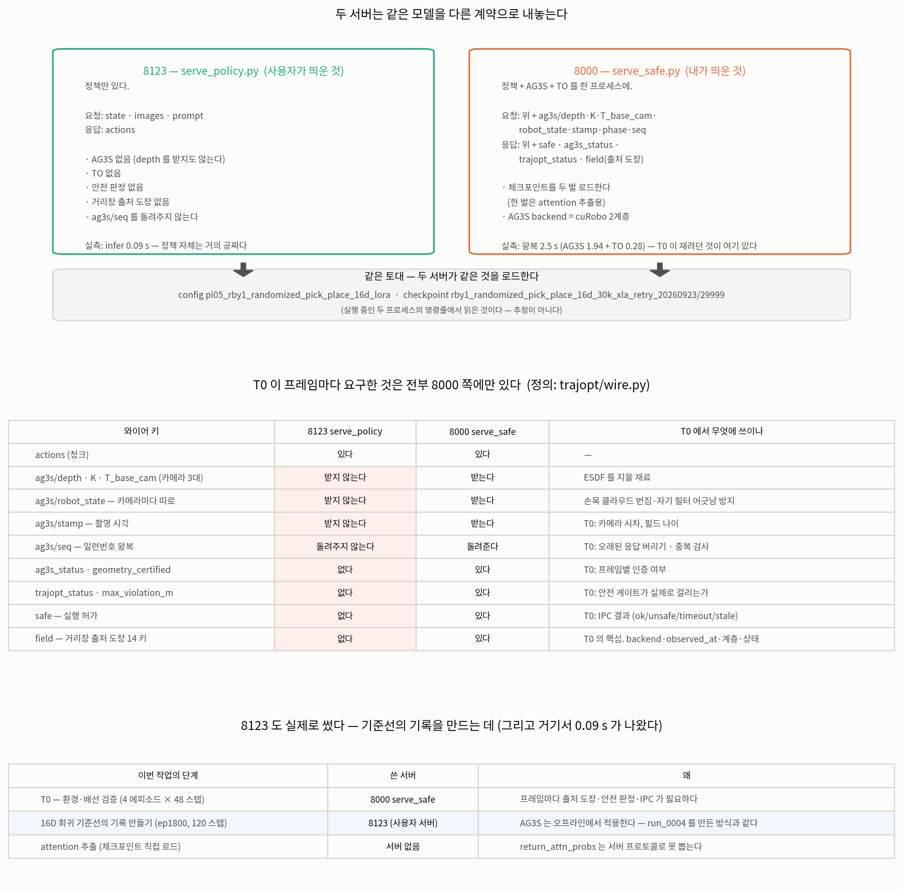

---

## R — 재측정 7건을 16D 로 (2026-09-25)

> **R 은 이제 16D 단독 측정이다** (사용자 판정 6, 2026-09-25) — *"14D 랑은 비교하지 마.
> 14D 기록은 파기하고 16D 로 새로 측정하고, AG3S 도 16D 에 맞춰 수행한다."* 물음이
> *"14D 값이 16D 에서도 같은가"* 에서 **"16D 에서 이 값은 얼마인가"** 로 바뀌었다.
> 값 표에서 `14D 값`·`달라졌나` 두 열을 없앴다 — 이유는 **"왜 이 표에 14D 열이 없나"** 절.
>
> **1 차 끝 — R 을 `R-port`(이식) / `R-measure`(측정) 로 쪼갰다.**
> 한 줄 결과: **분류로는 7 중 4 가 `runs` 인데, 그때 쓸 수 있는 수치는 1 건이었다.**
> 무효였던 이유는 전부 **스크립트가 16D 를 안 먹었기 때문**이지 값이 틀려서가 아니다.
> 이식은 끝났다(아래 `R-port` 절, 테스트 648). 남은 것은 `T1-a` 와 X1 이다.
> 출처: [`handoff/R.smoke.verify.json`](handoff/R.smoke.verify.json) (`benchmark` HEAD `5e35204`,
> `benchmark/**/*.py` 무수정).
>
> **그리고 R 은 지금 `T1-a` 에 막혀 있다.** R4·R5 는 미세 계층이 있어야 잴 수 있는데 이
> 기록에서 미세 계층이 **하나도 안 붙는다**. 원인은 grounding 실패이고, 그것은 attention
> **셀 선택**의 문제다 — 아래 **"막는 사실"** 절.

### 왜 지금 이것인가

위 **"물려받은 수치의 모델 출처 — 재측정 대기"** 표의 일곱 건은 **결정은 유효한데 수치가
14D 기록(`run_0004`/`run_0005`)에서 나온 것**이다. 사용자 판정(2026-09-24) *"이제부터 모든
테스트는 새로 파인튜닝한 16D 모델로"* 가 이것을 열어 두었고, 파지를 포함한 16D 긴 기록
(`outputs/live_test/20260924_long16d/run_0000/`, 정책 호출 50 · 제어 392 스텝)이 확보되어
이제 닫을 수 있다.

**T1 을 열기 전에 닫는 이유**: T1~T6 의 게이트 판정이 이 일곱 수치를 **전제로** 쓴다.
전제가 14D 인 채로 게이트를 통과시키면 통과 기준을 낮춘 것과 같아진다 — T0 에서 만난
*"기대 쪽이 틀린 경우"*(관측 기대치를 제어 스텝 수로 잡았던 것)와 같은 종류의 실패다.

**그리고 2026-09-25 에 성격이 한 번 더 바뀌었다.** 처음에는 *"14D 값이 16D 에서도 같은가"*
를 물었는데, 사용자 판정으로 **14D 를 기준의 자리에서 내리고 16D 단독으로 새로 재는 것**이
됐다. 위 일곱 건은 이제 *"다시 재야 할 목록"* 이지 *"견줄 값의 목록"* 이 아니다.

### 무엇을 재나 — 일곱 건이 가리키는 발견 (규칙 G)

| # | 가리키는 발견 — 한 줄 풀이 | 스크립트 |
|---|---|---|
| **R1** | **I2** — `pipeline._build_esdf` 를 legacy numpy 필드에서 cuRobo 로 갈아탄 통합 스텝. 여기서 재는 것은 **같은 씬에서 두 backend 의 거리가 얼마나 다른가** | `ag3s/experiments/live/verify_backend.py` |
| **R2** | (발견 ID 없음) **cuRobo 별도 기준선** — legacy 회귀 기준선과 나란히 두는 cuRobo backend 단독 rollout | `trajopt/experiments/esdf_rollout.py` |
| **R3** | (발견 ID 없음) **쥔 물체 부호 교정 문턱** — seed 제외 뒤 몇 복셀에서 *순수 복셀* 과 *공유 복셀* 을 가르나 | `ag3s/experiments/live/sweep_attached_threshold.py` |
| **R4** | **C5** — 거친 20 mm 계층이 판정 지점에서 clearance 를 실제보다 넓다고 답한다 (참 거리 대조로 확정) | `ag3s/experiments/curobo/verify_two_tier.py` · `ground_truth.py` |
| **R5** | **C3** — 미세 계층의 창 경계에서 거리장이 낙관적으로 불연속이다 (2계층 합성 규칙 고유) | 위와 같은 계열 |
| **R6** | **N1**(self-collision 제약이 `benchmark/trajopt/` 에 코드 0 줄로 아예 없다 — 잠복. **정정**(2026-09-25): 제약 행은 AG3S 에서 실제로 만들어진다 — `benchmark/ag3s/constraints/constraint_builder.py:280-289` 가 쥔 물체 대 로봇 자기 구의 여유거리 행을 만들고 `:163-164` 가 행 수를 센다. trajopt 이 평가하지 않는 이유는 자체 선형화(`benchmark/trajopt/linearize.py:3-20`)를 따로 만들어 사용하기 때문이다 — 그 선형화는 질의점끼리의 쌍을 계산하지 않는다) · **N2**(아는 정적 기하를 담을 geometry 채널이 없어 격자 밖·미관측이 무조건 자유로 답해졌다 — `min(복셀, 해석적)` 해석적 채널로 수정됨) · **F20**(옮겨진 물체의 *잔상* 이 8 프레임 뒤에도 남는다 — TSDF 가중치가 `min(w+1,64)` 로 단조 증가해 옛 관측이 흐려지지 않는다. decay 는 구현했고 기본값은 끔) | `studies/a1_static_geometry_effect.py` 계열 |
| **R7** | **F14** — `timing.max_state_age_sec` 기본값 100 ms 가 피해 시작점보다 6 배 이상 느슨하다. 상태 지연이 몇 ms 부터 로봇 점을 클라우드로 새게 하나 | `ag3s/experiments/studies/step7_state_lag.py` |

원 측정은 전부 archive [`AG3S_REVIEW_LOG.md`](AG3S_REVIEW_LOG.md) 에 있다 — I2 는 **"I2 —
`_build_esdf` 가 cuRobo 를 부른다"** 절, R3 의 문턱은 **"문턱을 실제 파지에서 쓸어 정했다"**
절, C3·C5·N1·N2·F14·F20 은 **"누적 발견"** 표의 해당 행.

---

### 1 차 결과 — **분류가 `runs` 여도 측정이 아닐 수 있다**

먼저 회귀 기준선을 돌려 환경이 성한지부터 봤다. **개수 5/5 일치** — 시작 위반 15/15 ·
해소 13 · 개선 15 · `feasible` 13 · `violated` 2. 아래 측정은 성한 환경에서 났다.

| # | smoke 분류 | 16D 긴 기록을 **실제로 먹었나** | 무엇이 걸렸나 |
|---|---|---|---|
| R1 | **`broken`** | 아니오 | `--records` 옵션이 없다. seed 로 **새 씬을 만들고** `used_saved_run: false` 를 박는다. 그리고 한 프로세스에서 legacy 와 cuRobo 를 둘 다 만들어 T0 불변식(`pipeline.py:906`)에 걸려 죽는다 |
| R2 | `runs` | 예 | 1 차가 **합성 attention** 이었다 (실측 npz `attention_16d_long.npz` 가 있는데 못 찾았다). 실측으로 다시 돌리니 **수치가 한 자리도 안 바뀌었다** — 아래 별도 절. 게다가 같은 명령 반복에서 `feasible` 이 1 회 이탈한다 |
| R3 | `runs` | **아니오** | `--records` 가 없어 `TransportScene` 으로 새 씬을 만든다. 문턱은 *실제 파지* 구간에서 쓸어야 뜻이 있는데 그 구간을 안 먹었다. 게다가 고른 문턱 **3.0** 이 후보 목록의 **상한값**이라 잘린 값이지 측정이 아니다 |
| R4 | **`needs-outpath`** | 아니오 (혼합) | `--records` 는 16D 를 가리켰는데 depth·마스크·필드는 **2026-09-12 자 `/tmp` npz** 에서 왔다. **로봇 자세만 16D, 관측과 필드는 14D 인 혼합 실행**이고 스크립트가 그 불일치를 안 잡는다. 출력 경로도 박혀 있어 archive 그림을 덮어썼다 (아래 규약 절). **그리고 그보다 앞서는 문제가 있다 — 미세 계층이 없다** |
| R5 | **`needs-arg`** | 아니오 | `/tmp/rby1_frame.npz`(2026-09-11 산물)를 말없이 읽는다. argparse 가 없어 다른 프레임을 먹일 방법 자체가 없다. **R4 와 같이 미세 계층이 없어 경로를 고쳐도 못 잰다** |
| R6 | `runs` | **예** | N2 는 그대로 돌아 **수치가 났다**(아래). N1 은 재는 스크립트가 repo 에 없고, F20 은 1 차에서 안 돌렸다 |
| R7 | `runs` | 예 | 돌았지만 `STEP_MS = 16.0` 이 **무엇에 곱해지는 상수인지 확정되지 않았다.** 기록의 `t_step` 은 제어 스텝을 8 씩 세므로 한 스텝이 16 ms 가 아닐 수 있다 — 단위가 확정되기 전의 값을 14D 와 나란히 놓으면 잘못 읽힌다 |

**분류 집계**: `runs` 4 · `broken` 1 · `needs-arg` 1 · `needs-outpath` 1.
`.venv-openpi-live` 로 전부 다시 확인했고 **재분류된 것은 0 건**이다 — `broken` 은 환경 선택이
아니라 실제 결함이다.

> **이 라운드가 실제로 답한 것은 수치가 아니라 이것이다.** `runs` 는 *프로세스가 0 으로
> 끝났다* 는 뜻이지 *16D 를 쟀다* 는 뜻이 아니다. 네 건이 `runs` 인데 그중 셋이 새 씬을
> 만들거나 14D 시대 `/tmp` npz 를 먹고 있었다. **이식 비용을 측정 결과로 착각할 뻔한
> 자리**이고, smoke 분류를 수치보다 먼저 세기로 한 이유가 여기서 값을 했다.

### R2 재측정 — **실측 attention 을 붙여도 수치가 한 자리도 안 바뀐다**

1 차의 R2 는 합성(synthetic) attention 으로 돌았다. 이 기록에 맞는 실측 npz 가
**있다** — `benchmark/ag3s/asset/data/attention_16d_long.npz` (50 프레임, `records` 가 이 긴
기록을 가리키고 `t_step` 0…392 가 일치, 체크포인트도 같다). 그것을 붙여 다시 돌렸다.

| 실행 | backend | attention | 시작 `violated` | `feasible` | `violated` | SQP 반복 중앙 | `has_target` |
|---|---|---|---:|---:|---:|---:|---:|
| legacy | legacy | **실측** | 15 | 12 | 3 | 2 | **0/15** |
| legacy | legacy | synthetic | 15 | 12 | 3 | 2 | **0/15** |
| cuRobo | curobo | **실측** | 12 | 7 | 8 | 1 | **0/15** |
| cuRobo | curobo | synthetic | 12 | 7 | 8 | 1 | **0/15** |

**실측과 합성이 완전히 같고, 네 실행 전부 `has_target` 0/15 다.** 파낸 target 복셀도 0 개다.

이것은 "attention 을 안 줬다" 는 절차 실수가 아니라 **결과**다. 실측 attention 이 들어와도
수치가 한 자리도 안 움직인다는 것은, **attention 이 grounding 까지 도달하지 못한다**는 뜻이다.

> **그때는 이유를 *셀 선택*(14D 에서 정해진 `L8H2`)으로 짐작했다. 그 짐작은 기각됐다.**
> `T1-a` 가 1296 조합을 전수로 돌려 **어느 셀도 안 맞는다**는 것을 보였고, 진짜 원인은
> **배선** — 오프라인이 attention 을 `zed_left` 한 대에만 붙이는데 **사과는 그 카메라에
> 한 번도 안 찍힌다** — 이었다. 아래 **"T1-a"** 절.

### 막는 사실 — **미세 계층이 하나도 안 붙는다** (R4·R5 가 여기서 멈춘다)

`outputs/verify/R/rollout_fields_16d.npz` 의 키가 **`coarse 45 / fine 0`** 이다
(15 프레임 × 거친 계층 3 키). `build_rollout_fields` 가 15 프레임 전부
*"계층 1 (target 없음 — 거친 계층만)"* 을 찍는다.

미세 계층(5 mm)은 **grounding 된 target 의 무게중심에 놓인다**. 그러니 의존이 이렇게 걸린다.

```
attention 배선(오프라인은 zed_left 한 대) → grounding 실패 0/15 → 미세 계층 0 개
   ↑ 그 카메라에 사과가 0 px                                     → R4(C5)·R5(C3) 잴 대상 없음
```

*(이 사슬의 첫 칸은 처음에 **셀 선택**으로 적혀 있었다. `T1-a` 가 **배선**으로 정정했다 —
아래 절.)*

**R4 와 R5 는 이 기록에서 비교 대상 자체가 없다.** R4 는 *거친 20 mm 계층 대 2계층* 의 낙관을
재고 R5 는 *미세 창 경계* 의 불연속을 재는데, 둘 다 미세 계층이 있어야 성립한다.
**출력 경로를 인자로 빼도(R4) 입력 경로를 인자로 빼도(R5) 여전히 못 잰다** — 이식이 문제의
앞이 아니라 뒤에 있었다.

A2 가 세 인자를 전부 16D 로 맞춘 자산은 이미 만들어 뒀다
(`outputs/verify/R/rollout_frames_16d.npz` · `rollout_fields_16d.npz`, eikonal 자가진단
`|∇d|` 중앙 1.000 통과). 막는 것은 자산이 아니라 grounding 이다.

### 재현성 — 1 회 이탈, **원인 미상**

같은 명령(legacy backend · 실측 attention · `--dump-frames` 없음) **4 회**의 `feasible`:

| 표본 | `feasible` | SQP 반복 중앙 |
|---|---|---|
| 동일 명령 4 회 | **12 · 7 · 12 · 12** — 1 회 이탈 | 다섯 표본 전부 **2** |
| + synthetic attention 실행 (나머지 동일) 5 회 | **12 · 12 · 7 · 12 · 12** — 1 회 이탈 | 〃 |

**앞선 판 `12·7·7·12·12` 는 정정됐다** — `--dump-frames` 가 붙은 다른 명령(`R4_dump_base`)을
같은 명령 표본에 섞은 집계 오류였다. lead 가 다섯 파일의 `frames[].status` 를 직접 세어
잡았고 A2 가 원인과 함께 `R.smoke.verify.json` 에 기록했다.

**흔들림의 원인은 아직 모른다 — 확정 전이다.** SQP 반복 중앙값이 다섯 다 2 라
*"반복 수가 줄어서"* 만으로는 설명되지 않는다. 그리고 `run_16d_ep1800` 회귀 기준선은 4 회
전부 같았고 **긴 기록에서만** 흔들린다. 추적은 `T1-a` 의 2 차가 맡았다 — **N 회 반복으로 덮지
않고 원인을 찾는다**(사용자 판정 5).

> **`T1-a` 2 차가 절반을 닫았다** — 아래 그 절의 **"재현성"** 소절. 답부터: **뒤집힌 것은
> 판정이 아니라 mm 이다.** 프레임 5·11·12·13·14 다섯 개가 **한 실행에서만** 뒤집히고, 두
> 실행은 소수 셋째 자리까지 같으며(계산은 결정적), 폭이 최대 35.52 mm 라 0 근처에서 갈린
> 것이 아니다. **원인은 여전히 미상이다.**

> `feasible`/`violated` 는 **0 을 기준으로 한 이진 딱지**라 +0.5 mm 와 −0.5 mm 가 갈린다.
> 그래서 먼저 가릴 것은 *"흔들린 것이 판정인가 mm 인가"* 이고, 그것은 이미 있는
> `outputs/verify/R/R2_repeat_*.json` 의 프레임별 `clearance_after_mm` 로 답할 수 있다.

### 16D 로 닫힌 것 — R6 의 **N2** 하나

**N2** = 아는 정적 기하(벽·선반·테이블·바닥)를 담을 geometry 채널이 없어 격자 밖·미관측이
무조건 자유로 답해졌던 것. 복셀에 찍는 대신 `EsdfField.static_shapes` 로 따로 재어
`min(복셀, 해석적)` 으로 합치는 **해석적 채널**로 고쳤다. 여기서 재는 것은 그 채널을 껐을 때
필드가 얼마나 **낙관**(= `필드가 답한 거리 − 참 거리`, 양수면 실제보다 넓다고 말한 것이라
위험)하는가다.

16D 긴 기록 15 프레임 · 정적 도형 16 개:

| 표본 | 해석적 채널 **끔** | **켬** |
|---|---|---|
| `arms` 120 구 (질의 1800) | 최대 낙관 **+258.2 mm** · 중앙 **+47.7 mm** · 낙관 질의 **1241** | 최대 **+0.0 mm** · 중앙 **0.0 mm** · 낙관 질의 **0** |
| `all` 194 구 (질의 2910) | 최대 낙관 **+408.0 mm** · 중앙 **+80.2 mm** · 낙관 질의 **2111** | 최대 **+0.0 mm** · 낙관 질의 **0** |

**16D 에서 해석적 채널을 켜면 낙관이 0 이다** — 최대도 중앙도 0.0 mm 이고, 낙관적으로 답한
질의가 `arms` 1800 중 **0 개**, `all` 2910 중 **0 개**다. 채널을 끄면 필드가 실제보다 최대
25.8 cm(`all` 에서는 40.8 cm) 넓다고 답한다.

읽는 법: **낙관은 양수만 위험하다.** 음수는 필드가 실제보다 가깝다고 답한 것이라 여유를 더
요구하는 쪽이고, 그것은 안전한 방향이다. 그래서 여기서 세는 것은 *양수 질의의 개수와 그
최댓값*이다. 끔 쪽의 포화 질의(`arms` 1084 · `all` 2194)는 거리가 `max_distance` 에서 잘려
"안 보인다" 가 "충분히 멀다" 로 읽힌 자리이고, 채널을 켜면 각각 558 · 798 로 준다.

### 값 — **16D 단독**이다 (사용자 판정 6)

| # | 무엇 | **16D 값** | 어떻게 쟀나 | 표본 |
|---|---|---|---|---|
| R1 | I2 — legacy 필드와 cuRobo 필드가 같은 씬에서 얼마나 다른가 | **산출 대기** | `verify_backend.py` 를 `dump`(각 backend 가 따로 npz 를 낸다) / `compare`(밖에서 대조) 두 프로세스로 가른다 — T0 불변식을 건드리지 않기 위해 (P1) | 16D 긴 기록 |
| R2 | cuRobo backend 단독 기준선 | **재현성 확정 대기** | `esdf_rollout.py --esdf-backend curobo`, 실측 attention npz `attention_16d_long.npz` | 15 프레임. 같은 명령 4 회 중 **1 회**가 5 프레임을 통째로 뒤집는다 — **0 근처 딱지 문제가 아니라 해가 다른 곳에 앉은 것**(`T1-a` 2 차). 원인은 미상 |
| R3 | 쥔 물체 부호 교정 문턱 — 몇 복셀에서 *순수 복셀* 과 *공유 복셀* 을 가르나 | **측정 대기** (P5) | `sweep_attached_threshold.py` 가 기록의 파지 구간을 먹게 하고 `--thresholds` 상한을 넓힌다 | **파지 프레임 4 개**(정책 호출 32~35). 호출 36 부터 세 카메라 모두 사과 픽셀 0 이라 쓸 수 없다 — **표본이 4 라는 것을 산출물에 명시하고 진행**(사용자 판정) |
| R4 | C5 — 거친 20 mm 계층이 판정 지점에서 clearance 를 얼마나 넓게 답하나 | **배선 정렬 대기** | 거친 계층과 2계층을 참 거리에 견준다. **지금은 견줄 2계층 쪽이 없다** — `coarse 45 / fine 0`. 원인은 `T1-a` 가 **배선**으로 좁혔다 (판정 8) | — |
| R5 | C3 — 미세 계층의 창 경계에서 거리가 얼마나 튀나 | **배선 정렬 대기** | 미세 창 경계를 가로질러 거리를 훑는다. **잴 대상인 창 자체가 없다.** R4 와 같은 원인 | — |
| R6 · N2 | 해석적 채널을 **끄면** 필드가 얼마나 낙관하나 | **끔 최대 +258.2 mm · 중앙 +47.7 mm · 낙관 질의 1241** → **켬 최대 +0.0 mm · 중앙 0.0 mm · 낙관 질의 0** (`all` 은 끔 **+408.0 mm** · 중앙 +80.2 · 낙관 질의 2111 → 켬 **0**) | `a1_static_geometry_effect.py` — 같은 프레임에서 채널 끔/켬 두 벌을 내고 참 거리에 견준다 | `arms` 120 구 × 15 프레임 = **질의 1800** (`all` 은 194 구 × 15 = 2910). 정적 도형 16 개 |
| R6 · N1 | self-collision — **움직일 수 있는 구**의 여유가 마진 안으로 들어오나 | **측정 대기** | `n1_self_collision_clearance.py` **신규**(P8). `rigid_spheres()` 로 고정 구와 움직일 수 있는 구를 **기구학에서** 가르고 두 집합의 여유를 따로 낸다 | 파지 프레임 4 개. **구 분할 자체가 X1 로 조사 중이다** |
| R6 · F20 | decay 를 끄면 *잔상* 이 얼마나 남나 | **측정 대기** | `a4_task_tsdf.py` 계열 | — |
| R7 | F14 — 상태 지연이 몇 ms 부터 로봇 점을 새게 하나 | **이 기록으로는 못 잰다** (아래 P7 절) | `step7_state_lag.py`. `STEP_MS` 상수를 없애고 기록 `meta` 에서 파생 | 기록 한 장 = **533 ms**. 0 이 아닌 가장 작은 지연도 설정 한계 100 ms 밖이다 |

**이 표를 채우는 규칙** — 16D 칸에 들어가는 모든 수치는 `R.verify.json` 의 `numbers` 를
출처로 갖는다. 거기 없는 숫자는 쓰지 않는다. **구현자(A1)가 스크립트가 도는지 보며 흘린
숫자도 쓰지 않는다** — 그것은 기능 확인이지 측정이 아니다.

### 왜 이 표에 14D 열이 없나 (사용자 판정 6, 2026-09-25)

이 절은 원래 *"14D 에서 나온 일곱 수치가 16D 에서도 그대로인가"* 를 물었고, 값 표에
`14D 값 │ 16D 값 │ 달라졌나·왜` 세 열이 있었다. **사용자 판정으로 물음이 바뀌었다** —
*"14D 랑은 비교하지 마. 14D 기록은 파기하고 16D 로 새로 측정하고, AG3S 도 16D 에 맞춰
수행한다."* 그래서 표는 **`16D 값 │ 어떻게 쟀나 │ 표본`** 이 됐다.

**14D 값이 틀려서 내린 것이 아니다.** 그 값들은 자기 자리에서 옳았고 archive
[`AG3S_REVIEW_LOG.md`](AG3S_REVIEW_LOG.md) 에 원 측정 그대로 남아 있다 — **그 파일은 고치지
않는다.** 내려온 것은 *기준으로서의 자리*다. 이유는 셋이 한꺼번에 다르기 때문이다:
**다른 모델**(14D LoRA ↔ 16D LoRA), **다른 기록**(`run_0004`/`run_0005` ↔ 16D 긴 기록),
**다른 action layout**(`ACTION_WIDTH` 14 ↔ 16, `ARM_JOINT_DIM` 6 ↔ 7 — 16D 에서 `arm_6`
손목이 자유 관절이 됐다). 셋이 동시에 다른 두 값을 한 행에 나란히 놓으면 **차이가 어느
축에서 왔는지 아무도 답할 수 없고**, 읽는 쪽은 그것을 "모델을 바꾸니 값이 변했다" 로 읽는다.
그것이 이 검토가 반복해서 경계한 **거짓 대조**다 — C2("거친 33 mm 대 미세 2 mm")와
"거리 포화 비교의 함정" 이 같은 모양이었다.

그러니 이 표는 **비교표가 아니라 16D 의 기준선**이다. 채워지는 값이 곧 T1~T6 이 전제로 쓸
수치가 된다.

### 사용자 판정 일곱 (2026-09-25)

| # | 판정 | 왜 |
|---|---|---|
| 1 | **R 을 `R-port`(이식) / `R-measure`(측정) 로 쪼갠다** | 되돌아올 지점이 *"`broken` 3 건 이상이면 이식이 본체"* 였다. 글자로는 `broken` 1 건이지만 **쓸 수 있는 수치가 1/7** 이라 취지가 맞는 자리다 |
| 2 | **R1 은 T0 불변식을 건드리지 않고 프로세스를 나눠 푼다** | 불변식(backend 가 `curobo` 인데 legacy `EsdfBuilder` 가 생기면 즉시 실패)은 *두 backend 가 한 프로세스에 공존하면 어느 필드가 판정에 쓰였는지 기록만으로 못 되짚는다* 를 막는 장치다. 비교하려고 그것을 푸는 것은 **안전망을 재료로 쓰는 것**이다. legacy 로 한 번, cuRobo 로 한 번 따로 돌려 각각 npz 로 내고 대조는 밖에서 한다 |
| 3 | **R7 은 `STEP_MS` 단위를 확정한 뒤 다시 잰다** | 상수를 박아 두고 잰 값은 단위가 바뀌면 통째로 뜻이 바뀐다. F14 자체가 *"측정 없이 정한 기본값"* 을 잡은 발견인데, 그것을 재는 스크립트가 같은 실수를 하고 있었다 |
| 4 | **T1 의 첫 과제(attention 셀 선택)를 R 앞으로 당긴다** | R4·R5 가 거기 막혀 있다 — 미세 계층은 grounding 이 서야 생기고, grounding 은 셀 선택에 달려 있다. **순환이 아니다**: 셀 선택은 R 의 수치를 하나도 쓰지 않으므로 거기서 끊을 수 있다. 배분표 [`handoff/T1-a.task.md`](handoff/T1-a.task.md) |
| 5 | **재현성은 N 회 반복으로 덮지 않고 원인을 추적한다** | 여러 번 돌려 다수결을 취하면 *흔들린다는 사실* 이 평균 안에 숨는다. 먼저 **어느 프레임이 뒤집히는지 · 그 프레임의 `clearance_after_mm` 가 0 에서 얼마나 가까운지**를 이미 있는 raw 로 가린다 |
| 6 | **14D 와 비교하지 않는다 — R 은 16D 단독 측정이다** | *"14D 랑은 비교하지 마. 14D 기록은 파기하고 16D 로 새로 측정하고, AG3S 도 16D 에 맞춰 수행한다."* 모델·기록·action layout 셋이 한꺼번에 달라 나란히 놓으면 차이가 어느 축에서 왔는지 답할 수 없다. 값 표에서 `14D 값`·`달라졌나` 두 열을 없앴다 (위 절) |
| 7 | **고정 구 이상(X1)을 즉시 조사한다** | P8 을 돌리다 **고정 구가 42 개**로 나왔다. 16D 에서 `arm_6`(손목)이 자유 관절이 됐으니 고정 구는 **줄어야** 맞는데 늘었다 — 방향이 반대다. **분할이 틀리면 회귀 기준선을 포함한 모든 여유거리 계산이 그 위에서 돈다.** 잠복해 있으면 뒤에 나오는 모든 수치가 그 위에 쌓인다 |

판정 3 의 부대 조건은 판정 6 이 흡수했다. 옛 값을 **새 단위로 다시 계산해 옮겨 적지 않는다** —
archive 의 값은 그 단위 그대로 archive 에 남고, 16D 값은 새 단위로 새로 잰다.

### `R-port` 이식 — 코드가 무엇이 바뀌었나 (A1, 2026-09-25)

**수치는 없다.** A1 이 스크립트가 도는지 보며 낸 숫자는 기능 확인이지 측정이 아니므로 여기
적지 않는다 (철칙). 적는 것은 **코드가 무엇이 바뀌었고 무엇이 테스트로 못박혔나**다.

**테스트 648 passed** — 기존 **625** 가 전부 그대로 통과하고 신규 `tests/ag3s/test_record_timing.py`
**23** 이 더해진 값이다. lead 가 직접 돌려 재현했다.

#### P6 — 단계 경계를 기록에서 파생한다. 그리고 **옛 상수가 재현됐다**

`ground_truth.py` 의 `_phase(t, b=(24,56,72))` 는 경계가 상수로 박혀 있고 플래그가 없었다.
긴 기록에서는 `t_step ≥ 72` 면 전부 `grasp` 이라 41 프레임이 잘못 라벨된다. 경계를 **그리퍼가
닫히는 시점**에서 뽑게 고쳤다.

세운 규칙을 14D `run_0004` 에 적용하면 **`(24, 56, 72)` 가 그대로 나온다** — 박혀 있던 바로
그 세 값이다. 같은 규칙이 16D 긴 기록에서는 `(208, 240, 256)` 을 낸다.

> **이것이 말하는 것**: 옛 상수는 규칙이 아니라 **한 기록에서 나온 답을 굳힌 것**이었다.
> 규칙으로 바꾸니 옛 답을 재현하면서 새 기록에도 따라간다. 상수를 규칙으로 되돌리는 것이
> 이식의 본체인 자리이고, 재현이 그 규칙이 지어낸 것이 아님을 증명한다.
> `test_derivation_reproduces_the_old_hardcoded_constants` 가 못박는다.

#### P7 — `STEP_MS` 는 상수가 아니라 기록에서 파생된다. **그리고 R7 의 판정 방향이 뒤집힌다**

먼저 **코드로 단위를 확정했다**(고치기 전에). `STEP_MS` 가 곱해지는 상대는 `--lags` 의 `k`
이고, 그 `k` 는 **기록 한 장** 단위의 지연이다. 기록 한 장의 간격은 `ctrl_hz = 15` ·
`open_loop_horizon = 8` 에서 **8 제어 스텝 = 533.3 ms** 다. 옛 `16.0` 은 `8 × 2 ms`(sim
timestep)로 **8 이 곱해질 상대를 잘못 잡은 값**이었다. 이제 기록 `meta` 에서 파생한다.

**그래서 R7 의 옛 결론이 성립하지 않는다.** 옛 출력은 *"설정 한계 100 ms 안에서 이미 새니
한계가 느슨하다"* 였는데, 새 단위에서는 **0 이 아닌 어떤 지연도 한계 밖**이다 — 가장 작은
비영 지연이 533 ms 이기 때문이다. 지금 스크립트가 찍는 판정은 이것이다:

> **이 기록의 해상도로는 한계 안쪽을 못 잰다.** 한계가 느슨한지 아닌지를 이 측정은 답하지
> 못한다 — 답하려면 **제어 스텝 단위 기록**이 필요하다.

**R7 의 수치는 그래서 이 절에 없다.** 값이 없는 것이 아니라, 이 기록으로 답할 수 없는 물음에
낸 값이라 기준으로 세울 수 없다.

#### P3 — 출처 도장 없는 **혼합 실행을 거부한다**

1 차에서 R4 가 *로봇 자세만 16D, 관측·필드는 2026-09-12 자* 인 채로 **exit 0** 으로 끝났다.
그것을 구조로 막았다: 생산자(`esdf_rollout --dump-frames`, `export_frame`)가 npz 에 출처
도장을 찍고, 중간 단계(`build_rollout_fields`)가 그대로 흘려보내고, 소비자
(`ground_truth.py`)가 **세 인자의 짝을 확인해 안 맞으면 `SystemExit`** 한다.
**도장이 없는 옛 형식도 통과시키지 않는다** — "모른다" 를 "맞다" 로 읽는 것이 그때 난 일이다.

덧붙여, 미세 계층이 없을 때 맨 `IndexError` 대신 *"코드 결함이 아니라 기록의 성질이다"* 까지
말하고 멈춘다. 읽는 쪽이 **버그와 "잴 것이 없다" 를 구별**할 수 있게 하는 것이 요점이다.

그 밖에 P1(R1 프로세스 분리) · P2·P4(박힌 출력·입력 경로를 인자로) · P8(N1 측정 스크립트
신규, `benchmark/ag3s/experiments/studies/n1_self_collision_clearance.py`)이 들어갔다.
**P5(R3 이 기록의 파지 구간을 먹게)는 사용자 판정으로 표본 4 프레임임을 명시하고 진행한다.**

### X1 — **고정 구가 42 개다. 방향이 반대다** (A1 조사 중, 사용자 판정 7)

P8 을 돌리는 중에 나왔다. `rigid_spheres()` 가 가른 **고정 구**(= 지금 자세에서 움직일 수
없는 로봇 구)가 **42 개**다. 16D 에서 `arm_6`(손목)이 자유 관절이 됐으므로 고정 구는
**줄어야** 맞는데 늘었다.

**왜 즉시인가**: 고정 구 / 움직일 수 있는 구의 분할이 틀리면 **그 위에서 도는 모든 여유거리
계산이 함께 틀린다 — 회귀 기준선까지 포함해서.** 잠복해 있으면 뒤에 나오는 모든 수치가 그
위에 쌓인다. N1 이 묻는 *"움직일 수 있는 구가 마진 안으로 들어오는가"* 도 이 분할이 정의한다.

답할 것 셋: (1) 분할이 **어디서** 정해지나(`파일:줄`) — 관절 자유도에서 파생되나 목록으로
박혀 있나, (2) 42 가 옳은가 틀린가, 옳다면 왜 늘었나, (3) 틀렸다면 **회귀 기준선이 영향을
받았나, 어느 방향으로.** 확장으로 **X2 — 16D 정렬 감사**(AG3S 안에 관절 수·action layout·
링크 목록·구 목록이 14D 를 전제하는 자리를 `파일:줄` 로 훑는다)가 같이 걸려 있다.

**이 절에 개수 말고 다른 수치를 적지 않는다** — A1 의 숫자는 스크립트가 도는지 본 부수물이고,
판정은 A2 가 재고 나서다.

### 환경 사실 정정 — venv 는 둘이 아니라 **셋**이다 (2026-09-25 실측)

CLAUDE.md 는 오래 *"venv 두 개이고 numpy 버전 때문에 합칠 수 없다"* 고 적고 있었다.
**틀렸다.** 세 번째가 있고, 거기에는 양쪽이 다 들어 있다.

| venv | 무엇이 있나 |
|---|---|
| `.venv-ag3s` (py3.11, numpy 2.4.6) | mujoco · casadi · osqp · scipy |
| `.venv-curobo` (py3.10, numpy 1.26.4) | torch · curobo · warp |
| **`.venv-openpi-live`** (py3.11, numpy 1.26.4) | **mujoco 3.11.0 · casadi 3.8.0 · osqp 1.1.3 · torch 2.7.1 · curobo 0.8.0 · warp 1.17.0 — 전부** |

직접 import 로 여섯 개 전부 확인했다. **이 사실을 모르면 `broken` 오판이 난다** — "mujoco 와
curobo 가 한 프로세스에서 못 돈다" 를 전제로 실패를 읽으면 환경 탓으로 돌리게 된다.
실제로 1 차에서 `broken`/`needs-*` 로 분류된 셋을 이 venv 로 다시 돌렸고, **재분류된 것은
0 건**이었다 — 전부 스크립트 쪽 결함이다. CLAUDE.md 는 고쳤다.

### 시각화 (규칙 A)

* **[`figures/r-16d/r-smoke-scene.png`](figures/r-16d/r-smoke-scene.png)** — 실제 씬. 16D 긴
  기록 위에 로봇 구·정적 도형·질의점을 실제 좌표로 겹쳐 그렸고, 단면은 **어디를 어느 방향에서
  잘랐는지 배치도를 먼저** 보인다.
* **[`figures/r-16d/r-smoke-trend.png`](figures/r-16d/r-smoke-trend.png)** — 그래프. 해석적
  채널 끔/켬의 프레임별 낙관 추이와 분포(R6 의 N2).
* **[`figures/r-16d/r-smoke-table.png`](figures/r-16d/r-smoke-table.png)** — 표·도식. 일곱 건
  × (분류 · 16D 를 먹었나 · 쓸 수 있나) 대조표.
* **[`figures/r-16d/step7-state-lag-0000.png`](figures/r-16d/step7-state-lag-0000.png)** —
  R7 이 낸 그림. **값은 아직 인용하지 않는다**(단위 확정 대기).

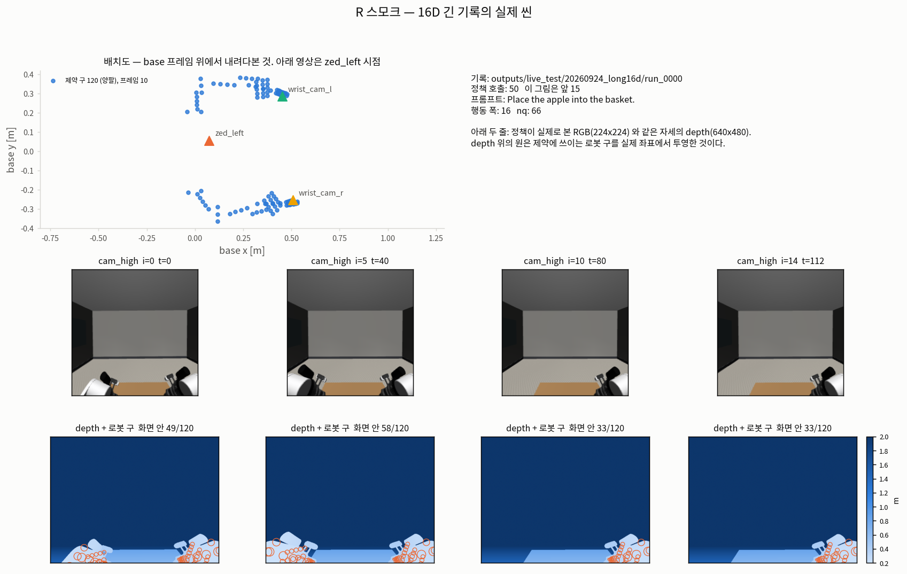

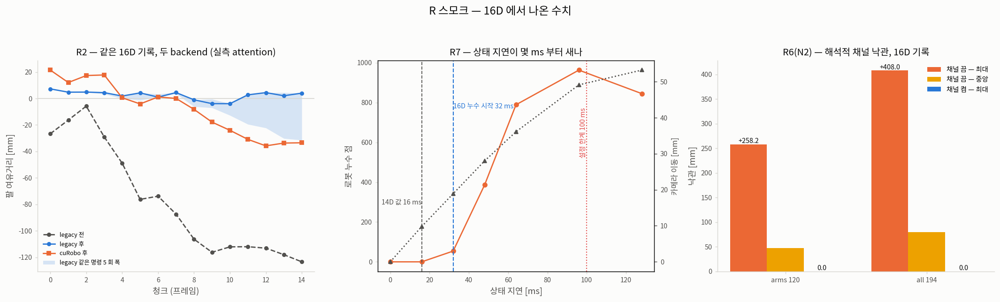

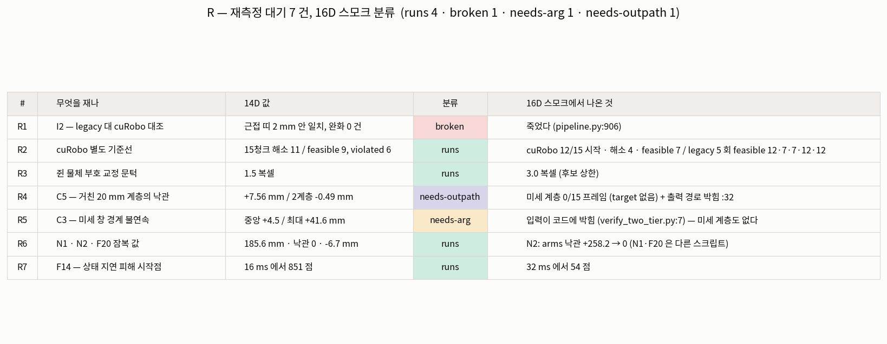

### 규약 — **재측정은 원 측정의 파일을 덮어쓰지 않는다** (실제로 한 번 밟았다)

R4 의 `ground_truth.py` 는 출력 경로가 코드에 박혀 있어(`:32` 의 `OUT`) 1 차 실행이
`archive/14d-era-20260923/figures/curobo-ground-truth.png` 을 **그대로 덮어썼다**. 그 그림은 archive
[`AG3S_REVIEW_LOG.md`](AG3S_REVIEW_LOG.md) 의 참 거리 대조 절과
`PIPELINE-STAGES-AND-CUROBO-ROLE.md` 가 **C5(거친 20 mm 계층이 판정 지점에서 clearance 를
넓게 답한다)의 14D 원 측정 증거로 링크**하는 것이다. 이름이 같으면 archive 의 **본문은 14D
숫자, 그림은 16D** 가 되어 서로 어긋난다 — 글이 가리키는 증거가 조용히 다른 것으로 바뀌는,
이 검토가 반복해서 만난 **조용한 실패**(잘못됐는데 아무 데도 안 찍히는 것)의 한 형태다.
게다가 덮어쓴 그 그림 자체가 **자세만 16D 인 혼합 실행**의 산물이었다.

처리: 덮어쓴 판을 `outputs/verify/R/OVERWROTE_curobo-ground-truth_16Dpose_14Dnpz.png` 로
따로 남기고 원본은 git 에서 복구한다. 출력 경로를 인자로 빼는 것은 `R-port` 의 P2 다.

**그래서 이 국면 전체에 거는 규약이다.** 재측정의 산출물 — figure · `raw_output` · `*.json` —
은 원 측정과 **다른 경로**에 쓴다. R 은 `figures/r-16d/` 를 쓴다. R 이 아닌 다음 재측정도
같은 이유로 자기 디렉토리를 만든다. archive 는 닫힌 국면의 기록이므로 그 본문도 그 그림도
고치지 않는다 — archive 의 값은 archive 에 그대로 있고, 16D 값은 위 표에서 **따로** 선다
(판정 6 이후로 둘을 한 행에 나란히 놓지 않는다).

**이것은 수치가 아니라 규약이라 `R.verify.json` 을 기다리지 않는다.**

### 다음 — 이식은 끝났다. 남은 것은 **`T1-a`** 와 **X1**

`R-port`(이식)는 P5 를 빼고 끝났다(테스트 648). 그래도 R4·R5 는 여전히 못 잰다 — 막는 것이
스크립트가 아니라 **grounding** 이기 때문이다. 그래서 사용자 판정 4 로 `T1-a` 를 앞으로
당겼고, 판정 7 로 X1 이 그 옆에 섰다.

| 순서 | 무엇 | 계약 |
|---|---|---|
| **끝남** | **`T1-a` — attention 셀 선택** | **답이 나왔다**(아래 절): 1296 조합 전수 `peak_on_target` **0**, 원인은 셀이 아니라 **배선**. 2 차(재현성)도 *판정이 아니라 mm* 까지 좁혔다 |
| **지금** | **배선 정렬**(사용자 판정 8) | 오프라인이 attention 을 세 카메라에 각각 붙이게 고친다 — **서빙 경로를 기준으로**. 그것이 되면 grounding 이 서고 → 미세 계층이 붙고 → **R4·R5 가 잴 대상을 갖는다** |
| **지금 · 병렬** | **X1 — 로봇 구 분할 감사** | 고정 구 42 개가 옳은가. 틀리면 **회귀 기준선을 포함한 모든 여유거리 계산**이 영향을 받는다. 확장으로 X2(16D 정렬 감사 — AG3S 안에 14D 를 전제하는 자리를 `파일:줄` 로) |
| **끝남** | `R-port` — 이식 | P1·P2·P3·P4·P6·P7·P8 완료, **P5 만 남았다**(R3, 표본 4 프레임 명시하고 진행) |
| **그다음** | **`R-measure` — 16D 단독 측정** | [`handoff/R-measure.task.md`](handoff/R-measure.task.md). **16D 에서 이 수치들은 얼마인가**, 그리고 **그 값들이 올라선 구 분할이 옳은가** |

### 전체 틀에서 지금 어디인가 (규칙 B)

R 은 파이프라인의 새 구간을 여는 것이 아니라, **이미 지나온 구간에 박아 둔 눈금을 16D 에서
다시 새기는** 일이다. 그런데 눈금 둘이 **앞단에 매여 있고**, 눈금 전체가 올라선 **자(尺)
자체가 흔들린다는 의심**(X1)이 같이 나왔다.

```
카메라 depth → 로봇 마스크 (R7 ✗이 기록의 해상도로는 못 잰다 — 한 장이 533 ms)
   → [attention 셀 선택 ✗L8H2 가 16D 에서 안 선다 → lifting → grounding ✗0/15]
                                    │
                                    └─▶ 미세 계층 0 개 ─▶ R4(C5) ✗ · R5(C3) ✗
   → TSDF/ESDF (R1 ○측정 대기 · R6-N2 ✓닫힘 · R6-F20 ○측정 대기)
   → 쥔 물체 편입 (R3 ○P5 · 표본 4 프레임)
   → 거리장 어댑터 → SQP 선형화 → QP 해 (R2 ○재현성) → 안전 게이트 (R6-N1 ○측정 대기)

              그리고 이 사슬 전체가 올라선 것:  로봇 구 분할 (X1 — 고정 구 42 개?)
```

**닫힌 것**: R6 의 **N2** 하나 — 16D 에서 해석적 채널을 켜면 낙관이 0 이다.

**그 밖에 이 국면이 실제로 답한 것 셋** (전부 수치가 아니라 *무엇을 믿을 수 있는가* 다):

1. **`runs` 는 "쟀다" 가 아니다.** 4 건 중 셋이 새 씬을 만들거나 옛 `/tmp` npz 를 먹고 있었다.
   분류를 수치보다 먼저 센 덕분에 이식 비용을 측정 결과로 착각하지 않았다.
2. **이식으로도 안 풀리는 것이 있다.** R4·R5 는 스크립트가 아니라 앞단(grounding)에 막혀
   있고, *실측 attention 을 붙여도 수치가 한 자리도 안 움직인다* 는 사실이 그것을 가리켰다.
3. **박힌 상수는 규칙이 아니라 한 기록의 답이었다.** P6 이 세운 그리퍼 파생 규칙이 옛
   `(24, 56, 72)` 를 그대로 재현한다 — 규칙으로 되돌리니 옛 답을 지키면서 새 기록에도 따라간다.

**다음**: **배선 정렬**(판정 8 — 오프라인을 서빙 경로와 같게. 그것이 되면 grounding 이 서고
미세 계층이 붙어 R4·R5 가 잴 대상을 갖는다)과 **X1**(고정 구 분할이 옳은가 — 틀리면 그 위의
모든 여유거리가 흔들린다)을 나란히 돌린다. 그다음이 `R-measure`, 그다음이 **T1 본체**다.
`T1-a` 는 끝났다 — 바로 아래 절.

---

## T1-a — **셀 선택이 아니었다. 배선이었다** (2026-09-25)

> **2026-09-24 부터 열어 두었던 물음이 닫혔고, 가설이 기각됐다.**
> 로그는 *"14D 에서 정해진 `L8H2` 가 16D 에서도 성립하는지가 열린 물음"* 이라고 적어 두었다.
> 답: **`L8H2` 가 안 맞는 것이 아니라 어느 셀도 안 맞는다 — 셀 축에 답이 없다.**
> 출처: [`handoff/T1-a.verify.json`](handoff/T1-a.verify.json) (`benchmark` HEAD `5e35204`,
> `benchmark/**/*.py` 무수정).

### 1296 조합 전수 — 전부 0 이다

`attention 셀` 은 `denoise 3 × aggregation 3 × layer 18 × head 8` = **1296 개**다
(카메라는 `cam_high` 고정 — grounding 이 그것만 읽는다). 전수로 돌렸다.

| 기록 | 프레임 | `peak_on_target` 최대 | `target_mass_mean` 최대 |
|---|---:|---:|---:|
| `run_16d_ep1800` | 15 | **0/15** | — |
| `20260924_long16d/run_0000` | 50 | **0/50** | **정확히 0.0** |

**`peak` 만 빗나가는 것이 아니다.** attention 질량 중 대상 칸의 몫이 1296 조합 **전부에서
정확히 0** 이다. 최댓값 한 칸이 어긋난 것이라면 어떤 셀에서는 조금이라도 얹혔을 텐데, 전부
0 이라는 것은 **그 영상에 대상이 아예 없다**는 뜻이다.

> **왜 두 단계로 나눴나.** `ground_target` 한 번이 **4.82 초**(점 58,717 개)라 1296 조합을
> 전부 실제로 돌리면 npz 당 **약 26 시간**이다. 그래서 A 단계는 16×16 격자에서만 세고
> (조합당 마이크로초), B 단계가 A 의 상위 조합 + 14D 셀만 실제 `lift → ground_target` 을
> 돌린다. **A 단계가 이미 0/1296 이라 B 단계가 결론을 바꾸지 않는다.**

### 진짜 원인 — **사과가 그 카메라에 한 번도 안 찍힌다**

MuJoCo 분할 마스크에서 `apple` 픽셀을 직접 셌다.

| 카메라 | `run_16d_ep1800` (15 프레임) | `long16d` (50 프레임) |
|---|---|---|
| **`zed_left` = `cam_high`** | **0/15 프레임, 최대 0 px** | **0/50 프레임, 최대 0 px** |
| `wrist_cam_l` | **15/15**, 중앙 2,938 px (최대 10,459) | **42/50**, 중앙 4,178 px (최대 9,937) |
| `wrist_cam_r` | 0/15, 최대 0 px | 0/50, 최대 0 px |

**사과는 왼 손목 카메라에만 보인다.** 그런데 grounding 은 `cam_high` 의 attention 만 읽는다
(`benchmark/trajopt/experiments/esdf_rollout.py:137`). 없는 것을 가리키라고 시킨 셈이고,
그래서 어느 셀을 골라도 0 이 나온다. **셀 축을 아무리 뒤져도 답이 없던 이유가 이것이다.**

### 그리고 이것이 **오프라인 ↔ live 차이**를 설명한다

로그가 2026-09-24 에 *"오프라인은 15/15 실패하는데 live 는 같은 에피소드에서 성공한다"* 고
적고 **차이를 셀 선택으로 짐작해 두었다.** 그 짐작이 틀렸다. 차이는 **attention 을 어느
카메라에 붙이느냐**다.

| | 코드 | 무엇을 하나 |
|---|---|---|
| **오프라인** | `esdf_rollout.py:266` — `attention_map=(att if c == "zed_left" else None)` | 세 카메라 관측을 만들지만 **attention 맵은 `zed_left` 한 대에만** 붙인다 |
| **live (서빙)** | `serve_safe.py:162-163` → `wire.py:171` — `attention_map=attention.get(cam)` | 정책이 보낸 **세 카메라의 attention 이 각 카메라 관측에 따로** 붙는다 |

live 는 손목 카메라의 attention 도 들고 있으니 사과가 보이는 영상에서 grounding 이 선다.
오프라인은 사과가 안 보이는 한 대만 본다. **파이프라인 결함이 아니라 하네스와 서빙 경로가
갈라져 있던 것**이고, T0 이 *"서빙 경로와 같은 진입점"* 을 기준선의 조건으로 삼았던 이유가
여기서 한 번 더 증명됐다.

### 새 결함 — grounding 이 **실패를 성공으로 보고한다**

14D 셀(`denoise 0 · agg last · L8H2`)을 긴 기록 50 프레임에 돌린 결과:

| 무엇 | 값 |
|---|---:|
| `has_target` 성공 | **31 / 50** |
| 그중 `on_apple`(중심이 참 사과에서 0.10 m 안) | **0 / 50** |
| 지목한 중심의 사과까지 거리 | **0.36 ~ 3.59 m** |
| 상태 딱지 | `OK` 31 · `LOW_SCORE` 19 |

**31 프레임에서 "target 을 찾았다" 고 보고하는데, 그 31 건 전부 사과가 아닌 것을 지었다.**
`LOW_SCORE` 가 19 프레임에 찍혔는데도 `has_target` 은 참이다. 이것이 **조용한 실패**다 —
잘못됐는데 아무 데도 안 찍히는 것. 용어 절의 그 항목에 사례로 달았다.

**그래서 `has_target` 만으로 성공률을 세면 안 된다.** `has_target` 은 *"후보 덩어리 하나를
골랐다"* 이지 *"그것이 조작 대상이다"* 가 아니다. 이번 라운드가 남기는 가장 옮겨 쓸 만한
구분이고, 앞으로 grounding 성공률에는 `on_apple`(일반적으로 `on_target`)을 반드시 함께 센다.

> **덧붙여, 14D 셀이 어디서 왔는지도 확인했다.** `archive/step-verification-20260904/step-01-attention.json`
> 의 `denoise 0 · agg last · L8H2 · hit_rate 1.0` 이고, 그 파일 자신의 메타데이터는
> 프롬프트가 `"put the apple in the basket"` · 44 프레임이다. 16D 기록의 프롬프트는
> `"Place the apple into the basket."` 로 **다르다**. 지금 그것이 원인이라고 말할 근거는
> 없다 — 사실만 적는다.

### **이 수치를 R 의 `target 0/15` 와 직접 견주지 않는다** (A2 의 단서)

A2 의 sweep 은 **단일 카메라 `zed_left` 경로**를 직접 부른다
(`reconstruct → robot_filter → fit_support_surfaces → lift → ground_target`).
R 의 rollout 이 보고한 `target 0/15` 는 **융합 `--cameras all` 경로**(`process_multi`)에서
나온 것이다. 결론이 같은 방향을 가리키지만 **같은 측정이 아니므로 두 수치를 한 줄에 놓지
않는다.** — 이 검토가 반복해서 경계해 온 *거짓 대조*를 여기서도 피한다.

### 축 순서 — 확인했고, 버그는 없다

`T1-a.task.md` 는 npz 축을 `(프레임, 카메라, denoise, layer, head, agg, 16, 16)` 로 적었는데
실제는 **`(frame, denoise, agg, layer, head, camera, 16, 16)`** 이다
(생산자 `sources/pi05_attention.py:234`). `camera`·`denoise`·`agg` 가 **전부 길이 3** 이라
shape 만으로는 구분되지 않아 안 보였다. **소비자는 옳다** — `esdf_rollout.py:252` 가
`[i, di, ai, layer, head, ci]` 로 읽어 생산자와 일치한다. sweep 은 전수라 영향도 없다.

### 재현성 — **판정이 아니라 해가 다른 곳에 앉았다** (T1-a 2 차)

R 절이 *"원인 미상"* 으로 열어 둔 것이다. 새로 돌리지 않고 **이미 있는 json 을 프레임 단위로
대조**해서 좁혔다.

| 물음 | 답 |
|---|---|
| 어느 프레임이 뒤집히나 | 프레임 **5 · 11 · 12 · 13 · 14** 다섯 개. **매번 다른 프레임이 아니다** |
| 어느 실행이 튀나 | 다섯 전부 **`R2_repeat_1` 하나에서만** `violated` 다. 나머지 세 실행은 전부 `feasible` |
| 계산이 비결정적인가 | **아니다.** 두 실행(`R2_legacy_attn` · `R2_repeat_2`)의 뒤집힌 5 프레임 `arm_after_mm` 가 **소수 셋째 자리까지 같다** (4.262 / 2.788 / 4.460 / 2.099 / 4.064) |
| 0 근처에서 갈린 것인가 | **아니다.** 프레임별 폭이 5.51 → 35.52 mm 이고, `repeat_1` 은 프레임 14 에서 **−31.458 mm** 다. 그리고 **안 뒤집힌 프레임 중에 `\|clearance\|` 0.119 mm 인 것이 있다** — 0 에 가까운 것만으로는 설명되지 않는다 |
| 반복 수 탓인가 | **전부는 아니다.** 프레임 5 와 14 는 네 실행의 `iterations` 가 `[2,2,2,2]` 로 **같은데 결과가 갈린다** |

**그래서 "이진 딱지가 0 근처에서 갈렸다" 가 아니다 — 한 실행만 다른 해에 앉았다.**
R 절이 던진 *"흔들린 것이 판정인가 mm 인가"* 의 답은 **mm** 이다.

**원인은 아직 미상이다.** 나란한 값 하나가 있다: `feasible 7` 이 나온 두 실행이
`ag3s_ms_sum` 상위 둘이다. **표본 6 개의 나란한 값일 뿐 인과를 잰 것이 아니고**, 측정 중에
다른 작업이 같은 기계에서 돌고 있었다. `sqp.time_budget_ms` 가 벽시계 마감이라는 것
(CLAUDE.md 가 개수만 인용해 온 이유)과 같은 자리를 가리키지만, **그렇다고 적으려면 부하를
통제한 측정이 필요하다.**

### 사용자 판정 8 · 9 (2026-09-25)

| # | 판정 | 왜 |
|---|---|---|
| 8 | **오프라인을 live 와 같게 고친다 — 세 카메라에 각각 attention 을 붙인다** | 기준은 **서빙 경로**다. 하네스가 서빙과 다르면 하네스에서 잰 모든 수치가 서빙을 대표하지 못한다. 이번에 그것이 *"grounding 이 16D 에서 깨졌다"* 로 두 번(2026-09-24 · R 1 차) 잘못 읽혔다 |
| 9 | **`cam_high` 가 사과를 한 번도 못 보는 것을 AG3S 설계 문제로 올린다** | 카메라를 고쳐도 남는 물음이다 — **grounding 이 한 대에 의존하는 구조가 옳은가.** 조작 대상은 팔이 다가갈수록 머리 카메라에서 가려지고 손목 카메라에서 커진다. 지금 구조는 그 반대 방향으로 굳어 있다 |

### 아직 안 끝난 것

`run_16d_ep1800` 의 **B 단계 7 조합**이 남았다 (현재 6/13 완료, **전부 `on_apple` 0/15**).
**A 단계가 이미 0/1296 이므로 결론은 바뀌지 않는다** — 남은 수치는 A2 가 채운다.
그 밖에 재지 않은 것: live 서버를 띄워 세 맵이 실제로 오는지(코드 경로만 읽었다),
`wrist_cam_l` 의 attention 으로 grounding 이 서는지(오프라인이 `zed_left` 에만 맵을 붙이므로
**코드를 고치지 않고는 잴 수 없다** — 판정 8 이 그것이다), 파지 구간(정책 호출 36~45)과
`wrist_cam_l` 의 사과 픽셀 0 구간(36~43)의 인과.

### 시각화 (규칙 A)

* **[`figures/t1-a/t1a-scene.png`](figures/t1-a/t1a-scene.png)** — 실제 씬. 세 카메라 **배치도**
  먼저, 그다음 14D 셀의 16×16 attention, 그리고 세 카메라 depth 에 사과 픽셀을 겹쳐 **어느
  영상에 사과가 있고 없는지**를 직접 보인다.
* **[`figures/t1-a/t1a-trend.png`](figures/t1-a/t1a-trend.png)** — 그래프. 프레임별 사과 픽셀
  (세 카메라) · 1296 조합의 분포 · 같은 명령 4 회의 프레임별 clearance.
* **[`figures/t1-a/t1a-table.png`](figures/t1-a/t1a-table.png)** — 표·도식.

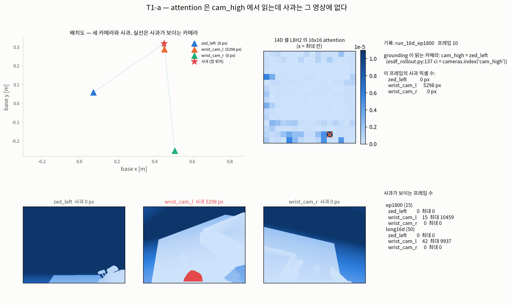

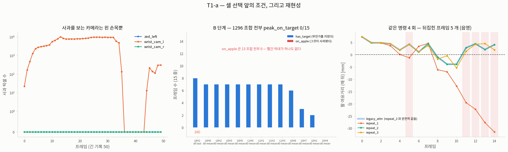

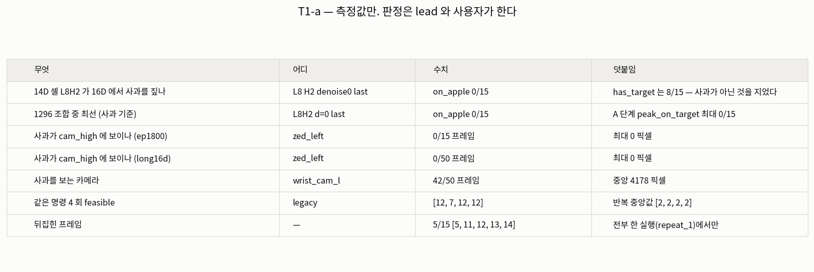

### 전체 틀에서 지금 어디인가 (규칙 B)

```
카메라 depth → 로봇 마스크
   → attention ─┬─ 오프라인: zed_left 한 대에만 붙는다 ✗ (판정 8 이 고친다)
                └─ live    : 세 대에 각각 붙는다 ✓
   → lifting → grounding  ✗ has_target 은 서는데 on_apple 0 (조용한 실패)
   → 미세 계층 0 개 ─▶ R4(C5) · R5(C3) 가 여기서 막혀 있다
   → TSDF/ESDF → 거리장 어댑터 → SQP → QP → 안전 게이트
```

**닫힌 것 둘.** (1) *"14D 의 `L8H2` 가 16D 에서 성립하는가"* — **물음 자체가 잘못 놓였다.**
셀 축에 답이 없고 원인은 배선이다. (2) *"흔들린 것이 판정인가 mm 인가"* — **mm 이다.**
한 실행만 다른 해에 앉았고 계산 자체는 결정적이다.

**연 것 둘.** (1) 판정 8 — 오프라인을 서빙 경로와 같게 고친다. 그것이 되면 grounding 이
서고, 서면 미세 계층이 붙고, 붙으면 **R4·R5 가 잴 대상을 갖는다.** (2) 판정 9 — grounding 이
카메라 한 대에 의존하는 구조 자체를 본다.

**다음**: 판정 8 의 배선 정렬(A1) · X1 의 고정 구 분할 감사 · 그다음 `R-measure`.

---

## X1 — 로봇 구 분할 (2026-09-25)

### 결론 — 분할은 옳다. 경보였지 결함이 아니었다

**1. 결정적 실험** — 같은 기록·같은 프레임·같은 물체 점군에서 `free_joints` 만 12(14D) ↔ 14(16D)로 바꿨더니 고정 구 집합이 비트 단위로 같았다. 둘 다 **42 / 120**, 한쪽에만 고정인 구 0 개. 액션 폭은 이 분할에 들어올 자리가 없다.

**2. 분모 혼동** — 14D 의 27 은 구 **105 개** 모델에서 나온 값이고 지금은 **120 개**다. 같은 축의 수가 아니라 나란히 놓을 수 없다(판정 6 — 14D 와 비교하지 않는다).

**3. 기구학 파생** — `benchmark/ag3s/constraints/attached.py:241-292` 의 `rigid_spheres()`. 손으로 쓴 목록이 아니라 기구학에서 파생된다 — 자유 관절을 24 회 흔들어 여유 변화폭이 `1e-6 m` 미만인 구를 고정으로 가른다.

**4. 42 의 정체** — `ee_finger_l1`(11) + `ee_finger_l2`(11) + `link_left_arm_6`(15) + `link_left_arm_5`(5). 앞 셋은 쥔 물체와 같은 강체다. `link_left_arm_5` 는 몸쪽인데도 고정인 이유가 기하로 설명된다: 그 구 5 개가 `arm_6` 회전축 위에 있다. 축까지 거리 `link_left_arm_5` **0.194~0.207 mm** 대 `link_left_arm_4` **37.8~51.6 mm**. `arm_6` 을 1.0 rad 돌려도 여유가 **0.000 nm** 변한다(float64 12 자리 동일).

**5. 회귀 기준선은 영향을 받지 않는다** — `rigid_spheres` 의 소비자가 정의 자신·새 스크립트 `n1_self_collision_clearance.py`·테스트뿐인 것을 lead 가 직접 grep 으로 확인했다.

### 세 번째 배선 사례 — 이 국면의 패턴

이것이 이 국면에서 세 번째 배선 결함이다:

1. **첫째** — 오프라인이 attention 을 한 카메라에만 붙인다(T1-a 의 근거).
2. **둘째** — 머리 `ctrl` 을 아무도 안 세운다(X2 — 머리 카메라가 벽을 본 이유).
3. **셋째** — self-collision 제약 행이 AG3S 에서 만들어지는데 trajopt 이 평가하지 않는다(N1).

셋 다 **모듈은 멀쩡한데 호출부가 갈라진 경우**다. 첫째는 pipeline 과 production 경로가 다르고, 둘째는 리셋 경로 2 개가 다르고, 셋째는 AG3S 와 trajopt 의 선형화가 다르다. 코드를 읽을 때 "여기 구현이 없다" 보다 "여기서 호출되나" 를 먼저 묻게 된다는 것이 이 관찰의 가치다. 다음에 같은 모양을 만나면 모듈부터 뒤지지 않는다.

---

## X2 — head cam 이 벽을 보고 있었다 (2026-09-25)

### 1. 증상

수집 때 `cam_high` 영상(`pi05_TO_hybrid/data/rby1_randomized_pick_place_16d_v1/videos/chunk-001/observation.images.cam_high/episode_001800.mp4`)에는 테이블·바구니·과일이 정면으로 다 보인다. 같은 에피소드의 기록 `run_16d_ep1800/step_*.npz` 의 `image_cam_high` 는 벽을 올려다본다. 테이블 윗변만 화면 맨 아래에 걸친다. `image_cam_high` 는 정책에 실제로 들어간 이미지다.

### 2. 원인 — teleop 키프레임이 자기 안에서 모순이다

`model_transport.xml` 의 `teleop` 키프레임: `key_qpos[head_1] = 0.7`(테이블을 내려다봄), `key_ctrl[head_1_act] = 0.0`. `mj_resetDataKeyframe` 는 `qpos` 와 `ctrl` 을 둘 다 적용한다. `head_1_act` 는 position actuator 라 settle 1.5 s 동안 머리를 0 으로 끌어내린다.

그 키프레임에서 ctrl 과 qpos 가 어긋난 actuator 는 29 개 중 **13 개**다. 팔 12 개는 두 리셋 경로가 ctrl 을 명시적으로 덮어써서 살아남았고, **머리만 아무도 안 세웠다.**

수집 경로(`rby1_manipulation/.../transport_scene.py:465`)는 모든 구동 관절을 키프레임 qpos 로 붙들어 처음부터 문제가 없었다. 두 경로가 갈라져 있던 것이다.

### 3. 수정

`pi05_TO_hybrid/rby1_bringup/pi05_infer.py` 에 `hold_keyframe_pose(m, d)` 함수를 넣고 `mj_resetDataKeyframe` 두 곳(:296 에피소드 재생, :950 일반) 뒤에서 부른다. joint transmission actuator 전부를 키프레임 qpos 로 맞춘다.

### 4. 실측 확인

settle 1.5 s 뒤 `head_1`: 고치기 전 `0.7000 → 0.0000`, 고친 뒤 `0.7000 → 0.7001`.

카메라 시선: `head_1=0.0` 일 때 `[1, 0, 0]`(수평), `head_1=0.7` 일 때 `[0.765, 0, -0.644]`(약 40도 아래).

**카메라 장착은 안 건드렸다.** `zed_left` 는 body 사슬 `zed_camera <- link_head_2 <- link_head_1 <- link_torso_5 <- ...` 로 로봇에 붙어 있고, `torso_0` 을 0.3 rad 돌리면 카메라가 **351.2 mm** 따라 움직인다. 월드에 고정한 것이 아니다.

테스트 **652 passed**(기존 648 + 머리 가드 4).

### 5. 가드

`tests/ag3s/test_head_camera_pose.py` 넷:
- (a) `teleop` 의 `head_1` 이 0.7 인가
- (b) settle 뒤에도 0.7 로 남는가
- (c) 맨 리셋은 여전히 머리를 떨어뜨리는가(왜 붙들어야 하는지 못박음)
- (d) `pi05_infer` 의 모든 `mj_resetDataKeyframe` 뒤에 `hold_keyframe_pose()` 가 있는가(구조적 가드)

### 6. 무효가 되는 기록

2026-09-25 이전의 16D 기록(`run_16d_ep1800`, `20260924_long16d`)은 전부 머리가 0 인 채로 떠났다. 그 위에서 잰 grounding 관련 수치는 다시 재야 한다. 재촬영이 `outputs/live_test/20260925_headfix16d/` 로 진행 중이다.

### 재촬영 결과 (2026-09-25)

**X2(머리 각도가 0 이 되는 keyframe 자체모순)는 닫혔다.**

#### 새 기록 확보

경로: `outputs/live_test/20260925_headfix16d/records/run_0000/run_0000` (15 observations)
- **`head_1` = +0.7001**, 15/15 프레임 전부에서 유지 (수정 전 0.00004)
- **`cam_high` 영상**: 테이블·바구니·과일 셋이 보인다 — 수집 때 영상 `episode_001800.mp4` 와 같은 장면 (수정 전 벽만 보임)

#### 새 attention npz

경로: `benchmark/ag3s/asset/data/attention_16d_headfix.npz`
- 형상 `(15, 3, 3, 18, 8, 3, 16, 16)`, 자료형 float16, 크기 21.5 MB

#### 회귀 기준선 비교

같은 명령(`--cameras all`)과 배선 수정된 `esdf_rollout` 에서:

| 지표 | 수정 전 (머리 0) | 수정 후 (머리 0.7) |
|---|---|---|
| `has_target` — 지었나 (후보 덩어리 골랐나) | 9/15 | **15/15** |
| 위반으로 시작 | 15/15 | 15/15 |
| 해소 (feasible 이 된 수) | 13 | **15** |
| 개선 (여유거리 나아진 수) | 15 | **15** |
| `feasible` — 최악 여유거리 ≥ 0 | 13 | **2** |
| `violated` — 최악 여유거리 < 0 | 2 | **13** |
| `clearance_after` 중앙 | +4.35 mm | +4.19 mm |
| `clearance_after` 최소 | −3.15 mm | **+0.02 mm** |
| `n_candidates` > 0 프레임 | 0 | 0 |
| `target_voxels_carved` 총합 | 0 | 0 |
| AG3S 실행 중앙값 | 1115 ms | **3169 ms** |

#### 열린 물음 — `status` 와 `clearance_after` 의 불일치

새 기록에서 `clearance_after` 가 전 프레임에서 양수(최소 +0.02 mm)인데도 `status` 가 `violated` 를 반복한다. 예: 프레임 1 은 여유 +4.60 mm (positive clearance)에 `feasible`, 프레임 2 는 여유 **+4.87 mm** (더 큼)인데 `violated`.

코드상 둘의 출처가 다르다 (`benchmark/trajopt/experiments/esdf_rollout.py`):
- `status` = `result.status.value` — `optimizer.solve()` 의 SQP 자신의 판정
- `clearance_after_mm` = `linearizer.full_violation(result.trajectory, ...)` — 나온 궤적을 **다시 평가**한 값

**원인은 아직 모른다.** 다음 STEP 에서 측정한다.

#### 지각은 실제로 섰다 — `zed_left` 가 사과를 본다

`head_1` 만 놓고 잰 것이 아니라, **재촬영 기록의 segmentation 에서 사과 픽셀을 직접 셌다**
(`outputs/verify/X2/head_pitch_headfix.json`, 기록 qpos 그대로).

| | 수정 전 (`run_16d_ep1800`) | 수정 후 (`20260925_headfix16d`) |
|---|---|---|
| `zed_left` 에 사과가 보이는 프레임 | **0 / 15** | **15 / 15** |
| `zed_left` 사과 픽셀 중앙 | 0 | **544 px** |
| `wrist_cam_l` 에 보이는 프레임 | 15 / 15 | 15 / 15 |
| `wrist_cam_r` 에 보이는 프레임 | 0 / 15 | 0 / 15 |

T1-a 가 *"`head_1` 만 0.7 로 되돌리면 중앙 552 px"* 라고 예측했던 값이다 — 메모리에서 관절
하나를 바꿔 잰 예측과 실제로 다시 촬영한 기록이 **544 대 552 px** 로 맞는다.

두 기록의 `argv` 는 출력 경로 하나만 빼고 같다 (`--episode-index 1800`). 차이는
`model_transport.xml` 의 teleop keyframe 하나다.

프레임 11 부터 픽셀이 547 → 62 로 떨어진다. **팔이 사과를 가린다** — 카메라가 아니라 가림이다.

#### 재촬영 rollout 의 raw 가 남지 않았다

위 "재촬영 결과" 표 열한 줄은 **출처 파일이 없다.** `outputs/verify/` 에도 `/tmp` 에도
프레임별 산출이 없다. 개수는 그 자리에서 읽어 옮긴 것이고, **`verify.json` 을 거치지 않았다.**
`handoff/X3.task.md` 의 측정 1 이 같은 명령을 다시 돌려 `outputs/verify/X3/headfix_rollout.json`
으로 되살린다. **그때까지 이 열한 줄은 재인용하지 않는다.**

### 시각화 (규칙 A)

* **[`figures/x2/x2-scene.png`](figures/x2/x2-scene.png)** — 실제 씬. 머리 관절 하나가 시선을
  어디로 보내는지 배치도로 먼저 보이고, 그다음 정책이 실제로 본 `cam_high` 영상을 수정 전후로
  나란히 놓고, 마지막에 `zed_left` depth 위에 사과 mask 를 얹는다. 수정 전은 벽, 수정 후는
  테이블과 과일이다.
* **[`figures/x2/x2-trend.png`](figures/x2/x2-trend.png)** — 그래프. 프레임별 `head_1` ·
  프레임별 `zed_left` 사과 픽셀 · 카메라 세 대 중 어느 것이 사과를 보나.
* **[`figures/x2/x2-table.png`](figures/x2/x2-table.png)** — 표. 재촬영 대조표.
  **raw 가 없는 열한 줄이라는 것을 표 안에 적어 두었다.**

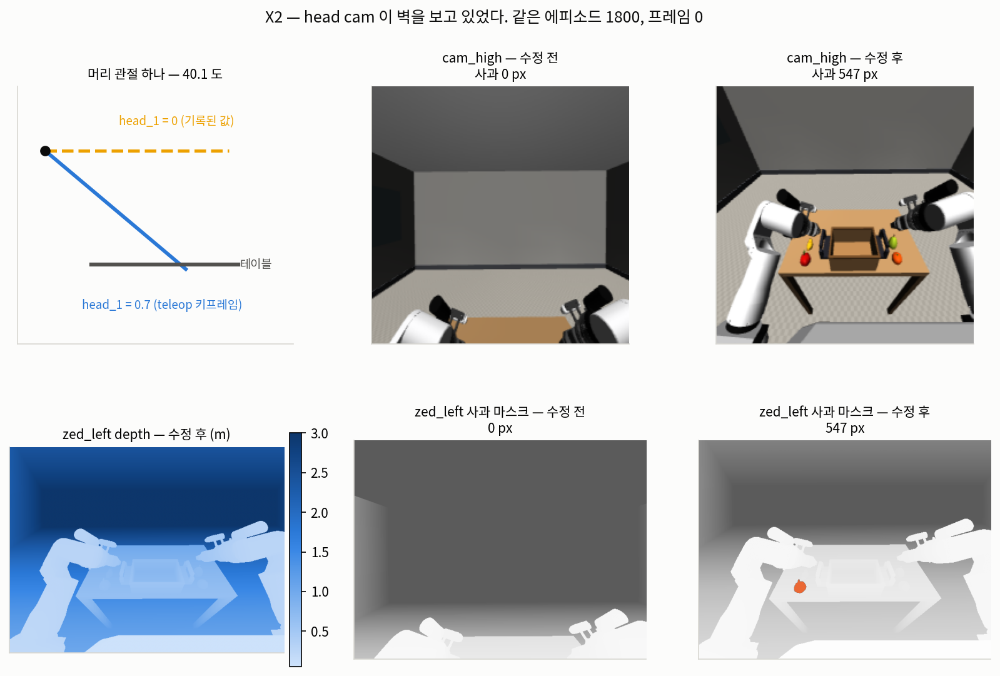

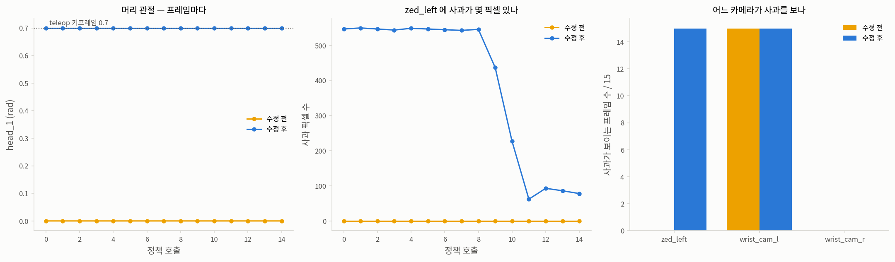

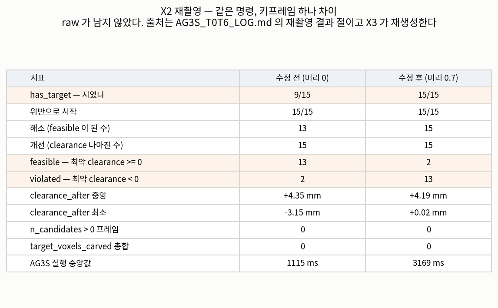

### 다음 — X3

`status` 와 `clearance_after` 의 불일치를 잰다. 계획은 `handoff/X3.task.md` 에 있고,
측정 1 이 위의 raw 를 먼저 되살린다. 어디를 볼지는 두 군데로 좁혀 두었다 —
geometry 인증 게이트(`sqp.py:287-293` 은 clearance 를 다 만족해도 AG3S 가 씬을 인증하지
못하면 `VIOLATED` 로 내린다)와, 두 `full_violation` 호출의 인자 차이(`states`).
**둘 다 아직 후보일 뿐이고, 숫자로 확정하기 전에는 판정하지 않는다.**

---

## X3 — `status` 는 clearance 가 아니라 **기하 인증**을 보고 뒤집힌다 (2026-09-25)

출처: `handoff/X3.verify.json`. raw 는 `outputs/verify/X3/`.

### 측정 1 — 재촬영이 재현됐다. raw 가 다시 생겼다

X2 재촬영의 개수가 **전부 같게** 나왔다. 이제 출처 파일이 있다
(`outputs/verify/X3/headfix_rollout.json`).

| | 로그 재촬영 표 | 이번 재현 |
|---|---|---|
| `has_target` | 15/15 | **15/15** |
| 위반으로 시작 | 15/15 | **15/15** |
| 개선 | 15 | **15** |
| `feasible` | 2 | **2** |
| `violated` | 13 | **13** |
| `n_candidates` > 0 프레임 | 0 | **0** |
| `target_voxels_carved` 총합 | 0 | **0** |

`clearance_after` 는 중앙 +4.60 mm · 최소 +0.04 mm · 최대 +8.36 mm 로 mm 단위에서 흔들렸고
(기준선은 개수만 센다), AG3S 실행 중앙값은 2283 ms 였다.

### 측정 3 — **두 집합이 완전히 같다**

`violated` 인 프레임과 `geometry_certified`(AG3S 가 그 프레임 씬을 빠짐없이 설명했다고
스스로 보증하는가)가 `False` 인 프레임이 **같은 13 개**다 — 프레임 2~14. `feasible` 인 둘은
프레임 0·1 이고 둘 다 `certified True` 다.

| | 값 |
|---|---|
| `violated` 프레임 | 2 3 4 5 6 7 8 9 10 11 12 13 14 (13 개) |
| `geometry_certified == False` 프레임 | 2 3 4 5 6 7 8 9 10 11 12 13 14 (13 개) |
| 두 집합이 같은가 | **같다** |
| `clearance` 가 양수인데 `violated` | **13 / 13** |
| `validity` 내역 | `degraded` **13** · `valid` 2 |
| `require_certified_geometry` | `true` (`configs/rby1.yaml:87`) |
| `violation_tolerance` | 0.1 mm |

### 측정 2 — SQP 가 그 자리에 문장을 남기고 있었다

13 개 프레임 전부에 `sqp.py:288-293` 의 note 가 붙어 있다:

> the trajectory clears every constraint, but AG3S could not certify the geometry behind them;
> safety cannot be claimed for a scene that was not fully accounted for

**`violated` 는 궤적이 뚫렸다는 뜻이 아니었다.** *"뚫리지 않았지만 내가 다 본 씬이 아니다"* 다.

### 측정 4 — **후보 B 는 탈락이다**

`full_violation` 을 `states` 를 주고 잰 것과 안 주고 잰 것이 **15 프레임 전부 0.0 mm 차이**다.
`sqp._finish`(`sqp.py:270`)와 `esdf_rollout`(`esdf_rollout.py:340`)이 인자를 다르게 주는 것은
사실이지만, **그 차이가 수치를 만들지 않는다.**

### 왜 `degraded` 인가 — 점군 상한에 걸린다

`degraded` 프레임이 AG3S 에서 단 note 원문:

> point cloud capped at max_points=60000; voxel grown to 6.3 mm in 1 step(s)

`pointcloud.max_points = 60000` (`config.py:134`). 상한에 걸리면 `pipeline.py:337-346` 이
voxel 을 키워 맞추고 `validity` 를 `DEGRADED` 로 내린다.

**그런데 그 코드가 바로 옆에 적어 둔 주석은 이렇다** — *"Coarser is not incomplete: growing the
voxel keeps a representative in every occupied cell, so nothing physical went unobserved."*
`ConstraintValidity.certified` 의 docstring 도 *"`DEGRADED` is usable; `INCOMPLETE` is not
certified"* 라고 적는다. **그런데 `certified` 는 `VALID` 에만 `True` 를 돌려주고**
(`types.py:169-170`), `sqp.py:287` 은 `certified` 가 아니면 `VIOLATED` 로 내린다.

**만드는 쪽은 "아무것도 안 잃었다" 고 적고, 쓰는 쪽은 "못 본 씬" 으로 읽는다.**
이것이 갈린 자리다.

**재지 않은 것**: voxel 점 수가 더 많은 프레임 0·1(129657 · 129541)이 capped 가 아니고
더 적은 프레임 2(114991)가 capped 인 이유. 숫자만 나란히 둔다.

### 시각화 (규칙 A)

* **[`figures/x3/x3-scene.png`](figures/x3/x3-scene.png)** — 실제 씬. 인증된 마지막 프레임 1 과
  인증이 꺼진 첫 프레임 2 를 나란히 놓는다. **두 씬은 거의 같고 clearance 는 오히려 프레임 2 가
  더 넓다**(+4.60 → +4.93 mm). 뒤집은 것은 `validity` 하나다.
* **[`figures/x3/x3-trend.png`](figures/x3/x3-trend.png)** — 그래프. 프레임별 `clearance_after` 를
  `status` 색으로 찍고 0 선을 그었다 · `geometry_certified` 막대 · `full_violation` 두 벌의 차(0).
* **[`figures/x3/x3-table.png`](figures/x3/x3-table.png)** — 표. 15 프레임 × status · clearance ·
  validity · certified · 인증 note · iterations.

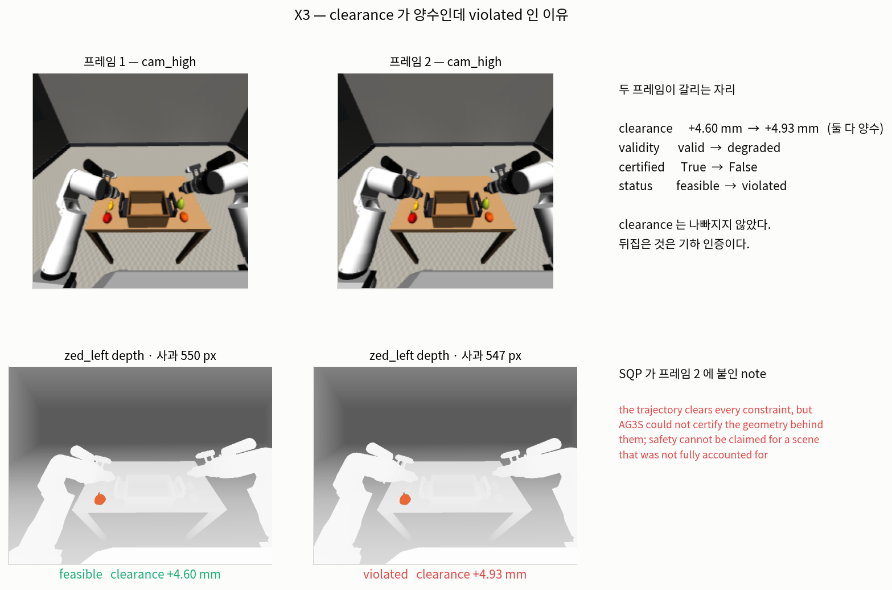

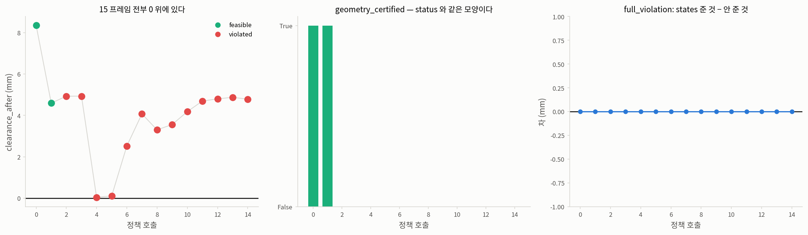

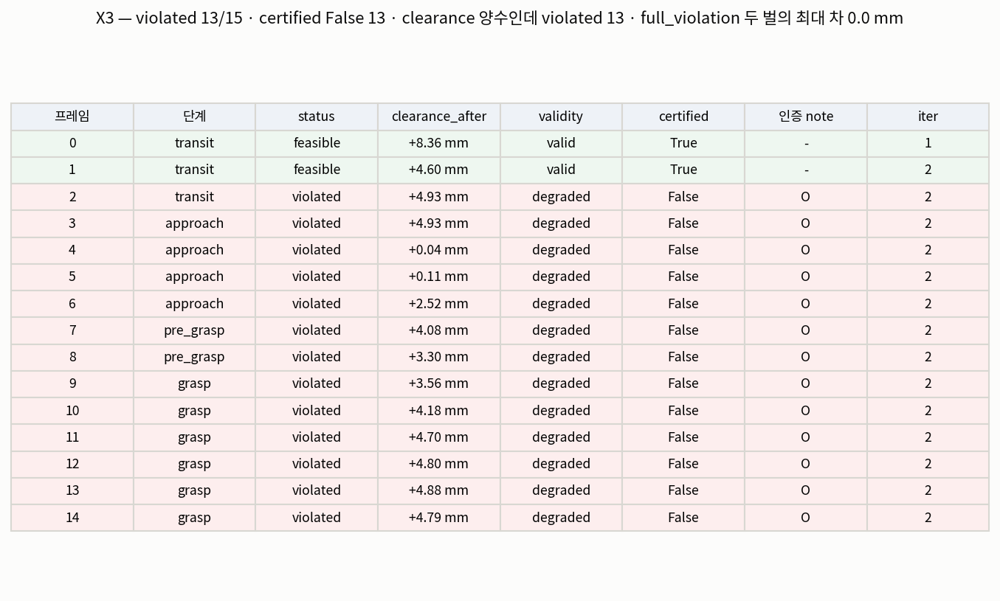

### 판정을 기다리는 물음 (사용자와 함께)

**`DEGRADED` 를 인증 실패로 볼 것인가.** 코드의 두 자리가 서로 다르게 말하고 있으므로
한쪽을 고쳐야 한다. 고르지 않은 쪽은 "되돌아올 지점" 에 남긴다.

1. **`certified` 를 `VALID` + `DEGRADED` 로 넓힌다** — docstring 과 주석이 말하는 쪽.
   그러면 `feasible` 이 15 로 간다. 위험: `DEGRADED` 가 붙는 다른 경로도 같이 통과한다.
2. **`max_points` 를 올린다** — 상한에 안 걸리면 `VALID` 로 남는다.
   위험: 실시간성. `max_points` 는 성능이 아니라 **실시간 성립 조건**이라고 `config.py:127` 이 적는다.
3. **그대로 둔다** — `violated 13` 이 맞는 판정이고, 기준선 문구를 고쳐
   *"`feasible` 은 clearance 와 인증을 함께 센다"* 로 읽게 만든다.

**아직 안 잰 것**: 수정 전 기록(`run_16d_ep1800`)에 같은 probe (측정 5) ·
`require_certified_geometry=false` 로 돌렸을 때의 개수.

### 측정 6 — **해상도를 되돌리니 15/15 가 `feasible` 이 된다. clearance 는 0.32 mm 안에서 움직인다**

사용자 물음이 계기다 — *"head camera 가 못 볼 수 없는 궤적인데 어떻게 장면을 못 보나."*
**못 본 것이 아니다.** 확인한 숫자:

| | 값 |
|---|---|
| coverage 손실 note 가 붙은 프레임 | **0 개** |
| `validity == incomplete`(표현조차 못 한 geometry 가 있다) | **0 개** |
| 실제로 일어난 것 | voxel 을 **5.0 mm → 6.3 mm** 로 1 단계 키움 |

`cap_strategy = "voxel"` 은 점유된 voxel 마다 대표점을 하나씩 남긴다 (`config.py:146-149`) —
**최종 voxel 보다 큰 영역이 관측되지 않는 일은 없다.** `INCOMPLETE`(못 봄)와
`DEGRADED`(거칠어짐)를 코드가 구분하는데, 이 15 프레임에서 `INCOMPLETE` 는 한 번도 안 났다.

그래서 `pointcloud.max_points` **하나만** 60000 → 200000 으로 올려 같은 기록을 다시 돌렸다.

| | `max_points` 60000 (기본) | `max_points` 200000 |
|---|---|---|
| 쓰인 voxel | 5.0 mm · **6.3 mm** | **5.0 mm 하나** |
| `validity` | `degraded` 13 · `valid` 2 | **`valid` 15** |
| `feasible` | 2 | **15** |
| `violated` | 13 | **0** |
| voxel 점 수 중앙 | 116126 | 129657 |
| `clearance_after` 최소 | +0.0385 mm | **+0.0156 mm** |
| AG3S 실행 중앙값 | 2303.9 ms | **2304.3 ms** |

**clearance 차(5.0 mm − 6.3 mm)는 중앙 0.000 mm · 최대 절댓값 0.320 mm** 다. 가장 크게
움직인 것은 프레임 8 로 +3.301 → +2.981 mm. **15 프레임 중 7 개에서 해상도를 높이니
clearance 가 오히려 줄었다** — 거친 쪽이 그만큼 낙관적이었다는 뜻이고, 안전 마진 50 mm 에
대면 0.6 % 다.

**시간 주의**: 상한을 3.3 배로 올렸는데 AG3S 중앙값이 0.4 ms 밖에 안 움직였다. 다만 이 서버는
OSMesa 소프트웨어 렌더링이고 AG3S 중앙값이 이미 청크 예산 533 ms 의 4.3 배다 — **점 수가
시간에 안 보이는 것은 다른 것이 지배하기 때문일 수 있고, GPU 렌더링에서 같다고 말할 수 없다.**

**재지 않은 것**: cap 이 걸리는 자리 — note 는 `max_points=60000` 이라는데 fusion 뒤 점 수는
중앙 116126 이다 (카메라별로 걸리는 것으로 보이나 재지 않았다).

* **[`figures/x3/x3-maxpoints.png`](figures/x3/x3-maxpoints.png)** — 그래프. 두 상한의 프레임별
  `clearance_after` (겹친다) · 그 차 · AG3S 실행 시간.

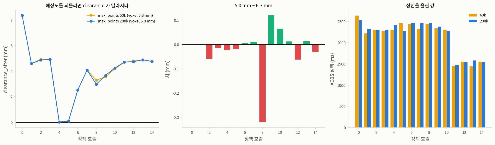

#### 이 숫자가 선택지에 하는 말

로그 위 "판정을 기다리는 물음" 의 셋 중 **2(`max_points` 를 올린다)** 가 이 기록에서는
비용 없이 `valid 15/15` 를 만든다. 다만 그것이 *"실시간에서도 공짜"* 라는 뜻은 아니다 —
위의 시간 주의가 그 자리다. **선택은 아직 사용자 판정으로 남긴다.**

### 사용자 판정 (2026-09-25) — **실시간성은 뒤로 미룬다**

> *"지금은 실시간성을 고려하지 마라. 맨 나중에 정상 작동되고, 뒤에 가서 실시간성을 잡아먹는
> 부분을 개선하거나 수정하면 된다."*

선택지 **2(`max_points` 를 올린다)** 로 확정했다. `DEGRADED` 를 인증 실패로 볼 것인가는
**여전히 열려 있다** — 이번 변경은 그 물음에 답하지 않고 상한에 안 걸리게만 한다.

### 구현 — 기본값 하나와 그것을 박아 둔 세 자리 (`handoff/X3.impl.md`)

| 파일:줄 | 무엇이 |
|---|---|
| `benchmark/ag3s/config.py:134` | `max_points` **60000 → 200000** |
| `benchmark/ag3s/config.py:126-144` | docstring — 왜 바꿨나 · 측정값 · 시간 근거의 한계 |
| `benchmark/ag3s/configs/default.yaml:32` | 같은 값 (이 파일은 기본값의 문서다) |
| `benchmark/ag3s/configs/rby1_three_camera.yaml:13` | 같은 값 + 주석. **X3 가 실제로 잰 구성**이다 |
| `tests/ag3s/test_config.py:30` | spec 표의 기대값 |

`pipeline.py` 와 `sqp.py` 는 **안 고쳤다.**

기본값만 올린 직후 테스트는 **2 failed / 650 passed** 였다 — 옛 값을 박고 있던 두 자리
(spec 표 · 배포 yaml)를 맞춘 뒤 `tests/ag3s/test_config.py` **34 passed**.

### 검증 — 회귀 기준선은 한 자리도 안 움직인다

**기준선 기록은 상한에 애초에 안 걸린다.** `run_16d_ep1800` 의 프레임별 voxel 점 수는
**53625~91268** 이고 15 프레임 전부 `capped=False` · `validity=valid` 다. 상한을 60000 으로
명시해도 200000 으로 해도 **`violated` 2 로 같다.**

| | 문서화된 기준선 | 변경 뒤 (단독 실행) |
|---|---|---|
| 위반으로 시작 | 15/15 | **15/15** |
| 해소 | 13 | **13** |
| 개선 | 15 | **15** |
| `feasible` | 13 | **13** |
| `violated` | 2 | **2** |
| `has_target` | 9/15 | **9/15** |

그리고 **수정 후 기록(`20260925_headfix16d`)은 `feasible` 15/15 · 해소 15** 다 —
monkeypatch 가 아니라 실제 기본값으로 재현했다.

### 이 STEP 에서 밟은 함정 — **부하가 기준선을 바꾼다**

기준선을 pytest 전체 · 다른 rollout 과 **동시에** 돌렸더니 `feasible 9 / violated 6` 이 나왔다.
같은 코드 · 같은 기록 · 같은 명령인데, 단독으로 다시 돌리니 `feasible 13 / violated 2` 다.

`sqp.time_budget_ms` 가 **벽시계 마감**이라(`sqp.py:159`) 부하가 걸리면 같은 50 ms 안에 반복을
덜 돌고 더 나쁜 iterate 를 돌려준다. 뒤집힌 프레임 5·9·10 은 반복이 **2 → 1** 로 줄었고
프레임 10 의 clearance 가 **+4.35 → −6.77 mm** 로 갔다.

**하마터면 이 숫자를 `max_points` 탓으로 기록할 뻔했다.** 측정 5(기준선 기록이 상한에 안
걸린다)가 그것을 막았다. `regression-baseline` skill 에 *"단독으로 돌린다"* 를 적었다.

**이것은 T1-a 2 차가 이미 답한 자리와 같다** — *"흔들린 것은 판정이 아니라 해가 다른 곳에
앉은 것"*. 그때는 원인이 미상이었고, 이번에 **부하**로 좁혀졌다.

### 아직 열려 있는 것

- **`DEGRADED` 를 usable 로 볼 것인가.** 코드는 안 고쳤다. 상한을 올려 당장은 안 걸릴 뿐이다.
- ~~cap 이 걸리는 자리를 못 찾았다~~ → **찾았다 (측정 7, 아래).**
- GPU 렌더링에서 `max_points 200000` 의 시간 비용.

### 측정 7 — **상한은 카메라별이 아니라 합친 구름에 걸린다**

로그가 *"cap 이 걸리는 자리를 못 찾았다"* 로 남겨 뒀던 물음이다. 재현해 보니 **카메라마다
따로 점군을 만들면 대당 약 26000 이라 60000 상한에 안 걸린다.** 세 대를 **합친 뒤** 걸어야
파이프라인과 같아진다.

수정 후 기록(`20260925_headfix16d`) 프레임 2 에서:

| | `max_points` 60000 | `max_points` 200000 |
|---|---|---|
| 합친 점 수 | **36498** | **79393** |
| 상한이 걸렸나 | **걸렸다** | 안 걸렸다 |
| 최종 voxel | **6.3 mm** | 5.0 mm |

**6.3 mm 는 파이프라인이 그 프레임에 남긴 note 의 값과 같다** (*"voxel grown to 6.3 mm in
1 step(s)"*). 점 수가 파이프라인의 114991 과 다른 것은 이 재현 경로에 로봇 self-filter 가
없기 때문이다 — 확인한 것은 **걸리는 자리와 voxel 값**이다.

**아직 안 잰 것**: 기준선 기록 `run_16d_ep1800` 의 합친 점 수 91268 이 60000 상한에 안 걸린
이유. self-filter 뒤 수가 더 적었을 수 있는데 재지 않았다.

### 시각화 — 구현 검증 (규칙 A)

* **[`figures/x3/x3-impl-scene.png`](figures/x3/x3-impl-scene.png)** — 실제 씬. 테이블 상판
  한 겹(z 0.80~0.86 m)을 **위에서 내려다본** 점군을 두 상한에서 나란히 놓는다. 사과·바구니
  윤곽이 양쪽 다 살아 있다 — **성겨졌을 뿐 사라진 영역이 없다.**
* **[`figures/x3/x3-impl-loadtrap.png`](figures/x3/x3-impl-loadtrap.png)** — 그래프. 단독 실행과
  부하중 실행의 프레임별 clearance · SQP 반복 수 · 뒤집힌 프레임.
* **[`figures/x3/x3-impl-table.png`](figures/x3/x3-impl-table.png)** — 표. 문서화된 기준선 ·
  변경 뒤 `ep1800`(단독) · 변경 뒤 headfix 기록.
* **영상은 아직 없다 (2026-09-25).** 한 번 만들었으나 **관절 매핑이 틀려 폐기했다** —
  궤적은 자유 관절 **14 행**(양팔 7+7)뿐이고 토르소 6 개가 없는데 20 개 관절 이름에 그대로
  붙여서, 팔 각도가 `torso` 로 들어가 로봇이 뒤로 꺾인 영상이 나왔다. 폐기본은
  `outputs/verify/X3/BROKEN_x3-verify_joint-mapping-wrong.mp4` 에 이름을 박아 두었다.
  **고치는 법은 정해져 있다** — `layout.full_q(trajectory, q_now)` 가 정확히 그 펼치기를
  한다(`types.py:145-159`). `outputs/verify/X3/probe_status.py` 는 이미 그렇게 저장하고
  (`traj_headfix.npz` 가 20 행이다), `make_x3_video.py` 에 행 수 가드도 넣었다.
  **렌더만 다시 돌리면 된다** (OSMesa 로 약 10 분).

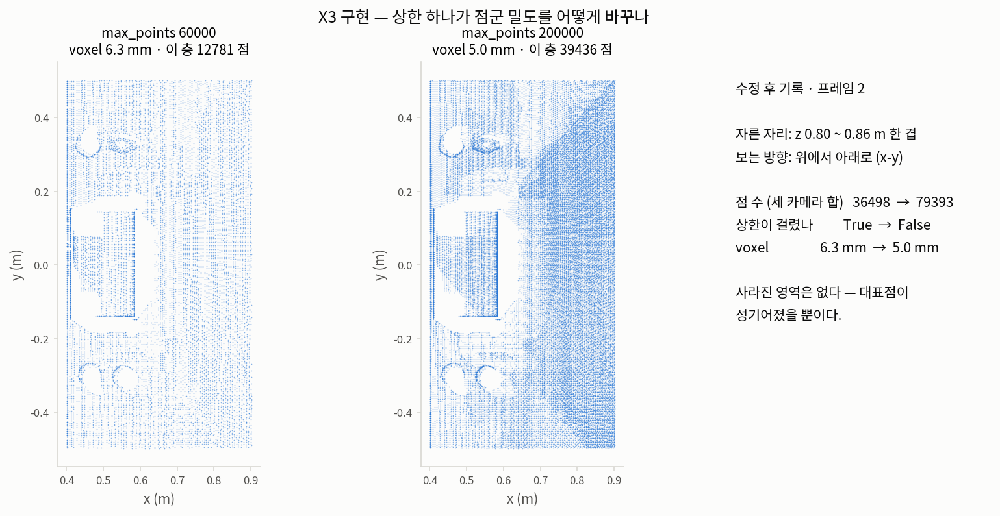

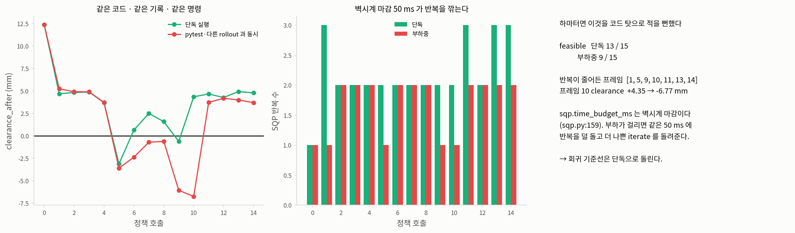

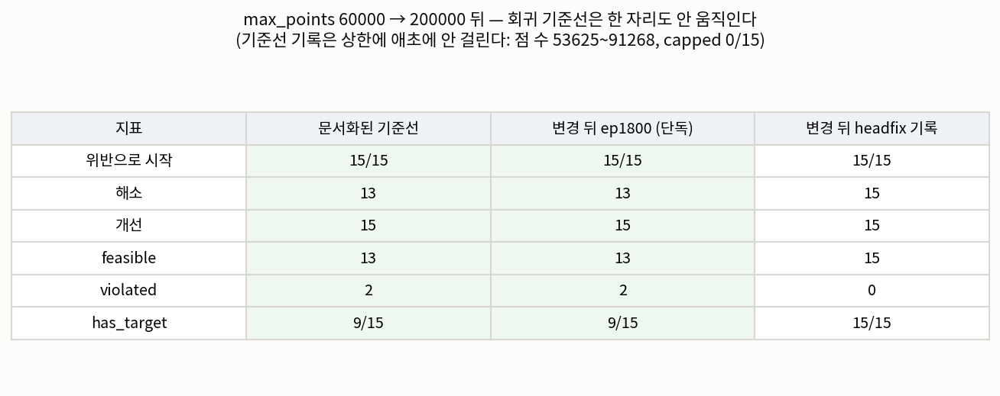

### 영상을 만들다 밟은 것 — **14 행을 20 개 이름에 붙였다** (2026-09-25)

`result.trajectory` 는 `nq_opt = 14` 행이다. 정책 16D = 양팔 7 관절 + 그리퍼 1 씩이고,
그리퍼 2 열은 `passthrough` 라 최적화가 손대지 않으므로 **SQP 가 움직이는 관절은 14 개**다.
`DEFAULT_RBY1_JOINTS` 는 20 개(토르소 6 + 양팔 14)인데, **토르소는 `fixed_q`** 다 — 정책도
안 내보내고 SQP 도 안 건드린다. 모델에 남겨 두는 이유는 하나다: **토르소 각도가 팔의 월드
좌표를 정하므로 FK 에서 빼면 충돌 구 120 개가 전부 "똑바로 선" 자리에 놓인다**
(`types.py:145-152` 가 그 이유를 적어 둔다).

| | 값 |
|---|---|
| `action_dim` (정책) | 16 |
| `nq_opt` (SQP 가 움직이는 관절) | **14** — `left_arm_0..6` · `right_arm_0..6` |
| `passthrough` | `[7, 15]` — 그리퍼 둘 |
| `fixed_q` | `torso_0..5` |
| `nq_model` (FK) | 20 |

실측: 궤적 32 스텝 동안 **토르소 변화폭 0.000000 rad**, 값이 `q_now` 와 동일.

**규칙 A 가 왜 있는지 다시 확인된 자리다.** 프레임 한 장만 보고 넘겨서 480 장을 다 렌더한 뒤에야
드러났다 — 그것도 사용자가 영상을 보고 지적해서다. **만든 시각화는 전 구간을 훑어본다.**

### 이 기록에 대해 덤으로 확인된 것

- `20260925_headfix16d` 의 `run_0000` 은 정책 호출 **15 회 = 8 초**뿐이고, 왼팔 최대 변화폭은
  **1.145 rad**(손목)다. 팔을 사과 쪽으로 뻗는 구간만 들어 있다.
- **그리퍼가 15 프레임 내내 1.0(열림)** 이다 — **이 기록에는 파지가 없다.**
  그런데 로그의 단계 라벨은 청크 10~14 를 `grasp` 로 적는다. `phase_for()` 가 그리퍼 상태가
  아니라 프레임 번호로 매기기 때문이다. **T2(pick-place 상태 전이)가 여기를 봐야 한다.**

---

## T1 — 연속 프레임 AG3S (2026-09-25)

**목표**: 실측 정책 attention 으로 지각 파이프라인이 쓸 만한가. **판정 기준**: 프레임마다 target 위치 추정 정확도, 여유거리, 완결성.

**자산**: held-out 3 에피소드. 모두 머리 각도를 수정한 뒤 새로 촬영했다(`head_1 = +0.7001`, 15/15 프레임). attention npz 는 각 에피소드별 새로 구웠다.
- **ep1800 apple** — 왼팔로 사과를 접근
- **ep1850 banana** — 오른팔로 바나나를 접근
- **ep1900 pear** — 오른팔로 배를 접근

### 항목별 결과

| 항목 | ep1800 apple | ep1850 banana | ep1900 pear |
|---|---|---|---|
| **1** target 중심 오차 중앙/최대 (mm) | 34.8 / 90.6 | 5.9 / 9.8 | 36.0 / 81.9 |
| **2** 지지면 높이 오차 중앙 (mm) | 1.33 | 1.30 | 1.26 |
| **3** 카메라 간 정렬 오차 중앙 (mm) | 0.73 | 0.75 | 0.76 |
| **4** self-filter leakage (px) | 187,136 | 181,370 | 181,378 |
| **6** status / grounding | ok 15 | ok 9 · no_target 6 / low_score 6 | ok 15 |
| **7** completeness | 15/15 | 15/15 | 15/15 |

**항목 8**: frame card 45 장(3 에피소드 × 15 프레임). 처리 시간 8.52 초, 초당 약 0.189 초/장.

### 항목 1 — 점수 문턱이 제 일을 한다 (핵심 결과)

**target_score 와 오차의 상관이 에피소드 내에서 강하다**: 세 에피소드의 Pearson r 은 각각 **−0.949 / −0.985 / −0.944**. 점수가 높을수록 오차가 작다.

**banana 에서 거른 6 프레임을 검토했다.**  `GroundingResult` 는 `LOW_SCORE` 로 실패해도 `best_score` 와 `clusters` 를 남기기 때문에(`benchmark/ag3s/stages/target_grounding.py:213-226`), 거른 프레임의 "있었다면" 오차를 계산할 수 있다:
- 거른 6 프레임의 평균 오차: **323.4 mm** (범위 317.9~327.7)
- 점수: **0.058~0.242**
- 대비 통과한 9 프레임: 오차 3.4~9.8 mm

**그러나 점수는 에피소드 간에 보정되어 있지 않다.** 같은 점수 대역 0.7~0.8 에서:
- apple (사과): 중앙 오차 **31.9 mm**
- banana (바나나): 중앙 오차 **5.3 mm**

같은 대역 0.2~0.3 에서는 세 에피소드가 81.9~320.2 mm 로 흩어진다. **상향식 보정(카메라마다 재조정)은 미실시.** 현재 threshold 는 `target_score_threshold = 0.25` (`config.py:91`).

**점수와 오차의 무관 프레임: 없음.** 45 개 프레임 중:
- **점수 > 0.5 이면서 오차 > 50 mm**: **0 개**
- 오차 50 mm 초과인 프레임 중 최고 점수: **0.4136** (ep1900 frame13, 오차 78.02 mm)

### 항목 4 — 누수의 성격이 둘로 갈린다

**카메라별 누수 분포**: 로봇 구 두 그룹(`EE_BODY_L`, `EE_BODY_R`)의 누수가 특정 카메라에만 집중된다.
- **`EE_BODY_L` 누수**: `wrist_cam_l` 에만 100% 누수, `zed_left`·`wrist_cam_r` 은 0
- **`EE_BODY_R` 누수**: `wrist_cam_r` 에만 100% 대칭
- **`base` 누수** (ep1800 만, 5,758 px): `wrist_cam_l` 에만

**누수 점에서의 거리 및 점유**: 카메라 거리값(`cs.esdf.distance()`)으로 검토하면 둘의 특성이 갈린다:
- **끝단 구(`EE_BODY_L/R`)**: 평균 거리 **+104~144 mm** (먼 쪽), 점유 비율 **0.0**, 50 mm 초과 자유도 **0.80~1.0** → **장애물이 되지 않는다**
- **베이스**: 평균 거리 **−8.2 mm** (파고든 쪽), 점유 비율 **0.76~0.99** → **장애물이 된다**

**숫자가 큰 쪽(그리퍼 뭉치)은 ESDF 가 자유로 답해 지금은 무해하고, 작은 쪽(base)은 76~99% 가 점유로 잡혀 해롭다.**

### 측정 방법 — A2 가 스스로 고친 것 두 가지

1. **항목 2 (지지면 높이)**: 처음엔 평면식의 `offset/normal_z` 로 냈는데, 이것은 평면이 수평일 때만 맞다. 기울면 로봇 base 의 `x=y=0` 에서 높이를 재게 된다. **평면을 맞춘 inlier 점의 median z 로 교체.**
2. **항목 1 figure 의 표식**: 'x' 마커에 `edgecolors` 를 줘서 여섯 점이 안 보였다. matplotlib 은 'x' 에 채움이 없어 `edgecolors` 를 무시한다. **`c=` 로 교체.**

### 회귀 기준선 — 수정 진행 중

**아직 확정 아님 — 쓰지 마라**: 회귀 기준선이 3 회 중 2 회 흔들렸다 (11/11/4 대 13/13/2). 원인은 미상이다. `self_filter_inflation` 을 **0.05 m(50 mm) 로 올리는 수정은 진행 중**이다.

### 시각화 — 지각 파이프라인 (규칙 A)

* **[`figures/t1/t1-items-scene.png`](figures/t1/t1-items-scene.png)** — 실제 씬. 세 에피소드의 원 사진(depth)을 나란히. 그루핑 카메라가 각 물체를 어디서 보는지 보인다.
* **[`figures/t1/t1-items-trend.png`](figures/t1/t1-items-trend.png)** — 그래프. 에피소드별 점수 대 오차의 상관 3 개. 각 점은 한 프레임. 거친 상관선 + Pearson r 표시.
* **[`figures/t1/t1-items-table.png`](figures/t1/t1-items-table.png)** — 표. 항목 1~8 의 요약 수치와 통과/실패 상태.
* **[`figures/t1/t1-item1-score-vs-error.png`](figures/t1/t1-item1-score-vs-error.png)** — 확대. 항목 1 의 핵심: 점수 > 0.5 이면 오차도 작다 (거른 6 개 포함).
* **[`figures/t1/cards/manifest.json`](figures/t1/cards/manifest.json)** — frame card 색인. 45 개 카드를 이미지 경로로 나열.
* **[`figures/t1/t1-inflation-005-compare.png`](figures/t1/t1-inflation-005-compare.png)** — 표. `self_filter_inflation` 0.02 → 0.05 m 전후 비교(항목 4·5).

### 로봇 마스크 수정 (2026-09-25)

**증상**: self-filter 가 로봇 자기 몸을 놓쳐 장애물 필드로 샜다(위 항목 4). 참값 segmentation
기준, ep1800 프레임에서 MJCF `EE_BODY_L` 90,690 px · `EE_BODY_R` 90,688 px · `base` 5,758 px
가 새고 있었다(ep1850·ep1900 은 `EE_BODY_L/R` 만, `base` 는 ep1800 에서만). 각 몸체는 **자기가
이고 있는 카메라에만 100%** 나타난다 — `EE_BODY_L` → `wrist_cam_l`, `EE_BODY_R` →
`wrist_cam_r`.

**수정 1 — 팽창값**: `benchmark/ag3s/config.py:171` 의 `self_filter_inflation` 을
**0.02 → 0.05 m** (20 mm → 50 mm) 로 올렸다. `configs/default.yaml:36` 도 동기화
(`tests/ag3s/test_config.py:45` 가 둘의 일치를 강제한다). 근거는 cuRobo 의 `RobotSegmenter`
(`curobo_src/curobo/_src/perception/robot_segmenter.py`)가 **같은 방법**(충돌 구와 depth 점의
거리)을 쓰고 `distance_threshold` 기본값이 **0.05 m** 라는 것.

**결과**: `base` 누수 **5,758 px → 0 px**. 그러나 `EE_BODY_L/R` 은 **픽셀 단위로 그대로** — 그
몸체는 구가 아예 없어 구를 부풀려도 닿지 않는다. 부작용으로 `has_target` 이 세 에피소드에서
15/15·9/15·15/15 → **14/15·8/15·12/15** 로 내려갔고, 회귀 기준선이 시작 15/15 → **14/15**,
`feasible` 13 → **14**, `violated` 2 → **1** 로 바뀌었다.

**수정 2 — 빠진 링크**: `benchmark/ag3s/experiments/sources/mujoco_source.py` 의
`UNCOVERED_LINKS`(자기 필터가 구로 못 덮는 링크에 대신 씌우는 **gap-filling capsule** —
장애물이 아니라 자기 필터 전용으로 만드는 캡슐 — 목록)에 **`ee_left`·`ee_right`** 를
추가했다. 목록에는 손가락(`ee_finger_*`)은 있는데 **손바닥에 해당하는 것이 빠져 있었다.**

**왜 눈에 안 띄었나 — 이름이 두 파일에서 다르다.** MJCF 는 `EE_BODY_L`, URDF 는 `ee_left`
다. 캡슐 치수를 잴 때는 MJCF 이름으로 메시를 재고(`bounding_capsules`), 로봇 모델에 붙일
때는 URDF 링크여야 한다(`UrdfSphereChain` 이 아니면 거부, `urdf_sphere_chain.py:393-395`).
**둘 다 맞아야 하는데 목록에는 하나만 적게 되어 있었다.** A1 이 번역표
`MJCF_BODY_ALIASES`(재는 이름 → 붙이는 이름을 잇는 딕셔너리, `mujoco_source.py:450-453`)를
두어 이 둘을 갈랐다.

**그리고 실패가 조용했다.** `gap_filling_capsules` 가 `except KeyError: continue` 로 삼켜서,
이름이 틀리면 **캡슐 0 개를 내고 자기 필터에 구멍이 남는다.** 손바닥이 빠진 채 오래 남아 있을
수 있었던 이유다. **2026-09-25 사용자 판정으로 갱신**: 삼킴을 **소리를 내게 만든다** — 코드는
이미 그렇게 되어 있다(`_warn_no_capsules`, `except KeyError` 로 여전히 삼키되 어느 spelling 을
시도했는지까지 `_LOG.warning` 으로 크게 말한다). 상세는 아래 T2 절의 **"사용자 판정"** 표.

**URDF 확인**: `pi05_TO_hybrid/rby1_description/models/rby1a/urdf/model.urdf` (34 링크)에서
`ee_left`·`ee_right`·`ee_finger_*`·`link_*_arm_6`·`base`·`wheel_*` 은 **collision 0 개, visual
1 개**다. URDF 만으로는 못 덮는다 — `UNCOVERED_LINKS` 의 gap-filling capsule 이 유일한 길이다.

**캡슐 치수**: `bounding_capsules` 가 MJCF 메시 정점에서 뽑는다(눈대중이 아니다). `segments`
는 기본 3 유지 — 실측 반지름이 1 에서 59.7 mm, 2 에서 38.1·37.9, **3 에서 33.0·28.4·32.8**,
4 에서 32.8·23.1·**64.4**·32.9 로 4 는 슬래브 경계가 그리퍼의 넓은 면에 떨어져 하나가 튄다.

**모델 변화**: 자기 필터 구 **194 → 218**, gap-filling 캡슐 **30 → 36**. 회귀 기준선의 제약
모델은 `link_filter=ARM_LINKS` 라 이 수정에 안 닿는다.

**테스트**: **659 passed** (직전 652 + 신규 `tests/ag3s/test_gap_filling_capsules.py` 7).

**판정 결과 (2026-09-25, 아래 T2 절의 "사용자 판정" 표)**: (a) 조용한 삼킴 — **소리를 내게
만든다**(코드는 이미 그렇게 되어 있다). (b) 손바닥을 **제약** 모델에도 넣을 것인가 —
`benchmark/ag3s/config.py:367-370` 의 `DEFAULT_CONTACT_LINKS` 는 `ee_left`/`ee_right` 를
**이미 접촉 허용 링크로 적고 있는데** 제약 모델(`experiments/reports/rby1_transport.py:454`)은
`ee_finger_` 만 본다. **넣지 않는다 — 기존 동작 유지**, 어긋남은 알려진 상태로 남긴다(전환
신호는 T2 절의 "되돌아올 지점").

**곁가지**: 같은 대소문자 함정이 하나 더 있다 — URDF `FT_sensor_L/R` ↔ MJCF `FT_SENSOR_L/R`.
지금은 `UNCOVERED_LINKS` 에 없어 아무것도 안 걸린다.

---

## T2 — 자산 확보 (ep1807, 2026-09-25)

**T2 는 과제가 물리적으로 완결되는 기록을 요구한다.** 처음 뜬 ep1800 은 그렇지 않았다.

| | ep1800 | **ep1807** |
|---|---|---|
| 대상 | apple | apple |
| 대상 들림 | 92.1 mm | **240.6 mm** |
| 대상 ↔ 바구니 수평거리 | 328 → 330 mm | **339 → 71 mm** |
| 다른 과일 셋 | — | 들림 0.0 mm, 거리 불변 |
| 관측 | 75 (600 스텝) | **75 (600 스텝)** |

**둘 다 held-out(1800–1999)인데 하나는 완결되고 하나는 안 된다.** 에피소드나 정책의 문제가
아니라 성공률의 문제다 — 몇 개 중 몇 개가 완결되는지는 아직 재지 않았다.

**자산**: 기록 `outputs/live_test/20260925_ep1807/run_0000/run_0000`, attention
`benchmark/ag3s/asset/data/attention_16d_ep1807.npz` `(75,3,3,18,8,3,16,16)`. `head_1` 75/75
프레임 +0.7001.

**측정 조건 정정**: 제어 스텝은 **600 이 맞다** (사용자 판정 2026-09-25). lead 가 시연
길이(41.6~46.8 초)에서 역산해 900 으로 올렸던 것은 근거가 약했고 되돌렸다. 900 으로 뜬
기록들(`20260925_t2b`, `20260925_train/ep*`)은 조건이 섞여 판정 근거로 쓰지 않는다.

### nine events — `ep1807` (2 라운드, 운반 완결) frame 표

`measure_t2_events.py` 로 `outputs/live_test/20260925_ep1807/run_0000` 를 잰 결과다.
**`destination_attention_locked` 와 `task_state_reset` 이 `None`** — 아홉 중 일곱만 frame 이 있다.

| 사건 | frame | t_step | 판정 근거 (`criterion`) |
|---|---|---|---|
| `target_acquired` | 0 | 0 | `has_target=True`, `score=0.805`, label `obj0` — 이후 `latch.manipulated` 로 잠기는 값과 같다 |
| `target_latched` | 2 | 16 | frame 0·1·2 모두 label `obj0`(`confirm_frames=3`), `SEARCHING`→`LATCHED` |
| `grasp_contact` | 19 | 152 | MuJoCo `data.contact` 에 `ee_finger_l1`/`l2` 와 apple 의 접촉이 처음 나타남 (frame 15~18 은 없음) |
| `attached` | 19 | 152 | `GraspLatch.update()` 가 `attach=True` (`gripper_left state[7]=0.698`, 0.85 미만). `grasp_contact` 와 같은 frame — ep1800 에 있던 오프셋이 여기엔 없다 |
| `destination_attention_raw` | 28 | 224 | HELD 진입(frame 19) 뒤 처음 나온 non-None 라벨(`obj1`). frame 19~27 은 label `None` |
| **`destination_attention_locked`** | **None** | **None** | 연속 3프레임(`confirm_frames=3`) 확정 없음 — HELD 구간(19~31) 라벨 순서: `None`×9, `obj1`(28), `obj1`(29), `obj2`(30), `None`(31). 연속 2 가 최대 |
| `transport_start` | 21 | 168 | `attach` 시점(frame 19) 대비 world 변위가 처음 50 mm 초과 (55.2 mm). frame 20 은 1.1 mm |
| `placement` | 32 | 256 | MuJoCo 참값 `placed_ground_truth`(apple, crate 로컬 벽 안쪽 + rim −10 mm 아래) 가 True — 75 프레임 중 이 한 프레임뿐 |
| `detached` | 32 | 256 | `GraspLatch.update()` 가 `detach=True`, `event.note`="성공 판정 — detach()" — `placed_now`(True) 로 풀림, open-streak fallback 아님(`gripper=0.954`, 아직 열리는 중) |
| **`task_state_reset`** | **None** | **None** | 75 프레임 전체(frame 32~74)에서 `reset()` 호출 없음. `latch.phase` 는 frame 32~74 `'placed'` 로 유지, `manipulated='obj0'` `destination=None` 그대로 |

**처음으로 놓기가 잡혔다.** `placement` 와 `detached` 가 **같은 frame(32)** 에서 함께 일어난다.
`detach` 가 `placed_now` 성공 경로로 울렸다는 것은 `event.note`(*"성공 판정 — detach()"*)와
그때 gripper 값(0.954, 아직 열리는 중)이 함께 보증한다 — open-streak fallback(그리퍼가 그냥
`release_frames=2` 연속 열려서 풀리는 경로)이 아니다. `ep1800`(1 라운드)에서는 `detached` 가
그 fallback 이었고 `placement` 자체가 75 프레임 내내 한 번도 True 가 되지 않았다 — 뒤 절반이
반쪽이었다. `ep1807` 에서 그 반쪽이 닫혔다.

**destination attention 이 한 번도 확정되지 않는다.** `destination_attention_locked` 는
`None` 이다 — HELD 구간(19~31)의 라벨 순서(`None`×9, `obj1`, `obj1`, `obj2`, `None`)에서
`confirm_frames=3` 연속 같은 라벨이 한 번도 없다(연속 2 가 최대). 그런데도 `placement` 는
frame 32 에서 성공했다 — **AG3S 의 destination 추적이 확정에 한 번도 기여하지 않은 채로
정책이 물체를 넣었다**는 뜻이다.

**detach 후 state 가 초기화되지 않는다.** `phase_stuck_after_detach_ep1807` — frame 32~74
구간에서 `latch_phase` 는 전부 `'placed'`, `manipulated` 는 전부 `'obj0'`, `destination` 은
전부 `None` 으로 남는다. T2 합격 조건의 *"detach 후 이전 상태가 제거된다"* 는 **불합격**이다.
단, `cycle2_second_grasp_ep1807.present == False` — 이 기록엔 frame 33~74 구간에서 그리퍼
재폐쇄 시도 자체가 없다(`gripper_left_state7` 이 1.0 을 벗어나지 않는다). **이 phase 고착이
다음 과제(2차 파지)를 실제로 막는지는 이 기록만으로는 증명할 수 없다** — phase·manipulated·
destination 이 유지된다는 것만 확인됐다.

**결함 3(`runner_up_score` 키 부재) 는 재현되고, 결함 2(식별 불일치) 는 재현되지 않는다.**
`runner_up_score_metrics_key_ep1807` — `target_grounding.py:394-402` 의 metrics dict 에
`runner_up_score` 키가 없어 전 75 프레임 0.0 (`ep1800` 과 동일 코드경로, 변경 없음).
`_Confirm.update()` 의 `confident = score >= score_ratio(1.3) * max(runner_up, 1e-9)` 에서
`runner_up=0.0` 이면 임계값이 `1.3e-9` 로 사실상 0 이 되어 `score>0` 이면 항상 통과한다
(frame 0 `target_score_confidence=0.805`). `identity_ambiguity_ep1807` — 잠긴 대상(`obj0`)의
참값이 frame 0~14 전 구간 apple 하나뿐이라(`mismatch: False`) 애매한 2 위 후보 자체가 없었다.
`identity_vs_runner_up_relation_ep1807` 이 이 둘의 관계를 적는다: 결함 3(`runner_up_score=0.0`,
confident 문턱 사실상 무력화)는 그대로 재현되지만 결함 2(식별 불일치)는 재현되지 않았다 —
obj0 후보의 참값이 애매하지 않았기 때문이다.

**object drift — `ep1807` 전 75 프레임** (`object_displacement_full_75_frames_ep1807`):

| 물체 | frame0 위치 (m) | frame74 위치 (m) | drift |
|---|---|---|---|
| apple | [0.564, 0.320, 0.850] | [0.490, −0.081, 0.858] | **408.5 mm** |
| banana | [0.550, −0.305, 0.843] | [0.550, −0.305, 0.843] | 0.1 mm |
| orange | [0.459, 0.331, 0.849] | [0.459, 0.332, 0.849] | 0.2 mm |
| pear | [0.465, −0.324, 0.856] | [0.465, −0.324, 0.856] | 0.6 mm |
| crate | [0.517, −0.016, 0.880] | [0.517, −0.016, 0.880] | 0.0 mm |

**대상(apple)만 움직였다** — 나머지 넷은 mm 단위 잔차 안이다.

**아직 측정하지 않은 것 — `not_measured` 를 그대로 옮긴다**:
1. 잔상(누적 TSDF residual — 물체가 떠난 뒤에도 accumulated TSDF 에 남는 occupancy)의
   지속 프레임 수 — 이번 라운드에도 미뤘다(1 라운드와 같은 사유, 이번 task.md 지시에도
   포함 안 됨)
2. production 참조 `placed_fn`(ESDF 라벨층 기반) — 이번 측정은 MuJoCo 참값으로 대체했다
3. `ep1807` 에서 2차 파지 시도 자체가 없어(그리퍼가 frame 32 뒤 계속 열림) `PLACED` 이후
   attach 재시도 여부는 이 기록으로 테스트 불가 — phase/manipulated/destination 이 유지된다는
   것만 확인됐다

**`handoff/T2-b.task.md` 로 A2 에게 넘겼다.**

### 시각화 (규칙 A)

* [`figures/t2/t2-scene-hand-trajectory.png`](figures/t2/t2-scene-hand-trajectory.png) —
  실제 씬 (**`ep1800`**, 1 라운드·운반 없음).
* [`figures/t2/t2-timeline.png`](figures/t2/t2-timeline.png) — 그래프 (**`ep1800`**).
* [`figures/t2/t2-events-table.png`](figures/t2/t2-events-table.png) — 표 (**`ep1800`**).
* [`figures/t2/t2-scene-hand-trajectory-ep1807.png`](figures/t2/t2-scene-hand-trajectory-ep1807.png) —
  실제 씬 (**`ep1807`**, 2 라운드·운반 완결).
* [`figures/t2/t2-timeline-ep1807.png`](figures/t2/t2-timeline-ep1807.png) — 그래프 (**`ep1807`**).
* [`figures/t2/t2-events-table-ep1807.png`](figures/t2/t2-events-table-ep1807.png) — 표 (**`ep1807`**).

### 사용자 판정 (2026-09-25) — T2 게이트와 T1 잔여 둘

| 물음 | 판정 |
|---|---|
| T2 를 어떻게 닫나 | **미측정 셋을 먼저 채운 뒤 판정한다** — `T2-b` 로 나갔다 |
| `runner_up_score` 키 부재 | **지금 고친다** — `T2-fix` 로 A1 에게 나갔다 |
| `gap_filling_capsules` 의 조용한 삼킴 | **소리를 내게 만든다.** 코드는 이미 그렇게 되어 있다 (`mujoco_source.py` 의 `_warn_no_capsules`, `except KeyError` 로 여전히 삼키되 `_LOG.warning` 으로 어느 spelling 을 시도했는지까지 크게 말한다) — T1 절의 *"이 삼킴은 아직 그대로다 — 판정 대기"* 를 이 판정으로 갱신한다 |
| 손바닥(`ee_left`/`ee_right`)을 constraint model 에 | **넣지 않는다 — 기존 동작 유지.** `DEFAULT_CONTACT_LINKS`(`config.py:367-370`)와 constraint model(`experiments/reports/rby1_transport.py:454`)이 어긋나는 것(전자는 손바닥을 접촉 허용 링크로 이미 적고 있는데 후자는 `ee_finger_` 만 본다)은 **알려진 상태로 남긴다** |

**되돌아올 지점 — 손바닥을 constraint model 에.** 지금은 `DEFAULT_CONTACT_LINKS` 와
constraint model 이 어긋난 채로 둔다. **전환 신호**: 과제 동작에서 손바닥(`ee_left`/`ee_right`)이
장애물이나 목적지에 닿아야 하는 장면이 나오면 — 그때는 `ee_finger_` 만 보는 constraint model
이 그 접촉을 위반으로 잡아낼 것이고, 그 시점에 손바닥을 constraint model 에도 넣는다.

---

## T2-b — 미측정 둘을 채웠다 (ep1807, 2026-09-25)

`T2.verify.json` 의 `not_measured` 1·3 번(쥔 물체가 robot collision geometry 로 옮겨 앉는가 ·
잔상 지속 프레임 수)을 잰 것이다.

### 오염 확인 — `T2.verify.json` 의 원 측정과 섞이지 않았다

`t2_replay_match`: 이번 run 은 A1 이 `runner_up_score` 키를 추가한 **변경 후 코드**로 돌았지만
latch 에는 `runner_up = 0.0` 을 고정해 먹였다(`--runner-up-mode zero`). 그렇게 나온 75 프레임
latch 계열(`latch_phase`·`manipulated`·`destination`·`attach_this_frame`·`detach_this_frame`·
`has_target`·`label`·`placed_ground_truth`)을 `T2.verify.json` 의 raw 와 프레임마다 대조하면
**75 프레임 전부 일치, 불일치 0 프레임** — `attach` frame 19, `detach` frame 32 그대로다.

**변경 후 코드가 실제로 내놓는 `runner_up_score`**(`runner_up_score_observed`, 참고 수치 — 이번
latch 에는 안 들어갔다): 75 프레임 최대 **0.2757589427371451**. `confident = score >=
score_ratio(1.3) * max(runner_up, 1e-9)`(`grasp_latch.py:142`) 판정이 0.0 고정 대비 갈리는
프레임은 **[30, 35, 67, 68, 71] 다섯 개**뿐이고, `target_latched`(frame 2)·`attached`(frame 19)·
`detached`(frame 32) 중 어느 것도 이 다섯에 없다.

### 측정 1 — held object 는 편입되지만 **carve 가 1 프레임 늦다**

`attached` 는 frame 19 에 처음 not-None, frame 32 에 `None` 복귀 — latch 의 `attach`/`detach`
프레임과 정확히 일치한다. 쥔 물체는 sphere 1 개(`r = 38.0185 mm`), snapshot 점 18 개로
`ee_finger_l1` 에 붙는다.

**`field_at_attached_points_mm`** — attached 점 18 개를 그 프레임의 ESDF 에 그대로 물은 값.
main = production(attach 를 실제로 부름), control = 같은 관측을 쓰지만 attach 를 안 부른
대조 파이프라인. 음수 = 그 점이 아직 점유 안쪽.

| frame | main_min (mm) | main_n_nonpositive | control_min (mm) | control_n_nonpositive | `n_attached_voxels_carved` |
|---|---|---|---|---|---|
| 19 | −26.23 | 14/18 | −26.23 (main 과 **동일**) | 14/18 | 0 |
| 20 | **+22.05** | 0/18 | −26.44 (여전히 음수) | 14/18 | **22** |
| 21 | +29.65 | 0/18 | +13.07 | 0/18 | **4** |
| 22 | +93.98 | 0/18 | +93.98 (main 과 동일) | 0/18 | 0 |
| 31 | +23.40 | 0/18 | +23.40 (main 과 동일) | 0/18 | 0 |

frame 19 는 main 과 control 이 **완전히 동일**하고 `n_attached_voxels_carved = 0` 이다 —
attach 가 울린 바로 그 프레임에는 아직 아무것도 파내지지 않았다. frame 20 에서 carve 22 복셀이
돌아 main 만 최소거리가 양수로 올라가고(control 은 여전히 음수), frame 21 에서 carve 4 복셀이
마저 돈다. frame 22 부터는 `frames_main_equals_control_at_attached_points`(22~31)로 main·control
이 다시 같아진다 — carve 할 것이 이미 다 파여서다.

**즉 attach 가 울린 그 프레임(19)에서는 쥔 물체가 robot collision geometry 와 obstacle field
양쪽에 동시에 들어 있다.** double counting 은 정확히 **1 프레임**이다.

**candidate 층에는 흔적이 없다.** `obstacle_cluster_counts.frames_where_main_cluster_mix_differs_from_control
= 0`(75 프레임 비교 전부), `clusters_near_held_object_ground_truth.n_within_80mm_all_held_frames_19_to_31
= 0` — HELD 구간(19~31) 어느 프레임도 쥔 물체의 MuJoCo 참값 위치 80 mm 안에 다른 candidate 가
없다. **double counting 은 ESDF voxel 층에만 있고, primitive/candidate 층으로는 새지 않는다.**

**원인은 추정이다 — 측정이 아니다.** lead 가 코드로 읽은 것: `benchmark/trajopt/safe_policy.py:335-349`
에서 `constraint_set`(그 프레임의 field)이 `process_multi_debug`(:280)로 먼저 구워지고, 그
뒤에 `_run_latch`(:292) 안에서 `self._latch.update(...)` → `if event.attach:
self.ag3s.attach(...)`(:345-349)가 온다. 그 프레임의 field 는 attach 를 부르기 **전에** 이미
구워져 있으므로 carve 는 다음 프레임부터 듣는다는 것이 **추정**이다.

### 측정 2 — TSDF residual 이 26 프레임 남는다

decay 는 껐다(`time_decay = 1.0`, `frustum_decay = 1.0`, `config.py:480,484`). apple 이 떠난
자리(`apple_frame0`, 반지름 50 mm 탐침 구)를 `transport_start_frame = 21` 부터 74 까지(분모 54
프레임)로 **세 정의를 나란히 둔다**:

| 정의 | 잔상이 남는 프레임 수 | 영구히 사라지는 frame |
|---|---|---|
| 위쪽 반구 점유(occupancy) > 0 | **26 / 54** | 47 |
| 탐침 중심 ESDF ≤ 0 | **46 / 54** | 67 |
| 구 전체 occupancy > 0 | **54 / 54** (영구히 0 이 안 됨) | — (`null`) |

구 전체가 영구히 0 이 안 되는 것은 아래쪽 반구가 테이블 윗면(`z = 0.820`, base 기준)을 항상
포함하기 때문이다 — 그 자체가 잔상이 아니라 **실재하는 표면**이다. 그래서 "잔상이 몇 프레임
남았나"를 재려면 위쪽 반구만 봐야 한다.

**대조군 pear(drift 0.6 mm, 정적 물체)**: 위쪽 반구 점유가 75 프레임 내내 **11~12 로 한 번도
0 이 안 된다.** apple 탐침의 위쪽 반구 점유가 frame 21(7) 근방에서 시작해 frame 47 에 0 으로
떨어지는 것과 비교하면, **"원래 거기 있는 것"(pear)과 "잔상"(apple 이 떠난 자리)의 신호
크기가 같은 자릿수라 필드 값만 보고는 둘을 못 가른다** — 위쪽 반구 점유가 0 으로 완전히
떨어지는 시점(frame 47)까지 기다려야 잔상이 다 빠졌다고 말할 수 있다.

### 아직 측정하지 않은 것 — `not_measured` 를 그대로 옮긴다

1. production 참조 `placed_fn`(ESDF 라벨층 기반) — `T2` 와 같이 이번에도 MuJoCo 참값으로
   대체했다
2. **변경 전 코드**(A1 이 `runner_up_score` 키를 넣기 전, md5 `caae04a1...`)에서의 측정 1·2 —
   A1 이 14:48:13 UTC 에 저장해 되돌릴 수 없었다. 대신 latch 에 `runner_up=0.0` 을 고정해
   돌렸고, 그렇게 나온 75 프레임 latch 계열이 `T2` 의 raw 와 0 프레임 불일치였다
   (`t2_replay_match`). **변경 전 코드 자체로의 재측정은 하지 않았다**
3. `runner_up_score` 를 latch 에 **실제로 먹였을 때**의 attach/detach frame — 이번 run 은
   0.0 고정이라 재지 않았다. `confident` 판정이 갈리는 프레임 5 개만 식으로 계산해 적었다
4. 탐침 구 안 점유의 **카메라별 출처**(어느 카메라의 옛 관측이 그 복셀을 점유로 유지하는가) —
   이번 측정은 필드 결과만 본다
5. **frustum/time decay 를 켰을 때**의 잔상 프레임 수 — 기본값 1.0(감쇠 없음) 그대로만 쟀다

### 회귀 기준선 확인

`baseline_check`: 위반으로 시작 **14/15** · `has_target` **9/15** · frame0
`clearance_before` **+0.15718632962849477 mm** — `T2.verify.json` 의 `base_run1.json` 과
frame0 clearance 가 소수점까지 같다. 이 확인은 **A1 변경 전 코드**(target_grounding.py
저장 14:48:13 UTC 이전)로 돌았다.

### 시각화 (규칙 A)

* [`figures/t2b/t2b-scene-residual-slices.png`](figures/t2b/t2b-scene-residual-slices.png) —
  실제 씬. 배치도 → `zed_left` 렌더 → 같은 프레임 ESDF 수평 단면.
* [`figures/t2b/t2b-timeline-attached-residual.png`](figures/t2b/t2b-timeline-attached-residual.png) —
  그래프. attach 전후 field 값과 apple 탐침 점유의 프레임별 추이.
* [`figures/t2b/t2b-numbers-table.png`](figures/t2b/t2b-numbers-table.png) — 표.

### 사용자 판정 (2026-09-25, 2 차) — T2 게이트를 닫는다

| 물음 | 판정 |
|---|---|
| T2 게이트 | **부분 통과로 닫고 T3 로 간다.** 통과: 조작 대상 ID 가 latch 로 유지된다(`identity_ambiguity_ep1807`, `T2`) · attach/detach 로 held object 의 기하 편입·제거가 frame 19/32 로 정확하다. 불합격: detach 후 task state reset 이 없다(`latch.phase` 가 32~74 `'placed'` 로 고착) · destination attention lock 이 한 번도 확정되지 않는다 |
| carve 1 프레임 지연 | **결함으로 기록하고 T5·T6 에서 본다.** 1 프레임이고 candidate 층에 안 보이니 지금 고치지 않는다 |
| TSDF residual 26 프레임 | **T3 의 `max_field_age_sec` 근거로 이어 붙인다** — 아래 참고 |
| 변경 후 회귀 기준선 | **재서 보고 커밋한다** — `T2-c` 로 A2 에게 나갔다 |

**T3 근거 짝짓기**: `max_field_age_sec` 를 정할 때 두 수치를 한 짝으로 쓴다 — T0 이 낸
**필드 나이 P50 2637 ms**(관측이 얼마나 오래 걸려야 field 가 새로 서는가)와, 이번 측정의
**위쪽 반구 잔상 26/54 프레임(영구 소거 frame 47)**(field 가 서더라도 옛 표면이 실제로
빠지기까지 몇 프레임이 걸리는가)이다. 둘 다 "field 가 지금 씬을 얼마나 최신으로 보나"라는
같은 질문의 다른 절반이다.

**되돌아올 지점 — carve 1 프레임 지연.** 지금은 candidate 층에 흔적이 없고(`n_within_80mm=0`)
1 프레임뿐이라 고치지 않는다. **전환 신호**: closed loop(T5·T6)에서 파지 순간 가짜 violation
(쥔 물체가 자기 자신에게 부딪히는 것으로 잡히는 것)이 실제로 관측되면 — 그때
`safe_policy.py` 의 attach 호출을 `process_multi_debug` 앞으로 당기거나, attach 프레임의
carve 를 그 자리에서 바로 도는 방식으로 고친다.

---

## T2-c — 변경 후 회귀 기준선: **일치가 아니라 동일** (2026-09-25)

A1 이 `runner_up_score` 키를 추가한 뒤(md5 `ee33a055a941811da6df094fbe985a94`)의 코드로 회귀
기준선을 다시 쟀다. **단독 실행**(run 이 도는 동안 다른 실행을 띄우지 않음), 실행 전후 md5
동일 — 한 run 안에서 코드가 섞이지 않았다.

### 기준선 셋 — 동일

**위반으로 시작 14/15 · `has_target` 9/15 · frame0 `clearance_before` +0.15718632962849477 mm.**
`identity_with_pre_change_run`(T2-b 의 변경 전 run 과 대조): **15 프레임 `clearance_before_mm`
이 한 프레임도 다르지 않고**(`n_frames_differing_in_clearance_before = 0`), `has_target` 플래그
배열도 `[0,0,1,1,1,1,1,1,1,1,1,0,0,0,0]` 로 같다. **"일치"가 아니라 "동일"** — 프레임 단위
소수점까지 같은 값이다.

기준이 **아닌** 값(`not_a_criterion` — `sqp.time_budget_ms` 가 벽시계 마감이라 흔들린다, 참고로만
적는다): 해소 13 · 개선 15 · `feasible` 14 · `violated` 1(frame 9).

### `runner_up_score` 를 latch 에 실제로 먹였을 때도 아무것도 안 움직인다

`latch_with_runner_up_actually_fed` — `ep1807` 75 프레임을 `T2.verify.json` 의 raw 와
프레임마다 대조: `latch_phase`·`manipulated`·`destination`·`attach_this_frame`·
`detach_this_frame`·`has_target`·`label`·`placed_ground_truth` **8 개 키, 0 프레임 불일치**.
`attach` frame 19 · `detach` frame 32 그대로다. `destination` 이 non-None 인 프레임은 75 프레임
중 **하나도 없다**(이 run 과 T2 raw 양쪽 다) — 앞서 기록한 `destination_attention_locked =
None`(T2 절)과 같은 사실의 다른 면이다.

`max_runner_up_score_over_75_frames = 0.2757589427371451`. `confident = score >=
score_ratio(1.3) * max(runner_up, 1e-9)`(`grasp_latch.py:142`) 판정이 갈리는 다섯 프레임은
`T2-b`(`runner_up=0.0` 고정, 식으로만 계산)와 **똑같이 [30, 35, 67, 68, 71]**:

| frame | `score` | `runner_up` | 문턱(1.3×ru) | confident(ru=0 이면) | confident(ru 먹이면) | `latch_phase` | `manipulated` |
|---|---|---|---|---|---|---|---|
| 30 | 0.267508 | 0.237437 | 0.308668 | True | **False** | held | obj0 |
| 35 | 0.281110 | 0.240850 | 0.313105 | True | **False** | placed | obj0 |
| 67 | 0.265931 | 0.265410 | 0.345033 | True | **False** | placed | obj0 |
| 68 | 0.277605 | 0.233020 | 0.302926 | True | **False** | placed | obj0 |
| 71 | 0.268296 | 0.207673 | 0.269975 | True | **False** | placed | obj0 |

다섯 모두 `latch_phase`·`manipulated`·`destination`·`label` 이 T2 raw 와 같았다
(`differs_from_T2_raw: false`).

### 이 수정의 가장 중요한 한계

**다섯 프레임이 전부 `held` 또는 `placed` 구간에 있다** (frame 30 은 `in_held_window_19_to_31:
true`, 나머지 넷은 `placed`). `GraspLatch`(`_Confirm`)는 **이미 잠긴 뒤에는 `confident` 를
보지 않는다** — `grasp_latch.py:137`, `if self.locked is not None: return self.locked` 가
무엇이 들어오든 잠긴 라벨을 그대로 돌려준다. **따라서 이 다섯 프레임에서 `confident` 가
뒤집혀도 latch 입장에서는 아무 일이 안 일어난 것이고, 이 수정이 latch 에 실제로 무엇을
하는지는 이 기록으로 시험되지 않았다** — 효과가 나타날 수 있는 곳은 `SEARCHING` 구간뿐인데,
거기서 갈리는 프레임이 이 기록에는 없다.

**"기준선이 안 움직였다"를 "이 수정이 안전하다"로 쓰지 않는다.** 정확한 문장은 — **"이
기록에서는 아무것도 바뀌지 않았고, 바뀔 수 있는 구간(`SEARCHING`)은 시험되지 않았다."**

### `not_measured` — 그대로 옮긴다

1. figure — task 지시대로 이번 라운드에는 만들지 않았다(불일치가 나오면 요청)
2. `base_run1` 의 재현 반복 — skill 은 단독 1 회를 요구하고 비교 대상 셋이 전부 SQP 이전
   값이라 흔들리지 않는다. `feasible`/`violated` 는 1 회 값만 적었고 판정에 쓰지 않았다
3. `runner_up_score` 가 latch 를 **실제로 바꾸는** 시나리오 — `ep1807` 에서는 `confident` 가
   갈리는 다섯 프레임 전부 `SEARCHING` 이 아닌 구간(held/placed)이라 phase·manipulated·
   destination 이 움직이지 않았다. `SEARCHING` 구간에서 갈리는 기록은 이 기록으로는 시험할
   수 없다
4. `ep1800` 기록에서의 같은 대조 — 이번 라운드에 요청되지 않았다

### 시각화

**없다.** 기준선이 움직이지 않아 task 지시대로 이번 라운드에는 figure 를 만들지 않았다.
