# AG3S T0~T6 — 16D 모델 전체 통합 테스트 기록

> **정본이다.** 2026-09-24 부터 이 파일에 이어 쓴다. 새 기록 파일을 또 만들지 않는다.
>
> 그 앞의 **모듈 검토**(Step 0~11 · 통합 · cuRobo 이관 · I1~I4)는
> [`AG3S_REVIEW_LOG.md`](AG3S_REVIEW_LOG.md) 에 있고 **거기에는 더 이상 이어 쓰지 않는다.**
> 그 파일은 514 KB · 74 절이고, 끝난 국면의 기록이다.

> **계획서** — [`AG3S_REVIEW_PLAN.md`](AG3S_REVIEW_PLAN.md) (무엇을 왜 하는가),
> [`AG3S_CUROBO_LIVE_TEST_PLAN.md`](AG3S_CUROBO_LIVE_TEST_PLAN.md) (T0~T6 실행 계획).
> 프롬프트 §6 이 새 통합 실험 계획 MD 를 금지하므로 계획은 그 두 곳에서 끝낸다.

> **용어** — 아래 **"용어"** 절. **새 용어를 쓸 때는 거기 추가한다** (규칙 C).

---

## 왜 파일을 나눴나 (2026-09-24, 사용자 판정)

옛 로그는 **모듈을 하나씩 판정하던 국면**의 기록이다 — `esdf.py` 를 읽고, `attention_lifting.py`
를 읽고, 발견마다 번호를 붙여 확정하거나 기각했다. 74 절 · 514 KB 가 그것이다.

지금은 다른 국면이다. **모듈은 다 판정됐고, 사용자가 새로 파인튜닝한 16D 모델 위에서
T0→T6 을 처음부터 다시 달린다.** 입력이 바뀌었고(저장된 기록 재생 → 새 씬 · held-out
에피소드), 판정 기준이 바뀌었고(모듈별 결함 → 프레임별 증거의 완결성), 목표가 바뀌었다
(모듈이 옳은가 → 실기 닫힌 루프가 서는가).

**나누는 것이 규칙 D("새 기록 파일을 만들지 않는다")와 부딪힌다.** 그 규칙이 막으려던 것은
*"기록이 갈라져 어느 쪽이 최신인지 모르게 되는 것"* 이다. 그래서 파일만 새로 만들지 않고
셋을 같이 했다:

1. 옛 로그 머리에 **"더 이상 이어 쓰지 않는다 → 이 파일"** 표지를 박았다. 최신이 어느
   쪽인지 묻는 일이 생기지 않는다.
2. **용어 표를 이쪽으로 옮겼다.** 규칙 C 가 "새 용어는 로그의 용어 절에 추가한다" 고 하므로,
   용어가 옛 파일에 남아 있으면 이어 쓰지 않기로 한 파일에 계속 쓰게 된다.
3. CLAUDE.md 의 **읽는 순서**와 **규칙 D**, 그리고 같은 규칙의 사본
   `.claude/ag3s-rules.md` 를 같이 갱신했다 (규칙 본문은 이중 관리다).

옛 로그로 가야 할 때: 발견 번호(`E3`·`F19`·`C5`·`N2` …)의 **원 측정과 근거**, 모듈별 판정,
cuRobo 이관 과정, I1~I4. 아래 **"물려받은 결정"** 표가 그 자리를 가리킨다.

**프롬프트의 문구 하나를 여기로 돌려 읽는다.** `AG3S_TOTAL_TEST_Prompt.md` §7 은
*"실제 구현과 검증이 최종 확인된 내용만 `AG3S_REVIEW_LOG.md` 에 요약한다"* 라고 쓰여 있다.
프롬프트는 입력 문서이므로 고치지 않았고, 그 문구가 가리키는 대상은 **사용자 판정
(2026-09-24)에 따라 이 파일**이다.

### 문서 지도 (2026-09-24 이후)

| 파일 | 무엇 | 이어 쓰나 |
|---|---|---|
| **`AG3S_T0T6_LOG.md`** (이 파일) | 16D T0→T6 실행 기록 | **예 — 정본** |
| `AG3S_CUROBO_LIVE_TEST_PLAN.md` | T0~T6 실행 계획, 게이트별 판정 항목 | 예 (계획 쪽) |
| `AG3S_REVIEW_PLAN.md` | 무엇을 왜 하는가, 방향 결정 | 예 (계획 쪽) |
| `AG3S_REVIEW_LOG.md` | 모듈 검토 국면 (Step 0~11 · 통합 · cuRobo 이관 · I1~I4) | **아니오 — archive** |

---

## 용어 (2026-09-12 추가)

기록에 쓰는 말을 여기 모은다. **새 용어를 쓸 때는 여기 추가한다.**

### 기하를 표현하는 것

| 용어 | 뜻 |
|---|---|
| **복셀 (voxel)** | 공간을 자른 정육면체 칸. "20 mm 복셀" = 한 변 20 mm. 사진의 픽셀을 3차원으로 옮긴 것 |
| **TSDF** | 카메라 depth 를 쌓아 만드는 중간 표현. 각 복셀에 "가장 가까운 **표면**까지 부호 있는 거리" 를 적되 표면 근처 얇은 띠만 채운다 (Truncated = 잘렸다). 멀리 있는 복셀은 안 채운다 |
| **ESDF** | TSDF 를 펼쳐 **모든** 복셀에 "가장 가까운 표면까지 거리" 를 채운 것. 최적화기가 실제로 묻는 것이 이것이다. Euclidean Signed Distance Field |
| **부호 규약** | 이 기록 전체에서 **음수 = 물체 안쪽**, 양수 = 빈 공간. `d = +0.05` 는 "5 cm 떨어져 있다", `d = -0.005` 는 "5 mm 파고들었다" |
| **거리장 / 필드** | ESDF 를 가리키는 같은 말. "필드에 묻는다" = 어떤 점의 거리를 조회한다 |
| **이산화 편향** | 복셀이 크면 표면 위치를 복셀 중심에 뭉뚱그리므로 거리가 실제와 어긋난다. 그 어긋난 양 |
| **eikonal** | 제대로 된 거리장이면 어디서든 기울기 크기가 1 이라는 성질 (1 m 움직이면 거리가 1 m 바뀐다). `\|∇d\| ≈ 1` 이 아니면 필드가 깨진 것 — 발견 C4 를 이걸로 잡았다 |

### 2계층 — 이 검토의 우리 기여

| 용어 | 뜻 |
|---|---|
| **거친 계층 (coarse)** | 작업공간 전체(2.56 m 상자)를 **20 mm** 복셀로 덮은 ESDF. 멀리 있는 장애물까지 다 본다 |
| **미세 계층 (fine)** | 관심 영역만(0.64 m 상자) **5 mm** 복셀로 한 겹 더 얹은 ESDF. 더 정밀하지만 좁다 |
| **2계층 (two-tier)** | 위 둘을 함께 두고 질의할 때 **작은 쪽**(`min`)을 쓰는 것. 범위는 거친 계층이, 정밀도는 미세 계층이 담당한다 |
| **창 (window)** | 미세 계층이 덮는 0.64 m 상자. 그림에서 초록 점선 |
| **ROI** | 관심 영역 (Region Of Interest). 여기서는 미세 계층을 놓을 자리 |
| **swept volume** | 로봇이 이번 동작 동안 **쓸고 지나가는 부피**. 미세 창을 여기 놓자는 것이 계획된 방향 |

### 로봇과 제약

| 용어 | 뜻 |
|---|---|
| **로봇 구 (sphere)** | 로봇 몸을 구 여러 개로 근사한 것. 팔만 쓰면 120 개. 충돌 검사는 "각 구의 중심이 장애물에서 얼마나 떨어졌나" 로 한다 |
| **고정 구 / 움직일 수 있는 구 (rigid / movable sphere)** | 로봇 구를 둘로 가른 것. **고정 구**는 지금 최적화가 **움직일 수 없는** 구(쥔 물체에 강체로 붙은 것, 자유도 아래가 아닌 링크의 것)이고 나머지가 움직일 수 있는 구다. 갈라야 하는 이유는 N1 — 고정 구의 위반은 **어떤 해로도 못 푸는 제약 행**이 되므로 켜면 영원히 안 풀리고, 판정해야 할 것은 *움직일 수 있는* 구가 마진 안으로 들어오는가다. `rigid_spheres()` 가 이름이 아니라 **기구학에서** 가른다 — 이름 기반은 손목 구를 놓친다. **이 분할이 틀리면 그 위에서 도는 모든 여유거리 계산이 틀린다** (X1) |
| **여유거리 (clearance)** | `d − r − margin`. 필드가 답한 거리에서 그 구의 반지름과 안전 마진을 뺀 값. **0 이상이면 안전** |
| **margin** | 요구하는 안전 여유. 이 검토에서는 `esdf_margin = 50 mm` |
| **접촉 권한** | 어느 링크가 target 을 만져도 되는가. 손끝은 사과를 잡아야 하지만 팔꿈치는 아니다 — 발견 E1 이 이것 |
| **로봇 마스크 / self-filter** | depth 사진에서 **로봇 자기 몸이 찍힌 픽셀**을 지우는 것. 안 지우면 로봇이 자기 자신을 장애물로 본다 — 발견 C1 |
| **attached collision geometry** | `attach()` 가 쥔 물체를 로봇에 강체로 편입할 때 만드는 구(`AttachedCollisionGeometry`) — 쥔 물체의 관측 점을 근사한 sphere 를 특정 링크(파지한 손가락)에 매달아, 로봇 몸의 일부처럼 자기충돌·여유거리 계산에 들어가게 한다. `detach()` 가 부르면 사라진다. **field 쪽에서 같은 자리를 carve 하는 것과는 별개 경로**라, attach 프레임에 carve 가 아직 안 돌면 그 프레임만 로봇 기하와 field 양쪽에 동시에 존재한다(T2-b) |
| **탐침 구 (probe sphere)** | 잔상(residual)을 재려고 **특정 좌표에 임의로 띄운** 질의용 구 — 로봇도 장애물도 아니고, 그 자리의 ESDF/occupancy 를 읽기만 하는 측정 도구다. 구를 위·아래 반구로 나눠 보는 이유는 아래쪽이 테이블 같은 실재하는 표면을 항상 포함해 "원래 있는 것"과 "잔상"을 가리기 때문이다 (T2-b) |

### 최적화

| 용어 | 뜻 |
|---|---|
| **청크 (chunk)** | 정책이 한 번에 내놓는 동작 묶음. 롤아웃 "15 청크" = 그런 묶음 15 개를 차례로 처리했다 |
| **지평 (horizon)** | 한 청크에서 앞을 내다보는 스텝 수. 여기서는 32 |
| **단계 (phase)** | 과제 진행 상태. `transit`(이동) → `approach`(접근) → `pre_grasp`(잡기 직전) → `grasp`(잡음) |
| **QP / SQP** | 제약이 있는 최적화를 푸는 방법. 곡선인 제약을 직선으로 근사(**선형화**)해 한 번 풀고, 필요하면 반복한다 (Sequential Quadratic Programming) |
| **before / after** | 최적화 **전** 원래 궤적의 최악 여유거리 / **후** 고쳐진 궤적의 최악 여유거리 |
| **feasible / violated** | 최적화 **후** 최악 여유거리가 0 이상이면 `feasible`, 음수면 `violated`. **주의 — 이건 0 을 기준으로 한 이진 딱지일 뿐**이라 +0.5 mm 와 −0.5 mm 가 갈린다. 실제로 얼마나 안전한지는 mm 값을 봐야 한다 |
| **해소 / 개선** | 위반으로 시작한 청크 중 최적화 후 `feasible` 이 된 수 / 여유거리가 조금이라도 나아진 수 |

### 앞단 — 카메라·지각

| 용어 | 뜻 |
|---|---|
| **target_score** | 목표 위치 신뢰도. grounding 이 attention 지도에서 점수 상위 후보를 찾을 때 매기는 확률점수 (0~1). 점수 높을수록 찾은 위치를 믿는다 |
| **`target_score_threshold`** | grounding 이 1 등 cluster 를 **거부**하는 점수 하한(`config.py:105`). 비교가 `score < threshold` 라 **0.0 이면 아무것도 거부하지 않는다**(`score`는 `w_geometry > 0` 이면 항상 양수). 옛 기본값 0.25 는 T5e 에서 0.0 으로 내렸다 — `LOW_SCORE` 분기와 설정 키 자체는 그대로 남아, 값 하나로 예전 동작을 되돌릴 수 있다 |
| **`TargetConfirm`** | grounding 이 고른 1 등 cluster 가 **프레임마다 바뀌지 않도록** 잡아 두는 상태 기계(`stages/target_grounding.py:276`, T5e). "지금 target 인 물체의 centroid" 하나만 기억하고, 도전자가 `target_confirm_frames`(기본 3) 프레임 **연속** 1 등이 될 때까지 기존 물체를 유지한다. 소유자는 AG3S pipeline 이고 `reset()` 에서 청소된다. `grasp_latch.py` 의 `_Confirm`(영구 잠금 · score threshold 내장 · 이름 비교)과는 다른 규칙이라 재사용하지 않았다 |
| **`runner_up_score`** | 1 등 후보의 점수와 2 등 후보의 점수 차로 grounding 의 확신을 재려는 값. `_Confirm.update()` 의 `confident = score >= score_ratio(1.3) * max(runner_up, 1e-9)` 가 이것을 문턱에 쓴다. **`target_grounding.py:394-402` 의 metrics dict 에 이 키 자체가 없어** 지금은 항상 0.0 으로 읽힌다 — `runner_up=0.0` 이면 문턱이 `1.3e-9` 로 사실상 무력화되고 `score>0` 이면 항상 통과한다 (T2) |
| **destination attention lock** | 물체를 쥔(HELD) 뒤 attention 이 목적지로 옮겨갔다고 **`confirm_frames` 연속 같은 label** 로 확정하는 절차. `ep1807` 기록에서는 HELD 구간 75 프레임 동안 연속 2 가 최대라 한 번도 확정되지 않았다 — 그런데도 놓기(`placement`)는 성공했다 (T2) |
| **`placed_ground_truth`** | MuJoCo 시뮬레이터의 참값(물체·바구니 실좌표)으로만 판정한 "놓였다" — crate 로컬 좌표계의 벽 안쪽 + rim 아래. AG3S/production 이 쓰는 ESDF 라벨층 기반 `placed_fn` 과는 다른, 대조용 참값이다 (T2) |
| **frame card** | 한 프레임의 결과를 시각화한 카드. 원 사진·지각 출력·충돌 체크를 한 그림에 나란히 띄운다. 전체 동작 시퀀스를 여러 카드로 만들어 한눈에 본다 |
| **leakage** | self-filter 에서 로봇 마스크가 완전하지 못해 빠져나가는 로봇 픽셀. 단위 px (픽셀). 구 근사와 실제 메시 사이의 간격에서 나온다 |
| **self_filter_inflation** | self-filter 마스크의 마진. 미터 단위로 로봇 구 바깥쪽으로 더 확대해 마스킹하는 거리. ~~현재 **0.05 m(50 mm)** — cuRobo 기본값과 같다 (2026-09-25 에 0.02 m 에서 올렸다, T1)~~ → **T26(2026-09-29)에서 기본값을 0.0 으로 내렸다** (사용자 판정 2026-09-28: 구 반지름 자체). 로봇 누수는 inflation 이 아니라 구 모델 덮개로 막는다 (T29 · T30b, 아래 T26–T34 절) |
| **gap-filling capsule** | 로봇 구 모델에 구가 아예 없는 링크(예: `EE_BODY_L/R`)를 self-filter 가 덮을 수 있도록 대신 만들어 끼워 넣는 캡슐. `UNCOVERED_LINKS` 목록에 있는 링크마다 MJCF 메시 정점에서 치수를 뽑아(`bounding_capsules`) 만든다. 이름이 목록에 없으면 `gap_filling_capsules` 가 `except KeyError: continue` 로 조용히 캡슐 0 개를 낸다 (T1) |
| **`MJCF_BODY_ALIASES`** | 캡슐 치수를 **재는 이름**(MJCF, 예: `EE_BODY_L`)과 로봇 모델에 **붙이는 이름**(URDF, 예: `ee_left`)이 다를 때 그 둘을 잇는 번역표. 같은 부품을 두 파일이 다르게 부르는 데서 생기는 함정을 막는다 (`mujoco_source.py:450-453`, T1) |
| **attention** | VLA 정책이 "어디를 보고 있는가" 를 나타내는 이미지 위의 열지도 |
| **attention 셀 (cell)** | attention 을 **어디서 꺼내는가**의 한 조합 — `layer × head × denoise step × aggregation`. 16D npz 에서 18 × 8 × 3 × 3 = **1296 개**다. `denoise step` 은 π0.5 가 동작을 여러 번 걸쳐 다듬는 그 몇 번째 단계인가, `aggregation` 은 여러 suffix token 의 attention 을 어떻게 합치는가. **어느 셀을 고르냐에 따라 grounding 이 서기도 하고 안 서기도 한다** — 14D 에서 고른 `L8H2` 가 16D 에서도 서는지가 `T1-a` 의 물음이다 |
| **lifting** | 그 2차원 열지도를 3차원 점들에 옮겨 붙이는 것 |
| **target grounding** | 그 점들에서 "정책이 말하는 물체" 하나를 골라내는 것. 출력이 target |
| **`has_target` — "지었다" 이지 "맞다" 가 아니다** | grounding 이 **후보 덩어리 하나를 골랐다**는 뜻일 뿐, 그것이 **조작 대상이라는 뜻이 아니다.** 점수가 문턱을 넘으면 참이 되고, *무엇을* 골랐는지는 묻지 않는다. 이 구분이 T1-a 의 핵심이다 — 긴 기록에서 `has_target` 31/50 인데 **사과를 고른 프레임은 0** 이었다. 그래서 성공률을 볼 때는 반드시 아래 `on_apple` 을 함께 본다 |
| **`peak_on_target`** | attention 의 **최대 칸이 대상 위에 떨어진** 프레임 수. grounding 을 부르기 전에 16×16 격자에서만 세는 값이라 싸다 — 1296 조합 전수를 이것으로 먼저 거른다 (`ground_target` 한 번이 4.82 초, 전수로 돌리면 npz 당 26 시간) |
| **`target_mass_mean`** | attention **질량 중 대상 칸이 가진 몫**의 평균. `peak_on_target` 이 최댓값 한 칸만 보는 데 비해 이쪽은 분포 전체를 본다. 둘 다 0 이면 *"빗나갔다"* 가 아니라 **"그 영상에 대상이 아예 없다"** 는 뜻이다 |
| **`on_apple`** | grounding 이 고른 중심이 **참 대상에서 0.10 m 안**인 프레임 수. `has_target` 이 세는 *골랐나* 와 달리 **맞게 골랐나**를 센다. 이 검토에서 이름이 `apple` 인 것은 이 씬의 대상이 사과이기 때문이고, 일반적으로는 *`on_target`* 이다 |
| **carving (파내기)** | 필드에서 어떤 복셀을 **파내** 장애물이 아닌 것으로 만드는 것. **아직 안 쥔 target 에 대해서는 E1 에서 폐기했다** — 필드는 익명이라 손끝뿐 아니라 전신에게 사라지기 때문. **쥔 물체에 대해서는 A2(2026-09-17)에서 되살렸다** — 쥔 뒤에는 그것이 로봇의 일부이므로 로봇을 depth 에서 지우는 것과 같은 처리다. 다만 팽창을 키우면 E1 이 되살아나므로 **권한 없는 링크의 낙관을 함께 재야 한다** (팽창 1 에서 +5.7 mm, 2 에서 +64.5 mm) |
| **어댑터 (adapter)** | VLA 가 준 attention 을 `(H, W)` 이미지 한 장으로 바꿔 주는 껍데기. 어느 VLA 인지를 여기서 격리한다 |
| **픽셀맵** | 그렇게 만들어진 `(H, W)` attention 이미지. 원본 16x16 을 카메라 해상도로 **확대**한 것 |
| **uv** | 3D 점 하나가 원래 이미지의 어느 픽셀에서 왔는지 (열 u, 행 v). 이게 있어야 점에 attention 을 붙일 수 있다 |
| **정규화 (normalization)** | 값의 눈금을 0~1 로 펴는 것. 기본은 `percentile` — 하위 5 % 와 상위 99 % 를 잘라 그 사이를 편다. **순위는 안 바뀐다** |
| **원시본 / 정규화본** | 같은 점에 붙은 attention 값 두 벌. 정규화본은 문턱 비교용(동점이 많음), 원시본은 최고점 찾기용 |
| **융합 (fuse)** | 카메라 여러 대의 점을 하나의 격자에 모으고, 같은 칸에 들어온 값들을 `max` 로 합치는 것 |
| **씨앗 (seed)** | attention 이 높아 "여기서부터 물체를 찾자" 고 고른 점들. Step 6 이 쓴다 |
| **조작 대상** | 로봇이 **지금 쥐고 있거나 쥐려는** 물체. AG3S 의 접촉 권한이 전제하는 것 |
| **주목 대상** | 정책의 attention 이 **가리키는** 것. 파지 중에는 목적지일 수 있다 — F11 이 이 둘의 불일치다 |
| **창 (미세 창)** | **미세 계층이 덮는 상자.** 거리장을 두 겹으로 만든다 — 거친 계층 20 mm 가 작업공간 전체를, 미세 계층 5 mm 가 작은 상자 하나만 덮고, 질의에서 `min()` 으로 합친다. 범위를 줄이는 것이 아니라 **정밀도를 몰아주는 것**이다 (균일 5 mm 는 35 M 복셀이라 불가능). 지금은 창의 중심이 **grounding 의 target 무게중심**을 따라간다 (`build_rollout_fields.py:110`) — 그래서 F11 에서 파지 순간 창이 목적지로 옮겨간다 |
| **이산화 편향** | 표면을 복셀 *중심* 에 표시하므로 거리장이 참값보다 최대 복셀 반 칸 **작게** 나오는 것. 20 mm 복셀이면 -10 mm 로 여유거리 50 mm 의 20 % 를 이미 먹는다. 작게 나오는 것은 여유를 더 요구하는 쪽이라 **틀리는 방향이 안전한 쪽**이다 |
| **조작 대상 / 주목 대상** | 전자는 로봇이 **쥔** 것(`AttachedCollisionGeometry`), 후자는 attention 이 **가리키는** 것(`TargetGeometry`). 접촉 권한은 전자에, 해상도 배분은 후자에 붙는다 |
| **접촉 권한** | 여유거리를 완화해 **만지는 것을 허용**하는 것. 0 이어도 관통은 여전히 금지다 — 제약 행이 사라지는 것이 아니라 요구 거리만 0 이 된다 |
| **잠복 결함** | 코드에 실재하나 현재 설정에서는 발동하지 않는 것. 판정에 **전환 신호**를 함께 적어 두어야 나중에 되살아나는 것을 알아챌 수 있다 (F8) |
| **위험 띠** | 두 방어 사이에 낀 구간. F8 은 0셀 100 % 를 `NO_ATTENTION` 이 잡고 95 % 미만은 컷이 양수라 안전한데, **그 사이 95~99.99 %** 만 아무도 잡지 않는다 |
| **누적 TSDF** | 거리장이 프레임마다 새로 만들어지지 않고 관측을 **적분**해 쌓인다 (`volume.integrate`). 그래서 한 프레임만 처리한 필드로 특정 스텝을 검증하면 안 된다 |
| **귀속** | 어떤 구의 위반을 **어느 물체 탓으로 볼 것인가**. 필드는 익명이라 해석적 거리와 대조해야 알 수 있고, 그 대조를 한쪽만 하면 틀린다 (F13) |
| **free joint** | MuJoCo 에서 물체가 자유롭게 움직일 수 있게 하는 관절. 덕분에 기록에 물체 위치가 매 스텝 남아 "무엇이 옮겨졌나" 를 되짚을 수 있다 |
| **image_hw** | attention 맵을 늘릴 목표 해상도 `(H, W)`. 안 주면 점들의 uv 최댓값에서 추측한다 (F9) |
| **순위상관 (Spearman)** | 두 값 목록이 **같은 순서**로 늘어서는지를 1(완전 일치)~0 으로 잰 것. 값 자체가 아니라 순위만 본다 |
| **영역 성장 (region growing)** | 씨앗에서 출발해 가까운 점으로 번져 나가며 물체 하나를 뭉치는 방식 |
| **단조 함수** | 입력이 커지면 출력도 커지는 변환. **순위를 바꾸지 않으므로** 퍼센타일 기반 선택과 교환된다 |
| **점수 (score)** | grounding 이 후보 덩어리에 매기는 값. attention 크기를 쓰므로 **정규화된 `[0,1]` 스케일을 전제**한다 |
| **잠금 (latch)** | 조작 대상의 **식별**을 프레임마다 다시 하지 않고, 한 번 확신한 것을 해제 조건이 올 때까지 붙드는 것. 세 조각이다 — **걸기**(연속 N 프레임 + 격차 문턱) · **유지**(attention 이 어디로 가든 무시) · **풀기**(성공 판정 = `detach`). F17 이 이것이 없다는 것 |
| **목적지** | 조작 대상을 **가져다 놓을** 곳. '사과를 바구니에' 의 바구니. 잡지 않으므로 장애물이지만, 담는 동안 가까이 가야 하므로 완전 여유거리를 요구할 수 없다 — F18 이 이 자리다. 지금 `SourceType` 에 이 개념이 없다 |
| **성공 판정** | 과제가 끝났다는 판정. (조작 대상이 목적지 수평 범위 안) ∧ (테두리 아래) ∧ (손에서 이탈). **잠금 해제 · 에피소드 종료와 같은 신호**이고, `attach`/`detach` 와 같이 AG3S 밖에서 계산해 주입한다. **구현은 앞 둘만 답한다** (`trajopt/placed.py`) — 쥔 물체는 손에 강체로 붙은 스냅샷이라 "이탈" 을 스스로 모르고, 그것은 그리퍼가 답해 잠금이 AND 로 묶는다 (A3) |
| **점 기반 (point-based)** | 쥔 물체를 구·캡슐 같은 **primitive 로 근사하지 않고** 관측된 점구름(복셀로 솎은 것)을 그대로 충돌 질의점으로 쓰는 것. 근사가 없으므로 여유를 먹지 않는다 — F19 가 그 차이를 잰 것 |
| **라벨 층 (label layer)** | 거리 층 옆에 복셀마다 **어느 물체인지**를 함께 저장하는 것. 거리장은 원래 익명이라 '가장 가까운 것이 무엇인지' 를 못 말하는데, 이것이 그 익명을 푼다. Voxblox++ · TSDF++ · Panoptic Multi-TSDFs 가 공통으로 쓰는 구조 |
| **최근접 site** | 거리 변환이 어떤 점의 거리를 답할 때 **그 거리를 만든 표면 복셀**. 거리 변환은 이미 이것을 계산하므로(scipy `distance_transform_edt(return_indices=True)`, cuRobo 의 PBA+) 라벨 조회는 추가 알고리즘이 아니라 조회 한 번이다 |
| **라벨 스냅** | 관측 점에서 만든 씨앗 라벨을 **점유 복셀로 옮기는 것**. 필드의 표면은 TSDF 의 영교차가 정하므로 원본 점이 떨어진 복셀과 같지 않다 — 씨앗에만 붙이면 최근접 표면이 전부 '라벨 없음' 으로 나온다(실측으로 잡았다). `label_snap_voxels` 안의 점유 복셀이 가장 가까운 씨앗의 라벨을 받는다 |
| **해석적 채널** | 거리장 옆에서 **아는 정적 기하**(벽·선반·테이블·바닥)를 따로 재어 `min(복셀, 해석적)` 으로 합치는 것. cuRoboV2 §5.1 의 `min(depth, geom)` 과 같은 발상이되 **복셀에 찍지 않는다** — 중요한 기하가 격자 밖이라 찍힐 자리가 없기 때문(실측). 격자와 무관하고 이산화 오차가 없다 |
| **감쇠 (decay)** | 관측의 **무게**를 프레임마다 줄여 옛 증거가 새 증거에 자리를 내주게 하는 것. 값이 아니라 가중치를 줄이므로 TSDF 의 가중평균에서 새 관측이 빨리 이긴다. 전역 `a_t` 와 **절두체 안에만 추가로** 곱하는 `a_f` 로 나뉜다 — 보이는 곳은 틀려도 바로 고칠 수 있고 안 보이는 곳은 못 고치기 때문 |
| **intent signal / geometric signal** | 완료 판정에 쓰는 두 종류의 신호. **intent** 는 attention 이 답하는 "다음에 무엇을 할 것인가" 이고, **geometric** 은 점구름·거리장의 3D 관계가 답하는 "지금 물리적으로 무슨 상태인가" 다. 틀렸을 때가 대칭이 아니다 — intent 가 틀리면 엉뚱한 단계로 갔다가 되돌릴 수 있고, geometric 이 틀리면 **없는 완료를 보고**하고 되돌릴 수 없다. 그래서 완료 판정에는 geometric 만 넣는다 |
| **Attached / Inside / Stable** | 작업 완료 판정을 이루는 세 관계. **Attached** = 물체가 손에 붙어 있나(파지의 *결과*이지 그리퍼 *명령*이 아니다), **Inside** = 목적지 안에 있나, **Stable** = 멈췄나. 실측상 `Stable` 은 TSDF 의 특기다 — 움직이는 동안 0 복셀이고 멈춘 뒤 다시 쌓인다(0 → 168) |
| **작업용 TSDF** | 장애물 회피용과 **따로 두는** 부피. 요구가 정반대라 분리가 정당화된다 — 감쇠(장애물용은 잔상이 안전, 작업용은 거짓말)와 쥔 물체 마스킹(장애물용은 빼야, 작업용은 넣어야)이 반대다. 거리장(ESDF)이 필요 없어 비용은 적분만, 전체 갱신의 **48 %** |
| **배선 (wiring)** | 코드는 있는데 **아무도 안 부르는** 상태를 푸는 일. 모듈 자체의 결함과 다르다 — 고칠 곳이 모듈이 아니라 호출부다. A 절(A1·A2·A3)이 전부 이것이었고, 2026-09-18 의 통합에서 **하나의 미배선(`attached_parent_links`)이 파이프라인 전체를 14 프레임 동안 조용히 멈춰 세운 것**이 가장 비싼 사례다 |
| **가짜 지연 (harness-made skew)** | 하네스가 만든, 실제로는 없는 관측 지연. 재생에서 카메라 셋은 **하나의 `qpos` 에서 렌더한 같은 시뮬 순간**인데 카메라마다 벽시계 시각을 찍으면 렌더 시간이 그대로 촬영 지연으로 읽힌다 (실측 296 ms, 한계 100 ms). F14(자세 지연) 검사가 매 프레임 DEGRADED 를 내 **기하 인증과 안전 게이트를 통째로 막았다** — 파이프라인 결함으로 오해하기 쉬운 자리다 |
| **조용한 실패 (silent failure)** | 잘못됐는데 **아무 데도 안 찍히는** 것. 이 검토에서 반복해서 나온 실패 방식이다 — 예외를 삼키고 노트만 남기기, 낡은 값을 그대로 쓰기, "안 보인다" 를 "멀다" 로 답하기. 대응은 하나다: **삼키되 크게 말한다** — 죽이지는 않되 로그·연속 실패 수·응답 노트에 원인을 싣는다. **가장 최근 사례(T1-a, 2026-09-25)**: `ground_target` 이 긴 기록 50 프레임 중 **31 에서 `has_target` 참**을 보고하는데 지목한 중심이 사과에서 **0.36~3.59 m** 떨어져 있다 — 실패했다고 말하지 않고 **성공했다고 말한다.** `LOW_SCORE` 가 19 프레임에 찍혔는데도 `has_target` 은 참이다 |
| **각본 기록 (scripted record)** | 정책 없이 **관절 궤적을 본보기로** 삼아 위치 액추에이터로 재현하고, 시나리오마다 한 군데만 바꿔 뜬 롤아웃. 물리는 MuJoCo 가 풀므로 사과가 실제로 떨어지고 빈손이 닫힌다. **attention 이 없다** — `meta.json` 의 `scripted: true` · `policy_model: null` 이 그 표시이고, grounding·attention 검증에는 쓰면 안 된다 |
| **잔상 (residual)** | 물체가 **옮겨진 뒤에도** 옛 자리에 남아 있는 표면. TSDF 가 관측을 적분해 쌓으므로 새 관측이 그 자리를 충분히 비워 주기 전까지 남는다. 감쇠(F20)가 줄이려는 것이 이것이고, A2 에서 쥔 사과가 **자기가 테이블에 남긴 잔상 위에 서서** 자기 질의점이 −72.7 mm 를 읽은 것이 실제 사례다 |
| **침식 (erosion)** | 감쇠가 **실제 장애물까지** 잊어 점유가 사라지는 것. 잔상의 반대 방향 오류이고 **위험한 쪽**이다 — 잔상은 없는 것을 피하게 하고 침식은 있는 것을 허락한다 |
| **주입 계약 (injection contract)** | AG3S 도 `SafePolicy` 도 **스스로 알 수 없어 밖에서 받아야 하는 것**. `phase`(과제 진행 상태) · 목적지 · `attach`/`detach` 시점 · 성공 판정, 그리고 A1 의 **정적 기하**가 전부 이 자리다. 계약으로 못 박지 않으면 코드가 조용히 추측하게 된다 |
| **낙관 오차 (optimism)** | `필드가 답한 거리 − 참 거리`. **양수면 필드가 실제보다 넓다고 말한 것**이고, 그것만이 위험하다 — 음수는 여유를 더 요구하는 쪽이라 안전하다. E4 와 N2 가 재는 값이 이것 |
| **거리 포화 (saturation)** | 거리장이 `max_distance`(여기서는 400 mm)에서 잘려 그 이상은 전부 같은 값으로 나오는 것. "안 보인다" 가 "충분히 멀다" 로 읽히는 자리 |
| **시각 전용 geom** | MuJoCo 에서 `contype`/`conaffinity` 가 둘 다 0 이라 **충돌에 참여하지 않는** 도형. 겉모습·마커 전용이다. 정적 기하를 뽑을 때 이것을 안 거르면 `left_ee_target` 같은 마커가 작업공간 한가운데 **없는 장애물**로 들어온다 (A1) |

### 통합 테스트 (T0~T6, 2026-09-22 추가)

| 용어 | 뜻 |
|---|---|
| **observation frame** | 카메라가 한 번 찍히고 AG3S 가 한 번 도는 단위. 이 씬에서는 정책 호출 하나와 1:1 이라 `run_0004` 의 44 스텝이 44 observation frame 이다 |
| **planning frame / control frame** | 전자는 SQP 가 한 번 도는 단위(= 청크 하나), 후자는 그 청크 안의 개별 제어 스텝. `open_loop_horizon = 8` · `ctrl_hz = 15` 이므로 **1 planning frame = 8 control frame = 533 ms** — 그 533 ms 가 청크 시간 예산이다 |
| **provenance (출처)** | 어떤 값이 *어느 backend · 어느 프레임 · 어느 시각*에서 나왔는지. 없으면 "이 거리값이 방금 만들어진 것인가 옛것인가" 를 답할 수 없다. 2026-09-18 의 조용한 정지(14 프레임 동안 지각이 한 번도 안 돌았는데 상태는 `ok`)가 정확히 이것이 없어서 안 보였다 |
| **field age / new · carried · stale · unavailable** | 어떤 planning frame 이 쓴 거리장이 **몇 ms 전에 만들어졌는가**, 그리고 그 상태. `new` = 이 프레임에서 갱신, `carried` = 갱신은 없지만 아직 유효, `stale` = 한도 초과, `unavailable` = 없음. **갱신되지 않은 프레임의 값을 새로 계산한 것처럼 기록하지 않기 위한 표시**다 |
| **fail-closed** | 모르면 위험하다고 답하는 것. 격자 밖·미관측·`stale` 을 "충분히 멀다" 로 답하지 않고 **계획·제어를 막는** 동작. 반대는 fail-open 이고 E4(격자 밖·미관측은 무조건 자유로 오답)가 그 사례다. 거리 포화와 짝을 이루는 말 |
| **diagnostic frame card** | 한 observation frame 의 실제 씬 · 3인칭 · 카메라 영상 · attention · lifting · grounding · 점군을 **한 장에** 모은 그림. 대표 프레임 하나가 아니라 **프레임마다 하나씩** 만든다 |
| **completeness** | 기대한 프레임 수와 실제로 기록된 프레임 수가 같은가. 누락 0 · 중복 일련번호 0 · timestamp 역전 0 · 설명 안 되는 `carried`/`stale` 0 을 함께 센다 |
| **shadow mode** | AG3S · cuRobo · SQP 를 전부 돌리되 **수정된 청크를 로봇에 보내지 않는** 실행. T5 가 이것이고, 실제로 보내는 T6 앞에 두는 이유는 수정이 여유거리를 나쁘게 만드는지를 로봇을 움직이기 전에 보기 위해서다 |
| **`actions_reference`** | shadow 응답에 실리는 선택 키(`wire.py:93`) — 정책이 낸 **원본** 청크. `actions` 는 shadow 에서도 여전히 refined 다(서버가 거짓말하지 않는다). 무엇을 실행할지는 **로컬**이 이 둘 중 고른다. 키가 없으면 shadow 가 아니라는 뜻이고, `None` 이면 `pack_response` 가 키 자체를 안 싣는다 (T5a) |
| **closed loop / execute mode** | shadow 의 반대 — 서버가 다듬은(refined) chunk 를 **실제로 실행하는** 실행. T6 이 이것이다. 서버를 `--shadow` 없이 띄우면 응답에 `actions_reference` 가 안 실리고, 로컬도 `--safe-shadow` 를 안 주면 hold gate 가 살아나 unsafe 판정이 로봇을 실제로 멈출 수 있게 된다 |
| **hold gate** | `pi05_infer.py` 의 `safe_client.should_execute` 검사. execute mode 에서 판정이 unsafe·timeout·오래된 응답·서버 오류면 **그 chunk 를 한 스텝도 실행하지 않고** 현재 관절을 그대로 목표로 유지한다(정지가 아니라 유지 — 제어를 끊으면 팔이 중력으로 떨어진다). shadow 에서는 이 gate 가 항상 통과로 취급된다 — 그래서 shadow 는 계속 움직이고 execute 는 걸리면 멈춘다 |
| **degradation code** | `ag3s_status != ok` 인 응답의 `ag3s.reasons`(`[{code, detail}]`)에 실리는 짧은 식별자. `degradation.py` 의 `CODES` 등록부에 12 개가 있고(`pointcloud_capped`·`candidate_overflow`·`esdf_unknown_fraction`·`no_robot_model`·`esdf_dead_camera`·`spheres_outside_grid`·`camera_state_stale`·`camera_transform_stale`·`camera_skew`·`camera_missing`·`fused_pointcloud_capped`·`constraint_sphere_overflow`), 등록 안 된 코드는 `reason()`이 거절한다. 코드가 하나도 없이 `degraded` 면 `degraded_without_reason` 이 대신 붙는다 — 그것이 나오면 씬이 아니라 AG3S 의 배선 결함이다 (T5b) |
| **`openpi-live` venv** | openpi venv 의 복제본에 `warp-lang` 과 `curobo` 를 더한 네 번째 venv. 정책 · MuJoCo · AG3S · cuRobo · SQP 가 **한 프로세스**에서 돌게 하려고 만든다. 원본을 건드리지 않는 것이 요점 |
| **site (최근접 site)** | 거리 변환이 어떤 복셀의 거리를 답할 때 **그 거리를 만든 표면 복셀**. cuRobo 는 이것을 `site_index` 에 dense int32 로 남긴다 (포장 `(z<<20)` \| `(y<<10)` \| `x`). 그래서 "가장 가까운 표면이 무엇인가" 는 추가 알고리즘이 아니라 **조회 한 번**이다 — 실측 오차 중앙 0.10 mm |
| **seed 제외 (seed exclusion)** | 거리장을 만들기 **전에** 특정 표면 복셀을 씨앗에서 빼는 것. 파내기(carve)와 둘이 다르다 — TSDF 를 안 다치므로 물체를 놓으면 그 표면이 살아 있고, 뺀 물체 **뒤에** 있는 다른 장애물의 거리가 유지된다 (second-nearest). 쥔 물체를 cuRobo 경로에서 이렇게 다룬다 |
| **거리 포화 비교의 함정** | 값을 `max_distance` 에서 **자르는** 필드와 안 자르는 필드를 견주면, 자른 지점의 차이가 낙관처럼 보인다. 실측: 전체 구의 delta p95 +171.7 mm 가 포화 구 16 개를 빼면 **+16.5 mm** 가 된다. C2("거친 33 mm 대 미세 2 mm 는 측정법 산물")와 같은 종류의 오판 |
| **근접 띠 (near band)** | 여유거리가 작아 **판정이 실제로 갈리는** 구들만 고른 표본. 원거리의 큰 차이가 판정에 닿지 않으므로, backend 를 견줄 때 봐야 하는 것은 이쪽이다. 실측 여기서 두 backend 가 2 mm 안에서 일치 |
| **순수 복셀 (pure voxel)** | 쥔 물체 **말고는 아무것도 없는** 복셀. cuRobo 경로에서 부호를 양수로 고쳐도 되는 자리다. 판정은 추가 데이터 없이 된다 — seed 제외 **뒤**의 `\|d\|` 가 `문턱 × 복셀` 보다 크면 그 자리에 다른 표면이 없다는 뜻이다(있으면 PBA 가 보존된 이웃 seed 에서 전파해 거리가 작게 나온다). 문턱 1.5 복셀은 실측으로 정했다 |
| **공유 복셀 (shared voxel)** | 쥔 물체와 **환경 표면이 같은 복셀**을 쓰는 자리. 부호를 고치면 실제 관통을 숨기므로 **그대로 둔다**. 익명 필드로는 한 복셀 안의 두 표면을 가를 수 없으므로(F13 의 교훈) 보수적 쪽으로 닫는 것이 유일한 옳은 선택이다 |
| **출처 도장 (provenance stamp)** | 거리장에 **언제 · 무엇으로 · 몇 번째로** 만들어졌는지를 붙여 함께 내보내는 것. 거리값만 보면 방금 만든 것과 낡은 것을 구별할 수 없고, 2026-09-18 의 조용한 정지(14 프레임 동안 지각이 안 돌았는데 상태는 `ok`)가 안 보인 이유가 이것이 없어서였다 |
| **`observed_at` 대 `built_at`** | age 를 재는 기준과 단계 시간을 재는 기준. `observed_at` 은 그 필드가 적분한 관측 중 **가장 최신의 촬영 시각**(클라이언트 시계)이고 age 의 기준이다. `built_at` 은 서버 monotonic 이라 **프로세스마다 원점이 달라** 클라이언트가 자기 시계와 견줄 수 없다 — 단계 시간에만 쓴다 |
| **한도 미정 (limit unset)** | `max_field_age_sec` 이 `None` 이면 `stale` 판정을 **하지 않고** 그 사실을 `staleness_checked: false` 로 싣는다. 0 이나 아무 값을 넣지 않는 이유는 F14 — `max_state_age_sec` 의 기본값 100 ms 가 측정 없이 정해졌고 실측하니 피해가 16 ms 에서 이미 시작했다. **근거 없는 판정을 기록에 남기지 않는다** |
| **self-occlusion 과 미지 장애물 부피** | 다른 질문이다. 현재 자세의 로봇 구 중심은 **정의상 로봇 안에** 있으므로 "관측됐는가" 를 물으면 self-occlusion 을 잰다 (실측 63/120 미관측, 첫 표면 뒤 중앙 87.2 mm · 반지름 중앙 26 mm). 안전이 묻는 것은 로봇이 **앞으로 지나갈** 부피가 관측됐는가이고, 그것은 지평이 있는 곳에서만 물을 수 있다 |

| **카메라 시차 (camera skew)** | 한 관측 프레임 안에서 **세 카메라의 촬영 시각이 벌어진 폭**. 순차 렌더의 비용이다 (이 서버 OSMesa 로 중앙값 78~99 ms). 시뮬레이션이 캡처 중 멈춰 있으면 기하 번짐이 없지만, 실제 로봇에서는 그만큼 손목 클라우드가 번지고 자기 필터가 어긋나 로봇 점이 씬에 남는다. 그래서 요청은 카메라마다 자기 `robot_state` 를 따로 싣는다 |
| **teleop 키프레임** | 조작 시뮬레이션에서 재현할 초기 자세. MuJoCo `mj_resetDataKeyframe` 가 이를 적용한다. 문제가 생기면 `qpos` 와 `ctrl` 이 어긋나 위치 actuator 가 원하는 자세와 반대로 움직일 수 있다 (발견 X2) |
| **position actuator** | 관절을 목표 위치로 끌어가는 구동기. 현재 위치와 목표(`qpos`)가 어긋하면 settle time 동안 그 목표로 수렴한다 (X2 에서 `head_1_act` 가 이것) |
| **`hold_keyframe_pose(m, d)`** | joint transmission actuator 전부를 리셋 직후에 키프레임 `qpos` 로 다시 맞춰 주는 함수. 키프레임에서 설정한 목표와 현재 위치의 어긋남을 구조적으로 막는다 (X2) |
| **기대 쪽이 틀린 경우** | completeness 는 *기대*와 *실제*를 나란히 센다. 둘이 다를 때 **실제가 빠진 것일 수도, 기대가 잘못 세워진 것일 수도** 있다. T0 에서 관측 기대치를 제어 스텝 수로 잡아 10 을 기대했는데 관측은 정책 호출당 한 번이라 실제는 2 였다 — 기대를 실제에 맞춰 *낮춘* 것이 아니라 파이프라인이 실제로 하는 일에 맞춘 것이고, 이 둘을 구별하지 못하면 통과 기준을 낮추는 것과 같아진다 |
| **smoke 분류 (`runs` · `broken` · `needs-arg` · `needs-outpath`)** | 옛 스크립트를 새 기록에 겨눌 때 **수치보다 먼저 세는 것**. `runs` = 그대로 돌았다, `broken` = 죽었다(에러 원문과 `파일:줄` 을 적어 구현 쪽으로 넘긴다), `needs-arg` = 인자·경로만 바꾸면 된다, `needs-outpath` = 돌기는 하는데 **출력 경로가 박혀 있어 남의 파일을 덮어쓴다**(R 에서 실제로 archive 그림 하나를 덮어써서 생긴 분류다). 분류를 먼저 하지 않으면 **이식 비용을 측정 결과로 착각**한다. **다만 `runs` 는 *프로세스가 0 으로 끝났다* 는 뜻이지 *새 기록을 쟀다* 는 뜻이 아니다** — R 1 차에서 `runs` 4 건 중 셋이 새 씬을 만들거나 옛 `/tmp` npz 를 먹고 있었다 |
| **`geometry_certified` (기하 인증)** | AG3S 가 그 프레임의 씬을 **빠짐없이 설명했다고 스스로 보증하는가** (`types.py:917`). `False` 는 "장애물이 있다" 가 아니라 "내가 못 본 자리가 있다" 다. `sqp.py:287-293` 은 이것이 `False` 면 trajectory 가 모든 clearance 를 만족해도 `status` 를 `VIOLATED` 로 내린다 — *안 본 씬에 대해서는 안전을 주장할 수 없다*. `require_certified_geometry` (`configs/rby1.yaml:87`, 기본 `true`)가 켠다 |
| **`status` 대 `clearance_after`** | **같은 것을 재지 않는다.** `status` 는 `optimizer.solve()` 의 판정이고 clearance 말고도 기하 인증·반복 한도·예산을 함께 본다. `clearance_after` 는 나온 trajectory 를 `full_violation` 으로 **다시 평가한 mm** 하나다. 그래서 clearance 가 양수인데 `violated` 가 나올 수 있다 — 회귀 기준선의 `feasible` 개수가 둘 중 무엇을 세는지는 X3 가 정한다 |
| **plan horizon / execution window** | 서버가 SQP 로 다듬는 스텝 수(`plan_horizon` → `HorizonConfig.planned`)와, 그 chunk 중 실제로 로봇에 적용되는 앞부분 스텝 수(**execution window**, `open_loop_horizon`=8 — 클라이언트에 있고 와이어로 오지 않는다). `T6f` 이전에는 이 둘이 별개 숫자(계획 32, 실행 8)였는데 **결정 변수 개수 · 충돌 행이 걸리는 스텝 · chunk 에 되쓰는 행 · `max_violation` 을 재는 범위**가 전부 `planned` 하나로 묶여 있어, 실행되지 않는 뒤 24 스텝도 같은 비용을 물고 있었다. `plan_horizon` 이 이제 실행 창을 따라가는 sentinel 이 기본값이다 |
| **`manipulated_link_margin`** | target 에 접촉 권한이 있는 link 에만 margin 을 완화하는 벡터. `is_authorized` 가 문자열 그대로 일치하는 link 이름만 골라 phase(`approach`/`pre_grasp`/`grasp`)별로 다른 margin 을 준다. `T6d` 에서 `arms` 제약 model 120 구 중 22 구가 실제로 완화를 받는 것으로 확인됐다 — AG3S 가 cuRobo 에 넘기는 이 경계는 결백하다 |
| **`capsule_radius_scale`** | `UrdfSphereChain` 이 로봇 구를 만들 때 URDF capsule 반지름에 곱하는 배율(`T6f`, `--capsule-radius-scale`). 기본 1.0 — 줄이면 팔의 실제 두께에 가까워지지만 덮개(coverage)를 잃을 수 있어 생성 시점에 `coverage_report()` 가 경고를 찍는다 |

### 폐루프 사다리와 E3 원인 추적 (T26–T34, 2026-09-30 추가)

| 용어 | 뜻 |
|---|---|
| **사다리 (ladder) E0–E3b** | 정책 위에 한 번에 하나씩 얹어 어디서 깨지는지 보는 폐루프 실험. E0 = VLA 단독, E1 = +TO(추적만, limit·평활 없음), E2 = +목적함수·limit, E3a = +ESDF 충돌 제약 (게이트 off), E3b = 같음 (게이트 on, 단독 실행) (T28) |
| **gate off (`--safe-gate off`)** | client 가 서버 판정과 무관하게 refined chunk 를 실행하고 판정은 `would_hold` 로 기록만 한다. HOLD 는 chunk 가 도착하지 않은 경우(comms)뿐 (T27) |
| **`no_perception` (`--no-perception`)** | 서버가 AG3S·depth·ESDF·grasp latch 없이 π0.5 → TO 만 돌리는 모드. E1·E2 를 위한 것 (T27) |
| **admissibility** | 조작 대상(manipulated) 후보 cluster 가 "잡을 수 있는 것"인가를 가르는 자격 검사. (1) 가장 좁은 PCA 주축 extent ≤ gripper 최대 개도(로봇 모델에서 계산, RB-Y1 71.46 mm) (2) 등록된 destination 과 겹치지 않음. 통과하지 못하면 target/exclusion 기하가 될 수 없다. 관문 `_exclusion_gate` 가 어기면 `invariant_violation` 을 기록한다 (T26) |
| **destination (registry)** | crate 처럼 graspable 이 아닌 cluster 가 attention 1 등을 3 프레임 연속 지키면 목적지로 등록되는 것 (`DestinationRegistry`). 어떤 거리장에서도 빠지지 않는다 (T26) |
| **target-free layer** | 조작 대상(사과) 주변 **exclusion ball** 안의 seed 를 뺀 채 따로 만든 ESDF 층. 접촉 권한이 있는 gripper 행이 이 층에 묻는다. 값과 QP 방향(gradient)을 **같은 층**에서 받아야 한다 (F1b) |
| **exclusion ball** | 조작 대상의 중심 + 반지름 공. 이 안의 표면 복셀을 target-free layer 의 seed 에서 뺀다 (`_target_ball`). 사과 전체가 공 안에 있어야 손가락이 사과에 대해 자유롭고, 이웃 과일 중심은 공 밖이어야 이웃이 장애물로 남는다 |
| **anchor** | 파지 전에 admissible 로 채택한 조작 대상 기하를 고정해 둔 것. 관측이 anchor 점의 90 % 이상을 덮을 때만 갱신하고, 그보다 적게 덮으면 `subset_kept_anchor` 로 anchor 를 유지한다 (F3, T30b) |
| **attention split** | 병합 cluster 를 15 mm 로 다시 연결해 둘 이상으로 갈라지고 attention 평균비가 2 이상이면 attention 질량이 큰 쪽만 target 후보로, 나머지는 장애물로 남기는 것. 파지 중에는 가르지 않는다 (T31b) |
| **held sphere** | 쥔 사과를 관측 점에 맞춘 **표면 구**(+튀어나온 부분을 덮는 작은 구)로 표현해 손바닥(`ee_left`) frame 에 붙인 것. 질의 구 = fit + 5 mm, self-filter 복사본 = fit + 25 mm. 옛 표현(반지름 0 인 점 25–33 개)을 대체한다 (T32a H2) |
| **support lift (J1)** | attach 순간 held sphere 를 반지름은 그대로 두고 중심을 받침면 법선 방향으로 올려, 구 바닥이 테이블 평면 + ESDF 표면 띠(약 9 mm) 위에 오게 하는 것 (T34) |
| **`attach_revoked`** | attach 뒤 실행된 chunk 4 개 안에서 쥐고 있는지 다시 봐서, 개도(`opening_dropped` · `not_blocked`)·관측(`observed_elsewhere`)·들기(`not_following`) 중 하나라도 어긋나면 attach 를 취소하고 detach 하여 latch 를 LATCHED 로 되돌리는 것. 다시 attach 할 수 있다 (J2, T34) |
| **TSDF truncation** | TSDF 가 표면 양쪽으로 채우는 띠의 두께(이 밖은 잘라 채우지 않는다). 기본은 `3 × voxel_size` = coarse 20 mm 기준 **60 mm** 라서 16 mm 벽이 fine layer 에서도 55.5 mm 로 두꺼워졌다. `esdf.fine_truncation_m` = 0.030 m 로 fine 만 분리 (H4, T32) |
| **trust radius** | SQP 한 반복에서 iterate 가 움직일 수 있는 한도 (여기서 0.15 rad ≈ 8.6°). 반복이 1 회뿐이면 매 chunk 그 끝까지 간다 (T31-diag) |
| **`min_iterations`** | 벽시계 예산과 무관하게 SQP 가 최소로 도는 반복 수 (`sqp.min_iterations`, 기본 3) (T31a G2-i) |
| **limit projection** | 받아들여진 후보가 없고 초기 iterate 가 limit 만 어겼을 때, 거절된 QP 후보 대신 reference 를 position box ∩ 첫 스텝 anchor 로 원소별 clip 해서 돌려주는 것. `returned = projection` (T31a G2-ii) |
| **`best_unaccepted`** | SQP 가 받아들이지 않은 후보 중 merit 이 가장 좋은 것. 옛 코드는 받아들여진 후보가 없으면 이것을 돌려줬고 초기 iterate 보다 나쁠 수 있다 (T24) |
| **`sim_frozen` stamp** | 시뮬레이션이 관측을 만드는 동안 멈춰 있음을 이용해 한 관측의 세 카메라·robot state·extrinsics 에 촬영 시각을 하나만 찍는 모드. 카메라별 렌더 끝 시각은 진단 key `ag3s/render_stamp/<cam>` 으로만 남는다. 실기에서는 카메라 driver 시각을 써야 하므로 서버 신선도 검사는 그대로 (F2, T30c) |
| **부호 반전/s · jerk RMS (oscillation metrics)** | 실행된 왼팔 관절 궤적의 요동 지표. 부호 반전/s = 관절 속도(deadband 0.02 rad/s)의 부호가 바뀐 횟수를 창 길이로 나눈 7 관절 합, jerk RMS = 3 차 차분(rad/s³)의 제곱평균제곱근 (T31-diag) |

### 접촉 기하 · 기준선 · K1 (T35–T37, 2026-10-01 추가)

| 용어 | 뜻 |
|---|---|
| **접촉 중점 (contact midpoint)** | 두 손가락(`ee_finger_l1`·`l2`)이 각각 사과에 가장 가까운 점(witness point)의 중점. 사과 **중심** 대비 z 를 `contact_mid_z` 로 쓴다. 사과 윗면은 중심 + 34 mm. MuJoCo `mj_geomDistance` 로 GT 형상에서 쟀다 (T35) |
| **`t_settle`** | 첫 닫기 cycle(왼 그리퍼 명령 < 0.5 인 연속 구간)의 마지막 control row. 손가락이 사과를 물고 멈춘 시점 (T35) |
| **`contact_lost_t` · 첫 파지 유지 (first grasp held)** | `t_settle` 뒤 24 control row 안에서 두 손가락 중 하나라도 사과에서 1 mm 넘게 떨어진 첫 row. 없으면 첫 파지가 유지된 것 (T35) |
| **TO deviation (`refined − reference`)** | TO 가 정책 chunk(reference)를 고친 양. 관절 편차(°)와 손끝 편차(mm, 실행 창 8 step 중 최대)로 쓴다 (T35) |
| **ablation 변형 (`replay` · `no_collision` · `no_limits` · `no_continuity` · `no_smooth`)** | 같은 chunk 의 같은 입력을 복원해 TO 를 다시 풀되 항 하나씩만 뺀 것. 어느 항이 손끝을 밀었는지 가른다. chunk 마다 새 solver 라 warm-start 사슬이 아니다 (T35) |
| **`continuity` 항** | 이번 chunk 의 시작을 직전 chunk 의 꼬리에 잇도록 TO 가 당기는 항(`w_continuity` 0.5). 정책 chunk 가 직전과 크게 다르면 이 항이 손끝을 밀 수 있다 (T35) |
| **K1 · `grasp_continuity_off`** | latch 가 `closing`(닫힘 시도) 또는 `held`(파지 확인)인 chunk 에서만 `continuity` 항을 빼는 것. 설정 `cost.grasp_continuity_off` (T37, 기본 on 에서 사용자 판정 O2 로 off 로 바뀌는 중) |
| **비트 단위 재현 (bitwise reproducible)** | 판정 숫자뿐 아니라 15 프레임의 `clearance_before` 가 float64 로 한 자리도 다르지 않은 것. cuRobo 기준선을 단독 4 회로 확인했다 (T36) |
| **두 기준선 (legacy · cuRobo)** | legacy = numpy ESDF 경로의 회귀 기준선, cuRobo = `--esdf-backend curobo --fine-voxel 0.005 --tsdf-voxel 0.005` 경로(서버와 같은 거리장). 기준값이 다르다 — legacy 14/15 · −29.031048, cuRobo 10/15 · −9.171877 (T36) |
| **첫 닫기 앞뒤 chunk 창** | T35 가 각 run 에서 첫 닫기 명령이 나온 chunk 의 앞 10 · 뒤 11 chunk 를 묶어 TO·인식을 본 구간 |

### GPU 병렬화 · 비트 동일 (T38, 2026-10-02 추가)

| 용어 | 뜻 |
|---|---|
| **chunk period (청크 주기) 533 ms** | 정책이 한 번에 내는 8 step 을 15 Hz 로 실행하는 시간(8 / 15 s). 서버가 한 chunk 의 AG3S + TO 를 이 안에 끝내야 실시간이다. T38 의 "≤ 533 ms" 는 **AG3S + TO 만**을 말하며 π0.5 추론과 client–server 전송은 포함하지 않는다 |
| **tag `pre-gpu-parallel-20261001` (= `b4f06ec`)** | T38 이전 코드의 되돌아올 지점. T38 의 모든 "before" 는 이 tag 를 `git archive` 한 사본이다 |
| **worktree · 브랜치 `o4-gpu-parallel`** | main 을 건드리지 않으려고 `/mnt/dev/work-o4` 에 따로 둔 작업 사본. T38 코드는 여기에만 있고 ~~**main 에 병합되지 않았다** (병합은 사용자 판정)~~ → main 에 merge 됨 (`2016f30`, 2026-10-02, 다른 세션 work-dd; 회귀 · 기준선 비트 동일 — `MERGE-o4` 문서, `handoff/MERGE-o4.verify.json`: 기준선 일치 legacy 4/4 · cuRobo 4/4) |
| **bit-identical (비트 동일)** | 허용오차(`1e-9` 같은 것) 없이 출력 바이트가 한 비트도 다르지 않은 것. T38 은 refined actions (float32 바이트), ESDF tier 의 sha256, record npz 배열 전부에서 이것을 요구했다. 앞의 "비트 단위 재현" 은 같은 코드를 여러 번 돌려도 같다는 뜻이고, 이쪽은 **코드를 바꿨는데도** 같다는 뜻이다 |
| **H2D / D2H** | Host-to-Device / Device-to-Host. CPU 메모리 → GPU 메모리 복사, 그 반대. PCIe 를 건너므로 호출마다 고정비가 있고 크기에 비례해 시간이 든다. T38 은 청크당 D2H 50 MB 를 줄이는 것을 목표 중 하나로 삼았다 |
| **KD-tree `workers`** | `scipy.spatial.cKDTree` 의 `query` · `query_ball_point` 가 질의를 나눠 돌릴 스레드 수. `-1` 은 "모든 코어" 라서 256 코어 기계에서는 **질의마다 스레드 수천 개를 만들고 거둔다.** 결과는 `workers` 와 무관하게 같고 비용만 다르다 |
| **jiterator / rounding-fixed kernel** | `torch.cuda.jiterator` 는 CUDA 소스 한 줄을 런타임(NVRTC)에 컴파일해 원소별 kernel 로 만든다. T38 은 여기에 `__dmul_rn` (곱) · `__dadd_rn` (합) · `__fma_rn` (FMA) 같은 intrinsic 을 써서, 컴파일러가 연산을 몰래 합쳐 반올림을 바꾸는 여지를 없앴다. 이렇게 **연산 하나하나의 반올림 방식을 고정한 kernel** 을 rounding-fixed kernel 이라 부른다 |
| **FMA · FMA chain** | Fused Multiply-Add. `a·b + c` 를 반올림 **한 번**으로 계산하는 연산 (곱과 합을 따로 하면 반올림이 두 번). 결과의 마지막 비트가 달라질 수 있다. FMA chain 은 내적 `x·a + y·b + z·c` 를 `fma(z,c, fma(y,b, x·a))` 처럼 FMA 를 이어 붙여 계산하는 순서 — OpenBLAS 의 dgemm 이 하는 것을 측정해 GPU kernel 이 그대로 흉내 냈다 (B4) |
| **gemv vs dgemm** | numpy 의 `@` 가 부르는 BLAS 루틴. 두 행렬 모두 폭이 2 이상이면 dgemm (행렬 × 행렬), 한 쪽이 1 이면 gemv (행렬 × 벡터). 두 루틴은 합산 순서·FMA 사용이 달라 **같은 입력에도 결과 비트가 다르다.** 그래서 GPU 경로는 점 1 개 또는 가설 1 개(폭 1)인 경우를 numpy 에 맡긴다 (B4) |
| **background recorder** | `--record-constraints` 의 npz 쓰기(대부분 zip 압축)를 응답 경로 밖 스레드로 옮긴 것. **무엇을 기록할지는 요청 스레드에서 그 순간에 정하고** (배열 복사까지) 스레드는 정해진 바이트를 디스크에 옮기기만 한다. 큐가 가득 차면 버리지 않고 기다린다 (B5) |
| **CPU fallback** | GPU 경로를 끄고 T38 이전의 numpy/scipy 경로로 돌아가는 스위치. `RECON_DEVICE` · `SUPPORT_RANSAC_DEVICE` · `SELF_FILTER_DEVICE` 를 `"cpu"` 로 두면 된다 (YAML 이 아니라 `benchmark/ag3s/config.py` 의 모듈 상수). torch 나 CUDA 가 없으면 `"auto"` 가 알아서 이쪽으로 간다 |
| **replay (T38 방식)** | 서버를 띄우지 않고 `SafePolicy.infer` 에 기록된 요청을 직접 먹이는 재생. depth 는 `frames.jsonl` 의 qpos 로 3 카메라를 다시 렌더하고, attention 16×16 과 정책 chunk 는 기록 그대로 쓴다. π0.5 추론과 websocket 은 빠진다 |
| **warm pass · pass T** | 측정 전에 seq 1–4 를 한 번 돌려 JIT·allocator 를 데우는 것 (warm pass), 그 뒤 seq 1–75 를 재는 것 (pass T). 통계는 seq 2–75 (74 chunk) 이고 seq 1 은 reset 직후 cuRobo mapper 를 새로 지어 따로 본다 |
| **GPU alone / co-tenancy** | "alone" = 실행 전후 `nvidia-smi` 에 다른 세션의 GPU 프로세스가 없던 실행. 공유 서버라 다른 세션이 GPU 를 쓰고 있으면 시간이 흔들리므로 실행마다 이 상태를 기록한다 |
| **negative control** | 비교기가 정말 차이를 잡는지 확인하려고 **일부러 다른 두 기록**을 같은 비교기에 넣어 보는 것. 여기서 차이가 안 나오면 "전부 같다" 는 결과를 믿을 수 없다 |
| **dual check** | 같은 코드 안에서 GPU 경로와 CPU 경로를 **매 호출마다 같이 계산해** 비교하는 구현자의 검사 (B2 · B4) |


### 큰 N 짝지은 평가 (T39, 2026-10-02 추가)

| 용어 | 뜻 |
|---|---|
| **policy seed (정책 seed)** | 정책(π0.5)이 action chunk 를 뽑을 때 쓰는 sampling noise 의 난수 시작값. T39 의 `--policy-seed S` 는 에피소드 첫 요청에 `policy_seed` 를 싣고, 서버는 그 요청의 추론 직전에 정책 RNG 를 `jax.random.key(S)` 로 다시 놓은 뒤 이후 요청은 거기서 이어 split 한다. 이전에는 서버 시작 때의 `key(0)` 에서 요청 순서대로 흘렀다. seed 를 안 주면 요청 바이트와 서버 동작이 T39 전과 같다 (S1) |
| **짝지은 비교 (paired comparison)** | 두 조건을 **같은 (episode, seed)** 로 묶어 한 쌍 안에서 두 조건의 결과를 견주는 비교. 쌍 안에서는 초기 상태와 정책 noise 가 같도록 설계했다. T39 는 24 episode × 2 seed = 48 쌍 |
| **McNemar test (exact)** | 짝지은 이분형 결과 (성공 / 실패) 에서 **두 조건이 갈린 쌍**의 수만 쓰는 검정. 갈린 쌍이 b + c 개일 때, 어느 쪽이 이길 확률이 같다는 가정 아래 이항분포로 계산한 양측 p 가 exact 형이다. 둘 다 성공하거나 둘 다 실패한 쌍은 계산에 들어가지 않는다. T39 success: 8 대 7 → p = 1.0 |
| **discordant pair (갈린 쌍)** | 짝지은 비교에서 두 조건의 결과가 다른 쌍. T39 success 기준 15 쌍 (E0 만 성공 8 + E3b 만 성공 7). 결과가 같은 쌍 (둘 다 성공 22 · 둘 다 실패 11) 은 concordant |
| **XLA autotune** | XLA 가 GPU 에서 컴파일할 때 후보 kernel 여러 개를 실제로 돌려 보고 빠른 것을 고르는 단계. 고른 kernel 이 **서버 프로세스마다 다를 수 있고**, kernel 이 다르면 부동소수 결과가 조금 다르다. `XLA_FLAGS` 의 `--xla_gpu_autotune_level=0` 은 이 탐색을 끈다 (T39 에서 같은 seed 가 서버 프로세스 사이에서도 비트 동일이 되게 하려고 켰다) |
| **immutable snapshot (불변 사본)** | 다른 세션이 같은 파일을 고치는 main 체크아웃 대신, 브랜치를 `git archive` 로 별도 디렉터리에 풀어 놓은 파일 복사본. 실행 도중 코드가 바뀔 수 없다. T39 는 `/mnt/dev/work-o1` (브랜치 `o1-eval` `9fab500`, tag `t39-eval-9fab500`) 를 썼고 파일 md5 목록으로 확인한다 |
| **deterministic warmup (`--warmup-steps N`)** | 첫 추론 전에 시뮬레이션을 벽시계 시간 (`--start-delay`) 이 아니라 **정확히 N step** 진행하는 것. 같은 episode 가 같은 t=0 상태에서 출발하게 한다 (`--start-delay 2.0` 에 해당하는 값이 1000) |
| **chunk seq k** | 한 run 의 k 번째 정책 chunk (1 부터). 8 control step 씩이라 chunk k 는 step 8(k−1) … 8k−1 이다. 한 run 은 75 chunk |
| **a · b · c (분기 지표, S2-3b)** | 짝 (같은 episode · seed) 의 한 chunk 에서 **a** = TO · gate 가 정책 출력을 바꾼 양 (E3b 실행 chunk − E3b 정책 원출력), **b** = 두 조건의 정책 출력 차이 (E3b 정책 원출력 − E0 실행 chunk), **c** = 두 조건의 chunk 시작 상태 차이 (qpos 66 차원). 모두 최대 절대 차 |
| **first-divergence chunk (처음 갈라진 chunk)** | 한 쌍에서 E0 와 E3b 의 **실행된 action** 의 차이가 처음 문턱 (T39 는 1e-3, 1e-2, 1e-1) 을 넘은 step 이 속한 chunk |
| **HOLD · HOLD kind** | `--safe-gate reasons` 에서 서버 verdict 가 chunk 를 막는 것 (`gate_action = hold`, IPC 응답 `unsafe`). 막은 사유의 분류가 HOLD kind (`collision` · `uncertified` · `unverified`). 한 chunk 가 둘 이상의 kind 를 가질 수 있다 |

### subtask · gate · 놓은 뒤 인증 (SUBTASK, 2026-10-04 추가)

| 용어 | 뜻 |
|---|---|
| **subtask (label `pick` / `place` / `home`)** | "지금 이 순간 로봇이 하는 일" 의 이름. pi0.5 논문은 subtask 를 문장 ("pick up the pillow") 으로 먼저 생성하고 action 을 그 문장에 조건부로 만든다. 이 기록의 label 은 문장이 아니라 세 class 이다 — `pick` (집으러 가기 · 닫기, dataset `phase_index` 0–5), `place` (들고 가서 놓기, 6–9), `home` (놓은 뒤 준비 자세로 돌아가기, 10–13). 서버가 probe 로 요청마다 확률 `p(pick/place/home)` 을 내고, 연속 N 요청 (`subtask_confirm_frames`, 기본은 `target_confirm_frames`) 같은 argmax 면 **확정 label** (debounce) 로 본다 |
| **FAST action token** | pi0.5 가 action 을 discrete token 으로 말할 때 쓰는 vocab 영역 (id 254,976–257,023, 2,048 개). openpi 원형 prompt `Task: …, State: …;\nAction: ` 뒤에 text 를 생성시키면 대부분이 이 token 이라 "깨진 영어" 처럼 보인다 (GitHub issue 의 "garbled words"). 고장이 아니라 action 을 말하는 중이다 |
| **tied LM head** | Gemma 가 output logits 를 만들 때 embedding table 의 전치 (`x @ E.T`) 를 그대로 쓰는 것. 별도 language head weight 가 없어도 checkpoint 안의 embedding 만으로 prefix hidden 에서 다음 token 을 계산할 수 있다 — openpi 에 subtask 생성 코드가 없어도 우리가 decode 를 구현할 수 있는 근거 |
| **prefix-LM decoding** | image · prompt token (prefix) 은 서로 bidirectional 로 보고, 새로 생성하는 token 만 causal 로 이어 붙이며 greedy 로 한 token 씩 뽑는 decode. 이 기록의 구현은 KV cache 없이 token 마다 전체를 다시 forward 한다 |
| **hidden-state probe** | 얼린 모델의 중간 표현 (hidden state · KV cache · attention) 위에 **작은 분류기 하나** (StandardScaler + logistic regression) 를 학습해 그 표현에서 어떤 정보가 선형으로 읽히는지 보는 것. VLA 는 재학습하지 않는다. 여기서는 pick / place / home 을 읽는다 |
| **`kv_L4`** | probe 의 입력 중 가장 좋았던 feature. Gemma prefix KV cache 의 layer 4 **V** 를 `[text token 평균 \| image token 평균]` (512 차원) 으로 줄인 것. action expert 가 attend 하는 바로 그 cache 이고, `AttentionSampler` 가 AG3S attention 을 위해 이미 계산하므로 추가 forward 가 없다 |
| **AUROC** | 두 집단 (예: held 프레임 대 reach 프레임) 의 점수 분포가 얼마나 갈리는지의 순위 기반 지표. 0.5 = 무작위, 1.0 = 완전 분리. 임계값을 고르지 않는다. **macro AUROC** 는 class 별 one-vs-rest AUROC 의 평균 |
| **gripper 가림 (mask (a) / (b))** | probe 가 State 문자열의 gripper 값을 읽어서 맞히는 것이 아닌지 보는 control. 정책 입력의 `state[7] = state[15] = 1.0` 으로 덮는다. **(a)** = 가리지 않은 입력으로 학습한 probe 를 가린 입력에 적용, **(b)** = 가린 입력으로 다시 학습 (`probe.py`) |
| **subtask gate (`clustering.subtask_gate`)** | 확정 label 이 `place` 나 `home` 이면 `TargetConfirm` 이 **새 target 을 채택 (`first`) 하지도, 다른 후보를 세지도 (`switch`) 않게** 하는 규칙의 on/off 스위치 (규칙 자체는 사용자 spec 을 code 로 옮긴 것이고, 스위치는 같은 seed 로 끈 실행과 비교해 검증하려고 달았다). **기본 on** (SUBTASK-g, 2026-10-04 사용자 판정; 끄려면 `serve_safe --no-subtask-gate`. 구현 시점 SUBTASK-c 의 기본값은 off 였다). 이 때 grounding status 는 `subtask_gated` 이고 target 이 없다 (`no_target`). 지금 manipulated 인 물체 · admissibility · latch · attach / detach 는 건드리지 않는다. 사용자 spec 은 "pick 이면 target 을 지운다, place 면 지우지 않는다" 이다 |
| **latch 상태 (SEARCHING / LATCHED / CLOSING / HELD / PLACED)** (보강) | 위 "잠금 (latch)" 의 상태들. **SEARCHING** = 대상을 아직 못 정함, **LATCHED** = 대상을 정했으나 쥐지 않음, **CLOSING** = 손을 닫는 중 (파지 확인 전), **HELD** = 파지 확인 · `attach` 됨 (쥔 물체가 robot tree 에 편입), **PLACED** = 목적지에 놓고 `detach` 됨. SUBTASK 에서 쓰는 규칙: 쥔 물체의 carve → attach 전환은 label 이 아니라 **latch 가 HELD 가 되는 물리 증거** 가 일으킨다 |
| **B3 해제 (`subtask_released`)** | gate on ∧ 이번 episode 에 latch 가 PLACED 에 도달 (`placed_seen`, `reset()` 만 지우는 sticky 플래그) ∧ 확정 label `home` ∧ frozen 아님 ∧ 지금 manipulated 가 있으면 → **기존 manipulated 를 해제** 한다 (carve 없음). "놓은 뒤 home" 이라는 뜻이다 — PLACED 를 요구하는 이유는 `attach_revoked` (거짓 attach 회수) 도 detach 이지만 사과는 놓이지 않았기 때문이다 (사용자 안 (b), 2026-10-02) |
| **`placed_seen`** | latch 가 이번 episode 에 PLACED 에 한 번이라도 도달했는가. B3 해제와 SUBTASK-f 인증이 읽는다 |
| **`no_admissible`** | grounding status 의 하나. 보이는 cluster 가 있는데 **전부 admissibility (잡을 수 있는 크기인가 · destination 과 안 겹치나) 를 통과하지 못해** 채택할 target 이 없다. 이 과제에서는 놓은 뒤 **바구니 (crate) 만 보이는** 프레임이 이것이다 |
| **`no_seed`** | grounding status 의 하나. attention 에서 seed (위 "씨앗") 를 하나도 못 골라 cluster 를 만들 수 없다. 원인은 이 기록으로 가리지 못했다 (SUBTASK-f) |
| **`subtask_no_target` (reason kind)** | verdict reason 의 한 kind. gate 가 **일부러** target 을 비운 프레임 (carve · manipulated · attach 전부 없음, validity `valid`) 을 **인증된 기하** 로 보고 chunk 를 실행하되, "target 이 없는데 왜 실행했나" 를 응답 · 서버 로그 · `summary_json.verdict.reasons` 에 남기는 사유. 처리는 `execute` 이고 `uncertified` 가 아니다. SUBTASK-e 는 grounding `subtask_gated`, SUBTASK-f 는 거기에 (gate on ∧ label home ∧ `placed_seen`) 인 `no_admissible` 을 더했다 |
| **`uncertified` (HOLD kind)** (보강) | 위 `geometry_certified` 가 False 라서 막은 HOLD. SUBTASK-d 에서 gate 가 비운 target 이 이쪽으로 떨어져 해제 뒤 984 / 984 chunk 가 HOLD 였다 |
| **HOLD (`--safe-hold-mode fixed`)** (보강) | 판정이 chunk 를 막을 때 client 가 하는 동작. **HOLD 에 들어갈 때 직전 step 에 명령한 팔 목표 (`d.ctrl`) 를 `q_hold` 로 한 번 잡아 계속 유지** 하고 gripper 는 마지막 명령을 유지한다 (열지도 닫지도 않는다; `pi05_infer.py` T23). 막힌 chunk 에서는 정책 action 이 한 step 도 실행되지 않으므로, HOLD 가 길면 로봇이 **그 자세에 멈춘다** — SUBTASK-d 의 해제 뒤 HOLD 가 로봇을 준비 자세로 못 돌아가게 한 이유이다 |

### 장애물 시연 · 허들 (T40, 2026-10-04 추가)

| 용어 | 뜻 |
|---|---|
| **hurdle (`hurdle_0`)** | T40 E 가 새로 만든 장애물 slot. 가로 막대 (capsule, 반지름 12 mm, 길이 0.264 m) 하나를 양 끝 기둥 둘이 받치는 모양이다. **capsule 과 cylinder 로만** 만들었다 (box 의 `mj_geomDistance` 가 틀리기 때문). 사과를 crate 로 나르는 경로를 **가로질러** 둔다. bollard (가는 기둥) · divider (낮은 판) 와 달리 막대 높이를 config 로 바꾼다 |
| **`bar_height`** | hurdle config 의 필드. 막대 **중심** 의 높이 (m, `position[2]` = 테이블 위). 0.20–0.32, 기본 0.26. hurdle slot 에만 허용한다. 막대와 기둥 일부가 mocap body 둘로 나뉘어 telescope 하므로 compile 된 model 은 바뀌지 않는다 |
| **mocap obstacle** | MuJoCo 의 mocap body (`mocap="true"`) 로 만든 장애물. 시뮬레이션이 위치를 **직접 정해 주는** body 라 월드에 용접된 것처럼 움직이지 않고, 물리 충돌은 일으킨다 (로봇 · 사과를 민다). 장면 XML 에는 모든 slot 이 parking 위치 (테이블 밖) 에 있고, config 의 `position` · `yaw` 가 그 slot 을 데려온다. 장애물을 "추가 · 제거" 하는 것은 이 slot 을 데려오거나 parking 으로 돌려보내는 것이다 |
| **obstacle stop** | client 가 로봇 (또는 쥔 사과) 과 장애물의 거리를 매 control step 재서, `--obstacle-stop-distance` 이하이거나 접촉이면 **episode 를 끝내는** 것 (`pick_place_obstacles.py`). `min_robot_clearance_m` 을 기록한다. T40 G 는 정지 거리 0.0 으로 돌았다 |
| **false-zero distance** | client 의 거리 함수 (`PickPlaceObstacleManager.pair_distance`, 대부분 `mj_geomDistance`) 가 **정확히 0.0** 을 돌려주는데 실제로는 접촉이 없는 것 (독립 GJK 로 재면 0.2 m 대). 정지 거리가 0.0 이면 거짓 정지를 일으킨다. T40 에서 5 run 이 이렇게 끝났고 원인은 미확정이다 |
| **reset clearance check** | client 가 시작할 때 장애물 profile 을 올린 장면에서 로봇 · 움직이는 물체 (사과 · 과일 · crate) 와 장애물이 겹치는지 재는 검사. `robot_clearance ≤ 0` 이나 `object_clearance ≤ 0` 이면 `SystemExit(2)` 로 시작을 거부한다. 기준이 0 이므로 1.9 mm 로도 통과한다 (ep1995) |
| **pod memory cgroup** | 이 GPU server 는 pod 이고, pod 안 **모든 세션의 process** 가 하나의 memory cgroup 한도를 나눠 쓴다 (`/sys/fs/cgroup/memory.max` = 80 GiB, CPU 는 `cpu.max` 로 16 개). `free` · `nproc` 은 호스트 값을 보여 주므로 이 한도를 알려 주지 않는다. 한도를 넘으면 커널이 process 를 골라 죽인다 (**OOM kill**, exit 137) — 그 process 가 누구 것이든 상관없다 |
| **GJK 기준 거리** | MuJoCo 와 독립으로 짠 convex 거리 계산 (`gjk.py`, verifier). box–box 에서 정확한 값과 최대 0.0015 mm 차이. T40 에서 `mj_geomDistance` · client 거리의 정답 대조에 쓴다. 겹치면 separation 0 을 돌려준다 |
| **placement tier (T1–T4)** | F 의 허들 배치 후보를 고르는 등급. T1 = (c_low 이고 margin ≥ 10 mm) · T2 = (c_low 이고 margin ≥ 5 mm) · T3 = c_low · T4 = feasible. **margin** = reset robot · reset object · 들기 전 최소 · t0 최소 중 가장 작은 값. **c_low** = 막대를 20 mm 낮춰도 운반을 막는다 |

### T43 허들 회피 보강 (2026-10-09 추가)

| 용어 | 뜻 |
|---|---|
| **H / B (T43)** | H = P2 배치의 허들 있는 14 run (7 episode × 2 seed). B = 장애물 없는 5 run. T43 절의 모든 표가 이 둘로 나뉜다 |
| **S / G / P (기존 규칙)** | S = 마지막 planning 행에서 사과 중심이 crate 안, G = 쥐기 성공, P = 놓는 시점까지 감. 실제로 손을 열었는지 (release) 와 허들 접촉을 **보지 않는다** |
| **release 규칙 (Z4)** | S 에 "사과가 손에서 떨어졌고 (사과–손가락 중점 거리 · 손을 따라 움직이지 않음) 마지막에 crate 안이고 그 뒤 손과 분리를 유지" 를 더한 재채점. 열고 놓음 (`open_cmd`) 과 닫힌 채 빠짐 (`closed_cmd`) 도 구분한다 |
| **접촉 포함 성공 (CT 규칙)** | release 규칙 성공 ∧ place 시점까지 로봇 · 사과의 허들 MuJoCo contact 0. 놓은 뒤 돌아오는 길의 접촉은 별도 열 (사용자 확정 2026-10-06 09:10) |
| **held row** | TO 의 충돌 행 중 **손에 든 사과의 질의 구** 가 만드는 행 (로봇 행과 구분). 기본으로는 class `held` 라 장애물 margin 을 받지 않는다 |
| **body cover** | attach 때 쥔 사과를 덮어 만드는 질의 구 집합. `sphere` 모드 (구 1–2 개) 와 `segments` 모드 (선분을 따라 늘어선 구) 가 있다 |
| **slip detach (`--held-slip-detach`)** | 측정 개도가 attach 순간보다 0.05 이상 더 닫혔고 마지막 실행 gripper 명령과 0.05 안으로 붙은 요청이 2 번 연속이면 "사과가 닫힌 손에서 빠졌다" 고 보고 detach 하는 규칙. 실행 피드백만 쓴다 |
| **held cover cap (`--held-cover-cap-mm`)** | attach 때 held 질의 구의 반지름을 관측 사과 반폭 + a, 중심을 사과 중심에서 a 안으로 묶고 중복 구를 지우는 규칙 (a = 10 mm) |
| **`follow_to` (`--hold-follow-to`)** | HOLD 였을 chunk 가 collision 사유뿐 · 위반 행이 margin 안쪽뿐 · 현재 상태보다 악화 안 함을 만족하면 HOLD 대신 TO refined chunk 를 실행하는 verdict |
| **finger cover (`--finger-cover`)** | 손가락 link 마다 따로, 손가락 collision mesh 를 담는 구 사슬 (손가락당 56 구, 반지름 2.5–8.4 mm). 두 손가락을 한 덩어리로 감싸지 않는다 |
| **P / C / M (TK)** | 한 chunk 의 행 k 에서 P = TO refined 자세 (FK), C = client 가 실제로 내린 명령, M = MuJoCo 측정 자세. P − C 는 0 이었고 C − M 이 servo lag 이다 |
| **servo lag** | position actuator 가 명령을 늦게 따라가는 것. 모델값 `(kv + b)/kp` = 2.39–2.75 행 (1 행 = 0.066 s), 실측 EE 지연 ≈ 1.9 행. E0 (TO 없음) 도 같다 |
| **below-margin moment (HX)** | 허들 100 mm 안의 행에서 **실제(M) 자세의 기하 거리가 10 mm (obstacle margin) 미달**인 순간. 원인 (i) 계획은 clear 였고 servo lag 만 들어옴 · (ii) TO 가 위반을 보고도 못 풂 · (iii) ESDF 오차 · (iv) margin 0 행 · (v) 기타 |
| **servo model (`--servo-model`)** | TO 안에서 명령 → 실제 자세를 servo 상수로 예측해 path 행으로 쓰는 것 (`trajopt/servo.py`). 오프라인 예측 오차 중앙 0.02–0.08 mm. V9 에서만 TO 에 넣었고, 이후 arm 은 평가 도구로만 쓴다 |
| **receding horizon · lookahead (TA 의 A)** | 최적화 창을 실행 창 (8 step) 보다 긴 16 step 으로 잡고, 뒤 8 step (꼬리) 은 **장애물 행만 보는 내다보기용** 으로 쓰되 인증은 앞 8 step 만 한다. gate 20 mm = reference 꼬리가 장애물 20 mm 안일 때만 꼬리를 쓴다 |
| **deflection rate (TA 의 B, `--w-deflection-rate`)** | 정책과의 편향 `D = Q − Q_ref` 의 step 간 변화 `‖ΔD‖²` (직전 청크의 마지막 실행 편향 포함) 에 거는 비용. 한번 비킨 편향이 천천히 변하게 한다 |
| **servo accel (TA 의 C, `--servo-accel`)** | 명령 2 차 차분에 servo 상수로 유도한 상한 (0.0077–0.0104 rad/행², ε = 1°) 을 soft 로 걸고, 청크 경계 속도 행을 더하는 것. `relaxed` = 정책보다 더 날카롭게만 만들지 못하게 |
| **HM (`--held-obstacle-margin`)** | held row 를 최근접 표면으로 분류해 (지지면 · 사과 자신의 잔상 제외) 장애물이면 obstacle margin 10 mm 를 주는 flag. 사용자 보류 (2026-10-07) |
| **exact McNemar p** | 같은 (episode, seed) 로 짝지은 두 arm 에서 성공 · 실패가 갈린 쌍만 보는 exact 검정 |

---

> **갈림길에서 안 고른 선택지** — 맨 아래 **"선택한 것과 안 고른 것 — 되돌아올 지점"** 절.
> 마스킹(D1) · 2계층 합성(D2) · 프로세스 분리(D3) 각각에 대해 무엇을 고르지 않았는지와
> **"무엇이 보이면 갈아타야 하는가"** 를 적어 두었다. 문제가 생기면 증상만 보고 그 절로 갈 것.

---

---

## 진행 현황 — T0~T6

프롬프트 `AG3S_TOTAL_TEST_Prompt.md` 의 게이트다. **통과 기준을 낮추지 않는다.**

| 게이트 | 무엇을 묻나 | 상태 |
|---|---|---|
| **T0** 환경·배선 | 이 배선 그림이 프레임마다 사실인가 | **통과**(2026-09-24) — 8 항목 × held-out 4 에피소드 |
| **R** 재측정 | **16D 에서 이 수치들은 얼마인가** (판정 6 으로 14D 비교를 뗐다) | **배선 정렬 대기**(2026-09-25) — 1 차(분류) 끝, `R-port` 이식 끝(P5 제외). R4·R5 는 미세 계층을 요구하는데 그것이 안 붙고, `T1-a` 가 원인을 **배선**으로 좁혔다 |
| **T1** 연속 프레임 AG3S | 실측 정책 attention 으로 지각이 쓸 만한가 | **항목 2·3·5·6·7·8 통과**(2026-09-25). 항목 1(target 위치): 점수 문턱이 제 일을 한다(에피소드 간 보정은 안 됨). 항목 4(self-filter): `self_filter_inflation` 0.02→0.05 m 적용 — `base` 누수 5,758→0 px, `EE_BODY_L/R` 은 구가 없어 불변. `UNCOVERED_LINKS` 에 gap-filling capsule `ee_left`/`ee_right` 추가 — 자기 필터 구 194→218. **판정 완료(2026-09-25)**: 조용한 삼킴(`except KeyError`) → **소리를 내게 만든다**(코드는 이미 그렇게 되어 있다) · 손바닥을 제약 모델에 → **넣지 않는다, 기존 동작 유지** |
| **X1** 로봇 구 분할 | 고정 구 / 움직일 수 있는 구를 가르는 규칙이 16D 에서 옳은가 | **해결 — 분할은 옳다**(2026-09-25). 고정 구 **42 / 120**, 기구학 파생(`attached.py:241-292`). 14D 의 27 은 구 105 개 모델이라 비교 불가. 회귀 기준선 영향 없음 |
| **X2** head cam 이 벽을 본다 | teleop keyframe 의 `head_1` 이 기록에서 0 이 되는가 | **해결**(2026-09-25). 수정 + 가드 4 개 + 재촬영. `zed_left` 가 사과를 보는 프레임 **0/15 → 15/15**(중앙 544 px). 단 **재촬영 rollout 의 raw 가 안 남았다** — X3 측정 1 이 되살린다 |
| **X3** `status` ↔ `clearance_after` | 둘이 같은 것을 재나, 다른 질문의 답인가 | **원인 확정 — 다른 질문의 답이다**(2026-09-25). `violated` 13 개와 `geometry_certified == False` 13 개가 **완전히 같은 집합**이고 `validity` 는 `degraded`(점군이 `max_points=60000` 상한에 걸린다). `states` 인자 차이는 0.0 mm — 탈락. `max_points` 를 200000 으로 올리면 **`valid` 15/15 · `feasible` 15**, clearance 차는 최대 0.320 mm, AG3S 시간은 +0.4 ms. **사용자 판정으로 `max_points` 를 200000 으로 올렸다** — 회귀 기준선은 13/2 그대로, 수정 후 기록은 `feasible` 15/15. `DEGRADED` 의 취급은 여전히 열려 있다 |
| **T2** pick-place 상태 전이 | 9 개 사건이 정확히 어느 프레임에 있나 | **부분 통과로 닫는다(`ep1807`, 2026-09-25, 사용자 판정 2 차).** 통과: 조작 대상 ID 가 latch 로 유지된다 · attach/detach 로 held object 기하 편입·제거가 frame 19/32 로 정확(단 attach 프레임 자체는 carve 가 1 프레임 늦어 field 와 double counting — 결함으로 기록, T5·T6 에서 봄). 불합격: `destination_attention_locked`·`task_state_reset` 이 한 번도 안 됨(`None`) — detach 후 `latch.phase` 가 `'placed'` 로 고착. TSDF residual(위쪽 반구 기준) 26/54 프레임 지속, frame 47 에 영구 소거 — `T3` 의 `max_field_age_sec` 근거로 이어 붙인다. **변경 후 회귀 기준선(`T2-c`) — 동일**: 위반 시작 14/15·`has_target` 9/15·frame0 `clearance_before` +0.157 mm, 15 프레임 `clearance_before` 가 변경 전 run 과 한 프레임도 다르지 않다. `runner_up_score` 를 latch 에 실제로 먹여도 75 프레임 0 불일치 — 단 `confident` 가 갈리는 다섯 프레임이 전부 `held`/`placed` 구간이라 latch 가 잠긴 뒤라 영향이 없고, 효과가 있을 `SEARCHING` 구간은 이 기록으로 시험되지 않았다 |
| **T3** 전 관측 프레임 TSDF/ESDF | 모든 프레임에서 필드가 서나. `max_field_age_sec` 를 정한다 | 대기 — T0 이 근거 수치를 냈다 (필드 나이 P50 2637 ms) |
| **T4** fail-closed 주입 | 고장을 넣으면 정말 닫히나 | 대기 |
| **T5** shadow 루프 | 판정만 하고 실행은 안 하는 루프가 서나 | **통과**(`T5f`, 사용자 판정 2026-09-26) — 75 chunk 전부 돌고 target 이 한 번도 엉뚱하게 잡히지 않았고 `violated` 7 건이 진짜 충돌이 아니다. **단 핵심 조건인 refined 대 reference clearance 비교는 미측정**(기록에 `actions` 배열이 없다). 회귀 기준선 `has_target` 9/15 → 15/15 갱신 |
| **T6** 실기 닫힌 루프 | 예산 안에서 실제로 도나 | ~~실행 완료(execute, closed loop, `ep1807`), 집계는 `T6b` 로 측정 중, 기록기 수정은 `T6a` 로 진행 중(담당 A1)~~ → **과제 구간(seq 1-37) collision 위반 0 · closed loop 에서 잡기 실패 · 원인 미확정, `T7` 로 이어짐**(2026-09-26). `T6d` 가 AG3S→cuRobo·cuRobo·TO 세 단계를 전부 결백으로 확인했고(`manipulated_link_margin` 22/120 구 완화 · `unknown_policy=free` 220/225 프레임 100 mm 안 무장애물 · refined 가 reference 보다 나빠진 chunk 0/75), 로컬 GPU 렌더링 재현 여섯 건 중 다섯이 closed-loop 에서 apple 0.0 mm 로 실패한다 |
| — **실시간성** | 청크 예산 533 ms 안에 드나 | **별도 판정 실패** — P50 2519 ms, 24/24 청크가 4.7 배 |
| **T26–T34** 닫힌 루프 사다리(E0→E3)와 E3 원인 추적 | VLA 위에 TO·ESDF 를 얹으면 어디서 왜 깨지나, 고치면 어디까지 회복되나 | **T34 검증 완료 · ~~커밋·N 확대 판정 대기~~**(2026-09-30 00:50) → 커밋됨(2026-09-30), **T35–T37 완료**(2026-10-01 기준), N 확대는 열린 문제 O1(순서 3). 사다리 E0 7/12 · E1 6/12 · E2 6/6 · **E3a 0/6 · E3b 0/6**(T28) → T30 2/6 · 2/6 → T33 2/6 · 3/6 → **T34 5/6 · 3/6**. 원인 13 개를 순서대로 고쳤다 — 아래 **"T26–T34"** 절. 남은 것: apple-top 잔상 · E3a ep1800 r2 `uncertified` 27 chunk(원인 미측정) · ~~E3b 실패 3 건~~(T35 가 4 run 모두 높은 곳을 쥔 것으로 진단) · 실시간성. **T35–T37 은 아래 "T35-diag · T36 · T37" 절.** **(T7–T25 는 `handoff/` 에 있고 이 로그에는 아직 옮기지 않았다)** |
| ↳ T28 사다리 | E0–E3 성공 격자 | E0 7/12 · E1 6/12 · E2 6/6 · E3a 0/6 · E3b 0/6 (2026-09-29) |
| ↳ T30 | F1–F5 (E3 원인 5) | E3a 2/6 · E3b 2/6, 성공은 전부 ep1807 (2026-09-29 11:00) |
| ↳ T31–T33 | limit 출처·SQP 예산·attention split·요동·crate 벽 | 요동 E2 수준으로 해소, E3a 2/6 · E3b 3/6 (2026-09-29 19:30) |
| ↳ T34 | J1 쥔 구가 테이블을 뚫음 · J2 거짓 attach 회수 | E3a **5/6** · E3b 3/6, E3b HOLD 0 (2026-09-30 00:50) |
| ↳ T35-diag | T34 실패 4 run 은 왜 못 드나 (오프라인) | 4 run 모두 접촉 중점이 사과 중심보다 **+3.8 ~ +15.1 mm 위**. 접촉을 잃은 chunk 의 손끝 편차 30.1·35.0 mm 는 `continuity` 를 끄면 0.0 (ep1808), ep1800 r1 은 `collision` 을 끄면 4.8 mm. 같은 에피소드 VLA 단독 E0 도 1800·1808 에서 1/2. `attach_revoked` 는 맞았다 (2026-09-30 10:12) |
| ↳ T36 | cuRobo 회귀 기준선 (둘째 기준) | cuRobo 단독 4 회 비트 단위 재현 **10/15 · 15/15 · −9.171877401271193 mm**, legacy **14/15 · 15/15 · −29.031048280806342 mm**. 덮지 않는 경로 명시. skill 갱신 (루트 `7348d9e`) (2026-09-30 10:34) |
| ↳ T37 | K1: 닫기·쥐기 구간 `continuity` off | E3a **3/6** · E3b **3/6** (T34 5/6 · 3/6). closing/held 손끝 편차 중앙 7.8–8.4 → 0.0–0.3 mm 이나 실패 접촉 높이 +3.8 ~ +12.9 mm 그대로 (54 run 중 실패 18/21 이 +3 mm 위), 부호 반전 1.44 → 2.47/s. **사용자 판정 O2: 기본 off** (2026-10-01) |
| ↳ T38 | **O4 실시간: AG3S 를 GPU 로** (cuRobo 와 같은 원리). Phase A profile → Phase B B1–B5 → 독립 검증 V1–V5 | **O4 완료**(2026-10-02) — ~~브랜치 `o4-gpu-parallel` 에서, main 병합 대기~~ → main 에 merge 됨 (`2016f30`, 2026-10-02, 다른 세션 work-dd; 회귀 · 기준선 비트 동일 — `MERGE-o4` 문서, `handoff/MERGE-o4.verify.json`: 기준선 일치 legacy 4/4 · cuRobo 4/4). replay 의 AG3S + TO 중앙 **2,934.6 → 314.5 ms** (p90 375.2), chunk period 533 ms 안 **74/74** (tag 0/74). 5 기록 × 14 항목 **bit-identical**, 두 기준선 동일, CPU fallback 동일. **미측정: 5c72d37 로 닫힌 루프(MuJoCo client) · π0.5 추론 · 전송.** 아래 **"T38"** 절 |
| ↳ T39 | **O1 큰 N**: E0 (VLA 단독) 대 E3b (AG3S + ESDF + TO, gate · HOLD) 를 같은 (episode, seed) 로 짝지어 24 episode × 2 seed = 48 쌍 (96 run). S1 = policy seed 입구 · deterministic warmup, S2-1 = 서로 다른 서버 둘에서 비트 동일 수락 | **O1 측정 완료**(2026-10-02, 판정 대기) — 96 run 전부 완료 (실패 시도 0). success **E0 30/48 · E3b 29/48**, 짝 2×2 (둘 다 22 · E0 만 8 · E3b 만 7 · 둘 다 아님 11), exact McNemar p = **1.0**. E3b HOLD 294 chunk (18 run). 갈린 15 쌍의 first-divergence chunk 는 15/15 가 chunk 2, 그 chunk 에서 gate `execute` · 최대 위반 0.0 m. 미측정은 재측정 대기 11–16 (server infer 분해 · E0 server 시간 …). 위 "열린 문제 O1–O12" 행의 순서 (3) O1 은 이 행으로 측정됐다 |
| ↳ 열린 문제 O1–O12 | 다음 순서 | ~~(1) O2 + O12 → 전 작업공간 commit + tag → (2) O4 실시간(GPU 병렬) → (3) O1 큰 N (GPU 공유 확인) → (4) O5 → (5) O10·O11 (2026-10-01)~~ → **O1 측정 완료 (T39, 2026-10-02) — E0 30/48 · E3b 29/48, McNemar p 1.0** (순서 (2) O4 는 위 T38 행 — main 에 merge 됨) |
| ↳ O13 | **end-to-end 는 아직 실시간이 아니다** (T38 의 533 ms 는 AG3S + TO 만) | **열림** (T39, `AG3S_GRASP_FIX_PLAN.md` §7) — E3b chunk round trip 중앙 1,292.2 ms · p95 1,644.5 ms 가 533.3 ms chunk period 를 3,552 / 3,552 chunk 에서 넘는다. 구성은 `verify.json` 기준 server infer 561.4 · AG3S 353.5 · TO 79.0 · 전송 + client 214.0 ms (중앙). infer 분해는 재측정 대기 11 |
| ↳ O14 | TO 가 execute chunk 에서도 정책 action 을 바꾼다 | **열림** (T39, plan §7) — a (E3b 실행 chunk − 정책 원출력) gate `execute` chunk 3,306 개에서 중앙 9.03e-3 · 최대 0.300. 바뀐 양을 목적 항별로 분해한 측정은 없다 |
| ↳ O15 | 짝지은 비교의 한계: 같은 seed · 같은 상태에서도 두 조건의 정책 출력이 다르다 | **열림** (T39, plan §7) — b 중앙 chunk 1 5.87e-8 · chunk 2 1.36e-3 (c 2.23e-8) · chunk 5 0.101. 갈린 15 쌍의 원인은 이 기록으로 가릴 수 없다 (재측정 대기 13) |
| ↳ O16 | 새 episode 에서 HOLD 가 난다 | **열림** (T39, plan §7) — E3b 18 / 48 run · 294 chunk (`collision` 198 · `uncertified` 89 · `unverified` 62). HOLD 가 있는 run success 13 / 18, 없는 run 16 / 30. 사유별 대표 chunk 확인은 안 했다 |
| **T40** 통합 main 의 closed-loop 시연: (1) 장애물 없음 (2) 사과 → crate 운반 경로 위 허들 (subtask gate off, 사용자 판정 2026-10-03) | 장애물이 없으면 T39 와 같은 결과인가. 운반 경로 위에 허들을 두면 E0 · E3b 는 어떻게 되나 | **G · D 측정 완료**(2026-10-04, 판정 대기) — **장애물 없음 B 12 / 12 success · 12 / 12 T39 와 비트 동일.** 허들 (C · D, 9 run 씩) **E3b 2 / 9 · E0 0 / 9** — E3b 성공 둘은 모두 놓은 뒤 obstacle stop. 5 run 은 client 거리가 접촉 없이 정확히 0.0 을 돌려줘 멈춘 것이라 판정할 수 없다 (열림, 재측정 대기 17). ep1828 은 배치 없음 (재측정 대기 19). 절 "T40" |
| ↳ T40 A · E | A: bollard · divider 로 운반 회피를 시험할 수 있는가. E: 허들 `hurdle_0` 추가 · 제거 | A: bollard 는 사과에서 36.8–38.5 mm 라 접근부터 간섭 (6 episode 중 4 개에서 기록 궤적의 접근 구간 겹침), divider (80 mm) 는 사과 바닥 높이 (최소 180.4 mm) 보다 낮아 best 배치가 6 개 중 1 개만 둘 다 막음. 막힘 둘 (16D + 장애물 → block XML · `mj_geomDistance` box 오류 최대 284.18 mm). E: `hurdle_0` (capsule · cylinder), `bar_height` 0.20–0.32 m, `clear` 비트 동일 (구현자 · 26 tests) (2026-10-03) |
| ↳ T40 F · OOM | F: 허들 배치. 첫 탐색 중 pod memory 한도 | 배치 5 episode (tier 1 이 4 개, 1995 만 tier 3 · margin 1.5 mm), **1828 은 (a)–(d) 를 만족하는 배치 0 으로 제외.** 2026-10-03 12:19 UTC OOM — worker 60 개로 80 GiB cgroup 이 차서 kill 17 건 (다른 세션의 서버 4 · client 3 포함), 새 자원 규칙 (≤ 4 worker · RSS ≤ 16 GB · 띄우기 전 ≤ 64 GiB) |
| **T43** 허들 회피 보강 (V5 이후): 단계마다 생긴 문제와 해결, TO 경로 모양 A → A+B → A+B+C | 허들 14 + 장애물 없음 5 run 에서 어느 서버 구성이 접촉 없이 허들을 넘고 놓는가 | **V11ABC 까지 측정 완료**(2026-10-07 22:40, 기록 2026-10-09) — 기존 규칙 성공 H **V8 13 · V11A 10 · V11AB 12 · V11ABC 8**, 접촉 포함 **8 · 8 · 12 · 6**, obstacle stop run **10 · 6 · 1 · 2**. V11ABC 는 V11AB 보다 나쁘다 (접촉 포함 0 / 6, p 0.031). **TO 중앙 69.9 → 625.0 · 526.1 · 322.0 ms 로 실시간이 아니다.** 판정 대기: TO 시간 단축 (TP), C 가 낙하를 늘린 원인 (CX), 과일 4 종 · 회피 사용/미사용 영상. 절 "T43" |
| ↳ T43 W · Y · Z | V5 재실행, place 진단, held 구 크기, release 규칙 | V5 허들 S 12 (V4 10, p 0.5), HOLD 163. place 실패처럼 보인 1925 s19253 은 큰 held 구 + destination margin HOLD 중 닫힌 손에서 사과가 빠진 것 (실제 crate 거리 +14 ~ +24 mm). release 규칙으로 S 가 바뀐 run 0 |
| ↳ T43 Z3 · Z6 · V7g · GD · CT | slip detach, held 구 상한, subtask gate on, 접촉 포함 성공 | HOLD 217 (V5) → 58 (V5D) → 16 (V7g). gate on/off 성공 동일, PLACED 뒤 target switch 25 → 0. 접촉 포함으로 V5 12/14 → 9/14 |
| ↳ T43 FC · V8 · DX | 손가락마다 따로 실제 굵기의 구 (손가락당 56 구) | 구 122 → 270, mesh 미덮음 0 / 20,774, HOLD 16 → 6. release 뒤 손가락–막대 접촉 5 → 9 run. 운반 중 사과 접촉 25 건은 TO 계획으로 25/25 통과 (실제 손은 계획에서 23–67 mm 벗어남) |
| ↳ T43 TK · OC · HX | 계획 대 실제 손의 차이 | 계획 = 명령 (P − C = 0), 차이는 명령 → 측정 (servo lag ≈ 2 행, E0 도 같음). 가림 가설 지지 안 됨 (막대 14/14 보임). 허들 margin 미달 순간 234 중 232 가 servo lag. **TK 정정**: 왼손 손가락 MJCF/URDF 이름 교환 — "ESDF 가 +57/67 mm 멀게 본다" 철회 |
| ↳ T43 V9 · SV · V10 · XM | servo 모델 TO 투입 / 쥔 사과 margin (HM) / TO 개입 정량화 | V9 파지 H 14 → 5 (servo-after-placed 는 사용자가 철회), V10 (HM) 은 성공 13 → 10 · HOLD 6 → 52 로 보류. XM: V5–V8 TO 는 margin 위 1.5–4.7 mm 만 비킴, 명령 18–21 mm 인데 실제 2–4 mm |
| ↳ T43 TA · V11A / AB / ABC | 긴 계획 창(A) · 편향 변화율(B) · 가속도(C) | 접촉 포함 성공 8 → 8 → **12** → 6, 운반 중 사과 접촉 5 → 2 → 0 → 1, release 뒤 손가락 접촉 9 → 4 → 0 → 0, 허들 위 실제 간격 중앙 3.8 → 6.7 → 13.6 → 8.1 mm |

### 이 국면에서 쓰는 자산

| 무엇 | 어디 | 무엇에 |
|---|---|---|
| 16D 정책 | `pi05_rby1_randomized_pick_place_16d_lora` / `...30k_xla_retry_20260923/29999` | 전부 |
| held-out 씬 | 에피소드 **1800–1999** (test split, 200 개) | T0~T6 의 새 씬 |
| 회귀 기준선 기록 | `run_16d_ep1800/` (ep1800, 정책 호출 15) | 회귀 기준선 |
| 회귀 기준선 attention | `benchmark/ag3s/asset/data/attention_16d_ep1800.npz` | 회귀 기준선 |
| **파지 포함 긴 기록** | `outputs/live_test/20260924_long16d/run_0000/` (정책 호출 50, 제어 392 스텝) | 쥔 물체·T2·재측정 |
| 서버 | `serve_safe.py` 포트 8000 (정책 + AG3S + TO) | T0~T4 |

파지는 정책 호출 **36 에서 시작**한다 (왼 그리퍼 1.0 → 0.44, 호출 45 까지 유지). 오른 그리퍼는
움직이지 않는다 — ep1800 은 왼팔 에피소드다.

---

## 물려받은 결정 — 아직 유효한 판정과 그 출처

**여기 있는 것은 다시 판정하지 않는다.** 근거와 원 측정은 옛 로그에 있고, 링크가 그 자리를
가리킨다. `모델` 열은 **그 값이 어느 모델의 기록에서 나왔는가**다 — 14D 인 것은 아래
"재측정 대기" 표에 다시 나온다.

| 결정 | 무엇 | 모델 |
|---|---|---|
| E1 — 조작 대상을 필드에서 파내지 않는다 | 파내면 손끝뿐 아니라 전신에게 사라진다. 대신 질의 쪽에서 구별 마진으로 봐준다 | 14D |
| ~~E3 · F19 — 쥔 물체는 **점 기반**으로 로봇에 편입한다~~ | ~~단일 primitive 로 근사하면 여유를 먹고 없는 충돌을 만든다 (중앙 13.2 mm 차이)~~ → **T32a H2 에서 대체**: 쥔 사과는 관측 점에 맞춘 표면 구(held sphere)로 손바닥 frame 에 붙는다 (구현자 자체 점검: 맞춘 중심 오차 1.4–3.5 mm). F19 의 원 측정은 그대로 옛 로그에 있다 | 14D |
| A2 — 쥔 물체는 장애물 쪽에서 빠진다 | 양쪽에 동시에 있으면 자기 자신에게 부딪히고 그 행은 어떤 해로도 못 푼다 | 14D |
| F17 — 조작 대상을 에피소드 상태로 잠근다 | grounding 은 무상태라 파지 순간 대상이 바뀔 수 있다 | 14D |
| F18 — 목적지 전용 마진 20 mm | 전역 50 mm 가 담기를 구조적으로 막는다. 쥔 물체의 질의점에만 붙인다 | 14D |
| F15 — 지지면 기본값 양쪽 함께 뒤집는다 | 한쪽만 뒤집으면 이중 제약이 된다 | 14D |
| N2 · E4 — 아는 기하는 **해석적 채널**로 답한다 | 복셀에 찍으면 격자 밖 기하를 못 담는다. `min(복셀, 해석적)` | 14D |
| F16 — 블록-스파스에서 "모른다" 를 0 으로 읽지 않는다 | `unknown_fraction` 이 `None` 이면 검사 안 한 것으로 싣는다 | 16D 경로 |
| I3 — 거리장에 출처 도장을 찍는다 (14 키) | 두 backend 가 같은 모양으로 찍고 응답에 실린다 | 16D 경로 |
| I3 — `max_field_age_sec` 를 비워 둔다 | 근거 없는 판정을 기록에 남기지 않는다. T3 에서 정한다 | — |
| ~~쥔 물체 — seed 제외 + **순수 복셀 부호 교정**~~ | ~~cuRobo 는 부호를 질의 복셀의 TSDF 에서 가져오므로 seed 만 지우면 더 나빠진다~~ → **T32a 에서 cuRobo 경로의 seed 제외를 은퇴**시켰다: 쥔 물체 pixel 은 self-filter 구 집합(H1)으로 TSDF 에 안 들어가고, 이미 적분된 흔적은 TSDF free 갱신(H3)으로 지운다 (구현자 자체 점검; 검증은 T33 오프라인) | 14D |
| T0 — legacy 생성 0 을 **불변식**으로 | 출처 도장은 *쓰인* 필드만 말한다 | 16D |
| ~~아키텍처 — T1~T4 는 서버 쪽 AG3S 유지, T5·T6 에서 AG3S 를 클라이언트 in-process 로 옮긴다~~ | ~~T0~T4 가 프레임별 IPC 기록을 요구하고, 한 프로세스 안에서는 IPC 가 없어진다~~ | **철회 — 사용자 판정 2026-09-25 (T5 절 참고).** AG3S·cuRobo·TO 는 **서버에 둔다.** 로컬은 `--safe-remote` 로 관측·프롬프트만 보내고 action 을 받는다. 근거는 IPC 가 왕복 2725 ms 중 약 206 ms(7.6 %)뿐이라 옮겨도 청크 예산 533 ms 를 못 맞추고, 지배 항은 AG3S 지각 1943 ms(서버 시간의 77 %)라는 T0 실시간성 절의 수치다 |
| T38 — GPU 로 옮긴 AG3S 연산은 CPU 경로와 **bit-identical** 이어야 한다 | 허용오차를 두지 않는다. 비결은 (1) 연산마다 반올림을 고정한 jiterator kernel (2) 스칼라 나눗셈 금지 — torch CUDA 는 CPU 스칼라로 나누면 `a·(1/b)` 로 바꾼다 (3) numpy dgemm 의 FMA chain 을 측정해 그대로 재현하고 gemv 모양(폭 1)은 CPU 에 맡긴다. 이 가정은 기계·BLAS 의존이라 단위 테스트가 매 실행 다시 잰다 (`test_numpy_dgemm_is_the_fma_chain_the_kernels_compute`). 다른 numpy/OpenBLAS 에서 테스트가 깨지면 `RECON_DEVICE` 등을 `"cpu"` 로 | 16D 경로 |
| T38 — KD-tree 질의는 `workers=1` (`KDTREE_WORKERS`) | 256 코어 기계에서 `workers=-1` 은 청크당 스레드 ≈ 2,138 개를 만든다. 결과는 같다 (같은 입력 · `same_result: true`). **병렬이 이득인 오프라인 스크립트는 건드리지 않았다** | 16D 경로 |
| T38 — 실행 자원 설정은 YAML 이 아니라 `config.py` 모듈 상수 | `KDTREE_WORKERS` · `SELF_FILTER_DEVICE` · `RECON_DEVICE` · `SUPPORT_RANSAC_DEVICE` · `ESDF_QUERY_HOST_ARITH_MAX_POINTS`. 결과 불변이라 ablation 축이 아니기 때문 (구현자 판단) | 16D 경로 |
| T39 — 짝지은 비교의 "같은 noise" 는 `(episode, seed)` 로 정한다 | `seed = 10·ep + rep` (rep = 1, 2), 첫 요청에만 싣고 이후 요청은 이어 split. seed 가 없으면 요청 바이트가 T39 전과 같다. 같은 서버 프로세스를 다시 띄우면 같은 난수 순서가 흐르던 문제 (6 run 이 독립 표본이 아니던 이유) 를 없앤다 (S1) | 16D |
| T39 — 평가 서버의 `XLA_FLAGS` 에 `--xla_gpu_autotune_level=0` 을 더한다 (두 조건 모두) | CLAUDE.md 의 `--xla_gpu_enable_command_buffer=` 는 그대로 두고 하나 더한다. 없으면 같은 seed 도 **서버 프로세스가 다르면** chunk 0 부터 3–5e-3 다르다 (구현자). 기본 kernel 과는 수치가 4–14e-3 다르므로 (구현자) T34 · T37 의 옛 run 과 비트 비교하지 않는다 (lead 판단, 2026-10-02) | 16D |
| T39 — 평가 코드는 immutable snapshot 에서 돌린다 | 브랜치 `o1-eval` `9fab500` (tag `t39-eval-9fab500`) 를 `/mnt/dev/work-o1` 에 풀어 96 run 내내 코드를 고정. main 체크아웃은 다른 세션이 같은 파일을 고치는 중이었다 | 16D |
| T40 — 시연은 **subtask gate 를 끄고** 한다 | 사용자 판정 (2026-10-03). snapshot 의 serve_safe 기본이 off 라서 flag 를 주지 않았다. main 으로 다시 돌릴 때는 `--no-subtask-gate` 를 명시한다 (SUBTASK-g 로 기본이 on) | 16D 경로 |
| T40 — 시험용 장애물은 capsule · cylinder 로 만든 **허들 `hurdle_0`** 이다. box 를 쓰지 않는다 | `mj_geomDistance` 가 box 쌍에서 틀린다 (box–box 5,850 쌍 중 82 쌍이 0.1 mm 넘게 다름, 최대 284.18 mm, T40 A). 추가 · 제거는 `--obstacle-config` · `--obstacle-profile` (`clear` = 제거) | 16D 경로 |
| T40 — 평가 코드는 immutable snapshot `/mnt/dev/work-t40` | benchmark `150c28f` + pi05_TO_hybrid `98e07d6`. G · D 내내 코드를 고정 (399 개 파일 md5 기록) | 16D 경로 |
| T40 — 공용 pod 에서 process 를 띄우기 전 자원을 센다 | OOM 사고 (2026-10-03) 뒤 lead 규칙: 탐색은 해석적으로 · worker ≤ 4 개 nice 19 · 전체 RSS ≤ 16 GB · server · client · worker 를 띄우기 전 `memory.current` + RSS 추정 ≤ 64 GiB | — |

원 측정: [`AG3S_REVIEW_LOG.md`](AG3S_REVIEW_LOG.md) 의 **"누적 발견"** 표와 각 발견의 절.

### 물려받은 수치의 모델 출처 — **재측정 대기** (사용자 판정 2026-09-24: 일곱 개 전부)

사용자가 *"이제부터 모든 테스트는 새롭게 파인튜닝된 모델로"* 로 정했다. 아래 값은 **결정은
유효하지만 수치가 14D 기록(`run_0004`/`run_0005`)에서 나온 것**이다. 파지를 포함한 16D 긴
기록이 확보됐으므로 전부 다시 잰다.

| # | 무엇 | 14D 값 | 상태 |
|---|---|---|---|
| 1 | I2 — legacy 대 cuRobo 대조 | 근접 띠 2 mm 안 일치, 완화 0 건 | 재측정 대기 |
| 2 | cuRobo 별도 기준선 | 15 청크: 해소 11 / 개선 15 / feasible 9, violated 6 | 재측정 대기 |
| 3 | 쥔 물체 부호 교정 문턱 | **1.5 복셀** (실제 파지 sweep) | 재측정 대기 |
| 4 | C5 — 거친 20 mm 계층의 낙관 | 판정 지점에서 **+7.56 mm**, 2계층은 −0.49 mm | 재측정 대기 |
| 5 | C3 — 미세 창 경계 불연속 | 중앙 +4.5 mm, 최대 +41.6 mm | 재측정 대기 |
| 6 | N1 · N2 · F20 잠복 값 | self-collision 여유 185.6 mm · 해석적 채널 낙관 0 · decay 잔상 −6.7 mm | **N2 는 16D 로 새로 쟀다**(2026-09-25 — 아래 R 절). N1·F20 은 재측정 대기 |
| 7 | F14 — 상태 지연 피해 시작점 | **16 ms** 에서 로봇 점 851 개가 샌다 | 재측정 대기 |
| 8 | (T38 이 추가) tag 코드의 서버 시간 — T0 실시간성 P50 2519 ms · T34 청크 ≈ 3.1 s | 14D 아님. T38 이전(tag `b4f06ec`) 코드의 값 | replay 로는 `5c72d37` 이 AG3S + TO **314.5 ms**. **닫힌 루프로 재측정 대기** — `5c72d37` 로 MuJoCo client 를 돌린 적이 없고, π0.5 추론 · websocket 전송은 replay 에서 빠져 있다 |
| 9 | (T38 이 추가) 청크마다 ≈ 70–90 ms 의 정체가 단계를 옮겨 다닌다 | 구현자 관찰 (verify.json 에는 이 크기가 없다) | **원인 미확정.** 구현자는 GC · recorder · GPU 깨어남을 배제했다고 보고했으나 verifier 는 따로 확인하지 않았다 |
| 10 | (T38 이 추가) background recorder 큐의 장기 거동 | verifier replay 에서 infer 직후 큐에 남은 항목 중앙 9 · 최대 9 (75 chunk) | 장기 run 에서 큐가 한도(구현자 보고: `queue_size` 8)에 붙으면 응답 경로가 기다린다. **미측정** |
| 11 | (T39 가 추가) E3b server `infer` 를 policy forward 와 attention-copy forward 로 가른 시간 | 가른 기록이 없다. 합친 한 타이머의 중앙 561.4 ms · p95 836.4 ms (3,552 chunk, `safe_policy.py:342-345`) | **측정 안 됨** — 타이머를 둘로 나누면 잴 수 있다 |
| 12 | (T39 가 추가) E0 의 server 시간 | 기록 없음 (`--no-safe` 서버가 timing 을 남기지 않는다). E0 round trip 중앙 222.9 ms · p95 486.2 ms 는 정책 시간의 상한 | **측정 안 됨** |
| 13 | (T39 가 추가) chunk 2 에서 b (두 조건의 정책 출력 차이) 와 c (시작 상태 차이) 의 간격 | b 중앙 1.36e-3, c 중앙 2.23e-8 (48 쌍). 원인은 `verify.json` 에 없다 | **원인 미확정** |
| 14 | (T39 가 추가) S2-2 중 서버별 GPU 메모리 | 총량만 있다 (nvidia-smi 의 pid 를 서버에 귀속할 수 없었다). S2-1 의 서버 하나당 peak 증가는 E0 8,732–8,738 MiB · E3b 17,930–19,476 MiB | **측정 안 됨** (S2-2 구간) |
| 15 | (T39 가 추가) regression baseline 의 cuRobo 변형 | legacy 만 돌렸다 (14/15 · 15/15 · −29.031048280806342 mm, 일치). cuRobo 변형은 안 돌렸다 | **측정 안 됨** |
| 16 | (T39 가 추가) 재측정 대기 8 (닫힌 루프 서버 시간) 과 T39 의 닫힌 루프 수치 | T39 의 E3b server AG3S 중앙 353.5 ms · TO 79.0 ms · server total 1,071.0 ms · round trip 1,292.2 ms. T38 replay 의 AG3S + TO 314.5 ms 와 구간 정의를 맞춰 비교하지 않았고, 조건도 다르다 (`autotune_level=0` · 서버 4 개 동시 · `--record-constraints`) | **분리해 재지 않았다** — 8 번 행은 닫히지 않았다 |
| 17 | (T40 이 추가) **client 거리의 false-zero 정지** — `pair_distance` 가 접촉 없이 정확히 0.0 을 돌려줘 obstacle stop (정지 거리 0.0) 이 걸린다 | 정확한 0.0 · 접촉 없음 정지 **5 run** (C E3b ep1995 t = 103 · D E3b ep1967 t = 137 · D E3b ep1982 t = 23 · D E3b ep1995 t = 71 · D E0 ep1967 t = 90). kinematic probe (마지막 행 + 섭동 400 개) 가 3 run 에서 0.0 을 재현: 그 pair 는 허들 발 ↔ 팔 링크 · 손목 · gripper, GJK separation 0.208–0.238 m. ep1967 의 2 run 은 0 / 400 으로 재현 못 함 | **측정 안 됨 · 결함 열림.** 물리 sub-step 에서의 재현 · 원인 · 고친 뒤 재실행이 없다. **이 5 run 은 판정할 수 없다** (E3b 가 못 피한 것인지 거리 검사의 거짓 0 인지 가를 수 없음). E 의 survey (cylinder–mesh 102,319 쌍 < 0.25 m 에서 오류 0, 구현자) 와 맞지 않는 것도 풀지 않았다 |
| 18 | (T40 이 추가) **접근 단계 finger contact 의 원인** — 허들 run 에서 grasp 전에 gripper · finger 가 막대와 닿아 끝난 run | 접촉 정지 7 run (C E0 ep1807 · ep1995, C E3b ep1807 · ep1967 · ep1982, D E0 ep1982 · ep1995). E0 의 접촉은 HOLD 0 chunk 에서도 난다. E3b 3 run 은 접촉 전에 HOLD 가 있었다 (ep1807 HOLD 5 · 연속 3 뒤 chunk 에서 접촉, ep1967 HOLD t = 192 뒤 t = 203, ep1982 HOLD t = 176 뒤 t = 178) | **원인 미확정.** 후보만 적는다 (어느 것도 확인하지 않았다): (i) 가는 막대 (반지름 12 mm) 대 거친 20 mm 계층, (ii) margin 0 (어느 parameter 의 margin 인지는 `verify.json` 에 없다), (iii) HOLD 직후의 chunk. 이 중 무엇인지 가르는 측정이 없다 |
| 19 | (T40 이 추가) **ep1828 의 허들 run** | 조건 (a)–(d) 를 만족하는 배치가 base 18,480 · `u` 확장 24,640 후보에서 모두 0. B (장애물 없음) 만 있다 | **측정 안 됨** |
| 20 | (T43 이 추가) **V11ABC 에서 C (가속도 · 경계 속도) 가 낙하를 늘린 원인** | 낙하 5 run (B 1967 s19672 · H 1807 s18071 · s18073 · 1967 s19672 · 1995 s19953) · 파지 못 함 2 run (1982 s19822 H · B) · held HOLD 17 (모두 운반 중) · 방향 반전 0.194 → 0.234. B 1967 s19672 의 낙하는 `held_slip` detach (t 200) | **원인 미확정.** 첫 갈림 chunk · C 행 active 여부 · 손가락–사과 상대 운동은 안 쟀다. CX 진단 진행 중 (2026-10-09 의뢰) |
| 21 | (T43 이 추가) **TO 연산 시간이 실시간이 아니다 — 증가분의 원인** | TO 중앙 V8 69.9 · V11A 625.0 · V11AB 526.1 · V11ABC 322.0 ms, round trip 947–1728 ms, 모든 chunk 가 533.3 ms 초과. pod load 1 은 V8 14.6 대 V11 60.0 / 91.1 / 90.4. V11 세 arm 안 load–TO Spearman ρ −0.047, V8 포함 ρ 0.548 | **같은 부하의 통제 측정 없음.** 단계별 (ESDF 질의 · FK · linearize · QP · check) 분해와 단축안은 TP 에서 (2026-10-09 의뢰) |
| 22 | (T43 이 추가) **과일 4 종 (사과 · 오렌지 · 배 · 바나나) 과 충돌 회피 사용/미사용 비교 영상** | 측정 · 영상 없음. 바나나는 task 문서에 "T42 에서 장애물 없이도 성공 episode 없음" 으로 적혀 있다 | **측정 안 됨.** 사용자 판정 대기 (바나나), TP 뒤 진행 |
| 23 | (T43 이 추가) **servo 모델을 TO 에 쓸 때의 받침면 path 행** | V9 에서 실패 13 쌍의 closing 직전 binding 71 / 78 chunk 가 path 행 (`path:support:table` 40). V8 은 waypoint 78 / 78. sweep 만 있는 arm 의 closed-loop 기록이 없어 servo 와 sweep 중 원인을 가르지 못했다 | **고치지 않음 · 가르지 못함.** servo-after-placed 는 사용자가 철회 |

~~재측정이 끝나면 이 표의 `상태` 를 값과 함께 갱신하고, 값이 달라진 것은 **왜 달라졌는지**를
같은 자리에 적는다. 값이 같으면 그것도 적는다 — "모델을 바꿔도 안 바뀌었다" 는 결과다.~~
**(2026-09-25 사용자 판정 6 으로 폐기 — 비교하지 않는다. 아래 주의를 볼 것. 틀린 짐작을
지우지 않고 취소선으로 남긴다.)**

**재측정은 아래 [`R — 재측정 7건을 16D 로`](#r--재측정-7건을-16d-로-2026-09-25) 절에서
진행한다** (2026-09-25 착수, 1 차 끝 · `R-port` / `R-measure` 로 쪼갬).

> **주의 — 이 표의 `14D 값` 열은 비교 대상이 아니다** (사용자 판정 6, 2026-09-25).
> *"14D 랑은 비교하지 마"* 로 R 의 성격이 **16D 단독 측정**으로 바뀌었다. 이 열이 답하는 것은
> *"그 수치가 어디서 왔나"* 이고, 다시 잰 값을 견줄 상대가 아니다. R 절의 값 표에는
> `14D 값` 열이 **없다**. 16D 값이 나오는 대로 이 표의 `상태` 만 닫는다.

---

## 실행 기록

## T0 — 환경·배선 검증 (2026-09-24, 16D held-out 4 에피소드) — **통과**

`AG3S_TOTAL_TEST_Prompt.md` 의 T0 이다. **"이 배선 그림이 프레임마다 사실인가"** 만 묻는다.
지각의 품질도, 실시간성도 여기서 묻지 않는다 — 앞의 것은 T1~T3, 뒤의 것은 아래 별도 판정.

실행한 것: 16D 정책(`pi05_rby1_randomized_pick_place_16d_lora`, 체크포인트 29999)을 서버
(`serve_safe.py`, 포트 8000, AG3S backend = cuRobo)에 얹고, held-out test split 에서
**양팔 × 네 과일**로 에피소드 4 개를 48 제어 스텝(= 청크 6 개)씩 새로 굴렸다. 저장된 기록을
재생한 것이 아니다.

| 에피소드 | 팔 | 대상 | 배치 | 프롬프트 |
|---|---|---|---|---|
| 1800 | 왼 | apple | 8 | Place the apple into the basket. |
| 1801 | 오른 | orange | — | (에피소드의 것) |
| 1803 | 오른 | banana | — | (에피소드의 것) |
| 1805 | 왼 | pear | — | (에피소드의 것) |

### 판정 — 8 항목 × 4 에피소드, 전부 통과

| 항목 | 무엇을 보았나 | 결과 |
|---|---|---|
| `held_out_scene` | 에피소드가 test split(1800–1999)인가 | 4/4 `test` |
| `action_dim_16` | 설정 문자열과 **실제로 온 청크의 폭** | `rby1_16d` · 폭 `(50, 16)` |
| `backend_curobo_every_frame` | 모든 planning·control 프레임의 출처 도장 | 에피소드마다 `{curobo: 54}` |
| `legacy_builder_invariant` | legacy `EsdfBuilder` 생성 0 | 불변식이 프레임마다 검사, 끝까지 감 |
| `completeness_pass` | 기대 관측 = 실제, 누락·중복·역전·설명 안 된 carried | 전부 0 |
| `ipc_recorded_every_frame` | 프레임별 왕복 결과, 클라이언트 집계와 일치 | 일치 |
| `reset_recorded` | 에피소드 리셋과 좌표계가 manifest 에 | 있음 |
| `no_fabricated_staleness` | 한도 미정이면 `staleness_checked: false` | `None` / `false` |

검사기 `experiments/live/verify_t0.py` 는 **기록만 읽는다.** 통과 여부를 다시 측정해서 얻지
않는다 — 실행이 남긴 줄을 세는 것이 T0 의 근거다.

### 고친 것 넷 (전부 "기록이 사실을 덜 말하던" 자리다)

1. **`frame_recorder.observation()` 이 한 번도 안 불렸다.** planning 과 control 만 꿰어 놓아
   `captured_observation_frames: 0` 이었다. 관측 프레임에 실을 값은 클라이언트가 실제로 가진
   것(카메라별 촬영 시각)과 응답이 돌려준 것(AG3S 상태·인증 여부)뿐이므로, grounding 상태와
   점 개수는 지어내지 않고 `unavailable-on-client` 로 적는다 — 그 둘을 프레임 카드에 실으려면
   와이어에 필드를 늘려야 하고 그것은 T1 의 일이다.
2. **기대 관측 수가 내 쪽에서 틀렸다.** `expected_observation_frames` 를 `max_steps` 로 잡아
   10 을 기대했는데, 관측은 **정책 호출당 한 번**(청크 경계)이라 실제로는 2 였다. 일어나지도
   않은 관측 8 개가 영구히 "누락" 으로 남는다. `ceil(max_steps / open_loop_horizon)` 으로
   고쳤다. **기대와 실제를 비교하는 표에서 기대 쪽이 틀린 경우**이고, 이것을 실제 쪽에 맞춰
   낮춘 것이 아니라 파이프라인이 실제로 하는 일에 맞춘 것이다.
3. **카메라 촬영 시각이 호출부에 도달하지 않았다.** 캡처는 `SafeRemoteClient._pack` 안에서
   일어나고 응답의 `observed_at` 은 서버가 고른 **가장 최근 한 개**뿐이라 카메라 간 시차를
   복원할 수 없다. `client.last_stamps` 를 추가해 요청을 보내기 전에 채운다 — timeout 이어도
   촬영 시각은 남는다.
4. **실제 청크 폭과 에피소드 배치가 기록에 없었다.** planning 프레임에 `chunk_shape` 를,
   manifest 에 `episode_layout_index`/`episode_slot_order`/`episode_non_target_fruits` 를
   넣었다. 앞의 것은 14D→16D 에서 바뀐 값이라 설정 문자열이 아니라 온 것의 폭을 봐야 하고,
   뒤의 것이 없으면 "새 씬이었다" 를 기록만으로 되짚을 수 없다.

### legacy 생성 0 을 추론에서 불변식으로

`EsdfBuilder.instances_created` (클래스 카운터)를 더하고, `pipeline._build_esdf` 가
**프레임마다** `cfg.backend == "curobo"` 인데 그 값이 0 이 아니면 죽게 했다.

*왜 프레임마다인가* — backend 갈림길은 첫 프레임에 한 번만 지나가므로 거기서만 확인하면
그 뒤에 다른 경로가 legacy 를 만들어도 모른다. *왜 출처 도장만으로는 부족한가* — 도장은
**쓰인** 필드가 무엇인지 말해 주지만 만들어만 놓고 안 쓴 것은 안 잡는다. T0 이 요구한 것은
후자까지다.

### 처음 측정한 것 — 카메라 시차

| 에피소드 | 세 카메라 촬영 시각의 최대 차이 (중앙값 / 최대) |
|---|---|
| 1800 | 93.2 / 96.1 ms |
| 1801 | 97.6 / 102.5 ms |
| 1803 | 78.3 / 82.0 ms |
| 1805 | 99.1 / 108.9 ms |

세 대를 순차로 OSMesa 소프트웨어 렌더링하는 비용이다. **이 씬에서는 기하 번짐이 없다** —
캡처 중 시뮬레이션이 멈춰 있어 세 대가 같은 자세를 본다. 실제 로봇에서는 이 값이 그대로
손목 클라우드의 번짐이 되고, 자기 필터가 어긋나 로봇 점이 씬에 남는 쪽이 더 나쁘다.
그래서 요청은 이미 **카메라마다 자기 `robot_state`** 를 따로 싣는다 (`client._pack`).

### 실시간성 — **별도 판정, 실패** (기능 통과와 분리해 보고)

24 청크 · 192 control 프레임.

| 단계 | P50 | P95 | max |
|---|---|---|---|
| 정책 infer (클라이언트가 잰 왕복 전체) | 2725 | 3576 | 3588 ms |
| AG3S (지각 한 바퀴) | **1943** | 2122 | 2137 ms |
| TO (SQP + QP) | 279 | 310 | 322 ms |
| 서버 total | 2519 | 2706 | 2711 ms |
| control 프레임이 쓴 필드의 나이 | **2637** | 2839 | 2862 ms |

청크 예산은 `open_loop_horizon 8 / ctrl_hz 15 = 533 ms` 다.
**24/24 청크가 초과했고 중앙값이 예산의 4.7 배다.** 지배 항은 AG3S 로 서버 시간의 77 % 다.

control 프레임이 쓰는 필드가 **2.6 초 낡았다**는 것이 이 표의 핵심이다. `carried` 는 설계대로
동작하고 있고(그래서 `unexplained_carried_or_stale: 0`) 나이도 정직하게 실려 있지만,
2.6 초 전의 기하로 지금의 청크를 승인하고 있다. `timing.max_field_age_sec` 가 아직 `None`
이라 **stale 판정을 하지 않는다** — 한도를 정하는 것이 T3 의 일이고, 이 수치가 그 근거다.

### 아직 모르는 것 (추측을 기록하지 않기 위해 남긴다)

* **같은 에피소드를 두 번 굴렸을 때 판정 수가 달랐다.** ep1800 이 한 실행에서 safe 3/unsafe 3,
  다른 실행에서 safe 5/unsafe 1. 물리는 결정적이므로 정책의 노이즈가 호출마다 다른 쪽이
  유력하지만 **재지 않았다.** T1 에서 같은 에피소드 반복으로 확인한다.
* **AG3S 1943 ms 의 내역.** self-filter · attention lifting · grounding · TSDF/ESDF 중
  어디인지 프레임 기록에는 합계만 있다. T3 에서 단계별로 쪼갠다.

### 시각화

* **[`figures/live-test/t0-wiring-frames.png`](figures/live-test/t0-wiring-frames.png)** —
  배선 지도(실측 버전 포함), ep1800 프레임 타임라인(거리장 상태 + 필드 나이),
  카메라 시차 분포, 에피소드별 completeness 표.

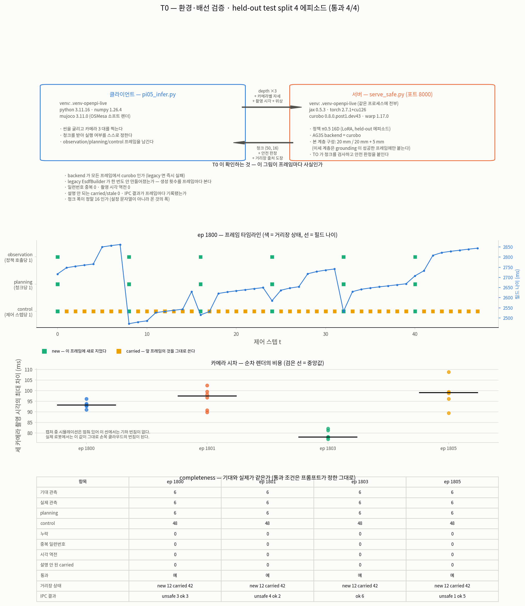

### 검증

| 무엇 | 결과 |
|---|---|
| 테스트 | **625 통과 — 불변** (`EsdfBuilder` 카운터 추가 후 재실행) |
| T0 판정 | `verify_t0.py` 8 항목 × 4 에피소드 **전부 통과** |
| 기록 완결성 | 관측 6/6 · planning 6 · control 48 · 누락 0 · 중복 0 · 역전 0 · 설명 안 된 carried 0 (4 에피소드 동일) |
| 실시간성 | **실패 — 24/24 청크가 533 ms 예산 초과, 중앙값 4.7 배** |

### 전체 틀에서 지금 어디인가 (규칙 B)

```
카메라 depth ✓ → 로봇 마스크 ✓ → attention lifting ✓ → grounding ✓ + 잠금 ✓
   → TSDF/ESDF ✓cuRobo 2계층 ✓라벨 층 ✓해석적 채널 ✓출처 도장 ✓쥔 물체 양면
   → 거리장 어댑터 ✓ → SQP 선형화 ✓ → QP 해 ✓ → 안전 게이트 ✓
   → 프레임 기록 ✓ observation ✓ planning ✓ control ✓ completeness
   → T0 ✓ 배선이 프레임마다 사실이다 / ✗ 실시간 예산은 4.7 배 초과
```

닫힌 것: **16D 모델 위에서 파이프라인 전체가 새 씬에서 끝까지 돌고, 프레임마다 무엇이
새 값이고 무엇이 물려받은 값인지 기록이 말한다.** 그리고 legacy 가 조용히 도는 경로가
불변식으로 막혔다.

다음: **T1 — 연속 프레임에서 실제 정책 attention 으로 지각을 재는 것.** T0 이 "배선이 있다"
까지만 말하므로, 이제 그 배선을 타고 온 것이 쓸 만한지 프레임 카드로 본다. 같은 에피소드
반복으로 위의 재현성 물음도 같이 닫는다.

---

## 회귀 기준선을 16D 로 갈았다 (2026-09-24) — 14D 기준선은 **실행 불가**가 됐다

T0 뒤 `esdf.py`·`pipeline.py` 를 건드렸으니 회귀 기준선을 돌렸는데 **죽었다.**

```
ValueError: chunk has 14 columns but the layout needs at least 16
```

내가 넣은 카운터 때문이 아니다. `run_0004` 의 저장된 청크는 14 열이고 `wire.ACTION_WIDTH` 는
16D 전환으로 16 이 됐다. 즉 **사용자 판정("16D 로 전환 — 14D 는 버린다")의 결과로 CLAUDE.md
의 기준선이 실행 불가가 된 것**이고, 전환 작업에서 이것을 같이 갈지 않은 것이 빠진 자리였다.

기준선은 "이 숫자가 다르면 코드를 고치기 전에 원인부터 찾는다" 는 안전망이다. 없는 채로
T1 을 시작하면 그다음의 모든 변경이 무방비다. 그래서 먼저 세웠다.

### 세운 사슬

| 단계 | 무엇 | 결과 |
|---|---|---|
| 1 | held-out ep1800 을 **평범한 정책 서버**(8123)로 120 제어 스텝 굴려 기록 | `run_16d_ep1800/` 15 관측 (`state (16,)`, `actions (50,16)`) |
| 2 | 같은 체크포인트로 attention 추출 (`sources/pi05_attention`) | `asset/data/attention_16d_ep1800.npz` — `(15,3,3,18,8,3,16,16)` fp16 21.6 MB |
| 3 | `esdf_rollout` 로 기준선 | **위반으로 시작 15/15 · 해소 13 / 개선 15 / feasible 13, violated 2** |

**덤으로 얻은 수치**: 평범한 정책 infer 가 **0.09 초**다. serve_safe 경로의 2725 ms 와 비교하면
정책 자체는 거의 공짜이고 **2.7 초 전부가 AG3S+TO** 라는 것이 독립적으로 확인된다.

### 첫 시도가 기준선 구실을 못 했다 — `--cameras head` 의 전제가 씬에 묶여 있었다

옛 기준선 명령 그대로(head 한 대) 돌리자 후보 0, 시작 위반 **0/15**, 여유거리가 전부
+166~+220 mm 였다. **고칠 것이 없는 판을 기준선으로 삼으면 안 된다.** 해소 0 / 개선 13 은
좋아 보이지만 아무 제약도 걸리지 않은 결과이고, 그 상태에서는 충돌 처리의 어떤 회귀도 안
잡힌다. 통과 기준을 낮추는 것과 같다.

세 카메라로 바꾸면 시작 위반 15/15 로 **고칠 것이 생긴다.** 옛 head-only 관례는 `run_0004`
씬에 묶여 있던 것이고, 에피소드 기반 씬에서는 성립하지 않는다. 세 대는 서빙 경로와 같은
진입점이라는 점에서도 낫다.

**여기서 처음에 원인을 잘못 짚었다 — 그림이 잡았다.** head 실행의 `target: false` 를 보고
"head 한 대로는 grounding 이 안 된다" 고 적었는데, 그림에 두 구성을 나란히 그리자 **세
카메라에서도 grounding 성공 0/15** 였다. `has_target`(`ag3s/types.py:913`)은 *조작 대상이
grounding 됐는가*이고 두 구성 모두 실패한다. 세 카메라가 바꾼 것은 grounding 이 아니라
**필드에 담긴 관측 기하의 양**이다 — 손목 카메라가 테이블·과일·바구니를 보므로 로봇 구가
마진 안으로 들어오고, head 한 대로는 필드가 비어 아무것도 가깝지 않다.

규칙 A 가 말하는 바로 그 경우다: 숫자를 문장에 흩어 놓았을 때는 놓쳤고, 두 계열을 한 축에
그리자 즉시 보였다.

### 기준선으로 인용할 수준 — 개수까지다

같은 입력으로 네 번 돌려 **개수는 전부 같았다.** 프레임별 값은 아니었다:
프레임 13·14 의 `clearance_after` 가 4.19 ↔ 4.97 mm, SQP 반복이 2 ↔ 3.

원인은 설계다. `sqp.time_budget_ms` 가 **벽시계 마감**이고(`trajopt/sqp.py:8,159` — *"The budget
is a deadline, not a suggestion"*) 1 회 이상 돈 뒤 예산을 넘으면 끊는다. 기계 부하가 반복 수를
바꾸고, 반복이 하나 더 돌면 여유거리가 조금 더 좋아진다. **딱지(해소/개선/feasible)는 제약이
풀렸는지로 정해지므로 흔들리지 않는다** — CLAUDE.md 가 예전부터 개수만 인용해 온 이유가
여기서 처음 설명됐다.

CLAUDE.md 의 기준선 블록을 갈고, 위의 세 가지(개수만 인용 · 14D 은퇴 사유 · `--cameras all`
이 필요한 이유)를 그 자리에 적었다. `.claude/ag3s-rules.md` 에는 기준선 블록이 없어 한 곳만
고쳤다 (규칙 본문은 이중이지만 기준선은 CLAUDE.md 에만 있다).

`run_0004` 와 `attention_step1_run0004.npz` 는 **지우지 않는다** — 14D 기록을 읽는 과거 실험
스크립트들이 그대로 쓴다. 은퇴한 것은 *기준선으로서의 역할*뿐이다.

### 이 기준선이 **재지 못하는 것** — 그리고 T1 이 먼저 닫아야 할 것

새 기준선은 **depth → 자기 필터 → 필드 → 거리장 어댑터 → SQP → QP** 를 재고,
**attention → target grounding 은 재지 않는다.** 15/15 프레임에서 `has_target: false` 이기
때문이다. 기준선으로 쓸 수는 있지만(회귀는 충돌 처리 쪽에서 잡힌다) **전 구간 기준선이라고
불러서는 안 된다.**

그리고 이것이 T1 의 첫 과제를 정한다. **오프라인에서는 grounding 이 15/15 실패하는데 live
경로는 같은 에피소드에서 성공한다** (T0 에서 AG3S `ok` + 미세 계층이 붙었고, 미세 계층은
grounding 된 대상이 있어야 붙는다). 차이는 오프라인이 **저장된 attention npz + 고정된 셀
선택**(층·헤드·agg·denoise)을 쓰고 live 는 서버가 자기 1단계에서 셀을 정한다는 것이다.
그 셀 선택은 14D 모델에서 정해진 것이므로(L8H2), 16D 모델에서 그대로 성립하는지가 열린
물음이다 — 사용자가 "이전 테스트도 새 모델로 다시 해보라" 고 한 것이 정확히 이 지점이다.

**추측으로 닫지 않는다.** T1 에서 같은 기록에 셀을 쓸어 grounding 성공률을 재고, live 서버가
실제로 고른 셀과 맞춰 본다.

> **닫혔다 — 그리고 위 짐작은 기각됐다** (`T1-a`, 2026-09-25). 셀을 **1296 조합 전수**로
> 쓸었고 `peak_on_target` 이 **어느 조합에서도 0** 이었다. `L8H2` 가 16D 에서 안 맞는 것이
> 아니라 **셀 축에 답이 없다.** 오프라인과 live 의 진짜 차이는 **attention 을 어느 카메라에
> 붙이느냐**였다 — 오프라인은 `zed_left` 한 대에만 붙이는데(`esdf_rollout.py:266`)
> **사과가 그 카메라에 한 프레임도 안 찍힌다**(0/15 · 0/50). live 는 세 대에 각각 붙인다.
> **짐작을 지우지 않고 남긴다** — 무엇을 어떻게 잘못 짚었는지가 그 자체로 자료다.
> 측정은 아래 **"T1-a"** 절.

### 검증

| 무엇 | 결과 |
|---|---|
| 새 기준선 4 회 반복 | 해소 13 / 개선 15 / feasible 13, violated 2 — **전부 동일** |
| 새 기준선이 재는 범위 | depth → 자기 필터 → 필드 → SQP → QP. **attention → grounding 은 안 잰다** (`has_target` 15/15 false) |
| 테스트 | **625 통과 — 불변** |
| 옛 기준선 | **실행 불가** (14 열 기록 대 16 열 layout) — 은퇴 확정 |

### 시각화

* **[`figures/live-test/baseline-16d.png`](figures/live-test/baseline-16d.png)** —
  head 한 대 대 세 대의 프레임별 여유거리(head 는 시작부터 전부 양수), 같은 입력 5 회의
  프레임별 값 흔들림과 실행 간 폭, 옛/새 기준선 비교 표.

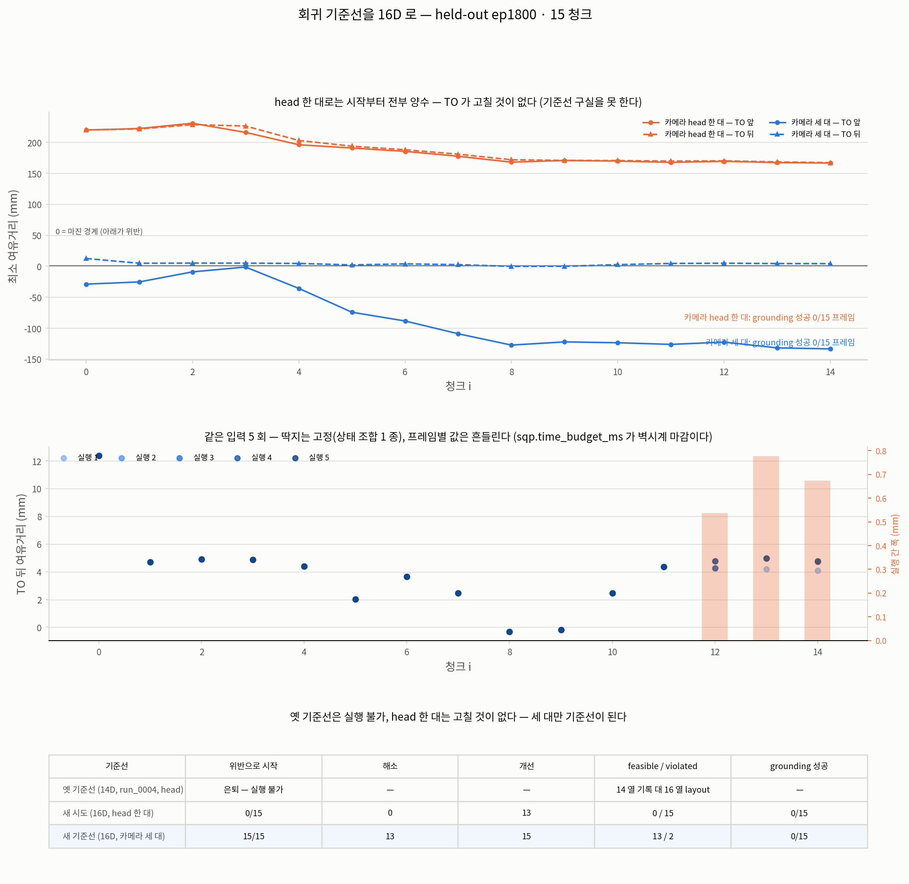

---

## 왜 8000 인가 — 두 서버는 다른 프로그램이다 (2026-09-24, 사용자 질문)

사용자가 띄운 서버는 **8123 `serve_policy.py`** 이고 나는 T0 을 **8000 `serve_safe.py`** 로
돌렸다. 같은 모델인데 포트를 옮긴 것처럼 보이지만, 옮긴 것이 아니라 **다른 프로그램**이다.

### 토대는 같다

두 프로세스의 명령줄에서 읽은 것(추정이 아니다):

| | 8123 `serve_policy.py` | 8000 `serve_safe.py` |
|---|---|---|
| config | `pi05_rby1_randomized_pick_place_16d_lora` | **같다** |
| checkpoint | `rby1_randomized_pick_place_16d_30k_xla_retry_20260923/29999` | **같다** |

그래서 T0 은 **사용자의 새 모델을 시험한 것**이다. 다른 체크포인트를 쓴 것이 아니다.

### 다른 것은 그 위에 얹힌 것이다

와이어 계약의 정의는 `benchmark/trajopt/wire.py` 한 곳이다.

| 와이어 키 | 8123 | 8000 | T0 에서 무엇에 쓰이나 |
|---|---|---|---|
| `actions` | 있다 | 있다 | — |
| `ag3s/depth` · `K` · `T_base_cam` | **받지 않는다** | 받는다 | ESDF 를 지을 재료 |
| `ag3s/robot_state` (카메라마다 따로) | **받지 않는다** | 받는다 | 손목 클라우드 번짐·자기 필터 어긋남 방지 |
| `ag3s/stamp` | **받지 않는다** | 받는다 | 카메라 시차, 필드 나이 |
| `ag3s/seq` (일련번호 왕복) | **돌려주지 않는다** | 돌려준다 | 오래된 응답 버리기, 중복 검사 |
| `ag3s_status` · `geometry_certified` | **없다** | 있다 | 프레임별 인증 여부 |
| `trajopt_status` · `max_violation_m` · `safe` | **없다** | 있다 | 안전 게이트가 실제로 걸리는가, IPC 결과 |
| `field` (거리장 출처 도장 14 키) | **없다** | 있다 | **T0 의 핵심** |

**T0 이 프레임마다 요구한 것이 전부 아래 칸에만 있다.** T0 은 "이 배선 그림이 프레임마다
사실인가" 를 묻는 게이트이고, 그 물음의 대상 — 출처 도장, 안전 판정, IPC 결과 — 은 정책
서버가 내놓는 것이 아니다.

**더 구체적으로**: `--safe-remote` 를 8123 에 물리면 `client.infer` 가 `result.get("seq", -1)`
을 보고(`trajopt/client.py:112`) 요청 일련번호와 다르므로 **모든 청크를 `stale` 로 hold** 한다.
기록에는 hold 만 남고 필드도 판정도 없다. 실행이 죽지는 않지만 T0 은 아무것도 재지 못한다.

### 8123 도 실제로 썼다

| 이번 작업의 단계 | 쓴 서버 | 왜 |
|---|---|---|
| T0 (4 에피소드 × 48 스텝) | **8000** | 프레임마다 출처 도장·안전 판정·IPC 가 필요하다 |
| 16D 회귀 기준선의 기록 만들기 (ep1800, 120 스텝) | **8123 (사용자 서버)** | AG3S 는 오프라인에서 적용한다 — `run_0004` 를 만든 방식과 같다 |
| attention 추출 | 서버 없음 (체크포인트 직접 로드) | `return_attn_probs` 는 서버 프로토콜로 못 뽑는다 |

**그리고 8123 에서 얻은 수치가 하나 있다**: 평범한 정책 infer 가 **0.09 초**다. 8000 왕복
2.5 초와 견주면 2.4 초가 전부 AG3S+TO 라는 것이 독립적으로 확인된다 — 이 비교가 가능했던
것은 두 서버를 나란히 썼기 때문이다.

### 포트는 8123 을 피한 것이지 고른 것이 아니다

`serve_safe` 의 기본 포트는 8000 이다(`serve_safe.py:175`). 8123 은 사용자 서버가 잡고 있어
(내 첫 시도가 `OSError: [Errno 98] address already in use` 로 죽었다) **사용자의 프로세스를
건드리지 않기 위해** 기본값을 그대로 뒀다.

### 되돌아올 지점 — 8123 을 T1 이후에 쓰는 구성이 실제로 있다

지금은 AG3S·TO 가 **서버 쪽**에 있다(`--safe-remote`). 대안은 **정책만 원격**으로 두고
AG3S·TO 를 클라이언트 프로세스에서 돌리는 것이다 — `pi05_infer --trajopt --remote
localhost:8123`. `.venv-openpi-live` 에 warp·curobo·mink 를 다 넣었으므로 기술적으로 가능하다.

| | `--safe-remote` (지금) | `--trajopt` + 8123 |
|---|---|---|
| 정책 | 서버 | 서버 (사용자 것 그대로) |
| AG3S·TO | 서버 | **클라이언트** |
| depth 가 네트워크를 건너나 | 건넌다 (3 대 × uint16) | 안 건넌다 |
| 실기 배치에 가까운가 | 지각까지 원격 | **지각이 로봇 쪽 — 이쪽이 가깝다** |
| T0 의 출처 도장·IPC 기록 | 와이어로 온다 | 프로세스 안이라 IPC 가 없다 |

**전환 신호**: (1) depth 전송이 실시간 예산에서 유의미한 몫을 차지하는 것이 측정되면,
(2) 실기 배치에서 지각을 로봇 쪽에 두기로 정해지면. 지금 안 옮기는 이유는 T0~T4 가
**프레임별 IPC 기록**을 판정 항목으로 요구하고, 한 프로세스 안에서는 IPC 가 아예 없어져
그 항목이 "해당 없음" 이 되기 때문이다. 옮기는 것은 T5·T6(실기 닫힌 루프)에서 다시 본다.

### 시각화

* **[`figures/live-test/two-servers.png`](figures/live-test/two-servers.png)** —
  같은 토대 위의 두 계약 도식, 와이어 키 대조표, 이번 작업에서 각 서버를 쓴 자리.

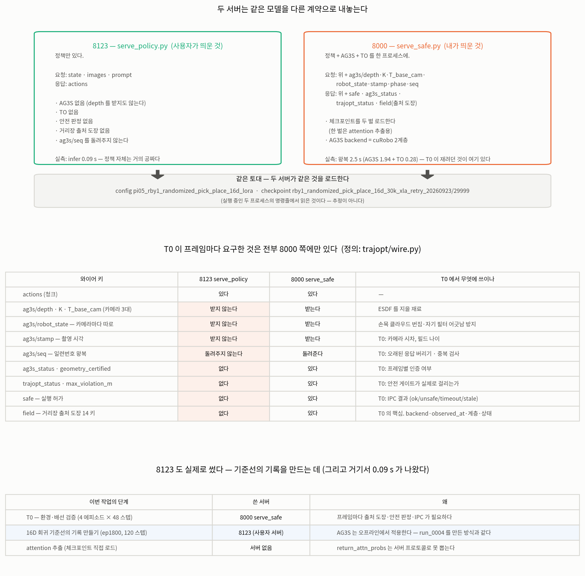

---

## R — 재측정 7건을 16D 로 (2026-09-25)

> **R 은 이제 16D 단독 측정이다** (사용자 판정 6, 2026-09-25) — *"14D 랑은 비교하지 마.
> 14D 기록은 파기하고 16D 로 새로 측정하고, AG3S 도 16D 에 맞춰 수행한다."* 물음이
> *"14D 값이 16D 에서도 같은가"* 에서 **"16D 에서 이 값은 얼마인가"** 로 바뀌었다.
> 값 표에서 `14D 값`·`달라졌나` 두 열을 없앴다 — 이유는 **"왜 이 표에 14D 열이 없나"** 절.
>
> **1 차 끝 — R 을 `R-port`(이식) / `R-measure`(측정) 로 쪼갰다.**
> 한 줄 결과: **분류로는 7 중 4 가 `runs` 인데, 그때 쓸 수 있는 수치는 1 건이었다.**
> 무효였던 이유는 전부 **스크립트가 16D 를 안 먹었기 때문**이지 값이 틀려서가 아니다.
> 이식은 끝났다(아래 `R-port` 절, 테스트 648). 남은 것은 `T1-a` 와 X1 이다.
> 출처: [`handoff/R.smoke.verify.json`](handoff/R.smoke.verify.json) (`benchmark` HEAD `5e35204`,
> `benchmark/**/*.py` 무수정).
>
> **그리고 R 은 지금 `T1-a` 에 막혀 있다.** R4·R5 는 미세 계층이 있어야 잴 수 있는데 이
> 기록에서 미세 계층이 **하나도 안 붙는다**. 원인은 grounding 실패이고, 그것은 attention
> **셀 선택**의 문제다 — 아래 **"막는 사실"** 절.

### 왜 지금 이것인가

위 **"물려받은 수치의 모델 출처 — 재측정 대기"** 표의 일곱 건은 **결정은 유효한데 수치가
14D 기록(`run_0004`/`run_0005`)에서 나온 것**이다. 사용자 판정(2026-09-24) *"이제부터 모든
테스트는 새로 파인튜닝한 16D 모델로"* 가 이것을 열어 두었고, 파지를 포함한 16D 긴 기록
(`outputs/live_test/20260924_long16d/run_0000/`, 정책 호출 50 · 제어 392 스텝)이 확보되어
이제 닫을 수 있다.

**T1 을 열기 전에 닫는 이유**: T1~T6 의 게이트 판정이 이 일곱 수치를 **전제로** 쓴다.
전제가 14D 인 채로 게이트를 통과시키면 통과 기준을 낮춘 것과 같아진다 — T0 에서 만난
*"기대 쪽이 틀린 경우"*(관측 기대치를 제어 스텝 수로 잡았던 것)와 같은 종류의 실패다.

**그리고 2026-09-25 에 성격이 한 번 더 바뀌었다.** 처음에는 *"14D 값이 16D 에서도 같은가"*
를 물었는데, 사용자 판정으로 **14D 를 기준의 자리에서 내리고 16D 단독으로 새로 재는 것**이
됐다. 위 일곱 건은 이제 *"다시 재야 할 목록"* 이지 *"견줄 값의 목록"* 이 아니다.

### 무엇을 재나 — 일곱 건이 가리키는 발견 (규칙 G)

| # | 가리키는 발견 — 한 줄 풀이 | 스크립트 |
|---|---|---|
| **R1** | **I2** — `pipeline._build_esdf` 를 legacy numpy 필드에서 cuRobo 로 갈아탄 통합 스텝. 여기서 재는 것은 **같은 씬에서 두 backend 의 거리가 얼마나 다른가** | `ag3s/experiments/live/verify_backend.py` |
| **R2** | (발견 ID 없음) **cuRobo 별도 기준선** — legacy 회귀 기준선과 나란히 두는 cuRobo backend 단독 rollout | `trajopt/experiments/esdf_rollout.py` |
| **R3** | (발견 ID 없음) **쥔 물체 부호 교정 문턱** — seed 제외 뒤 몇 복셀에서 *순수 복셀* 과 *공유 복셀* 을 가르나 | `ag3s/experiments/live/sweep_attached_threshold.py` |
| **R4** | **C5** — 거친 20 mm 계층이 판정 지점에서 clearance 를 실제보다 넓다고 답한다 (참 거리 대조로 확정) | `ag3s/experiments/curobo/verify_two_tier.py` · `ground_truth.py` |
| **R5** | **C3** — 미세 계층의 창 경계에서 거리장이 낙관적으로 불연속이다 (2계층 합성 규칙 고유) | 위와 같은 계열 |
| **R6** | **N1**(self-collision 제약이 `benchmark/trajopt/` 에 코드 0 줄로 아예 없다 — 잠복. **정정**(2026-09-25): 제약 행은 AG3S 에서 실제로 만들어진다 — `benchmark/ag3s/constraints/constraint_builder.py:280-289` 가 쥔 물체 대 로봇 자기 구의 여유거리 행을 만들고 `:163-164` 가 행 수를 센다. trajopt 이 평가하지 않는 이유는 자체 선형화(`benchmark/trajopt/linearize.py:3-20`)를 따로 만들어 사용하기 때문이다 — 그 선형화는 질의점끼리의 쌍을 계산하지 않는다) · **N2**(아는 정적 기하를 담을 geometry 채널이 없어 격자 밖·미관측이 무조건 자유로 답해졌다 — `min(복셀, 해석적)` 해석적 채널로 수정됨) · **F20**(옮겨진 물체의 *잔상* 이 8 프레임 뒤에도 남는다 — TSDF 가중치가 `min(w+1,64)` 로 단조 증가해 옛 관측이 흐려지지 않는다. decay 는 구현했고 기본값은 끔) | `studies/a1_static_geometry_effect.py` 계열 |
| **R7** | **F14** — `timing.max_state_age_sec` 기본값 100 ms 가 피해 시작점보다 6 배 이상 느슨하다. 상태 지연이 몇 ms 부터 로봇 점을 클라우드로 새게 하나 | `ag3s/experiments/studies/step7_state_lag.py` |

원 측정은 전부 archive [`AG3S_REVIEW_LOG.md`](AG3S_REVIEW_LOG.md) 에 있다 — I2 는 **"I2 —
`_build_esdf` 가 cuRobo 를 부른다"** 절, R3 의 문턱은 **"문턱을 실제 파지에서 쓸어 정했다"**
절, C3·C5·N1·N2·F14·F20 은 **"누적 발견"** 표의 해당 행.

---

### 1 차 결과 — **분류가 `runs` 여도 측정이 아닐 수 있다**

먼저 회귀 기준선을 돌려 환경이 성한지부터 봤다. **개수 5/5 일치** — 시작 위반 15/15 ·
해소 13 · 개선 15 · `feasible` 13 · `violated` 2. 아래 측정은 성한 환경에서 났다.

| # | smoke 분류 | 16D 긴 기록을 **실제로 먹었나** | 무엇이 걸렸나 |
|---|---|---|---|
| R1 | **`broken`** | 아니오 | `--records` 옵션이 없다. seed 로 **새 씬을 만들고** `used_saved_run: false` 를 박는다. 그리고 한 프로세스에서 legacy 와 cuRobo 를 둘 다 만들어 T0 불변식(`pipeline.py:906`)에 걸려 죽는다 |
| R2 | `runs` | 예 | 1 차가 **합성 attention** 이었다 (실측 npz `attention_16d_long.npz` 가 있는데 못 찾았다). 실측으로 다시 돌리니 **수치가 한 자리도 안 바뀌었다** — 아래 별도 절. 게다가 같은 명령 반복에서 `feasible` 이 1 회 이탈한다 |
| R3 | `runs` | **아니오** | `--records` 가 없어 `TransportScene` 으로 새 씬을 만든다. 문턱은 *실제 파지* 구간에서 쓸어야 뜻이 있는데 그 구간을 안 먹었다. 게다가 고른 문턱 **3.0** 이 후보 목록의 **상한값**이라 잘린 값이지 측정이 아니다 |
| R4 | **`needs-outpath`** | 아니오 (혼합) | `--records` 는 16D 를 가리켰는데 depth·마스크·필드는 **2026-09-12 자 `/tmp` npz** 에서 왔다. **로봇 자세만 16D, 관측과 필드는 14D 인 혼합 실행**이고 스크립트가 그 불일치를 안 잡는다. 출력 경로도 박혀 있어 archive 그림을 덮어썼다 (아래 규약 절). **그리고 그보다 앞서는 문제가 있다 — 미세 계층이 없다** |
| R5 | **`needs-arg`** | 아니오 | `/tmp/rby1_frame.npz`(2026-09-11 산물)를 말없이 읽는다. argparse 가 없어 다른 프레임을 먹일 방법 자체가 없다. **R4 와 같이 미세 계층이 없어 경로를 고쳐도 못 잰다** |
| R6 | `runs` | **예** | N2 는 그대로 돌아 **수치가 났다**(아래). N1 은 재는 스크립트가 repo 에 없고, F20 은 1 차에서 안 돌렸다 |
| R7 | `runs` | 예 | 돌았지만 `STEP_MS = 16.0` 이 **무엇에 곱해지는 상수인지 확정되지 않았다.** 기록의 `t_step` 은 제어 스텝을 8 씩 세므로 한 스텝이 16 ms 가 아닐 수 있다 — 단위가 확정되기 전의 값을 14D 와 나란히 놓으면 잘못 읽힌다 |

**분류 집계**: `runs` 4 · `broken` 1 · `needs-arg` 1 · `needs-outpath` 1.
`.venv-openpi-live` 로 전부 다시 확인했고 **재분류된 것은 0 건**이다 — `broken` 은 환경 선택이
아니라 실제 결함이다.

> **이 라운드가 실제로 답한 것은 수치가 아니라 이것이다.** `runs` 는 *프로세스가 0 으로
> 끝났다* 는 뜻이지 *16D 를 쟀다* 는 뜻이 아니다. 네 건이 `runs` 인데 그중 셋이 새 씬을
> 만들거나 14D 시대 `/tmp` npz 를 먹고 있었다. **이식 비용을 측정 결과로 착각할 뻔한
> 자리**이고, smoke 분류를 수치보다 먼저 세기로 한 이유가 여기서 값을 했다.

### R2 재측정 — **실측 attention 을 붙여도 수치가 한 자리도 안 바뀐다**

1 차의 R2 는 합성(synthetic) attention 으로 돌았다. 이 기록에 맞는 실측 npz 가
**있다** — `benchmark/ag3s/asset/data/attention_16d_long.npz` (50 프레임, `records` 가 이 긴
기록을 가리키고 `t_step` 0…392 가 일치, 체크포인트도 같다). 그것을 붙여 다시 돌렸다.

| 실행 | backend | attention | 시작 `violated` | `feasible` | `violated` | SQP 반복 중앙 | `has_target` |
|---|---|---|---:|---:|---:|---:|---:|
| legacy | legacy | **실측** | 15 | 12 | 3 | 2 | **0/15** |
| legacy | legacy | synthetic | 15 | 12 | 3 | 2 | **0/15** |
| cuRobo | curobo | **실측** | 12 | 7 | 8 | 1 | **0/15** |
| cuRobo | curobo | synthetic | 12 | 7 | 8 | 1 | **0/15** |

**실측과 합성이 완전히 같고, 네 실행 전부 `has_target` 0/15 다.** 파낸 target 복셀도 0 개다.

이것은 "attention 을 안 줬다" 는 절차 실수가 아니라 **결과**다. 실측 attention 이 들어와도
수치가 한 자리도 안 움직인다는 것은, **attention 이 grounding 까지 도달하지 못한다**는 뜻이다.

> **그때는 이유를 *셀 선택*(14D 에서 정해진 `L8H2`)으로 짐작했다. 그 짐작은 기각됐다.**
> `T1-a` 가 1296 조합을 전수로 돌려 **어느 셀도 안 맞는다**는 것을 보였고, 진짜 원인은
> **배선** — 오프라인이 attention 을 `zed_left` 한 대에만 붙이는데 **사과는 그 카메라에
> 한 번도 안 찍힌다** — 이었다. 아래 **"T1-a"** 절.

### 막는 사실 — **미세 계층이 하나도 안 붙는다** (R4·R5 가 여기서 멈춘다)

`outputs/verify/R/rollout_fields_16d.npz` 의 키가 **`coarse 45 / fine 0`** 이다
(15 프레임 × 거친 계층 3 키). `build_rollout_fields` 가 15 프레임 전부
*"계층 1 (target 없음 — 거친 계층만)"* 을 찍는다.

미세 계층(5 mm)은 **grounding 된 target 의 무게중심에 놓인다**. 그러니 의존이 이렇게 걸린다.

```
attention 배선(오프라인은 zed_left 한 대) → grounding 실패 0/15 → 미세 계층 0 개
   ↑ 그 카메라에 사과가 0 px                                     → R4(C5)·R5(C3) 잴 대상 없음
```

*(이 사슬의 첫 칸은 처음에 **셀 선택**으로 적혀 있었다. `T1-a` 가 **배선**으로 정정했다 —
아래 절.)*

**R4 와 R5 는 이 기록에서 비교 대상 자체가 없다.** R4 는 *거친 20 mm 계층 대 2계층* 의 낙관을
재고 R5 는 *미세 창 경계* 의 불연속을 재는데, 둘 다 미세 계층이 있어야 성립한다.
**출력 경로를 인자로 빼도(R4) 입력 경로를 인자로 빼도(R5) 여전히 못 잰다** — 이식이 문제의
앞이 아니라 뒤에 있었다.

A2 가 세 인자를 전부 16D 로 맞춘 자산은 이미 만들어 뒀다
(`outputs/verify/R/rollout_frames_16d.npz` · `rollout_fields_16d.npz`, eikonal 자가진단
`|∇d|` 중앙 1.000 통과). 막는 것은 자산이 아니라 grounding 이다.

### 재현성 — 1 회 이탈, **원인 미상**

같은 명령(legacy backend · 실측 attention · `--dump-frames` 없음) **4 회**의 `feasible`:

| 표본 | `feasible` | SQP 반복 중앙 |
|---|---|---|
| 동일 명령 4 회 | **12 · 7 · 12 · 12** — 1 회 이탈 | 다섯 표본 전부 **2** |
| + synthetic attention 실행 (나머지 동일) 5 회 | **12 · 12 · 7 · 12 · 12** — 1 회 이탈 | 〃 |

**앞선 판 `12·7·7·12·12` 는 정정됐다** — `--dump-frames` 가 붙은 다른 명령(`R4_dump_base`)을
같은 명령 표본에 섞은 집계 오류였다. lead 가 다섯 파일의 `frames[].status` 를 직접 세어
잡았고 A2 가 원인과 함께 `R.smoke.verify.json` 에 기록했다.

**흔들림의 원인은 아직 모른다 — 확정 전이다.** SQP 반복 중앙값이 다섯 다 2 라
*"반복 수가 줄어서"* 만으로는 설명되지 않는다. 그리고 `run_16d_ep1800` 회귀 기준선은 4 회
전부 같았고 **긴 기록에서만** 흔들린다. 추적은 `T1-a` 의 2 차가 맡았다 — **N 회 반복으로 덮지
않고 원인을 찾는다**(사용자 판정 5).

> **`T1-a` 2 차가 절반을 닫았다** — 아래 그 절의 **"재현성"** 소절. 답부터: **뒤집힌 것은
> 판정이 아니라 mm 이다.** 프레임 5·11·12·13·14 다섯 개가 **한 실행에서만** 뒤집히고, 두
> 실행은 소수 셋째 자리까지 같으며(계산은 결정적), 폭이 최대 35.52 mm 라 0 근처에서 갈린
> 것이 아니다. **원인은 여전히 미상이다.**

> `feasible`/`violated` 는 **0 을 기준으로 한 이진 딱지**라 +0.5 mm 와 −0.5 mm 가 갈린다.
> 그래서 먼저 가릴 것은 *"흔들린 것이 판정인가 mm 인가"* 이고, 그것은 이미 있는
> `outputs/verify/R/R2_repeat_*.json` 의 프레임별 `clearance_after_mm` 로 답할 수 있다.

### 16D 로 닫힌 것 — R6 의 **N2** 하나

**N2** = 아는 정적 기하(벽·선반·테이블·바닥)를 담을 geometry 채널이 없어 격자 밖·미관측이
무조건 자유로 답해졌던 것. 복셀에 찍는 대신 `EsdfField.static_shapes` 로 따로 재어
`min(복셀, 해석적)` 으로 합치는 **해석적 채널**로 고쳤다. 여기서 재는 것은 그 채널을 껐을 때
필드가 얼마나 **낙관**(= `필드가 답한 거리 − 참 거리`, 양수면 실제보다 넓다고 말한 것이라
위험)하는가다.

16D 긴 기록 15 프레임 · 정적 도형 16 개:

| 표본 | 해석적 채널 **끔** | **켬** |
|---|---|---|
| `arms` 120 구 (질의 1800) | 최대 낙관 **+258.2 mm** · 중앙 **+47.7 mm** · 낙관 질의 **1241** | 최대 **+0.0 mm** · 중앙 **0.0 mm** · 낙관 질의 **0** |
| `all` 194 구 (질의 2910) | 최대 낙관 **+408.0 mm** · 중앙 **+80.2 mm** · 낙관 질의 **2111** | 최대 **+0.0 mm** · 낙관 질의 **0** |

**16D 에서 해석적 채널을 켜면 낙관이 0 이다** — 최대도 중앙도 0.0 mm 이고, 낙관적으로 답한
질의가 `arms` 1800 중 **0 개**, `all` 2910 중 **0 개**다. 채널을 끄면 필드가 실제보다 최대
25.8 cm(`all` 에서는 40.8 cm) 넓다고 답한다.

읽는 법: **낙관은 양수만 위험하다.** 음수는 필드가 실제보다 가깝다고 답한 것이라 여유를 더
요구하는 쪽이고, 그것은 안전한 방향이다. 그래서 여기서 세는 것은 *양수 질의의 개수와 그
최댓값*이다. 끔 쪽의 포화 질의(`arms` 1084 · `all` 2194)는 거리가 `max_distance` 에서 잘려
"안 보인다" 가 "충분히 멀다" 로 읽힌 자리이고, 채널을 켜면 각각 558 · 798 로 준다.

### 값 — **16D 단독**이다 (사용자 판정 6)

| # | 무엇 | **16D 값** | 어떻게 쟀나 | 표본 |
|---|---|---|---|---|
| R1 | I2 — legacy 필드와 cuRobo 필드가 같은 씬에서 얼마나 다른가 | **산출 대기** | `verify_backend.py` 를 `dump`(각 backend 가 따로 npz 를 낸다) / `compare`(밖에서 대조) 두 프로세스로 가른다 — T0 불변식을 건드리지 않기 위해 (P1) | 16D 긴 기록 |
| R2 | cuRobo backend 단독 기준선 | **재현성 확정 대기** | `esdf_rollout.py --esdf-backend curobo`, 실측 attention npz `attention_16d_long.npz` | 15 프레임. 같은 명령 4 회 중 **1 회**가 5 프레임을 통째로 뒤집는다 — **0 근처 딱지 문제가 아니라 해가 다른 곳에 앉은 것**(`T1-a` 2 차). 원인은 미상 |
| R3 | 쥔 물체 부호 교정 문턱 — 몇 복셀에서 *순수 복셀* 과 *공유 복셀* 을 가르나 | **측정 대기** (P5) | `sweep_attached_threshold.py` 가 기록의 파지 구간을 먹게 하고 `--thresholds` 상한을 넓힌다 | **파지 프레임 4 개**(정책 호출 32~35). 호출 36 부터 세 카메라 모두 사과 픽셀 0 이라 쓸 수 없다 — **표본이 4 라는 것을 산출물에 명시하고 진행**(사용자 판정) |
| R4 | C5 — 거친 20 mm 계층이 판정 지점에서 clearance 를 얼마나 넓게 답하나 | **배선 정렬 대기** | 거친 계층과 2계층을 참 거리에 견준다. **지금은 견줄 2계층 쪽이 없다** — `coarse 45 / fine 0`. 원인은 `T1-a` 가 **배선**으로 좁혔다 (판정 8) | — |
| R5 | C3 — 미세 계층의 창 경계에서 거리가 얼마나 튀나 | **배선 정렬 대기** | 미세 창 경계를 가로질러 거리를 훑는다. **잴 대상인 창 자체가 없다.** R4 와 같은 원인 | — |
| R6 · N2 | 해석적 채널을 **끄면** 필드가 얼마나 낙관하나 | **끔 최대 +258.2 mm · 중앙 +47.7 mm · 낙관 질의 1241** → **켬 최대 +0.0 mm · 중앙 0.0 mm · 낙관 질의 0** (`all` 은 끔 **+408.0 mm** · 중앙 +80.2 · 낙관 질의 2111 → 켬 **0**) | `a1_static_geometry_effect.py` — 같은 프레임에서 채널 끔/켬 두 벌을 내고 참 거리에 견준다 | `arms` 120 구 × 15 프레임 = **질의 1800** (`all` 은 194 구 × 15 = 2910). 정적 도형 16 개 |
| R6 · N1 | self-collision — **움직일 수 있는 구**의 여유가 마진 안으로 들어오나 | **측정 대기** | `n1_self_collision_clearance.py` **신규**(P8). `rigid_spheres()` 로 고정 구와 움직일 수 있는 구를 **기구학에서** 가르고 두 집합의 여유를 따로 낸다 | 파지 프레임 4 개. **구 분할 자체가 X1 로 조사 중이다** |
| R6 · F20 | decay 를 끄면 *잔상* 이 얼마나 남나 | **측정 대기** | `a4_task_tsdf.py` 계열 | — |
| R7 | F14 — 상태 지연이 몇 ms 부터 로봇 점을 새게 하나 | **이 기록으로는 못 잰다** (아래 P7 절) | `step7_state_lag.py`. `STEP_MS` 상수를 없애고 기록 `meta` 에서 파생 | 기록 한 장 = **533 ms**. 0 이 아닌 가장 작은 지연도 설정 한계 100 ms 밖이다 |

**이 표를 채우는 규칙** — 16D 칸에 들어가는 모든 수치는 `R.verify.json` 의 `numbers` 를
출처로 갖는다. 거기 없는 숫자는 쓰지 않는다. **구현자(A1)가 스크립트가 도는지 보며 흘린
숫자도 쓰지 않는다** — 그것은 기능 확인이지 측정이 아니다.

### 왜 이 표에 14D 열이 없나 (사용자 판정 6, 2026-09-25)

이 절은 원래 *"14D 에서 나온 일곱 수치가 16D 에서도 그대로인가"* 를 물었고, 값 표에
`14D 값 │ 16D 값 │ 달라졌나·왜` 세 열이 있었다. **사용자 판정으로 물음이 바뀌었다** —
*"14D 랑은 비교하지 마. 14D 기록은 파기하고 16D 로 새로 측정하고, AG3S 도 16D 에 맞춰
수행한다."* 그래서 표는 **`16D 값 │ 어떻게 쟀나 │ 표본`** 이 됐다.

**14D 값이 틀려서 내린 것이 아니다.** 그 값들은 자기 자리에서 옳았고 archive
[`AG3S_REVIEW_LOG.md`](AG3S_REVIEW_LOG.md) 에 원 측정 그대로 남아 있다 — **그 파일은 고치지
않는다.** 내려온 것은 *기준으로서의 자리*다. 이유는 셋이 한꺼번에 다르기 때문이다:
**다른 모델**(14D LoRA ↔ 16D LoRA), **다른 기록**(`run_0004`/`run_0005` ↔ 16D 긴 기록),
**다른 action layout**(`ACTION_WIDTH` 14 ↔ 16, `ARM_JOINT_DIM` 6 ↔ 7 — 16D 에서 `arm_6`
손목이 자유 관절이 됐다). 셋이 동시에 다른 두 값을 한 행에 나란히 놓으면 **차이가 어느
축에서 왔는지 아무도 답할 수 없고**, 읽는 쪽은 그것을 "모델을 바꾸니 값이 변했다" 로 읽는다.
그것이 이 검토가 반복해서 경계한 **거짓 대조**다 — C2("거친 33 mm 대 미세 2 mm")와
"거리 포화 비교의 함정" 이 같은 모양이었다.

그러니 이 표는 **비교표가 아니라 16D 의 기준선**이다. 채워지는 값이 곧 T1~T6 이 전제로 쓸
수치가 된다.

### 사용자 판정 일곱 (2026-09-25)

| # | 판정 | 왜 |
|---|---|---|
| 1 | **R 을 `R-port`(이식) / `R-measure`(측정) 로 쪼갠다** | 되돌아올 지점이 *"`broken` 3 건 이상이면 이식이 본체"* 였다. 글자로는 `broken` 1 건이지만 **쓸 수 있는 수치가 1/7** 이라 취지가 맞는 자리다 |
| 2 | **R1 은 T0 불변식을 건드리지 않고 프로세스를 나눠 푼다** | 불변식(backend 가 `curobo` 인데 legacy `EsdfBuilder` 가 생기면 즉시 실패)은 *두 backend 가 한 프로세스에 공존하면 어느 필드가 판정에 쓰였는지 기록만으로 못 되짚는다* 를 막는 장치다. 비교하려고 그것을 푸는 것은 **안전망을 재료로 쓰는 것**이다. legacy 로 한 번, cuRobo 로 한 번 따로 돌려 각각 npz 로 내고 대조는 밖에서 한다 |
| 3 | **R7 은 `STEP_MS` 단위를 확정한 뒤 다시 잰다** | 상수를 박아 두고 잰 값은 단위가 바뀌면 통째로 뜻이 바뀐다. F14 자체가 *"측정 없이 정한 기본값"* 을 잡은 발견인데, 그것을 재는 스크립트가 같은 실수를 하고 있었다 |
| 4 | **T1 의 첫 과제(attention 셀 선택)를 R 앞으로 당긴다** | R4·R5 가 거기 막혀 있다 — 미세 계층은 grounding 이 서야 생기고, grounding 은 셀 선택에 달려 있다. **순환이 아니다**: 셀 선택은 R 의 수치를 하나도 쓰지 않으므로 거기서 끊을 수 있다. 배분표 [`handoff/T1-a.task.md`](handoff/T1-a.task.md) |
| 5 | **재현성은 N 회 반복으로 덮지 않고 원인을 추적한다** | 여러 번 돌려 다수결을 취하면 *흔들린다는 사실* 이 평균 안에 숨는다. 먼저 **어느 프레임이 뒤집히는지 · 그 프레임의 `clearance_after_mm` 가 0 에서 얼마나 가까운지**를 이미 있는 raw 로 가린다 |
| 6 | **14D 와 비교하지 않는다 — R 은 16D 단독 측정이다** | *"14D 랑은 비교하지 마. 14D 기록은 파기하고 16D 로 새로 측정하고, AG3S 도 16D 에 맞춰 수행한다."* 모델·기록·action layout 셋이 한꺼번에 달라 나란히 놓으면 차이가 어느 축에서 왔는지 답할 수 없다. 값 표에서 `14D 값`·`달라졌나` 두 열을 없앴다 (위 절) |
| 7 | **고정 구 이상(X1)을 즉시 조사한다** | P8 을 돌리다 **고정 구가 42 개**로 나왔다. 16D 에서 `arm_6`(손목)이 자유 관절이 됐으니 고정 구는 **줄어야** 맞는데 늘었다 — 방향이 반대다. **분할이 틀리면 회귀 기준선을 포함한 모든 여유거리 계산이 그 위에서 돈다.** 잠복해 있으면 뒤에 나오는 모든 수치가 그 위에 쌓인다 |

판정 3 의 부대 조건은 판정 6 이 흡수했다. 옛 값을 **새 단위로 다시 계산해 옮겨 적지 않는다** —
archive 의 값은 그 단위 그대로 archive 에 남고, 16D 값은 새 단위로 새로 잰다.

### `R-port` 이식 — 코드가 무엇이 바뀌었나 (A1, 2026-09-25)

**수치는 없다.** A1 이 스크립트가 도는지 보며 낸 숫자는 기능 확인이지 측정이 아니므로 여기
적지 않는다 (철칙). 적는 것은 **코드가 무엇이 바뀌었고 무엇이 테스트로 못박혔나**다.

**테스트 648 passed** — 기존 **625** 가 전부 그대로 통과하고 신규 `tests/ag3s/test_record_timing.py`
**23** 이 더해진 값이다. lead 가 직접 돌려 재현했다.

#### P6 — 단계 경계를 기록에서 파생한다. 그리고 **옛 상수가 재현됐다**

`ground_truth.py` 의 `_phase(t, b=(24,56,72))` 는 경계가 상수로 박혀 있고 플래그가 없었다.
긴 기록에서는 `t_step ≥ 72` 면 전부 `grasp` 이라 41 프레임이 잘못 라벨된다. 경계를 **그리퍼가
닫히는 시점**에서 뽑게 고쳤다.

세운 규칙을 14D `run_0004` 에 적용하면 **`(24, 56, 72)` 가 그대로 나온다** — 박혀 있던 바로
그 세 값이다. 같은 규칙이 16D 긴 기록에서는 `(208, 240, 256)` 을 낸다.

> **이것이 말하는 것**: 옛 상수는 규칙이 아니라 **한 기록에서 나온 답을 굳힌 것**이었다.
> 규칙으로 바꾸니 옛 답을 재현하면서 새 기록에도 따라간다. 상수를 규칙으로 되돌리는 것이
> 이식의 본체인 자리이고, 재현이 그 규칙이 지어낸 것이 아님을 증명한다.
> `test_derivation_reproduces_the_old_hardcoded_constants` 가 못박는다.

#### P7 — `STEP_MS` 는 상수가 아니라 기록에서 파생된다. **그리고 R7 의 판정 방향이 뒤집힌다**

먼저 **코드로 단위를 확정했다**(고치기 전에). `STEP_MS` 가 곱해지는 상대는 `--lags` 의 `k`
이고, 그 `k` 는 **기록 한 장** 단위의 지연이다. 기록 한 장의 간격은 `ctrl_hz = 15` ·
`open_loop_horizon = 8` 에서 **8 제어 스텝 = 533.3 ms** 다. 옛 `16.0` 은 `8 × 2 ms`(sim
timestep)로 **8 이 곱해질 상대를 잘못 잡은 값**이었다. 이제 기록 `meta` 에서 파생한다.

**그래서 R7 의 옛 결론이 성립하지 않는다.** 옛 출력은 *"설정 한계 100 ms 안에서 이미 새니
한계가 느슨하다"* 였는데, 새 단위에서는 **0 이 아닌 어떤 지연도 한계 밖**이다 — 가장 작은
비영 지연이 533 ms 이기 때문이다. 지금 스크립트가 찍는 판정은 이것이다:

> **이 기록의 해상도로는 한계 안쪽을 못 잰다.** 한계가 느슨한지 아닌지를 이 측정은 답하지
> 못한다 — 답하려면 **제어 스텝 단위 기록**이 필요하다.

**R7 의 수치는 그래서 이 절에 없다.** 값이 없는 것이 아니라, 이 기록으로 답할 수 없는 물음에
낸 값이라 기준으로 세울 수 없다.

#### P3 — 출처 도장 없는 **혼합 실행을 거부한다**

1 차에서 R4 가 *로봇 자세만 16D, 관측·필드는 2026-09-12 자* 인 채로 **exit 0** 으로 끝났다.
그것을 구조로 막았다: 생산자(`esdf_rollout --dump-frames`, `export_frame`)가 npz 에 출처
도장을 찍고, 중간 단계(`build_rollout_fields`)가 그대로 흘려보내고, 소비자
(`ground_truth.py`)가 **세 인자의 짝을 확인해 안 맞으면 `SystemExit`** 한다.
**도장이 없는 옛 형식도 통과시키지 않는다** — "모른다" 를 "맞다" 로 읽는 것이 그때 난 일이다.

덧붙여, 미세 계층이 없을 때 맨 `IndexError` 대신 *"코드 결함이 아니라 기록의 성질이다"* 까지
말하고 멈춘다. 읽는 쪽이 **버그와 "잴 것이 없다" 를 구별**할 수 있게 하는 것이 요점이다.

그 밖에 P1(R1 프로세스 분리) · P2·P4(박힌 출력·입력 경로를 인자로) · P8(N1 측정 스크립트
신규, `benchmark/ag3s/experiments/studies/n1_self_collision_clearance.py`)이 들어갔다.
**P5(R3 이 기록의 파지 구간을 먹게)는 사용자 판정으로 표본 4 프레임임을 명시하고 진행한다.**

### X1 — **고정 구가 42 개다. 방향이 반대다** (A1 조사 중, 사용자 판정 7)

P8 을 돌리는 중에 나왔다. `rigid_spheres()` 가 가른 **고정 구**(= 지금 자세에서 움직일 수
없는 로봇 구)가 **42 개**다. 16D 에서 `arm_6`(손목)이 자유 관절이 됐으므로 고정 구는
**줄어야** 맞는데 늘었다.

**왜 즉시인가**: 고정 구 / 움직일 수 있는 구의 분할이 틀리면 **그 위에서 도는 모든 여유거리
계산이 함께 틀린다 — 회귀 기준선까지 포함해서.** 잠복해 있으면 뒤에 나오는 모든 수치가 그
위에 쌓인다. N1 이 묻는 *"움직일 수 있는 구가 마진 안으로 들어오는가"* 도 이 분할이 정의한다.

답할 것 셋: (1) 분할이 **어디서** 정해지나(`파일:줄`) — 관절 자유도에서 파생되나 목록으로
박혀 있나, (2) 42 가 옳은가 틀린가, 옳다면 왜 늘었나, (3) 틀렸다면 **회귀 기준선이 영향을
받았나, 어느 방향으로.** 확장으로 **X2 — 16D 정렬 감사**(AG3S 안에 관절 수·action layout·
링크 목록·구 목록이 14D 를 전제하는 자리를 `파일:줄` 로 훑는다)가 같이 걸려 있다.

**이 절에 개수 말고 다른 수치를 적지 않는다** — A1 의 숫자는 스크립트가 도는지 본 부수물이고,
판정은 A2 가 재고 나서다.

### 환경 사실 정정 — venv 는 둘이 아니라 **셋**이다 (2026-09-25 실측)

CLAUDE.md 는 오래 *"venv 두 개이고 numpy 버전 때문에 합칠 수 없다"* 고 적고 있었다.
**틀렸다.** 세 번째가 있고, 거기에는 양쪽이 다 들어 있다.

| venv | 무엇이 있나 |
|---|---|
| `.venv-ag3s` (py3.11, numpy 2.4.6) | mujoco · casadi · osqp · scipy |
| `.venv-curobo` (py3.10, numpy 1.26.4) | torch · curobo · warp |
| **`.venv-openpi-live`** (py3.11, numpy 1.26.4) | **mujoco 3.11.0 · casadi 3.8.0 · osqp 1.1.3 · torch 2.7.1 · curobo 0.8.0 · warp 1.17.0 — 전부** |

직접 import 로 여섯 개 전부 확인했다. **이 사실을 모르면 `broken` 오판이 난다** — "mujoco 와
curobo 가 한 프로세스에서 못 돈다" 를 전제로 실패를 읽으면 환경 탓으로 돌리게 된다.
실제로 1 차에서 `broken`/`needs-*` 로 분류된 셋을 이 venv 로 다시 돌렸고, **재분류된 것은
0 건**이었다 — 전부 스크립트 쪽 결함이다. CLAUDE.md 는 고쳤다.

### 시각화 (규칙 A)

* **[`figures/r-16d/r-smoke-scene.png`](figures/r-16d/r-smoke-scene.png)** — 실제 씬. 16D 긴
  기록 위에 로봇 구·정적 도형·질의점을 실제 좌표로 겹쳐 그렸고, 단면은 **어디를 어느 방향에서
  잘랐는지 배치도를 먼저** 보인다.
* **[`figures/r-16d/r-smoke-trend.png`](figures/r-16d/r-smoke-trend.png)** — 그래프. 해석적
  채널 끔/켬의 프레임별 낙관 추이와 분포(R6 의 N2).
* **[`figures/r-16d/r-smoke-table.png`](figures/r-16d/r-smoke-table.png)** — 표·도식. 일곱 건
  × (분류 · 16D 를 먹었나 · 쓸 수 있나) 대조표.
* **[`figures/r-16d/step7-state-lag-0000.png`](figures/r-16d/step7-state-lag-0000.png)** —
  R7 이 낸 그림. **값은 아직 인용하지 않는다**(단위 확정 대기).

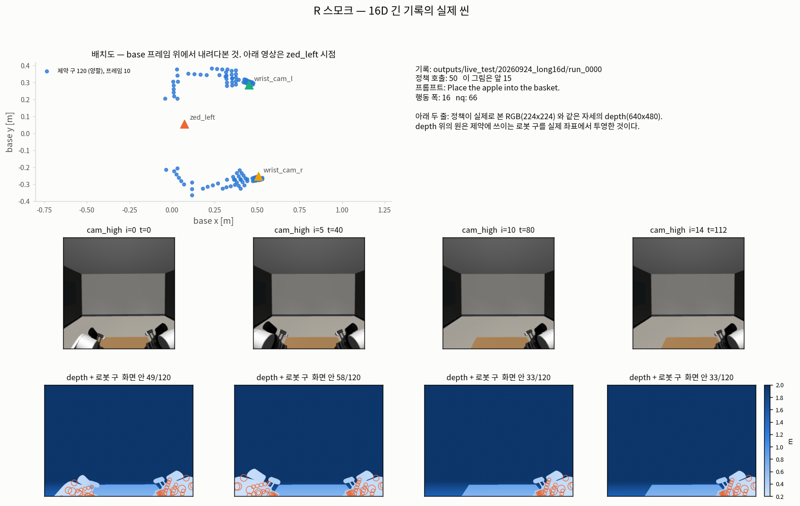

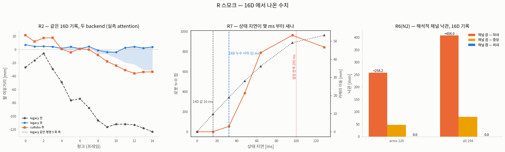

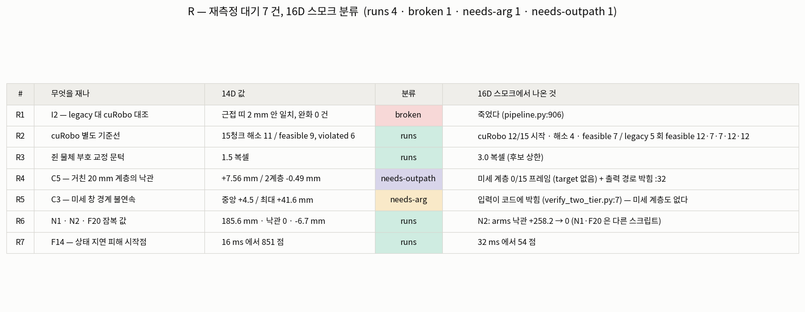

### 규약 — **재측정은 원 측정의 파일을 덮어쓰지 않는다** (실제로 한 번 밟았다)

R4 의 `ground_truth.py` 는 출력 경로가 코드에 박혀 있어(`:32` 의 `OUT`) 1 차 실행이
`archive/14d-era-20260923/figures/curobo-ground-truth.png` 을 **그대로 덮어썼다**. 그 그림은 archive
[`AG3S_REVIEW_LOG.md`](AG3S_REVIEW_LOG.md) 의 참 거리 대조 절과
`PIPELINE-STAGES-AND-CUROBO-ROLE.md` 가 **C5(거친 20 mm 계층이 판정 지점에서 clearance 를
넓게 답한다)의 14D 원 측정 증거로 링크**하는 것이다. 이름이 같으면 archive 의 **본문은 14D
숫자, 그림은 16D** 가 되어 서로 어긋난다 — 글이 가리키는 증거가 조용히 다른 것으로 바뀌는,
이 검토가 반복해서 만난 **조용한 실패**(잘못됐는데 아무 데도 안 찍히는 것)의 한 형태다.
게다가 덮어쓴 그 그림 자체가 **자세만 16D 인 혼합 실행**의 산물이었다.

처리: 덮어쓴 판을 `outputs/verify/R/OVERWROTE_curobo-ground-truth_16Dpose_14Dnpz.png` 로
따로 남기고 원본은 git 에서 복구한다. 출력 경로를 인자로 빼는 것은 `R-port` 의 P2 다.

**그래서 이 국면 전체에 거는 규약이다.** 재측정의 산출물 — figure · `raw_output` · `*.json` —
은 원 측정과 **다른 경로**에 쓴다. R 은 `figures/r-16d/` 를 쓴다. R 이 아닌 다음 재측정도
같은 이유로 자기 디렉토리를 만든다. archive 는 닫힌 국면의 기록이므로 그 본문도 그 그림도
고치지 않는다 — archive 의 값은 archive 에 그대로 있고, 16D 값은 위 표에서 **따로** 선다
(판정 6 이후로 둘을 한 행에 나란히 놓지 않는다).

**이것은 수치가 아니라 규약이라 `R.verify.json` 을 기다리지 않는다.**

### 다음 — 이식은 끝났다. 남은 것은 **`T1-a`** 와 **X1**

`R-port`(이식)는 P5 를 빼고 끝났다(테스트 648). 그래도 R4·R5 는 여전히 못 잰다 — 막는 것이
스크립트가 아니라 **grounding** 이기 때문이다. 그래서 사용자 판정 4 로 `T1-a` 를 앞으로
당겼고, 판정 7 로 X1 이 그 옆에 섰다.

| 순서 | 무엇 | 계약 |
|---|---|---|
| **끝남** | **`T1-a` — attention 셀 선택** | **답이 나왔다**(아래 절): 1296 조합 전수 `peak_on_target` **0**, 원인은 셀이 아니라 **배선**. 2 차(재현성)도 *판정이 아니라 mm* 까지 좁혔다 |
| **지금** | **배선 정렬**(사용자 판정 8) | 오프라인이 attention 을 세 카메라에 각각 붙이게 고친다 — **서빙 경로를 기준으로**. 그것이 되면 grounding 이 서고 → 미세 계층이 붙고 → **R4·R5 가 잴 대상을 갖는다** |
| **지금 · 병렬** | **X1 — 로봇 구 분할 감사** | 고정 구 42 개가 옳은가. 틀리면 **회귀 기준선을 포함한 모든 여유거리 계산**이 영향을 받는다. 확장으로 X2(16D 정렬 감사 — AG3S 안에 14D 를 전제하는 자리를 `파일:줄` 로) |
| **끝남** | `R-port` — 이식 | P1·P2·P3·P4·P6·P7·P8 완료, **P5 만 남았다**(R3, 표본 4 프레임 명시하고 진행) |
| **그다음** | **`R-measure` — 16D 단독 측정** | [`handoff/R-measure.task.md`](handoff/R-measure.task.md). **16D 에서 이 수치들은 얼마인가**, 그리고 **그 값들이 올라선 구 분할이 옳은가** |

### 전체 틀에서 지금 어디인가 (규칙 B)

R 은 파이프라인의 새 구간을 여는 것이 아니라, **이미 지나온 구간에 박아 둔 눈금을 16D 에서
다시 새기는** 일이다. 그런데 눈금 둘이 **앞단에 매여 있고**, 눈금 전체가 올라선 **자(尺)
자체가 흔들린다는 의심**(X1)이 같이 나왔다.

```
카메라 depth → 로봇 마스크 (R7 ✗이 기록의 해상도로는 못 잰다 — 한 장이 533 ms)
   → [attention 셀 선택 ✗L8H2 가 16D 에서 안 선다 → lifting → grounding ✗0/15]
                                    │
                                    └─▶ 미세 계층 0 개 ─▶ R4(C5) ✗ · R5(C3) ✗
   → TSDF/ESDF (R1 ○측정 대기 · R6-N2 ✓닫힘 · R6-F20 ○측정 대기)
   → 쥔 물체 편입 (R3 ○P5 · 표본 4 프레임)
   → 거리장 어댑터 → SQP 선형화 → QP 해 (R2 ○재현성) → 안전 게이트 (R6-N1 ○측정 대기)

              그리고 이 사슬 전체가 올라선 것:  로봇 구 분할 (X1 — 고정 구 42 개?)
```

**닫힌 것**: R6 의 **N2** 하나 — 16D 에서 해석적 채널을 켜면 낙관이 0 이다.

**그 밖에 이 국면이 실제로 답한 것 셋** (전부 수치가 아니라 *무엇을 믿을 수 있는가* 다):

1. **`runs` 는 "쟀다" 가 아니다.** 4 건 중 셋이 새 씬을 만들거나 옛 `/tmp` npz 를 먹고 있었다.
   분류를 수치보다 먼저 센 덕분에 이식 비용을 측정 결과로 착각하지 않았다.
2. **이식으로도 안 풀리는 것이 있다.** R4·R5 는 스크립트가 아니라 앞단(grounding)에 막혀
   있고, *실측 attention 을 붙여도 수치가 한 자리도 안 움직인다* 는 사실이 그것을 가리켰다.
3. **박힌 상수는 규칙이 아니라 한 기록의 답이었다.** P6 이 세운 그리퍼 파생 규칙이 옛
   `(24, 56, 72)` 를 그대로 재현한다 — 규칙으로 되돌리니 옛 답을 지키면서 새 기록에도 따라간다.

**다음**: **배선 정렬**(판정 8 — 오프라인을 서빙 경로와 같게. 그것이 되면 grounding 이 서고
미세 계층이 붙어 R4·R5 가 잴 대상을 갖는다)과 **X1**(고정 구 분할이 옳은가 — 틀리면 그 위의
모든 여유거리가 흔들린다)을 나란히 돌린다. 그다음이 `R-measure`, 그다음이 **T1 본체**다.
`T1-a` 는 끝났다 — 바로 아래 절.

---

## T1-a — **셀 선택이 아니었다. 배선이었다** (2026-09-25)

> **2026-09-24 부터 열어 두었던 물음이 닫혔고, 가설이 기각됐다.**
> 로그는 *"14D 에서 정해진 `L8H2` 가 16D 에서도 성립하는지가 열린 물음"* 이라고 적어 두었다.
> 답: **`L8H2` 가 안 맞는 것이 아니라 어느 셀도 안 맞는다 — 셀 축에 답이 없다.**
> 출처: [`handoff/T1-a.verify.json`](handoff/T1-a.verify.json) (`benchmark` HEAD `5e35204`,
> `benchmark/**/*.py` 무수정).

### 1296 조합 전수 — 전부 0 이다

`attention 셀` 은 `denoise 3 × aggregation 3 × layer 18 × head 8` = **1296 개**다
(카메라는 `cam_high` 고정 — grounding 이 그것만 읽는다). 전수로 돌렸다.

| 기록 | 프레임 | `peak_on_target` 최대 | `target_mass_mean` 최대 |
|---|---:|---:|---:|
| `run_16d_ep1800` | 15 | **0/15** | — |
| `20260924_long16d/run_0000` | 50 | **0/50** | **정확히 0.0** |

**`peak` 만 빗나가는 것이 아니다.** attention 질량 중 대상 칸의 몫이 1296 조합 **전부에서
정확히 0** 이다. 최댓값 한 칸이 어긋난 것이라면 어떤 셀에서는 조금이라도 얹혔을 텐데, 전부
0 이라는 것은 **그 영상에 대상이 아예 없다**는 뜻이다.

> **왜 두 단계로 나눴나.** `ground_target` 한 번이 **4.82 초**(점 58,717 개)라 1296 조합을
> 전부 실제로 돌리면 npz 당 **약 26 시간**이다. 그래서 A 단계는 16×16 격자에서만 세고
> (조합당 마이크로초), B 단계가 A 의 상위 조합 + 14D 셀만 실제 `lift → ground_target` 을
> 돌린다. **A 단계가 이미 0/1296 이라 B 단계가 결론을 바꾸지 않는다.**

### 진짜 원인 — **사과가 그 카메라에 한 번도 안 찍힌다**

MuJoCo 분할 마스크에서 `apple` 픽셀을 직접 셌다.

| 카메라 | `run_16d_ep1800` (15 프레임) | `long16d` (50 프레임) |
|---|---|---|
| **`zed_left` = `cam_high`** | **0/15 프레임, 최대 0 px** | **0/50 프레임, 최대 0 px** |
| `wrist_cam_l` | **15/15**, 중앙 2,938 px (최대 10,459) | **42/50**, 중앙 4,178 px (최대 9,937) |
| `wrist_cam_r` | 0/15, 최대 0 px | 0/50, 최대 0 px |

**사과는 왼 손목 카메라에만 보인다.** 그런데 grounding 은 `cam_high` 의 attention 만 읽는다
(`benchmark/trajopt/experiments/esdf_rollout.py:137`). 없는 것을 가리키라고 시킨 셈이고,
그래서 어느 셀을 골라도 0 이 나온다. **셀 축을 아무리 뒤져도 답이 없던 이유가 이것이다.**

### 그리고 이것이 **오프라인 ↔ live 차이**를 설명한다

로그가 2026-09-24 에 *"오프라인은 15/15 실패하는데 live 는 같은 에피소드에서 성공한다"* 고
적고 **차이를 셀 선택으로 짐작해 두었다.** 그 짐작이 틀렸다. 차이는 **attention 을 어느
카메라에 붙이느냐**다.

| | 코드 | 무엇을 하나 |
|---|---|---|
| **오프라인** | `esdf_rollout.py:266` — `attention_map=(att if c == "zed_left" else None)` | 세 카메라 관측을 만들지만 **attention 맵은 `zed_left` 한 대에만** 붙인다 |
| **live (서빙)** | `serve_safe.py:162-163` → `wire.py:171` — `attention_map=attention.get(cam)` | 정책이 보낸 **세 카메라의 attention 이 각 카메라 관측에 따로** 붙는다 |

live 는 손목 카메라의 attention 도 들고 있으니 사과가 보이는 영상에서 grounding 이 선다.
오프라인은 사과가 안 보이는 한 대만 본다. **파이프라인 결함이 아니라 하네스와 서빙 경로가
갈라져 있던 것**이고, T0 이 *"서빙 경로와 같은 진입점"* 을 기준선의 조건으로 삼았던 이유가
여기서 한 번 더 증명됐다.

### 새 결함 — grounding 이 **실패를 성공으로 보고한다**

14D 셀(`denoise 0 · agg last · L8H2`)을 긴 기록 50 프레임에 돌린 결과:

| 무엇 | 값 |
|---|---:|
| `has_target` 성공 | **31 / 50** |
| 그중 `on_apple`(중심이 참 사과에서 0.10 m 안) | **0 / 50** |
| 지목한 중심의 사과까지 거리 | **0.36 ~ 3.59 m** |
| 상태 딱지 | `OK` 31 · `LOW_SCORE` 19 |

**31 프레임에서 "target 을 찾았다" 고 보고하는데, 그 31 건 전부 사과가 아닌 것을 지었다.**
`LOW_SCORE` 가 19 프레임에 찍혔는데도 `has_target` 은 참이다. 이것이 **조용한 실패**다 —
잘못됐는데 아무 데도 안 찍히는 것. 용어 절의 그 항목에 사례로 달았다.

**그래서 `has_target` 만으로 성공률을 세면 안 된다.** `has_target` 은 *"후보 덩어리 하나를
골랐다"* 이지 *"그것이 조작 대상이다"* 가 아니다. 이번 라운드가 남기는 가장 옮겨 쓸 만한
구분이고, 앞으로 grounding 성공률에는 `on_apple`(일반적으로 `on_target`)을 반드시 함께 센다.

> **덧붙여, 14D 셀이 어디서 왔는지도 확인했다.** `archive/step-verification-20260904/step-01-attention.json`
> 의 `denoise 0 · agg last · L8H2 · hit_rate 1.0` 이고, 그 파일 자신의 메타데이터는
> 프롬프트가 `"put the apple in the basket"` · 44 프레임이다. 16D 기록의 프롬프트는
> `"Place the apple into the basket."` 로 **다르다**. 지금 그것이 원인이라고 말할 근거는
> 없다 — 사실만 적는다.

### **이 수치를 R 의 `target 0/15` 와 직접 견주지 않는다** (A2 의 단서)

A2 의 sweep 은 **단일 카메라 `zed_left` 경로**를 직접 부른다
(`reconstruct → robot_filter → fit_support_surfaces → lift → ground_target`).
R 의 rollout 이 보고한 `target 0/15` 는 **융합 `--cameras all` 경로**(`process_multi`)에서
나온 것이다. 결론이 같은 방향을 가리키지만 **같은 측정이 아니므로 두 수치를 한 줄에 놓지
않는다.** — 이 검토가 반복해서 경계해 온 *거짓 대조*를 여기서도 피한다.

### 축 순서 — 확인했고, 버그는 없다

`T1-a.task.md` 는 npz 축을 `(프레임, 카메라, denoise, layer, head, agg, 16, 16)` 로 적었는데
실제는 **`(frame, denoise, agg, layer, head, camera, 16, 16)`** 이다
(생산자 `sources/pi05_attention.py:234`). `camera`·`denoise`·`agg` 가 **전부 길이 3** 이라
shape 만으로는 구분되지 않아 안 보였다. **소비자는 옳다** — `esdf_rollout.py:252` 가
`[i, di, ai, layer, head, ci]` 로 읽어 생산자와 일치한다. sweep 은 전수라 영향도 없다.

### 재현성 — **판정이 아니라 해가 다른 곳에 앉았다** (T1-a 2 차)

R 절이 *"원인 미상"* 으로 열어 둔 것이다. 새로 돌리지 않고 **이미 있는 json 을 프레임 단위로
대조**해서 좁혔다.

| 물음 | 답 |
|---|---|
| 어느 프레임이 뒤집히나 | 프레임 **5 · 11 · 12 · 13 · 14** 다섯 개. **매번 다른 프레임이 아니다** |
| 어느 실행이 튀나 | 다섯 전부 **`R2_repeat_1` 하나에서만** `violated` 다. 나머지 세 실행은 전부 `feasible` |
| 계산이 비결정적인가 | **아니다.** 두 실행(`R2_legacy_attn` · `R2_repeat_2`)의 뒤집힌 5 프레임 `arm_after_mm` 가 **소수 셋째 자리까지 같다** (4.262 / 2.788 / 4.460 / 2.099 / 4.064) |
| 0 근처에서 갈린 것인가 | **아니다.** 프레임별 폭이 5.51 → 35.52 mm 이고, `repeat_1` 은 프레임 14 에서 **−31.458 mm** 다. 그리고 **안 뒤집힌 프레임 중에 `\|clearance\|` 0.119 mm 인 것이 있다** — 0 에 가까운 것만으로는 설명되지 않는다 |
| 반복 수 탓인가 | **전부는 아니다.** 프레임 5 와 14 는 네 실행의 `iterations` 가 `[2,2,2,2]` 로 **같은데 결과가 갈린다** |

**그래서 "이진 딱지가 0 근처에서 갈렸다" 가 아니다 — 한 실행만 다른 해에 앉았다.**
R 절이 던진 *"흔들린 것이 판정인가 mm 인가"* 의 답은 **mm** 이다.

**원인은 아직 미상이다.** 나란한 값 하나가 있다: `feasible 7` 이 나온 두 실행이
`ag3s_ms_sum` 상위 둘이다. **표본 6 개의 나란한 값일 뿐 인과를 잰 것이 아니고**, 측정 중에
다른 작업이 같은 기계에서 돌고 있었다. `sqp.time_budget_ms` 가 벽시계 마감이라는 것
(CLAUDE.md 가 개수만 인용해 온 이유)과 같은 자리를 가리키지만, **그렇다고 적으려면 부하를
통제한 측정이 필요하다.**

### 사용자 판정 8 · 9 (2026-09-25)

| # | 판정 | 왜 |
|---|---|---|
| 8 | **오프라인을 live 와 같게 고친다 — 세 카메라에 각각 attention 을 붙인다** | 기준은 **서빙 경로**다. 하네스가 서빙과 다르면 하네스에서 잰 모든 수치가 서빙을 대표하지 못한다. 이번에 그것이 *"grounding 이 16D 에서 깨졌다"* 로 두 번(2026-09-24 · R 1 차) 잘못 읽혔다 |
| 9 | **`cam_high` 가 사과를 한 번도 못 보는 것을 AG3S 설계 문제로 올린다** | 카메라를 고쳐도 남는 물음이다 — **grounding 이 한 대에 의존하는 구조가 옳은가.** 조작 대상은 팔이 다가갈수록 머리 카메라에서 가려지고 손목 카메라에서 커진다. 지금 구조는 그 반대 방향으로 굳어 있다 |

### 아직 안 끝난 것

`run_16d_ep1800` 의 **B 단계 7 조합**이 남았다 (현재 6/13 완료, **전부 `on_apple` 0/15**).
**A 단계가 이미 0/1296 이므로 결론은 바뀌지 않는다** — 남은 수치는 A2 가 채운다.
그 밖에 재지 않은 것: live 서버를 띄워 세 맵이 실제로 오는지(코드 경로만 읽었다),
`wrist_cam_l` 의 attention 으로 grounding 이 서는지(오프라인이 `zed_left` 에만 맵을 붙이므로
**코드를 고치지 않고는 잴 수 없다** — 판정 8 이 그것이다), 파지 구간(정책 호출 36~45)과
`wrist_cam_l` 의 사과 픽셀 0 구간(36~43)의 인과.

### 시각화 (규칙 A)

* **[`figures/t1-a/t1a-scene.png`](figures/t1-a/t1a-scene.png)** — 실제 씬. 세 카메라 **배치도**
  먼저, 그다음 14D 셀의 16×16 attention, 그리고 세 카메라 depth 에 사과 픽셀을 겹쳐 **어느
  영상에 사과가 있고 없는지**를 직접 보인다.
* **[`figures/t1-a/t1a-trend.png`](figures/t1-a/t1a-trend.png)** — 그래프. 프레임별 사과 픽셀
  (세 카메라) · 1296 조합의 분포 · 같은 명령 4 회의 프레임별 clearance.
* **[`figures/t1-a/t1a-table.png`](figures/t1-a/t1a-table.png)** — 표·도식.

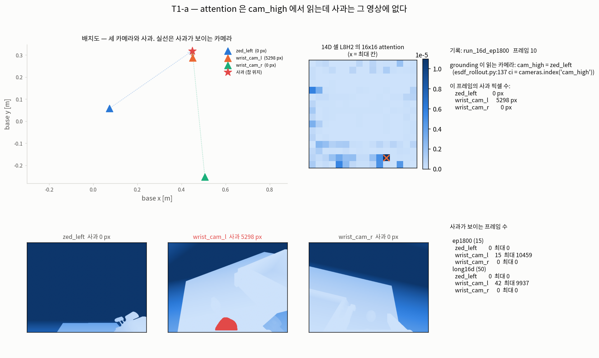

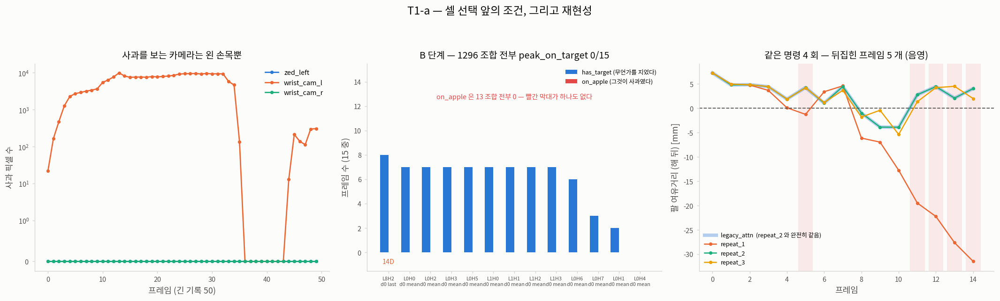

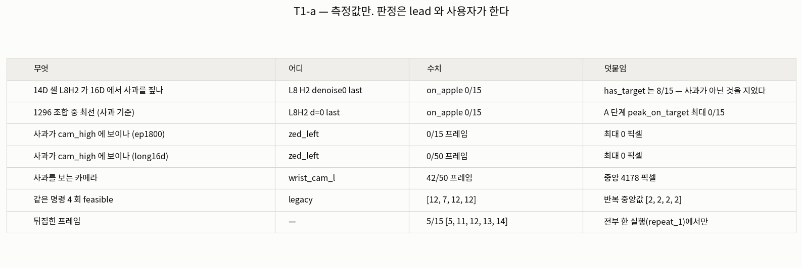

### 전체 틀에서 지금 어디인가 (규칙 B)

```
카메라 depth → 로봇 마스크
   → attention ─┬─ 오프라인: zed_left 한 대에만 붙는다 ✗ (판정 8 이 고친다)
                └─ live    : 세 대에 각각 붙는다 ✓
   → lifting → grounding  ✗ has_target 은 서는데 on_apple 0 (조용한 실패)
   → 미세 계층 0 개 ─▶ R4(C5) · R5(C3) 가 여기서 막혀 있다
   → TSDF/ESDF → 거리장 어댑터 → SQP → QP → 안전 게이트
```

**닫힌 것 둘.** (1) *"14D 의 `L8H2` 가 16D 에서 성립하는가"* — **물음 자체가 잘못 놓였다.**
셀 축에 답이 없고 원인은 배선이다. (2) *"흔들린 것이 판정인가 mm 인가"* — **mm 이다.**
한 실행만 다른 해에 앉았고 계산 자체는 결정적이다.

**연 것 둘.** (1) 판정 8 — 오프라인을 서빙 경로와 같게 고친다. 그것이 되면 grounding 이
서고, 서면 미세 계층이 붙고, 붙으면 **R4·R5 가 잴 대상을 갖는다.** (2) 판정 9 — grounding 이
카메라 한 대에 의존하는 구조 자체를 본다.

**다음**: 판정 8 의 배선 정렬(A1) · X1 의 고정 구 분할 감사 · 그다음 `R-measure`.

---

## X1 — 로봇 구 분할 (2026-09-25)

### 결론 — 분할은 옳다. 경보였지 결함이 아니었다

**1. 결정적 실험** — 같은 기록·같은 프레임·같은 물체 점군에서 `free_joints` 만 12(14D) ↔ 14(16D)로 바꿨더니 고정 구 집합이 비트 단위로 같았다. 둘 다 **42 / 120**, 한쪽에만 고정인 구 0 개. 액션 폭은 이 분할에 들어올 자리가 없다.

**2. 분모 혼동** — 14D 의 27 은 구 **105 개** 모델에서 나온 값이고 지금은 **120 개**다. 같은 축의 수가 아니라 나란히 놓을 수 없다(판정 6 — 14D 와 비교하지 않는다).

**3. 기구학 파생** — `benchmark/ag3s/constraints/attached.py:241-292` 의 `rigid_spheres()`. 손으로 쓴 목록이 아니라 기구학에서 파생된다 — 자유 관절을 24 회 흔들어 여유 변화폭이 `1e-6 m` 미만인 구를 고정으로 가른다.

**4. 42 의 정체** — `ee_finger_l1`(11) + `ee_finger_l2`(11) + `link_left_arm_6`(15) + `link_left_arm_5`(5). 앞 셋은 쥔 물체와 같은 강체다. `link_left_arm_5` 는 몸쪽인데도 고정인 이유가 기하로 설명된다: 그 구 5 개가 `arm_6` 회전축 위에 있다. 축까지 거리 `link_left_arm_5` **0.194~0.207 mm** 대 `link_left_arm_4` **37.8~51.6 mm**. `arm_6` 을 1.0 rad 돌려도 여유가 **0.000 nm** 변한다(float64 12 자리 동일).

**5. 회귀 기준선은 영향을 받지 않는다** — `rigid_spheres` 의 소비자가 정의 자신·새 스크립트 `n1_self_collision_clearance.py`·테스트뿐인 것을 lead 가 직접 grep 으로 확인했다.

### 세 번째 배선 사례 — 이 국면의 패턴

이것이 이 국면에서 세 번째 배선 결함이다:

1. **첫째** — 오프라인이 attention 을 한 카메라에만 붙인다(T1-a 의 근거).
2. **둘째** — 머리 `ctrl` 을 아무도 안 세운다(X2 — 머리 카메라가 벽을 본 이유).
3. **셋째** — self-collision 제약 행이 AG3S 에서 만들어지는데 trajopt 이 평가하지 않는다(N1).

셋 다 **모듈은 멀쩡한데 호출부가 갈라진 경우**다. 첫째는 pipeline 과 production 경로가 다르고, 둘째는 리셋 경로 2 개가 다르고, 셋째는 AG3S 와 trajopt 의 선형화가 다르다. 코드를 읽을 때 "여기 구현이 없다" 보다 "여기서 호출되나" 를 먼저 묻게 된다는 것이 이 관찰의 가치다. 다음에 같은 모양을 만나면 모듈부터 뒤지지 않는다.

---

## X2 — head cam 이 벽을 보고 있었다 (2026-09-25)

### 1. 증상

수집 때 `cam_high` 영상(`pi05_TO_hybrid/data/rby1_randomized_pick_place_16d_v1/videos/chunk-001/observation.images.cam_high/episode_001800.mp4`)에는 테이블·바구니·과일이 정면으로 다 보인다. 같은 에피소드의 기록 `run_16d_ep1800/step_*.npz` 의 `image_cam_high` 는 벽을 올려다본다. 테이블 윗변만 화면 맨 아래에 걸친다. `image_cam_high` 는 정책에 실제로 들어간 이미지다.

### 2. 원인 — teleop 키프레임이 자기 안에서 모순이다

`model_transport.xml` 의 `teleop` 키프레임: `key_qpos[head_1] = 0.7`(테이블을 내려다봄), `key_ctrl[head_1_act] = 0.0`. `mj_resetDataKeyframe` 는 `qpos` 와 `ctrl` 을 둘 다 적용한다. `head_1_act` 는 position actuator 라 settle 1.5 s 동안 머리를 0 으로 끌어내린다.

그 키프레임에서 ctrl 과 qpos 가 어긋난 actuator 는 29 개 중 **13 개**다. 팔 12 개는 두 리셋 경로가 ctrl 을 명시적으로 덮어써서 살아남았고, **머리만 아무도 안 세웠다.**

수집 경로(`rby1_manipulation/.../transport_scene.py:465`)는 모든 구동 관절을 키프레임 qpos 로 붙들어 처음부터 문제가 없었다. 두 경로가 갈라져 있던 것이다.

### 3. 수정

`pi05_TO_hybrid/rby1_bringup/pi05_infer.py` 에 `hold_keyframe_pose(m, d)` 함수를 넣고 `mj_resetDataKeyframe` 두 곳(:296 에피소드 재생, :950 일반) 뒤에서 부른다. joint transmission actuator 전부를 키프레임 qpos 로 맞춘다.

### 4. 실측 확인

settle 1.5 s 뒤 `head_1`: 고치기 전 `0.7000 → 0.0000`, 고친 뒤 `0.7000 → 0.7001`.

카메라 시선: `head_1=0.0` 일 때 `[1, 0, 0]`(수평), `head_1=0.7` 일 때 `[0.765, 0, -0.644]`(약 40도 아래).

**카메라 장착은 안 건드렸다.** `zed_left` 는 body 사슬 `zed_camera <- link_head_2 <- link_head_1 <- link_torso_5 <- ...` 로 로봇에 붙어 있고, `torso_0` 을 0.3 rad 돌리면 카메라가 **351.2 mm** 따라 움직인다. 월드에 고정한 것이 아니다.

테스트 **652 passed**(기존 648 + 머리 가드 4).

### 5. 가드

`tests/ag3s/test_head_camera_pose.py` 넷:
- (a) `teleop` 의 `head_1` 이 0.7 인가
- (b) settle 뒤에도 0.7 로 남는가
- (c) 맨 리셋은 여전히 머리를 떨어뜨리는가(왜 붙들어야 하는지 못박음)
- (d) `pi05_infer` 의 모든 `mj_resetDataKeyframe` 뒤에 `hold_keyframe_pose()` 가 있는가(구조적 가드)

### 6. 무효가 되는 기록

2026-09-25 이전의 16D 기록(`run_16d_ep1800`, `20260924_long16d`)은 전부 머리가 0 인 채로 떠났다. 그 위에서 잰 grounding 관련 수치는 다시 재야 한다. 재촬영이 `outputs/live_test/20260925_headfix16d/` 로 진행 중이다.

### 재촬영 결과 (2026-09-25)

**X2(머리 각도가 0 이 되는 keyframe 자체모순)는 닫혔다.**

#### 새 기록 확보

경로: `outputs/live_test/20260925_headfix16d/records/run_0000/run_0000` (15 observations)
- **`head_1` = +0.7001**, 15/15 프레임 전부에서 유지 (수정 전 0.00004)
- **`cam_high` 영상**: 테이블·바구니·과일 셋이 보인다 — 수집 때 영상 `episode_001800.mp4` 와 같은 장면 (수정 전 벽만 보임)

#### 새 attention npz

경로: `benchmark/ag3s/asset/data/attention_16d_headfix.npz`
- 형상 `(15, 3, 3, 18, 8, 3, 16, 16)`, 자료형 float16, 크기 21.5 MB

#### 회귀 기준선 비교

같은 명령(`--cameras all`)과 배선 수정된 `esdf_rollout` 에서:

| 지표 | 수정 전 (머리 0) | 수정 후 (머리 0.7) |
|---|---|---|
| `has_target` — 지었나 (후보 덩어리 골랐나) | 9/15 | **15/15** |
| 위반으로 시작 | 15/15 | 15/15 |
| 해소 (feasible 이 된 수) | 13 | **15** |
| 개선 (여유거리 나아진 수) | 15 | **15** |
| `feasible` — 최악 여유거리 ≥ 0 | 13 | **2** |
| `violated` — 최악 여유거리 < 0 | 2 | **13** |
| `clearance_after` 중앙 | +4.35 mm | +4.19 mm |
| `clearance_after` 최소 | −3.15 mm | **+0.02 mm** |
| `n_candidates` > 0 프레임 | 0 | 0 |
| `target_voxels_carved` 총합 | 0 | 0 |
| AG3S 실행 중앙값 | 1115 ms | **3169 ms** |

#### 열린 물음 — `status` 와 `clearance_after` 의 불일치

새 기록에서 `clearance_after` 가 전 프레임에서 양수(최소 +0.02 mm)인데도 `status` 가 `violated` 를 반복한다. 예: 프레임 1 은 여유 +4.60 mm (positive clearance)에 `feasible`, 프레임 2 는 여유 **+4.87 mm** (더 큼)인데 `violated`.

코드상 둘의 출처가 다르다 (`benchmark/trajopt/experiments/esdf_rollout.py`):
- `status` = `result.status.value` — `optimizer.solve()` 의 SQP 자신의 판정
- `clearance_after_mm` = `linearizer.full_violation(result.trajectory, ...)` — 나온 궤적을 **다시 평가**한 값

**원인은 아직 모른다.** 다음 STEP 에서 측정한다.

#### 지각은 실제로 섰다 — `zed_left` 가 사과를 본다

`head_1` 만 놓고 잰 것이 아니라, **재촬영 기록의 segmentation 에서 사과 픽셀을 직접 셌다**
(`outputs/verify/X2/head_pitch_headfix.json`, 기록 qpos 그대로).

| | 수정 전 (`run_16d_ep1800`) | 수정 후 (`20260925_headfix16d`) |
|---|---|---|
| `zed_left` 에 사과가 보이는 프레임 | **0 / 15** | **15 / 15** |
| `zed_left` 사과 픽셀 중앙 | 0 | **544 px** |
| `wrist_cam_l` 에 보이는 프레임 | 15 / 15 | 15 / 15 |
| `wrist_cam_r` 에 보이는 프레임 | 0 / 15 | 0 / 15 |

T1-a 가 *"`head_1` 만 0.7 로 되돌리면 중앙 552 px"* 라고 예측했던 값이다 — 메모리에서 관절
하나를 바꿔 잰 예측과 실제로 다시 촬영한 기록이 **544 대 552 px** 로 맞는다.

두 기록의 `argv` 는 출력 경로 하나만 빼고 같다 (`--episode-index 1800`). 차이는
`model_transport.xml` 의 teleop keyframe 하나다.

프레임 11 부터 픽셀이 547 → 62 로 떨어진다. **팔이 사과를 가린다** — 카메라가 아니라 가림이다.

#### 재촬영 rollout 의 raw 가 남지 않았다

위 "재촬영 결과" 표 열한 줄은 **출처 파일이 없다.** `outputs/verify/` 에도 `/tmp` 에도
프레임별 산출이 없다. 개수는 그 자리에서 읽어 옮긴 것이고, **`verify.json` 을 거치지 않았다.**
`handoff/X3.task.md` 의 측정 1 이 같은 명령을 다시 돌려 `outputs/verify/X3/headfix_rollout.json`
으로 되살린다. **그때까지 이 열한 줄은 재인용하지 않는다.**

### 시각화 (규칙 A)

* **[`figures/x2/x2-scene.png`](figures/x2/x2-scene.png)** — 실제 씬. 머리 관절 하나가 시선을
  어디로 보내는지 배치도로 먼저 보이고, 그다음 정책이 실제로 본 `cam_high` 영상을 수정 전후로
  나란히 놓고, 마지막에 `zed_left` depth 위에 사과 mask 를 얹는다. 수정 전은 벽, 수정 후는
  테이블과 과일이다.
* **[`figures/x2/x2-trend.png`](figures/x2/x2-trend.png)** — 그래프. 프레임별 `head_1` ·
  프레임별 `zed_left` 사과 픽셀 · 카메라 세 대 중 어느 것이 사과를 보나.
* **[`figures/x2/x2-table.png`](figures/x2/x2-table.png)** — 표. 재촬영 대조표.
  **raw 가 없는 열한 줄이라는 것을 표 안에 적어 두었다.**

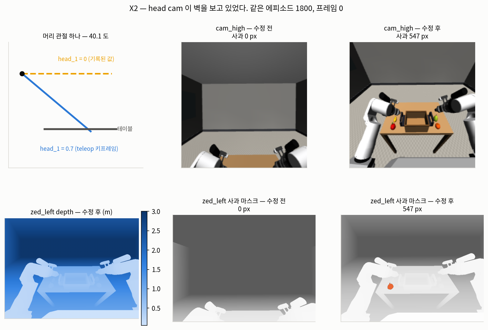

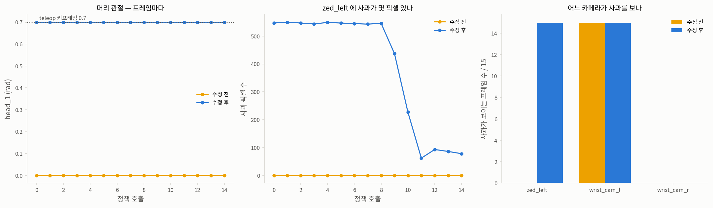

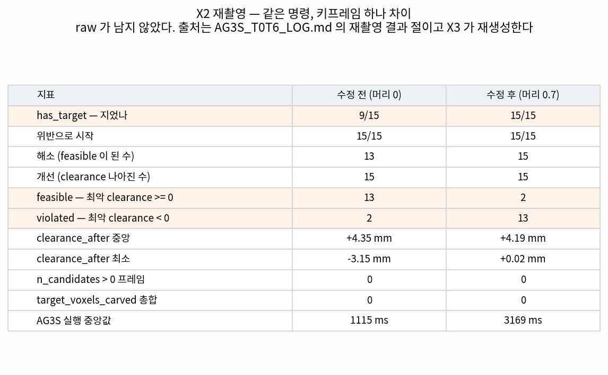

### 다음 — X3

`status` 와 `clearance_after` 의 불일치를 잰다. 계획은 `handoff/X3.task.md` 에 있고,
측정 1 이 위의 raw 를 먼저 되살린다. 어디를 볼지는 두 군데로 좁혀 두었다 —
geometry 인증 게이트(`sqp.py:287-293` 은 clearance 를 다 만족해도 AG3S 가 씬을 인증하지
못하면 `VIOLATED` 로 내린다)와, 두 `full_violation` 호출의 인자 차이(`states`).
**둘 다 아직 후보일 뿐이고, 숫자로 확정하기 전에는 판정하지 않는다.**

---

## X3 — `status` 는 clearance 가 아니라 **기하 인증**을 보고 뒤집힌다 (2026-09-25)

출처: `handoff/X3.verify.json`. raw 는 `outputs/verify/X3/`.

### 측정 1 — 재촬영이 재현됐다. raw 가 다시 생겼다

X2 재촬영의 개수가 **전부 같게** 나왔다. 이제 출처 파일이 있다
(`outputs/verify/X3/headfix_rollout.json`).

| | 로그 재촬영 표 | 이번 재현 |
|---|---|---|
| `has_target` | 15/15 | **15/15** |
| 위반으로 시작 | 15/15 | **15/15** |
| 개선 | 15 | **15** |
| `feasible` | 2 | **2** |
| `violated` | 13 | **13** |
| `n_candidates` > 0 프레임 | 0 | **0** |
| `target_voxels_carved` 총합 | 0 | **0** |

`clearance_after` 는 중앙 +4.60 mm · 최소 +0.04 mm · 최대 +8.36 mm 로 mm 단위에서 흔들렸고
(기준선은 개수만 센다), AG3S 실행 중앙값은 2283 ms 였다.

### 측정 3 — **두 집합이 완전히 같다**

`violated` 인 프레임과 `geometry_certified`(AG3S 가 그 프레임 씬을 빠짐없이 설명했다고
스스로 보증하는가)가 `False` 인 프레임이 **같은 13 개**다 — 프레임 2~14. `feasible` 인 둘은
프레임 0·1 이고 둘 다 `certified True` 다.

| | 값 |
|---|---|
| `violated` 프레임 | 2 3 4 5 6 7 8 9 10 11 12 13 14 (13 개) |
| `geometry_certified == False` 프레임 | 2 3 4 5 6 7 8 9 10 11 12 13 14 (13 개) |
| 두 집합이 같은가 | **같다** |
| `clearance` 가 양수인데 `violated` | **13 / 13** |
| `validity` 내역 | `degraded` **13** · `valid` 2 |
| `require_certified_geometry` | `true` (`configs/rby1.yaml:87`) |
| `violation_tolerance` | 0.1 mm |

### 측정 2 — SQP 가 그 자리에 문장을 남기고 있었다

13 개 프레임 전부에 `sqp.py:288-293` 의 note 가 붙어 있다:

> the trajectory clears every constraint, but AG3S could not certify the geometry behind them;
> safety cannot be claimed for a scene that was not fully accounted for

**`violated` 는 궤적이 뚫렸다는 뜻이 아니었다.** *"뚫리지 않았지만 내가 다 본 씬이 아니다"* 다.

### 측정 4 — **후보 B 는 탈락이다**

`full_violation` 을 `states` 를 주고 잰 것과 안 주고 잰 것이 **15 프레임 전부 0.0 mm 차이**다.
`sqp._finish`(`sqp.py:270`)와 `esdf_rollout`(`esdf_rollout.py:340`)이 인자를 다르게 주는 것은
사실이지만, **그 차이가 수치를 만들지 않는다.**

### 왜 `degraded` 인가 — 점군 상한에 걸린다

`degraded` 프레임이 AG3S 에서 단 note 원문:

> point cloud capped at max_points=60000; voxel grown to 6.3 mm in 1 step(s)

`pointcloud.max_points = 60000` (`config.py:134`). 상한에 걸리면 `pipeline.py:337-346` 이
voxel 을 키워 맞추고 `validity` 를 `DEGRADED` 로 내린다.

**그런데 그 코드가 바로 옆에 적어 둔 주석은 이렇다** — *"Coarser is not incomplete: growing the
voxel keeps a representative in every occupied cell, so nothing physical went unobserved."*
`ConstraintValidity.certified` 의 docstring 도 *"`DEGRADED` is usable; `INCOMPLETE` is not
certified"* 라고 적는다. **그런데 `certified` 는 `VALID` 에만 `True` 를 돌려주고**
(`types.py:169-170`), `sqp.py:287` 은 `certified` 가 아니면 `VIOLATED` 로 내린다.

**만드는 쪽은 "아무것도 안 잃었다" 고 적고, 쓰는 쪽은 "못 본 씬" 으로 읽는다.**
이것이 갈린 자리다.

**재지 않은 것**: voxel 점 수가 더 많은 프레임 0·1(129657 · 129541)이 capped 가 아니고
더 적은 프레임 2(114991)가 capped 인 이유. 숫자만 나란히 둔다.

### 시각화 (규칙 A)

* **[`figures/x3/x3-scene.png`](figures/x3/x3-scene.png)** — 실제 씬. 인증된 마지막 프레임 1 과
  인증이 꺼진 첫 프레임 2 를 나란히 놓는다. **두 씬은 거의 같고 clearance 는 오히려 프레임 2 가
  더 넓다**(+4.60 → +4.93 mm). 뒤집은 것은 `validity` 하나다.
* **[`figures/x3/x3-trend.png`](figures/x3/x3-trend.png)** — 그래프. 프레임별 `clearance_after` 를
  `status` 색으로 찍고 0 선을 그었다 · `geometry_certified` 막대 · `full_violation` 두 벌의 차(0).
* **[`figures/x3/x3-table.png`](figures/x3/x3-table.png)** — 표. 15 프레임 × status · clearance ·
  validity · certified · 인증 note · iterations.

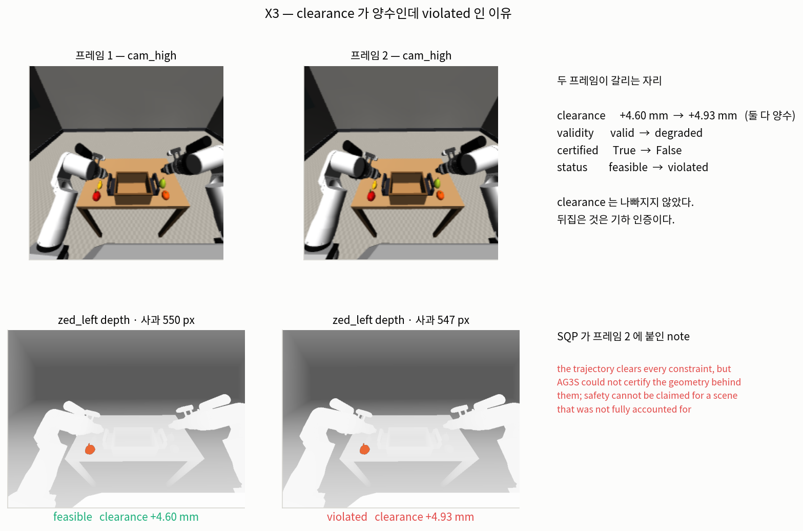

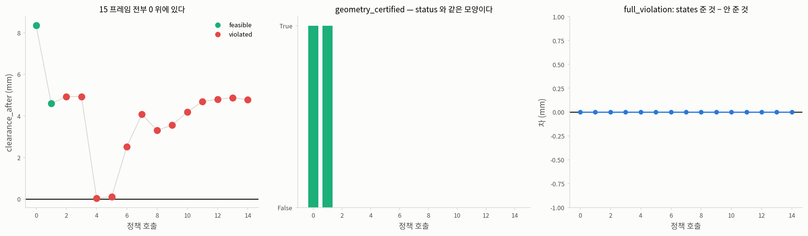

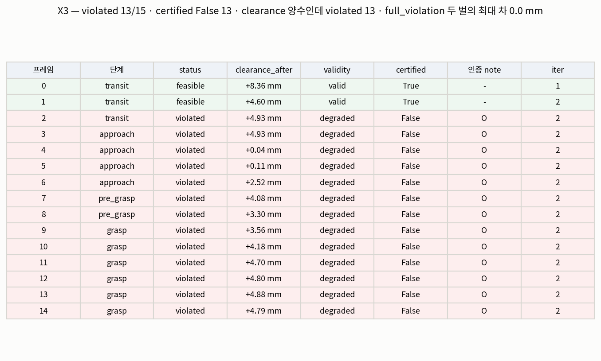

### 판정을 기다리는 물음 (사용자와 함께)

**`DEGRADED` 를 인증 실패로 볼 것인가.** 코드의 두 자리가 서로 다르게 말하고 있으므로
한쪽을 고쳐야 한다. 고르지 않은 쪽은 "되돌아올 지점" 에 남긴다.

1. **`certified` 를 `VALID` + `DEGRADED` 로 넓힌다** — docstring 과 주석이 말하는 쪽.
   그러면 `feasible` 이 15 로 간다. 위험: `DEGRADED` 가 붙는 다른 경로도 같이 통과한다.
2. **`max_points` 를 올린다** — 상한에 안 걸리면 `VALID` 로 남는다.
   위험: 실시간성. `max_points` 는 성능이 아니라 **실시간 성립 조건**이라고 `config.py:127` 이 적는다.
3. **그대로 둔다** — `violated 13` 이 맞는 판정이고, 기준선 문구를 고쳐
   *"`feasible` 은 clearance 와 인증을 함께 센다"* 로 읽게 만든다.

**아직 안 잰 것**: 수정 전 기록(`run_16d_ep1800`)에 같은 probe (측정 5) ·
`require_certified_geometry=false` 로 돌렸을 때의 개수.

### 측정 6 — **해상도를 되돌리니 15/15 가 `feasible` 이 된다. clearance 는 0.32 mm 안에서 움직인다**

사용자 물음이 계기다 — *"head camera 가 못 볼 수 없는 궤적인데 어떻게 장면을 못 보나."*
**못 본 것이 아니다.** 확인한 숫자:

| | 값 |
|---|---|
| coverage 손실 note 가 붙은 프레임 | **0 개** |
| `validity == incomplete`(표현조차 못 한 geometry 가 있다) | **0 개** |
| 실제로 일어난 것 | voxel 을 **5.0 mm → 6.3 mm** 로 1 단계 키움 |

`cap_strategy = "voxel"` 은 점유된 voxel 마다 대표점을 하나씩 남긴다 (`config.py:146-149`) —
**최종 voxel 보다 큰 영역이 관측되지 않는 일은 없다.** `INCOMPLETE`(못 봄)와
`DEGRADED`(거칠어짐)를 코드가 구분하는데, 이 15 프레임에서 `INCOMPLETE` 는 한 번도 안 났다.

그래서 `pointcloud.max_points` **하나만** 60000 → 200000 으로 올려 같은 기록을 다시 돌렸다.

| | `max_points` 60000 (기본) | `max_points` 200000 |
|---|---|---|
| 쓰인 voxel | 5.0 mm · **6.3 mm** | **5.0 mm 하나** |
| `validity` | `degraded` 13 · `valid` 2 | **`valid` 15** |
| `feasible` | 2 | **15** |
| `violated` | 13 | **0** |
| voxel 점 수 중앙 | 116126 | 129657 |
| `clearance_after` 최소 | +0.0385 mm | **+0.0156 mm** |
| AG3S 실행 중앙값 | 2303.9 ms | **2304.3 ms** |

**clearance 차(5.0 mm − 6.3 mm)는 중앙 0.000 mm · 최대 절댓값 0.320 mm** 다. 가장 크게
움직인 것은 프레임 8 로 +3.301 → +2.981 mm. **15 프레임 중 7 개에서 해상도를 높이니
clearance 가 오히려 줄었다** — 거친 쪽이 그만큼 낙관적이었다는 뜻이고, 안전 마진 50 mm 에
대면 0.6 % 다.

**시간 주의**: 상한을 3.3 배로 올렸는데 AG3S 중앙값이 0.4 ms 밖에 안 움직였다. 다만 이 서버는
OSMesa 소프트웨어 렌더링이고 AG3S 중앙값이 이미 청크 예산 533 ms 의 4.3 배다 — **점 수가
시간에 안 보이는 것은 다른 것이 지배하기 때문일 수 있고, GPU 렌더링에서 같다고 말할 수 없다.**

**재지 않은 것**: cap 이 걸리는 자리 — note 는 `max_points=60000` 이라는데 fusion 뒤 점 수는
중앙 116126 이다 (카메라별로 걸리는 것으로 보이나 재지 않았다).

* **[`figures/x3/x3-maxpoints.png`](figures/x3/x3-maxpoints.png)** — 그래프. 두 상한의 프레임별
  `clearance_after` (겹친다) · 그 차 · AG3S 실행 시간.

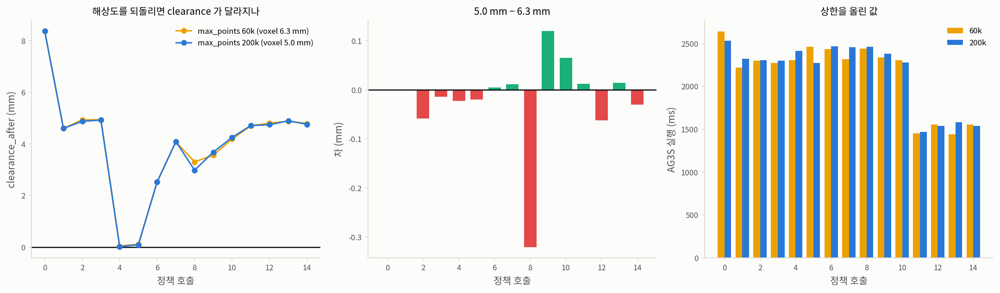

#### 이 숫자가 선택지에 하는 말

로그 위 "판정을 기다리는 물음" 의 셋 중 **2(`max_points` 를 올린다)** 가 이 기록에서는
비용 없이 `valid 15/15` 를 만든다. 다만 그것이 *"실시간에서도 공짜"* 라는 뜻은 아니다 —
위의 시간 주의가 그 자리다. **선택은 아직 사용자 판정으로 남긴다.**

### 사용자 판정 (2026-09-25) — **실시간성은 뒤로 미룬다**

> *"지금은 실시간성을 고려하지 마라. 맨 나중에 정상 작동되고, 뒤에 가서 실시간성을 잡아먹는
> 부분을 개선하거나 수정하면 된다."*

선택지 **2(`max_points` 를 올린다)** 로 확정했다. `DEGRADED` 를 인증 실패로 볼 것인가는
**여전히 열려 있다** — 이번 변경은 그 물음에 답하지 않고 상한에 안 걸리게만 한다.

### 구현 — 기본값 하나와 그것을 박아 둔 세 자리 (`handoff/X3.impl.md`)

| 파일:줄 | 무엇이 |
|---|---|
| `benchmark/ag3s/config.py:134` | `max_points` **60000 → 200000** |
| `benchmark/ag3s/config.py:126-144` | docstring — 왜 바꿨나 · 측정값 · 시간 근거의 한계 |
| `benchmark/ag3s/configs/default.yaml:32` | 같은 값 (이 파일은 기본값의 문서다) |
| `benchmark/ag3s/configs/rby1_three_camera.yaml:13` | 같은 값 + 주석. **X3 가 실제로 잰 구성**이다 |
| `tests/ag3s/test_config.py:30` | spec 표의 기대값 |

`pipeline.py` 와 `sqp.py` 는 **안 고쳤다.**

기본값만 올린 직후 테스트는 **2 failed / 650 passed** 였다 — 옛 값을 박고 있던 두 자리
(spec 표 · 배포 yaml)를 맞춘 뒤 `tests/ag3s/test_config.py` **34 passed**.

### 검증 — 회귀 기준선은 한 자리도 안 움직인다

**기준선 기록은 상한에 애초에 안 걸린다.** `run_16d_ep1800` 의 프레임별 voxel 점 수는
**53625~91268** 이고 15 프레임 전부 `capped=False` · `validity=valid` 다. 상한을 60000 으로
명시해도 200000 으로 해도 **`violated` 2 로 같다.**

| | 문서화된 기준선 | 변경 뒤 (단독 실행) |
|---|---|---|
| 위반으로 시작 | 15/15 | **15/15** |
| 해소 | 13 | **13** |
| 개선 | 15 | **15** |
| `feasible` | 13 | **13** |
| `violated` | 2 | **2** |
| `has_target` | 9/15 | **9/15** |

그리고 **수정 후 기록(`20260925_headfix16d`)은 `feasible` 15/15 · 해소 15** 다 —
monkeypatch 가 아니라 실제 기본값으로 재현했다.

### 이 STEP 에서 밟은 함정 — **부하가 기준선을 바꾼다**

기준선을 pytest 전체 · 다른 rollout 과 **동시에** 돌렸더니 `feasible 9 / violated 6` 이 나왔다.
같은 코드 · 같은 기록 · 같은 명령인데, 단독으로 다시 돌리니 `feasible 13 / violated 2` 다.

`sqp.time_budget_ms` 가 **벽시계 마감**이라(`sqp.py:159`) 부하가 걸리면 같은 50 ms 안에 반복을
덜 돌고 더 나쁜 iterate 를 돌려준다. 뒤집힌 프레임 5·9·10 은 반복이 **2 → 1** 로 줄었고
프레임 10 의 clearance 가 **+4.35 → −6.77 mm** 로 갔다.

**하마터면 이 숫자를 `max_points` 탓으로 기록할 뻔했다.** 측정 5(기준선 기록이 상한에 안
걸린다)가 그것을 막았다. `regression-baseline` skill 에 *"단독으로 돌린다"* 를 적었다.

**이것은 T1-a 2 차가 이미 답한 자리와 같다** — *"흔들린 것은 판정이 아니라 해가 다른 곳에
앉은 것"*. 그때는 원인이 미상이었고, 이번에 **부하**로 좁혀졌다.

### 아직 열려 있는 것

- **`DEGRADED` 를 usable 로 볼 것인가.** 코드는 안 고쳤다. 상한을 올려 당장은 안 걸릴 뿐이다.
- ~~cap 이 걸리는 자리를 못 찾았다~~ → **찾았다 (측정 7, 아래).**
- GPU 렌더링에서 `max_points 200000` 의 시간 비용.

### 측정 7 — **상한은 카메라별이 아니라 합친 구름에 걸린다**

로그가 *"cap 이 걸리는 자리를 못 찾았다"* 로 남겨 뒀던 물음이다. 재현해 보니 **카메라마다
따로 점군을 만들면 대당 약 26000 이라 60000 상한에 안 걸린다.** 세 대를 **합친 뒤** 걸어야
파이프라인과 같아진다.

수정 후 기록(`20260925_headfix16d`) 프레임 2 에서:

| | `max_points` 60000 | `max_points` 200000 |
|---|---|---|
| 합친 점 수 | **36498** | **79393** |
| 상한이 걸렸나 | **걸렸다** | 안 걸렸다 |
| 최종 voxel | **6.3 mm** | 5.0 mm |

**6.3 mm 는 파이프라인이 그 프레임에 남긴 note 의 값과 같다** (*"voxel grown to 6.3 mm in
1 step(s)"*). 점 수가 파이프라인의 114991 과 다른 것은 이 재현 경로에 로봇 self-filter 가
없기 때문이다 — 확인한 것은 **걸리는 자리와 voxel 값**이다.

**아직 안 잰 것**: 기준선 기록 `run_16d_ep1800` 의 합친 점 수 91268 이 60000 상한에 안 걸린
이유. self-filter 뒤 수가 더 적었을 수 있는데 재지 않았다.

### 시각화 — 구현 검증 (규칙 A)

* **[`figures/x3/x3-impl-scene.png`](figures/x3/x3-impl-scene.png)** — 실제 씬. 테이블 상판
  한 겹(z 0.80~0.86 m)을 **위에서 내려다본** 점군을 두 상한에서 나란히 놓는다. 사과·바구니
  윤곽이 양쪽 다 살아 있다 — **성겨졌을 뿐 사라진 영역이 없다.**
* **[`figures/x3/x3-impl-loadtrap.png`](figures/x3/x3-impl-loadtrap.png)** — 그래프. 단독 실행과
  부하중 실행의 프레임별 clearance · SQP 반복 수 · 뒤집힌 프레임.
* **[`figures/x3/x3-impl-table.png`](figures/x3/x3-impl-table.png)** — 표. 문서화된 기준선 ·
  변경 뒤 `ep1800`(단독) · 변경 뒤 headfix 기록.
* **영상은 아직 없다 (2026-09-25).** 한 번 만들었으나 **관절 매핑이 틀려 폐기했다** —
  궤적은 자유 관절 **14 행**(양팔 7+7)뿐이고 토르소 6 개가 없는데 20 개 관절 이름에 그대로
  붙여서, 팔 각도가 `torso` 로 들어가 로봇이 뒤로 꺾인 영상이 나왔다. 폐기본은
  `outputs/verify/X3/BROKEN_x3-verify_joint-mapping-wrong.mp4` 에 이름을 박아 두었다.
  **고치는 법은 정해져 있다** — `layout.full_q(trajectory, q_now)` 가 정확히 그 펼치기를
  한다(`types.py:145-159`). `outputs/verify/X3/probe_status.py` 는 이미 그렇게 저장하고
  (`traj_headfix.npz` 가 20 행이다), `make_x3_video.py` 에 행 수 가드도 넣었다.
  **렌더만 다시 돌리면 된다** (OSMesa 로 약 10 분).

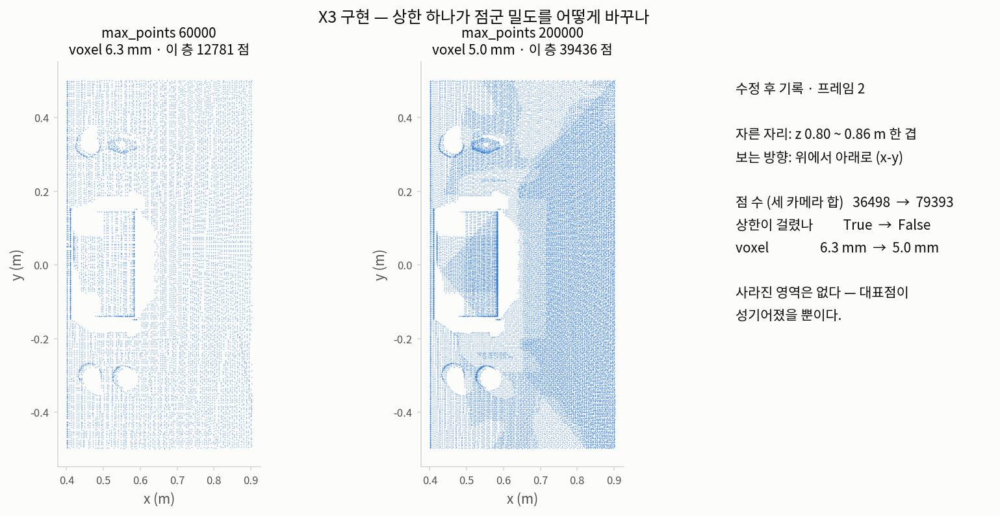

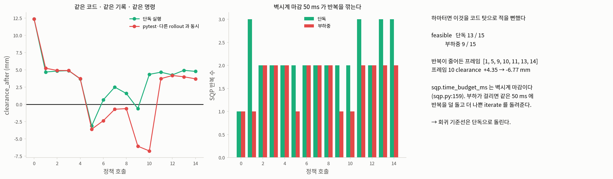

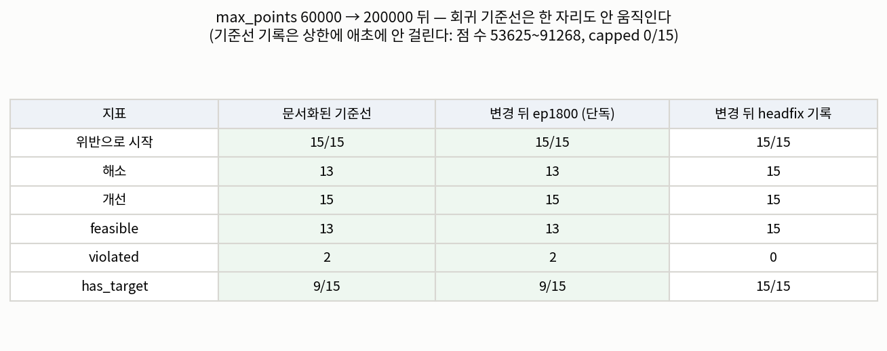

### 영상을 만들다 밟은 것 — **14 행을 20 개 이름에 붙였다** (2026-09-25)

`result.trajectory` 는 `nq_opt = 14` 행이다. 정책 16D = 양팔 7 관절 + 그리퍼 1 씩이고,
그리퍼 2 열은 `passthrough` 라 최적화가 손대지 않으므로 **SQP 가 움직이는 관절은 14 개**다.
`DEFAULT_RBY1_JOINTS` 는 20 개(토르소 6 + 양팔 14)인데, **토르소는 `fixed_q`** 다 — 정책도
안 내보내고 SQP 도 안 건드린다. 모델에 남겨 두는 이유는 하나다: **토르소 각도가 팔의 월드
좌표를 정하므로 FK 에서 빼면 충돌 구 120 개가 전부 "똑바로 선" 자리에 놓인다**
(`types.py:145-152` 가 그 이유를 적어 둔다).

| | 값 |
|---|---|
| `action_dim` (정책) | 16 |
| `nq_opt` (SQP 가 움직이는 관절) | **14** — `left_arm_0..6` · `right_arm_0..6` |
| `passthrough` | `[7, 15]` — 그리퍼 둘 |
| `fixed_q` | `torso_0..5` |
| `nq_model` (FK) | 20 |

실측: 궤적 32 스텝 동안 **토르소 변화폭 0.000000 rad**, 값이 `q_now` 와 동일.

**규칙 A 가 왜 있는지 다시 확인된 자리다.** 프레임 한 장만 보고 넘겨서 480 장을 다 렌더한 뒤에야
드러났다 — 그것도 사용자가 영상을 보고 지적해서다. **만든 시각화는 전 구간을 훑어본다.**

### 이 기록에 대해 덤으로 확인된 것

- `20260925_headfix16d` 의 `run_0000` 은 정책 호출 **15 회 = 8 초**뿐이고, 왼팔 최대 변화폭은
  **1.145 rad**(손목)다. 팔을 사과 쪽으로 뻗는 구간만 들어 있다.
- **그리퍼가 15 프레임 내내 1.0(열림)** 이다 — **이 기록에는 파지가 없다.**
  그런데 로그의 단계 라벨은 청크 10~14 를 `grasp` 로 적는다. `phase_for()` 가 그리퍼 상태가
  아니라 프레임 번호로 매기기 때문이다. **T2(pick-place 상태 전이)가 여기를 봐야 한다.**

---

## T1 — 연속 프레임 AG3S (2026-09-25)

**목표**: 실측 정책 attention 으로 지각 파이프라인이 쓸 만한가. **판정 기준**: 프레임마다 target 위치 추정 정확도, 여유거리, 완결성.

**자산**: held-out 3 에피소드. 모두 머리 각도를 수정한 뒤 새로 촬영했다(`head_1 = +0.7001`, 15/15 프레임). attention npz 는 각 에피소드별 새로 구웠다.
- **ep1800 apple** — 왼팔로 사과를 접근
- **ep1850 banana** — 오른팔로 바나나를 접근
- **ep1900 pear** — 오른팔로 배를 접근

### 항목별 결과

| 항목 | ep1800 apple | ep1850 banana | ep1900 pear |
|---|---|---|---|
| **1** target 중심 오차 중앙/최대 (mm) | 34.8 / 90.6 | 5.9 / 9.8 | 36.0 / 81.9 |
| **2** 지지면 높이 오차 중앙 (mm) | 1.33 | 1.30 | 1.26 |
| **3** 카메라 간 정렬 오차 중앙 (mm) | 0.73 | 0.75 | 0.76 |
| **4** self-filter leakage (px) | 187,136 | 181,370 | 181,378 |
| **6** status / grounding | ok 15 | ok 9 · no_target 6 / low_score 6 | ok 15 |
| **7** completeness | 15/15 | 15/15 | 15/15 |

**항목 8**: frame card 45 장(3 에피소드 × 15 프레임). 처리 시간 8.52 초, 초당 약 0.189 초/장.

### 항목 1 — 점수 문턱이 제 일을 한다 (핵심 결과)

**target_score 와 오차의 상관이 에피소드 내에서 강하다**: 세 에피소드의 Pearson r 은 각각 **−0.949 / −0.985 / −0.944**. 점수가 높을수록 오차가 작다.

**banana 에서 거른 6 프레임을 검토했다.**  `GroundingResult` 는 `LOW_SCORE` 로 실패해도 `best_score` 와 `clusters` 를 남기기 때문에(`benchmark/ag3s/stages/target_grounding.py:213-226`), 거른 프레임의 "있었다면" 오차를 계산할 수 있다:
- 거른 6 프레임의 평균 오차: **323.4 mm** (범위 317.9~327.7)
- 점수: **0.058~0.242**
- 대비 통과한 9 프레임: 오차 3.4~9.8 mm

**그러나 점수는 에피소드 간에 보정되어 있지 않다.** 같은 점수 대역 0.7~0.8 에서:
- apple (사과): 중앙 오차 **31.9 mm**
- banana (바나나): 중앙 오차 **5.3 mm**

같은 대역 0.2~0.3 에서는 세 에피소드가 81.9~320.2 mm 로 흩어진다. **상향식 보정(카메라마다 재조정)은 미실시.** 현재 threshold 는 `target_score_threshold = 0.25` (`config.py:91`).

**점수와 오차의 무관 프레임: 없음.** 45 개 프레임 중:
- **점수 > 0.5 이면서 오차 > 50 mm**: **0 개**
- 오차 50 mm 초과인 프레임 중 최고 점수: **0.4136** (ep1900 frame13, 오차 78.02 mm)

### 항목 4 — 누수의 성격이 둘로 갈린다

**카메라별 누수 분포**: 로봇 구 두 그룹(`EE_BODY_L`, `EE_BODY_R`)의 누수가 특정 카메라에만 집중된다.
- **`EE_BODY_L` 누수**: `wrist_cam_l` 에만 100% 누수, `zed_left`·`wrist_cam_r` 은 0
- **`EE_BODY_R` 누수**: `wrist_cam_r` 에만 100% 대칭
- **`base` 누수** (ep1800 만, 5,758 px): `wrist_cam_l` 에만

**누수 점에서의 거리 및 점유**: 카메라 거리값(`cs.esdf.distance()`)으로 검토하면 둘의 특성이 갈린다:
- **끝단 구(`EE_BODY_L/R`)**: 평균 거리 **+104~144 mm** (먼 쪽), 점유 비율 **0.0**, 50 mm 초과 자유도 **0.80~1.0** → **장애물이 되지 않는다**
- **베이스**: 평균 거리 **−8.2 mm** (파고든 쪽), 점유 비율 **0.76~0.99** → **장애물이 된다**

**숫자가 큰 쪽(그리퍼 뭉치)은 ESDF 가 자유로 답해 지금은 무해하고, 작은 쪽(base)은 76~99% 가 점유로 잡혀 해롭다.**

### 측정 방법 — A2 가 스스로 고친 것 두 가지

1. **항목 2 (지지면 높이)**: 처음엔 평면식의 `offset/normal_z` 로 냈는데, 이것은 평면이 수평일 때만 맞다. 기울면 로봇 base 의 `x=y=0` 에서 높이를 재게 된다. **평면을 맞춘 inlier 점의 median z 로 교체.**
2. **항목 1 figure 의 표식**: 'x' 마커에 `edgecolors` 를 줘서 여섯 점이 안 보였다. matplotlib 은 'x' 에 채움이 없어 `edgecolors` 를 무시한다. **`c=` 로 교체.**

### 회귀 기준선 — 수정 진행 중

**아직 확정 아님 — 쓰지 마라**: 회귀 기준선이 3 회 중 2 회 흔들렸다 (11/11/4 대 13/13/2). 원인은 미상이다. `self_filter_inflation` 을 **0.05 m(50 mm) 로 올리는 수정은 진행 중**이다.

### 시각화 — 지각 파이프라인 (규칙 A)

* **[`figures/t1/t1-items-scene.png`](figures/t1/t1-items-scene.png)** — 실제 씬. 세 에피소드의 원 사진(depth)을 나란히. 그루핑 카메라가 각 물체를 어디서 보는지 보인다.
* **[`figures/t1/t1-items-trend.png`](figures/t1/t1-items-trend.png)** — 그래프. 에피소드별 점수 대 오차의 상관 3 개. 각 점은 한 프레임. 거친 상관선 + Pearson r 표시.
* **[`figures/t1/t1-items-table.png`](figures/t1/t1-items-table.png)** — 표. 항목 1~8 의 요약 수치와 통과/실패 상태.
* **[`figures/t1/t1-item1-score-vs-error.png`](figures/t1/t1-item1-score-vs-error.png)** — 확대. 항목 1 의 핵심: 점수 > 0.5 이면 오차도 작다 (거른 6 개 포함).
* **[`figures/t1/cards/manifest.json`](figures/t1/cards/manifest.json)** — frame card 색인. 45 개 카드를 이미지 경로로 나열.
* **[`figures/t1/t1-inflation-005-compare.png`](figures/t1/t1-inflation-005-compare.png)** — 표. `self_filter_inflation` 0.02 → 0.05 m 전후 비교(항목 4·5).

### 로봇 마스크 수정 (2026-09-25)

**증상**: self-filter 가 로봇 자기 몸을 놓쳐 장애물 필드로 샜다(위 항목 4). 참값 segmentation
기준, ep1800 프레임에서 MJCF `EE_BODY_L` 90,690 px · `EE_BODY_R` 90,688 px · `base` 5,758 px
가 새고 있었다(ep1850·ep1900 은 `EE_BODY_L/R` 만, `base` 는 ep1800 에서만). 각 몸체는 **자기가
이고 있는 카메라에만 100%** 나타난다 — `EE_BODY_L` → `wrist_cam_l`, `EE_BODY_R` →
`wrist_cam_r`.

**수정 1 — 팽창값**: `benchmark/ag3s/config.py:171` 의 `self_filter_inflation` 을
**0.02 → 0.05 m** (20 mm → 50 mm) 로 올렸다. `configs/default.yaml:36` 도 동기화
(`tests/ag3s/test_config.py:45` 가 둘의 일치를 강제한다). 근거는 cuRobo 의 `RobotSegmenter`
(`curobo_src/curobo/_src/perception/robot_segmenter.py`)가 **같은 방법**(충돌 구와 depth 점의
거리)을 쓰고 `distance_threshold` 기본값이 **0.05 m** 라는 것.

**결과**: `base` 누수 **5,758 px → 0 px**. 그러나 `EE_BODY_L/R` 은 **픽셀 단위로 그대로** — 그
몸체는 구가 아예 없어 구를 부풀려도 닿지 않는다. 부작용으로 `has_target` 이 세 에피소드에서
15/15·9/15·15/15 → **14/15·8/15·12/15** 로 내려갔고, 회귀 기준선이 시작 15/15 → **14/15**,
`feasible` 13 → **14**, `violated` 2 → **1** 로 바뀌었다.

**수정 2 — 빠진 링크**: `benchmark/ag3s/experiments/sources/mujoco_source.py` 의
`UNCOVERED_LINKS`(자기 필터가 구로 못 덮는 링크에 대신 씌우는 **gap-filling capsule** —
장애물이 아니라 자기 필터 전용으로 만드는 캡슐 — 목록)에 **`ee_left`·`ee_right`** 를
추가했다. 목록에는 손가락(`ee_finger_*`)은 있는데 **손바닥에 해당하는 것이 빠져 있었다.**

**왜 눈에 안 띄었나 — 이름이 두 파일에서 다르다.** MJCF 는 `EE_BODY_L`, URDF 는 `ee_left`
다. 캡슐 치수를 잴 때는 MJCF 이름으로 메시를 재고(`bounding_capsules`), 로봇 모델에 붙일
때는 URDF 링크여야 한다(`UrdfSphereChain` 이 아니면 거부, `urdf_sphere_chain.py:393-395`).
**둘 다 맞아야 하는데 목록에는 하나만 적게 되어 있었다.** A1 이 번역표
`MJCF_BODY_ALIASES`(재는 이름 → 붙이는 이름을 잇는 딕셔너리, `mujoco_source.py:450-453`)를
두어 이 둘을 갈랐다.

**그리고 실패가 조용했다.** `gap_filling_capsules` 가 `except KeyError: continue` 로 삼켜서,
이름이 틀리면 **캡슐 0 개를 내고 자기 필터에 구멍이 남는다.** 손바닥이 빠진 채 오래 남아 있을
수 있었던 이유다. **2026-09-25 사용자 판정으로 갱신**: 삼킴을 **소리를 내게 만든다** — 코드는
이미 그렇게 되어 있다(`_warn_no_capsules`, `except KeyError` 로 여전히 삼키되 어느 spelling 을
시도했는지까지 `_LOG.warning` 으로 크게 말한다). 상세는 아래 T2 절의 **"사용자 판정"** 표.

**URDF 확인**: `pi05_TO_hybrid/rby1_description/models/rby1a/urdf/model.urdf` (34 링크)에서
`ee_left`·`ee_right`·`ee_finger_*`·`link_*_arm_6`·`base`·`wheel_*` 은 **collision 0 개, visual
1 개**다. URDF 만으로는 못 덮는다 — `UNCOVERED_LINKS` 의 gap-filling capsule 이 유일한 길이다.

**캡슐 치수**: `bounding_capsules` 가 MJCF 메시 정점에서 뽑는다(눈대중이 아니다). `segments`
는 기본 3 유지 — 실측 반지름이 1 에서 59.7 mm, 2 에서 38.1·37.9, **3 에서 33.0·28.4·32.8**,
4 에서 32.8·23.1·**64.4**·32.9 로 4 는 슬래브 경계가 그리퍼의 넓은 면에 떨어져 하나가 튄다.

**모델 변화**: 자기 필터 구 **194 → 218**, gap-filling 캡슐 **30 → 36**. 회귀 기준선의 제약
모델은 `link_filter=ARM_LINKS` 라 이 수정에 안 닿는다.

**테스트**: **659 passed** (직전 652 + 신규 `tests/ag3s/test_gap_filling_capsules.py` 7).

**판정 결과 (2026-09-25, 아래 T2 절의 "사용자 판정" 표)**: (a) 조용한 삼킴 — **소리를 내게
만든다**(코드는 이미 그렇게 되어 있다). (b) 손바닥을 **제약** 모델에도 넣을 것인가 —
`benchmark/ag3s/config.py:367-370` 의 `DEFAULT_CONTACT_LINKS` 는 `ee_left`/`ee_right` 를
**이미 접촉 허용 링크로 적고 있는데** 제약 모델(`experiments/reports/rby1_transport.py:454`)은
`ee_finger_` 만 본다. **넣지 않는다 — 기존 동작 유지**, 어긋남은 알려진 상태로 남긴다(전환
신호는 T2 절의 "되돌아올 지점").

**곁가지**: 같은 대소문자 함정이 하나 더 있다 — URDF `FT_sensor_L/R` ↔ MJCF `FT_SENSOR_L/R`.
지금은 `UNCOVERED_LINKS` 에 없어 아무것도 안 걸린다.

---

## T2 — 자산 확보 (ep1807, 2026-09-25)

**T2 는 과제가 물리적으로 완결되는 기록을 요구한다.** 처음 뜬 ep1800 은 그렇지 않았다.

| | ep1800 | **ep1807** |
|---|---|---|
| 대상 | apple | apple |
| 대상 들림 | 92.1 mm | **240.6 mm** |
| 대상 ↔ 바구니 수평거리 | 328 → 330 mm | **339 → 71 mm** |
| 다른 과일 셋 | — | 들림 0.0 mm, 거리 불변 |
| 관측 | 75 (600 스텝) | **75 (600 스텝)** |

**둘 다 held-out(1800–1999)인데 하나는 완결되고 하나는 안 된다.** 에피소드나 정책의 문제가
아니라 성공률의 문제다 — 몇 개 중 몇 개가 완결되는지는 아직 재지 않았다.

**자산**: 기록 `outputs/live_test/20260925_ep1807/run_0000/run_0000`, attention
`benchmark/ag3s/asset/data/attention_16d_ep1807.npz` `(75,3,3,18,8,3,16,16)`. `head_1` 75/75
프레임 +0.7001.

**측정 조건 정정**: 제어 스텝은 **600 이 맞다** (사용자 판정 2026-09-25). lead 가 시연
길이(41.6~46.8 초)에서 역산해 900 으로 올렸던 것은 근거가 약했고 되돌렸다. 900 으로 뜬
기록들(`20260925_t2b`, `20260925_train/ep*`)은 조건이 섞여 판정 근거로 쓰지 않는다.

### nine events — `ep1807` (2 라운드, 운반 완결) frame 표

`measure_t2_events.py` 로 `outputs/live_test/20260925_ep1807/run_0000` 를 잰 결과다.
**`destination_attention_locked` 와 `task_state_reset` 이 `None`** — 아홉 중 일곱만 frame 이 있다.

| 사건 | frame | t_step | 판정 근거 (`criterion`) |
|---|---|---|---|
| `target_acquired` | 0 | 0 | `has_target=True`, `score=0.805`, label `obj0` — 이후 `latch.manipulated` 로 잠기는 값과 같다 |
| `target_latched` | 2 | 16 | frame 0·1·2 모두 label `obj0`(`confirm_frames=3`), `SEARCHING`→`LATCHED` |
| `grasp_contact` | 19 | 152 | MuJoCo `data.contact` 에 `ee_finger_l1`/`l2` 와 apple 의 접촉이 처음 나타남 (frame 15~18 은 없음) |
| `attached` | 19 | 152 | `GraspLatch.update()` 가 `attach=True` (`gripper_left state[7]=0.698`, 0.85 미만). `grasp_contact` 와 같은 frame — ep1800 에 있던 오프셋이 여기엔 없다 |
| `destination_attention_raw` | 28 | 224 | HELD 진입(frame 19) 뒤 처음 나온 non-None 라벨(`obj1`). frame 19~27 은 label `None` |
| **`destination_attention_locked`** | **None** | **None** | 연속 3프레임(`confirm_frames=3`) 확정 없음 — HELD 구간(19~31) 라벨 순서: `None`×9, `obj1`(28), `obj1`(29), `obj2`(30), `None`(31). 연속 2 가 최대 |
| `transport_start` | 21 | 168 | `attach` 시점(frame 19) 대비 world 변위가 처음 50 mm 초과 (55.2 mm). frame 20 은 1.1 mm |
| `placement` | 32 | 256 | MuJoCo 참값 `placed_ground_truth`(apple, crate 로컬 벽 안쪽 + rim −10 mm 아래) 가 True — 75 프레임 중 이 한 프레임뿐 |
| `detached` | 32 | 256 | `GraspLatch.update()` 가 `detach=True`, `event.note`="성공 판정 — detach()" — `placed_now`(True) 로 풀림, open-streak fallback 아님(`gripper=0.954`, 아직 열리는 중) |
| **`task_state_reset`** | **None** | **None** | 75 프레임 전체(frame 32~74)에서 `reset()` 호출 없음. `latch.phase` 는 frame 32~74 `'placed'` 로 유지, `manipulated='obj0'` `destination=None` 그대로 |

**처음으로 놓기가 잡혔다.** `placement` 와 `detached` 가 **같은 frame(32)** 에서 함께 일어난다.
`detach` 가 `placed_now` 성공 경로로 울렸다는 것은 `event.note`(*"성공 판정 — detach()"*)와
그때 gripper 값(0.954, 아직 열리는 중)이 함께 보증한다 — open-streak fallback(그리퍼가 그냥
`release_frames=2` 연속 열려서 풀리는 경로)이 아니다. `ep1800`(1 라운드)에서는 `detached` 가
그 fallback 이었고 `placement` 자체가 75 프레임 내내 한 번도 True 가 되지 않았다 — 뒤 절반이
반쪽이었다. `ep1807` 에서 그 반쪽이 닫혔다.

**destination attention 이 한 번도 확정되지 않는다.** `destination_attention_locked` 는
`None` 이다 — HELD 구간(19~31)의 라벨 순서(`None`×9, `obj1`, `obj1`, `obj2`, `None`)에서
`confirm_frames=3` 연속 같은 라벨이 한 번도 없다(연속 2 가 최대). 그런데도 `placement` 는
frame 32 에서 성공했다 — **AG3S 의 destination 추적이 확정에 한 번도 기여하지 않은 채로
정책이 물체를 넣었다**는 뜻이다.

**detach 후 state 가 초기화되지 않는다.** `phase_stuck_after_detach_ep1807` — frame 32~74
구간에서 `latch_phase` 는 전부 `'placed'`, `manipulated` 는 전부 `'obj0'`, `destination` 은
전부 `None` 으로 남는다. T2 합격 조건의 *"detach 후 이전 상태가 제거된다"* 는 **불합격**이다.
단, `cycle2_second_grasp_ep1807.present == False` — 이 기록엔 frame 33~74 구간에서 그리퍼
재폐쇄 시도 자체가 없다(`gripper_left_state7` 이 1.0 을 벗어나지 않는다). **이 phase 고착이
다음 과제(2차 파지)를 실제로 막는지는 이 기록만으로는 증명할 수 없다** — phase·manipulated·
destination 이 유지된다는 것만 확인됐다.

**결함 3(`runner_up_score` 키 부재) 는 재현되고, 결함 2(식별 불일치) 는 재현되지 않는다.**
`runner_up_score_metrics_key_ep1807` — `target_grounding.py:394-402` 의 metrics dict 에
`runner_up_score` 키가 없어 전 75 프레임 0.0 (`ep1800` 과 동일 코드경로, 변경 없음).
`_Confirm.update()` 의 `confident = score >= score_ratio(1.3) * max(runner_up, 1e-9)` 에서
`runner_up=0.0` 이면 임계값이 `1.3e-9` 로 사실상 0 이 되어 `score>0` 이면 항상 통과한다
(frame 0 `target_score_confidence=0.805`). `identity_ambiguity_ep1807` — 잠긴 대상(`obj0`)의
참값이 frame 0~14 전 구간 apple 하나뿐이라(`mismatch: False`) 애매한 2 위 후보 자체가 없었다.
`identity_vs_runner_up_relation_ep1807` 이 이 둘의 관계를 적는다: 결함 3(`runner_up_score=0.0`,
confident 문턱 사실상 무력화)는 그대로 재현되지만 결함 2(식별 불일치)는 재현되지 않았다 —
obj0 후보의 참값이 애매하지 않았기 때문이다.

**object drift — `ep1807` 전 75 프레임** (`object_displacement_full_75_frames_ep1807`):

| 물체 | frame0 위치 (m) | frame74 위치 (m) | drift |
|---|---|---|---|
| apple | [0.564, 0.320, 0.850] | [0.490, −0.081, 0.858] | **408.5 mm** |
| banana | [0.550, −0.305, 0.843] | [0.550, −0.305, 0.843] | 0.1 mm |
| orange | [0.459, 0.331, 0.849] | [0.459, 0.332, 0.849] | 0.2 mm |
| pear | [0.465, −0.324, 0.856] | [0.465, −0.324, 0.856] | 0.6 mm |
| crate | [0.517, −0.016, 0.880] | [0.517, −0.016, 0.880] | 0.0 mm |

**대상(apple)만 움직였다** — 나머지 넷은 mm 단위 잔차 안이다.

**아직 측정하지 않은 것 — `not_measured` 를 그대로 옮긴다**:
1. 잔상(누적 TSDF residual — 물체가 떠난 뒤에도 accumulated TSDF 에 남는 occupancy)의
   지속 프레임 수 — 이번 라운드에도 미뤘다(1 라운드와 같은 사유, 이번 task.md 지시에도
   포함 안 됨)
2. production 참조 `placed_fn`(ESDF 라벨층 기반) — 이번 측정은 MuJoCo 참값으로 대체했다
3. `ep1807` 에서 2차 파지 시도 자체가 없어(그리퍼가 frame 32 뒤 계속 열림) `PLACED` 이후
   attach 재시도 여부는 이 기록으로 테스트 불가 — phase/manipulated/destination 이 유지된다는
   것만 확인됐다

**`handoff/T2-b.task.md` 로 A2 에게 넘겼다.**

### 시각화 (규칙 A)

* [`figures/t2/t2-scene-hand-trajectory.png`](figures/t2/t2-scene-hand-trajectory.png) —
  실제 씬 (**`ep1800`**, 1 라운드·운반 없음).
* [`figures/t2/t2-timeline.png`](figures/t2/t2-timeline.png) — 그래프 (**`ep1800`**).
* [`figures/t2/t2-events-table.png`](figures/t2/t2-events-table.png) — 표 (**`ep1800`**).
* [`figures/t2/t2-scene-hand-trajectory-ep1807.png`](figures/t2/t2-scene-hand-trajectory-ep1807.png) —
  실제 씬 (**`ep1807`**, 2 라운드·운반 완결).
* [`figures/t2/t2-timeline-ep1807.png`](figures/t2/t2-timeline-ep1807.png) — 그래프 (**`ep1807`**).
* [`figures/t2/t2-events-table-ep1807.png`](figures/t2/t2-events-table-ep1807.png) — 표 (**`ep1807`**).

### 사용자 판정 (2026-09-25) — T2 게이트와 T1 잔여 둘

| 물음 | 판정 |
|---|---|
| T2 를 어떻게 닫나 | **미측정 셋을 먼저 채운 뒤 판정한다** — `T2-b` 로 나갔다 |
| `runner_up_score` 키 부재 | **지금 고친다** — `T2-fix` 로 A1 에게 나갔다 |
| `gap_filling_capsules` 의 조용한 삼킴 | **소리를 내게 만든다.** 코드는 이미 그렇게 되어 있다 (`mujoco_source.py` 의 `_warn_no_capsules`, `except KeyError` 로 여전히 삼키되 `_LOG.warning` 으로 어느 spelling 을 시도했는지까지 크게 말한다) — T1 절의 *"이 삼킴은 아직 그대로다 — 판정 대기"* 를 이 판정으로 갱신한다 |
| 손바닥(`ee_left`/`ee_right`)을 constraint model 에 | **넣지 않는다 — 기존 동작 유지.** `DEFAULT_CONTACT_LINKS`(`config.py:367-370`)와 constraint model(`experiments/reports/rby1_transport.py:454`)이 어긋나는 것(전자는 손바닥을 접촉 허용 링크로 이미 적고 있는데 후자는 `ee_finger_` 만 본다)은 **알려진 상태로 남긴다** |

**되돌아올 지점 — 손바닥을 constraint model 에.** 지금은 `DEFAULT_CONTACT_LINKS` 와
constraint model 이 어긋난 채로 둔다. **전환 신호**: 과제 동작에서 손바닥(`ee_left`/`ee_right`)이
장애물이나 목적지에 닿아야 하는 장면이 나오면 — 그때는 `ee_finger_` 만 보는 constraint model
이 그 접촉을 위반으로 잡아낼 것이고, 그 시점에 손바닥을 constraint model 에도 넣는다.

---

## T2-b — 미측정 둘을 채웠다 (ep1807, 2026-09-25)

`T2.verify.json` 의 `not_measured` 1·3 번(쥔 물체가 robot collision geometry 로 옮겨 앉는가 ·
잔상 지속 프레임 수)을 잰 것이다.

### 오염 확인 — `T2.verify.json` 의 원 측정과 섞이지 않았다

`t2_replay_match`: 이번 run 은 A1 이 `runner_up_score` 키를 추가한 **변경 후 코드**로 돌았지만
latch 에는 `runner_up = 0.0` 을 고정해 먹였다(`--runner-up-mode zero`). 그렇게 나온 75 프레임
latch 계열(`latch_phase`·`manipulated`·`destination`·`attach_this_frame`·`detach_this_frame`·
`has_target`·`label`·`placed_ground_truth`)을 `T2.verify.json` 의 raw 와 프레임마다 대조하면
**75 프레임 전부 일치, 불일치 0 프레임** — `attach` frame 19, `detach` frame 32 그대로다.

**변경 후 코드가 실제로 내놓는 `runner_up_score`**(`runner_up_score_observed`, 참고 수치 — 이번
latch 에는 안 들어갔다): 75 프레임 최대 **0.2757589427371451**. `confident = score >=
score_ratio(1.3) * max(runner_up, 1e-9)`(`grasp_latch.py:142`) 판정이 0.0 고정 대비 갈리는
프레임은 **[30, 35, 67, 68, 71] 다섯 개**뿐이고, `target_latched`(frame 2)·`attached`(frame 19)·
`detached`(frame 32) 중 어느 것도 이 다섯에 없다.

### 측정 1 — held object 는 편입되지만 **carve 가 1 프레임 늦다**

`attached` 는 frame 19 에 처음 not-None, frame 32 에 `None` 복귀 — latch 의 `attach`/`detach`
프레임과 정확히 일치한다. 쥔 물체는 sphere 1 개(`r = 38.0185 mm`), snapshot 점 18 개로
`ee_finger_l1` 에 붙는다.

**`field_at_attached_points_mm`** — attached 점 18 개를 그 프레임의 ESDF 에 그대로 물은 값.
main = production(attach 를 실제로 부름), control = 같은 관측을 쓰지만 attach 를 안 부른
대조 파이프라인. 음수 = 그 점이 아직 점유 안쪽.

| frame | main_min (mm) | main_n_nonpositive | control_min (mm) | control_n_nonpositive | `n_attached_voxels_carved` |
|---|---|---|---|---|---|
| 19 | −26.23 | 14/18 | −26.23 (main 과 **동일**) | 14/18 | 0 |
| 20 | **+22.05** | 0/18 | −26.44 (여전히 음수) | 14/18 | **22** |
| 21 | +29.65 | 0/18 | +13.07 | 0/18 | **4** |
| 22 | +93.98 | 0/18 | +93.98 (main 과 동일) | 0/18 | 0 |
| 31 | +23.40 | 0/18 | +23.40 (main 과 동일) | 0/18 | 0 |

frame 19 는 main 과 control 이 **완전히 동일**하고 `n_attached_voxels_carved = 0` 이다 —
attach 가 울린 바로 그 프레임에는 아직 아무것도 파내지지 않았다. frame 20 에서 carve 22 복셀이
돌아 main 만 최소거리가 양수로 올라가고(control 은 여전히 음수), frame 21 에서 carve 4 복셀이
마저 돈다. frame 22 부터는 `frames_main_equals_control_at_attached_points`(22~31)로 main·control
이 다시 같아진다 — carve 할 것이 이미 다 파여서다.

**즉 attach 가 울린 그 프레임(19)에서는 쥔 물체가 robot collision geometry 와 obstacle field
양쪽에 동시에 들어 있다.** double counting 은 정확히 **1 프레임**이다.

**candidate 층에는 흔적이 없다.** `obstacle_cluster_counts.frames_where_main_cluster_mix_differs_from_control
= 0`(75 프레임 비교 전부), `clusters_near_held_object_ground_truth.n_within_80mm_all_held_frames_19_to_31
= 0` — HELD 구간(19~31) 어느 프레임도 쥔 물체의 MuJoCo 참값 위치 80 mm 안에 다른 candidate 가
없다. **double counting 은 ESDF voxel 층에만 있고, primitive/candidate 층으로는 새지 않는다.**

**원인은 추정이다 — 측정이 아니다.** lead 가 코드로 읽은 것: `benchmark/trajopt/safe_policy.py:335-349`
에서 `constraint_set`(그 프레임의 field)이 `process_multi_debug`(:280)로 먼저 구워지고, 그
뒤에 `_run_latch`(:292) 안에서 `self._latch.update(...)` → `if event.attach:
self.ag3s.attach(...)`(:345-349)가 온다. 그 프레임의 field 는 attach 를 부르기 **전에** 이미
구워져 있으므로 carve 는 다음 프레임부터 듣는다는 것이 **추정**이다.

### 측정 2 — TSDF residual 이 26 프레임 남는다

decay 는 껐다(`time_decay = 1.0`, `frustum_decay = 1.0`, `config.py:480,484`). apple 이 떠난
자리(`apple_frame0`, 반지름 50 mm 탐침 구)를 `transport_start_frame = 21` 부터 74 까지(분모 54
프레임)로 **세 정의를 나란히 둔다**:

| 정의 | 잔상이 남는 프레임 수 | 영구히 사라지는 frame |
|---|---|---|
| 위쪽 반구 점유(occupancy) > 0 | **26 / 54** | 47 |
| 탐침 중심 ESDF ≤ 0 | **46 / 54** | 67 |
| 구 전체 occupancy > 0 | **54 / 54** (영구히 0 이 안 됨) | — (`null`) |

구 전체가 영구히 0 이 안 되는 것은 아래쪽 반구가 테이블 윗면(`z = 0.820`, base 기준)을 항상
포함하기 때문이다 — 그 자체가 잔상이 아니라 **실재하는 표면**이다. 그래서 "잔상이 몇 프레임
남았나"를 재려면 위쪽 반구만 봐야 한다.

**대조군 pear(drift 0.6 mm, 정적 물체)**: 위쪽 반구 점유가 75 프레임 내내 **11~12 로 한 번도
0 이 안 된다.** apple 탐침의 위쪽 반구 점유가 frame 21(7) 근방에서 시작해 frame 47 에 0 으로
떨어지는 것과 비교하면, **"원래 거기 있는 것"(pear)과 "잔상"(apple 이 떠난 자리)의 신호
크기가 같은 자릿수라 필드 값만 보고는 둘을 못 가른다** — 위쪽 반구 점유가 0 으로 완전히
떨어지는 시점(frame 47)까지 기다려야 잔상이 다 빠졌다고 말할 수 있다.

### 아직 측정하지 않은 것 — `not_measured` 를 그대로 옮긴다

1. production 참조 `placed_fn`(ESDF 라벨층 기반) — `T2` 와 같이 이번에도 MuJoCo 참값으로
   대체했다
2. **변경 전 코드**(A1 이 `runner_up_score` 키를 넣기 전, md5 `caae04a1...`)에서의 측정 1·2 —
   A1 이 14:48:13 UTC 에 저장해 되돌릴 수 없었다. 대신 latch 에 `runner_up=0.0` 을 고정해
   돌렸고, 그렇게 나온 75 프레임 latch 계열이 `T2` 의 raw 와 0 프레임 불일치였다
   (`t2_replay_match`). **변경 전 코드 자체로의 재측정은 하지 않았다**
3. `runner_up_score` 를 latch 에 **실제로 먹였을 때**의 attach/detach frame — 이번 run 은
   0.0 고정이라 재지 않았다. `confident` 판정이 갈리는 프레임 5 개만 식으로 계산해 적었다
4. 탐침 구 안 점유의 **카메라별 출처**(어느 카메라의 옛 관측이 그 복셀을 점유로 유지하는가) —
   이번 측정은 필드 결과만 본다
5. **frustum/time decay 를 켰을 때**의 잔상 프레임 수 — 기본값 1.0(감쇠 없음) 그대로만 쟀다

### 회귀 기준선 확인

`baseline_check`: 위반으로 시작 **14/15** · `has_target` **9/15** · frame0
`clearance_before` **+0.15718632962849477 mm** — `T2.verify.json` 의 `base_run1.json` 과
frame0 clearance 가 소수점까지 같다. 이 확인은 **A1 변경 전 코드**(target_grounding.py
저장 14:48:13 UTC 이전)로 돌았다.

### 시각화 (규칙 A)

* [`figures/t2b/t2b-scene-residual-slices.png`](figures/t2b/t2b-scene-residual-slices.png) —
  실제 씬. 배치도 → `zed_left` 렌더 → 같은 프레임 ESDF 수평 단면.
* [`figures/t2b/t2b-timeline-attached-residual.png`](figures/t2b/t2b-timeline-attached-residual.png) —
  그래프. attach 전후 field 값과 apple 탐침 점유의 프레임별 추이.
* [`figures/t2b/t2b-numbers-table.png`](figures/t2b/t2b-numbers-table.png) — 표.

### 사용자 판정 (2026-09-25, 2 차) — T2 게이트를 닫는다

| 물음 | 판정 |
|---|---|
| T2 게이트 | **부분 통과로 닫고 T3 로 간다.** 통과: 조작 대상 ID 가 latch 로 유지된다(`identity_ambiguity_ep1807`, `T2`) · attach/detach 로 held object 의 기하 편입·제거가 frame 19/32 로 정확하다. 불합격: detach 후 task state reset 이 없다(`latch.phase` 가 32~74 `'placed'` 로 고착) · destination attention lock 이 한 번도 확정되지 않는다 |
| carve 1 프레임 지연 | **결함으로 기록하고 T5·T6 에서 본다.** 1 프레임이고 candidate 층에 안 보이니 지금 고치지 않는다 |
| TSDF residual 26 프레임 | **T3 의 `max_field_age_sec` 근거로 이어 붙인다** — 아래 참고 |
| 변경 후 회귀 기준선 | **재서 보고 커밋한다** — `T2-c` 로 A2 에게 나갔다 |

**T3 근거 짝짓기**: `max_field_age_sec` 를 정할 때 두 수치를 한 짝으로 쓴다 — T0 이 낸
**필드 나이 P50 2637 ms**(관측이 얼마나 오래 걸려야 field 가 새로 서는가)와, 이번 측정의
**위쪽 반구 잔상 26/54 프레임(영구 소거 frame 47)**(field 가 서더라도 옛 표면이 실제로
빠지기까지 몇 프레임이 걸리는가)이다. 둘 다 "field 가 지금 씬을 얼마나 최신으로 보나"라는
같은 질문의 다른 절반이다.

**되돌아올 지점 — carve 1 프레임 지연.** 지금은 candidate 층에 흔적이 없고(`n_within_80mm=0`)
1 프레임뿐이라 고치지 않는다. **전환 신호**: closed loop(T5·T6)에서 파지 순간 가짜 violation
(쥔 물체가 자기 자신에게 부딪히는 것으로 잡히는 것)이 실제로 관측되면 — 그때
`safe_policy.py` 의 attach 호출을 `process_multi_debug` 앞으로 당기거나, attach 프레임의
carve 를 그 자리에서 바로 도는 방식으로 고친다.

---

## T2-c — 변경 후 회귀 기준선: **일치가 아니라 동일** (2026-09-25)

A1 이 `runner_up_score` 키를 추가한 뒤(md5 `ee33a055a941811da6df094fbe985a94`)의 코드로 회귀
기준선을 다시 쟀다. **단독 실행**(run 이 도는 동안 다른 실행을 띄우지 않음), 실행 전후 md5
동일 — 한 run 안에서 코드가 섞이지 않았다.

### 기준선 셋 — 동일

**위반으로 시작 14/15 · `has_target` 9/15 · frame0 `clearance_before` +0.15718632962849477 mm.**
`identity_with_pre_change_run`(T2-b 의 변경 전 run 과 대조): **15 프레임 `clearance_before_mm`
이 한 프레임도 다르지 않고**(`n_frames_differing_in_clearance_before = 0`), `has_target` 플래그
배열도 `[0,0,1,1,1,1,1,1,1,1,1,0,0,0,0]` 로 같다. **"일치"가 아니라 "동일"** — 프레임 단위
소수점까지 같은 값이다.

기준이 **아닌** 값(`not_a_criterion` — `sqp.time_budget_ms` 가 벽시계 마감이라 흔들린다, 참고로만
적는다): 해소 13 · 개선 15 · `feasible` 14 · `violated` 1(frame 9).

### `runner_up_score` 를 latch 에 실제로 먹였을 때도 아무것도 안 움직인다

`latch_with_runner_up_actually_fed` — `ep1807` 75 프레임을 `T2.verify.json` 의 raw 와
프레임마다 대조: `latch_phase`·`manipulated`·`destination`·`attach_this_frame`·
`detach_this_frame`·`has_target`·`label`·`placed_ground_truth` **8 개 키, 0 프레임 불일치**.
`attach` frame 19 · `detach` frame 32 그대로다. `destination` 이 non-None 인 프레임은 75 프레임
중 **하나도 없다**(이 run 과 T2 raw 양쪽 다) — 앞서 기록한 `destination_attention_locked =
None`(T2 절)과 같은 사실의 다른 면이다.

`max_runner_up_score_over_75_frames = 0.2757589427371451`. `confident = score >=
score_ratio(1.3) * max(runner_up, 1e-9)`(`grasp_latch.py:142`) 판정이 갈리는 다섯 프레임은
`T2-b`(`runner_up=0.0` 고정, 식으로만 계산)와 **똑같이 [30, 35, 67, 68, 71]**:

| frame | `score` | `runner_up` | 문턱(1.3×ru) | confident(ru=0 이면) | confident(ru 먹이면) | `latch_phase` | `manipulated` |
|---|---|---|---|---|---|---|---|
| 30 | 0.267508 | 0.237437 | 0.308668 | True | **False** | held | obj0 |
| 35 | 0.281110 | 0.240850 | 0.313105 | True | **False** | placed | obj0 |
| 67 | 0.265931 | 0.265410 | 0.345033 | True | **False** | placed | obj0 |
| 68 | 0.277605 | 0.233020 | 0.302926 | True | **False** | placed | obj0 |
| 71 | 0.268296 | 0.207673 | 0.269975 | True | **False** | placed | obj0 |

다섯 모두 `latch_phase`·`manipulated`·`destination`·`label` 이 T2 raw 와 같았다
(`differs_from_T2_raw: false`).

### 이 수정의 가장 중요한 한계

**다섯 프레임이 전부 `held` 또는 `placed` 구간에 있다** (frame 30 은 `in_held_window_19_to_31:
true`, 나머지 넷은 `placed`). `GraspLatch`(`_Confirm`)는 **이미 잠긴 뒤에는 `confident` 를
보지 않는다** — `grasp_latch.py:137`, `if self.locked is not None: return self.locked` 가
무엇이 들어오든 잠긴 라벨을 그대로 돌려준다. **따라서 이 다섯 프레임에서 `confident` 가
뒤집혀도 latch 입장에서는 아무 일이 안 일어난 것이고, 이 수정이 latch 에 실제로 무엇을
하는지는 이 기록으로 시험되지 않았다** — 효과가 나타날 수 있는 곳은 `SEARCHING` 구간뿐인데,
거기서 갈리는 프레임이 이 기록에는 없다.

**"기준선이 안 움직였다"를 "이 수정이 안전하다"로 쓰지 않는다.** 정확한 문장은 — **"이
기록에서는 아무것도 바뀌지 않았고, 바뀔 수 있는 구간(`SEARCHING`)은 시험되지 않았다."**

### `not_measured` — 그대로 옮긴다

1. figure — task 지시대로 이번 라운드에는 만들지 않았다(불일치가 나오면 요청)
2. `base_run1` 의 재현 반복 — skill 은 단독 1 회를 요구하고 비교 대상 셋이 전부 SQP 이전
   값이라 흔들리지 않는다. `feasible`/`violated` 는 1 회 값만 적었고 판정에 쓰지 않았다
3. `runner_up_score` 가 latch 를 **실제로 바꾸는** 시나리오 — `ep1807` 에서는 `confident` 가
   갈리는 다섯 프레임 전부 `SEARCHING` 이 아닌 구간(held/placed)이라 phase·manipulated·
   destination 이 움직이지 않았다. `SEARCHING` 구간에서 갈리는 기록은 이 기록으로는 시험할
   수 없다
4. `ep1800` 기록에서의 같은 대조 — 이번 라운드에 요청되지 않았다

### 시각화

**없다.** 기준선이 움직이지 않아 task 지시대로 이번 라운드에는 figure 를 만들지 않았다.

---

## T5 — shadow 루프와 target 선택 (2026-09-25~26)

### 아키텍처 판정 (사용자, 2026-09-25) — AG3S · cuRobo · TO 는 **서버**에 둔다

물려받은 결정 *"T5·T6 에서 AG3S 를 클라이언트 in-process 로 옮긴다"* 를 **철회**했다
(위 "물려받은 결정" 표에 취소선으로 남겼다). 대신 로컬은 `pi05_infer.py --safe-remote` 로
관측·프롬프트를 보내고 action 만 받는다. 근거는 T0 의 실시간성 표다 — 정책 infer(클라이언트가
잰 왕복 전체) 중앙값 2725 ms 와 서버 total 중앙값 2519 ms 의 차, 즉 IPC 왕복 자체는 약 206 ms
(2725 ms 의 7.6 %)뿐이다. **AG3S 를 로컬로 옮겨 이 206 ms 를 없애도** 지배 항인 AG3S 지각
1943 ms(서버 시간의 77 %)가 그대로 남아 청크 예산 533 ms 를 맞추지 못한다. 옮길 값어치가 없는
비용을 없애자고 프로세스 경계를 허무는 것은 방향이 아니라는 것이 이 판정의 요지다.

### shadow 배선 (`T5a`)

서버에 `--shadow`, 로컬에 `--safe-shadow` 를 새로 달았다. 서버는 **하던 일을 하나도 줄이지
않는다** — AG3S 지각·cuRobo ESDF·SQP·안전 판정이 전부 그대로 돌고, 응답에 정책의 **원본**
청크를 선택 키 **`actions_reference`** 로 하나 더 싣는다. `actions` 는 shadow 에서도 여전히
refined 다(서버가 거짓말하지 않는다). **무엇을 실행할지는 로컬이 고른다** — `--safe-shadow`
가 켜지면 판정이 `unsafe` 여도 멈추지 않고 원본(`actions_reference`)을 실행한다.

**두 플래그 중 하나만 켜면 즉시 `RuntimeError`** 다. 접속 시점(서버 metadata)과 첫 왕복(응답에
키가 있나) 두 곳에서 검사한다. 조용히 refined 를 실행하면 "shadow 라고 적힌 실행이 실은 닫힌
루프로 돌았다" 는 기록이 남기 때문이다. **플래그가 없으면 한 바이트도 안 바뀐다** — 응답 키
집합·클라이언트가 돌려주는 객체·`stats`·frame record 의 키 집합이 T0 과 전부 같고, 이것을
단위 테스트로 고정했다(`benchmark/trajopt/wire.py`·`safe_policy.py`·`client.py`,
`pi05_infer.py`).

### degradation 사유를 와이어에 (`T5b`)

`ConstraintValidity.DEGRADED` 로 내려가는 자리는 지시서가 준 다섯이 아니라 **열**이었다.
그중 **아홉은 이미 수치가 든 문장을 `notes` 에 남기고 있었다** — 문제는 그 노트가 지각
(`CollisionConstraintSet.notes`) 쪽이라 서버 프로세스 밖으로 나가는 경로가 하나도 없었던 것뿐
이다(응답의 `notes` 는 최적화기 쪽인 `TrajOptResult.notes` 였다). 정말로 노트가 비어 있던
자리는 `multiview.py` 의 *"카메라 중 하나가 자기 점군에서 `max_points` cap 에 걸렸다"* 분기
**하나**였다.

새 파일 `ag3s/runtime/degradation.py` 에 **degradation code**(위 "용어" 절) 등록부 `CODES` 를
뒀다 — 12 개가 등록돼 있고, 등록되지 않은 코드는 `reason()` 이 거절한다. 응답의 선택 키
`ag3s` 블록에 `status`·`validity`·`grounding_status`·`reasons`(`[{code, detail}]`)·`notes` 가
실린다. 관문 둘(`to_adapter.py:198` · `pipeline.py:673`)이 `ensure_reason` 으로 지키고 있어,
degraded 인데 코드가 하나도 없으면 `degraded_without_reason` 이 대신 붙는다 — 나오면 씬의
성질이 아니라 AG3S 자체의 배선 결함이다.

### shadow 루프 첫 실행 (`T5c`)

`ep1807` 을 75 chunk(관측 프레임 75 · control 프레임 600) shadow 로 굴렸다. 기록 완결성은
전부 0(중복 · timestamp 역전 · 설명 안 된 carried/stale) 이고 `completeness_pass: true` 다.

| | 수치 |
|---|---|
| safe / unsafe | 14 / 61 |
| `ag3s_status` ok / no_target / degraded | 15 / 54 / 6 |
| `has_target`(실제 grounding=ok) | **16 / 75** |
| TO `violated` (`ag3s` 는 ok 인데) | 1 (seq 4, `max_violation_m` 0.003) |
| `client_ipc_shadow_override`(unsafe 인데 실행) | 61 |
| `control_executed_chunk_kinds` | `["reference"]` — 600/600 |
| `reason_code_combos` | `camera_transform_stale,camera_skew` 6 건, 나머지 69 건은 없음 |
| `degraded_without_reason` | 0 |

`no_target` 54 프레임은 흩어져 있지 않고 **8 개 구간으로 뭉쳐 있다**(가장 긴 구간이 seq
55–70, 16 프레임). fine layer(5 mm)가 붙은 chunk 는 16 / 75 이고, **이 16 개
chunk 의 집합이 `grounding ok` 16 개 집합과 정확히 일치한다**(`one_tier_set_equals_low_score_set:
true`). 이것이 R4·R5(fine layer 가 실측에서 한 번도 붙지 않는 것처럼 보이던 것)가 실은 fine
layer 자체의 결함이 아니라 target 이 없으면 fine layer 를 놓을 자리(target centroid)가 없어서
안 붙었을 뿐이라는 것을 보여준다.

카메라 세 대 촬영 시차(`camera_span_ms`)는 p50 93.6 ms, p95 100.7 ms 이고 100 ms 한도를 넘긴
프레임이 6 건(100~107 ms) — 전부 `camera_transform_stale`+`camera_skew` 코드를 낸다.

**손집계와 측정값이 두 곳에서 갈렸다 — 규칙 A 가 다시 잡았다.** `has_target` 은 브리핑에서
21/75(75 − `no_target` 54) 로 셌지만, `degraded` 6 건 중 5 건이 `grounding=low_score`(target
없음)라 실측은 **16/75** 다. 카메라 시차 100 ms 초과 6 건도 브리핑은 100·101·107 세 값만
들었지만 실제 여섯 값은 100·101·101·**103**·107·107 이다.

지연(첫 chunk 제외 n=74): 정책 infer p50 259 ms, AG3S p50 2650 ms, TO p50 224 ms, 서버 total
p50 3131 ms, client roundtrip p50 3347 ms — 청크 예산 533 ms 대비 여전히 크다.

변경 후 회귀 기준선은 그대로다: **위반으로 시작 14/15 · `has_target` 9/15 · frame0
`clearance_before` +0.157186 mm**, 15 프레임 `clearance_before` 가 변경 전 run 과 한 프레임도
다르지 않다.

#### 시각화 (규칙 A)

* [`figures/t5c/t5c-scene-grounding-frames.png`](figures/t5c/t5c-scene-grounding-frames.png) —
  실제 씬.
* [`figures/t5c/t5c-chunkwise-verdict-and-score.png`](figures/t5c/t5c-chunkwise-verdict-and-score.png) —
  그래프. chunk 별 판정·점수 추이.
* [`figures/t5c/t5c-paths-and-camera-timing-table.png`](figures/t5c/t5c-paths-and-camera-timing-table.png) —
  표.

### attention 흐름과 실패 해부 (`T5d`)

seq 1–51(t_step 0–400, gripper 가 seq 20 에 닫히고 seq 33 에 다시 열리는 구간을 덮는다)을
offline replay 로 전수 재구성했다. `top_name`(1 등 cluster 를 MuJoCo segmentation body 다수결로
붙인 것) 은 apple(seq 1–15) → crate(seq 16–30) → pear(seq 31–32) → crate(seq 33–34) →
apple(seq 35, 1 프레임) → crate(seq 36–51) 순으로 바뀐다.

**핵심 셋:**

1. **apple 의 점이 self-filter 뒤 seq 16–32(17개 프레임) 에 0 개다** — `n_after_self_filter`
   가 이 구간 전부 0(`n_seq_with_zero_after_self_filter: 17`, `n_seq_where_all_loss_is_self_filter:
   17`). grounding 이 점수를 낮게 준 것이 아니라 **애초에 apple 을 볼 점이 없었다**. seq 15 는
   재구성 후 507 점 중 self-filter 뒤 139 점이 남아 있었다(그 프레임까지는 아직 보인다).
2. **세 사건이 서로 다른 시점에 일어난다.** apple cluster 가 사라지는 시점(seq 16, `top_name`
   이 apple→crate 로 바뀜) · gripper 가 닫히는 시점(`first_closed_seq: 20`) · attention peak 이
   crate 로 넘어가는 시점(seq 23, `attention_peak_name` 표에서 seq 22 까지 `table` 이다가 seq
   23 에 `crate`) 이 전부 다르다. **crate 가 seq 16 에 1 등이 된 것은 attention 이 crate 로
   옮겨가서가 아니다** — 그 프레임의 `attention_peak_name` 은 여전히 `table` 이고, `n_clusters`
   가 1 로 줄어(apple cluster 가 없어져) **남은 것 중 유일한 후보라서 1 등이 됐을 뿐**이다
   (그 프레임의 `top_score` 는 0.015로 threshold 0.25 에 크게 못 미친다).

**손집계와 측정값이 다시 갈렸다.** 브리핑은 "seq 15 self-filter 뒤 563 → 139" 로 들었지만
측정값은 self-filter **전** 507 · **후** 139 다 (`n_after_recon` 507, `n_after_self_filter`
139) — 뒤 값(139)은 같지만 앞 값(563)은 틀렸다.
3. **grace window** — 실패(`no_target`/`degraded low_score`) 구간을 경계(gripper 닫힘 seq 20 ·
   열림 seq 33) 로부터 ±2 seq 떨어진 것과 아닌 것으로 나누면, live 35 건 중 **34 건**이 grasp
   경계(seq 10–21, 12 건)나 place 경계(seq 30–51, 22 건)에 닿아 있고 **경계에서 먼 것은 seq
   25 하나뿐**이다. offline 30 건도 grasp 경계(seq 16–28, 13 건) · place 경계(seq 32–33, 2 건)
   · 경계와 무관한 나머지(seq 37–51, 15 건)로 나뉜다.

latch(`GraspLatch`) 는 이 구간 내내 `manipulated=obj0` 을 유지한다(35 건 전부
`latch_manipulated_col7_counts: {"obj0": 35}`) — target 이 사라진 것과 조작 대상 식별이
흔들린 것은 별개다.

#### 사용자 판정 (2026-09-25~26)

| 물음 | 판정 |
|---|---|
| self-filter 가 쥔 apple 을 지우는 것 | **옳다** — 쥔 apple 을 장애물로 두면 로봇 자신과의 충돌로 읽힌다 |
| 집은 뒤의 target | **crate 다** — 시스템이 실제로 crate 를 1 등으로 찾고 있었다 |
| score 판정 | **무시하고 1 등만 본다** |
| seq 33 이후(준비자세 복귀) | **판정에 쓰지 않는다** — 과제는 step 350–400 에 성공한다 |
| `camera_skew` 판정 | **이번에 건드리지 않는다** |
| grace window | **2–3 frame 으로 족하다** — 완전무결을 요구하지 않는다 |

#### 시각화 (규칙 A)

* [`figures/t5d/t5d-scene-attention-handoff.png`](figures/t5d/t5d-scene-attention-handoff.png) —
  실제 씬.
* [`figures/t5d/t5d-topcluster-band-and-score.png`](figures/t5d/t5d-topcluster-band-and-score.png) —
  그래프. frame 축에 1 등 물체가 바뀌는 띠 + 점수 추이.
* [`figures/t5d/t5d-segments-failures-and-grace-table.png`](figures/t5d/t5d-segments-failures-and-grace-table.png) —
  표.
* [`figures/t5d/t5d-scene-five-moments.png`](figures/t5d/t5d-scene-five-moments.png) —
  사용자 요청(2026-09-25)으로 더한 다섯 순간(seq 15·16·20·30·33)의 3인칭 자유 카메라 + 세
  카메라 실제 이미지 + base frame 평면도. apple point 를 self-filter 전/후 둘 다 적는다.

### 구현 (`T5e`) — 1 등을 target 으로, hysteresis 로 흔들림을 누른다

사용자 판정을 코드로 옮겼다. 두 조각은 독립이고 따로 끌 수 있다.

1. **점수 거부를 껐다** — `target_score_threshold` 기본값을 **0.25 → 0.0** 으로 내렸다.
   비교가 `score < threshold` 라 0.0 은 아무것도 거부하지 않는다. `LOW_SCORE` 분기와 설정 키는
   그대로 남아, 값 하나로 예전 동작을 되돌릴 수 있다.
2. **`TargetConfirm`**(위 "용어" 절) 을 새로 넣어 프레임 간 hysteresis 를 뒀다 — 도전자가
   `target_confirm_frames`(기본 3) 프레임 **연속** 1 등이 될 때까지 기존 target 을 유지한다.
   "같은 물체인가" 는 `target_identity_tolerance`(0.06 m, `CentroidIdentity` 와 같은 값) 로
   centroid 근접을 본다.

`grasp_latch._Confirm` 을 재사용하지 않은 근거 넷:

| | 왜 안 되나 |
|---|---|
| 잠금 대 hysteresis | `_Confirm` 은 한 번 잠기면 `release()` 전까지 절대 안 바뀐다. target 은 apple 다음에 crate 로 **정당하게** 바뀌어야 하므로 "바뀌지만 한 프레임으로는 안 바뀐다" 는 다른 규칙이 필요하다 |
| 박힌 score threshold | `_Confirm.update` 는 매 프레임 점수비 threshold 를 먼저 본다 — T5e 가 없애려는 바로 그 점수 거부다 |
| 이름 부재 | `_Confirm` 은 `label` 문자열을 비교하는데 grounding 의 cluster id 는 프레임 간에 뜻이 없다. 그래서 centroid 근접(`CentroidIdentity` 와 같은 규칙·tolerance)으로 정체를 본다 |
| 의존 방향 | `benchmark/ag3s` 는 `benchmark/trajopt` 를 import 하지 않는다. 위로 손을 뻗으면 방향이 뒤집힌다 |

**대가**: `exclude_mask` 없이 `ground_target` 을 부르면 테이블로 번진 덩어리가 target 이 된다
— 점수라는 2 차 방어선이 사라졌기 때문이다(단위 테스트로 이 사실 자체를 고정했다). live
경로는 pipeline 이 `support_mask` 를 항상 넘기므로 이 대가에 노출되지 않지만, `exclude_mask`
를 주지 않는 다른 호출자에게는 방어선이 없어졌다.

이 STEP 은 코드 변경만이고, 재실행 측정(`T5f`, A2 진행 중)의 결과는 이 절에 아직 없다.

### 재실행 (`T5f`) — 1 등 선택이 실제로 무엇을 바꿨나 (2026-09-26)

같은 `ep1807` · 같은 75 chunk · 같은 서버 설정(cuRobo coarse 20 mm + fine layer 5 mm, TSDF
5 mm)으로 두 번 굴렸다. **바뀐 것은 target 선택 하나**(`target_score_threshold` 0.25 → 0.0 +
`target_confirm_frames` 3)다.

#### 1 — 이전/이후

| | 이전(threshold 0.25) | 이후(1 등 + confirm 3) |
|---|---|---|
| safe / unsafe | 14 / 61 | **68 / 7** |
| `ag3s_status` ok / no_target / degraded | 15 / 54 / 6 | **75 / 0 / 0** |
| `trajopt_status` feasible / violated | 14 / 61 | **68 / 7** |
| `geometry_certified` | 15 | **75** |
| field two-tier / one-tier chunk | 16 / 59 | **75 / 0** |
| reason code 조합 | none 69 · `camera_transform_stale,camera_skew` 6 | none 75 |
| `violated_with_nonzero_violation` | 1(seq 4) | 7(seq 4·15·16·32·72·74·75) |

#### 2 — A1 이 경고한 대가는 나지 않았다

`table`/`unknown`/`robot` 이 target 이 된 chunk는 **0 개**, T5e 가 고친 단위 테스트가 주장한
flood 모양(10,000 점 이상 + `spatial_compactness < 0.01`)이 target 이 된 chunk 도 **0 개**다.
75 chunk 의 target 은 apple 23 · crate 49 · pear 3 로만 나뉜다.

crate chunk 31 개가 `name_purity < 1.0` 인데, **섞인 점은 crate 안에 든 apple 의 점**이다(최악
seq 38, purity 0.9167, crate 1233 점 · apple 112 점) — apple 이 crate 안에 놓인 뒤라 물리적으로
맞다. purity 0.9 미만은 3 chunk(seq 65–67, pear cluster 에 banana 점 60 개가 섞였다).

#### 3 — hysteresis 가 실제로 일했다

rank 1(1 등) 을 그대로 썼다면 연속 chunk 사이 target 이름이 9 회 바뀌었을 것이다. `confirm_frames
3` 을 적용한 뒤에는 **3 회**로 줄었다(`name_flips_between_consecutive_chunks`). `confirm_activity`
의 `chosen_rank_counts` — rank 1 을 64 회, rank 2 를 10 회, rank 3 을 1 회 골랐다 — 는 **11
chunk 에서 그 프레임의 1 등이 아닌 것을 붙들고 있었다**는 뜻이고(`mode_counts.hold: 11`,
`hold_seqs`: 31·32·33·34·35·40·63·64·66·67·69), 그것이 hysteresis 다. 그중 **hold 가 실제로
이름을 바꿔 놓은(1 등을 안 따라갔다면 다른 이름이 됐을) chunk 는 8 개**
(`seqs_where_hold_changed_the_name`: 31·32·35·63·64·66·67·69).

#### 4 — `violated` 7 건은 진짜 충돌이 아니다

| seq | `max_violation_mm` | SQP 전 violation (mm) | 참값 최소 clearance (mm) | 참값 최근접 쌍 | phase | target |
|---|---|---|---|---|---|---|
| 4 | 3.9867 | 11.7 | 14.9637 | `ee_finger_r2`↔crate | approach | apple |
| 15 | 1.1930 | 110.8 | 13.5664 | `ee_finger_r2`↔crate | approach | apple |
| 16 | 1.7307 | 90.7 | 13.3969 | `ee_finger_r2`↔crate | approach | crate |
| 32 | 5.3178 | 45.0 | **−0.0763** | `ee_finger_l1`↔apple | place | crate |
| 72 | 2.5565 | 43.5 | 19.7791 | `ee_finger_r2`↔crate | retreat | apple |
| 74 | 0.1350 | 44.0 | 20.1820 | `ee_finger_r2`↔crate | retreat | apple |
| 75 | 5.6895 | 44.4 | 20.1698 | `ee_finger_r2`↔crate | retreat | apple |

**6 건이 `ee_finger_r2` ↔ crate 다.** `ep1807` 은 왼팔 에피소드이고 오른팔은 그 내내 crate
옆에 세워져 있다 — 참값 clearance 는 **+13.4 ~ +20.2 mm 로 양수**인데 field 가 0.1~5.7 mm
위반이라 말한다. **field 가 비관적인 것이지 부딪친 것이 아니다.**

**1 건(seq 32)만 참값이 음수(−0.0763 mm)이고 `ee_finger_l1` ↔ apple 다.** 그 시점 gripper 는
아직 닫혀 있고(`first_reopen_seq` 33) — **자기가 쥔 apple 과 닿아 있는 것**이다.

7 건 전부 `geometry_certified: true` 이고 field 는 two-tier 다.

**lead 의 앞선 기술을 바로잡는다**: 이전 실행의 "TO violated 1" 은 틀렸다 — 실제로는
`trajopt_status=violated` 가 **61** 이고, 그중 `max_violation_m > 0` 인 것이 **1**(seq 4,
3.0031 mm)이었다. 나머지 60 은 violation 이 0.0 인데 geometry 미인증(`no_target` 54 ·
`degraded` 6)으로 `violated` 로 내려간 것이다.

#### 5 — camera timing 이 좋아진 것은 우리 공이 아니다

카메라 세 대 촬영 폭이 이전 p50 93.61 ms · p95 100.68 ms · max 107.22 ms 에서 이후 p50
74.94 ms · p95 88.22 ms · max 93.97 ms 로 줄었다. **AG3S/trajopt 코드가 건드린 곳이 아니고
원인은 재지 않았다.** `degraded` 6 → 0 은 이번 실행이 더 빨랐기 때문으로 보이고, "왜 빨라졌나"
는 `not_measured` 에 남는다.

#### 6 — A2 가 자기 측정 도구의 버그를 잡았다

참값 clearance 를 재던 첫 시도에서 `mj_geomDistance(..., distmax=1.0)` 이 **실제 거리
0.37~0.56 m 인 mesh geom 쌍에서 정확히 0.0** 을 돌려주었다 — `distmax` 0.3 m 부터 나타나고
0.1 m 이하에서 사라지는 결함이다. 시각 전용 geom(`contype==0 and conaffinity==0`, 팔 geom
307 개 중 40 개)도 같은 0.0 을 만들었다. **둘 다 못 잡았으면 참값 clearance 가 전부 0 이
나와 "다 부딪쳤다" 는 정반대 결론이 났을 것**이다(고치기 전 seq 1 값 0.0 mm, 고친 뒤
+15.17 mm). 고친 뒤에는 `distmax` 0.02/0.05/0.1 m 세 값이 75 chunk 전부에서 일치한다.

#### 사용자 판정 — **T5 게이트: 통과** (2026-09-26)

- **통과 근거**: 루프가 75 chunk 전부 돈다(`n_chunks: 75`, safe+unsafe·ag3s_ok 모두 75 로
  합이 맞는다) · target 이 한 번도 `table`/`unknown`/`robot`/flood 로 엉뚱하게 잡히지 않았다 ·
  `violated` 7 건이 진짜 충돌이 아니다(위 4).
- **단, T5 의 핵심 합격 조건인 refined 대 reference clearance 비교는 미측정이다** — 기록에
  `actions` 배열이 없다(`executed_chunk` 는 `"reference"` 라는 이름표뿐이고 qpos·물체 자세도
  없다). 이 조건은 통과 판정에 **포함되지 않았다.**
- **회귀 기준선 갱신(사용자 판정)**: `has_target` **9/15 → 15/15**. 나머지 둘은 소수점까지
  그대로다 — **위반으로 시작 14/15** · frame0 `clearance_before` **+0.15718632962849477 mm**.
  lead 가 `.claude/skills/regression-baseline/SKILL.md` 를 이미 갱신했다.
- **다음은 T6(실행 모드)** — shadow 를 끄고 서버가 다듬은(refined) chunk 를 실제로 실행한다
  (사용자 판정).

#### `not_measured`

1. refined 대 reference clearance 비교 — `frames.jsonl` 의 `executed_chunk` 는 `"reference"`
   라는 이름표일 뿐이고 `actions` 배열이 없다(`chunk_shape` 만 있다). qpos·물체 자세도 없다.
   재려면 기록기가 `actions`·`actions_reference`·qpos 를 남겨야 한다.
2. live `violated` 7 건이 어느 constraint(어느 link 대 어느 물체)였나 — 기록의 verdict 는
   `max_violation_m` 과 note 세 줄만 싣고 위반 constraint 의 신원을 싣지 않는다. 대신 그
   chunk 의 MuJoCo 참값 최소 clearance 와 그 최근접 쌍을 쟀다 — 그것은 참값 기하의 최근접
   쌍이지 SQP 가 어긴 constraint 가 아니다.
3. live 경로의 cluster·score·target 이름 — 서버 응답에도 두 로그에도 없다. 이번 STEP 의
   이름은 전부 offline replay 에서 나온 것이다.
4. 왼팔(작업 팔) 의 offline replay 대 live shadow 정렬 — shadow 기록에 qpos 가 없어 오른팔
   7 관절로만 확인됐다(T5c, 최대 절대차 0.00–0.02 rad).
5. 참값 clearance 의 궤적 전체 값 — 잰 것은 각 chunk 의 관측 qpos 한 자세다. 50×16 chunk 를
   따라간 값은 live 기록에 `actions` 가 없어 못 잰다.
6. camera capture 폭이 왜 두 실행에서 다른가 — 두 분포(p50 93.61 → 74.94 ms)만 쟀다. 원인은
   안 쟀다.

#### 시각화 (규칙 A)

* [`figures/t5f/t5f-scene-which-object-became-target.png`](figures/t5f/t5f-scene-which-object-became-target.png) —
  실제 씬.
* [`figures/t5f/t5f-target-name-bands.png`](figures/t5f/t5f-target-name-bands.png) —
  그래프. frame 축에 target 이름이 바뀌는 띠.
* [`figures/t5f/t5f-tables-before-after.png`](figures/t5f/t5f-tables-before-after.png) —
  표.

---

## T6 — closed loop 실행 모드 (2026-09-26)

**T5(shadow)** 까지는 서버 판정을 **기록만** 했고 로봇은 늘 정책 원본 chunk 를 실행했다.
**T6** 은 서버가 다듬은(refined) chunk 를 **실제로 실행한다** — unsafe 판정이 로봇을 실제로
멈출 수 있는 첫 실행이다.

### 실행 조건

- 서버를 **`--shadow` 없이** 띄웠다. shadow 서버와 다른 점은 응답에 `actions_reference`
  키가 실리지 않는 것 하나다(`benchmark/trajopt/wire.py` 의 규약 — 이 키의 있음/없음이
  서버 모드의 유일한 신호). `benchmark/trajopt/serve_safe.py:319` 가 서버 기동 시
  *"closed-loop mode: the response carries the refined chunk only (no `actions_reference`
  key). Local `--safe-shadow` will refuse to run against this server."* 를 찍는다.
- 로컬은 `--safe-remote` 만 주고 **`--safe-shadow` 를 주지 않는다.** 이 둘이 짝이 안 맞으면
  (서버는 shadow 인데 로컬만 shadow 라거나 그 반대) 로봇이 움직이기 전에 즉시 죽는다
  (`pi05_infer.py:921-922`, `T5a`). 짝이 맞게 **둘 다 안 주면**, `pi05_infer.py` 의
  `safe_client.should_execute` 검사(hold gate — `run_execute_ep1807.sh` 주석은
  `pi05_infer.py:1557` 로 적었으나, `T6a` 가 이 파일에 `actions`·`qpos` 기록 코드를 더하는
  중이라 줄 번호가 그새 움직였다. 이 세션에서 다시 확인한 자리는 1601 근처다)가 살아나
  **unsafe 판정이면 로봇이 실제로 멈춘다.**
- 기동 script 둘 — **`pi05_TO_hybrid/logs/serve_safe_rby1_16d.sh`**(서버) ·
  **`pi05_TO_hybrid/logs/run_execute_ep1807.sh`**(로컬). **이 script 들이 있는 이유는 T0 를
  재현하려 했을 때 서버를 어떻게 띄웠는지가 어디에도 없었기 때문이다** — 기록의 manifest
  `extra.argv` 에는 클라이언트 인자만 있고(`--remote localhost:8000 --safe-remote ...`),
  서버 쪽 config·backend·voxel 크기는 한 줄도 없어 재구성하면 그 순간 조건이 갈라진다.
- 같은 `ep1807`, `--max-steps 600` / 75 chunk, `--esdf-backend curobo --voxel 0.020
  --fine-voxel 0.005 --tsdf-voxel 0.005`(T5f 와 같은 서버 설정). **결과 집계는 `T6b` 로
  측정 중이다.**

### shadow 와 execute 의 구조적 차이 — 아직 측정이 아니라 코드가 그렇게 짜여 있다는 것

- **shadow** 에서는 unsafe 판정에도 로봇이 **정책 원본 chunk** 를 실행한다(`safe_policy.py`
  가 shadow 일 때 `actions_reference` 를 함께 실어 로컬이 그것을 고르게 한다). 판정이 무엇이든
  **계속 움직이므로** 다음 planning frame 은 항상 새 자리에서 관측된다.
- **execute** 에서는 unsafe 면 hold gate 가 **그 자리에 세운다**(`should_execute=False` →
  현재 관절을 그대로 목표로 유지 — 정지가 아니라 유지다, 끊으면 팔이 중력으로 떨어진다).
  다음 chunk 도 **같은 관측 자리에서** 다시 계획되고, 그 자리가 여전히 위반이면 또 멈춘다.
  **한 번 걸리면 관측이 안 바뀌므로 스스로 빠져나올 길이 코드 구조상 없다** — 판정이 매
  chunk 새 정보를 안 보기 때문이다.
- **이것은 구조이지 측정이 아니다.** 실제로 T6 실행이 이 자로 걸려 영구히 멈추는지, 걸리는
  자리가 과제 구간인지, 위반 폭이 hold 뒤 커지는지는 **`T6b` 가 답한다** — 셋 다 지금은
  `not_measured` 다.

### 사용자 판정 (2026-09-26)

| 물음 | 판정 |
|---|---|
| 실행이 어느 seq 부터 영구히 멈추는 것을 어떻게 접근하나 | **기록기를 먼저 고친다** — 멈춘 자리에 로봇 자세도 물체 자세도 안 실려 있어 측정할 방법 자체가 없다 |
| 과제의 끝은 어디인가 | **사과가 바구니에 들어간 순간 과제가 끝난다.** 그 뒤는 준비자세로 돌아오는 구간이고 **최적화도 collision avoidance 도 필요 없다** |

**두 번째 판정이 왜 중요한가.** 지금 구조는 과제가 끝난 뒤에도 AG3S 와 TO 가 매 chunk
그대로 돌며 판정을 계속 낸다 — 복귀 동작 중 field 가 비관적으로 위반을 부르면 hold gate가
그 복귀를 막을 수 있다는 뜻이다(T5f 의 `violated` 7 건 중 6 건이 field 비관이었던 것과 같은
성격). `GraspLatch`(`grasp_latch.py`)는 이미 `PLACED` 상태를 갖고 있고, `T2` 에서
`detach()` 뒤 `latch.phase` 가 `'placed'` 로 **고착**하는 것을 실측으로 확인했다 — 이
상태 전이를 과제 종료 신호로 재사용할 수 있다. **다만 이것은 아직 판정이 아니라 후보다.**
`T6b`(멈춤이 과제 구간인지 복귀 구간인지)를 잰 뒤에 정한다.

### 같은 결핍에 네 번 막혔다

기록기에 `actions`(실행/원본 chunk 자체)·`qpos`(로봇 관절)·물체 자세·위반 constraint 의
신원이 없어서 **네 번 연속** 같은 종류의 측정이 막혔다:

| 언제 | 못 잰 것 |
|---|---|
| `T5c` | refined 대 reference clearance (`actions` 배열이 없다) |
| `T5c` | 과제가 실제로 완결됐나 (`qpos`·물체 자세가 없다) |
| `T5f` | `violated` 가 어느 constraint 인가 (verdict 가 constraint 의 신원을 안 싣는다) |
| **`T6`** | **멈춘 자리가 어디인가** (위 셋 전부가 한꺼번에 걸린다) |

**그때마다 로그의 `not_measured` 에 적고 넘어갔고, 같은 결핍이 네 번째로 발목을 잡았다.**
`T5` 의 핵심 합격 조건 하나(refined 대 reference clearance)가 그래서 미측정으로 닫혔다.
→ **`T6a`(기록기 수정, 담당 A1)** 로 나갔다: planning record 마다 `actions`·
`actions_reference`(shadow 일 때만)·`qpos`·`object_poses`·`max_violation_pair`(위반
constraint 의 신원)를, control record 마다 `qpos` 를 남긴다. **`not_measured` 가 같은
자리에서 반복되면 그것 자체가 신호다** — 다음에 또 나오면 넘어가지 않고 기록기부터 본다.

**`T6b`(담당 A2)** 가 이번 실행에서 지금 기록으로 잴 수 있는 것(chunk 별 판정 · hold 위치 ·
위반 폭의 seq 축 추이 · 지연)을 낸다. `T6a` 가 끝난 뒤 재실행에서 위 네 가지(멈춘 자리의
참값, 과제 완결 여부, constraint 신원)를 다시 잰다.

### T6a · T6e · T6f — 기록기에 참값을 싣고, 진단 flag 셋을 더했다 (구현, 담당 A1)

**T6a — 기록기가 청크와 MuJoCo 참값을 남기게 했다.** planning record 마다 `actions`(서버가
낸 refined chunk) · `actions_reference`(shadow 일 때만) · `qpos`(66 개 전체) ·
`object_poses`(과일 넷 + crate) · `max_violation_pair`(최악 위반 행의 신원 — link 이름,
쥔 물체면 `attached:<link>[i]`, ESDF 행이면 label 층이 답한 obstacle 이름)가, control record
마다 `qpos` 가 더해졌다. episode 당 **3.70 MB**(75 planning + 600 control, shadow) — 옛 키는
하나도 움직이지 않았다.

**T6e — `--exclude-links` 진단 flag.** 제약 model 에서만 준 link 를 뺀다(self-filter 는
손대지 않는다). 안 주면 제약 model 이 예전과 글자 그대로 같다. **이것은 해답이 아니라
진단이다** — 팔뚝을 빼는 동안 그 팔뚝이 무엇에 부딫혀도 아무도 막지 않는다.

**T6f — 실행 창과 팔 굵기.** 이 패키지에서 "계획하는 지평(plan horizon)" 과 "실제로
로봇에 적용되는 실행 창(**execution window**)" 은 원래 **한 숫자**(`HorizonConfig.planned`)
였다 — 결정 변수 개수 · 충돌 행이 걸리는 스텝 · chunk 에 되쓰는 행 · `max_violation` 을
재는 범위를 전부 같이 정했다. `plan_horizon` 이 이제 실행 창(기본 8)을 따라간다 —
`--plan-horizon 32`/`full` 로 예전 동작으로 되돌릴 수 있다. 팔 굵기는 `capsule_radius_scale` ·
`max_sphere_radius` · `sphere_spacing` · `max_spheres_per_capsule` 네 손잡이로 조절 가능해졌고,
기본값은 그대로다(안 주면 구 집합이 비트 단위로 같다). **그 과정에서 실제 버그 하나를
찾았다** — `safe_policy.py:411` 이 grasp latch 가 읽는 gripper 열을 `6 if left else 13`
(14D 배치)으로 박아 두고 있었다. 16D 에서 열 6 은 `left_arm_6`(손목), 열 13 은 `right_arm_5`
다. latch 는 그 열 값이 0.85 미만이면 "닫혔다" 로 읽으므로(`grasp_latch.py:71`), **손이
열려 있어도 `attach` 가 울릴 수 있는 배선**이었다 — 궤적 오차가 아니라 권한이 엉뚱한 link
에 붙는 조용한 증상이다. `wire.gripper_columns(nq_opt//2)` = `(7, 15)` 로 고쳤다.

**타원체 평가는 구현하지 않았다.** ESDF 질의를 점 기반에서 지지함수 기반으로 바꾸면 구는
그 특수한 경우로 들어가지만, `arm_5` capsule(URDF r=75 mm, L=250 mm)을 담는 최소부피 회전
타원체의 최소 허리 반지름은 **89.4 mm**(장축 246.5 mm)로 지금 구 사슬의 81.25 mm 보다
오히려 두껍다(T6f 구현 기록의 정적 기하 계산 — measurement 가 아니라 URDF 만 읽고 계산한
값이다). **"한 link 에 타원체 하나" 로는 이득이 없다** — 이득의 출처는 primitive 자체가
아니라 URDF capsule(75 mm) 대신 mesh(65.4~68.4 mm)를 직접 쓰는 데서 온다. 구현 전에 재서
protocol · 두 forward-kinematics 경로 · 각속도 야코비안까지 손대는 큰 작업을 안 하게 된
사례다.

### T6b — 과제 구간은 collision 위반이 0, 붕괴는 seq 38 부터 (결과, 담당 A2)

과제 구간을 seq 1~37 로 두면(`task_phase_overlay` — `first_reopen_seq` 33 까지는 reference
episode 의 offline replay 에서 잰 값이고 execute 실행 자신의 phase 는 아니다), **그 안에서
`max_violation` 은 모든 chunk 에서 0.0 mm 다.** hold 4 건(seq 3·22·26·28)은 전부
`(degraded, violated)` 이면서 `max_violation == 0` — camera timing 이 만든 hold 이고
collision 이 아니다(`execute_degraded_holds_equal_frames_with_camera_skew_over_100ms`: 서버
응답에 `camera_transform_stale`/`camera_skew` 사유가 붙은 chunk 7 건 = camera skew 100 ms
초과 프레임 7 건 = degraded hold 7 건, 세 수가 전부 같다).

**seq 38 부터 hold 가 끝(seq 75)까지 끊기지 않고 이어지고, 그 안에서 위반이 커진다.**
chunk 당 기울기 **+0.358 mm**(`slope_mm_per_chunk_from_onset`), 처음 10 개 chunk 의 p50
**5.16 mm** 에서 마지막 10 개의 p50 **20.19 mm** 로 자라며, 최댓값 **37.83 mm** 은 seq 49
(`argmax_seq`)에서 나온다.

**camera 캡처 폭은 세 실행에서 값이 다르지만, 그것은 이번 수정의 공이 아니다** —
T6a·T6e·T6f 는 카메라 캡처 경로를 한 줄도 고치지 않았다. `camera_skew_ms`(p50/max/100 ms
초과 프레임 수): `shadow_threshold` 93.6/107.2 ms·6 건, `shadow_rank1` 74.9/94.0 ms·0 건,
`execute` 95.1/112.5 ms·7 건 — 세 실행이 같은 서버·같은 씬을 돌면서도 이만큼 흔들린다.

[`figures/t6b/t6b-scene-shared-start-and-hold-seqs.png`](figures/t6b/t6b-scene-shared-start-and-hold-seqs.png)
— 실제 씬 (세 실행의 공유 시작과 hold seq).
[`figures/t6b/t6b-chunk-bands-and-violation.png`](figures/t6b/t6b-chunk-bands-and-violation.png)
— 그래프 (chunk 별 판정 band 와 `max_violation` 추이).
[`figures/t6b/t6b-three-runs-table-and-rule.png`](figures/t6b/t6b-three-runs-table-and-rule.png)
— 표 (세 실행 집계와 hold gate 규칙).

### 로컬 PC 실행이 서버와 다른 값을 냈다 — `T6c` 는 착수 전에 접었다

서버(OSMesa 소프트웨어 렌더링)의 execute 실행에서는 hold 가 **42/75**(safe 33/75,
`T6b.verify.json`)였지만, 같은 조건을 로컬 PC(GPU 렌더링)에서 다시 돌리자 hold 가
closed-loop/`approach` 에서 **0/75**, closed-loop/`grasp` 에서 **1/75** 로 거의 사라졌다
(lead 가 `object_poses` 참값으로 직접 센 값, `handoff/T6d.task.md` 의 "확정된 사실" 표).
**서버에서 본 hold 는 거의 전부 렌더링 속도가 만든 camera timing 이었다.** 이 결론에 따라
카메라 캡처를 병렬화하려던 `T6c` 는 **착수 전에 접었다** — 되살리는 신호(로컬 GPU 렌더링
에서도 `camera_skew`/`camera_transform_stale` 이 다시 나타나면 재개한다)와 함께
`handoff/T6c.task.md` 에 남겨 두었다.

### T6d — AG3S 도 cuRobo 도 결백하다, TO 의 품질도 나쁘지 않다 (담당 A2)

로컬 PC(GPU 렌더링)의 세 실행(closed-loop/`approach` · shadow/`approach` ·
closed-loop/`grasp`, 서버·AG3S·field 설정은 같고 변수 하나씩만 다르다)을 파이프라인의 세
단계로 나눠 쟀다(`T6d.verify.json`).

**Stage 1 — AG3S → cuRobo.** `manipulated_link_margin`(target 에 접촉 권한이 있는 link 에만
margin 을 완화하는 벡터)이 실제로 만들어지고 걸린다 — `arms` 제약 model **120 구 중 22 구**
가 완화를 받는다(`n_spheres_relaxed_arms_left = 22`, `n_authorized_links_left = 3`, phase 별
margin 은 `approach` 20/50 mm · `grasp` 0/50 mm). **AG3S 가 cuRobo 에 넘기는 경계는
결백하다.**

**Stage 2 — cuRobo field.** `esdf.unknown_policy` 는 `free` 다(미관측 voxel 을 점유로 보지
않는다). 참값으로 225 프레임 중 **220 프레임**에서 100 mm 안에 씬 물체가 없다
(`gt_scene_min_mm_range_over_225_frames.n_frames_with_nothing_within_100mm`). **cuRobo
단계도 결백하다** — 팔뚝이 피하는 자리에는 참값으로 거의 아무것도 없다.

**Stage 3 — TO.** `refined` 가 `reference` 보다 참값 clearance 를 나쁘게 만든 chunk 는
실행 창(8 스텝) 기준 **0/75** 이고, 실행 창 전역 최소가 reference **−24.61 mm** 에서
refined **+25.61 mm** 로 개선된다(`gt_clearance_apple_excluded_exec8`). **T5 의 핵심 합격
조건(refined 가 reference 보다 나빠지지 않는가)이 여기서 통과했다** — `T5c` 부터 네 라운드
연속 미측정이던 항목이다.

**그런데도 closed-loop 는 사과를 못 든다.** 어느 단계도 결백을 벗지 못했는데 과제는
실패한다 — 이것이 `T7` 로 넘어가는 이유다.

[`figures/t6d/t6d-scene.png`](figures/t6d/t6d-scene.png) — 실제 씬 (세 실행의 같은 chunk 에서
손끝·사과·팔뚝·위반 좌표).
[`figures/t6d/t6d-trend.png`](figures/t6d/t6d-trend.png) — 그래프 (chunk 축 clearance 추이).
[`figures/t6d/t6d-table.png`](figures/t6d/t6d-table.png) — 표 (세 단계 집계).

### 여섯 실행, 그리고 lead 가 추측으로 네 번 방향을 잘못 잡았다

로컬 PC(GPU 렌더링) 실행 여섯의 결과(`handoff/T7.task.md`):

| 시험한 것 | 결과 |
|---|---|
| shadow(원본 chunk) | 성공 — apple 245.2 mm 들림, crate 까지 339 → 21 mm |
| closed-loop, phase `approach` | 실패, 0.0 mm |
| closed-loop, phase `grasp` | 실패, 0.0 mm |
| closed-loop, 팔뚝 둘 제약 제외(구 110) | 실패, 0.0 mm — 최악 위반 link 가 `link_left_arm_6` 로 옮겨갈 뿐 |
| closed-loop, `plan_horizon` = 실행 창(8) | 실패 |
| closed-loop, `esdf_margin` 10 mm + `capsule_radius_scale` 0.8 | 실패 |

**lead 가 추측으로 네 번 방향을 잘못 잡았고, 전부 측정으로 뒤집혔다** — 이 국면에서 가장
값어치 있는 교훈이다:

1. *"`manipulated_link_margin` 이 안 걸린다"* — `T6d` 가 120 구 중 22 구에서 실제로 걸리는
   것을 확인했다.
2. *"미관측 voxel 이 점유다"* — `T6d` 가 `unknown_policy = free` 이고 220/225 프레임에
   100 mm 안 물체가 없는 것을 확인했다.
3. *"phase 가 원인이다"* — `approach` 와 `grasp` 을 바꿔도 결과가 완전히 같다(둘 다
   0.0 mm, `handoff/T6d.task.md`).
4. *"실행 창이 원인이다"* — `plan_horizon` 을 실행 창(8)으로 줄여도 closed-loop 는 여전히
   실패한다(위 표).

**넷 다 표나 그림 없이 코드만 읽고 낸 추측이었고, 넷 다 측정 한 번으로 뒤집혔다.**
목적함수의 `w_slack`(1e3) 대 `w_track`(1.0) 비율이 다음 의심 대상이지만 **아직 추측이고
측정되지 않았다** — `T7` 로 넘어간다.

---

---

## T26–T34 — 닫힌 루프 사다리(E0→E3)와 E3 실패 원인 추적 (2026-09-28 ~ 2026-09-30)

**이 절이 답하는 물음.** 정책(VLA)만 돌리면 사과를 집는데, 그 위에 trajectory optimization(TO)과 ESDF 충돌 회피를 얹으면 왜 못 집는가? 그리고 그 원인을 하나씩 고치면 어디까지 회복되는가?

**읽는 법과 출처 규약.**

- 이 절의 수치는 전부 `handoff/` 의 `T28.verify.partial.json` · `T30.verify.json` · `T31.diag.verify.json` · `T32.h4.verify.json` · `T33.verify.json` · `T34.verify.json` 에서 왔다. 출처가 impl.md 뿐인 값은 **"구현자 자체 점검(impl.md)"** 이라고 그 자리에서 밝혔다. verify.json 에 없는 값은 **미측정**이라고 썼다.
- 결정 시각(사용자 판정·착수·종료)은 `handoff/SESSION_STATE.md` §5 갱신 이력의 표기 그대로이고, 실행 시각은 각 verify.json 의 서버 시각(UTC)이다. 두 표기가 몇십 분 어긋나는 곳이 있으나 맞추지 않았다.
- 이 로그의 앞선 절은 T6 에서 끝난다. **T7–T25 는 `handoff/` 에 있고 이 로그에 아직 옮기지 않았다.** 이 절이 쓰는 T18–T24 의 결과는 아래 "전제"에 한 줄씩만 적었다.
- 실험 기록의 다른 이름: `E3a`(ESDF 켬 + 게이트 off) · `E3b`(ESDF 켬 + 게이트 on) 는 아래 §1 에서 정의한다.

### 전제 — T18–T24 가 끝난 자리 (2026-09-28)

| STEP | 한 줄 | 출처 |
|---|---|---|
| T14 audit | 실패 사슬: self-filter 가 사과 관측을 지움 → grounding 이 다른 물체를 target 으로 → 접촉 허용·fine/target-free 창이 그 물체를 따라감 → 사과가 손가락에게 다시 장애물 → `violated`/미인증 → 실행 게이트 HOLD → 닫힘 명령 미실행 | `AG3S_GRASP_FIX_PLAN.md` §0 |
| T19–T23 | self-filter 가 조작 대상을 보존하는 guard · manipulated 정체(영속 ID) · fine/target-free 창을 실행 경로에 · 파지 확인 기반 attach · HOLD 사유 분리 (구현·검증 완료) | 계획 §5 |
| T24 | TO 고정 입력 ablation — 옛 `sqp` 가 거절된 QP 후보를 돌려준 chunk 가 있어 초기 iterate 를 후보에 포함하는 수정을 사용자가 유지로 판정 (2026-09-28 16:05) | 계획 §5 T24 행 · SESSION_STATE |

### 타임라인

| 시각 | STEP | 무엇 |
|---|---|---|
| 2026-09-28 17:45 | 사용자 판정 | (1) admissibility 안 승인 — crate 는 어떤 경우에도 manipulated 도 공도 될 수 없다 (2) self-filter inflation 0 (3) 거리장 충돌 제약은 gripper 에만. 필수 질문 Q1–Q7. **T26·T27 구현과 T28 Phase 1 을 병렬 착수** |
| 2026-09-28 18:40 | T27 구현 완료 · T28 Phase 1 완료 | Phase 1 이 손가락 관절이 늘 0(닫힘)으로 고정된 것을 발견 → T29 task 발행 |
| 2026-09-29 01:30 | T26 구현 완료 · 사용자 지시 | 모든 테스트를 3인칭으로 녹화. 세션이 rate limit 으로 끊긴 뒤 재개 |
| 2026-09-29 01:27–01:49 (UTC) | T28 Phase 2R | E0·E1·E2 녹화 실행 18 회 (세 서버 동시) |
| 2026-09-29 02:50 | T29 구현 완료 | 손가락 관절 실제 개도 + self-filter 덮개 |
| 2026-09-29 02:13–03:43 (UTC) | T28 Phase 3 | 오프라인 0a–0f + E3a·E3b 12 회 + 기준선 → **E3a 0/6 · E3b 0/6** |
| 2026-09-29 04:20 | 사용자 승인 F1–F5 → T30 착수 | 원인 다섯 개 수정 (구현자 3 병렬) |
| 2026-09-29 11:00 | T30 검증 완료 | E3a 2/6 · E3b 2/6 |
| 2026-09-29 11:20 | 사용자 승인 G1·G2·(c) + 새 요청 | T31 착수 (place 구간 팔 요동 원인 · 거리장 시각화 · crate 가 구로 표현되는지) |
| 2026-09-29 12:10 | T31-diag 완료 | 요동 원인 = 쥔 사과 (crate 아님) |
| 2026-09-29 12:20 · 13:40 | 사용자 승인 H1–H4 · H4-fix | T32 착수 |
| 2026-09-29 13:30 | T32 H4 측정 완료 | crate 벽 띠 폭은 TSDF truncation 이 정한다 |
| 2026-09-29 12:40 · 13:50 · 15:50 · 16:10 · 16:40 | T31a · T31b · T32a · T32b 구현 완료 · S3 배선 | |
| 2026-09-29 19:30 | T33 검증 완료 | 요동 해소, E3a 2/6 · E3b 3/6 |
| 2026-09-29 19:40 | 사용자 승인 J1·J2 → T34 착수 | 구현 완료 20:30 |
| 2026-09-30 00:50 | **T34 검증 완료** | **E3a 5/6 · E3b 3/6** |

---

### §1 물음과 사다리

**사용자가 답을 요구한 질문(2026-09-28, `T28.task.md`).**

| Q | 질문 | 답하는 실험 |
|---|---|---|
| Q1 | 제약·목적함수 없이(추적만) TO 했을 때 사과를 집는가 — ESDF 판정·HOLD 없이 | E1 |
| Q2 | 일부 목적함수·제약을 넣어도 집는가 | E2 |
| Q3 | 거리장을 더하되 조건을 최대한 완화했을 때 집는가 | E3a · E3b |
| Q4 | 실패하면 원인은 HOLD 규칙인가 · 지연시간인가 · action chunk–TO 결합인가 | 사다리의 어느 칸에서 깨지나 |
| Q5 | gripper capsule 구가 너무 커서인가 | E3 (구를 최소로) |
| Q6 | 사과를 여전히 충돌 객체로 인식해서 못 집는가 | E3 프레임별 최악 행의 대상 물체 |
| Q7 | 사과를 잡지도 않았는데 target 이 crate 로 바뀌어 사과가 충돌 객체가 되었나 | E3 프레임별 manipulated 라벨 |

**사다리 (ladder).** 한 번에 하나씩 얹어 어디서 깨지는지 본다. 전부 GPU 서버에서 headless MuJoCo client 와 함께 **폐루프(closed loop)** 로 돌렸다 (포트 8201–8206, 8123 은 쓰지 않는다).

| 칸 | 서버 | client | 뜻 |
|---|---|---|---|
| **E0** VLA | `--no-safe` | `--safe-remote` 없음 | 정책 원본만 (기준) |
| **E1** TO-only | `--no-perception --no-limits --w-smooth 0 --w-continuity 0` | `--safe-gate off` | AG3S·ESDF·판정·HOLD 없이 추적 항만 |
| **E2** +objective/limits | `--no-perception` | `--safe-gate off` | 기본 목적함수(`w_smooth` 0.05 · `w_continuity` 0.5)와 joint limit 추가 |
| **E3a** +ESDF, gate off | ESDF(cuRobo) · `--links gripper` · `--esdf-margin 0` · `--capsule-radius-scale 0.05` | `--safe-gate off` | 거리장 추가, 판정은 기록만 |
| **E3b** +ESDF, gate on | 같음 | `--safe-gate reasons --safe-hold-mode fixed` | 판정이 실행을 막을 수 있다. **단독 실행**(SQP 벽시계 예산이 부하에 민감) |

**성공 판정** (planning frame 의 `object_poses`): grasp = 사과 z 가 초기 + 50 mm 이상, place = 마지막에 사과가 crate 안 (crate 프레임 `|x|<0.077, |y|<0.137, −0.052<z<0.075` m). 둘 다 참이면 success. 에피소드 1807 · 1800 · 1808 (test split, target = apple · 왼팔) 각 2 회, 총 6 회 = "N/6". 정책이 비결정적이라 같은 에피소드 두 번이 다른 결과를 낸다.

---

### §2 T26·T27 구현 — 무엇을 만들었나 (구현자 A1, 2026-09-28 ~ 09-29)

**T27 — 사다리를 돌릴 스위치 넷** (`T27.impl.md`).

| 스위치 | 하는 일 |
|---|---|
| client `--safe-gate off` (**gate off**) | 서버 판정과 무관하게 refined chunk 를 실행한다. HOLD 는 chunk 가 도착하지 않은 경우(timeout 등)뿐이고 `comms` 로 센다. 판정은 `would_hold` 로 기록만 |
| server `--no-perception` (**no_perception**) | π0.5 → TO 만. AG3S·depth·ESDF·grasp latch 를 만들지 않는다 (`trajopt/to_only_policy.py`) |
| server `--no-limits` | QP 에서 joint position box · 속도 · 가속도 행을 뺀다. trust region 과 첫 스텝 anchor 는 남는다 |
| `--links` 기본값 `arms` → `gripper` | 거리장 충돌 제약을 손바닥 둘 + 손가락 넷에만 (사용자 판정) |

구현자 자체 점검(impl.md): E1 smoke 3 chunk 에서 refined − reference 0.0°, comms HOLD 0. 추적 항만 두면 refined ≡ reference 가 비트 단위로 같다(단위 시험).

**T26 — 조작 대상은 "잡을 수 있는 것"만** (`T26.impl.md`).

- **admissibility (자격 검사).** 조작 대상(manipulated) 후보 cluster 가 될 수 있는 조건이다. 둘이다. (1) **graspable** — cluster 의 가장 좁은 PCA 주축 extent 가 gripper 최대 개도 이하. 최대 개도는 숫자를 박지 않고 로봇 모델의 손가락 구(안쪽 면 간격 @ joint limit)에서 계산한다: RB-Y1 **71.46 mm**. (2) **등록된 destination 과 겹치지 않는다.** `first` 는 attention 1 등이 아니라 rank 가 가장 높은 **admissible** cluster 를 채택한다. 없으면 target 없음(`GroundingStatus.NO_ADMISSIBLE`).
- **destination 등록 (`DestinationRegistry`).** graspable 이 아닌 cluster 가 attention 1 등이고 `target_switch_min_score`(0.1) 이상이 3 프레임 연속이면 crate 를 목적지로 등록한다. crate 는 모델에서 free body 라 `--static-geometry` 로 얻을 수 없어 인지에서 등록한다. 목적지는 어떤 거리장에서도 빠지지 않는다.
- **불변식 관문 `_exclusion_gate`.** exclusion ball · target-free layer · fine window · guard · 접촉 허용을 만들 때 그 기하가 admissible 이라는 증거가 없으면 만들지 않고 `invariant_violation` 을 기록한다. crate 가 제외 기하가 되는 길을 코드에서 없앤다.
- 기본값 변경: `self_filter_inflation` 0.05 → **0.0**, `target_switch_min_score` 0.0 → **0.1**, `target_lost_frames` = None(무기한). `SafePolicy` 가 reference chunk 의 실행 창 K 행을 `execution_path` 로 AG3S 에 넘긴다(T21b).
- 구현자 자체 점검(impl.md): tests/ag3s + tests/trajopt **1409 passed · 1 skipped · 0 failed**.

**T29 — 손가락 관절이 실제 개도를 따른다 + self-filter 덮개** (`T29.impl.md`, 구현자 자체 점검 1444 passed).

- 제약 모델과 self-filter 모델의 손가락 관절이 `q` 에 없어 **늘 0(닫힘)** 으로 고정돼 있었다. 이제 `state` 의 열 7·15(측정 개도)를 client 규약의 역함수(`q = norm × RBY1_GRIPPER_OPEN(−0.045)`)로 관절값으로 바꿔 두 모델에 넣는다. 손가락은 결정 변수가 아니라 **parameter** 다.
- self-filter 모델에서 `link_left_arm_5` 의 URDF capsule(r 75 mm · L 250 mm)을 빼고 MJCF mesh 표면에 맞춘 덮개 capsule 로 바꿨다 (구 218 → 461).

---

### §3 T28 — 사다리 결과 (2026-09-28 ~ 09-29)

#### Phase 1 (서버 시계 2026-09-28) — 코드 의존 없는 측정

- **E0 (VLA 단독) 이 이 서버에서 이미 100 % 가 아니다.** 녹화 없는 6 회 4/6, 녹화한 6 회 3/6 → 합 **7/12**(grasp 8). ep1807 은 4/4, ep1808 은 4 회 중 1 회. 정책이 비결정적이다 (`T28.verify.partial.json` `phase2.conditions.E0`).
- **손가락 개도 (P1-3c).** MuJoCo 손가락 collision mesh 의 안쪽 간격 = **99.32 mm** @ joint limit −0.05, **89.32 mm** @ 데이터셋 open 명령 −0.045 (손가락 원점 간격 106.0 / 96.0 mm).
- **self-filter inflation 0.05 가 사과를 지운다 (P1-3b).**

| 설정 | T14 사과 retention | T14 사과가 통째로 지워진 프레임 | T17 사과 retention | T17 통째로 지워진 프레임 | 로봇 누수(px) T14 / T17 |
|---|---:|---:|---:|---:|---:|
| inflation **0.05** | 0.634 | 13 | 0.424 | 19 | 0 / 0 |
| inflation 0.0, 옛 모델(218 구) | 0.887 | 0 | 0.472 | 17 | 36,037 / 54,106 |

  inflation 을 줄이면 사과는 살지만 로봇이 샌다. 그래서 T29 가 inflation 이 아니라 **구 모델 자체**로 로봇을 덮었다 (아래 Phase 3 오프라인 0e).

[`figures/t28/t28-p13b-selffilter.png`](figures/t28/t28-p13b-selffilter.png) — 그래프 (inflation 별 누수와 사과 보존).
[`figures/t28/t28-p12-chunk-diagnosis.png`](figures/t28/t28-p12-chunk-diagnosis.png) — 그래프 (T16 HOLD chunk 진단).
[`figures/t28/t28-p1-tables.png`](figures/t28/t28-p1-tables.png) — 표. [`figures/t28/t28-p1-scene.png`](figures/t28/t28-p1-scene.png) — 실제 씬.

#### Phase 2R (2026-09-29 01:27–01:49 UTC) — E0·E1·E2

| 조건 | 녹화 6 회 | 녹화 없는 2026-09-28 6 회 | 합 | refined − reference (client, 관절 최대) | HOLD · comms HOLD |
|---|---:|---:|---:|---|---|
| **E0** VLA | 3/6 | 4/6 | **7/12** | — | — |
| **E1** TO-only | 3/6 | 3/6 | **6/12** | 12 회 전부 **0.0°** | 0 · 0 |
| **E2** +objective/limits | **6/6** | — | **6/6** | 3.46–9.38° | 0 · 0 |

- E1 은 refined ≡ reference 이므로 E0 과 **같은 분포**의 결과가 나와야 한다. 7/12 와 6/12 는 그 범위다.
- **E2 가 6/6** 이다. 목적함수(평활·연속성)와 joint limit 을 얹어도 잡는다. 사다리에서 **깨지는 칸은 거리장을 얹는 E3** 이다.
- 이 서버에서 지연은 물리에 영향을 주지 않는다: 제어 루프가 동기식이라 추론 중 `mj_step` 이 돌지 않고, 지연은 timeout → HOLD 경로로만 들어온다 (`pi05_infer.py` 의 "sim time is frozen"). 이 실행들의 comms HOLD 는 0.

[`figures/t28/t28-p2-success-grid.png`](figures/t28/t28-p2-success-grid.png) — 표 (조건 × 에피소드).
[`figures/t28/t28-p2-apple-z.png`](figures/t28/t28-p2-apple-z.png) · [`figures/t28/t28-p2-refined-minus-reference.png`](figures/t28/t28-p2-refined-minus-reference.png) · [`figures/t28/t28-p2-latency.png`](figures/t28/t28-p2-latency.png) — 그래프.
[`figures/t28/t28-p2-keyframes-E2.png`](figures/t28/t28-p2-keyframes-E2.png) — 실제 씬 (3인칭 keyframe; E0·E1 은 같은 폴더).

#### Phase 3 (2026-09-29 02:13–03:43 UTC) — T26·T29 뒤, 오프라인 먼저

**오프라인 0a/0b — T26 이 crate 를 공으로 만드는 길을 막았나.**

| 재생 | 파지 전 chunk | manipulated 의 최근접이 사과가 아닌 chunk | exclusion ball | 사과 narrowest extent |
|---|---:|---:|---|---|
| T14 | 30 | **0** | 반지름 41.1–60.9 mm(중앙 47.3) · 중심의 최근접 물체 apple 30/30 · `invariant_violation` 0 | 최대 65.58 mm → 71.46 mm 까지 **최소 여유 5.88 mm** |
| T17 | 17 | **0** | — | — |

crate 는 T17 chunk 21 (t=168)에서 `destination` 으로 등록됐다 (extents 152.3·183.3·421.2 mm, `source: registered`). **crate 는 destination 으로만 쓰인다.** 여유 5.88 mm 는 얇다 — 아래 "되돌아올 지점".

**오프라인 0c/0d/0e — T29 손가락과 덮개.**

| 항목 | 값 |
|---|---|
| 0c: 모델 손가락 구 ↔ 실제 mesh, 손가락 관절 **옛(0 고정)** | centroid 차이 중앙 **45.5 mm**, 손가락 사이 안쪽 간격 모델 **2.33 mm** vs 실제 **88.96 mm** (T14, 왼손) |
| 0c: 손가락 관절 **T29(측정 개도)** | centroid 차이 **4.02 mm**, 안쪽 간격 차이 **−3.03 mm** |
| 0e: inflation 0 + T29 덮개, 로봇 누수 | T14 **1 px** / T17 **2 px** (옛 모델 36,037 / 54,106) |
| 0e: 사과 retention | T14 **0.9997** / T17 **0.9192** (옛 모델 0.887 / 0.472) |
| 0e: 사과가 통째로 지워진 프레임 | T14 0 · T17 **0** (옛 모델 T17 17) |

- 0d(T16 HOLD chunk 25 개에서 최악 행의 대상): 통과 기준 "사과 안 최악 점 0" 은 **충족하지 못했다.** T29 손가락 + E3 구 모델(`capsule_radius_scale` 0.05)에서도 최악 점이 사과 안인 chunk 가 **12/25** 이고, 최소 clearance 는 −34.54 → −28.79 → **−17.33 mm** 로 줄었다(0 미만인 chunk 25 → 24 → 23). 이 재생은 **기록된 T16 field**(T16 의 self-filter · 닫힌 손가락으로 만든 것)를 다시 만들지 않고 썼다 — field 를 다시 만드는 것은 depth 가 기록에 없어 못 했다.
- 옛 P1-2: T16 HOLD chunk 25 개의 최악 행 최근접 물체는 apple 16 · other_fruit 1 · table 8 이었다.

[`figures/t28/t28-p3-offline-table.png`](figures/t28/t28-p3-offline-table.png) — 표. [`figures/t28/t28-p3-offline-grounding.png`](figures/t28/t28-p3-offline-grounding.png) — 그래프.

**오프라인 0f — 회귀 기준선이 움직였다.** 의도한 변경의 결과이고 원인을 가려 두었다.

| 변형 | 위반 시작 | `has_target` | frame0 `clearance_before` | self-filter 구 |
|---|---:|---:|---:|---:|
| HEAD `cee8f84` (T26·T27·T29 전) | 13/15 | 15/15 | **+0.185978 mm** | 218 |
| 작업 트리 (T26+T27+T29) | 14/15 | 15/15 | **−29.031048 mm** | 461 |

원인은 T30b 가 규명한다 (아래 §4-6). **옛 기대값으로 되돌리지 않는다.** skill `regression-baseline` 의 기준값은 갱신 대상이다.

#### Phase 3 폐루프 결과 — E3a 0/6 · E3b 0/6

| | success | grasp | HOLD chunk | would_hold chunk | manipulated ≠ 사과 (파지 전) | comms HOLD |
|---|---:|---:|---:|---:|---:|---:|
| E3a (gate off) | **0/6** | 1 | 0 | 135 (`uncertified` 128 · `unverified` 2 · `collision` 10) | 137 | 0 |
| E3b (gate on) | **0/6** | 0 | **274** (`collision` 153 · `uncertified` 125) | 0 | 240 | 0 |

**사다리 요약 (Q1–Q3 의 답).**

| 칸 | success (N=12 또는 6) | 깨진 곳 |
|---|---:|---|
| E0 VLA | 7/12 | — (기준) |
| E1 TO-only | 6/12 | 깨지지 않음 |
| E2 +objective/limits | 6/6 | 깨지지 않음 |
| E3a +ESDF, gate off | **0/6** | **거리장 칸** |
| E3b +ESDF, gate on | **0/6** | 거리장 칸 + 게이트 (HOLD 274) |

E3a 가 gate off 인데도 0/6 이므로 **원인은 HOLD 규칙만이 아니다** (Q4). 이 결과를 lead 가 서버 기록으로 다시 풀어 원인 다섯(D1–D5)을 세웠고, 사용자가 수정안 F1–F5 를 승인했다 (2026-09-29 04:20). 아래 §4 가 그 원인을 **고친 순서대로** 적는다.

[`figures/t28/t28-p3-success-grid.png`](figures/t28/t28-p3-success-grid.png) — 표. [`figures/t28/t28-p3-apple-z.png`](figures/t28/t28-p3-apple-z.png) · [`figures/t28/t28-p3-bands-E3a.png`](figures/t28/t28-p3-bands-E3a.png) · [`figures/t28/t28-p3-bands-E3b.png`](figures/t28/t28-p3-bands-E3b.png) · [`figures/t28/t28-p3-latency.png`](figures/t28/t28-p3-latency.png) — 그래프. [`figures/t28/t28-p3-keyframes-E3b.png`](figures/t28/t28-p3-keyframes-E3b.png) · [`figures/t28/t28-p3-scene-pregrasp-E3b.png`](figures/t28/t28-p3-scene-pregrasp-E3b.png) — 실제 씬.

---

### §4 E3 실패 원인과 수정 — 고친 순서

먼저 표로 전체를 놓고, 각 항목은 아래에 적는다.

| # | 원인 (ID 한 줄 풀이) | 수정 STEP | 고친 것의 확인 (verify.json) |
|---|---|---|---|
| 1 | **F1** — APPROACH 단계의 20 mm 여유가 target-free 행에 되살아난다 | T30a | 반사실: E3b reference 위반 159 → 13 |
| 2 | **F1b** — target-free 행의 값은 사과 뺀 층, QP 방향은 사과 든 층에서 온다 | T30a | 구현자 자체 점검 |
| 3 | **F2** — 렌더 지연이 카메라 촬영 시각 차로 읽혀 `camera_transform_stale` | T30c | 관측 카메라 시차 최대 0 |
| 4 | **F3** — 사과와 이웃 과일이 한 cluster 로 채택된다 (anchor) | T30b | 파지 전 사과 전체 in-ball 187 → 270 |
| 5 | **T31b** — anchor 만으로 못 가른 병합 cluster 를 attention 으로 가른다 (attention split) | T31b · T32b | 구현자 자체 점검(재생) + T33 S3 오프라인 |
| 6 | **F4** — 손가락이 아직 움직이는 중에 attach 되는 거짓 attach | T30a | 빈손 sweep 0/24, E3b 1808 r1 attach 0 |
| 7 | **T29 finger** — 손가락 관절이 0(닫힘)으로 고정 | T29 | 손가락 centroid 차이 45.5 → 4.02 mm |
| 8 | **inflation 0.05** — self-filter 가 사과와 crate 를 지운다 | T26 · T29 · T30b | 사과 retention · 누수 · crate px |
| 9 | **G1/G2 (T31a)** — TO limit 이 URDF 라 정책 chunk 가 limit 밖, SQP 는 1 반복 | T31a | URDF vs MJCF 위반 행 · SQP 반복 수 |
| 10 | **place 요동** — 쥔 사과가 거리장에 남아 손가락 행과 충돌 (T31-diag → H1–H3) | T32a | 요동 지표 E2 수준 |
| 11 | **H4** — crate 벽 60 mm TSDF truncation 띠 | T32 H4-fix | fine 띠 55.5 → 24.5 mm |
| 12 | **J1** — 쥔 사과 질의 구가 테이블을 뚫는다 | T34 | 교착 56 → 0 chunk |
| 13 | **J2** — 거짓 attach 는 발견 뒤에도 남는다 → `attach_revoked` | T34 | 라이브 회수 2 건 |

순서 1–6 은 T30 착수(2026-09-29 04:20)에서, 7–8 은 그 앞(T26·T29)에서 이미 손댔다. **표의 번호는 "먼저 원인이 밝혀진 순서"가 아니라 이 절의 서술 순서**다.

#### 4-1. F1(target-free 행에 phase 여유 20 mm)과 F1b(값과 방향의 층 불일치) — T30a (2026-09-29 05:30 · 06:05)

- **증상.** E3b 에서 TO 잔여 위반이 난 chunk 154 개 중 **101** 이 `target_free`·`target` 층의 행이고(`recorded_refined_lt0_target_free_target`), E3a 는 15 개 중 5 개 (`T30.verify.json` `offline_1`).
- **원인.** client 가 `--safe-phase approach` 를 에피소드 내내 고정한다. APPROACH 규칙은 권한 손가락에도 사과와 `0.05 × 0.4 = 20 mm` 를 요구한다. 그런데 `linearize` 가 행마다 `|d − d_object| ≤ voxel` 이면 "사과 행"으로 보고 그 20 mm 를 붙인다 — **d 가 사과를 뺀 target-free layer 에서 온 행에도**. 그 층에는 사과가 없으므로 그 판정 자체가 뜻이 없고, 테이블이 우연히 사과와 같은 거리에 있을 때 테이블에 20 mm 가 붙는다.
- **수정 (F1).** target-free 층에서 답을 받은 권한 행에는 조작 대상 마진을 적용하지 않는다. 그 행의 여유는 `esdf_margin`(+ 목적지 규칙)뿐이다. 권한 없는 행과 `relax` 정책은 값이 그대로다. 판정 분류도 같은 값을 읽으므로 target-free 층 위반은 여전히 `collision` 이다 — 판정이 느슨해지지 않는다.
- **수정 (F1b).** target-free 행의 QP 방향(gradient)도 target-free 층에서 받는다. 예전에는 값은 target-free 층인데 방향은 사과가 든 본 층 것이라, 사과 옆 테이블 행을 풀 때 손가락이 사과 법선 방향으로 밀렸다. 구현자 자체 점검(impl.md): SQP 1 회에서 손끝이 테이블 위로 2 mm 넘게 움직이고 사과에서 멀어지는 양은 1 mm 미만(옛 방향이면 5 mm 초과).
- **확인 (반사실, 오프라인 #1).** T28 E3 기록 chunk 를 새 linearizer 로 다시 평가:

| | 평가 chunk | reference 위반 (전 → 후) | 그중 `target_free`·`target` | refined 위반 (전 → 후) |
|---|---:|---:|---:|---:|
| E3a | 403 | 19 → **8** | 15 → **0** | 7 → **1** |
| E3b | 416 | 159 → **13** | 153 → **0** | 149 → **2** |

남은 위반의 GT 최근접은 banana · table · apple · crate 로 이름이 붙는다 (E3b reference 13 중 banana 7 · table 3 · apple 3).

[`figures/t30/t30-off1-f1-counterfactual.png`](figures/t30/t30-off1-f1-counterfactual.png) — 그래프·표.

#### 4-2. F2 — 렌더 지연이 만든 stale stamp — T30c (2026-09-29 05:05)

- **증상.** E3b 에서 `uncertified` HOLD 125 chunk (Phase 3). 서버 응답에 `camera_transform_stale`(한 관측 안 카메라 시각 차 > 100 ms) 사유가 붙는다.
- **원인.** OSMesa 가 카메라를 **차례로** 렌더하고 client 가 렌더가 끝난 순간마다 벽시계 시각을 찍는다. 시뮬레이션은 그동안 정지해 있으므로 세 이미지는 **같은 순간의 씬**인데, 렌더 시간이 그대로 촬영 지연으로 읽힌다. T30 E3b ep1807 r1 의 카메라별 렌더 시각 폭은 중앙 0.101 s · 최대 0.138 s 였다 (`stamps.render_spread_sec`).
- **수정.** 관측 하나의 세 카메라 · robot state · extrinsics 에 촬영 시각을 하나만 찍는다 (**`sim_frozen` stamp**: 제어 루프가 `build_obs` 직전에 잰 시각 — 그 순간부터 청크 첫 스텝까지 `mj_step` 이 없으므로 시뮬레이션이 그 관측을 위해 멈춘 순간이다). 옛 카메라별 렌더 끝 시각은 진단 key `ag3s/render_stamp/<cam>` 으로 남긴다. **서버의 신선도 검사와 한도(100 ms)는 건드리지 않았다** — 실기에서는 그 검사가 맞다. `capture_time` 을 안 주면 옛 동작 그대로다.
- **확인.** T30 E3 전 run 에서 `camera_skew_sec` 최대 **0**, `stamp_mode = sim_frozen` 75/75 (`E3b_ep1807_r1`). T33 precheck 첫 6 chunk 도 skew 0.0, render spread 0.081–0.102 s.

#### 4-3. F3 — 병합 cluster 와 anchor — T30b (2026-09-29 07:10)

- **증상.** manipulated 가 사과에서 이웃 과일(orange · banana)로 넘어간다 (E3 파지 전 manipulated ≠ 사과 chunk: E3a 137 · E3b 240).
- **원인 정정.** 처음에는 "파지 전에 이웃으로 넘어감"으로 보았으나, 서버 기록을 다시 grounding 하니(구현자 자체 점검 900/900 chunk 일치) **t=0 부터 사과와 이웃이 한 cluster 로 채택**돼 있었다. ep1808 은 사과 + orange (extents 54·67·144 mm), ep1800 은 사과 + banana (59·65·164 mm). 좁은 축이 71.46 mm 안이라 admissible 을 통과했다. 손이 사과를 가리면 덩어리에 이웃만 남아 ball 이 이웃으로 옮겨가고, 사과가 target-free 층에 복귀한다.
- **수정.** 승인된 F3 (i) centroid 이동 ≤ 물체 반지름 + (ii) extent 비 ≤ 2.5 만으로는 정상 사과의 흔들림(구현자 측정 shift/r 최대 1.09)과 병합 cluster 의 점진적 축소를 가를 문턱이 없다. 그래서 lead 가 (a) 급변 거절 + **(b) anchor** 를 채택했다.
  - **anchor.** 파지 전에는 exclusion 기하를 `first`/`switch` 에서 채택한 기하에 고정한다. 관측이 anchor 점의 **90 %** 이상을 덮을 때만 갱신하고, 그보다 적게 덮으면 `subset_kept_anchor` 로 처리해 기하·centroid 를 anchor 그대로 둔다 (부분집합으로 교체하지 않는다).
  - **exclusion ball.** 조작 대상의 중심 + 반지름 공. 이 공 안의 표면 복셀을 target-free layer 의 seed 에서 뺀다 (`_target_ball`). 사과 전체가 공 안에 들어야 손가락이 사과에 대해 자유롭다.
- **확인 (오프라인 #2).** E3 파지 전·비동결 573 chunk:

| | 옛 | 새 |
|---|---:|---:|
| 사과 중심이 ball 안 | 429 | 447 |
| **사과 전체(중심 + 34 mm)가 ball 안** | 187 | **270** |
| manipulated ≠ 사과 | 269 | 169 |
| `subset_kept_anchor` | 0 | 248 |
| `association_rejected` | 0 | 10 |

  남는 실패(구현자 분석): 사과 단독이라도 한쪽만 관측된 사과의 ball 이 뒷면을 못 담는다 — 아래 T32a S1 이 다룬다.

[`figures/t30/t30-off2-f3-coverage.png`](figures/t30/t30-off2-f3-coverage.png) — 그래프·표.

#### 4-4. T31b·T32b — anchor 로 못 가른 병합을 attention 으로 가른다 (attention split) (2026-09-29 13:50 · 16:10)

- **attention split.** cluster 를 30 mm 연결로 키우면 표면이 30 mm 안으로 붙은 두 과일이 한 덩어리가 된다. 좁은 축 ≤ max_opening < 긴 축인 admissible cluster 를 **15 mm 로 다시 연결**해 보고, 둘 이상으로 갈라지면서 attention 평균비가 **2 이상**이면 나눠 쓴다. attention 질량이 큰 쪽이 target 후보이고 나머지는 별개 cluster(장애물)로 남는다. 파지 중(`frozen`)에는 가르지 않는다.
- 이 사양의 근거는 구현자 측정(T30b·T31b impl.md, verify.json 에 없음)이다: 병합 cluster 안 attention 의 사과 점유 중앙값 0.75–0.90. 방법 선택도 구현자 자체 점검(impl.md): 2-means · GMM 등은 단일 사과도 항상 갈랐고, 작은 반경 재연결 + attention 비만 단일 사과를 가르지 않았다(파지 전 0/139).
- 구현자 자체 점검(재생, impl.md): 병합 채택 chunk T28 272 → 42, T30 364 → 158. 부작용 셋(S1 사과 전체 in-ball 감소 · S2 동결 해제 뒤 병합 anchor 잔존 · S3 이웃으로의 switch 가 앞당겨짐)이 생겨 T32 에서 고쳤다.
  - **S1**: `_target_ball` 의 중심을 관측 표면에 맞춘 구 맞춤(sphere fit)으로. 재생 사과 전체 in-ball T28 42 → 451/573, T30 149 → 484/565 (impl.md).
  - **S2**: 동결 해제 첫 grounding 에서 anchor 를 한 번 attention split 에 통과. T28 병합 42 → 0, T30 158 → 40 (impl.md).
  - **S3**: 조작 대상이 **손에 가려진** 동안(손바닥·손가락 구 표면이 anchor 에서 30 mm 안) 도전자 streak 를 세지 않는다.
- **S3 의 30 mm 는 여유가 얇다 (T33 오프라인 d, 검증).** 파지 전·비동결 1,138 chunk 에서 손–anchor gap 이 30 mm 이하인 chunk 는 **가려진 쪽 564 중 304**, **보이는 쪽 547 중 2** 다. 그러나 25–35 mm 구간에 가려진 chunk 26 개가 걸려 있어 문턱이 경계에 가깝다.

[`figures/t33/t33-off-d-s3-hand-gap.png`](figures/t33/t33-off-d-s3-hand-gap.png) — 그래프.

#### 4-5. F4 — 거짓 attach — T30a (2026-09-29 05:30)

- **증상.** E3b 1808 r1 이 t=120 에 attach 했는데 들림이 없었다. T22 검증의 빈손 MuJoCo sweep 은 **10/24** 에서 attach 했다.
- **원인.** 파지 확인의 `settled` 가 "닫힘 명령이 3 스텝 이상 적용됨"이라 chunk 경계에서 손가락이 아직 움직이는 중(개도 0.16–0.76)에도 참이 됐다.
- **수정.** `settled` = 연속 두 요청의 **측정 개도 차 < ε = 0.02**(정규화 개도). 손가락이 멈춰야 attach 한다. 빈손과 쥔 손의 구별(`blocked`·`not_empty`)은 T22 그대로.
- **확인 (오프라인 #3).** 빈손 sweep attach **0/24**, T14·T16 attach 0, T17 실제 파지 attach 1 회(t=128), E3b 1808 r1 재생 attach 0 (기록에서는 t=120). 대가: T17 attach 시각이 t=120 → 128 로 한 chunk 늦는다 (T22 verify 의 t=120 대비).

[`figures/t30/t30-off3-f4-latch.png`](figures/t30/t30-off3-f4-latch.png) — 그래프·표.

#### 4-6. T29 finger joints 와 self-filter inflation — T26 · T29 · T30b

- **finger joints pinned at 0.** 열린 손의 모델 손가락이 실제 손가락 위치와 어긋난다: 손가락 구 ↔ 실제 mesh centroid 차이 중앙 **45.5 mm**(T29 후 **4.02 mm**), 손가락 사이 안쪽 간격 모델 2.33 mm vs 실제 88.96 mm (오프라인 0c, T14). lead 의 가설은 열린 손의 모델 손가락이 실제보다 안쪽(사과 한가운데)에 있어 손가락 행이 사과와 충돌로 읽힌다는 것이다. T29 가 측정 개도를 두 모델에 넣어 위치 차이를 없앴다 (§2, §3). 다만 오프라인 0d 는 손가락 수정만으로 T16 의 사과 안 최악 점이 사라지지 않음을 보였다 (§3, 12/25).
- **inflation 이 사과와 crate 를 지운다.** 회귀 기준선(`run_16d_ep1800`, 15 프레임 × 3 카메라)에서 inflation 0.05 가 비로봇 pixel 을 얼마나 지우는가 (`T30.verify.json` `baseline_5_self_filter_leak`):

| | crate | table | apple | banana | 로봇 누수 |
|---|---:|---:|---:|---:|---:|
| inflation **0.05** 가 지운 px | **114,808** | 150,395 | 41,499 | 19,564 | 0 / 836,762 |
| inflation **0.0** 이 지운 px | 0 | 5,459 | 4,463 | 993 | 0 / 836,762 |

- **D5 정정 (2026-09-29 04:40).** Phase 3 직후 lead 는 기준선 이동(+0.186 → −29.031 mm)을 "base 누수 복귀"로 보았다. 재측정은 그것이 틀렸음을 보였다: inflation 0 에서 로봇 누수는 base 를 포함해 **0 px**(base 33,123 px 가 보이고 0 이 샌다)이고, frame0 에서 inflation 0.05 와 0 사이에 갈리는 비로봇 px 는 **전부 crate** 다 (wrist_cam_l 2,787 px · wrist_cam_r 569 px; zed_left 는 없음). 옛 +0.186 mm 는 **실제 crate 를 지운 값**이고, 새 −29.031 mm 는 `link_left_arm_5` 제약 구(r 81.2 mm)와 왼손 옆 실제 crate 의 clearance 라는 것이 구현자 분석(T30b impl.md)이다. `base` 는 덮개에 넣었고(F5) self-filter 구는 461 → **587** 이 됐다 (`T30.verify.json` `baseline_5`). inflation 0 에서 로봇 누수는 0 으로 유지된다.
- 기준선은 T30 에서 다시 **14/15 · 15/15 · −29.031048 mm** 로 재측정됐고 T33·T34 까지 소수점까지 같다.

[`figures/t28/t28-p3-0f-baseline.png`](figures/t28/t28-p3-0f-baseline.png) — 표 (기준선 변형별).

#### 4-7. T31a — URDF 대 MJCF limit, 그리고 1 반복 SQP (G1 · G2) (2026-09-29 12:40)

- **증상.** T30 뒤 성공은 ep1807 뿐. 1800·1808 의 실패 run 은 HOLD 0 · 접근 구간 충돌 위반 0 인데 TO 가 `left_arm_6` 을 5–8.7° 틀었다.
- **원인 (G1).** TO 의 joint position limit 은 URDF 에서 왔다(`left_arm_6` ±2.685 rad). 그러나 MuJoCo 제어 대상은 ±2.967 rad 이다. 정책 chunk 가 URDF limit 을 넘으면 TO 가 그것을 위반으로 보고 끌어내린다. reference chunk 의 8 스텝 창에서 position limit 위반이 나는 행 수(`offline_e`, T33 verify):

| 기록 | 행 수 | URDF limit 위반 행 | MJCF limit 위반 행 |
|---|---:|---:|---:|
| T28 E3a | 450 | 47 | 13 |
| T28 E3b | 450 | 90 | 4 |
| T30 E3a | 675 | 66 | 2 |
| T30 E3b | 450 | 82 | 4 |

  URDF 로 잰 최대 위반은 T30 E3b 9.81°, MJCF 는 1.37°.
- **원인 (G2).** T30 기록의 replay 창 chunk 는 **전부 SQP 1 반복**이었다(`sqp_iterations_counts {"1": n}`, T31-diag). 벽시계 예산 안에 첫 linearize 가 끝나지 않아(lead 측정: linearize 67 ms > 예산 50 ms, verify 에는 없음), merit 이 나쁜 **거절된 QP 후보(`best_unaccepted`)** 를 돌려준 chunk 가 창마다 1–2 개 있었다.
- **수정.**
  - **G1**: 기본 출처를 서버가 로드한 MJCF 의 `jnt_range`(position actuator `ctrlrange` 와 대조, RB-Y1 14 관절 전부 일치)로. `limits.source: model_xml | urdf | config`. 서버 시작 로그에 관절별 URDF 대 사용값 표를 찍고 다르면 WARNING. 속도·가속도는 MJCF 에 없어 URDF 값 유지. TO 가 움직이는 14 관절 전부 URDF 와 다르다 (arm_0·2·3 은 MJCF 가 더 좁다) — 구현자 자체 점검(impl.md).
  - **G2-i `min_iterations`**: `sqp.min_iterations`(기본 3)만큼은 벽시계 예산과 무관하게 돈다. 구현자 자체 점검(impl.md): 첫 linearize 121–145 ms, 2·3 번째는 ~3 ms 라서 3 반복이 ≈ 20 ms 만 더 든다.
  - **G2-ii limit projection**: 받아들여진 후보가 없고 초기 iterate 가 **limit 만** 어겼으면, 거절된 QP 후보 대신 reference 의 최소 투영(position box ∩ 첫 스텝 anchor 로 원소별 clip)을 돌려준다. 투영이 limit 을 전부 지키고 충돌 검사를 통과할 때만이며 `returned = projection` 으로 기록한다.
- **확인 (T33 precheck).** 서버 로그에 MJCF limit 표(`left_arm_6` −2.9671..+2.9671)가 찍혔고, 기록의 `min_iterations = 3` · SQP 반복 3. T33·T34 E3 12 run 씩 모두에서 `returned` 에 `best_unaccepted` 가 **한 번도 나오지 않았다**(`initial` · `accepted` · `projection` 만).

[`figures/t33/t33-off-e-limit-overshoot.png`](figures/t33/t33-off-e-limit-overshoot.png) — 그래프.

#### 4-8. place 구간 요동 — T31-diag → T32 H1–H3 (2026-09-29 12:10 → 15:50)

사용자 관찰: "place 작업에서 팔의 궤적이 요동친다." verifier 가 기존 기록만으로 진단했다 (T31-diag, 폐루프 실행 없음).

- **crate 가 원인이 아니다.** 손·쥔 질의점이 crate 표면 50 mm 안에 온 chunk 는 4 run 에서 **0**, 최소 거리 67.5–78.4 mm. crate 는 구로 표현되지 않는다: 375 chunk 에서 `n_candidates` 0 · `n_static_shapes` 0 — TSDF/ESDF 복셀 + destination 라벨이다.
- **요동의 크기.** grasp → release 창, 실행된 왼팔 관절 궤적 (그룹 중앙값은 §5-2 표).

| run | 부호 반전/s (7 관절) | jerk RMS (rad/s³) | refined − reference 창 최대 (°) |
|---|---:|---:|---:|
| E2 6 회 | 1.11–2.71 | 3.14–6.04 | 0.60–3.63 |
| E3a ep1807 (r1 ≡ r2 중복 · r3) | 18.25 · 14.59 | 55.12 · 46.53 | 8.60 · 8.60 |
| E3b ep1807 r1 · r2 | 5.43 · 4.05 | 27.36 · 26.01 | 8.61 · 8.60 |

- **refined − reference 가 거의 매 chunk 8.6° 다.** 8.6° 는 0.150 rad 이고 SQP **trust radius**(한 반복에서 iterate 가 움직일 수 있는 한도, 0.15 rad — lead 분석)와 같다. 반복이 1 회뿐이라(§4-7) 매번 trust radius 끝까지 갔다.
- **항별 ablation (T24 고정 입력 도구).** 같은 chunk 를 항 하나씩 끄고 다시 풀었다 (편차 중앙값 °):

| run | replay | collision off | limits off | continuity off | smooth off |
|---|---:|---:|---:|---:|---:|
| E3a ep1807 r1 | 8.60 | **3.34** | 8.60 | 8.60 | 8.60 |
| E3a ep1807 r3 | 8.59 | **2.22** | 7.86 | 8.59 | 8.59 |
| E3b ep1807 r1 | 8.59 | **2.75** | 8.01 | 8.60 | 8.59 |
| E3b ep1807 r2 | 8.60 | **3.22** | 8.60 | 8.60 | 8.60 |

  창 chunk 중 편차 ≥ 8° 인 것은 collision off 에서 0 이 된다 (replay 7/8 · 15/24 · 20/24 · 25/31 → 0). **요동은 충돌 행이 만든다.**
- **그 행의 대상은 쥔 사과다.** replay 창에서 최악 행의 GT 최근접이 사과인 chunk: 7/8 · 23/24 · 23/24 · 30/31 (나머지는 crate 1).
- **왜 쥔 사과가 장애물로 남는가.**
  - 쥔 사과는 **반지름 0 인 attached 점** 25 개(또는 33 개)로 표현됐고, seed 제거는 그 점의 복셀만 지웠다. 나머지 사과 표면은 거리장에 남았다 (fine layer 사과 중심 값 < 0 인 chunk 4/8 · 10/24 · 11/24 · 21/31, 최소 −18.9 ~ −24.1 mm).
  - attached 점의 centroid 가 GT 사과에서 어긋났다: run 별 중앙값 14.1 · 22.3 · 23.6 · 20.4 mm (최소 5.6, 최대 82.7 mm).
  - **잔상**: E3b ep1807 r1 에서 fine layer 의 "실제 표면 30 mm 안에 GT 표면이 없는 점유 복셀" 이 t=120 의 1,848 개에서 t=296 의 13,506 개로 늘었다 (파지 직전 t=112 는 12,325) — 쥔 사과가 매 프레임 새 위치에 적분되는 것이 lead 의 해석이다.
- **수정 (T32a, 사용자 승인 H1–H3, 2026-09-29 12:20).**
  - **H2 — held sphere.** 파지 확인 순간 관측된 사과 점에 **표면 구를 맞춘다**(반지름 [10 mm, max_opening/2], 잔차 중앙 ≤ 4 mm 일 때만; 아니면 centroid 규칙으로 물러남). 부모 frame 은 **손바닥**(`ee_left`) — 손가락 link 는 닫힘에 따라 움직인다. 튀어나온 부분은 작은 구로 덮는다. 질의 구 = fit + 5 mm. 이 쥔 구를 **held sphere** 라 부른다. 구현 중 attached 중심 어긋남의 원인도 찾았다: 기하는 직전 요청에 관측됐는데 스냅샷은 attach 요청의 자세로 찍혀 그 사이 들린 손(25–43 mm)만큼 어긋났다. 이제 **관측된 프레임의 자세**로 스냅샷한다. 구현자 자체 점검(impl.md): 맞춘 중심 오차 1.4–3.5 mm.
  - **H1 — 쥔 물체는 로봇의 일부 (cuRobo attach 방식).** held sphere 를 **self-filter 구 집합에 더한다** → 쥔 사과의 pixel 이 로봇처럼 지워져 TSDF 에 안 들어간다. 사과가 손 안에서 미끄러지므로(구현자 측정 12–24 mm) self-filter 복사본에만 20 mm 를 더한다(fit + 25 mm).
  - **H3 — 잔상 제거.** H1 뒤에도 흔적이 남는 것을 측정으로 확인했고(구현자 자체 점검: 테이블 위 사과 자리 fine 복셀 1,400–1,650 개), 쥔 구의 부피를 TSDF 에서 free 로 갱신한다. seed 제외는 결과를 바꾸지 않아 cuRobo 경로에서 은퇴시켰다.
- **확인 (T33 오프라인).**

| 항목 | 값 |
|---|---|
| 쥔 사과 GT 점 중 5 mm 안 (E3b ep1807 r1, grasp → release, 손 안 23 chunk) | 총 **1,831** 점 → H1 뒤 **78** 남음 (쥔 구 질의 반지름만 쓰면 888) |
| 폐루프 기록 9 run(held chunk 가 있는 run)에서 사과가 손가락 중점 60 mm 안일 때 cloud 에 남은 GT 사과 점 | 모든 run 에서 **0** 점 |
| H3: "실제 표면 30 mm 안에 GT 표면이 없는" fine 점유 복셀 (E3b ep1807 r1, seq 15 이후) | H3 켬 9–708 개 vs H3 끔 722–1,598 개 |
| H3 가 crate 를 침식하나 | fine crate 점유 복셀 수가 두 변형에서 **모든 seq 동일**, 벽 폭 측정 차이 0 |

[`figures/t33/t33-off-a-held-points.png`](figures/t33/t33-off-a-held-points.png) — 그래프. [`figures/t33/t33-off-b-crate-free-slices-seq037.png`](figures/t33/t33-off-b-crate-free-slices-seq037.png) · [`…-seq038.png`](figures/t33/t33-off-b-crate-free-slices-seq038.png) — 실제 씬 (ESDF 단면).

**진단 그림 (T31-diag).**
[`figures/t31/t31-d1-oscillation-metrics.png`](figures/t31/t31-d1-oscillation-metrics.png) · [`figures/t31/t31-d1-oscillation-timeline.png`](figures/t31/t31-d1-oscillation-timeline.png) — 요동 지표. [`figures/t31/t31-d2-ablation.png`](figures/t31/t31-d2-ablation.png) · [`figures/t31/t31-d2-rows-table.png`](figures/t31/t31-d2-rows-table.png) — 항별 ablation. [`figures/t31/t31-d3-held-apple-crate.png`](figures/t31/t31-d3-held-apple-crate.png) · [`figures/t31/t31-d3-representation-table.png`](figures/t31/t31-d3-representation-table.png) — crate 표현 감사. [`figures/t31/t31-d4-layout-E3b_ep1807_r1.png`](figures/t31/t31-d4-layout-E3b_ep1807_r1.png)(배치도) 뒤에 [`figures/t31/t31-d4-slices-E3b_ep1807_r1-t160.png`](figures/t31/t31-d4-slices-E3b_ep1807_r1-t160.png) · [`…-t240.png`](figures/t31/t31-d4-slices-E3b_ep1807_r1-t240.png) — ESDF 단면, [`figures/t31/t31-d4-voxels3d-E3b_ep1807_r1-t240.png`](figures/t31/t31-d4-voxels3d-E3b_ep1807_r1-t240.png) — 점유 복셀 3D, [`figures/t31/t31-d4-anim-E3b_ep1807_r1.mp4`](figures/t31/t31-d4-anim-E3b_ep1807_r1.mp4) — place 구간 애니메이션.

#### 4-9. H4 — crate 벽의 TSDF truncation 띠 — T32 H4 측정 (2026-09-29 13:30) → H4-fix (T32a)

- **증상.** 두께 16 mm (8 mm 벽 둘)인 crate 벽이 fine layer 에서 d < 0 띠 55–58 mm, coarse 46–48 mm 로 보인다 (T31-diag). 벽이 3.5 배 두꺼워 crate 가까이 갈수록 손이 막힌다.
- **측정 (E3b ep1807 r1 chunk 30, 서버 설정 재구성).** 띠 폭을 정하는 것은 **TSDF truncation** 이다: `EsdfConfig.truncation = truncation_voxels(3) × voxel_size(20 mm) = 60 mm`. **TSDF truncation** 은 TSDF 가 표면 양쪽으로 채우는 띠의 두께(이 밖은 잘라 채우지 않는다)이고, 적분 규칙이 `sdf ≥ −truncation` 이면 적분하는 것이므로, 표면 뒤쪽으로 truncation 만큼 음수 TSDF 가 채워져 벽이 그만큼 두껍게 보인다. fine 5 mm TSDF 에도 coarse voxel 기준 60 mm 가 걸려 있었다.

| 분해 (fine / coarse) | 값 |
|---|---|
| GT 벽 두께 (선 위) | 16.0 mm |
| TSDF d < 0 폭 | 55.0 mm (+39.0 mm) |
| ESDF 부호 계산이 더한 폭 | fine +0.5 · coarse −8.0 mm |
| `attached_sign_threshold` 의 기여 | 0 |
| 기록된 띠 (합) | fine **55.5** · coarse **47.0** mm |

truncation 을 바꾼 재구성 (fine / coarse 폭, mm): 10 → 0 / 0, 15 → 0 / 0, 20 → 12.5 / 0, **30 → 24.5 / 14.0**, 40 → 42.5 / 42.0, 80 → 101.0 / 88.0. 재구성은 기록과 일치한다(같은 선의 기록 fine 55.5 · coarse 47.0). 기록된 필드의 eikonal `|∇d|` 는 fine 중앙 0.999, 0.9–1.1 안 97.5 % 로 필드 자체는 건강하다.

- **수정 (H4-fix, 사용자 승인 2026-09-29 13:40).** fine TSDF 가 자기 truncation 을 갖는다: `esdf.fine_truncation_m` **0.030 m**(하한 4 TSDF 복셀 = 20 mm). cuRobo `Mapper` 를 하나 더 둔다. coarse 는 60 mm TSDF 그대로.
- **확인 (T33 오프라인 b · c, E3b ep1807 r1).** 서버 기록의 truncation 은 `{coarse 0.06, fine 0.03, separate_fine_tsdf True}`. fine 벽 d < 0 폭: t=160 **23.0** · t=240 **24.5** · t=288 **24.0** mm (truncation 60 mm 변형은 58.0 · 55.5 · 55.0). coarse 는 46.0–47.0 mm 로 그대로다.

[`figures/t32/t32-h4-layout.png`](figures/t32/t32-h4-layout.png)(배치도) · [`figures/t32/t32-h4-slices.png`](figures/t32/t32-h4-slices.png) — 실제 씬. [`figures/t32/t32-h4-profiles.png`](figures/t32/t32-h4-profiles.png) · [`figures/t32/t32-h4-bandwidth-vs-param.png`](figures/t32/t32-h4-bandwidth-vs-param.png) — 그래프. [`figures/t32/t32-h4-table.png`](figures/t32/t32-h4-table.png) — 표. [`figures/t33/t33-off-bc-crate-walls-series.png`](figures/t33/t33-off-bc-crate-walls-series.png) · [`figures/t33/t33-off-c-wall-bands-table.png`](figures/t33/t33-off-c-wall-bands-table.png) — 수정 뒤.

#### 4-10. J1 — 쥔 사과 구가 테이블을 뚫는다 — T34 (2026-09-29 20:30)

- **증상 (T33).** E3b HOLD **59 chunk 전부 `collision`**, 최악 행 = `attached:ee_left[0]`(쥔 사과 질의 구). 그중 ep1800 r2 는 **56 chunk 가 HOLD**(448 control step)로 사과를 들지 못하고 교착했다 (`apple_dz` 최대 1.4 mm).
- **원인.** attach 9 건 모두에서 attach 요청 자세의 held sphere 바닥이 테이블 면 아래였다 (GT 테이블 간격 −19.42 ~ +2.02 mm; fit + 5 mm pad 가 물체 밑면을 테이블 밑으로 밀어 넣는다).
- **새로 알아낸 것.** 기록된 fine ESDF 는 테이블을 평면 위 약 9 mm 두께의 d = 0 띠로 본다 — T33 attach 9 건의 재구성에서 띠 중앙값 8.64–8.95 mm. 평면만 넘지 않게 하면 held↔table 행이 여전히 −8.8 mm 로 읽힌다.
- **수정 (J1, support lift).** 반지름은 그대로 두고 구 중심을 평면 법선 방향으로 올린다. 캡처 자세에서는 **평면** 위에, attach 요청 자세에서는 **평면 + 거리장 표면 띠**(attach 직전 필드에서 잰 90 분위) 위에 오게 한다. self-filter 복사본(fit + 25 mm)은 손대지 않는다.
- **확인 (오프라인, T33 attach 9 건 재생).**

| | T33 | **T34** |
|---|---:|---:|
| attach 요청 자세, 구 바닥 GT 테이블 간격 | −19.42 ~ +2.02 mm | **+9.93 ~ +9.99 mm** |
| attach chunk 의 held ↔ field 행 최소 (E3b ep1800 r2) | −18.35 mm | **+7.98 mm** |
| 그 run 의 held chunk 56 개 중 행이 음수인 chunk | 56 | **0** (최소 −18.49 → **+6.69 mm**) |

  대가: 사과 밑면이 질의 구 밖으로 나온다 — 구현자 자체 점검(impl.md) 5.8–12.8 mm (전에는 0.6–5.7 mm).
- **폐루프 확인.** T34 E3a·E3b 12 run 에서 **held ↔ table HOLD/would_hold 0 chunk**, E3b HOLD **0 chunk**. ep1800 r2 는 E3a·E3b 모두 grasp t=168 · place t=240 으로 성공했다 (T33 에서는 두 조건 모두 실패).

[`figures/t34/t34-j1-offline-table.png`](figures/t34/t34-j1-offline-table.png) — 표. [`figures/t34/t34-attach-scene.png`](figures/t34/t34-attach-scene.png) — 실제 씬 (attach 순간의 구와 테이블). [`figures/t34/t34-held-rows.png`](figures/t34/t34-held-rows.png) — 그래프. [`figures/t34/t34-band-thickness.png`](figures/t34/t34-band-thickness.png) — 그래프 (테이블 d = 0 띠 두께).

#### 4-11. J2 — 거짓 attach 회수 `attach_revoked` — T34 (2026-09-29 20:30)

- **동기.** F4 가 거짓 attach 를 줄였지만 T33 에서도 E3b ep1808 r1 이 t=128 에 attach 했다 (fit 중심이 GT 사과에서 19.0 mm, 들림 없음, t=232 에야 detach, 그동안 손에서 60 mm 넘게 떨어진 사과 점 845 개가 cloud 에 남았다).
- **수정.** attach 뒤 **실행된 chunk 4 개 동안** 쥐고 있는지 다시 본다. 셋 중 하나라도 어긋나면 **`attach_revoked`**(attach 를 회수) 를 기록하고 detach 한 뒤 latch 를 LATCHED 로 되돌린다 (PLACED 가 아니므로 다시 attach 할 수 있다): (i) **개도** — attach 때보다 더 닫혔거나 명령 개도까지 갔다(`opening_dropped`, 손가락이 물체에 막히지 않았다 = `not_blocked`), (ii) **관측** — 보이는 조작 대상이 쥔 구 밖에 있다(`observed_elsewhere`), (iii) **들기** — 손이 들렸는데 물체가 따라 오르지 않았다(`not_following`).
- **확인 (오프라인 재생, T33 12 run).** attach 시각은 12 run 모두 T33 기록과 같다. **E3b ep1808 r1 의 거짓 attach 는 t=136 에 회수**된다(T33 detach t=232), 들다 떨어뜨린 **E3a ep1800 r1 은 t=160** 에 회수된다(T33 detach t=272). 성공 run 과 교착 run 은 회수되지 않는다. 관측·들기 검사만 켠 변형에서는 E3b ep1808 r1 이 t=160 (`observed_elsewhere` · `not_following`, 관측 거리 215.4 mm vs 한도 80.7 mm).
- **확인 (폐루프, 라이브 회수 2 건).**

| run | attach | 회수 | 사유 (개도 하락) | 이후 |
|---|---:|---:|---|---|
| E3a ep1808 r1 | t=128 (개도 1.000→0.684) | **t=136** (attach 뒤 chunk 1/4) | `opening_dropped` 0.1296 · `not_blocked` | 재파지 attach t=392 (manipulated id 2) → **grasp 400 · place 472 성공** |
| E3b ep1800 r1 | t=144 (개도 0.999→0.701) | **t=160** (chunk 2/4) | `opening_dropped` 0.1645 · `not_blocked` | 이후 attach 없음, `apple_dz` 최대 9.7 mm — **실패** |

  회수가 일어난 run 은 위 둘뿐이고 나머지 10 run 에는 회수가 없다. 두 회수는 모두 개도 검사(`opening_dropped`)가 잡았다 — **관측·들기 검사는 12 run 의 회수 창 안에서 값이 한 번도 채워지지 않아 라이브에서는 검증되지 않았다** (미측정).

[`figures/t34/t34-attach-scene.png`](figures/t34/t34-attach-scene.png) · [`figures/t34/t34-keyframes-E3a.png`](figures/t34/t34-keyframes-E3a.png) — 실제 씬.

---

### §5 성공률과 요동의 변화

#### 5-1. 성공 격자 — E3 의 단계별 회복

| 단계 | E3a (gate off) | E3b (gate on) | E3b HOLD chunk | 비고 |
|---|---:|---:|---:|---|
| T28 Phase 3 (T26 · T27 · T29 뒤) | **0/6** (grasp 1) | **0/6** (grasp 0) | 274 (`collision` 153 · `uncertified` 125) | |
| T30 (F1 · F1b · F2 · F3 · F4 · F5) | **2/6** distinct (3/9 전체) | **2/6** | 35 (`collision` 32 · `unverified` 13) | 성공은 전부 ep1807. E3a ep1807 r1 ≡ r2 중복 → distinct 로 셈 |
| T33 (T31a G1/G2 · T31b · T32 H1–H4 · S1–S3) | **2/6** (grasp 3) | **3/6** (grasp 3) | 59 (`collision` 59) | E3b ep1808 r2 가 E3 에서 ep1808 의 첫 성공 |
| **T34** (J1 · J2) | **5/6** (grasp 5) | **3/6** (grasp 3) | **0** | 합 8/12, E0 7/12 와 비교 |

**T34 격자 (에피소드 × 반복).** S = success (grasp t / place t), F = 실패 (사과 최대 상승 dz):

| | ep1807 r1 | ep1807 r2 | ep1800 r1 | ep1800 r2 | ep1808 r1 | ep1808 r2 | 합 |
|---|---|---|---|---|---|---|---:|
| **E3a T34** | S 112 / 192 | S 144 / 224 | F 0.4 mm | S 168 / 240 | S 400 / 472 | S 416 / 456 | **5/6** |
| **E3b T34** | S 112 / 200 | S 128 / 208 | F 9.7 mm | S 168 / 240 | F 0.3 mm | F 35.7 mm | **3/6** |

- ep1800 r2 (T33 실패) 와 ep1808 r1 · r2 (E3a) 가 새로 성공했다. E3b 의 ep1808 r2 는 T33 에서 성공했으나 T34 에서 실패했다 (T33: grasp 432 · place 480 → T34: dz 35.7 mm). **같은 조건 두 번이 다르다**(r1 ≠ r2): 정책이 비결정적이고 ESDF 시간 예산이 부하에 민감하다.
- E3b HOLD 0 · comms HOLD 0 이므로 E3b 실패 3 건은 **HOLD 가 만든 것이 아니다.** 원인은 미측정 (아래 §6).
- **E3a 와 E3b 의 갈림.** 같은 기하 수정 위에서 gate off 가 5/6, gate on 이 3/6 이다. E3b 실패 3 건에는 HOLD 가 없으므로 게이트 규칙이 만든 차이는 아니다. 그 밖의 원인(정책 비결정성 · 서버 벽시계 예산 · 단독 실행 여부)은 **측정하지 않았다.** 6 회로 두 조건의 차이를 통계적으로 가를 수 없다 (N = 6).

[`figures/t34/t34-success-grid.png`](figures/t34/t34-success-grid.png) — 표 (E0–E3b 전 단계, 이 절의 모든 격자).
[`figures/t34/t34-apple-z.png`](figures/t34/t34-apple-z.png) — 그래프 (사과 z timeline).
[`figures/t34/t34-bands-E3a.png`](figures/t34/t34-bands-E3a.png) · [`figures/t34/t34-bands-E3b.png`](figures/t34/t34-bands-E3b.png) — 그래프 (chunk 별 판정 band).
[`figures/t34/t34-keyframes-E3a.png`](figures/t34/t34-keyframes-E3a.png) · [`figures/t34/t34-keyframes-E3b.png`](figures/t34/t34-keyframes-E3b.png) — 실제 씬 (3인칭 keyframe).
그 이전 단계: [`figures/t30/t30-success-grid.png`](figures/t30/t30-success-grid.png) · [`figures/t33/t33-success-grid.png`](figures/t33/t33-success-grid.png).

#### 5-2. 요동(oscillation) 지표 — 전과 후

grasp → release 창의 **실행된 왼팔 관절 궤적**에서 잰다 (`qpos` 7 관절, dt = 1/15 s). **부호 반전/s** = 관절 속도(`|v| > 0.02 rad/s` deadband)의 부호가 바뀐 횟수를 창 길이로 나눈 값의 7 관절 합, **jerk RMS** = 3 차 차분(rad/s³)의 제곱평균제곱근, **refined − reference** = 실행 창 8 스텝에서 TO 가 정책 chunk 를 고친 양의 최대. 값은 그룹 중앙값.

| 그룹 | n | 부호 반전/s | jerk RMS | 손끝 평균 곡률 (1/m) | refined − reference 최대 (°) |
|---|---:|---:|---:|---:|---:|
| **E2** (기준, T28) | 6 | 1.64 | 5.08 | 10.32 | 2.94 |
| T30 E3a | 3 | 18.25 | 55.12 | 35.14 | 8.60 |
| T30 E3b | 2 | 4.74 | 26.69 | 38.06 | 8.61 |
| T33 E3a | 2 | 1.76 | 5.26 | 10.19 | 3.03 |
| T33 E3b | 3 | 1.67 | 4.54 | 11.10 | 3.08 |
| **T34 E3a** | 5 | **1.44** | **5.37** | 10.71 | 2.56 |
| **T34 E3b** | 3 | **1.44** | **4.35** | 10.11 | 3.27 |

- 요동은 T33(T31a G1/G2 · T32 H1–H3)에서 **E2 수준으로 내려왔고**, T34 에서도 유지된다. E3 의 부호 반전 최대가 T30 E3a 18.25 → T34 1.44, jerk 55.12 → 5.37.
- T34 의 n 은 grasp → place 가 있는 run 만이다 (ep1800 r1 E3a · E3b, ep1808 r1·r2 E3b 는 창이 없어 제외).
- 명령(`applied_ctrl.arm`) 쪽 부호 반전/s 도 같이 줄었다: T30 E3a 35.75 · E3b 11.70 → T34 E3a 6.85 · E3b 5.00 (E2 5.42).

[`figures/t34/t34-d1-oscillation-before-after.png`](figures/t34/t34-d1-oscillation-before-after.png) — 그래프 (그룹별 점과 중앙값). [`figures/t33/t33-d1-oscillation-before-after.png`](figures/t33/t33-d1-oscillation-before-after.png) — T33 시점.

#### 5-3. 회귀와 실시간성

- **기준선 불변.** T34 는 **14/15 · 15/15 · −29.031048 mm**, 15 프레임의 `clearance_before` 가 T33 과 같고 `clearance_after` 차이 최대 0.0 mm. (기준선은 legacy 경로라 attach·latch 를 타지 않는다.)
- **실시간성은 여전히 별도 판정 실패.** 서버 시간(첫 chunk 제외 444 chunk 중앙값): E3a total **3,305.9 ms** (infer 283.3 · AG3S 2,863.9 · TO 142.1 · ESDF 빌드 284.3), p95 4,206.6 ms. E3b total **3,178.5 ms**, 최대 12,139.2 ms. chunk 예산 533 ms 를 넘는다. 이 실험은 동기식 sim 이라 성공률에는 영향이 없다.

[`figures/t34/t34-latency.png`](figures/t34/t34-latency.png) — 그래프.

---

### §6 남은 문제

`T34.verify.json` 의 `not_measured` 와 계획 §5 T34 행에서 그대로 가져왔다. 새로 밝혀진 것이 아니라 **아직 원인을 못 잰 것**의 목록이다.

| # | 남은 것 | 지금 아는 것 | 미측정 |
|---|---|---|---|
| 1 | **apple-top 잔상 복셀** | live E3a 에서 held 행 음수 chunk 4 개(ep1807 r1 −1.41 mm · ep1808 r1 −0.74 mm · ep1808 r2 −0.63/−1.83 mm; 앞의 둘은 최근접이 apple, 마지막 둘은 crate). 오프라인에서는 attach chunk 의 최악 행이 사과 위쪽 field 점유(사과 표면 밖 4.9–25.3 mm)를 읽는 예가 ep1807 r1·r2 · E3b ep1807 r1 · ep1808 r1·r2 에 있다 (−13.5 ~ −24.8 mm) | 그 잔상이 어디서 생기는가 |
| 2 | **E3a ep1800 r2 place 뒤 `uncertified` 27 chunk** | E3a would_hold 28 chunk 중 `uncertified` 27 (ep1800 r2 26 · ep1807 r2 1), `invariant_violation` 27 chunk, 최악 링크 `ee_finger_r2`, 최근접(사과 제외) crate, phase `placed`. 성공 뒤 구간이라 성공/실패는 안 바뀌었다 | **원인 미측정 — 개수만 기록** |
| 3 | **E3b 실패 3 건** (ep1800 r1 · ep1808 r1 · r2) | HOLD 0 · comms HOLD 0. ep1800 r1 은 t=144 attach 가 t=160 에 회수된 뒤 재attach 없음 | ~~왜 파지에 실패하는가 (HOLD 가 아님)~~ → T35-diag 가 4 run 의 접촉 높이(+3.8 ~ +15.1 mm)·손끝 편차를 쟀다 (아래 T35 절). **파지 높이가 정책에서 오는지는 O1 큰 N 에서 판정** |
| 4 | **J2 관측·들기 검사** | 라이브 12 run 의 회수 창에서 `observed_*` 값이 한 번도 채워지지 않음 (`hold_checks` 에 `observed_*` 키 없음). 개도 검사만 라이브에서 작동 | 관측·들기 검사가 실제 상황에서 맞는가 |
| 5 | **self-filter 복사본이 테이블 점을 지우는 양** (J1 항목) | 구현자 자체 점검(impl.md)만: fused cloud ~6,000 점 중 21–61 점(0.35–1.0 %) | 검증에서 따로 재지 않았다 |
| 6 | **J3 — coarse layer 의 얇은 벽 구멍** | T33 폐루프 기록(coarse `nx` 벽): 벽 폭 0 인 chunk 가 E3a ep1800 r2 에서 **40/75** (최소 거리 0.0 mm), E3a ep1800 r1 에서 18/75 (그 chunk 의 최소 거리 최대 13.99 mm) | T34 에서는 다시 재지 않았다. 사용자 판정: "J3 는 측정 뒤" |
| 7 | **`manipulated` ≠ 사과 (파지 전) chunk** | E3a 137 (T28) → 97/333 (T30, distinct) → 44 (T33) → **23** (T34); E3b 240 → 93/332 → 32 → **45**. 정의: manipulated 가 None 이거나 최근접 물체가 apple 이 아닌 chunk | T33·T34 의 분모 미집계. E3b T34 가 늘어난 원인 미측정 (파지 못 한 run 은 파지 전 구간이 길다) |
| 8 | **N 이 작다** | 조건당 6 회. 같은 조건의 r1 ≠ r2 이므로 E3a 5/6 와 E3b 3/6 의 차이를 통계로 판정할 수 없다 | 더 큰 N 평가 (계획 T25) |
| 9 | **SQP 반복 수 · 프레임별 여유거리** | 벽시계 예산에 민감해 이 검증에서 인용하지 않았다 | — |
| 10 | **실시간성** | 서버 total 중앙값 3,306 / 3,179 ms vs 예산 533 ms | AG3S 지각 2,864 ms 가 지배 항 |

~~**사용자 판정 대기**: T26–T34 커밋(미커밋 상태) · 더 큰 N 평가 · 남은 소결함(1–4, 6)의 우선순위.~~ → T26–T34 는 커밋됨(2026-09-30). 남은 판정과 순서는 아래 "열린 문제 O1–O12" 절.

---

### 되돌아올 지점 — 고르지 않은 선택지와 전환 신호

| 갈림길 | 고른 것 | 안 고른 것 | 무엇이 보이면 갈아타나 |
|---|---|---|---|
| `max_opening` 정의 | 손가락 **구 모델**의 안쪽 간격 **71.46 mm** (fail-closed 방향) | MuJoCo mesh 99.32 mm (`clustering.gripper_max_opening: 0.0993` 한 줄) | 사과 narrowest extent 최대 65.58 mm 까지 **여유 5.88 mm**. 첫 채택 전에 손가락 누수 점이 붙어 5 mm 넘게 넓어져 사과가 `NO_ADMISSIBLE` 이 되는 프레임이 보이면 |
| S3 의 손 reach | 30 mm | 더 큰 값 | 가려진 쪽 chunk 26 개가 25–35 mm 에 걸려 있다. 이웃으로의 조기 전환이 다시 나타나거나 진짜 전환이 늦으면 |
| J1 | 중심을 평면 법선으로 **올림** | 반지름을 줄임 | 사과 밑면이 질의 구 밖으로 5.8–12.8 mm 나와 손가락–사과 밑면 충돌이 안 잡히면(구현자 자체 점검) |
| F1 의 범위 | target-free 층에서 답 받은 권한 행 전부 | 최근접이 사과인 행만 | 마스크 행이 사과 든 fine layer 에서 답을 받아 더 엄격해지는 자리가 문제가 되면 (구현자 분석: esdf_margin 0.05 > 권한 여유 0.02 인 기본 config 에서만 해당) |
| `--safe-gate` | E3a(off)·E3b(on) 병행 | — | E3b 만 실패하는 원인이 게이트로 밝혀지면 |


---

## T35-diag · T36 · T37 — 실패 4 건의 원인, 두 번째 기준선, K1 (2026-09-30 ~ 2026-10-01)

**이 절이 답하는 물음.** T34 에서 E3 가 8/12 까지 회복됐다. 그런데 남은 실패 4 건은 왜 사과를 못 드는가(T35-diag)? 그 사이에 회귀 기준선은 무엇이 되었고 무엇을 덮지 못하는가(T36)? T35 가 가리킨 원인 하나를 고치면(K1) 성공률이 오르는가(T37)? 그리고 이 결과 뒤에 무엇을 어떤 순서로 할 것인가?

**읽는 법과 출처 규약.**

- 수치는 `handoff/T35.diag.verify.json` · `T36.baseline.verify.json` · `T37.verify.json` 에서 왔다. 구현자가 스스로 점검한 값(`T37.impl.md`)은 **"구현자 자체 점검(impl.md)"** 이라고 그 자리에서 밝혔다. verify.json 에 없는 값은 **미측정**이라고 썼다.
- 열린 문제 표(O1–O12)와 사용자가 정한 순서는 `handoff/AG3S_GRASP_FIX_PLAN.md` §7 과 `handoff/SESSION_STATE.md` 2026-10-01 행에서 옮겼다.
- 시각은 verify.json 의 `updated_at`·로그 시각(서버 시계, UTC)이거나 `SESSION_STATE.md` 의 날짜다. **SESSION_STATE 는 날짜만 적은 행이 많아** 시각이 없는 STEP 은 "시각 미기록" 이라고 적었다. 맞추거나 짐작하지 않았다.
- 앞 절(T26–T34)의 사다리 이름(`E0`–`E3b`)·`attach_revoked`·`held sphere` 는 위 "용어" 절에 있다.

### 타임라인

| 시각 | STEP | 무엇 |
|---|---|---|
| 2026-09-30 (시각 미기록) | 커밋 (사용자 승인) · **T35-diag 착수** | benchmark `421bb71` · `76f02e0`, pi05_TO_hybrid `8a9eae9`, 루트 `b74a492` 로 T26–T34 를 커밋했다 (push 는 사용자). 이어 T34 의 실패 4 run 원인 진단을 오프라인으로 시작 |
| 2026-09-30 (시각 미기록) | **사용자 판정 B** · T36-baseline 착수 | cuRobo 기준선을 둘째 기준으로 둔다. legacy 1 회 확인 + cuRobo 단독 4 회 |
| 2026-09-30 10:12 | **T35-diag 완료** (`updated_at`) | 실패 4 run 모두 **높은 곳을 쥐고 놓쳤다**. 제안 K1 (닫기·쥐기 구간에서 continuity 항 끄기) |
| 2026-09-30 10:34 · 10:36 | **T36 완료** (`updated_at`) · skill 커밋 `7348d9e` (10:36:05) | cuRobo 기준선 비트 단위 재현. skill `regression-baseline` 갱신 |
| 2026-09-30 (시각 미기록) | **사용자 승인 K1 → T37 구현 완료** | 구현자 자체 점검(impl.md) 1706 passed |
| 2026-09-30 13:40–15:18 (UTC) | **T37 검증** | 기준선 13:40:03–13:42:20, E3a 6 회(한 서버 순차), E3b 6 회(단독, 14:30:40–15:18:01) |
| 2026-09-30 (시각 미기록) | **T37 검증 완료** | E3a 3/6 · E3b 3/6. K1 은 성공률을 올리지 못했다 |
| 2026-10-01 (시각 미기록) | 열린 문제 O1–O12 정리 · **사용자 판정 O2** · 순서 확정 | K1 기본값 off. 순서는 아래 "열린 문제" 절 |

---

### T35-diag — 실패 4 건은 왜 사과를 못 들었나 (2026-09-30, verifier A2, 오프라인)

**대상.** T34 의 실패 4 run — E3b ep1800 r1 · E3b ep1808 r1 · E3b ep1808 r2 · E3a ep1800 r1. 이미 있는 기록(`frames.jsonl` · 서버 chunk npz)만 다시 계산했고 **폐루프 실행도 코드 수정도 없다.** 비교 대상은 T28·T34 의 `E0`(VLA 단독) · `E1` · `E2`(TO + objective/limits) · `E3a` · `E3b` 42 run 이다 (녹화 없는 첫 라운드 `E0`·`E1` 과 녹화한 `E0_rec`·`E1_rec` 을 모두 센다).

**용어 (이 절에서 새로 쓴다).**

- **접촉 중점 (contact midpoint).** 왼손 두 손가락(`ee_finger_l1`, `ee_finger_l2`) 각각에서 사과에 가장 가까운 점(witness point)의 중점. MuJoCo `mj_geomDistance` 로 GT 형상에서 쟀다. 사과 **중심** 대비 z 를 `contact_mid_z` 로 쓴다. 사과 윗면은 중심 + 34 mm 이다(d_probe 정의).
- **`t_settle`.** 첫 닫기 cycle(왼 그리퍼 명령 < 0.5 인 연속 구간)의 **마지막 control row**. 손가락이 사과를 물고 멈춘 시점으로 본다.
- **`contact_lost_t`.** `t_settle` 뒤 24 control row 중 두 손가락 중 하나라도 사과에서 1 mm 넘게 떨어진 첫 row. 없으면 **첫 파지가 유지된 것**(`first grasp held`).
- **TO deviation.** `refined − reference`. TO 가 정책 chunk(reference)를 고친 양. 관절 편차(°)와 **손끝 편차**(fingertip displacement, mm, 실행 창 8 step 중 최대)로 쓴다.
- **ablation 변형 (`replay` · `no_collision` · `no_limits` · `no_continuity` · `no_smooth`).** 같은 chunk 의 같은 입력을 복원해 TO 를 다시 풀되 항 하나씩만 뺀 것. 어느 항이 손끝을 밀었는지 가른다. **`continuity` 항** 은 이번 chunk 의 시작을 직전 chunk 의 꼬리에 잇도록 당기는 항이다.

#### 1. 실패 4 run 은 전부 사과의 높은 곳을 쥐고 닫았다

닫힌 뒤 두 손가락은 모두 사과에 닿아 있었다(`d_l1`, `d_l2` = −0.08 ~ −0.36 mm). 개도는 0.59–0.70 (사과 폭 ≈ 0.70). **그런데 접촉 중점이 사과 중심보다 위다.**

| run | `t_close` | `t_settle` 의 개도 | 접촉 중점 − 사과 중심 (x, y, z mm) | `contact_lost_t` | 사과 dz 최대 (mm) |
|---|---:|---:|---|---:|---:|
| E3b ep1800 r1 | 130 | 0.70 | (−0.7, −1.4, **+8.7**) | 152 | 9.7 |
| E3b ep1808 r1 | 110 | 0.59 | (+6.5, −9.7, **+15.1**) | 124 | 0.34 |
| E3b ep1808 r2 | 104 | 0.68 | (+6.4, −5.7, **+3.8**) | 120 | 35.7 |
| E3a ep1800 r1 | 130 | 0.68 | (+4.0, −5.7, **+6.4**) | 148 | 0.43 |

**같은 지표로 42 run 을 조건별로 비교한다** (`T37.verify.json` 의 `contact_height.group_stats_all_runs` 에서 T37 행을 뺀 것. 값의 원천은 `T35.diag.verify.json` 의 `C4_settle_hold.runs`):

| 조건 | n | success | 첫 파지 유지 | 접촉 중점 z 최소 / 중앙 / 최대 (mm) |
|---|---:|---:|---:|---|
| E0 | 6 | 4 | 4 | -7.1 / +2.1 / +10.2 |
| E0_rec | 6 | 3 | 4 | -7.0 / +2.0 / +5.7 |
| E1 | 6 | 3 | 5 | -6.7 / +1.8 / +21.1 |
| E1_rec | 6 | 3 | 4 | -6.9 / +2.3 / +11.8 |
| E2_rec | 6 | 6 | 6 | -7.0 / -3.7 / -0.0 |
| T34 E3a | 6 | 5 | 3 | -7.0 / +1.8 / +9.1 |
| T34 E3b | 6 | 3 | 3 | -7.1 / +1.6 / +15.1 |

- 실패 4 run 의 접촉 중점 z 는 **+3.8 ~ +15.1 mm** 다. 위 42 run 의 `C4_settle_hold.runs` 를 이 로그를 쓰면서 세어 보면 성공 27 · 실패 15 이고, **첫 파지가 유지된 성공 25 run 의 접촉 중점 z 는 −7.1 ~ +4.4 mm** 다. 실패 15 run 의 z 는 +0.9 ~ +21.1 mm 로 +3 mm 위가 12 run 이다.
- ~~SESSION_STATE 2026-09-30 행과 `T37.task.md` 는 "첫 파지가 유지된 성공 18/22 는 −7.1 ~ +2.4 mm" 라고 적었다.~~ 이 집계는 verify.json 에서 **재현되지 않았다** (위에서 센 값은 25 run · −7.1 ~ +4.4 mm). T37 verifier 도 "T35 task 문장의 18/22 집계 정의와 같은지 확인 안 함" 이라고 적었다 (`not_measured`). **이 로그는 verify.json 에서 센 값만 쓴다.** 정의 차이인지 오기인지는 미확인이다.
- `E2`(VLA + TO, 지각 없음) 6 run 은 모두 성공이고 접촉 중점 z 가 −7.0 ~ −0.0 mm 로 한 번도 위쪽이 아니었다.
- 같은 에피소드의 성공 횟수 (run 2 회 중 몇 회). **VLA 단독 `E0` 도 ep1800 · ep1808 에서 1/2 이다.**

| 에피소드 | E0 | E0_rec | E1 | E1_rec | E2_rec | E3a_rec | E3b_rec |
|---|---:|---:|---:|---:|---:|---:|---:|
| ep1800 | 1/2 | 1/2 | 1/2 | 1/2 | 2/2 | 1/2 | 1/2 |
| ep1807 | 2/2 | 2/2 | 2/2 | 2/2 | 2/2 | 2/2 | 2/2 |
| ep1808 | 1/2 | 0/2 | 0/2 | 0/2 | 2/2 | 2/2 | 0/2 |

[`figures/t35/t35-grasp-geometry-all-runs.png`](figures/t35/t35-grasp-geometry-all-runs.png) — 그래프 (42 run 의 접촉 중점 z 와 닫은 뒤 최소 개도, 성공/실패). [`figures/t35/t35-keyframes-failed-vs-E2.png`](figures/t35/t35-keyframes-failed-vs-E2.png) — 실제 씬 (실패 run 대 같은 에피소드의 성공 `E2` run, 손가락 쌍의 옆면). [`figures/t35/t35-facts-table.png`](figures/t35/t35-facts-table.png) — 표 (4 run × 후보 5 개).

#### 2. TO 는 닫기 전에는 거의 안 고쳤다 — 접촉을 잃은 chunk 에서 `continuity` 가 손끝을 밀었다 (C1)

- **닫기 전.** 첫 닫기 직전 10 chunk 의 최대 `refined − reference` 는 **2.16 · 2.34 · 1.40 · 2.25°** (E3b 1800 r1 · 1808 r1 · 1808 r2 · E3a 1800 r1), 곧 **≤ 2.34°** 다. 닫은 뒤 11 chunk 에서는 4.22 · 3.90 · 12.35 · 4.08° 로 커진다.
- **접촉을 잃은 chunk 의 손끝 편차와 ablation** (mm; 실행 창 8 step 중 최대. `recorded` = 서버가 실제로 낸 refined, 나머지 열은 오프라인 재생):

| run (chunk `t`, 관절 편차) | recorded | replay | no_collision | no_limits | **no_continuity** | no_smooth |
|---|---:|---:|---:|---:|---:|---:|
| E3b ep1808 r1 (t120, 3.90°) | 30.1 | 19.6 | 20.6 | 20.1 | **0.0** | 19.6 |
| E3b ep1808 r2 (t112, 6.34°) | 35.0 | 34.7 | 35.1 | 31.1 | **0.0** | 34.6 |
| E3b ep1800 r1 (t144, held, 2.41°) | 41.9 | 29.7 | **4.8** | 43.7 | 35.4 | 34.9 |
| E3a ep1800 r1 (t144, 4.08°) | 34.1 | 25.0 | 25.2 | 23.8 | 25.3 | 21.9 |

- **ep1808 r1 · r2.** `continuity` 를 끄면 접촉을 잃은 chunk 의 손끝 편차가 **0.0 mm** 가 된다. 다른 항을 빼도 줄지 않는다. 곧 이 두 run 에서는 `continuity` 가 단독 원인이다.
- **E3b ep1800 r1.** 이 chunk 는 `held` 상태(attach 뒤)이고 `collision` 을 끄면 4.8 mm 로 준다. reference 의 최악 행은 `ee_finger_l2` (fine tier, clearance **−16.8 mm**) 이고 GT 최근접 물체는 **banana**(7.3 mm), 사과는 20.5 mm 다. 곧 **쥔 채 이웃 banana 와의 충돌 행**이 손끝을 밀었다. field probe(D)가 이 행의 field 최근접 표면점에서 GT 를 재면 banana 3.2 mm · 사과 24.2 mm 다. 같은 run 의 t152 chunk 는 `continuity` 를 끄면 0.0 mm 로 준다.
- **E3a ep1800 r1.** 어느 항을 빼도 21.9–25.3 mm 로 남는다 — **단일 항으로는 0 이 되지 않는다.**
- **한계.** 변형은 chunk 마다 새 solver 로 푼 것이라 warm-start 사슬이 아니다. 같은 입력의 `replay` 와 기록된 refined 는 실행 창에서 최대 **2.20°** 다르다 (`not_measured`).

[`figures/t35/t35-timeline-E3b_ep1808_r1.png`](figures/t35/t35-timeline-E3b_ep1808_r1.png) · [`…-E3b_ep1808_r2.png`](figures/t35/t35-timeline-E3b_ep1808_r2.png) · [`…-E3b_ep1800_r1.png`](figures/t35/t35-timeline-E3b_ep1800_r1.png) · [`…-E3a_ep1800_r1.png`](figures/t35/t35-timeline-E3a_ep1800_r1.png) — 그래프 (run 별 finger–사과 GT 거리 · 그리퍼 개도 · 사과 dz · `refined − reference` · latch 상태).

#### 3. 인식은 원인으로 가려지지 않았다 (C3), 회수는 맞았다 (C5)

- **인식 (C3, 첫 닫기 앞뒤 21 chunk).** target 이 바뀐 chunk 는 4 run 모두 **0** (`n_switched`). `manipulated` 가 사과가 아닌 chunk 는 0 · 4 · 0 · 2 (E3b 1800 r1 · 1808 r1 · 1808 r2 · E3a 1800 r1), 손이 가린 chunk 는 8 · 5 · 3 · 7 이다. 4 run 이 같은 방향의 이상을 보이지 않는다.
- **`attach_revoked` 는 올바른 회수였다 (C5).** E3b ep1800 r1 은 attach t=144, 회수 t=160 이다. GT 로 보면:

| 구간 (control row) | 손 안 row | 개도 (처음 → 끝) | 두 손가락 중 먼 쪽 사과 거리 최대 |
|---|---:|---|---:|
| attach 요청 직전 피드백 t136–143 | 8 / 8 | 0.713 → 0.696 | −0.28 mm (닿음) |
| attach chunk 실행 t144–151 | 7 / 8 (마지막 손 안 t150) | 0.701 → 0.686 | 14.3 mm |
| **회수 요청 직전 피드백 t152–159** | **0 / 8** | 0.671 → 0.538 | **26.7 mm** |

  회수를 판정한 chunk 의 피드백 row 에서 사과는 이미 손에서 떨어져 있었다(마지막 손 안 row t=150, 사과 dz 최대 9.7 mm 는 t=147). **회수는 옳았고** 그 뒤 재 attach 가 없었던 것도 사과가 손 밖에 있었기 때문이다. 나머지 세 run(E3b 1808 r1 · r2, E3a 1800 r1)은 attach 가 없어 회수 사건 자체가 없다 — **회수의 옳고 그름은 이 셋에서 미측정**이다.

#### 4. 이 STEP 이 말하는 것과 말하지 않는 것

- 말하는 것: 실패 4 run 모두 **높은 곳을 쥐고 닫았고**(+3.8 ~ +15.1 mm) 닫은 뒤 손가락–사과 거리가 벌어졌다. 접촉을 잃은 chunk 에서 TO 의 `continuity` 항이 손끝을 최대 30–35 mm 밀었던 run 이 둘(ep1808 r1 · r2), `collision` 행이 민 run 이 하나(ep1800 r1), 단일 항이 아닌 run 이 하나(E3a ep1800 r1)다. 같은 에피소드의 VLA 단독 `E0` 도 ep1800 · ep1808 에서 1/2 이다.
- **말하지 않는 것 (미측정).** 접촉 **힘**·마찰(MuJoCo dynamics 재생을 안 했다 — 형상 거리만 쟀다), 라벨 층·destination margin(기록에 없다), lift 뒤 reference 거리(사과를 실제 위치로 둔 값).
- **기준선.** 이 STEP 도 legacy 기준선을 확인했다 — **14/15 · 15/15 · −29.031048280806342 mm**, T34 와 소수점까지 같고 `T34 code_md5_at_end` 161 파일이 시작·끝 모두 같다 (코드를 안 고쳤다).
- **제안 K1 (lead, 사용자 승인 뒤 T37).** 닫기·쥐기 구간(latch `closing` · `held`)에서만 `continuity` 항을 끈다.

---

### T36 — 회귀 기준선이 둘이 되었다 (2026-09-30 10:34, verifier A2)

**사용자 판정 B.** cuRobo 거리장 경로의 기준선을 **둘째 기준**으로 둔다. legacy(numpy ESDF) 기준선은 그대로 둔다. 이전에는 legacy 하나였는데 서버가 실제로 쓰는 경로는 cuRobo 이므로, legacy 만 재면 서버 경로의 회귀를 못 본다.

#### 무엇을 어떻게 쟀나

- **cuRobo 기준선 명령** = legacy 명령(`regression-baseline` skill) + `--esdf-backend curobo --fine-voxel 0.005 --tsdf-voxel 0.005`. **`.venv-openpi-live`** 로 돌려야 한다(ag3s 쪽 python 에서는 cuRobo 를 import 할 수 없다). 서버와 같은 거리장 경로(분리된 fine TSDF · fine truncation 0.030 m)를 탄다. 15 프레임 모두 `separate_fine_tsdf` 가 켜졌다.
- **재현성 실험.** 같은 명령을 **단독으로 4 회** 돌렸다(각 실행 전에 python CPU 5 % 미만 · GPU 비어 있음을 3 회 연속 확인). 과거 R2 에서 4 회 중 1 회가 뒤집힌 전력이 있어(앞 R 절 "재현성 — 1 회 이탈") 비트 단위로 비교했다. **비트 단위 재현(bitwise reproducible)** 은 판정 숫자뿐 아니라 15 프레임의 `clearance_before` 가 float64 로 한 자리도 다르지 않다는 뜻이다.
- **추가 확인.** 다른 세션의 GPU 작업과 겹친 실행 2 회(`curobo_r0_overlap`·`r0b_overlap`, 4 회에 안 센다)도 판정 숫자가 같았다. AG3S 만 재생한 field 수준 probe 를 서로 다른 프로세스 2 개로 돌려 보니 15 프레임의 tier 거리 배열 sha1 이 같았고 label grid 도 같았다. 15 프레임에서 달라진 key 는 `ag3s_ms` · `to_ms`(시간) 둘뿐이다.

#### 결과

| 기준선 | 위반으로 시작 | `has_target` | frame0 `clearance_before` | 15 프레임 `clearance_before` sha1 |
|---|---:|---:|---:|---|
| **legacy** (shim 1 회 + `.venv-openpi-live` 대조 1 회, 동일) | **14/15** | 15/15 | **−29.031048280806342 mm** | `fd943e3e7aa9fc6dd80f3582c67d2d87c0f6caa6` |
| **cuRobo** (단독 4 회 r1–r4) | **10/15** | 15/15 | **−9.171877401271193 mm** | `247da8a22076ebbabb466b95d70031d4e768be82` (4 회 모두 같음) |

- cuRobo 4 회: 판정 숫자 **4/4 비트 단위 같음**, 15 프레임 `clearance_before` 가 4/4 비트 단위 같음, 차이 난 프레임 없음, 최대 절대 차 **0.0 mm**.
- legacy: T34 · T35 와 15 프레임 모두 같다 (`per_frame_clearance_before_equal_to_T34`).
- 코드는 안 고쳤다 (`code_md5_end_vs_start` 변화 없음).

**프레임별 legacy 대 cuRobo.** `clearance_before` 는 SQP 이전 값(그 프레임의 reference 궤적이 장면에 대해 갖는 최소 여유)이라 벽시계에 의존하지 않는다.

| frame | legacy (mm) | cuRobo (mm) | cuRobo − legacy (mm) | legacy 위반 | cuRobo 위반 | cuRobo 가 답한 tier (최악 구 중심) |
|---:|---:|---:|---:|:---:|:---:|---|
| 0 | -29.031 | -9.172 | +19.859 | v | v | coarse |
| 1 | -25.459 | -5.649 | +19.811 | v | v | coarse |
| 2 | -9.243 | 9.853 | +19.095 | v | - | coarse |
| 3 | -0.536 | 6.450 | +6.987 | v | - | fine |
| 4 | -0.515 | 19.553 | +20.068 | v | - | coarse |
| 5 | -0.655 | 19.502 | +20.157 | v | - | coarse |
| 6 | 0.145 | 16.687 | +16.542 | - | - | fine |
| 7 | -7.216 | -4.040 | +3.176 | v | v | fine |
| 8 | -46.090 | -37.375 | +8.716 | v | v | fine |
| 9 | -73.887 | -65.559 | +8.328 | v | v | fine |
| 10 | -105.978 | -100.157 | +5.822 | v | v | fine |
| 11 | -123.317 | -123.232 | +0.085 | v | v | fine |
| 12 | -122.633 | -126.170 | -3.537 | v | v | fine |
| 13 | -124.033 | -125.694 | -1.661 | v | v | coarse |
| 14 | -127.500 | -124.976 | +2.523 | v | v | fine |

- legacy 만 위반인 프레임은 **2 · 3 · 4 · 5** 이고 cuRobo 만 위반인 프레임은 없다. 최악 구는 frame 0 이 두 backend 모두 `link_left_arm_5` step 2, frame 4 가 `link_right_arm_5` step 1 로 같다 (최악 구 반지름 0.0813 m). 곧 **같은 구가 같은 step 에서 최악인데 값이 frame 0 에서 +19.9 mm 다르다.** 이 차이의 원인은 **측정하지 않았다**(필드 표현·tier 구성이 다르다는 것까지만 안다).
- `status`(SQP 결과)는 기준이 아니다: legacy `feasible` 15, cuRobo `feasible` 14 · `violated` 1(frame 12). 벽시계 예산 `sqp.time_budget_ms` 에 민감해서 참고로만 적었다.

[`figures/t36/t36-trend.png`](figures/t36/t36-trend.png) — 그래프 (프레임별 `clearance_before`, legacy 와 cuRobo 4 회, 아래 막대는 차이). [`figures/t36/t36-scene.png`](figures/t36/t36-scene.png) — 실제 씬 (frame 0·4 의 worst 구와 두 backend 의 ESDF x–z 단면). [`figures/t36/t36-table.png`](figures/t36/t36-table.png) — 표.

#### 왜 legacy 기준 값이 바뀌었나 — 13/15 · +0.186 mm → 14/15 · −29.031 mm

앞서 기준은 **13/15 · +0.185978 mm** 였다 (T28 오프라인 0f 의 표에 있는 HEAD `cee8f84` 의 값). 지금은 **14/15 · −29.031048 mm** 이다. 코드가 흔들린 것이 아니라 **장면이 달라진 것**이다.

| | 자기 필터 `inflation` | 한 일 | 결과 |
|---|---|---|---|
| 옛 기준 (13/15 · +0.186) | **0.05 m** | 로봇 구 반지름에 5 cm 를 더해 로봇 점을 지웠다 | **왼손 옆의 실제 crate 점**까지 지웠다 (frame 0 wrist_cam_l 2,787 px · wrist_cam_r 569 px). crate 가 거리장에서 사라져 팔이 안 부딪힌 것처럼 읽혔다 |
| 지금 (14/15 · −29.031) | **0.0** (T26 에서 기본값 변경) | 로봇 구 반지름 그대로 | crate 가 거리장에 남는다. `link_left_arm_5` 제약 구(r 81.2 mm) ↔ crate 의 실제 여유가 +21.2 mm, margin 50 mm 를 빼면 **≈ −29.03 mm** (구현자 분석, T30b) |

- 같은 기록 15 프레임 × 3 카메라에서 inflation 0.05 가 지운 non-robot 픽셀은 crate **114,808** · table 150,395 · apple 41,499 · banana 19,564 이고, 0.0 이 지운 것은 crate 0 · table 5,459 · apple 4,463 · banana 993 이다. **로봇 누수는 0.05 · 0.0 모두 0 / 836,762 px** (앞 "4-6" 절, `T30.verify.json`).
- 그러므로 **옛 값으로 되돌리려고 inflation 을 올리면 실제 물체를 지운다** — T14 에서 사과를 지운 것과 같은 기전이다. 옛 값은 "기준선이 흔들렸다"가 아니라 "결함이 가린 값"이었다.
- 새 기준은 T30 · T31-diag · T32 H4 · T33 · T34 · T35 · T36 · T37 에서 소수점까지 재현된다.

#### cuRobo 기준선이 덮지 않는 것 (`not_measured` · `flags`)

`esdf_rollout` 에 해당 flag 가 없어서 서버 설정과 **다르게** 돌아간다. 이 경로들은 **폐루프 E3 실행으로만** 검증된다.

| 서버 설정 (T33 `start_server_e3.sh`) | `esdf_rollout` 기준선 | 덮이지 않는 이유 |
|---|---|---|
| `--links gripper` (제약을 손바닥·손가락에만) | `--constraint-links arms` | arms 만 고른다 (choices `arms`·`all`) |
| `--target-field-policy exclude-authorized` | flag 없음 → `relax` | target-free layer 가 **0 개**(15/15 프레임) |
| `--esdf-margin 0` | 0.05 (skill 명령 유지) | |
| `--no-self-collision` · `--capsule-radius-scale 0.05 --sphere-spacing 0.4 --max-spheres-per-capsule 32` | flag 없음 | |
| 쥔 물체 경로 (held-trace freeing · attached 구) | | **0 점 / 0 attached** (15/15 프레임) |
| fine window `hand_swept` + hand 입력 | `hand_source = none` (15/15) | |
| R2 긴 기록(`attention_16d_long.npz`) 재현성 | | 다시 안 돌렸다 |

- 기준선이 지켜 주는 것: `depth → 자기 필터 → attention 배선 → grounding → 필드(coarse + fine) → SQP → QP` 중 위 표가 덮지 않는 칸을 뺀 부분.
- **skill `regression-baseline` 이 갱신되었다** (루트 커밋 `7348d9e`, 2026-09-30 10:36:05): 두 기준값, cuRobo 명령(`.venv-openpi-live`), 덮지 않는 경로 목록, "옛 값으로 되돌리려고 inflation 을 올리지 마라" 경고.
- 환경 메모: `.venv-ag3s/bin/python` 은 NFS 에서 `timeout 20` 에 걸려(rc 124) legacy 기준선·오프라인 분석은 scratch shim 으로 돌렸다 (열린 문제 O11).

---

### T37 — K1: 닫기·쥐기 구간에서 `continuity` 를 끈다 (2026-09-30)

#### 구현 (구현자 A1, `T37.impl.md` — 이 절의 구현 서술은 구현자 자체 점검(impl.md))

- **무엇.** grasp latch 상태가 `closing`(닫힘 시도) 또는 `held`(파지 확인)인 chunk 에서만 TO 목적함수의 `continuity` 항을 뺀다. 충돌 · limit · smoothness · tracking 은 그대로다.
- **어떻게.** 그 chunk 에서 refiner 가 연속성 기준(직전 chunk 의 꼬리)을 SQP 에 넘기지 않는다(`previous_chunk=None`). QP 와 merit 양쪽에서 항이 빠지므로 `w_continuity = 0` 과 **같은 목적함수**다 (단위 시험이 두 궤적이 bit 단위로 같음을 확인한다). 판단은 `SafePolicy._scene_fn` 안에서 `_run_latch` 가 끝난 **최종** 상태로 한다.
- **스위치와 기록.** `CostConfig.grasp_continuity_off` (기본값 **True**, 이 STEP 시점). bool 이 아니면 `TrajOptConfigError`. chunk 마다 `metrics.continuity_active` · `continuity_reason` · `continuity_off_by` 를 남긴다. 켜짐/꺼짐이 **바뀔 때만** 서버 로그 한 줄. `serve_safe` CLI flag 는 만들지 않았다.
- **바꾼 파일.** `trajopt/config.py` · `trajopt/refiner.py` · `trajopt/safe_policy.py`. `problem.py` · `sqp.py` 는 안 바꿨다 (`previous_chunk=None` 이 이미 항을 끈다).
- **단위 시험(구현자 자체 점검).** 새 테스트 30 개(25 + 5), 전체 `tests/ag3s tests/trajopt` **1706 passed · 0 failed · 2 skipped**. T35 의 입력을 복원한 고정 입력 재생:

| run · t · chunk | latch | 손끝 편차 (gate 없음 → 있음, mm) |
|---|---|---|
| 1808 r1 · 120 · 00315 | closing | 19.62 → **0.00** |
| 1808 r2 · 112 · 00389 | closing | 34.66 → **0.00** |
| 1808 r1 · 112 · 00314 | closing | 10.01 → **14.42** (T35 `no_continuity` 변형과 같음) |
| 1808 r1 · 40 · 00305 / r2 · 56 · 00382 | latched | 궤적 차 0.0 rad (gate 없는 chunk 는 그대로) |

  closing chunk 라고 모두 0 이 되지는 않는다. 위 세 번째 chunk 는 `no_collision` 변형이 1.5 mm 인 것으로 보아 `continuity` 가 아니라 `collision` 항이 만든 편차다 (T35 값).
- **미커밋.** T37 코드(위 3 개 파일과 새 테스트 2 개)는 이 STEP 의 검증이 끝난 시점에 커밋되지 않았다 (SESSION_STATE 2026-09-30). 커밋은 O12 순서에서 한다.

#### 검증 설계

- 두 기준선(legacy · cuRobo)을 단독으로 먼저 재서 코드가 기준선을 안 바꿨는지 본다.
- E3a · E3b 각 6 회(ep1807 · ep1800 · ep1808 × r1·r2)를 **한 서버 순차**로 돌린다 (E3b 는 단독). 병렬은 같은 RNG 순서라 중복 표본이 생긴다 (T30 E3a). 3인칭 녹화.
- chunk 별 `continuity_active` 를 서버 기록에서 센다. 파지 순간 접촉 중점 높이와 성공률을 T34 와 비교한다.
- **주의.** E3a 6 회가 도는 동안(13:44–13:50 UTC) 오프라인 CPU 분석(`t37_tipdev.py`)이 겹쳤다. E3b 는 단독(14:30:40–15:18:01)이다. **`grasp_continuity_off=False` 대조 폐루프는 돌리지 않았다** (`serve_safe` 에 flag 가 없다 — `not_measured`). 비교 대상은 T34 의 같은 조건이다.

#### 결과 1 — 기준선은 안 움직였고, K1 gate 는 의도한 chunk 에서만 켜졌다

| 확인 | 값 |
|---|---|
| legacy 기준선 | **14/15 · 15/15 · −29.031048280806342 mm** (T36 과 15 프레임 비트 단위 같음) |
| cuRobo 기준선 | **10/15 · 15/15 · −9.171877401271193 mm** (T36 과 15 프레임 비트 단위 같음) |
| 서버 기록에 `continuity_*` key 가 있는 chunk | E3a **450/450** · E3b **450/450** |
| gate 로 continuity 가 꺼진 chunk | E3a **158** (closing 112 · held 46) · E3b **130** (closing 81 · held 49) |
| 꺼졌는데 closing/held 가 아닌 chunk | **0** |
| closing/held 인데 안 꺼진 chunk | **0** |
| E3b HOLD chunk · comms HOLD | **0** · **0** (E3a would_hold 1 chunk, 사유 `unverified`) |

#### 결과 2 — 성공률은 오르지 않았다

| | E3a (gate off) | E3b (gate on) | 비고 |
|---|---:|---:|---|
| T34 (K1 전) | **5/6** (grasp 5) | **3/6** (grasp 3) | |
| **T37 (K1)** | **3/6** (grasp 3) | **3/6** (grasp 4) | E3b ep1808 r2 는 grasp t=128 에 사과가 들렸으나 place 에 못 갔다 (dz 최대 153.3 mm) |

| run | success (grasp t / place t) | apple dz 최대 (mm) | 접촉 중점 − 사과 중심 z (mm) | 첫 파지 유지 | gate 로 continuity 가 꺼진 chunk | attach t / revoke t |
|---|---|---:|---:|:---:|---:|---|
| E3a_ep1800_r1 | F (grasp 없음) | 7.7 | +8.7 | 아니오 | 57 | 144 / 152 |
| E3a_ep1800_r2 | S (168 / 248) | 246.8 | -0.6 | 예 | 15 | 152 / - |
| E3a_ep1807_r1 | S (112 / 208) | 242.2 | -1.5 | 예 | 17 | 104 / - |
| E3a_ep1807_r2 | S (128 / 224) | 241.8 | -7.1 | 예 | 16 | 120 / - |
| E3a_ep1808_r1 | F (grasp 없음) | 0.5 | +12.9 | 아니오 | 27 | - / - |
| E3a_ep1808_r2 | F (grasp 없음) | 39.7 | +3.8 | 아니오 | 26 | - / - |
| E3b_ep1800_r1 | F (grasp 없음) | 5.5 | +9.9 | 아니오 | 23 | - / - |
| E3b_ep1800_r2 | S (176 / 216) | 238.8 | -0.5 | 예 | 16 | 160 / - |
| E3b_ep1807_r1 | S (120 / 216) | 244.5 | -6.7 | 예 | 16 | 112 / - |
| E3b_ep1807_r2 | S (128 / 224) | 243.0 | -7.1 | 예 | 16 | 120 / - |
| E3b_ep1808_r1 | F (grasp 없음) | 5.4 | +12.1 | 아니오 | 25 | - / - |
| E3b_ep1808_r2 | F (grasp 128, place 없음) | 153.3 | +4.3 | 아니오 | 34 | 120,440 / 136,456 |

- 성공은 ep1807 두 번과 ep1800 r2 (E3a · E3b 모두)이고, 실패는 ep1800 r1 · ep1808 r1 · r2 다.
- T34 에서 성공했던 E3a ep1808 r1 (t=128 attach 가 t=136 에 회수된 뒤 재 attach t=392, grasp 400)과 r2 (grasp 416)가 T37 에서는 **attach 없이 `closing` 에 머물렀다** (`first_t_by_state`: `closing` t=112 이후 `held` 없음). 이 두 run 에서 gate 로 continuity 가 꺼진 chunk 는 27 · 26 개로 긴 구간이다. **왜 재 attach 가 없었는지는 미측정이다.**
- r1 과 r2 는 서로 다른 표본이다 (같은 에피소드 두 run 의 `max_abs_qpos_diff` 0.73–1.62, 첫 차이 seq 2; `r1_vs_r2_identical: false`).
- **N = 6 이므로 E3a 5/6 → 3/6 을 K1 의 효과로 읽지 않는다.** 같은 조건 두 번이 이미 다르고(T34 E3b ep1808 r1 ≠ r2), 대조 폐루프가 없다.
- 같은 에피소드 비교는 위 T35 절의 표를 본다. 전 조건 요약: `E0_rec` 3/6 · `E0_old` 4/6 · `E1_rec` 3/6 · `E1_old` 3/6 · `E2_rec` 6/6 (`success_grid_all_conditions`).

[`figures/t37/t37-success-grid.png`](figures/t37/t37-success-grid.png) — 표 (E0–E3b 전 단계, T30–T37 의 모든 격자). [`figures/t37/t37-run-table.png`](figures/t37/t37-run-table.png) — 표 (T37 run 별). [`figures/t37/t37-bands-E3a.png`](figures/t37/t37-bands-E3a.png) · [`figures/t37/t37-bands-E3b.png`](figures/t37/t37-bands-E3b.png) — 그래프 (chunk 별 판정 band). [`figures/t37/t37-keyframes-E3a.png`](figures/t37/t37-keyframes-E3a.png) · [`figures/t37/t37-keyframes-E3b.png`](figures/t37/t37-keyframes-E3b.png) — 실제 씬 (3인칭 keyframe). 3인칭 녹화(`outputs/verify/T37/<E3a|E3b>_rec/<run>/third_person_front.mp4`) 12 개.

#### 결과 3 — 손끝 편차는 의도대로 0 으로 줄었다

closing/held chunk 의 `refined − reference` 손끝 편차(`Meter.compare` 의 `fingertip_disp_mm_max`, 실행 창 8 step 중 최대). T34 의 그룹은 **같은 latch 상태 구분을 T34 기록에 소급 적용**한 것이다. 같은 방법으로 T35 의 값 30.1 · 35.0 mm 가 T34 기록에서 30.06 · 34.96 mm 로 재현됐다.

| 조건 | 구분 | n chunk | 중앙값 (mm) | p90 (mm) | 최대 (mm) | 1 mm 초과 chunk |
|---|---|---:|---:|---:|---:|---:|
| T34 E3a | closing/held | 122 | 7.77 | 27.1 | 54.0 | 112 |
| T37 E3a | closing/held | 158 | 0.00 | 14.2 | 49.8 | 30 |
| T34 E3a | 그 밖 | 328 | 1.44 | 11.3 | 56.2 | 181 |
| T37 E3a | 그 밖 | 292 | 1.35 | 10.7 | 48.4 | 165 |
| T34 E3b | closing/held | 114 | 8.38 | 29.3 | 68.3 | 100 |
| T37 E3b | closing/held | 130 | 0.30 | 17.7 | 52.2 | 33 |
| T34 E3b | 그 밖 | 336 | 1.63 | 12.7 | 53.1 | 198 |
| T37 E3b | 그 밖 | 320 | 2.41 | 12.6 | 50.2 | 196 |

- **closing/held 의 중앙값**이 **E3a 7.77 → 0.00 mm · E3b 8.38 → 0.30 mm** 로 줄었다 (1 mm 넘는 chunk 112/122 → 30/158 · 100/114 → 33/130).
- **남은 꼬리.** p90 은 14.2 · 17.7 mm, 최대는 49.8 · 52.2 mm 로 아직 크다 — `continuity` 가 아닌 항(예: T35 의 `collision` 행)이 민 chunk 가 남아 있다.
- 그 밖 chunk 는 거의 그대로다 (E3a 중앙값 1.44 → 1.35, E3b 1.63 → 2.41 mm).

[`figures/t37/t37-tipdev.png`](figures/t37/t37-tipdev.png) — 그래프 (chunk 별 손끝 편차, T34 대 T37, closing/held 와 그 밖).

#### 결과 4 — 그러나 접촉 높이는 그대로다

**54 run (T35 의 42 + T37 의 12)** 의 접촉 중점 z:

| 집계 | 값 |
|---|---:|
| success | 33 (그중 첫 파지가 유지된 것 31) |
| failure | 21 |
| failure 중 접촉 중점 z > +3 mm | **18 / 21** |
| 첫 파지가 유지된 success 중 z > +3 mm | 1 / 31 |
| **T37 failure 의 z 범위** | **+3.8 ~ +12.9 mm** |
| T37 에서 첫 파지가 유지된 success 의 z 범위 | −7.1 ~ −0.5 mm |

- T37 실패 6 run 의 접촉 중점 z 는 +8.7 · +12.9 · +3.8 (E3a) · +9.9 · +12.1 · +4.3 (E3b) mm 로 **여전히 위쪽**이다 (표 위 run 표).
- 이 정의(`first grasp held` = `t_settle` 뒤 24 row 안에 `contact_lost_t` 없음)가 lead 의 T35 문장 "18/22" 의 정의와 같은지는 확인하지 않았다 (`not_measured`).
- **관찰 하나 (이 로그를 쓰며 두 verify.json 을 대조한 것, 검증자 확인 전).** T37 12 run 중 4 run 의 접촉 중점 z 가 T35 기록의 한 run 과 **소수점 아홉째 자리까지 같다**: T37 E3a ep1800 r1 = T34 E3b ep1800 r1 (+8.706871219 mm) · T37 E3a ep1807 r1 = T34 E3b ep1807 r1 (−1.525439367) · T37 E3a ep1807 r2 = T34 E3b ep1807 r2 (−7.144325096) · T37 E3a ep1808 r2 = T34 E3b ep1808 r2 (+3.789414448). 새 서버가 같은 정책 sample 순서로 시작하면 첫 닫기까지의 정책 chunk 가 같아 같은 높이를 쥐는 것으로 읽히지만, **원인은 검증자가 확인하지 않았다.** 사실이면 접촉 높이는 K1 이 작동하기 전에 정해진다.

[`figures/t37/t37-contact-height.png`](figures/t37/t37-contact-height.png) — 그래프 (54 run 의 접촉 중점 z 와 닫은 뒤 최소 개도, 음영 = T37).

#### 결과 5 — place 구간 요동이 소폭 늘었다

grasp → release 창의 실행된 왼팔 궤적 (T34 · T37 모두 grasp 와 place 가 있는 run 만; 그룹 중앙값):

| 그룹 | n | 부호 반전/s | 명령 부호 반전/s | jerk RMS | 손끝 평균 곡률 (1/m) | refined − reference 최대 (°) |
|---|---:|---:|---:|---:|---:|---:|
| T34 E3a | 5 | 1.44 | 6.85 | 5.37 | 10.71 | 2.56 |
| T34 E3b | 3 | 1.44 | 5.00 | 4.35 | 10.11 | 3.27 |
| T37 E3a | 3 | 2.47 | 9.12 | 6.37 | 18.77 | 1.75 |
| T37 E3b | 3 | 2.47 | 9.12 | 6.48 | 17.34 | 1.80 |

- **부호 반전/s 1.44 → 2.47** (E3a · E3b 모두), 손끝 평균 곡률 10.7 → 18.8 · 10.1 → 17.3 (1/m), jerk RMS 5.37 → 6.37 · 4.35 → 6.48.
- `refined − reference` 최대는 오히려 2.56 → 1.75°, 3.27 → 1.80° 로 줄었다.
- T37 그룹은 n = 3 이다 (E3a ep1800 r2 · ep1807 r1 · r2, E3b ep1800 r2 · ep1807 r1 · r2). 요동의 증가 원인은 **측정하지 않았다**: gate 가 켜지는 closing/held 구간이 grasp → release 창과 겹치는 것과 관련이 있을 수 있으나 이 STEP 은 가르지 않았다.

#### `attach_revoked`

E3a 1 건(ep1800 r1, attach t=144 → 회수 t=152, attach 뒤 chunk 1/4, `opening_dropped` · `not_blocked`), E3b 2 건(ep1808 r2, attach t=120 → 회수 t=136 · attach t=440 → 회수 t=456 (`opening_dropped`)). 회수된 run 은 모두 실패다.

#### 사용자 판정 — O2 (2026-10-01)

K1 의 손끝 편차 효과는 확인됐지만 **실패를 고치지 못했고** 요동이 늘었다. 사용자는 **기본값을 off 로** 하고(`grasp_continuity_off: false`) 코드는 유지하기로 했다. 구현자가 이 변경에 착수했고, **이 로그를 쓰는 시점에 그 변경의 verify 는 없다.**

**lead 의 읽기(판정 근거, verify.json 수치가 아니다).** 남은 실패는 TO 가 아니라 정책의 파지 높이이고, N 이 작아 조건 차이를 가를 수 없다 → **같은 에피소드의 E0 대비**로 큰 N 에서 판정한다 (O1).

#### 되돌아올 지점

| 갈림길 | 고른 것 | 안 고른 것 | 무엇이 보이면 갈아타나 |
|---|---|---|---|
| K1 (닫기·쥐기 구간 `continuity` off) | **기본 off 로 되돌리고 코드는 유지** (O2) | 기본 on 유지 · K1 코드 삭제 | 큰 N 에서 K1 on/off 대조가 닫기·쥐기 구간 실패를 줄이는 것으로 나오면 다시 켠다 (대조 폐루프는 아직 없다) |
| 접촉 높이 원인 | 정책 쪽으로 두고 코드로 안 고친다 (O3) | 파지 높이를 TO·latch 에서 보정 | 큰 N 에서 같은 에피소드 `E0` 보다 E3 의 실패가 많으면 |

---

### 열린 문제 O1–O12 와 사용자가 정한 순서 (2026-10-01)

`AG3S_GRASP_FIX_PLAN.md` §7 에서 옮겼다. 근거 수치는 위 각 STEP 과 앞 절(T34 §6)의 값이다. 이 표는 **새 측정이 아니라 정리**이다.

| # | 문제 | 근거 (측정) | 영향 | 할 일 | 우선 |
|---|---|---|---|---|---|
| O1 | 표본이 작아 성공률 차이를 판정할 수 없다 | 조건당 6 회, 정책 비결정적. T34 E3a 5/6 → T37 3/6 이 같은 설정 계열에서도 흔들린다. 새로 띄운 서버는 같은 RNG 순서라 병렬 실행은 중복 표본 (T30 E3a) | 모든 판단의 바닥 | E0(VLA) 대 E3b(T34 설정)를 **같은 에피소드 · 한 서버 순차**로 큰 N (예: 10 에피소드 × 2) | 1 |
| O2 | K1 (파지 중 continuity 끔) 효과 없음 | T37: 성공 E3a 3/6 · E3b 3/6, 손끝 편차는 0 으로 줄었으나 실패 run 접촉 높이 그대로(+3.8 ~ +12.9 mm), place 부호 반전 1.44 → 2.47/s | 요동 소폭 증가 | 기본값 off (`grasp_continuity_off: false`), 코드는 유지·커밋 | 1 (O1 전에) |
| O3 | 남은 실패 = 정책이 사과를 높게 잡음 | 54 run 중 실패 18/21 이 접촉 중점 > +3 mm, 성공 31/33 은 첫 파지 유지, 1800·1808 은 VLA 단독 E0 도 ≤ 1/2 | E3 성공률 상한 | 코드로 고칠 대상 아님 — O1 에서 같은 에피소드의 E0 대비로 판정 | 기록 |
| O4 | 실시간이 안 된다 (sim 에서는 가려짐) | 서버 chunk 당 ≈ 3.3 s (AG3S 2.9 s: grounding ≈ 1.5 s · constraint 0.9 s · reconstruction 0.5 s) vs chunk 주기 533 ms (6 배) | 실기 배포 불가 | AG3S 단계별 profile → 병목부터 (GPU 이전 · 중복 계산 제거) | 2 |
| O5 | coarse 20 mm 층의 얇은 벽 구멍 | T33: crate nx 벽 coarse 폭 0 · 최소거리 14 mm 인 chunk 최대 40/75 | 손이 fine 창 밖일 때 벽을 못 봄 (안전) | coarse truncation·부호 규칙 측정 → 수정 | 2 |
| O6 | 테이블 ESDF 0-거리 띠 ≈ 8.5 mm (coarse 가 지배) | T34 offline: fine 2.5–4 mm · combined 8.5 mm | J1 이 쥔 구를 띠 위로 올림 → 사과 밑면이 질의 구 밖 최대 5.8–12.8 mm (구현자 자체 점검) | 받침면 행 전용 규칙 또는 coarse 띠 축소 (O5 와 함께) | 3 |
| O7 | 사과 윗면 잔상 복셀 | T34: held 행 −0.7 ~ −1.8 mm, GT = 사과 윗면 흔적 | 작은 위반, HOLD 0 | H3 비움 범위 확인 | 3 |
| O8 | identity 경계 사례 | 병합 잔존 40 chunk (T32b) · S3 reach 30 mm 여유 얇음 (실제 바나나 전환 2 건 억제) · J2 늦은 낙하 미검출 (실행 4 chunk 창) | 드묾 | O1 큰 N 에서 빈도 측정 후 판단 | 3 |
| O9 | 놓은 뒤 `uncertified`/`invariant_violation` 27 chunk (E3a 1800 r2) | T34 — 원인 미측정 | 판정 off 라 영향 없음, E3b 였으면 HOLD | 원인 측정 | 3 |
| O10 | 로컬 PC 와 코드가 어긋남 | T18–T37 변경이 서버에만. `pi05_infer.py` 는 `client.py` · `wire.py` · `frame_record.py` 와 함께 옮겨야 함 | 로컬 실행 결과가 서버와 다름 | 동기화 목록 + diff 묶음 작성 | 2 |
| O11 | `.venv-ag3s` 가 NFS 에서 멈춤 | `.python/cpython-3.11.16…` 읽기가 D 상태. VS Code 탐지 프로세스가 계속 재생성. T35–T37 에서 `timeout 20` rc 124 | 오프라인 도구는 로컬 shim 으로 우회 중 | 사용자: NFS 확인 또는 venv 를 로컬 python 으로 재연결 / VS Code 인터프리터 변경 | 2 |
| O12 | 기록 미완 | T37 코드 미커밋 · 로그는 T34 까지 (이 절이 T35–T37 을 이어 쓴다) · 기준선은 gripper 범위 · target-free · margin 0 · 쥔 물체를 덮지 않음 | 재현·추적 | O2 와 함께 커밋, scribe 로 T35–T37 이어쓰기 | 1 |

**사용자가 정한 순서 (2026-10-01).** 계획서 §7 의 "우선" 열(1·2·3)과는 다르다. 사용자 순서가 우선이다.

| 순서 | 무엇 | 조건·메모 |
|---|---|---|
| **(1)** | **O2 + O12** — K1 기본 off · T37 커밋 · scribe 로 T35–T37 기록 (이 절) | 끝나면 **모든 작업공간을 commit + tag** (되돌아올 지점). push 는 사용자 |
| **(2)** | **O4 실시간** — cuRobo 와 같은 원리로 **GPU 병렬** | tag 뒤에 시작 |
| **(3)** | **O1 큰 N 평가** | **GPU 일부를 다른 작업이 사용 중이다.** 메모리·GPU 점유를 먼저 확인하고 **그 작업을 중단시키지 않는다** |
| **(4)** | **O5** coarse 얇은 벽 구멍 | O6 은 계획서상 O5 와 함께 |
| **(5)** | **O10 · O11** | O10: 로컬 `~/dev_ws/vla/pi0_TO_ws` 는 사용자가 `git pull`. O11: VS Code 인터프리터는 openpi venv 로 설정됨 |

순서 밖: O3(기록), O7 · O8 · O9 (계획서 우선 3, O1 큰 N 에서 빈도를 본 뒤 판단).

~~**사용자 판정 대기**: T26–T34 커밋(미커밋 상태)~~ → 커밋됨 (2026-09-30). 남은 판정은 위 순서의 각 단계 착수 시점이다.

---

## T38 — O4 실시간: AG3S 를 GPU 로, cuRobo 와 같은 원리 (2026-10-01 ~ 2026-10-02)

**이 절이 답하는 물음.** O4(실시간이 안 된다 — 서버가 chunk 하나에 AG3S + TO 로 약 3 s 를 쓰는데 chunk period 는 533 ms 다)를 어떻게 푸는가. (1) 3 s 는 정확히 어디에 쓰이는가(Phase A, profile). (2) 그 병목을 GPU 로 옮기되 **결과를 한 비트도 바꾸지 않을 수 있는가**(Phase B, 구현 B1–B5). (3) 구현자 자신이 아닌 **독립 검증**(V1–V5)에서도 그것이 성립하는가.

**읽는 법과 출처 규약.**

- 수치는 `handoff/T38.profile.verify.json`(Phase A) 과 `handoff/T38.verify.json`(Phase B 독립 검증) 의 `numbers` 에서 왔다. 두 파일에 없는 수치는 **미측정**이라고 썼다.
- 구현자 보고(`T38-B1B5.impl.md` · `T38-B2.impl.md` · `T38-B3.impl.md` · `T38-B4.impl.md`)에만 있는 수치는 **"(구현자)"** 라고 그 자리에서 밝혔다. 구현자 수치는 설명용이고, 같은 양을 verifier 가 쟀으면 verifier 수치만 본문에 쓴다.
- 시각은 git commit 시각과 verify.json 파일의 수정 시각이다 (서버 시계, UTC). verify.json 자체에는 시각 필드가 없고 날짜만 있다.
- 새로 쓰는 용어(bit-identical · jiterator · FMA chain · H2D/D2H · KD-tree `workers` · background recorder · CPU fallback · gemv vs dgemm · replay · warm pass …)는 위 **"용어 → GPU 병렬화 · 비트 동일 (T38)"** 에 있다.
- **"≤ 533 ms" 는 AG3S + TO 만이다.** π0.5 추론과 client–server 전송은 replay 에 들어 있지 않다 (`not_measured`). 닫힌 루프 시간은 이 절이 말하지 않는다.

### 결과 한 장 (verifier 독립 검증, 같은 기록 · 단독 실행)

기록 `E3b_ep1807_r2`, seq 2–75 (74 chunk), warm 4, GPU alone(chain c). 앞의 tag `b4f06ec` 와 뒤의 B4 `5c72d37`. 단위 ms, 중앙값.

| 항목 | tag `b4f06ec` | B4 `5c72d37` |
|---|---|---|
| scene_reconstruction | 541.4 | **53.4** |
| support_surface | 80.3 | **8.0** |
| target_grounding | 1,327.5 | **58.2** |
| esdf (cuRobo) | 273.9 | 139.6 |
| constraint_generation − esdf | 573.7 | **3.1** |
| TO (trajopt) | 137.8 | 71.3 |
| **AG3S + TO (`timing.total`)** | **2,934.6** | **314.5** |
| 같은 양의 p90 | 3,293.8 | 375.2 |
| 같은 양의 최댓값 | 3,613.6 | 393.5 |
| **≤ 533 ms 인 chunk** | **0 / 74** | **74 / 74** |
| 응답 전체 `wall` (recorder 포함) | 3,183.3 | 329.5 |
| reset 직후 첫 chunk (seq 1) 의 total | 4,304.6 | **1,625.2** |

- **AG3S + TO 는 2,934.6 → 314.5 ms (약 9.3 배 짧다).** 정확도는 그대로다 — 5 개 기록 × 14 항목이 **bit-identical** 이다(V1).
- **첫 chunk 는 아직 533 ms 를 넘는다.** AG3S 의 reset 이 cuRobo mapper 를 새로 짓기 때문이다 (seq 1: 1,625.2 ms). 새 프로세스의 첫 호출은 warp/cuRobo JIT 가 더 얹히는데 B4 코드로는 재지 않았다(`not_measured`).
- esdf 는 B3 에서 67.9 ms 까지 내려갔다가 B4 에서 139.6 ms 로 **올랐다.** 아래 "청크마다 70–90 ms 정체" 절의 미확정 문제다.

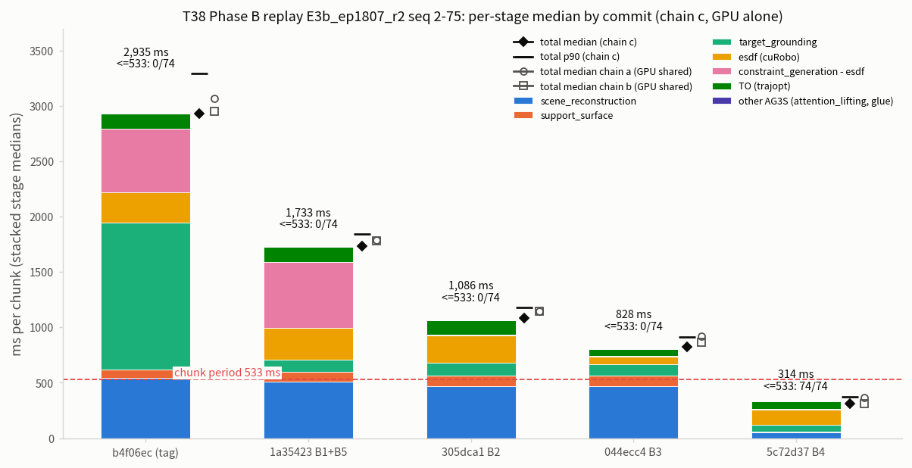

[`figures/t38/t38b-stage-chain.png`](figures/t38/t38b-stage-chain.png) — 그래프. 다섯 코드(tag · B1 · B2 · B3 · B4)의 stage 별 중앙값 누적 막대, 점선 = chunk period 533 ms. 마커는 co-tenancy 가 있었던 chain a · b 의 total 중앙값이다.

### 타임라인

| 시각 (UTC) | STEP | 무엇 |
|---|---|---|
| 2026-10-01 05:05 | **tag `pre-gpu-parallel-20261001`** (`b4f06ec`) | 네 repo 에 되돌아올 지점. 이 뒤의 코드는 worktree `/mnt/dev/work-o4` 의 브랜치 `o4-gpu-parallel` 에만 있다 (main 은 다른 세션이 import 중) |
| 2026-10-01 (≈ 06:27, 파일 수정 시각) | **Phase A 완료** (`T38.profile.verify.json`) | 3 s 의 정체를 함수·입력 크기·복사량까지 분해 |
| 2026-10-01 09:05 | **B1 · B5** `1a35423` (루트 테스트 `d12eca3`) | KD-tree `workers=1` · recorder 를 응답 경로 밖으로 |
| 2026-10-01 09:50 | **B2** `305dca1` (`9a107c6`) | 로봇 self-filter 마스크를 카메라당 1 회, GPU 로 |
| 2026-10-01 11:01 | **B3** `044ecc4` (`4fa71b7`) | ESDF tier 를 GPU 에 두고 질의점에서만 답한다 |
| 2026-10-02 07:31 | **B4** `5c72d37` (`0339914`) | scene reconstruction · support RANSAC 을 GPU 로 |
| 2026-10-02 (≈ 09:11, 파일 수정 시각) | **독립 검증 완료** (`T38.verify.json`) | V1–V5, 모든 비교에서 차이 없음 |

~~main 에는 병합하지 않았다. 병합은 사용자 판정이다.~~ → main 에 merge 됨 (`2016f30`, 2026-10-02, 다른 세션 work-dd; 회귀 · 기준선 비트 동일 — `MERGE-o4` 문서, `handoff/MERGE-o4.verify.json`: 기준선 일치 legacy 4/4 · cuRobo 4/4).

---

### Phase A — 3 s 는 어디에 쓰이는가 (verifier, 2026-10-01, 측정만)

**입력.** T34 E3b 의 `E3b_ep1807_r2`(planning chunk 75 개)를 replay 했다. depth 는 `frames.jsonl` 의 qpos 로 3 카메라를 다시 렌더해 wire 와 같이 uint16 mm 로 양자화했고, attention 16×16 은 서버가 기록한 것, 정책 chunk 는 기록의 `actions_reference` 다. 서버 플래그는 E3b 와 같다(`--esdf-backend curobo --voxel 0.020 --fine-voxel 0.005 --tsdf-voxel 0.005 --links gripper --target-field-policy exclude-authorized …`). 코드는 tag(`b4f06ec`) 이고, T34 서버 때의 코드(`cee8f84` + T33/T34)에 T35–T37 의 K1 continuity gate 가 더해진 것이다.

**측정 오염 한 건.** 첫 replay 도중 다른 세션의 CPU 프로세스(`.venv-curobo probe.py`, 약 1,400 % CPU)가 pass S 의 seq 69 부터 돌았다. 그래서 외부 프로세스가 없던 **quiet 재실행(`_q2`)** 을 기준으로 삼고, 오염된 실행은 따로 보관했다. 아래 Phase A 표는 모두 `_q2` pass T (stage 경계에 `torch.cuda.synchronize` 를 넣지 않은 실행)다.

#### P1 · 단계별 시간

| 단계 | replay 중앙 (p90) | T34 서버 기록 450 chunk 중앙 (p90) |
|---|---|---|
| scene_reconstruction | 472.4 (562.7) | 534.5 (618.4) |
| support_surface | 78.3 (119.4) | 85.6 (165.9) |
| **target_grounding** | **1,018.3 (1,219.4)** | 1,333.7 (2,251.1) |
| constraint_generation − esdf | 574.8 (609.3) | 550.5 (613.9) |
| esdf (cuRobo) | 251.0 (270.3) | 287.4 (394.2) |
| TO — linearize · check · assemble · qp | 97.0 · 11.9 · 7.4 · 2.9 | 102.7 · 12.4 · 7.7 · 4.1 |
| **AG3S** (`timing.ag3s`) | 2,405.4 (2,611.5) | — |
| **trajopt** (`timing.trajopt`) | 134.3 (144.5) | — |
| **AG3S + TO (`timing.total`)** | **2,547.4 (2,740.8)** | — |
| recorder `_record` (응답 시간 밖, wall 에는 들어간다) | 245 (py-spy 에서 대부분 zipfile write) | — |

- replay 의 stage 중앙값이 T34 서버 기록과 같은 크기이므로 replay 는 서버를 대표한다. `grasp_state` 는 75/75, `has_target` 은 75/75 가 기록과 같고, `n_clusters` 는 74/75 가 같다(seq 15 에서 replay 4 · 기록 3 — 코드가 T35–T37 만큼 다르다).
- stage 경계마다 `torch.cuda.synchronize` 를 넣은 pass S 와 넣지 않은 pass T 의 중앙값은 최대 40 ms 안에서 같다. **측정을 위한 동기화가 시간을 왜곡하지 않았다.**
- reset 직후 chunk(seq 1)는 cuRobo mapper 를 새로 지어 esdf 가 1,368.1 ms (`timing.total` 3,871.3 ms)다. 새 프로세스의 첫 chunk 는 warp/cuRobo JIT 까지 더해 esdf 6,668.1 ms, wall 9,386.2 ms 다. 정상 상태 수치로 인용하지 않는다.

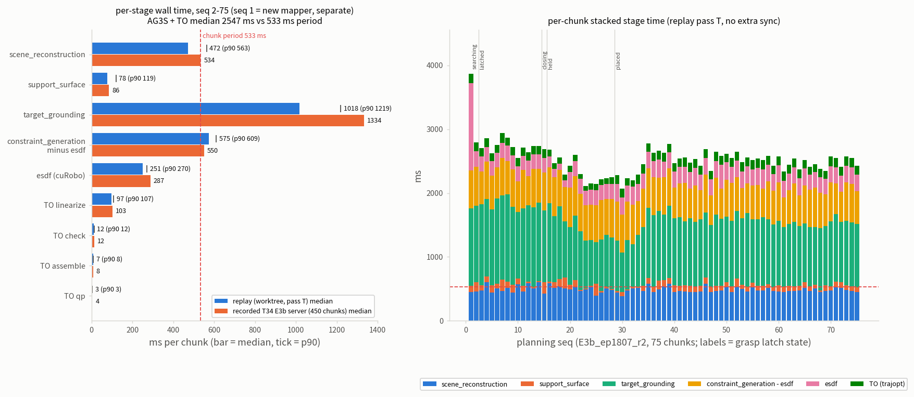

[`figures/t38/t38-stage-bars.png`](figures/t38/t38-stage-bars.png) — 그래프. 왼쪽: 단계별 중앙값(막대)과 p90(눈금), replay 대 T34 서버 기록, 점선 = 533 ms. 오른쪽: seq 별 누적, 파지 상태(latched · closing · held · placed) 표시.

#### P2 · 3 s 는 GPU 가 아니라 CPU 다

| 구분 (cProfile self time, 7 chunk 평균, chunk 당 ms) | ms |
|---|---|
| CPU 스레드 — `cKDTree(workers=-1)` 의 스레드 시작·대기·종료 | 1,165.9 |
| CPU Python (`benchmark/` 코드 자체) | 1,041.0 |
| CPU numpy | 442.1 |
| CPU scipy · Python builtin · casadi · osqp | 12.4 · 16.8 · 5.1 · 2.4 |
| **GPU** warp/cuRobo · torch | **11.2 · 9.3** |

cProfile 이 붙으면 느려지므로 합이 2,547 ms 보다 크다. 비율을 보는 표다. `torch.profiler`(CUPTI)로 7 개 선택 chunk 의 GPU 쪽을 직접 재면 **kernel 5.55–7.41 ms · memcpy 2.7–4.4 ms, device self time 합 8.1–11.7 ms** 다 (replay `timing.total` 2,547.4 ms 의 약 0.3–0.5 %). esdf stage 의 약 250 ms 도 GPU 시간이 아니라 CPU 쪽이다(`_labels_from_sites` 134 ms · `_build_tiers` 76 ms · `_integrate` 15 ms). **"AG3S 를 GPU 로" 는 GPU 가 느려서 고치는 것이 아니라, GPU 가 거의 놀고 있어서 일을 옮기는 것이다.**

#### P3 · grounding 1 s 의 대부분은 계산이 아니라 스레드 생성이다

`cKDTree(…).query(…, workers=-1)` 는 "모든 코어" 로 질의를 나눈다. 이 기계는 256 코어라서 **chunk 당 스레드를 2,138 개 시작하고 거둔다**(cProfile `threading.start` 호출 수). 같은 입력으로 `grow_region` 의 복사본에서 `workers` 만 바꿔 쟀다 — 결과는 같다(`same_result: true`).

| 측정 (ms) | `workers=-1` (현 코드) | `workers=1` | `workers=8` |
|---|---|---|---|
| quiet seq 2 `grow_region` (전체 코드 / 복사본) | 1,106.7 / 1,136.8 | **9.2** | 68.5 |
| quiet seq 22 `grow_region` | 611.9 / 660.0 | **9.1** | 47.4 |
| contended seq 22 `grow_region` (외부 CPU 부하 중) | 3,711.4 / 3,905.1 | **89.3** | 325.5 |
| quiet seq 2 `dbscan` 이웃 수 질의 | 169.7 | **3.5** | — |
| quiet seq 2 nearest-core 질의 | 162.1 | **0.6** | — |
| quiet seq 22 `dbscan` · nearest-core | 127.4 · 124.7 | 3.1 · 0.6 | — |

`workers=8` 도 `workers=1` 보다 느리다 — 이 질의는 점 수천 개짜리라 병렬이 이득이 아니다. 외부 부하가 있으면 `workers=-1` 은 3.7 s 까지 늘어난다.

#### P4 · 같은 일을 여러 번 한다

| 중복 | 측정 |
|---|---|
| **depth 역투영 2 회** | 같은 depth/K/T 를 chunk 당 6 번 back-project 한다 (scene_reconstruction 3 + constraint_generation 의 `_robot_mask_for` 3). 두 호출의 점군 해시가 같다 (seq 2 head `709a80f477aede2f`, 139,044 점) |
| **`robot_sphere_mask` 6 회** (잡고 있을 때 9 회) | voxel 로 줄인 점 13 만 개에 3 회, full-res 50 만 점에 3 회 (잡는 13 chunk 는 held sphere 용 3 회 더). 호출마다 KD-tree 를 새로 짓고 Python 으로 구 587 개를 돈다(질의 1,761 회/chunk). chunk 당 중앙 **671.5 ms** |
| **KD-tree build 24 회/chunk** | 중앙 24 회 · 점 651,333 개. 같은 배열을 두 번 이상 KD-tree 한 chunk: `_labels_from_sites`(tier 마다 같은 seed) 47, `_esdf_clearance + anchor_cover + gap` 41, `robot_sphere_mask` 39 |
| **depth 업로드 2 회** | 각 camera depth 를 coarse · fine mapper 가 따로 GPU 로 올린다 (6 × 1,228,800 B = 7.37 MB) |
| TO linearize 의 `np.gradient` | 97.0 ms 의 대부분이 128³ tier 마다 격자 전체 `np.gradient` + `np.stack` (py-spy top leaf). TO 가 실제로 묻는 점은 chunk 당 몇천 개다 |

**쓰이지 않는 산출물(가설)은 확인했고 비용이 없었다.** `constraint_generation` 안의 CasADi `ConstraintBuilder.build` 는 trajopt 경로(`collision.use_support_planes False`, backend esdf)에서 `plane_active`·`candidate_active` 가 0 으로 눌려 쓰이지 않는다. 그러나 chunk 당 **0.18 ms** 라 없애도 이득이 없다 — T38 은 건드리지 않았다.

#### P5 · host ↔ device 복사

| 방향 | chunk 당 중앙 | 호출 수 |
|---|---|---|
| H2D | 7.49 MB (depth 업로드 2 회 7.37 MB 가 대부분) | 24 |
| **D2H** | **50.33 MB** (tier 3 개 × 값 + site 128³ × 4 B 가 대부분) | 28 |

D2H 50 MB 는 cuRobo 가 만든 ESDF tier 를 host 로 내려 `np.unique` · `np.gradient` 를 돌리기 위한 것이다. GPU 에서 끝낼 수 있으면 내릴 이유가 없다.

#### P6 · 입력 크기 (T38 이전 코드, 75 chunk)

| 양 | 중앙 (최소–최대) |
|---|---|
| depth pixel / chunk (3 카메라) | 921,600 |
| back-project 점 (raw) | 497,980 (492,977–559,848) |
| voxel 5 mm 뒤 | 132,763 (92,069–151,844) |
| fused cloud | 37,179 (22,935–44,380) |
| self-filter 로 지워진 점 | 6,230 (6,046–7,554) |
| `grow_region` 입력 → 출력 | 3,592 → 1,956 |
| `grow_region` 의 KD wave 수 | 7–22 |
| ESDF tier 수 · tier 당 voxel | 2–3 (잡을 때 2) · 2,097,152 (128³) |

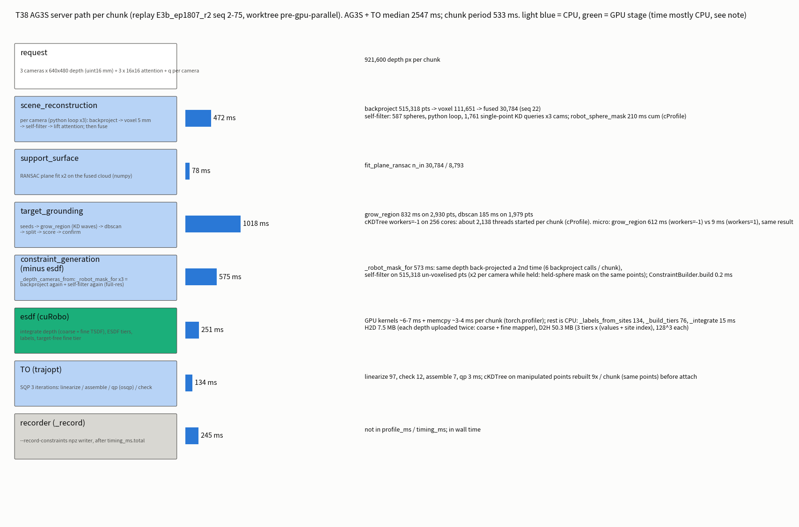

[`figures/t38/t38-pipeline-map.png`](figures/t38/t38-pipeline-map.png) — 도식. 서버 경로의 단계별 시간과 병목 주석(CPU = 하늘색, GPU stage = 초록, recorder = 회색).

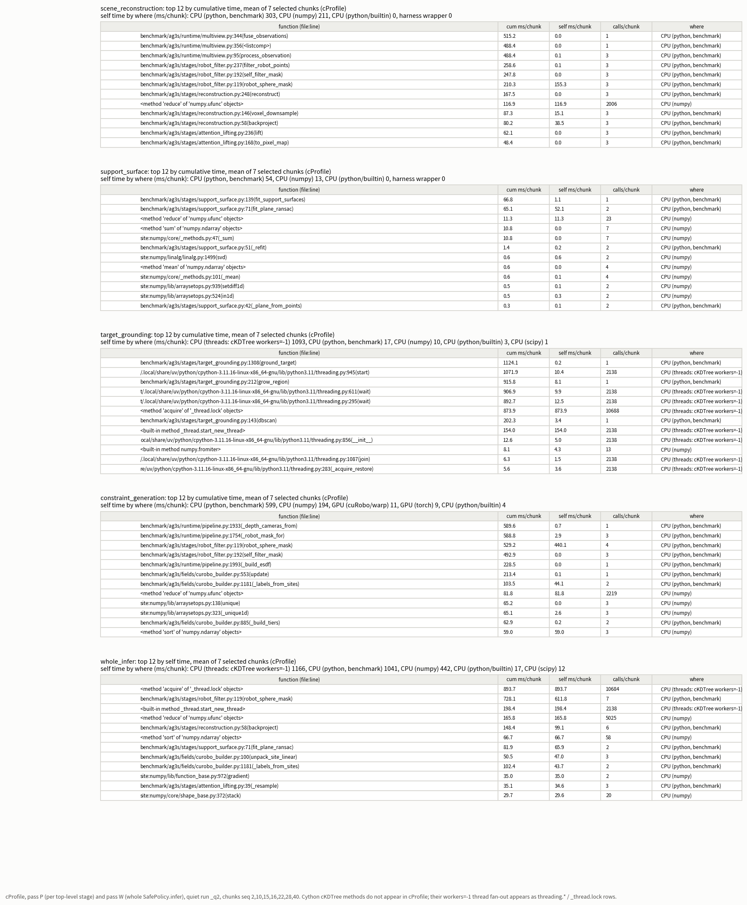

[`figures/t38/t38-function-table.png`](figures/t38/t38-function-table.png) — 표. 단계별 cProfile 상위 함수와 CPU/GPU 구분. [`figures/t38/t38-input-sizes.png`](figures/t38/t38-input-sizes.png) — 표. 입력 크기. [`figures/t38/t38-scene.png`](figures/t38/t38-scene.png) — 실제 씬. replay 입력(seq 22, 파지 후 들어 올린 상태)의 3 카메라 depth 와 attention 상위 5 % 셀, 서버가 기록한 fused cloud(30,788 점)의 top view.

**Phase A 의 기준선 확인.** 측정만 했으므로 코드는 바뀌지 않았고 두 기준선은 그대로다 — legacy **14/15 · 15/15 · −29.031048280806342 mm**, cuRobo **10/15 · 15/15 · −9.171877401271193 mm**. 다른 세션의 GPU 프로세스(pid 981255, 8,810 MiB, util 53–58 %)가 두 기준선 실행 내내 있었다. 세 기준 수치는 SQP 이전 값이다.

**Phase A 에서 읽은 범위 (lead 제안, `T38.task.md`).** 병목은 (a) KD-tree 스레드, (b) 로봇 마스크의 Python 루프와 중복, (c) ESDF tier 의 D2H 와 전체 `np.gradient`, (d) reconstruction · RANSAC 의 numpy, (e) recorder 였다. 이것이 B1–B5 가 되었다.

---

### Phase B — 구현 B1–B5 (implementer, 2026-10-01 ~ 10-02)

**용어.** B1 = KD-tree `workers=1`, B2 = 로봇 self-filter 마스크 GPU, B3 = ESDF tier GPU, B4 = scene reconstruction · support RANSAC GPU, B5 = recorder background. 순서는 B1 → B2 → B3 → B4 → B5 로 계획했으나 B1 과 B5 를 한 commit 에 묶었다.

**원칙 (`T38.task.md`).** 점군 단위 연산을 GPU 에 배치하고, 카메라·cluster 단위 반복을 벡터화하고, 쓰이지 않는 산출물을 만들지 않고, cuRobo 와 같은 GPU 텐서를 공유해 host↔device 복사를 줄인다. **결과 동치성은 허용오차가 아니라 bit-identical 로 정했다** (아래 "왜 비트 동일이 가능했나").

| 단계 | commit (브랜치 / 루트 테스트) | Phase A 의 어느 병목을 | 무엇을 바꿨나 |
|---|---|---|---|
| **B1** | `1a35423` / `d12eca3` | P3 | `KDTREE_WORKERS = 1` 하나로 서버 경로의 `workers=-1` 4 곳을 바꿨다 — `dbscan` 이웃 수 질의 · `dbscan` nearest-core · `grow_region` wave 질의 · `robot_sphere_mask` 구별 질의. 나머지 서버 경로 질의는 이미 기본값 1 이다. 오프라인 스크립트 2 곳은 그대로 |
| **B5** | `1a35423` / `d12eca3` | P2 (recorder 245 ms) | `ConstraintRecordWriter(background=True)`. **무엇을 기록할지는 요청 스레드에서 그 순간에** 정한다 — `summary_json` 직렬화와 payload 배열의 `np.array(copy=True)` snapshot 까지. 스레드는 FIFO 로 `np.savez_compressed` 만 한다. 큐가 가득 차면 버리지 않고 기다린다. 쓰기 실패는 `n_failed` 로 세고 첫 실패는 크게 로그한다. `serve_safe` 만 background 이고 다른 호출자(`bringup.py` 등)는 동기 그대로다. SIGTERM → `SystemExit(143)` 으로 바꿔 `atexit` flush 가 돌게 했다 |
| **B2** | `305dca1` / `9a107c6` | P4 (마스크 6 회 · 역투영 2 회) | 카메라마다 depth 를 full-res 로 **한 번** 역투영하고, (점 × 구 587 개) 판정을 GPU 에서 float64 로 한 번 계산해 픽셀 마스크를 만든다. TSDF 는 이 마스크를 그대로 받고, voxel 대표점은 **자기 픽셀의 판정**을 읽는다(대표점이 곧 그 역투영 점이므로 예전에 대표점을 직접 시험하던 것과 정의상 같다). 쥔 구(held sphere)는 같은 pass 의 열로 나온다. CPU KD-tree 구현은 `_robot_sphere_mask_kdtree` 로 남겼다(CPU fallback). `AG3S.reset` 에서 builder 가 있었을 때만 `gc.collect()` — 버려진 cuRobo mapper 가 순환 참조에 걸려 GPU 메모리를 쥐고 있던 것을 푼다 |
| **B3** | `044ecc4` / `4fa71b7` | P5 (D2H 50 MB) · P4 (`np.gradient` · 라벨 · depth 2 회) | cuRobo 가 만든 tier 를 `DeviceEsdfField` 로 **GPU 에 남긴다.** `distance` · `gradient` · `label` 은 질의점이 쓰는 voxel 코너만 읽어 답한다(격자 전체 `np.gradient` 제거). 질의점이 1,024 개 미만이면 GPU 가 질의 칸의 값만 넘기고 host numpy 가 같은 식으로 산술하고, 그 이상이면 GPU 에서 산술한다(`ESDF_QUERY_HOST_ARITH_MAX_POINTS`). 라벨 층은 GPU scatter, depth 는 카메라당 한 번 올려 두 mapper 가 같은 관측을 쓴다(cuRobo 는 관측을 읽기만 한다). `--record-constraints-esdf full` 은 GPU 격자를 **쓰는 순간에** 가져온다 |
| **B4** | `5c72d37` / `0339914` | P2 · P4 (numpy 역투영 · voxel · attention · RANSAC) | 새 파일 `ag3s/stages/device_recon.py`. depth 를 한 번 올려 역투영 · voxel 대표점 · cap · self-filter · 대표점 자르기를 GPU 에서 끝내고, CPU 가 쓰는 것(kept voxel cloud 의 점과 pixel, `(H, W)` 로봇 마스크, 몇 개의 수)만 내린다. 같은 GPU depth 가 cuRobo TSDF 의 입력이 된다. 구 FK 는 chunk 당 1 회(3 카메라 q 동일). attention 은 cloud 가 쓰는 pixel 만 계산한다. support RANSAC 은 가설 생성(numpy RNG)을 그대로 두고 **(점 × 가설) inlier 수만** GPU 로 센다. `grow_region` 의 평탄화는 `itertools.chain.from_iterable` 로 |

**바꾸지 않은 것.** `fuse`(CPU) · `_refit`(SVD) · RANSAC 의 최종 inlier 선택(`pts @ normal`, gemv) · 가설 생성 · `normalize_attention` · grounding 의 나머지 · TO 의 QP/assemble · ESDF 의 cuRobo 적분 자체 · legacy `EsdfBuilder`/`EsdfField`(numpy 경로는 한 줄도 안 고쳤다) · `curobo_field.py` 의 tier 합성 규칙.

#### 왜 비트 동일이 가능했나

GPU 가 CPU 와 같은 답을 내려면 연산의 종류, 순서, **반올림 횟수**가 같아야 한다. 구현자가 지킨 세 가지를 표로 둔다. 숫자는 모두 구현자 측정이다.

| 함정 | 구현자가 측정한 것 | 처리 |
|---|---|---|
| **컴파일러가 곱과 합을 FMA 로 합친다.** FMA 는 반올림이 한 번 줄어 마지막 비트가 달라진다 | — | 원소별 연산마다 kernel 을 따로 두거나(`d*=d; t*=t; d+=t …`), jiterator 로 `__dmul_rn` · `__dadd_rn` · `__ddiv_rn` · `__fma_rn` 을 직접 써서 반올림 방식을 고정했다 (rounding-fixed kernel) |
| **torch CUDA 는 CPU 스칼라로 나누면 `a·(1/b)` 로 바꾼다** | 100 만 개 중 133,303 개가 1 ulp 다름 (분모를 CUDA 텐서나 0-d CUDA 텐서로 주면 0 개) | 분모는 항상 CUDA 텐서 (`floor(p / vs_t)`, `torch.where(edge, h_t, 2h_t)`) |
| **numpy 의 `@` 는 BLAS 가 하고, BLAS 의 산술은 문서에 없다** | OpenBLAS 0.3.23 의 dgemm 이 `fma(z, r2, fma(y, r1, x·r0))` 의 FMA chain 이다 (`(N,3) @ R.T`, N = 5 … 505,824 의 8 크기에서 chain 과 0 개 다름, FMA 없는 `(xa + yb) + zc` 는 N 의 50–60 % 가 다름). **N = 1 또는 m = 1 이면 gemv 로 가서 다르다** | GPU kernel 이 FMA chain 을 그대로 재현한다. 점 1 개 이하의 역투영, 폭 1 인 RANSAC 가설 블록(가설 수 ≡ 1 mod 32)은 numpy 에 맡긴다. **이 가정은 기계·BLAS 의존이므로 단위 테스트가 매 실행 다시 재서 어긋나면 깨진다** |

그 밖에: scipy `query_ball_point` 와 같은 판정 `(dx²+dy²)+dz² ≤ R²` (제곱근 비교로 쓰면 경계 위 점에서 41 개 불일치, 구현자), `np.gradient(edge_order=1)` 의 voxel 별 식을 코너 voxel 에서만 같은 피연산자 · 같은 순서로 계산, float32 → float64 → float32 의 round-to-nearest-even 일치 등이 있다. 상세는 각 impl.md 의 "같다 의 근거" 에 있다.

**구현자 측정 (impl.md, verifier 가 재지 않은 것) — 설명용.**

| 항목 | 값 |
|---|---|
| 단위 테스트 (GPU venv, `--import-mode=append`, cwd `/mnt/dev/work-o4`) | B1·B5 1,719 passed (CPU shim) · B2 1,748 · B3 1,779 · **B4 1,860 passed · 12 skipped · 0 failed** (GPU venv; skip 12 = cwd 상대 URDF) |
| 새 테스트 | B1 11 + B5 12 · B2 22 · B3 31 · B4 81 (`tests/o4/`, main 에서는 모두 skip) |
| D2H / chunk (pass C census) | tag 50.33 MB (verifier, Phase A) → B3 3.5 MB → B4 7.69 MB (구현자; B4 는 voxel cloud 가 GPU 에서 만들어지므로 CPU 소비자용이 다시 내려온다) |
| H2D / chunk | B3 코드 19.61 MB → B4 12.50 MB (구현자) |
| `AG3S.reset` 뒤 torch 상시 할당 | 994 → 497 MiB (B2 의 `gc.collect()`) |
| 마스크 GPU pass 호출 중앙 | 5.8 ms (B2, 동기화로 잰 값) |
| 발견 | `PYTHONPATH=/mnt/dev/work-o4 pytest /mnt/dev/work/tests/…` 형태의 테스트 명령은 pytest 기본 `prepend` 모드가 `/mnt/dev/work` 를 `sys.path[0]` 에 넣어 **main 의 `benchmark`** 를 import 한다(o4 테스트가 skip 되어 발견). `--import-mode=append` 필수 |

구현자의 단계별 before/after 시간은 각 impl.md 에 있으나 **본문은 verifier 의 V2(아래)만 쓴다.**

---

### 독립 검증 V1–V5 (verifier, 2026-10-02)

**설계.** 구현자는 `E3b_ep1807_r2` **한 기록**으로만 동치를 확인했다. verifier 는 다섯 코드(tag · B1 · B2 · B3 · B4)를 `git archive` 로 각각 따로 풀어 같은 harness 로 돌리고, **비교 코드를 직접 새로 썼다**(구현자의 `compare_b4.py` 를 믿지 않았다; 입력 재현용 harness 의 `build_server` · `load_requests` · `StubPolicy` 만 빌렸다). worktree 코드 확인은 `git archive` 사본과 worktree 가 `diff -rq` 로 `.ruff_cache` 만 다름을 보였다.

| # | 묻는 것 |
|---|---|
| **V1** | 구현자가 쓰지 않은 **다른 기록**에서도 tag 와 B4 의 출력이 한 비트도 다르지 않은가 |
| **V2** | 다섯 코드의 stage 별 시간 사슬. 어느 step 이 얼마를 줄였나 |
| **V3** | 두 회귀 기준선(legacy · cuRobo)이 B4 에서 그대로인가 |
| **V4** | GPU 메모리 사용량 (공유 서버라 우리 상한을 기록) |
| **V5** | CPU fallback 이 tag 와 같은 actions 를 내는가 |

#### V1 · 다섯 기록에서의 동치

비교는 pass T seq 1–75 (warm 4 뒤). tag 와 B4 모두 `E3b` 서버 플래그, recorder 켬(tag 는 동기 writer, B4 는 background).

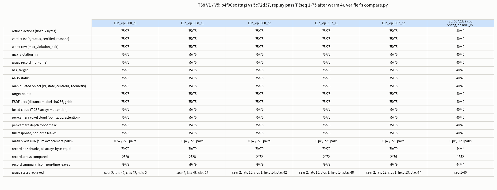

[`figures/t38/t38b-equivalence.png`](figures/t38/t38b-equivalence.png) — 표. 항목(행) × 기록(열). 마지막 열이 V5.

| 기록 | replay 한 grasp state (chunk 수) | 14 항목 같음 | mask XOR | record npz 배열 byte 동일 | 비교한 배열 수 | summary 비시간 leaf |
|---|---|---|---|---|---|---|
| `E3b_ep1800_r1` | searching 2 · latched 49 · closing 22 · held 2 | **75/75** | 0 px (225 쌍) | **79/79** | 2,520 | 79/79 |
| `E3b_ep1808_r1` | searching 2 · latched 48 · closing 25 | **75/75** | 0 px | **79/79** | 2,528 | 79/79 |
| `E3b_ep1800_r2` | searching 2 · latched 16 · closing 1 · held 14 · placed 42 | **75/75** | 0 px | **79/79** | 2,472 | 79/79 |
| `E3b_ep1807_r1` | searching 2 · latched 10 · closing 1 · held 14 · placed 48 | **75/75** | 0 px | **79/79** | 2,472 | 79/79 |
| `E3b_ep1807_r2` (구현자 기록, verifier 코드로 재확인) | searching 2 · latched 12 · closing 1 · held 13 · placed 47 | **75/75** | 0 px | **79/79** | 2,476 | 79/79 |

14 항목: refined actions(float32 byte) · verdict(`safe` · status · certified · reasons) · worst row(`max_violation_pair`) · `max_violation_m` · grasp record · `has_target` · AG3S status · 조작 대상(id · state · centroid · geometry) · target 점 · ESDF tier(distance + label sha256) · fused cloud(CSR 7 배열 + attention) · 카메라별 voxel cloud(점 · uv · attention) · 카메라별 depth 로봇 마스크 · 전체 응답의 비시간 leaf. "mask XOR 0 px" 는 카메라 쌍 225 개(75 chunk × 3 카메라)의 로봇 마스크를 tag 와 B4 에서 XOR 한 pixel 수의 합이다.

- **기록 선택에 대해.** 과제는 `E3b_ep1800_r1` · `E3b_ep1808_r1` 을 지정했으나, 이 두 기록은 파지 · 운반 · 놓기 단계가 다 있지 않다 (`held` 2 chunk 또는 없음, `placed` 없음). **`held` 14 · `placed` 42–48 chunk 가 있는 `E3b_ep1800_r2` · `E3b_ep1807_r1` 을 verifier 가 추가했다.** ESDF tier 가 2 개로 줄어드는 held 경로(`n_tiers` 2 가 ep1800_r2 14 · ep1807_r1 14 · ep1807_r2 13 chunk)와 쥔 구 마스크 경로가 이 세 기록으로 덮인다.
- **time-like leaf 는 비교에서 제외했다** (key 가 `…_ms` · `_at` · `time` · `stamp` · `wall` 에 걸리는 것). 실제로 달랐던 것은 `profile_ms.*` · `to.solve_ms` · `to.metrics.timing_ms.*` · `esdf_stats.target_free.build_ms` · `grasp.attached.attached_at` · 응답의 `timing_ms.*` · `field.built_at` 뿐이다.

**Negative control — 비교기가 차이를 잡는가.** 일부러 다른 두 기록(`tag × E3b_ep1800_r1` 대 `B4 × E3b_ep1808_r1`)을 같은 비교기에 넣었다.

| 항목 | 같음 (75 chunk 중) |
|---|---|
| refined actions byte · worst row · 조작 대상 · target 점 · ESDF tier · fused cloud · 카메라별 cloud · depth 마스크 · 응답 비시간 leaf | **0 / 75** |
| verdict · `max_violation_m` · `has_target` · AG3S status | 75 / 75 (**다른 기록인데도 같다**) |
| grasp record | 1 / 75 |
| depth 마스크 XOR | 4,855,002 px |
| 다른 record 배열 | 1,718 |

**교훈.** `verdict` · `max_violation_m` · `has_target` 같은 판정 요약은 다른 기록끼리도 같아서 **동치를 보이는 힘이 없다.** 힘이 있는 것은 byte 수준의 항목(actions · tier sha · cloud · 마스크 · record 배열)이다. V1 의 "75/75" 는 이쪽이 같았다는 것이다.

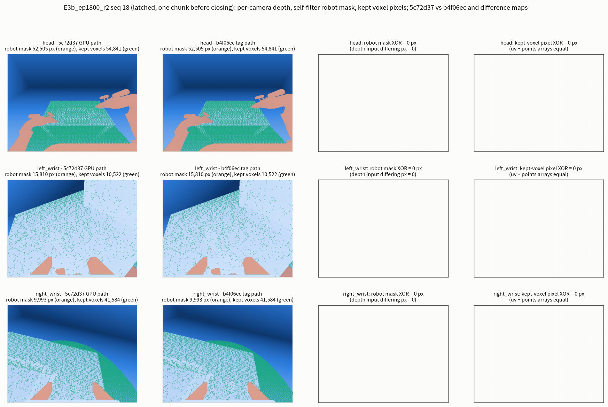

[`figures/t38/t38b-scene-mask.png`](figures/t38/t38b-scene-mask.png) — 실제 씬. `E3b_ep1800_r2` seq 18 (latched, closing 직전 chunk)의 카메라별 depth 위에 self-filter 로봇 마스크(주황)와 kept voxel pixel(초록)을 그렸다. 열 순서: B4 GPU 경로 · tag 경로 · 로봇 마스크 XOR · kept voxel pixel XOR. head 마스크 52,505 px · kept 54,841, left_wrist 15,810 · 10,522, right_wrist 9,993 · 41,584 로 두 경로가 같고, XOR 이 세 카메라에서 모두 **0 px** 이다(depth 입력이 다른 pixel 도 0).

#### V2 · 단계별 시간 사슬

같은 기록 `E3b_ep1807_r2` seq 2–75 를 다섯 코드로 **같은 조건**(단독, recorder background, warm 4)에서 재생했다. tag 는 background recorder 옵션이 없어 **동기 writer** 로 돌았다. 세 번 반복했다 — 세 chain 은 다른 세션의 부하가 다르다.

| chain | 코드 순서 | 환경 |
|---|---|---|
| **a** | tag → B1 → B2 → B3 → B4 | 다른 세션의 GPU 프로세스 있음 (시작 시 pid 3071029 105,544 MiB; B1–B4 동안 pid 450012 8,810 MiB · pid 614960 17,000–19,106 MiB) |
| **b** | B4 → B3 → B2 → B1 → tag (역순) | 일부 구간 다른 세션 GPU 사용 (nvidia-smi 최대 37–38 GB, util 최대 100 %, tag · B1 구간) |
| **c** | tag → B1 → B2 → B3 → B4 | **GPU alone** (실행 전후 0 MiB). 단 호스트 CPU load average 18–51 (다른 세션의 CPU 프로세스는 이 컨테이너에서 보이지 않는다) |

**본문은 GPU alone 인 chain c 를 기준으로 한다.** 모든 코드의 actions 는 tag 와 75/75 같았다(V2 15 실행 전부).

| 코드 (chain c) | scene_recon | support | grounding | esdf | cgen − esdf | TO | **total 중앙 (p90)** | 최댓값 | ≤ 533 ms | `wall` | seq 1 total |
|---|---|---|---|---|---|---|---|---|---|---|---|
| tag `b4f06ec` | 541.4 | 80.3 | 1,327.5 | 273.9 | 573.7 | 137.8 | **2,934.6 (3,293.8)** | 3,613.6 | 0/74 | 3,183.3 | 4,304.6 |
| B1 · B5 `1a35423` | 512.4 | 90.0 | 109.1 | 281.8 | 596.7 | 137.6 | **1,733.2 (1,842.8)** | 1,969.8 | 0/74 | 1,753.6 | 2,922.7 |
| B2 `305dca1` | 470.8 | 96.3 | 111.6 | 252.0 | 2.1 | 131.3 | **1,086.4 (1,181.1)** | 1,537.8 | 0/74 | 1,105.6 | 2,222.7 |
| B3 `044ecc4` | 470.4 | 93.0 | 107.5 | 67.9 | 2.7 | 64.2 | **828.4 (916.1)** | 955.6 | 0/74 | 833.0 | 2,124.2 |
| B4 `5c72d37` | 53.4 | 8.0 | 58.2 | 139.6 | 3.1 | 71.3 | **314.5 (375.2)** | 393.5 | **74/74** | 329.5 | 1,625.2 |

(`cgen − esdf` = `constraint_generation` 에서 그 안에 들어 있는 esdf 를 뺀 것. 단위 ms, stage 는 중앙값. total 은 `timing.ag3s + timing.trajopt`.)

각 step 이 줄인 양 (chain c total 중앙값의 차이):

| step | total 중앙 | 감소 | 줄어든 stage (chain c) |
|---|---|---|---|
| B1 · B5 | 2,934.6 → 1,733.2 | −1,201.4 | grounding 1,327.5 → 109.1. 응답 `wall` 과 total 의 중앙값 차는 248.7 → 20.4 (recorder 가 응답 경로 밖으로) |
| B2 | 1,733.2 → 1,086.4 | −646.8 | cgen − esdf 596.7 → 2.1, scene_recon 512.4 → 470.8 |
| B3 | 1,086.4 → 828.4 | −258.0 | esdf 252.0 → 67.9, TO 131.3 → 64.2 |
| B4 | 828.4 → 314.5 | −513.9 | scene_recon 470.4 → 53.4, support 93.0 → 8.0, grounding 107.5 → 58.2. **esdf 67.9 → 139.6 (+71.7), TO 64.2 → 71.3 (+7.1) 는 올랐다** |

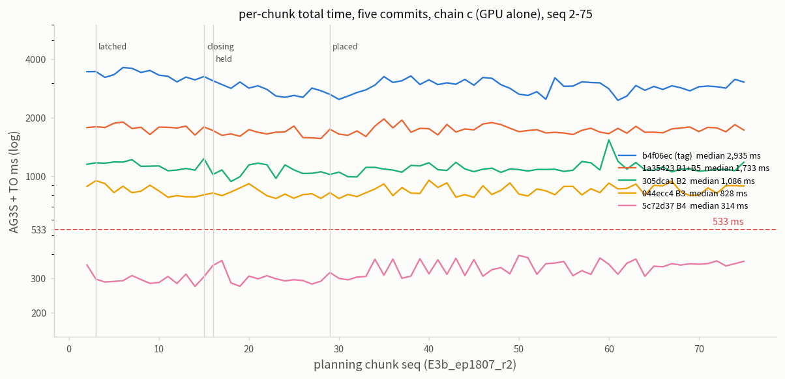

[`figures/t38/t38b-chunk-total.png`](figures/t38/t38b-chunk-total.png) — 그래프. 다섯 코드의 chunk(seq) 별 AG3S + TO 시간(로그 축), 점선 = 533 ms, 세로선 = 파지 상태 전환. **B4 선만 533 ms 아래에 있고, 단계 전환(latched → closing → held → placed)에 따른 추세 변화가 없다.**

**co-tenancy 가 있었던 chain 의 total (참고).** 같은 기록, 같은 순서 외의 변수는 다른 세션이다.

| 코드 | chain a total 중앙 (p90) · ≤ 533 | chain b total 중앙 (p90) · ≤ 533 |
|---|---|---|
| tag | 3,067.1 (3,686.7) · 0/74 | 2,951.0 (3,329.9) · 0/74 |
| B1 | 1,788.7 (2,391.8) · 0/74 | 1,784.8 (2,703.4) · 0/74 |
| B2 | 1,146.2 (1,424.5) · 0/74 | 1,147.4 (1,320.1) · 0/74 |
| B3 | 922.7 (1,098.8) · 0/74 | 869.0 (1,008.5) · 0/74 |
| B4 | 367.4 (606.0) · **62/74** (최댓값 740.0) | 309.3 (331.0) · **74/74** (최댓값 458.5) |

- 세 chain 에서 **B4 중앙값은 309.3–367.4 ms** 로 모두 533 ms 안이다. 그러나 **다른 세션이 GPU · CPU 를 쓰던 chain a 에서는 62/74 chunk 만 533 ms 안**이다 (최댓값 740.0 ms). GPU 가 공유되는 실기 환경에서는 여유가 chain c 만큼 크지 않을 수 있다는 뜻이고, 이 부분은 서버 실제 운영에서 다시 봐야 한다.
- tag 와 B1 은 chain 마다 p90 이 크게 흔들린다 (B1 p90 1,842.8 · 2,391.8 · 2,703.4). 개별 step 의 절감량은 chain 을 가로질러 중앙값 기준 방향이 같다.
- B4 의 total p90 − 중앙값은 chain 별로 238.6 (a) · 21.7 (b) · 60.7 (c) ms 다.

#### V3 · 두 회귀 기준선 (B4, worktree HEAD `5c72d37`, 깨끗한 tree)

skill `regression-baseline` 그대로. 두 기준선 모두 새 GPU front end 를 탄다(`esdf_rollout` 이 `collision_backend: esdf` 로 `process_multi` 를 부른다).

| 기준선 | 위반으로 시작 | `has_target` | frame 0 `clearance_before` (mm) | 15 프레임 sha1[:12] | skill 값 |
|---|---|---|---|---|---|
| legacy | **14/15** | **15/15** | **−29.031048280806342** | `40798fb0a4d2` | 14/15 · 15/15 · −29.031048280806342 · `40798fb0a4d2` — **일치** |
| cuRobo | **10/15** | **15/15** | **−9.171877401271193** | `fe73bd7a6ba6` | 10/15 · 15/15 · −9.171877401271193 · `fe73bd7a6ba6` — **일치** |

프레임별 `clearance_before` 15 개가 Phase A(tag) 와 15/15 같다. 다른 세션의 GPU 프로세스(pid 3071029, 105,544 MiB, util 0 %)가 실행 전후 있었고 건드리지 않았다. 호스트 load average 25.04 → 42.76.

#### V4 · GPU 메모리

기록 `E3b_ep1807_r2` pass T seq 2–75, 네 실행 모두 GPU alone (전후 0 MiB). nvidia-smi 의 process pid 가 컨테이너 pid 와 달라 프로세스별 사용량 대신 `memory.used` 합을 읽었다(다른 프로세스가 없었으므로 우리 사용량).

| 실행 | torch 최대 할당 / chunk — 중앙 (p90) · 최대 | torch reserved 최대 | torch 할당 (infer 직후) 중앙 | **nvidia-smi 최대** |
|---|---|---|---|---|
| tag, 기록 (동기) | 505.0 (505.0) · 994.4 MiB | 1,028 MiB | 497.0 MiB | **1,640 MiB** |
| tag, 무기록 | 505.0 (505.0) · 994.4 MiB | 1,028 MiB | 497.0 MiB | 1,640 MiB |
| B4, 기록 (background) | 906.7 (931.7) · 933.1 MiB | 1,096 MiB | 723.7 MiB | **1,710 MiB** |
| B4, 무기록 | 739.1 (740.3) · 782.5 MiB | 904 MiB | 555.1 MiB | 1,518 MiB |

- **우리 사용량 상한은 nvidia-smi 기준 1,710 MiB** 다(Phase A 의 80 % of 140 GB 기준에도 한참 아래). tag 대비 +70 MiB(기록), −122 MiB(무기록).
- 기록을 켜면 B4 의 torch 할당이 +168 MiB 다. background recorder 큐에 대기 중인 기록이 GPU 격자(B3 의 deferred grid)를 쥐고 있기 때문이다 (원인은 구현자 설명). **infer 직후 큐에 남은 기록은 중앙 9 · 최대 9 개** 다 (verifier, 75 chunk, 한도는 구현자 보고로 `queue_size` 8). verifier 의 replay 는 chunk 를 쉬지 않고 연달아 먹이므로 실제 서버(533 ms 주기)보다 빠르다. 그래도 **writer 가 장기적으로 따라오는지, 큐가 가득 차 응답 경로가 기다리는 일이 생기는지는 이 75 chunk 로 알 수 없다** (미측정).

#### V5 · CPU fallback

`5c72d37` 의 `RECON_DEVICE` · `SUPPORT_RANSAC_DEVICE` · `SELF_FILTER_DEVICE` 를 모두 `"cpu"` 로 두고(`build_server` 전에 설정) `E3b_ep1800_r2` seq 1–40 을 재생해 같은 기록의 tag 와 비교했다.

| 항목 | 같음 |
|---|---|
| 14 항목 (V1 과 같은 것) | **40/40** 전부 |
| depth 마스크 XOR | 0 px (120 쌍) |
| record npz 배열 byte 동일 · summary 비시간 leaf | 44/44 · 44/44 |
| **GPU 경로 호출 수** (`camera_front_end` + `_sphere_mask_device` + `_hypothesis_counts_device`) | **0** (40 chunk 합). 같은 seq 에서 `auto` 는 chunk 당 3 · 3 · 2 회 |

CPU fallback 의 total 중앙은 1,079.3 ms (seq 2–40, 이 기록)다. 기록·구간이 달라 tag 의 값과 직접 비교하지 않는다. **GPU 경로를 끄면 tag 와 같은 actions 로 돌아가므로 문제가 생겼을 때의 되돌아올 길이 있다.**

---

### 청크마다 ≈ 70–90 ms 의 정체 — 원인 미확정

**이것은 결론이 아니라 열린 관찰이다.** B4 의 total 중앙값은 목표를 넘겼지만, step 이 쌓여 갈수록 **chunk 마다 몇십 ms 짜리 정체가 단계를 옮겨 다니며** 떨어진다는 관찰이 구현자에게서 나왔다.

| 출처 | 내용 |
|---|---|
| **구현자 (B4 impl.md)** | 같은 코드의 두 실행에서 `grow_region` 중앙이 12 ↔ 89 ms, `fuse` 87 ↔ 14 ms 로 갈리고, B4 에서는 grounding (17 ↔ 80) · `_integrate` (6 ↔ 85) 로 옮겨 다닌다. 크기는 chunk 당 **≈ 70–90 ms**. B3 도 `multiview.backproject` 가 코드와 무관하게 58 ↔ 130 ms 로 흔들렸다고 보고했다. 구현자가 배제했다고 보고한 것: GC (gen-2 수집 0 회), recorder 경합(무기록 실행에도 있음), GPU 깨어남 지연. 구현자의 해석은 "256 코어 공유 서버의 스케줄링으로 보인다" 였다 — **추측이다** |
| **verifier (V2)** | 이 크기(70–90 ms)를 직접 재지 않았다. 다만 다음 수치가 같은 방향이다 |

verifier 수치 (chain a · b · c):

| 양 | a | b | c |
|---|---|---|---|
| B3 → B4 esdf 중앙 (ms) | 70.4 → 143.8 | 67.5 → 140.1 | 67.9 → 139.6 |
| B4 의 cgen − esdf 중앙 → p90 (ms) | 3.3 → 7.8 | 2.0 → 23.4 | 3.1 → 24.3 |
| B4 의 `wall` − total 중앙 차 (ms) | 23.2 | 70.3 | 15.0 |

- esdf 는 세 chain 모두에서 B3 → B4 때 약 2 배(+70 ms 안팎)가 되었다. 구현자 설명에 따르면 B4 는 `CuroboFieldBuilder.update` 를 depth 출처 외에는 바꾸지 않았다(`_integrate` 중앙 6.5 ms). 즉 **코드가 줄인 것이 아니라 다른 곳으로 옮겨 앉은 정체가 esdf 에 떨어진 것일 수 있다.**
- 평소 2–3 ms 인 `cgen − esdf` 의 p90 이 b · c 에서 23–24 ms 다 — 3 ms 짜리 구간이 가끔 20 ms 이상 걸린다.
- **그러나 verifier 는 이것을 단계 간 이동으로 확인하지 않았다.** 원인(OS 스케줄링 · NUMA · allocator · 어떤 lock · 그 밖)도 가리지 않았다. 요약: 원인 미확정, 크기 70–90 ms 는 구현자 관찰, 74/74 chunk 가 533 ms 안인 것은 정체를 포함한 결과다 (chain b · c).

재측정 대기 표 9 번에 올렸다.

---

### 판정 (verifier 가 확인한 것과 아직 아닌 것)

| 확인된 것 | 근거 |
|---|---|
| T38 의 GPU 경로는 5 개 기록 × 14 항목에서 tag 와 **bit-identical** 이다 (actions · tier · cloud · 마스크 · record 배열) | V1, negative control 포함 |
| 두 회귀 기준선이 skill 값 그대로다 (소수점 · sha1 까지) | V3 |
| GPU 경로를 끄면 tag 와 같은 actions 가 나온다 | V5 |
| replay 의 AG3S + TO 는 GPU alone 에서 2,934.6 → 314.5 ms, 74/74 chunk 가 533 ms 안이다 | V2 chain c (b 도 74/74) |
| 우리 GPU 사용량 상한은 nvidia-smi 1,710 MiB | V4 |

| 확인되지 않은 것 (`not_measured` 와 이 절에서 드러난 것) | 비고 |
|---|---|
| **`5c72d37` 로 닫힌 루프(MuJoCo client) 를 돌리지 않았다** | 지연이 줄었을 때 정책·TO 의 행동이 어떻게 달라지는지는 모른다. bit-identical 은 같은 입력에 대한 같은 출력일 뿐이다 |
| π0.5 추론 · attention 추출 · websocket/msgpack 전송 | replay 에서 stub / 제외. 533 ms 판정은 AG3S + TO 만이다 |
| 새 프로세스 첫 호출의 JIT 비용 (B4 코드) | warm pass 가 가렸다. reset 직후 chunk(seq 1)는 1,625.2 ms 로 533 ms 를 넘는다 |
| GPU/CPU 공유 부하에서의 여유 | chain a 는 62/74. chain c(단독)만 74/74 가 확실하다 |
| 70–90 ms 정체의 원인 | 위 절 |
| background recorder 의 장기 거동 | 큐 깊이 9, 75 chunk 만 |
| tag 의 recorded V2/V4 는 동기 writer | tag 에는 background 옵션이 없다 |
| 단위 테스트 | 구현자 보고(B4 1,860 passed). verifier 는 단위 테스트를 다시 돌리지 않았다 |
| 다른 numpy/OpenBLAS 에서의 bit-identical | dgemm FMA chain 가정은 이 기계 · `.venv-openpi-live` 에서 성립. 환경이 바뀌면 테스트가 먼저 깨지고, 그때는 CPU fallback |

### 되돌아올 지점

| 갈림길 | 고른 것 | 안 고른 것 | 전환 신호 |
|---|---|---|---|
| 동치의 정의 | **bit-identical** — 반올림을 고정한 kernel · FMA chain 재현 · gemv 모양은 CPU. 허용오차 정의를 필요로 하지 않았다 (B2 에서 `T38.task.md` 가 허용오차 정의를 예고했으나 쓰이지 않았다 — 구현자 dual check 에서 237 호출 차이 0) | 허용오차 안에서만 같은 GPU 연산 (빠르지만 판정이 chunk 마다 달라질 수 있다) | 다른 환경에서 dgemm 테스트가 깨지면 `RECON_DEVICE` 등을 `"cpu"` 로 하거나 허용오차를 새로 정의 |
| KD-tree 병렬 | `workers=1` | `workers=-1`(기존) · `workers=8` (micro: 9.2 → 68.5 ms 로 오히려 느림) | 질의 점 수가 수십만으로 커지면 (grounding 입력이 지금 3–4 천 점) |
| GPU 로 옮기는 범위 | 점군 · tier · RANSAC 수 세기. `fuse`(CPU 15 ms) · SVD refit · 최종 inlier 선택은 CPU | `fuse` 를 GPU 로 (구현자 제안: 15 → ≈ 4 ms, D2H ≈ 1.2 MB 감소 — 목표 안이라 안 함) · 3 카메라 batched 적분 (적분 의미가 바뀔 수 있어 안 함) | 533 ms 여유가 모자라질 때 (chain a 의 62/74) |
| `ConstraintBuilder` (CasADi) | 그대로 둠 (0.18 ms) | 제거 | 비용이 커질 때 |
| **병합** | ~~**브랜치 `o4-gpu-parallel` 에서 멈춤** (main 은 병합 전)~~ → main 에 merge 됨 (`2016f30`, 2026-10-02, 다른 세션 work-dd; 회귀 · 기준선 비트 동일 — `MERGE-o4` 문서, `handoff/MERGE-o4.verify.json`: 기준선 일치 legacy 4/4 · cuRobo 4/4) | 병합 | **사용자 판정.** 병합 전에 닫힌 루프 시험(재측정 대기 8)을 권한다 |

**되돌아오는 방법.** tag `pre-gpu-parallel-20261001` (`b4f06ec`) 로 돌아가면 T38 이전이다. 브랜치 안에서는 `RECON_DEVICE` · `SUPPORT_RANSAC_DEVICE` · `SELF_FILTER_DEVICE = "cpu"` (V5 가 확인) 와 `KDTREE_WORKERS` · `ESDF_QUERY_HOST_ARITH_MAX_POINTS` 가 각각 단일 설정점이다. B5 background recorder 는 `ConstraintRecordWriter(background=False)` 가 기본값이고 `serve_safe` 만 `True` 로 만든다.

### 이 STEP 의 산출물

- 코드: 브랜치 `o4-gpu-parallel` 의 `1a35423` · `305dca1` · `044ecc4` · `5c72d37` (benchmark repo, ~~**main 미병합**~~ → main 에 merge 됨 (`2016f30`, 2026-10-02, 다른 세션 work-dd; 회귀 · 기준선 비트 동일 — `MERGE-o4` 문서, `handoff/MERGE-o4.verify.json`: 기준선 일치 legacy 4/4 · cuRobo 4/4)). 루트 repo 테스트 `d12eca3` · `9a107c6` · `4fa71b7` · `0339914` (`tests/o4/`, main 에서는 skip). 되돌아올 지점: tag `pre-gpu-parallel-20261001`.
- 측정: `handoff/T38.profile.verify.json` · `handoff/T38.verify.json`. raw 는 `outputs/verify/T38/` (Phase A) · `outputs/verify/T38/B/` (V1–V5: `runs/` · `cmp/` · `baseline/`).
- 구현 보고: `handoff/T38-B1B5.impl.md` · `T38-B2.impl.md` · `T38-B3.impl.md` · `T38-B4.impl.md`.
- figure: `figures/t38/` — Phase A `t38-stage-bars` · `t38-pipeline-map` · `t38-function-table` · `t38-input-sizes` · `t38-scene`, Phase B `t38b-stage-chain` · `t38b-chunk-total` · `t38b-equivalence` · `t38b-scene-mask` (각각 `.json` sidecar 가 있다).

**다음 판정은 사용자에게 있다:** ~~(1) 브랜치를 main 에 병합할 것인가,~~ (→ main 에 merge 됨 (`2016f30`, 2026-10-02, 다른 세션 work-dd; 회귀 · 기준선 비트 동일 — `MERGE-o4` 문서, `handoff/MERGE-o4.verify.json`: 기준선 일치 legacy 4/4 · cuRobo 4/4)) (2) 병합 전에 `5c72d37` 로 닫힌 루프를 한 번 돌릴 것인가, (3) 정체의 원인을 따로 STEP 으로 쫓을 것인가. 열린 문제 표의 O4 행(위 T35–T37 절, "실시간이 안 된다")은 이 절 앞의 상태 기록이다.


---

## T39 — O1 큰 N: E0 (VLA 단독) 대 E3b (AG3S + cuRobo ESDF + TO, gate · HOLD) 를 같은 noise 로 짝지어 (2026-10-02)

**이 절이 답하는 물음.** O1(표본이 작아 성공률 차이를 판정할 수 없다 — 조건당 6 run, 정책이 비결정적이고 새로 띄운 서버는 같은 난수 순서라 병렬 run 이 중복 표본이다)을 어떻게 푸는가. (1) 정책 난수를 run 마다 **고정할 수 있는가** (S1). (2) 고정한 노이즈로 24 episode × 2 seed × 2 조건 = 96 run 을 돌리면 E0 와 E3b 가 **짝(같은 episode · 같은 seed)** 안에서 어떻게 갈리는가 (S2). (3) 갈리는 쌍은 **어느 chunk 에서 처음 갈라지는가** (S2-3b).

**읽는 법과 출처 규약.**

- 수치는 `handoff/T39.verify.json` 의 `numbers` (그 안의 `s2_3b` 포함) 에서 왔다. 이 파일에 없는 수치는 쓰지 않았다.
- 설계와 S1 의 구현 내용은 `handoff/T39.task.md` (lead) 와 `handoff/T39-S1.impl.md` (구현자) 에서 왔다. **구현자 보고에만 있는 수치는 "(구현자)"** 라고 밝혔다.
- 시각은 git commit 시각과 파일 수정 시각이다 (서버 시계, UTC). `verify.json` 자체에는 시각 필드가 없다 (T38 절과 같은 규약).
- 아래 표의 **"verify.json 에서 센 값"** 은 `verify.json` 의 행 목록(`matrix` · `divergence_all_pairs` · `discordant_pairs`)을 그대로 세어 얻은 개수이며, 이 파일에 합계로는 적혀 있지 않다는 뜻이다.
- **이 절은 무엇이 어떻게 측정됐는지만 적는다.** 쌍이 갈린 *이유* 는 `verify.json` 에 없으므로 적지 않는다.
- 새 용어(policy seed · 짝지은 비교 · McNemar test · discordant pair · XLA autotune · immutable snapshot · first-divergence chunk · a·b·c · deterministic warmup · HOLD)는 위 **"용어 → 큰 N 짝지은 평가 (T39)"** 에 있다.

### 결과 한 장 (96 run, 48 쌍)

| 항목 | E0 (VLA 단독) | E3b (AG3S + ESDF + TO, gate · HOLD) |
|---|---|---|
| run 수 | 48 | 48 |
| **success** (grasp 와 place 모두) | **30 / 48** | **29 / 48** |
| grasp | 34 / 48 | 35 / 48 |
| place | 30 / 48 | 29 / 48 |
| success · grasp 만 · 둘 다 아님 (`matrix` 에서 센 값) | 30 · 4 · 14 | 29 · 6 · 13 |
| HOLD chunk 총수 (3,600 chunk 중) | 0 | **294** |
| HOLD 가 한 번이라도 있는 run | 0 | **18** |
| run 당 wall (s) 중앙 · p95 · 최대 | 186 · 217.5 · 250 | 254.5 · 310.6 · 348 |

**짝지은 2×2 (success).** 같은 (episode, seed) 의 E0 결과와 E3b 결과를 한 쌍으로 묶었다.

| | E3b success | E3b 실패 |
|---|---|---|
| **E0 success** | 22 (둘 다) | **8** (E0 만) |
| **E0 실패** | **7** (E3b 만) | 11 (둘 다 아님) |

**exact McNemar p = 1.0** (갈린 쌍 8 대 7, n = 48 쌍). grasp 와 place 의 2×2 는 아래 표와 같다. place 의 표는 success 의 표와 같다.

| 지표 | 둘 다 | E0 만 | E3b 만 | 둘 다 아님 | exact McNemar p |
|---|---|---|---|---|---|
| success | 22 | 8 | 7 | 11 | 1.0 |
| grasp | 29 | 5 | 6 | 8 | 1.0 |
| place | 22 | 8 | 7 | 11 | 1.0 |

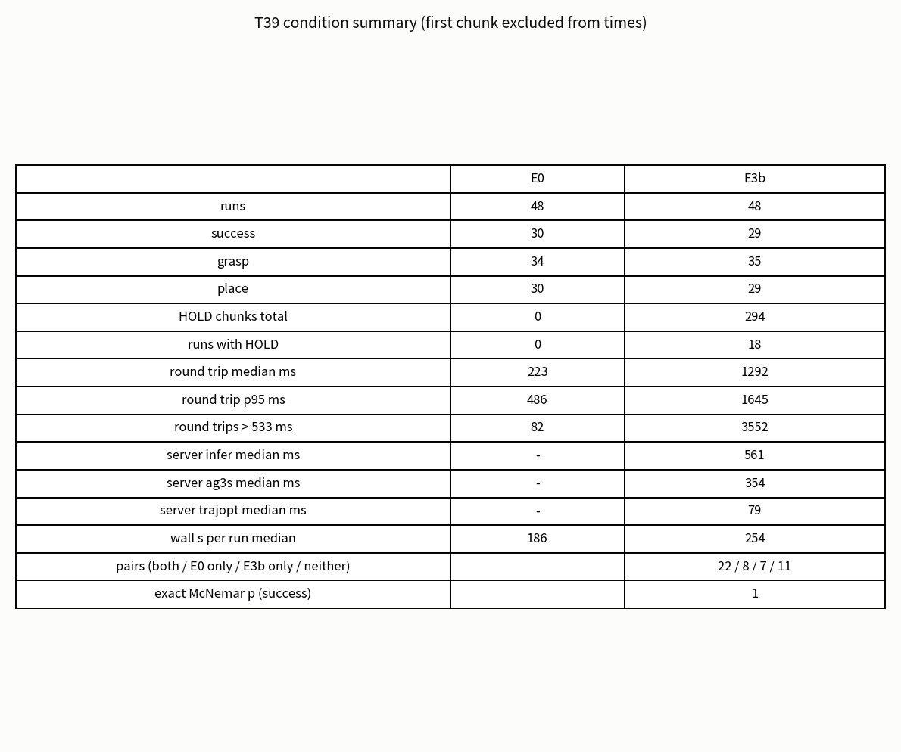

[`figures/t39/t39-summary-table.png`](figures/t39/t39-summary-table.png) — 표. 위 두 표의 수치와 지연 요약을 한 장에 모은 것.

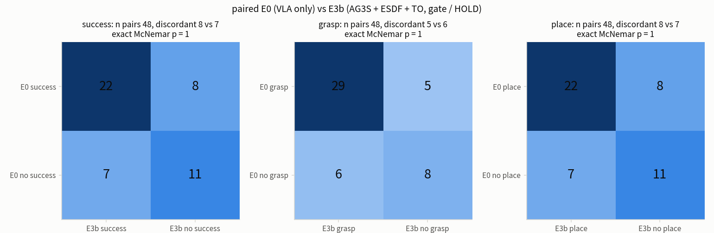

[`figures/t39/t39-paired-2x2.png`](figures/t39/t39-paired-2x2.png) — 표. 왼쪽부터 success · grasp · place 의 짝지은 2×2 와 exact McNemar p.

### 타임라인

| 시각 (UTC, 2026-10-02) | STEP | 무엇 |
|---|---|---|
| 08:50 (파일 수정) | **S1** 구현 완료 (`T39-S1.impl.md`) | 정책 seed 입구와 deterministic warmup. 구현자 기록은 KST 16:50–17:55 |
| 08:53 | 커밋 | benchmark main `e01b7bf` (seed) · 루트 `48314a9` (테스트) · pi05_TO_hybrid `22d8dae` (client flag) |
| 08:54 | 브랜치 `o1-eval` `9fab500` | 서버 코드. 이후 tag `t39-eval-9fab500` (lead) |
| 09:36:47 (raw `runs/launch.out`, `verify.json` 에는 없다) | **S2-2** 시작 | 체인 4 개 |
| 09:19–09:35 (`s21/` 디렉터리 수정 시각) | **S2-1** 수락 | 서로 다른 서버 둘에서 같은 run 이 비트 동일한가. E0 · E3b 모두 통과 |
| 09:50:43–09:52:48 | work-dd GPU window | 다른 세션 (work-dd) 의 GPU 회귀 기준선이 같은 GPU 에서 돈 구간 (아래 "work-dd GPU window") |
| ≤ 11:25:38 | **S2-2** 96 run 완료 | 체인 4 개 모두 `rc=0`. 마지막 체인 종료 11:25:38 (`verify.json` `run_health.chains_rc`) |
| 18:37 → 18:45 (파일 수정) | **S2-3 · S2-3b** 분석 | `analysis.json` 18:37, `s23b.json` 18:44, `T39.verify.json` 18:45 |
| 18:44 · 18:47 | 결과 커밋 | benchmark main `318c343` (S2 · figure) · `80dc4cd` (S2-3b) |

T38 의 GPU 가속 코드(브랜치 `o4-gpu-parallel`)는 이 사이에 다른 세션이 main `2016f30` 으로 병합했다. T39 의 E3b 서버 코드는 그 병합 이전의 `o4-gpu-parallel` (T38 B4 `5c72d37`) 위에 seed 커밋을 얹은 `o1-eval` 이다. **여기서는 문맥으로만 적는다.**

### 왜 새 입구가 필요했나 — S1 (seed 입구 + deterministic warmup)

**S1** 은 "정책 난수를 run 마다 고정하는 입구를 만든다" 는 구현 단계다 (이하 S2-0 = 준비, S2-1 = 수락, S2-2 = 본 실행 96 run, S2-3 = 분석 · figure, S2-3b = S2-3 뒤에 덧붙인 후속 측정 — 전부 `T39.task.md` 의 단계 이름이다).

**동기 (`T39.task.md`).** 이전의 E0 / E3b 비교는 episode 3 개 × 2 회 = 6 run 이었다. 서버는 시작할 때 `jax.random.key(0)` 으로 난수를 만들고 요청마다 split 하는데 재설정이 없어서, **같은 서버를 새로 띄우면 조건이 달라도 파지 전까지 같은 궤적이 나왔다** (T30 · T37 에서 소수점 9 자리 일치). seed 를 넣을 입구는 CLI · env · wire 필드 · client 어디에도 없었다. 그래서 6 run 은 독립 표본이 아니다.

| 구현 (구현자) | 내용 |
|---|---|
| client `--policy-seed S` | 에피소드의 **첫 요청 (t_step 0)** 에만 `policy_seed` 를 싣는다. safe · E0 (`--no-safe`) 두 모드 모두. manifest 에 `policy_seed` |
| 서버 | 그 요청의 `policy.infer` 바로 앞에서 정책 RNG 를 `jax.random.key(S)` 로 다시 놓는다. 이후 요청은 거기서 이어 split 한다. openpi 는 고치지 않았고 benchmark 쪽 얇은 wrapper (`SeededPolicy`) 가 `Policy._rng` 를 바꾼다 (`_rng` 가 없으면 크게 실패) |
| client `--warmup-steps N` | `--start-delay` 의 wall-clock 진행 대신 **정확히 N step**. `--start-delay 2.0` 에 해당하는 값이 1000 (timestep 0.002). 같은 episode 는 같은 t=0 상태가 된다 |
| 호환 | seed 를 안 주면 요청 바이트가 T39 전과 같다 (골든 sha256 테스트). 옛 서버에 `--policy-seed` 를 주면 client 가 첫 응답에서 죽는다 |
| 단위 검증 | `tests/trajopt/test_t39_policy_seed.py` 33 개 통과 (openpi-live, JAX CPU) (구현자) |

**smoke 에서 나온 발견 (구현자).** 같은 seed 라도 **서버 프로세스가 다르면** t=0 상태는 비트 동일인데 첫 chunk 가 3–5e-3 달랐다. 원인으로 XLA autotune 을 의심했고, `XLA_FLAGS` 에 `--xla_gpu_autotune_level=0` 을 더하면 서로 다른 두 서버가 E0 · E3b 모두 6 chunk 비트 동일이었다 (구현자, `--max-steps 48`). 기본 kernel 대비 수치는 4–14e-3 다르다 (구현자). **lead 판단: S2 는 두 조건 모두 `XLA_FLAGS="--xla_gpu_enable_command_buffer= --xla_gpu_autotune_level=0"`** (`verify.json` `code_state.xla_flags`). 두 조건이 같은 kernel 이라 짝지은 비교는 공정하다.

**코드를 고정했다.** main 체크아웃은 다른 세션 (SUBTASK-c) 이 같은 파일을 고치는 중이어서, 96 run 도중 코드가 바뀌지 않도록 **immutable snapshot** (`/mnt/dev/work-o1`, 브랜치 `o1-eval` 을 `git archive` 로 푼 것) 에서 돌렸다 (`verify.json` `code_state`: `o1-eval` `9fab500`, `rby1_bringup` `22d8dae`, 파일 md5 목록 `outputs/verify/T39/p/code_md5_s20.txt`).

### S2-1 수락 — 서로 다른 서버에서 비트 동일 (verifier)

ep1807, seed 18071. 같은 조건을 **서로 다른 서버 프로세스 둘**(a · b)에서 돌려 비교했다. E0 는 `--trajectory-out` npz, E3b 는 frames · record · actions 를 비교했다.

| 항목 | E0 a | E0 b | E3b a | E3b b |
|---|---|---|---|---|
| 서버 GPU 메모리 peak 증가 (MiB) | 8,738 | 8,732 | 17,930 | 19,476 |
| run wall (s) | 226 | 195 | 268 | 260 |
| 서버 기동 (s) | 40 | 30 | 55 | 65 |
| **a 와 b 가 비트 동일** | **E0: 예** | | **E3b: 예** | |

본 실행의 E3b ep1807 seed 18071 도 S2-1 과 같았다 (`run_health.s22_cross_check_E3b_ep1807_s18071_vs_s21: true`).

### 실행 설계 (S2-2)

| 항목 | 값 |
|---|---|
| episode | 사과 + 왼팔 test episode 24 개: 1800 1807 1808 1818 1819 1824 1828 1836 1863 1878 1887 1888 1896 1914 1925 1927 1939 1965 1967 1968 1976 1982 1983 1995 |
| seed | episode 당 2 개, `seed = 10·ep + rep` (rep = 1, 2). 조건 안에서는 서로 다르고 **조건 사이에서는 같다** |
| 조건 | **E0** = VLA 단독 (`--no-safe`). **E3b** = T34 설정 (gripper links · exclude-authorized · margin 0 · capsule 0.05) + `--safe-gate reasons --safe-hold-mode fixed` + `--safe-phase approach --safe-manipulators left` |
| run | 24 × 2 × 2 = **96 run (48 쌍)**, 모두 3rd person 녹화 (`--record … --view front`, osmesa). 한 run = 75 chunk (`--max-steps 600`, chunk 당 8 step) |
| 병렬 | 서버 4 개 (체인 4 개). seed 가 정하므로 서버가 겹쳐도 표본이 중복되지 않는다 |
| 성공 판정 | grasp = 사과 z ≥ 초기 + 50 mm. place = 마지막 planning row 에서 사과 중심이 crate 안. success = 둘 다 (T28 `analyze_e0.py` 규칙) |

**run 건강 (`run_health`).**

| 항목 | 값 |
|---|---|
| 완료 run | 96 (`s2_2_runs.done`), 실패한 시도 0 |
| 실패 디렉터리 · 재시도 줄 | 0 · 0 |
| 종료 코드가 0 이 아닌 client 로그 · traceback | 0 · 0 |
| 체인 | 4 개 모두 `rc=0` |
| E3b IPC timeout · stale error | 0 |
| E3b 서버 기록과 client 가 받은 chunk 가 어긋난 수 | 0 (서버 기록 48 run 과 짝 지어 확인, `n_server_refined_mismatch`) |
| 기준선 (S2-2 뒤, snapshot 코드, CPU shim) | legacy 기준선 일치: 14/15 · 15/15 · −29.031048280806342 mm (`regression_baseline_legacy.matched: true`) |

### 성공 격자 — episode × seed × 조건

기호: **S** = success, **g** = grasp 만 (place 못 함), **-** = grasp 못 함. 칸의 `E0 → E3b`, † = 갈린 쌍 (E0 와 E3b 의 success 가 다르다).

| episode | seed 10·ep+1 | seed 10·ep+2 |
|---|---|---|
| 1800 | - → S † | g → - |
| 1807 | S → S | S → - † |
| 1808 | - → - | - → - |
| 1818 | - → - | - → - |
| 1819 | S → S | - → S † |
| 1824 | g → S † | S → S |
| 1828 | S → S | S → S |
| 1836 | S → S | S → S |
| 1863 | S → S | S → g † |
| 1878 | - → S † | S → S |
| 1887 | S → g † | g → S † |
| 1888 | S → S | - → - |
| 1896 | - → - | S → - † |
| 1914 | g → - | - → S † |
| 1925 | S → S | S → S |
| 1927 | S → g † | - → g |
| 1939 | S → S | S → S |
| 1965 | - → - | - → - |
| 1967 | S → - † | S → S |
| 1968 | S → S | S → S |
| 1976 | - → S † | S → S |
| 1982 | S → g † | S → S |
| 1983 | S → g † | S → S |
| 1995 | S → S | S → S |

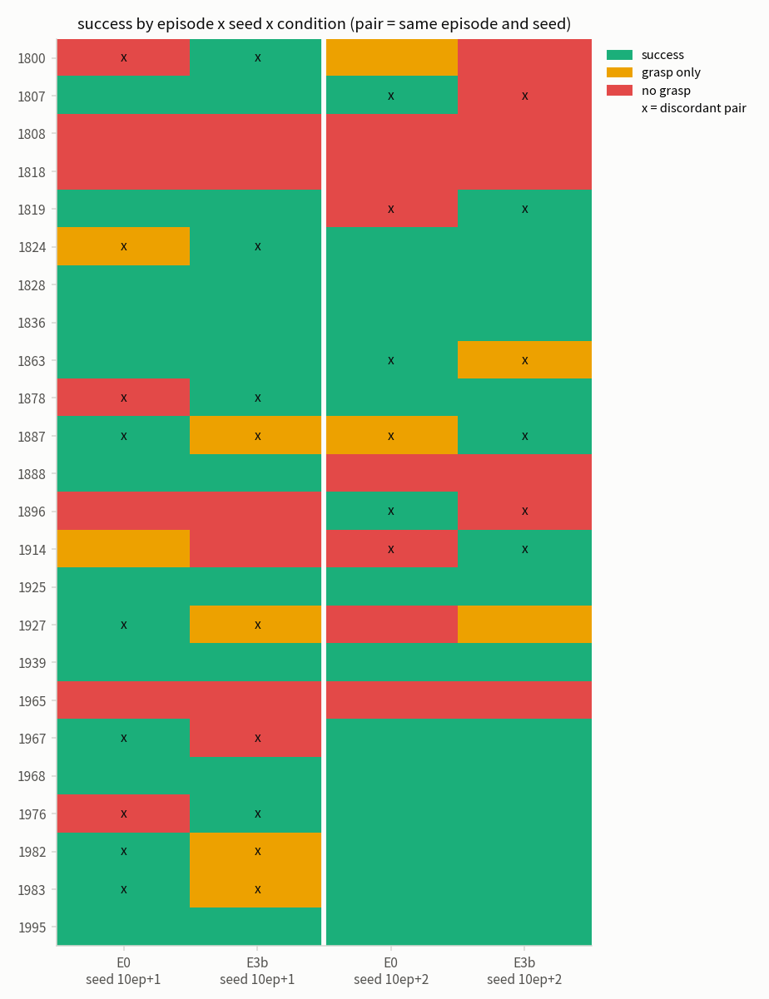

[`figures/t39/t39-success-matrix.png`](figures/t39/t39-success-matrix.png) — 표. episode × seed × 조건 heatmap, x 표시 = 갈린 쌍.

### HOLD — E3b 의 gate 가 막은 chunk

**HOLD** 는 E3b (`--safe-gate reasons`) 에서 서버 verdict 가 그 chunk 를 막은 경우다 (`gate_action = hold`, IPC 응답 `unsafe`). E0 는 gate 가 없으므로 0 이다.

| 항목 | 값 |
|---|---|
| gate action (3,600 chunk) | `execute` 3,306 · **`hold` 294** |
| HOLD 가 있는 run | **18 / 48** |
| run 당 HOLD chunk | 중앙 0 · 평균 6.1 · p95 46.5 · 최대 57 |
| HOLD kind 별 chunk 수 | `collision` 198 · `uncertified` 89 · `unverified` 62 |
| verdict reason kind 별 chunk 수 (3,600 chunk 전체) | `budget_only` 3,374 · `allowed_contact` 85 · `collision` 198 · `uncertified` 89 · `unverified` 62 · `occluded_target` 5 |

kind 별 chunk 수의 합 (349) 이 HOLD 294 보다 큰 것은 한 chunk 가 둘 이상의 kind 를 가질 수 있기 때문이다 (예: `hold:allowed_contact+collision+unverified` 55 chunk — 아래 표).

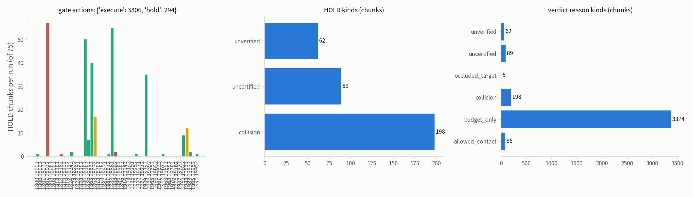

[`figures/t39/t39-hold-verdict.png`](figures/t39/t39-hold-verdict.png) — 그래프. 왼쪽: run 별 HOLD chunk 수 (75 중). 가운데: HOLD kind 별 chunk 수. 오른쪽: verdict reason kind 별 chunk 수.

**HOLD 와 결과 (같은 48 개 E3b run 을 HOLD 유무로 나눈 것).**

| E3b run 의 HOLD | run 수 | success | grasp | place |
|---|---|---|---|---|
| 1 chunk 이상 있다 | 18 | 13 | 15 | 13 |
| 없다 | 30 | 16 | 20 | 16 |

| HOLD kind (그 kind 가 1 chunk 이상 있는 run) | run 수 | success | grasp | place |
|---|---|---|---|---|
| `collision` | 10 | 6 | 8 | 6 |
| `uncertified` | 5 | 4 | 5 | 4 |
| `unverified` | 6 | 3 | 3 | 3 |

(한 run 이 둘 이상의 kind 를 가질 수 있어 run 수의 합 21 이 18 보다 크다.)

**갈린 쌍 15 개 중 E3b 에 HOLD 가 있었던 쌍.** E3b 만 실패한 8 쌍 중 3, E0 만 실패한 7 쌍 중 3 (`discordant_hold_counts`). 쌍마다:

| 갈린 방향 | episode · seed | E3b HOLD chunk 수 | HOLD kind 별 chunk 수 | 첫 HOLD t | E3b grasp t | 첫 HOLD − grasp (step) | E0 grasp t |
|---|---|---|---|---|---|---|---|
| E3b 만 실패 | 1807 · 18072 | 57 | collision 55, unverified 57 | 144 | — | — | 176 |
| E3b 만 실패 | 1863 · 18632 | 17 | collision 14, uncertified 3 | 296 | 128 | 168 | 152 |
| E3b 만 실패 | 1887 · 18871 | 0 | — | — | 136 | — | 136 |
| E3b 만 실패 | 1896 · 18962 | 0 | — | — | — | — | 312 |
| E3b 만 실패 | 1927 · 19271 | 0 | — | — | 136 | — | 160 |
| E3b 만 실패 | 1967 · 19671 | 0 | — | — | — | — | 152 |
| E3b 만 실패 | 1982 · 19821 | 0 | — | — | 160 | — | 192 |
| E3b 만 실패 | 1983 · 19831 | 12 | collision 12 | 160 | 136 | 24 | 152 |
| E0 만 실패 | 1800 · 18001 | 1 | unverified 1 | 216 | 128 | 88 | — |
| E0 만 실패 | 1819 · 18192 | 0 | — | — | 128 | — | — |
| E0 만 실패 | 1824 · 18241 | 2 | uncertified 2 | 280 | 120 | 160 | 112 |
| E0 만 실패 | 1878 · 18781 | 0 | — | — | 128 | — | — |
| E0 만 실패 | 1887 · 18872 | 1 | unverified 1 | 568 | 488 | 80 | 128 |
| E0 만 실패 | 1914 · 19142 | 0 | — | — | 168 | — | — |
| E0 만 실패 | 1976 · 19761 | 0 | — | — | 160 | — | — |

(— = 해당 없음: HOLD 가 없거나 grasp 가 없다. t 는 control step.)

### 파지 접촉 높이

접촉 높이는 첫 닫기 cycle 이 끝난 시점(`t_settle`)의 두 손가락 접촉 중점 z 에서 사과 중심 z 를 뺀 값이다 (mm, T35 정의 — 위 용어 "접촉 중점").

| 항목 (mm) | E0 (n = 48) | E3b (n = 48) |
|---|---|---|
| 중앙 | 0.37 | 1.04 |
| 평균 | 5.18 | 4.29 |
| p95 | 12.58 | 9.24 |
| 최소 | −6.97 | −6.56 |
| 최대 | 123.35 | 127.75 |
| 첫 파지가 유지된 run (`first_grasp_held`) | 35 | 30 |

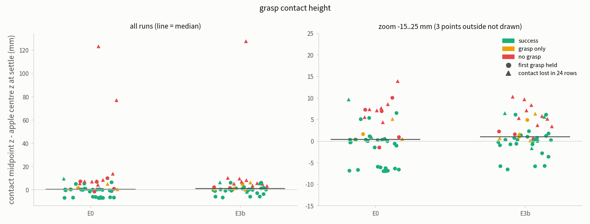

[`figures/t39/t39-contact-height.png`](figures/t39/t39-contact-height.png) — 그래프. 조건별 접촉 높이 분포 (선 = 중앙값). 색 = success · grasp 만 · 실패, 마커 = 첫 파지 유지 / 24 row 안에 접촉을 잃음. 오른쪽은 −15 ~ 25 mm 확대 (3 점은 범위 밖).

### 분기 분석 — 짝이 어느 chunk 에서 처음 갈라지나 (S2-3b)

**S2-3b** 는 S2-2 기록 위에서 CPU 로만 더 잰 후속 측정이다 (`T39.verify.json` `numbers.s2_3b`, 스크립트 `outputs/verify/T39/p/s23b.py`). 쌍마다 chunk seq k = 1…5 (k 번째 chunk = control step 8(k−1) … 8k−1) 에서 세 양을 쟀다.

| 기호 | 쉬운 말 | 정확한 정의 |
|---|---|---|
| **a** | **TO · gate 가 정책 출력을 얼마나 바꿨나** | max abs ( E3b 가 실제 실행한 chunk − 그 chunk 의 정책 원출력 `actions_reference` ), 16 열 모두 (rad, gripper 는 명령값) |
| **b** | **두 조건의 정책 출력이 얼마나 다른가** | max abs ( E3b 의 `actions_reference` − E0 가 실행한 chunk ), rows 0–7. E0 에는 TO 가 없다 |
| **c** | **두 조건의 chunk 시작 상태가 얼마나 다른가** | max abs ( E0 planning-row qpos − E3b planning-row qpos ), 66 차원. 정책이 보는 16D state 의 차이도 쟀는데 두 값은 같다 (k = 2, 3 에서만 측정) |

**48 쌍 요약 (중앙 / 최대, 단위 rad 또는 명령값).**

| chunk k (control step) | a 중앙 / 최대 | b 중앙 / 최대 | c 중앙 / 최대 (66D = 16D) | b > 1e-4 인 쌍 | a > 1e-3 이고 b < 1e-4 인 쌍 |
|---|---|---|---|---|---|
| 1 (t=0–7) | 0.00e+0 / 0.00e+0 | 5.87e-8 / 8.24e-8 | — | 0 / 48 | 0 / 48 |
| 2 (t=8–15) | 2.65e-2 / 6.65e-2 | 1.36e-3 / 1.89e-3 | 2.23e-8 / 4.77e-8 | 48 / 48 | 0 / 48 |
| 3 (t=16–23) | 1.67e-2 / 1.04e-1 | 2.78e-2 / 1.23e-1 | 1.65e-2 / 4.67e-2 | 48 / 48 | 0 / 48 |
| 4 (t=24–31) | 1.48e-2 / 6.77e-2 | 5.13e-2 / 2.48e-1 | — | 48 / 48 | 0 / 48 |
| 5 (t=32–39) | 1.48e-2 / 7.05e-2 | 1.01e-1 / 3.33e-1 | — | 48 / 48 | 0 / 48 |

- **chunk 1.** a 는 48 쌍 모두 정확히 0 이다. b 는 8.2e-8 이하다.
- **chunk 2.** a 는 중앙 2.65e-2 인데 b 는 중앙 1.36e-3 (최소 9.54e-4, 최대 1.89e-3, 48 쌍 모두 1e-4 초과) 이고 c 는 중앙 2.23e-8 (최대 4.77e-8) 이다. **b 는 1e-3 크기이고 c 는 1e-8 크기다. 이 간격의 원인은 `verify.json` 에 없다** (재측정 대기 13).
- **chunk 3 이후.** c 는 chunk 3 에서 중앙 1.65e-2 (최대 4.67e-2) 이고, b 는 2.78e-2 → 5.13e-2 → 1.01e-1 (중앙, k = 3, 4, 5) 이다.
- **"a 는 크고 b 는 작은" 쌍** (TO 가 바꿨는데 정책 출력은 같은 쌍) 은 모든 chunk 에서 0 / 48 이다.

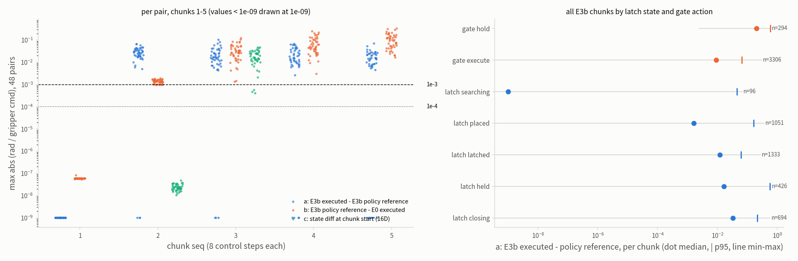

[`figures/t39/t39-s23b-divergence.png`](figures/t39/t39-s23b-divergence.png) — 그래프. 왼쪽: 쌍별 a · b · c 를 chunk 1–5 에 찍은 것 (로그 y축, 1e-9 미만은 1e-9 에 그림, 점선 = 1e-3 · 1e-4). 오른쪽: E3b 의 3,600 chunk 전체에서 a 를 latch 상태와 gate action 별로 본 분포 (점 = 중앙, 눈금 = p95, 선 = 최소–최대).

**first-divergence chunk (처음 갈라진 chunk).** 쌍마다 E0 와 E3b 의 **실행된 action** 이 처음 문턱을 넘어 다른 step 이 속한 chunk 다. 48 쌍 전체 (`divergence_all_pairs`, verify.json 에서 센 값):

| 문턱 | first-divergence chunk | 처음 넘은 step |
|---|---|---|
| 1e-3 | **chunk 2 가 48 / 48 쌍** (그 chunk 에서 E3b 의 gate action 은 48 쌍 모두 `execute`) | step 8 이 45 쌍, step 13 이 1 쌍, step 15 가 2 쌍 |
| 1e-2 | — | 최소 8 · 중앙 11 · 최대 28 |
| 1e-1 | — | 최소 23 · 중앙 39 · 최대 175 |

실행된 action 의 차이는 48 쌍 모두 step 0 부터 0 이 아니다 (`first_step_gt0 = 0`; 크기는 chunk 1 의 b 와 같은 1e-7 이하). chunk 1 에서 E0 의 정책 원출력과 E3b 의 `actions_reference` 의 최대 차는 모든 쌍에서 1.19e-7 이하다.

**갈린 쌍 15 개의 first-divergence (문턱 1e-3).** 모두 chunk 2 (t = 8) 이고, 그 chunk 에서 E3b 의 gate 는 `execute`, 최대 위반 (max violation) 은 0.0 m, 조작 대상은 15 개 모두 `apple` (`visible`) 이다. 표의 `최악 링크` 는 그 chunk 의 verdict 에서 clearance 가 가장 작은 링크이고 `tier` 는 그 값을 낸 ESDF 계층이다.

| 갈린 방향 | episode · seed | E0 | E3b | first-divergence chunk | b (rad) | a (rad, 그 chunk) | 최악 링크 · tier | 최악 clearance (mm) | 1e-1 을 처음 넘은 chunk |
|---|---|---|---|---|---|---|---|---|---|
| E3b 만 실패 | 1807 · 18072 | S | - | 2 (t=8) | 1.22e-3 | 0.0301 | ee_finger_l1 · target_free | 36.5 | 6 |
| E3b 만 실패 | 1863 · 18632 | S | g | 2 (t=8) | 9.76e-4 | 0.0183 | ee_finger_l1 · target_free | 38.8 | 9 |
| E3b 만 실패 | 1887 · 18871 | S | g | 2 (t=8) | 9.76e-4 | 0.0420 | ee_finger_r2 · coarse | 44.8 | 8 |
| E3b 만 실패 | 1896 · 18962 | S | - | 2 (t=8) | 1.24e-3 | 0.0461 | ee_finger_r2 · coarse | 21.9 | 4 |
| E3b 만 실패 | 1927 · 19271 | S | g | 2 (t=8) | 1.36e-3 | 0.0362 | ee_finger_r2 · coarse | 39.6 | 4 |
| E3b 만 실패 | 1967 · 19671 | S | - | 2 (t=8) | 1.63e-3 | 0.0283 | ee_finger_l1 · target_free | 31.2 | 5 |
| E3b 만 실패 | 1982 · 19821 | S | g | 2 (t=8) | 1.36e-3 | 0.0152 | ee_finger_l1 · target_free | 38.7 | 7 |
| E3b 만 실패 | 1983 · 19831 | S | g | 2 (t=8) | 1.36e-3 | 0.0577 | ee_finger_r2 · coarse | 46.7 | 5 |
| E0 만 실패 | 1800 · 18001 | - | S | 2 (t=8) | 1.63e-3 | 0.0328 | ee_finger_l1 · target_free | 30.1 | 6 |
| E0 만 실패 | 1819 · 18192 | - | S | 2 (t=8) | 9.76e-4 | 0.0436 | ee_finger_l1 · target_free | 36.8 | 3 |
| E0 만 실패 | 1824 · 18241 | g | S | 2 (t=8) | 1.71e-3 | 0.0189 | ee_finger_l1 · target_free | 40.1 | 13 |
| E0 만 실패 | 1878 · 18781 | - | S | 2 (t=8) | 1.01e-3 | 0.0353 | ee_finger_l1 · target_free | 40.5 | 4 |
| E0 만 실패 | 1887 · 18872 | g | S | 2 (t=8) | 1.22e-3 | 0.0324 | ee_finger_r2 · coarse | 44.1 | 7 |
| E0 만 실패 | 1914 · 19142 | - | S | 2 (t=8) | 1.36e-3 | 0.0143 | ee_finger_r2 · coarse | 30.0 | 8 |
| E0 만 실패 | 1976 · 19761 | - | S | 2 (t=8) | 1.52e-3 | 0.0134 | ee_finger_l1 · target_free | 44.0 | 9 |

(E0 · E3b 열: S = success, g = grasp 만, - = grasp 못 함. 15 쌍 모두 1e-1 을 처음 넘은 chunk 에서도 gate 는 `execute`, 최대 위반 0.0 m 이다.)

**E3b 의 3,600 chunk 에서 a 의 분포 (latch 상태 · gate action 별).** latch 상태는 서버 기록의 grasp state 다.

| 구분 | chunk 수 | a 중앙 | a p95 | a 최대 |
|---|---|---|---|---|
| latch `closing` | 694 | 3.24e-2 | 2.14e-1 | 5.66e-1 |
| latch `held` | 426 | 1.65e-2 | 5.68e-1 | 5.90e-1 |
| latch `latched` | 1,333 | 1.19e-2 | 6.11e-2 | 2.74e-1 |
| latch `placed` | 1,051 | 1.61e-3 | 1.60e-1 | 3.58e-1 |
| latch `searching` | 96 | 0.00e+0 | 4.45e-2 | 6.65e-2 |
| gate `execute` | 3,306 | 9.03e-3 | 6.56e-2 | 3.00e-1 |
| gate `hold` | 294 | 1.99e-1 | 5.70e-1 | 5.90e-1 |

| gate · verdict reason kind 조합 | chunk 수 | a 중앙 | a p95 | a 최대 |
|---|---|---|---|---|
| `execute:allowed_contact+budget_only` | 22 | 1.74e-2 | 4.14e-2 | 9.83e-2 |
| `execute:budget_only` | 3,258 | 9.07e-3 | 6.57e-2 | 3.00e-1 |
| `execute:budget_only+occluded_target` | 5 | 2.84e-2 | 6.44e-2 | 7.30e-2 |
| `execute:none` | 21 | 1.49e-3 | 5.13e-3 | 2.64e-2 |
| `hold:allowed_contact+collision` | 2 | 3.07e-1 | 5.40e-1 | 5.66e-1 |
| `hold:allowed_contact+collision+unverified` | 55 | 5.62e-1 | 5.76e-1 | 5.90e-1 |
| `hold:allowed_contact+unverified` | 6 | 5.04e-2 | 5.67e-1 | 5.83e-1 |
| `hold:budget_only+uncertified` | 89 | 1.62e-1 | 1.94e-1 | 3.58e-1 |
| `hold:collision` | 141 | 2.03e-1 | 2.32e-1 | 5.66e-1 |
| `hold:unverified` | 1 | 3.01e-1 | 3.01e-1 | 3.01e-1 |

**실제 씬 (규칙 A).** 갈린 쌍 15 개 각각에 대해, 같은 시각의 3rd person frame 을 위쪽 = E0, 아래쪽 = E3b 로 나란히 놓았다. 다섯 열은 start (t=0) · 실행 action 차이가 처음 1e-3 을 넘은 chunk · 처음 1e-1 을 넘은 chunk · grasp 시각 (열 이름에 어느 조건의 grasp 인지 적혀 있다) · 마지막 (t=600) 이다. 테두리 색은 결과 (초록 = success, 주황 = grasp 만, 빨강 = grasp 못 함) 다.

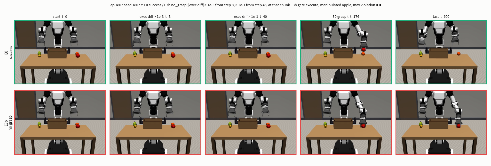

[`figures/t39/t39-scene-1807_18072.png`](figures/t39/t39-scene-1807_18072.png) — 실제 씬. E0 success / E3b grasp 못 함. 제목: |exec diff| > 1e-3 은 step 8 부터, > 1e-1 은 step 46 부터, 그 chunk 에서 E3b gate `execute`, 조작 대상 `apple`, 최대 위반 0.0.

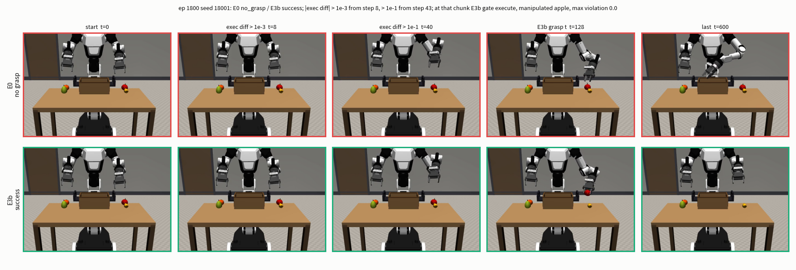

[`figures/t39/t39-scene-1800_18001.png`](figures/t39/t39-scene-1800_18001.png) — 실제 씬. E0 grasp 못 함 / E3b success. 제목: |exec diff| > 1e-3 은 step 8 부터, > 1e-1 은 step 43 부터 (그림의 열 이름 `t=40` 은 그 chunk 의 시작 step).

나머지 13 개 (같은 형식):

| E3b 만 실패한 쌍 | E0 만 실패한 쌍 |
|---|---|
| [1863 · 18632](figures/t39/t39-scene-1863_18632.png) · [1887 · 18871](figures/t39/t39-scene-1887_18871.png) · [1896 · 18962](figures/t39/t39-scene-1896_18962.png) · [1927 · 19271](figures/t39/t39-scene-1927_19271.png) · [1967 · 19671](figures/t39/t39-scene-1967_19671.png) · [1982 · 19821](figures/t39/t39-scene-1982_19821.png) · [1983 · 19831](figures/t39/t39-scene-1983_19831.png) | [1819 · 18192](figures/t39/t39-scene-1819_18192.png) · [1824 · 18241](figures/t39/t39-scene-1824_18241.png) · [1878 · 18781](figures/t39/t39-scene-1878_18781.png) · [1887 · 18872](figures/t39/t39-scene-1887_18872.png) · [1914 · 19142](figures/t39/t39-scene-1914_19142.png) · [1976 · 19761](figures/t39/t39-scene-1976_19761.png) |

### 지연 — chunk 한 번에 걸리는 시간

first chunk (reset 직후, 첫 요청의 JIT 등이 얹힌다) 는 run 마다 제외했다 (각 조건 48 run × 74 chunk = 3,552 chunk). 단위 ms. **E0 는 server 시간을 기록하지 않는다** (`--no-safe` 서버가 timing 을 남기지 않는다) — E0 의 round trip 은 정책 시간의 **상한**이다.

| 구간 | chunk 수 | 중앙 | p95 | 최대 | 비고 |
|---|---|---|---|---|---|
| E3b round trip (client `timing_ms.policy_infer`) | 3,552 | 1,292.2 | 1,644.5 | 3,686.9 |  |
| 　server total (`verdict.timing_ms.total`) | 3,552 | 1,071.0 | 1,423.6 | 2,922.2 |  |
| 　　server infer (policy forward + attention-copy forward, 타이머 하나) | 3,552 | 561.4 | 836.4 | 1,793.4 |  |
| 　　server AG3S | 3,552 | 353.5 | 585.9 | 1,408.5 |  |
| 　　server TO (trajopt) | 3,552 | 79.0 | 237.0 | 892.9 |  |
| 　　ESDF (`esdf_ms`) | 3,552 | 135.8 | 284.7 | 590.9 | 다른 항목과의 포함 관계는 verify.json 에 없다 |
| 　round trip − server total (전송 + client 쪽) | 3,552 | 214.0 | 286.6 | 1,245.4 |  |
| E0 round trip (서버 시간 없음) | 3,552 | 222.9 | 486.2 | 691.6 | 정책 시간의 상한 |

- **round trip** = client 가 요청을 보내고 응답을 받을 때까지 (`timing_ms.policy_infer`).
- **server infer** = `AttentionPolicy.infer` 를 감싼 **타이머 하나** (`safe_policy.py:342-345`) — 정책 forward 와 attention 을 뽑는 forward 를 합친 시간이다. **둘로 가른 기록이 어디에도 없다** (재측정 대기 11).
- **전송 + client** = round trip − server total. 둘로 가르지 않았다.
- chunk period 는 533.3 ms (8 / 15 s, 위 용어). 이 값을 넘은 round trip 은 **E0 82 / 3,552, E3b 3,552 / 3,552** 이다.
- 첫 chunk 의 round trip (참고): E0 중앙 315.9 · p95 591.9 · 최대 11,636.4, E3b 중앙 2,774.1 · p95 5,741.4 · 최대 21,760.8.
- 서버 시간 항목 4 개의 중앙값을 더한 값은 쓰지 않는다 (중앙값의 합은 합의 중앙값이 아니다).

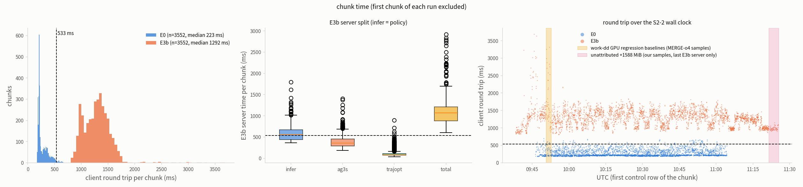

[`figures/t39/t39-chunk-time.png`](figures/t39/t39-chunk-time.png) — 그래프. 왼쪽: E0 · E3b 의 round trip 분포 (점선 = 533 ms). 가운데: E3b 서버의 infer · ag3s · trajopt · total 상자 그림. 오른쪽: S2-2 의 wall clock (UTC) 위에 찍은 chunk 별 round trip 과 아래 두 GPU 창.

### work-dd GPU window — 다른 세션이 같은 GPU 를 쓴 구간

공유 GPU 라서 **다른 세션 (work-dd) 이 같은 GPU 에서 회귀 기준선을 돌린 구간**이 S2-2 안에 있었다 (`verify.json` `gpu_windows[0]`, 라벨 "work-dd GPU regression baselines (MERGE-o4 samples)"). 기록된 대로 적는다.

| 창 | 시각 (UTC) | 기록된 라벨 | 그 창에 첫 control row 가 들어간 chunk |
|---|---|---|---|
| **work-dd GPU window** | 09:50:43 – 09:52:48 | work-dd GPU regression baselines (MERGE-o4 samples) | E0 **78** chunk (run `E0_ep1807_s18071` · `E0_ep1808_s18081`), E3b **49** chunk (run `E3b_ep1818_s18181` · `E3b_ep1819_s18191` · `E3b_ep1828_s18281`) |
| 귀속 불명 | 11:21:34 – 11:25:33 | 라벨 그대로: "unattributed +1588 MiB (our samples, last E3b server only)". **귀속하지 못했다** | 창 안의 chunk 수는 `verify.json` 에 없다 |

**창 안의 chunk 를 뺀 값과 전체의 비교** (chunk 수 · 중앙 · p95, ms). 첫 chunk 는 두 열 모두 제외.

| 구간 | 전체 | work-dd 창의 chunk 를 뺀 것 |
|---|---|---|
| E0 round trip | 3,552 · 222.9 · 486.2 | 3,474 · 222.7 · 481.0 |
| E3b round trip | 3,552 · 1,292.2 · 1,644.5 | 3,503 · 1,289.7 · 1,636.5 |
| E3b server infer | 3,552 · 561.4 · 836.4 | 3,503 · 560.4 · 827.5 |
| E3b server AG3S | 3,552 · 353.5 · 585.9 | 3,503 · 353.1 · 581.6 |
| E3b server TO | 3,552 · 79.0 · 237.0 | 3,503 · 78.8 · 234.8 |
| E3b server total | 3,552 · 1,071.0 · 1,423.6 | 3,503 · 1,069.0 · 1,414.7 |

(위 중앙 · p95 표는 `time_ms_excl_first_and_work_dd_window` 를 `time_ms_excl_first` 와 나란히 놓은 것이다. 이 비교가 창의 영향을 얼마나 설명하는지는 따로 재지 않았다.)

### 아직 모르는 것 (`not_measured` 와 이 절에서 드러난 것)

| 항목 | 상태 |
|---|---|
| E3b 의 server infer 를 policy forward 와 attention-copy forward 로 가른 시간 | **기록 없음** — 타이머가 하나다 (재측정 대기 11) |
| E0 의 server 시간 | **기록 없음** — `--no-safe` 서버가 timing 을 남기지 않는다. round trip (중앙 222.9 ms) 이 상한 (재측정 대기 12) |
| chunk 2 에서 b (≈ 1e-3) 와 c (≈ 1e-8) 의 간격의 원인 | `verify.json` 에 없다 (재측정 대기 13) |
| 갈린 쌍 15 개가 갈린 이유 | **쓰지 않는다.** 위 분기 분석은 어디서 갈라지는지까지만 안다 |
| S2-2 중 서버별 GPU 메모리 | 총량만 있다. nvidia-smi 의 pid 를 서버에 귀속할 수 없었다 (`s23/gpu_samples_merged_s22.txt`, 재측정 대기 14) |
| regression baseline 의 cuRobo 변형 | legacy 만 돌렸다 (S2-2 뒤, snapshot 코드, CPU shim, GPU 0 MiB). cuRobo 변형은 안 돌렸다 (재측정 대기 15) |
| T38 replay 의 AG3S + TO 314.5 ms 와의 직접 비교 | 구간 정의를 맞춰 재지 않았다. 조건도 다르다 — `autotune_level=0`, 서버 4 개 동시, E3b 는 `--record-constraints` (재측정 대기 16) |

### 이 STEP 의 산출물

- 코드 (T39 S1): benchmark main `e01b7bf` · 루트 `48314a9` (`tests/trajopt/test_t39_policy_seed.py`) · pi05_TO_hybrid `22d8dae` (`rby1_bringup/pi05_infer.py`). 평가에 쓴 서버 코드는 `o1-eval` `9fab500` = tag `t39-eval-9fab500` (immutable snapshot `/mnt/dev/work-o1` 은 이 tag 로 재생성할 수 있다).
- 결과 커밋: benchmark main `318c343` (S2 · figure) · `80dc4cd` (S2-3b).
- 측정: `handoff/T39.verify.json` (`numbers.s2_3b` 포함) · 설계 `handoff/T39.task.md` · 구현 보고 `handoff/T39-S1.impl.md` · 진행 `handoff/T39.progress.md`. raw 는 `outputs/verify/T39/` (`s21/` · `runs/` · `s23/` · `p/`).
- figure: `figures/t39/` — `t39-summary-table` · `t39-paired-2x2` · `t39-success-matrix` · `t39-hold-verdict` · `t39-contact-height` · `t39-chunk-time` · `t39-s23b-divergence` · 갈린 쌍 15 개의 `t39-scene-<episode>_<seed>` (각각 `.json` sidecar 가 있다).

---

## SUBTASK — pi0.5 의 subtask 로 attention 의 목적을 읽고, pick 일 때만 target 을 지운다 (2026-09-30 ~ 2026-10-04)

**이 절이 답하는 물음.** (1) AG3S 는 attention 이 가리키는 target 을 ESDF 에서 지운다 (carving). place 때 목적지(바구니)를 안 지우는 것은 지금 **크기 rule (admissibility)** 에 기대고 있다 — 그래서 사용자가 물었다: *pi0.5 의 subtask 로 attention 이 무엇을 위한 것인지 알 수 있는가.* (2) 알 수 있다면 그 label 로 carving 을 어떻게 제어하고, closed loop 에서 무엇이 바뀌고 무엇이 막히는가.

**gate 란.** 이 절에서 **gate = subtask label 을 보고 attention target 을 지울지 말지 정하는 규칙**이다 — label 이 `pick` 이면 지운다 (carving), `place` · `home` 이면 **새로 지울 대상을 정하지 않는다**, `home` 이고 latch 가 PLACED 이면 **이미 놓인 target 의 carving 을 해제**한다 (B3 해제). 새 장치가 아니라 **사용자 규칙 하나 (§4) 를 code 로 옮긴 것**이다. on / off 스위치 (`clustering.subtask_gate`, serve flag `--subtask-gate`) 는 같은 seed 로 끈 실행과 켠 실행을 비교해 **검증하려고** 달았다.

**읽는 법과 출처 규약.**

- 수치는 아래 `handoff/*.verify.json` 의 `numbers` 에서 왔다: [`SUBTASK.verify.json`](handoff/SUBTASK.verify.json) (zero-shot decode · AUROC 재계산) · [`SUBTASK-b.verify.json`](handoff/SUBTASK-b.verify.json) (hidden-state probe) · [`SUBTASK-extra.verify.json`](handoff/SUBTASK-extra.verify.json) (기존 기록의 재계산: PLACED 뒤 switch · run 별 probe accuracy · ep1828 chunk 별 기록) · [`MERGE-o4.verify.json`](handoff/MERGE-o4.verify.json) (merge 뒤 기준선) · [`SUBTASK-d.verify.json`](handoff/SUBTASK-d.verify.json) (gate on 대 off) · [`SUBTASK-e.verify.json`](handoff/SUBTASK-e.verify.json) · [`SUBTASK-f.verify.json`](handoff/SUBTASK-f.verify.json) · [`SUBTASK-g.verify.json`](handoff/SUBTASK-g.verify.json) (gate 기본 on). 이 파일들에 없는 수치는 쓰지 않았다.
- 구현 내용은 `SUBTASK-c.impl.md` · `SUBTASK-e.impl.md` · `SUBTASK-f.impl.md` · `SUBTASK-g.impl.md` · `MERGE-o4.impl.md` 에서 왔다. **구현 보고서에만 있는 수치 (단위 테스트 개수 · 회귀 passed 수 · parity 등) 는 이 절에 쓰지 않았고, 해당 impl.md 로 링크했다.** 판단 흐름과 사용자 판정은 `SUBTASK.audit.md` (§1–§11) 와 `SESSION_STATE.md` 의 2026-09-30 ~ 2026-10-04 행에서 왔다.
- 시각은 UTC 이고 git commit 시각과 `verify.json` 의 `date` 이다. 실행 구간 (V1 시작 · 끝) 은 `verify.json` 의 `V1.start` · `V1.end`.
- **이 절은 무엇이 어떻게 측정됐는지만 적는다.** 원인을 측정하지 않은 것은 "미측정" 으로 적었다.
- 새 용어 (subtask · FAST action token · tied LM head · prefix-LM decoding · hidden-state probe · AUROC · subtask gate · latch 상태 · B3 해제 · `subtask_no_target` · `no_admissible` · `no_seed` · HOLD …) 는 위 **"용어 → subtask · gate · 놓은 뒤 인증 (SUBTASK)"** 에 있다.

### 결과 한 장

| 단계 | 물음 | 답 (측정된 것) |
|---|---|---|
| **SUBTASK (a)** · 2026-09-30 | subtask 문장을 zero-shot 으로 읽을 수 있나 | **못 쓴다.** 16D (serve 중인 checkpoint) 는 held 구간 36 frame 중 30 에서 영어 대신 FAST action token 을 낸다. 점수 분리도 AUROC 는 episode 마다 0.502–0.854 로 흔들린다 |
| **SUBTASK-b** · 2026-10-01 | hidden state 에서 pick / place / home 이 읽히나 | **읽힌다.** `kv_L4` probe 가 val 0.981 · closed-loop 0.959 (3-class accuracy). State 의 gripper 값을 가려도 같다 (0.980) |
| **SUBTASK-c** · 2026-10-02 | label 로 carving 을 제어하는 gate 를 만들 수 있나 | 만들었다 (이 시점의 기본값은 off). 추가 forward 없음. 기준선은 그대로다 (아래 MERGE-o4) |
| **MERGE-o4** · 2026-10-02 | T38 GPU 가속과 합쳐도 기준선이 같은가 | **legacy 4/4 · cuRobo 4/4 비트 동일** |
| **SUBTASK-d** · 2026-10-02 | gate on 의 closed loop (48 쌍) | PLACED 뒤 carving 이 965 / 1051 → 57 / 1041 chunk 로 줄고, 해제 24 / 24 run. **그러나 해제 뒤 984 / 984 chunk 가 `uncertified` HOLD** |
| **SUBTASK-e** · 2026-10-03 | gate 가 비운 target 을 인증하면 | 해제 뒤 HOLD **984 → 232** / 984 chunk. 왼팔이 준비 자세로 돌아온다 (거리 중앙값 1.154 → 0.113 rad). 남은 232 는 `no_admissible` (바구니만 보임) |
| **SUBTASK-f** · 2026-10-03 | 놓은 뒤 home 이면 `no_admissible` 도 인증하면 | 해제 뒤 HOLD **232 → 28** / 984 chunk (1 run, `no_seed`). 끝까지 `no_admissible` HOLD 인 run 7 → 0 |
| **SUBTASK-g** · 2026-10-04 | gate 를 기본 on 으로 (사용자 판정) | 기준선 sha1 이 SUBTASK-f 와 같고, **플래그 없음 = SUBTASK-f 의 gate on**, **`--no-subtask-gate` = T39 E3b** — 2 run 씩 실행된 action · planning action 이 같다 |

**gate 를 끄고 켠 네 구성의 비교** (같은 24 episode × 2 seed = 48 쌍, 같은 policy seed · 같은 warmup, 서버 flag 는 E3b 와 같고 gate 만 다르다). "gate off" 는 T39 의 E3b 48 run 이다.

| 항목 | gate off (T39 E3b) | gate on · SUBTASK-d | gate on · SUBTASK-e | gate on · SUBTASK-f |
|---|---|---|---|---|
| success / grasp / place | 29 / 35 / 29 | 28 / 34 / 28 | 28 / 34 / 28 | 28 / 34 / 28 |
| latch PLACED 에 도달한 run | 25 | 24 | 24 | 24 |
| B3 해제가 일어난 run | 0 | 24 | 24 | 24 |
| HOLD chunk 총수 (3,600 중) · HOLD 가 있는 run | 294 · 18 | 1,198 · 34 | 446 · 24 | **242 · 16** |
| 　`uncertified` HOLD chunk | 89 | 984 | 232 | **28** |
| 　`collision` / `unverified` HOLD chunk | 198 / 62 | 209 / 62 | 207 / 62 | 207 / 62 |
| 해제 뒤 (984 chunk) HOLD | 해제 없음 | 984 | 232 | **28** |
| 해제 뒤 clearance 최솟값 (mm) | — | −1.409 | +0.150 | +0.150 |
| 왼팔 마지막 자세의 준비 자세 거리, 중앙값 · p95 (rad) | 0.115 · 0.424 | 1.154 · 1.886 | 0.113 · 0.561 | 0.109 · **0.164** |
| 끝까지 HOLD 인 run (t = 75 에서 HOLD) · 그중 `no_admissible` 로만 | 5 · 2 | — | 12 · 7 | 6 · **0** |
| 해제 뒤 MuJoCo 접촉 (dist < 0) | 0 | 0 | 0 | 0 |

(출처: `SUBTASK-d.verify.json` `V2_summary_*` · `SUBTASK-e.verify.json` `summary_on_*` · `SUBTASK-f.verify.json` `summary_*`. 왼팔 자세 거리는 해제가 있는 24 run 의 control step 599 값이고 gate off 열은 PLACED 가 있는 25 run 이다. 정의는 `verify.json` `definitions` — 준비 자세 = control step 0 (warm-up 1,000 step 뒤) 의 16-D 관절값. d 열의 "끝까지 HOLD" 는 이 지표를 d 에서 계산하지 않아 비웠다.)

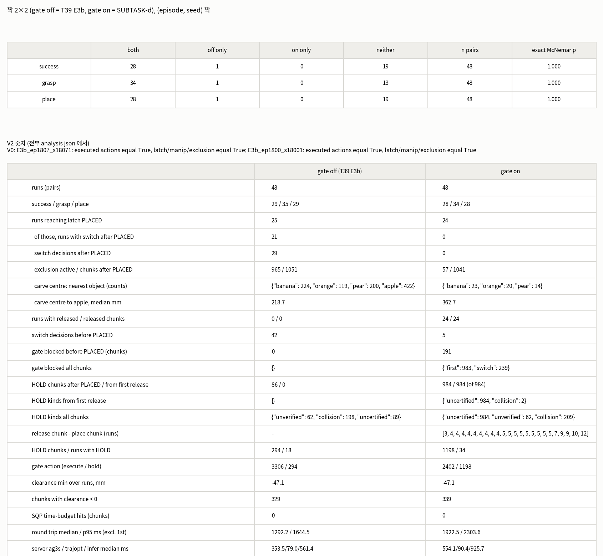

[`figures/subtask-d/subtask-d-table.png`](figures/subtask-d/subtask-d-table.png) — 표. gate off 대 on 의 짝 2×2 와 PLACED 전후 항목.
[`figures/subtask-e/subtask-e-table.png`](figures/subtask-e/subtask-e-table.png) — 표. off · d · e 세 쪽. [`figures/subtask-f/subtask-f-table.png`](figures/subtask-f/subtask-f-table.png) — 표. e 와 f 의 차이.

### 타임라인

| 시각 (UTC) | STEP | 무엇 |
|---|---|---|
| 2026-09-30 10:16 | **SUBTASK (a)** audit | 사용자 질문. subtask 생성 코드 · zero-shot decode 측정 (lead). 사용자 판정: 우리 16D checkpoint (`…/29999`) 를 쓴다 |
| 2026-10-01 | **SUBTASK-b** (`verify.json` 날짜) | hidden-state probe. 사용자 승인: "b 를 gpu 에 올려 테스트" |
| 2026-10-02 | **사용자 spec** · 확정 두 건 · 안 (b) | "phase 가 pick 이면 target 을 지운다, place 면 지우지 않는다" |
| 2026-10-02 09:42:05 | **SUBTASK-c** 커밋 | benchmark `4a8a051` (code) · `5110dbc` (문서) · 루트 `0057f70` (tests) |
| 2026-10-02 09:54:30 | **MERGE-o4** 커밋 | main `2016f30` — `o4-gpu-parallel` (T38 GPU 가속) merge |
| 2026-10-02 19:00 → 20:11:40 | **SUBTASK-d** V1 (gate on 48 run) | `verify.json` 날짜 20:18. 같은 날 18:45 착수 |
| 2026-10-03 | **정정** (audit §11) | lead 가 "문제 2" 를 철회. 2026-10-04 `SUBTASK-extra.verify.json` 이 근거 숫자를 기존 기록에서 다시 계산했다 |
| 2026-10-03 05:02:10 | **SUBTASK-e** 구현 커밋 | benchmark `a7994c0` · 루트 `ff8de30` (tests) |
| 2026-10-03 05:17 → 06:28 | SUBTASK-e V1 | `verify.json` 날짜 06:38 |
| 2026-10-03 11:44:00 | **SUBTASK-f** 구현 커밋 | benchmark `ce92fd1` · 루트 `7fca003` (tests) |
| 2026-10-03 12:07 → 13:45 | SUBTASK-f V1 (**12:21 에 pod 메모리 OOM** 으로 3 run 을 다시 돌렸다) | `verify.json` 날짜 13:52, 결과 커밋 13:53:05 `0f77081` |
| 2026-10-04 | **사용자 판정: subtask gate 를 기본 on 으로 한다** (남은 `no_seed` HOLD 는 그대로 둔다) | `SESSION_STATE.md` 의 2026-10-04 행에 기록됨 |
| 2026-10-04 06:11 → 06:30 | **SUBTASK-g** 검증 (baseline 06:11:12–06:12:43, 플래그 없음 06:12:44–06:21:51, `--no-subtask-gate` 06:21:51–06:30:52) | benchmark `bf65756` · 루트 `54399b8` (tests). `verify.json` 날짜 06:39:29 |

---

### 1. 문제 — place 때 안 지우는 것이 크기 rule 에 기대고 있다

AG3S 는 attention 1 등 cluster 를 target 으로 삼고, 쥐기 전에는 그것을 ESDF 에서 **지운다** (carving; target-free layer 와 contact margin). place 때 바구니를 지우지 않는 것은 지금은 *규칙* 이다 (lead 가 코드를 읽어 정리한 것, audit §9):

| 역할 | 누가 정하나 | 근거 |
|---|---|---|
| manipulated 후보 (지울 수 있는 것) | **크기** — 잡을 수 있는 크기인가 | `admissibility` (가장 좁은 PCA 주축 extent ≤ gripper 최대 개도) · `_exclusion_gate` |
| destination (지우지 않는 것) | **크기** — 못 잡는 크기, 또는 등록된 destination 과 겹침 | `DestinationRegistry` |
| attach / detach | 물리 증거 | `grasp_latch.py` |

crate 는 "너무 커서" carving 에서 빠진다. 이 rule 은 목적지가 **크기로 갈리지 않는** 경우 (bowl · plate · 쌓기 · 건네기) 에는 깨질 수 있다 — 이 논리는 코드를 읽은 것이고 그런 목적지로 측정한 적은 없다 (**미측정**). 그래서 질문이 나왔다: 모델이 지금 무엇을 하는 중인지 (**subtask**) 를 직접 말해 주면 크기 대신 그것으로 갈라 볼 수 있지 않은가.

### 2. SUBTASK (a) — subtask 문장을 zero-shot 으로 읽어 본다 (2026-09-30 10:16)

**먼저 알게 된 것 (lead 의 조사, audit §1).** openpi 에는 subtask 를 생성하는 코드가 없다. 그러나 Gemma 는 **tied LM head** 라 weight 는 checkpoint 안에 이미 있고, prefix-LM decoding (~100 줄) 으로 영어 subtask 를 만들 수 있다. 공개된 `pi05_base` 는 `caption en\n` 에 `Subtask: pick up apple` 로 답해 학습 format 이 `Subtask: …` 임을 스스로 드러낸다.

**issue 의 "garbled words" 는 FAST action token 이다.** openpi 원형 prompt 뒤 생성 token 192 개 중 187 개 (97.4 %) 가 FAST 영역 (id 254,976–257,023) 이다 — `verify.json` 이 재계산한 값. 이 192 개는 `Action:` 으로 끝나는 openpi 원형 prompt 와 `Subtask:` 로 끝나는 prompt 를 합친 것이고, openpi 원형만 보면 93 / 96 (96.9 %) 이다 (audit 의 문장은 원형 prompt 하나의 값처럼 읽히지만 합계다).

**우리 16D checkpoint 에 그 head 가 남아 있나.** LLM 은 그대로이고 눈 (SigLIP) 이 바뀌었다 — pi05_base 대비 weight 상대 차이 `‖w_16d − w_base‖ / ‖w_base‖` (LoRA leaf 제외):

| 부분 | leaf 수 | 풀링 상대 차이 | 최대 leaf |
|---|---|---|---|
| Gemma 2B LLM | 9 | 1.661e-3 | 1.6615e-3 |
| action expert LLM | 11 | 1.662e-3 | 1.727e-3 |
| SigLIP (눈) | 23 | 5.85e-2 (중앙값 8.4e-3) | 0.1732 (`PaliGemma/img/head/kernel`) |

LoRA 가 `.*llm.*` 을 얼리므로 LLM 의 차이는 bf16 저장 반올림 수준이고, SigLIP 은 얼림 대상이 아니라 바뀐다. 16D 학습 loss 는 action flow-matching MSE 뿐이고 prompt 는 full instruction 12 종이라 **subtask text 는 학습된 적이 없다.**

**측정 (246 frame).** 입력은 기록된 closed-loop rollout 네 개 (`20260925_ep1807` 75 frame + `20260925_train/ep0 · ep500 · ep1200` 각 57 frame; 전부 16D checkpoint 의 headless MuJoCo 기록이고 dataset 재생이 아니다). 참값 phase 는 MuJoCo qpos 로 정했다 — reach (gripper 열림 · 과일 crate 밖) → pick, held (gripper 닫힘) → place, released (gripper 열림 · 과일 crate 안) → home. frame 수는 ep1807 reach 19 · held 13 · released 43, ep0 8 · 7 · 42, ep500 7 · 8 · 42, ep1200 18 · 8 · 31 (released 합 158). variant 셋: `base` (`pi05_base`), `ft16d` (served 16D, LoRA on), `ft_nolora` (16D 에서 `lora_b` = 0).

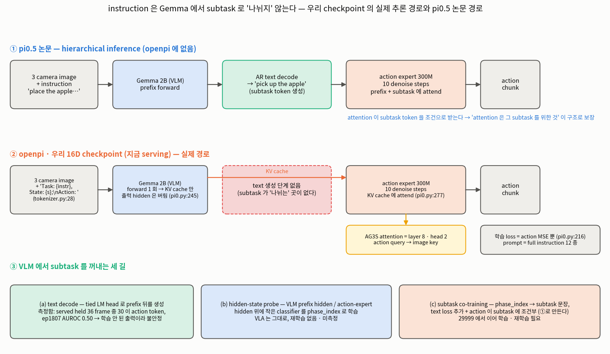

[`figures/subtask/subtask-inference-paths.png`](figures/subtask/subtask-inference-paths.png) — 도식. ① pi0.5 논문 (prefix forward → AR text decode → action expert), ② 우리 checkpoint 의 실제 경로 (prefix forward 1 회 → KV cache 만 남고 hidden 은 버려진다, text 를 한 token 도 생성하지 않는다), ③ subtask 를 꺼내는 세 길 ((a) text decode · (b) hidden-state probe · (c) subtask co-training).

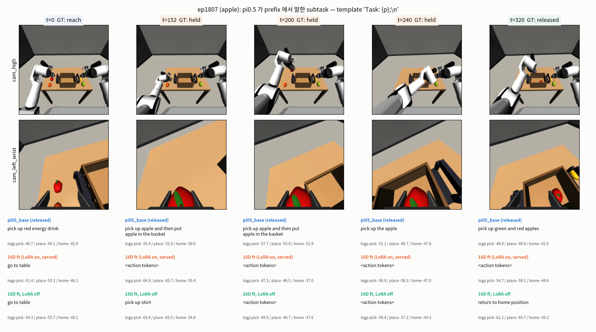

[`figures/subtask/subtask-scene-ep1807.png`](figures/subtask/subtask-scene-ep1807.png) — 실제 씬. ep1807 의 reach → held → released 다섯 시점의 두 카메라와, 세 variant 가 template `Task: {p};\n` 에서 말한 문장. `pi05_base` 는 "pick up red energy drink" 처럼 object 를 지어내고, served `ft16d` 는 held 시점 셋에서 `<action tokens>` 를 낸다.

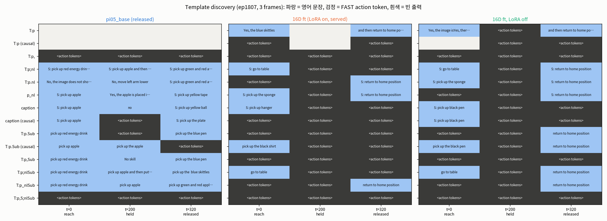

[`figures/subtask/subtask-template-discovery.png`](figures/subtask/subtask-template-discovery.png) — 표. 14 template × 3 frame × 3 variant 를 class (영어 · 빈 문자열 · action token) 로 센 것: `base` 영어 27 · 빈 6 · action 9, `ft16d` 10 · 2 · 30, `ft_nolora` 15 · 1 · 26.

**(1) 점수 분리도 — AUROC.** 후보 `pick up the X` / `place the X in the basket` / `return to home position` 의 log-likelihood 로 만든 점수. held 열은 Δ = log p(place) − log p(pick) 로 held 대 reach, released 열은 home − max(pick, place) 로 released 대 나머지.

| variant | held vs reach: ep1807 · ep0 · ep500 · ep1200 | released vs rest: ep1807 · ep0 · ep500 · ep1200 |
|---|---|---|
| pi05_base | 0.632 · 0.964 · 1.000 · 0.868 | 0.935 · 0.494 · 0.332 · 0.355 |
| **16D ft (served)** | **0.502 · 0.571 · 0.750 · 0.854** | 0.952 · 0.848 · 0.881 · 0.868 |
| 16D ft, LoRA off | 0.530 · 0.679 · 0.589 · 0.826 | 0.884 · 0.694 · 0.795 · 0.919 |

**(2) 자유 생성 (246 frame).** 세 template: T = `Task: {p};\n`, P = `{p}\n`, S = `Task: {p}. Subtask: `.

| variant | 정확도 T · P · S | action-token 비율 (T) | object 이름 맞음 (T) | held 36 frame 중 action token (T) |
|---|---|---|---|---|
| pi05_base | 0.244 · 0.207 · 0.203 | 0.134 | 111 / 207 | 0 |
| **16D ft (served)** | 0.171 · **0.354** · 0.110 | **0.480** | **0 / 71** | **30** (13/13 · 7/7 · 3/8 · 7/8) |
| 16D ft, LoRA off | 0.240 · 0.476 · 0.386 | 0.289 | 1 / 98 | 23 (12/13 · 7/7 · 2/8 · 2/8) |

그 밖에: pick / place / home 중 최고 점수를 고르는 3-way argmax 는 **세 variant 모두 246 / 246 frame 에서 `home`** (짧은 후보가 유리한 length bias) 이다. token 당 forward 중앙값은 21.0 ms (KV cache 없는 naive decoding, H200, bf16; p90 22.2 ms). KV cache 판의 지연은 **미측정**.

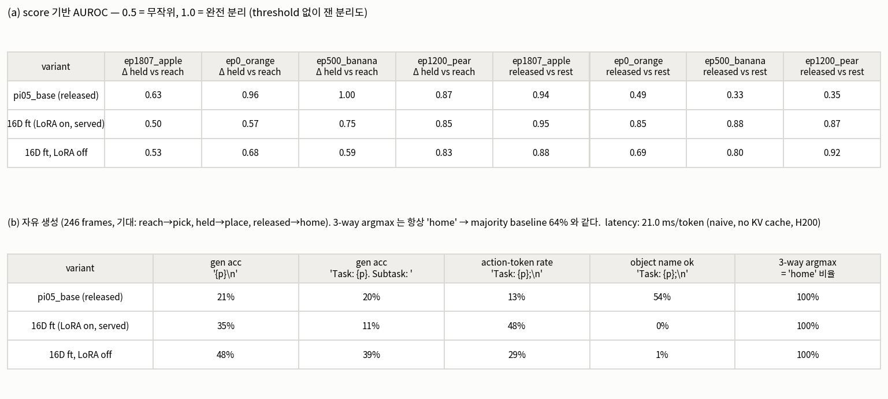

[`figures/subtask/subtask-accuracy-table.png`](figures/subtask/subtask-accuracy-table.png) — 표. 위 두 표의 수치 전부 (AUROC · 생성 정확도 · action-token 비율 · object 이름 정확도).

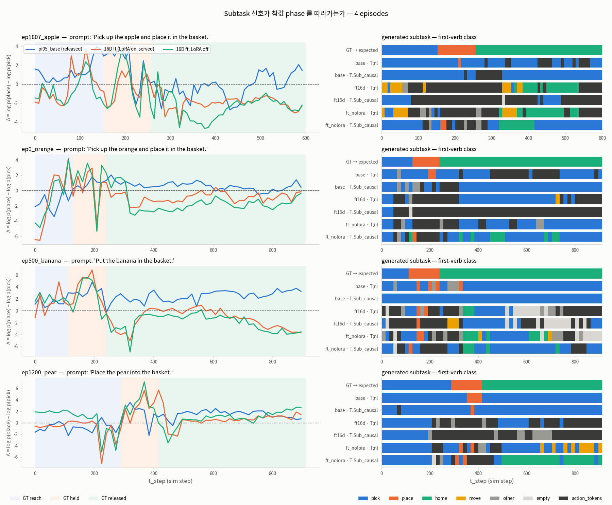

[`figures/subtask/subtask-timeline.png`](figures/subtask/subtask-timeline.png) — 그래프. 네 episode 의 Δ 추이와 생성 문장 class 띠 대 참값 phase.

**판정 (lead 해석, audit §4–§6).** zero-shot 으로는 쓸 수 없다 — served model 은 **place 를 말해야 할 바로 그 held 구간에서 action token 으로 무너지고**, AUROC 는 episode 마다 흔들린다. 이유는 구조적이다. pi0.5 원 설계에서 attention 이 "그 subtask 를 위한 것" 인 까닭은 action expert 가 생성된 subtask token 에 **조건부** 이기 때문인데, 우리 16D 는 full task prompt 로만 학습되어 그 조건이 없다. 그래서 text 로 읽은 subtask 는 VLM 의 장면 해석일 뿐 AG3S 가 읽는 attention (layer 8 · head 2) 이 무엇을 위한 것인지에 대한 인과 보장이 없다.

사용자 질문 하나에 답했다 (2026-09-30): "headless MuJoCo 로 돌려 테스트하면 zero-shot 이 아니지 않나" — 장면 (image) 은 in-distribution 이지만 **subtask text 출력은 여전히 zero-shot** 이다 (학습 loss 에 text 가 없다). 측정한 frame 이 이미 같은 checkpoint 의 headless closed-loop 기록이라 새 실행은 같은 조건의 표본을 늘릴 뿐이다.

선택지 (audit §5): A zero-shot 그대로 (비추천) · B subtask co-training (`phase_index` 로 text loss 를 더해 16D 를 재학습, 원 설계와 같은 인과 보장, 재학습 필요) · **C hidden-state probe (재학습 없음)** · D 지금 rule 유지. 사용자는 C 를 승인했다 (SUBTASK-b 착수).

### 3. SUBTASK-b — hidden state 에서 phase 를 읽는다 (2026-10-01)

**설정.** 16D checkpoint (`…_xla_retry_20260923/29999`, LoRA on, `return_attn_probs=True`) 를 얼리고 hidden state 위에 logistic regression (StandardScaler + L2, C 는 GroupKFold(5) 로 선택) 을 학습한다. label 은 dataset `phase_index` 를 pick (0–5) / place (6–9) / home (10–13) 로 묶은 것. frame 은 `frame_index % 6 == 0` 로 뽑았다.

| 집합 | episode | frame | pick / place / home |
|---|---|---|---|
| train | 200 (0..1592, 8 간격) | 10,401 | 4,000 / 3,200 / 3,201 |
| val | 50 (1600..1796, 4 간격) | 2,601 | 1,000 / 800 / 801 |
| closed246 | closed-loop 기록 4 run (ep1807 전부 + 나머지 둘째 step 마다) | 246 | 52 / 36 / 158 |
| closed414 | 같은 4 run 의 모든 step | 414 | 85 / 57 / 272 |

closed-loop 참값은 gripper 로 정의했다 (`min(s7, s15) < 0.9` → held, 그 외 과일이 crate 안 → released, 나머지 reach). 정의상 rule (gripper + 이력) 은 거기서 1.000 이다.

**결과 — 3-class accuracy / macro AUROC.** `normal` = State 그대로, `mask (a)` = 가리지 않고 학습한 probe 에 gripper 를 가린 입력, `mask (b)` = 가린 입력으로 다시 학습.

| feature | val normal | val mask (a) | val mask (b) | closed246 normal | closed246 mask (a) | closed246 mask (b) |
|---|---|---|---|---|---|---|
| prefix_img (Gemma image hidden 평균) | 0.980 / 0.999 | 0.981 / 0.999 | 0.978 / 0.999 | 0.955 / 0.997 | 0.955 / 0.996 | 0.955 / 0.994 |
| **kv_L4** (best) | **0.981 / 0.999** | 0.981 / 0.999 | 0.980 / 0.999 | **0.959 / 0.997** | 0.955 / 0.998 | 0.955 / 0.998 |
| ae_final (action expert 마지막 hidden) | 0.980 / 0.999 | 0.981 / 0.999 | 0.980 / 0.999 | 0.963 / 0.998 | 0.959 / 0.998 | 0.968 / 0.993 |
| attn_L8 (AG3S 가 읽는 층의 attention 질량) | 0.974 / 0.999 | 0.956 / 0.990 | 0.975 / 0.999 | 0.955 / 0.994 | 0.939 / 0.979 | 0.951 / 0.996 |
| rule (gripper + 이력) | 0.942 / 0.959 | — | — | 1.000 / 1.000 | — | — |
| control: frame_index 만 | **1.000** | — | — | — | — | — |
| control: 팔 관절 14 개 (gripper 제외) | 0.697 / 0.863 | — | — | 0.569 / 0.751 | — | — |

kv_L4 (normal) 의 closed414 run 별 accuracy (`SUBTASK-extra.verify.json` 이 `predictions.csv` 에서 다시 계산): ep1807 apple **0.9600** (72/75) · ep0 orange **0.9735** (110/113) · ep500 banana **0.9646** (109/113) · ep1200 pear **0.9381** (106/113), 전체 0.9589 (397/414). ep1807 은 test split 이다.

kv_L4 의 오분류 (3-class, val): pick → place 17 · place → pick 32 · home → place 1. closed414 는 pick → place **0** · place → pick 8 · home → place 9. val 의 오분류 50 개는 전부 phase 전환 지점에서 1 sample 안이고, closed414 의 17 개는 모두 3 sample 안이다 (14 개가 1 sample 안). 14-way (phase 별) 로는 val 0.967.

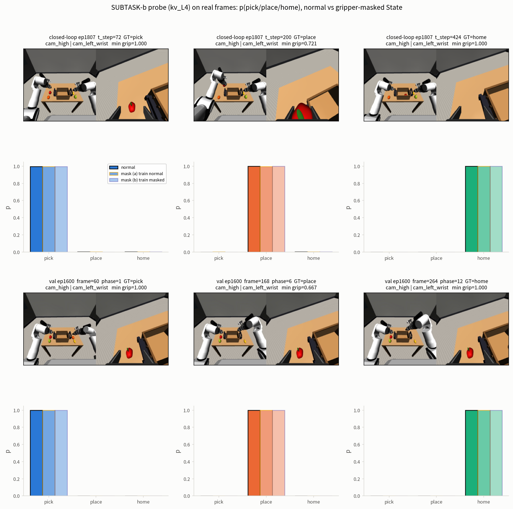

[`figures/subtask-b/subtask-b-scene.png`](figures/subtask-b/subtask-b-scene.png) — 실제 씬. closed-loop ep1807 (t = 72 · 200 · 424) 과 val ep1600 (frame 60 · 168 · 264) 의 pick · place · home 시점 이미지와 `kv_L4` 의 p(pick / place / home) 막대 (normal · mask (a) · mask (b)). 여섯 시점 모두 참값 class 에 확률이 거의 1 이다.

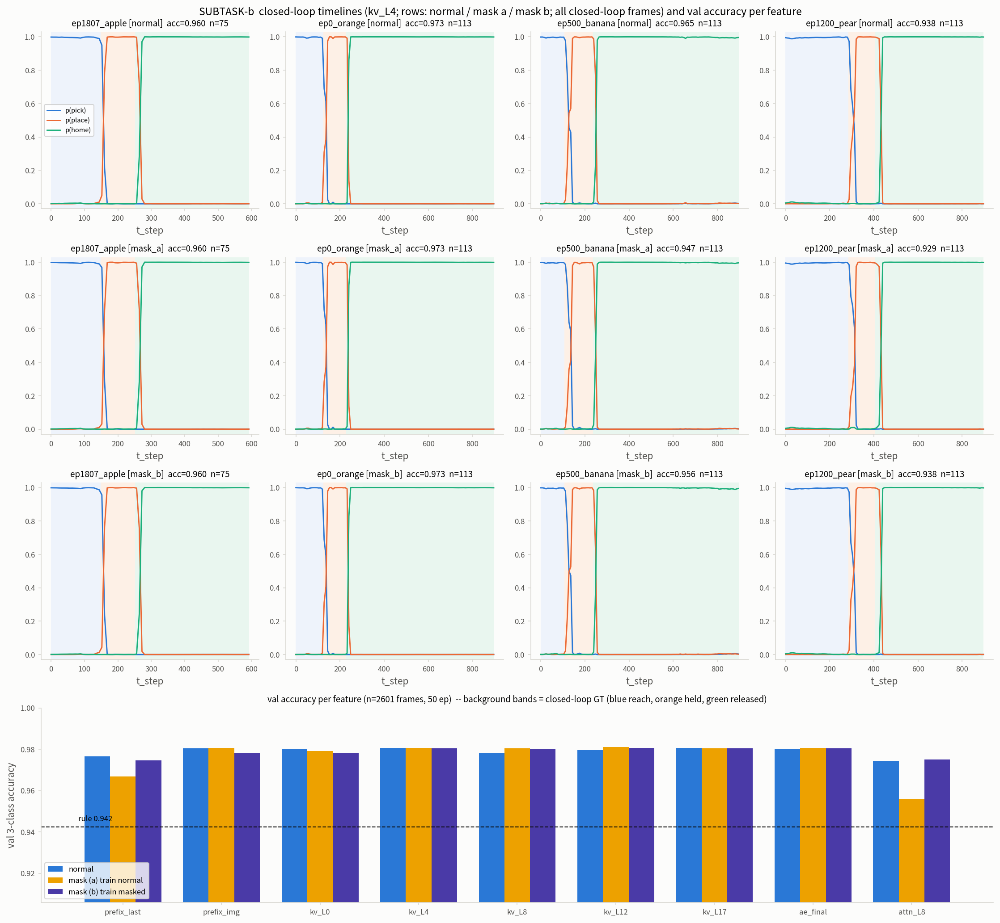

[`figures/subtask-b/subtask-b-graph.png`](figures/subtask-b/subtask-b-graph.png) — 그래프. closed-loop run 별 시계열과 feature 별 val accuracy. [`figures/subtask-b/subtask-b-table.png`](figures/subtask-b/subtask-b-table.png) — 표. 위 표의 전체 (feature × 집합 × 조건).

**무엇이 확인됐고 무엇이 아닌가.**

- 확인: 우리 checkpoint 의 hidden state 에서 phase 가 **선형으로** 읽힌다 — Gemma 쪽 · action expert 쪽 · attention 자체 모두 (val 0.974–0.981).
- 확인: State 의 gripper 값을 가려도 그대로다 (kv_L4 val 0.981 → 0.980). 팔 관절만으로는 0.697 이므로 probe 는 **image 에서** 읽는다.
- **한계 1.** dataset `phase_index` 는 scripted 라 frame 시각만으로 1.000 이 나온다 (250 episode 중 248 이 같은 phase 열 — `controls`). val 은 쉬운 시험이다. policy 자신의 속도로 도는 closed-loop 의 0.93–0.97 이 더 정직한 수치다.
- **한계 2.** closed-loop 참값이 gripper 로 정의되었으므로 rule 은 정의상 1.000 이다. **이 데이터로는 probe 가 rule 을 이긴다고 말할 수 없다.** probe 가 rule 을 이길 수 있는 곳은 gripper 는 닫혔는데 사과가 손에 없는 경우 (T35-diag 가 본 "들 때 미끄러짐") 인데, 그 run 들은 policy image 를 저장하지 않아 **아직 못 쟀다.**
- 한계 3. held-out closed-loop 은 ep1807 하나이고, ae_final · attn_L8 은 noise seed 하나이다.
- 통합 비용: kv_L4 는 `AttentionSampler._prefix` 가 AG3S attention 용으로 이미 계산하는 KV cache 에서 나온다 → **추가 forward 가 없다.** probe 추론은 0.092 ms (CPU, 1 frame). 참고로 prefix forward 는 24.5 ms · suffix 는 5.18 ms (중앙값, closed 집합).
- val 의 pick → place 오분류 17 개는 lead 가 GRIPPER_CLOSE 경계로 읽었다 (audit §9; 이 attribution 은 `verify.json` 에 없다) — label 이 닫히는 도중 먼저 place 로 바뀔 수 있다는 뜻이므로 아래 §4 의 두 번째 확인이 이것을 막는다. closed-loop 에서는 pick → place 가 0 개 (위 confusion).

### 4. 사용자 spec (2026-10-02)

lead 는 label 을 역할 · 허용 · attach 세 권한으로 나누는 안을 냈으나 (audit §9, shadow 단계 포함), 사용자가 이렇게 줄였다:

> "phase 가 pick 이면 target 을 지운다, place 면 지우지 않는다. 이게 전부다."

구현 전에 두 가지를 확인했고 둘 다 확정되었다 (2026-10-02):

1. place 중 **쥔 사과** 는 지금처럼 attach 로 robot tree 에 넣어 field 에서 뺀다 — "지우지 않는다" 는 **attention target (바구니)** 에 적용된다.
2. 사과의 처리가 carving (pick) → attach (place) 로 바뀌는 순간은 label 이 아니라 **latch HELD (물리 증거)** 가 일으킨다. label 은 attention target 을 carving 할지만 정한다. (label 이 일찍 바뀌면 실제 사과가 field 로 돌아오고 gripper 엔 가짜 사과가 남는다 — T34 의 거짓 attach 와 같은 모양이고, 늦게 바뀌면 쥔 사과가 충돌 계산에서 빠진다.)

home 은 place 와 같이 처리한다 (지우지 않는다). 구현에서 남은 빈칸이 하나 있었다 — **PLACED 뒤에는 기존 manipulated (놓인 사과) 를 계속 carving 한다** (아래 §5). 사용자는 **안 (b)** 로 정했다: *"사과가 놓이기 전에 home 이 나올 수도 있는 상황에 대비"* 해서, **gate on ∧ 확정 label home ∧ 이번 episode 에 latch 가 PLACED 에 도달** 하면 기존 manipulated 를 해제한다 (B3 해제). "detach" 가 아니라 PLACED 로 좁힌 이유는 T34 의 `attach_revoked` (거짓 attach 회수) 도 detach 이지만 사과가 놓이지 않았기 때문이다.

### 5. SUBTASK-c 구현 · MERGE-o4 (2026-10-02)

**구현 (`SUBTASK-c.impl.md`).** gate 는 **새 target 을 채택 (`first`) 하지도, 다른 후보를 세지도 (`switch`) 않게** 막는 것이다. 지금 manipulated 인 물체 · admissibility · destination registry · latch freeze · attach / detach · `_exclusion_gate` 는 건드리지 않는다. 구현 시점의 기본값은 off 였고 (2026-10-04 사용자 판정으로 기본 on 이 되었다 — §9 SUBTASK-g), off 이면 결정이 구현 전과 같다 (label 은 `metrics["subtask"]` 에 기록만, "켰다면 막았을 것" 은 `would_block` 으로 남긴다).

| 구성요소 | 위치 | 무엇 |
|---|---|---|
| probe asset | `asset/subtask_probe/kv_L4_v1.npz` · `.json` · `experiments/tools/export_subtask_probe.py` | SUBTASK-b 와 같은 데이터 · 설정으로 재학습한 numpy asset. SUBTASK-b 와 맞는지의 parity 검사는 `SUBTASK-c.impl.md` |
| label 경로 | `sources/pi05_attention.py` · `trajopt/attention_policy.py` · `stages/subtask_probe.py` | `AttentionSampler` 가 이미 하는 prefix pass 의 KV cache 에서 feature 를 꺼내 `result["subtask"] = {p, argmax, probe}` 로 싣는다. 새 경로의 kv_L4 가 SUBTASK-b 의 feature 와 맞는지, attention 이 bit 동일한지의 검사는 `SUBTASK-c.impl.md` |
| gate | `stages/target_grounding.py` · `runtime/pipeline.py` · `config.py` | `clustering.subtask_gate` (이 시점의 기본 `False`) · 확정 label (연속 N 요청 같은 argmax; `subtask_confirm_frames`, 기본은 `target_confirm_frames`) · grounding status `subtask_gated` |
| 배선 (Part B) | `trajopt/safe_policy.py` · `trajopt/serve_safe.py` | 요청마다 `ag3s.set_subtask(...)` · `ag3s.set_placed(...)`, `--subtask-gate` · `--subtask-probe`. `--no-safe` · `--no-attention` · `--no-perception` 과 같이 주면 거절 |
| **B3 해제** | `stages/target_grounding.py` | §4 의 조건으로 기존 manipulated 를 해제 (carving 없음). id 는 계속 센다 — 다음 `first` 는 새 id |

단위 테스트 · 회귀 결과는 [`SUBTASK-c.impl.md`](handoff/SUBTASK-c.impl.md) (Part A · Part B 각각).

**PLACED 뒤 carving 이 어디로 가는지 — 구현 전 기록을 다시 계산한 결과 (`SUBTASK-extra.verify.json`, T34 · T37 의 E3a · E3b 서버 기록, gate off, 읽기 전용).** 지금 코드는 PLACED 뒤에도 manipulated 를 carving 하고, `TargetConfirm` 의 `switch` 가 열려 다른 물체를 새 target 으로 채택할 수 있다. 구현자의 스캔 도구 (`scan_placed_switch.py`) 출력과 verifier 의 재계산이 일치한다. 기록에서:

| 항목 | 값 |
|---|---|
| PLACED 에 도달한 episode · 그 뒤 switch 가 난 episode (24 episode 중) | 14 · **12** |
| switch 뒤 chunk 의 exclusion active | 433 중 **406** (나머지 27 은 `source = none`) |
| 새 target 이 destination 의 xy 0.15 m 안(놓인 사과) · 그 밖의 다른 물체 | 8 · 4 |
| switch 전 (PLACED 부터 첫 switch 직전, switch 가 없으면 episode 끝까지) 의 chunk · exclusion active | 129 · **129** (source 는 전부 `manipulated`) |

이 표는 **기록을 읽은 것** 이지 gate 를 켠 재현이 아니었고, 그래서 SUBTASK-d 가 closed loop 로 재었다.

**MERGE-o4 (구현자 · verifier).** SUBTASK 작업이 끝나면 T38 GPU 가속 브랜치와 합친다는 사용자 계획에 따라 `o4-gpu-parallel` (T38 B1–B5, tip `5c72d37`) 를 main (`5110dbc`) 에 merge 했다 (`2016f30`, 2026-10-02 09:54:30). 충돌이 난 파일은 `trajopt/serve_safe.py` 하나뿐이었고 둘 다 살렸다 (T39 `9fab500` 과 같은 순서). 충돌 해법 · CPU 회귀 · `tests/o4` 결과는 [`MERGE-o4.impl.md`](handoff/MERGE-o4.impl.md).

**verifier 의 기준선 (merge 된 tree, `regression-baseline`)** — gate 는 (그 시점의 기본값인) off 로만 쟀다:

| baseline | 위반으로 시작 | `has_target` | frame0 `clearance_before` (mm) | 15 frame sha1[:12] | 기대값과 |
|---|---|---|---|---|---|
| legacy | 14 / 15 | 15 / 15 | −29.031048280806342 | `40798fb0a4d2` | **비트 동일** |
| cuRobo | 10 / 15 | 15 / 15 | −9.171877401271193 | `fe73bd7a6ba6` | **비트 동일** |

legacy 4/4 · cuRobo 4/4 항목이 T38 V3 기대값과 같고, 15 frame 의 `clearance_before` 가 전부 T38 V3 와 같다. 실행에 쓰인 `benchmark` module 은 전부 `/mnt/dev/work/benchmark` 아래 (밖 0 개) 였다. wall 은 56.3 s (legacy) · 57.0 s (cuRobo).

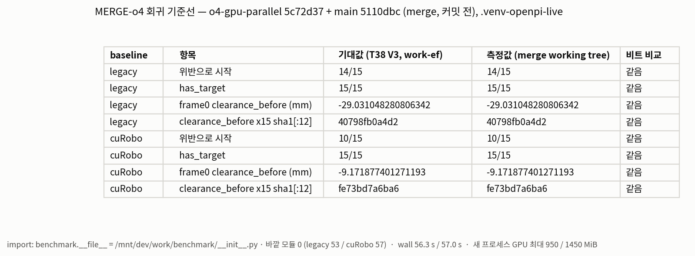

[`figures/merge-o4/merge-o4-baseline-table.png`](figures/merge-o4/merge-o4-baseline-table.png) — 표. 기대값 (T38 V3) 과 측정값을 항목마다 나란히 놓은 것.

**미측정 (MERGE-o4 `verify.json`):** gate on, CPU device path, closed-loop E3 경로.

### 6. SUBTASK-d — gate on 의 closed loop (2026-10-02, verifier)

**설계.** 같은 24 episode × 2 seed = 48 쌍 (T39 와 같은 policy seed `10·ep + rep`, `--warmup-steps 1000`). **gate off 는 T39 의 E3b 48 run 을 다시 쓴다** — 먼저 새 코드 (snapshot `/mnt/dev/work-sd`, main `73dcb37`, 불변 사본) 에서 gate off 두 run (ep1807 s18071 · ep1800 s18001) 을 다시 돌려 T39 E3b 와 **실행된 action · planning action · `traj.npz` 배열 (`inference_ms` 제외) · chunk 별 latch 상태 · manipulated id · exclusion · refined chunk 가 같음** 을 확인했다. 달라진 것은 서버 기록에 `subtask` 키가 새로 생긴 것과 시간 항목뿐이다. gate on 은 E3b 서버 flag 에 `--subtask-gate` 만 더한 48 run, 서버 4 개 병렬 (V1: 19:00 → 20:11:40, 실패한 시도 0, run 당 wall 평균 293.1 s). baseline 은 일치 (legacy 14/15 · 15/15 · −29.031 mm, cuRobo 10/15 · 15/15 · −9.172 mm).

**결과.**

| 항목 | gate off | gate on |
|---|---|---|
| success / grasp / place | 29 / 35 / 29 | 28 / 34 / 28 |
| latch PLACED 에 도달한 run | 25 | 24 |
| 　그중 PLACED 뒤 `switch` 가 있었던 run · `switch` decision | **21** · 29 | **0** · 0 |
| PLACED **전** `switch` decision | 42 | 5 |
| PLACED 뒤 exclusion active / chunk | **965 / 1,051** | **57 / 1,041** |
| carving 중심에서 가장 가까운 물체 (chunk 수) | banana 224 · orange 119 · pear 200 · apple 422 | banana 23 · orange 20 · pear 14 |
| carving 중심 → 사과(현재 위치) 거리 중앙값 (mm) | 218.7 | 362.7 |
| carving 중심 → 사과(초기 위치) 거리 중앙값 (mm) | 355.7 | **28.4** |
| 해제된 run · 해제 chunk | 0 · 0 | **24 · 24** |
| PLACED → 해제 (chunk) · 해제 chunk − 사과가 crate 안에 든 chunk | — | 2–3 · 3–12 (24 run 전부 양수) |
| gate 가 막은 chunk (`first` · `switch`) | 0 | 983 · 239 |
| HOLD chunk 총수 · run | 294 · 18 | **1,198 · 34** |
| 해제 뒤 HOLD (984 chunk 중) · kind | — | **984** · `uncertified` 984 (+ `collision` 2) |
| 해제 뒤 grounding status | — | `subtask_gated` 983 · `no_admissible` 1 |
| run 별 최소 clearance 중 최솟값 (mm) | −47.1 | −47.1 |

**읽는 법.** gate off 에서 PLACED 뒤 carving 은 965 / 1,051 chunk 에서 켜져 있고, carving 중심은 **놓인 사과 (422 chunk) 가 아니라 다른 과일 (543 chunk: banana · pear · orange)** 에 더 가까울 때가 많다 — `switch` 로 manipulated 가 옮겨간 것이다 (21 / 25 run). gate on 에서는 그 `switch` 가 0 이 되고, 남은 57 chunk 의 carving 은 해제 전 PLACED 직후 2–3 chunk 동안 **사과의 초기 위치** (중앙값 28.4 mm) 에 남아 있는 것이다 — 해제는 사과가 crate 안에 든 chunk 보다 3–12 chunk 뒤였다.

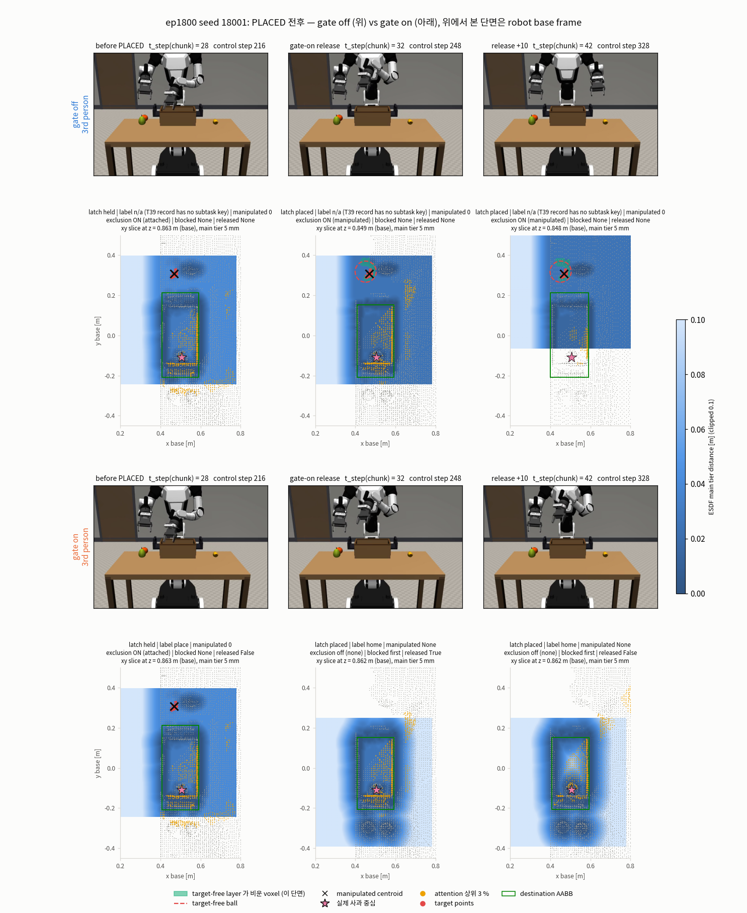

[`figures/subtask-d/subtask-d-scene-1800_s18001.png`](figures/subtask-d/subtask-d-scene-1800_s18001.png) — 실제 씬 (3rd person) + ESDF 의 xy 단면 (robot base frame, z ≈ 0.86 m 에서 위에서 본 5 mm main tier; coarse tier 는 안 그렸다). 위 세 줄이 gate off, 아래가 gate on; 열은 PLACED 직전 (chunk 28) · 해제 시점 (chunk 32) · 해제 + 10 chunk. ✕ 는 manipulated centroid, ★ 는 실제 사과 중심, 초록 사각형은 destination AABB. **gate off 는 PLACED 뒤에도 ✕ 가 crate 밖 탁자 쪽에 남고 target-free ball (붉은 점선) 이 그 자리를 비운다.** gate on 은 해제 시점부터 ✕ 가 없고 exclusion 이 꺼진다. (gate off 의 label 은 T39 기록에 `subtask` 키가 없어 "n/a" 로 표기된다.)

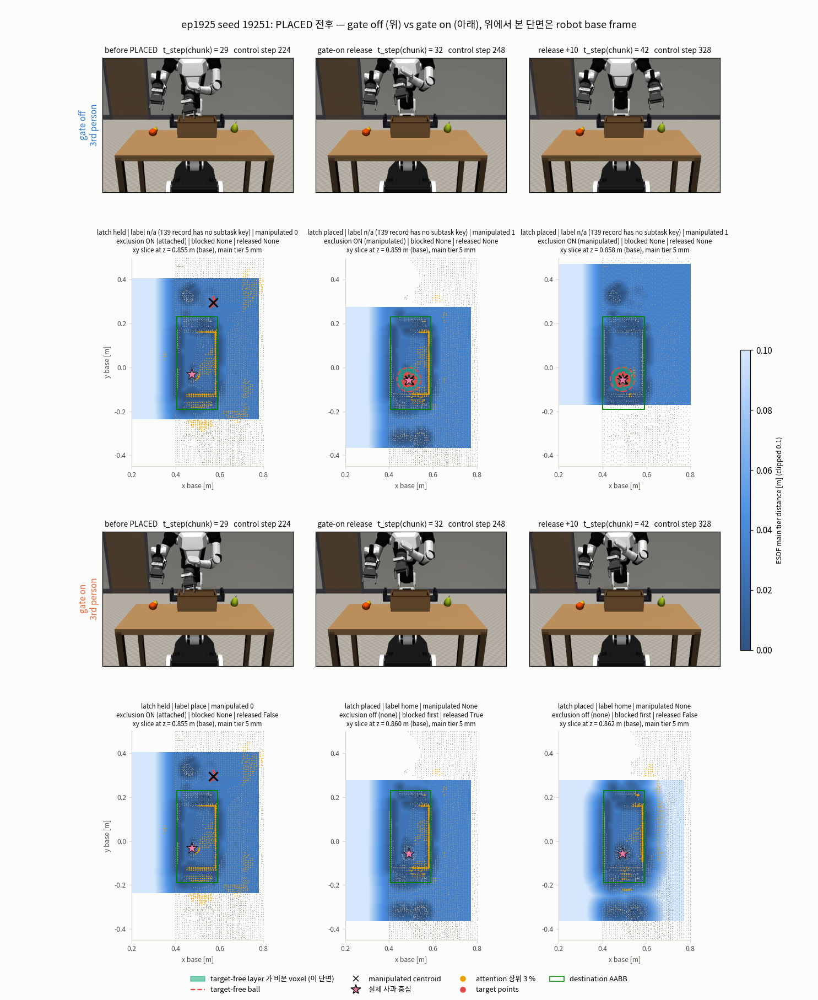

[`figures/subtask-d/subtask-d-scene-1925_s19251.png`](figures/subtask-d/subtask-d-scene-1925_s19251.png) — 실제 씬 + ESDF 단면, 같은 형식. 이 쌍은 gate off 에서 manipulated 가 새 id (1) 로 `switch` 된 예다.

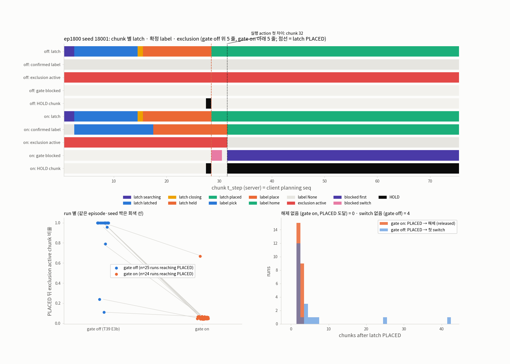

[`figures/subtask-d/subtask-d-timeline.png`](figures/subtask-d/subtask-d-timeline.png) — 그래프. 위: ep1800 s18001 의 chunk 별 latch · 확정 label · exclusion · gate blocked · HOLD (gate off 5 줄, gate on 5 줄; 점선 = latch PLACED). gate on 은 PLACED 에서 label 이 home 으로 바뀌고 (확정 chunk 32) exclusion 이 꺼지지만 **그 뒤 전 구간이 HOLD (검은 띠)** 다 — 이 pair 는 gate on HOLD 45 chunk (gate off 1 chunk). 아래 왼쪽: run 쌍마다 PLACED 뒤 exclusion active chunk 비율 (gate off 25 run, gate on 24 run). 아래 오른쪽: PLACED 뒤 첫 `switch` (gate off) 와 해제 (gate on) 까지의 chunk 수 히스토그램.

**두 시스템이 갈라지는 곳.** 쌍 48 개 중 6 쌍은 실행된 action 이 한 번도 다르지 않았다. 나머지 첫 차이 chunk 는 중앙값 34 (최소 24, 최대 75), **24 쌍은 PLACED 상태에서 PLACED + 2–3 chunk 에서** 갈린다 (해제 시점), 18 쌍은 LATCHED 상태에서 갈린다. 첫 차이 시점의 gate on 상태는 42 쌍 중 `switch` 를 막는 중 21 (label place 13 · home 8), 해제된 상태 19, 막지 않는 상태 2 (label pick · place 각 1) 이다. 첫 target 채택 chunk 는 48 쌍 모두 같고 (t = 1), 채택한 id 도 같다. 첫 HELD 이전의 결정은 43 / 48 쌍이 같다.

**성공률.** gate off 29 → on 28, 짝지은 2×2 는 둘 다 28 · off 만 1 · on 만 0 · 둘 다 아님 19, exact McNemar p = **1.0** (grasp · place 도 같다: off 만 1 · on 만 0). 갈린 한 쌍은 ep1828 s18281 이다.

**lead 의 첫 해석과 그 철회 (audit §11, 2026-10-03, 사용자 지적).** 결과를 처음 정리한 lead 는 문제를 둘로 보았다 — (1) 해제 뒤 uncertified HOLD, **(2) "PLACED 전 LATCHED 상태에서 label 이 place / home 으로 바뀌었다는 이유로 `switch` 를 막아 ep1828 을 잃었다"** (`V2_gate_blocked_before_placed`: 21 run · 191 chunk, 전부 `switch` · 전부 latch `LATCHED`, label place 66 · home 125). **(2) 는 틀렸다.** 기록을 다시 읽은 것이 audit §11 이고, 2026-10-04 `SUBTASK-extra.verify.json` 이 같은 기록에서 숫자를 다시 계산했다 (ep1828 s18281, gate off = T39 server_8226 · gate on = SUBTASK-d server_8232; 아래 `k` = server `t_step` − 1):

| 항목 | gate off (T39 E3b) | gate on (SUBTASK-d) |
|---|---|---|
| k = 14–26 | latch `closing` (파지 확인 전), manipulated id 0 = 사과 | 같다 (k 14–28 의 latch 상태 · manipulated id · centroid · decision mode · exclusion 은 두 쪽이 같다) |
| k = 27 부터 | latch `latched` | latch `latched`. 확정 label **place** 가 k = 26 부터 있고 `subtask_blocked = switch` 가 k = 27 부터 |
| **k = 29 (server t_step 30)** | **`switch`: manipulated 가 id 0 → id 1**. id 1 의 centroid (0.4644, −0.2989, 0.8526) m, **가장 가까운 물체는 바나나 (0.0119 m)**, **사과에서 0.627 m**, id 0 ↔ id 1 거리 **0.6229 m**. 사과 위치 (0.5633, 0.3204, 0.85) m | manipulated 는 id 0 (사과) 그대로, 사과와 0.0186 m, exclusion active — gate 가 그 교체를 막고 있다 |
| 이후 | k = 40 에 id 1 → id 2 로 다시 `switch`, k = 52 `closing` · k = 53 `held` · k = 65 `placed` | k = 31 에 확정 label 이 **home** 이 되지만 latch 는 아직 `latched` (PLACED 아님) 라 해제는 없다. k = 56 `closing`, k = 57 `held`, k = 59 `latched`, k = 60 `closing` (재파지 시도) |
| 사과의 에피소드 끝 위치 | crate 에서 xy 0.0506 m (최대 이동 0.4418 m) | 거의 안 움직임 — 최대 이동 0.0466 m, 끝에서 crate 에서 xy 0.3189 m |

즉 chunk 30 (server t_step 30) 에서 **gate off 는 manipulated 를 사과에서 탁자 반대편의 다른 물체 (바나나) 로 바꿨고, gate on 은 그 교체를 막아 사과를 계속 carving 했다.** 이것은 사용자 원칙 — *"쥐기 전 + place 면 사과는 이미 지워져 있고, 바구니는 안 지운다"* — 그대로의 동작이다. 불일치 한 쌍은 그 뒤 **재파지 결과가 갈린 것** (gate on 의 사과는 끝까지 crate 에 닿지 않았다; 원인은 이 기록으로 가르지 않았다) 이다. 그래서 (2) 와 그에 딸린 제안 ("HELD 이후에만 막기") 은 철회되었고, 남은 수정은 문제 (1) 하나다.
(SUBTASK-d 의 `verify.json` 이 가진 같은 pair 의 숫자: 첫 판정 차이 chunk 30, gate 가 처음 막은 chunk 28, 첫 HELD chunk 58, 막은 `switch` 11 chunk, gate off 쪽 PLACED chunk 66 · gate on 은 PLACED 없음. 이 chunk 번호들은 server `t_step` 이고 SUBTASK-extra 의 `k` 는 그보다 1 작다.)

**문제 (1) — 해제 뒤 uncertified HOLD.** 해제 뒤 984 chunk 전부가 HOLD 이고 kind 는 `uncertified` 다 (grounding `subtask_gated` 983). gate 가 일부러 target 을 비웠는데 파이프라인이 그것을 "target 을 못 찾음 (`no_target`)" 으로 읽어 **기하가 인증되지 않았다**고 보고 막은 것이다 (`SUBTASK-e.impl.md` 의 코드 추적: 판정을 내리는 곳이 `_scene_fn` → SQP 의 `status = VIOLATED`, `_verdict` → `uncertified` 둘이었다). 결과로 로봇은 해제 뒤 그 자리에 멈춘다 — HOLD (`--safe-hold-mode fixed`) 는 `q_hold` 를 유지하기 때문이다 (다음 절의 자세 측정).

### 7. SUBTASK-e — gate 가 비운 target 은 인증한다 (2026-10-03, 구현 05:02 · 검증 05:17–06:28)

**구현 (`SUBTASK-e.impl.md`).** 판정 술어 하나 `subtask_no_target(cs)` 를 `ag3s/types.py` 에 두고 (grounding `subtask_gated` ∧ validity `valid` ∧ **carve 가 하나도 없음** — `target` · `manipulated` · `attached` · `target_field_exclude` · `manipulated_link_margin` 이 None, `metrics["manipulated"]` 가 None, exclusion 기록이 있고 `source = none` · `active = False`) `safe_policy.geometry_certified(cs)` = `status == "ok"` ∨ `subtask_no_target(cs)` 로 HOLD 를 만드는 세 곳 (`_scene_fn` → SQP, `_verdict` / `_reasons`, `bringup.LivePipeline.scene_fn`) 이 같은 술어를 읽게 했다. 실행되는 chunk 에는 사유 kind `subtask_no_target` (처리 = `execute`) 를 붙여 "target 이 없는데 왜 실행했나" 가 응답 · 서버 로그 · `summary_json.verdict.reasons` 에 남는다. 상태는 `no_target` 그대로 두었다 (다른 소비자가 "target 이 있다" 로 읽는 것을 건드리지 않으려고). 못 읽는 필드는 인증하지 않는다 (fail closed). 새 kind 를 모르는 client 는 HOLD 하므로 **client 쪽 `wire.py` 도 갱신해야 한다** (local PC 의 client 갱신 필요). 단위 테스트 결과는 [`SUBTASK-e.impl.md`](handoff/SUBTASK-e.impl.md).

**검증 (verifier).** snapshot `/mnt/dev/work-se` (main `7098e69`, 코드 변경 `a7994c0`), gate on 48 run, 서버 4 개 병렬. pytest **1,958 passed / 2 skipped / 0 failed**, baseline 일치, gate off 두 run 이 T39 와도 SUBTASK-d V0 와도 실행 · planning action 이 같다.

**gate on 의 수정 전 (d) 대 후 (e) 대 gate off — 해제 뒤 984 chunk.**

| 항목 | d (수정 전) | **e (수정 후)** | gate off |
|---|---|---|---|
| HOLD chunk | 984 | **232** | — (해제 없음) |
| `subtask_no_target` 로 실행한 chunk · run | — | **752 · 24** (전부 실행, HOLD 0) | — |
| HOLD 의 grounding status | `subtask_gated` 983 · `no_admissible` 1 | **`no_admissible` 232** | — |
| clearance 최솟값 (mm) | −1.409 (음수 2 chunk) | **+0.150** (음수 0) | — |
| 왼팔 마지막 자세 → 준비 자세, 중앙값 (rad) | **1.154** | **0.113** | 0.115 |
| 왼팔 마지막 자세 → 준비 자세, p95 (rad) | 1.886 | 0.561 | 0.424 |
| 왼팔 EE 이동 (마지막 자세, 중앙값, mm) | 311.8 | 25.1 | 25.0 |
| 해제 뒤 MuJoCo 접촉 (dist < 0) | 0 | 0 | 0 |

(자세 지표: `traj.npz` 의 `measured_qpos[0]` — warm-up 1,000 step 뒤의 16-D 관절값 — 을 "준비 자세" 로 놓고 왼팔 관절 7 개의 L2 거리를 쟀다. 코드에 별도의 준비 자세 정의는 없다. 해제 chunk 의 거리는 d 중앙값 1.157 rad, e 1.150 rad 로 같다 — 즉 돌아오는 것은 해제 뒤다. 충돌은 기록된 qpos 를 MuJoCo 로 kinematic 재생해 dist < 0 인 접촉을 세었고 접촉력은 재지 않았다.)

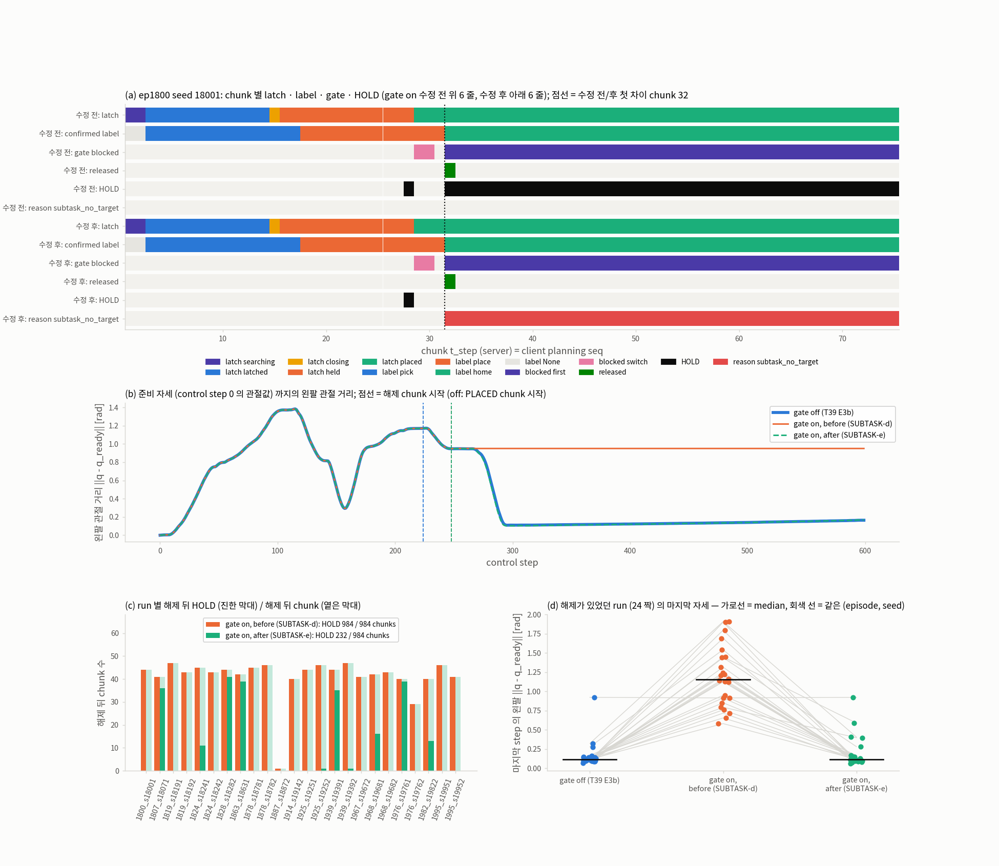

[`figures/subtask-e/subtask-e-timeline.png`](figures/subtask-e/subtask-e-timeline.png) — 그래프. (a) ep1800 s18001 의 chunk 별 latch · label · gate blocked · released · HOLD · reason `subtask_no_target` (수정 전 위, 수정 후 아래; 점선 = 수정 전 / 후 첫 차이 chunk 32). 수정 후는 해제 뒤 HOLD 가 없고 `subtask_no_target` 가 이어진다. (b) 왼팔 관절의 준비 자세 거리 대 control step (gate off · d · e). **d 는 해제 뒤 0.950 rad 에 멈추고, e 와 gate off 는 0.167 · 0.164 rad (마지막 자세) 로 내려간다.** (c) run 별 해제 뒤 HOLD (d 984 chunk 대 e 232). (d) 해제 24 쌍의 마지막 자세 (회색 선 = 같은 episode · seed).

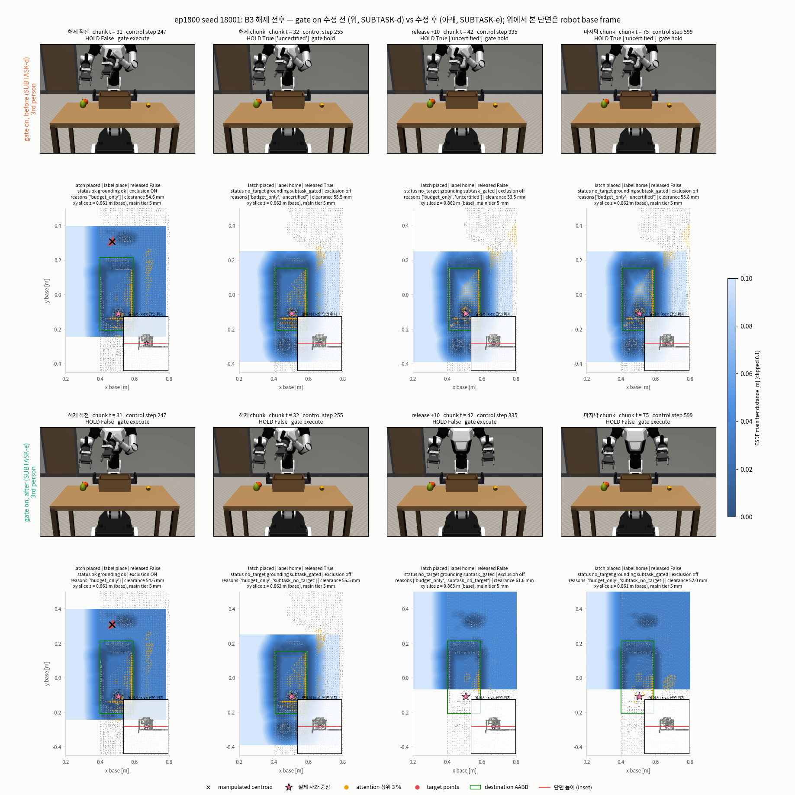

[`figures/subtask-e/subtask-e-scene-1800_s18001.png`](figures/subtask-e/subtask-e-scene-1800_s18001.png) — 실제 씬 + ESDF xy 단면 (같은 형식; 위 = 수정 전 d, 아래 = 수정 후 e; 열 = 해제 직전 chunk 31 · 해제 chunk 32 · +10 · 마지막 chunk 75). 수정 전은 chunk 32 부터 `HOLD True ['uncertified']` 이고 3rd person 에서 왼팔이 올라간 채로 있으며, 수정 후는 `HOLD False` · reasons 에 `subtask_no_target` 가 붙고 chunk 42 · 75 에서 팔이 내려와 있다. 단면에서 ✕ (manipulated) 는 해제와 함께 사라진다.

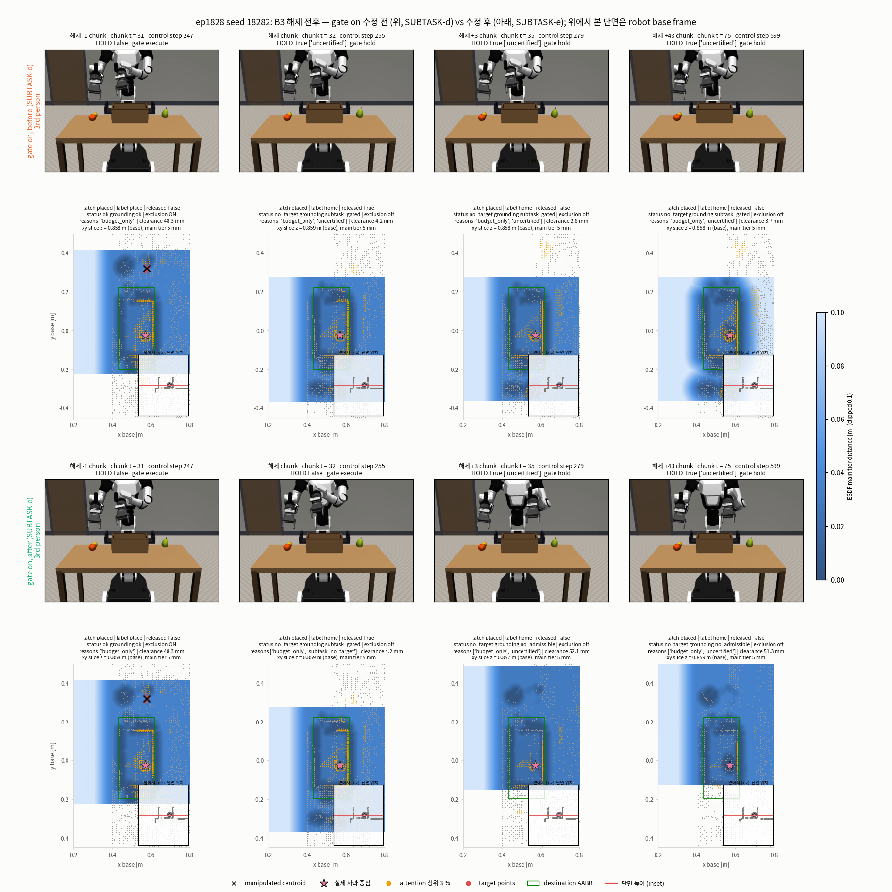

[`figures/subtask-e/subtask-e-scene-1828_s18282.png`](figures/subtask-e/subtask-e-scene-1828_s18282.png) — 실제 씬 + ESDF 단면. 남은 HOLD 가 있는 쌍 (grounding `no_admissible`) 의 수정 전 / 후.

**일치 · 성공.**

- **e 와 d 는 해제 전까지 같다.** 48 / 48 쌍이 d 의 첫 `uncertified` HOLD (grounding `subtask_gated`) 이전에는 같고, 해제가 있는 24 쌍의 첫 차이는 그 chunk 에서 (차 0 chunk) 정확히 시작한다. 해제가 없는 24 쌍은 끝까지 완전히 같다. 달라진 결정 항목은 처음 갈리는 곳에서 `to_status` (trajectory optimizer 의 status) 뿐이다.
- 성공은 28 / 48 로 d 와 쌍으로 같다 (둘 다 28 · 둘 다 아님 20 · 어느 한쪽만 0, p = 1.0). gate off 대비는 off 만 1 (ep1828 s18281) · p = 1.0.

**남은 232 chunk — `no_admissible`.** HOLD 가 남은 run 은 10 개 (해제 뒤 모든 HOLD 가 grounding `no_admissible` · kind `uncertified`): 놓은 뒤 팔이 올라가 장면에 **바구니 (crate) 만 보이는** 프레임이다. 보이는 cluster 가 있는데 전부 admissibility 를 통과하지 못해 target 이 없는 것이다 (바구니는 너무 커서 manipulated 가 못 된다).

| run | 해제 chunk | 해제 뒤 `no_admissible` chunk | 처음 chunk |
|---|---|---|---|
| ep1807 s18071 | 35 | 36 | 40 |
| ep1824 s18241 | 31 | 11 | 37 |
| ep1828 s18282 | 32 | 41 | 35 |
| ep1863 s18631 | 34 | 39 | 36 |
| ep1925 s19252 | 30 | 1 | 32 |
| ep1939 s19391 | 32 | 35 | 41 |
| ep1939 s19392 | 29 | 1 | 65 |
| ep1968 s19681 | 34 | 16 | 38 |
| ep1976 s19761 | 36 | 39 | 36 |
| ep1982 s19822 | 36 | 13 | 39 |
| **합계** | | **232** | |

(`no_admissible_after_release_on_e` 의 run · chunk 와 SUBTASK-f 의 `changed_runs_table` 의 e 열에서.) gate off 에도 PLACED 뒤 `uncertified` HOLD 가 86 chunk 있고 grounding 은 전부 `no_admissible` 이다 (4 run) — 같은 종류다. 이 HOLD 는 run 끝까지 이어지기도 한다: "t = 75 에서 HOLD · 그 구간 grounding 이 전부 `no_admissible`" 로 정의하면 e 는 7 run (gate off 는 2 run). 이 정의는 SUBTASK-f 의 verifier 가 쓴 것이고, SUBTASK-e 직후 lead 의 보고 (4 run: ep1807 s18071 · ep1828 s18282 · ep1863 s18631 · ep1939 s19391) 는 이 정의로 재현되지 않는다.

### 8. SUBTASK-f — 놓은 뒤 home 이면 `no_admissible` 도 인증한다 (2026-10-03, 구현 11:44 · 검증 12:07–13:45)

**구현 (`SUBTASK-f.impl.md`).** SUBTASK-e 의 인증 술어에 **갈래 하나** 를 더했다: grounding 이 `no_admissible` 이어도 `metrics["subtask"]` 가 **`gate is True` ∧ 확정 label `home` ∧ `placed_seen is True`** 라고 말하면 `subtask_gated` 와 같이 인증된 기하로 본다. 나머지 조건 (`status == no_target` · validity `valid` · carve 다섯 필드 None · manipulated identity None · exclusion `source = none`) 은 한 글자도 바꾸지 않았다. 정확한 값만 통과한다 (`1` · `"true"` · `None` · `"HOME"` 은 거절). grounding 상태는 다시 쓰지 않고 evidence 의 `grounding_status` 가 둘을 가른다. **`released` 는 조건에 넣지 않았다** — 해제된 적 없이 (처음부터 adopt 하지 않은 채) PLACED 에 간 episode 도 이 칸에 든다 (carve 는 없다). pipeline 에서 exclusion gate 가 manipulated 를 거절해 생기는 `no_admissible` 은 manipulated identity 가 살아 있어 인증되지 않는다 (테스트 (vii)). **client 갱신은 필요 없다** (`REASON_KINDS` · `GATE_DEFAULT` 는 e 에서 이미 등록). 단위 테스트 결과 (새 `test_subtask_no_admissible_home.py`, SUBTASK-e 테스트에서 의도적으로 바꾼 기대값 두 줄 포함) 는 [`SUBTASK-f.impl.md`](handoff/SUBTASK-f.impl.md).

**검증 (verifier).** snapshot `/mnt/dev/work-sf` (main `af168a8`, 코드 변경 `ce92fd1`), gate on 48 run, 서버 4 개 병렬. pytest **2,018 passed / 2 skipped / 0 failed**, baseline 일치, gate off 두 run 이 T39 와도 SUBTASK-e V0 와도 같다.

**실행 중 사고.** 2026-10-03 12:21, pod 의 memory cgroup (80 GiB, 전 세션 공용) 이 **다른 세션의 CPU 프로세스 (T40 `search.py`, 51 개 × 약 1.5 GB)** 로 차서 OOM 이 났고 서버 8231–8233 이 죽었다 (8234 는 기동 중에 죽음). 진행 중이던 run 3 개 (ep1863 s18631 · ep1828 s18281 · ep1807 s18071) 는 `failed/` 로 옮기고 다시 돌렸다. 잘린 chunk 파일 2 개는 분석에서 건너뛰었고 (`BadZipFile`), 이 세 seed 는 서버 기록에 같은 seed 의 segment 가 둘이라 분석이 `policy_seed.applied` 로 맞는 쪽을 골랐다. 분석은 run 마다 `policy_seed.applied` 가 그 run 의 seed 와 같은 segment 를 쓴다 (분석 정의). 이 사고가 결과에 준 영향은 따로 재지 않았다.

**e 대 f.**

| 항목 | e | **f** |
|---|---|---|
| 해제 뒤 HOLD (984 chunk 중) | 232 (10 run) | **28 (1 run)** |
| 해제 뒤 grounding status | `subtask_gated` 752 · `no_admissible` 232 | `subtask_gated` 752 · **`no_admissible` 204 (모두 execute)** · `no_seed` 28 (모두 HOLD) |
| `subtask_no_target` 로 실행한 chunk | 752 | **956** |
| HOLD chunk 총수 · run | 446 · 24 | **242 · 16** |
| 끝까지 `no_admissible` 로 HOLD 인 run | 7 | **0** |
| 새로 실행된 `no_admissible` chunk 204 의 clearance 최솟값 (mm) | — | **+19.02** (음수 0) |
| 그 204 chunk (10 run, control step 1,632 개) 의 MuJoCo 접촉 | — | **0** (apple · crate · table · 다른 과일 · 기타 모두) |
| 왼팔 마지막 자세 → 준비 자세 p95 (rad, 해제 24 run) | 0.561 | **0.164** |
| 왼팔 마지막 자세 → 준비 자세 중앙값 (rad) | 0.113 | 0.109 |
| success / grasp / place | 28 / 34 / 28 | 28 / 34 / 28 (e 와 쌍으로 같다, p = 1.0) |

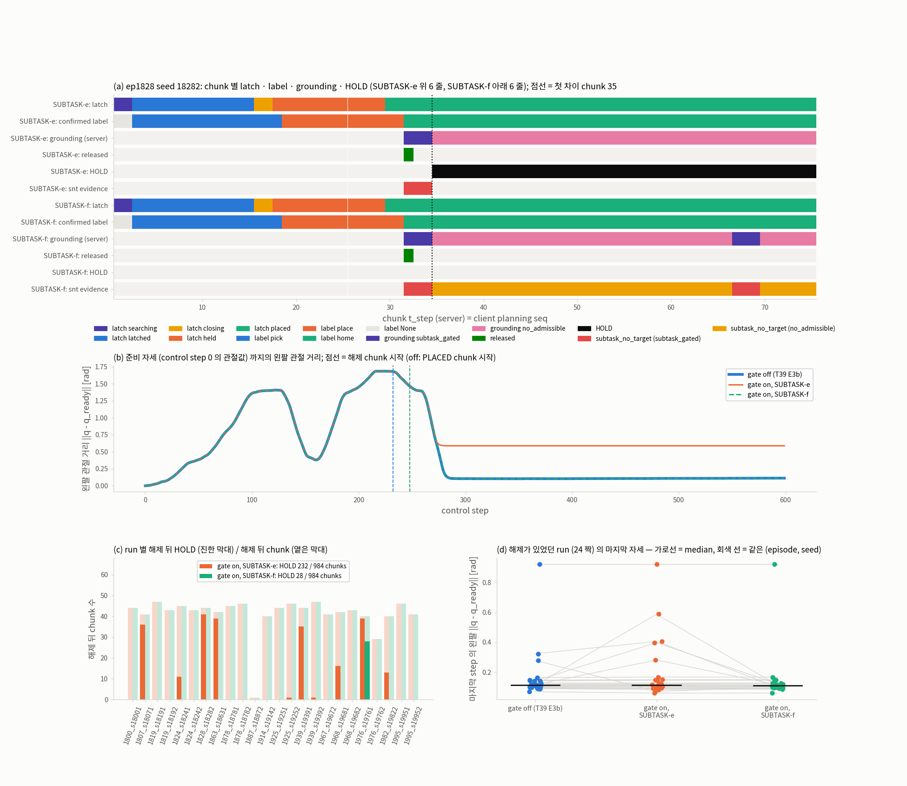

[`figures/subtask-f/subtask-f-timeline.png`](figures/subtask-f/subtask-f-timeline.png) — 그래프. (a) ep1828 s18282 의 chunk 별 latch · label · grounding · released · HOLD · `subtask_no_target` evidence (e 위 6 줄, f 아래 6 줄; 점선 = 첫 차이 chunk 35). e 는 chunk 35 부터 HOLD (검은 띠) 로 끝까지 가고 f 는 HOLD 가 없다 — grounding 은 `no_admissible` 인 채 `subtask_no_target (no_admissible)` evidence 로 실행된다. (b) 왼팔 준비 자세 거리 대 control step (gate off · e · f). 이 쌍에서 e 는 0.588 rad 에 멈추고 (마지막 자세) f 는 0.112 rad 로 gate off 와 같은 곡선이다. (c) run 별 해제 뒤 HOLD (e 232 대 f 28). (d) 해제 24 쌍의 마지막 자세 — e 에서 위로 튀던 점이 f 에서는 한 점 (0.92 rad 근처, 세 조건에서 같은 run) 을 빼고 내려온다.

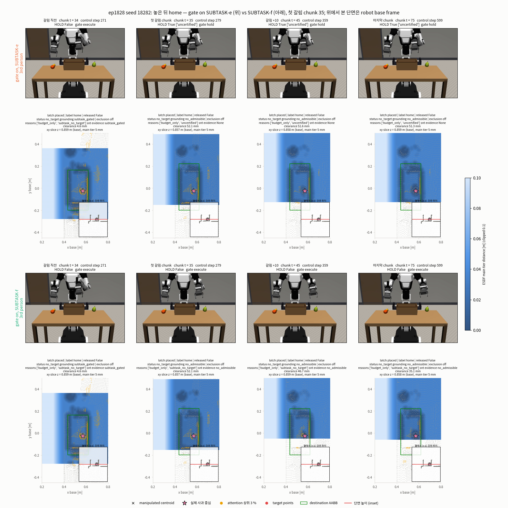

[`figures/subtask-f/subtask-f-scene-1828_s18282.png`](figures/subtask-f/subtask-f-scene-1828_s18282.png) — 실제 씬 + ESDF xy 단면 (위 = e, 아래 = f; 열 = 첫 차이 직전 chunk 34 · 첫 차이 chunk 35 · +10 · 마지막 chunk 75). e 는 chunk 35 부터 `HOLD True ['uncertified']` 로 팔이 crate 위에 서 있고, f 는 `HOLD False` · reasons `['budget_only', 'subtask_no_target']` 로 팔이 내려와 있다. 두 줄 모두 단면에는 ✕ (manipulated) 가 없고 exclusion off.

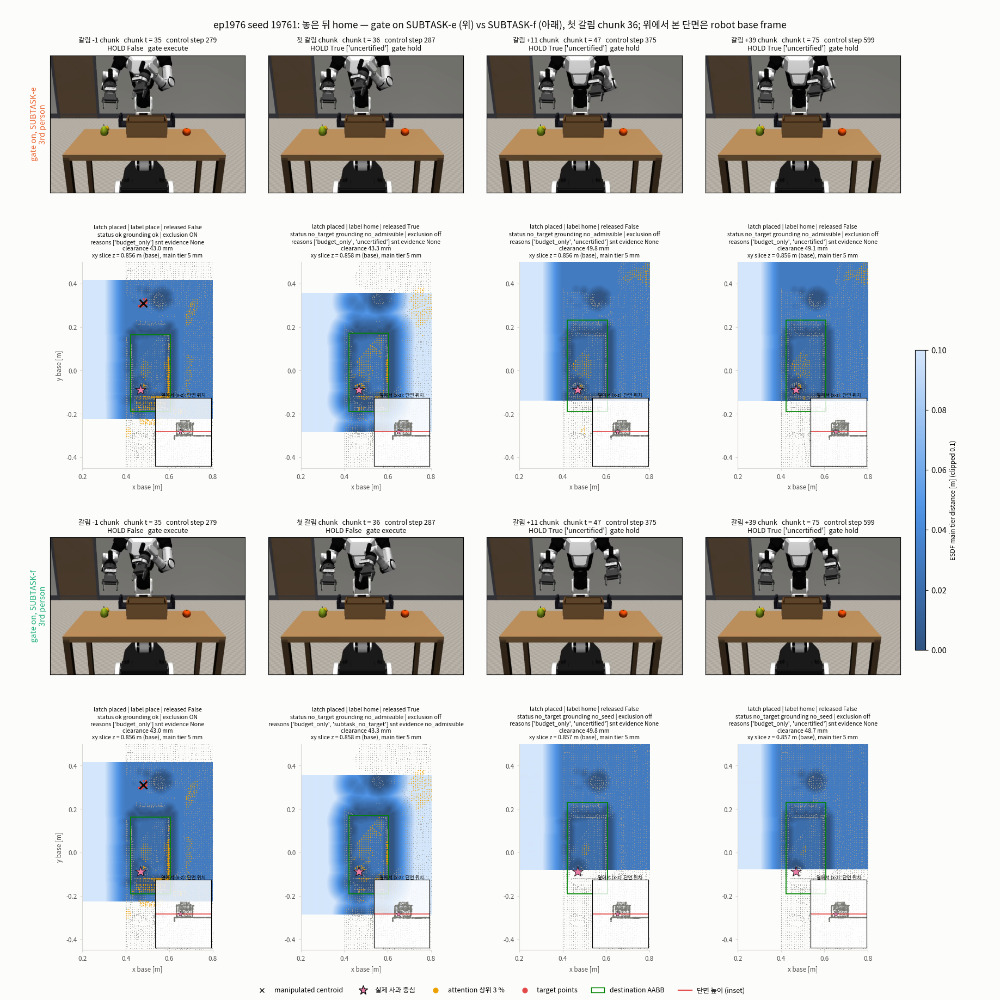

[`figures/subtask-f/subtask-f-scene-1976_s19761.png`](figures/subtask-f/subtask-f-scene-1976_s19761.png) — 실제 씬 + ESDF xy 단면 (같은 형식; 첫 차이 chunk 36). f 의 마지막 두 열은 **`HOLD True ['uncertified']`, grounding `no_seed`** 다 — 남은 28 chunk 가 이 run (ep1976 s19761) 이다.

**f 가 바꾼 것은 정확히 e 의 `no_admissible` HOLD 자리다.**

- 완전히 같은 쌍 38 개. 다른 10 쌍은 모두 **e 의 첫 `no_admissible` HOLD chunk (`t_na_e`) 이전까지 같고, 그 chunk 에서 처음 갈린다** (차 0 chunk 10 / 10). 그 chunk 에서 e 는 `no_admissible` · `uncertified` · gate hold, label `home`, `placed_seen` True 이고 f 는 새로 인증된 chunk 다 (10 / 10). 첫 갈림에서 서버 결정의 달라진 항목은 `to_status` 뿐이다.
- 10 run 의 해제 뒤 HOLD 변화 (e → f): ep1807 s18071 36 → 0 · ep1824 s18241 11 → 0 · ep1828 s18282 41 → 0 · ep1863 s18631 39 → 0 · ep1925 s19252 1 → 0 · ep1939 s19391 35 → 0 · ep1939 s19392 1 → 0 · ep1968 s19681 16 → 0 · **ep1976 s19761 39 → 28** · ep1982 s19822 13 → 0. 10 run 모두 gate off · e · f 에서 success 다.
- 새로 실행된 `no_admissible` chunk (run 별): 28 · 31 · 38 · 40 · 1 · 35 · 2 · 1 · 12 · 16 (합 204).

**남은 HOLD 28 chunk — ep1976 s19761, `no_seed`.** 이 run 은 f 에서 chunk 36 부터 12 chunk (마지막 chunk 71) 가 새로 인증되어 실행되었다. 해제 뒤 HOLD 28 chunk 는 grounding 이 `no_admissible` 이 아니라 **`no_seed`** (attention 이 seed 를 못 고름) 이고, 그것은 인증되지 않아 HOLD 다 (kind `uncertified`; `verify.json` 이 위치를 주는 것은 마지막 연속 구간 4 chunk, t = 72–75 뿐이다). **왜 `no_seed` 가 되었는지는 이 기록으로 가리지 못했다 (미측정).**

**사용자 판정 (2026-10-04, `SESSION_STATE.md` 의 2026-10-04 행에 기록됨): 남은 `no_seed` HOLD 는 그대로 둔다.**

### 9. SUBTASK-g — gate 를 기본 on 으로 (사용자 판정 2026-10-04, 검증 06:11–06:30)

**사용자 판정 (2026-10-04, `SESSION_STATE.md` 의 2026-10-04 행): subtask gate 를 기본 on 으로 한다.** 앞 절들의 gate on 수치는 모두 `--subtask-gate` 를 명시한 실행이었다. 이 절은 그 flag 없이 서버를 띄운 실행이 명시한 실행과 같은지, 끌 수 있는지를 확인한 것이다.

**구현 (`SUBTASK-g.impl.md`).**

| 항목 | 내용 |
|---|---|
| config 기본 | `clustering.subtask_gate` 가 `True` |
| `serve_safe` flag | 플래그 없음 = gate on. **`--no-subtask-gate` 로 끈다.** `--subtask-gate` 는 호환용으로 남아 있고 (받으면 on) 두 flag 를 같이 주면 argparse 가 거절한다 |
| label 이 오지 않는 모드 (`--no-safe` · `--no-attention` · `--no-perception`) | 기본 on 이면 **오류 대신 gate 를 끄고 기동 로그에 한 줄** (`subtask gate: off (…)`). 사용자가 `--subtask-gate` 를 **명시** 했으면 SUBTASK-c 처럼 오류 |
| 서버 → AG3S | `build_ag3s` 에 넘기는 gate 는 항상 bool 이고 config 에 켜든 끄든 명시적으로 실린다 (서버가 config 기본값에 기대지 않는다) |
| in-process (`bringup.build_live_pipeline`) · offline replay | config 기본을 따르므로 이제 gate on. 이 경로의 정책은 `subtask` 를 싣지 않아 label 이 늘 None 이고, label None 이면 gate on 의 결정이 gate off 와 같다고 구현자의 테스트가 보인다 (달라지는 것은 기록 필드 `metrics["subtask"]["gate"]` 뿐; 테스트 결과는 `SUBTASK-g.impl.md`) |
| **호환** | 옛 launch 명령 중 `--subtask-gate` 없이 띄운 것은 이제 gate on 이다. **T39 E3b (gate off) 와 같은 조건은 `--no-subtask-gate` 가 필요하다.** local client (`pi05_infer.py`) 갱신은 필요 없다 (wire 형식 · `REASON_KINDS` · `GATE_DEFAULT` 불변) |

**검증 (verifier).** snapshot `/mnt/dev/work-sg` (main `bf65756`, 불변 사본). 서버 하나씩 (동시 1 개), 두 run (ep1807 s18071 · ep1800 s18001), 조건 둘: **E3bD** = E3b 서버 flag 에 gate flag 를 주지 않음, **E3bN** = E3b + `--no-subtask-gate`.

**(1) 기준선 (offline, label 없음).**

| baseline | 위반으로 시작 · `has_target` · frame0 `clearance_before` | 기대값과 | sha1 이 SUBTASK-f 와 |
|---|---|---|---|
| legacy | 14 / 15 · 15 / 15 · −29.031048280806342 mm | 일치 | 같음 |
| cuRobo | 10 / 15 · 15 / 15 · −9.171877401271193 mm | 일치 | 같음 |

SUBTASK-f 와 달라진 frame leaf 는 시간 항목 (`ag3s_ms` · `to_ms`, 각 15 frame) 뿐이다.

**(2) flag 해석 (모델 없이 snapshot 의 parser · 해석 함수로).**

| flag | 결과 | 해석된 gate | 기동 로그 |
|---|---|---|---|
| 없음 | 기동 | **on** | — |
| `--no-subtask-gate` | 기동 | off | — |
| `--subtask-gate` | 기동 | on | — |
| `--no-attention` · `--no-safe` · `--no-perception` | 기동 | off | `subtask gate: off (<flag> — subtask label 이 오지 않으므로 기본 on 인 gate 를 끈다 …)` |
| `--subtask-gate --no-attention` | **거절** | — | — |
| `--no-subtask-gate --no-attention` | 기동 | off | — |
| `--subtask-gate --no-subtask-gate` | **거절** | — | — |

`--no-attention` · `--no-safe` · `--no-perception` 서버는 모델과 함께 띄우지 않았고 해석 함수로만 확인했다.

**(3) 띄운 서버의 기동 로그와 기록.** 플래그 없음: `subtask label: probe kv_L4_v1 (shipped asset) · gate ON (place/home → 새 조작 대상 없음 · PLACED 뒤 home → 해제)`, chunk summary 의 `subtask.gate` 가 150 / 150 chunk 에서 true. `--no-subtask-gate`: `… · gate off (기록만)`, 150 / 150 chunk 에서 false.

**(4) closed loop — 2 run × 2 조건, 기준 run 과 같은 episode · seed.**

| 새 run | 기준 | 실행된 action · planning action | 결정 항목의 차이 | S / G / P | HOLD chunk (기준 · 새) |
|---|---|---|---|---|---|
| E3bD ep1807 s18071 | SUBTASK-f gate on | 같음 | 14 항목 모두 0 chunk | 모두 성공 | 0 · 0 |
| E3bD ep1800 s18001 | SUBTASK-f gate on | 같음 | 14 항목 모두 0 chunk | 모두 성공 | 1 · 1 |
| E3bN ep1807 s18071 | T39 E3b (gate off) | 같음 | `subtask.*` 를 뺀 항목 0 chunk | 모두 성공 | 0 · 0 |
| E3bN ep1800 s18001 | T39 E3b (gate off) | 같음 | `subtask.*` 를 뺀 항목 0 chunk | 모두 성공 | 1 · 1 |
| E3bN ep1807 s18071 | SUBTASK-f V0 (gate off) | 같음 | 14 항목 모두 0 chunk | 모두 성공 | 0 · 0 |
| E3bN ep1800 s18001 | SUBTASK-f V0 (gate off) | 같음 | 14 항목 모두 0 chunk | 모두 성공 | 1 · 1 |

(14 항목 = status · validity · grounding_status · has_target · verdict_reasons · grasp.state · manipulated.id · exclusion · admissibility.decision.mode 와 `subtask.gate` · `.label` · `.blocked` · `.released` · `.placed_seen`. T39 E3b 의 서버 기록에는 `subtask` 키가 없어 `subtask.*` 가 다를 수밖에 없다 — `subtask.gate` 가 75 chunk 모두 null 대 false. 이 두 run 에서 gate on 은 `released` 1 chunk 씩, `blocked` 가 ep1807 14 chunk · ep1800 46 chunk 있다 — gate 가 실제로 일한 run 이다.)

verifier 가 돌린 gate 관련 pytest 다섯 파일: **316 passed / 1 skipped / 0 failed** (132.3 s). 전체 `tests/trajopt tests/ag3s` 회귀는 구현자의 결과 (`SUBTASK-g.impl.md`).

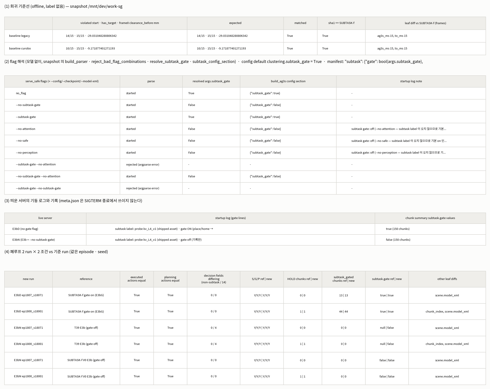

[`figures/subtask-g/subtask-g-table.png`](figures/subtask-g/subtask-g-table.png) — 표. 위 (1) 기준선 · (2) flag 해석 · (3) 기동 로그 · (4) closed loop 를 한 장에 모은 것.

**읽는 법과 한계.** 확인된 것은 *설정 경로가 의도대로다* (flag 없음 = 명시한 `--subtask-gate`, `--no-subtask-gate` = T39 E3b) 는 것이고, 확인한 run 은 2 개다. 앞 절의 48 쌍을 기본 on 으로 다시 돌린 것이 아니다 (같은 config 가 실려 같은 동작이 나온다는 구현자의 기대를 두 run 이 지지한다). 미측정: 서버 `meta.json` 의 `subtask.gate` 는 SIGTERM 종료 때 디스크에 쓰이지 않는다 (`close()` 에서만 기록; SUBTASK-f 도 같다) — 값은 flag 해석과 chunk 별 `subtask.gate` 로 확인했다. 시간 항목은 비교하지 않았다. 장면 · 그래프 figure 는 만들지 않았다.

### 10. 아직 모르는 것 (`not_measured` 와 이 절에서 드러난 것)

| 항목 | 상태 |
|---|---|
| **gate 기본값** | **결정 · 구현 · 검증 끝.** 사용자 판정 (2026-10-04) 으로 기본 on, `--no-subtask-gate` 로 끈다 (§9 SUBTASK-g). 단 §6–§8 의 48 쌍 closed loop 는 `--subtask-gate` 를 명시한 실행이고, 기본 on 으로 다시 돌린 48 쌍은 없다 (확인한 것은 2 run 의 비트 동일) |
| **gate off 는 놓은 뒤 엉뚱한 곳을 carving 한다** | **측정됨** (§6 표: PLACED 뒤 965 / 1,051 chunk 의 carving 중 543 chunk 는 가장 가까운 물체가 다른 과일, 21 / 25 run 에서 `switch`). 단 그 carving 이 **충돌 · 성공에 미친 영향은 미측정** — 성공률은 29 대 28, p = 1.0 이고 짝 하나의 차이는 재파지 결과 (원인 미측정) |
| **크기로 안 갈리는 목적지에서 place 중에도 target 을 지울 수 있다** | **미측정.** 이 task 의 crate 는 크기로 갈려 place 중에도 지워지지 않으므로 여기서는 재현되지 않는다. bowl · plate · 쌓기 · 건네기 씬으로 측정한 적이 없다 (§1 의 논리는 코드를 읽은 것) |
| probe 가 rule (gripper) 을 이기는가 | **미측정.** closed-loop 참값이 gripper 정의라 rule 이 정의상 1.000 이다. "gripper 는 닫혔는데 사과가 손에 없는" 미끄러짐 run 은 policy image 가 저장되지 않아 쟀다 못 했다 (SUBTASK-b 한계 2). 그런 run 에서 label 이 어떻게 나오는지도 미측정 |
| held-out closed-loop 표본 | probe 의 held-out closed-loop 은 ep1807 하나 (SUBTASK-b 한계 3). gate on 의 closed loop 는 24 episode × 2 seed 지만 **gate 가 성공률을 올리지는 않았다** (28 / 48, off 29 / 48, p = 1.0). 이 task 에서 gate 의 쓰임은 성공률이 아니라 carving 의 정합성이라는 것은 lead 의 판단이고 (audit §9: 이 과제에서는 거의 바뀌는 것이 없다 — 일반성과 거짓 attach 교차검증이 가치) 측정으로 가른 것이 아니다 |
| label 의 늦은 전환 | 확정 label 이 place 가 되기까지 (첫 HELD 부터) 0–6 chunk (0 → 1 run · 1 → 17 · 2 → 13 · 3 → 9 · 4 → 1 · 5 → 2 · 6 → 2), home 은 PLACED 뒤 2–3 chunk (2 → 15 run · 3 → 9). **PLACED 전에 home 이 확정된 run 이 1 개 있다** (그래서 B3 가 PLACED 를 요구한다) |
| 해제 뒤 팔이 준비 자세로 돌아가는 속도 | 마지막 자세만 비교했다. "돌아가는 데 걸린 시간" 은 재지 않았다 (경로 길이 `L_path_rad_from_ref` 만 있다) |
| chunk 시간의 gate on 대 off 비교 | **안 했다.** V1 은 서버 4 개를 동시에 돌렸고 T39 S2-2 는 서버 4 개 (E3b 2 · E0 2) 였다. 부하가 달라 짝지을 수 없다 (SUBTASK-f 는 다른 세션의 CPU 작업도 겹쳤다) |
| gate off 의 label × latch · 전환 지연 · `would_block` | T39 의 gate off 서버 기록에는 `subtask` 키가 없다 (`o1-eval` 코드). 이 항목들은 gate on 48 run 과 V0 의 gate off 2 run 에만 있다 |
| 두 번째 물체를 쥐는 과제 | `placed_seen` 은 episode 동안 sticky 이고 latch 는 PLACED 에서 다시 잠그지 않는다 (`grasp_latch.py:516`). 한 episode 에서 두 번째 물체를 쥐는 과제가 생기면 B3 · f 의 조건을 다시 봐야 한다 (`SUBTASK-c.impl.md` 의 "남은 위험") |
| legacy latch (`evidence = False`) | PLACED 가 AG3S 에 한 요청 늦게 닿는다 (`SUBTASK-c.impl.md` 의 "남은 위험"). 기본 (evidence) 은 같은 요청이다 |
| 준비 자세의 정의 | 코드에 별도 정의가 없어 control step 0 (warm-up 뒤) 의 16-D 관절값을 썼다 |
| 충돌 판정 | 기록된 qpos 의 kinematic 재생에서 dist < 0 접촉을 센 것 + 서버의 `clearance_min_mm` 이다. 접촉력은 재지 않았다 |
| KV cache decoding 의 지연 | **미측정** (SUBTASK (a) 는 naive decoding 만) |
| 로컬 PC (MuJoCo) 실행 | 모든 closed loop 는 서버에서 headless 로 돌렸다 (client 도 같은 서버). local PC 의 실기 client 는 이 측정에 없다 |

### 되돌아올 지점 — 고르지 않은 선택지와 전환 신호

| 안 고른 것 | 왜 안 골랐나 | 되돌아올 신호 (**scribe 가 위 한계에서 도출한 것이며 사용자 판정이 아니다**) |
|---|---|---|
| **A** zero-shot subtask text 를 그대로 쓴다 | held 구간 36 frame 중 30 에서 action token, AUROC 0.502–0.854 (§2) | 거의 없다 — 16D 를 subtask 문장으로 다시 학습한 checkpoint 가 생기면 B 와 함께 재측정 |
| **B** subtask co-training (`phase_index` → 문장, text loss 추가, 16D 재학습) | 재학습 비용. probe 가 재학습 없이 val 0.981 · closed-loop 0.959 로 읽는다 | probe label 이 **틀리는 구간** 이 측정될 때 — 특히 미끄러짐 run 에서 probe 가 rule 보다 나쁘거나, closed-loop 에서 pick → place 오분류 (지금 0 개) 가 나올 때 |
| **D** gate 없이 rule 유지 (gripper · attach · 크기) | 구현 시점의 기본값이었다. 2026-10-04 사용자가 기본 on 으로 정했다 (SUBTASK-g) | on/off 스위치는 남는다 — **`--no-subtask-gate`** 로 끄면 T39 E3b 와 같은 동작이다 (SUBTASK-g 에서 2 run 비트 동일; SUBTASK-d · e · f V0 에서도 각각 확인) |
| B3 해제를 `detach` 로 | `attach_revoked` 가 detach 이지만 사과가 놓이지 않았다 | PLACED 가 안 오는 성공 경로가 생기면 |
| e · f 의 인증을 서버 상태 (`status`) 를 `ok` 로 바꿔서 | 다른 소비자 (`has_target` 집계 · 기록 비교) 가 같이 바뀐다 | 소비자가 `subtask_no_target` 술어를 모르는 경로가 생기면 |
| SUBTASK-f 의 `no_seed` HOLD 를 인증 | 사용자 판정 — 그대로 둔다 | `no_seed` 가 다른 run 에서도 놓은 뒤 길게 이어질 때 |

### 이 STEP 의 산출물

- 코드: benchmark `4a8a051` (SUBTASK-c) · `2016f30` (merge) · `a7994c0` (SUBTASK-e) · `ce92fd1` (SUBTASK-f) · `bf65756` (SUBTASK-g), 루트 repo 테스트 `0057f70` · `ff8de30` · `7fca003` · `54399b8` (`tests/ag3s/test_subtask_gate.py` · `tests/trajopt/test_subtask_wiring.py` · `test_subtask_no_target.py` · `test_subtask_no_admissible_home.py` · `test_subtask_gate_default.py`).
- 문서·측정 커밋: `5110dbc` (SUBTASK 측정 · gate 구현 문서) · `6c24854` (MERGE-o4) · `7098e69` (SUBTASK-d verify) · `af168a8` (SUBTASK-e verify) · `0f77081` (SUBTASK-f verify).
- 측정: `handoff/SUBTASK.verify.json` · `SUBTASK-b.verify.json` · `MERGE-o4.verify.json` · `SUBTASK-d.verify.json` · `SUBTASK-e.verify.json` · `SUBTASK-f.verify.json` · `SUBTASK-extra.verify.json` · `SUBTASK-g.verify.json`. 판단 흐름: `handoff/SUBTASK.audit.md` (§1–§11). 구현 보고: `SUBTASK-c.impl.md` · `SUBTASK-e.impl.md` · `SUBTASK-f.impl.md` · `SUBTASK-g.impl.md` · `MERGE-o4.impl.md`. raw: `outputs/verify/subtask_probe/` · `outputs/verify/SUBTASK-b/` · `outputs/verify/MERGE-o4/` · `outputs/verify/SUBTASK-d/` (`s4/` = SUBTASK (a) 재계산) · `outputs/verify/SUBTASK-e/` · `outputs/verify/SUBTASK-f/` · `outputs/verify/SUBTASK-extra/` · `outputs/verify/SUBTASK-g/`.
- figure: `figures/subtask/` (`subtask-inference-paths` · `subtask-template-discovery` · `subtask-scene-ep1807` · `subtask-timeline` · `subtask-accuracy-table`), `figures/subtask-b/` (`-scene` · `-graph` · `-table`), `figures/merge-o4/` (`merge-o4-baseline-table`), `figures/subtask-d/` · `figures/subtask-e/` · `figures/subtask-f/` (각각 `-table` · `-timeline` · 씬 둘), `figures/subtask-g/` (`subtask-g-table`). 각각 `.json` sidecar 가 있다.

**다음 판정은 사용자에게 있다:** (1) 로컬 PC 의 client 를 SUBTASK-e 의 새 `wire.py` 로 갱신 (모르는 reason kind 는 HOLD; SUBTASK-g 는 client 갱신을 요구하지 않는다). (2) 크기로 안 갈리는 목적지 씬으로 gate 를 재는 것을 따로 STEP 으로 할 것인가. (3) 기본 on 으로 다시 돌린 큰 N (48 쌍) 이 필요한가.


---

## T40 — 통합 main 의 closed-loop 시연: 장애물 없음 대 사과 → crate 운반 경로 위 허들 (2026-10-03 ~ 2026-10-04)

**이 절이 답하는 물음.** (1) 장애물이 없을 때 통합 main (E0 = VLA 단독, E3b = AG3S + cuRobo ESDF + TO 에 gate · HOLD) 은 T39 와 같은 결과를 내는가. (2) 사과를 crate 로 나르는 경로 **위에** 장애물을 두면 E0 · E3b 는 어떻게 되는가. 사용자 지시는 "headless 로 장애물 없는 상황 테스트 · 녹화" 와 "사과를 바구니로 가져가는 경로에 임의의 장애물을 설치해 회피하며 성공하는지" 였고, 2026-10-03 에 **subtask gate 는 끄고 진행** 하기로 판정했다. O5 는 뒤로 미룬다 (사용자).

**읽는 법과 출처 규약.**

- 수치는 `handoff/T40A.verify.json` (A) 과 `handoff/T40FG.verify.json` (F · G · D) 의 `numbers` 에서 왔다. OOM 사고 기록은 `T40FG.verify.json` 과 `T40FG.verify.partial.json` 의 `incident_oom_20261003` (두 파일이 같다) 이고, run 의 시각 (UTC) 은 `T40FG.verify.partial.json` 의 `runs` 에서 왔다.
- 설계와 사용자 판정은 `handoff/T40.task.md` (lead), E 의 구현은 `handoff/T40E.impl.md` 에서 왔다. **`T40E.impl.md` 에만 있는 수치는 "(구현자)"** 라고 밝혔다.
- 표의 일부는 verifier 가 만든 figure 의 sidecar (`figures/t40/*.json`) 에서 옮겼다. 그 경우 표 아래에 sidecar 이름을 적었다.
- **이 절은 무엇이 어떻게 측정됐는지만 적는다.** run 이 실패한 이유를 단정하지 않는다. 원인이 확정되지 않은 것은 아래 **재측정 대기 17–19** 에 둔다.

**STEP 기호** (규칙 G — 이 절의 알파벳은 모두 T40 의 STEP 이다. T39 의 a · b · c 분기 지표와 다르다).

| 기호 | 무엇 | 누가 |
|---|---|---|
| **A** | 배치 설계 — T39 에서 둘 다 성공한 쌍 22 개 중 crate 위치가 다른 6 episode 의 기록된 사과 운반 경로를 뽑고, bollard · divider 후보를 기록 궤적 재생으로 검사 | verifier |
| **E** | 구현 — 허들 장애물을 추가 · 제거할 수 있게 한다 (A 가 드러낸 막힘 둘의 수정 포함) | implementer |
| **F** | 허들 배치 — 6 episode 마다 허들을 사과 ↔ crate 통로에 놓을 위치 · 방향 · 높이를 찾는다 | verifier |
| **G** | 실행 — 불변 snapshot, gate off, 같은 seed 로 **B · C** 를 E0 · E3b 에서 돌린다 | verifier |
| **B** (G 의) | 시연 1 — 장애물 없음 (`--obstacle-profile clear`). 6 episode × 2 조건 = 12 run | verifier |
| **C** (G 의) | 시연 2 — F 의 허들 (round 1). 5 episode × 2 조건 = 10 run | verifier |
| **D** | C 에서 E3b 가 실패한 4 episode 를 허들 배치를 바꿔 (round 2) 다시 돌린다. 4 episode × 2 조건 = 8 run | verifier |

(주의: 위 표의 B · C 는 G 안의 시연 번호이다. SUBTASK 절의 SUBTASK-b 나 "선택지 B" 와 글자만 같고 다른 것이다.)

### 타임라인

| 시각 | 무엇 | 출처 |
|---|---|---|
| 2026-10-03 07:27 UTC | **A** 완료 — benchmark `9c40c4b`. 사용자 판정 "장애물을 추가하고 제거할 수 있도록. 지금 기둥은 무의미. subtask gate 는 끄고 진행." (시각 기록 없음) | `T40A.verify.json` · `T40.task.md` |
| 2026-10-03 12:04 | **E** 구현 끝 (`T40.progress.md` 의 표기는 KST 이나 commit 시각과 같은 시각대이므로 구분하지 않고 적는다). 26 tests passed (구현자) | `T40E.impl.md` |
| 2026-10-03 12:06 UTC | commit: pi05_TO_hybrid `98e07d6` (허들 · 16D 장애물 XML 수정), 루트 `033ff1a` (`tests/sim` 26 tests), benchmark `150c28f` (E docs) | git |
| 2026-10-03 12:19 UTC | **OOM 사고** (아래 §4) — F 의 첫 탐색 (60 worker) 이 pod memory cgroup 을 채움 | `incident_oom_20261003` |
| 2026-10-03 13:24 UTC | **F** 완료 — benchmark `cc91f3e` (허들 배치 5 episode · OOM 사고 기록) | git |
| 2026-10-03 13:54–14:26 UTC | **G B · C** 실행 (B 12 run, C 10 run) | `partial.json` `runs` |
| 2026-10-04 05:43–05:51 UTC | **D** 실행 (8 run) | `partial.json` `runs` |
| 2026-10-04 05:58 UTC | **G · D** 완료 — benchmark `4c220d1` | git |

**코드 상태.** G · D 는 불변 snapshot `/mnt/dev/work-t40` (benchmark `150c28f` + pi05_TO_hybrid `98e07d6`, 399 개 파일의 md5 를 `outputs/verify/T40/p/code_md5_g0.txt` 에 남김, 모든 import 가 snapshot 아래) 에서 돌았다. 이 snapshot 의 serve_safe 는 **subtask gate 기본 off** 이다. 그 뒤 SUBTASK-g (사용자 판정 2026-10-04) 로 main 의 기본이 on 이 되었으므로, main 코드로 T40 을 다시 돌릴 때는 `--no-subtask-gate` 를 명시해야 한다 (`T40.task.md`). 서버 flag 는 T39 의 `start_server.sh` 와 같고 `--subtask-gate` 를 주지 않았다.

### 1. A — bollard · divider 는 왜 쓸 수 없었나 (2026-10-03)

**설계.** T39 에서 E0 · E3b 가 모두 성공한 22 쌍 (`n_pairs_both_success_T39`) 중 crate 위치가 다른 6 episode 를 골랐다. 각 run 의 기록 qpos 에서 쥔 사과의 운반 구간 `[lift_t, place_t]` 를 뽑고, bollard (mocap 원기둥) · divider (mocap 상자) 후보를 경로 위에 놓아 **기록된 T39 궤적을 재생** 하며 GJK 로 장애물과의 부호 있는 거리 (A = gripper 구성 geom · B = 사과 · C = 나머지 로봇) 를 쟀다. 구간의 min(A, B) ≤ 0 이면 "막는다 (blocks)" 이다. 사과 · gripper 가 부딪히는 위치만 남기려는 것이다.

**결과 1 — 운반 높이.** 사과가 divider 를 넘는 구간의 높이를 다음처럼 쟀다.

| 항목 | 값 | 출처 |
|---|---|---|
| 사과 바닥 높이 (테이블 위, traverse 구간 있는 35 run) | 최소 180.4 · 중앙 211.9 · 최대 239.7 mm | `carry_height_44runs` (44 run) |
| divider 윗면 (테이블 위) | 80 mm | `divider_top_above_table_mm` |
| bollard 윗면 | 287 mm | `bollard_top_above_table_mm` |
| crate 윗면 | 157.0 mm | `crate_top_above_table_mm` |

**결과 2 — 후보별 거리.** (6 episode 의 best 후보, `figures/t40/t40a-table.json` 에서 옮김. 부호: 음수 = 겹침)

| episode · seed | bollard ↔ 사과 (t0, mm) | bollard: gripper 접근 구간 최소 E0 / E3b (mm) | bollard 가 운반 구간을 막는가 | divider ↔ 사과 (t0, mm) | divider 가 막는가 | divider 상태 |
|---|---|---|---|---|---|---|
| 1807 · 18071 | 36.8 | −3.6 / −5.3 | E0 · E3b | 28.4 | 둘 다 아님 | not kept |
| 1968 · 19681 | 38.5 | 14.9 / 5.1 | E0 · E3b | 27.8 | E3b 만 | blocks E3b only |
| 1982 · 19822 | 37.6 | −2.2 / 3.2 | E0 · E3b | 29.1 | E0 만 | blocks E0 only |
| 1828 · 18281 | 38.4 | 1.9 / −8.9 | E0 · E3b | 28.7 | 둘 다 아님 | not kept |
| 1995 · 19952 | 37.0 | −0.8 / 1.5 | E0 · E3b | 35.6 | E0 만 | blocks E0 only |
| 1967 · 19672 | 37.5 | 3.8 / 2.0 | E0 · E3b | 28.5 | E0 · E3b | kept |

`verify.json` 의 verdict: bollard best 배치는 6/6 에서 기록된 두 경로를 모두 막고, divider best 는 1/6 (1967) 만 막는다. bollard 는 사과에서 36.8–38.5 mm 떨어져 있고, 6 episode 중 4 개 (1807 · 1982 · 1828 · 1995) 에서 기록된 T39 궤적의 **접근 구간** (사과를 집기 전) 에 gripper 가 bollard 와 겹친다 (음수). 즉 bollard 는 운반 회피가 아니라 접근 · 파지 단계부터 간섭한다.

**결과 3 — 막힘 둘.**

| 막힘 | 증상 | 수치 |
|---|---|---|
| **1. 16D + 장애물 → block 장면 XML** | `pi05_infer.py` 가 16D 모델 + 장애물 profile 이면 block 장면 XML (`model_pick_place_obstacles.xml`) 을 읽어 `ValueError: joint 'apple_free' missing from the loaded MuJoCo model` | 원래 경로 (stock) 로 정책 호출까지 간 config 0 / 7. counterfactual (transport XML) 은 bollard 6 / 6 이 정책 호출까지 갔고 divider 1 개는 reset 검사에서 `SystemExit(2)` (`obstacle profile overlaps a movable object at reset (clearance=0.000 m)`) |
| **2. MuJoCo 3.11 `mj_geomDistance` 가 box 쌍에서 틀린다** | reset 검사 · obstacle stop 이 이 함수를 쓴다 | box–box 5,850 쌍 중 82 쌍, box–mesh 10,590 쌍 중 38 쌍이 GJK 와 0.1 mm 넘게 다르다. 최대 차이 284.18 mm. cylinder 가 낀 쌍은 0 쌍. GJK 와 정확한 box–box 거리의 최대 오차 0.0015 mm. 위 divider 의 reset 검사는 `mj_geomDistance` 가 0.0 을 돌려준 pair 둘 (divider foot ↔ `apple_geom` 은 GJK 188.5 mm, divider ↔ `crate_wall_py` 는 GJK 117.1 mm) 때문에 실패했다 |

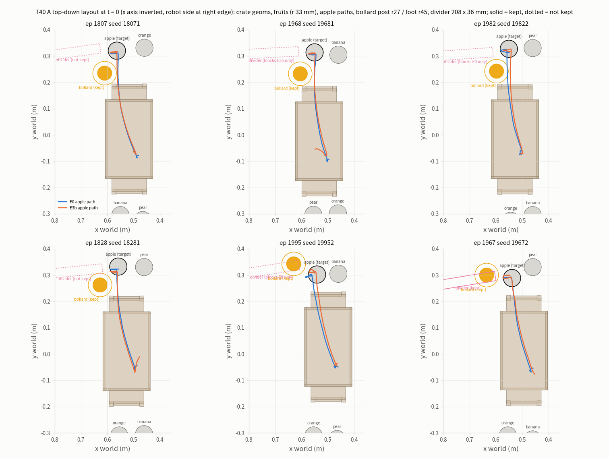

[`figures/t40/t40a-layout.png`](figures/t40/t40a-layout.png) — 배치도. t = 0 의 위에서 본 그림 (x 축 반전, 로봇은 오른쪽 끝). crate · 과일 · 사과 운반 경로 (파랑 = E0, 주황 = E3b) 위에 bollard (r 27 mm · 받침 r 45 mm) 와 divider (208 × 36 mm) 를 겹쳤다. 실선 = kept, 점선 = not kept.

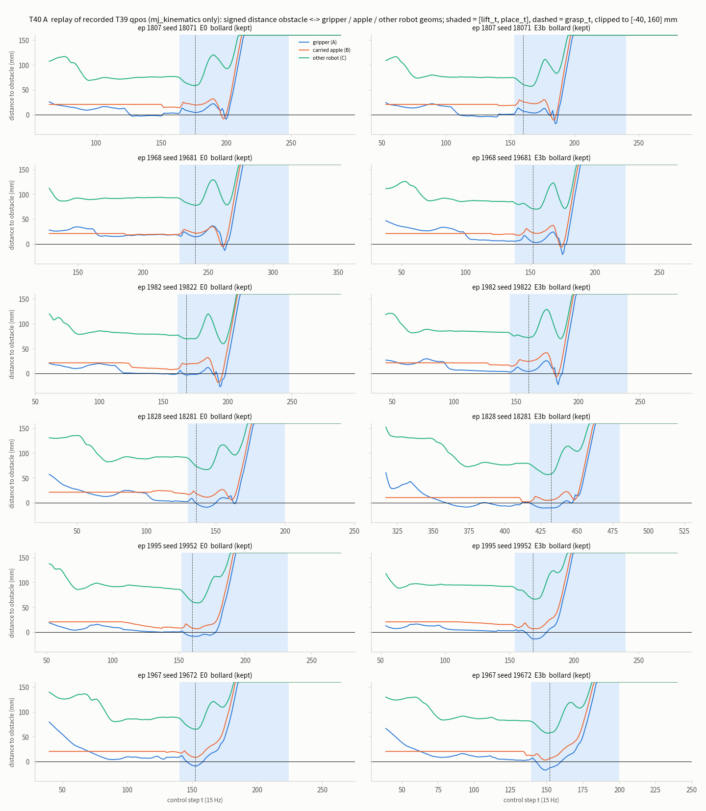

[`figures/t40/t40a-distance.png`](figures/t40/t40a-distance.png) — 그래프. 기록된 T39 qpos 를 재생 (mj_kinematics 만) 했을 때 bollard 와 gripper (A, 파랑) · 쥔 사과 (B, 주황) · 나머지 로봇 (C, 초록) 의 부호 있는 거리 (mm, [−40, 160] 으로 clip) 를 6 episode × {E0, E3b} 에서 control step (15 Hz) 에 따라 그렸다. 음영 = `[lift_t, place_t]`, 점선 = `grasp_t`.

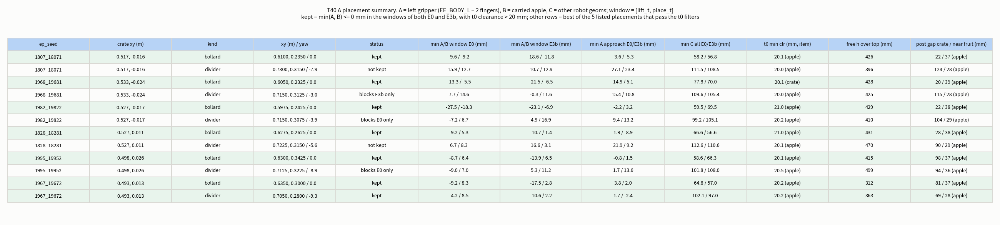

[`figures/t40/t40a-table.png`](figures/t40/t40a-table.png) — 표. 위 결과 2 의 전체 (window 최소 A/B · t0 최소 clearance · free height · 받침 gap) 이다.

6 episode 의 실제 씬 (bollard 와 divider 후보 · 기록 경로):
[1807](figures/t40/t40a-scene-1807_18071.png) ·
[1968](figures/t40/t40a-scene-1968_19681.png) ·
[1982](figures/t40/t40a-scene-1982_19822.png) ·
[1828](figures/t40/t40a-scene-1828_18281.png) ·
[1995](figures/t40/t40a-scene-1995_19952.png) ·
[1967](figures/t40/t40a-scene-1967_19672.png). 각각 `.json` sidecar 가 있다.

**사용자 판정 (2026-10-03).** "장애물을 추가하고 제거할 수 있도록. 지금 기둥은 무의미. subtask gate 는 끄고 진행." → E.

### 2. E — 허들 `hurdle_0` 을 추가 · 제거할 수 있게 (2026-10-03 12:04, implementer)

**무엇이 바뀌었나.** (이 절의 수치는 모두 `T40E.impl.md` 이므로 (구현자) 이다.)

- 막힘 1 의 수정: 16D 모델 (`rby1_randomized_pick_place_16d`) 과 장애물 profile 이면 `model_transport_pick_place_obstacles.xml` 을 읽는다 (`pi05_infer.py:1032`, 분기 조건을 `args.model == "rby1_transport_14d"` 에서 `mcfg.get("model_xml") == MODEL_XML_TRANSPORT` 로).
- 새 slot **`hurdle_0`** (용어 참고): 길이 0.264 m 의 capsule 막대 (반지름 12 mm) 와 양 끝 기둥 두 개. **capsule · cylinder 만으로** 만들었다 (box 를 쓰지 않는다 — 막힘 2). 시각 geom (group 2) 과 충돌 geom (`prop_collision`, group 3) 은 같은 크기이다.
- 막대 높이는 config 의 `bar_height` (0.20–0.32 m, 기본 0.26 m, 허들 slot 에만 허용) 로 정한다. mocap body 둘이 telescope 하는 방식이라 compile 된 model 은 바뀌지 않는다 (geom 의 `rbound` · `aabb` · BVH 를 런타임에 바꾸지 않으려는 선택).
- 거리: 허들의 모든 쌍 유형에서 `mj_geomDistance` 가 맞고 **capsule–box 만** 틀려서, capsule–box 는 정확한 계산 (`capsule_box_distance`, golden-section) 으로 바꿨다. bounding-sphere prefilter 를 더했다.

| 쌍 (구현자 survey, `outputs/verify/T40/E/survey/*.log`) | n (< 0.25 m) | overlap | `mj_geomDistance` 오류 |
|---|---|---|---|
| cylinder–mesh (로봇 · 과일) | 102,319 | 2,371 | 0 |
| capsule–mesh | 19,018 | 229 | 0 |
| cylinder–box (crate) | 189,529 | 8,195 | 0 |
| **capsule–box** | 34,011 | 1,488 | **overlap 74 쌍을 양수로 보고 (최대 33.5 mm)** |
| capsule–box 수정 뒤 | 6,000 | 3,655 | 부호 오류 0 |

**추가 · 제거 방법 (config 형식).**

```json
{"version": 1, "table_surface_z": 0.82,
 "profiles": {"clear": {"scene": "any", "obstacles": []},
              "ep1807_hurdle": {"scene": "fruit", "obstacles": [
                 {"slot": "hurdle_0", "position": [0.68, 0.23, 0.82], "yaw": 0.0, "bar_height": 0.26}]}}}
```

| 필드 | 뜻 |
|---|---|
| `position` | 발 (footprint) 의 중심 `[x, y, table_z]` |
| `yaw` | 세계 z 축 회전. 막대가 local x 축이므로 `yaw = 0` 이면 막대가 세계 x 축과 나란하다 |
| `bar_height` | `position[2]` 위 막대 중심의 높이 (m) |

- **추가:** `--obstacle-config <json> --obstacle-profile <name>`.
- **제거:** `--obstacle-profile clear` (기본) 이거나 두 flag 를 모두 생략.
- 사용법은 `pick_place_obstacles.py` 의 module docstring 과 `pi05_infer.py:826-839` 의 help 에 있다.

**`clear` 는 이전 장면과 비트 동일하다.** (구현자) `tests/sim/test_t40_hurdle.py` 의 clear 3 tests 가 `main()` 을 `clear` 로, 오늘의 client 와 `22d8dae` 의 client (git 에서 꺼냄) 로 정책 호출 직전까지 돌려 같은 `model_xml` (`model_transport.xml`) · manager 없음 · model fingerprint 동일 · state (qpos · qvel · ctrl · act · mocap · time) **byte-identical** 을 확인했다. qpos 주소는 apple 38 · crate 31 · left finger 27, nq / nv / nu 는 66 / 61 / 29 로 두 XML 에서 같다. 모든 slot 을 parking 한 obstacle XML 은 clear XML 과 같게 움직인다 (200 step, ≤ 1e-9). 이 구현자 확인에 더해, **닫힌 루프 수준에서는 아래 §5 의 G B 12 / 12 가 T39 와 비트 동일**이다.

**tests.** 루트 `tests/sim/test_t40_hurdle.py` **26 passed** (`.venv-openpi-live`, CPU, 88 s) (구현자). 구성은 clear (3) · config (2) · placement (9 + 1) · collision (3) · 16D + 장애물 (2) · distances (6). 기존 `test_pick_place_obstacles.py` 4 passed (구현자). 거리 test 는 독립 GJK (`tests/sim/_gjk.py`, verifier 의 `gjk.py` 사본) 와 대조한다.

**배치에 쓸 사실 (구현자, ep1807).** reset 에서 왼 gripper 는 x 0.43–0.48 · y 0.21–0.26 · 테이블 위 0.21–0.30 m 에 걸려 있다. 이는 사과 → crate 통로 안이고 막대 높이이다. 그래서 통로를 가로지르는 막대를 reset 에서 두면 gripper 와 겹친다 (예: (0.55, 0.215) → robot clearance −19 mm, 모든 막대 높이에서).

**고치지 않은 것 (구현자).** `pi05_ex_infer.py:1215-1219` 에 같은 16D → block XML 분기가 남아 있다 (이 STEP 의 범위 밖).

### 3. F — 허들 배치 (2026-10-03, verifier)

**탐색.** (해석적 탐색 v2, lead 규칙 2026-10-03; CPU · 호출마다 1 process.) 후보는 기록된 사과 중심 경로 (E0 · E3b 각각의 `lift_t ≤ t < place_t`) 를 3-D 호장 0.01 m 마다 resample 한 점을 막대 중심 xy 로 하고, 막대 방향은 경로의 수평 법선을 `dyaw ∈ {0, ±20, ±40}°` 로 돌린 것, 막대 중심을 막대 방향으로 `u ∈ {−0.06, 0, +0.06} m` 옮긴 것 (lead 규칙에 없는 확장), `bar_height ∈ {0.20, 0.22, …, 0.32} m` 이다. 검사 순서는 a → b → d → c 이고 각각 early-exit 한다.

**배치 기준 (a)–(e).** (`T40FG.verify.json` 의 `F.definitions`)

| 기준 | 내용 | 통과 조건 |
|---|---|---|
| **(a)** reset 검사 | client 의 reset clearance check (용어) 를 captured reset scene 에서 | `robot_clearance > 0` ∧ `object_clearance > 0` |
| **(b)** t0 | 기록된 planning row 0 에서 허들 ↔ 로봇 · 사과 + 과일 · crate | 모두 > 0, E0 · E3b 둘 다 |
| **(c)** 운반을 막는다 | 정확한 거리로 `lift_t ≤ t < place_t` 의 min(gripper, 사과) 거리 | ≤ 0, E0 **와** E3b 둘 다. 추가로 `c_low` = 막대를 20 mm 낮춰도 막는다 (기하만) |
| **(d)** 들기 전 | `t < lift_t` 의 모든 로봇 geom · 사과 · 다른 과일과의 최소 거리 | > 0, 둘 다 |
| **(e)** 위로 비킬 여유 | 그 xy 에서 기구학적으로 낼 수 있는 왼 TCP 최대 높이 (SLSQP, 충돌 검사 없음) 에서 사과 바닥 offset 을 빼고 막대 윗면을 뺀 값 `free_height_over_bar` | 선택 시 클수록 우선 |

선택은 (a)–(d) 를 통과한 후보 (feasible) 중에서 tier 로 한다. 어떤 episode 의 후보도 lead 의 20 mm 여유에 닿지 않아 문턱을 10 · 5 mm 로 낮췄다 (`F.definitions.selection`): T1 = `c_low` ∧ margin ≥ 10 mm, T2 = `c_low` ∧ margin ≥ 5 mm, T3 = `c_low`, T4 = feasible. margin = min(reset robot, reset object, pre-lift 최소, t0 최소). 가장 좋은 비어 있지 않은 tier 안에서 `free_height_over_bar` 가 큰 것을 택한다.

**후보 수.** (episode 별 base 탐색, `F.episodes.*.sources`)

| episode · seed | candidates | (a) 통과 | (b) 통과 | (d) 통과 | (c) 통과 = feasible | tier 1 · 2 · 3 · 4 |
|---|---|---|---|---|---|---|
| 1807 · 18071 | 16,800 | 1,404 | 1,404 | 142 | 124 | 11 · 62 · 35 · 16 |
| 1968 · 19681 | 18,480 | 1,267 | 1,267 | 300 | 285 | 81 · 47 · 118 · 39 |
| 1982 · 19822 | 17,850 | 1,446 | 1,445 | 200 | 200 | 35 · 38 · 100 · 27 |
| 1995 · 19952 | 16,380 | 1,030 | 1,030 | 2 | 2 (+ `u` ±0.08, ±0.10 확장 0) | 0 · 0 · 1 · 1 |
| 1967 · 19672 | 15,855 | 777 | 776 | 132 | 132 | 39 · 25 · 48 · 20 |
| **1828 · 18281** | 18,480 (+ 24,640 확장) | 1,279 (+ 884) | 1,279 (+ 884) | **0 (+ 0)** | **0 (+ 0)** | — |

**1828 은 버렸다.** (a)–(d) 를 모두 만족하는 배치가 base 와 `u` 확장 (±0.08, ±0.10 m) 에서 모두 0 이다 (`dropped: true`, reason `no candidate satisfies (a)-(d)`). 따라서 **ep1828 의 허들 run 은 없다** (B 의 장애물 없음 run 만 있다). `diag_d` 가 센 (run | body) 별 개수는 E3b | EE_BODY_L 45 · E0 | EE_BODY_L 40 · E0 | FT_SENSOR_L 2 이다 (원자료 `outputs/verify/T40/F/raw/diag_d_1828_18281.json`).

**선택된 5 배치 (round 1).**

| episode · seed | 허들 위치 (x, y) m | yaw (°) | bar_height (m) | tier | margin (mm) | reset robot / object (mm) | (c) 운반 구간 최소 A · B, E0 (mm) | (c) 운반 구간 최소 A · B, E3b (mm) | free height over bar (m) |
|---|---|---|---|---|---|---|---|---|---|
| 1807 · 18071 | (0.5011, 0.1905) | 17.17 | 0.28 | 1 | 10.4 | 19.0 / 10.4 | −23.7 · −15.4 | −22.2 · −9.1 | 0.510 |
| 1968 · 19681 | (0.4939, 0.1778) | 17.86 | 0.24 | 1 | 16.2 | 22.5 / 16.2 | −22.9 · −38.8 | −22.2 · −33.9 | 0.556 |
| 1982 · 19822 | (0.4965, 0.1794) | 15.85 | 0.22 | 1 | 12.4 | 13.6 / 12.4 | −12.5 · −28.7 | −11.2 · −23.8 | 0.573 |
| 1995 · 19952 | (0.4866, 0.1977) | 9.11 | 0.32 | **3** | **1.5** | 1.9 / 5.4 | −31.0 · +13.1 | −31.3 · +26.6 | 0.507 |
| 1967 · 19672 | (0.4677, 0.1861) | 11.64 | 0.22 | 1 | 11.8 | 31.1 / 11.8 | −8.6 · −32.7 | −10.1 · −33.1 | 0.560 |

(위 표의 A = gripper 구성 geom, B = 사과. 1995 만 tier 3 이고 margin 이 1.5 mm 이다 — 아래 §6 의 1995 절.)

**교차 검증.** 각 배치의 보고된 최소값을 argmin 행 · pair 에서 **GJK 와 대조**했다. separated 인 항목 72 개 (round 1) 와 63 개 (round 2, D) 에서 client 거리와 GJK 의 차이는 각각 최대 1.6e-11 m · 1.3e-11 m 이고, overlap 항목 (client 음수) 은 GJK separation 0 으로 일치한다. client 의 reset 검사 (`dryrun.py` — snapshot 의 `pi05_infer.main()` 을 정책 호출 직전까지) 는 5 / 5 배치가 `load_remote_policy` 까지 갔다 (초기 robot / object clearance: 1807 0.019 / 0.010 · 1968 0.022 / 0.016 · 1982 0.014 / 0.012 · 1995 0.002 / 0.005 · 1967 0.031 / 0.012 m).

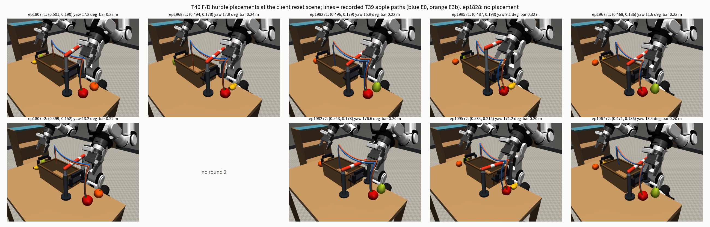

[`figures/t40/t40fg-placement.png`](figures/t40/t40fg-placement.png) — 실제 씬. client 의 reset 장면에 round 1 (위) · round 2 (아래, D) 의 허들과 기록된 T39 사과 경로 (파랑 = E0, 주황 = E3b) 를 겹쳤다. ep1828 은 배치 없음, ep1968 은 round 2 없음.

**D 의 round 2 배치.** C 에서 E3b 가 실패한 4 episode (1807 · 1967 · 1982 · 1995) 에서, round 1 의 E3b 실패가 모두 **들기 전** (접근 중 gripper · finger ↔ 막대 정지, 또는 1995 의 clearance 0.0 · 접촉 없음 정지) 이었으므로, 같은 후보 pool 에서 (a)–(d) 와 (c) 를 유지하면서 **round 1 의 닫힌 루프 접근 궤적에 대해서도 여유가 최대인** 배치를 골랐다 (`dselect.py`). score = min(m_T39, m_C), m_C = round 1 의 C run (E0 · E3b) 에서 각 run 의 들기 전 control row 의 허들 ↔ 로봇 거리 최소. round 1 배치는 제외했다. **`c_low` 는 4 episode 모두 false** 이다 (막대를 20 mm 낮추면 막지 못한다).

| episode · seed | round 2 위치 (x, y) m | yaw (°) | bar_height (m) | round 1 score (mm) | round 2 score (mm) | m_T39 (mm) | m_C E0 · E3b (mm) | 초기 robot / object (mm) |
|---|---|---|---|---|---|---|---|---|
| 1807 · 18071 | (0.4988, 0.1524) | 13.2 | 0.22 | 1.7 | 9.9 | 9.9 | 40.3 · 40.8 | 41 / 10 |
| 1967 · 19672 | (0.4709, 0.1863) | 13.4 | 0.20 | 3.2 | 14.2 | 14.2 | 23.0 · 15.8 | 35 / 14 |
| 1982 · 19822 | (0.5428, 0.1732) | 176.6 | 0.20 | 0.04 | 13.9 | 13.9 | 16.9 · 16.9 | 17 / 14 |
| 1995 · 19952 | (0.5343, 0.2142) | 171.2 | 0.20 | 1.5 | **−1.0** | 1.0 | 0.7 · **−1.0** | 1 / 3 |

1995 의 round 2 score 가 음수인 것은 round 1 의 E3b C run 의 들기 전 기록에서 이 배치와의 거리 최소가 −1.0 mm 라는 뜻이다 (`m_C.C_E3b = −0.00098 m`). 이 배치로도 1995 는 실행되었다 (§6).

### 4. OOM 사고 — 2026-10-03 12:19 UTC (사실만)

pod 의 memory cgroup 은 **전 세션이 공용으로 쓰는 80 GiB** 이다 (`/sys/fs/cgroup/memory.max` = 85,899,345,920 B). CPU 는 `cpu.max` 1,600,000 / 100,000, 즉 pod 전체 16 CPU 이다. `free` · `nproc` 은 이 한도를 보여 주지 않는다.

| 시각 (UTC) | 무슨 일 |
|---|---|
| 2026-10-03 12:19 | F 의 첫 탐색 (`run_search.sh`, `search.py`, exhaustive grid) 이 **CPU worker 60 개** (각 약 1.4–1.5 GB RSS) 를 띄웠다. `memory.current` 가 약 85.1e9 B 에 닿았다 |
| 12:18:51 ~ 12:19:56 (dmesg, ±20 s) | OOM kill 16 건 |
| 약 12:28:50 | OOM kill 1 건 (G regression baseline 의 legacy 재실행) |
| 12:31 | verifier 가 **남은 search worker 52 개** (자기 process) 를 모두 죽였다. 그 뒤 `memory.current` 7,758,315,520 B |

(주의: 60 개 − 죽은 9 개 = 51 이나 `verify.json` 은 52 로 적는다. 차이는 기록에 설명이 없다. 이 로그의 SUBTASK 절 §8 (SUBTASK-f) 의 "실행 중 사고" 단락은 같은 사고를 "51 개 × 약 1.5 GB" 라고 적었다.)

**누가 죽었나.** `memory.events` 의 `oom_kill` 누적 38 건 중 2026-10-03 에 17 건, 그 전이 21 건이다. 17 건을 dmesg 의 vm · anon_rss 크기로 분류한 것이다 (원자료 `outputs/verify/T40/F/raw/oom_kills_20261003.txt`).

| 분류 (크기로 추정) | 개수 | 영향 |
|---|---|---|
| `serve_safe` 서버 (vm ≈ 419 GB · rss ≈ 6 GB) | 3 | **다른 세션** SUBTASK-f E3bG 체인 8231 · 8232 · 8233. 서버가 죽어 "server died, chain stops" (12:21:17–12:21:22) |
| 기동 중인 서버 (vm 112 GB · rss 4.7 GB) | 1 | SUBTASK-f 체인 8234 "server died during start" (12:20:58) |
| `pi05_infer` client (vm ≈ 32.7 GB · rss ≈ 2.4 GB, 12:19) | 3 | SUBTASK-f run 3 개 exit=137: E3bG ep1863 s18631 (포트 8231) · ep1828 s18281 (8232) · ep1807 s18071 (8233) |
| T40 F search worker (vm ≈ 10.5 GB · rss ≈ 1.4 GB) | 9 | **이 STEP** 의 verifier. 이 탐색의 결과는 쓰지 않았다 (`search.py` + `run_search.sh` 는 superseded) |
| T40 G regression baseline 의 legacy `esdf_rollout` (vm 33 GB · rss 2.3 GB, ~12:29) | 1 | 이 STEP. legacy rc=137 (`G/baseline/run.out`) |

**이 STEP 에 준 영향.** 첫 legacy baseline 시도가 죽었다. nice 19 · `OMP_NUM_THREADS=2` 로 다시 돌렸고 (F worker 2 개 · 다른 세션이 함께 도는 동안) 결과가 SUBTASK-e 의 기준선과 일치했다 (§5 의 표). F 는 해석적 탐색 (v2) 으로 다시 했다.

**새 자원 규칙 (lead).** 이 사고 뒤 정해졌다 (`incident_oom_20261003.after`):

| 규칙 | 값 |
|---|---|
| F 같은 탐색 | 해석적으로 (exhaustive grid 금지) |
| CPU worker | ≤ 4 개, nice 19, **전체 RSS ≤ 16 GB** |
| server · client · worker 를 띄우기 전 | `memory.current` + RSS 추정 ≤ **64 GiB** |

G 가 도는 동안 pod memory 최고는 49.94 GiB 였다 (`resources.pod_memory_peak_GiB_during_G`).

### 5. G B — 장애물 없음: 12 / 12 가 성공, T39 와 비트 동일 (2026-10-03 13:54–14:25 UTC)

**설정.** `--obstacle-profile clear` · 6 episode × {E0, E3b} = 12 run. 같은 seed (T39 의 `10·ep + rep`) · `--warmup-steps 1000` · `--policy-seed` · XLA autotune 0 · 불변 snapshot · gate off. 녹화는 `--record third_person_front.mp4 --view front --record-frames --trajectory-out traj.npz`. 서버 포트는 G 의 E3b 8240 · E0 8241.

**기준선 (G 시작 전).** regression baseline 이 일치했다 (`baseline_check.matched`).

| 변형 | `violated_start` | `has_target` | frame 0 `clearance_before` | `clearance_before` 의 sha1 이 SUBTASK-e 와 같은가 |
|---|---|---|---|---|
| cuRobo | 10 / 15 | 15 / 15 | −9.171877401271193 mm | 같다 (`fe73bd7a…`) |
| legacy | 14 / 15 | 15 / 15 | −29.031048280806342 mm | 같다 (`40798fb0…`) |

**결과.** 비트 동일의 비교는 `outputs/verify/T40/p/analyze_t40.py` 의 `bit_identity` 이다: `traj.npz` 의 `executed_actions` · `measured_qpos` · `predicted_chunks` · `inference_states` · `chunk_start_steps`, frame 기록의 planning actions · qpos · object poses · control qpos · applied ctrl, 그리고 E3b 는 서버 기록의 `refined_chunk` · `reference_chunk` · `clearance` 를 T39 의 같은 (episode, seed, 조건) run 과 비교한다.

| episode · seed | E0 success | E0 bit-identical | E3b success | E3b HOLD chunk (kind) | E3b bit-identical |
|---|---|---|---|---|---|
| 1807 · 18071 | ✓ | ✓ | ✓ | 0 | ✓ |
| 1828 · 18281 | ✓ | ✓ | ✓ | 0 | ✓ |
| 1967 · 19672 | ✓ | ✓ | ✓ | 1 (collision) | ✓ |
| 1968 · 19681 | ✓ | ✓ | ✓ | 0 | ✓ |
| 1982 · 19822 | ✓ | ✓ | ✓ | 9 (uncertified) | ✓ |
| 1995 · 19952 | ✓ | ✓ | ✓ | 1 (collision) | ✓ |
| **합** | **6 / 6** | **6 / 6** | **6 / 6** | 11 chunk | **6 / 6** |

모든 run 이 `n_control` 600 이다. 즉 B 는 **12 / 12 success · 12 / 12 비트 동일** (`verdict`: "12/12 B runs bit-identical to T39").

**chunk 시간.** (첫 chunk 제외, `chunk_times`)

| 조건 | stage | round trip 중앙 · p95 · 최대 (ms) | server total 중앙 · p95 (ms) | server trajopt 중앙 · p95 (ms) | n |
|---|---|---|---|---|---|
| E0 | B | 202.8 · 340.4 · 390.0 | — | — | 444 |
| E3b | B | 981.3 · 1,139.7 · 1,298.9 | 768.5 · 923.6 | 69.1 · 84.5 | 444 |
| E0 | C | 207.0 · 347.9 · 380.2 | — | — | 129 |
| E3b | C | 1,006.1 · 1,154.9 · 1,225.5 | 786.8 · 930.3 | 67.4 · 91.1 | 121 |
| E0 | D | 185.0 · 261.7 · 443.7 | — | — | 72 |
| E3b | D | 973.7 · 1,087.0 · 1,171.2 | 761.5 · 876.3 | 63.2 · 74.7 | 61 |

E0 의 server 시간은 기록이 없다 (`--no-safe` 서버 · 재측정 대기 12). 이 값들은 서버 둘 (G 의 E3b · E0) 이 도는 동안의 값이다. T39 의 server 시간과 같은 부하 조건이었다는 기록이 없어 이 절에서 견주지 않는다.

**자원.** (`resources`) E3b server RSS 최고 6.9 GiB · E0 server 4.02 GiB · E3b client 3.0 GiB · E0 client 2.76 GiB. GPU: E3b server 약 17,930 MiB, 두 서버 동시 최고 27,278 MiB. pod memory 최고 49.94 GiB.

### 6. G C · D — 운반 경로 위 허들: E3b 2 / 9 · E0 0 / 9 (C 2026-10-03 14:00–14:26 UTC, D 2026-10-04 05:43–05:51 UTC)

**설정.** 위 F · D 의 config 로 5 + 4 episode 를 E0 · E3b 에서 돌렸다 (C = round 1 허들 5 episode × 2, D = round 2 허들 4 episode × 2, 총 18 run). 설정은 §5 와 같고, 서버는 D 에서 E3b 8242 · E0 8243. **`--obstacle-stop-distance` 는 0.0** 이다 (`G_settings`). `T40.task.md` 는 기본값 0.02 (로봇이 장애물 2 cm 안이면 멈춘다) 를 적었고, 0.0 으로 정한 근거는 이 기록의 출처에 없다. 로봇이 장애물과 정지 거리 이하이거나 접촉하면 run 이 끝난다 (**obstacle stop**, 용어). C 의 E3b ep1807 은 `check_run` v1 이 장애물 정지 run 을 "불완전" (`planned_missing = 75 − captured`) 으로 판정해 두 번 돌렸다 (v2 가 이 경우를 받아들인다). 두 attempt 는 비트 동일이다 (`retry_reproducibility_C_E3b_ep1807`).

**성공 · 정지 표.** (success = grasp 와 place 모두, T39 규칙. **client contact** = client 가 기록한 로봇 ↔ 허들 접촉 pair. 정지 시각 t 는 control step.)

| round | episode | 조건 | success | grasp | place | HOLD (kind) | obstacle stop t | client 접촉 pair | `min_robot_clearance` (mm) |
|---|---|---|---|---|---|---|---|---|---|
| C | 1807 | E0 | ✗ | ✗ | ✗ | 0 | 254 | EE_BODY_L (geom 1052) ↔ bar | −0.19 |
| C | 1807 | E3b | ✗ | ✗ | ✗ | 5 (collision) | 218 | ee_finger_l2 (1086) ↔ bar | −0.94 |
| C | 1967 | E0 | ✗ | ✓ | ✗ | 0 | 190 | ee_finger_l2 (1086) ↔ bar | −0.52 |
| C | 1967 | E3b | ✗ | ✗ | ✗ | 1 (collision) | 203 | ee_finger_l2 (1086) ↔ bar | −0.21 |
| C | 1968 | E0 | ✗ | ✓ | ✗ | 0 | 259 | ee_finger_l2 (1086) ↔ bar | −0.36 |
| C | 1968 | **E3b** | **✓** | ✓ | ✓ | 0 | 280 (놓은 뒤) | 사과 ↔ bar, ee_finger_l1 (1079) ↔ bar | −1.65 |
| C | 1982 | E0 | ✗ | ✓ | ✗ | 0 | 165 | ee_finger_l2 (1086) ↔ bar | −0.32 |
| C | 1982 | E3b | ✗ | ✗ | ✗ | 1 (collision) | 178 | EE_BODY_L (1052) ↔ bar | −0.19 |
| C | 1995 | E0 | ✗ | ✗ | ✗ | 0 | 186 | EE_BODY_L (1051) ↔ bar | −0.46 |
| C | 1995 | E3b | ✗ | ✗ | ✗ | 0 | 103 | **없음** (false-zero) | 0.0 |
| D | 1807 | E0 | ✗ | ✓ | ✗ | 0 | 196 | ee_finger_l2 (1086) ↔ bar | −0.25 |
| D | 1807 | **E3b** | **✓** | ✓ | ✓ | 0 | 275 (놓은 뒤) | ee_finger_l2 (1086) ↔ bar | −2.0 |
| D | 1967 | E0 | ✗ | ✗ | ✗ | 0 | 90 | **없음** (false-zero) | 0.0 |
| D | 1967 | E3b | ✗ | ✗ | ✗ | 1 (collision) | 137 | **없음** (false-zero) | 0.0 |
| D | 1982 | E0 | ✗ | ✗ | ✗ | 0 | 225 | ee_finger_l2 (1086) ↔ bar | −1.02 |
| D | 1982 | E3b | ✗ | ✗ | ✗ | 0 | 23 | **없음** (false-zero) | 0.0 |
| D | 1995 | E0 | ✗ | ✗ | ✗ | 0 | 76 | EE_BODY_L (1051) · (1055) ↔ bar | +0.03 |
| D | 1995 | E3b | ✗ | ✗ | ✗ | 0 | 71 | **없음** (false-zero) | 0.0 |

| 집계 | E0 | E3b |
|---|---|---|
| C (5 run) | 0 / 5 | 1 / 5 (ep1968) |
| D (4 run) | 0 / 4 | 1 / 4 (ep1807) |
| **합 (9 run)** | **0 / 9** | **2 / 9** |

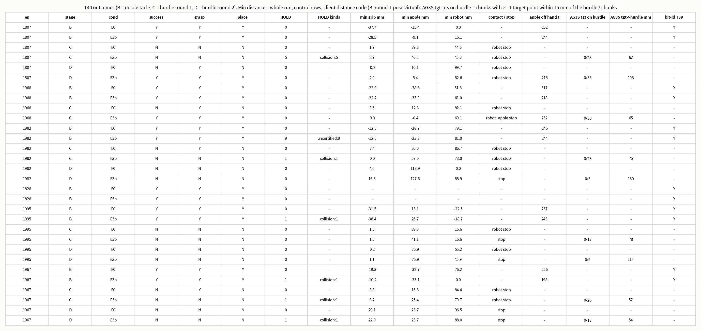

[`figures/t40/t40fg-table.png`](figures/t40/t40fg-table.png) — 표. episode × stage (B · C · D) × 조건의 success · HOLD · 최소 gripper / 사과 / 로봇 거리 · 접촉 · 사과가 손을 떠난 t · AG3S target 이 허들 위에 있었던 chunk · bit-identical 을 한 장에 모은 것.

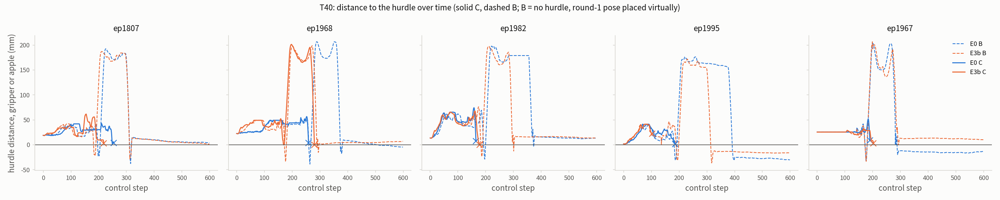

[`figures/t40/t40fg-distance.png`](figures/t40/t40fg-distance.png) — 그래프. episode 별 min(gripper, 사과) ↔ 허들 거리 (mm, client 거리 코드, 300 으로 cap) 를 control step 에 따라 그렸다. 파랑 = E0, 주황 = E3b, 실선 = C (물리 허들), 점선 = B (같은 허들을 **가상으로** 놓은 것, 물리 없음), × = obstacle stop 으로 끝난 run 의 마지막 행. round 2 (D) 는 [`t40fg-distance-d.png`](figures/t40/t40fg-distance-d.png).

round 1 (C) 의 실제 씬 — 각 run 의 최소 허들 거리 control row 의 third-person front 프레임, E0 | E3b:
[1807](figures/t40/t40fg-scene-1807.png) ·
[1968](figures/t40/t40fg-scene-1968.png) ·
[1982](figures/t40/t40fg-scene-1982.png) ·
[1995](figures/t40/t40fg-scene-1995.png) ·
[1967](figures/t40/t40fg-scene-1967.png).
round 2 (D):
[1807](figures/t40/t40fg-scene-1807-d.png) ·
[1982](figures/t40/t40fg-scene-1982-d.png) ·
[1995](figures/t40/t40fg-scene-1995-d.png) ·
[1967](figures/t40/t40fg-scene-1967-d.png). 각각 `.json` sidecar 가 있다.

#### 6-1. 실패의 분류와 증거

`T40.task.md` 의 D 단계는 실패를 HOLD 연속 · TO 가 8 step 안에서 못 비킴 · 정책이 다시 끌어당김 · 장애물을 target 으로 착각 · 팔뚝 충돌 로 나눠 보라고 했다 (TO = trajectory optimization, 계획 지평 8 step). verifier 가 run 마다 대조한 결과는 다음과 같다.

| run | 정지 시점 | 접촉 | 기록된 사실 | 목록의 분류와 맞는 것 |
|---|---|---|---|---|
| C E3b 1807 | 들기 전 (grasp 없음, 사과 dz 최대 3 mm), t = 218 | ee_finger_l2 ↔ bar | HOLD 5 chunk (t = 136 · 176 · 192 · 200 · 208, 모두 collision, 최대 연속 3 = 192 · 200 · 208). 위반 링크: attached:ee_left[0] fine tier, 이어 ee_finger_l2 · ee_left · ee_finger_l1 target_free tier, −11.1 … −1.1 mm. 접촉은 **연속 HOLD 3 개 뒤 t = 216 에서 시작한 chunk (gate `execute`)** 에서 났다 | HOLD 연속 (3) |
| C E3b 1967 | 들기 전 (grasp 없음, dz 6 mm), t = 203 | ee_finger_l2 ↔ bar | HOLD 1 chunk (t = 192, collision: ee_finger_l1 −0.1 mm, target_free) | 없음 |
| C E3b 1982 | 들기 전 (grasp 없음, dz 14 mm), t = 178 | EE_BODY_L ↔ bar | HOLD 1 chunk (t = 176, collision: ee_finger_l2 −10.2 mm, target_free) | 없음 |
| C E3b 1995 | 들기 전 (grasp 없음), t = 103 | **접촉 없음** (`robot_collision` False · contact steps 0) | client `min_robot_clearance` 가 정확히 0.0. replay 의 t = 103 clearance 는 22.2 mm | 없음 — §6-2 |

그 밖에 기록된 사실.

- 1807 의 실패 분류 중 목록에서 **맞지 않는 것**: "TO 가 운반 중 막대를 못 비킴" (운반 자체가 없었다) · "허들을 target 으로 착각" (아래) · "점검 밖 팔뚝 링크" (접촉 링크가 finger 이다) · "사과를 쳐서 떨어뜨림" (grasp 가 없었다). "정책이 다시 끌어당김" 은 `verify.json` 이 따로 판정하지 않았다.
- **E0 의 접촉.** C 의 E0 5 run 은 전부 허들과의 접촉으로 끝났다: 접근 중 EE_BODY_L 접촉 2 (1807 t = 254 · 1995 t = 186), 운반 중 ee_finger_l2 접촉 3 (1968 grasp t = 232 · 접촉 t = 259 · 1982 grasp t = 144 · 접촉 t = 165 · 1967 grasp t = 168 · 접촉 t = 190). E0 에는 HOLD 가 없다 (0 chunk).
- **D E0.** 1807: grasp t = 168, 운반 중 ee_finger_l2 ↔ bar t = 196. 1982: grasp 없이 ee_finger_l2 ↔ bar t = 225. 1995: grasp 없이 EE_BODY_L ↔ bar t = 76. 1967: false-zero (아래).
- **E3b 성공 둘.** C ep1968: grasp t = 144, place t = 232 (손에서 놓임). 운반 중 사과 ↔ bar 접촉 (client `payload_collision` True, replay 의 사과 최소 거리 −0.4 mm @ t = 171), 사과는 t = 232 의 release 까지 손에 있었다. obstacle stop 은 **놓은 뒤** t = 280 (ee_finger_l1 ↔ bar). D ep1807: grasp t = 136, place t = 216 (사과는 t = 215 에 놓임). 운반 중 gripper 최소 거리 11.3 mm · 사과 5.4 mm, payload 접촉 없음. obstacle stop 은 놓은 뒤 t = 275 (ee_finger_l2 ↔ bar).
- **사과를 쳐서 떨어뜨린 run 은 없다.** `apple_left_hand_t` 는 성공 run 에서 crate 의 release 에만 값이 있다 (`apple_knocked_off`).
- **허들이 AG3S 의 target 으로 선택된 적은 없다.** E3b 의 C · D 모든 run 에서 target 점이 허들 표면 15 mm 안에 하나라도 있는 chunk 는 **0** 이다 (`ag3s_hurdle_as_target`). target 점 중심에서 허들 표면까지의 최소 거리는 C 57–78 mm · D 54–160 mm.

#### 6-2. client 거리의 false-zero 정지 — **열린 결함**

**false-zero distance** (용어): client 의 `pair_distance` 가 정확히 **0.0** 을 돌려주는데 실제로는 접촉이 없고 GJK separation 이 0.2 m 대인 경우. 거리 0.0 은 `--obstacle-stop-distance 0.0` 에서 정지 조건 (≤ 0) 이므로 run 이 끝난다.

정확한 0.0 · 접촉 없음으로 끝난 run 은 **5 개** 이다 (`stops_with_exact_zero_and_no_contact`). kinematic probe (`zero_probe.py`, 기록된 마지막 control row 에 400 개 섭동) 의 결과:

| run | 정지 t | replay 의 마지막 행 clearance (mm) | 섭동 400 개 중 ≤ 0 | 0.0 을 돌려준 pair | 그 pair 의 GJK separation (m) |
|---|---|---|---|---|---|
| C E3b 1995 | 103 | 22.2 | 4 | foot_left ↔ link_left_arm_5 (geom 856) | 0.215–0.217 |
| D E3b 1982 | 23 | 35.2 | 4 | foot_right ↔ ee_finger_l2 (1085) 1 · ↔ EE_BODY_L (1055) 3 | 0.222–0.231 |
| D E3b 1995 | 71 | 17.0 | 10 | foot_right ↔ link_left_arm_6 (904) 5 · FT_SENSOR_L (942 · 935 · 941) 5 | 0.208–0.238 |
| D E3b 1967 | 137 | 22.8 | **0** | 재현 안 됨 | — |
| D E0 1967 | 90 | 42.1 | **0** | 재현 안 됨 | — |

- 재현된 3 run 의 0.0 pair 는 모두 **허들의 발 (foot)** 과 로봇 팔 링크 · 손목 · gripper 사이였고, GJK separation 이 0.21–0.24 m 이다 (`verify.json` 의 `witness_gap_m` 은 0.43–0.48 m).
- 1967 의 두 run 은 probe 로 0.0 을 재현하지 못했다. 이 두 run 의 정지 원인은 이 기록으로 가릴 수 없다.
- probe 는 **kinematic** 이다 (기록된 control row 와 섭동). 각 정지의 physics sub-step 에서 0.0 이 나온 것을 재현한 것이 아니다 (`not_measured`).
- E 의 구현자 survey (cylinder–mesh 102,319 쌍, < 0.25 m) 는 `mj_geomDistance` 오류 0 이었다 (구현자). 위 pair 의 GJK separation 은 그 범위 안이다. 두 기록은 이 절에서 조정하지 않았다.
- **이 5 run 은 판정할 수 없다.** E3b 가 허들을 피하지 못해서 끝난 것인지, 거리 검사의 거짓 0 이 run 을 끝낸 것인지를 이 run 들에서 가를 수 없다. 이 5 run 은 위 집계의 실패에 들어 있다 (E3b 4 run: C 1995 · D 1967 · D 1982 · D 1995, E0 1 run: D 1967). → 재측정 대기 17.

#### 6-3. 1995 와 reset margin

ep1995 는 F 에서 후보가 둘뿐이었고 (위 후보 수 표) 선택된 배치는 tier 3 · margin 1.5 mm 이다. 이 episode 의 기록:

| 항목 | 값 |
|---|---|
| reset margin (round 1) | reset robot 1.9 mm · reset object 5.4 mm · t0 최소 1.9 mm · T39 들기 전 최소 1.5 mm |
| reset 에서 허들 ↔ 로봇 pair | bar ↔ EE_BODY_L (geom 1050 / 1053), t = 0 에서 1.8 mm · t = 4 에서 1.5 mm (C 의 두 run, replay) |
| C E3b 의 gripper ↔ bar 거리 (mm) | t0 1.8 · t4 1.5 · t16 8.4 · t48 24.7 · t80 43.7 · t103 22.2 |
| C E0 | t = 186 에 접근 중 EE_BODY_L (1051) ↔ bar 접촉. replay 의 gripper 거리 t4 1.5 · t64 31.5 · t110 20.0 · t170 18.4 mm |
| B (가상 허들) 의 r1 pose gripper 거리 t = 130 (mm) | E3b 15.6 · E0 8.0 |
| D (round 2) | m_T39 1.0 mm. E3b 는 t = 71 에 clearance 0.0 · 접촉 없음 (false-zero), E0 는 t = 76 에 EE_BODY_L ↔ bar 접촉 |

reset 검사의 기준은 clearance > 0 이므로 1995 는 1.9 mm (robot) 로 통과했다.

### 7. 아직 모르는 것 (`not_measured` 와 이 절에서 드러난 것)

| 항목 | 상태 |
|---|---|
| **false-zero 정지 5 run 의 판정** | **판정 불가.** 재측정 대기 17 |
| **접근 단계 finger contact 의 원인** | **미확정.** 재측정 대기 18 |
| **ep1828 의 허들 run** | 없음 (배치 없음). 재측정 대기 19 |
| false-zero 를 physics sub-step 에서 재현하는 것 | **안 했다** (probe 가 kinematic) |
| E0 의 server 시간 | 기록 없음 (재측정 대기 12 와 같음) |
| 장애물 없음 B 의 gate on 기본값 | 안 쟀다. G 는 gate off. 기본 on 의 main 으로 같은 시연을 다시 하지 않았다 |
| `--obstacle-stop-distance` 0.0 으로 정한 근거 | 출처에 없다 (위 §6 설정) |
| VLA 는 장애물 있는 데이터로 학습되지 않았다 | `T40.task.md` 의 주의 1. 허들을 비키는 것은 TO (계획 지평 8 step) 뿐이고 정책은 매 chunk 직선 경로로 다시 당긴다는 가정은 이 run 들로 **검증하지 않았다** |
| E3b 의 충돌 검사 범위 | `--links gripper` + 쥔 사과 구 (`T40.task.md` 의 주의 2). 팔뚝은 검사 밖이다. 이 run 들의 정지 접촉 링크는 finger · EE_BODY_L 이다 |

### 되돌아올 지점 — 고르지 않은 선택지

| 안 고른 것 | 왜 안 골랐나 | 되돌아올 신호 (**scribe 가 위 기록에서 도출한 것이며 사용자 판정이 아니다**) |
|---|---|---|
| bollard · divider 를 그대로 쓴다 | A: 운반 높이 (사과 바닥 180–240 mm) 가 divider 윗면 (80 mm) 보다 높고, bollard 는 사과에서 37–38 mm 라 접근부터 간섭 | 사용자 판정 — "지금 기둥은 무의미" |
| F 의 exhaustive grid 탐색 (60 worker) | OOM 사고로 중단, 결과 미사용 | 해석적 탐색이 후보를 못 줄 때 (ep1828 처럼) — 단 새 자원 규칙 안에서 |
| 기본 obstacle stop 0.02 | G 는 0.0 | 근거가 이 기록에 없다. 사용자 판정 필요 |
| E3b 의 `--links` 범위를 넓힌다 | `T40.task.md` D 가 "사용자 판정으로" 로 남긴 것 | 정지 접촉 링크가 gripper 밖 (팔뚝) 으로 나올 때. 지금까지는 finger · EE_BODY_L |

### 이 STEP 의 산출물

- 코드: pi05_TO_hybrid `98e07d6` (허들 · 16D 장애물 XML 수정), 루트 repo `033ff1a` (`tests/sim/` 26 tests).
- 문서·측정 커밋: benchmark `9c40c4b` (A), `150c28f` (E docs), `cc91f3e` (F · OOM 기록), `4c220d1` (G · D).
- 측정: `handoff/T40A.verify.json` · `T40FG.verify.json` · `T40FG.verify.partial.json`. 구현: `handoff/T40E.impl.md`. 설계: `handoff/T40.task.md`.
- figure: `figures/t40/` — A: `t40a-layout` · `t40a-distance` · `t40a-table` · `t40a-scene-{1807_18071, 1968_19681, 1982_19822, 1828_18281, 1995_19952, 1967_19672}`. F · G · D: `t40fg-placement` · `t40fg-table` · `t40fg-distance` · `t40fg-distance-d` · `t40fg-scene-{1807, 1968, 1982, 1995, 1967}` · `t40fg-scene-{1807, 1982, 1995, 1967}-d`. 각각 `.json` sidecar 가 있다.

**다음 판정은 사용자에게 있다:** (1) false-zero distance 를 고칠 것인가, 그 뒤 5 run 을 다시 돌릴 것인가 (재측정 대기 17). (2) 접근 단계 finger contact 를 어느 후보부터 가를 것인가 (재측정 대기 18). (3) `--obstacle-stop-distance` 를 0.0 에서 바꿀 것인가, `--links` 범위를 넓힐 것인가. (4) ep1828 에 허들을 두는 다른 방법을 쓸 것인가 (재측정 대기 19). (5) main (gate 기본 on) 으로 같은 시연을 다시 할 것인가 (`--no-subtask-gate` 를 명시하지 않으면 SUBTASK 이후의 동작이다).


---

## T43 — 허들 회피 보강, V5 이후: 단계마다 생긴 문제와 해결, 그리고 TO 경로 모양 A → A+B → A+B+C (2026-10-06 ~ 2026-10-09)

**이 절이 답하는 물음.** 사과를 crate 로 나르는 경로 위에 가로 막대 (hurdle) 를 놓은 장면에서, AG3S + cuRobo ESDF + TO (trajectory optimization) 가 얹힌 서버를 **한 단계씩 고쳐 가며** 무엇이 해결되고 그 뒤에 무엇이 새로 드러났는가. 시작점은 V5 (아래 §2) 이고, 끝은 TO 의 **경로 모양** 을 다듬는 A · A+B · A+B+C 와 그것을 V8 과 나란히 놓은 네 arm 비교 (§13) 이다.

**읽는 법과 출처 규약.**

- 수치는 `handoff/T43*.verify.json` 의 `numbers` 에서만 왔다 (W · Y · Z · Z3V · CT · V7g · GD · V8 · DX · TK · OC · HX · V9 · SV · V10 · XM · V11A · V11AB · V11ABC). 구현 단계 (Z3 · Z6 · FC · FR · HM · TA) 의 수치는 `T43*.impl.md` 가 보고한 **오프라인 측정** 이고, 표에 **(구현자)** 라고 밝혔다. 어느 쪽에도 없는 수치는 쓰지 않았다.
- 설계 · 사용자 판정은 `handoff/T43.task.md` 에서 왔다. 판정 시각은 그 문서의 절 제목에 적힌 것을 그대로 옮겼다 (2026-10-07 판정은 시각이 없다).
- 이 절은 **무엇이 어떻게 측정됐는지만** 적는다. 원인을 단정하지 않는다. 원인이 확정되지 않은 것은 §14 와 맨 위 "재측정 대기" 20–23 에 둔다.
- **범위.** T43 은 2026-10-05 에 시작했다 (허들 재배치 P · P2, 남은 틈 3 수정 Q · R · R2, 진단 S · S2 · U, 식별 수정 T · T2, 첫 비교 V). 그 부분은 이 로그에 아직 없고 `handoff/T43.task.md` 에 있다. **이 절은 W (V5 재실행) 부터 시작한다.** W 안에서 쓰는 E0 · V1 · V3 · V4 수치는 `T43W.verify.json` 에서 왔다.
- 시각은 UTC 이다. 구현 commit 시각은 git, 측정 시각은 `verify.json` 의 마지막 갱신 시각이다 (`TK` 는 2026-10-06 13:40 에 처음 쓰고 2026-10-07 09:11 에 정정했다).
- 그림은 `figures/t43/` 에 있고 각 그림 옆에 `.json` sidecar 가 있다. 그림은 verifier 가 만들었고 scribe 는 링크만 한다.

### 0. 이 절에서 쓰는 말

| 말 | 뜻 |
|---|---|
| **hurdle (허들 · 막대)** | 사과 운반 경로를 가로지르는 장애물. T40 의 `hurdle_0` 를 crate 손잡이 안쪽에 맞춘 **P2 배치** (`overbar_0`) 를 쓴다. 7 episode × 2 seed = 14 run 이 **H** 단계이다 |
| **H / B** | H = 허들 있는 14 run. **B** = 장애물 없는 5 run (같은 5 episode 의 일부). 이 절의 모든 "H 14" "B 5" 가 이것이다 |
| **S / G / P (기존 규칙)** | **S** success = 사과가 마지막 planning 행에서 crate 안에 있다. **G** grasp = 쥐기에 성공했다. **P** place = 놓는 시점까지 갔다. 이 규칙은 **실제로 손을 열어 놓았는지 (release) 와 허들에 닿았는지를 보지 않는다** — 그래서 아래 두 규칙을 붙였다 |
| **release 규칙 (Z4)** | S 에 "사과가 손에서 떨어졌고 (사과–손가락 중점 거리 · 손을 따라 움직이지 않음), 마지막에 crate 안이고, 그 뒤 손과 분리를 유지했다" 를 더한 재채점 (§3). 열고 놓았는지 (`open_cmd`) 닫힌 채 빠졌는지 (`closed_cmd`) 도 구분한다 |
| **접촉 포함 성공 (CT 규칙)** | release 규칙 성공 ∧ **place 시점까지 로봇 · 사과가 허들과 접촉한 MuJoCo contact 가 0**. 사용자가 2026-10-06 09:10 에 확정했다 (§6). 놓은 뒤 돌아오는 길의 접촉은 별도 열이다 |
| **obstacle stop** | client 가 로봇 (또는 쥔 사과) 과 장애물의 접촉 · 거리를 매 control step 재서 episode 를 끝내는 것 (T40 용어). 이 절에서는 대부분 접촉 직후의 종료이다 |
| **HOLD** | 판정이 chunk 를 막아 client 가 직전 명령을 유지하는 것 (용어 절). **trailing HOLD** = run 의 끝까지 이어진 HOLD |
| **held row** | TO 의 충돌 행 중 **손에 든 사과의 질의 구** 가 만드는 행. 로봇 행 (손가락 · 손바닥 · 팔) 과 구분한다 |
| **body cover** | attach 때 쥔 사과를 덮어 만드는 질의 구 (`sphere` 는 구 1–2 개, `segments` 는 선분을 따라 늘어선 구) |
| **finger cover (`--finger-cover`)** | 손가락 link 마다 따로, 손가락 collision mesh 를 덮는 구 사슬 (§7) |
| **servo lag** | 명령 (`d.ctrl`) 에 비해 실제 관절이 늦게 따라가는 것. MuJoCo position actuator 의 정상 지연이다. 이 절에서 측정한 값은 약 2 행 (§8) |
| **receding horizon · lookahead (A)** | 최적화 창을 실행 창 (8 step) 보다 길게 (16 step) 잡고, 뒤쪽 꼬리는 **장애물만 보는 내다보기용** 으로 쓰되 인증은 앞 8 step 만 하는 것 (§12) |
| **deflection rate (B)** | 정책과의 편향 `D = Q − Q_ref` 의 step 간 변화량 `‖ΔD‖²` 에 거는 비용. 한번 비킨 편향이 천천히 변하게 한다 (§12) |
| **servo accel (C)** | 명령의 2 차 차분 (가속도) 에 servo 상수로 유도한 상한을 soft 로 거는 것, 그리고 청크 경계의 속도 행 (§12) |
| **McNemar exact p** | 같은 (episode, seed) 로 짝지은 두 arm 의 성공 · 실패가 갈린 쌍만 보는 exact 검정 |

### 1. arm 기호

각 arm 은 앞 arm 위에 flag 를 더한 것이다. 같은 (episode, seed) 로 짝지어 비교한다. `a` = `--obstacle-margin 0.010` (장애물에만 10 mm margin), `c` = `--safe-hold-mode measured`.

| arm | 구성 | 어느 STEP |
|---|---|---|
| **E0** | VLA 단독 (AG3S · TO 없음, `--no-safe`) | W |
| **V1** | a + c | W |
| **V4** | a + c + **R2** (쥔 과일 body cover + J1 조건부) | W |
| **V3** | V4 + 경량 **Q** (servo 추종 모델 + 경유점 사이 연속 충돌 검사 sweep) | W |
| **V5** | V4 + `--closing-keep-geometry` · `--latched-identity-hold` · `--supported-max-bottom-mm 60` (closing 때 carve-out 기하 유지 · 정체 lock · 받침 높이 조건) | W |
| **V5S / V5B** | V5 를 같은 코드에서 정책 RGB 에 장애물이 **보이게 (V5S)** / **숨겨서 (V5B, blind)** 돌린 짝 | W |
| **V5D** | V5 + `--held-slip-detach` (gate off) | Z3V |
| **V7 / V7g** | V5 flags + `--held-slip-detach` + `--held-cover-cap-mm 10` + `--hold-follow-to 3`. **V7g = subtask gate on**, V7 = `--no-subtask-gate` (gate off) | V7g · GD |
| **V8** | V7g + `--finger-cover both` | V8 |
| **V9** | V8 + `--servo-model` (sweep 없이) | V9 |
| **V10** | V8 + `--held-obstacle-margin` (HM) | V10 |
| **V11A** | V8 + `--plan-horizon 16 --lookahead obstacles --lookahead-gate-mm 20 --qp-eps 1e-4` | V11A |
| **V11AB** | V11A + `--w-deflection-rate 20` | V11AB |
| **V11ABC** | V11AB + `--servo-accel relaxed --servo-accel-tolerance-deg 1 --servo-accel-weight 0.01` | V11ABC |

### 타임라인

| 시각 (UTC) | 무엇 | 출처 |
|---|---|---|
| 2026-10-06 01:12 | `AG3SConfig` 왕복 버그 수정 commit `72ed927` (§2 의 V5 · V6 무효 run 의 원인) | git |
| 2026-10-06 03:06 | **W** 마무리 — V5 재실행 · blind 라운드 · 집계 | `T43W.verify.json` |
| 2026-10-06 03:20 | 사용자 판정: blind 종료, place 진단 (Y1 · Y2) | `T43.task.md` |
| 2026-10-06 04:30 | 사용자 판정: Z 묶음 (Z1 · Z4 · Z5 · Z3) | `T43.task.md` |
| 2026-10-06 05:02 | **Y** (place 진단) | `T43Y.verify.json` |
| 2026-10-06 06:39 | **Z3** 구현 commit (benchmark `cf6b410`, 루트 `fb841c0`) | git |
| 2026-10-06 06:47 | **Z** (Z1 · Z4 · Z5) | `T43Z.verify.json` |
| 2026-10-06 07:10 | 사용자 판정: 구 크기 = (a), HOLD 원칙 | `T43.task.md` |
| 2026-10-06 07:55 | **Z6** 구현 commit (`f2f335b`, 루트 `0811598`) | git |
| 2026-10-06 08:10 | 사용자 판정: gate 켜기, follow-TO 켜기 | `T43.task.md` |
| 2026-10-06 08:17 | **Z3V** (V5D 19 run) | `T43Z3V.verify.json` |
| 2026-10-06 09:01 · 09:07 | **CT** (접촉 포함 재채점) · **V7g** | `T43CT` · `T43V7g.verify.json` |
| 2026-10-06 09:10 · 10:00 | 사용자 판정: 접촉을 성공 판정에 포함 · 손가락 구 = B | `T43.task.md` |
| 2026-10-06 09:47 | **GD** (gate on/off A/B) | `T43GD.verify.json` |
| 2026-10-06 10:17 | **FC** 구현 commit (`786cf1b`, 루트 `53a9c8f`) | git |
| 2026-10-06 10:46 | **DX** (운반 중 사과–막대 · ESDF 에 막대 없음 진단) | `T43DX.verify.json` |
| 2026-10-06 11:30 | **V8** (finger cover) | `T43V8.verify.json` |
| 2026-10-06 11:52 | **FR** 구현 commit (`a297155`, 루트 `c908895`) | git |
| 2026-10-06 12:40 | 사용자 판정: TK 진단 (c) 진행, gate on 유지 | `T43.task.md` |
| 2026-10-06 13:40 | **TK** (처음 쓴 시각 — 이 판은 `_superseded` 로 남음) | `T43TK.verify.json` |
| 2026-10-07 08:11 · 08:24 | **OC** · **HX** | `T43OC` · `T43HX.verify.json` |
| 2026-10-07 09:11 | **TK 정정** (왼손 손가락 이름 대응) | `T43TK.verify.json` |
| 2026-10-07 10:09 | **V9** (servo model) | `T43V9.verify.json` |
| 2026-10-07 10:32 | **HM** 구현 commit (`308ddfd`, 루트 `2add93b`) | git |
| 2026-10-07 10:46 | **SV** (servo 파지 붕괴 진단) | `T43SV.verify.json` |
| 2026-10-07 11:55 · 12:32 | **XM** · **V10** | `T43XM` · `T43V10.verify.json` |
| 2026-10-07 17:06 | **TA** 구현 commit (`3ca1b21`, 루트 `331273f`) | git |
| 2026-10-07 18:31 · 21:10 · 22:40 | **V11A** · **V11AB** · **V11ABC** | `T43V11A` · `T43V11AB` · `T43V11ABC.verify.json` |
| 2026-10-09 | 사용자 판정: V11AB 채택 전 시험 (§14) | `T43.task.md` |

### 2. W — V5 를 다시 돌리고, 정책에 장애물이 보이는 영향을 가른다 (2026-10-06 ~ 03:06)

**바꾼 것.** V5 는 V4 위에 세 flag (closing 동안 target carve-out 기하 유지 · 정체 lock · 받침 높이 조건) 를 얹은 arm 이다. 처음 돌린 V5 · V6 16 run 은 **무효**였다. T2 flag 를 켜면 `AG3SConfig.with_overrides` 가 `to_dict()` 를 거치면서 최상위 `collision_backend` 를 잃어 esdf 가 primitive 로 바뀌었고, 모든 chunk 가 `uncertified: no scene` HOLD 였다 (V5 961/961, V6 361/361 verdict 줄). verifier 가 16 run (V5 12 · V6 4) 을 `runs/{V5,V6}_invalid_collision_backend/` 로 격리했고, 근본 수정은 benchmark `72ed927` (2026-10-06 01:12) — `to_dict` · `from_dict` 가 최상위 필드를 클래스 정의에서 읽고, 서버 시작 때 설정 검사를 한다. 재실행의 V5 chunk 는 전부 `esdf_stats` 를 가진다 (V5 1234/1234, 서버 로그의 `no scene` 줄 0). V6 은 다시 돌리지 않았다.

사용자 판정 (2026-10-06): "축소하세요" — blind 라운드는 **V5B (장애물을 정책 RGB 에서만 숨김) 대 V5S (같은 코드, 보임)** 14 짝만 하고, 이유는 "blind 모드는 현실과 다르고 attention 도 장애물을 못 봐 프로젝트 핵심 (attention 기반 target/obstacle 구분) 을 비켜 간다" 였다.

**결과.** P2 막대 14 run (H) 과 장애물 없음 5 run (B). 짝은 같은 (episode, seed).

| arm | H: S / G / P | H: obstacle stop run | B: S / G / P | TO 중앙 / p90 (ms, H) | HOLD chunk (H · B) |
|---|---|---|---|---|---|
| E0 | 0 / 11 / 0 | 13 | – | – | 0 |
| V1 | 6 / 12 / 6 | 11 | – | 63.4 / 224.9 | 11 |
| V3 | 3 / 4 / 3 | 2 | 1 / 2 / 1 | 135.5 / 267.2 | 4 · 5 |
| V4 | 10 / 12 / 10 | 9 | 4 / 4 / 4 | 68.7 / 162.0 | 56 · 4 |
| **V5** | **12 / 12 / 12** | 6 | 4 / 4 / 4 | 61.5 / 138.9 | 163 · 54 |
| V5S (보임) | 10 / 11 / 10 | 7 | – | – | 122 |
| V5B (숨김) | 12 / 12 / 12 | 8 | – | – | 115 |

출처: `T43W.verify.json` `numbers.summary_per_arm` · `numbers.v5_rerun_and_blind` · `numbers_blind.summary_per_arm`.

| 짝 (14) | 성공이 갈린 쌍 (앞 arm 만 / 뒤 arm 만) | exact p |
|---|---|---|
| V1 대 E0 | V1 만 6 / E0 만 0 | 0.031 |
| V4 대 V1 | V4 만 4 / V1 만 0 | 0.125 |
| V3 대 V4 | V3 만 1 / V4 만 8 (grasp: V4 만 8 / 0, p 0.0078) | 0.039 |
| V5 대 V4 | V5 만 2 / V4 만 0 | 0.5 |
| V5 대 V1 | V5 만 6 / V1 만 0 | 0.031 |
| V5B 대 V5S | V5B 만 3 / V5S 만 1 | 0.625 |

**해결된 것.**

- **파지 직전 closing 청크의 편향이 줄었다.** closing chunk 의 carve-out 공 반지름 중앙값 V4 50.0 → V5 55.0 mm, 손가락이 사과에서 밀려난 양 (outward) 의 p90 16.2 → 7.6 mm, 최대 144.8 → 30.9 mm (closing chunk 54 → 45). `figures/t43/t43w-v5-focus.png`.
- 허들 14 run 의 성공이 V4 10 → V5 12. 파지는 둘 다 12 (같은 두 run, ep1967 두 seed, 이 둘은 closing 에서 끝났다).
- 정책 RGB 에 장애물이 보이는 영향은 V5B 12 대 V5S 10 (p 0.625) 로 **유의하지 않았고** 사용자가 blind 를 닫았다. V5S 와 V5 의 차이는 코드 snapshot 이 다른 것으로만 기록한다 (V5 는 `/mnt/dev/work-t43w3`, V5S 는 `/mnt/dev/work-t43b`).
- V3 (Q: servo + sweep) 는 파지를 해쳤다 (H 12 → 4). lead 판단은 "Q 는 기본 제외" (`T43.task.md`).

**새로 드러난 문제.**

- **HOLD 가 늘었다.** V4 56 → V5 163 chunk. 그중 ep1807 두 seed 의 trailing HOLD (run 끝까지 이어진 HOLD) 가 50 · 47 chunk 이고 place 이후이다. 쥔 사과 행 (held row) 이 worst row 인 위반 chunk 가 V4 33 (2 run) → V5 148 (4 run). HOLD 사유 kind 별로는 `collision` 162 · `unverified` 9 (한 chunk 에 사유가 여럿일 수 있다).
- **S 는 release 를 보지 않는다.** 성공은 마지막 planning 행에서 사과 중심이 crate 안이면 true 라서, HOLD 가 많은 run 도 성공으로 센다 (예: 1925 s19253). 이것이 §3 (Y) 의 출발이다.
- V4 에서 보이던 1834 s18341 의 held 행 위반 (30 chunk, 최소 −30.8 mm) 은 V5 에서 재현되지 않았다. 대신 1834 s18343 에 3 chunk (최소 −20.9 mm) 가 있다.

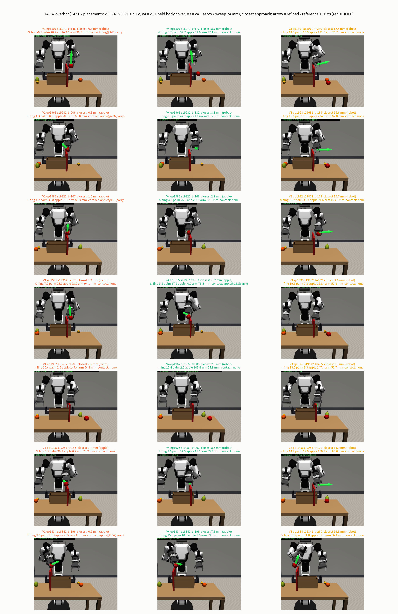

그림: [`t43w-scene`](figures/t43/t43w-scene.png) (P2 배치의 장면) · [`t43w-distance`](figures/t43/t43w-distance.png) · [`t43w-chunk-time`](figures/t43/t43w-chunk-time.png) · [`t43w-table`](figures/t43/t43w-table.png) · [`t43w-v5-arms`](figures/t43/t43w-v5-arms.png) (arm 별 막대) · [`t43w-v5b-v5s-pairs`](figures/t43/t43w-v5b-v5s-pairs.png) · [`t43w-v5-fail-scene`](figures/t43/t43w-v5-fail-scene.png) (V5 실패 run 의 실패 순간) · [`t43w-v5-focus`](figures/t43/t43w-v5-focus.png).

**측정 못 한 것.** server TO · round trip 시간은 공유 pod 의 부하와 섞여 있다 (부하 샘플 530 개, load 1 평균 17.3 · 최대 72.6). 청크별 clearance · SQP 반복 수는 기준선이 아니다 (wall-clock 예산). V6 은 유효한 closed loop run 이 없다.

---

### 3. Y · Z — place 진단, held 구 크기, release 규칙, E0 의 release (2026-10-06 03:20 ~ 06:47)

사용자 관찰 (2026-10-06 03:20): "`V5/H/V5_ep1925_s19253` — place 직전 바구니와 사과의 충돌로 놓지 못하는 것 같다" 와 "V4 영상은 place 때 사과를 미끄러지듯 놓는다. V5 에서 무엇이 바뀌어 개선됐나?". 둘 다 verifier 가 새 run 없이 기록 재생 (CPU) 으로 답했다 (물리 replay 의 qpos 불일치 0 행 · 38/38 run).

#### 3-1. Y1 — 1925 s19253 에서 무슨 일이 있었나

| | V4 (같은 ep · seed) | V5 |
|---|---|---|
| 쥔 사과 body cover 질의 구 반지름 | 39.19 · 39.19 · 8.89 mm | **58.33 · 55.80 mm** |
| HOLD chunk | 0 | **46** (전부 worst row = held 구 0 대 destination crate) |
| place_t (기존 규칙) | 216 | 352 |
| 손 열기 명령 (정책 / 실제 적용) | 216 / 221 | 248 / **582** |
| release (사과가 손에서 떨어짐) | t 222, **`open_cmd`** (열고 놓음) | t 369, **`closed_cmd`** (닫힌 채 빠짐) |
| server 의 detach | t 232 | **없음 — 끝까지 attached** |

V5 의 HOLD 46 chunk 는 모두 구 0 (r 58.33 mm) 이 destination crate 에 걸린 것이다: TO clearance −11.4 ~ −2.3 mm, `ESDF − r` +8.6 ~ +17.7 mm, 적용된 margin 20 mm (destination 규칙), **실제 crate 까지 거리 − r 은 +14.3 ~ +24.3 mm** (모든 구의 최소 +6.7 mm), 손–crate MuJoCo 접촉 0 행. HOLD 동안 사과는 손 안에서 미끄러졌다 (손–사과 상대 변위 8.8 → 19.7 mm, crate 프레임 사과 높이 88.0 → 72.9 mm, t 248 → 367) 가 t 369 에 높이 79.7 mm 에서 **닫힌 손에서 빠졌다.**

같은 모양의 V5 run (body cover 가 `segments` 모드, 구 반지름 52–59 mm): 1807 s18071 (trailing HOLD 50) · 1807 s18073 (47) · B 1807 s18071 (49). 대조로 V4 1834 s18341 도 trailing HOLD 가 46 chunk 이지만 구는 `sphere` 모드 (37.4 mm) 이고 held 행 위반 (최소 −30.8 mm) 이 binding 이다 — 같은 기전이라고 단정하지 않는다.

#### 3-2. Y2 — V4 와 V5 의 place 지표 차이

| (둘 다 성공한 14 짝) | V4 | V5 | 짝 차이 중앙 (V5 − V4) | p |
|---|---|---|---|---|
| release 때 사과–바닥 간격 중앙 (mm) | 110.8 | 76.4 | +1.9 | 0.79 (부호 검정) |
| release 때 수직 속도 중앙 (mm/s) | −480.2 | −530.9 | +2.1 | 1.0 |
| release 방식 | open 6 · closed 8 | open 6 · closed 8 | — | — |

V4 → V5 에서 place 지표의 차이는 **측정으로 구분되지 않았다.** 두 arm 의 실행이 갈라지는 첫 chunk 는 갈라진 18 쌍 모두에서 V5 의 `closing_kept_geometry` 첫 chunk (또는 그 +8 step) 이고, 그중 13 쌍은 그 chunk 에서 정책 reference 가 같다. V5 flag 3 개가 place 지표를 바꾼다는 증거는 이 기록에 없다.

#### 3-3. Z — 사용자 판정과 세 측정 (2026-10-06 04:30)

사용자 판정: (1) held 구 크기 그림을 보고 판단한다, (2) HOLD 를 벗어나는 방법을 제안한다, (3) **"손에서 떨어지면 attach 를 해제하고 그때부터 사과는 로봇과 연결되지 않는다"** (확정), (4) 성공 판정에 release 를 넣어 재채점한다, (5) E0 가 닫힌 채 놓는 비율을 잰다.

**Z1 — attach 시점의 held 구 크기** (`numbers.Z1`). crate 안쪽 반폭 x 82 mm · y 142 mm, destination margin 20 mm, 사과 mesh 반폭 x 33.4 · y 33.6 · z 30.3 mm (중앙).

| arm | attach run | body cover `segments` run | `segments` 의 최대 반지름 (중앙, mm) | `sphere` 의 최대 반지름 (중앙) | r + margin 이 crate x 반폭에 들어가는 run |
|---|---|---|---|---|---|
| V4 | 17 | 1 | 41.6 | 37.8 | **17 / 17** |
| V5 | 17 | **4** | **58.6** (58.3–59.1) | 38.4 | **13 / 17** |
| V5S | 13 | 2 | 58.4 | 38.4 | 11 / 13 |
| V5B | 14 | 1 | 56.7 | 38.4 | 13 / 14 |

56.7–59.1 mm 의 큰 구는 7 run (V5 4 · V5S 2 · V5B 1) 이고 전부 `segments` 모드이다 (V4 의 `segments` 1 run 은 41.6 mm). 이 큰 구는 `r + 20 mm` 가 82 mm 반폭에 들어가지 않는다. 그림: [`t43z-held-sphere-closeup`](figures/t43/t43z-held-sphere-closeup.png) · [`-scene`](figures/t43/t43z-held-sphere-scene.png) · [`-radii`](figures/t43/t43z-held-sphere-radii.png).

**Z4 — release 규칙으로 재채점** (`numbers.Z4`, H 14 run). 새 run 없이 75 run 을 새로 재생했고 (qpos 불일치 0 행), 기존 38 run 은 Y 의 값을 재사용했다.

| arm | S (기존) | release 한 run | S (release 규칙) | 열고 놓음 (`open_cmd`) | 닫힌 채 빠짐 (`closed_cmd`) |
|---|---|---|---|---|---|
| E0 | 0 | 0 | 0 | – | – |
| V1 | 6 | 7 | 6 | 1 | 6 |
| V3 | 3 | 4 | 3 | 1 | 3 |
| V4 | 10 | 12 | 10 | 3 | 9 |
| V5 | 12 | 12 | 12 | 4 | 8 |
| V5S | 10 | 11 | 10 | 4 | 7 |
| V5B | 12 | 12 | 12 | 4 | 8 |

**S 가 바뀐 run 은 0** (`n_flips`). 짝 p 값도 W 와 같다 (V5 대 V4 p 0.5, V5 대 V1 p 0.031). 즉 release 규칙은 **성공 · 실패를 바꾸지 않지만 "어떻게 놓았나" 를 드러낸다**: 닫힌 채 빠진 run 이 V4 H 9 / 12 · V5 H 8 / 12 이다. 그림: [`t43z-release-rescore`](figures/t43/t43z-release-rescore.png).

**Z5 — E0 는 닫힌 채 놓나** (GPU, E0 를 **장애물 없이** 같은 7 episode × 2 seed 14 run, 재시도 0, rc 0).

| 대상 | run | S / G / P | release | 닫힌 채 | 열고 | release 때 사과–바닥 간격 중앙 (mm) | 열릴 때 TCP 속도 중앙 (mm/s) |
|---|---|---|---|---|---|---|---|
| **E0 (Z5, 장애물 없음)** | 14 | 13 / 13 / 13 | 13 | **1** | 12 | 63.4 | 5.4 |
| E0 (T39, 장애물 없음, 같은 checkpoint) | 48 | 30 / 34 / 30 | 34 | 9 | 25 | 66.6 | 8.9 |
| V4 H (허들) | 14 | 10 / 12 / 10 | 12 | 9 | 3 | 189.2 | 35.3 |
| V5 H (허들) | 14 | 12 / 12 / 12 | 12 | 8 | 4 | 157.1 | 37.7 |
| V4 B (장애물 없음) | 5 | 4 / 4 / 4 | 4 | 1 | 3 | 64.0 | 34.9 |
| V5 B (장애물 없음) | 5 | 4 / 4 / 4 | 4 | 2 | 2 | 66.7 | 43.3 |

정책 단독은 **장애물이 없으면** 대부분 열고 놓는다 (닫힌 채 1/13 · 9/34). 허들이 있는 AG3S/TO arm 은 닫힌 채 빠지는 비율이 높다 (8–9 / 12). 그 원인을 이 기록만으로 단정하지 않는다. 그림: [`t43z5-release-graph`](figures/t43/t43z5-release-graph.png) · [`t43z5-release-table`](figures/t43/t43z5-release-table.png). Y 그림: [`t43y-y1-scene`](figures/t43/t43y-y1-scene.png) · [`-y1-timeline`](figures/t43/t43y-y1-timeline.png) · [`-y1-table`](figures/t43/t43y-y1-table.png) · [`-y2-scene`](figures/t43/t43y-y2-scene.png) · [`-y2-pairs`](figures/t43/t43y-y2-pairs.png) · [`-y2-table`](figures/t43/t43y-y2-table.png).

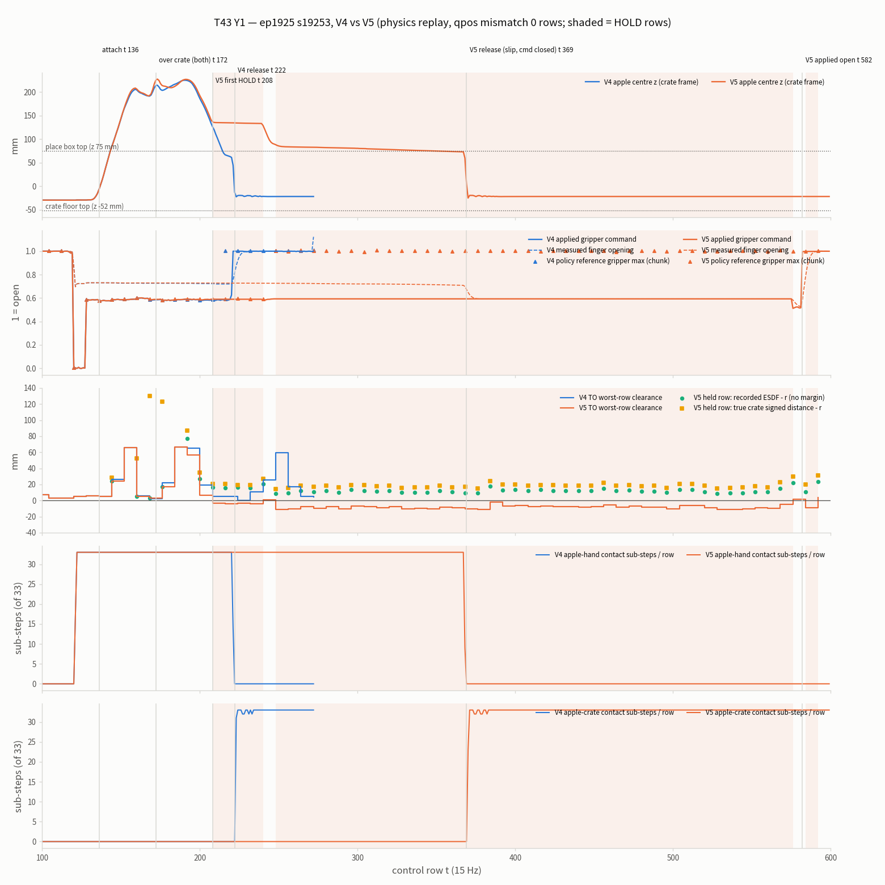

**해결된 것.** place 실패처럼 보이던 V5 1925 s19253 은 crate 충돌이 아니라 **큰 held 구 + destination margin 이 HOLD 를 만들고, HOLD 동안 닫힌 손에서 사과가 빠진 것** 이다 (실제 거리는 +14 ~ +24 mm, 접촉 0). 규칙 자체는 바뀌지 않았다 (S 변경 0).

**새로 드러난 문제.** (i) 사과가 손에서 빠져도 server 는 끝까지 attached 로 둔다 → 사과 위치에 phantom 구가 남아 HOLD 가 이어진다. (ii) `segments` 모드의 held 구는 56.7–59.1 mm 로 사과 반폭 33.4 mm 보다 훨씬 크다. 각각 §4 (Z3) 와 §5 (Z6) 의 입력이다.

---

### 4. Z3 · Z3V — 닫힌 채 손에서 빠지면 detach (2026-10-06 06:39 ~ 08:17)

**바꾼 것 (Z3, benchmark `cf6b410`, `--held-slip-detach`, 기본 off · off 면 비트 동일).** grasp latch 가 **실행 피드백만** 보고 (MuJoCo 정답은 쓰지 않는다) 판정한다. HELD 상태에서 측정 개도가 attach 순간보다 **0.05 이상 더 닫혔고**, 동시에 마지막 *실행된* gripper 명령과 **0.05 안으로 붙은** 요청이 **2 번 연속** 나오면 detach 하고 PLACED 로 넘어간다. 그 뒤 사과는 held 구 · body cover 없이 보통 장면 물체이다. (사과 점을 target cluster 로 읽지 않은 이유: HELD 동안 self-filter 가 사과 점을 지워 `manipulated` 상태가 attach 직전 관측에 동결된 `occluded` 이다. 38 run 에서 HELD 로 끝난 요청 720 개가 전부 그렇다 — 구현자.)

**오프라인 재생 (구현자, 서버 기록 38 run).**

| 항목 | 값 |
|---|---|
| release 전 HELD 요청 (모든 run) | 368 개. drop 최대 0.031 → 두 조건이 함께 선 요청 **0** |
| 닫힌 채 빠진 4 run (V5 1925 s19253 · 1807 s18071 · s18073 · B 1807 s18071) 의 detach t | 384 · 176 · 232 · 360 (측정 release t 369 · 165 · 215 · 345, 기록된 server detach 는 전부 없음) |
| 거짓 detach | 0 / 38 run |
| detach 지연 (2 요청 연속, 잡힌 17 run) | release 뒤 11–19 step, 중앙 16 |

**검증 (Z3V, `T43Z3V.verify.json`, V5D 19 run, 2026-10-06 08:17).**

| 항목 | V5 | V5D (+ slip detach) |
|---|---|---|
| S / G / P (H 14) | 12 / 12 / 12 | 12 / 12 / 12 (짝 일치 12, p 1.0) |
| 전체 19 run S | 16 | 16 (p 1.0) |
| place_t | — | V5 와 16 / 16 run 이 같다 |
| slip detach 가 난 run | 0 | **10** (예측 t 와 실제 t 가 확인한 6 run 모두 일치) |
| HOLD chunk (전체) | 217 | **58** |
| trailing HOLD chunk | 146 (3 run) | **0** |
| held 행 위반 chunk | 166 | **34** (detach 뒤 0) |
| detach 뒤 손가락이 binding 인 chunk 중 사과까지 10 mm 안 | 0 / 320 | 0 / 342 |
| obstacle stop 으로 끝난 run | 6 | **11** |

그림: [`t43z3v-scene`](figures/t43/t43z3v-scene.png) · [`t43z3v-graph`](figures/t43/t43z3v-graph.png) · [`t43z3v-table`](figures/t43/t43z3v-table.png).

**해결된 것.** place 이후 이어지던 phantom HOLD (trailing 146 chunk) 가 사라졌고 held 행 위반이 166 → 34 가 됐다. 성공 · place 시점은 V5 와 같다 (place_t 16 / 16 일치).

**새로 드러난 문제.** obstacle stop 으로 끝나는 run 이 6 → 11 로 늘었고, release 뒤 허들과 닿은 run (CT 규칙의 post-release contact) 이 4 → 9 가 됐다 (§6). HOLD 가 사라진 것과 같은 때에 두 수가 늘었다. 인과는 가르지 않았다.

---

### 5. Z6 · V7g · GD — held 구 상한, TO 궤적 따르기, subtask gate 켜기 (2026-10-06 07:10 ~ 09:47)

**사용자 판정.** (07:10) 구 크기는 **(a)**: held query 구 반지름 상한 + 구 중심을 사과 중심 근처로 제한. HOLD 원칙: "crate 테두리 · 바닥은 모두 장애물로 본다 (그대로). TO 가 그것을 피하는 궤적을 만들 것이니 **그 궤적을 따르도록 유도**한다. held target 의 collision 크기가 원래보다 과하게 크지 않으면 place 가 되어야 한다." 같은 시각, T40 사용자 판정 "subtask gate 는 끄고 진행" 이후 T41–T43 이 모두 `--no-subtask-gate` 였는데 그 이유 기록이 없어, lead 가 사용자에게 이유를 물었다. (08:10) "**gate 켜고 해봅시다**" → subtask gate on. "구가 정상 크기가 되었기 때문에 HOLD 가 많이 줄었을 것. 기록해보고, TO 궤적을 따르도록 진행."

**바꾼 것 (Z6, benchmark `f2f335b`, 둘 다 기본 off · off 면 비트 동일 · AG3SConfig 왕복 테스트 포함).**

1. `--held-cover-cap-mm MM` (근거값 10): attach 때 held query 구 (body cover 의 `sphere` · `segments` 와 H2 덮개) 를 관측 사과 크기 근처로 묶는다. 반지름 ≤ 관측 반폭 + a, 중심은 관측 몸통 중심에서 a 안 (밖이면 그 방향으로 당김), 같은 구 · 다른 구 안에 든 구는 뺀다. a = 10 mm 는 pad 5 + slip 5 와 같은 값이고, a = 15 mm 이면 1925 s19253 이 crate 반폭 82 mm 를 넘는다 (82.6 mm).
2. `--hold-follow-to N` (`follow_to` verdict): HOLD 였을 chunk 가 (i) HOLD 사유가 `collision` 뿐, (ii) 위반 행이 전부 margin 안쪽 (ESDF − r ≥ 0, 실제 침투 없음), (iii) 최소 clearance 가 같은 질의 구의 **현재 상태 clearance 보다 줄지 않음** (비악화), (iv) 실행할 것이 정책 reference 가 아님 — 을 모두 만족하면 HOLD 하지 않고 **TO refined chunk 를 실행**한다. 연속 한도 N.

**오프라인 (구현자, V5 기록 재계산).**

| 항목 | 값 |
|---|---|
| `segments` 4 run 의 구 반지름 | 58–59 → **43.3–43.4 mm** |
| 반폭 x + 20 mm (crate 반폭 82 mm 이내여야 함) | 88.6–93.8 → **72.6–72.9 mm** (4 run 모두 들어감) |
| 사과 mesh 덮음 | 2 run 완전, 2 run 은 꼭짓점 1.35 % 가 0.2 / 1.5 mm 밖 |
| 기록된 HOLD 중 follow_to 가 **확실히 실행**으로 바꿀 chunk | **0** (1925 s19253 의 손에 쥔 HOLD 20 chunk 중 18 은 "악화": 계획이 margin 밖에 있던 구 0 을 crate margin 안쪽으로 넣는다) |

**검증 (V7g, `T43V7g.verify.json`, 19 run, 2026-10-06 09:07).** V7g = V5 flags − `--no-subtask-gate` + `--held-slip-detach` + `--held-cover-cap-mm 10` + `--hold-follow-to 3`.

| 항목 | V5 | V5D | **V7g** |
|---|---|---|---|
| S / G / P (H 14) | 12 / 12 / 12 | 12 / 12 / 12 | 12 / 12 / 12 (V5 와 짝 일치 12, p 1.0) |
| HOLD chunk (전체 19 run) | 217 | 58 | **16** |
| 그중 held 행이 원인 | 166 | 34 | **1** |
| 그중 crate 위에서 | 215 | 54 | **12** |
| trailing HOLD | 146 | 0 | 0 |
| attach 때 body 구 최대 반지름 (17 attach run 중 최댓값) | 59.1 mm | 59.1 mm | **43.4 mm** |
| obstacle stop 으로 끝난 run | 6 | 11 | 8 |
| follow_to 실행 / 거절 | – | – | **0 / 16** (`hold_kinds` 11 · `worsens` 3 · `penetration` 2) |
| server 시간 (run wall, 중앙 s) | 226 | 197 | 230 |

그림: [`t43v7g-hold-breakdown`](figures/t43/t43v7g-hold-breakdown.png) · [`-pairs-table`](figures/t43/t43v7g-pairs-table.png) · [`-scene`](figures/t43/t43v7g-scene.png).

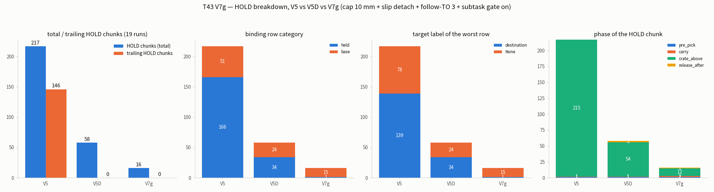

**gate on 의 효과 (GD, `T43GD.verify.json`, 2026-10-06 09:47).** V7 (gate off) 와 V7g (gate on) 를 같은 (episode, seed) 19 짝으로 돌렸다.

| 항목 | V7 (gate off) | V7g (gate on) |
|---|---|---|
| S / G / P / release (19) | 16 / 16 / 16 / 16 | 16 / 16 / 16 / 16 (갈린 쌍 0, p 1.0) |
| 접촉 포함 성공 (CT, 19) | 13 | 13 (갈린 쌍 0, p 1.0) |
| **PLACED 뒤 target switch** | **25** | **0** |
| PLACED 뒤 carve 된 chunk | 440 | 60 |
| `subtask_no_target` chunk (gate 가 target 을 일부러 비움) | 0 | 423 (15 run) |
| grounding `subtask_gated` · `no_admissible` chunk | 0 · 2 | 387 · 36 |
| PLACED 뒤 준비 자세까지 EE 거리의 최소 (SUBTASK-e 의 정의, run 중앙, mm) | 95.2 | 29.0 |
| HOLD chunk · obstacle stop run | 18 · 9 | 16 · 8 |

실행이 갈리는 첫 step 은 갈린 16 짝에서 **200–368** 이다 (PLACED 뒤). 직접 눈으로 비교하도록 같은 ep:seed 의 V7 (off) 대 V7g (on) 3rd person 영상을 좌우로 붙이고 아래에 시간축 (label · latch · HOLD · gate verdict) 을 그린 3 쌍을 만들었다 (`outputs/verify/T43/gate_demo/gd_{1968_s19683, 1995_s19953, 1925_s19251}.mp4`, 선택 규칙: V7g 에서 `subtask_no_target` 이 있는 짝 중 마지막 EE 거리 차가 큰 세 짝). 그림: [`t43gd-scene`](figures/t43/t43gd-scene.png) · [`-graph`](figures/t43/t43gd-graph.png) · [`-table`](figures/t43/t43gd-table.png).

**해결된 것.** (i) 큰 held 구가 만든 HOLD 가 사라졌다 (held 행 HOLD 166 → 1, crate 위 215 → 12). (ii) 성공 · 접촉 포함 성공은 gate on/off 에서 같다. (iii) gate 는 놓은 뒤 target switch 25 건을 0 으로 만들었다. §7 의 DX 가 찾은 "막대가 target-free 층에서 지워진 8 건" 은 8 건 모두 gate off arm 에서 PLACED 뒤 target 이 막대였던 순간이다.

**새로 드러난 문제.** (i) `follow_to` 는 실제로 한 번도 실행되지 않았다 (0 / 16). 구현자의 오프라인 재생 (확실히 실행으로 바뀌는 chunk 0) 과 같은 방향이다. (ii) 남은 HOLD 16 의 15 는 robot (base) 행이다. (iii) obstacle stop 은 8 run 에 남아 있다 (place 전 접촉 5 · release 뒤 접촉 6 run, §6).

---

### 6. CT — 접촉을 성공 판정에 넣는다 (2026-10-06 09:01)

**사용자 판정 (09:10).** "성공 판정에 접촉 포함" 확정. **접촉 포함 성공 (CT 규칙)** = release 규칙 성공 ∧ place 시점까지 로봇 · 사과가 허들과 닿은 MuJoCo contact 가 0. release 뒤 접촉 (돌아가는 길) 은 별도 열. H 126 run 을 CPU 로 재생했다 (qpos 불일치 0 / 126, contact pair · robot · payload 플래그가 `check.json` 과 126 / 126 일치).

| arm (H 14) | S (기존) | S (release) | **S (CT)** | place 전 접촉 run | release 뒤 접촉 run | obstacle stop run |
|---|---|---|---|---|---|---|
| E0 | 0 | 0 | 0 | 13 (전부 손) | 0 | 13 |
| V1 | 6 | 6 | **2** | 12 | 4 | 11 |
| V3 | 3 | 3 | 3 | 2 | 0 | 2 |
| V4 | 10 | 10 | **6** | 6 | 7 | 9 |
| V5 | 12 | 12 | **9** | 5 | 4 | 6 |
| V5D | 12 | 12 | 9 | 5 | **9** | 11 |
| V7g | 12 | 12 | 9 | 5 | 6 | 8 |
| V5S | 10 | 10 | 6 | 7 | 5 | 7 |
| V5B | 12 | 12 | 10 | 3 | 7 | 8 |

- 접촉 포함으로 빠진 성공 (S release − S CT): V1 4 · V4 4 · V5 3 · V5D 3 · V7g 3 · V5S 4 · V5B 2 run. 운반 중 사과–막대 접촉은 25 run 에 있고 침투 최대 2.45 mm 이다 (V4 · V5 · V5D · V7g 만 보면 0.19–0.70 mm).
- release 뒤 접촉은 대부분 손가락이다 (MJCF 이름으로 `ee_finger_l2` 28 run, 침투 최대 3.0 mm · `ee_finger_l1` 8 run, 2.8 mm). **주의: CT 의 손가락 이름은 MJCF 이름이고, 왼손은 URDF 와 서로 바뀌어 있다** (MJCF `ee_finger_l2` = URDF `ee_finger_l1`). §8 TK 의 정정이 이것에서 나왔다.
- 짝: V5 대 V4 CT 성공 4 / 1 (p 0.375), V5D 대 V5 0 / 0, V7g 대 V5D 2 / 2 (p 1.0).

그림: [`t43ct-graph`](figures/t43/t43ct-graph.png) · [`t43ct-table`](figures/t43/t43ct-table.png). 

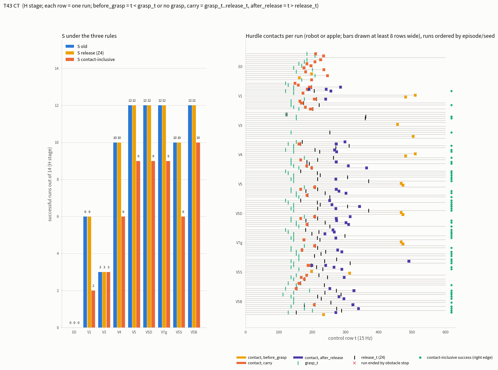

**새로 드러난 문제.** 기존 규칙에서 12 / 14 이던 V5 · V7g 가 접촉 포함으로는 9 / 14 이다. 접촉은 (i) **운반 중 사과–막대**, (ii) **release 뒤 손가락–막대** 두 곳에 몰린다. 둘은 §7 (DX) · §8 (TK · OC · HX) 이 원인을 본다.

---

### 7. FC · V8 · FR · DX — 손가락마다 따로 실제 굵기의 구, 그리고 접촉 진단 (2026-10-06 09:10 ~ 12:00)

**사용자 판정.** (09:10) "그리퍼의 충돌구를 하나로 통틀어서 하지 말고, 2지 그리퍼이기 때문에 두 개의 충돌 구로" — 해석 확인. (10:00) "내가 말하고자 한 것은 **B — 한 그리퍼마다 양쪽 손가락을 구로 감싸는 방법**." (11:10) "네 진행하세요. 진단도 opus verifier 에게. 구의 개수가 너무 많다면 줄일 수 있는 방안도 TO 시간에 따라서 결정."

**바꾼 것 (FC, benchmark `786cf1b`, `--finger-cover [both|left|right]` · `--finger-cover-overflow MM`, 기본 off · off 면 비트 동일).** 손가락 link 4 개를 **각각 따로**, 손가락 collision mesh 를 담는 구 사슬로 덮는다. 손가락 사이 공간은 비우고 (한 덩어리로 감싸지 않음), 손바닥과 다른 link 는 그대로이다. 기존 수단은 둘 다 부적합했다: `--capsule-radius-scale-link ee_finger_*=1.0` (URDF 상당) 은 mesh 밖으로 19.67 mm 넘치고, T43 R `--gripper-cover` 는 파지 면을 덮지 않고 반지름 상한이 3.25 mm 라 손가락 표본의 3.4 % 만 구 안에 든다 (구현자).

**오프라인 (구현자, W · Z3V · V7g + E0 기록 150 run).**

| 항목 | 이전 (축선 사슬, 배율 0.05) | **FC (overflow 2.5 mm)** |
|---|---|---|
| 손가락 구 수 (한 손가락) · 전체 | 19 · 122 | **56 · 270** |
| 구 반지름 | 2.6–3.3 mm | 2.5–8.4 mm |
| mesh 표본 중 구 안에 든 비율 · 구 밖 표본 수 | 3.2 % | **100 % · 0 / 20,774** |
| mesh 밖으로 넘침 (최대) | 5.05 mm | 2.55 mm |
| 최대 gripper 개도 | 102.3 mm | **94.3 mm** (사과 66.6 mm) |
| CT 손가락–막대 접촉 57 건을 실제 기하로 보나 | 47 / 57 | **57 / 57** |
| 같은 접촉 중 기록된 거리장으로 보나 (거리장이 있는 44 건) | 36 | 34 |
| closing · attach 1254 chunk 중 margin 0 위반 | 5 | 7 (새 3 chunk 는 전부 서버가 이미 HOLD) |
| TO 벽시계 중앙 (CPU 자가 측정, C1807 / B1968, ms) | 43.7 / 39.7 | 72.7 / 56.7 (×1.4–1.7) |

거리장으로도 못 본 8 건은 그 청크의 거리장에 그 자리의 막대가 없다 (d − r 이 +4 ~ +56 mm). 구 모델로 고칠 수 없다.

**검증 (V8, `T43V8.verify.json`, 19 run, 2026-10-06 11:30).** V8 = V7g + `--finger-cover both` (서버 로그: gate ON · 구 122 → 270).

| 항목 (H 14) | V7g | **V8** |
|---|---|---|
| S / G / P (기존 규칙) | 12 / 12 / 12 | **13 / 14 / 13** (성공이 갈린 쌍 V8 만 2 · V7g 만 1, p 1.0) |
| 접촉 포함 성공 (CT) | 9 | 8 (V8 만 3 · V7g 만 4, p 1.0) |
| 장애물 없음 B: S | 4 / 5 | 5 / 5 |
| release 뒤 손가락–막대 접촉 run (최대 침투) | 5 (2.7 mm) | **9 (5.8 mm)** |
| 운반 중 사과–막대 접촉 run | 3 | 5 |
| 운반 중 손 접촉 | 0 | 0 |
| obstacle stop run | 8 | 10 |
| HOLD chunk | 16 | **6** (finger 3 · held 3) |
| TO 중앙 / p90 / 최대 (ms, 전체 chunk) | 57.6 / 102.0 / 393.4 | 69.9 / 103.1 / 758.4 |
| client round trip 중앙 (ms) · 533.3 ms 초과 chunk 몫 | 1020.3 · 1.0 | 947.3 · 1.0 |

두 arm 은 서로 다른 서버 세션이다 (첫 chunk JIT 시간은 인용하지 않았다). 그림: [`t43v8-finger-spheres-scene`](figures/t43/t43v8-finger-spheres-scene.png) (손에 겹친 새 손가락 구, 계획 행 0 의 자세) · [`t43v8-timing`](figures/t43/t43v8-timing.png) · [`t43v8-pairs-table`](figures/t43/t43v8-pairs-table.png).

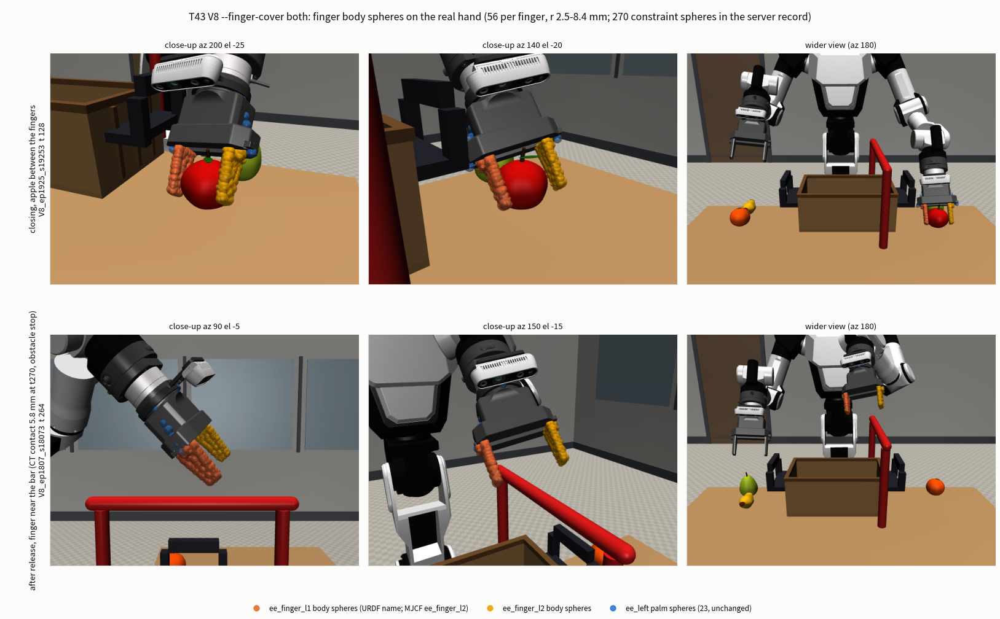

**FR — 구 수를 줄이는 선택지 (구현자, benchmark `a297155`, 기본값은 그대로).** 새 flag 셋 (`--finger-cover-solver {greedy,ilp}` · `--finger-cover-gap` · `--finger-cover-max-spheres`, 전부 기본 off).

| 선택지 | 구 / 손가락 · 전체 | 덮지 못한 표본 | 넘침 (mm) | 최대 개도 (mm) | CPU TO (FC 기본 대비) | 새 margin 0 HOLD 후보 |
|---|---|---|---|---|---|---|
| FC 기본 (greedy 2.5) | 56 · 270 | 0 | 2.55 | 94.3 | ×1.00 | 0 |
| **ilp 2.5** (같은 보장, 구만 최소) | 46 · 230 | 0 | 2.52 | 94.3 | ×0.89–0.92 | 0 |
| ilp 3 | 32 · 174 | 0 | 3.01 | 93.3 | ×0.81 | 0 |
| **ilp 4** | **19 · 122** | 0 | 4.01 | 91.3 | **×0.70** | 0 (10 mm 띠 청크 97 → 135) |
| greedy 5 | 24 · 142 | 0 | 5.01 | 89.3 | ×0.75–0.76 | **7** |
| greedy K 8 (개수 상한) | 8 · 78 | 11,673 | 2.49 | 94.9 | ×0.61–0.63 | 0 (표본 56 % 가 최대 9 mm 밖) |

TO 시간은 CPU 에서 잰 비율이라 GPU 로 바로 옮기지 않는다 (구현자). 사용자는 "구 수는 TO 시간에 따라" 라고 했고, **2026-10-06 12:40 에 "finger-cover 는 기본 구성에 유지, 구 수 조정은 추후"** 로 정했다.

**DX — 접촉의 원인 (`T43DX.verify.json`, 기록 재생 · 새 run 없음, 2026-10-06 10:46).**

*(1) 운반 중 사과–막대 접촉 25 건.*

| 항목 | 값 |
|---|---|
| TO 계획에서 held 행 clearance | 25 / 25 에서 ≥ 0 (최소 3.8 mm), 25 / 25 `feasible` · certified · execute |
| 계획 자세에서 쥔 구–막대 거리 | 6.5 ~ 40.3 mm (중앙 10.8) |
| 실제 쥔 구–막대 거리 (접촉 순간) | −11.5 ~ +11.4 mm (중앙 −7.2) |
| 실제 손 위치 − 계획 손 위치 | **23.5 ~ 67.1 mm (중앙 43.8)**, 지연 step 은 22 / 25 가 2 |
| 운반 행 전체의 같은 편차 (C − M, n 2517) | 중앙 15.0 · p90 31.0 mm |
| worst row 가 held 행이었던 chunk | 16 / 25. **held 행에 허들 margin (10 mm) 이 걸린 경우 0 / 25** (class `held` 는 obstacle margin 대상이 아니다) |
| 사과가 손 안에서 pad 5 mm 보다 더 미끄러짐 | 18 / 25 |
| body cover 가 사과를 덮는 비율 | 중앙 0.78 (최소 0.41), 덮지 못하는 event 8 / 25 |

*(2) release 뒤 손가락이 막대를 못 본 8 건 (FC 의 "거리장으로도 못 본" 8 건).* 8 건 모두 **PLACED · subtask `home` 이후**이고 arm 은 gate off 인 V4 · V5 · V5S · V5B · V5D 이다.

| 확인한 것 | 8 건 중 |
|---|---|
| 막대 점이 raw 점군에 없음 | 0 |
| self-filter 가 점군에서 지움 | 0 (막대 픽셀이 self-filter mask 에 일부 든 event 2) |
| 막대가 **full 층에** 있음 | **8** |
| 막대가 **target-free 층에서 없음** | **8** |
| 손가락 질의가 target-free 층을 읽음 | **8** |
| 그때 조작 대상 (target) 이 막대 자신 | **8** |
| 헤드 카메라가 막대 근처를 가림 | 6 (왼 손목 카메라는 8 / 8 에서 막대 픽셀 보임) |

즉 이 8 건은 PLACED 뒤 target 이 막대로 switch 되어 막대가 carve-out 되었고, 손가락 (target 접촉 권한이 있는 link) 이 target-free 층을 읽은 것이다. subtask gate (§5) 가 이 switch 를 막는다. 그림: [`t43dx-1-apple-scene`](figures/t43/t43dx-1-apple-scene.png) · [`-2-apple-graph`](figures/t43/t43dx-2-apple-graph.png) · [`-3-table`](figures/t43/t43dx-3-table.png) · [`-4-finger-scene`](figures/t43/t43dx-4-finger-scene.png) · [`-5-finger-graph`](figures/t43/t43dx-5-finger-graph.png).

**해결된 것.** 손가락 mesh 가 구로 완전히 덮이고 (미덮음 0), 실제 기하로 본 접촉 감지가 47 / 57 → 57 / 57 이 됐다. V8 의 HOLD 는 16 → 6. 파지 G 는 12 → 14.

**새로 드러난 문제.** (i) release 뒤 손가락–막대 접촉이 5 → 9 run, 침투 최대 2.7 → 5.8 mm 로 **늘었다.** (ii) 운반 중 사과 접촉 25 건에서 TO 는 계획대로 통과했지만 (25 / 25), 실제 손은 계획에서 23–67 mm 벗어났다. 계획이 틀린 것이 아니라 **실행이 계획을 따라가지 못한다.** (iii) held 행에는 허들 margin 이 걸리지 않는다 (0 / 25). (iv) TO 중앙은 69.9 ms 이지만 client round trip 중앙이 947.3 ms 이고, 모든 chunk 가 chunk period (533.3 ms) 를 넘는다. (i) · (ii) 는 §8 의 질문이 된다.

---

### 8. TK · OC · HX — 실제 손은 왜 TO 계획에서 벗어나는가 (2026-10-06 12:40 ~ 2026-10-07 08:24)

**사용자 판정.** (2026-10-06 12:40) "진단해보세요, C 로" — 계획이 맞는데 실제 손이 벗어나는 원인을 가른다. gate on 유지 (막대 admissibility 추가 작업은 하지 않음). (2026-10-07) 사용자 가설: "place 할 때 **팔에 의해서 허들이 보이지 않아서** 그런 것 아닐까?" 와 "허들을 넘을 때의 궤적과 그때 그리퍼와 허들의 충돌 거리를 측정하고, 음수이거나 margin 을 넘었다면 **왜 궤적을 수정하지 못했는지** 분석" — OC · HX 로 나눠 Opus verifier 가 맡았다.

#### 8-1. TK — 계획(P) · 명령(C) · 측정(M) 세 자세를 분리해서 잰다

각 chunk 의 행 k 마다 **P** = TO refined 행 k 의 FK, **C** = client 가 그 step 에 실제로 내린 명령 (`d.ctrl`), **M** = MuJoCo 측정 qpos. 새 run 없이 V7g 18 run · V8 19 run · E0 14 run 의 기록으로 쟀다 (`T43TK.verify.json`). 서버에 `--servo-model` 은 없었다.

| 운반 중 행 | V7g | V8 | E0 (TO 없음) |
|---|---|---|---|
| 행 수 | 1142 | 1762 | 997 |
| **P − C** (계획과 명령의 차) 중앙 · p90 | **0.0 · 0.0 mm** | **0.0 · 0.0 mm** | – |
| **C − M** (명령과 측정의 차) 중앙 · p90 | 20.3 · 31.5 mm | 15.1 · 31.0 mm | 20.0 · 31.1 mm |
| 손이 움직이는 행에서 EE 가 명령을 따라가는 지연 τ 중앙 | 1.95 행 | 1.90 행 | 1.95 행 |
| 명령 − 정책 reference (`refined − reference`) 중앙 | 5.4 mm | 5.1 mm | – |

- client 는 refined chunk 를 그대로 `d.ctrl` 에 넣는다 (P − C = 0). 벗어남은 전부 **명령 → 측정** 구간이다.
- MuJoCo position actuator 의 모델 값은 `(kv + b) / kp` = **2.39–2.75 행** (왼팔 7 관절, kp 1500–2000) 이고 실측 τ ≈ 1.9–1.95 행과 같은 크기이다. 이것이 이 절의 **servo lag (actuator tracking lag ≈ 2 행)** 이다. 한 행은 0.066 s 이므로 약 0.13 s 이다.
- **E0 (TO 없음) 의 C − M 이 같다** (중앙 20.0 mm). TO 가 만든 현상이 아니다.
- 한 chunk 의 client round trip 중앙은 V7g 1185.2 ms · V8 948.2 ms 이고 chunk 의 sim 시간은 0.528 s 이다.

그림: [`t43tk-timeline`](figures/t43/t43tk-timeline.png) (P/C/M 시간축) · [`-scene`](figures/t43/t43tk-scene.png) · [`-table`](figures/t43/t43tk-table.png) · [`-contacts`](figures/t43/t43tk-contacts.png).

**TK 정정 (2026-10-07, V9 verifier 가 `_superseded` 로 남김).** 처음 쓴 TK 는 release 뒤 왼손 손가락–막대 접촉 14 건 (V7g 5 · V8 9) 에서 "**ESDF 가 막대를 실제 거리보다 +57 / +67 mm 멀게 본다**" 고 적었다. 원인은 이름이었다: **왼손 손가락의 이름이 MJCF 와 URDF 에서 서로 바뀌어 있다** (MJCF `ee_finger_l1` = URDF `ee_finger_l2`, 반대도 같다; 오른손은 같다). 접촉한 MJCF body 를 같은 이름의 TO link 에 대응시킨 것이 틀렸다. 올바른 이름 대응 (OC 의 `namemap_V8.json` 으로 측정) 으로 다시 계산했다.

| (release 뒤 왼손 손가락, 계획 자세) | 정정 전 (`_superseded`) | **정정 후** |
|---|---|---|
| V7g 5 건: ESDF 가 답한 거리 − 기하 거리 (중앙 · 최대) | +56.8 · +80.8 mm | **−1.3 · +2.6 mm** |
| V8 9 건: 같은 값 | +66.9 · +81.6 mm | **−12.8 · −3.1 mm** |
| V7g: 접촉 행 k 의 TO clearance (중앙 · 최대) | 89.8 · 104.2 mm | **15.4 · 31.9 mm** |
| V8: 같은 값 | 99.7 · 149.8 mm | **19.9 · 61.4 mm** |

즉 "ESDF 가 막대를 못 본다" 는 문장은 **철회**한다. 바뀐 접촉은 14 건이다.

#### 8-2. OC — 가림 가설과 거리장 (2026-10-07 08:11)

대상은 TK 의 release 뒤 접촉 16 건 (V7g 손 5 + 팔 1, V8 손 9 + 팔 1; gate on).

| 확인한 것 | V7g 손 5 | V8 손 9 |
|---|---|---|
| 접촉 chunk 의 관측에서 막대 픽셀이 접촉 부위 근처에 보임 (아무 카메라) | **5 / 5** | **9 / 9** |
| 그중 왼쪽 손목 카메라 · 헤드 카메라 | 5 · 4 | 9 · 7 |
| 마지막으로 막대가 보인 뒤 지난 chunk 수 | 전부 0 | 전부 0 |
| 막대 점이 raw 점군에 있음 · self-filter 전후 같음 | 5 · 5 | 9 · 9 |
| 막대가 거리장의 **full 층에** 있음 | 5 | 9 |
| target-free 층이 있는 접촉 | 0 | 0 |
| PLACED 뒤 target switch | 0 | 0 |
| 접촉 순간 `field − mesh` 거리 중앙 | 0.44 mm | 1.69 mm |

- 팔 접촉 2 건 (V7g 1 · V8 1) 은 full 층에 막대가 있고 (2 / 2) target-free 층이 있다.
- 거리장은 **episode 동안 누적**된다: TSDF 는 카메라마다 running weighted sum 으로 쌓고 (`curobo_builder.py:951` mapper.integrate, kernel `builder_camera_integrate.py:544`/`:556-559`), decay 는 꺼져 있고 (time_decay 1.0 · frustum_decay 1.0), 가려진 voxel 은 옛 값을 유지한다. 거리장 builder 는 한 번 만들어 episode 내내 유지되고 reset 때만 버려진다 (`pipeline.py:2464-2477`). 그래서 팔이 막대를 잠깐 가려도 막대 표면이 거리장에서 사라지지 않는다. eikonal 기울기 중앙 0.999 (V8 1807 s18073 chunk 73).
- **가림 가설은 이 기록으로 지지되지 않았다.** 그리고 TK 의 +57 / +67 mm 가 이름 대응 오류였음이 OC 에서 확인됐다 (TK 값 = OC 가 MJCF 이름 link 로 잰 값, 14 / 14).

**V8 1807 s18073 t168 의 −0.9 mm chunk.** TO 결과 clearance 가 −0.87 mm 인데 실행된 경위: 위반 행은 `ee_finger_l1` (URDF, 구 반지름 7.19 mm) 이고 분류가 **권한 link ↔ 조작 대상 (id 0, 사과)** 이다 — MJCF 로 재면 손가락–사과 −0.13 mm, 손가락–막대 29.6 mm 로 막대와는 떨어져 있다. 이 행의 `d − r` 은 +19.1 mm 인데 적용된 margin 이 20 mm (implied) 라서 clearance 가 −0.87 mm 로 나왔고, obstacle margin 10 mm 였다면 +9.13 mm 이다. verdict 는 `allowed_contact` (권한 link 대 조작 대상이라 접촉 허용) + `budget_only` (SQP 3 회 상한에서 멈춤, 최종 검사는 통과) 로 `execute` 였다. 초기 위반 46.8 mm 가 0.9 mm 로 줄어 있었다.

그림: [`t43oc-scene`](figures/t43/t43oc-scene.png) · [`-depthmask`](figures/t43/t43oc-depthmask.png) · [`-esdf`](figures/t43/t43oc-esdf.png) · [`-history`](figures/t43/t43oc-history.png) · [`-table`](figures/t43/t43oc-table.png).

#### 8-3. HX — 허들 근처에서 margin 아래로 들어간 순간은 왜 TO 가 못 고쳤나 (2026-10-07 08:24)

**순간 (moment)** = 허들 100 mm 안의 행에서 **실제(M) 자세의 기하 거리가 10 mm (obstacle margin) 미달**인 것. V7g · V8 · V5 의 허들 14 run 에서 실행된 순간이 모두 **234** 개이다 (V7g 89 · V8 89 · V5 56). 순간마다 원인을 먼저 맞는 규칙 하나로 나눈다.

| 원인 (먼저 성립하는 규칙) | V7g | V8 | V5 | 합 |
|---|---|---|---|---|
| **(i)** 계획 P (= 명령 C) 는 이미 10 mm 이상 떨어져 있었고, 측정 M 만 들어왔다 — **servo 추종 지연** | 89 | 87 | 56 | **232** |
| (ii) TO 가 위반을 봤지만 해를 못 찾음 (SQP 반복 · slack · 예산) | 0 | 0 | 0 | 0 |
| (iii) ESDF 오차 (기하 거리와 ESDF 가 다름) | 0 | 0 | 0 | 0 |
| (iv) margin 0 인 행 (쥔 사과) | 0 | 2 | 0 | 2 |
| (v) 기타 | 0 | 0 | 0 | 0 |

- 접촉 22 건 (손가락 release 뒤 14 + 사과 운반 중 8) 에서 **TO 가 본 clearance 가 음수인 chunk 는 0** (`to_clear_lt0`).
- **servo model 오프라인** (`benchmark/trajopt/servo.py` 의 모델을 기록된 명령에 적용): 예측한 EE 위치와 실제 M 의 차이가 모든 실행 행에서 중앙 **0.02–0.08 mm** · p90 0.31–0.38 mm (V7g 0.024 · 0.313, V8 0.079 · 0.376, V5 0.038 · 0.343). **명령을 그대로 M 이라고 보면 중앙 6.2–8.0 mm · p90 26.9–28.1 mm** 이다.
- 같은 모델로 접촉 22 건을 보면, 예측 상태가 10 mm 미달인 것이 22 / 22, 접촉(< 0)으로 예측한 것이 16 / 22 이다.
- 속도 상한 문서 값 10.8° (관절 모두 같은 값으로 가정) 은 이후 TA 가 관절마다 다름을 고쳤다 (§12).

그림: [`t43hx-scene`](figures/t43/t43hx-scene.png) (통과 궤적) · [`-timeline`](figures/t43/t43hx-timeline.png) · [`-cause-table`](figures/t43/t43hx-cause-table.png).

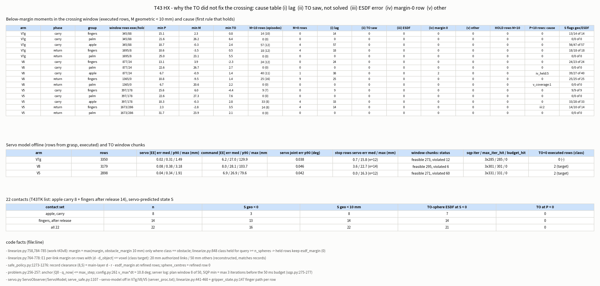

**해결된 것(= 답이 나온 것).** 계획은 맞았고 (TO 가 본 clearance 가 음수인 접촉 0), **약 2 행의 servo lag 가 접촉의 직접 원인**이다 (234 순간 중 232). 가림 가설 · ESDF 오차 · SQP 실패는 이 기록에서 0 이다. 그리고 servo 모델의 예측 오차는 중앙 0.1 mm 안 (p90 0.4 mm 안) 이다.

**새로 드러난 문제.** (i) 이 모델을 TO 에 넣으면 (§9, V9) 접촉이 사라지는가? (ii) 쥔 사과 행에는 허들 margin 이 없다 (§7 DX, §10 HM). (iii) 사과 운반 중 명령–측정 차이 (C − M) 중앙이 15–20 mm 인데 obstacle margin 은 10 mm 이다.

---

### 9. V9 · SV — servo 모델을 TO 에 넣었더니 파지가 깨졌다 (2026-10-07 10:09 ~ 10:46)

**사용자 판정 (2026-10-07).** "V9 진행." V9 = V8 + `--servo-model` (sweep 없이). 이어서 "servo model 을 켜면 파지가 왜 깨지는지 Opus verifier 에게. 해결하기 어렵거나 불필요하면 servo model 을 켜지 않은 상태로 한다. 목적은 place 이후 복귀 단계의 그리퍼–허들 접촉."

**V9 결과 (`T43V9.verify.json`, 19 run, V8 과 짝).**

| 항목 | V8 | **V9** | 짝 검정 |
|---|---|---|---|
| H 14: S (기존) | 13 | **2** | V8 만 11 / V9 만 0, p 0.00098 |
| H 14: G | 14 | **5** | V8 만 9 / 0, p 0.0039 |
| B 5: G | 5 | 1 | V8 만 4 / 0, p 0.125 |
| H 14: S (CT) | 8 | 2 | V8 만 7 / V9 만 1, p 0.070 |
| 손가락–허들 접촉 run (release 뒤) | 9 | **0** | |
| obstacle stop run | 10 | 1 | |
| HOLD chunk (trailing) | 6 (0) | 17 (13) | |
| TO 중앙 / p90 / 최대 (ms) | 69.9 / 103.1 / 758.4 | **187.5 / 322.7 / 646.7** | |
| round trip 중앙 (ms) | 947.3 | 1176.2 | |
| servo 예측 vs M (모든 실행 행, 중앙 · p90) | 0.067 · 0.384 mm | 0.064 · 0.348 mm | |
| 명령을 그대로 M 이라 볼 때의 오차 (같은 행, 중앙 · p90) | 6.8 · 26.0 mm | 7.0 · 19.8 mm | |

H 14 run 의 V9 분류 (XM): 성공 2 · 허들 근처에서 낙하 2 · 허들에서 먼 곳에서 낙하 1 · **attach 안 됨 5** · attach 뒤 revoke 4. 사용자 관찰 (2026-10-07): "V9: pick 은 잘 잡는다. 허들을 넘을 때 TO 가 과하게 작용해 그리퍼 쪽만 허들 반대 방향으로 밀어낸다 … 이 과정에서 사과를 떨어뜨린다" — 낙하로 분류된 run 은 3 (허들 근처 2 · 먼 곳 1) 이고, attach 가 안 된 5 run 과 attach 뒤 revoke 4 run 은 이 관찰이 설명하지 않는다 (§11 에서 편향 방향을 잰다). 그림: [`t43v9-hurdle-crossing-scene`](figures/t43/t43v9-hurdle-crossing-scene.png) · [`-timing`](figures/t43/t43v9-timing.png) · [`-pairs-table`](figures/t43/t43v9-pairs-table.png).

**SV — 파지가 왜 깨지나 (`T43SV.verify.json`, 기록 재생, 2026-10-07 10:46).** V9 가 V8 보다 못 쥔 19 쌍 중 13 쌍 (`no_attach` 7 · `attach_revoked` 6; H 9 · B 4) 을 같은 표로 놓았다.

| 항목 (실패 13 쌍의 closing 직전 3 chunk) | V8 | **V9** |
|---|---|---|
| binding 행 종류 (78 chunk) | waypoint **78 / 78** | **path 71 / 78**, waypoint 7 |
| 그중 `path:support:table` (테이블을 받침으로 본 path 행) | 0 | **40** |
| 첫 closing 때 손끝–사과 (중앙) | 37.7 mm | **46.3 mm** |
| 첫 closing 때 손끝의 수평 거리 (dxy) · 사과 대비 높이 (dz) 중앙 | 24.0 · −28.5 mm | 43.0 · −18.6 mm |
| 손가락 받침면(support) 행 clearance 중앙 (계획 P · 예측 S · 실제 M) | 6.5 · −1.5 · −1.4 mm | **14.4 · 6.0 · 5.9 mm** |
| outward > 2 mm 인 chunk (78 중) · 연속 시작 | 6 · 0 | **34 · 22** |
| closing 최대 outward 중앙 | −7.6 mm | +9.5 mm |

- path 행이 binding 인 71 chunk 중 58 에서 그 행이 target-free 층을 읽는다 (F1 예외 대상). target 행이 TO 에서 빠진 chunk 는 0.
- V3 (servo + sweep) 의 파지 손실 10 쌍 (전부 `no_attach`) 도 같은 모양이다: closing 직전 `path:support:table` 43 / 60 chunk, outward > 2 mm 40 / 60 (V4 는 3 / 60).
- 즉 servo 가 예측한 경로 행에서 **손가락이 테이블 받침 band 에 걸려 TO 가 손가락을 약 8 mm 들어 올린다** (계획 P 중앙 6.5 → 14.4 mm). 그 결과 closing 때 손끝이 사과에서 멀어진다. 이 측정으로 servo 와 sweep 중 어느 쪽이 원인인지는 가르지 못했다 (sweep 만 있는 arm 의 closed-loop 기록이 없다 — `not_measured`).

**복귀 단계만 보는 대안 (SV, V8 · V7g 의 release 뒤 손가락 접촉 14 건 · 운반 중 사과 접촉 8 건에 오프라인 적용).**

| 대안 | 복귀 손가락 접촉(V8 9) 을 미리 봄 (행 선행 중앙) | 운반 중 사과 접촉(V8 5) | 새 HOLD 상한 (V8 복귀 434 chunk) |
|---|---|---|---|
| 지금 (margin 10 mm) | 0 / 9 | 0 / 5 (held margin 0) | 0 |
| (a) servo 예측 clearance < 10 mm | **9 / 9** (7 행) | 5 / 5 (7 행) | 37 chunk |
| (b) obstacle margin 20 mm | 7 / 9 (8 행) | 5 / 5 (14 행) | **115** chunk |
| (b) margin 30 mm | 8 / 9 (10.5 행) | 5 / 5 | 202 chunk |
| (b) margin 40 mm | 9 / 9 (14 행) | – | 297 chunk |

**사용자 판정 (2026-10-07): "servo-after-placed 는 철회."** (a) 를 "PLACED 뒤 (복귀) 에만 servo 를 켠다" 로 쓰면 **PLACED 개념은 pick-and-place 전용**이라는 이유로 철회했다. "모든 시나리오에 적용 가능해야 함." 이후 arm (V10 · V11) 은 servo 모델을 TO 에 넣지 않았다. servo 모델은 평가 도구로만 쓴다.

**해결된 것.** 복귀 접촉은 사라졌다 (9 → 0) — 그러나 파지가 무너졌다.

**새로 드러난 문제.** servo 모델을 TO 에 쓰려면 **받침면(테이블)과 path 행의 처리**를 고쳐야 한다 (closing 중 손가락–테이블 band). 이 일은 하지 않았다. V9 는 TO 시간도 늘렸다 (중앙 69.9 → 187.5 ms).

---

### 10. HM · V10 — 쥔 사과 행에 손가락과 같은 분류 · margin (2026-10-07 10:32 ~ 12:32, 보류)

**사용자 판정 (2026-10-07).** "쥔 순간부터 사과는 로봇에 해당 → 허들을 피해야 한다. 손가락과 같은 분류를 적용하고 margin 도 준다 — 모두 동의, 병행." (DX 가 held 행에 허들 margin 이 0 / 25 로 걸리지 않음을 보였다.)

**바꾼 것 (HM, benchmark `308ddfd`, `--held-obstacle-margin`, `--obstacle-margin` 이 필요 · 기본 off · off 면 비트 동일).** held 질의 행도 **최근접 표면이 무엇인지로** 가른다. 순서: (1) 지지면 (테이블, 평면 판정 2 voxel) → margin 없음, (2) 쥔 사과 자신의 잔상 (최근접 표면점이 attach 때 비운 부피 + 2 voxel = 10 mm 안) → margin 없음, (3) 나머지는 `obstacle` → `max(기존, obstacle_margin)` = 10 mm. 목적지 20 mm 는 그대로 (겹치면 큰 값). 잔상 규칙은 O7 (lift 한 사과 자신의 상) 때문에 넣었다: 표면이 attach 부피에서 가장 가까운 거리가 사과 자신의 상은 −9.2 ~ 7.3 mm, 허들은 199.1 mm 이상이었다 (구현자, V7g · V8 35 grasp run).

**오프라인 (구현자, V7g · V8 기록).**

| 항목 | 값 |
|---|---|
| 운반 중 사과–막대 접촉 8 건의 계획 자세 held 행 최소 clearance | **+3.8 ~ +8.2 → −1.8 ~ −6.2 mm** (TO 가 위반을 보는 것 0 / 8 → **8 / 8**) |
| attach · 들어 올림 105 chunk 에서 새 위반 | **0** |
| crate 진입 78 chunk 의 새 위반 (label bracket 상한 B0 · 하한 B1) | 39 · 11 (원인: crate 18 · hurdle 4 · 사과 2 · 정체 불명 8 …) |
| 나머지 운반 248 chunk 의 새 위반 (B0 · B1) | 49 · 42 |

새 위반이 곧 HOLD 는 아니다 (TO 가 계획을 옮겨야 한다는 뜻). 실제 HOLD 수는 오프라인으로 재현하지 못해 V10 으로 쟀다.

**V10 결과 (`T43V10.verify.json`, V8 + HM, 19 run, 2026-10-07 12:32).**

| 항목 (H 14) | V8 | **V10** | 짝 |
|---|---|---|---|
| S (기존) · G | 13 · 14 | **10** · 13 | V8 만 3 (1834 두 seed · 1995 s19953) / 0, p 0.25 |
| S (CT) | 8 | 9 | V10 만 5 / V8 만 4, p 1.0 |
| 운반 중 사과–허들 접촉 run | 5 | **1** | |
| 놓기 전 접촉 run | 5 | 2 | |
| release 뒤 손가락–허들 접촉 run (최대 침투) | 9 (5.8 mm) | 7 (4.2 mm) | |
| obstacle stop run | 10 | 8 | |
| HOLD chunk (trailing) | 6 (0) | **52** (11) | |
| TO 중앙 / p90 (ms) | 69.9 / 103.1 | 84.3 / 153.5 | |

- **새 HOLD 51 개** (V8 에는 없던 것) 의 binding 행: finger 48 (obstacle class 28 · support class 18 · target 2) · held 2 · robot_other 1. 최근접 표면의 정체: 사과 21 · 로봇 자신 17 · 테이블 7 · crate 3 · 허들 1 · 정체 불명 2. V10 HOLD 52 chunk 의 단계는 release 뒤 38 · 운반 8 · crate 위 6 이고, run 별로는 H 1834 s18341 한 run 이 38 이다.
- HM 이 쥔 사과 행에 준 분류 (attach 서버 chunk 225): worst row 가 held 행인 70 chunk 는 `obstacle` class, 사과 잔상으로 빠진 것은 1. held 행 최소 clearance: obstacle −18.9 mm · support +14.6 mm · 잔상 +5.1 mm.
- `follow_to` 는 1 번 실행 (거절 `penetration` 39 · `worsens` 11 …).

그림: [`t43v10-hurdle-scene`](figures/t43/t43v10-hurdle-scene.png) · [`-graphs`](figures/t43/t43v10-graphs.png) · [`-pairs-table`](figures/t43/t43v10-pairs-table.png).

**해결된 것.** 운반 중 사과–허들 접촉이 5 → 1 run 이 됐다 (TO 가 held 행의 위반을 본다).

**새로 드러난 문제 → 사용자 판정 (2026-10-07): "V10 (HM) 보류."** "**TO 가 투박한 궤적을 부드럽게 보정하고 속도 · 가속도 제한을 적용하는 것이 먼저 — 지금 margin 을 크게 조절하는 것은 중요하지 않다.**" 이 판정은 V10 측정 (성공 13 → 10, HOLD 6 → 52) 뒤에 나왔다. 이후 TA 의 기준선은 **V8** (HM 없음) 이다. HM flag 는 코드에 남고 기본 off 이다.

---

### 11. XM — 허들을 넘을 때 TO 는 얼마나, 어느 쪽으로 개입하나 (2026-10-07 11:55)

**사용자 관찰 (V5–V9 의 3rd person 영상).** V5–V8: "허들을 넘을 때 chunk 값을 크게 따라가 허들 위로 아주 조금만 들어 올려 넘는다 — TO 개입이 매우 적어 보인다." V9: "그리퍼 쪽만 허들 반대 방향으로 밀려난다." XM 이 이 관찰을 허들 run 전부의 기록으로 정량화했다 (TO 편향 = refined − reference 를 EE 공간의 위 / 허들에서 멀어지는 수평 / 진행 방향으로 분해).

| 허들 통과 (운반, 사과 든 구간) | V5 | V7g | V8 | V9 |
|---|---|---|---|---|
| 실행 행에서 손바닥 편향 중앙 · p90 (mm) | 11.5 · 39.1 | 10.7 · 37.8 | 10.4 · 43.1 | **24.1 · 83.6** |
| 편향 5 mm 초과 행에서 위(+dz) 성분 중앙 / 허들에서 멀어지는 성분 중앙 (mm) | 3.1 / −1.7 | 4.0 / −2.8 | 1.7 / −2.7 | 0.4 / **+28.7** |
| 편향 5 mm 초과 chunk 의 지배 방향 (up / away / down / toward / along bar) | 24 / 15 / 15 / 8 / 11 | 13 / 13 / 8 / 14 / 1 | 19 / 15 / 10 / 12 / 2 | 4 / **27** / 3 / 1 / 0 |
| 사과 바닥 – 막대 윗면 **명령(C)** 중앙 (mm) | 21.4 | 18.0 | 19.6 | – |
| 사과 바닥 – 막대 윗면 **실제(M)** 중앙 (mm) | **3.1** | **2.0** | **3.8** | – |
| 정책이 위반하는 chunk 에서 TO 결과의 binding clearance 중앙 (margin 위, mm) | +1.5 | +4.7 | +4.6 | +4.9 |

- V5–V8 에서 TO 편향은 실행 행 중앙 10–11 mm 이고 정책이 위반하는 chunk 의 TO 결과는 margin 위 1.5–4.7 mm 에서 멈춘다 — TO 는 **margin 을 겨우 넘기는 만큼만** 비킨다. 명령은 막대 위 18–21 mm 인데 실제는 2–4 mm (servo lag 로 15–17 mm 낮게 지나감).
- V9 의 편향은 **허들에서 멀어지는 수평 성분이 중앙 +28.7 mm, 진행 방향 성분이 −29.9 mm** (뒤로) 로 사용자 관찰 ("그리퍼만 밀려난다") 과 같은 방향이다. 편향 크기 (손바닥 중앙 24.1 mm) 는 V8 의 2.3 배이다.
- TO 구조 상수: 계획 창 8 step, w_track 1 · w_smooth 0.05 · w_continuity 0.5, SQP 3 회 상한, trust radius 0.15 rad.

**속도 비례 obstacle margin 의 오프라인 효과 (V7g · V8 기록, servo 없음).** margin = 10 mm + k × (명령 EE 속도 × τ), τ ≈ 2 행 (TK), k ∈ {0.5, 1.0}. 비교 대상은 지금 (cur), HM.

| 접촉 (V8 + V7g) | cur | HM | k = 0.5 | k = 1.0 |
|---|---|---|---|---|
| release 뒤 손가락 14 건을 미리 봄 (선행 행 중앙) | 0 | 0 | **14** (10.5 행) | **14** (13.0 행) |
| 운반 중 사과 8 건을 미리 봄 | 0 | 7 | 7 | 7 |

| 새 HOLD 상한 (chunk, 전체 chunk 중) | approach (661) | closing (99) | 운반 (207) | crate 진입 (224) | 복귀 (917) |
|---|---|---|---|---|---|
| cur · HM | 0 · 0 | 0 · 0 | 0 · 28 | 0 · 56 | 0 · 0 |
| k = 0.5 | 64 | **26** | 77 | 97 | 65 |
| k = 1.0 | 111 | **38** | 96 | 123 | 110 |

상한이지 재풀이가 아니다. closing 구간에 새 HOLD 후보가 생긴다는 점이 V9 의 파지 붕괴와 같은 방향의 위험이다.

그림: [`t43xm-scene`](figures/t43/t43xm-scene.png) · [`-direction`](figures/t43/t43xm-direction.png) (편향 방향 시간축) · [`-tables`](figures/t43/t43xm-tables.png).

**해결된 것(= 답이 나온 것).** 사용자 관찰이 수치로 확인됐다: V5–V8 의 TO 는 margin 위로만 올려 놓는다 (편향 10–11 mm). 다만 올린 높이는 명령 기준이고 servo lag 가 15–17 mm 를 깎는다. V9 는 수평으로 밀어낸다.

**새로 드러난 문제.** margin 을 크게 키우는 쪽은 closing · 운반 · crate 진입에 새 HOLD 를 만든다. 그래서 사용자는 margin 이 아니라 **TO 경로의 모양 (평활 · 속도 · 가속도)** 을 먼저 다듬으라고 했다 → §12.

---

### 12. TA · V11A · V11AB · V11ABC — TO 경로의 모양을 다듬는다 (2026-10-07 17:06 ~ 22:40)

**사용자 판정 (2026-10-07).** "TO 가 투박한 궤적을 부드럽게 보정하고 속도 · 가속도 제한을 적용하는 것이 먼저 — 지금 margin 을 크게 조절하는 것은 중요하지 않다" (V10 보류와 같은 판정). 이어서 "A, B, C, D 모두 좋은 방안. 우선 **A, B, C 를 적용해 테스트 — A 먼저, 그리고 A+B, A+B+C 순서.** 오프라인 시험 후 결과가 좋으면 서버를 띄워 온라인 실험도." 근거는 XM (§11): 허들 위 명령은 18–21 mm 인데 실제는 2–4 mm, V5–V8 의 TO 는 margin 위 1.5–4.7 mm 만 비킨다, V9 는 수평으로 민다. 기준선은 **V8** (HM 없음) 이다.

#### 12-1. 무엇을 바꿨나 (TA, benchmark `3ca1b21`, 루트 `331273f`, 세 flag 모두 기본 off · off 면 비트 동일: V8 기록 2 run · 150 chunk 에서 0 / 150 차이, 테스트 38 개)

| | flag | 하는 일 |
|---|---|---|
| **A — receding horizon · lookahead** | `--plan-horizon 16 --lookahead obstacles --lookahead-gate-mm 20` (+ `--qp-eps 1e-4`) | 최적화 창을 8 → **16 step** 으로 늘린다. **실행과 인증은 앞 8 step 그대로**이고, 뒤 8 step (꼬리) 은 **장애물 행만** 본다 (target · 지지면 · 쥔 물체 자기 잔상 · 평면 행은 뺀다). 꼬리 위반은 창 위반과 같은 slack 값을 치르므로 회피를 꼬리로 미룰 이득이 없다 (T6d 의 "실행 안 될 뒷부분으로 미루기" 를 막는 설계). **gate:** reference 꼬리가 장애물 20 mm 안으로 들어올 때만 꼬리를 쓴다 |
| **B — deflection rate** | `--w-deflection-rate 20` | 정책과의 편향 `D = Q − Q_ref` 의 step 간 변화 `‖ΔD‖²` 에 비용 `W·(Σ‖D_{k+1} − D_k‖² + ‖D_0 − D_prev‖²)`. `D_prev` = 직전 청크의 마지막 실행 편향이라 청크 경계에서도 이어진다 |
| **C — servo accel** | `--servo-accel relaxed --servo-accel-tolerance-deg 1 --servo-accel-weight 0.01` | 명령의 2 차 차분 (청크 경계 포함) 에 servo 상수로 유도한 상한 `a_C = ε Δt² / κ` 를 soft 로 건다 (`relaxed` = 정책보다 더 날카롭게만 만들지 못하게). 상한 값은 **0.0077–0.0104 rad/행²** (1.7–2.3 rad/s²) 로, 기존 청크 안 가속도 행 (0.04 rad/행²) 보다 4–5 배 좁다. 그리고 지난 명령 `u[−1]` 에서 새 청크 첫 행으로 가는 **경계 속도 행** 을 더한다 |

**`--qp-eps 1e-4` 가 필요했던 이유 (구현자).** 16 step QP 를 OSQP eps 1e-3 으로 느슨하게 풀면 파지 직전 chunk (V8 H ep1967 s19672 chunk 17) 에서 첫 SQP step 이 0.100 rad 로 엉뚱하게 나가 손바닥이 정책에서 최대 88 mm 벗어났다 (eps 1e-4 에서는 0.019 rad, base 와 같다). A 자체의 문제가 아니라 풀이 정확도였다.

**속도 제한이 모든 행에 걸리는가 (구현자, 먼저 확인).** 청크 안 속도 행과 row 0 anchor 는 V8 의 모든 실행 행에서 지켜진다 (최대 1.000×). HX 의 "0.32 rad/행 초과" 는 모든 관절을 10.8° (0.189 rad) 로 나눈 탓이다: 관절마다 `max_step` 이 다르다 (**0.189** 팔 0–3 · **0.377** 팔 4–5 · **0.126** rad/행 팔 6). 진짜 빈틈은 **청크 경계** (`|Q0 − u[−1]|`, 행이 없다): V8 999 경계 중 1 개가 넘음 (1.20×), V7g 2 개 (1.25×), V1–V5 4204 중 11 개 (최대 2.60×). C 가 이 경계 행을 더한다.

**오프라인 비교 (구현자, V8 19 run 1037 chunk, 정책 chunk · 장면 고정, TO 만 다시 풂, open loop).**

| 변형 | servo 예측 허들 clearance p10 (mm) | 접촉 순간 22 건 중 clear 가 된 수 (구현자 표기) | servo 예측 < 0 인 chunk | 경계 2 차 차분 p90 (rad/행²) | 방향 반전 비율 | CPU 중앙 (기준 ×) |
|---|---|---|---|---|---|---|
| base | −0.56 | 9 | 24 | 0.041 | 0.169 | 1 |
| Q4 (QP 정확도만) | −1.03 | 9 | 25 | 0.040 | 0.153 | 1.02 |
| A16q (A) | −0.49 | 9 | 24 | 0.040 | 0.153 | 1.91 |
| A16qB20 (A + B) | **+2.94** | **15** | **14** | 0.046 | 0.219 | 1.93 |
| A16qB20Cr1 (A + B + C) | +2.85 | **15** | 16 | **0.035** | **0.152** | 2.15 |

- A 단독은 허들 지표를 거의 바꾸지 않는다. 구현자의 해석: open loop 라서 앞 chunk 의 이른 회피가 다음 시작 상태로 이어지지 않으므로 **A 의 효과는 온라인에서만 보일 것**이다 (검증은 §12-2).
- B 가 접촉을 미리 보는 수를 9 → 15 로 올리고 servo 예측 허들 clearance p10 을 −0.5 → +2.9 mm 로 올린다. 대신 청크 경계가 조금 더 꺾인다. C 가 그 꺾임을 base 아래로 되돌리고 경계 속도 초과를 0 으로 만든다.
- **파지 구간 표 (V9 의 교훈)**: 사과 앞 72 chunk 중 0.5° 넘게 움직인 chunk — A16q **2** · A16qB20 **27** · A16qB20Cr1 26. 손가락이 사과에서 멀어진 양 (outward) 최대: A16q 4.2 · B20 5.9 · B20Cr1 5.8 mm (p90 0.7–2.3 mm). V9 의 파지 손실 (closing outward > 2 mm 가 지속, 최대 24 mm) 보다 작지만 0 은 아니다 → 온라인 A+B 에서 G 를 V8 과 짝으로 확인해야 한다 (열린 위험 1).
- 권장 값: H = 16 (24 는 지표가 같고 CPU 2.8×), gate 20 mm (CPU 합 1.87 → 1.68), eps 1e-4, B = 20 (50 은 허들이 조금 낫지만 파지 chunk outward > 2 mm 가 6 → 8), C relaxed 1° weight 0.01 (weight 0.1 이면 새 충돌 chunk 9, strict 는 파지 chunk 를 가장 많이 움직임).
- 그림 (구현자 산출, docs/figures 아님): `outputs/impl/T43TA/fig/t43ta-{1-scene-carry,2-graph,3-table}.png`.

#### 12-2. 온라인 라운드 (V8 과 짝, 허들 14 + 장애물 없음 5, snapshot benchmark `3ca1b21`)

세 arm 모두 서버 로그에 해당 flag 확인 줄이 있다 (V11A: QP eps · lookahead · gate 20 mm, V11AB: + deflection rate 20, V11ABC: + servo accel relaxed ε = 1°). 연결 오류로 재실행한 시도: V11AB 6 (모든 chunk 연결 오류), V11ABC 2 (8287 서버 무응답, 같은 run ep1834 s18341).

**V11A (A 단독, 2026-10-07 18:31).**

| 항목 | V8 | **V11A** |
|---|---|---|
| H 14: S (기존) · G | 13 · 14 | 10 · 14 (V8 만 3: 1967 s19673 · 1982 s19823 · 1995 s19953, p 0.25) |
| B 5: S · G | 5 · 5 | 4 · 4 |
| H 14: S (CT) | 8 | 8 (V11A 만 2 · V8 만 2, p 1.0) |
| 운반 중 사과–허들 접촉 run (최대 침투) | 5 (1.26 mm) | **2** (2.50 mm) |
| release 뒤 손가락–허들 접촉 run (최대 침투) | 9 (5.80 mm) | **4** (2.20 mm) |
| obstacle stop run | 10 | 6 |
| HOLD chunk | 6 | 3 |
| 허들 통과 때 **실제** 사과 바닥 – 막대 윗면 중앙 (mm, 최소) | 3.8 (−6.4) | **6.7 (−0.1)**, 짝 +5.1 mm (10 중 8 높음) |
| release 뒤 손가락–허들 최소 거리 ±8 행 (실제, 중앙, mm) | −1.4 | **+3.4** |
| 첫 closing 때 손끝–사과 거리 (V8 대비 짝 차이 중앙) | – | +1.33 mm (19 중 15 높음, p 0.012) |
| TO 중앙 / p90 / 최대 (ms) | 69.9 / 103.1 / 758.4 | **625.0 / 1007.4 / 1901.8** |
| client round trip 중앙 (ms) | 947.3 | 1727.6 |
| run wall 중앙 (s) | 163 | 292 |
| 꼬리 gate 가 열린 chunk 몫 | – | 0.555 (676 / 1219) |
| 같은 라운드의 pod load 1 (run 평균의 중앙) | 14.6 | 60.0 |

**V11AB (A + B, 2026-10-07 21:10).**

| 항목 | V8 | V11A | **V11AB** |
|---|---|---|---|
| H 14: S (기존) · G | 13 · 14 | 10 · 14 | **12 · 14** (V8 만 2 · V11AB 만 1, p 1.0) |
| B 5: S · G | 5 · 5 | 4 · 4 | **5 · 5** |
| H 14: S (release 규칙) | 13 | 10 | 12 |
| H 14: **S (CT)** | 8 | 8 | **12** (V11AB 만 5 · V8 만 1, p 0.219) |
| 운반 중 사과–허들 접촉 run | 5 | 2 | **0** |
| release 뒤 손가락–허들 접촉 run | 9 | 4 | **0** |
| place 전 접촉 run (종류) | 5 (사과 5) | 2 (사과 2) | 1 (로봇 팔 link_right_arm_5, 0.36 mm) |
| obstacle stop run | 10 | 6 | **1** |
| HOLD chunk | 6 | 3 | 4 (finger 2 · held 2) |
| 허들 통과 때 **실제** 사과 바닥 – 막대 윗면 중앙 (mm, 최소) | 3.8 (−6.4) | 6.7 (−0.1) | **13.6 (+7.1)** |
| release 뒤 손가락–허들 최소 거리 ±8 행 (실제, 중앙, mm) | −1.4 | +3.4 | **+9.6** |
| 허들 통과 손가락 – 허들 최소 ±8 행 (실제, 사과 든 구간, 중앙, mm) | 8.8 | 17.4 | 17.4 |
| 경계 2 차 차분 중앙 (rad/행², H) | 0.0136 | 0.0115 | 0.0095 |
| 방향 반전 비율 (H) | 0.207 | 0.204 | 0.194 |
| closing chunk 중 outward > 2 mm | 10 / 49 | 19 / 80 | 16 / 80 |
| TO 중앙 / p90 / 최대 (ms) | 69.9 / 103.1 / 758.4 | 625.0 / 1007.4 / 1901.8 | **526.1 / 817.1 / 1399.7** |
| client round trip 중앙 / p90 (ms) | 947.3 / 1316.2 | 1727.6 / 2392.6 | 1536.2 / 1897.1 |
| 꼬리 gate 가 열린 chunk 몫 | – | 0.555 | 0.534 (738 / 1381) |
| pod load 1 (run 평균의 중앙) | 14.6 | 60.0 | 91.1 |

- 남은 실패 2 run: 1967 s19672 (사과가 떨어짐), 1834 s18343 (로봇 팔 link_right_arm_5 접촉 0.36 mm 로 obstacle stop, 243 행).
- 짝 p 값은 어느 비교도 0.05 를 넘는다 (n = 14). **방향** 만 일관된다: 접촉 포함 성공 8 → 8 → 12, 접촉이 있는 run 이 줄어든다.

**V11ABC (A + B + C, 2026-10-07 22:40).**

| 항목 | V8 | V11AB | **V11ABC** |
|---|---|---|---|
| H 14: S (기존) · G | 13 · 14 | 12 · 14 | **8 · 13** |
| B 5: S · G | 5 · 5 | 5 · 5 | **3 · 4** |
| 전체 19: S | 18 | 17 | **11** (V11AB 대비 V11AB 만 6 · V11ABC 만 0, **p 0.031**) |
| H 14: S (release 규칙) | 13 | 12 | 7 |
| H 14: **S (CT)** | 8 | 12 | **6** (V11AB 만 6 · V11ABC 만 0, **p 0.031**) |
| 실패 단계 (S 가 어느 arm 에서 true 였다가 V11 에서 false 인 run 집계) | 낙하 1 | 낙하 1 · 접촉 1 | **낙하 5 · 파지 못 함 2 · 접촉 1** |
| 운반 중 사과–허들 접촉 run · 로봇 팔 접촉 run | 5 · 0 | 0 · 1 | 1 (1.26 mm) · 2 (link_right_arm_4/5) |
| release 뒤 손가락–허들 접촉 run | 9 | 0 | 0 |
| obstacle stop run | 10 | 1 | 2 |
| HOLD chunk (그중 held 행) | 6 (3) | 4 (2) | **19 (17)** — 전부 H, 18 은 운반 중 |
| follow_to 거절 | 6 | 4 | 19 (`penetration` 17 · `worsens` 2), 실행 0 |
| 허들 통과 때 실제 사과 바닥 – 막대 윗면 중앙 (mm, 최소, n) | 3.8 (−6.4, 13) | 13.6 (+7.1, 14) | 8.1 (−0.9, 9) |
| 방향 반전 비율 (H) · 경계 속도 초과 chunk | 0.207 · 2 | 0.194 · 1 | 0.234 · 0 |
| closing chunk 중 outward > 2 mm | 10 / 49 | 16 / 80 | 25 / 203 |
| closing 최대 outward 중앙 (V8 대비 짝 차이) | – | +0.59 mm (p 0.060) | **+7.18 mm** (19 중 14 높음, p 0.0039) |
| 첫 closing 때 손끝–사과 거리 (V8 대비 짝 차이 중앙) | – | +0.46 mm (p 0.11) | +0.99 mm (19 중 16 높음, p 0.0008) |
| TO 중앙 / p90 / 최대 (ms) | 69.9 / 103.1 / 758.4 | 526.1 / 817.1 / 1399.7 | **322.0 / 1019.3 / 1784.1** |
| client round trip 중앙 (ms) | 947.3 | 1536.2 | 1673.2 |
| 꼬리 gate 가 열린 chunk 몫 | – | 0.534 | 0.452 |
| pod load 1 (run 평균의 중앙) · run wall (s) | 14.6 · 163 | 91.1 · 302 | 90.4 · 328 |

- V11ABC 의 C 기록 (1322 chunk): `servo_accel` 모드 relaxed 가 전 chunk 에 기록, 가속도 상한 초과 행이 있는 chunk 542, overshoot 1e-6 rad 초과 chunk 296 (최대 0.0439 rad), **경계 속도비가 1 을 넘은 chunk 0** (최대 0.66). 경계 속도 초과는 V8 2 · V11AB 1 이던 것이 0 이 됐다.
- **낙하 5 run**: B 1967 s19672 · H 1807 s18071 · s18073 · 1967 s19672 · 1995 s19953. 파지 못 함 2 run: B · H 1982 s19822. 접촉 1 run: H 1834 s18343 (obstacle stop 252 행). ABC 의 obstacle stop 은 1834 s18341 (265 행) · s18343 (252 행).
- B 1967 s19672 는 V11ABC 에서 `grasp_detach` 가 `held_slip` 로 t 200 에 났고 사과가 crate 위가 아니었다 (같은 run 이 V8 · V11A · V11AB 에서는 성공).
- **왜 C 가 낙하를 늘렸는지는 이 기록으로 가리지 못했다.** CX 진단이 의뢰됐다 (§14).
- 경계 2 차 차분 p90 은 V11AB 0.0452 → V11ABC 0.0400, V8 0.0432 이다. 짝 차이 (V11ABC − V11AB) 중앙은 +0.0009 rad (14 run 중 9 가 높음).

그림: V11A [`crossing-scene`](figures/t43/t43v11a-crossing-scene.png) · [`graph`](figures/t43/t43v11a-graph.png) · [`pairs-table`](figures/t43/t43v11a-pairs-table.png). V11AB [`crossing-scene`](figures/t43/t43v11ab-crossing-scene.png) · [`graph`](figures/t43/t43v11ab-graph.png) · [`pairs-table`](figures/t43/t43v11ab-pairs-table.png). V11ABC [`crossing-scene`](figures/t43/t43v11abc-crossing-scene.png) · [`graph`](figures/t43/t43v11abc-graph.png) · [`pairs-table`](figures/t43/t43v11abc-pairs-table.png).

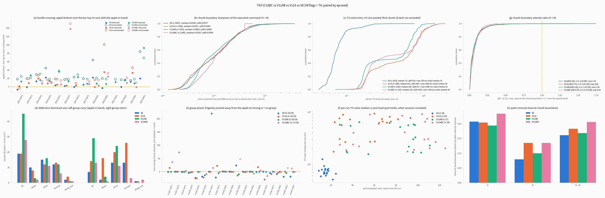

**단계별 정리 (바꾼 것 · 해결 · 새 문제).**

| 단계 | 바꾼 것 | 해결된 것 | 새로 드러난 문제 |
|---|---|---|---|
| **A** | 창 16 step, 꼬리는 장애물만, gate 20 mm, QP eps 1e-4 | 운반 중 사과 접촉 5 → 2 run, release 뒤 손가락 접촉 9 → 4 run (최대 침투 5.8 → 2.2 mm), obstacle stop 10 → 6, 실제 사과 바닥–막대 윗면 3.8 → 6.7 mm | 성공 (기존) 13 → 10. **TO 중앙 69.9 → 625.0 ms** |
| **+B** | 편향 변화율 비용 `W = 20` | 접촉 포함 성공 8 → **12**, 운반 중 사과 접촉 0, release 뒤 손가락 접촉 0, obstacle stop 1, 실제 사과 바닥–막대 윗면 13.6 mm (최소 +7.1) | **TO 중앙 526.1 ms**, round trip 1536 ms. 남은 실패 2 run |
| **+C** | 2 차 차분 상한 + 경계 속도 행 | 경계 속도 초과 chunk 0, 경계 가속도 p90 0.0452 → 0.0400 | 성공 12 → **8**, 접촉 포함 12 → 6 (p 0.031), 낙하 5 · HOLD 19 (held 17), 방향 반전 비율 0.194 → 0.234 |

---

### 13. 지금의 네 arm 비교 — V8 · V11A · V11AB · V11ABC (허들 14 run + 장애물 없음 5 run, 같은 (episode, seed) 짝)

`T43V11ABC.verify.json` 한 파일에 네 arm 이 같은 코드 · 같은 집계로 들어 있다. 시간은 서로 다른 서버 세션이고 pod 부하가 다르다 (아래 §14).

| 항목 | **V8** (기준) | **V11A** | **V11AB** | **V11ABC** |
|---|---|---|---|---|
| 추가한 것 | — | + A (창 16) | + B (편향 변화율) | + C (가속도 · 경계 속도) |
| **H 14: S (기존)** | 13 | 10 | 12 | 8 |
| H 14: G · P | 14 · 13 | 14 · 10 | 14 · 12 | 13 · 8 |
| B 5: S | 5 | 4 | 5 | 3 |
| 전체 19: S | 18 | 14 | 17 | 11 |
| **H 14: S (release 규칙)** | 13 | 10 | 12 | 7 |
| **H 14: S (접촉 포함, CT)** | 8 | 8 | **12** | 6 |
| V8 대비 CT 짝 (arm 만 / V8 만, p) | — | 2 / 2, 1.0 | **5 / 1, 0.219** | 2 / 4, 0.69 |
| place 전 접촉 run | 5 | 2 | 1 | 3 |
| 운반 중 사과–허들 접촉 run (최대 침투 mm) | 5 (1.26) | 2 (2.50) | **0** | 1 (1.26) |
| release 뒤 손가락–허들 접촉 run (최대 침투 mm) | 9 (5.80) | 4 (2.20) | **0** | **0** |
| obstacle stop run | 10 | 6 | **1** | 2 |
| HOLD chunk (held 행) | 6 (3) | 3 (0) | 4 (2) | **19 (17)** |
| 허들 통과 실제 사과 바닥 – 막대 윗면 중앙 (mm) · n | 3.8 · 13 | 6.7 · 10 | **13.6 · 14** | 8.1 · 9 |
| 허들 통과 실제 사과 바닥 – 막대 윗면 최소 (mm) | −6.4 | −0.1 | **+7.1** | −0.9 |
| release 뒤 손가락–허들 최소 거리 ±8 행 (실제 중앙 mm · 최소 mm) | −1.4 · −9.5 | +3.4 · −1.5 | +9.6 · +5.7 | +9.3 · +6.5 |
| closing 중 outward > 2 mm chunk / closing chunk | 10 / 49 | 19 / 80 | 16 / 80 | 25 / 203 |
| 방향 반전 비율 (H) | 0.207 | 0.204 | 0.194 | 0.234 |
| 경계 속도 > max chunk (H) | 2 | 0 | 1 | 0 |
| **TO 중앙 / p90 (ms)** | **69.9 / 103.1** | 625.0 / 1007.4 | 526.1 / 817.1 | 322.0 / 1019.3 |
| client round trip 중앙 (ms) · 533.3 ms 초과 chunk 몫 | 947.3 · 1.0 | 1727.6 · 1.0 | 1536.2 · 1.0 | 1673.2 · 1.0 |
| pod load 1 (run 평균의 중앙) | 14.6 | 60.0 | 91.1 | 90.4 |

출처: `T43V11ABC.verify.json` (`totals_old_rule` · `H_totals_by_rule` · `H_pairs_z4_ct_rule` · `contacts_arms` · `finger_hurdle_contacts_by_phase` · `crossing_clearance` · `crossing_stats_xm` · `hold` · `sharpness` · `grasp_phase` · `timing` · `lookahead_gate`). 허들 통과 지표는 H 단계만 있다.

- **V11AB 가 접촉 포함 성공이 가장 많다 (12 / 14; 기존 규칙 성공은 V8 이 13 으로 가장 많다)** 이고 접촉이 거의 없다 (obstacle stop 1). 이 차이의 통계적 근거는 약하다 (V8 대비 p 0.219, n = 14).
- **V11ABC 는 V11AB 보다 나빠졌다** (접촉 포함 성공 12 → 6, 0 / 6, p 0.031; 전체 S 17 → 11, 0 / 6, p 0.031).
- **TO 시간은 어느 V11 arm 도 V8 의 4.6–8.9 배** 이다 (중앙 기준). 모든 arm 에서 round trip 이 533.3 ms 를 넘는다. 단 V8 과 V11 라운드는 pod load 가 다르다 (§14).

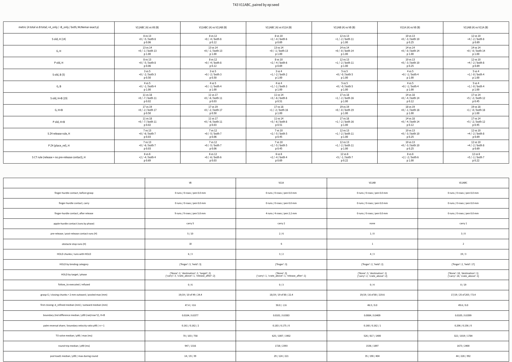

---

### 14. 사용자 판정 · 철회, 아직 모르는 것, 되돌아올 지점, 산출물

#### 14-1. 사용자 판정과 철회 (시각순)

| 시각 | 판정 | 어디에 반영됐나 |
|---|---|---|
| 2026-10-06 | "축소하세요": blind 라운드는 V5B 대 V5S 14 짝만 | §2 |
| 2026-10-06 03:20 | blind 종료 (V5B 12 대 V5S 10, p 0.625). place 진단 (Y1 · Y2) | §3 |
| 2026-10-06 04:30 | held 구 크기를 그림으로 보고 판단 · HOLD 탈출 제안 요청 · **"손에서 떨어지면 attach 를 해제하고 그때부터 사과는 로봇과 연결되지 않는다"** · release 재채점 · E0 release 측정 | §3 · §4 |
| 2026-10-06 07:10 | 구 크기 **(a)** (반지름 상한 + 중심 제한), HOLD 원칙: crate 는 장애물 그대로, TO 의 회피 궤적을 따르도록 유도, held 크기가 과하지 않으면 place 가 되어야 함 | §5 |
| 2026-10-06 08:10 | **subtask gate on** ("gate 켜고 해봅시다"), follow-TO 켜기 | §5 |
| 2026-10-06 09:10 | 손가락 구 해석 확인 · **성공 판정에 접촉 포함** (확정) | §6 |
| 2026-10-06 10:00 | 손가락 구 = **B** (한 그리퍼마다 양쪽 손가락을 각각 구로 감싼다) | §7 |
| 2026-10-06 11:10 | V8 · 진단 Opus verifier · 구 수는 TO 시간 보고 결정 | §7 |
| 2026-10-06 12:40 | TK 진단 (c), gate on 유지 (막대 admissibility 추가 작업은 하지 않음), **finger-cover 는 기본 구성에 유지, 구 수 조정은 추후** | §7 · §8 |
| 2026-10-07 | 가림 가설 · 허들 통과 궤적 분석 요청 (OC · HX), V9 진행과 TK 정정 (왼손 손가락 이름), 쥔 사과 행 분류 · margin 에 동의 (HM) | §8 · §9 · §10 |
| 2026-10-07 | servo 파지 붕괴 진단 요청 (SV): "어렵거나 불필요하면 servo model 을 켜지 않은 상태로" | §9 |
| 2026-10-07 | **철회: servo-after-placed** — "PLACED 개념은 pick-and-place 전용 — 모든 시나리오에 적용 가능해야 함" | §9 |
| 2026-10-07 | V10 (HM) 와 XM 병행, 이어서 **V10 (HM) 보류** — "TO 가 투박한 궤적을 부드럽게 보정하고 속도 · 가속도 제한을 적용하는 것이 먼저 — 지금 margin 을 크게 조절하는 것은 중요하지 않다" | §10 · §11 |
| 2026-10-07 | **TO 경로 모양 A → A+B → A+B+C** 순서, 오프라인 후 좋으면 온라인 | §12 |
| 2026-10-09 | **V11AB 채택 전 시험** — (1) TO 연산 시간이 너무 길다, 지금대로면 사용할 수 없다 → 줄일 방안 (2) 바나나 · 배 · 사과 · 오렌지 모두 (3) 충돌 회피 모듈 사용 / 미사용 비교 영상. C 는 (b) 진단. 결과 기록 | 아래 |

2026-10-09 의 의뢰 (T43.task.md): **TP** (implementer) = V11AB 의 행동은 유지한 채 TO p90 ≤ 100 ms (V8 수준) 와 왕복이 533.3 ms 안에 들어갈 경로를 제시 (같은 기계 · 같은 부하의 통제 측정, 꼬리 coarse 화 · 꼬리 구 수 축소 · GPU batch · warm start · gate 강화 후보). **CX** (verifier) = V11ABC 의 낙하 5 · 파지 실패 2 run 을 V11AB 같은 ep:seed 와 대조해 C 가 낙하를 늘린 원인을 본다. **SC** (이 기록). TP 뒤에 과일 4 종 라운드 (사과 · 오렌지 · 배 · 바나나; 바나나는 T42 library 에서 장애물 없이도 성공 episode 가 없어 사용자 판정이 필요하다고 task 문서에 적혀 있다) 와 충돌 회피 사용 / 미사용 비교 영상이 대기한다.

#### 14-2. 아직 모르는 것

| 항목 | 상태 |
|---|---|
| **V11ABC 에서 C 가 낙하를 늘린 원인** | **판정 불가.** 낙하 5 · 파지 못 함 2 · held HOLD 17 의 첫 갈림 chunk · C 행 active 여부는 측정하지 않았다. CX 진행 중 (재측정 대기 20) |
| **TO 시간의 원인별 분해와 같은 부하 비교** | V8 라운드 load 1 중앙 14.6, V11 라운드 60.0 / 91.1 / 90.4. V11 세 arm 안에서는 load 와 run 별 TO 중앙의 Spearman ρ −0.047 (p 0.73, 55 run) 이지만, V8 까지 합치면 ρ 0.548 (p 4.4e-7, 74 run). V11ABC 라운드는 cpu throttle 이 전체 period 의 22.7 %. **이 기록으로 TO 연산량 증가와 부하를 가르지 못했다.** TP 의 통제 측정 대기 (재측정 대기 21) |
| 과일 4 종 (사과 · 오렌지 · 배 · 바나나) | 측정 안 함 (TP 뒤, 재측정 대기 22) |
| 충돌 회피 사용 / 미사용 비교 영상 | 만들지 않음 (재측정 대기 22) |
| 표본 크기 | 허들 14 + 장애물 없음 5. V11AB 의 CT 성공 12 대 8 은 p 0.219, V11ABC 대 V11AB 만 p 0.031 이다 |
| V11AB 의 남은 실패 2 run (1967 s19672 낙하 · 1834 s18343 팔 접촉) | 원인을 가르지 않았다 |
| `follow_to` | V7g · V8 · V11A · V11AB · V11ABC 에서 한 번도 실행되지 않았다 (실행은 V9 3 · V10 1 뿐). 거절 사유는 `penetration` · `worsens` · `hold_kinds` 등이다 |
| servo 모델을 TO 에 쓸 때 받침면 path 행 | 고치지 않았다 (V9 의 파지 붕괴 원인으로 측정된 것) |
| A 의 오프라인 대 온라인 차이 | 구현자는 오프라인에서 A 단독 이득이 거의 없다고 보고했는데 (A16q 의 접촉 clear 9 = base), 온라인 V11A 에서는 접촉 run 이 줄었다 (5 → 2, 9 → 4). 이 차이는 오프라인이 open loop 인 탓일 수 있다고 구현자가 적었으나 검증하지 않았다 |
| 첫 chunk JIT · SQP 반복 수 | 인용하지 않았다 (서버 세션이 다르고 wall-clock 예산 의존) |

#### 14-3. 되돌아올 지점 — 고르지 않은 선택지

| 안 고른 것 | 왜 안 골랐나 | 되돌아올 신호 (**scribe 가 위 기록에서 도출한 것이며 사용자 판정이 아니다**) |
|---|---|---|
| servo 모델을 TO 에 직접 (V9) | 파지가 5/14 로 무너졌다 (받침면 path 행) | 받침면 path 행의 처리를 고친 뒤. 단 "PLACED 뒤에만" 은 사용자가 철회 |
| held 행에 obstacle margin (HM, V10) | 성공 13 → 10 · HOLD 6 → 52 후 사용자 보류 | TA 이후에도 쥔 사과 접촉이 남을 때. V11AB 에서 운반 중 사과 접촉은 0 run |
| 속도 비례 margin (XM k = 0.5 / 1.0) | closing 에 새 HOLD 후보 26 / 99 · 38 / 99 | margin 을 키울 일이 다시 생길 때 |
| C 를 strict · weight 0.1 로 | 구현자 오프라인: strict 가 파지 chunk 를 가장 많이 움직임, weight 0.1 은 새 충돌 chunk 9 | C 를 다시 켠다면 CX 결과를 본 뒤 |
| H = 24 | 오프라인에서 지표가 같고 CPU 2.8× | 실시간 문제가 풀린 뒤 |
| finger-cover 구 수 줄이기 (ilp 4 mm 등) | 사용자가 "추후" 로 미룸 | TO 시간 단축 (TP) 에서 후보로 다시 나올 때 |
| 정책-blind 장애물 모드 | 사용자가 닫음 (V5B 12 대 V5S 10, p 0.625) | — |

#### 14-4. 이 STEP 의 산출물

- **코드 (benchmark repo / 루트 repo 순)**: `72ed927` (config 왕복 수정), Z3 `cf6b410` / `fb841c0`, Z6 `f2f335b` / `0811598`, FC `786cf1b` / `53a9c8f`, FR `a297155` / `c908895`, HM `308ddfd` / `2add93b`, TA `3ca1b21` / `331273f`. 전부 flag 기본 off · off 비트 동일.
- **측정**: `handoff/T43W` · `Y` · `Z` · `Z3V` · `CT` · `V7g` · `GD` · `V8` · `DX` · `TK` · `OC` · `HX` · `V9` · `SV` · `V10` · `XM` · `V11A` · `V11AB` · `V11ABC` `.verify.json`. 구현: `handoff/T43Z3` · `Z6` · `FC` · `FR` · `HM` · `TA` `.impl.md`. 설계 · 판정: `handoff/T43.task.md`.
- **figure**: `figures/t43/` — `t43w-*` · `t43y-*` · `t43z-*` · `t43z3v-*` · `t43z5-*` · `t43ct-*` · `t43v7g-*` · `t43gd-*` · `t43v8-*` · `t43dx-*` · `t43tk-*` · `t43oc-*` · `t43hx-*` · `t43v9-*` · `t43sv-*` · `t43v10-*` · `t43xm-*` · `t43v11a-*` · `t43v11ab-*` · `t43v11abc-*`. 각각 `.json` sidecar 가 있다.
- **영상**: `outputs/verify/T43/gate_demo/gd_{1968_s19683,1995_s19953,1925_s19251}.mp4` (gate off 대 on).

