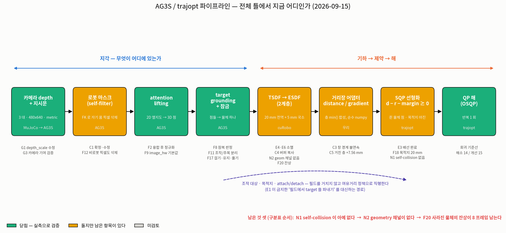
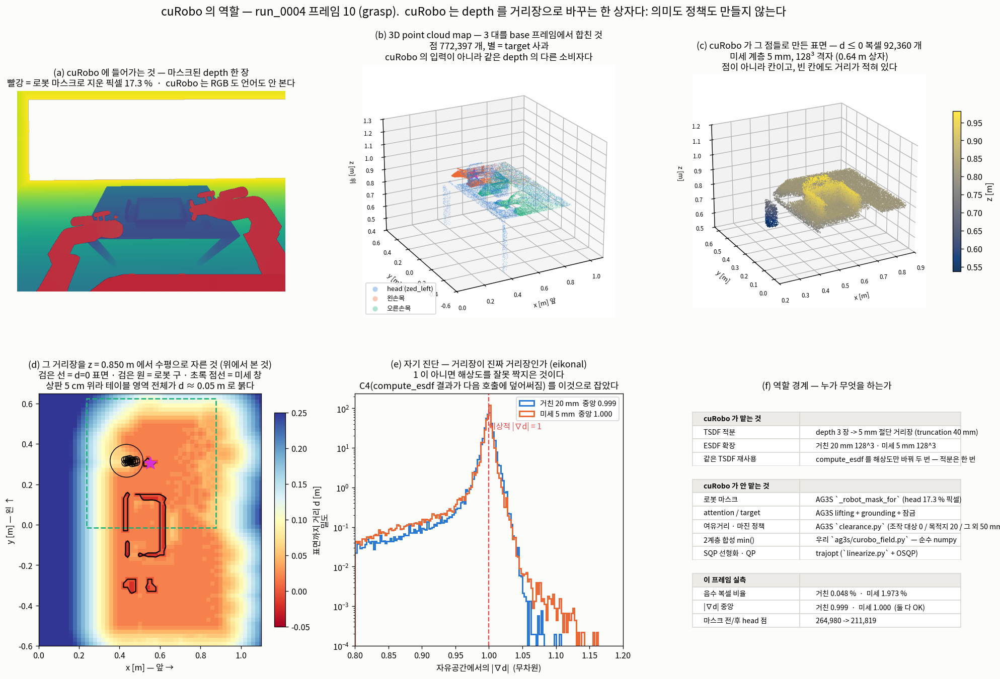
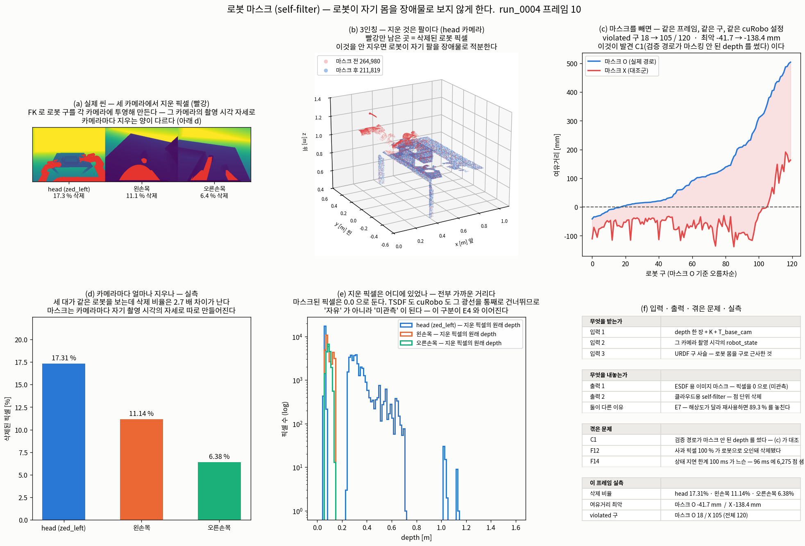
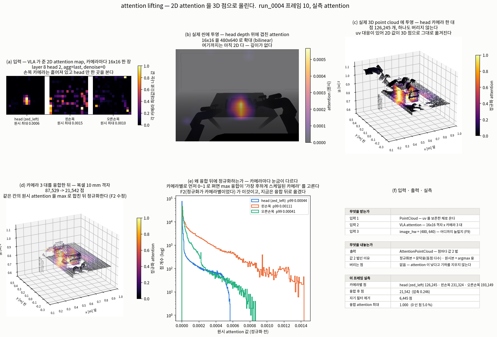
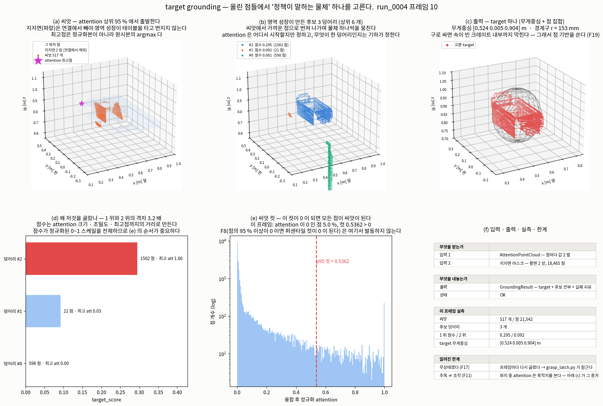
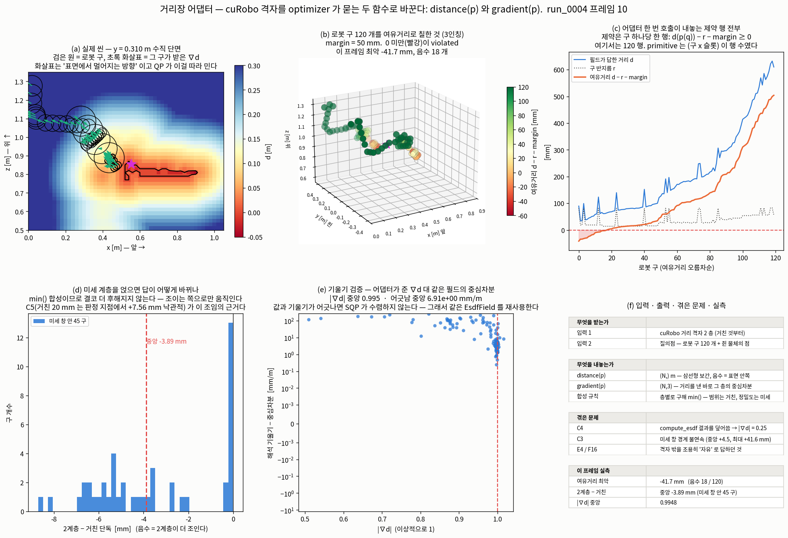

# 파이프라인 단계별 정리 · cuRobo 의 역할

> **이 문서가 무엇인가** — 사용자 요청(2026-09-15)에 따라, 규칙 B 의 파이프라인을 **단계마다
> 다섯 항목**(① 방법론 ② 입력·출력 ③ 겪은 문제 ④ 시각 자료 ⑤ 왜 이 방법인가)으로 정리하고,
> **cuRobo 가 정확히 무엇을 맡는지**를 못 박은 것이다.
>
> **정본 기록은 [`AG3S_T0T6_LOG.md`](AG3S_T0T6_LOG.md) 다** (2026-09-24 부터). 이 문서가
> 인용하는 측정들은 그 앞의 모듈 검토 국면, 즉
> [`AG3S_REVIEW_LOG.md`](AG3S_REVIEW_LOG.md) (archive) 에서 왔다. 이 문서는 그 기록에서 이미
> 확정된 판정만 모아 읽기 좋게 재배열한 것이고, **여기서 새로 판정하지 않는다.** 숫자가 어긋나면
> 로그 쪽이 맞다.
>
> 별도 표기가 없는 본문 수치는 `run_0004` frame 10(grasp 단계)을 이 문서를 쓰면서 실제로 다시
> 돌려 얻었다. 발표용 attention lifting의 대표 장면은 frame 5(사과 접근 단계)이고, F9/F2 비교는
> 15 frame 전체다. 재현 명령은 맨 아래 [§6](#6-재현-명령)에 있다.

---

## 0. 한 장 지도 — 전체 틀에서 지금 어디인가



**[`figures/doc-pipeline-map.png`](figures/doc-pipeline-map.png)** · 생성:
`benchmark/ag3s/experiments/diagrams/doc_pipeline_map.py`

```
카메라 depth + 지시문 → 로봇 마스크 → attention lifting → target grounding(+잠금)
                    → TSDF/ESDF (cuRobo) → 거리장 어댑터 → SQP 선형화 → QP 해
```

여덟 상자를 **누가 소유하는가**로 갈라 보면 셋이다.

| 소유자 | 맡는 상자 | 한 줄로 |
|---|---|---|
| **AG3S** | 로봇 마스크 · attention lifting · target grounding · 잠금 · 여유거리 정책 | *무엇이 무엇인가* — 의미와 정책 |
| **cuRobo** | TSDF 적분 · ESDF 확장 | *무엇이 어디에 있는가* — 기하만 |
| **trajopt** | SQP 선형화 · QP 해 | *그래서 어떻게 움직이는가* |
| (우리 어댑터) | 계층 합성 · distance/gradient 인터페이스 | 위 셋을 잇는 순수 numpy 껍데기 |

---

## 1. cuRobo 의 역할



**[`figures/doc-curobo-role.png`](figures/doc-curobo-role.png)** · 생성:
`benchmark/ag3s/experiments/diagrams/doc_curobo_role.py`

### 1.1 한 문장 정의

> **cuRobo 는 "마스크된 depth 여러 장" 을 받아 "공간의 모든 칸에 가장 가까운 표면까지의 거리가
> 적힌 격자" 를 내놓는 한 상자다.** 그 이상도 이하도 아니다.

용어부터 푼다 (규칙 C).

* **복셀(voxel)** — 공간을 자른 정육면체 칸. 사진의 픽셀을 3차원으로 옮긴 것. "20 mm 복셀" 은
  한 변이 20 mm 라는 뜻.
* **TSDF** — Truncated Signed Distance Field. depth 를 쌓아 만드는 **중간** 표현. 표면 근처
  얇은 띠(여기서는 ±40 mm)만 "표면까지 부호 있는 거리" 를 채우고 나머지는 비워 둔다.
* **ESDF** — Euclidean Signed Distance Field. TSDF 를 펼쳐 **모든** 복셀을 채운 것.
  **최적화기가 실제로 묻는 것이 이것이다.**
* **부호 규약** — 이 문서 전체에서 **음수 = 물체 안쪽**, 양수 = 빈 공간.
* **eikonal** — 제대로 된 거리장이면 어디서든 기울기 크기가 1 이다(1 m 움직이면 거리가 1 m
  바뀐다). `|∇d| ≈ 1` 이 아니면 필드가 깨진 것.

### 1.2 역할 경계 — 하는 것 / 안 하는 것

| | 누가 | 무엇 |
|---|---|---|
| **cuRobo 가 한다** | cuRobo `Mapper` | depth 3 장 → TSDF 적분 (5 mm, truncation 40 mm) |
| | | TSDF → ESDF 확장. **같은 TSDF 에서 해상도만 바꿔 두 번** 뽑는다 |
| **cuRobo 가 안 한다** | AG3S | 로봇 마스크 (`pipeline._robot_mask_for`) — **마스크된 depth 를 넣어 준다** |
| | AG3S | attention · target · 잠금 — cuRobo 는 RGB 도 언어도 안 본다 |
| | AG3S `clearance.py` | 여유거리 정책 (조작 대상 0 / 목적지 20 / 그 외 50 mm) |
| | 우리 `ag3s/fields/curobo_field.py` | 계층 `min()` 합성, `distance()`/`gradient()` |
| | trajopt | SQP 선형화 · OSQP |

**cuRobo 는 "무엇이 target 인가" 를 표현할 수 없다.** 거리장은 익명이라 "가장 가까운 표면까지
얼마나 머냐" 만 답한다. 그래서 접촉 권한(무엇을 만져도 되는가)은 필드가 아니라 **질의 쪽**에
붙는다 — 발견 E1(GRASP 의 target carving 이 전신에 대해 target 을 지운다)이 이 원칙을 세운
자리다. 2026-09-15 에 그 익명을 부분적으로 푼 것이 **라벨 층**(거리 층 옆에 "그 거리를 만든 표면
복셀이 어느 물체인가" 를 같이 저장하는 것)이고, 그 덕에 목적지 전용 마진이 가능해졌다.

### 1.3 3D mapping — 실제로 무엇이 만들어지는가 (프레임 10 실측)

| 산출물 | 무엇 | 이 프레임 |
|---|---|---|
| **3D point cloud map** | depth 3 장을 base 프레임에서 합친 점 | **772,397 점** (head 211,819 · 왼손목 272,992 · 오른손목 287,586) |
| **TSDF** | 5 mm 절단 거리장 | 상자 1.5 × 1.8 × 1.6 m, 중심 (0.45, 0, 0.80) |
| **ESDF 거친 계층** | 20 mm · 128³ = **2.56 m 상자** | 값 [−0.049, +1.957] m, 음수 복셀 **0.048 %** |
| **ESDF 미세 계층** | 5 mm · 128³ = **0.64 m 상자** | 값 [−0.025, +0.444] m, 음수 복셀 **1.973 %** |
| **표면 (d ≤ 0)** | 미세 계층에서 | **92,360 복셀** — 그림 (c) 의 3D 산점 |

**점구름은 cuRobo 의 입력이 아니다.** 같은 depth 를 먹는 **다른 소비자**다 — 지지면 추출,
attention lifting, target grounding 이 점구름을 쓰고, cuRobo 는 depth 이미지를 직접 먹는다.
그림 (b)와 (c)를 나란히 둔 이유가 그것이다: 같은 씬의 **점** 표현과 **칸** 표현.

### 1.4 자기 진단 — 거리장이 진짜 거리장인가

```
|∇d| 중앙    거친 20 mm  0.999      미세 5 mm  1.000       (자유공간, d > 30 mm)
```

이 한 줄이 **발견 C4**(cuRobo `compute_esdf()` 의 `feature_tensor` 는 재사용 버퍼라서 다음
호출이 덮어쓴다)를 잡은 검사다. 그때 증상은 `|∇d| = 0.25` 였다 — 5 mm 간격 데이터를 20 mm
격자로 읽은 값이다. `build_field.py` 는 지금도 이 검사에 실패하면 **필드를 저장하지 않는다.**

### 1.5 왜 cuRobo 인가

1. **우리 `esdf.py` 의 두 결함이 구조적으로 사라진다.** E4(격자 밖은 무조건 자유로 오답)와
   E6(TSDF 적분이 전 복셀 중심을 매 카메라·매 프레임 투영)는 dense-fixed-box 구현 고유의
   문제이고, block-sparse 구조에는 벗어날 고정 상자도, 전 복셀 투영도 없다.
2. **같은 TSDF 에서 해상도가 다른 ESDF 를 여러 번 뽑는 것이 stock API 로 된다.** 2계층 설계의
   전제였고, API 검증으로 확인했다 (commit `78fd485`).
3. **속도.** 정상 상태 `compute_esdf` 0.5~0.7 ms. (첫 호출 약 1,300 ms 는 JIT + CUDA graph
   capture 라 인용하면 안 된다.)
4. **실시간성은 이 검토의 목표가 아니다** (2026-09-07 결정). 판단의 정확성이 먼저다. cuRobo 를
   고른 이유는 속도가 아니라 위 1·2 다.

### 1.6 cuRobo 함정 다섯 (전부 직접 밟았다)

1. `esdf_origin` 은 격자 **코너가 아니라 중심**이다. 코너로 넣으면 두 계층이 130~257 mm 어긋난다.
2. 인덱싱을 손으로 쓰지 말고 `create_xyzr_tensor(transform_to_origin=True)` 를 쓴다.
3. 첫 `compute_esdf` 호출 시간(≈1,300 ms)은 JIT — 인용 금지.
4. **`compute_esdf()` 결과는 다음 호출 전에 복사한다** (`feature_tensor.detach().clone()`). ← C4
5. `VoxelGrid.get_occupied_voxels()` 는 **반대 부호 규약** — 쓰면 자유공간이 나온다.

**1·3·4 는 자기 진단 하나로 잡힌다**: 자유공간에서 `|∇d| ≈ 1` 인가.

### 1.7 cuRoboV2 대비 — 아직 없는 것

| cuRoboV2 항목 | 우리 |
|---|---|
| 파지 후 로봇 모델에 결합 · 환경 충돌에 포함 | **있다** (2026-09-15, 단 primitive 가 아니라 점) |
| Geometry 채널 stamping · `min(depth, geom)` 합성 | **없다** — N2. E4 의 진짜 해결도 여기 있다 |
| self-collision (잡힌 물체 포함) | **전혀 없다** — N1. `trajopt/` 전체에 코드 0 줄 |
| Frustum-aware decay 로 잔상 제거 | **없다** — F20. 사과가 302 mm 떠난 뒤에도 그 자리가 −6.7 mm 로 점유 |

---

## 2. 카메라 depth · 로봇 상태 · 지시문 (입력)

### ① 방법론

MuJoCo `run_0004` 기록을 재생하고, 매 스텝 세 카메라(`zed_left` 머리 · `wrist_cam_l` ·
`wrist_cam_r`)를 캡처한다. 각 캡처는 **자기 촬영 시각의 로봇 자세**로 놓인다 — 현재 `q` 하나를
세 카메라에 일괄 적용하지 않는다. 손-눈 변환은 가정하지 않고 푼다:

```
T_link_cam = inv(T_base_link_urdf(q)) @ T_base_cam_mujoco(q)
```

URDF 자신의 링크 자세에서 유도하므로, 나중에 `resolve_T_base_cam` 이 같은 URDF FK 와 합성했을
때 캡처 자세에서 MuJoCo 를 정확히 재현한다.

지시문(언어)은 **VLA 쪽에만** 들어간다. AG3S 는 그 결과물인 attention 격자만 받는다.

### ② 입력과 출력

| | 무엇 |
|---|---|
| 입력 | MuJoCo 기록(관절 궤적 + free joint 물체 위치), 모델 XML |
| 출력 1 | depth `(480, 640)` float — **이미 미터 단위**. 미명중 픽셀은 far plane(≈679 m) |
| 출력 2 | `K` (pinhole), `T_base_cam`, 그 순간의 `robot_state` (20 벡터) |
| 출력 3 | VLA attention — 카메라당 16×16 격자 (layer 8, head 2, agg=last, denoise=0) |
| 출력 4 | 세그먼테이션 버퍼 — 정답 대조용 (파이프라인은 안 쓴다) |

### ③ 겪은 문제

| ID | 무엇 | 상태 |
|---|---|---|
| **G1** | `pointcloud.depth_scale` 이 TSDF 경로에 적용되지 않아, mm 단위 depth 에서 **충돌 필드가 통째로 비고도 `status: ok`** 로 보고됨 | 수정됨 |
| **G3** | 카메라 3 대 중 2 대가 **아무것도 기여 안 해도** 프레임이 정상으로 보고됨 | 수정됨 |
| **G2** | 미관측 100 % ESDF 가 `validity: valid` / `certified: True` 로 보고됨 | 수정됨 |
| **F14** | `timing.max_state_age_sec` 기본값 100 ms 가 **피해 시작점보다 6 배 이상 느슨하다.** 지연 16 ms 에서 이미 로봇 점 851 개가 클라우드로 새고, 허용되는 96 ms 에서 **6,275 개** | 측정 완료 |
| (환경) | 모델을 **상대경로로 로드하면** 메시 로딩이 매 실행 다른 `base_N.obj` 에서 실패한다. 비결정성이 단서 — MuJoCo 의 병렬 메시 로드 중 경로 해석 문제. 절대경로로 고정 | 고정됨 |
| (규약) | 세그 버퍼는 `(object id, object type)` 이지 그 반대가 아니다. 반대로 읽으면 **조용히** geom 0 개 | 고정됨 |
| (규약) | MuJoCo 카메라는 −z 를 보고 +y 가 위, AG3S/OpenCV 는 +z 앞 +y 아래. `diag(1,−1,−1)` 로 교정. 바닥을 역투영해 z = 0.006 m, 퍼짐 1.3 mm 로 검증 | 고정됨 |

### ④ 시각 자료

실제 씬 사진은 아래 [§3 ④](#-시각-자료-1) 의 (a) 패널이 그대로 이 단계의 입력이다.
프레임당 카메라 기여·신선도 그래프는 [`figures/step7-state-lag-0004.png`](figures/step7-state-lag-0004.png)
(상태 지연 F14) 와 [`figures/step7-fusion-asymmetry-measured-0004.png`](figures/step7-fusion-asymmetry-measured-0004.png).

### ⑤ 왜 이 방법인가

* **카메라마다 자기 시각의 자세**로 놓는 것은 F14 가 잰 피해를 구조적으로 막기 위해서다.
  손목 카메라에서 현재 `q` 를 쓰면 자유공간을 지우면서 팔은 남기는 — 두 방향으로 동시에 틀린다.
* **손-눈 변환을 푸는** 것은 URDF 와 MuJoCo 가 같은 로봇이지만 같은 파일이 아니기 때문이다.
  둘의 불일치는 `link_pose_error` 로 **따로 재서 보이게** 둔다. 숨기지 않는다.
* **세 대를 쓰는 것이 한 대보다 낫고 더 싸다** — Step 7 의 15 청크 대조에서 확인했다.

---

## 3. 로봇 마스크 (self-filter)



**[`figures/doc-stage-robot-mask.png`](figures/doc-stage-robot-mask.png)** · 생성:
`benchmark/ag3s/experiments/diagrams/doc_robot_mask.py`

### ① 방법론

**로봇 마스크 / self-filter** = depth 사진에서 **로봇 자기 몸이 찍힌 픽셀을 지우는 것**.

URDF 구 사슬(로봇 몸을 구 여러 개로 근사한 것)을 그 카메라의 **촬영 시각 자세**로 FK 해서 각
카메라에 투영하고, 구 안에 들어오는 픽셀을 지운다. **지운 픽셀은 `0.0` 으로 둔다** — 우리 TSDF
(`esdf.py:146`)도 cuRobo(`builder_camera_integrate.py:146`, `depth < depth_min` 이면 return)도
그 광선을 **통째로 건너뛴다.** 그래서 지운 자리는 "자유" 가 아니라 **"미관측"** 이 된다. 이
구분이 E4(격자 밖·미관측을 무조건 자유로 답한다)와 이어진다.

같은 계산이 두 번 필요하다 — **ESDF 용 이미지 마스크**(픽셀 단위)와 **클라우드용
self-filter**(점 단위). E7 에서 "중복 아니냐" 를 제기했다가 **기각**했다: 해상도가 달라서
재사용하면 로봇 픽셀의 **89.3 %** 를 놓친다.

### ② 입력과 출력

| | 무엇 | 프레임 10 실측 |
|---|---|---|
| 입력 1 | depth `(480,640)` + `K` + `T_base_cam` | — |
| 입력 2 | **그 카메라 촬영 시각의** `robot_state` | — |
| 입력 3 | URDF 구 사슬 | 팔만 쓰면 제약 구 **120 개** |
| 출력 1 | ESDF 용 이미지 마스크 (픽셀 → 0.0) | head **17.31 %** · 왼손목 **11.14 %** · 오른손목 **6.38 %** |
| 출력 2 | 클라우드용 self-filter (점 삭제) | 융합 경로에서 **6,445 점** 제거 |

### ③ 겪은 문제

| ID | 무엇 | 상태 |
|---|---|---|
| **C1** | cuRobo 검증 경로가 **마스킹 안 된 depth** 를 써서 로봇이 자기 몸을 장애물로 봤다 | 확정·수정 |
| **F12** | 쥔 사과가 들어올려지면 거리장에서 사라진다(오차 최대 154 mm). 원인은 가림이 아니라 **자기 필터** — 사과 픽셀은 보이는데(평균 83 px) **100 % 가 로봇으로 오인되어 삭제**. 손목 카메라도 15,910 px 를 보지만 똑같이 100 % 삭제 → **카메라 융합은 답이 아니다.** 부수 피해: 비로봇 픽셀도 매 프레임 삭제(crate 199~1,083 px) | 원인 확정. 절반은 옳고, 빠진 절반이 E3 배선이었다 |
| **E7** | "로봇 마스크가 클라우드를 재구성한다 — 중복" | **기각/재분류** (위 참고) |
| **F14** | 상태 지연 한계가 느슨하다 | 측정 완료 |

**C1 을 이 문서에서 다시 실측했다.** 같은 프레임·같은 구·같은 cuRobo 설정으로 마스크만 뺀
대조군을 만들었다:

```
                    마스크 O (실제 경로)      마스크 X (대조군)
violated 구              18 / 120              105 / 120
최악 여유거리          −41.7 mm               −138.4 mm
```

로그에 적힌 "위반 105/120" 이 **그대로 재현된다.**

### ④ 시각 자료

| 종류 | 어디 |
|---|---|
| **실제 씬** | (a) 세 카메라의 depth 위에 지운 픽셀을 빨강으로 |
| **3인칭** | (b) 마스크 전(빨강)/후(파랑) 점구름 — 지운 것이 팔이라는 것이 보인다 |
| **그래프** | (c) 구 120 개의 여유거리, 마스크 O/X 두 곡선 · (d) 카메라별 삭제 비율 · (e) 지운 픽셀의 원래 depth 분포 |
| **표** | (f) 입력·출력·겪은 문제·실측 |

F12 의 상세는 [`figures/f12-why-apple-vanishes-0004.png`](figures/f12-why-apple-vanishes-0004.png),
F14 는 [`figures/step7-state-lag-0004.png`](figures/step7-state-lag-0004.png).

### ⑤ 왜 이 방법인가

* **FK 기반 마스크**를 쓰는 이유: 학습된 세그먼테이션과 달리 **로봇 자세를 이미 알고 있다.**
  추가 모델도, 추가 지연도 없다.
* **구 근사로 넉넉히 지우는** 이유: 로봇을 덜 지우면 로봇이 자기 몸과 충돌한다고 보고
  (−138 mm), 더 지우면 진짜 장애물을 놓친다. **틀리는 방향이 안전한 쪽**은 넉넉히 지우는
  쪽이고, 그 대가가 F12 다 — 즉 이 선택은 공짜가 아니고, 그래서 F12 의 나머지 절반을
  **E3 배선**(쥔 물체를 로봇 쪽 질의점으로 넣기)으로 갚았다.
* **0 으로 두는**(삭제) 이유: 지운 자리를 "자유" 로 두면 못 본 공간을 안전하다고 답하게 된다.
  미관측으로 두면 그 판단이 `unknown_policy` 로 **명시적으로** 내려간다.

### ⑥ 발표 슬라이드 2 장 — 무엇을 말하는가 (2026-09-15 추가)

모듈 1 / 8 (AG3S 다섯 · cuRobo 셋) 중 **robot mask** 의 슬라이드 명세다. 대상은 연구실 내부라
ESDF·여유거리·FK 를 설명 없이 쓰고 발견 ID 를 그대로 노출한다. 그림 넷은
`figures/ppt/` 에 있고 생성은 `experiments/ppt_robot_mask.py` 한 번이다.

#### 슬라이드 1 — 왜 필요한가 · 무엇을 받아 무엇을 내놓는가

> **한 줄 메시지** — 팔은 depth 프레임에서 가장 큰 물체인데, 자기 자신에게는 장애물이 아니다.

| 블록 | 그림 / 내용 |
|---|---|
| 문제 | [`ppt/ppt-rm-01-scene.png`](figures/ppt/ppt-rm-01-scene.png) — 세 카메라에서 지운 픽셀 (머리 17.3 %) |
| I/O 계약 | [`ppt/ppt-rm-02-io.png`](figures/ppt/ppt-rm-02-io.png) — 입력 4 / `robot_sphere_mask` / 출력 2 |
| 왜 (3 줄) | ① **정확성** 안 지우면 자기 몸과 충돌한다고 보고 ② **일관성** 필터와 제약이 같은 FK·같은 sphere chain ③ **정직성** 미관측 ≠ 자유 |

말로 할 인용 (`robot_filter.py:3-5`):
> "Left in, it becomes a cluster that tracks the end-effector perfectly, and TO is then asked to
> keep the robot away from the robot."

**강조 둘** — (1) 출력이 둘인 것은 중복이 아니다. 해상도가 달라 재사용하면 로봇 픽셀 **89.3 %**
를 놓친다 (E7 = "마스크가 클라우드를 재구성한다, 중복 아니냐" 제기가 **기각·재분류**된 자리).
(2) 지운 픽셀은 **미관측**이지 자유가 아니다.

#### 슬라이드 2 — 어떻게 · 적용 전후

> **한 줄 메시지** — 학습된 세그멘테이션이 아니라 로봇이 이미 아는 자기 자세로 지운다.

| 블록 | 그림 / 내용 |
|---|---|
| 방법론 | [`ppt/ppt-rm-03-method.png`](figures/ppt/ppt-rm-03-method.png) — FK 구 → 역투영 → uv 산포, 그리고 20 mm 부풀림이 실제로 지우는 자리 |
| 적용 전후 | [`ppt/ppt-rm-04-beforeafter.png`](figures/ppt/ppt-rm-04-beforeafter.png) — 마스크 X / O 거리장 단면 + 여유거리 곡선 + 큰 수치 |
| 한계 | F12 — 아래 빨간 박스 |

방법론에서 말할 넷:

| 무엇 | 근거 |
|---|---|
| 구 질의이지 depth 비교가 아니다 — `cKDTree` 를 씬 점에 세우고 **구마다** ball query | `robot_filter.py:55-62` |
| 점당이 아니라 구당이라 같은 출력에 **257 ms → 8 ms (약 30 배)** | `robot_filter.py:13-19` |
| **20 mm 부풀림**은 캘리브레이션 오차·depth 잡음·캡슐↔메시 간극을 흡수. 덜 지우면 그리퍼에 유령 장애물, 더 지우면 테이블 한 조각 — **틀리는 방향이 안전한 쪽** | `robot_filter.py:40-43` · `config.py:144` |
| 카메라마다 **자기 촬영 시각의 `q`**. 현재 `q` 하나를 셋에 쓰면 자유공간을 지우면서 팔은 남긴다 | `multiview.py:103-105` |

**적용 전/후 — 같은 프레임·같은 구·같은 cuRobo 설정, 마스크만 뺀 대조군** (2026-09-15 실측):

| | 마스크 없음 | 마스크 있음 |
|---|---|---|
| `violated` 로봇 구 | **105 / 120** | **18 / 120** |
| 최악 여유거리 | **−138.4 mm** | **−41.7 mm** |

발견 C1(cuRobo 검증 경로가 마스킹 안 된 depth 를 썼다) 의 수치가 그대로 재현된다.

> **주의 — 130/194 와 105/120 을 비교하지 말 것.** 마스크가 처음 생기기 전의 기록은
> 전신 **194 구** 모델에서 130 위반이었고(`pipeline.py:725-726`), 위 표는 제약용 **120 구**
> (팔) 모델이다. **구 집합이 다르므로 같은 현상의 다른 측정**이다.

**한계 (빨간 박스, 반드시 넣는다) — 마스킹은 절반만 옳다 (F12)**

```
zed_left, 파지 중 (스텝 10~18)
  사과 픽셀      평균 83 개  (보인다)
  마스크에 덮임  83 개 = 100 %   →  적분되는 픽셀 0
  손목 카메라    평균 15,910 픽셀도  →  똑같이 100 % 삭제
```

쥔 사과가 거리장에서 사라진다(오차 최대 154 mm). **카메라를 더 붙여도 안 고쳐진다 — 측정으로
배제한 갈래다.** 비로봇 픽셀도 지운다(바구니 199~1,083 px/frame) — E1(GRASP 의 target carving 이
전신에 대해 target 을 지운다)이 금지한 바로 그 익명 삭제다.

**반전** — 쥔 물체를 월드에서 지우는 것은 *"쥔 물체는 로봇으로 취급한다"* 의 **절반**이고,
자기 필터가 우연히 그 절반을 이미 하고 있다. 빠진 절반은 **로봇 쪽에 더하기** = E3(쥔 물체가
optimizer 에 도달하지 않는다) 배선이고, **2026-09-15 에 완료됐다.**

> **위험의 크기 규칙** — 위험은 물체가 부풀린 로봇 구 안에 **얼마나 들어가느냐**에 비례한다.
> 바구니는 커서 나머지 픽셀이 살아남고(중심 거리 +51 mm 로 20 스텝 안정), 사과는 작아서 통째로
> 들어가 100 % 지워진다.

#### 발표 대본

시간은 슬라이드당 **3 분**을 기준으로 잡았다. `[ ]` 는 동작 지시다.

---

**〔슬라이드 1〕**

[파이프라인 지도를 잠깐 띄우거나 말로만]

> 지금부터 AG3S 모듈 다섯 개를 차례로 보겠습니다. 첫 번째가 **robot mask**, 우리말로
> **자기 필터**입니다. 파이프라인에서는 맨 앞, 카메라 depth 가 들어온 **바로 다음**에 있습니다.
> 여기서 무엇을 지우느냐가 뒤의 모든 단계 — attention 을 올리는 것도, 거리장을 만드는 것도 —
> 를 결정합니다.

[그림 (a) — 세 카메라 사진]

> 이게 그 장면입니다. 머리 카메라, 왼손목, 오른손목 셋이고, **빨간 픽셀이 지운 것**입니다.
> 머리 카메라에서 **17.3 %** 가 빨갛습니다. 화면의 6분의 1 이 로봇 자기 몸이라는 뜻입니다.
>
> 왜 이걸 지워야 하느냐. 거리장은 **익명**입니다. 어떤 점이 무엇인지 모르고, "가장 가까운
> 표면까지 몇 미터냐" 만 답합니다. 그러니까 팔을 안 지우면 거리장은 그 팔을 그냥 **장애물로
> 적분**합니다. 그러면 최적화기는 **"로봇을 로봇으로부터 떼어 놓으라"** 는, 풀 수가 없는 문제를
> 받게 됩니다. 코드 주석에 그 문장이 그대로 있습니다 —
> *"TO is then asked to keep the robot away from the robot."*

[그림 (b) — I/O 블록도]

> 입출력을 보겠습니다. 입력은 넷입니다.
>
> depth 한 장, 카메라 내부·외부 파라미터, **로봇 상태 q**, 그리고 URDF 구 사슬입니다.
>
> 세 번째를 강조하고 싶습니다. 여기 들어가는 q 는 **"지금 로봇 자세"가 아니라 "그 카메라가
> 그 프레임을 찍은 순간의 자세"** 입니다. 카메라가 셋인데 셋이 동시에 찍히지 않고, 특히
> 손목 카메라는 팔이 움직이는 중이라 한 프레임 차이로도 위치가 꽤 달라집니다. 현재 q 하나를
> 셋에 다 쓰면 **엉뚱한 자리의 자유공간을 지우면서 정작 팔은 남깁니다.** 두 방향으로 동시에
> 틀리는 거라 제일 나쁩니다.
>
> 네 번째, 구 사슬은 로봇 몸을 **구 여러 개로 근사한 것**입니다. 자기 필터용은 전신 194 개,
> 제약용은 팔만 61 개를 씁니다. 두 모델이 다른 건 의도된 것인데 뒤에서 한 번 더 나옵니다.

> 출력은 둘입니다. 하나는 **ESDF 용 이미지 마스크** — 해당 픽셀을 0 으로 만듭니다. 다른 하나는
> **점구름용 self-filter** — 점을 지웁니다.
>
> 왜 둘이냐, 중복 아니냐. 저희도 검토 중에 그 질문을 냈고 **E7 이라는 번호까지 붙였다가
> 기각했습니다.** ESDF 는 **원본 depth** 를 먹고, 점구름은 이미 **다운샘플된 점**을 먹습니다.
> 해상도가 달라서 한쪽 결과를 재활용하면 **로봇 픽셀의 89.3 % 를 놓칩니다.** 재계산이 아니라
> 서로 다른 계산이었습니다.

[하단 띠를 가리키며]

> 마지막으로 이게 중요한데, **지운 픽셀은 '자유공간' 이 아니라 '미관측' 이 됩니다.** 0 으로
> 두면 TSDF 도 cuRobo 도 그 광선을 **통째로 건너뜁니다.** 팔 뒤에 뭐가 있는지는 이번 프레임에
> 카메라가 본 적이 없으니까요. 못 본 곳을 안전하다고 말하지 않는다 — 이게 이 시스템 전체의
> 태도이기도 합니다.

---

**〔슬라이드 2〕**

[그림 왼쪽 — 3 단계 도식]

> 어떻게 하느냐. **학습된 세그멘테이션을 쓰지 않습니다.** 로봇은 자기 관절 각도를 이미 알고
> 있으니까, 그걸로 순기구학을 풀어서 구 194 개의 위치를 얻습니다. 각 구의 반지름에는
> **20 mm 를 더합니다.**
>
> 동시에 depth 를 역투영해서 점구름을 만드는데, 이때 **각 점이 어느 픽셀에서 왔는지(uv)를
> 보존**합니다. 그 다음은 간단합니다. 구 안에 들어온 점은 로봇이고, 그 점의 uv 로 되돌아가서
> 픽셀을 칠하면 마스크가 됩니다.

[말할 포인트 둘]

> 두 가지만 덧붙이겠습니다.
>
> 첫째, **구 질의이지 depth 비교가 아닙니다.** KD-tree 를 씬 점에 세우고 **구마다** 반경 질의를
> 합니다. 점마다 194 개 구를 다 확인하는 대신 구마다 한 번씩 던지는 건데, 같은 결과에
> **257 ms 에서 8 ms 로, 약 30 배** 빨라집니다.
>
> 둘째, 이걸 **제약이 쓰는 것과 같은 구 사슬**로 합니다. 필터가 쓰는 기하와 최적화기가 쓰는
> 기하가 다르면, "필터는 로봇이라고 지웠는데 제약 쪽은 그 자리를 자유공간으로 보는" 어긋남이
> 생깁니다. 그리고 그건 **무언가 실제로 부딪힐 때까지 아무 데도 안 나타납니다.** 그래서 둘을
> 하나의 순기구학 구현에서 뽑습니다.

[그림 오른쪽 — 부풀림]

> 20 mm 부풀림이 실제로 뭘 지우는지를 실측으로 봤습니다. 구 하나를 골라 그 중심을 지나는 얇은
> 층을 잘랐고, **점 색은 파이프라인이 실제로 쓴 마스크 결과**입니다. 빨강이 지워진 점,
> 파랑이 살아남아 거리장에 들어간 점입니다. 검은 원이 구의 반지름, 주황 점선이 20 mm 를 더한
> 삭제 경계입니다.
>
> 왜 부풀리느냐. 캘리브레이션 오차, depth 잡음, 그리고 캡슐 근사와 실제 메시 사이 간극을
> 흡수해야 합니다. **덜 지우면 그리퍼에 유령 장애물이 용접되고, 더 지우면 진짜 장애물을
> 놓칩니다.** 저희는 넉넉히 지우는 쪽을 골랐습니다. **틀리는 방향이 안전한 쪽**이기 때문입니다.
>
> 다만 공짜가 아닙니다. 이 구는 반지름이 81 mm 라 삭제 반경이 1.25 배로 커지는 정도지만,
> **손끝 구는 반지름이 14 mm 라 같은 20 mm 가 2.44 배**로 키웁니다. 이게 뒤에 나올 한계의
> 기하학적 원인입니다.

[그림 — 적용 전후, 왼쪽 두 단면]

> 이제 적용 전후입니다. **같은 프레임, 같은 로봇 구, 같은 cuRobo 설정에서 마스크만 뺀
> 대조군**을 실제로 만들었습니다.
>
> 두 그림 다 거리장을 세로로 자른 단면입니다. 빨간 쪽이 표면에 가깝고 파란 쪽이 멉니다.
> 검은 굵은 선이 거리 0, 즉 **표면**이고, 검은 원들이 로봇 구입니다.
>
> 왼쪽을 보시면 — **검은 표면 선이 로봇 팔을 그대로 따라 내려옵니다.** 거리장이 팔을 장애물로
> 알고 있는 겁니다. 오른쪽은 같은 자리에 테이블 상판과 바구니만 남습니다.

[오른쪽 아래 큰 숫자]

> 숫자로는 이렇습니다. **여유거리** — 필드가 답한 거리에서 그 구의 반지름과 안전 마진 50 mm
> 를 뺀 값인데, 이게 0 보다 작으면 위반입니다.
>
> 마스크를 빼면 **120 개 구 중 105 개가 위반**이고 최악이 **−138 mm** 입니다. 마스크를 넣으면
> **18 개**, 최악 **−41.7 mm** 입니다. 로봇이 자기 몸과 충돌한다고 보고하던 게 사라진 겁니다.
>
> 참고로 이건 저희 검토 기록의 **C1** 이라는 발견입니다 — cuRobo 검증 경로가 마스킹 안 된
> depth 를 쓰고 있었던 건인데, 그때 기록한 105/120 이 이번에 그대로 재현됐습니다.

[주의 문구를 가리키며]

> 하나 주의드릴 게 있습니다. 코드 주석에는 "194 개 중 130 개 위반" 이라는 다른 숫자가 있는데,
> 그건 **전신 194 구 모델**이고 방금 보신 건 **제약용 120 구 모델**입니다. **구 집합이 다르니
> 직접 비교하시면 안 됩니다.** 같은 현상을 다른 자로 잰 겁니다.

[한계 — 빨간 박스]

> 마지막으로 한계를 말씀드리겠습니다. **이 마스킹은 절반만 맞습니다.**
>
> 파지 중에 머리 카메라가 사과를 평균 83 픽셀 **보고 있습니다.** 그런데 그 83 픽셀이
> **100 % 로봇 마스크에 덮입니다.** 손가락 구가 사과를 통째로 삼키는 거죠 — 아까 손끝에서
> 부풀림이 2.44 배라고 한 게 이겁니다. 결과적으로 **쥔 사과가 거리장에서 완전히 사라지고**,
> 오차가 최대 154 mm 까지 납니다.
>
> "카메라를 더 붙이면 되지 않나" 를 저희도 확인했습니다. **손목 카메라는 사과를 15,910 픽셀로
> 아주 잘 보는데, 똑같이 100 % 지워집니다.** 같은 자기 필터가 거기도 걸리니까요.
> **카메라 융합은 답이 아니라는 걸 측정으로 배제했습니다.**
>
> 그리고 로봇이 아닌 것도 지웁니다. 바구니가 매 프레임 199 에서 1,083 픽셀씩 지워집니다.

[반전]

> 그런데 여기서 판정이 한 번 뒤집혔습니다. **쥔 물체를 월드에서 지우는 건 사실 옳습니다.**
> "쥔 물체는 로봇으로 취급한다" 의 **절반**이고, 자기 필터가 우연히 그 절반을 이미 하고 있던
> 겁니다. **빠진 건 나머지 절반 — 로봇 쪽에 더하는 것**이었고, 그건 별도 항목으로 배선을
> 끝냈습니다. 그래서 **자기 필터를 고치는 게 답이 아니었습니다.**
>
> 위험의 크기에는 규칙이 있습니다. **물체가 부풀린 로봇 구 안에 얼마나 들어가느냐에
> 비례합니다.** 바구니는 커서 나머지 픽셀이 살아남아 거리장에 남아 있고, 사과는 작아서 통째로
> 들어가 100 % 지워집니다.

[마무리]

> 정리하면, robot mask 는 **파이프라인에서 가장 앞에 있고 가장 조용한 단계인데, 빼면 시스템이
> 통째로 무너지는** 자리입니다. 넣고 빼는 대조로 105 대 18 이 나왔고, 그 대가로 생긴 한계까지
> 수치로 확인해서 다음 모듈로 넘겼습니다.

---

**예상 질문과 답**

| 질문 | 답 |
|---|---|
| "왜 학습 기반 세그멘테이션을 안 쓰나?" | 로봇 자세를 **이미 알고 있어서** 추가 모델도 추가 지연도 필요 없다. 그리고 학습 모델을 쓰면 필터의 기하가 제약의 기하와 달라져, 그 불일치가 충돌이 날 때까지 안 보인다 |
| "20 mm 는 어떻게 정했나?" | `config.py:144` 의 기본값이고 **이 값 자체를 스윕한 적은 없다.** 캘리브레이션·잡음·캡슐 근사 오차를 덮는 보수적 선택이다. 줄이면 비로봇 삭제(바구니 199~1,083 px)가 주는 것은 맞지만, 줄이는 쪽에는 *"under-filtering leaves a phantom obstacle welded to the gripper"* 라는 반대편 위험이 있어 **단독으로 건드리지 않기로 기록해 두었다.** 전환 신호는 "쥔 물체를 로봇 쪽에 넣는 배선이 끝난 뒤에도 비로봇 삭제가 문제로 남으면" 이다 |
| "구 근사 자체가 너무 거칠지 않나?" | 캡슐을 구 사슬로 바꿀 때 반지름을 `sqrt(r²+(s/2)²)` 로 올려 **구의 합집합이 캡슐을 정확히 포함**하게 한다. 그렇게 안 하면 중심 간격이 r 일 때도 반지름의 11.8 % 가 빈다. 테스트가 캡슐 표면을 조밀 샘플링해 고정하고 있다 |
| "미관측을 자유로 두는 게 위험하지 않나?" | 위험하다. 그게 **E4** 이고 아직 열려 있다. 지금은 `unknown_policy` 로 **명시적 선택**이 되게 해 두었고, 미관측 비율을 통계로 실어 보고한다. 진짜 해결은 cuRoboV2 의 geometry 채널이다 |
| "상태 지연은 얼마나 허용되나?" | 기본 한계가 100 ms 인데 **피해 시작점보다 6 배 이상 느슨하다.** 16 ms 지연에서 이미 로봇 점 851 개가 새고, 허용치인 96 ms 에서는 6,275 개가 샌다. 백업 슬라이드에 그래프가 있다 |

---

#### 그림 해설 — 무엇을 보고 무엇을 읽는가

발표 중에 "어디를 보라" 고 말해야 할 것들이다. **네 장 모두 `run_0004` 프레임 10(파지 단계)
한 프레임**이고, 수치는 스크립트가 그 자리에서 계산해 표준출력으로도 찍는다.

---

**`ppt-rm-01-scene.png` — 세 카메라에서 지운 픽셀**

가로로 셋: 머리(zed_left) · 왼손목 · 오른손목.

* **배경의 노랑–초록–보라**는 depth 를 `viridis` 로 칠한 것이다. **노랑이 멀고 보라가 가깝다.**
  머리 카메라의 위쪽 노란 띠는 뒷벽, 가운데 청록 사다리꼴이 테이블 상판이다.
* **빨강이 마스크**다. 로봇 몸으로 판정해 지운 픽셀이고, 머리 카메라에서는 양팔과 몸통 앞면이
  통째로 빨갛다.
* 아래 큰 글씨가 **삭제 비율**: 머리 **17.31 %**, 왼손목 **11.14 %**, 오른손목 **6.38 %**.
* **읽는 법** — 세 대가 같은 로봇을 보는데 비율이 2.7 배 차이 난다. 마스크는 카메라마다
  **자기 촬영 시각의 자세로 따로** 만들어지기 때문이고, 각 카메라가 로봇의 어느 부분을 보느냐가
  다르기 때문이다. 손목 카메라는 자기 손이 화면 아래쪽에 크게 잡히지만 화면 대부분은 작업면이다.

---

**`ppt-rm-02-io.png` — 입출력 블록도**

데이터가 없는 **도식**이다. 코드에서 읽은 사실만 그렸다.

* **왼쪽 네 상자 = 입력.** 세 번째(`robot_state`)만 진한 파랑인데, **"그 카메라 촬영 시각의 q"**
  라는 점이 이 단계의 설계 핵심이라 색으로 구분했다.
* **가운데 초록 상자 = 처리.** `robot_sphere_mask()` 이고, 그 아래 초록 글씨가 유일한
  튜닝 파라미터 `self_filter_inflation = 20 mm` 다.
* **오른쪽 두 상자 = 출력.** 위가 ESDF 용 이미지 마스크, 아래가 점구름용 self-filter.
  각 상자 마지막 줄이 **이 프레임 실측**이다.
* **오른쪽 아래 파란 글씨**가 E7(출력 둘이 중복 아니냐는 제기)의 기각 근거다 — 재사용하면
  로봇 픽셀의 89.3 % 를 놓친다.
* **맨 아래 회색 띠**가 이 슬라이드에서 가장 오래 남기고 싶은 문장이다: 지운 픽셀은
  **미관측**이지 자유가 아니다.

---

**`ppt-rm-03-method.png` — 방법론과 부풀림**

왼쪽은 도식, **오른쪽은 실측**이다.

*왼쪽* — 위 갈래(`q` → FK → 구 194 개)와 아래 갈래(`depth` → 역투영 → 점구름)가 초록 상자에서
만난다. 두 초록 화살표가 그 합류다. 아래 파란 글씨가 **구당 질의 257 ms → 8 ms**.

*오른쪽* — 구 하나(#41, 팔 위쪽, r = 81.2 mm)의 중심을 지나는 **두께 ±13 mm 얇은 층**을 잘라
`x`–`z` 평면에 뿌린 것이다. 가로·세로 축 모두 **구 중심에서의 거리 [mm]** 다.

* **검은 실선** = 그 구의 반지름 81 mm. **주황 점선** = 20 mm 를 더한 **실제 삭제 경계** 101 mm.
* **점 색은 파이프라인이 실제로 쓴 마스크**(`frame10.npz` 의 `robot_mask_head`)의 판정이다.
  빨강이 지워진 점, 파랑이 살아남아 거리장에 들어간 점.
* **읽는 법** — 주황 점선 **안쪽은 전부 빨강**이고, 파랑은 그 바깥에서 시작한다. 삭제 경계가
  실제로 그 자리에 있다는 뜻이다. 오른쪽 아래 파랑 무리가 상판 위 물체 쪽 점들이다.
* **여기서 한 번 틀렸다가 고쳤다** (기록해 둔다). 처음에는 **구 하나만 보고** 색을 칠해
  "이 구 밖 = 씬" 이라고 그렸다. 그런데 그 점들은 **100 % 가 다른 구에 지워지고 있었다.**
  그래서 색을 **전체 마스크의 최종 판정**으로 바꿨다. 또 한 번은 저장된 마스크 대신 구 120 개로
  **다시 계산**해 칠했는데, 실제 마스크는 **전신 194 구**로 만들어지므로 그것도 틀린 그림이었다.
  지금은 **저장된 진짜 마스크를 그대로 읽는다.**
* 캡션의 두 비율이 슬라이드 2 한계 부분의 복선이다: **이 구는 1.25 배, 손끝 구(r 14 mm)는
  2.44 배.** 같은 20 mm 가 작은 구에서 훨씬 크게 작용한다.

---

**`ppt-rm-04-beforeafter.png` — 적용 전 / 후 (핵심 그림)**

네 칸이다.

*위 왼쪽 · 위 오른쪽* — **같은 거리장 단면 두 장.** `y = 0.303 m` 에서 세로로 자른 것이고,
가로가 로봇 앞쪽 `x`, 세로가 위쪽 `z` 다.

* **색은 표면까지의 거리 `d`.** 빨강이 0 근처(표면에 붙음), 파랑이 0.3 m 이상(멀리 떨어짐).
* **검은 굵은 선이 `d = 0`**, 즉 거리장이 생각하는 **표면**이다.
* **검은 원들은 로봇 구**를 같은 단면에서 자른 것이다.
* **왼쪽(마스크 없음)에서 검은 표면 선이 로봇 구들을 따라 대각선으로 내려온다** — 팔이
  장애물로 적분됐다는 뜻이고, 화살표로 찍어 두었다. **오른쪽(마스크 있음)에서는 그 선이 없고**
  테이블 상판과 바구니 윤곽만 남는다.
* 오른쪽 그림에만 컬러바를 붙였다 — 두 장이 **같은 눈금**이다.

*아래 왼쪽* — 로봇 구 120 개의 **여유거리** 곡선. 가로축은 마스크 있음 기준 오름차순으로
정렬한 구 번호다.

* 빨강이 마스크 없음, 파랑이 마스크 있음. **두 선 사이 분홍 면적이 마스크가 회수한 여유**다.
* 검은 점선이 0 — **그 아래가 `violated`**. 빨간 선은 100 번째 구 근처까지 0 아래에 있고,
  파란 선은 20 번째 근처에서 이미 0 을 넘는다.

*아래 오른쪽* — 같은 것을 **읽을 숫자 넷**으로. 위가 위반 구 수 **105 → 18**, 아래가 최악
여유거리 **−138.4 → −41.7 mm**. 맨 위 회색 줄이 조건(같은 프레임·같은 구·같은 설정, 마스크만
뺀 대조군)이고, 맨 아래 줄이 이 수치의 출처(발견 C1)다.

> **발표에서 이 그림에 제일 오래 머물 것.** "적용 전후" 를 한 장으로 보이는 그림이고,
> 왼쪽 위 단면의 검은 선 하나가 나머지 설명을 다 대신한다.

---

#### 백업 슬라이드 (질문 대비)

| # | 무엇 | 자료 |
|---|---|---|
| B1 | F12 원인 규명 — 가림 vs 마스크를 MuJoCo 세그멘테이션 참값으로 가른 과정 | [`f12-why-apple-vanishes-0004.png`](figures/f12-why-apple-vanishes-0004.png) |
| B2 | 상태 지연이 얼마부터 해로운가 (F14) — 16 ms 에 851 점, 96 ms 에 **6,275 점**이 샌다 | [`step7-state-lag-0004.png`](figures/step7-state-lag-0004.png) |
| B3 | 캡슐 → 구 이산화 — 반지름을 `sqrt(r²+(s/2)²)` 로 올리지 않으면 반지름의 **11.8 %** 가 빈다 | `urdf_sphere_chain.py:345-350` |
| B4 | 테스트가 고정한 성질 8 개 (경계 정확성 · 구별 반지름 · `uv` 보존 · `q` 불일치는 예외) | `tests/ag3s/test_robot_models.py:291-383` |

#### 그림 재생성

```bash
PYTHONPATH=/mnt/dev/work .venv-ag3s/bin/python -m benchmark.ag3s.experiments.diagrams.ppt_robot_mask \
  --frame $S/frame10.npz --field $S/field10.npz --field-raw $S/field10_raw.npz
```

`$S` 의 npz 셋은 §10 의 명령 1)·2) 로 만든다. `--field-raw` 는 `build_field --raw` 로 만든
**마스크 없는 대조군**이고, 슬라이드 2 의 왼쪽 단면이 그것이다.

---

---

## 4. attention lifting



**[`figures/doc-stage-attention-lifting.png`](figures/doc-stage-attention-lifting.png)** · 생성:
`benchmark/ag3s/experiments/diagrams/doc_attention_stages.py`

### ① 방법론

**lifting** = VLA 가 준 **2D attention 열지도**를 **3D 점**에 옮겨 붙이는 것.

세 단계다.

1. **어댑터** — `GridAttentionAdapter` 가 VLA 의 16×16 격자를 카메라 해상도 `(480, 640)` 로
   bilinear 확대해 **픽셀맵**을 만든다. *어느 VLA 인지를 여기서 격리한다.*
2. **표본 추출** — 점구름이 보존한 `uv`(그 점이 원래 이미지의 어느 픽셀에서 왔는가)로 픽셀맵을
   찍는다. `uv` 가 없는 센서면 점을 이미지로 역투영한다.
3. **정규화** — `percentile` 모드. 하위 5 % / 상위 99 % 를 잘라 그 사이를 0~1 로 편다.
   **순위는 바뀌지 않는다.**

점마다 **값 두 벌**을 남긴다. 정규화본은 문턱 비교용(동점이 많다), **원시본**은 최고점
`argmax` 용이다. 퍼센타일 클리핑이 상위 1 %를 전부 1.0 으로 묶어 버리기 때문에, 정규화본만
남기면 `argmax` 가 래스터 순서상 처음 것을 돌려준다.

카메라가 여럿이면 `multiview.fuse` 가 base 프레임 10 mm 격자에서 합친다. **같은 칸의 원시
attention 을 `max` 로 합친 뒤 정규화한다** — 순서가 반대면 안 된다(F2, 아래).

### ② 입력과 출력

| | 무엇 | 프레임 10 실측 |
|---|---|---|
| 입력 1 | `PointCloud` — **`uv` 를 보존한 채로** 온다 | head 126,245 · 왼손목 231,324 · 오른손목 193,149 |
| 입력 2 | VLA attention — 16×16 × 카메라 3 대 | 원시 최대 head 0.0006 · 왼손목 0.0015 · 오른손목 0.0010 |
| 입력 3 | `image_hw` — 어디까지 늘릴지 | `(480, 640)` |
| 출력 | `AttentionPointCloud` — 점마다 **값 2 벌** | 융합 후 87,529 → **21,542 점** (압축 0.246) |
| 버리는 점 | **없다** | attention 이 낮다고 기하를 지우지 않는다 |

### ③ 겪은 문제

| ID | 무엇 | 피해 | 상태 |
|---|---|---|---|
| **F2** | **정규화가 카메라별이었다** — 코드가 자기 주석과 반대였다. 그러면 `max` 융합이 "증거가 가장 강한 카메라" 가 아니라 **"가장 후하게 스케일된 카메라"** 를 고른다 | 순위상관 0.693, 씨앗 54 % 상이, **15 중 4 프레임에서 target 이 바뀐다** (최대 307.5 mm, 물체 자체가 바뀐 프레임 3 개) | 확정·수정 (융합 후 정규화) |
| **F9** | `lift()` 가 `image_hw` 없이 **걸러진 클라우드의 `uv` 최댓값**으로 해상도를 추정했다. `AG3S.process` 기본값이 `None` 이라 **모든 롤아웃이 이 경로였다** | 어긋남 최대 **57 px** (attention 셀 한 칸 40 px 초과). lift 출력이 점의 98~100 % 에서 달라지고 **두 프레임에서 target 물체 자체가 바뀐다** (banana→crate, banana→orange, 무게중심 최대 597.6 mm) | 확정·수정 (`process` 가 쥐고 있는 `depth` 의 크기를 기본값으로) |

**F2 의 근거가 그림 (e) 에 그대로 있다.** 카메라 셋의 원시 attention p99 가 0.00044 / 0.00111 /
0.00041 로 **2.7 배** 벌어진다. 카메라별로 먼저 0~1 로 펴면 왼손목이 늘 이긴다.

### ④ 시각 자료

| 종류 | 어디 |
|---|---|
| **attention map** | (a) VLA 가 준 16×16 원본 세 장 |
| **실제 씬에 투영** | (b) head depth 위에 확대한 픽셀맵을 겹친 것 — *여기까지는 아직 2D* |
| **실제 3D point cloud 에 투영** | (c) head 점구름 126,245 개를 attention 으로 칠한 3인칭 뷰 |
| | (d) 카메라 3 대 융합 후 21,542 점, 같은 뷰 |
| **그래프** | (e) 카메라별 원시 attention 분포 (log) — F2 의 근거 |
| **표** | (f) 입력·출력·실측 |

기존 그림도 함께 본다: [`step5-lifting.png`](figures/step5-lifting.png) (모듈 요약),
[`step5-f2-verdict.png`](figures/step5-f2-verdict.png) (F2 판정),
[`step5-f9-image-hw-0004.png`](figures/step5-f9-image-hw-0004.png) (F9 판정),
[`step5-fusion-rules.png`](figures/step5-fusion-rules.png) (융합 규칙).

### ⑤ 왜 이 방법인가

* **`uv` 대응을 쓰는** 이유: 역투영은 근사이고 대응은 정확하다. 재구성이 `uv` 를 보존하는 것은
  **정확히 이 단계를 위해서**다. `uv` 가 없는 센서를 위한 역투영 경로는 폴백으로만 둔다.
* **값을 두 벌 남기는** 이유: 위에 적었다. 하나로 줄이면 `argmax` 가 테이블 위 엉뚱한 점을
  가리킨다 (기본 픽스처에서 물체로부터 12 cm).
* **점을 하나도 버리지 않는** 이유: **attention 은 target 이 무엇인지만 정하고, 무엇이 충돌할
  수 있는지는 3D 기하가 정한다.** attention 이 낮은 곳의 기하를 지우면 정책이 안 보는 장애물이
  사라진다. 이 원칙이 모듈 머리말이고 아키텍처의 세 열 분리로 이어진다.
* **융합 후 정규화**: F2 가 그 이유다.

### ⑥ 발표 슬라이드 2 장 — 무엇을 말하는가 (2026-09-15 추가)

모듈 **2 / 8: 3D attention projection.** 형식은 모듈 1(robot mask)에서 고정한 것과 같다 —
슬라이드 2 장 + 대본 + 예상 질문 + 그림 해설. 그림 넷은 `figures/ppt/` 에 있고 생성은
`experiments/ppt_attention_projection.py` 한 번이다.

**수치는 전부 `run_0004` 15 프레임을 이 문서를 쓰면서 다시 돌려 얻은 것이다.**

#### 슬라이드 1 — 2D attention 이 들어와서 무엇이 되는가

> **한 줄 메시지** — 정책이 "어디를 보는지" 는 2D 다. 그것을 **점에 붙여야** 기하가 된다.

| 블록 | 그림 / 내용 |
|---|---|
| 입력과 결과 | [`ppt/ppt-ap-01-attention.png`](figures/ppt/ppt-ap-01-attention.png) — 사과 접근 중 같은 시점의 16×16 격자 3 장 → 정책 RGB overlay → head 3D point cloud projection |
| I/O 계약 | [`ppt/ppt-ap-02-io.png`](figures/ppt/ppt-ap-02-io.png) — 입력 3 / `lift()` 3 단계 / 출력(값 2 벌) |
| 왜 (3 줄) | ① **대응이 이미 있다** — 재구성이 `uv` 를 보존해 둔다 ② **값이 두 벌이어야 한다** — 문턱용과 argmax 용 ③ **점을 하나도 안 버린다** — attention 은 문턱이 아니다 |

#### 슬라이드 2 — 3D 로 올린 결과, 그리고 적용 전후

> **한 줄 메시지** — 이 단계의 결함은 "값이 조금 달라지는" 문제가 아니라
> **정책이 가리키는 물체가 바뀌는** 문제였다.

| 블록 | 그림 / 내용 |
|---|---|
| 3D 투영 | [`ppt/ppt-ap-03-lift3d.png`](figures/ppt/ppt-ap-03-lift3d.png) — frame 5 사과 접근 장면에서 head 한 대와 세 대 융합 결과 |
| 적용 전후 | [`ppt/ppt-ap-04-beforeafter.png`](figures/ppt/ppt-ap-04-beforeafter.png) — F9·F2 를 되돌려 나란히 |
| 한계 | F8(씨앗 퍼센타일 컷) — 잠복. 아래 |

**적용 전/후 — 같은 기록에서 수정 전 경로를 되돌려 15 프레임을 다시 돌렸다.**

| | **F9 이전** (해상도 추정) | **F2 이전** (카메라별 정규화) |
|---|---|---|
| 무엇이 달라지나 | 펼칠 해상도를 **가로 최대 57 px 작게** 잡는다 (중앙 53 px) | 같은 점의 attention 값이 달라진다 |
| 크기 감각 | attention 셀 한 칸(가로)이 **40 px** — 어긋남이 **한 칸을 넘는다** | 순위상관 최저 **0.523**, 전 프레임 중앙 **0.863** |
| target 이 달라진 프레임 | **3 / 15** | **4 / 15** |
| 피해의 종류 | **target 을 아예 못 찾는다** (3 프레임 전부) | **엉뚱한 물체로 옮겨간다** — 무게중심 최대 **307.5 mm** |

> **되돌리는 스위치는 코드 수정이 아니라 호출만 바꾼 것이다.**
> F9 는 `CameraObservation.image_hw = None`, F2 는 `fuse(..., attention_config=None)`
> (`multiview.py` 의 폴백 분기가 곧 옛 동작이다). 그래서 "고치기 전"과 "고친 뒤"를 같은 코드에서
> 같은 프레임으로 비교할 수 있다.

**한계 — F8 (씨앗 퍼센타일 컷이 0 이 될 수 있다), 잠복**

`extract_seeds` 는 절대 문턱이 없으면 attention 상위 5 % 로 씨앗을 고른다. 점의 **95 % 이상이
0** 이면 그 컷이 0 이 되어 **모든 점이 씨앗**이 된다. `NO_ATTENTION` 검사는 완전히 평탄한 맵만
거르므로 **0 셀 95~99.99 % 구간은 아무도 잡지 않는 위험 띠**다.

* 실측: 선택된 cell(layer 8 head 2)에서 0 셀 비율 **5.0~5.8 %** — 두 기록 22 프레임씩
  **0 회 발동.**
* 그러나 전체 조합 중 **795(run_0004) / 1006(run_0005)** 이 그 위험 띠에 있고 **전부 후반
  층 L16~17** 이다.
* **전환 신호: cell 선택이 후반 층으로 바뀌면 활성.**

---

#### 발표 대본

슬라이드당 **3 분** 기준. `[ ]` 는 동작 지시다.

---

**〔슬라이드 1〕**

[파이프라인 위치를 말로]

> 두 번째 모듈은 **3D attention projection**, 코드에서는 `attention lifting` 입니다.
> 앞 모듈에서 로봇 자기 몸을 지웠으니 이제 씬만 남은 점구름이 있고, 여기에 **정책이 무엇을
> 보고 있는지를 얹는** 단계입니다.

[그림 왼쪽 — 16×16 격자 셋]

> VLA 가 주는 것은 이게 전부입니다. 카메라마다 **16 × 16 격자 한 장.** layer 8, head 2 를
> 골라 쓰고 있습니다.
>
> 눈여겨보실 게 있습니다. **머리 카메라는 한 곳에 몰려 있는데 손목 카메라 둘은 흩어져
> 있습니다.** 그리고 **원시 최댓값이 카메라마다 다릅니다.** 이 차이가 뒤에 문제를 하나
> 만듭니다.

[그림 가운데 — 정책 RGB에 겹친 것]

> 같은 attention을 정책이 실제로 본 224 × 224 RGB 위에 겹쳤습니다. 이 frame은 왼손이 사과에
> 접근하는 구간이고, 정책의 주목 영역과 사과의 위치를 함께 볼 수 있습니다. 청록 원은 설명을
> 위한 시뮬레이터 참값이며 계산에는 쓰지 않았습니다.
>
> 여기까지는 아직 2D 입니다. 어느 픽셀을 보는지는 알겠는데, 그 픽셀이 **공간의 어느 점인지**는
> 모릅니다. 깊이가 붙어야 합니다.

[그림 오른쪽 — 같은 frame의 3D point cloud]

> 그래서 같은 head depth로 만든 점마다 원래 픽셀의 attention 값을 붙였습니다. 2D에서 사과
> 주변에 있던 주목 영역이 3D의 어느 표면점에 대응하는지 바로 이어서 볼 수 있습니다.

[그림 — I/O 블록도]

> 그래서 `lift()` 가 하는 일은 세 단계입니다. 격자를 픽셀맵으로 확대하고, **각 점이 원래 어느
> 픽셀에서 왔는지(uv)** 로 그 맵을 찍고, 정규화합니다.
>
> 두 번째가 핵심입니다. **대응을 다시 계산하지 않습니다.** 점구름을 만들 때 `uv` 를 보존해
> 두었기 때문입니다. 역투영해서 다시 찾을 수도 있지만 그건 근사이고, 보존된 대응은 정확합니다.
> 재구성 단계가 `uv` 를 남기는 이유가 **정확히 이 단계를 위해서**입니다.

[출력 상자 셋을 가리키며]

> 출력은 점마다 **값이 두 벌**입니다. 하나는 정규화본, 하나는 원시본입니다.
>
> 왜 둘이냐 — 정규화는 퍼센타일로 하는데, 상위 1 % 를 전부 1.0 으로 묶어 버립니다. 그러면
> **동점이 수백 개** 생기고, `argmax` 로 최고점을 찾으면 래스터 순서상 처음 것이 나옵니다.
> 기본 픽스처에서 재 보니 물체에서 **12 cm 떨어진 테이블 점**이 나왔습니다. 그래서 문턱
> 비교는 정규화본으로, 최고점 찾기는 원시본으로 합니다.

[하단 띠]

> 마지막으로 이 단계의 원칙입니다. **버리는 점이 없습니다.** attention 이 낮다고 기하를 지우지
> 않습니다.
>
> **attention 은 target 이 무엇인지만 정하고, 무엇이 충돌할 수 있는지는 3D 기하가 정합니다.**
> attention 을 장애물 탐지 문턱으로 쓰면 **정책이 안 보는 장애물이 사라집니다.** 이건 시스템
> 전체의 규칙이고, 여기가 그 규칙이 처음 적용되는 자리입니다.

---

**〔슬라이드 2〕**

[그림 — 3D 투영 두 장]

> 올린 결과입니다. 왼쪽이 카메라 한 대, 오른쪽이 세 대를 융합한 것이고, **점 색이 attention**
> 입니다.
>
> 이제 "정책이 사과 쪽을 본다"가 **공간의 어느 점들인지**로 바뀌었습니다. 밝은 점들의 위치와
> 사과의 3D 위치를 같은 좌표계에서 확인할 수 있습니다.
>
> 융합은 base 좌표계 10 mm 격자에서 합니다. **같은 칸에 들어온 값은 max로 합칩니다.**

[그림 — 적용 전후]

> 이 그림은 서로 다른 구현 오류 두 개를 같은 15 frame으로 확인한 결과입니다. **왼쪽 F9는
> attention을 어느 영상 크기로 펼치느냐**, **오른쪽 F2는 세 camera의 점수를 어떤 순서로
> 합치느냐**에 관한 문제입니다.

[왼쪽 카드 — F9]

> 수정 전에는 filtering 뒤 남은 `uv`의 끝값으로 영상 크기를 추정했습니다. 실제 너비는 640 px인데
> 583~600 px로 잡혀 attention 위치가 최대 57 px 밀렸습니다. 16×16 attention 한 cell이 40 px라
> 한 칸보다 큰 오차입니다. 현재는 camera metadata의 `image_hw=(480,640)`을 직접 사용합니다.
> 이 수정으로 이전 경로에서 놓치던 target 3 frame을 복구했습니다.

[오른쪽 카드 — F2]

> 수정 전에는 각 camera를 따로 0~1로 정규화한 뒤 max로 합쳤습니다. 그러면 원시 증거가 약한
> camera도 자기 안에서는 최고값 1이 되어 다른 camera와 동등하게 경쟁합니다. 현재는 원시
> attention을 먼저 융합하고 전체를 한 번만 정규화합니다. 두 방식은 15 frame 중 4 frame에서
> 다른 target을 선택했고, target 무게중심 차이는 최대 308 mm였습니다.

[그림 아래]

> F9는 **2D와 3D의 좌표 대응**, F2는 **camera 간 점수 비교**를 바로잡은 수정입니다. 둘 다 단순히
> 숫자를 매끄럽게 만든 것이 아니라 어떤 물체를 target으로 선택하는지에 영향을 주었습니다.

[한계]

> 남은 것 하나는 **F8** 입니다. 씨앗을 attention 상위 5 % 로 고르는데, **점의 95 % 이상이 0
> 이면 그 컷이 0 이 되어 모든 점이 씨앗**이 됩니다.
>
> 지금 쓰는 조합에서는 0 인 점이 5~6 % 라 **두 기록 22 프레임씩 한 번도 발동하지 않았습니다.**
> 다만 전체 조합을 훑어보니 **795 개와 1,006 개 조합이 위험 구간에 있고 전부 후반 층**입니다.
> 그래서 **잠복으로 판정**하고, **전환 신호를 "cell 선택이 후반 층으로 바뀌면"** 으로 적어
> 두었습니다.

[마무리]

> 정리하면, 이 단계는 **2D 를 3D 로 옮기는 것**이고 대응은 이미 손에 있었습니다. 어려운 건
> 옮기는 것 자체가 아니라 **어떤 눈금으로, 어떤 해상도로 옮기느냐**였고, 둘 다 틀렸다가 고쳤고
> **고치기 전후를 같은 기록으로 재현해 두었습니다.**

---

**예상 질문과 답**

| 질문 | 답 |
|---|---|
| "16×16 을 480×640 으로 늘리면 너무 거칠지 않나?" | 거칠다. 셀 하나가 가로 40 px 이다. 그래서 이 단계는 **정확한 경계를 만들지 않는다** — 씨앗을 어디서 시작할지만 정하고, 물체 경계는 다음 단계의 **영역 성장(기하)** 이 정한다. F9 가 중요한 것도 그래서다: 한 칸 밀리는 것이 곧 40 px 밀리는 것이다 |
| "왜 역투영 대신 uv 를 보존하나?" | 역투영은 근사이고 대응은 정확하다. `uv` 가 없는 센서를 위한 역투영 경로는 폴백으로 남겨 두었다 (`camera_intrinsics`, `T_base_cam` 을 받아야 동작한다) |
| "정규화를 아예 안 쓰면 안 되나?" | 퍼센타일 씨앗 선택은 **순위만** 보므로 원시본으로도 동작한다. 실제로 판정 때 그 갈래(C)도 같이 돌렸다. 정규화본을 남기는 이유는 **점수 계산이 `[0,1]` 스케일을 전제**하기 때문이고, 그래서 둘 다 들고 간다 |
| "카메라 한 대만 쓰면 F2 는 없는 문제 아닌가?" | 맞다. 단일 카메라에서는 두 방식이 **정의상 같다.** F2 는 다중 카메라 경로에만 있다. 반대로 **F9 는 단일 카메라 경로에서도 난다** — 걸러진 uv 는 카메라 수와 무관하다 |
| "attention 이 틀리면 어떻게 되나?" | 그게 이 시스템의 설계 전제다 — **attention 은 target 만 정한다.** 틀리면 접촉 권한이 엉뚱한 물체에 붙지만, **장애물은 하나도 사라지지 않는다.** 기하는 attention 과 무관하게 전부 살아 있다. 파지 중 attention 이 목적지로 옮겨가는 것(F11)을 발견하고도 시스템이 안전했던 이유가 이것이다 |

---

#### 그림 해설 — 무엇을 보고 무엇을 읽는가

네 장 모두 `run_0004`이다. 대표 장면을 쓰는 `ppt-ap-01`과 `ppt-ap-03`, 그리고 그 장면의
입출력 수를 표시하는 `ppt-ap-02`는 **frame 5(사과 접근 단계)**다. `ppt-ap-04`의 전후 비교는
**15 frame 전체**다. frame 10은 파지 후 attention이 목적지로 옮겨가는 F11의 진단 장면에는
유효하지만, attention lifting의 대표 장면으로는 쓰지 않는다.

---

**`ppt-ap-01-attention.png` — 입력에서 3D 결과까지**

*왼쪽* — VLA가 준 16×16 격자 세 장을 가로로 붙였다. **각 격자를 자기 최댓값으로 나눠** 그렸다
(안 그러면 카메라별 공간 분포를 비교하기 어렵다). 컬러바가 그 사실을 적고 있고, 축 라벨에는
**이 frame의 원시 최댓값**을 따로 적었다. 카메라마다 눈금이 다르다는 사실이 슬라이드 2의 F2
복선이다.

* **읽는 법** — 머리 카메라는 밝은 점이 한 곳에 뭉쳐 있고, 손목 둘은 흩어져 있다. 손목 카메라의
  attention이 더 산만한 것은 화면 대부분이 작업면이라 그렇다.

*가운데* — 같은 head attention을 정책이 실제로 입력받은 **224×224 RGB**에 bilinear 확대해
겹쳤다. frame 5는 왼손이 사과에 접근하는 구간이다. 청록색 원과 `apple` 화살표는 위치를 읽기
위한 MuJoCo GT 표식이고 lifting 계산에는 쓰지 않는다.

*오른쪽* — 같은 frame의 head depth에서 얻은 3D point cloud다. 각 점이 보존한 `(u,v)`로 같은
attention map을 조회해 색을 붙였다. 청록색 별은 같은 apple GT 위치다.

* **읽는 순서** — 왼쪽에서 VLA 출력, 가운데에서 이미지상의 대상 위치, 오른쪽에서 그 주목이
  붙은 3D 표면을 본다. 세 패널은 시간적으로 같은 frame이다.

---

**`ppt-ap-02-io.png` — 입출력 블록도**

데이터가 없는 도식이다.

* **왼쪽 세 상자 = 입력.** 첫 번째(`PointCloud`)만 진한 파랑인데, **`uv` 를 보존한 채로 온다**
  는 점이 이 단계가 성립하는 이유라 색으로 구분했다.
* **가운데 초록 = `lift()`** 의 세 단계. 번호를 붙여 두었다.
* **오른쪽 세 상자 = 출력.** 맨 위가 자료형과 frame 5에서 실제로 얻은 점 수, 아래 둘이 **값
  두 벌의 용도**다.
* **맨 아래 회색 띠**가 이 모듈에서 가장 오래 남기고 싶은 문장이다 — *버리는 점은 없다.*

---

**`ppt-ap-03-lift3d.png` — 3D 투영 (핵심 그림)**

같은 3인칭 시점 두 장. 가로가 로봇 앞쪽 `x`, 세로가 위쪽 `z`, 깊이가 왼쪽 `y` 다.

* **점 색이 정규화 attention** (0 검정 → 1 노랑). 두 장이 **같은 눈금**이다.
* **왼쪽 = 카메라 한 대**(head, 자기 필터 뒤). **오른쪽 = 세 대 융합**이다. 정확한 점 수는 각
  패널 제목에 표시했다. 오른쪽이 성긴 것은 정보가 줄어서가 아니라 **10 mm 격자로 한 칸에 한
  점만 남기기 때문**이다.
* **읽는 법** — frame 5에서 사과에 접근할 때의 attention이 3D 표면 어디에 붙는지 본다. 2D
  그림에서 "사과 쪽을 본다"였던 것이 여기서는 **어느 점들인지**가 된다.
* 어두운 점들이 그대로 남아 있는 것에 주목할 것 — **attention 이 0 이어도 점은 살아 있다.**

---

**`ppt-ap-04-beforeafter.png` — 적용 전 / 후**

복잡한 진단 그래프 대신 두 개의 카드로 정리했다. 모두 같은 `run_0004` 15 frame을 현재 경로와
수정 전 경로로 각각 실행한 결과다.

* **왼쪽 F9 — image size를 잘못 추정.** 수정 전에는 filtering된 `uv` 끝값 때문에 실제
  480×640 영상을 폭 583~600 px로 추정했다. 최대 57 px 오차는 attention 한 cell의 40 px보다
  크며, target을 3/15 frame에서 잃었다. 현재는 camera metadata의 `image_hw`를 직접 전달한다.
* **오른쪽 F2 — camera 점수 눈금이 다름.** 수정 전에는 camera마다 별도로 0~1 정규화한 뒤
  max fusion했다. 현재는 raw attention을 먼저 합치고 한 번만 정규화한다. target 선택이 4/15
  frame에서 달랐고 무게중심 차이는 최대 308 mm였다.
* **읽는 법** — 각 카드에서 `수정 전 → 현재 → 결과` 순서로 읽는다. 이 그림은 어느 결과가
  실제 물체인지 보여 주는 장면 그림이 아니라, 두 구현 방식이 target 판정을 얼마나 바꾸는지
  보여 주는 회귀 비교다.
---

---

## 5. target grounding (+ 잠금)



**[`figures/doc-stage-target-grounding.png`](figures/doc-stage-target-grounding.png)** · 생성:
`benchmark/ag3s/experiments/diagrams/doc_attention_stages.py`

### ① 방법론

**grounding** = 올린 점들에서 **"정책이 말하는 물체" 하나**를 골라내는 것.

1. **지지면 제외** — `fit_support_surfaces` 가 RANSAC 으로 평면을 맞춘다(여기서 2 장,
   18,465 점). 그 점들은 **연결성에서만** 빠진다. 없으면 영역 성장이 테이블을 타고 번져 씬
   전체가 한 덩어리가 되고 target 을 아예 못 찾는다(`no_target`).
2. **씨앗 추출** — attention 상위 5 %(p95 컷). **씨앗(seed)** = "여기서부터 물체를 찾자" 고 고른 점.
3. **영역 성장** — 씨앗에서 가까운 점으로 번져 나가며 덩어리를 만든다.
4. **점수** — attention 크기 · 조밀도 · attention 최고점까지의 거리로 후보마다 점수를 매긴다.
5. **잠금(latch)** — 2026-09-15 추가(`benchmark/trajopt/grasp_latch.py`). 세 조각이다:
   **걸기**(연속 N 프레임 + 격차 문턱) · **유지**(attention 이 어디로 가든 무시) ·
   **풀기**(성공 판정 = `detach`).

### ② 입력과 출력

| | 무엇 | 프레임 10 실측 |
|---|---|---|
| 입력 1 | `AttentionPointCloud` (점마다 값 2 벌) | 21,542 점 |
| 입력 2 | 지지면 마스크 | 평면 2 장, 18,465 점 |
| 출력 | `GroundingResult` — target 하나 + **후보 전부** + 실패 사유 | 상태 `OK`, 후보 3, 씨앗 517 |
| | target 무게중심 | **(0.524, 0.005, 0.904) m** — 사과가 아니라 **crate(바구니)** |
| | 1 위 / 2 위 점수 | 0.295 / 0.092 (**3.2 배**) |
| | 경계구 반지름 | **229 mm** |

**이 프레임의 target 이 사과가 아니라 바구니인 것은 버그가 아니라 F11 이다.** 프레임 10 은 이미
파지한 뒤라 정책의 attention 이 **목적지**를 본다. 그래서 접촉 권한을 attention 이 보는 것에
걸면 안 된다.

### ③ 겪은 문제

| ID | 무엇 | 상태 |
|---|---|---|
| **F11** | **접촉 권한이 attention 이 보는 것이 아니라 로봇이 쥔 것에 붙어야 한다.** '주목 대상'(attention 이 가리키는 것)과 '조작 대상'(로봇이 쥔 것)은 파지 중에 갈라진다 | 수정 완료 — `clearance.ManipulatedObject`, `target_link_margin`→`manipulated_link_margin`. 검증: 쥔 손끝 **+50.0 mm**(여유거리 전액), 권한 없는 손목 **+0.0 mm** |
| **F17** | **조작 대상 식별에 에피소드 상태(잠금)가 없었다.** `ground_target` 은 무상태이고 파이프라인이 매 프레임 새로 불렀다 | 수정 완료 — `grasp_latch.py`. 검증: 프레임 7~18 내내 `apple` 유지, attention 이 crate 를 내는 내내 |
| **F8** | `extract_seeds` 의 p95 컷이 **0 이 되면 모든 점이 씨앗**이 된다. 그러려면 점의 95 % 이상이 0 이어야 한다 | **잠복으로 판정.** 선택된 cell 에서 실측 0 셀 5.0~5.8 % — 두 기록 22 프레임씩 **0 회 발동**. 그러나 전체 조합 중 795(run_0004)/1006(run_0005)이 **위험 띠**(0 셀 95~99.99 %)에 있고 전부 후반 층 L16~17. **전환 신호: cell 선택이 후반 층으로 바뀌면 활성** |
| **F19** | 고른 물체를 **단일 primitive 로 근사하면** 여유를 먹고 없는 충돌을 만든다. 관측 점구름에 구 하나를 맞추면 r = 57.4 mm(꼭지·잎까지 덮어야 해서) | 실측 완료 — 점 기반 대비 중앙 **13.2 mm**, 최대 **23.7 mm** 차이. 대안은 점 기반이고 성립한다 |

**그림 (c) 의 경계구 반지름 229 mm 가 F19 의 시각적 근거다.** 속이 빈 크레이트를 구로 싸면
내부가 전부 막혀 "바구니에 넣기" 자체가 불가능해진다.

### ④ 시각 자료

| 종류 | 어디 |
|---|---|
| **3인칭** | (a) 씨앗 517 개 · 지지면(파랑, 연결 제외) · attention 최고점 |
| | (b) 영역 성장이 만든 후보 3 덩어리, 색으로 구분 |
| | (c) 고른 target + 경계구 229 mm |
| **그래프** | (d) 후보 점수 막대 — 1 위/2 위 격차 3.2 배 · (e) 씨앗 컷 히스토그램 (F8 이 사는 자리) |
| **표** | (f) 입력·출력·실측·알려진 한계 |

기존 그림: [`step6-f8-seeds-0004.png`](figures/step6-f8-seeds-0004.png) (F8 판정),
[`step6-attention-vs-hand-0004.png`](figures/step6-attention-vs-hand-0004.png) (F11 의 근거),
[`target-latch-evidence.png`](figures/target-latch-evidence.png) ·
[`grasp-latch-verify.png`](figures/grasp-latch-verify.png) (F17 잠금),
[`point-vs-primitive.png`](figures/point-vs-primitive.png) (F19).

### ⑤ 왜 이 방법인가

* **영역 성장(region growing)** 을 쓰는 이유: 학습된 세그먼테이션 없이, **관측된 기하만으로**
  물체 경계를 정한다. attention 은 *어디서 시작할지*만 정하고 *무엇이 한 덩어리인지*는 3D 기하가
  정한다 — §4 ⑤ 와 같은 원칙이다.
* **지지면을 연결에서만 빼는** 이유: 그 점들은 삭제되지 않고 `SUPPORT_SURFACE` 후보로 계속
  간다. 지우면 테이블이 장애물에서 사라진다.
* **후보를 전부 돌려주는** 이유: `LOW_SCORE` 로 실패했는데 최고 점수가 문턱 0.25 대비 0.24 면
  튜닝 문제이고, 후보가 아예 없으면 지각 문제다. **둘을 구분할 수 있어야 한다.**
* **잠금(F17)** 을 쓰는 이유: 식별을 프레임마다 다시 하면 attention 이 목적지로 옮겨가는 순간
  조작 대상이 바뀐다. 근거는 실측이다 — 두 기록 모두 선두 7~8 프레임이 apple, purity/iou 1.00,
  1위–2위 1.7~47 배. 다만 **두 기록 다 프레임 2 에서 purity 0.62 로 떨어지므로 걸기에 문턱이
  필요하다.**
* **점 기반(F19)** 을 쓰는 이유: 위 표. 10 mm 복셀로 솎으면 질의점 64~89 개, 여유 오차
  +0.0~+0.7 mm 로 실용적이다.

---

## 6. TSDF → ESDF (cuRobo)

시각 자료와 역할 정의는 [§1](#1-curobo-의-역할) 에 있다. 여기서는 나머지 네 항목만 적는다.

### ① 방법론

**생산(cuRobo) → npz → 소비(AG3S)** 로 프로세스를 나눈다. `.venv-curobo`(py3.10, numpy 1.26.4)
에는 mujoco/casadi/osqp 가 없고 `.venv-ag3s`(py3.11, numpy 2.4.6)에는 cuRobo 가 없다 —
numpy 버전 때문에 합칠 수 없다.

**그런데 질의에는 cuRobo 가 필요 없다.** 거리 격자는 `(값, origin, voxel_size)` 로 완전히
기술되므로, 생산은 GPU 쪽에서 하고 소비는 검증된 `.venv-ag3s` 에서 한다. **회귀 기준선을 그대로
비교할 수 있다는 것이 이 분리의 값어치다.**

**2계층(two-tier)** 을 쓴다:

| 계층 | 복셀 | 상자 | 덮는 것 |
|---|---|---|---|
| **거친(coarse)** | 20 mm | 128³ = 2.56 m | 작업공간 전체 — 멀리 있는 장애물까지 |
| **미세(fine)** | 5 mm | 128³ = 0.64 m | 관심 영역 한 곳만 |

질의에서 **작은 쪽(`min`)** 을 쓴다. 범위는 거친 계층이, 정밀도는 미세 계층이 담당한다.
**균일 5 mm 는 35 M 복셀이라 불가능하므로, 범위를 줄이는 것이 아니라 정밀도를 몰아주는 것이다.**

지금 미세 창의 중심은 **grounding 의 target 무게중심**을 따라간다
(`build_rollout_fields.py:110`). 계획된 방향은 **action chunk 의 swept volume**(로봇이 이번
동작 동안 쓸고 지나가는 부피)이다 — F11 때문이다. attention 의 target 에 두면 파지 순간 창이
목적지로 옮겨간다.

### ② 입력과 출력

| | 무엇 | 프레임 10 실측 |
|---|---|---|
| 입력 | **마스크된** depth 3 장 + `K` + `T_base_cam` | 17.31 / 11.14 / 6.38 % 삭제된 것 |
| 중간 | TSDF 5 mm, truncation 40 mm, 상자 1.5×1.8×1.6 m | — |
| 출력 1 | 거친 ESDF 20 mm 128³ | origin (−0.82, −1.27, −0.47), 값 [−0.049, +1.957] m |
| 출력 2 | 미세 ESDF 5 mm 128³ | origin (0.236, −0.015, 0.536), 값 [−0.025, +0.444] m |
| 출력 3 | **라벨 층** (2026-09-15) | 복셀마다 "그 거리를 만든 표면 복셀이 어느 물체인가" |

### ③ 겪은 문제

| ID | 무엇 | 상태 |
|---|---|---|
| **C4** | `compute_esdf()` 의 `feature_tensor` 는 **재사용 버퍼** — 다음 호출이 덮어쓴다. 증상은 `\|∇d\| = 0.25` | 확정·수정 (`detach().clone()`) |
| **C2** | "거친 33 mm 대 미세 2 mm" 는 **측정법 산물**이었다. 정직한 값은 중앙 3~5 mm, 꼬리 27 mm+ | 확정 — 판정을 한 번 뒤집었다 |
| **E4 / E6** | 격자 밖은 무조건 자유 / TSDF 적분이 전 복셀 중심을 매 프레임 투영 | **백엔드 교체로 소멸.** 단 E4 의 **진짜** 해결은 geometry 채널(N2)이라 아직 남아 있다 |
| **F16** | 블록-스파스로 가면 "할당 안 한 곳을 물으면 뭐라 답하는가" 가 **안전 문제**가 된다. 실측: 격자 547,200 중 실제 질의권은 **7.29 %** | 설계 질문 |
| **F20** | **사라진 물체의 잔상이 8 프레임 뒤에도 남는다.** TSDF 가중치가 `min(w+1, 64)` 로 단조 증가해 옛 관측이 절대 흐려지지 않는다. 사과가 302 mm 떠난 뒤에도 그 자리가 **−6.7 mm 로 점유** | 실측 완료. **전환 신호: 치운 자리를 다시 지나가는 경로** |
| **N2** | **geometry 채널이 없다.** cuRoboV2 는 복셀마다 depth 채널과 analytic geom 채널을 두고 `min(depth, geom)` 을 쓴다(§5.1). 우리 `TsdfVolume` 은 depth 채널 하나뿐 | 신규 확인 |
| (라벨) | 라벨을 **관측 점의 복셀**에 붙였더니 최근접 표면이 전부 라벨 없음으로 나왔다 — 필드의 표면은 TSDF 의 영교차가 정하므로 원본 점의 복셀과 다르다 | 수정 — `label_snap_voxels` 로 점유 복셀에 옮긴다 |
| (라벨 한계) | 두 물체에서 **같은 거리**인 점의 라벨은 임의로 정해진다. 마진이 다른 두 물체가 한 복셀에서 맞닿으면 **얇은 쪽이 뽑힐 수 있고 그것은 위험한 방향** | 알려진 한계. 전환 신호를 테스트에 기록 |

**정확도 — 두 오차가 서로 반대 방향이다.**

| | 부호 | 20 mm 에서 |
|---|---|---|
| **이산화 편향** (표면을 복셀 *중심*에 찍는다) | **보수적** — 여유를 더 요구 | −10.0 mm. 여유거리 50 mm 의 **5분의 1** |
| **미관측 표면** (어느 카메라도 정면으로 못 본 면) | **낙관적** — 실제보다 멀다고 답한다 | 이 씬 미관측 비율 **72 %** |

**이산화 편향은 복셀을 줄이면 사라지지만 미관측은 그렇지 않다 — 줄일 수 있는 것은 관측뿐이다.**

### ④ 시각 자료

[§1](#1-curobo-의-역할) 의 [`doc-curobo-role.png`](figures/doc-curobo-role.png) 이 이 단계의
그림이다. 여섯 패널이 각각 실제 씬(a) · 3D point cloud map(b) · TSDF→ESDF 표면 3D(c) ·
거리장 단면(d) · eikonal 그래프(e) · 역할 표(f) 다.

그 밖에: [`curobo-adapter-scene.png`](figures/curobo-adapter-scene.png) (거친/미세/차분 단면
6 패널), [`curobo-ground-truth.png`](figures/curobo-ground-truth.png) (참 거리 대조),
[`label-layer-verify.png`](figures/label-layer-verify.png) (라벨 층),
[`curobo-v2-gap.png`](figures/curobo-v2-gap.png) (F20 잔상 + 구분표),
[`step8-grid-utilization-0004.png`](figures/step8-grid-utilization-0004.png) (F16 격자 낭비).

### ⑤ 왜 이 방법인가

* **왜 ESDF 인가 (primitive 대신)** — primitive backend 는 후보 하나를 도형 하나로 줄인다.
  측정된 피해: 테이블 잔여 슬랩(41 mm × 1.0 m × 0.8 m)의 경계 구가 **749 mm**(과잉 부피 54 배),
  중공 크레이트의 구 **229 mm** 가 내부를 삼켜 **"바구니에 넣기" 가 불가능**해진다. 합쳐서
  테이블 위 작업 평면의 **100 % 가 막힌다.** ESDF 는 **도형을 고르지 않으므로 도형이 틀릴 일이
  없다.** 제약 행 수도 (로봇 구 × 슬롯) 1,952 행에서 **61 행**으로 준다.
* **왜 2계층인가** — 균일 5 mm 가 불가능하고(35 M 복셀), 균일 20 mm 는 이산화 편향 10 mm 로
  여유 예산의 20 %를 먹는다. **참 거리 대조로 확정했다**: 거친 20 mm 는 판정 지점에서 여유거리를
  **+7.56 mm 낙관적**으로 답하고, 2계층은 **−0.49 mm**. 즉 2계층의 조임은 **교정**이다.
* **왜 `min()` 인가** — 어느 계층도 답을 후하게 만들지 못한다. **틀리는 방향이 안전한 쪽**이다.
* **왜 라벨 층인가** — Voxblox++ · TSDF++ · Panoptic Multi-TSDFs 가 전부 같은 구조이고,
  **우리 구현에서 비용이 거의 없다**: 거리 변환은 최근접 표면 복셀을 **이미 계산한다**
  (`distance_transform_edt(return_indices=True)`, cuRobo 의 PBA+). 라벨은 새 알고리즘이 아니라
  조회 한 번이다. 실측 비용 130 → 185 ms, **거리 격자는 바이트 단위로 같다.**

---

## 7. 거리장 어댑터 — distance / gradient



**[`figures/doc-stage-field-adapter.png`](figures/doc-stage-field-adapter.png)** · 생성:
`benchmark/ag3s/experiments/diagrams/doc_field_adapter.py`

### ① 방법론

`ag3s/fields/curobo_field.py` 의 `CuroboEsdfField` 가 계층 여럿을 받아 **하나의 거리장처럼** 보이게
한다. 계층은 **거친 것부터** 주고, 질의는 계층마다 구한 뒤 `min()` 으로 합친다.

**계층 하나하나는 기존 `EsdfField` 를 그대로 쓴다.** 삼선형 보간과 중심차분 기울기를 다시
구현하지 않는 것이 요점이다 — **그 둘이 서로 어긋나지 않는다는 성질이 SQP 수렴의 전제**이고,
이미 검증된 구현이 하나 있는데 두 벌로 만들면 그 성질을 두 번 지켜야 한다.

`gradient()` 는 **거리를 내놓은 바로 그 계층**의 기울기를 돌려준다. 다른 계층의 기울기를
섞으면 값과 기울기가 어긋난다.

### ② 입력과 출력

| | 무엇 | 프레임 10 실측 |
|---|---|---|
| 입력 1 | cuRobo 거리 격자 2 층 (거친 → 미세) | 20 mm 128³ + 5 mm 128³ |
| 입력 2 | 질의점 | 로봇 구 중심 **120 개** + 쥔 물체의 점 (E3 이후) |
| 출력 1 | `distance(p)` `(N,)` m — 삼선형 보간, 음수 = 표면 안쪽 | 최악 여유거리 **−41.66 mm**, 음수 구 **18 / 120** |
| 출력 2 | `gradient(p)` `(N,3)` | `\|∇d\|` 중앙 **0.9948** |
| 부가 | `coverage_grid` (G4 용, 거친 계층) · `unknown_fraction` · `layer_report` | — |

**제약 형태는 로봇 구 하나당 한 행이다:**

```
d_esdf(p(q)) − r_sphere − margin ≥ 0        ,        ∇h = ∇d_esdf(p) · ∂p/∂q
```

### ③ 겪은 문제

| ID | 무엇 | 상태 |
|---|---|---|
| **C3** | **미세 창 경계에서 거리장이 낙관적으로 불연속**이다 (중앙 +4.5 mm, 최대 +41.6 mm) | 확정, **미수정** |
| **C4** | 재사용 버퍼 (위 §6) — 증상이 여기서 `\|∇d\| = 0.25` 로 나타났다 | 수정 |
| **E4 / F16** | 격자 **전부**의 밖에서 뭐라 답할 것인가. 조용히 "자유" 로 답하면 관측 실패가 안전으로 둔갑한다 | `outside_distance` 에 **기본값을 두지 않고 호출자가 정하게** 했다 |
| **C5** | 거친 20 mm 는 판정 지점에서 여유거리를 **+7.56 mm 낙관적**으로 답한다 (2계층 −0.49 mm) | 확정 — 2계층의 조임이 **교정**이라는 근거 |

**이 문서를 쓰면서 다시 잰 것**: 미세 창 안 45 개 구에서 2계층은 거친 계층 단독보다 중앙
**−3.89 mm**, 최소 **−8.71 mm** 조인다. `min()` 합성이므로 **결코 후해지지 않는다.**

**기울기 검증** — 어댑터가 준 `∇d` 를 같은 필드의 중심차분과 대조했다. 차분 간격은 **그 점의
거리를 낸 계층의 복셀 반 칸**에 맞춘다(20 mm 계층이 답한 점을 2.5 mm 로 차분하면 보간의 기울기가
아니라 격자의 계단을 재게 된다 — 처음에 그렇게 재서 오차가 24 mm/m 로 나왔다). 맞춰서 재면
어긋남 중앙 **6.9 mm/m ≈ 0.7 %** 다.

### ④ 시각 자료

| 종류 | 어디 |
|---|---|
| **실제 씬** | (a) y = 0.310 m 수직 단면 + 로봇 구 + **∇d 화살표** — QP 가 이 방향으로 민다 |
| **3인칭** | (b) 로봇 구 120 개를 여유거리로 칠한 것. 빨강이 `violated` |
| **그래프** | (c) 어댑터 한 번 호출이 내놓는 제약 행 전부 (d, r, 여유거리) |
| | (d) 2계층 − 거친 단독 차이 히스토그램 |
| | (e) 기울기 검증 산점도 |
| **표** | (f) 입력·출력·겪은 문제·실측 |

### ⑤ 왜 이 방법인가

* **왜 순수 numpy 인가** — `.venv-ag3s` 에서 그대로 돈다. cuRobo 없이 회귀 기준선을 같은
  프로세스에서 비교할 수 있다. 이 문서의 모든 어댑터 수치가 그 증명이다.
* **왜 계층별 `EsdfField` 재사용인가** — 값과 기울기의 일관성이 SQP 수렴의 전제이고, 구현이
  둘이면 그 성질을 두 번 지켜야 한다.
* **왜 `grid` 가 가장 미세한 계층인가** — 이 속성을 읽는 곳은 두 군데뿐이고 둘 다 그 선택이
  맞다. `_esdf_clearance` 의 허용오차는 **작을수록 안전**하고(크면 target 이 아닌 것 옆의 구까지
  완화된 마진을 받는다), 반대로 **범위**를 봐야 하는 `_esdf_coverage`(G4)를 위해서는
  `coverage_grid` 를 따로 둔다.
* **왜 `outside_distance` 에 기본값이 없는가** — E4 가 바로 그 자리에서 났다. 조용한 기본값은
  관측 실패를 안전으로 둔갑시킨다.

---

## 8. 이어지는 곳 — SQP 선형화 → QP 해

이 문서의 범위 밖이지만 어디로 가는지는 적어 둔다.

* **SQP 선형화** (`trajopt/linearize.py`) — 곡선인 제약 `d(p(q)) − r − margin ≥ 0` 을 직선으로
  근사해 QP 한 번을 만든다. 여기에 세 가지가 실린다:
  * **쥔 물체의 점** (E3, 2026-09-15) — `sphere_states` 가 쥔 물체의 관측 점을 **반지름 0 의
    질의점**으로 붙인다. primitive 가 아니다(F19). 검증: 배치 오차 4.4e-16 m, 기울기 2.6e-07,
    회귀 기준선 불변. 강체 파지 가정도 실측 확인 — 손이 319 mm 이동하는 동안 표면 어긋남
    중앙 0.8 mm.
  * **목적지 마진** (F18) — 전역 50 mm 가 담기 동작을 구조적으로 막았다. `SourceType.DESTINATION`
    신설, `destination_margin = 20 mm`, **필드 라벨로 고른다**. 담기 −5.3 → **+24.7 mm**.
  * **접촉 권한** (F11/E1) — 여유거리를 완화해 **만지는 것을 허용**한다. 0 이어도 관통은 여전히
    금지다 — 제약 행이 사라지는 것이 아니라 요구 거리만 0 이 된다.
* **QP 해** — OSQP, 반복 1 회.

**마진 표 (최종)**

| source | 마진 | 근거 |
|---|---|---|
| 조작 대상 (쥔 것) × 권한 링크 | **0 mm** | F11 |
| **목적지** | **20 mm** | F18 — 관측 점구름 실측 최소 여유 32.9 mm 에서 거친 격자의 낙관 7.56 mm(C5) 를 뺀 상한 25.3 mm |
| 장애물 · 지지면 · 미지 | **50 mm** | 전역 `esdf_margin` 유지 |

**회귀 기준선** (이 숫자가 다르면 코드를 고치기 전에 원인부터 찾는다):

```
해소 14 / 개선 15 / feasible 8, violated 7        테스트 582
```

---

## 9. 남은 것 셋

의존 순서대로. 전부 [`AG3S_REVIEW_LOG.md`](AG3S_REVIEW_LOG.md) 의 구분표에서 온다.

1. **N1 — self-collision 이 아예 없다.** `benchmark/trajopt/` 전체에 코드 0 줄.
   `attached.self_collision_mask` 는 표현만 있고 소비자가 없어, **쥔 물체가 로봇 자신의 팔·몸통과
   부딪히는 것을 아무도 보지 않는다.** cuRoboV2 §6.2 의 map-reduce self-collision 이 대응.
2. **N2 — geometry 채널이 없다.** 복셀마다 depth 채널과 analytic geom 채널을 두고 `min(depth,
   geom)` 을 쓰는 구조(§5.1). 아는 기하(선반·벽·CAD)를 넣을 자리가 없고, **E4 의 진짜 해결도
   여기 있다.**
3. **F20 — frustum-aware decay.** 전환 신호는 "치운 자리를 다시 지나가는 경로".

그리고 **미세 창의 중심을 swept volume 으로** 옮기는 것 — 지금은 grounding 의 target
무게중심을 따라가고, 그래서 파지 순간 창이 목적지로 옮겨간다(F11).

---

## 10. 재현 명령

모든 그림은 `run_0004` 프레임 10 하나에서 나온다. 순서가 있다 — cuRobo 는 다른 venv 에 있다.

```bash
cd /mnt/dev/work
S=/tmp/ag3s-doc && mkdir -p $S

# 1) 입력 프레임 — MuJoCo 재생 + 로봇 마스크 (ag3s venv)
MUJOCO_GL=osmesa PYTHONPATH=/mnt/dev/work .venv-ag3s/bin/python -m \
  benchmark.ag3s.experiments.curobo.export_frame \
  --records run_0004 --step 10 --target apple --out $S/frame10.npz

# 2) 2계층 ESDF — cuRobo, GPU (curobo venv). eikonal 검사를 통과해야 저장된다
PYTHONPATH=/mnt/dev/work .venv-curobo/bin/python -m \
  benchmark.ag3s.experiments.curobo.build_field --frame $S/frame10.npz --out $S/field10.npz
PYTHONPATH=/mnt/dev/work .venv-curobo/bin/python -m \
  benchmark.ag3s.experiments.curobo.build_field --frame $S/frame10.npz \
  --out $S/field10_raw.npz --raw          # 마스크 없는 대조군 (C1)

# 3) 그림 넷 (ag3s venv)
PYTHONPATH=/mnt/dev/work .venv-ag3s/bin/python -m \
  benchmark.ag3s.experiments.diagrams.doc_curobo_role --frame $S/frame10.npz --field $S/field10.npz
PYTHONPATH=/mnt/dev/work .venv-ag3s/bin/python -m \
  benchmark.ag3s.experiments.diagrams.doc_robot_mask --frame $S/frame10.npz \
  --field $S/field10.npz --field-raw $S/field10_raw.npz
PYTHONPATH=/mnt/dev/work .venv-ag3s/bin/python -m \
  benchmark.ag3s.experiments.diagrams.doc_field_adapter --frame $S/frame10.npz --field $S/field10.npz
MUJOCO_GL=osmesa PYTHONPATH=/mnt/dev/work .venv-ag3s/bin/python -m \
  benchmark.ag3s.experiments.diagrams.doc_attention_stages --records run_0004 \
  --attention attention_step1_run0004.npz --frame 10
PYTHONPATH=/mnt/dev/work .venv-ag3s/bin/python -m benchmark.ag3s.experiments.diagrams.doc_pipeline_map
```

**환경** — venv 둘이고 numpy 버전 때문에 합칠 수 없다.

| venv | 무엇이 있나 | 무엇에 쓰나 |
|---|---|---|
| `.venv-ag3s` (py3.11, numpy 2.4.6) | mujoco · casadi · osqp · scipy | AG3S 파이프라인, trajopt, 그림 |
| `.venv-curobo` (py3.10, numpy 1.26.4) | torch · curobo · warp | TSDF/ESDF 생산만 |

MuJoCo 는 이 서버에서 OSMesa 소프트웨어 렌더링으로 돈다 — 느릴 뿐 동작한다.

---

## 부록 — 이 문서에 나온 발견 ID 한 줄 풀이 (규칙 G)

| ID | 한 줄 |
|---|---|
| **E1** | GRASP 의 target carving 이 **전신에 대해** target 을 지운다 |
| **E3** | 쥔 물체가 optimizer 에 도달하지 않는다 |
| **E4** | ESDF 격자 밖은 무조건 자유(0.5 m)로 오답 |
| **E6** | TSDF 적분이 전 복셀 중심을 매 카메라·매 프레임 투영 |
| **E7** | "로봇 마스크가 클라우드를 재구성한다 — 중복" (기각: 다른 해상도의 다른 계산) |
| **G1** | `depth_scale` 이 TSDF 경로에 적용되지 않아 필드가 비고도 `ok` |
| **G2** | 미관측 100 % ESDF 가 `valid` / `certified` 로 보고됨 |
| **G3** | 카메라 3 대 중 2 대가 아무것도 기여 안 해도 정상 보고 |
| **G4** | 로봇 구가 격자 밖이면 무조건 자유로 읽히는데 아무도 경고 안 함 |
| **C1** | cuRobo 검증 경로가 마스킹 안 된 depth 를 써서 로봇이 자기 몸을 장애물로 봄 |
| **C2** | "거친 33 mm 대 미세 2 mm" 는 옛 측정법 산물 |
| **C3** | 미세 창 경계에서 거리장이 낙관적으로 불연속 |
| **C4** | `compute_esdf()` 결과가 다음 호출에 덮어써진다 |
| **C5** | 거친 20 mm 는 판정 지점에서 여유거리를 +7.56 mm 낙관적으로 답한다 |
| **F2** | attention 정규화가 카메라별이라 `max` 융합이 후하게 스케일된 카메라를 고른다 |
| **F8** | 씨앗의 퍼센타일 컷이 0 이 되면 모든 점이 씨앗이 된다 (잠복) |
| **F9** | `lift()` 가 `image_hw` 없이 걸러진 클라우드의 uv 최댓값으로 해상도를 추정 |
| **F11** | 접촉 권한이 attention 이 보는 것이 아니라 로봇이 쥔 것에 붙어야 한다 |
| **F12** | 쥔 사과 픽셀 100 % 가 자기 필터에 로봇으로 오인되어 삭제된다 |
| **F14** | 상태 지연 한계 100 ms 가 피해 시작점보다 6 배 이상 느슨하다 |
| **F15** | 지지면을 아무도 제약하지 않는 조합이 도달하기 쉬웠다 |
| **F16** | 블록-스파스에서 "할당 안 한 곳을 물으면 뭐라 답하는가" 가 안전 문제가 된다 |
| **F17** | 조작 대상 식별에 에피소드 상태(잠금)가 없다 |
| **F18** | 전역 `esdf_margin = 50 mm` 가 담기 동작을 구조적으로 막는다 |
| **F19** | 쥔 물체를 단일 primitive 로 근사하면 여유를 먹고 없는 충돌을 만든다 |
| **F20** | 사라진 물체의 잔상이 8 프레임 뒤에도 남는다 |
| **N1** | self-collision 이 아예 없다 |
| **N2** | geometry 채널이 없다 (`min(depth, geom)` 합성 불가) |
