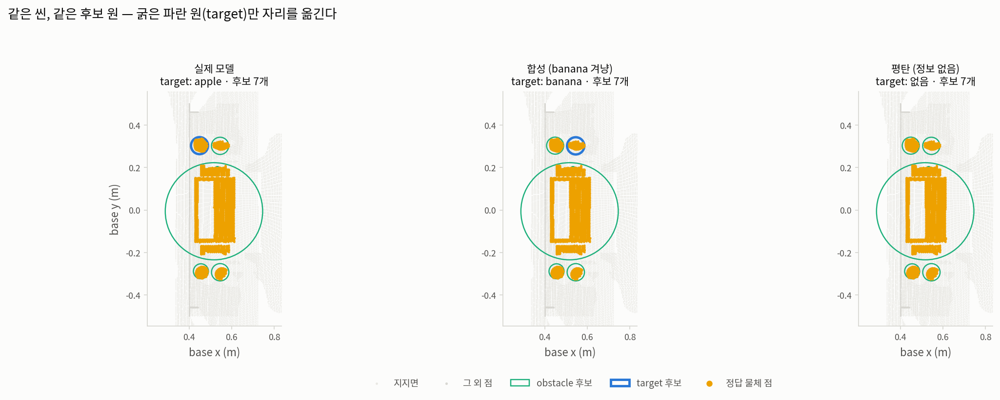
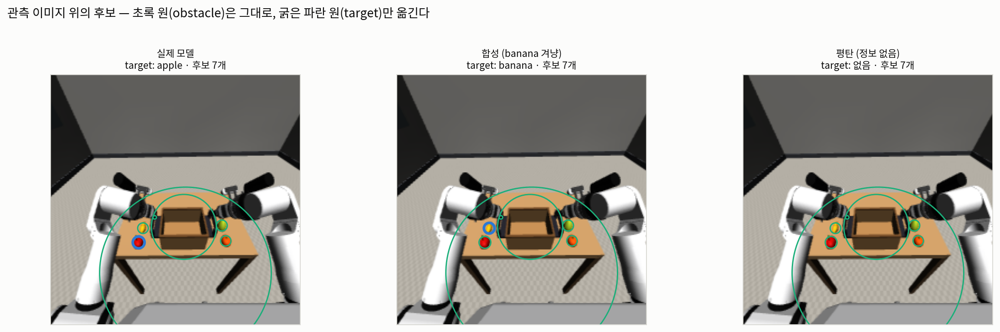
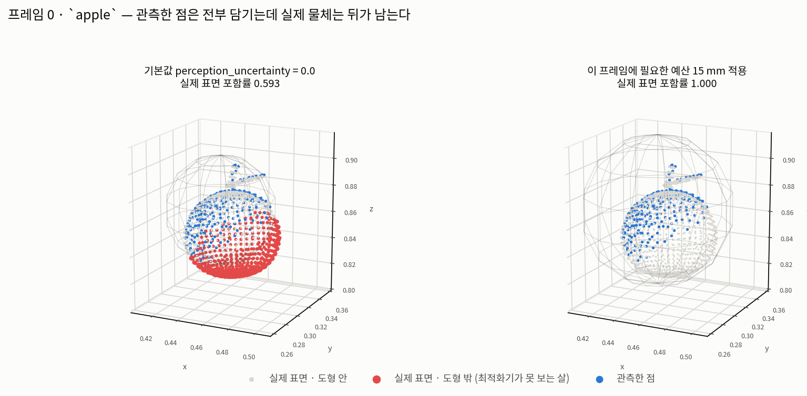

# AG3S — 실모델 검증 (fine-tuned π0.5 `rby1_transport_14d`)

`asset/doc/`는 **설계 문서**(파이프라인 설명, 발표 자료)입니다. 이 폴더는 **실측 검증 기록**입니다.
합성 fixture가 아니라 실제로 추론 중인 파인튜닝 모델의 출력으로 각 단계를 하나씩 확인하고,
단계마다 표와 그림을 남깁니다.

## 왜 단계별인가

AG3S는 8단계 파이프라인이고, 각 단계는 앞 단계의 출력을 신뢰합니다. 마지막 단계(제약 집합)만
보고 "된다/안 된다"를 판정하면, 실패했을 때 어느 단계가 원인인지 알 수 없고 성공했을 때도
운이 좋았던 것인지 알 수 없습니다. 그래서 **각 단계의 출력을 그 단계의 ground truth와 직접
대조**합니다. MuJoCo 씬이므로 모든 단계에 정확한 ground truth가 존재한다는 것이 이 검증의
전제이자 최대 강점입니다.

## 단계

| # | 문서 | 검증 대상 | Ground truth | 상태 |
|---|---|---|---|---|
| 0 | [record_check](../experiments/record_check.py) | 관측 기록 — 추론 스텝마다 qpos + 정책이 실제로 본 3장의 224×224 이미지 | — | **run_0002 검사 통과** — 28/44 채점 가능 |
| 1 | [step-01-attention.md](step-01-attention.md) · [서버 프롬프트](step-01-server-prompt.md) | π0.5가 프롬프트가 지목한 물체를 보는가 | MuJoCo 세그멘테이션 | **PASS** — L8 h2, peak-on-target 1.000 |
| 2 | [step-02-backprojection.md](step-02-backprojection.md) | 깊이 → 3D 점, 카메라 규약 | MuJoCo geom 자세·메시 정점 | **PASS** — 상판 높이 오차 0.7 mm 이내 |
| 3 | [step-03-lifting.md](step-03-lifting.md) | 2D attention → 3D 점 매핑 | 점별 body id | **PASS** — head peak 1.000, AUC 0.9998 |
| 4 | [step-04-grounding.md](step-04-grounding.md) | 클러스터링 + 채점이 target을 고르는가 | 물체별 point mask | **PASS** (파지 전) — 8/8, IoU 0.953 |
| 5 | [step-05-separation.md](step-05-separation.md) | target/obstacle 분리 후에도 기하가 남는가 | 후보 집합 vs 실제 물체 | **PASS** — 덮는 점 차이 0 |
| 6 | [step-06-geometry.md](step-06-geometry.md) | primitive 근사가 점을 포함하는가 | 포함 검사 + 실제 메시 | **부분 통과** — 관측 점 1.000 / 실제 물체 0.666 |
| 7 | step-07-constraints.md | 제약 집합 + TO가 충돌을 없애는가 | MuJoCo 접촉 | 미착수 |

## 미해결 → [OPEN-geometry-representation.md](OPEN-geometry-representation.md)

6단계에서 발견한 것: **경계 구 하나로는 표현할 수 없는 기하가 두 종류 있다.** 크레이트(중공
용기)는 구가 내부를 삼켜 "바구니에 넣기"를 불가능하게 만들고, 테이블 잔여 슬랩(41 mm × 1.0 m ×
0.8 m)은 경계 구가 749 mm가 된다. 합쳐서 **작업 공간의 100%가 막힌다.**

해결 알고리즘까지 설계했으나 **다른 접근을 먼저 시도하기로 하여 보류**했다. 7단계에서 반드시
다시 만난다.

## 재실행하려면 → [RUNBOOK.md](RUNBOOK.md)

전체 검증을 처음부터 끝까지 다시 돌리는 절차가 그 문서 하나에 있다 — 서버 시작, 롤아웃,
기록 검사, 서버 전송·추출·재기동, 1~5단계 채점, 갤러리, 회귀. 다음 실행의 목적은
**`--record-depth`를 켜서 실제 depth로 다시 도는 것**이다.

아래는 개별 명령의 설명이다.

## 실행 명령

### ① 서버 (GPU 서버에서)

```bash
cd <워크스페이스 루트>/src/openpi
.venv/bin/python scripts/serve_policy.py \
    --port 8123 \
    policy:checkpoint \
    --policy.config=pi05_rby1_lora \
    --policy.dir=<체크포인트 절대경로>
```

로컬 `--remote localhost:8123`은 VS Code SSH 포워딩을 타므로, 서버 쪽 포트는 8123이어야
합니다. 이 커맨드라인 전체를 어딘가에 적어 두세요 — 1단계 probe가 서버를 잠시 내리고
같은 인자로 다시 띄워야 합니다.

### ② 로컬 (기록을 남기는 롤아웃)

기존에 쓰시던 명령에 `--record-ag3s` 하나만 추가된 것입니다.

```bash
cd /home/mk/dev_ws/vla/pi0_TO_ws
RUN=outputs/rby1_atomic_infer/ag3s_step1

src/openpi/.venv/bin/python src/rby1_bringup/pi05_infer.py \
  --model rby1_transport_14d --remote localhost:8123 \
  --prompt "put the apple in the basket" \
  --fruit-layout-index 0 --fruit-slot-order apple banana orange pear \
  --obstacle-profile clear --max-steps 350 --start-delay 2 --speed 1.0 --view front \
  --record        $RUN/third_person.mp4 \
  --trajectory-out $RUN/trajectory.npz \
  --record-ag3s   $RUN/ag3s_records
```

→ `$RUN/ag3s_records/run_0002/` (스텝당 `.npz`, 44스텝에 3.7 MB). **이 하나의 기록을 1–7단계가
전부 재사용합니다.** 단계마다 롤아웃을 다시 돌리면 매번 다른 씬을 검증하게 되어 단계 간
비교가 불가능해집니다.

### ③ 현재 기준선 — 합성 attention으로 도는 AG3S 전체

실모델 검증에 들어가기 전에, 파이프라인이 지금 어떤 답을 내는지 찍어 둡니다. 여기 쓰이는
attention은 `gaussian_attention`(정답 위치에 놓은 가우시안)이고, 1단계가 대체하려는 대상이
바로 이것입니다.

```bash
MUJOCO_GL=osmesa src/openpi/.venv/bin/python -m benchmark.ag3s.experiments.rby1_transport \
    --json benchmark/ag3s/docs/baseline_synthetic_index.json \
    --images benchmark/ag3s/asset/image/baseline_synthetic
```

### ④ 1단계 — attention map

```bash
# (서버) 서버를 내리고 → probe → 같은 인자로 재기동. 상세: step-01-server-prompt.md
src/openpi/.venv/bin/python -m benchmark.ag3s.experiments.pi05_attention \
    --records run_0002 --config pi05_rby1_lora \
    --checkpoint <서버가 로드했던 절대경로> \
    --out attention_step1_run0002.npz

# (로컬) 채점 — GPU 불필요
MUJOCO_GL=osmesa src/openpi/.venv/bin/python -m benchmark.ag3s.experiments.attention_report \
    --records $RUN/ag3s_records/run_0002 \
    --attention benchmark/ag3s/asset/attention/attention_step1_run0002.npz
```

→ `docs/step-01-attention.md` + 그림 4장 + 터미널 한 줄 판정.

### ⑤ 1단계 결과 요약

체크포인트 `pi05_rby1_atomic_lora/rby1_atomic_basket_14d_v2_30k_20260825/29999`,
프롬프트 `put the apple in the basket`, 44프레임 중 28프레임 채점.

| | peak-on-target | target lift | hit β=0 / 0.5 / 1 |
|---|---|---|---|
| uniform (모델 없음) | 0.000 | 1.00 | 0.000 / 0.000 / 0.000 |
| head-average (18×8 평균) | 0.107 | 5.34 | 0.036 / 0.179 / 1.000 |
| **L8 h2** (Euler 0, `last`) | **1.000** | **91.82** | 0.286 / 0.929 / 1.000 |

AG3S 3단계의 attention 소스는 `attention[frame, 0, "last", 8, 2, camera]`입니다.
`GridAttentionAdapter`가 이미 16×16을 받으므로 어댑터 변경은 없습니다.

### ⑥ 2단계 — 3D back-projection

```bash
MUJOCO_GL=osmesa src/openpi/.venv/bin/python -m benchmark.ag3s.experiments.backprojection_report \
    --records $RUN/ag3s_records/run_0002
```

네 검사를 서로 다른 실패 방식에 대응시킨다: A 재투영 왕복(식 자체), B 지지면 평면(회전 규약),
C 물체 표면 오차(깊이 스케일·내부 파라미터), D 카메라 간 정합(손목 카메라 FK 사슬).

| 검사 | 결과 |
|---|---|
| A 재투영 왕복 | 6.8e-13 px |
| B 상판 평면 | 기울기 0.10–0.16°, 높이 오차 −0.73 ~ +0.05 mm (실제 0.820000 m) |
| C 표면 오차 (95 백분위) | crate 0.38–1.34 mm, 과일 0.46–7.23 mm |
| D 3카메라 융합 | 두께 증가 −0.43 ~ −0.03 mm (융합이 오히려 얇아짐) |

### ⑦ 3단계 — attention lifting

```bash
MUJOCO_GL=osmesa src/openpi/.venv/bin/python -m benchmark.ag3s.experiments.lifting_report \
    --records $RUN/ag3s_records/run_0002 \
    --attention benchmark/ag3s/asset/data/attention_step1_run0002.npz
```

| 검사 | 결과 |
|---|---|
| A 점 보존 | 60회 전부 입력 = 출력, 손실 0점 |
| B 픽셀 대응 | nearest 0.0, bilinear 범위 이탈 1.8e-12 |
| C 정규화 단조성 | 240/240; percentile·minmax·none seed 집합 완전 일치, softmax만 Jaccard 0.980 |
| D 순위 (head) | peak **1.000**, AUC **0.99976**, precision@N 0.553 |

**E — 왼쪽 손목 카메라의 attention은 target을 가리키지 않는다** (peak 0.059, AUC 0.806).
(L8, h2)는 head 카메라의 토큰 블록에서 고른 셀이고 다른 카메라 블록으로 옮겨간다는 보장이
없다. 따라서 **attention은 head 카메라 것만 쓰고 점군만 3카메라로 융합한다** — 4단계는 이
구성으로 진행.

### ⑧ 4단계 — target grounding

```bash
MUJOCO_GL=osmesa src/openpi/.venv/bin/python -m benchmark.ag3s.experiments.grounding_report \
    --records $RUN/ag3s_records/run_0002 \
    --attention benchmark/ag3s/asset/data/attention_step1_run0002.npz
```

**기본 설정은 이 씬에서 44프레임 전부 `NO_CLUSTER`다.** `max_points=60000`에 걸려
`coverage_preserving_cap`이 voxel을 5 mm → 15.9 mm로 키우고, 그 간격에서 3 cm 반경의 이웃은
9개뿐이라 `clustering.min_points=20`을 **구조적으로 만족할 수 없다**. 각 설정은 따로 보면
합리적이고, 깨지는 것은 결합이며, 어디에도 보고되지 않는다.

대응은 `range_max=2.0 m`(카메라 기준 반경 게이트). 근거는 측정이다 — 롤아웃에서 팔이 base로부터
최대 1.389 m까지 닿고, 팔이 닿을 수 없는 기하는 팔과 충돌할 수 없다.

| 검사 | 결과 |
|---|---|
| A 옳은 물체 선택 | 채점 가능 8프레임 **8/8** |
| B 클러스터 품질 | IoU **0.953**, 정밀도 0.953, 재현율 1.000 |
| C 오선택 | **0건** |
| E 무게중심 편향 | 평균 **21.0 mm** — 오차가 아니라 구조적 성질 |

**소견 — 접촉한 두 물체는 유클리드 군집으로 분리되지 않는다.** 사과가 크레이트 안에 놓인 뒤
`eps=0.03`에서 둘이 한 연결 성분이 된다. attention은 여전히 사과를 정확히 가리키지만(peak
거리 18 mm) 기하가 갈라지지 않는다. AG3S의 대응은 파지 순간 `attach()`로 스냅샷을 뜨는 것이며,
`attach()`의 docstring이 "AG3S never calls this itself"라고 못박는 이유가 이것이다.

### ⑨ 5단계 — target / obstacle 분리

```bash
MUJOCO_GL=osmesa src/openpi/.venv/bin/python -m benchmark.ag3s.experiments.separation_report \
    --records $RUN/ag3s_records/run_0002 \
    --attention benchmark/ag3s/asset/data/attention_step1_run0002.npz
```

**서명 검사로는 부족하다.** `generate_candidates`에 attention 인자가 없어도 `target`을 통해
간접적으로 들어오고 실제로 들어온다. 그래서 실험으로 잰다 — 같은 점군에 attention 세 가지
(실제 모델 / 다른 물체를 겨눈 합성 블롭 / 평탄)를 넣고 후보 집합을 비교.

| 검사 | 결과 |
|---|---|
| A attention 인자 부재 | 0개 |
| B 덮는 점 집합 불변 | 9프레임 전부 동일, 최대 차이 **0점** |
| C 물체 소실 | **0건** |
| D target이 후보로 남음 | 전부 |
| E 여유거리 분리 | 인가 손가락 target열만 50→20→5→0 mm, 나머지 전부 50 mm 고정 |

**이것이 파이프라인이 존재하는 이유다.** attention이 완전히 틀려도, 심지어 아무 정보가 없어도,
물리적으로 존재하는 기하는 전부 충돌 후보로 남는다. 잘못된 attention이 만드는 결과는 "엉뚱한
물체에 접촉이 허용된다"이지 "물체가 사라진다"가 아니다.

**그림 한 장이 이 단계 전부다** — 세 패널이 같은 씬이고, 굵은 파란 원(target)만 자리를 옮긴다.
위에서 본 것과 정책이 본 이미지 위, 둘 다 낸다:





**fail-closed 시연.** 이 검증의 첫 판이 조작기 이름으로 `"right_arm"`을 넘겼는데 열거형 값은
`right`/`left`뿐이라 정책이 아무 링크도 인가하지 않았다. `grasp`인데도 손가락이 50 mm를 유지해
검사가 실패했다 — 버그가 아니라 **오타 하나가 접촉 허가를 여는 게 아니라 닫는 쪽으로 떨어진다**는
증거라, 그 패널을 그림에 남겼다.

### ⑩ 6단계 — geometry 변환 (primitive)

```bash
MUJOCO_GL=osmesa src/openpi/.venv/bin/python -m benchmark.ag3s.experiments.geometry_report \
    --records $RUN/ag3s_records/run_0002 \
    --attention benchmark/ag3s/asset/data/attention_step1_run0002.npz
```

**포함을 두 가지로 나눠 재는 것이 이 단계의 전부다.**

| 검사 | 결과 |
|---|---|
| A 관측 점 포함 | 후보 전부 **1.000** — AG3S가 보장하려던 것은 보장된다 |
| B **실제 물체 포함** | 평균 **0.666**, 최대 침투 **46.7 mm** — 통과하지 못한다 |
| C 캡슐 구 체인 | **실데이터 캡슐** + 합성 4종 전부 표면 100%, 부푼 반지름이 `sqrt(r²+(s/2)²)`와 일치 |

| 물체 | 관측 점 | 실제 물체 | 최대 침투 | 필요 예산 |
|---|---|---|---|---|
| crate | 1.000 | 0.976 | 3.6 mm | 5 mm |
| banana | 1.000 | 0.859 | 18.8 mm | 20 mm |
| apple | 1.000 | 0.637 | 28.1 mm | 30 mm |
| orange | 1.000 | 0.498 | 14.6 mm | 15 mm |
| pear | 1.000 | 0.380 | 46.7 mm | 50 mm |

**기전은 반지름이 아니라 중심이다.** 과일의 맞춘 반지름은 실제와 비슷한데 중심이 카메라 쪽으로
11–22 mm 밀려 있다 (사과 21.4 mm — 4단계에서 잰 클러스터 무게중심 편향 21.0 mm와 일치). 같은
크기의 구가 반지름만큼 밀리면 절반이 밖으로 나간다.

**그림으로 보면 이렇다** — 파란 점(관측)은 전부 구 안인데 빨간 점(실제 표면)이 뒤에 남는다:



**여유거리는 이미 절반이 쓰였다.** 5단계의 `object` 여유거리는 50 mm인데 최대 침투가 46.7 mm다.
최적화기는 도형에서 50 mm 떨어져 있으라는 제약을 풀지만, 도형이 실제 물체보다 그만큼 작으므로
**실제 물체로부터의 여유는 3 mm까지 줄어들 수 있다.** `perception_uncertainty` 기본값이 `0.0`인
채로 두면 안 되는 이유이고, 켠 만큼 우회 거리가 느는 교환이 7단계의 질문이다.

### ⑪ 7단계 — 아직 도구가 없습니다

각 단계는 그 단계 고유의 ground truth 대조가 필요하고, 그 대조 코드가 아직 없습니다.
1단계 결과를 보고 하나씩 만듭니다 — 순서가 뒤집히면 안 되는 이유가 있습니다: 예를 들어
1단계가 "쓸 만한 head가 없다"로 끝나면 3단계(attention lifting)는 검증할 대상 자체가
달라지고, 4단계의 채점 기준도 다시 정해야 합니다.

각 단계가 필요로 할 대조는 다음과 같습니다.

| 단계 | 비교 대상 | 필요한 것 |
|---|---|---|
| 2 back-projection | 역투영한 점 vs 물체 중심 실좌표 | `run_0002` + `TransportScene`. 새 스크립트 하나 |
| 3 attention lifting | 점별 attention vs 점별 body id | 1단계의 `.npz` + `pixel_labels` |
| 4 target grounding | 고른 클러스터 vs 정답 물체의 point mask | 3단계 출력 + 클러스터 채점 |
| 5 target/obstacle | 후보 집합 vs 실제 존재하는 물체 | 4단계 출력. **개수 보존이 핵심** |
| 6 geometry | primitive가 점을 포함하는가, 크기가 맞는가 | `containment_report` + 실제 치수 |
| 7 constraints + TO | 최적화된 궤적의 MuJoCo 접촉 | `benchmark/trajopt` + 재생 하네스 |

## 도구

| 스크립트 | 실행 위치 | 하는 일 |
|---|---|---|
| `pi05_infer.py --record-ag3s DIR` | 로컬 | 추론 스텝마다 `.npz` 하나 — qpos, state(14), 정책 이미지 3장, action chunk |
| `benchmark.ag3s.experiments.record_check` | 로컬 | 기록이 forward pass를 쓸 값어치가 있는지 — 대상 가시성·이미지 정상성·씬 재생 |
| `benchmark.ag3s.experiments.pi05_attention` | **GPU 서버** | 체크포인트를 `return_attn_probs=True`로 로드해 3개 카메라 grid의 attention 추출 |
| `benchmark.ag3s.experiments.attention_report` | 로컬 (GPU 불필요) | 세그멘테이션 대조 채점 → 표 4개 + 그림 4장 + 이 폴더의 문서 |

### 왜 attention 추출만 GPU 서버인가

`localhost:8123`은 VS Code SSH 포워딩이고, 실제 정책 서버는 GPU 서버에 있습니다. websocket
프로토콜은 `actions`만 돌려주므로 실행 중인 서버에서 attention을 꺼낼 방법이 없습니다.
attention은 `Pi0Config.return_attn_probs=True`로 prefix/suffix를 직접 구동해야 나오고,
그러려면 체크포인트가 있는 곳에서 forward를 돌려야 합니다. **서버를 재시작할 필요는 없습니다** —
기록된 관측에 대해 오프라인으로 한 번 돌리는 별도 스크립트입니다.

## 점군 갤러리 — 발표·디버깅용

검증 문서의 그림은 각각 하나의 질문에 최소한으로 답한다. 갤러리는 목적이 다르다 —
파이프라인이 무엇을 보고 무엇을 만들어 내는지 **눈으로 이해하기 위한** 것이다.

```bash
MUJOCO_GL=osmesa src/openpi/.venv/bin/python -m benchmark.ag3s.experiments.cloud_gallery \
    --records $RUN/ag3s_records/run_0002 \
    --attention benchmark/ag3s/asset/data/attention_step1_run0002.npz --frame 0
```

| 그림 | 무엇을 보여주나 |
|---|---|
| `g1_per_camera.png` | 카메라 3대가 각각 무엇을 보는가. head는 테이블 전체와 과일 넷, 손목은 크레이트 근처의 좁은 조각만 — 3단계에서 왼쪽 손목 attention이 실패한 이유가 여기 있다 |
| `g2_fusion.png` | 세 점군을 겹쳐 **출처 카메라로 색칠**. 색이 갈라지지 않으면 외부 파라미터가 맞는 것 — 2단계 D를 숫자가 아니라 그림으로 |
| `g3_attention_2d.png` | RGB · depth · attention을 나란히. 2D attention이 어떤 깊이 위에 얹히는지, 즉 3D로 올라가기 직전의 상태 |
| `g4_attention_3d.png` | 점군을 attention으로 색칠. **낮은 점도 전부 그린다** — 아무것도 버리지 않았다는 불변식의 시각적 증거 |
| `g5_target.png` | 고른 클러스터, 맞춘 primitive, 정답 표면을 함께. 구가 점을 **포함**하는 것이 눈에 보인다 |
| `g6_stages.png` | 원본 → 자기 필터 → 지지면 제외 → seed → target. 무엇이 언제 걸러지는가 |

### 관측 이미지 위 겹침

탑뷰는 정확하지만 사람이 보는 공간이 아니다. 4·5·6단계는 같은 결과를 **정책이 실제로 본
224×224 입력 위에** 되돌려 그린 그림을 함께 낸다 (`fig4_image_overlay` / `fig6_image_overlay`).

되돌리기는 [imageview.py](../experiments/imageview.py) 한 곳이 담당하고, 두 규약이 거기 모여
있다:

* **정규화 좌표로 옮긴다.** 깊이·내부 파라미터는 480×640, 정책 이미지는 224×224인데 둘 다
  4:3이고 299×224 → 224×224 변환이 crop도 pad도 아닌 순수 가로 압축이라 정규화 좌표가
  보존된다 (2단계에서 확인). 오프셋이 없다.
* **구의 실루엣은 원으로 근사한다.** 핀홀에서 구의 실루엣은 엄밀히 타원이고 광축에서 멀수록
  커진다. 여기서는 반지름 `f·r/z`인 원으로 그린다 — 광축 위에서 정확하고 이 씬은 물체가 화면
  중앙 근처다. **판정에 쓰는 숫자는 언제나 3D에서 계산하고 이 근사는 그림에만 쓴다.**

한 가지 한계: 이미지 공간에서는 물체의 뒷면이 앞면과 같은 자리에 투영된다. 그래서 6단계의
빨간 점(도형 밖 표면) 면적을 오차 크기로 읽으면 안 된다. "어느 부분인가"는 3D 그림이,
"어느 물체인가"는 이미지 그림이 답한다.

**3D 축척에 관하여.** `visualization._equalise`는 세 축을 정육면체로 만든다 (4 cm 물체가
1.5 m 축 위에서 팬케이크로 보이는 것을 막기 위한 것). 테이블 장면은 x·y가 1 m대인데 z는
0.3 m라 정육면체로 맞추면 세로의 2/3가 빈 공간이 되므로, 갤러리는 `set_box_aspect`에 실제
변 길이를 주어 왜곡 없이 프레임을 채운다.

## 기록 형식과 depth

### 기본값은 qpos만 저장한다

깊이와 세그멘테이션은 저장하지 않습니다. MuJoCo는 결정론적이라 `qpos`가 로봇·크레이트·과일을
모두 고정하므로, `TransportScene`이 나중에 정확히 같은 깊이/세그멘테이션/내부·외부 파라미터를
재생성합니다 — AG3S가 이미 테스트를 통과해 온 바로 그 코드 경로로. 저장하면 파일이 약 50배가
되고, 더 나쁘게는 기록 시점의 렌더링과 분석 시점의 렌더링이 아무도 모르게 어긋날 수 있습니다.

정책 이미지 3장만은 그대로 저장합니다. 이것은 재생성하면 안 되는 유일한 것입니다 —
네트워크에 실제로 들어간 텐서이고, attention 검증은 "일치할 것으로 기대되는 재렌더링"이 아니라
모델이 본 픽셀 위에서 이뤄져야 합니다.

### `--record-depth` — 실제 depth도 저장

```bash
... --record-ag3s $RUN/ag3s_records --record-depth        # 세 카메라 전부
... --record-ag3s $RUN/ag3s_records --record-depth zed_left   # 하나만
```

카메라별 depth와 내부·외부 파라미터를 함께 저장합니다. **uint16 밀리미터**로 담는데,
그것이 실제 depth 카메라가 내보내는 형식이고 `PointCloudConfig.depth_scale = 0.001`이 존재하는
이유이기 때문입니다. 렌더러의 float64를 그대로 담으면 파일만 두 배가 되고 현실성은 늘지
않으며, 모든 실제 센서가 갖는 1 mm 양자화를 조용히 숨기게 됩니다.

스텝당 약 0.13 MB가 늘어납니다 (44스텝 기준 +6 MB). 검증 결과는 재생 depth와 1 mm 이내로
일치하며, 그 1 mm가 정확히 양자화 폭입니다.

### 이 검증이 재지 *않은* 것

**depth에 잡음이 없습니다.** MuJoCo 렌더러의 깊이에는 실제 ZED의 잡음, 반사면 결측, 경계의
flying pixel, 스테레오 정합 실패가 없습니다. 2단계의 "표면 오차 0.4–7 mm"는 역투영 수학과
좌표 규약의 정확도이지 실기 정확도가 아닙니다.

**정답이 시뮬레이터에서 옵니다.** 물체 자세·메시 정점·세그멘테이션이 전부 MuJoCo가 알려준
값입니다. 실기에는 이 정답이 없으므로, 넘어갈 때는 정답을 다른 방식으로 마련하거나(마커,
수동 라벨) 정답 없이 자기일관성 검사만으로 만족해야 합니다. **이 검증의 최대 강점이
시뮬레이터라는 점이고, 최대 한계도 같은 점입니다.**

## 그림 규격

모든 단계의 그림은 `benchmark/ag3s/experiments/figstyle.py` 하나를 통해 그린다. 색을 눈으로
다시 고르는 일이 없고, 단계들이 한 문서처럼 읽히게 하기 위해서다.

| 인코딩 | 무엇에 쓰나 | 규칙 |
|---|---|---|
| 순차형 (파랑 명도 램프) | 크기·비율 — hit rate, peak-on-target 격자 | 한 색만, 밝음 → 어두움 |
| 범주형 (8색 고정 순서) | 정체 — 어느 물체, 어느 카메라 | 슬롯 인덱스로 배정, 순환 금지 |
| 회색 | 배경·격자·비강조 점 | 데이터가 아닌 것 |

범주형 팔레트의 **순서 자체가 색각 이상 안전 장치**다 (인접 슬롯 쌍의 CVD ΔE ≥ 8을 만족하도록
고른 순서). 그래서 차트마다 색을 재배열하지 않는다. 한글 라벨은 Noto Sans CJK로 그린다.

각 단계 문서에 그 단계 그림의 "만드는 법 / 읽는 법"이 절로 들어 있다.

### fig0 — 기록 검사 (`record_check`)

`asset/image/attention/fig0_record_sanity.png`. 위 패널은 제어 스텝에 따른 target의 가시
픽셀 수와 채점 하한(점선), 가려진 구간(음영). 아래 패널은 같은 시간축에 대한 target의
16×16 패치 점유를 세로로 펼친 히트맵이다.

**만드는 법.** 기록의 `qpos`로 `TransportScene`을 프레임마다 재생하고 세그멘테이션을 렌더해
target 픽셀 수를 센다. 아래 패널은 같은 세그멘테이션에서 계산한 패치 점유 256칸을 세로로
세운 것이다.

**읽는 법.** 이 그림은 결과가 아니라 **입력 검사**다. GPU forward pass를 쓸 값어치가 있는
기록인지, 채점 가능한 프레임이 몇 개인지, 가림이 어느 구간인지를 보낸다 — 서버에 보내기 전에
로컬에서 확인하기 위한 것이다.

## 좌표 규약 (모든 단계가 여기에 의존)

`render_cam(..., match_rby1_dataset=True)`는 299×224(4:3)로 렌더한 뒤 224×224로 **찌그러뜨립니다**
— crop도 pad도 아닌 순수 가로 압축. 따라서 **정규화 좌표는 보존됩니다**: 정책 열 `u_p`는 정규화
열 `u_p/224`이고, AG3S가 재구성하는 640×480(역시 4:3) 프레임에서도 같은 정규화 열입니다.
attention은 offset 없이 단순 정규화 스케일링으로 점군에 올라갑니다.

토큰 배치는 추측이 아닙니다. `AlohaInputs`가 base → left wrist → right wrist 고정 순서로 이미지
dict를 만들고 `Pi0.embed_prefix`가 그 순서로 이어붙이므로:

| 정책 키 | MuJoCo 카메라 | AG3S CameraID | prefix 토큰 |
|---|---|---|---|
| `cam_high` | `zed_left` | head | 0–255 |
| `cam_left_wrist` | `wrist_cam_l` | left_wrist | 256–511 |
| `cam_right_wrist` | `wrist_cam_r` | right_wrist | 512–767 |
| (언어) | — | — | 768– |
