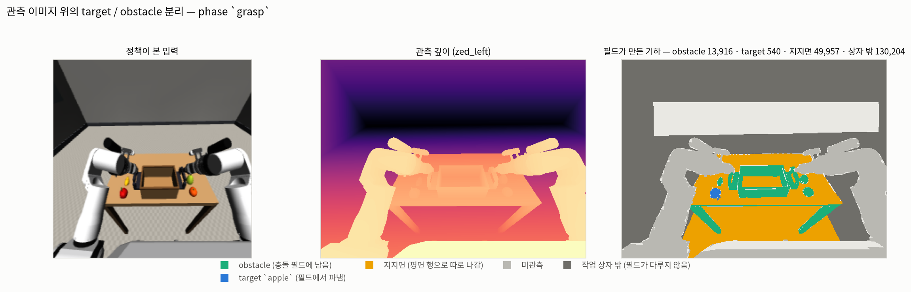
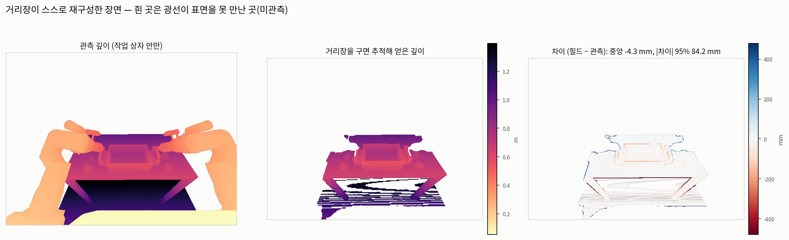
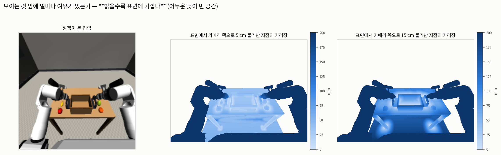

# ESDF 를 관측 이미지에서 보기

단면 그림({'esdf-diagnostics.md'})은 정확하지만 사람이 보는 공간이 아니다. 여기서는 필드가 만든
기하와 거리장을 **정책이 실제로 본 프레임 위에** 놓는다.

| | |
|---|---|
| 기록 | `outputs/rby1_atomic_infer/ag3s_step1/ag3s_records/run_0002` 프레임 0 |
| 카메라 | `zed_left` |
| 복셀 | 10 mm, 격자 (151, 180, 160) |
| phase | `grasp` — 접촉이 허가되므로 target 이 필드에서 파인다 |
| 빌드 | 1.63 s |

## 1. target / obstacle 분리



**만드는 법.** 관측 깊이의 표면점을 그대로 복셀 라벨에 대응시킨다. 레이마칭보다 정직하다 —
실제로 본 표면이 어떤 라벨을 받았는지만 말하고 필드가 만들어낸 표면을 섞지 않는다. 라벨은
파냄 **이전** 점유에서 만든다. 파낸 뒤에는 target 이 그냥 사라져 있어 "어디가 파였는지" 를
말할 수 없기 때문이다.

**읽는 법.** 초록이 충돌 필드에 남는 obstacle, 파랑이 `apple` — **필드에서 파여 장애물로
세지 않는 부분**이다. 노랑은 지지면이고, 필드가 아니라 half-space 평면 행으로 따로 나간다.

픽셀 수: obstacle 13,916 · target 540 · 지지면 49,957 ·
미관측 60,127.

파냄이 **제거가 아니라 이관**이라는 점은 그대로다 — `apple` 은
`CollisionConstraintSet.candidates` 에 여전히 후보로 있고, 필드에서만 빠진다.

## 2. 거리장이 스스로 재구성한 장면



**만드는 법.** 픽셀마다 광선을 따라 구면 추적(sphere tracing)을 한다. 거리장이 곧 안전 보폭이라
고정 간격보다 훨씬 적게 돌고, 거리가 복셀 반 칸보다 작아지면 표면으로 본다 — 이산 격자가 표현할
수 있는 가장 얇은 껍질이 그것이다.

**읽는 법.** 가운데가 **필드만 가지고 만든 깊이 이미지**다. 오른쪽이 관측 깊이와의 차이이고,
그것이 곧 이 표현의 오차다. 중앙값 -4.3 mm, |차이| 95 백분위
84.2 mm.

흰 곳은 광선이 끝까지 표면을 만나지 못한 곳이다 — 그 방향은 **미관측**이라 필드에 아무것도 없다.
`unknown_policy: free` 가 뜻하는 바가 이 흰색이다.

**로봇 팔 영역이 크게 어긋나는 것은 정상이다.** 팔은 필드에서 마스크로 빠지므로 광선이 그
자리를 통과해 뒤의 표면까지 간다. 관측 깊이는 팔을, 필드는 팔 뒤를 말하니 차이가 클 수밖에 없다.

중앙값 -4.3 mm 가 **복셀 반 칸(-5.0 mm)에 가까운 것**이
이 표현의 이산화 편향이 예측대로라는 뜻이다.

## 3. 보이는 것 앞의 여유



**만드는 법.** 픽셀마다 표면점에서 카메라 쪽으로 5 cm / 15 cm 물러난 지점의 거리장을 읽는다.

**읽는 법.** "이 픽셀이 보이는 표면 앞에 얼마나 빈 공간이 있는가" 다. **밝을수록 표면에
가깝고 어두울수록 여유가 크다.** 테이블 상판 바로 위가 밝고(붙어 있다), 크레이트 안쪽이
15 cm 물러난 그림에서 밝게 남는 것이 그 안이 좁다는 뜻이다.

**로봇 팔이 어둡게 나오는 것은 여유가 커서가 아니다.** 팔은 필드에서 마스크로 빠져 있어 그
자리에 아무 표면도 없고, 그래서 거리장이 크게 나온다. 물리적으로는 팔이 거기 있다 — 자기 충돌은
로봇 모델이 따로 다루고 이 필드의 일이 아니라는 뜻이며, 그림을 읽을 때 그 구분을 해야 한다.

## 재현

```bash
MUJOCO_GL=osmesa src/openpi/.venv/bin/python -m benchmark.ag3s.experiments.reports.esdf_image_report \\
    --records outputs/rby1_atomic_infer/ag3s_step1/ag3s_records/run_0002 --voxel 0.01
```
