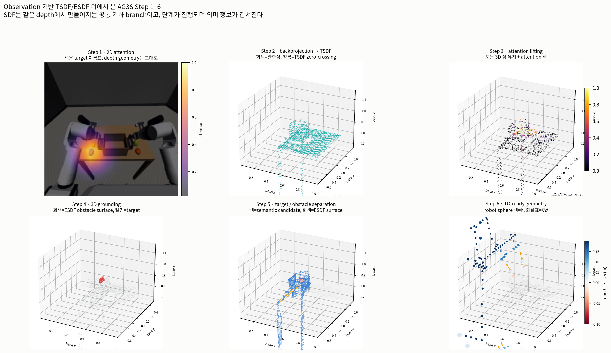
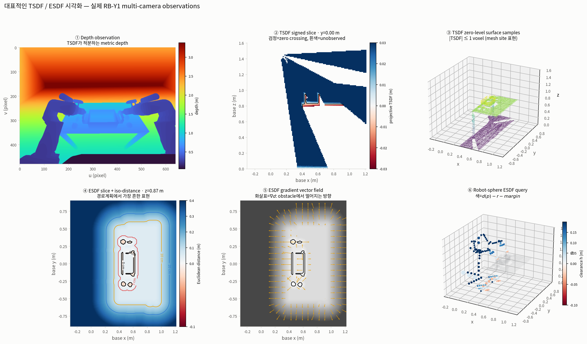

# Observation 기반 TSDF/ESDF 시각화

| 항목 | 값 |
|---|---|
| 기록 | `outputs/rby1_atomic_infer/ag3s_step1/ag3s_records/run_0002`, frame 0 |
| 카메라 | `zed_left, wrist_cam_l, wrist_cam_r` |
| field | `(151, 180, 160)`, 10 mm voxel |
| TSDF truncation | ±30 mm |
| ESDF max distance | 0.40 m |
| 미관측 | 72.6% |
| robot sphere query | 194개, h<0: 26개 |

## AG3S Step 1–6와 SDF

TSDF/ESDF는 attention에서 생성되는 것이 아니라 세 카메라의 depth observation에서 만들어지는
공통 기하 branch다. 따라서 step마다 field를 새로 계산한 것처럼 그리지 않고, 동일 field 위에 각
단계가 만드는 의미 정보가 누적되는 모습을 표시했다. Step 6 패널의 색이 최종
`h=d_esdf(p)-r_robot-margin`이다.

## 대표적인 TSDF/ESDF 표현

1. metric depth image
2. signed TSDF slice와 zero crossing
3. TSDF zero-level surface samples (`|TSDF| <= 1 voxel`)
4. ESDF distance heatmap과 metric iso-distance contours
5. ESDF gradient vector field
6. robot collision-sphere ESDF query

현재 환경에는 Open3D/scikit-image가 없으므로 3번은 marching-cubes triangle mesh 대신 같은
zero-level set을 이루는 voxel samples로 표시했다. 계산에 쓰인 TSDF/ESDF 값은 동일하다.

수치 요약은 [`summary.json`](../../../asset/image/observation_sdf/summary.json)에 있다.
