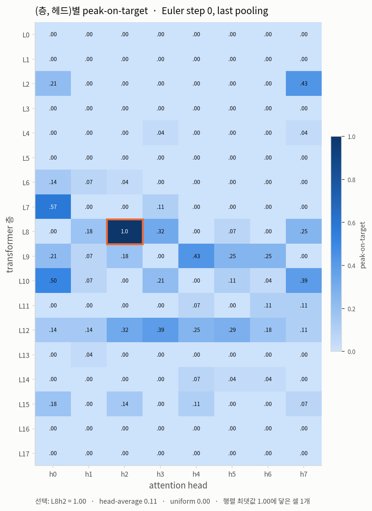
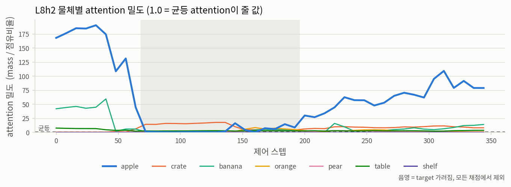
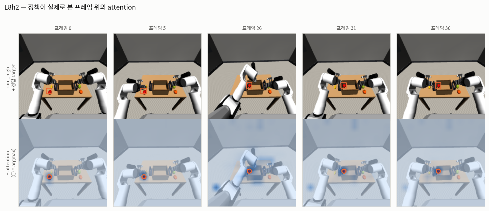
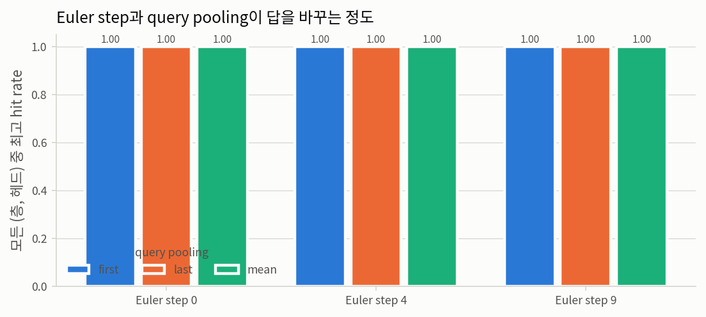

# 1단계 — attention map

**질문.** 파인튜닝된 `pi05_rby1_atomic_lora` 정책은
프롬프트가 지목한 물체를 실제로 보는가?

AG3S가 attention을 쓰는 곳은 단 하나 — 재구성된 클러스터 중 어느 것이 target인지 이름을 붙이는
일뿐입니다. attention이 틀려도 파이프라인의 안전 성질은 전부 유지되지만, 틀리면 파이프라인이
쓸모가 없습니다. 그래서 이것이 가장 먼저 재야 할 값이고, 실제 attention이
`mujoco_source.gaussian_attention`(합성 대역품)을 대체할 수 있는지를 결정하는 값입니다.

| | |
|---|---|
| 프롬프트 | `put the apple in the basket` |
| target body | `apple` |
| 카메라 | `cam_high` → MuJoCo `zed_left` → prefix 토큰 (0, 256) |
| 추론 프레임 | 44개 기록, **28개 채점** (16개 제외: target이 200 px 미만) |
| 체크포인트 | `/mnt/dev/work/pi05_TO_hybrid/checkpoints/pi05_rby1_atomic_lora/rby1_atomic_basket_14d_v2_30k_20260825/29999` |
| attention 블록 | 18개 층 × 8개 헤드 × 16×16 패치 |
| Euler step | [0, 4, 9] |
| query pooling | ['mean', 'first', 'last'] |
| noise seed | [0] |

## 판정 — **PASS**

가장 좋은 헤드는 **L8 h2** (Euler step 0, `last` pooling)입니다.
**peak-on-target 1.000** — head-average 0.107,
uniform 0.000 대비. 같은 물체에 균등 attention이 줄 밀도의
**91.82배**를 싣습니다. β = [0.0, 0.5, 1.0]에서 물체 단위 hit rate는
**0.286 / 0.929 / 1.000**.

### 어떤 지표가 순위를 정하는가, 그리고 왜

| 지표 | 스윕 최댓값 | 최댓값에 닿은 셀 | 고유값 개수 |
|---|---|---|---|
| peak-on-target | 1.000 | 3 / 1296 | 20 |
| hit β=0 | 0.321 | 31 / 1296 | 10 |
| hit β=0.5 | 0.929 | 6 / 1296 | 27 |
| hit β=1 | 1.000 | 105 / 1296 | 29 |

헤드 순위는 **peak-on-target**으로 매깁니다. β 스윕은 보고하되 순위에는 쓰지 않습니다.
이 롤아웃에서 β의 양 끝이 모두 순위 신호로 실패하고, 위 표가 그것을 숫자로 보여줍니다.

- **β = 0은 헤드가 아니라 씬이 상한을 정합니다.** 1296개 셀 전부가 같은 값에서 멈추고,
  이길 수 있는 프레임은 파지 *전* 프레임뿐입니다. target이 크레이트 안으로 들어간 뒤에는
  target을 덮는 어떤 attention 덩어리도 크레이트를 더 많이 덮으므로, 헤드가 무엇을 하든
  raw mass는 target을 고를 수 없습니다.
- **β = 1은 포화합니다.** 많은 셀이 정확히 1.000에 닿아 좋은 헤드끼리를 구분하지 못합니다.

peak-on-target에는 두 문제가 다 없습니다. "가장 뜨거운 패치 하나가 target을 포함하는가"만
묻고, 이는 실질적으로 상한이 없으면서 이후 target grounding이 실제로 소비할 정보에 가장
가깝습니다.

### 판정 규칙

베이스라인이 둘이고, 선택된 헤드는 **어떤 β에서도 두 베이스라인보다 나빠서는 안 되며**,
**peak-on-target에서 head-average를 0.15 이상** 앞서고 lift가 2를 넘어야 합니다.
uniform 베이스라인은 "target이 그냥 화면에서 제일 큰 것 아닌가"에 답하고, head-average는
"헤드를 고른 것이 무엇을 벌어줬나"에 답합니다.

마진을 peak-on-target에만 요구하는 것은 의도된 선택입니다. β = 1에서 head-average가 이미
1.000이므로 어떤 헤드가 낼 수 있는 최대 마진은
0.000입니다 — 아무것도 통과할 수 없는 게이트는 증거가
아니라 고장난 규칙입니다.

`β`는 attention mass를 물체의 화면 점유 비율로 나눌 때의 지수입니다. β = 0은 raw mass라
크기가 큰 크레이트가 이기고, β = 1은 밀도라 작은 과일이 이깁니다.

한 프레임에서 이길 수 있는 것은 ['crate', 'apple', 'banana', 'orange', 'pear']뿐입니다. 테이블을 제외한 것은
AG3S 7단계가 테이블을 support surface로 뽑아내고 4단계 target grounding이 애초에 후보로
보지 않기 때문입니다 — 파이프라인이 결코 고르지 않을 집합을 상대로 채점하면 아무 단계도
내리지 않는 판단을 재게 됩니다. 아래 물체별 표에는 그대로 남겨두어, 테이블만 쳐다보는
헤드가 있다면 그렇게 보이도록 했습니다.

### 베이스라인과 선택된 헤드

| 맵 | hit β=0 | hit β=0.5 | hit β=1 | peak-on-target | target mass | target lift | advantage |
|---|---|---|---|---|---|---|---|
| head-average (all 18x8) | 0.036 | 0.179 | 1.000 | 0.107 | 0.009 | 5.34 | -0.037 |
| uniform (no model) | 0.000 | 0.000 | 0.000 | 0.000 | 0.001 | 1.00 | -0.035 |
| **best: L8 h2** | **0.286** | **0.929** | **1.000** | **1.000** | **0.141** | **91.82** | **-0.091** |

`mass`는 target에 떨어진 attention의 비율, `lift`는 그 비율을 균등 attention이 줄 비율로
나눈 값입니다 — lift가 1.0 근처면 raw mass가 얼마든 그 헤드는 아무것도 선택하지 않는
것입니다. `advantage`는 이길 자격이 있는 물체들 중 최상위 경쟁자의 mass를 뺀 값입니다.
`peak-on-target`은 가장 뜨거운 패치 하나가 target을 포함한 프레임의 비율로, hit rate보다
거친 질문이지만 30×40 픽셀이라는 패치 크기에서 살아남는 질문입니다.

여기서 `advantage`가 음수인 것은 예상된 것이며 실패가 아닙니다. 크레이트가 target의 약
26배 픽셀을
차지하므로 raw mass는 더 많이 가져가면서 *픽셀당* attention은 훨씬 적게 받습니다.
`lift`가 재는 것이 정확히 그 비교이고, 두 열은 함께 읽어야 합니다.

### 순위 — 1296개 (층, 헤드, Euler step, pooling) 중 상위 12

| # | 헤드 | Euler | pooling | hit β=0 | hit β=0.5 | hit β=1 | peak-on-target | target mass | target lift | advantage |
|---|---|---|---|---|---|---|---|---|---|---|
| 1 | L8 h2 | 0 | last | 0.286 | 0.929 | 1.000 | 1.000 | 0.141 | 91.82 | -0.091 |
| 2 | L8 h2 | 4 | last | 0.286 | 0.929 | 1.000 | 1.000 | 0.123 | 80.00 | -0.083 |
| 3 | L8 h2 | 4 | mean | 0.286 | 0.821 | 1.000 | 1.000 | 0.101 | 65.14 | -0.084 |
| 4 | L8 h2 | 0 | mean | 0.286 | 0.857 | 1.000 | 0.857 | 0.110 | 71.31 | -0.041 |
| 5 | L8 h2 | 9 | last | 0.321 | 0.393 | 1.000 | 0.821 | 0.083 | 52.34 | -0.061 |
| 6 | L9 h4 | 4 | last | 0.286 | 0.321 | 0.964 | 0.821 | 0.078 | 49.48 | -0.106 |
| 7 | L7 h0 | 4 | last | 0.286 | 0.893 | 1.000 | 0.786 | 0.037 | 25.74 | -0.041 |
| 8 | L7 h0 | 4 | mean | 0.000 | 0.821 | 1.000 | 0.714 | 0.024 | 17.44 | -0.076 |
| 9 | L10 h0 | 4 | last | 0.036 | 0.500 | 1.000 | 0.714 | 0.020 | 14.10 | -0.068 |
| 10 | L8 h2 | 9 | mean | 0.214 | 0.321 | 1.000 | 0.607 | 0.056 | 34.86 | -0.068 |
| 11 | L7 h0 | 0 | last | 0.179 | 0.857 | 1.000 | 0.571 | 0.028 | 19.36 | -0.042 |
| 12 | L10 h0 | 0 | last | 0.179 | 0.464 | 1.000 | 0.500 | 0.023 | 15.37 | -0.054 |



### attention이 실제로 어디로 가는가 (물체별)

| body | 평균 가시 픽셀 | attention mass | lift | argmax 획득 프레임 |
|---|---|---|---|---|
| crate | 11042 | 0.225 | 6.35 | 0 |
| apple | 431 | 0.141 | 91.82 | 28 |
| banana | 205 | 0.011 | 14.84 | 0 |
| orange | 491 | 0.002 | 1.52 | 0 |
| pear | 303 | 0.001 | 0.90 | 0 |
| table | 24513 | 0.288 | 3.53 | 0 |
| shelf | 0 | 0.000 | 0.00 | 0 |



### 프레임 자체



### 샘플링 선택이 결과를 바꾸는가



## 그림에 대하여

모든 그림은 공통 규격(`benchmark/ag3s/experiments/common/figstyle.py`)을 쓴다. 크기·비율을 나타낼
때는 파랑 한 색의 명도 램프(순차형), 정체를 나타낼 때는 검증된 8색 팔레트를 고정 순서로
쓴다 — 슬롯 순서 자체가 색각 이상에서 인접 색이 구분되도록 고른 안전 장치이므로 차트마다
바꾸지 않는다.

### fig1 — (층, 헤드)별 peak-on-target

`fig1_layer_head_peak_on_target.png`. 세로 18층 × 가로 8헤드 격자, 칸 색이 그 헤드의
peak-on-target이다.

**만드는 법.** 고정된 (Euler step, pooling)에서 144개 (층, 헤드) 각각에 대해 채점 프레임의
peak-on-target을 평균해 격자에 채운다. 주황 테두리는 **순위가 고른 칸**이지 이 격자의
최댓값이 아니다 — 동점은 이 그림이 보여주지 않는 지표로 갈리므로, 최댓값에 테두리를 치면
문서가 논하는 헤드와 다른 칸을 가리키게 된다. 아래 캡션에 최댓값에 닿은 칸 수를 함께
적는 것은 포화 여부를 바로 보기 위해서다.

**읽는 법.** 진한 칸이 많으면 그 지표가 포화된 것이고, 그때는 지표를 바꿔야 한다.

### fig2 — 정책이 본 프레임 위의 attention

`fig2_attention_overlay.png`. 위 줄은 정책이 실제로 입력받은 224×224 이미지에 정답 target의
패치 윤곽을 주황으로 그린 것, 아래 줄은 같은 이미지에 attention을 파랑 램프로 덮고 argmax
패치에 ○를 친 것이다.

**만드는 법.** 기록에 저장된 정책 이미지를 그대로 쓴다 (재렌더링이 아니다). 정답 윤곽은
MuJoCo 세그멘테이션에서 계산한 16×16 패치 점유를 이미지 크기로 확대해 등고선으로 그린다.
attention은 16×16 격자를 이미지 위에 이중선형 보간으로 덮는다.

**읽는 법.** ○가 주황 윤곽 안에 있으면 그 프레임은 peak-on-target 성공이다. 프레임은 채점
가능한 것 중에서 균등 간격으로 뽑는다.

### fig3 — 물체별 attention 밀도

`fig3_attention_lift.png`. 가로축은 제어 스텝, 세로축은 밀도 = mass / 화면 점유 비율.

**만드는 법.** 프레임마다 물체별 attention mass와 화면 점유 비율을 세그멘테이션에서 구해
나눈다. 음영 구간은 target이 가려져 채점에서 제외된 프레임이다.

**왜 mass가 아니라 밀도인가.** raw mass 축에서는 테이블과 크레이트가 크기만으로 위를
차지하고 과일은 전부 0 근처에 눌린다. 밀도로 나누면 모든 물체가 같은 축 위에 놓이고,
1.0(점선)이 "균등 attention과 같음"이라는 의미 있는 기준선이 된다.

### fig4 — 샘플링 선택의 영향

`fig4_choice_sweep.png`. Euler step × query pooling 조합마다, 모든 (층, 헤드) 중 최고
hit rate를 막대로 그린다.

**만드는 법.** 1296개 조합의 채점 결과에서 (Euler step, pooling)별 최댓값을 집계한다.

**읽는 법.** 막대 높이가 조합마다 크게 다르면 그 선택이 결과를 좌우한다는 뜻이므로 보고서에
명시해야 한다. 비슷하면 선택에 둔감하다는 뜻이다.

## 이 결과가 아래 단계에서 무엇을 고치는가

`mujoco_source.gaussian_attention`은 target의 알려진 투영 위치에 놓은 가우시안입니다. 그
docstring은 이 카메라를 들여다보는 정책이 없어서 존재한다고 적혀 있습니다. 위 판정이 PASS라면
AG3S 3단계의 attention 소스는
`attention[frame, 0, "last", 8, 2, camera]`이고,
`GridAttentionAdapter`가 이미 16×16 그리드를 받으므로 어댑터는
바뀌지 않습니다.

## 재현

```bash
# 1. 롤아웃 기록 (로컬, 원격 정책 서버를 구동)
src/openpi/.venv/bin/python src/rby1_bringup/pi05_infer.py \
    --model rby1_transport_14d --remote localhost:8123 \
    --prompt "put the apple in the basket" --record-ag3s <RECORD_DIR> ...

# 2. 기록 검사 (로컬) — forward pass를 쓸 값어치가 있는지
MUJOCO_GL=osmesa src/openpi/.venv/bin/python -m benchmark.ag3s.experiments.sources.record_check \
    --records outputs/rby1_atomic_infer/ag3s_step1/ag3s_records/run_0002

# 3. attention 추출 (GPU 서버, 체크포인트가 있는 곳)
python -m benchmark.ag3s.experiments.sources.pi05_attention \
    --records outputs/rby1_atomic_infer/ag3s_step1/ag3s_records/run_0002 --checkpoint /mnt/dev/work/pi05_TO_hybrid/checkpoints/pi05_rby1_atomic_lora/rby1_atomic_basket_14d_v2_30k_20260825/29999 --out benchmark/ag3s/asset/data/attention_step1_run0002.npz

# 4. 채점 (로컬, GPU 불필요)
MUJOCO_GL=osmesa src/openpi/.venv/bin/python -m benchmark.ag3s.experiments.reports.attention_report \
    --records outputs/rby1_atomic_infer/ag3s_step1/ag3s_records/run_0002 --attention benchmark/ag3s/asset/data/attention_step1_run0002.npz
```
