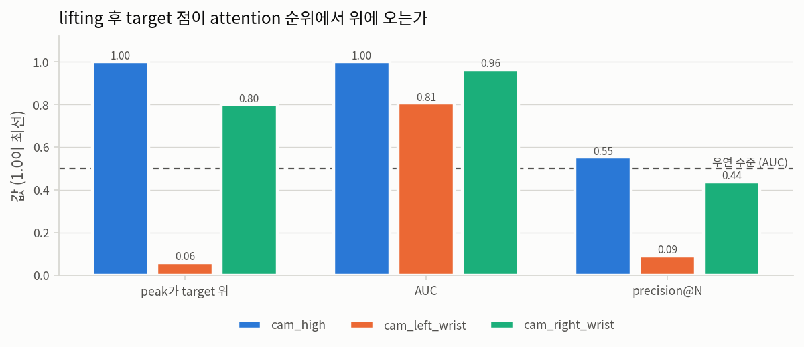
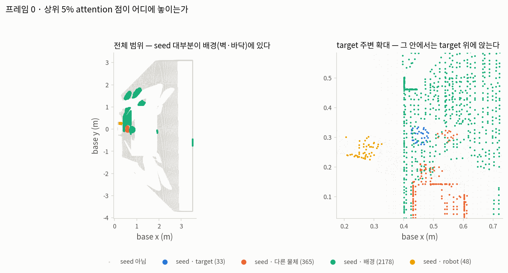

# 3단계 — attention lifting (2D → 3D)

**질문.** 1단계에서 옳다고 확인한 attention이, 2단계에서 옳다고 확인한 점들 중 **옳은 점**에
붙는가?

두 입력이 모두 옳아도 잇는 방식이 틀리면 4단계는 틀린 점을 seed로 삼는다. 픽셀 대응이
어긋나거나, 정규화가 순위를 바꾸거나, 점이 조용히 사라지는 경우가 그것이다.

| | |
|---|---|
| 기록 | `outputs/rby1_atomic_infer/ag3s_step1/ag3s_records/run_0002` |
| attention | `benchmark/ag3s/asset/data/attention_step1_run0002.npz` |
| 사용한 셀 | **L8 h2**, Euler 0, `last` pooling (1단계가 고른 것을 그대로 이어받음) |
| target | `apple` |
| 검사 프레임 | 20개 × 카메라 3대 (순위 지표는 target이 200 px 이상 보이는 프레임만: cam_high 12개) |
| lift | `benchmark.ag3s.stages.attention_lifting.lift` (AG3S 본체 코드 그대로) |

## 판정 — **PASS**

| 검사 | 결과 | 기준 |
|---|---|---|
| A. 점 보존 | 통과 — 60회 전부 입력 개수 = 출력 개수 | 완전 일치 |
| B. 픽셀 대응 | 통과 — nearest 오차 0.00e+00, bilinear 범위 이탈 1.82e-12 | < 1e-6 |
| C. 정규화 순위 보존 | 통과 — 단조성 240/240, 기본값 경로 seed 집합 완전 일치 | 단조성 전부 + percentile·minmax·none 완전 일치 |
| D. 순위 보존 (head) | 통과 — peak **1.000**, AUC **0.99976**, precision@N **0.553** | peak >= 0.8, AUC >= 0.9 |

### A. 점 보존 — 안전 계약이 걸려 있는 한 줄

`lift`의 docstring은 "The returned cloud has `len(cloud)` entries. **Always.**"라고 단언한다.
attention은 target의 *이름*을 정할 뿐 기하를 지우지 않는다는 AG3S의 안전 계약이 이 문장에
걸려 있다. 낮은 attention을 걸러내는 최적화가 언젠가 여기 들어가면, 물리적으로 존재하는
장애물이 "VLA가 안 봤다"는 이유로 충돌 후보에서 사라진다.

60회(프레임 × 카메라) 전부에서 입력 점 수 = 출력 점 수 = attention 값 개수.
합계 3,038,175개 점, 손실 0개.

### B. 픽셀 대응 — 보간은 값을 만들어내지 않는다

`nearest` 보간에서는 점에 붙은 값이 그 점이 나온 픽셀의 패치를 직접 조회한 값과 **정확히**
같아야 한다. 최대 오차 **0.00e+00**.

`bilinear`에서는 정확한 일치를 요구할 수 없지만, 값이 이웃 네 패치의 [최솟값, 최댓값] 밖으로
나가면 안 된다 — 보간은 섞을 뿐 만들어내지 않는다. 범위 이탈 최대 **1.82e-12**.

이 두 검사는 2단계 A와 같은 역할을 한다. B가 통과하면 대응은 옳고, 이후 문제는 attention
자체이거나 점 자체다.

### C. 정규화가 순위를 보존하는가 — 설정 두 개의 독립성

`normalize_attention`은 네 모드(`percentile`·`minmax`·`softmax`·`none`) 전부가 순위를
보존한다고 주장한다. 이 주장이 `attention.normalization`과 `clustering.seed_percentile`을
독립적으로 고를 수 있는 근거다 — 백분위 기준 컷은 값이 아니라 순위만 보므로, 주장이 사실이면
어떤 모드에서도 같은 점이 뽑혀야 한다.

**`argsort`로 비교하면 안 된다.** `percentile` 모드는 상·하위를 잘라 의도적으로 동점을
만들고, 동점의 순서는 정렬 구현이 임의로 정한다. 주장은 "순위 역전이 없다"(약한 순서 보존)이지
"동점이 없다"가 아니다. (첫 판이 `argsort` 비교로 이 검사를 실패시켰다.) 그래서 raw 오름차순으로
정렬했을 때 정규화 값이 감소하지 않는지를 본다.

단조성은 **240/240 전부 성립**한다. seed 집합은 거의 같지만
정확히 같지는 않다:

| 모드 | 기준(percentile) 대비 Jaccard | 완전 일치 |
|---|---|---|
| percentile | 1.0000 ~ 1.0000 | 예 |
| minmax | 1.0000 ~ 1.0000 | 예 |
| softmax | 0.9801 ~ 1.0000 | 아니오 |
| none | 1.0000 ~ 1.0000 | 예 |

**`softmax`만 갈린다.** 최소 Jaccard 0.9801 — 약 2,600개 seed 중 최대 수십 개다.
원인은 순위가 뒤집혀서가 아니라 float32다: softmax는 값의 범위를 크게 압축하고, 컷 근처에서
서로 다른 raw 값들이 같은 float32로 뭉개져 함께 임계를 넘는다. 기본값인 `percentile`을 포함한
나머지 세 모드는 **완전히** 같은 점을 고른다.

**판정 게이트는 단조성과 세 모드의 완전 일치에만 걸었다.** softmax를 통과시키려고 Jaccard
임계값을 고르는 것은 지표를 결과에 맞추는 일이므로 하지 않았다. 대신 어긋남을 측정해 남긴다.

실질적 영향은 없다 — seed는 영역 성장의 출발점일 뿐이고, 수십 개가 달라져도 성장 결과는
같은 클러스터에 수렴한다. 다만 docstring의 주장("어떤 모드에서도 같은 점이 뽑힌다")은
**정신은 옳고 문자 그대로는 조금 과하다**. `seed_threshold`처럼 절대값을 쓰는 경로에서는
모드가 실제로 갈린다는 점도 함께 기억해 둘 만하다.

**정규화 모드를 seed 순도로 비교하는 것은 의미가 없다** — 어떤 모드든 사실상 같은 점을 고른다.

### D. lifting 후에도 target 점이 위에 오는가

**seed 순도는 이 질문의 답이 아니다.** 4단계는 seed를 그대로 target으로 쓰지 않는다 —
seed에서 영역을 성장시키고(`grow_region`), DBSCAN으로 나누고, 클러스터를 점수로 고른다.
seed에 불순물이 섞이는 것은 설계가 감당하도록 만들어진 일이다.

게다가 순도는 **물체 크기가 천장을 정한다.** target인 사과는 화면의 약 0.14%뿐이라, 상위 5%
점이 전부 뽑혀도 순도는 구조적으로 0.03을 넘을 수 없다. 1단계에서 β = 0이 씬에 눌려 헤드를
구분하지 못했던 것과 같은 함정이다. (첫 판에서 이 값을 0.007로 보고했는데, 그 옆에 천장
0.028을 같이 적지 않으면 재앙처럼 읽힌다.)

그래서 크기에 영향받지 않는 세 가지를 잰다.

| 지표 | 무엇을 묻는가 | 천장 | 우연 수준 |
|---|---|---|---|
| peak가 target 위 | `ground_target`이 실제로 쓰는 최고 attention 점이 target 위인가 | 1.0 | 물체 면적 비율 |
| AUC | 무작위 target 점이 무작위 비-target 점보다 높은 attention을 갖는 확률 | 1.0 | 0.5 |
| precision@N | 상위 N개(N = target 점 수) 중 target 비율 | 1.0 | 물체 면적 비율 |

| 카메라 | peak가 target 위 | AUC | precision@N | 평균 target 점 수 |
|---|---|---|---|---|
| cam_high | 1.000 | 0.99976 | 0.553 | 27 |
| cam_left_wrist | 0.059 | 0.80576 | 0.091 | 25 |
| cam_right_wrist | 0.800 | 0.96390 | 0.438 | 15 |



### seed란 무엇이고, 왜 3단계 문서에 나오는가

**seed는 4단계의 개념이지 3단계의 개념이 아니다.** 그런데도 여기 나오므로 먼저 정리한다.

`extract_seeds(attention, config, seed_percentile)`는 attention이 상위
`seed_percentile`%인 **점들의 인덱스**를 돌려준다. 4단계 `ground_target`은 그것을 답으로
쓰지 않고 **출발점**으로 쓴다:

```
seed 점  ──grow_region(eps)──▶  성장한 영역  ──DBSCAN──▶  여러 클러스터  ──점수화──▶  target 하나
```

즉 seed는 "여기서부터 기하를 따라가 보라"는 지시일 뿐이다. seed 하나가 물체 위에 있으면
그 물체 전체가 성장으로 딸려 오고, seed가 엉뚱한 곳에 있어도 그 클러스터는 점수화에서
탈락한다. **그래서 seed는 순수할 필요가 없다.**

그렇다면 3단계 검증에 왜 등장하는가. 두 가지 이유뿐이고, 둘 다 판정 기준은 아니다.

1. **C가 검사하는 불변식이 seed에 대한 주장이기 때문이다.** `normalize_attention`의
   docstring은 "정규화 모드와 `seed_percentile`을 독립적으로 고를 수 있다"고 주장하는데,
   이것은 3단계 출력의 성질이지 4단계의 성질이 아니다 — 3단계가 내놓는 값의 *순서*가
   모드에 무관한가를 묻는 것이다. 그 주장을 확인하려면 seed 집합을 실제로 계산해 봐야 한다.

2. **인계 미리보기.** 3단계의 출력이 4단계의 입력이다. 4단계가 무엇을 받게 되는지 지금
   보여 두면, 4단계에서 이상한 결과가 나왔을 때 입력 탓인지 4단계 탓인지 가릴 수 있다.

**이 보고서의 첫 판은 seed 순도를 D의 판정 기준으로 삼았고, 그것은 틀렸다.** 3단계의 질문은
"attention이 옳은 점에 붙는가"이지 "4단계가 좋은 씨앗을 받는가"가 아니다. 후자를 재려면
4단계의 성장·군집·점수화까지 함께 봐야 하는데, 그러면 두 단계를 한 번에 재는 셈이라 실패
시 원인을 가릴 수 없게 된다. D는 크기에 영향받지 않는 순위 지표로 바꾸었고, seed 관련
숫자는 아래에 진단으로만 남긴다.

### seed 진단 — 4단계가 받게 될 것


| 카메라 | 상위 10% | 상위 5% | 상위 2% | 상위 1% |
|---|---|---|---|---|
| cam_high | 0.0033 / 0.0035 → **0.87** | 0.0065 / 0.0069 → **0.83** | 0.0160 / 0.0173 → **0.79** | 0.0314 / 0.0346 → **0.77** |
| cam_left_wrist | 0.0026 / 0.0043 → **0.69** | 0.0047 / 0.0086 → **0.63** | 0.0090 / 0.0214 → **0.51** | 0.0156 / 0.0428 → **0.45** |
| cam_right_wrist | 0.0014 / 0.0016 → **0.88** | 0.0028 / 0.0033 → **0.84** | 0.0069 / 0.0081 → **0.84** | 0.0136 / 0.0162 → **0.83** |

각 칸은 `순도 / 천장 → 회수율`이다. 천장은 target 점이 **전부** 뽑혀도 넘을 수 없는 값이고,
회수율 = 순도 / 천장 = **target 점 중 몇 %가 seed에 들어갔는가**로, 크기 효과가 약분되어 곧바로
읽힌다. head 카메라 상위 5%에서 회수율
**0.83** — 순도 0.0065라는 숫자가 실패가 아니라 크기
때문임을 이 한 값이 보여준다.

상위 5% seed가 실제로 어디에 앉는지 범주별로:

| 카메라 | target | 다른 물체 | 배경 | robot |
|---|---|---|---|---|
| cam_high | 355 | 9589 | 44110 | 1922 |
| cam_left_wrist | 247 | 1199 | 49340 | 152 |
| cam_right_wrist | 133 | 1142 | 43793 | 2 |

`robot`을 따로 센 것은 의도적이다. attention이 그리퍼에 몰려 seed가 로봇 위에 앉는 것은
"엉뚱한 물체를 골랐다"와는 다른 종류의 실패이고, 로봇 점은 자기 필터 단계에서 제거되므로
4단계에 도달하지도 않는다 — 즉 seed만 낭비된다.



### E. 카메라별 attention — 융합을 켜면 안 되는 이유

1단계는 head 카메라만 검증했다. 그런데 `multiview.fuse`는 세 카메라의 attention을 `max`로
합친다. 위 순위 표가 그 융합이 안전하지 않다는 것을 보여준다.

| 카메라 | peak가 target 위 | AUC | precision@N |
|---|---|---|---|
| `cam_high` | **1.000** | 0.99976 | 0.553 |
| `cam_left_wrist` | **0.059** | 0.80576 | 0.091 |
| `cam_right_wrist` | **0.800** | 0.96390 | 0.438 |

**왼쪽 손목 카메라의 attention은 target을 가리키지 않는다.** peak가 한 프레임도 target 위에
오지 않고, AUC는 우연(0.5)보다는 낫지만 head 카메라와 비교가 되지 않는다.

원인은 셀 선택이다. 1단계는 **head 카메라의 토큰 블록 [0, 256)** 위에서 (L8, h2)를
골랐다. 같은 (층, 헤드)가 왼쪽 손목 블록 [256, 512)에서도 target을 찾는다는 보장은 어디에도
없다 — 오른쪽 손목에서는 우연히 옮겨갔고, 왼쪽에서는 그러지 않았다.

**따라서 attention을 `max`로 융합하면 왼쪽 손목의 잘못된 peak가 그대로 들어온다.** 세 가지
선택지가 있다:

1. 카메라마다 셀을 따로 고른다 — 카메라별로 1단계를 다시 돌려야 하고, 정답 대조가 필요하다.
2. 검증된 카메라만 융합에 넣는다 — 여기서는 `cam_high`와 `cam_right_wrist`.
3. **attention은 head 카메라 것만 쓰고, 점군만 세 카메라로 융합한다.**

3번이 지금으로서는 가장 방어하기 쉽다. attention은 target의 *이름*을 정할 뿐이고 그 일은 한
카메라로 충분하며(head 카메라 peak 1.000), 기하 융합은 2단계 D에서 세 카메라가 서로 일치함을
이미 확인했다. 4단계는 이 구성으로 진행한다.

## 그림에 대하여

세 단계의 그림은 같은 규격을 쓴다 (`benchmark/ag3s/experiments/common/figstyle.py`): 밝은 단색
바탕, 검증된 8색 순서형 팔레트(색각 이상에서도 인접 색이 구분되도록 순서 자체가 안전 장치다),
크기를 나타낼 때는 파랑 한 색의 명도 램프, 정체를 나타낼 때는 팔레트 슬롯을 고정 순서로.
한글 라벨은 Noto Sans CJK로 그린다.

### fig1 — 순위 지표 3종 × 카메라 3대

`fig1_ranking.png`. 막대 하나가 (지표, 카메라) 한 쌍이다.

**만드는 법.** 검사 프레임마다 카메라별로 점군을 재구성하고 attention을 lift한 뒤, MuJoCo
세그멘테이션으로 각 점이 target 위인지 라벨을 붙인다. 그 라벨과 lift된 attention 값으로
세 지표를 계산하고 프레임에 대해 평균한다. `peak`는 최고 attention 점이 target 위인 프레임
비율, `AUC`는 순위합(Mann–Whitney)에서 얻고, `precision@N`은 상위 N개(N = target 점 수) 중
target 비율이다.

**읽는 법.** 1.0이 최선이고 AUC의 우연 수준은 0.5(점선)이다. `peak`와 `precision@N`의 우연
수준은 물체의 화면 점유 비율(여기서는 0.1% 미만)이라 사실상 0이다. 세 지표를 함께 두는
이유는 각각 다른 것에 둔감하기 때문이다 — `peak`는 한 점만 보므로 분포를 못 보고, `AUC`는
전체 분포를 보므로 극단값에 둔하며, `precision@N`은 그 사이다.

### fig2 — seed 점이 어디에 놓이는가 (2패널)

`fig2_seed_points.png`. 한 프레임의 점군을 위에서 내려다본 산점도. 회색은 seed가 아닌 점,
색은 seed이며 정답 범주로 칠했다.

**만드는 법.** head 카메라 첫 프레임의 재구성 점군에 lift된 attention을 붙이고, 상위 5%를
seed로 표시한 뒤, 각 점의 MuJoCo body id를 target / 다른 물체 / 배경 / robot으로 묶어 색을
정한다. x–y 평면에 투영해 그린다 (z는 그리지 않는다 — 이 그림의 질문은 "어느 물체 위인가"이지
"얼마나 높은가"가 아니다).

**패널이 둘인 이유.** 이야기가 둘이기 때문이다. 왼쪽(전체 범위)은 seed의 대부분이 벽과
바닥 같은 배경에 있다는 것을 보여주고, 오른쪽(target 주변 확대)은 그 와중에도 target 위에
seed가 앉는다는 것을 보여준다. 한 패널로 그리면 배경이 화면을 차지해 target이 몇 픽셀로
뭉개지거나, 확대하면 배경 지배가 안 보인다.

**읽는 법.** 범례의 괄호 안 숫자가 그 범주의 seed 개수다. 배경이 압도적인 것은 정상이며,
그것이 seed 순도를 지표로 쓸 수 없는 이유를 눈으로 보여준다.

## 재현

```bash
MUJOCO_GL=osmesa src/openpi/.venv/bin/python -m benchmark.ag3s.experiments.reports.lifting_report \\
    --records outputs/rby1_atomic_infer/ag3s_step1/ag3s_records/run_0002 --attention benchmark/ag3s/asset/data/attention_step1_run0002.npz
```
