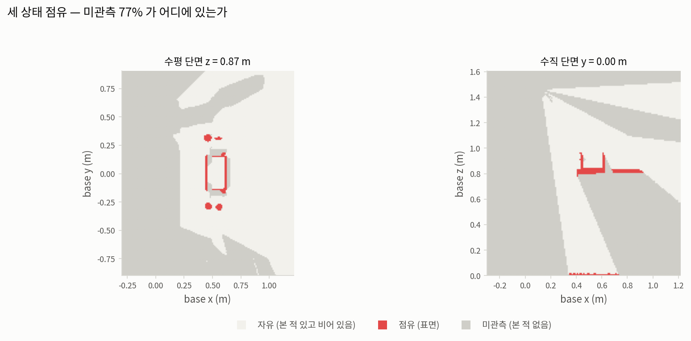
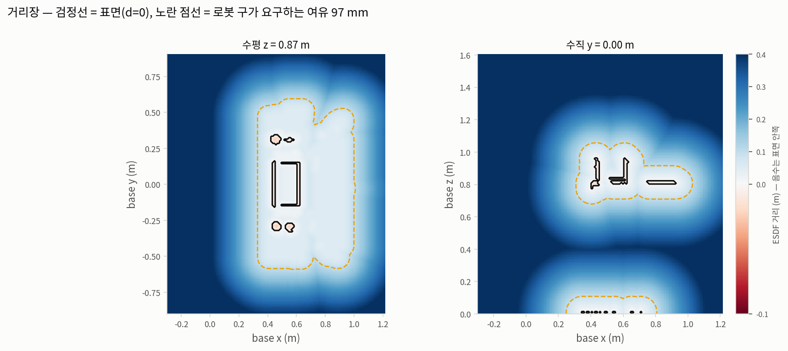
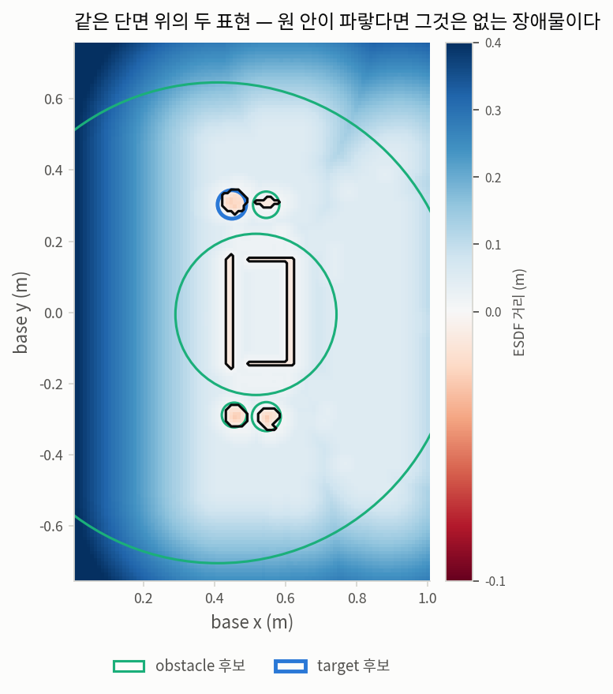
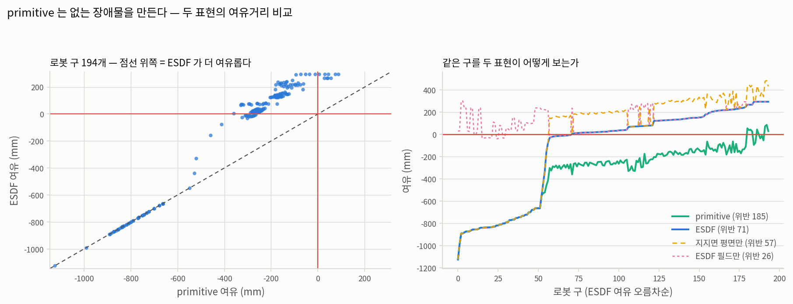
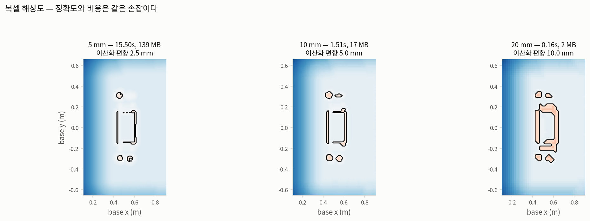
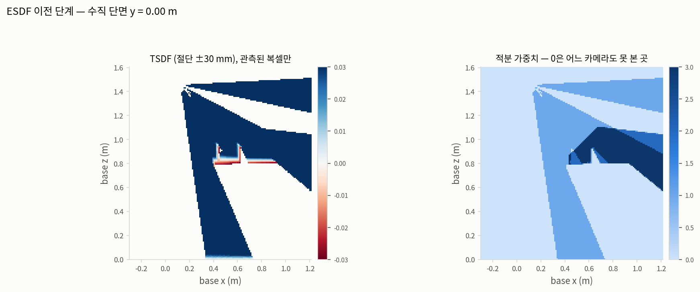
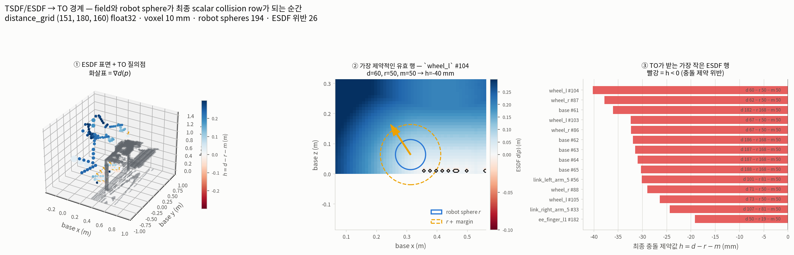

# ESDF 진단 — 필드가 무엇을 알고 무엇을 모르는가

숫자는 [ESDF-BACKEND.md](ESDF-BACKEND.md) 에 있다. 이 문서는 그 숫자들이 **어디서** 오는지를
보여준다. 거리장은 3차원이라 자르지 않으면 볼 수 없고, 어디를 자르느냐가 곧 무엇을 묻느냐다.

| | |
|---|---|
| 기록 | `outputs/rby1_atomic_infer/ag3s_step1/ag3s_records/run_0002` 프레임 0 |
| 복셀 | 10 mm, 격자 (151, 180, 160) (4.3 M) |
| 빌드 | 1.60 s |
| 점유 / 자유 / 미관측 | 14,741 / 1,002,577 / 3,331,482 (**77%**) |
| 파낸 복셀 | 지지면 9,388 · target 0 |
| 단면 | 수평 z = 0.87 m, 수직 y = 0.00 m |

## 1. 세 상태 점유 — 미관측이 어디에 있는가



**만드는 법.** 세 카메라의 깊이를 TSDF 에 적분한 뒤 복셀마다 점유/자유/미관측을 정한다. 가중치가
0인 복셀은 어느 카메라도 보지 못한 것이다. 로봇 픽셀은 적분 전에 마스크로 빼므로 팔이 있던
자리는 자유가 아니라 **미관측**이 된다.

**주의.** 1번과 6번 그림은 **파냄 이전의 원본 점유**다 (지지면·target 제거 전). 진단에는 카메라가
무엇을 봤는지가 필요하기 때문이다. 2·3·4번은 파이프라인이 실제로 내놓는 필드, 즉 파냄 이후다.

**읽는 법.** 회색(미관측)이 77% 다. 그 대부분은 테이블 아래·물체 뒤·방
바깥이고, 카메라가 볼 수 없었던 곳이다. `unknown_policy: free` 는 이 회색을 통과 가능으로
취급한다는 뜻이다 — primitive backend 도 같은 성질이지만, 여기서는 **셀 수 있다**.

## 2. 거리장



**만드는 법.** 점유 복셀 집합에 부호 있는 거리 변환(EDT)을 건다. 파란색이 표면에서 멀고
빨간색이 표면 안쪽이며, 검정선이 표면(d = 0)이다.

**읽는 법.** 노란 점선이 로봇 구가 실제로 요구하는 여유
(97 mm = 구 반지름 중앙값 + 마진 50 mm)다. **그 선 바깥이
통과 가능한 영역**이다. 크레이트 내부에 파란 영역이 있으면 그것이 primitive backend 가 삼켰던
공간이다.

## 3. 같은 단면 위의 두 표현



**만드는 법.** 같은 수평 단면에 primitive 후보의 제약용 구 단면을 겹친다. 이 단면을 지나지 않는
구는 그리지 않고, 지나는 구는 `sqrt(r² - dz²)` 로 줄여 그린다.

**읽는 법.** **원 안쪽이 파랗다면 그것은 없는 장애물이다.** ESDF 는 그 자리에 표면이 없다고
말하는데 primitive 는 구로 막고 있다는 뜻이다. 크레이트와 테이블 잔여의 큰 원이 그렇다.

## 4. 로봇 구가 보는 여유거리



**만드는 법.** 로봇 충돌 구 194개 각각에서 두 표현의 여유거리를 잰다. 양쪽 모두 같은
지지면 half-space 행을 포함하므로, 차이는 순수하게 물체 표현에서 온다.

**읽는 법.** 왼쪽 산점도의 대각선이 두 표현이 일치하는 선이다. **점이 전부 대각선 위쪽에
있으면 ESDF 가 더 여유롭다는 뜻**이고, 아래쪽에 점이 있으면 ESDF 가 더 보수적이라는 뜻이다.
오른쪽은 같은 데이터를 정렬해 그린 것으로, 0 선을 지나는 지점이 위반 개수다.

측정: primitive 위반 **185** / ESDF 위반 **71**,
ESDF 만 위반인 구 **0개**.
여유 차이(primitive − ESDF) 중앙값 **-284 mm**.

**왼쪽 산점도에서 아래쪽 대각선 위의 점들은 두 표현이 정확히 일치하는 구들이다.** 거기서는
**공유된 지지면 평면 항**이 지배하므로 물체 표현이 무엇이든 같은 답이 나온다. 두 곡선이
갈라지는 지점부터가 물체 표현의 차이다.

### 남은 위반은 어느 표현의 책임인가

ESDF 쪽 위반 71개를 항별로 나누면:

| 항 | 위반 구 | 최소 여유 |
|---|---|---|
| ESDF 필드만 | **26** | -40 mm |
| 지지면 half-space 만 | **57** | -1124 mm |
| 합쳐서 | 71 | -1124 mm |

**대부분이 필드가 아니라 평면에서 온다.** 그리고 그것은 이 backend 의 문제가 아니라 지지면
표현의 문제다 — `SupportSurface` 는 `n·p >= d + margin` 인 **무한 half-space** 라서, 테이블
상판(z = 0.822)의 평면은 **상판보다 낮은 모든 것을 금지한다.** 위반 구의 링크가 그것을 말한다:
바퀴 34 · base 14 · torso 9 — 전부 바닥에 서 있는 부분이고, 물리적으로 테이블 아래에 있는 것이
정상이다.

이것은 두 collision backend 어느 쪽도 고칠 수 없다. 고치려면 지지면을 **유계 패치**로 만들거나,
평면 행을 그 위에 있을 수 있는 링크에만 걸어야 한다. 이 검증에서 세 번째로 발견된 표현 문제이며
`archive/primitive-era-20260904/OPEN-geometry-representation.md` 와 같은 성격이다.

여유가 가장 작은 구 8개:

| 링크 | ESDF 여유 (mm) | primitive 여유 (mm) |
|---|---|---|
| `base` | -1124 | -1124 |
| `base` | -989 | -989 |
| `wheel_l` | -890 | -890 |
| `wheel_r` | -890 | -890 |
| `base` | -881 | -881 |
| `base` | -872 | -872 |
| `wheel_l` | -872 | -872 |
| `wheel_r` | -872 | -872 |

## 5. 복셀 해상도



**읽는 법.** 세 단면이 같은 씬이다. 왼쪽으로 갈수록 표면선이 매끄럽고 비용이 크다.
이산화 편향은 복셀의 **정확히 반**이므로 제목에 함께 적었다 — 20 mm 복셀의 10 mm 편향은
50 mm 여유거리의 5분의 1이다.

| 복셀 | 빌드 | 복셀 수 | 메모리 | 미관측 | 이산화 편향 |
|---|---|---|---|---|---|
| 5 mm | 15.50 s | 34.7 M | 139 MB | 73% | 2.5 mm |
| 10 mm | 1.51 s | 4.3 M | 17 MB | 73% | 5.0 mm |
| 20 mm | 0.16 s | 0.5 M | 2 MB | 72% | 10.0 mm |

## 6. ESDF 이전 — TSDF 와 가중치



**읽는 법.** 왼쪽이 절단된 부호 거리다. 표면 앞이 파랑, 뒤가 빨강이고 ±30 mm 에서
잘린다. 절단 밖은 갱신하지 않으므로 **표면 뒤로 멀리는 "비어 있다"가 아니라 "가려져서 모른다"**
가 된다. 오른쪽 가중치가 0인 곳이 정확히 그 미관측 영역이고, 1번 그림의 회색과 같다.

이 두 장이 미관측 비율이 왜 77% 나 되는지 설명한다. 수직 단면에서 자유
영역이 **카메라에서 뻗어나가는 원뿔 모양**인 것이 보인다 — 카메라 셋이 있어도 한 장면에서 볼 수
있는 것은 그 원뿔 안의 표면과 그 앞의 자유 공간뿐이고, 나머지는 전부 미관측이다.

**진단으로서 이것이 뜻하는 것**: 미관측 77% 의 대부분은 물체 뒤 그림자가 아니라 **작업 상자가
카메라가 보는 부피보다 훨씬 크다**는 사실이다. 상자를 관측 부피에 맞춰 줄이면 미관측 비율과
계산량이 함께 줄지만, 줄인 만큼 "그 밖은 아예 모른다"가 되므로 `unknown_policy` 의 의미가 커진다.

## 7. TO 직전 — 필드 질의가 충돌 제약 행이 되는 순간



이 그림은 시각화용으로 다시 만든 근사값이 아니라, `EsdfField.distance()`와 `gradient()`를 현재
로봇 collision sphere 194개 중심에서 직접 질의한 결과다. TO가 각 trajectory timestep에서
반복하는 것과 같은 계산이며 최종 행은 `h = d_esdf(p) - r_robot - esdf_margin`이다. 왼쪽은 필드와
질의 위치, 가운데는 가장 제약적인 유효 행의 단면과 separating gradient, 오른쪽은 실제 scalar
제약값을 보여준다. 전체 194개 행의 중심·반지름·거리·gradient·margin·h는
[`to_constraint_input.json`](../asset/image/esdf/to_constraint_input.json)에 저장했다.

## 재현

```bash
MUJOCO_GL=osmesa src/openpi/.venv/bin/python -m benchmark.ag3s.experiments.reports.esdf_report \\
    --records outputs/rby1_atomic_infer/ag3s_step1/ag3s_records/run_0002 --voxel 0.01
```
