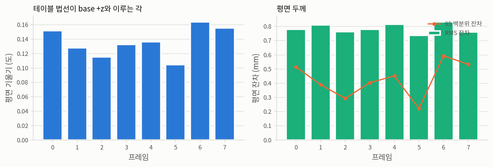
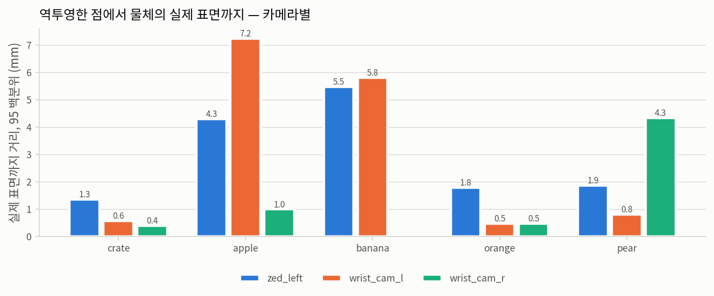
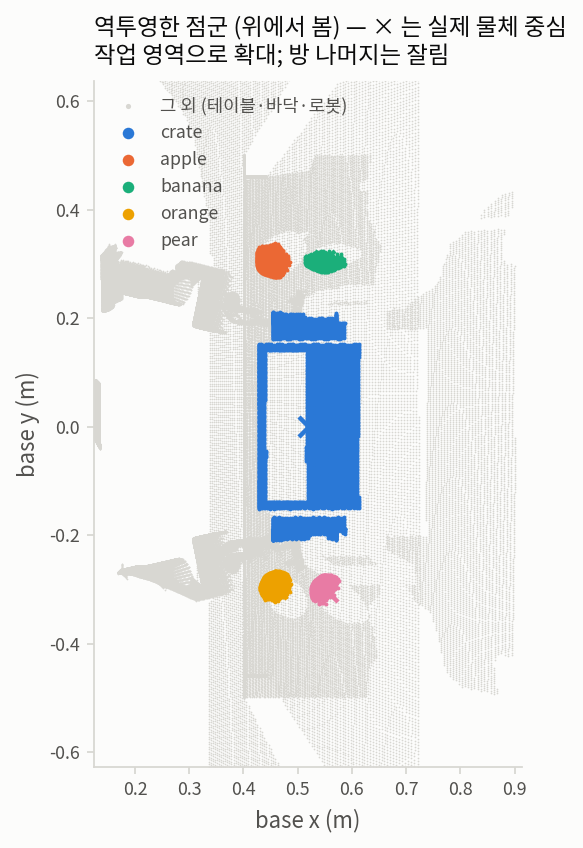

# 2단계 — 3D back-projection

**질문.** 깊이에서 나온 3D 점이 실제로 물체가 있는 곳에 놓이는가?

1단계는 attention이 옳은 물체를 가리키는지 확인했다. 그 이름표가 붙는 대상은 이 점들이고,
점이 틀린 곳에 있으면 이후 모든 단계 — 클러스터링, primitive 근사, 여유거리 — 가 틀린 기하
위에서 정확하게 계산될 뿐이다.

| | |
|---|---|
| 기록 | `outputs/rby1_atomic_infer/ag3s_step1/ag3s_records/run_0002` |
| 검사 프레임 | 8개 (44개 중 균등 간격) |
| 카메라 | `zed_left`, `wrist_cam_l`, `wrist_cam_r` |
| 역투영 | `benchmark.ag3s.reconstruction.backproject` (AG3S 본체 코드 그대로) |
| 정답 | MuJoCo 세그멘테이션(geom 단위) + geom 자세 + 메시 정점 |

## 판정 — **PASS**

| 검사 | 무엇이 깨지면 걸리는가 | 결과 | 기준 |
|---|---|---|---|
| A. 재투영 왕복 | 역투영 식 자체 | 통과 — 최대 6.82e-13 px | < 1e-6 px |
| B. 지지면 평면 | 카메라 회전 규약 | 통과 — 기울기 최대 0.1639°, 높이 오차 최대 0.73 mm | < 0.5°, < 5 mm |
| C. 물체 표면 오차 | 깊이 스케일, 내부 파라미터 | 통과 — 95 백분위 최대 7.23 mm | < 10 mm |
| D. 카메라 간 정합 | 손목 카메라 외부 파라미터 (FK 사슬) | 통과 — 융합 시 두께 증가 최대 -0.03 mm | < +5 mm |

네 검사는 서로 다른 실패 방식에 대응한다. 한 가지만 재면 어느 것이 깨졌는지 알 수 없다.

### A. 재투영 왕복 — 산술과 규약을 분리한다

역투영한 점을 같은 `K`, `T_base_cam`으로 다시 투영해 원래 픽셀로 돌아오는지 본다. 이 검사는
**규약이 옳은지는 전혀 묻지 않는다** — 규약이 통째로 틀려 있어도 왕복은 완벽하게 닫힌다.
그래서 유용하다: A가 통과하고 B가 실패하면 문제는 카메라 규약이고, A가 실패하면 식 자체다.
이 둘을 구분하지 못하면 이후 디버깅이 추측이 된다.

전체 24회 (프레임 × 카메라) 최대 오차 **6.82e-13 px** — 배정밀도 반올림
수준이다.

### B. 지지면 평면 — 회전 오차가 가장 먼저 드러나는 곳

테이블 픽셀만 역투영해 전최소제곱 평면을 맞춘다. 카메라 회전이 조금이라도 틀어져 있으면
평면이 기울고, 넓고 평평한 면이라 그 기울기가 크게 증폭된다.

**두 번 좁혀야 한다.** 첫째, `table`은 한 개의 body이지만 **다섯 개의 geom** — 상판 하나와
다리 넷 — 이므로 body 라벨로 고르면 수직인 다리가 들어온다 (첫 판: 기울기 37.55°). 둘째,
상판 geom 자체가 두께 40 mm의 box라 **옆면**도 보이고, 그 점들은 윗면보다 최대 40 mm 아래에
있다 (두 번째 판: 기울기 0.84°, 높이 −9 mm). 둘 다 역투영은 옳은데 검사가 틀린 경우다.

그래서 상판 geom의 점에 **AG3S 자신의 RANSAC 평면 추정기**(`support_surface.fit_plane_ransac`)를
건다. 점 수가 압도적인 윗면을 지배 평면으로 잡고 옆면을 이상점으로 버린다. 이것은 7단계
support surface 추출이 실제로 쓰는 바로 그 코드이므로, 여기서 통과한다는 것은 그 단계가 같은
씬에서 옳은 평면을 잡는다는 뜻이기도 하다.

MuJoCo geom에서 읽은 상판 윗면의 실제 높이: **0.820000 m** (base 프레임)

| 프레임 | 상판 geom 점 | 평면 내점 | 기울기 (°) | 측정 높이 (m) | 높이 오차 (mm) | RMS 잔차 (mm) | 95 백분위 잔차 (mm) |
|---|---|---|---|---|---|---|---|
| 0 | 21476 | 19658 | 0.1516 | 0.819433 | -0.57 | 0.78 | 0.51 |
| 1 | 21389 | 19557 | 0.1278 | 0.819717 | -0.28 | 0.81 | 0.39 |
| 2 | 20629 | 19012 | 0.1151 | 0.819884 | -0.12 | 0.76 | 0.29 |
| 3 | 16336 | 14903 | 0.1324 | 0.819698 | -0.30 | 0.78 | 0.40 |
| 4 | 18416 | 16887 | 0.1362 | 0.819642 | -0.36 | 0.82 | 0.45 |
| 5 | 19089 | 17362 | 0.1047 | 0.820046 | +0.05 | 0.74 | 0.22 |
| 6 | 21547 | 19703 | 0.1639 | 0.819269 | -0.73 | 0.83 | 0.59 |
| 7 | 24682 | 22883 | 0.1557 | 0.819391 | -0.61 | 0.76 | 0.53 |



### C. 물체 표면 오차 — 중심이 아니라 표면과 비교한다

각 점에서 그 물체의 *실제* 표면까지의 거리를 잰다. 정답 표면은 MuJoCo 메시 정점을 그 프레임의
실제 자세로 변환한 볼록 껍질이다.

**중심 좌표와 비교하지 않는 이유**는 카메라가 앞면만 보기 때문이다. 보이는 점들의 무게중심은
카메라 쪽으로 대략 반지름만큼 치우쳐 있으므로, 역투영이 완벽해도 중심과의 거리는 0이 되지
않는다. 그 편차를 오차로 보고하면 없는 문제를 만들어내게 된다.

정답 표면은 geom 종류에 따라 다르게 만든다. 과일은 메시이고 볼록하므로 정점의 볼록 껍질을
쓴다. **크레이트는 상자 36개로 만든 속이 빈 통**이라 볼록 껍질을 쓰면 열린 입구가 덮여 내부가
통째로 안쪽이 되고, 안쪽 벽의 점이 크레이트 반너비만큼 떨어진 것으로 계산된다 — 역투영이
완벽해도 수십 mm의 가짜 오차가 나온다. 그래서 상자에는 점-상자 표면 거리를 정확히 계산해
geom별 최솟값을 취한다. 속이 빈 형상이 자연히 처리되고 근사가 아니다.

카메라별로 나눠 싣는다 — 한 카메라의 외부 파라미터만 틀린 경우가, 합쳐 놓으면 나머지 뒤에
숨기 때문이다.

| body | 카메라 | 점 수 | 중앙값 (mm) | 95 백분위 (mm) | 최대 (mm) |
|---|---|---|---|---|---|
| crate | zed_left | 85393 | 1.01 | 1.34 | 1.86 |
| crate | wrist_cam_l | 502825 | 0.33 | 0.57 | 0.86 |
| crate | wrist_cam_r | 510961 | 0.27 | 0.38 | 0.80 |
| apple | zed_left | 2511 | 0.91 | 4.29 | 11.00 |
| apple | wrist_cam_l | 55277 | 1.64 | 7.23 | 10.01 |
| apple | wrist_cam_r | 11926 | 0.40 | 0.99 | 4.38 |
| banana | zed_left | 1652 | 2.81 | 5.47 | 6.69 |
| banana | wrist_cam_l | 15695 | 2.84 | 5.81 | 7.04 |
| orange | zed_left | 3931 | 0.71 | 1.79 | 1.93 |
| orange | wrist_cam_l | 321 | 0.35 | 0.47 | 0.49 |
| orange | wrist_cam_r | 724 | 0.36 | 0.46 | 0.49 |
| pear | zed_left | 1799 | 0.74 | 1.86 | 6.97 |
| pear | wrist_cam_l | 5441 | 0.29 | 0.79 | 4.29 |
| pear | wrist_cam_r | 33486 | 0.33 | 4.33 | 8.01 |



### D. 카메라 간 정합 — 외부 파라미터 사슬 전체를 검사한다

손목 카메라의 외부 파라미터는 `T_base_cam(t) = FK(q, mount_link) · T_link_cam`을 타고 온다.
마운트 링크나 `T_link_cam`이 틀리면 head 카메라만으로는 A·B·C가 전부 통과하면서 손목만
어긋난다.

**무게중심을 비교하면 안 된다.** 카메라마다 물체의 다른 면을 보므로 무게중심은 정상적으로
다르다 — 이 씬에서 크레이트의 카메라별 무게중심은 최대 14 cm 벌어지는데, 그것은 보정 오차가
아니라 시점 차이다. (이 보고서의 첫 판이 그 값을 오차로 보고했다.)

대신 **세 카메라를 합쳤을 때 표면이 두꺼워지는가**를 본다. 외부 파라미터가 서로 맞으면 융합
오차는 개별 카메라 오차 중 최댓값 근처에 머물고, 하나라도 틀어져 있으면 그 위로 뛴다. 각
카메라가 다른 면을 보는 것은 이 지표를 흔들지 않는다 — 그 면들이 **같은 표면 위에 있는지**만
묻기 때문이다.

| body | 합친 카메라 | 융합 95 백분위 (mm) | 개별 최댓값 (mm) | 증가 (mm) |
|---|---|---|---|---|
| crate | wrist_cam_l, wrist_cam_r, zed_left | 0.92 | 1.34 | -0.43 |
| apple | wrist_cam_l, wrist_cam_r, zed_left | 6.98 | 7.23 | -0.25 |
| banana | wrist_cam_l, zed_left | 5.78 | 5.81 | -0.03 |
| orange | wrist_cam_l, wrist_cam_r, zed_left | 1.70 | 1.79 | -0.09 |
| pear | wrist_cam_l, wrist_cam_r, zed_left | 3.95 | 4.33 | -0.38 |

### 점군과 실제 위치



× 는 MuJoCo가 보고한 실제 물체 중심이다. 점들이 × 를 **둘러싸지 않고 한쪽에 몰려 있는 것이
정상**이다 — 카메라는 앞면만 보므로 뒷면 점은 존재하지 않는다. 이것이 C에서 중심 대신 표면과
비교하는 이유이자, 4단계에서 클러스터 무게중심을 물체 중심으로 쓰면 안 되는 이유다.

## 이 숫자들이 재지 *않은* 것

여기서 잰 것은 **역투영 수학과 좌표 규약의 정확도**이지, 실제 센서에서의 정확도가 아니다.
두 가지를 명시해 둔다.

**depth에 잡음이 없다.** MuJoCo 렌더러가 내는 깊이에는 실제 ZED가 갖는 잡음, 반사면에서의
결측, 물체 경계의 flying pixel, 스테레오 정합 실패가 없다. 위의 "표면 오차 0.4–7 mm"는
잡음 없는 깊이에 대한 값이므로, 실기에서 같은 숫자가 나올 것으로 읽으면 안 된다.
기록기에 `--record-depth`를 켜면 실제 센서와 같은 **uint16 밀리미터**로 저장되어 1 mm 양자화는
반영되지만, 그것은 잡음 모형이 아니라 표현 형식일 뿐이다.

**정답이 시뮬레이터에서 온다.** 물체 자세·메시 정점·세그멘테이션이 전부 MuJoCo가 알려준
값이다. 실기에는 이런 정답이 없으므로, 실기로 넘어가면 정답을 다른 방식으로 마련하거나
(마커, 수동 라벨) 정답 없이 자기일관성 검사만으로 만족해야 한다. 이 검증의 최대 강점이
시뮬레이터라는 점이고, 최대 한계도 같은 점이다.

## 그림에 대하여

공통 규격은 `benchmark/ag3s/experiments/figstyle.py`에 있다.

### fig1 — 테이블 평면 (2패널)

`fig1_table_plane.png`. 왼쪽은 프레임별 평면 기울기(도), 오른쪽은 잔차(RMS와 95 백분위, mm).

**만드는 법.** 프레임마다 상판 geom 픽셀만 역투영하고 `support_surface.fit_plane_ransac`으로
지배 평면을 뽑아, 법선과 base +z 사이 각과 내점 잔차를 계산한다.

**읽는 법.** 최대 잔차 대신 95 백분위를 그린 이유는 최댓값이 RANSAC의 내점 임계값(8 mm)에
눌려 매 프레임 같은 값이 나오기 때문이다 — 측정값이 아니라 설정값이 되어 아무것도 알려주지
않는다.

### fig2 — 물체 표면 오차, 카메라별

`fig2_surface_error.png`. 물체마다 카메라 3대의 95 백분위 오차를 나란히 놓은 막대.

**만드는 법.** 각 점에서 그 물체의 실제 표면까지 거리를 재고 95 백분위를 취한다. 정답 표면은
메시 물체(과일)면 정점의 볼록 껍질, 상자 물체(크레이트)면 geom별 점-상자 표면 거리의
최솟값이다.

**왜 카메라별로 나누는가.** 한 카메라의 외부 파라미터만 틀린 경우가, 세 카메라를 합쳐 놓으면
나머지 뒤에 숨는다. 나눠 놓으면 어느 카메라가 문제인지 막대 하나로 보인다.

### fig3 — 위에서 본 점군

`fig3_topdown.png`. 한 프레임의 점군을 x–y 평면에 투영한 산점도. 색은 정답 물체, ×는 MuJoCo가
보고한 실제 물체 중심, 회색은 나머지(테이블·바닥·로봇)다.

**만드는 법.** 역투영한 점에 세그멘테이션 라벨을 붙이고 물체별로 색을 준다. 범위는 물체가
차지하는 구간에 30 cm 여백을 두고 자른다 — 방 전체를 그리면 물체가 몇 픽셀로 뭉개진다.

**읽는 법.** 점이 ×를 **둘러싸지 않고 한쪽에 몰리는 것이 정상**이다. 카메라는 앞면만 보므로
뒷면 점은 존재하지 않는다. 크레이트가 속이 빈 사각 링으로 나오는 것도 같은 이유이며, 이것이
클러스터 무게중심을 물체 중심으로 쓰면 안 되는 이유를 그대로 보여준다.

## 재현

```bash
MUJOCO_GL=osmesa src/openpi/.venv/bin/python -m benchmark.ag3s.experiments.backprojection_report \
    --records outputs/rby1_atomic_infer/ag3s_step1/ag3s_records/run_0002
```
