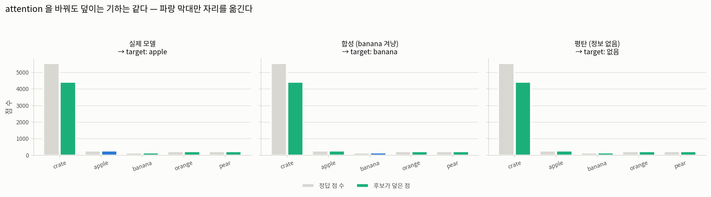
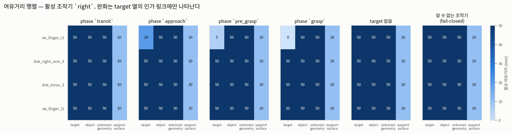

# 5단계 — target / obstacle 분리

**질문.** target을 고르는 행위가 나머지 기하를 훼손하지 않는가?

4단계까지는 "옳은 것을 골랐는가"를 물었다. 5단계는 **"고르는 행위가 나머지를 지우지
않았는가"**를 묻는다. 앞의 것이 틀리면 성능이 나빠지고, **뒤의 것이 틀리면 로봇이 물체를 친다.**

`generate_candidates`의 docstring이 이렇게 못박는다:

> Note what is *not* a parameter: there is no attention argument. Everything attention had to say
> was said in `target_grounding`, and letting it back in here is precisely the mistake this design
> exists to avoid.

| | |
|---|---|
| 기록 | `outputs/rby1_atomic_infer/ag3s_step1/ag3s_records/run_0002` |
| 프레임 | 9개 (파지 전 구간) |
| target | `apple` |
| decoy | `banana` — 합성 attention 이 겨누는 다른 물체 |
| phase | `approach` |

## 판정 — **PASS**

| 검사 | 결과 | 기준 |
|---|---|---|
| A. attention 인자 부재 (정적) | 통과 — `generate_candidates` 인자 10개 중 attention 관련 **0개** | 0개 |
| B. 덮는 점 집합 불변 (실험) | 통과 — 9프레임 전부 세 attention 에서 동일, 최대 차이 **0점** | 완전 동일 |
| C. 물체 소실 없음 | 통과 — 정답 점 20개 이상인데 후보가 하나도 덮지 않은 경우 **0건** | 0건 |
| D. target 이 후보로 남음 | 통과 — target 이 잡힌 프레임마다 `TARGET` 후보 정확히 1개 | 전부 |
| E. 여유거리 분리 | 통과 — 인가된 손가락 20 mm vs 토르소 50 mm (target 열) | 손가락 < 토르소 |

### A — 서명만으로는 부족하다

`generate_candidates`에 attention 인자는 없다. 하지만 **그것만으로는 증명이 되지 않는다.**
attention 은 `target` 인자를 통해 간접적으로 들어오고, 실제로 들어온다 — target 의 점들은 잔여
군집에서 빠져 `TARGET` 후보가 된다.

그러니 물어야 할 것은 "attention 이 영향을 주는가"가 아니라 **"attention 이 무엇을 지우는가"**다.
그래서 아래 B를 실험으로 잰다.

### B — 같은 점군, 다른 attention 세 가지

같은 프레임의 같은 점군에 attention 만 바꿔 넣는다.

| attention | grounding 상태 | 고른 target | 후보 수 | 유형별 | 덮은 점 |
|---|---|---|---|---|---|
| 실제 모델 | `ok` | apple | 7 | object 5, target 1, unknown_geometry 1 | 8,921 |
| 합성 (banana 겨냥) | `ok` | banana | 7 | object 5, target 1, unknown_geometry 1 | 8,921 |
| 평탄 (정보 없음) | `no_attention` | — | 7 | object 6, unknown_geometry 1 | 8,921 |

세 경우에서 **덮이는 점의 집합이 완전히 같다.** 달라지는 것은 그 점들이 어떤 유형의 후보에
들어가는가뿐이다 — `apple` 은 첫 줄에서 `TARGET`, 나머지 두 줄에서는 그냥 `OBJECT` 다.


세 패널이 **같은 씬**이다. 회색 점도, 노란 정답 점도, 초록 원(obstacle 후보)도 그대로다.
달라지는 것은 **굵은 파란 원 하나가 어디에 있는가**뿐이고, 셋째 패널에서는 그것마저 없다 —
그래도 초록 원은 전부 남아 있다.

같은 것을 **정책이 본 이미지 위에** 되돌려 그리면 이렇다. 초록 원의 자리와 크기가 세 패널에서
동일하고, 굵은 파란 원만 사과 → 바나나 → 없음으로 바뀐다.




이것이 이 파이프라인이 존재하는 이유다. attention 이 완전히 틀려도(둘째 줄), 심지어 아무
정보가 없어도(셋째 줄), **물리적으로 존재하는 기하는 전부 충돌 후보로 남는다.** 잘못된
attention 이 만드는 결과는 "엉뚱한 물체에 접촉이 허용된다"이지 "물체가 사라진다"가 아니다.

### C — 물체별로 확인

| 물체 | 실제 모델 | 합성 (banana 겨냥) | 평탄 (정보 없음) |
|---|---|---|---|
| crate | 4,414 / 5,550 | 4,414 / 5,550 | 4,414 / 5,550 |
| apple | 256 / 256 | 256 / 256 | 256 / 256 |
| banana | 151 / 151 | 151 / 151 | 151 / 151 |
| orange | 216 / 216 | 216 / 216 | 216 / 216 |
| pear | 222 / 222 | 222 / 222 | 222 / 222 |

각 칸은 `후보가 덮은 점 / 정답 점`이다. attention 이 무엇을 가리키든 모든 물체가 덮인다.

### D — target 은 지워지지 않고 이름표만 바뀐다

`SourceType.TARGET` 후보는 **후보 목록에 그대로 있다.** 4단계에서 고른 클러스터가 삭제되어
제약이 사라지는 것이 아니라, 같은 기하가 다른 유형으로 들어간다. 그 유형이 하는 일은
여유거리 정책을 바꾸는 것뿐이다.

`PhaseRule` 의 docstring이 이 설계의 역사를 적고 있다 — `collision_enabled` 가 `GRASP` 에서
False 였던 적이 있고, 그때는 target 의 제약 행이 통째로 삭제되어 **"로봇이 잡고 있는 물체에
팔꿈치를 밀어 넣을 수 있었다"**. 지금은 항상 True 이고, 접촉은 행을 지우는 대신 인가된 링크의
여유거리를 `contact_margin` 으로 낮추어 표현한다.

### E — 여유거리 분리



행은 로봇 링크, 열은 후보 유형, 숫자는 필요한 여유거리(mm)다. 활성 조작기는 `right`.
읽을 것 네 가지:

**1. 완화는 (링크 × 후보) 단위다.** 완화가 나타나는 곳은 **target 열의 인가된 링크 한 칸뿐**이다.
`link_torso_3` 도 `ee_finger_l1`(반대팔) 도 모든 단계에서 전체 여유거리를 유지한다. 하나의
스칼라로 완화했다면 토르소가 손가락용 여유거리를 물려받는다.

**2. obstacle 열은 어느 단계에서도 움직이지 않는다.** 단계는 target 과의 관계만 바꾼다.

**3. 단계가 진행될수록 좁아진다.**
transit 50mm → approach 20mm → pre_grasp 5mm → grasp 0mm.
`grasp` 에서 0 mm 는 "제약이 사라졌다"가 아니라 **"닿는 것은 허용, 파고드는 것은 금지"**다 —
행은 그래프에 그대로 남아 있다.

`PhaseRule` 의 docstring 이 이 설계의 역사를 적고 있다. `collision_enabled` 가 `GRASP` 에서
False 였던 적이 있고, 그때는 target 의 제약 행이 통째로 삭제되어 **"로봇이 잡고 있는 물체에
팔꿈치를 밀어 넣을 수 있었다"**. 지금은 항상 True 다.

**4. 완화가 무력화되는 두 조건이 실제로 작동한다.** 오른쪽 두 패널이 그것이다.

* **target 없음** — grounding 이 실패하면 완화할 대상이 없으므로 모든 칸이 전체 여유거리다.
* **알 수 없는 조작기 (fail-closed)** — 이 검증의 첫 판이 조작기 이름으로 `"right_arm"` 을
  넘겼다. 열거형 값은 `right`/`left` 뿐이라 알 수 없는 값이고, 정책은 **아무 링크도 인가하지
  않았다**. 그래서 `grasp` 인데도 손가락이 50 mm 를 유지했고 검사가 실패했다. 버그가 아니라
  fail-closed 가 설계대로 작동한 것이며, 오타 하나가 접촉 허가를 여는 것이 아니라 닫는 쪽으로
  떨어진다는 뜻이다. 그 패널을 지우지 않고 남긴 이유가 이것이다.

## 그림에 대하여

### fig3 — 씬에서 본 세 경우 (이 단계의 핵심 그림)

`fig3_scene.png`. 한 프레임의 점군을 위에서 내려다본 것. **원은 후보의 제약용 구 단면**이고,
초록은 obstacle, 굵은 파랑은 target 이다. 노란 점은 정답 물체, 옅은 회색은 지지면.

**만드는 법.** 같은 프레임의 같은 점군에 attention 만 세 가지로 바꿔 넣고, 각각
`ground_target` → `generate_candidates` 를 돌려 나온 후보의 `bounding_radius` 를 원으로 그린다.
세 패널의 점 데이터는 완전히 동일하며, 다시 계산하지도 않는다.

**읽는 법.** 세 패널을 겹쳐 보면 초록 원이 정확히 같은 자리에 같은 크기로 있다. 굵은 파란
원 하나만 자리를 옮기고, 셋째 패널에서는 사라진다 — 그래도 초록 원은 전부 남는다. 후보
개수가 세 패널 모두 같은 것도 확인할 수 있다.

### fig4 — 관측 이미지 위의 후보

`fig4_image_overlay.png`. 정책이 본 입력 위에 후보의 제약용 구를 원으로 투영한 것. fig3(위에서
본 그림)과 **같은 데이터, 다른 시점**이다.

**만드는 법.** `imageview.sphere_circle` — 구 중심을 투영한 자리에 반지름 `f*r/z` 인 원. 깊이
해상도(480x640)와 정책 이미지(224x224) 사이는 정규화 좌표로 옮기며 오프셋이 없다 (2단계에서
확인한 성질).

**읽는 법.** 세 패널의 초록 원이 같은 자리·같은 크기인지 보면 된다. 굵은 파란 원만 사과 →
바나나 → 없음으로 바뀐다. 원이 테이블 밖까지 나가는 큰 초록 원 둘은 크레이트와 배경 클러스터의
경계 구이며, 3단계에서 "seed 의 78.8%가 배경에 있다"고 한 것의 결과다.

### fig1 — 물체별로 덮인 점 수

`fig1_coverage.png`. 회색 막대는 정답 점 수, 색 막대는 후보가 덮은 점 수. 파랑은 그 패널에서
target 으로 뽑힌 물체다.

**읽는 법.** 회색과 색 막대의 높이가 같아야 한다 — 물체가 덮이지 않으면 색 막대가 낮아진다.
파랑이 어느 물체에 있는지가 패널마다 달라도 막대 높이는 변하지 않는 것이 요점이다.

### fig2 — 여유거리 행렬

`fig2_clearance.png`. 행이 로봇 링크, 열이 후보 유형, 숫자가 필요한 여유거리(mm). 패널은
단계 넷과 무력화 조건 둘.

**만드는 법.** `ClearancePolicy.margin_matrix` 를 단계별로 호출한다 — 그림용 근사가 아니라
파이프라인이 제약을 세울 때 쓰는 바로 그 함수다.

**읽는 법.** 완화가 나타나는 칸이 몇 개인지 세어 보면 된다. target 열의 인가 링크 한 칸뿐이다.
오른쪽 두 패널은 완화가 무력화되는 조건이고, 마지막 패널은 조작기 이름 오타가 접촉 허가를
**닫는 쪽**으로 떨어진다는 것을 보여준다.

## 재현

```bash
MUJOCO_GL=osmesa src/openpi/.venv/bin/python -m benchmark.ag3s.experiments.separation_report \\
    --records outputs/rby1_atomic_infer/ag3s_step1/ag3s_records/run_0002 --attention benchmark/ag3s/asset/data/attention_step1_run0002.npz
```
