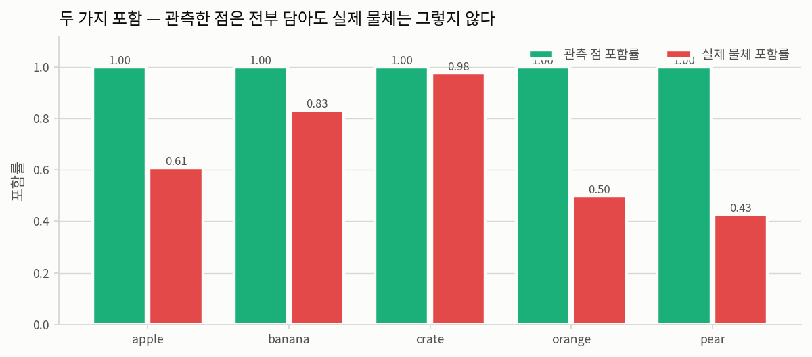
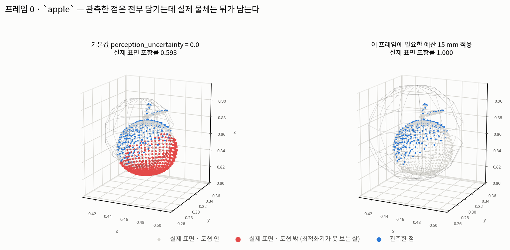
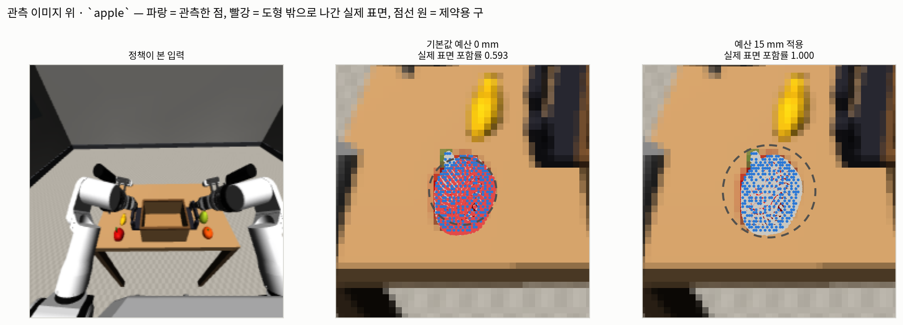
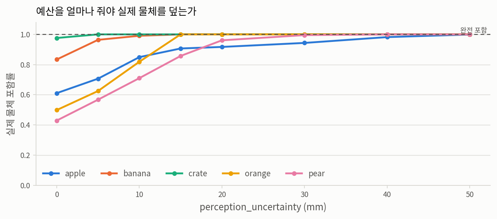
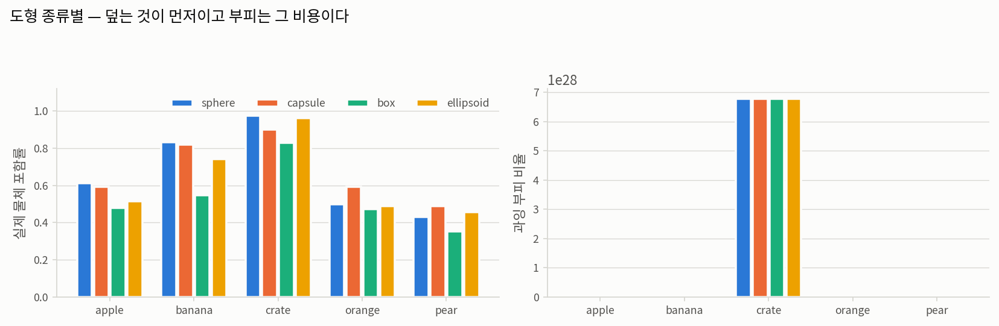
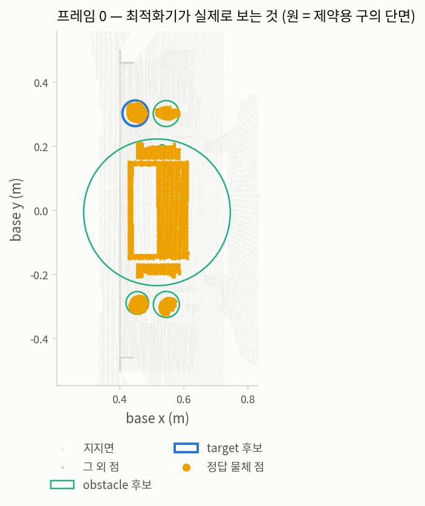

# 6단계 — geometry 변환 (primitive 근사)

**질문.** 점을 도형으로 바꿀 때 무엇이 보존되고 무엇이 사라지는가?

최적화기가 실제로 보는 것은 점이 아니라 이 도형이다. **도형이 물체보다 작으면 최적화기는
존재하지 않는다고 들은 부분을 향해 궤적을 낸다.** 그래서 이 단계의 불변식은 하나다 —
과소 근사 금지.

| | |
|---|---|
| 기록 | `outputs/rby1_atomic_infer/ag3s_step1/ag3s_records/run_0004` |
| 프레임 | 9개 (파지 전) |
| 후보 | 58개, 그중 정답 물체와 대조 가능한 것 43개 |
| 기본 도형 | `sphere`, `min_radius=0.005`, `perception_uncertainty=0.0` |

## 판정 — **부분 통과**

| 검사 | 결과 | 기준 |
|---|---|---|
| A. 관측 점 포함 | 통과 — 58개 후보 전부 포함률 1.000 | 전부 1.0 |
| B. **실제 물체 포함** | **실패** — 평균 **0.667**, 최대 침투 **51.9 mm** | 1.0 |
| C. 캡슐 구 체인 | 통과 — 실데이터 캡슐 45개 + 합성 4종 전부 100% 덮음 | 전부 1.0 |

### A와 B는 다른 질문이다 — 그리고 그 차이가 이 단계의 전부다



**A는 통과한다.** AG3S의 `containment_report`가 재는 것이고, 모든 후보가 자기 점을 100%
담는다. 코드가 보장하려던 것은 보장된다.

**B는 통과하지 못한다.** 2단계에서 확인했듯 카메라는 **앞면만** 본다. 앞면 점을 전부 담는 구는
물체의 뒷면을 담지 못한다. 관측한 점은 100% 포함하면서 실제 물체는 그보다 적게 덮고 있으며,
**그 상태는 A로는 절대 드러나지 않는다.**

| 물체 | 관측 점 포함률 | 실제 물체 포함률 | 최대 침투 (mm) | 완전 포함에 필요한 예산 (mm) |
|---|---|---|---|---|
| apple | 1.000 | 0.610 | 51.9 | 스윕 범위 밖 |
| banana | 1.000 | 0.834 | 14.5 | 15 |
| crate | 1.000 | 0.976 | 3.6 | 5 |
| orange | 1.000 | 0.498 | 14.6 | 15 |
| pear | 1.000 | 0.429 | 37.2 | 40 |

"최대 침투"는 실제 물체 표면이 도형 **합집합** 밖으로 나간 최대 거리다. 합집합인 것이
중요하다 — 속이 빈 크레이트는 벽들이 유클리드로 연결되지 않아 여러 후보로 나뉘고, 조각 하나를
크레이트 전체와 비교하면 당연히 못 덮는다. 최적화기는 조각이 아니라 후보 전부를 본다.
(이 보고서의 첫 판이 그 비교를 해서 크레이트 침투를 408 mm로 보고했다. 합집합으로 고치니
3.6 mm다.)

이 값은 **최적화기가 못 보는 살의 두께**이고, 이보다 얇은 여유거리는 실제로는 여유가 아니다.



왼쪽이 기본 설정이다. 파란 점(관측한 점)은 전부 회색 구 안에 있는데, 빨간 점 — 실제 물체
표면인데 구 밖으로 나간 부분 — 이 뒤쪽에 남는다. **A가 보는 것은 파란 점뿐이고, 빨간 점은
A의 시야에 없다.** 오른쪽은 필요한 예산을 켠 것이고, 빨간 점이 사라진다.

같은 것을 **정책이 본 이미지 위에** 되돌려 그리면 이렇다.



한 가지는 짚어 두어야 한다. **이미지 공간에서는 물체의 뒷면이 앞면과 같은 자리에 투영된다.**
그래서 가운데 패널의 빨간 점은 사과의 실루엣 전체를 덮은 것처럼 보이지만, 실제로 도형 밖에
있는 것은 카메라에서 먼 쪽이다. 어느 *부분*이 빠졌는지는 3D 그림(fig4)이 답하고, 이 그림은
그것이 씬의 **어느 물체**에서 일어나는지를 답한다. 두 그림은 서로 다른 질문에 답하며,
둘 다 필요하다.

#### 기전 — 반지름이 아니라 중심이 문제다

| 물체 | 맞춘 반지름 (mm) | 중심 오프셋 (mm) | 프레임당 후보 수 |
|---|---|---|---|
| apple | 45.9 | 22.3 | 0.9 |
| banana | 38.3 | 10.9 | 0.9 |
| crate | 149.6 | 77.4 | 1.6 |
| orange | 36.1 | 19.1 | 1.0 |
| pear | 37.5 | 21.2 | 1.0 |

과일들은 **반지름이 부족한 것이 아니라 중심이 카메라 쪽으로 밀려 있다.** 2단계에서 "점이 ×를
둘러싸지 않고 한쪽에 몰린다"고 했고 4단계에서 클러스터 무게중심 편향을 21.0 mm로 쟀는데,
6단계에서 그 편향이 그대로 도형의 중심 오프셋이 되어 물체 뒷면이 도형 밖으로 나간다.

같은 크기의 구가 반지름만큼 밀리면 절반이 밖으로 나간다 — 위 표의 포함률 0.38–0.86이
그것이다. 크레이트가 0.976으로 멀쩡한 것은 크고 여러 면이 보여 오프셋이 상대적으로 작기
때문이다.

### B가 `perception_uncertainty`가 존재하는 이유다

`GeometryConfig.perception_uncertainty`의 주석은 이렇게 적는다 — "One budget for every
perception error that makes the fitted shape smaller than the real one." 그 예산이 무엇을 위한
것인지 말로 설명하는 대신, 0부터 올려가며 **실제 물체를 덮는 데 얼마가 필요한지** 쟀다.



기본값은 `0.0`다. 즉 **기본 설정에서는 이 예산이 꺼져 있고**, 위 표의
"필요한 예산" 열이 켜야 할 값을 말한다.

주석이 함께 적는 것도 중요하다 — 이 값은 **primitive 반지름에만** 더하고 `d_safe`에는 더하지
않는다. 두 곳에 더하면 같은 센티미터를 두 번 세어 로봇의 우회 거리가 조용히 두 배가 된다.

### C. 캡슐 구 체인 — 최적화기가 보는 최종 형태

최적화기가 푸는 것은 primitive가 아니라 `to_spheres()`가 낸 구들이다. 캡슐은 구 체인이 되는데,
`max_spheres`가 걸려 간격이 반지름보다 벌어지면 **구 사이에 틈이 생긴다** — 충돌을 만드는
방향의 오차다. 코드는 각 구를 `sqrt(r² + (간격/2)²)`로 부풀려 중점까지 덮는다고 적고 있다.

두 가지로 확인했다. **실데이터에 맞춘 캡슐**과, 실데이터에는 나타나지 않는 긴 캡슐(합성).

#### C-1. 실데이터에서 맞춰진 캡슐 45개

기본 도형은 `sphere` 라 파이프라인이 캡슐을 만들지 않는다. 그래서 같은 관측 점에
`fit_primitive(..., "capsule")` 을 직접 걸어 나온 캡슐의 체인을 검사했다. 관측에서 나온
형상이므로 합성이 아니다.

| 물체 | 캡슐 수 | 반지름 (mm) | 반길이 (mm) | 구 개수 | 자기 점을 덮은 비율 |
|---|---|---|---|---|---|
| apple | 8 | 32.9 | 39.8 | 4.4 | **1.0000** |
| banana | 8 | 24.7 | 35.9 | 4.4 | **1.0000** |
| crate | 11 | 95.8 | 175.4 | 5.3 | **1.0000** |
| orange | 9 | 34.3 | 30.0 | 3.0 | **1.0000** |
| pear | 9 | 29.9 | 33.7 | 3.9 | **1.0000** |

#### C-2. 합성 캡슐 — `max_spheres` 가 실제로 걸리는 경우

실데이터의 캡슐은 짧아 `max_spheres=8` 이 걸리지 않는다. 즉 **틈이 생길 수 있는 구간이
실데이터에 없다.** 그 구간을 검사하려면 만들어야 하므로, 캡슐을 수식으로 정의하고 표면 점을
해석적으로 뿌려(카메라도 씬도 쓰지 않는다) 체인이 덮는지 본다. 관측이 아니라 **기하 항등식
`sqrt(r²+(간격/2)²)` 의 단위 검사**라는 점을 분명히 해 둔다.

| 반길이 (m) | 구 개수 | 간격 (m) | 원래 반지름 | 부푼 반지름 | sqrt(r²+(s/2)²) | 표면 덮은 비율 |
|---|---|---|---|---|---|---|
| 0.05 | 6 | 0.0200 | 0.020 | 0.0224 | 0.0224 | **1.0000** |
| 0.10 | 8 | 0.0286 | 0.020 | 0.0246 | 0.0246 | **1.0000** |
| 0.20 | 8 | 0.0571 | 0.020 | 0.0349 | 0.0349 | **1.0000** |
| 0.40 | 8 | 0.1143 | 0.020 | 0.0605 | 0.0605 | **1.0000** |

부푼 반지름이 `sqrt(r²+(간격/2)²)`과 정확히 일치하고, 캡슐 표면이 100% 덮인다. 반길이 0.40 m는
`max_spheres=8`이 실제로 걸리는 경우이며, 부풀리지 않았다면 틈이 생겼을 구간이다.

### D. 도형 종류별 — 덮는 것이 먼저, 부피는 비용



같은 점에 네 종류를 각각 맞춰 비교했다. 왼쪽이 실제 물체를 덮는 비율, 오른쪽이 그 대가로 쓰는
부피다. 오른쪽이 큰 것은 그 자체로 나쁘지 않다 — 우회 거리가 늘 뿐이고, 왼쪽이 작은 것은
충돌이다. **두 축의 지위가 다르다.**

### 최적화기가 실제로 보는 씬



원 하나가 후보 하나의 제약용 구 단면이다. 노란 점(정답 물체)이 원 안에 들어 있는지, 원이
물체보다 큰지 작은지가 이 그림에서 바로 읽힌다. 최적화기에게 씬은 점이 아니라 **이 원들**이다.

## 이 단계가 다음 단계에 남기는 것 — 여유거리는 이미 절반이 쓰였다

5단계에서 본 여유거리는 `object` 열 **50 mm**, `support_surface` 10 mm였다. 위에서 잰 최대
침투는 **51.9 mm**다.

두 숫자를 나란히 놓으면 이렇게 읽힌다: 최적화기는 도형에서 50 mm 떨어져 있으라는 제약을
풀지만, 도형이 실제 물체보다 최대 52 mm 작으므로 **실제 물체로부터의 여유는
-2 mm까지 줄어들 수 있다.** 명목상의 여유거리 중 그만큼이 이미 도형의
과소 근사로 소진된 것이다.

`perception_uncertainty`를 위 표의 "필요한 예산"으로 켜면 이 소진이 사라진다 — 그것이 그 설정이
존재하는 이유이고, 기본값이 `0.0`인 채로 두면 안 되는 이유다. 다만 켠 만큼 도형이 커지므로
로봇의 우회 거리가 늘고, 좁은 곳에서는 통과 가능한 경로가 사라질 수도 있다. **그 교환이
7단계에서 실제로 어떻게 나타나는지**가 다음 질문이다.

주의: 이 예산을 `d_safe`에도 더하면 안 된다. `GeometryConfig` 주석이 그 이유를 적는다 — 같은
센티미터를 두 번 세면 우회 거리가 조용히 두 배가 되고, 안전은 그만큼 늘지 않는다.

## 그림에 대하여

### fig4 — 도형이 어디를 놓치는가 (이 단계의 핵심 그림)

`fig4_scene_miss.png`. 두 패널 모두 같은 프레임, 같은 물체. 회색 철망이 맞춰진 구,
파란 점이 관측한 점, 회색 점이 실제 표면 중 구 안에 든 부분, **빨간 점이 구 밖으로 나간 부분**.

**만드는 법.** 실제 표면은 MuJoCo 메시 정점(과일)과 상자 모서리(크레이트)를 그 프레임의 실제
자세로 옮긴 것이다. 각 점에 `geometry.contains(primitive, ...)` 를 걸어 안/밖을 나눈다. 왼쪽은
기본 설정, 오른쪽은 `inflate(primitive, 필요 예산)`.

**읽는 법.** 파란 점이 전부 철망 안에 있는데 빨간 점이 남는 것 — 그것이 검사 A와 B의 차이다.
A는 파란 점만 보고, 빨간 점은 A의 시야에 아예 없다. 오른쪽에서 빨간 점이 사라지는 것이
`perception_uncertainty` 가 하는 일이다.

### fig6 — 관측 이미지 위 겹침

`fig6_image_overlay.png`. 정책이 본 224x224 입력 위에 3D 결과를 되돌려 그린 것.

**만드는 법.** `imageview.project` 로 base 프레임 점을 카메라 픽셀로 옮긴다. 깊이·내부
파라미터는 480x640이고 정책 이미지는 224x224인데, 둘 다 4:3이고 299x224 → 224x224 변환이
순수 가로 압축이라 **정규화 좌표가 보존된다** (2단계에서 확인). 그래서 오프셋 없이
`u/W_depth * W_image` 로 옮긴다. 제약용 구는 중심을 투영한 자리에 반지름 `f*r/z` 인 원으로
그린다 — 광축에서 멀면 실루엣이 타원이 되지만, 이 씬의 물체는 화면 중앙 근처라 오차가 작다.
**판정에 쓰는 숫자는 언제나 3D에서 계산하고 이 근사는 그림에만 쓴다.**

**읽는 법.** 이미지 공간에서는 뒷면이 앞면과 겹쳐 투영되므로, 빨간 점의 *면적*을 오차 크기로
읽으면 안 된다. 이 그림이 답하는 것은 "어느 물체에서 일어나는가"이고, "어느 부분인가"는
fig4가 답한다.

### fig5 — 최적화기가 실제로 보는 씬

`fig5_scene_candidates.png`. 위에서 내려다본 점군에 후보의 제약용 구 단면을 원으로 겹쳤다.

**읽는 법.** 최적화기에게 씬은 점이 아니라 이 원들이다. 크레이트의 원이 물체보다 훨씬 큰 것이
과잉 부피(= 우회 비용)이고, 과일의 원이 노란 점을 살짝 벗어나 있는 것이 과소 근사(= 충돌
위험)다. **두 오차의 지위가 다르다** — 앞은 느려지고, 뒤는 부딪힌다.

### fig1 — 두 포함률

`fig1_containment.png`. 물체마다 초록(관측 점 포함률)과 빨강(실제 물체 포함률)을 나란히.

**읽는 법.** 초록이 전부 1.00 인데 빨강이 낮은 것이 이 단계의 결론 전부다. 초록만 보면
통과이고, 빨강을 봐야 문제가 보인다.

### fig2 — 예산 스윕

`fig2_uncertainty.png`. 가로축이 `perception_uncertainty`, 세로축이 실제 물체 포함률.

**만드는 법.** 맞춘 도형에 `inflate(prim, u)` 를 걸어가며 실제 표면 포함률을 다시 잰다.
곡선이 1.0 점선에 닿는 지점이 그 물체에 필요한 예산이다.

### fig3 — 도형 종류별

`fig3_primitive_types.png`. 같은 점에 sphere·capsule·box·ellipsoid 를 각각 맞춰 비교.

**읽는 법.** 왼쪽(포함률)이 먼저이고 오른쪽(과잉 부피)은 그 비용이다. 두 축을 같은 무게로
읽으면 안 된다.

## 재현

```bash
MUJOCO_GL=osmesa src/openpi/.venv/bin/python -m benchmark.ag3s.experiments.geometry_report \\
    --records outputs/rby1_atomic_infer/ag3s_step1/ag3s_records/run_0004 --attention benchmark/ag3s/asset/data/attention_step1_run0004.npz
```
