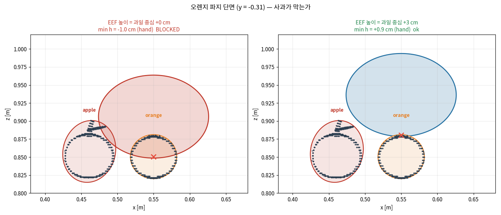

# transport 씬 Admissibility 검사

RB-Y1 transport 씬이 타원체 기반 CBF 필터를 지탱할 수 있는 기하인지, **코드를 쓰기 전에** 판정한다.

| 항목 | 내용 |
|---|---|
| 도구 | [check_admissibility.py](../check_admissibility.py) |
| 입력 | `scene_transport.xml` + `transport_prop_assets.xml` + OBJ 메시 + RB-Y1 그리퍼 메시 (직접 파싱, 모델 컴파일 불필요) |
| 그리퍼 | **실측** — `EE_BODY` + `EE_FINGER` 메시에서 MVEE (§2) |
| 판정 | 그리퍼 파트를 각 타깃 위에 놓고 비타깃 객체에 대해 Eq. (6)의 $h$ 평가. $h \le 0$이면 **그 자세가 장애물 안** |

## 결론

| 국면 | 판정 | 조건 |
|---|---|---|
| 과일 파지 | **통과** | EEF를 과일 중심보다 **3 cm 위**에서 닫을 것 (오프셋 0에서는 orange·banana가 막힌다) |
| 크레이트 파지 | **통과** | 손잡이를 좌·우 별도 파트로 |
| **과일 담기** | **통과** | **크레이트를 벽·바닥·손잡이로 분해할 것.** 통짜로 두면 어떤 설정으로도 불가 |
| 지지면(테이블·벽) | 범위 밖 | 논문이 다루지 않음 — [OPEN-Q 22](OPEN-QUESTIONS.md) |

```bash
src/openpi/.venv/bin/python -m benchmark.knows_vla.check_admissibility --shell --grasp-offset 0 0 0.03
# -> RESULT: ADMISSIBLE
```

> 이 검사를 만든 이유: LIBERO에서 이걸 모르고 P3a까지 가서 9/9 실패를 본 뒤에야 원인이
> 기하라는 것을 알았다([12-p3a-results.md](12-p3a-results.md) §3). 같은 실수를 반복하지 않는다.

---

## 0. 정정 이력

판정이 두 번 뒤집혔다. **두 번 다 씬이 아니라 도구가 원인**이었으므로 남겨 둔다.

**1차 (NOT ADMISSIBLE → 조건부 통과)** — 세 가지 결함:

| 결함 | 증상 | 수정 |
|---|---|---|
| **축 오독** | 반축을 `eigvalsh`로 뽑아 **정렬된** 값을 x, y, z로 읽었다. 크레이트의 36.4 cm를 z로 보고 "손잡이가 높이 달려서"라고 진단했으나 실제로는 **y**이고, 원인은 손잡이가 $y=\pm0.21$까지 **옆으로** 뻗은 것이다 | 축별 support $\sqrt{Q_{ii}}$로 보고 (`axis_extent`) |
| **외접 박스 타원체** | 반축 $=\sqrt{3}\times$ 반폭. 있지도 않은 박스 모서리 값을 지불한다 | 메시 점군에 **MVEE** 직접 적합 |
| **메시 원점 소실** | 각 OBJ의 반폭을 *자기 중심 기준*으로 재면서 메시가 geom 원점에서 벗어난 오프셋을 버렸다. 사과·배 꼭지가 잘려 있었다 | 정점을 그대로 사용 |

여기에 장애물 집합도 바로잡았다. 논문 §3.2는 "manipulable objects"만 세그멘테이션하므로
`table`·`office`를 넣은 것은 과했고, 지금은 `--include-static`으로만 켜진다.

**2차 (그리퍼 가정 → 실측)** — 그리퍼를 4×4×7 cm 블록으로 가정하고 있었다. RB-Y1 메시를
읽어 보니 **손 본체만 7.6×4.5×5.8 cm**로 더 크다(§2). 동시에 크레이트 껍질 분해로 담기
국면이 열렸다(§4). 두 변화가 반대 방향이라 최종 판정은 통과지만, **파지 높이 조건이 새로 붙었다.**

`STATIC_BODIES` 필터가 부분문자열 매칭이라 `crate_wall_px`를 지지면으로 오인해 조용히 버리던
버그도 이때 잡았다(접두사 매칭으로 변경).

---

## 1. 객체 타원체 (MVEE, 축별 도달거리)

`reach x,y,z` = $\sqrt{Q_{ii}}$, 즉 타원체가 각 축으로 뻗는 거리. 두 객체가 주어진 간격에서
동시에 감싸질 수 있는지를 결정하는 양이므로 정렬된 고유값보다 이쪽이 쓸모 있다.

| body | reach x, y, z (cm) | 중심 (m) |
|---|---|---|
| apple | 3.7 × 3.6 × 4.3 | (0.461, −0.310, 0.858) |
| banana | 4.2 × 3.1 × 3.1 | (0.460, 0.310, 0.839) |
| orange | 3.2 × 3.2 × 3.1 | (0.550, −0.310, 0.851) |
| pear | 3.2 × 3.2 × 5.5 | (0.551, 0.310, 0.859) |
| crate (통째) | 12.9 × **31.0** × 13.5 | (0.520, 0.000, 0.892) |

과일 반축이 실물과 맞는다 — 오렌지 3.2 cm는 지름 6.4 cm로 타당하다. 1차의 5.1~5.5 cm는
$\sqrt{3}$ 배가 만든 값이었다.

## 2. 그리퍼 — 가정이 아니라 실측

`rby1.xml`의 프레임 사슬(`EE_BODY_R` 손목 z=−0.1548, 손가락 z=−0.2278, `right_ee` 사이트
z=−0.2548)을 따라 메시를 사이트 좌표로 옮기고 MVEE를 적합했다.

| 파트 | reach x, y, z (cm) | EEF 기준 중심 (cm) |
|---|---|---|
| `hand` (EE_BODY) | **7.6 × 4.5 × 5.8** | (0, 0, +5.6) — 위로 11.3 cm까지 |
| `finger_p` / `finger_n` | 1.2 × 2.1 × 4.9 | (0.2, ±3.7, +0.7) — 아래로 4.1 cm까지 |
| (이전 가정) | 4.0 × 4.0 × 7.0 | (0, 0, 0) |


왼쪽이 이전 가정이다. **블록이 손 본체 메시를 덮지도 못한다** — z = 0.08~0.10의 점들이 타원체
밖에 있다. 즉 그 가정은 보수적이지도 않았고 그냥 틀렸다.

**막는 것은 언제나 `hand`이지 손가락이 아니다.** 손가락은 얇아서 거의 문제를 일으키지 않는다.
그래서 "손가락 사이를 비우면 파지 여유가 생긴다"는 직관은 방향은 맞지만 **효과는 작다** —
정작 문제는 손목 하우징이다.

### 손 본체는 더 쪼개면 안 된다

`EE_BODY`는 MJCF에 이미 25개 볼록 충돌 조각으로 들어 있다. 조각마다 MVEE를 적합해 봤더니
**결과가 나빠졌다**:

| 타깃 | 손 = 1덩어리 | 손 = 25조각 |
|---|---:|---:|
| orange | −1.0 cm | **−1.6 cm** |
| banana | −1.2 | **−2.1** |

버그가 아니라 기하의 성질이다. 큰 타원체는 위아래로 갈수록 좁아지는데, 그 좁아지는 높이에
있는 조각은 자기 MVEE 팽창을 따로 물면서 **부모 타원체 밖으로 삐져나온다.** 볼록한 물체를
쪼개는 것은 이득이 없다.

> **규칙: 오목한 것만 쪼갠다.** 크레이트는 O(§4), 손은 X. "많이 쪼갤수록 좋다"가 아니다.

## 3. 파지 국면 — 통과, 단 접근 높이가 조건이다

| 타깃 | 최근접 장애물 | 중심거리 | 오프셋 0에서 $h$ | 필요한 최소 수직 오프셋 |
|---|---|---:|---:|---:|
| apple | orange | 8.9 cm | +0.9 cm | 없음 |
| orange | apple | 8.9 cm | **−1.0** | **1.7 cm** |
| banana | pear | 9.3 cm | **−1.2** | **2.8 cm** |
| pear | banana | 9.3 cm | +1.5 | 없음 |



**손가락 타원이 보이지 않는 것이 정상이다** — 손가락은 과일 좌우 3.7 cm에 있고 반축이 2.1 cm라
과일 중심을 지나는 단면이 그 사이로 지나간다. 손가락이 과일을 감싸고 있다는 뜻이며, 침범하는
것은 그 위의 손 본체다.

즉 **EEF를 과일 중심에 정확히 놓으면 orange·banana가 막히고, 3 cm만 올리면 전부 열린다.**
손가락이 EEF 아래로 4.1 cm 뻗으므로 3 cm 위에서도 손끝은 과일을 충분히 감싼다 — 물리적으로
무리한 요구가 아니다.

**이식 시 반영할 것**: 파지 확정 지점의 EEF 목표 높이를 과일 중심 + 3 cm 이상으로 잡거나,
마지막 하강 구간에서만 필터를 완화한다(후자는 안전 논리가 복잡해지므로 전자를 권장).

### 랜덤화 하한이 임계값 아래다

간격을 줄여가며 잰 $h$ (이전 블록 그리퍼 기준, 상대 순서는 동일):

| 간격 | apple←orange | orange←apple | banana←pear | pear←banana |
|---:|---:|---:|---:|---:|
| 9.0 cm | +1.78 | +1.34 | +1.63 | +0.67 |
| **8.0** | +0.78 | +0.34 | +0.64 | **−0.33** |
| 7.0 | −0.22 | −0.66 | −0.35 | −1.32 |

[transport_scene.py:409](../../../src/rby1_manipulation/src/rby1_manipulation/simulation/transport_scene.py)의
x 지터 ±0.006 m가 최소 간격 **78 mm**를 만드는데 `pear←banana` 임계는 **약 82 mm**다.
`object_pose`가 기본 False라 지금은 발동하지 않지만, 켜면 일부 seed에서 배가 파지 불가가 된다.

→ 지터를 ±0.003으로 줄이거나, 배 꼭지를 충돌 표현에서 빼거나(꼭지는 잡을 대상이 아니다),
평가 시에만 간격을 조인다. 학습 중인 씬이므로 **변경은 보류하고 보고만 한다.**

## 4. 담기 국면 — 크레이트 껍질 분해가 결정적이다

통짜 타원체로는 **어떤 설정으로도 열리지 않는다.** 크레이트는 속이 빈 용기인데 타원체 하나가
내부를 메우므로, 담는 동작은 정의상 그 부피를 지난다([02-architecture.md](02-architecture.md) §4).

벽 4장 + 바닥 + 손잡이 2개로 분해하면(`--shell`) 내부가 실제로 열린다:

| 그리퍼 z | 통짜 크레이트 | 껍질 분해 | 지배 파트 |
|---:|---:|---:|---|
| 1.05 m (림 위 10 cm) | −4.7 cm | **+5.2** | `crate_wall_px` |
| 1.00 | −9.7 | **+4.2** | `crate_wall_px` |
| 0.95 (림 상단) | −14.7 | **+3.8** | `crate_wall_px` |
| 0.91 (바닥 근처) | −16.7 | **+0.9** | `crate_floor` |


회색이 크레이트 실물의 U자 단면이다. 왼쪽에서는 타원체 하나가 그 안쪽을 통째로 메우고 그리퍼가
그 안에 들어가 있다. 오른쪽에서는 벽이 얇은 타원 두 개, 바닥이 납작한 타원 하나가 되어 가운데가
비고 그리퍼가 들어간다.

**3D 뷰로는 이걸 볼 수 없다** — 뒷벽이 구멍을 가로질러 그려지기 때문이다. 단면이 유일한 방법이다.

얇은 판을 감싼 타원체도 **얇은 방향은 얇게 유지된다**는 것이 요점이다 — `crate_wall_px`의
x 도달거리는 0.9 cm에 불과하다. 벽 타원체는 y로 26 cm, z로 10 cm 부풀지만 그 방향은 내부를
막지 않는다.

### 귀결 — attention 의존이 사라진다

이전 판에서 "담기 국면은 Eq. (4)가 크레이트를 타깃으로 지목해 주는 것에 100% 의존하며, 이것이
이식의 성패를 가르는 단일 실험"이라고 적었다. **분해하면 그 의존이 없어진다.** 크레이트가
장애물로 남아 있어도 담을 수 있다.

attention 국면 실험은 여전히 유용하지만(파지 국면 타깃 식별, [OPEN-Q 18](OPEN-QUESTIONS.md))
**더 이상 착수 게이트가 아니다.**

### 왜 "담을 때 크레이트를 통째로 제외"보다 나은가

제외도 담기를 가능하게 하지만 **손잡이까지 같이 빠진다.** 과일을 쥐고 크레이트로 가는 직선
경로에서 손잡이에 대한 최소 $h$를 재면:

```
손잡이 보호 O (껍질 분해) : min h = -5.0 cm  at y=-0.201, z=0.935  -> 필터가 경로를 고친다
손잡이 보호 X (통째 제외) : 제약 자체가 없음                        -> 그대로 부딪힌다
```

손잡이는 z=0.977까지 올라오고 $y=\pm0.20$에 있어, $|y|=0.31$의 과일에서 $y=0$으로 가는 운반
경로와 정면으로 겹친다. **실제 충돌 위험이 있는 부품**이다.

절충안: 벽 4장까지 쪼개기 번거로우면 **손잡이만 별도 파트로 떼고 크레이트 몸통은 제외**해도
대부분 회수된다.

## 5. 남은 낙관 요인 — 지각이 들어오면 나빠진다

여기까지는 전부 **GT 메시**에 적합한 결과다. 실제 파이프라인은 한 시점 깊이 영상에서 적합하며,
카메라는 물체 뒷면을 못 본다:

| | 전체 메시 | 위에서 본 절반만 |
|---|---|---|
| apple | 3.7 × 3.6 × **4.3** | 3.6 × 3.6 × **3.1** |
| orange | 3.2 × 3.2 × **3.1** | 3.4 × 3.4 × **2.0** |
| pear | 3.2 × 3.2 × **5.5** | 3.0 × 3.0 × **3.8** |

**타원체를 타이트하게 적합할수록 좋다는 것은 절반만 맞다.** 부분 관측에서 타이트하게 적합하면
실제보다 작게 잡아 **충돌한다.** 타이트하게 적합하되 **관측 불확실성을 다시 더해야** 한다
([15-development-plan.md](15-development-plan.md) D6).

$h$ 마진이 mm~cm 단위이므로 이 보정의 크기가 판정을 바꿀 수 있다. **D6을 넣은 뒤 이 검사를
다시 돌릴 것.**

## 6. 판정과 순서

| 항목 | 상태 | 조치 |
|---|---|---|
| 과일 파지 | 통과 (오프셋 3 cm 조건) | 파지 목표 높이 = 과일 중심 + 3 cm |
| 크레이트 파지 | 통과 | 손잡이 좌·우 별도 파트 |
| 과일 담기 | 통과 | **크레이트 껍질 분해 구현** |
| 랜덤화 간격 | 조건부 위험 | `object_pose` 켤 때 지터 축소 |
| 지각 오차 | **미반영** | D6 넣고 재검사 |
| 지지면 | 범위 밖 | 반공간 제약으로 추가 (D4) |

**착수한다.** [13-rby1-port-plan.md](13-rby1-port-plan.md) 순서대로 진행하되, 담기 국면이
기하로 해결됐으므로 attention 국면 실험은 게이트가 아니라 **품질 확인** 항목으로 내린다.

## 7. 시각화

숫자만으로는 타원체가 어느 축으로 뻗는지 놓치기 쉽다 — 실제로 크레이트의 36 cm를 두 판 동안
높이로 잘못 읽었다(§0). [visualize_ellipsoids.py](../visualize_ellipsoids.py)는 항상 **실제
형상 위에 타원체를 겹쳐** 그리므로 그 오차가 눈에 보인다.

| 그림 | 보여주는 것 | 위치 |
|---|---|---|
| `02-gripper-ellipsoids.png` | 이전 4×4×7 가정 vs RB-Y1 실측 | [assets/](assets/) — §2 |
| `05-crate-section.png` | **가장 중요** — y=0 단면, 담기 국면의 근거 | [assets/](assets/) — §4 |
| `06-grasp-section.png` | 오렌지 파지 단면, +3 cm 조건의 근거 | [assets/](assets/) — §3 |
| `01-scene-ellipsoids.png` | 씬 전체 3D | 생성물 |
| `03`, `04` | 파지·담기 3D 뷰 | 생성물 |

판정의 근거가 되는 세 장만 저장소에 두고(110 dpi, 합 540 KB), 나머지는 필요할 때 만든다.

```bash
# 저장소용 세 장 재생성
... visualize_ellipsoids --out benchmark/knows_vla/docs/assets --only gripper section grasp-section --dpi 110
# 전부
... visualize_ellipsoids --out data/knows_figs
```

## 8. 재사용

`--scene` / `--targets` / `--fit` / `--gripper` / `--grasp-offset` / `--shell`로 어느 MJCF 씬에도
적용된다. 실로봇 장면은 MJCF가 없으므로 치수를 직접 넣는 경로가 필요하지만 판정 로직은 동일하다.

```bash
# 최종 판정
... check_admissibility --shell --grasp-offset 0 0 0.03

# 논문 그대로의 표현 (통짜 크레이트 + 단일 그리퍼 타원체)
... check_admissibility --gripper block

# 1차 판정 재현 (외접 박스 + 지지면 포함)
... check_admissibility --gripper block --fit box --include-static
```
