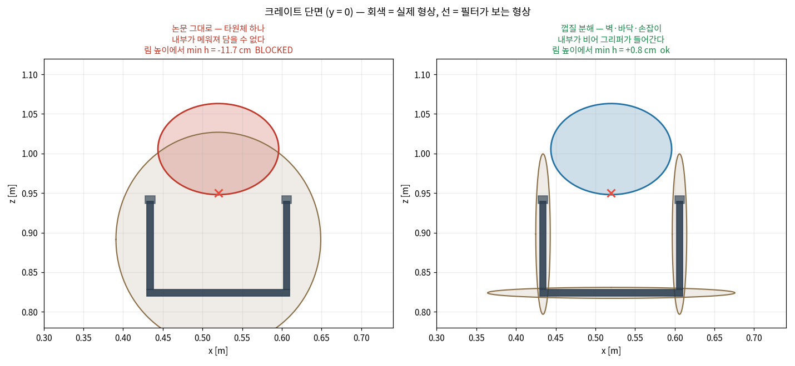
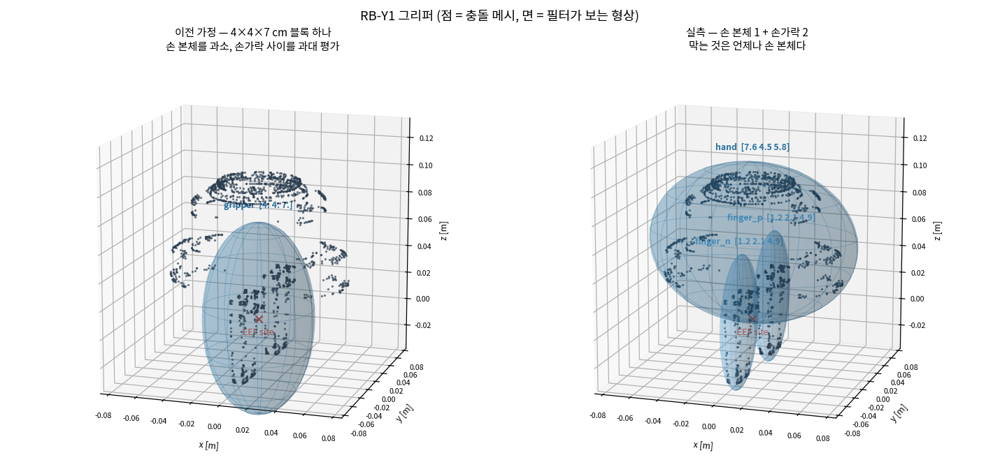

# KNOWS 재현 — 처음 읽는 사람을 위한 설명

이 문서 하나만 읽으면 나머지 문서와 코드가 무슨 얘기인지 알 수 있게 하는 것이 목적이다.
수식은 필요한 만큼만 쓰고, 먼저 말로 설명한다.

---

## 1. 한 문단 요약

VLA 정책(π0.5)은 카메라 영상과 명령을 받아 로봇 동작을 뱉는다. 그런데 **주변 물체와
부딪히지 않는다는 보장이 없다.** KNOWS 논문은 정책을 **다시 학습시키지 않고**, 정책이 뱉은
동작을 컨트롤러로 보내기 직전에 **살짝 고쳐서** 충돌을 막자고 제안한다. 고칠 때 필요한 정보
— "지금 로봇이 잡으려는 물체가 무엇인가" — 를 **정책 내부의 attention에서 공짜로 꺼내 쓴다.**
"모델은 이미 알고 있다(Your Model Already Knows)"가 제목의 뜻이다.

우리는 이 논문에 **공식 코드가 없어서** 논문만 보고 처음부터 구현했고, 지금은 그것을
RB-Y1 transport 시나리오로 옮기려는 단계다.

---

## 2. 용어 정리

여기부터가 실제로 막히는 지점이다. 각 항목에 **왜 이게 필요한지**를 같이 적었다.

### 2.1 안전 필터 (safety filter)

정책과 컨트롤러 사이에 끼워 넣는 상자. 입력은 정책이 원한 동작, 출력은 **그것과 최대한
비슷하면서 충돌하지 않는 동작**이다.

```
[관측] → [π0.5 정책] → 원하는 동작 → [안전 필터] → 고쳐진 동작 → [컨트롤러] → 로봇
                            (δc_nom)                  (δc)
```

`nom`은 nominal(정책이 원래 원한 값)의 약자다. 필터가 할 일이 없으면 그대로 통과시킨다.

### 2.2 타원체 표현 (ellipsoid)

충돌 검사를 실시간으로 하려면 물체 모양을 **단순하게** 만들어야 한다. 논문은 물체 하나를
**타원체 하나**로 뭉갠다. 럭비공 모양이라고 생각하면 된다.

코드에서 타원체는 중심 `c`와 모양 행렬 `Q` 두 개다:

$$E = \{c + Q^{1/2}u : \|u\| \le 1\}$$

`Q`는 **반축의 제곱**을 담는다. 예를 들어 4×4×7 cm 타원체는
`Q = diag(0.04², 0.04², 0.07²)`이다. 제곱으로 두는 이유는 뒤의 수식이 깔끔해지기 때문이다.

> **왜 타원체인가**: 아래 2.4의 "지지 함수"가 **닫힌 식**으로 나오기 때문이다. 메시나
> 볼록 껍질을 쓰면 그때마다 최적화를 풀어야 해서 20 Hz를 못 맞춘다. 대신 **모양이 부정확해진다** —
> 이게 나중에 우리 발목을 잡는다(§7).

말로만 하면 감이 안 오므로 그림으로 본다. 회색이 크레이트의 **실제** 단면(U자), 선이 **필터가
보는 형상**이다.



왼쪽이 논문 그대로다. 타원체 하나가 크레이트 안쪽을 통째로 메워서, 물건을 넣으려는 그리퍼(빨강)가
이미 "충돌" 상태다. 오른쪽은 크레이트를 벽·바닥으로 쪼갠 것 — 가운데가 비어 그리퍼(파랑)가
들어간다. **이 한 장이 §7의 A2 문제와 그 해법 전부다.**

### 2.3 분리 초평면 (separating hyperplane)과 배리어 $h$

두 물체가 겹치지 않는다는 것을 어떻게 숫자 하나로 표현할까? **둘 사이에 판자(평면)를 끼워
넣을 수 있으면 겹치지 않은 것**이다. 이게 분리 초평면이다.

방향 $n$(판자의 법선)을 하나 잡으면, 그 방향으로 잰 **틈의 크기**가 계산된다:

$$h(n) = \underbrace{n\cdot(c_R - c_j)}_{\text{두 중심 사이 거리}} - \underbrace{\sqrt{n^\top Q_R n}}_{\text{로봇이 뻗은 길이}} - \underbrace{\sqrt{n^\top Q_j n}}_{\text{장애물이 뻗은 길이}}$$

- $h > 0$ → 틈이 있다 = **안전**
- $h < 0$ → 겹쳤다 = **충돌**

이 $h$를 **배리어(barrier)** 라고 부른다. 코드에서는 [cbf/ellipsoid.py](../cbf/ellipsoid.py)의
`barrier()`다.

### 2.4 지지 함수 (support function)

위 식의 $\sqrt{n^\top Qn}$이 지지 함수다. **"이 물체가 $n$ 방향으로 얼마나 멀리 뻗어 있는가"**
를 뜻한다. 타원체이기 때문에 이렇게 간단한 식으로 떨어진다 — 2.2에서 말한 이유가 이것이다.

`check_admissibility.py`가 출력하는 `reach x,y,z`가 바로 x, y, z 방향의 지지 함수 값이다.

### 2.5 CBF (Control Barrier Function, 제어 배리어 함수)

"지금 안전한가"가 아니라 **"계속 안전할 것인가"** 를 보장하는 장치다.

$h$가 양수여도 빠르게 줄어들고 있으면 다음 스텝에 충돌한다. 그래서 **$h$가 줄어드는 속도에
제한**을 건다:

$$\Delta h \ge -\gamma_h \, h$$

말로 하면 **"한 스텝에 남은 여유의 $\gamma_h$배보다 많이 까먹지 마라."** $\gamma_h = 0.5$면
매 스텝 여유의 절반까지만 쓸 수 있다. $h$가 0에 가까워질수록 허용되는 감소량도 0에 가까워지므로,
이론상 $h$는 음수가 되지 않는다.

- $\gamma_h$가 작으면 → 조심스럽다(멀리서부터 감속)
- $\gamma_h$가 크면 → 아슬아슬하다

### 2.6 QP (Quadratic Program, 이차 계획법)

"제약을 만족하면서 목표에 가장 가까운 값"을 찾는 표준 최적화 문제다. 우리가 푸는 것:

$$\min_{\delta c,\, \delta\theta} \underbrace{\|\delta c - \delta c^{\text{nom}}\|^2 + W\|\delta\theta - \delta\theta^{\text{nom}}\|^2}_{\text{정책이 원한 동작에서 최대한 덜 벗어나기}}$$
$$\text{s.t.}\quad \underbrace{\text{장애물마다 CBF 제약 한 줄}}_{2.5}$$

- $\delta c$ = 손끝 위치 변화량 (3차원)
- $\delta\theta$ = 손끝 자세 변화량 (3차원, 축각)
- $W$ = 회전을 위치 대비 얼마나 중요하게 볼지

**OSQP**라는 solver가 이걸 밀리초 단위로 푼다. 코드는 [cbf/filter.py](../cbf/filter.py)다.

### 2.7 Attention head

트랜스포머 내부에서 "지금 어느 입력을 보고 있는지"를 나타내는 숫자 배열이다. π0.5는
레이어 18개 × 헤드 8개 = 144개의 헤드를 갖는다.

논문의 핵심 관찰: **그중 (레이어 12, 헤드 3) 하나가 "정책이 지금 조작하려는 물체"를
가리킨다.** 별도 학습 없이 그 헤드의 값을 읽기만 하면 타깃을 알 수 있다는 주장이다.

카메라 영상은 16×16 = 256개 패치로 쪼개져 들어가므로, 이 헤드의 값을 16×16 격자로 되돌리면
**"어디를 보고 있는지"의 히트맵**이 된다.

### 2.8 타깃(target)과 장애물(obstacle)

논문의 규칙은 단순하다:

- attention이 가장 강하게 지목한 물체 하나 = **타깃** → 장애물 집합에서 **뺀다**
- 나머지 전부 = **장애물** → 피한다

빼는 이유는 명확하다. **잡으려는 물체는 피하면 안 되기 때문이다.** 잡는다는 건 닿는다는 뜻이다.

> 이 단순한 이분법이 나중에 여러 문제의 원인이 된다(§7). 쥐고 있는 물체는 어느 쪽인가?
> 물건을 넣어야 하는 상자는?

### 2.9 MVEE (Minimum-Volume Enclosing Ellipsoid)

점 구름을 감싸는 **가장 작은 타원체**를 찾는 알고리즘(Khachiyan). 카메라로 물체를 보고
깊이로 3D 점을 얻으면, 그 점들을 MVEE로 감싸서 2.2의 타원체를 만든다.

코드는 [perception/ellipsoid_fit.py](../perception/ellipsoid_fit.py)의 `mvee()`다.

### 2.10 Admissibility (성립 가능성)

**우리가 만든 개념이다.** 논문에는 없다.

"이 장면에서 애초에 이 방법이 성립하는가"를 뜻한다. 타깃을 잡으러 가는 자세가 이미 **옆
물체의 타원체 안**이라면, 필터는 그 동작을 반드시 막는다. 이건 튜닝으로 해결되지 않는다 —
기하학적으로 불가능하다.

이걸 몰라서 LIBERO에서 9/9 실패를 보고 나서야 원인을 알았다. 그래서 **코드를 쓰기 전에
검사하는 도구**를 만들었다([check_admissibility.py](../check_admissibility.py)).

### 2.11 그 밖의 약어

| 약어 | 뜻 |
|---|---|
| **VLA** | Vision-Language-Action. 영상+언어를 받아 동작을 내는 정책. π0.5가 그것 |
| **EEF** | End-effector. 로봇 손끝 |
| **GT** | Ground truth. 시뮬레이터가 알려주는 정답값 (실제로는 못 쓰지만 실험 통제용) |
| **LIBERO** | 로봇 조작 벤치마크. 논문이 쓴 환경 |
| **OSC** | Operational Space Control. 손끝 위치를 명령하면 관절을 알아서 푸는 컨트롤러 |
| **P0a/P0b/P1/P2/P3** | 우리가 나눈 구현 단계. §5 참조 |
| **`[ASSUMPTION]`** | 논문에 없어서 우리가 정한 값. 전부 OPEN-QUESTIONS.md에 등재 |

---

## 3. 논문 KNOWS가 하는 일 — 전체 흐름

매 제어 스텝마다 이 네 단계가 돈다.

```
   ┌─────────────────────────────────────────────────────────────┐
   │ 1. 정책 (π0.5, 얼어 있음 — 학습하지 않음)                    │
   │    영상 + 명령  →  동작 δc_nom, δθ_nom                       │
   │              └─→ (덤) attention 히트맵 16×16                 │
   └─────────────────────────────────────────────────────────────┘
                  │                              │
                  │                              ▼
                  │            ┌──────────────────────────────────┐
                  │            │ 2. 타깃 식별  (Eq. 2–4)          │
                  │            │  히트맵 × 물체 마스크 → 점수     │
                  │            │  1등이 2등을 δ 이상 이기면 타깃  │
                  │            └──────────────────────────────────┘
                  │                              │
                  ▼                              ▼
   ┌─────────────────────────────────────────────────────────────┐
   │ 3. 지각 (매 스텝)                                            │
   │    세그멘테이션 + 깊이 → 물체마다 타원체 (MVEE)              │
   │    타깃은 장애물 집합에서 제외                               │
   └─────────────────────────────────────────────────────────────┘
                                 │
                                 ▼
   ┌─────────────────────────────────────────────────────────────┐
   │ 4. CBF-QP (Eq. 5–12)                                        │
   │    장애물마다 배리어 h 계산 → CBF 제약 한 줄                 │
   │    QP 풀기 → 고쳐진 동작 δc, δθ                              │
   └─────────────────────────────────────────────────────────────┘
                                 │
                                 ▼
                          컨트롤러 → 로봇
```

**핵심은 2번이다.** 나머지(CBF-QP)는 기존 제어 이론이고, 논문의 기여는 "타깃이 무엇인지를
정책 내부에서 공짜로 알아낸다"는 부분이다.

---

## 4. 우리가 구현한 것 — 파일 지도

```
benchmark/knows_vla/
├── cbf/                     ← 논문의 수학 (Eq. 5–12). 순수 기하, 로봇 무관
│   ├── ellipsoid.py         타원체, 배리어 h, gradient들, 최적 방향 n
│   └── filter.py            QP를 세우고 OSQP로 푸는 안전 필터 본체
│
├── perception/
│   ├── ellipsoid_fit.py     깊이→3D 역투영, MVEE, 물체 추적, 단일시점 편향 보정
│   └── held.py              쥔 물체 감지 → 장애물이 아니라 로봇의 일부로 승격
│
├── probe_p0a.py             ★ attention을 정말 꺼낼 수 있는지 확인
├── collect_p0b.py           롤아웃 수집 (영상+깊이+마스크+attention 저장)
├── probe_p0b.py             ★ 144개 헤드 중 어느 것이 타깃을 가리키는지 채점
├── offline_filter.py        ★ 기록된 궤적에 필터를 걸어 보기 (로봇은 안 움직임)
├── eval_closed_loop.py      ★ 필터를 실제 제어 루프에 넣고 과제 수행
├── check_admissibility.py   ★ 이 장면에서 방법이 성립하는지 사전 판정
├── compare_variants.py      ★ 필터 변종 A/B (기록된 롤아웃, 체크포인트 불필요)
├── mujoco_bridge.py         MuJoCo → 카메라·세그멘테이션·참값 형상·자코비안 어댑터
├── visualize_ellipsoids.py  ★ 타원체 표현을 실제 형상 위에 겹쳐 그림 (단면도 포함)
├── render_overlay.py        결과를 영상으로 (타원체·화살표·h 값 오버레이)
│
├── libero_env.py            LIBERO 환경 래퍼
├── dump_camera_params.py    카메라 내부/외부 파라미터 추출
├── validate_backprojection.py  깊이 역투영이 맞는지 검증
├── tests/test_cbf.py        단위 테스트 18개 (전부 통과)
└── docs/                    이 문서를 포함한 설명·결과 문서 17개
```

★ 표시가 **실행해서 결과를 내는** 스크립트다. 나머지는 그것들이 쓰는 부품이다.

### 각 파일이 하는 일

**`cbf/ellipsoid.py`** — 논문 Eq. (5)–(11).
- `barrier(n, robot, obstacle)` → 2.3의 $h$
- `optimal_normal(robot, obstacle)` → 틈이 가장 크게 보이는 방향 $n$을 찾는다
- `grad_center`, `grad_rotation`, `grad_normal` → $h$가 위치·자세·방향에 대해 어떻게 변하는지.
  QP에 제약을 세우려면 필요하다

**`cbf/filter.py`** — 논문 Eq. (12). 장애물 목록을 받아 QP를 세우고 OSQP로 푼다.
실패하면 논문대로 **비상정지**(동작을 0으로).

**`perception/ellipsoid_fit.py`** — 카메라가 본 것을 타원체로 바꾼다.
깊이 영상 → 3D 점 → (물체별로) MVEE → 타원체.

**`probe_p0a.py`** — "attention을 정말 꺼낼 수 있나"만 확인하는 최소 실험.
π0.5 내부 텐서 모양을 실제로 찍어 보고, 플래그를 켜도 정책 출력이 **바이트 단위로 동일**한지
확인했다(관측이 정책을 바꾸면 안 되므로).

**`probe_p0b.py`** — 논문 주장의 핵심 검증. 레이어 18 × 헤드 8을 전부 훑어서
"타깃을 맞히는 비율"을 채점한다. **통제군**(균일 attention, 뒤섞은 attention)도 같이 돌려서
"그냥 운이 좋은 것"이 아님을 확인한다.

**`offline_filter.py`** — 이미 기록된 성공 궤적을 그대로 재생하면서 필터를 걸어 본다.
로봇은 실제로 안 움직이므로 **안전하게** 필터의 계산을 관찰할 수 있다.

**`eval_closed_loop.py`** — 필터를 진짜 제어 루프에 넣는다. 여기서 성공률이 나온다.

**`check_admissibility.py`** — 2.10. MJCF 씬 파일과 메시를 직접 읽어서,
그리퍼를 각 타깃 위에 놓고 옆 물체들에 대한 $h$를 계산한다.

**`visualize_ellipsoids.py`** — 위 계산이 무엇을 하고 있는지 눈으로 보는 도구.
**실제 형상 위에 타원체를 겹쳐** 그리므로 근사 오차가 그대로 보인다. 단면도(`05`, `06`)가
특히 중요하다 — 3D 와이어프레임으로는 용기 내부가 비었는지 알 수 없다.
[14-transport-admissibility.md](14-transport-admissibility.md) §7

---

## 5. 지금까지 무엇을 했고 무엇을 알아냈나

단계별로 **하나씩** 확인하면서 올라갔다. 앞 단계가 실패하면 뒤를 만들 이유가 없기 때문이다.

| 단계 | 무엇을 확인했나 | 결과 |
|---|---|---|
| **P0a** | attention을 꺼낼 수 있는가 | ✅ 가능. 플래그 on/off에서 정책 출력이 완전히 동일 |
| **P0b** | 그 attention이 정말 타깃을 가리키는가 | ✅ 적중률 **0.846** (우연은 0.199). 논문 주장이 우리 환경에서도 성립 |
| **P1** | CBF 수학이 맞게 구현됐는가 | ✅ 단위 테스트 18개. gradient를 유한차분과 대조 |
| **P2a** | 카메라에서 타원체를 만들 수 있는가 | ✅ 역투영·MVEE 검증 완료 |
| **P2b** | 기록된 궤적에 필터를 걸면 무슨 일이 | ⚠️ 구조적 문제 3개 발견 (아래) |
| **P3a** | 실제 제어 루프에서 과제를 푸는가 | ❌ **9/9 실패** (필터 끄면 9/9 성공) |

### P3a의 9/9 실패 — 두 가지 원인, 성격이 다르다

**원인 1 (우리 잘못)**: 그리퍼 타원체를 세그멘테이션 마스크로 적합했더니 **손목·전완까지
삼켜서 77 cm짜리 물체**가 됐다. 13~18 cm 간격의 식탁에서 77 cm 물체를 움직이면 당연히 안 된다.
→ 실제 손 크기(4×4×7 cm)로 교체.

**원인 2 (방법의 성질)**: 손 크기를 고쳐도 여전히 실패했다. 이유:

```
그릇(타깃)과 접시 사이 거리        12.7 cm
접시 타원체 반축                    8.1 cm
그리퍼 타원체 반축                  7.0 cm
                        필요 여유  15.1 cm  >  12.7 cm  ← 불가능
```

**그릇을 잡는 자세 자체가 이미 접시 타원체 안에 있다.** 타깃(그릇)을 제외해도 소용없다 —
문제는 옆에 있는 **접시**다. 이건 $\gamma_h$나 $\epsilon$을 어떻게 잡아도 열리지 않는다.

> **중요**: 이건 논문이 틀렸다는 뜻이 **아니다.** 논문은 SafeLIBERO(장애물을 의도적으로 배치한
> 변형)에서만 결과를 보고했고, 일반 LIBERO에서 필터를 켠 결과는 보고한 적이 없다.
> 우리는 **논문이 주장하지 않은 조건**을 측정한 것이다.

여기서 2.10의 admissibility 개념과 사전 판정 도구가 나왔다.

---

## 6. 왜 이렇게 구현했는가 — 주요 결정

**(1) 논문에 없는 값은 지어내지 않는다.**
$K, \delta, \gamma_h, W, \epsilon$ 다섯 개가 논문에 없다(본문은 "부록에 있다"는데 부록에도 없다).
임의로 채우면 결과가 논문 재현인지 우리 튜닝인지 구분이 안 된다. 그래서 전부 `[ASSUMPTION]`으로
표시하고 [OPEN-QUESTIONS.md](OPEN-QUESTIONS.md)에 등재했다.

**(2) 통제군을 먼저 만든다.**
"필터를 켰더니 실패했다"는 **필터 때문인지 배관 버그 때문인지 알 수 없다.** 그래서
`--no-obstacles`(필터는 켜되 장애물을 비움)를 돌렸고 성공률이 baseline과 같았다.
그제야 "실패는 필터의 실제 계산에서 나온다"고 말할 수 있었다.

attention 쪽도 마찬가지로 균일/뒤섞은 attention을 통제군으로 썼다.

**(3) 지각 오차와 방법을 분리한다.**
초기에는 시뮬레이터의 GT 세그멘테이션을 썼다. 검출기가 부정확해서 실패한 건지 방법이 잘못된
건지 섞이면 아무것도 못 배우기 때문이다.

**(4) attention은 hook 대신 모델에서 직접 반환받는다.**
논문 부록은 hook으로 값을 캐싱하고 RoPE를 다시 적용하는 복잡한 절차를 쓴다. 그런데 우리 openpi는
attention 확률을 이미 메모리에 만들고 있어서, 플래그 하나로 **그대로 꺼내면 된다.**
수학적으로 동일하고 훨씬 단순하다. (openpi에 `return_attn_probs` 플래그를 추가했다.)

**(5) 코드를 쓰기 전에 장면을 판정한다.**
P3a에서 비싸게 배운 것. 이제 새 장면은 `check_admissibility.py`로 먼저 거른다.

**(6) 우리 오류와 논문의 결함을 구분해서 기록한다.**
77 cm 그리퍼는 우리 잘못이었고, 15.1 > 12.7은 방법의 성질이다. 섞으면 논문을 부당하게
비난하거나 반대로 우리 버그를 논문 탓으로 돌리게 된다.

---

## 7. 지금 막혀 있는 것 — 쉬운 말로

문제 6개를 등재했는데, 원인으로 묶으면 둘이다.

### 문제 묶음 A — "하나의 럭비공으로 뭉갠 것"이 원인

| | 무슨 일 | 왜 | 상태 |
|---|---|---|---|
| **A1** | 타깃 옆 물체가 파지를 막는다 | 그리퍼도 물체도 하나의 럭비공이라 실제보다 크게 잡힌다 | 부분 해결 — 손끝을 과일 중심 **+3 cm**에서 닫으면 통과 |
| **A2** | 상자에 물건을 못 넣는다 | 상자를 타원체 하나로 감싸면 **내부가 꽉 찬 것으로 취급**된다. 담는 동작은 정의상 그 부피를 지난다 | **해결** — 상자를 벽·바닥으로 쪼개면 내부가 진짜로 빈다 |
| **A3** | 쥔 물체가 장애물이 된다 | 논문은 물체를 "타깃 하나 vs 나머지 장애물"로만 나눈다. 쥐고 있는 물체는 어느 쪽도 아닌데 자동으로 장애물이 된다 → 필터가 **자기가 든 물건에서 도망친다** | 미해결 |

### 문제 묶음 B — "제약을 푸는 방식"이 원인

| | 무슨 일 | 왜 |
|---|---|---|
| **A4** | 비상정지가 절대 발동하지 않는다 | QP에 동작 크기 상한이 없어서 **아무리 큰 보정이든 답이 나온다**(최대 181 cm 관측, 컨트롤러 한계는 5 cm). 논문의 비상정지는 "답이 없을 때" 발동하는데, 답이 항상 있으므로 **도달 불가능한 코드**다 |
| **A5** | 필터가 켜져 있는데 아무것도 안 한다 | 논문은 분리 판자의 방향 $n$을 조금 움직일 수 있게 허용한다($\epsilon$). 그런데 그 자유도가 너무 커서, 로봇을 움직이는 대신 **판자만 기울여서** 제약을 만족시켜 버린다. $h=-3.3$ cm인데 개입 0.00 cm를 관측했다 |

### 제안한 해결 방향 (자세한 건 [15-development-plan.md](15-development-plan.md))

- **묶음 A → 오목한 물체만 여러 개로 쪼갠다.**
  상자를 벽 4장+바닥+손잡이 2개로 나누면 내부가 **진짜로 빈다**(측정: 림 위 10 cm에서
  −4.7 → +5.2 cm). 쥔 물체는 장애물이 아니라 **로봇의 일부로 승격**한다(그러면 쥔 사과가 다른
  과일과 부딪히는 것도 막아 준다 — 논문은 이걸 그냥 방치한다).
  QP는 제약이 몇 줄 늘 뿐이고 **수식은 하나도 안 바뀐다.**

  ⚠️ 단, **볼록한 물체는 쪼개면 오히려 나빠진다.** 손 본체를 25조각으로 나눴더니 $h$가
  −1.0 → −1.6 cm로 악화됐다. 조각마다 자기 여유분을 따로 물기 때문이다. **오목한 것만** 쪼갠다.

- **로봇을 옮기면서 오히려 좋아진 것 하나.** 논문은 "팔 링크는 모델링하지 않는다"고 §5에
  적는데, 그 이유는 **손끝 움직임만 명령할 수 있었기 때문**이다. RB-Y1은 관절을 직접 명령하므로
  그 이유가 사라진다. 결정변수를 관절 증분으로 바꾸면(자코비안 다리) 팔꿈치·전완에도 타원체를
  붙일 수 있고, **수식은 한 줄도 안 바뀐다.** 팔꿈치만 장애물에 다가가는 상황에서 손끝만
  모델링하면 그대로 부딪히고, 팔 전체를 모델링하면 막힌다는 것을 확인했다.

- **묶음 B → 판자 방향을 고정하고, 슬랙을 넣는다.**
  판자 방향을 매 스텝 정확히 계산해서 **고정**하면 A5가 원천 봉쇄된다. 안전 측으로만
  보수적이 되므로 위험하지 않다. 덤으로 미상 하이퍼파라미터 $\epsilon$이 **사라진다.**
  그리고 제약에 여유 변수(슬랙)를 주면 QP가 항상 풀리고, 비상정지를 **명시적 판단**으로
  내릴 수 있다.

---

## 8. transport 시나리오는 지금 어디에 있나

RB-Y1 transport(과일을 크레이트에 담고 크레이트를 드는 시나리오)에 대해 사전 판정을 마쳤다.

**결과: ADMISSIBLE — 조건 두 개를 붙여서.**

1. **크레이트를 벽·바닥·손잡이로 분해할 것.** 통짜로 두면 담기가 불가능하다.
2. **EEF를 과일 중심 +3 cm에서 닫을 것.** 정확히 중심에 놓으면 orange·banana가 막힌다.

그리퍼는 이제 가정이 아니라 RB-Y1 메시 실측이다:



왼쪽이 이전에 쓰던 4×4×7 cm 블록 가정이다. **블록이 손 본체 메시(z=0.08~0.10의 점들)를 덮지도
못한다** — 보수적이지도 않고 그냥 틀린 값이었다. 오른쪽 실측은 손 본체가 7.6×4.5×5.8 cm이고,
손가락은 얇은 두 개다. 파지를 막는 것은 언제나 손 본체다.

> 담기 국면이 기하로 풀리면서, "attention이 크레이트를 지목하는가"라는 실험이 **착수 게이트에서
> 내려갔다.** 크레이트가 장애물로 남아 있어도 담을 수 있기 때문이다.

**아직 반영되지 않은 것**: 위 판정은 시뮬레이터의 정답 메시 기준이다. 실제로는 카메라가 물체
뒷면을 못 보므로 타원체가 실물보다 작게 잡히고(오렌지 z반축 3.1 → 2.0 cm), 마진이 mm 단위라
판정이 뒤집힐 수 있다. **지각 오차를 넣고 다시 판정해야 한다.**

자세한 건 [14-transport-admissibility.md](14-transport-admissibility.md).

---

## 9. 문서 지도 — 무엇을 언제 읽나

| 알고 싶은 것 | 문서 |
|---|---|
| 논문이 뭘 주장하나, 증거는 얼마나 있나 | [00-evidence.md](00-evidence.md) |
| 무슨 문제를 푸는가, 베이스라인은 | [01-problem.md](01-problem.md) |
| 시스템 구조, **타원체 근사가 왜 거친가** | [02-architecture.md](02-architecture.md) |
| 수식 Eq. (1)–(12) 전부 | [03-math.md](03-math.md) |
| 실행 파이프라인·지연 예산 | [04-pipelines.md](04-pipelines.md) |
| 논문에 없어서 우리가 정한 것 **전부** | [OPEN-QUESTIONS.md](OPEN-QUESTIONS.md) |
| 각 단계 실험 결과 | 07~12번 문서 |
| RB-Y1으로 옮기는 계획 | [13-rby1-port-plan.md](13-rby1-port-plan.md) |
| transport 씬 판정 | [14-transport-admissibility.md](14-transport-admissibility.md) |
| 문제들을 넘기 위한 설계안 | [15-development-plan.md](15-development-plan.md) |
| **필터 변종 A/B, 지각 충실도, 추론 직전 점검표** | [16-filter-variants.md](16-filter-variants.md) |

숫자는 작업 순서다. 처음부터 따라 읽으면 우리가 무엇을 언제 알게 됐는지가 순서대로 나온다.
